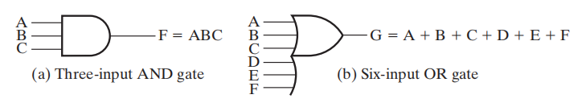
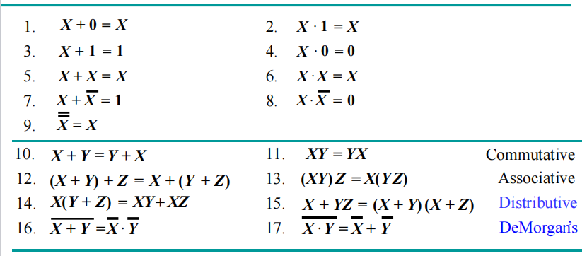
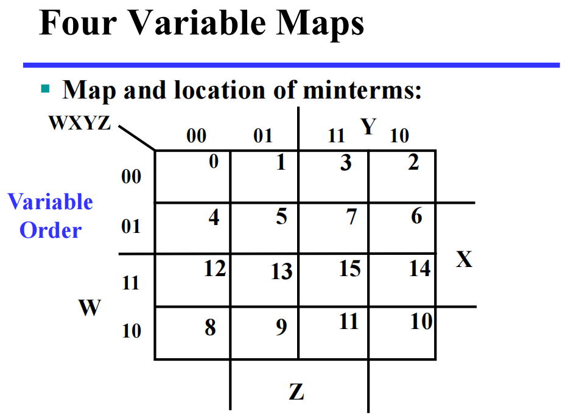
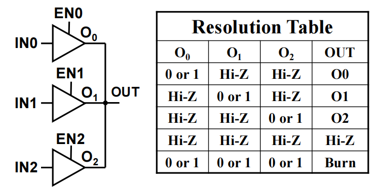
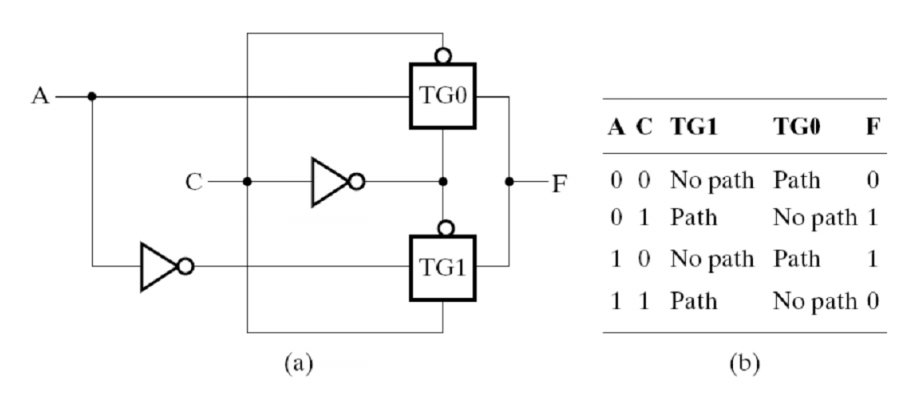

# Chap 2 Combinational Logic Circuit

## Gate Circuit and Boolean Equations

### Binary Logic and Gates

+ **二进制变量(binary variables)** 取0和1中任意一个值，可以用单个字符表示(本章大部分内容)，也可以用有意义的单词表示(后续章节)

+ **逻辑运算符(logical operators)** 在二进制值和二进制变量上运算。基本的逻辑运算符包括逻辑**与(AND)**，**或(OR)** 和**非(NOT)**
	+ **AND**：记作($\cdot$)或($\times$)
	+ **OR**：记作($+$)
	+ **NOT(inverter)**，记作($\overline{ }$)(用在上面)，($'$)(用在后面)或($\sim$)(用在前面)

+ **真值表(truth tables)**：一张列出一个函数关于所有可能的参数组合的值的表格

### Logic Gates

**逻辑门(logic gates)**：执行逻辑函数

>背景：
>+ 在早期的计算机中，开关的开闭通过由**中继器(relay)** 通电的线圈产生的磁场实现。这些开关轮流开闭电路。
>+ 之后，**真空管(vacuum tubes)** 通过电子方式的开闭，取代了中继器
>+ 现在，**晶体管(transistors)** 用来作为电子开关。逻辑门通过双极晶体管(bi-polar junction transistors, BJT)实现
>

逻辑门的类型：

#### Basic Logic Gates

基本逻辑门的符号表示：

*时序图(timing diagram)* 表示：

逻辑门可以有不止两个的输入脚：

#### Universal Logic Gates

一种能够实现所有可能的布尔函数的门类型被称为**通用门(universal gate)**，这种门是*功能完全的(functionally complete)*。上面的*与非门(NAND)* 和*或非门(NOR)* 便是通用门。

#### Other Logic Gates

>注：这里不做阐释，本章最后部分会讲到

---
逻辑图和表达式的类型：
+ 真值表
+ 布尔方程
+ 逻辑图
+ 波形图
>注：
>+ 这4种方法可以用相同的布尔函数表示
>+ 真值表和波形图是唯一的，而布尔方程和逻辑图并不是唯一的，这为实现函数提供一定的灵活性
---

### Boolean Algebra

**代数结构(algebraic structure)**(由两个元素的集合$B = \{0, 1\}$，以及三种运算符$+, \cdot, \overline{}$构成) 满足下列基本恒等式([[Chap 1 The Foundations--Logic and Proofs#^cacfc2|dm]]里也有)
🌟

>重点记住蓝字那两行，它们很有用但不好记

**相等**——对于$F_1 = f_1(X_1, X_2, \dots, X_n)$ 和 $F_2 = f_2(X_1, X_2, \dots, X_n)$，如果任何输入值能产生相同的输出$F_1$和$F_2$，那么我们可以说布尔函数$F_1 = F_2$​

#### Precedence

1. 括号
2. NOT
3. AND
4. OR

#### Duality Rules

布尔代数表达式的**对偶(dual)** 可以通过以下步骤得到：
+ AND $\Leftrightarrow$ OR(互换)
+ $0 \Leftrightarrow 1$(互换)
+ 变量保持不变
除非出现**自对偶(self-dual)**，一个表达式的对偶 $\ne$ 它自身

🌰：$F = (A + \overline{C}) \cdot B + 0$ 的对偶为 $(A \cdot \overline{C} + B) \cdot 1$

性质：
+ 如果$G$是$F$的对偶，反之亦然，即$F' = G, G' = F$
+ 如果两个函数相等，即$F = G$，则它们的对偶函数也相等，即$F' = G'$

#### Complementing Functions

对于逻辑函数$F$，通过以下步骤得到它的**反函数(inverse function)**$\overline{F}$：
+ AND $\Leftrightarrow$ OR(互换)
+ 对每一个**常变量**和**字面量***取补*
我们通常使用==德摩根定理(DeMorgan's Theorem)==来实现上述步骤

#### Substitution Rules

对于布尔方程中的某个变量$A$，如果用别的逻辑函数$F$来代替所有的$A$，则该布尔方程依然成立

#### Useful Theorems

+ 最小化：$x \cdot y + \overline{x} \cdot y = y \quad (x + y)(\overline{x} + y) = y$
+ 吸收：$x + x \cdot y = x \quad x \cdot (x + y) = x$
+ 简化：$x + \overline{x} \cdot y = x + y \quad x \cdot (\overline{x} + y) = x \cdot y$
+ **一致性(consensus)定理**：
$$
x \cdot y + \overline{x} \cdot z + y \cdot z = x \cdot y + \overline{x} \cdot z \quad (x + y)\cdot(\overline{x} + z) \cdot (y + z) = (x + y)\cdot (\overline{x} + z)
$$
---
>常见题型：
>+ 证明恒等式
>+ 简化布尔方程：使得字面量(包括所有未取补和取补的)的数量最小

### Standard Forms

^214fa6

我们在运算布尔函数时会遇到以下问题：
+ 证明布尔函数：布尔函数不是唯一的
+ 表达式的简化：可能要用到的恒等式或定理太多了，而且需要掌握一些技巧

解决方案

流程图中的中间步骤用到了**范式(Canonical form)**，它具有以下优点：
+ 与真值表直接对应
+ 容易比较布尔函数的等价关系
+ 为函数的优化提供良好开端
两种常见类型：
+ **最小项之和(sum of minterms, SOM)** ^3f6dc3
+ **最大项之积(product of maxterms, POM)**
> 注：[[Chap 1 The Foundations--Logic and Proofs#^e1accd|dm讲到过类似的概念]]

#### Minterms and Maxterms

+ **最小项(minterms)** 是所有变量(不论是本身$X$还是取补$\overline{X}$)的==与(AND)==。
	+ 如果有n个变量，则有$2^n$个最小项
	+ 对于每个最小项，只有一种输入使得它的值为1，其余输入对应的输出均为0
	+ 一般用$m_i$表示最小项，其中$i$指的是第$i$种输入组合
	
+ **最大项(maxterms)** 是所有变量(不论是本身$X$还是取补$\overline{X}$)的==或(OR)==。
	+ 如果有n个变量，则有$2^n$个最大项
	+ 对于每个最大项，只有一种输入使得它的值为0，其余输入对应的输出均为1
	+ 一般用$M_i$表示最大项，其中$i$指的是第$i$种输入组合
	

> 注：
> + 最小项和最大项的**下标(subscript)** 表示一种二进制的排序方式，它能够反映在*标准顺序(standard order)*(通常是按字母表顺序)下的某种输入组合
> + 最小项和最大项的**索引(index)** 用二进制数0和1表示，它能够反映每个变量在最小/大项中是以正常形式$X$还是以补形式$\overline{X}$存在
> 	+ 最小项：‘1’表示不取补，‘0’表示取补
> 	+ 最大项：‘0’表示不取补，‘1’表示取补
> 	🌰：当索引 = 6时，$m_6 = XY\overline{Z},\ M_6 = (\overline{X} + \overline{Y} + Z)$

最大项与最小项之间的关系：$M_i$和$m_i$互为对方的**补**，即$M_i = \overline{m_i}$ 且 $m_i = \overline{M_i}$

#### SOM and POM

根据最小项和最大项的第2条特点，我们可以得到：
+ 任何函数都可以用==值为1的最小项的或==来表示，这种函数被称为**最小项函数(minterm function)**
+ 任何函数都可以用==值为0的最大项的与==来表示，这种函数被称为**最大项函数(maxterm function)**
因此，我们可以分别得到两种范式：**最小项之和(SOM)** 与**最大项之积(POM)**

一般函数 $\Rightarrow$ SOM：将原来函数中所有的项扩展至包含全部变量的项，即：对于某个项，只要它缺少某个变量$v$，就将$(v + \overline{v})$和该项进行**与**运算。
🌰： ^e31fcb
$$
\begin{align}
F(A,B,C) &= A + \overline{B}C \\
& = A(B + \overline{B})(C + \overline{C}) + (A + \overline{A})\overline{B}C \\
& = \dots \\
& = ABC + AB\overline{C} + A\overline{B}C + A\overline{BC} + \overline{AB}C \\
& = m_7 + m_6 + m_5 + m_4 + m_1 \\
& = \sum m(1,4,5,6,7)
\end{align}
$$
---
一般函数 $\Rightarrow$ POM：将原来函数中所有的项扩展至包含全部变量的项
+ 先试用第二条**分配律**：$X + YZ = (X + Y)(X + Z)$
+ 对于该项，只要它缺少某个变量$v$，就将$v \cdot \overline{v}$和该项进行**或**运算
+ 然后再用分配律化简
🌰：
$$
\begin{align}
F(A, B, C) & = A\overline{C} + BC + \overline{AB} \\ 
& = (A\overline{C} + BC + \overline{A})(A\overline{C} + BC + \overline{B}) \\
& = (\overline{C} + BC + \overline{A})(A\overline{C} + C + \overline{B}) \\
& = (\overline{C} + B + \overline{A})(A + C + \overline{B}) \\
& = \prod M(2, 5)
\end{align}
$$

SOM或POM可以通过**两级逻辑(two-level logic)** 来实现。对于$n$个变量的SOM，第1级采用$n$输入与门，第2级采用一个或门

>注：我们==一般使用SOM==，POM很少使用

#### Conversion

如何得到(SOM形式的)函数$F$的补$\overline{F}$：
+ 挑选最小项为0的项(即$F$中未出现的最小项)，取它们的SOM
+ 或者挑选最小项为1的项(即$F$中出现过的最小项)，取它们的POM
🌰：$F = \sum m(1, 3, 5, 7), \quad \overline{F} = \sum m(0, 2, 4, 6) = \prod M(1, 3, 5, 7)$

SOM $\Leftrightarrow$ POM：取两次补函数。以SOM形式的函数为例，第一次取补改变最小项的下标(取补方法1)，第二次取补改变为POM的形式(取补方法2)，因此
$$
F(x_1,\dots,x_n) = \sum\limits_{0 \le i \le 2^n - 1} m_i = \prod_{0 \le j \ne i\le 2^n - 1} M_j
$$

#### Standard Forms

范式虽然基本且容易得到，但它不常用，因为每个最小项和最大项都需要包含所有$n$个变量，这在实际运用中不太现实，因此我们采用另一种方法——**标准形式(standard form)**，它的每一项可以包含一个或多个变量。它具有以下形式：
+ **标准积之和(standard sum-of-products, SOP)**：与项的或 ^2bdc1c
+ **标准和之积(standard product-of-sums, POS)**：或项的与

🌰辨别：
+ SOP：$ABC +\overline{AB}C + B$
+ POS：$(A + B) \cdot (A + \overline{B} + \overline{C}) \cdot C$
+ 两者都不是：$(AB + C)(A + C),\ AB\overline{C} + AC(A + B)$

回到上面的[[Chap 2 Combinational Logic Circuit#^e31fcb|例子]]，将过程倒过来便将函数(SOM)转化为SOP的形式。不难发现，我们大幅简化了布尔函数，而且实现上也变得更加简单：

## Circuit Optimization

优化(optimization)的目标：得到对于某个给定函数的最简实现

### Tow-Level Optimization

#### Cost Criteria

从==布尔方程==的角度看：
+ **字面量成本(literal costs)**：所有字面量出现的次数(相同的字面量出现$n$次，也计$n$次)
>注：**字面量(literal)** 指*单个变量*(不论有没有取反)
+ **门输入成本(gate input costs)**：所有门的输入个数
	+ G：不计算非门
	+ GN：计算**非门**
>注：由于门输入成本与所用晶体管和导线数量成正比，因此它是一种很好的测量方式

从==门电路实现==的角度看：
+ 字面量L：计算所有与门的输入和或门中单变量输入的个数
+ G：加上剩余的或门输入
+ GN：加上非门的输入
特殊情况：
+ **三态门**：有**两个**输入脚
+ **传输门**：看似有多个脚，实则只计算**一个脚**

🌰

### Map Manipulation

**卡诺图(Karnaugh maps, K-map)** 由一组方块构成：
+ 每个方块代表**最小/大项**
+ 布尔函数的结果从真值表转移到一张二维的K-map上
+ <u>相邻的方块仅相差一个变量</u>（方块按照**格雷码**的顺序排列）
+ 通过识别方块的图案，将布尔函数转化为另一种形式的等价函数

优点：简单不易错，不用记那些繁琐的定理来化简，相较于代数方法化简所需步骤更少
缺点：仅限于少量变量(2-5个)，结果不唯一

应用：
+ 找到最优或近似最优解
+ 将简化布尔表达式的过程可视化
+ 在计算机辅助设计(CAD)用于化简大型电路

使用K-map简化的步骤：
+ 找到最小或最大项
+ 用最小/大项填充K-map，其中==最小项填1==，最大项填0
+ 用矩形圈出包括==2的次幂个==全都是1(SOP)的方块（相当于SOP中的积项），且确保矩形**尽可能的大**，矩形之间可以重叠
>POS则找全都是0的方块(和项)
+ 从这些圈中得到简化的表达式。
	+ SOP：找到乘积项并将它们相加
	+ POS：找到和项并将它们相乘

详细阐释：
1. 双变量
	
2. 三变量
	观察到K-map的方块通过格雷码编址
	
	+ 一个方块代表三个变量的最小项
	+ 两个相邻方块代表两个变量构成的积项
	+ 四个相邻方块代表一个变量
	+ 八个方块 = 1
	
	有些方块看似不相邻，但如果采用“按对相邻环(pairwise adjacent ring)”的概念，将K-map“**弯曲**”起来，形成一个圆柱，那么两边的方块就会形成相邻的关系。这样的相邻也可以用来化简
	
	
	🌰
	
	
3. 四变量
	
	+ 1个方块 = 4变量积项(最小项)
	+ 2个方块 = 3变量积项
	+ 4个方块 = 2变量积项
	+ 8个方块 = 1变量积项
	+ 16个方块 = 1
	
	四变量K-map的两侧和上下也认为是“相邻”的——可以将K-map弯曲成一个甜甜圈状的物体：
	

4. 五变量
	

#### Don't-Care

有时某个函数出现这样的情况：
+ 最小项对应的输入从未出现过
+ 最小项对应的输出从未用过
这样的输出值我们并不关心，因此用$\times$代表Don't-Cares，既可以看作1，也可以看作0。在SOP化简中，我们可以把$\times$看作"1"，这样可以形成更大面积的主蕴含项，有助于化简，降低逻辑电路成本。

🌰：
1. BCD码中，我们只用到0-9十个数字，1010-1111我们不用，因此它们在K-map上对应的输出我们用$\times$表示
2. 
3. 独热码：

#### Systematic Simplication

+ **蕴含项(implicant)**：SOP的积项或POS的和项，包含$2^k(k \in [0, n])$个相邻方块
+ **主蕴含项(prime implicant)**：结合尽可能多的$2^k(k \in [0, n])$个相邻方块的积项
+ **质主蕴含项(essential prime implicant)**：至少包含1个==没有被其他主蕴含项包括在内的最小项==的主蕴含项

>注：对于*周期布尔函数(cyclic Boolean function)*，它的K-map是没有质主蕴含项的
>

> 解题技巧：
> + 以$n$变量卡诺图为例，先找包含$2^{n - 1}$项的主蕴含项，再找包含$2^{n - 2}$项的主蕴含项，$\dots$，以此类推
> + 先（用*不同颜色的笔*）**框出**所有的主蕴含项，然后再**找变量化简**为布尔函数

🌰

### Multiple-Level Circuit Optimization

多级电路相较于两级电路(SOP 和 POS)，它==减少了输入的成本==

## Additional Gates and Circuit
### Other Gate Types
🌟简单门电路表(简单、快捷)

> 注：
> 1. 比较**与门**和**三态门(3-State Buffer)**：与门的输出F不能与其他门的输出相连，而三态缓冲器可以
> 2. **Hi-Z**意思是**高阻抗**的状态，此时既非高电平，亦非低电平

 **缓冲器(Buffer)** 看起来只起到连接作用，实际上它起到提升电压，增加电路运算的速度的作用

#### NAND and NOR Gates

**与非门(NAND Gate)**：

$$
F = \overline{XYZ} = \overline{X} + \overline{Y} + \overline{Z}
$$

**或非门(NOR Gate)**：

$$
F = \overline{X + Y +Z} = \overline{X} \cdot \overline{Y} \cdot \overline{Z}
$$
与非门、或非门都是一种*通用门(Universal gate)*，即可以用来执行任何布尔函数的门。通过CMOS技术很自然地实现与非门的功能。

❗复杂门电路表(低成本、传输快)

#### Buffer

**缓冲器(buffer)** 是一个电子放大器，用来提高电压、提升电路运行的速度，它的函数为$F = X$

#### 3-State Buffer

>注：多个门的输出==不能==用线连在一起！！！

**三态门(3-state buffer)** 提供了第三个逻辑值：**高阻抗(Hi-impedance)** 输出**Hi-Z**，即输入和输出之间处于**断路**状态，因此高阻抗状态的门输出可以连在一起。

符号及真值表

+ IN：数据输入
+ **EN：使能控制输入**
+ OUT：数据输出

+ EN = 0 $\rightarrow$ OUT = Hi-Z
+ EN = 1 $\rightarrow$ OUT = IN

三个三态门连在一起：

>注：同一时间==最多只有一个==三态门处于**使能**状态，否则电路就会被烧坏掉

🌰：数据选择电路

+ S = 0 $\rightarrow$ OUT = IN0
+ S = 1 $\rightarrow$ OUT = IN1
>注：不难发现，当一个三态门处于使能状态时，另一个一定处于高阻抗状态，所以不用担心烧坏的情况发生

### Exclusive-OR Operator and Gates

**XOR(异或门)** $X \oplus Y = X \overline{Y} + \overline{X}Y$

**XNOR(同或门)** $\overline{X \oplus Y} = XY + \overline{XY}$
 ^a7ec1f
> 注：XNOR函数即为等价函数，记作$\equiv$

如何实现XOR?
1. 

2. 只用**与非门**构建的异或门电路

应用：加/减/乘法器、计数器、递增器、递减器、奇偶生成器/校验器

>注：严格来说，XOR和XNOR门不能具有<u>两个以上的输入</u>，如果存在这种情况，则它们被**奇函数**和**偶函数**取代

⭐异或恒等式：
$$
X \oplus 0 = X \quad X \oplus 1 = \overline{X} \quad X \oplus X = 0 \quad X \oplus \overline{X} = 1
$$
$$
X \oplus Y = Y \oplus X \quad (X \oplus Y) \oplus Z = X \oplus (Y \oplus Z) = X \oplus Y \oplus Z
$$

#### Odd and Even Functions

三个变量以上的异或函数称为**奇函数(odd function)**：
$$X \oplus Y \oplus Z = \overline{XY}Z + \overline{X}Y\overline{Z} + X \overline{YZ} + XYZ$$
奇函数的补为**偶函数(even function)**

奇函数和偶函数在K-map上的布局呈棋盘布局

不难看出：
+ **奇函数**的1出现在对应拥有**奇数个1的索引**的最小项上
+ **偶函数**的1出现在对应拥有**偶数个1的索引**的最小项上

对于多个变量的异或，我们采用**树状结构(tree)**，将几个异或门连在一起

#### Parity Generators and Checkers

回顾知识：[[Chap 1 Digital Systems and Information#^79ab41|奇偶校验位]]

大致原理：
+ 偶校验码：使用奇函数生成和校验
+ 奇校验码：使用偶函数生成和校验 

3位码偶校验生成器+检查器

## Gate Propagation Delay

### Gate Delay

在实际的物理门中，当提供输入时，输出不会立马随之发生改变，这说明输入的变化和输出的变化之间存在延迟，这被称为**门延迟(gate delay)

## Appendix

### Shannon Formula
$$
\text{Extension of }X \cdot \bar{X} \text{ and } X \cdot \bar{X} = X
$$
$$
x \cdot f(x, \bar{x}, y, \dots, z) = x \cdot f(1, 0, y, \dots, z) 
$$
$$
\bar{x} \cdot f(x, \bar{x}, y, \dots, z) = \bar{x} \cdot f(0, 1, y, \dots, z)
$$
$$
\text{Extension of }A + \bar{A} = 1 \text{ ,}A +A\bar{B} = A + B \text{ and } A + AB = A
$$
$$
x + f(x, \bar{x}, y, \dots, z) = x + f(0, 1, y, \dots, z) 
$$
$$
\bar{x} + f(x, \bar{x}, y, \dots, z) = \bar{x} + f(1, 0, y, \dots, z) 
$$

Shannon Expansion:
$$
\text{These formulas are derived from four formulas above}
$$
$$
f(x, \bar{x}, y, \dots, z) = xf(1, 0, y, \dots, z) +\bar{x}f(0, 1, y, \dots, z) 
$$
$$
f(x, \bar{x}, y, \dots, z) = [x +f(0, 1, y, \dots, z)]\cdot [\bar{x} + f(1, 0, y, \dots, z)]
$$

### Transmission Gate

