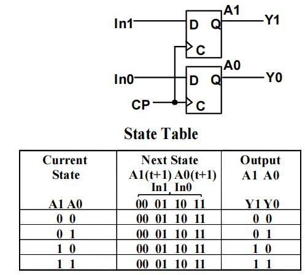
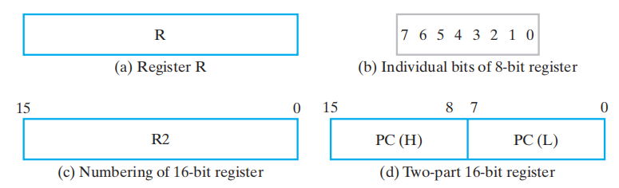
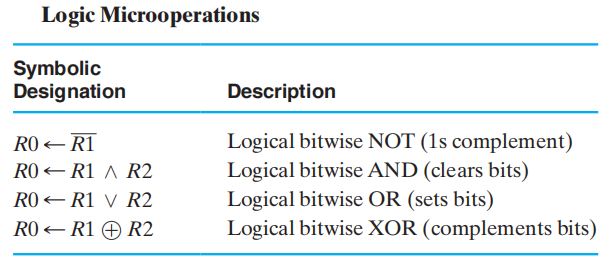
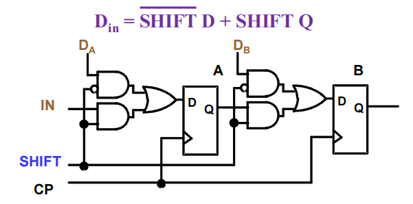
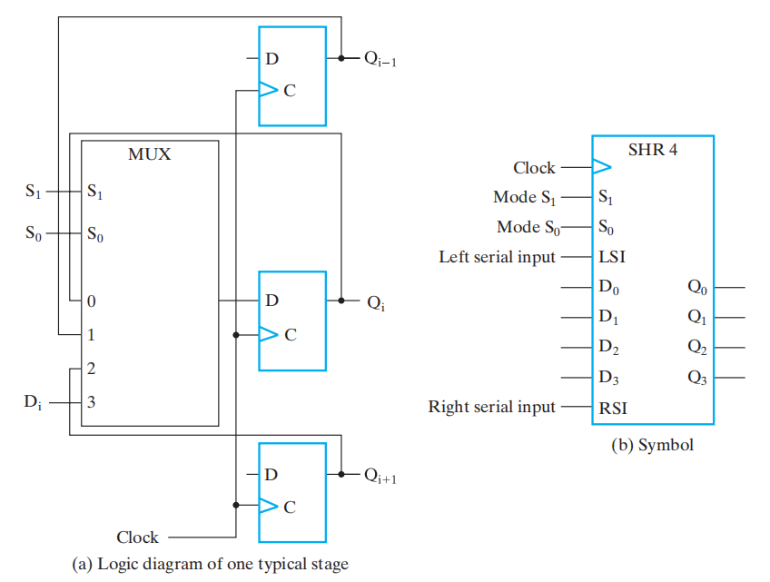
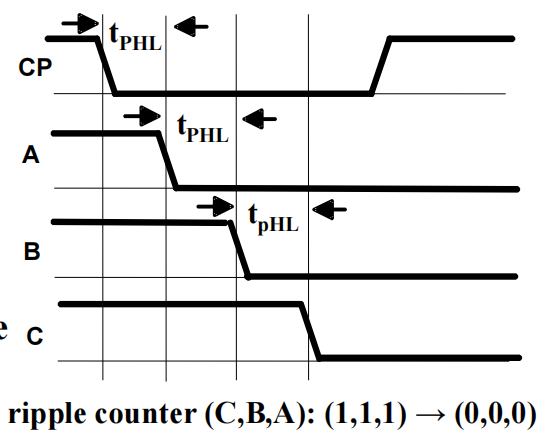
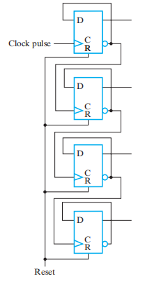
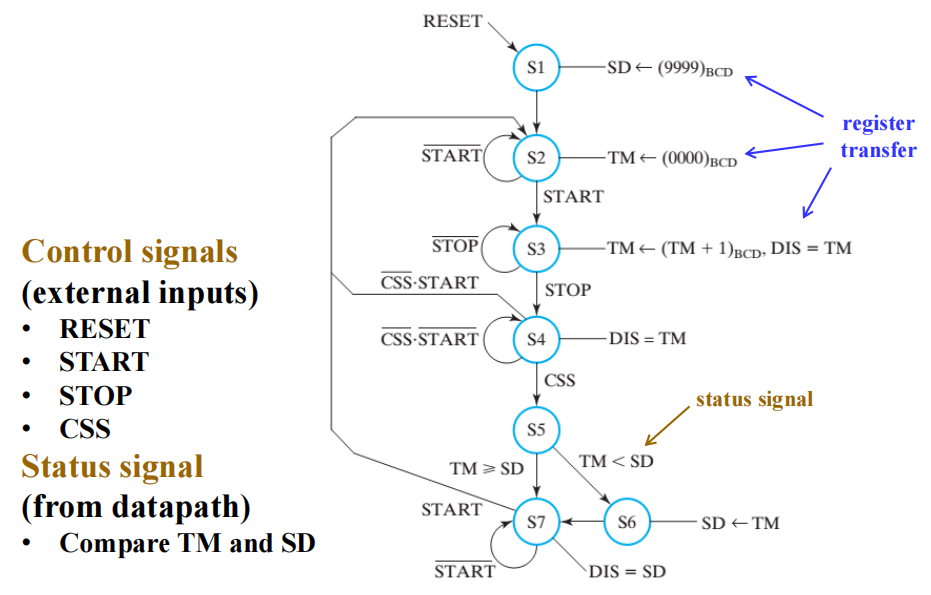
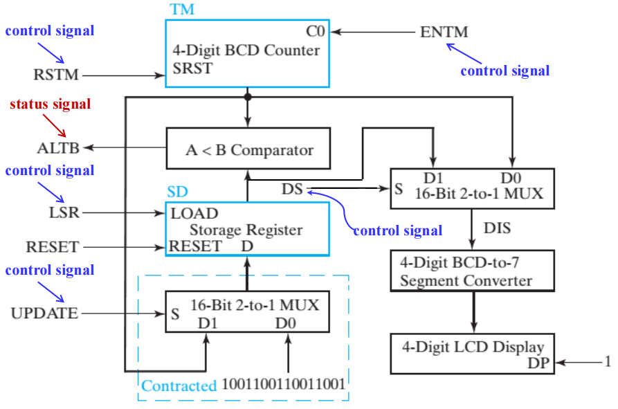
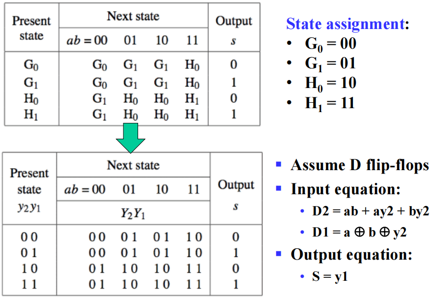

# Chap 6 Registers and Register Transfers

## Registers and Load Enable

>当n很大时，状态和输入组合的数量将随之变大，此时用状态图/状态表模型的表示就不太现实了。所以，我们用**寄存器传输层级(Register Transfer Level, RTL)** 设计模型来描述复杂电路的大量状态。在RTL设计方法中，通过不同类型的寄存器和组合电路来构建基本块，实现时序逻辑电路的设计。
>
>大型数字系统的设计往往采用*模块化(modular)*、*分层(hierarchical)* 的方法，将系统划分为一些子系统或模块，包括寄存器、计数器、译码器、多路复用器、总线、算术元件、触发器和基本门等。

n位**寄存器(register)** 由一组*触发器*和*组合逻辑门*构成，决定新的或改变过的数据是否要传输至触发器
+ n位触发器*保持数据*，或者存储二进制向量值
+ 组合逻辑门*执行数据加工*任务

**计数器(counter)**：一种在应用时钟脉冲的情况下，扫描包含状态的序列的寄存器(?翻译的不太好)

寄存器和计数器都是**时序函数块(sequential functional blocks)**
+ 寄存器主要用于存储和操纵信息
+ 计数器主要用于序列和控制操作

🌰：
1. 简单的2位寄存器
2. 4位寄存器
>注：这里多了一个*清除输入*$\overline{Clear}$，用于在正式运行前的初始化(寄存器的所有值均置0)，当$\overline{Clear} = 0$时，对触发器进行异步的复位。在正常运行时，$\overline{Clear}$应保持1，除非需要复位。这个输入是可选的

现实情况：D触发器寄存器能在每个时钟周期里*加载(loading)* 信息
>加载(loading)：将新的信息传输至寄存器内。如果寄存器的所有位同时加载，称加载是*并行*完成的

寄存器的符号：
>注：由于Clear写在方框内部，且外部有个圆圈，因此Clear没有取反；但如果Clear写在外面，就需要写成$\overline{Clear}$

观察：
+ 寄存器能*存储*多时钟周期的信息
+ 为了“*存储*”或”*加载*“信息，寄存器需要被*控制信号*控制

实现方法：
+ 用一个信号来*阻止*寄存器的*时钟输入* 👉[[Chap 6 Registers and  Register Transfers#Registers with Clock Gating|传送门]]
+ 用一个信号，将寄存器的输出*反馈*至它的输入👉[[Chap 6 Registers and  Register Transfers#Registers with Load-Controlled Feedback|传送门]]

**负载(load)**：控制寄存器的存储和加载的信号：
+ load = 1：*加载*数据输入的值
+ load = 0：将值*存储*至寄存器内

### Registers with Clock Gating

>主时钟生成器(master clock generator)：提供一系列的时钟脉冲，应用于所有触发器和寄存器

引入*加载(Load)* 信号对时钟信号进行使能操作：
+ $Load = 0$：*允许*时钟信号
+ $Load = 1$：*阻止*时钟信号 

**门控时钟(clock gating)**：通过逻辑门，对寄存器的时钟进行开关操作
>注：
>+ 对于公式$C = Clock + \overline{Load}$
>	+ 当$Load = 0$时，$C = 1$，时钟信号就失去控制作用了
>	+ 当$Load = 1$时，$C = Clock$，时钟信号发挥作用
>+ 可能的问题：门的使用产生不同的传播延迟，从而导致**时钟偏差(time skew)** 的产生——在同步时序电路中，相同的源时钟信号在不同的时间里到达不同的元件中。因此，我们采用下面的方法避免这个问题👇

### Registers with Load-Controlled Feedback

解决方案：
+ 保持时钟的连续运行
+ 选择性地使用*加载控制*，来改变寄存器内的值
电路实现：
>问：为什么触发器的输出到输入间有一条反馈线路？
>答：D触发器没有保持输出不变的输入条件。为了实现保持，需要让输入值等于当前的输出值，因此便有了上面的电路，称为**带使能的D触发器(D flip-flop with enable)**。这种方法避免了时钟偏差，所以更推荐这个方案。

🌰：带有*并行加载*的4位寄存器
+ $Load = 0$，保持当前的值
+ $Load = 1$，加载新的值
>注：硬件往往比门控时钟更复杂，。。

### Datapath and Control Signals

+ **数据通路(datapath)** 是执行数据加工操作(寄存器传输和微操作)的一组函数单元(比如ALU, MUX)，寄存器和总线
+ **控制单元(control unit)** 产生控制信号，告诉数据通路要做什么(决定操作序列)

>[!note]
>+ *控制信号(control signal)*：用来激活各种数据加工操作的信号
>+ 数据通路和控制单元也和数字系统的其他部分相互连接，比如内存和I/O（图中已标出）

## Register Transfer Operations

**寄存器传输操作(register transfer operations)**：对存储于寄存器内的数据进行移动和加工操作，它由以下部分组成：
+ 一组*寄存器*
+ 对于存储于寄存器的数据进行基本*操作(operations)*——*微操作(microoperations)*：加载(load)、计数(count)、移位(shift)、加(add)、按位或(bitwise OR)……
+ *控制*操作，监督系统的操作序列
>**微操作(microoperation)**：通常在一个时钟周期内处理位向量(数组)。微操作的结果要么用来改变寄存器内原来的值；要么被传到另一个寄存器，而不会改变原先的数据

寄存器传输语言(register transfer language, RTL)

寄存器传输的基本符号：
>[!note]
>+ 特殊意义的字母：
>	+ AR：地址寄存器(address register)
>	+ PC：程序计数器(program counter)
>	+ IR：命令寄存器(instruction register)
>+ n位寄存器，标号为0~n-1，默认0标在最右边，从右往左标号，这种顺序称为*小端序(little-endian)*，相反的顺序(即0在最左边，从左往右标号)称为*大端序(big-endian)*
>+ 看到上方图(d)：我们用L表示低阶字节0~7，用H表示高阶字节8~15。PC(L)可以写成PC(7:0)，PC(H)可以写成PC(15:8)
>+ R1 $\leftarrow$ R2表示将R2的<u>副本值</u>传输给R1，其中R2被称为*源(source)*，R1被称为*目的地(destination)*
>+ 时钟不会出现在寄存器传输操作中

**条件传输(conditional transfer)**

If (K1 = 1) then (R2 $\leftarrow$ R1) 可以简记为：
$$
K1: (R2 \leftarrow R1)
$$
其中K1为控制变量，具体说明微操作的条件执行

图示：

而$K3: R2 \leftarrow R1, R1 \leftarrow R2$ 表示同时*交换*R1和R2的值

RTL, VHDL和Verilog的寄存器传输符号

## Microoperations

**微操作(microoperation)** 的4种类型：
+ *传输(transfer)*：将数据从某个寄存器移到另一个
+ *算术(arithmetic)*：对存储器内的数据执行算术运算
	+ 加法 +
	+ 减法 -（一般用补码实现，具体操作见[[Chap 3 Combinational Logical Design#Unsigned 2's Complement Subtraction|这里]]）
	+ 乘法 *
	+ 除法 /
+ *逻辑(logic)*：操纵数据，或者执行按位逻辑运算
	+ 逻辑或 $\vee$
	+ 逻辑与 $\wedge$
	+ 逻辑异或 $\oplus$
	+ 非 $\overline{}$
+ *移位(shift)*：对寄存器内的数据进行移位

🌰：
+ 算术微操作

>注：关注第2,3行(反码、补码的表示)

+  逻辑微操作

>注：对于n位的寄存器，一个逻辑微操作需要的门的数量为n个

🌰：
1. 
$$
(K1 + K2):\ R1 \leftarrow R1 \vee R3
$$
>注：
>+ 条件中出现的'+'表示“或”运算
>+ 而$R1 \leftarrow R1 + R3$ 中的‘+’表示“加法”微操作
>+ 用“$\vee$”表示“或”微操作

2. 逻辑微操作实现掩码(mask)功能：
	+ 逻辑与：
		可以发现我们仅保留了R1的低位部分，高位部分均变成0
	 + 逻辑或：
		可以发现我们仅保留了R1的低位部分，高位部分均变成1
	 + 逻辑异或：可以发现R1的低位部分得到保留，而高位部分全部取反

+ 移位微操作

>注：
>+ ⭐具体实现方式请[[Chap 6 Registers and  Register Transfers#Shift Registers|移步]]
>+ 移位往往用到“*0填充(zero fill)*”：左移-右边补0，右移-左边补0。这样的位称为**进入位(incoming bit)**
>+ 移出去的位一般就抛弃掉，这种位称为**移出位(outgoing bit)**
>+ 有时，需要用1个单独的触发器提供要移位的数据，或者获取移位后的数据
>+ 还有更复杂的移位（翻转，算术运算……）（见Chap 9）
>+ 还可以实现多个位的移动，如果通过1个变量指定移动的位数，称该变量为*移位量(shift amount)*

### Control Expressions

某个运算的**控制表达式(control expression)** 具体说明了运算的逻辑条件：
+ if 控制表达式 == 逻辑‘1’ $\rightarrow$ 执行运算
+ if 控制表达式 == 逻辑‘0’ $\rightarrow$ 不执行运算

🌰：加法/减法器（运算结果赋给R1）
$$
\begin{align}
\overline{X} \cdot K1: & R1 \leftarrow R1 + R2 \\
X \cdot K1: & R1 \leftarrow R1 + \overline{R2} + 1
\end{align}
$$
>注：$X$决定运算模式(0：加法，1：减法)，$K1$为使能信号

电路实现：

>注：**溢出(即最高位的进位)** 输出会被传输到V中(一个触发器)(前提是K1 = 1)

## Register Transfer Structures

类别：
+ **基于多路选择器的传输(multiplexer-based transfer)**：由寄存器的专有(dedicated)MUX，从多个输入中进行挑选
+ **基于总线的传输(bus-based transfer)**：由一个共用的MUX(它驱动一条向多个寄存器提供输入的总线)从多个输入中进行挑选
+ **三态总线(three-state bus)**：由一个三态门驱动器(其输出与供给多个寄存器的总线相连接)从多个输入中进行挑选
+ 其他传输结构：使用多个MUX，多条总线，或者上述类别的组合

### Multiplexer-Based Transfers

🌰：
传输为：
$$
K1: R0 \leftarrow R1 \quad K2\overline{K1}: R0 \leftarrow R2
$$
框图：

更详细的逻辑图：

### Bus-Based Transfers

基于总线的寄存器包括：
+ 寄存器的**专用多路选择器(multiplexer dedicated to ...)**
+ **总线(bus)**：寄存器的共享传输路径
+ 总线实现要用到：
	+ 多路选择器
	+ 三态门

在多数情况下，位的个数 = 接收寄存器的长度？

#### Dedicated MUX-Based Transfers

>注：
>+ 这是一种非常灵活的传输结构
>+ 能够实现同步传输
>+ 18个门输入 / 位 + 3个来自3个共享非门的输入

#### Multiplexer Bus

>注：
>+ 由一个多路复用器驱动的单个总线，相比专用MUX减少了成本，但是限制了可用的传输
>+ 能够实现同步传输
>+ 8输入共享译码器 + 9个门输入 / 位

理解专用MUX和总线的区别：

#### Three-State Bus

>注：
>+ 用三态门替代3输入MUX，进一步减少成本，但传输还是受限的
>+ 能够实现同步传输
>+ 9个门输入
>+ 这里的符号可以进一步简化：
>
>所以变成了：

## Methods for Sequential Circuit Design

时序电路设计的两种方法：
+ **基本设计方法**：将*触发器*和*逻辑门*作为基本的构建模块
+ **寄存器传输层级(register transfer level, RTL)设计**：将不同类型的*寄存器*(e.g. 计数器，移位寄存器)和*函数块*(e.g. MUX, 加法器)作为基本的构建模块
>注：RTL设计是一种数据流方法——能够将数据从一个寄存器传到另一个

比较：

| Basic Design  | RTL Design               |
| ------------- | ------------------------ |
| 基本构建块为逻辑门和触发器 | 基本构建块为寄存器和函数块            |
| 本质上更加机械化      | 更贴合行为描述，更加符合直觉(建立了数据流模型) |
| 仅适用于状态数量少的电路  | 能够实现具有大量状态的复杂电路          |

## Shift Registers

**移位寄存器(shift register)** 能将数据向MSB或LSB的位置移动

### Serial Shift Register

在最简单的情况中，移位寄存器仅有一组按行排列连接起来的*D触发器*构成：

+ **串行输入/右移输入(serial input/ shift right input)**——数据输入
+ **串行输出(serial output)**——数据输出
+ **并行输出(parallel output)**——向量(A, B, C, Out)

符号：

行为表：

+ T0：第1个时钟脉冲发生前，寄存器的状态
+ T1：第1个时钟后，第2个时钟前的状态
+ 最初的未知状态用“?”表示

### Parallel Load Shift Registers

在寄存器之间添加MUX，使得数据能够被移位或被加载
+ 如果SHIFT处于*低*电平，A和B的数据被$D_A$和$D_B$上的数据代替
+ 如果SHIFT处于*高*电平，执行移位操作
通过添加更多的位，我们能够构建n位**并行负载移位寄存器(parallel load shift registers)**

🌰：

功能表：

>注：这种移位寄存器具有*保持*操作

### Shift Registers with Additional Functions

通过在每个移位寄存器里的D触发器前面放置一个4输入MUX，我们可以实现一个具备*右移*、*左移*、*并行加载*、*保持*功能的电路

功能表：

## Counters

**计数器(counter)** 是一种时序电路，它在特定的状态序列中进行计数，能够向上数、向下数等等

两种常见类型：
+ **异步计数器/行波计数器(asynchronous counters/ripple counters)**
	+ 对于表示最低位的触发器，它的时钟输入与时钟相连
	+ 对于表示其他位的触发器，它们的输出与时钟输入相连，因此电路不是同步的
	+ 当逐位接近最高位时，输出发生改变的延迟将会越来越大
	+ 优点：低能耗
+ **同步计数器(synchronous counters)**
	+ 时钟与触发器的时钟输入直接相连
	+ 用逻辑实现想要的状态序列

### Ripple Counters

工作流程：
+ 当触发器A的时钟输入出现正边沿时，A取补
+ 触发器B的时钟输入是触发器A的输出的补
+ 当触发器A的输出从1 $\rightarrow$ 0时，触发器B的时钟输入就会出现正边沿，导致B取补
下面的时序图更加直观地展示上述内容：

>注：
>+ 蓝绿色箭头表示“工作流程”所述的因果关系
>+ 对应的状态序列(B, A) = (0, 0), (0, 1), (1, 0), (1, 1), (0, 0), (0, 1)……

>[!note]
>这种电路之所以成为行波计数器，是因为每次边沿的变化（这里是正边沿）都会导致下一个触发器状态的改变。这种变化就像水面的涟漪一样在触发器“链”上传播(每次变化发生于前一阶段的时钟-输出延迟之后)

对于3位行波计数器，当C = B = A = 1时，计数器的状态为(C, B, A) = (1, 1, 1)，下一次时钟的增加使得(C, B, A) = (0, 0, 0)。从下面的时序图中，我们发现：
+ 时钟-输出延迟$t_{PHL}$导致时钟边沿不断增加的延迟
+ 对于n为行波计数器，最坏情况的延迟为$n \cdot t_{PHL}$

🌰：4位行波计数器的框图

### Synchronous Counters

为了消除行波影响，我们让每个触发器使用共同的时钟，并用一个组合电路来生成下一状态。例如对于升计数器(up-counter)，我们会使用一个**自增器(incrementer)**

内部细节：

+ 内部逻辑：蓝色方框表示[[Chap 3 Combinational Logical Design#^01b3d3|自增器]]
+ **计数使能(count enable, EN)**：迫使与门链的输出均为0，用来保持状态
+ **出进位(carry out, CO)**：自增器的一部分。通过将CO与另一个计数器的EN端连接，构建一个更大的计数器

上图中，与门链导致“进位链(carry chain)”的出现，因而产生较长的通路延迟，这种计数器的形式称为**串行门(serial gating)**

将与门链 $\Rightarrow$ 并列的与门，我们得到了另一种形式——**并行门(parallel gating)**，这种形式减少了通路延迟，类似[[Chap 3 Combinational Logical Design#Carry Lookahead Adder(CLA)|超前进位(carry lookahead)]]。它利用CO和EN来阻止较长的通路。逻辑图如下：

布尔方程：
$$
\begin{align}
C1 & = EN \cdot Q_0 \\
C2 & = EN \cdot Q_0 \cdot Q_1\\
C3 & = EN \cdot Q_0 \cdot Q_1 \cdot Q_2\\
C4 & = EN \cdot Q_0 \cdot Q_1 \cdot Q_2 \cdot Q_3\\
\end{align}
$$
符号：

### Other Counters

+ **降计数器(down counter)**：向下计数
+ **升降计数器(up-down counter)**：既可以向上，也可以向下计数，取决于控制输入的值，比如$Up/\overline{Down}$
+ **并行加载计数器(parallel load counter)**：能够并行加载可用的值，取决于控制输入(比如$Load$)
+ **模n计数器(divide-by-n/ modulo n counter)**：
	+ 对除以n的余数进行计数
	+ 或者对任意n个状态的序列进行计数（根据具体状态分析）
	+ BCD计数器是一个模10计数器

#### Up-Down Binary Counter

🌰：4位升降计数器，有使能输入EN，选择输入S(S = 0时向上数，S = 1时向下数)

输入方程：
$$
\begin{align}
D_{A0} & = Q_0 \oplus EN \\
D_{A1} & = Q_1 \oplus ((Q_0 \cdot \overline{S} + \overline{Q_0} \cdot S) \cdot EN) \\
D_{A2} & = Q_2 \oplus ((Q_0 \cdot Q_1 \cdot\overline{S} + \overline{Q_0} \cdot \overline{Q_1} \cdot S) \cdot EN) \\
D_{A3} & = Q_3 \oplus ((Q_0 \cdot Q_1 \cdot Q_2 \cdot \overline{S} + \overline{Q_0} \cdot \overline{Q_1} \cdot \overline{Q_2} \cdot S) \cdot EN) \\
\end{align}
$$
该方程既能用串行门实现，也能用并行门实现，而这里不给出具体的实现。

#### Counter with Parallel Load

电路实现：

功能表：

>注：可以看到Load的优先级高于Count，因为只要Load = 1，不管Count有什么值，计数器执行加载功能

#### Synchronous BCD

🎯：使用时序逻辑模型来设计带有D触发器的同步BCD计数器

状态表：

>注：10-15(即1010-1111)是我们*不关心(don't care)* 的情况

使用K-maps，对下一状态的方程进行两级优化，得到以下方程：
$$
\begin{align}
D_1 & = \overline{Q_1} \\
D_2 & = Q_2 \oplus Q_1\overline{Q_8} \\
D_4 & = Q_4 \oplus Q_1Q_2 \\
D_8 & = Q_8 \oplus (Q_1Q_8 + Q_1Q_2Q_4) \\
\end{align}
$$

>[!info]
>思考：如果计数器的电源受到干扰，或者受到其他影响，使得计数器的状态不在0000-1001之间，会出现什么问题呢？
>
>$\therefore$ 我们需要让计数器具备“*自愈能力(self-healing ability)*”，使得它能在2个时钟周期内，从异常状态中回到正常状态——利用好那6个“不关心”的状态，可以实现这个“自愈能力”，状态表和状态图如下：

>注：考虑更高要求的自愈能力：
>+ 报错功能：电路需要表明遇到了非法状态。对于上述电路，$Error = Q_8Q_4 + Q_8Q_2$
>+ 在1个时钟周期内，状态从非法回到合法
>+ 从非法状态返回至一个具体的状态(比如0)
>
>这些要求取决于电路的具体应用，或者设计组的政策

---
另一种实现方法：并行加载二进制计数器 + 与门

电路实现：

>注：当计数到1001时，Q0 = Q3 = 1，这使得Load = 1，计数器执行加载功能，将读入D(3: 0)的值，即0000，从而实现0-9之间的计数

#### Counting Modulo N

下列技术将用到带有异步/同步的*清空(clear)*，以及/或者并行*加载(load)* 的n位二进制计数器：
+ ❌在模N计数中，当检测到最后的数*N*时，进行*异步清0*，或者*异步加载值0*。然而，这种方法使得数字仅在很短的时间内出现，导致在某些情况下无法正常工作
+ ✅在模N计数中，当检测到最后的数*N - 1*时，*同步清0*，或者*同步加载值0*
+ 检测最后的数，使用加载功能提前预设值，满足==最后的数 - 预设值 = N - 1==，也就是说计数的范围变成了[预设值，最后的数]。实在看不懂的话见下例中第2种实现方法

🌰：模7计数器

1. 常规实现

>注：原理同BCD计数器，只是它是数到6就要返回0

2. 预设加载值9，当数到14时，由于 14 - 9  =  7 - 1，因此需要回到9，计数范围为$[9, 14]$

电路实现：

>注：
>+ 预设值是在输入D(3: 0)处设置
>+ 对于该计数器，如果最后的数设为了15，那么可以利用进位CO检测该最后的值(这样就省去一个与门了)

3. 只用触发器 + 组合电路

## Register Cell Design

在组合电路中，我们使用迭代阵列实现复杂的组合电路。同样地，我们可以将这种思想运用到时序电路的设计中——将迭代组合电路和触发器相连接，构建一个双态时序电路，称为**寄存器单元(register cell)**。只要我们构建了一个存储器单元，然后复制n份副本，我们就构建出能够执行一个或多个微操作的n位寄存器。

由此，我们得到了寄存器设计的*步骤*：
+ ⭐设计具有代表性的寄存器单元
+ 将这些单元相互连接，构成完整的寄存器
+ 如有必要，对单元应用合适的边界条件，使其有些改变和精简

寄存器单元设计的*方法*：
+ MUX：使用n输入MUX，以及一系列的传输源和函数
	+ **专用逻辑(dedicated logic)**：实现微操作的组合逻辑被视为寄存器的一部分
	+ **共用逻辑(shared logic)**：被多个寄存器共用的，实现微操作的组合逻辑
	+ 通过控制信号$K_0, K_1, \dots, K_{n-1}$的或运算，生成加载使能信号
	+ 如何选择来自源，或/和传输函数？
		+ MUX + 编码器(如图所示)：控制输入需要被编码
		+ n $\times$ 2 与-或门：控制输入不需要被编码
+ [[Chap 4 Sequential Circuits#The Design Procedure|时序电路设计]]
	+ 找到状态图或状态表，注意只有两个状态分配后的状态 = 寄存器单元的输出值
	+ 运用Chap 4 介绍的流程来完成单元设计(点击上方链接跳转)
	+ 优化：K-maps(4-6个变量)、手动优化或计算机辅助(更多的变量)

寄存器单元的*规范*包括：
+ **寄存器函数(register functions)**：一般用寄存器传输表示
+ **控制输入(control input)**
	+ *无编码*形式：比如Load, Shift, Add，1个时钟周期内至多有1个输入为1，即(0, 0, 0), (1, 0, 0), (0, 1, 0), (0, 0, 1)
	+ *编码*形式：比如S1, S0，所有的组合为(00, 01, 10, 11)
+ **数据输入(data input)**

🌰：

法一：MUX
+ 寄存器的加载信号：Load = CX + CY
+ 由于控制输入的数量少，因此不需要用到编码器，我们直接将控制输入与MUX的选择输入连接，得到：S1 = CY, S0 = CX
+ 寄存器的数据输入：
$$
\begin{align}
D1 & = A_i \leftarrow B_i \vee A_i \quad (CY, CX) = (0, 1) \\
D2 & = A_i \leftarrow B_i \oplus A_i \quad (CY, CX) = (1, 0) \\
\end{align}
$$
+ 当Load = 0，即(CX, CY) = (0, 0)时，寄存器A保持状态

电路实现：

单个元件的门成本 = 19，共享译码器的成本 = 8

---
法二：时序电路设计

状态表：

>注：
>+ 4个变量将给出状态表的16个状态项
>+ 因为我们不会用到CX = CY = 1的条件(即don't care conditions)，因此实际上我们只关心12个项

K-map化简：

我们得到SOP方程为：
$$
D_i = CXB_i + CY\overline{A_i}B_i + A_i\overline{B_i} + \overline{CY}A_i
$$
进一步化简(为了减少门成本)，得到：
$$
D_i = CXB_i + A_i \oplus (CYB_i)
$$
门输入成本 = 2 + 8 + 2 + 2 = 14，因此比法一更节省成本。而且由于没用到使能信号，成本将进一步减少

>[!info]
>书上($P_{354-359}$)还有2个寄存器单元设计的例子，均采用时序电路设计的方法（没用到寄存器），值得好好阅读和理解

## Control of Register Transfers

### Introduction to Register Transfer Systems

基本元素：
+ 一组寄存器：大多数是数据通路，部分为控制单元
+ 基本操作(微操作)：寄存器传输
+ 控制：监督寄存器传输序列

### Register Transfer System Design Procedure

+ 写下详细的系统**规范(specification)**
+ 找出所有的*输入信号*(数据、控制、状态)，所有的*输出信号*(数据、控制、状态)，以及*寄存器*的数据通路和控制单元
+ 找出系统的**状态机(state machine diagram)**，包括作为输出的数据通路和控制单元上的*寄存器传输*
+ <u>找出所有的内部控制和状态信号</u>，用这些信号将状态机中的输出条件和行动分开(包括寄存器传输)，并将它们用表格表示出来
+ <u>画出数据通路的框图</u>，包括所有的控制、状态输入和输出；如果包括寄存器传输的硬件，画出控制的框图
+ <u>设计出具体的寄存器传输逻辑</u>，用于数据通路和控制
+ <u>设计控制单元逻辑</u>
+ 验证数据通路和控制单元结合后的操作是否正确，若失败，调试系统并验证改变后的系统，直至符合预期目标

### A Design Example

🌰：Dashwatch（一种简单的停表，时间上限为99.99s）

+ 输入：
	+ START：将时间复位至0，随后开始计时
	+ STOP：停止计时，在4位BCD数码管上显示最近的时间
	+ CSS：比较、存储和显示最小的时间
	+ RESET
+ 输出：4位BCD数码管 + 小数点
+ 寄存器：
	+ 4位BCD计数器(TM)：每隔0.01s向上数
	+ 16位并行加载计时器(SD)：存储最短的时间

所有的输入、输出和寄存器：

*寄存器传输输出*的状态机(摩尔型)

+ S1：复位状态，初始化SD位1001100110011001(99.99)，即最大值
+ S2：紧随S1发生，使TM = $(0000)_{BCD}$
+ S3：计时状态。按下START键后进入计时状态，按下STOP键后退出。在该状态下，T的值在每个时间脉冲内自增1(0.01s，时钟频率 = 100Hz)，DIS显示TM的值
+ S4：决定阶段，从以下3个状态中选择1个：
	+ 比较、存储并显示最短时间
	+ 继续显示TM的值
	+ 重新开始
+ S5：比较TM和SD的值
+ S6：如果TM更小，TM的值被加载至SD内
+ S7：重新开始，并显示SD存储的最短时间

输出控制/状态表：

找出内部控制/状态信号：
+ TM：计时器
	+ 复位至0：RSTM
	+ 向上计数的使能信号：ENTM
+ SD：最短时间
	+ 加载SD：LSR = 1
	+ 选择输入 9999：UPDATE = 0
	+ 选择输入 TM：UPDATE = 1
+ DIS：显示($B_1, B_0, DP, B_{-1}, B_{-2}$)
	+ 选择输入 TM：DS = 0
	+ 选择输入 SD：DS = 1
+ 比较TM 和 SD（状态）
	+ TM < SD：ALTB = 1
	+ TM $\ge$ SD：ALTB = 0

数据通路：

数据通路的开发细节：
+ TM：带有同步复位的4位BCD计数器
	+ 基于先前的BCD加法器设计
	+ 添加同步复位SRST
	+ SRST = RSTM
	+ C0(进入的进位) = ENTM
+ A < B 比较器
	+ 比较TM 和 SD
	+ 设计从左往右的迭代单元阵列，输出C0
+ SD：标准16位并行加载寄存器
	+ LOAD = LSR
	+ 使用16位2-1MUX，从$9999_{BCD}$和TM中选择并行加载输入D
	+ S = UPDATE

显示逻辑：
+ 16位2-1MUX
+ 4位BCD7段数码管转换器
+ 4位七段数码管显示器(带有小数点)：小数点控制：DP = 1

取代寄存器传输的*控制信号输出*的状态机：

使用D触发器进行独热码状态分配(7位)，得到下列输入方程：

输出方程为：
$$
\begin{align}
LSR & = S1 + S6 \\
RSTM & = S2 \\
ENTM & = S3 \\
UPDATE & = S6 \\
DS & = S7
\end{align}
$$

>注：课本上还有一个更复杂的例子，我还没来得及看……

### Microprogrammed Control

+ **不可编程的系统(non-programmable system)**——具体系统
	+ 没有**编程计数器(program counter, PC)** 或者类似的寄存器
	+ 控制单元不进行获取和执行指令的操作，而是基于输入和数据通路的状态位，决定要执行的操作(序列)
+ **可编程的系统(programmable system)**——通用系统
	+ 一部分输入由一系列**指令(instruction)** 构成，称为**程序(program)**
	+ 通常存储于内存，并且由PC决定地址
	+ 控制单元负责获取和执行指令

## Serial Transfers and Microoperations

+ 当系统在一段时间内只能传递或操作1位信息时，称这个系统处于**串行模式(serial mode)**
+ 与串行传输相对的**并行传输(parallel transfer)**：同时传输寄存器的所有位

串行传输(移位)：

🌰：串行加法器(serial adder)：时序电路，一次只能执行1位二进制加法

用2个状态记住进位：
+ G：carry in = 0
+ H：carry in = 1

法一：米里型

状态图：

状态表：

状态分配后的状态表：

化简(略)

输入方程：$D = ab + ay + by$
输出方程：$S = a \oplus b \oplus y$

框图：

---
法二：摩尔型

状态图：

状态表，输入方程和输入方程

框图：

---
上面2个电路仅保存了进位，如果我们想实现 $A \leftarrow A + B$，就需要保存A的值。教材给出了对应的实现：

