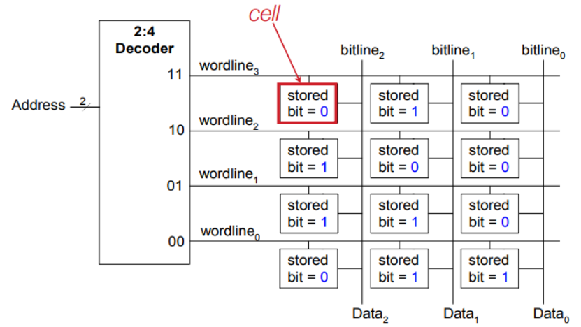
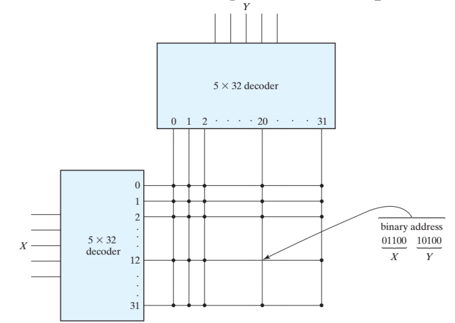
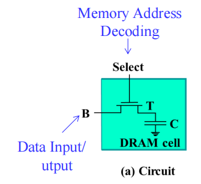
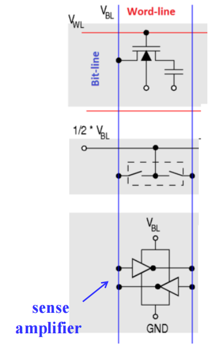
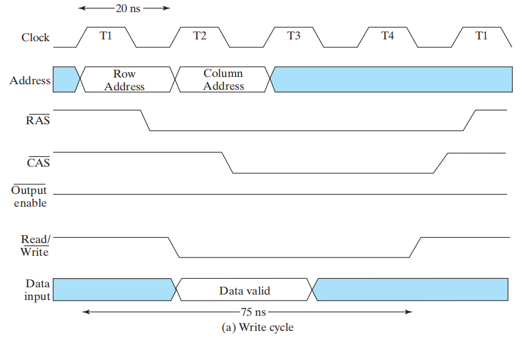

# Chap 7 Memory Basics

## Memory Definitions

+ **内存(memory)**：一组存储单元和必要的电路，内存之间可以传输信息
>内存 = RAM ICs + 额外的逻辑电路
+ **内存组织(memory organization)**：关于内存如何访问的内存基本架构
+ **随机访问存储器(random access memory, RAM)**：数据能够在任何单元之间进行传输，且不依赖于特定的单元的一种内存
+ **内存操作(memory operations)**：对内存数据的操作，通常是对一些数据元素(位(bit)，字节(byte)和字(word)等)的**读(read)** 和**写(write)** 的操作
	+ *位(bit)*：单个二进制数字
	+ *字节(byte)*：能被一起访问的8位数据
	+ *字(word)*：一组二进制位，大小一般为内存访问数据的规模，通常是2的幂的倍数个byte，比如2 bytes, 4bytes。可以用来表示一个数字，一条指令，一个或多个数字字母字符，或者二进制编码的信息等
+ **内存数据(memory data)**：在内存中被存储的或被访问的1位或一组位
+ **内存地址(memory address)**：用来识别特定内存元素的一组位
+ **内存规模(memory size)**：地址宽度 $\times$ 词宽度，比如2K $\times$ 8，32M $\times$ 16

🌰：

### Memory Organization

+ 根据标上索引的词数列进行组织，索引值即为内存地址
+ 通常根据特定计算机架构的需求进行组织

下面列出一些历史上较为知名的计算机架构及其内存组织：
+ PDP-8：使用12位地址访问$2^{12}$个12位字
+ IBM 360：使用24位地址访问$2^{24}$个字节，或者$2^{22}$个字
+ Intel 8080：16位地址访问$2^{16}$个字节

### Memory Block Diagram

+ **芯片选择(chip select, CS)** / **芯片使能(chip enable, CE)**：内存的使能输入
+ k个**地址线路(address lines)**，通过译码器得到$2^k$个地址，每个地址指定一个特定的字
+ 每个字的大小为n位，注意：$2^k \ge n$
+ **读**和**写**用到了单个**控制线路(control lines)**，定义了最简单的内存操作

🌰：$1024 \times 16$ 内存

>该内存具有1024个字(地址个数)，每个字的内容为16位

### Basic Memory Operations

内存操作需要：
+ **地址(address)**：指明需要操作的内存位置，地址线路将这些信息带入内存中
+ **数据(data)**：需要写入或读出的数据
+ **操作(operation)**：传入内存并由控制信号指明类型的信息。典型的操作是**读(read)** 和**写(write)**。其他的操作包括写后即读，和一系列与数据块相关的操作。操作信号也可能指定时间信息

连接内存和CPU的总线：
+ **地址总线(address bus)**：指明内存位置
+ **数据总线(data bus)**：包含传入/出指定位置的数据
+ **控制总线(control bus)**：额外的控制，比如芯片选择、读/写……

+ **读**：读取内存数据的操作
	+ 将想获取的字的二进制地址放入地址线路上
	+ 激活“读”输入
+ **写**：将数据写入内存的操作
	+ 将想获取的字的二进制地址放入地址线路上
	+ 将必须存入内存的数据位放入数据输入线路上
	+ 激活“写”输入

内存的控制输入(功能表见下面)：
+ 芯片选择(Chip Select)：决定是否进行读或写的操作(使能信号)
+ 读/写($Read/\overline{Write}$)：指定特定的操作(读写二选一)

+ 有时读和写的使能线路是一个有精确时间信息的时钟(比如读取时钟(read clock)，写入频闪(write strobe))
+ 有时内存必须对完成操作进行响应
---
异步RAM vs. 同步RAM
+ **异步RAM**不依赖外部时钟的状态，只要接收到指令就开始读写数据
+ **同步RAM**通过外部时钟进行同步，根据特定的时钟状态读写数据

### Memory Operation Timing

多数基本内存是*异步的*，即
+ 存储在锁存器或电荷内
+ 没有外部时钟
+ 受控制输入和地址控制

+ (读取)**访问时间(access time)**：从使用地址，到数据输出上数据出现之间的最大时间
+ **写入周期时间(write cycle time)**：从使用地址，到所有需要用来存储字的内存内部操作全部完成之间的最大时间

CPU必须提供一个内存控制信号，使得它自身内部的时钟操作与内存的读写操作同步，这意味着内存的访问时间和写入周期时间，与CPU时钟周期的固定数值相关

写操作的关键时间位于1-0-1脉冲的边沿处
+ **地址**必须在1-0前的一段时间内*建立*起来，并且在0-1之后的一段时间*保持*稳定，以防对其他地址的内容的干扰
+ **数据**必须在1-0前的一段时间内*建立*起来，并且在0-1之后的一段时间*保持*稳定，确保正确写入

## Random Access Memory(RAM)

RAM的类型：
+ **静态(static)**：信息被存储在*锁存器*内
+ **动态(dynamic)**：信息以*电荷*的形式被存储在*电容(capacitors)* 内，且用n型晶体管“访问”电容。由于电容会漏电，因此需要定期*刷新(refresh)* 电容的电荷

SRAM与DRAM的大致对比：

对电源的依赖性：
+ **易变的(volatile)**：当电源切断时存储的信息丢失
+ **不变的(non-volatile)**：当电源切断时仍然保存信息

内存阵列结构：我们可以把内存看作位的二维阵列，每一位用一个**单元(cell)** 存储
>注：存储单元通常作为电子电路设计，而非逻辑电路。尽管如此，因为方便，我们使用逻辑模型

## Static RAM(SRAM) Integrated Circuits

SRAM的存储单元包括：
+ SR 锁存器
+ 用于控制的选择输入
+ 双轨数据输入$B$和$\overline{B}$
+ 双轨数据输出$C$和$\overline{C}$

图示：

+ 输入：
	+ Select = 0：保持已被存储的内容
	+ Select = 1：存储内容取决于B和$\overline{B}$的值
+ 输出：
	+ Select = 0：C = $\overline{C}$ = 0
	+ Select = 1：C为存储值，$\overline{C}$为其补

### Bit Slice

要利用RAM片构建RAM IC，我们需要：
+ 译码器：将n个地址线路译码为$2^n$个字选择线路，用于挑选需要读取或写入的字
+ 数据输出上的3态门允许RAM IC能被结合为$2^n$个字的RAM
这种方法被称为RAM**位切片(bit slice)** ，下图展示了它的模型($2^n \times 1$ RAM)：

构成：
+ 多个RAM单元
+ 控制线路：
	+ 字选择(word select)
		+ word select = 0：单元锁存器的值不变
		+ word select = 1：值被加载至锁存器
		+ 由于一次只能写入一个字，因此只有1个字选择为1，其余字选择均为0
	+ 位选择(bit select)
	+ 读/写($Read/\overline{Write}$)
		+ $Read/\overline{Write}$ = 0：写操作
		+ $Read/\overline{Write}$ = 1：读操作
+ 数据线路
	+ 数据输入
	+ 数据输出

🌰：$16 \times 1$ RAM

与上面的模型不同：
+ 数据输出处用到了一个**三态门**，这样我们可以将RAM芯片的输出连在一起
+ 新增芯片选择(chip select)的输入，作为RAM芯片的使能信号

### Coincident Selection

对于一个大型的内存阵列，我们需要更大的译码器，因此位线路上就会有更大的扇出，导致RAM的访问时间和写入周期时间延长，但我们并不希望这样。

好在，译码器的规模和扇出可以通过在二维阵列的**重合选择(coincident selection)** 被削减了近似$\sqrt{n}$的大小

如何实现？
+ 2个译码器，1个用于字选择线路，1个用于位选择线路
+ 字选择 $\rightarrow$ **行选择(row select)**
+ 位选择 $\rightarrow$ **列选择(column select)**

🌰
1. 用$4 \times 4$的RAM单元阵列实现$16 \times 1$ RAM

+ 行译码器和列译码器均为2-4译码器
+ 地址的高2位用来选择行，低2位用来挑选列，从而找到特定的RAM单元
+ 列译码器有一个作为使能信号的芯片选择输入：
	+ 其值为0时，译码器的输出为0，因此不选择任何列
	+ 其值为1时，可以访问RAM的特定位

2. 用$4 \times 4$的RAM单元阵列实现$8 \times 2$ RAM

+ 行译码器为2-4译码器，而列译码器为1-2译码器

3. 对于$1K \times 1$的内存

+ 使用1个10-1024译码器，我们需要1024个10输入的与门
+ 使用2个5-32译码器，我们需要32 * 2 = 64个5输入的与门

## Array of SRAM ICs

为了更好地平衡字的数量和字的长度，我们需要使用大于1位/字的ICs

内存扩展方法：
+ 地址空间扩展(地址位增加)——**字扩展(word extension)**
+ 字宽扩展——**位扩展(bit extension)**

🌰：

为了便于后面介绍RAM IC阵列，我们先给出$64K \times 8$ RAM的符号：

>注：输出部分的三角形表明使用了三态门，因此当CS = 0时，数据输出处于高阻抗(Hi-Z)状态；CS = 1时，数据输出为选定字的8位数据

### Word Extension

🌰：用上面的RAM组成$256K \times 8$ RAM

+ 输入数据，低位地址(即小RAM的全部地址)，读/写输入传递给每一个小的RAM
+ 高位地址(即扩展的RAM多出来的地址位)由一个译码器进行分配，用来挑选用哪个小的RAM；再由地位地址挑选特定的字

### Bit Extension

🌰：还是用上面的小内存，构建$64K \times 16$ RAM 

+ 数据输入和输出被一份为二，用于不同的小RAM中
+ 但这些RAM接受相同的芯片选择和读/写信号

---
>[!note]
>为了减少芯片引脚的数量，很多RAM ICs为数据输入和输出提供一个”公共站点(common terminal)“，我们认为这是**双向的(bidirectional)**，即：当*读*取数据时作为*输出*，当*写*入数据时作为*输入*。**三态门**便是一个不错的选择

## Dynamic RAM(DRAM) Integrated Circuits

在DRAM中，信息被存储与电容内，通过充放电改变存储的值；存储、充放电均由作为“开关”的**晶体管**控制。

每个DRAM芯片需要在指定的最大刷新时间内进行刷新

符号：

我们用控制水压的装置的操作和DRAM的操作进行类比：

分析：
+ 电容充满电时，看作逻辑1；电容电量不足时，看作逻辑0
+ 将晶体管作为开关：
	+ “开关”断开：电容里的电荷保持不变，即存储值
	+ “开关”闭合：根据外部位(B)线路，电荷能够从电容中流进流出

基本操作：
+ 读
	+ 位线路预先充好电，使电压位于高低电平之间
	+ 字线路上升，打开横杆
	+ **感测放大器(sense amplifier)** 放大小电压
+ 写：
	+ 感测放大器位于高低电平之间
	+ 打开横杆，对单元充电或放电

**毁灭性的读取(destructive read)**：读取内存数据后，原来的内容被删除

可以看到，在读取0或1后，单元的内容少了一半

### Bit Slice

+ C由三态门驱动
+ **感测放大器**用于C上面电压的(到H或L的)小改变
+ B, C和感测放大器输出被连接在一起，以防“毁灭性的读取”发生

DRAM的框图(包括刷新)：

+ 为了减少引脚的数量，DRAM地址通常被分为连续的两部分：*先*是*行*地址，*后*为*列*地址。这是因为：用来执行行选择的行地址需要在列地址之前使用(列地址需要根据行选择的结果读取数据)
+ 用寄存器保存来自读取或写入周期的行/列地址
+ **行地址选通(row address strobe)**$\overline{RAS}$：行地址寄存器的加载信号
+ **列地址选通(column address strobe)**$\overline{CAS}$：列地址寄存器的加载信号
+ 以及输出使能$\overline{OE}$，它们均为<u>低电平活跃</u>

### Address Multiplexing

DRAM比SRAM要密集得多。因此为了减少引脚的使用数量，DRAM利用**多路复用的地址(multiplexed address)**，凭此可以使一组引脚容纳所有的地址单元(地址是按*先行后列*顺序的)

🌰：$64K \times 1$ DRAM

DRAM的访问顺序：

DRAM的读取和写入的时序图：

### Refreshing

之所以称DRAM是“动态的”，是因为即使在没有访问内存的情况下，DRAM单元还是会损失内容。因此DRAM必须定期地进行读取和重写

三种刷新方式：
+ **只刷新RAS(RAS-only refresh)(仅访问行，不访问列)**
	+ RAS被激活，一个行地址(**刷新地址**)用于DRAM；CAS不动
	+ DRAM在内部读取一行，并放大读取数据。由于CAS被禁用，没有数据被传到输出引脚上
	+ 缺点：需要额外的外部逻辑设备来连续生成行地址

+ **RAS刷新前的CAS(CAS before RAS refresh)**
	+ DRAM有自己的刷新逻辑——地址计数器。当序列用于CAS和RAS上，内部刷新逻辑生成一个地址，并刷新对应的单元
	+ 每个周期后，地址计数器会自增
	+ 内存控制器只需发出信号

+ **隐蔽刷新(hidden refresh)**：
	+ 伴随正常的读取或写入，CAS = 0，RAS按周期变化，有效执行第二种刷新方法。在这种刷新方法中，之前读取的输出数据依旧合法，因此认为刷新是隐蔽的
	+ 缺点：花费时间太长，导致后续读写操作的延迟

刷新模式：
+ **突发模式(burst mode)**：停止工作，刷新所有数据

+ **分布模式(distributed mode)**：间隔一段时间刷新，从而避免长时间的内存阻塞，这种刷新方式更加常用

---

## DRAM Types

类型：
+ 同步DRAM(**SDRAM**)
+ 双倍数据率SDRAM(**DDR** SDRAM)
+ RAMBUS&reg; DRAM(**RDRAM**)

说明：
+ DRAM通常用作内存分层结构的一部分
+ 从DRAM中读取的数据会被用于整个分层结构中更底层的部分
+ 从DRAM中传输需要多个连续的带地址的字
+ 很多字在使用单行地址的DRAM ICs的内部被读取，并在内存中被捕获
+ 这样的读取会花费相当长的时间
+ 这些字随后通过内存数据总线，使用一系列的时钟传输被传输至外面
+ 这些传输的延迟较低，因此能在短时间内完成
+ 列地址被捕获，然后被用于DRAM的同步计数器中，用来为传输提供连续的列地址

**突发读取(burst read)**：从连续地址中读取多个字

### Synchronous DRAM

+ 所有的信号与**外部时钟(external clock)** 关联
	+ 使时间与其他系统(比如CPU)的匹配更加精确
	+ 同步寄存器出现于地址输入、数据输入和输出中
+ 突发且有方向的读取和写入访问：
	+ **列地址计数器(column address counter)**：用来为将随时钟周期传输的内部数据分配地址
	+ 计数器的上限：address + burst length - 1
	+ **突发长度(burst length)** 是可编程的
+ 一种用户可编程模式的寄存器
	+ CAS潜伏(latency)，突发长度、突发类型

🌰：16MB SDRAM的框图

SDRAM的时序图：

>注：突发长度 = 4

**内存带宽(memory bandwidth)**：内存的速度——数据读取或存入的最大速率。单位一般为MB/s或GB/s。SDRAM的内存带宽与突发大小(burst size)相关

🌰：
+ 内存数据路径宽度：1B
+ 内存时钟周期：7.5ns
+ 潜伏时间(从应用行地址开始，直到第一个可用的字出现的时间)：4个周期

1. 突发大小：8B
	+ 读取周期：(4 + 8) * 7.5 = 90ns
	+ 内存带宽：8 / (90 * $10^{-9}$) = 88.89 MB/s

2. 突发大小：2048B
	+ 读取周期：(4 + 2048) * 7.5 = 15390ns
	+ 内存带宽：2048 / (15390 * $10^{-9}$) = 133.07 MB/s

### Double Data Rate Synchronous DRAM

+ 在时钟两侧的边沿均可传输数据
+ 提供每个周期内2个数据字的传输速率

🌰：

### RAMBUS DRAM(RDRAM)

+ 在RDRAM ICs与连至处理器的内存总线之间的连接中使用**基于包的总线(packet-based bus)**
+ 总线包括：
	+ 3位行地址总线
	+ 5位列地址总线
	+ 16或18位(用于错误纠正)数据总线
+ 总线是同步的，在时钟两侧的边沿均可传输
+ 每个**包(packet)** 在4个时钟周期内提供8次传输，这意味着：
	+ 12位的行地址包
	+ 20位的列地址包
	+ 128或144位的数据包
+ 多个内存库用来允许用不同的行地址对内存进行同时访问
+ 这种设计十分精密，从而有很快的运行速

🌰：16 MB RDRAM的时序

## Arrays of DRAM Integrated Circuits

DRAM的阵列与SRAM类似，除了多了一个称为**DRAM控制器(DRAM controller)** 的IC
+ 将地址分为行地址和列地址，并为它们的使用计时
+ 提供$\overline{RAS}$和$\overline{CAS}$，并为它们的使用计时
+ 在要求的间隔内执行刷新操作
+ 为系统的剩余部分提供状态信号(表明内存是否是处于活跃状态，或者是否在执行刷新操作)

DRAM组织：

