# Chap 10 Graph

>可参照fds[同名章节](../fds/9.md)

## Graphs and Graph Models

>[图论发展史](https://zh.wikipedia.org/wiki/%E5%9B%BE%E8%AE%BA#%E5%8E%86%E5%8F%B2)

定义：**图(graph)**$G = (V, E)$，其中$V$表示*顶点(vertice/nodes)* 的非空集合，$E$表示*边(edge)* 的集合。每条边联系1-2个顶点，这些顶点称为*端点(endpoint)*，称一条边*连接*它的端点

+ **无限图(infinite graph)**：包含无限个顶点**或**无限条边的图

+ **有限图(finite graph)**：包含有限个顶点**和**有限条边的图。本章只考虑有限图的问题

+ **简单图(simple graph)**：每条边连接不同的顶点，且不存在连接同一对顶点的两条边的图。这时，我们可以用顶点对{u, v}表示一条边，而不产生歧义

+ **多重图(multigraph)**：存在*多条边(multiple edges)* 连接同一对顶点的图。如果顶点u, v间有m条边，称{u, v}是重数为m的边

+ **伪图(pseudograph)**：存在*环*，且可能有*多条边*连接同一对顶点或连接顶点自身的图
>**环(loop)**：从某个顶点出发连接自身的边

上述的图均为**无向图(undirected graph)**

---
定义：**有向图(directed graph, digraph)**$(V, E)$包含顶点的非空集合$V$和*有向边(directed edges/arc)* 的集合$E$。每条有向边与有序顶点对(u, v)有联系，称v为*起点(start)*，v为*终点(end)*

>有向图也存在环和多条有向边的情况

+ **简单有向图(simple directed graph)**：没有环，也没有多条有向边的图

+ **有向多重图(directed multigraph)**：对于同一有序顶点对(或同一顶点)存在*多条有向边(multiple directed edges)*。如果顶点u, v间有m条有向边，称(u, v)是*重数(multiplicity)* 为m的有向边

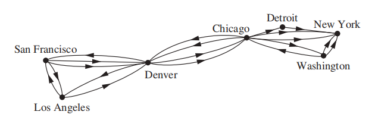

+ **混合图(mixed graph)**：既包含<u>有向边</u>，也包含<u>无向边</u>的图

总结：

>注：如果题目没有明确说明，默认将图当作**无向图**

### Graph Models

>注：这部分内容并不重要，因此这里只简单列举一些例子，具体内容见书本

??? example "例题"

	=== "Social Networks"

		**社交网络(social networks)**：用顶点表示个体或组织，用边表示个体或组织之间的联系

		+ 熟人/朋友关系图(acquaintanceship and friendship graphs)：无向图，无环，没有多重边

		

		
		

		+ 影响力图(influence graphs)：有向图，无环，没有多重边

		

		
		

		+ 合作图(collaboration graphs)：无向图，无环，没有多重边
			+ 好莱坞图(Hollywood graph)
			+ 学术合作图(academic collaboration graph)

	=== "Communication Networks"

		电话图(call graphs)：有向/无向均可，有多重边

		

		
		

	=== "Information Networks"

	+ 网络图(the web graph)：有向图
	+ 引用图(citation graphs)：有向图，无环，没有多重边

	=== "Software Design Applications"

		+ 模块依赖图(module dependency graphs)：有向图

		

		
		

		+ 优先级图(precedence graphs)和并行处理(concurrent processing)

		

		
		

	=== "Transportation Networks"

	+ 航空路程(airline routes)：有向多重图
	+ 路线网络(road networks)：混合图

	=== "Biological Networks"

		+ 生态位重叠图(niche overlap graphs)：无向简单图

		

		
		

		+ 蛋白质相互作用图(protein interaction graphs)：无向图（下图表示RNA的蛋白质）

		

		
		

	=== "Semantic Networks"

		+ 自然语言理解(natural language understanding, NLU)：机器分拆并解析人类的话语
		>注：NLU是自然语言处理(NLP)的子集，也是NLP中最困难的部分
		+ 信息检索(information retrieval, IR)：从基于各种类型的搜索的一组源中获取信息

		**语义关系(semantic relation)**：两个或多个单词基于意思的联系

		

		
		

	=== "Tournaments"

		+ 循环赛(round-robin tournament)：每个队伍都和其他队伍有一次比赛，且不允许平局

		

		
		

		+ 单淘汰赛(single-elimination tournament)：如果输一次就被淘汰

		

		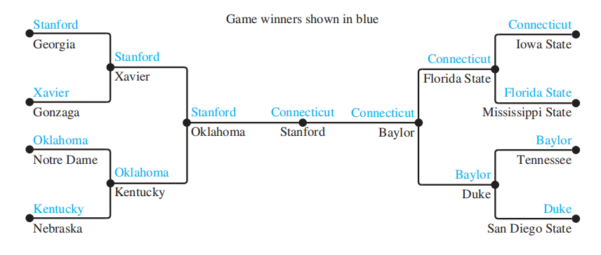
		

	=== "Others"

		+ 一笔画问题(one-stroke drawing problem)：画一幅画，确保连续移动而不提笔，使得画中所有部分仅画一遍

		

		
		

		+ 拉姆齐问题：每两个人要么是朋友，要么是敌人，那么六个人中有三对朋友和三对敌人
		+ 排座问题(seating problem)

		

		
		

		+ 公共资源问题(utilities problem)：具体见[wiki](https://zh.wikipedia.org/wiki/%E4%B8%89%E9%96%93%E5%B0%8F%E5%B1%8B%E5%95%8F%E9%A1%8C)，这里仅举个🌰

		

		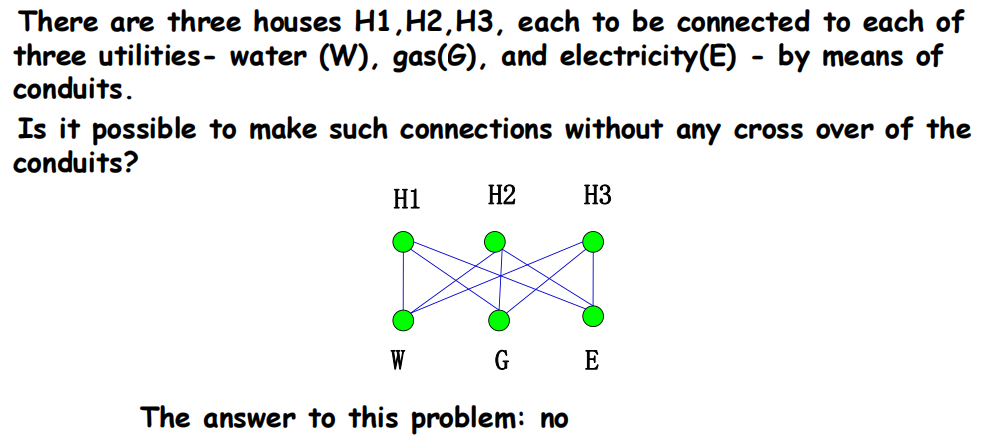
		

		+ 钻孔问题 $\rightarrow$ 最短路问题：找到一种钻孔顺序，使得用时最少

		

		
		

### Supplements(from Exercises)

关于一组集合$A_1, A_2, \dots, A_n$的**交集图(intersection graph)**：它的顶点表示这些元素，它的边表示某两个集合存在非空交集的关系

## Graph Terminology and Special Types of Graphs

### Basic Terminology

关于**无向图**：

定义：

+ 如果顶点u, v是无向图G的边e上的两个端点，称这两个顶点是*相邻的(adjacent/neighbors)*，这样的边e*连接*了u和v
+ 图$G = (V, E)$上的顶点v的所有相邻顶点构成的集合称为v的*邻居(neighborhood)*，记作$N(v)$
+ 如果A是V的子集，用$N(A)$表示所有与A中的至少一个顶点相邻的所有顶点构成的集合，所以，$N(A) = \bigcup\limits_{v \in A}N(v)$
+ 无向图中顶点v的*度(degree)* = 与该顶点关联的边数，记作$deg(v)$
	+ 度为0的顶点称为*孤立的(isolated)*
	+ 度为1的顶点称为*下垂的(pendant)*
	+ 顶点的一个**环**的度为2

**定理1——握手定理(THE HANDSHAKING THEOREM)**：令$G = (V, E)$是边数为m的无向图，则：所有顶点的度之和 = 边数 $\times$ 2，即：$2m = \sum\limits_{v \in V}deg(v)$（该定理同样适用于重边）

🌰：

**定理2**：在无向图中，度为*奇数*的顶点个数为*偶数*

??? note "证明"

	令$V_1, V_2$分别表示度为偶数和度为奇数的顶点，由定理1，有：
	$$
	2m = \sum\limits_{v \in V}deg(v) = \sum\limits_{v \in V_1}deg(v) + \sum\limits_{v \in V_2}deg(v)
	$$
	显然：等式左边的数为偶数，且最右边的等式中第1项为偶数。因此第2项，即度为奇数的顶点个数一定是偶数

---
关于**有向图**：

定义：

+ 当(u, v)表示图G的有向边时，我们称u*到v是相邻的*，v*来自u是相邻的*。u称为(u, v)的**起点(initial vertex)**，v称为(u, v)的**终点(terminal/end vertex)**。自环的起点、终点是相同的
+ v的**入度(in-degree)** = v作为边的<u>终点</u>时的边数，记作$deg^-(v)$
+ v的**出度(out-degree)** = v作为边的<u>起点</u>时的边数，记作$deg^+(v)$

>注：顶点v的**环**使v的入度和出度均+1

**定理3**：令$G = (V, E)$为有向图，则
$$
\sum\limits_{v \in V} deg^-(v) = \sum\limits_{v \in V}deg^+(v) = |E|
$$

*潜在无向图(underlying undirected graph)*：无视有向图中边的方向，得到一张无向图

### Some Special Simple Graphs

+ **完全图(complete graph)** 是一张简单图，满足每一对不同的顶点之间有且仅有一条边，记作$K_n$。如果至少有一对不同的顶点没有连接起来，称这样的图是*不完全的(noncomplete)*

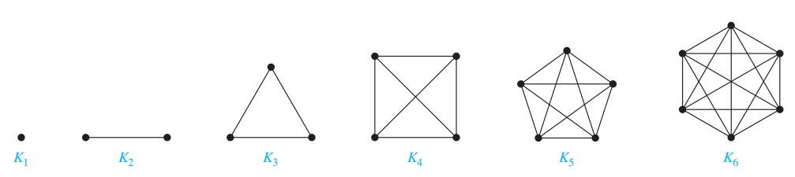

>注：边数m = C(n, 2)

+ **环(cycle)**：一张包含n(n $\ge$ 3)个顶点，边为$\{v_1, v_2\}, \{v_2, v_3\}, \dots, \{v_{n-1}, v_n\}$和$\{v_n, v_1\}$，记作$C_n$
	

+ **轮(wheel)**：在环$C_n$的基础上多一个顶点，且该顶点与原来n个顶点间都有一条边，记作$W_n$
	

+ **n维超立方体/n立方(n-dimensional hypercube/n-cube)**：记作$Q_n$。图的顶点表示$2^n$个长度为n的位串。当且仅当2个顶点的位串只相差1位时，两个顶点是相邻的。

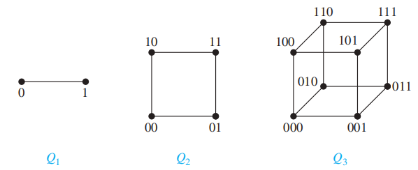

我们可以根据n立方构造出(n+1)立方：

+ 得到两个相同的$Q_n$
+ 对第1个$Q_n$的所有位串的最左边添0，对第2个$Q_n$的所有位串的最左边添1
+ 将仅相差1位的两个位串(顶点)用边连接起来，如图所示：

因此，我们可以得到$Q_n$的边数$m_n$的递推关系：
$$
m_n = 2m_{n-1} + 2^{n-1}
$$
解得$m_n = n \cdot 2^{n-1}$（利用[线性非齐次递推关系](8.md#linear-nonhomogeneous-recurrence-relations-with-constant-coefficients)的知识求解）

### Bipartite Graphs

定义：如果一个简单图G的顶点集V能被分成两个不相交的集合$V_1, V_2$，使得图中的每条边连接$V_1$的1个顶点和$V_2$的1个顶点(没有边连接$V_1$的两个顶点或$V_2$的两个顶点)，称G是**二分的(bipartite)**，称$(V_1, V_2)$是G的顶点集V的**二分(bipartition)**。

???+ example "例题"

	=== "例1"

		

		
		

	=== "例2"

		图G和图H是二分的吗？

		

		
		

		

		
		

**定理4**：当且仅当用两种不同颜色涂顶点，可以满足相邻的顶点不同色时，该简单图是二分的
>相关知识：[图着色问题](10.md#graph-coloring)

??? note "证明"

	

	
	

!!! note "判断二分图的另一种方法"

	二分图的充要条件是——不可能通过遍历奇数条不同的边，从某个顶点出发又回到该顶点。

**完全二分图(complete bipartite graph)**：一张图被分成顶点数分别为m和n的两个子集，某个子集的顶点连接另一个子集上的所有顶点，但不连接与它属于同一子集的顶点。记作$K_{m, n}$。

### Bipartite Graphs and Matchings

🌰：二分图的应用——工作安排

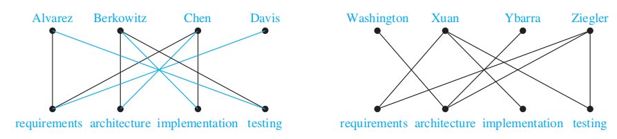

>注：具体内容见书本$P_{692-693}$(~~内容有点多，懒得写了~~)

上述问题可被视为找简单图G = (V, E)的**匹配(matching)** M，它是边集合E的子集，满足没有两条边有共同的顶点，即对于不同的边{s, t}和{u, v}，顶点s, t, u, v是不同的。

如果有顶点是匹配关系M上的某条边的一个端点，称该顶点在M中是*匹配的(matched)*；否则是*不匹配的(unmatched)*

**最大匹配(maximum matching)** 是具有最大边数的匹配

对于二分图G = (V, E)，它的二分为($V_1, V_2$)，如果$V_1$的每个顶点是匹配M某条边的端点，即$|M| = |V_1|$，称M是$V_1$到$V_2$的**完全匹配(complete matching)**

🌰：

**定理5——霍尔婚配定理(HALL'S MARRIAGE THEOREM)**：对于一个二分图$G = (V, E)$，它的二分为$(V_1, V_2)$，当且仅当对于$V_1$的所有子集$A$，满足$|N(A)| \ge |A|$时，该二分图有从$V_1$到$V_2$的完全匹配

??? note "证明(有点难)"

	

	
	

	

	
	

### Some Applications of Special Types of Graphs

=== "**局域网(local area network)**"

	+ 星型拓扑(star topology)：$K_{1, n}$
	+ 环形拓扑(ring topology)：$C_n$
	+ 混合(hybrid)拓扑：$W_n$

	

	
	

=== "**并行计算中的互联网(interconnection networks for parallel computation)**"

	*串行(serial)* 算法：算法在一个时刻内执行一个步骤(书上给出的算法均是串行的)。然而，这种算法无法应对高强度计算的问题。

	因此就有了**并行处理(parallel processing)**，使用包含多个自带内存的处理器的计算机，克服只有单个处理器的计算机的局限。

	**并行算法(parallel algorithm)**：将问题分解成能够同时解决的一些子问题，使用多处理器的电脑能够快速解决问题。

	在并行处理中，处理器之间需要相互连接。因此要选择合理的连接方法：

	+ 每对处理器都双向连接，形成完全图$K_n$——最简单，但也是最贵的方法
	+ **线性数组(linear array)**
		+ 优点：每个处理器与其他处理器间至多有两条直接连接
		+ 缺点：有时需要大量的中间连接(称为*跳(hop)*)来实现处理器间的通信
	

	
	
	

	+ **网状网络(mesh network)**：n个处理器被标记为$P(i, j)\ (0 \le i \le m - 1, 0 \le j \le m - 1)$。两个方向的连接使$P(i, j)$最多有4个邻居(在网状网络中的$P(i \pm 1, j)$和$P(i, j \pm 1)$)。此时任意一对处理器间的通信需要$O(\sqrt n) = O(m)$个中间连接即可。

	

	
	
	

	+ **超立方体(hypercube)**：处理器的数量为n = $2^m$，处理器被标记为$P_0, \dots, P_{n-1}$。每个处理器与其他m个处理器有双向连接，即$P_i$跟与i仅相差1位的处理器之间有双向连接。这种方法权衡了处理器直接连接的数量和中间连接的数量，因此现在很多电脑和并行算法采用超立方体网络。可以用图$Q_m$表示

	

	
	

### New Graphs from Old

定义：

+ 图G = (V, E)的**子图(subgraph)** H = (W, F)，满足W $\subseteq$ V，F $\subseteq$ E。
+ 如果H是G的子图且H $\ne$ G，则H是G的**真子图(proper subgraph)**
+ 如果满足W = V, F $\subseteq$ E，称H是G的**生成子图(spanning subgraph)**
+ 令G = (V, E)为简单图，称子集(W, F)为顶点集V的子集W的**点诱导子图(subgraph induced)**（边集F包含E中的边），充要条件为F的边上的两个端点都在集合W中。

!!! note "得到新图的几种方式"

	对于G = (V, E)

	+ 移除或添加一条边：

		+ *移除*边e $\in$ E：$G - e = (V, E - \{e\})$
		+ 相似地，如果我们要移除边的子集E'，则剩下的G' = (V, E - E')
		+ *添加*边e：$G + e = (V, E \cup \{e\})$

	+ **边的压缩(edge contraction)**：移除端点为u, v的边e，然后合并u, v为新的顶点w，接着将所有原来与u和v相连的边改成连接到w上。也就是说，对于原来的图G = (V, E)，产生新图G'，它的顶点集V' = V - {u, v} $\cup$ {w}，它的边集E'包含除了以u或v为端点的所有边，再加上连接w的边(这些边原来连接的是u或v)

	+ 移除顶点：$G - v = (V - \{v\}, E')$，其中E'是除了与v相连的所有边
		+ 移除顶点集V'：(V - V', E‘)，其中E'是除了与V'上所有顶点相连的所有边

	

	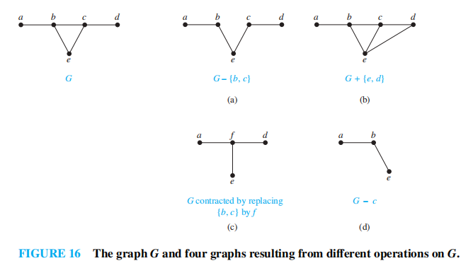
	

	+ 图的**并集(union)**：对于两张简单图$G_1 = (V_1, E_1), G_2 = (V_2, E_2)$，它们的并集$G_1 \cup G_2 = (V_1 \cup V_2, E_1 \cup E_2)$

	

	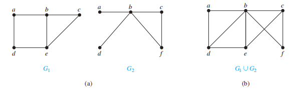
	

### Supplements(from Exercises)

+ 假设二分图G = (V, E)，它的二分为$(V_1, V_2)$，且$A \subseteq V_1$，则$V_1$的最大顶点数，为G的匹配的端点 = $|V_1| - \max\limits_{A \subseteq V_1}def(A)$，其中$def(A) = |A| - |N(A)|$称为A的**缺陷(deficiency)**
+ 图的**度序列(degree sequence)** 是指将顶点的度按非递增顺序排列的序列
+ 如果序列$d_1, d_2, \dots, d_n$是简单图的度序列，则称该序列是*图化的(graphic)*
+ 当且仅当对于非负数且非递增序列$d_1, d_2, \dots, d_n$，将序列$d_2 - 1, \dots, d_{d_1 + 1} - 1, d_{d_1 + 2}, \dots, d_n$重新排列，使得这些项按非递增顺序排列后是个图序列(graphic sequence)，则原来的序列也是图序列
+ 每个非负数且非递增序列，若它的和是偶数，则该序列是一个伪图(允许有环的无向图)的度序列
+ 如果简单图上的每个顶点都有相同的度，称这个图是*正则的(regular)*。如果每个顶点的度均为n，称该图是*n-regular*
	+ $K_n$是(n-1)-regular
+ 简单图$G$的**补图(complementary graph)**$\overline{G}$与$G$有相同的顶点。当且仅当$G$上的两个顶点不相邻时，$\overline{G}$上同样的两个顶点是相邻的
	+ 如果G有n个顶点，则$K_n = G \cup \overline{G}$
+ 如果二分图G有v个顶点和e条边，则$e \le \dfrac{v^2}{4}$
+ 有向图G = (V, E)的**逆(converse)** 为有向图$G^{conv}$ = (V, F)，其中F通过逆转E的边的方向得到
	+ $(G^{conv})^{conv} = G$
	+ 当且仅当$G$有对称关系时，$G$存在逆

## Representing Graphs and Graph Isomorphism

### Representing Graphs

图的表示法：

+ 列出所有的边
+ 邻接表：（前提：图中没有重边）表示出每个顶点的相邻顶点

???+ example 

	+ 无向图

	

	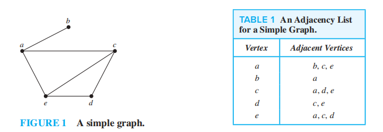
	

	+ 有向图

	

	
	

+ ==邻接矩阵==

+ ==关联矩阵==

### Adjacency Matrices

当图的边数很多时，用上述的前两种方法就比较麻烦了。为了简化计算，通常用**矩阵**表示图。

假设有<u>无向图</u>G = (V, E)，|V| = n，它的顶点按任意排序排列：$v_1, v_2, \dots, v_n$，则它的**邻接矩阵(adjacency matrix)**$\mathbf{A}_G = [a_{ij}]$是一个$n \times n$的零一矩阵，它的元素为：

$$
a_{ij} = \begin{cases}1 & \text{if } \{v_i, v_j\} \text{ is an edge of } G \\ 0 & \text{otherwise}\end{cases}
$$

注：

+ 对于同一张n顶点的图，共有n!种不同的邻接矩阵（因为顶点顺序任意）
+ 对于一张简单图，$a_{ii} = 0, i = 1,2,3, \dots, n$
+ 顶点$v_i$的*环*：$a_{ii} = 1$
+ $v_i$和$v_j$之间的*重边*：$a_{ij}$ = $\{v_i, v_j\}$的重数
+ 所有的无向图，包括*多重图*和*伪图*，其邻接矩阵都是*对称的*
+ 第i行元素之和 = 第i列元素之和 = $v_i$的度

🌰：

---
对于<u>有向图</u>的邻接矩阵$\mathbf{A} = [a_{ij}]$，它的元素为：

$$
a_{ij} = \begin{cases}1 & \text{if } (v_i, v_j) \text{ is an edge of } G \\ 0 & \text{otherwise}\end{cases}
$$

注：

+ 有向图的邻接矩阵不一定是对称的
+ *有向多重图*也可用邻接矩阵表示：$a_{ij}$ = $(v_i, v_j)$的重数
+ 第i行元素之和 = $v_i$的出度，第i列元素之和 = $v_i$的入度

### Incidence Matrices

假设有<u>无向图</u>G = (V, E)，顶点为$v_1, v_2, \dots, v_n$，边为$e_1, e_2, \dots, e_m$，那么它的**关联矩阵(incidence matrix)** 为$\mathbf{M} = [m_{ij}]$，是一个$n \times m$的矩阵，它的元素为：

$$
m_{ij} = \begin{cases}1 & \text{when edge } e_j \text{ is incident with }v_i \\ 0 & \text{otherwise}\end{cases}
$$

注：

+ 第i行元素之和 = $v_i$的度，
+ 第i列元素之和 = $\begin{cases}1 & \text{loop} \\ 2 & \text{normal}\end{cases}$
+ 关联矩阵可以表示*重边*和*环*，见下面的🌰：

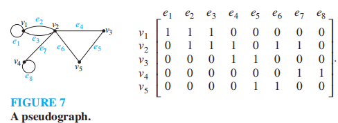

### Isomorphism of Graphs

定义：对于两张简单图$G_1 = (V_1, E_1), G_2 = (V_2, E_2)$，如果存在一个双射函数$f: V_1 \rightarrow V_2$，满足：$\forall a, b \in V_1$，若$a, b$相邻，则$f(a), f(b) \in V_2$且$f(a), f(b)$相邻，则称这两张图是**同构的(isomorphic)**，这样的函数$f$称为**同构(isomorphism)**。如果两张简单图不同构，称它们是*非同构的(nonisomorphic)*。

两张简单图的同构是一种*等价关系(equivalent relation)*。

### Determining whether Two Simple Graphs are Isomorphic

对于两张n顶点的简单图，有n!种可能的双射关系，因此当n很大时，直接根据顶点的相邻关系来判断同构是不切实际的；但是，判断两张图<u>不是同构的</u>相对比较容易，我们可以通过比较它们的**不变量(invariant)** 来求解。

有哪些不变量：

+ 顶点数
+ 边数
+ 每个顶点的度数

然而，我们只能用不变量判断两张图的*非同构关系*，目前没有已知用来判断两张图是同构的

另一种判断同构的方法：比较两张图的**邻接矩阵**

???+ example "例题(证明2张图是同构的)"

	=== "例1"

		

		
		

		

		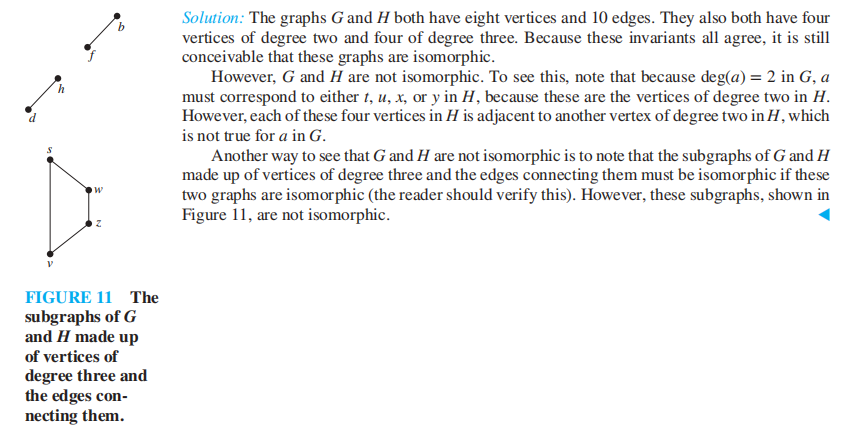
		

	=== "例2"

		

		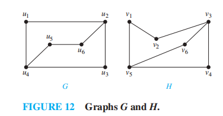
		

		

		
		

		

		
		

		

		
		

	=== "例3"

		

		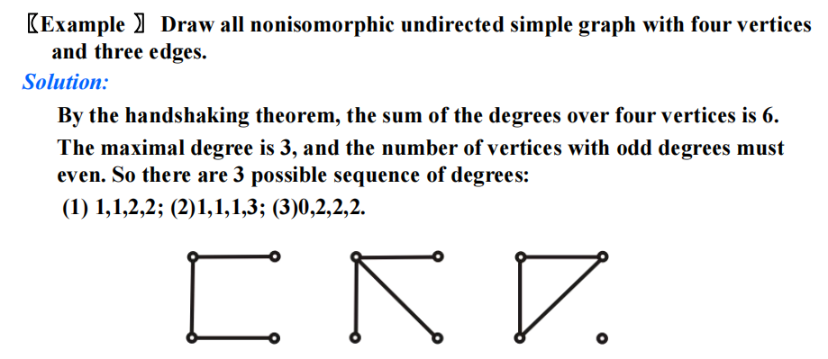
		

	=== "例4"

		

		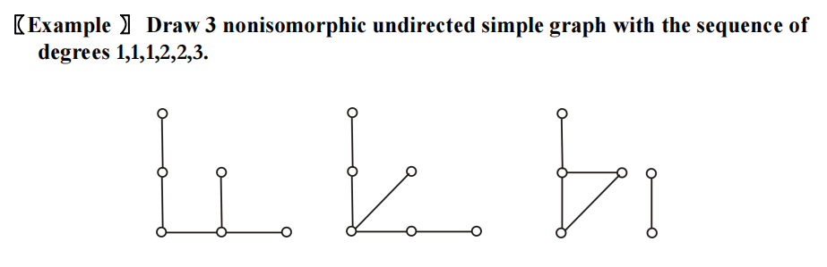
		

	=== "例5"

		

		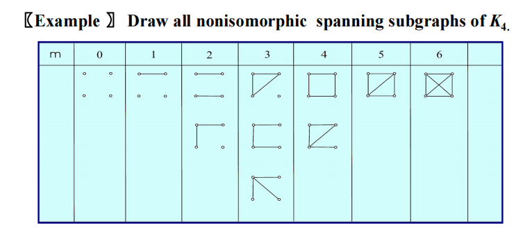
		

求解同构的算法：

+ 目前，已知的最佳算法在最坏情况的时间复杂度为*指数级*
+ 2017年，有人找到一个算法：对于n顶点的图，计算它的同构的次数为$2^{f(n)}$，$f(n)$为$O((\log n)^3)$，因此算法的时间复杂度为*准多项式时间(quasi-polynomial time)*
+ 同构测试软件：[NAUTY](https://www3.cs.stonybrook.edu/~algorith/implement/nauty/implement.shtml)

>更多的不变量见[下面](#paths-and-isomorphism)

### Supplements(from Exercises)

+ n顶点的无向图$G_n$ = (V, E)的**密度(density)**：$\dfrac{2|E|}{|V|(|V| - 1)}$
	+ **稀疏(sparse)图**：$\lim\limits_{n \rightarrow \infty} \dfrac{2|E|}{|V|(|V| - 1)} = 0$
	+ **稠密(dense)图**：$\lim\limits_{n \rightarrow \infty} \dfrac{2|E|}{|V|(|V| - 1)} = c(c \in \mathbf{R}^+)$
+ 假设G和H是同构的，则$\overline{G}$和$\overline{H}$是同构的
+ 有2个或多个顶点的二分图，对它的顶点进行一定排序后，能够形成如下形式的邻接矩阵

$$
\begin{bmatrix}
\mathbf{0} & \mathbf{A} \\ \mathbf{B} & \mathbf{0}
\end{bmatrix}
$$

+ 如果简单图G和它的补图$\overline{G}$是同构的，称G是**自补的(self-complementary)**
	+ 如果G是v顶点的自补简单图，则v $\equiv$ 0 or 1(mod 4)
+ **魔鬼对(devil's pair)**：在一个故意的同构测试中，存在一对非同构图，无法检测出这两张图不是同构的

## Connectivity

### Paths

定义(==无向图==)：

+ 令n为非负整数，G为无向图，G中从u到v，长度为n的**路径(path)**，是G上的n条边的序列$e_1, \dots, e_n$(存在顶点序列$x_0 = u, x_1, \dots, x_{n-1}, x_n = v$，使得$e_i$的端点为$x_{i-1}$和$x_i$，$i = 1, \dots, n$)。
+ 在*简单图*中，路径可以被表示为顶点的序列$x_0, x_1, \dots, x_n$（因为列出的顶点能够表示唯一的路径）
+ 如果路径的起点和终点相同，即u = v，且长度大于0，则称该路径为**环(circuit)**
+ 路径或环*经过(pass through)* 顶点$x_1, x_2, \dots, x_{n-1}$，*遍历(traverse)* 边$e_1, e_2, \dots, e_n$
+ 无重复*边*出现的路径或环认为是*简单的(simple)*

???+ note "注"

	+ 如果不区分重边，则路径可以记作$e_1, e_2, \dots, e_n$，其中$e_i = \{x_{i-1}, x_i\}, i = 1, 2, \dots, n$
	+ 长度为0的路径就是单个点
	+ 在别的书中：
		+ 路径被称为**walk**，它是交错的顶点和边的序列：$v_0, e_1, v_1, e_2, \dots, v_{n-1}, e_n, v_n$，其中$v_{i-1}, v_i$是$e_i$的端点($i = 1, 2, \dots, n$)。
		+ 环被称为**closed walk**
		+ 简单路径被称为**trail**
		+ 无重复*顶点*出现的trail被称为path（与上面的定义冲突）

	因此，我们需要根据语境判断这些词语的意思
---
定义(==有向图==)：

+ 令n为非负整数，G为有向图，G中从u到v，长度为n的**路径(path)**，是G上的n条边的序列$e_1, \dots, e_n$，使得$e_i = (x_{i-1}, x_i)$，$i = 1, \dots, n$，其中$x_0 = u, x_n = v$。
+ 当有向图中没有重边时，路径可以用顶点序列$x_0, x_1, x_2, \dots, x_n$表示
+ **环(circuit/cycle)**：长度为1，起点 = 终点的路径
+ 无重复*边*出现的路径或环认为是*简单的(simple)*

???+ note "注"

	+ 上面的“注”中提到的别称(walk, closed walk...)也适用于有向图
	+ 如果不考虑重边，则可以使用边的序列表示路径

🌰：

+ 熟人图(acquaintanceship graph)的路径：现在很多社会学家猜想：世界上任意两个人之间的路径很短，仅经过5个甚至更少的人——**[六度分隔理论(six degree of seperation)](https://en.wikipedia.org/wiki/Six_degrees_of_separation)**
+ 合作图(collaboration graph)的路径
	+ [Erdos number](https://en.wikipedia.org/wiki/Erd%C5%91s_number)：m与数学家Paul Erdos之间最短路径的长度
	+ [Bacon number](https://en.wikipedia.org/wiki/Six_Degrees_of_Kevin_Bacon#Bacon_numbers): c与演员Kevin Bacon之间最短路径的长度

### Connectedness in Undirected Graphs

定义：在一张无向图中，如果每对不同的顶点之间都存在一条路径，称这个无向图是**连通的(connected)**；不连通的无向图称为**断开的(disconnected)**。如果我们移除图的顶点或边，产生了断开的子图，那么我们*断开(disconnect)* 了这张图。

**定理1**：在连通的无向图中，任意一对不同顶点之间总存在一条*简单路径*

**连通分量(connected component)**：图G的最大连通子图。一张不连通的图包含两个或多个不相交的连通分量，它们的并集构成了整张图

### How Connected in a Graph?

+ **割点(cut vertices/articulation points)** 满足：若移除该顶点以及与它关联的边，就会生成1个包含更多连通分量的子图(因为移除了1个顶点和一些边，相较于原图，剩余的图是它的子图)
+ **割边(cut edges/bridges)** 满足：若移除该边，就会生成1个包含更多连通分量的子图

#### Vertex Connectivity

并不是所有图都有割点。比如完全图$K_n(n \ge 3)$，任意移除1个顶点及其关联边，剩下的图为$K_{n-1}$，它还是连通图。

+ **不可分割图(nonseparable graph)**：没有割点的连通图
+ **点割集(vertex cut/seperating set)**：对于图G = (V, E)的顶点集V的子集V'，满足G - V'是断开的。除了完全图外的所有**连通图**，都有1个点割集
+ **点连通度(vertex connectivity)**：无向图G中，点割集内顶点的最少数量，记作$\kappa(G)$
	+ 由于完全图没有点割集，因此按上述定义，无法定义$\kappa(K_n)$。因此，我们记$\kappa(G) = n - 1$，表示生成仅包含单个顶点的图所需移除顶点的数量
	+ $0 \le \kappa(G) \le n - 1$
	+ 当且仅当G是断开的，或G = $K_1$时，$\kappa(G) = 0$
	+ 当且仅当G是完全图时，$\kappa(G) = n - 1$
	+ 如果$\kappa(G) \ge k$，称图为**k点连通(k-connected/k-vertex-connected)**
		+ 单点连通(1-connected)：图是连通的且顶点数 > 1
		+ **双点连通(2-connected/biconnected)**：图是不可分割的且顶点数 > 2
		+ 如果G是k点连通的，则G也是j点连通的($0 \le j \le k$)

???+ example "例题"

	=== "题目"

		

		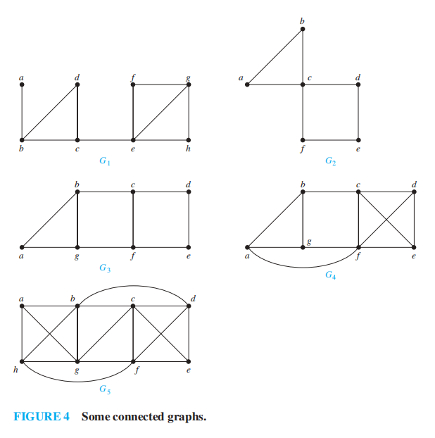
		

		1. 找出$G_1$的割点和割边
		2. 找出所有图的点连通度

	=== "答案"

		1. 

		

		
		

		2、 

		

		
		

#### Edge Connectivity

+ 如果图有割边，我们只需去除割边就能断开该图
+ 如果没有，我们需要寻找所需去除的最小的边的集合，使得该图是断开的

+ **边割集(edge cut)**：边集E'，满足G - E'是断开的。除了完全图外的所有连通图，都有1个点割集
+ **边连通度(edge connectivity)**：无向图G中，边割集内最小的边数，记作$\lambda(G)$
	+ $0 \le \lambda(G) \le n - 1$
	+ $\lambda(G) = 0$：G不连通或仅包含1个顶点
	+ $\lambda(G) = n - 1$：当且仅当$G = K_n$
	+ $\lambda(G) \le n - 2$：当G不是完全图时

🌰：找出上面5张图的边连通度

---
关于点连通度和边连通度的不等式：对于G = (V, E)，|V| > 2时，
$$
\kappa(G) \le \lambda(G) \le \min\limits_{v \in V} deg(v)
$$
应用：

+ 计算机网络的可靠性分析：
	+ 点连通度：能够断开网络的路由器的最小数量
	+ 边连通度：能够断开网络的光纤连接的最小数量
+ 高速公路网：
	+ 点连通度：能够阻碍任意两点通行的关闭的交汇点的最小数量
	+ 边连通度：能够阻碍任意两点通行的关闭的公路的最小数量

### Connectedness in Directed Graphs

定义：在有向图中

+ 如果对于图中任意两点a, b都存在一条$a \rightarrow b$和$b \rightarrow a$的路径，那么称该图是**强连通的(strongly connected)**
+ 如果对于图中任意两点a, b，在该图的*潜在无向图(underlying undirected graph)* 中存在一条路径，那么称该图是**弱连通的(weakly connected)**
>注：显然强连通的图也满足弱连通
+ **强连通分量(strongly connected component/strong component)**：最大强连通子图。
	+ 若a, b是无向图中的2个顶点，则它们所在的强连通分量要么是相同的，要么是不相交的

应用：网络图的强连通分量

>**巨强连通分量(giant strongly connected component, GSCC)**：原来有向图中与它的潜在无向图中的连通分量对应的子图，有一个非常大的强连通分量以及很多很小的分量，前者称为GSCC

>具体内容见教材$P_{722}$

### Paths and Isomorphism

其他的不变量：

+ 长度为k的*简单环*(k $\ge$ 2)，用来判断2张图是非同构的
+ 用*路径*构建潜在同构(函数)的映射

???+ example "例题"

	=== "例1"

		

		
		

		

		
		

	=== "例2"

		

		
		

		

		
		

### Counting Paths between Vertices

**定理2**：令图G有邻接矩阵$\mathbf{A}$，其顶点顺序为$v_1, v_2, \dots, v_n$（有向边、无向边、多重边、环均允许），则从$v_i$到$v_j$长度为r的不同路径数 = $\mathbf{A}^r$中的第(i, j)项

??? note "证明"

	

	
	

	

	
	

???+ info "补充"

	可达性矩阵$\mathbf{P} = [p_{ij}]_{n \times n}$

	$$
	p_{ij} = \begin{cases}1 & \text{if there is a path between }i \text{ and } j \\ 0 & \text{otherwise}\end{cases}
	$$

	$\therefore\ \mathbf{P} = \mathbf{A} \vee \mathbf{A}^2 \vee \dots \vee \mathbf{A}^n$

	意义：对于有向图，当$\mathbf{P}$中所有元素均为1时，该图是*强连通*的；也可以用来寻找*强连通分量*

定理2的应用：

+ 找到两个顶点间最短路径的长度
+ 判断图是否连通

🌰：

### Supplements(from Exercises)

+ 假设G = (V, E)是有向图，对于v, w $\in$ V，如果存在从v到w的有向路径，称从v出发，w是**可到达的(reachable)**。如果同时存在从v到w和从w到v的路径，称v和w是**相互可到达的(mutually reachable)**
	+ 如果u和v是相互可到达的，v和w是相互可到达的，则u和w是相互可到达的
+ 每个n顶点连通图至少有n-1条边
+ 对于每个简单图，存在从任意度为奇数的顶点出发，到其他度为奇数的顶点的路径
+ 假设v是割边的端点，当且仅当该点的度>1时，v是一个割点
+ 当且仅当存在顶点u, v(不同于顶点c)，使得所有从u到v的路径都需经过c时，c为简单图G的割点
+ 至少有2个顶点的简单图，至少有2个顶点不是割点
+ 当且仅当某条边不是简单图中任何简单环的一部分时，该边为割边
+ 有向图G的**点基(vertex basis)** 是G中顶点的最小集合B，使得G中任意不属于B的顶点v，存在一条从B的某些顶点出发，到v的路径
+ 如果一个简单图有k个连通分量，且这些分量分别有$n_1, n_2, \dots, n_k$个顶点，那么G的边数不会超过$\sum\limits_{i=1}^kC(n_i, 2)$
+ 有n个顶点，且有k个连通分量的简单图，至多有$\dfrac{(n - k)(n - k + 1)}{2}$条边
+ 如果n顶点的简单图G有超过$\dfrac{(n - 1)(n - 2)}{2}$条边，则该图是连通的
+ 令$P_1, P_2$为简单图G中两个顶点u, v之间的两条简单路径，且这两条路径不包含相同的边，则G中存在一个简单环

## Euler and Hamilton Paths

>注：本节对应fds[这部分](../fds/9.md#euler-circuits)

### Euler Paths and Circuits

???+ info "历史背景"

	[七桥问题](https://en.wikipedia.org/wiki/Seven_Bridges_of_K%C3%B6nigsberg)

	

	
	

定义：

+ **欧拉环(Euler circuit)**：图G中包含所有*边*的简单环
+ **欧拉路(Euler path)**：图G中包含所有*边*的简单路径
+ **欧拉图(Euler graph)**：具有欧拉环的图

**定理1**：对于一个至少有2个顶点的连通多重图，当且仅当其所有顶点的度均为*偶数*时，该图具有欧拉环

??? note "证明"

	+ (必要性) 欧拉环 $\rightarrow$ 顶点的度均为偶数

		+ 我们假定欧拉环以a为起点，第一条边为a贡献1个度
		+ 欧拉环每过一个顶点，就会为该顶点贡献2个度
		+ 欧拉环终止于起始顶点(即a)，又为a贡献1个度(加上第一条边的1个度，就保证a具有偶数个度了)
		+ 结合欧拉环的定义，易知所有顶点的度均为偶数

	+ (充分性) 顶点的度均为偶数 $\rightarrow$ 欧拉环。我们将构建一个从G中任意顶点a出发的一个简单环：

		+ 简单环经过$x_0 = a, x_1, x_2, \dots, x_n = a$
		+ 在G的子图H中构建简单路径：令w为刚刚构建的环和H的公共顶点，起始于w，构建H的简单路径。由于该路径一定终止于w，因此我们得到的其实是H的一个环
		+ 通过拼接H的环和原来G的环，构建一个在G中的完整的环
		+ 重复这个步骤，直至所有边都用过了(根据欧拉环的定义，此时我们得到了一个欧拉环)

	

	
	

	>注：充分性的部分还是讲的不太清楚，因为我目前没有完全理解😅

欧拉环算法的伪代码：

**定理2**：一个没有欧拉环的连通多重图具有欧拉路的充要条件是——有且仅有2个顶点的度为奇数。

🌰：

???+ info "补充：*有向图*中的欧拉环和欧拉路"

	+ 一个没有孤立顶点(度为0)的有向多重图，具有**欧拉环**的充要条件是：

		+ 图是弱连通的
		+ 每个顶点的入度 = 出度

	+ 一个没有孤立顶点的有向多重图，具有**欧拉路**(但不是欧拉环)的充要条件是：

		+ 图是弱连通的
		+ 每个顶点的入度 = 出度，除了2个顶点：一个顶点满足入度 - 出度 = 1，另一个顶点满足出度 - 入度 = 1
		
	🌰：

	

	
	

应用：

1. 一类谜题——“一笔画”问题
2. [中国邮递员问题](https://zh.wikipedia.org/wiki/%E4%B8%AD%E5%9B%BD%E9%82%AE%E9%80%92%E5%91%98%E9%97%AE%E9%A2%98)
3. 其他领域：计算机网络(组播)、分子生物学……

### Hamilton Paths and Circuits 

???+ info "历史背景"

	[Icosian puzzle](https://en.wikipedia.org/wiki/Icosian_game)

	

	
	

定义：

+ **哈密顿路(Euler path)**：图G中包含所有*顶点*的简单路径
+ **哈密顿环(Euler circuit)**：图G中包含所有*顶点*的简单环

???+ note "注"

	对于图G = (V, E)，如果$V = \{x_0, x_1, \dots, x_{n-1}, x_n\}$，且对于$0 \le i < j \le n$，$x_i \ne x_j$，那么：

	+ 哈密顿路为简单路$x_0, x_1, \dots, x_{n-1}, x_n$
	+ 哈密顿环：$x_0, x_1, \dots, x_{n-1}, x_n, x_0(n > 0)$

+ **哈密顿图(Euler graph)**：具有哈密顿环的图

一些事实：

+ 目前，没有已知的哈密顿环存在性的充要条件，但是有许多关于哈密顿环存在性的充分条件的定理，以及证明哈密顿环不存在的性质
+ 如果图的一个顶点的度为1，那么该图不存在哈密顿环
+ 如果一个顶点的度为2，那么这对应的两条边一定同时存在于任何哈密顿环中
+ 如果哈密顿环经过一个顶点，除了构成哈密顿环的2条边外，与该顶点关联的其他边均可不作考虑
+ 哈密顿环内不包含更小的环
+ 当$n \ge 3$时，$K_n$有一个哈密顿环
+ 图的边越多，具有哈密顿环的可能性越大
+ 向有哈密顿环的图添加边后，会产生一个具有相同哈密顿环的图

**定理3——狄拉克定理(DIRAC'S THEOREM)**：如果G是一个具有n(n $\ge$ 3)个顶点的简单图，且每个顶点的度至少为$\dfrac{n}{2}$，那么G就有一个哈密顿环。

**定理4——奥尔定理(ORE'S THEOREM)**：如果G是一个具有n(n $\ge$ 3)个顶点的简单图，且对于每一对不相邻的顶点对u, v满足deg(u) + deg(v) $\ge$ n，那么G就有一个哈密顿环。

>注：上述2个定理提供了哈密顿环存在性的*充分条件*

目前，已知寻找哈密顿环的最佳算法的最坏时间复杂度为指数级(关于顶点数)，且该问题是一个NP完全问题

???+ info "补充：哈密顿环存在性的必要条件"

	对于集合V的任意非空子集S，G - S(去掉部分顶点) 的连通分量的个数 <= |S| 

???+ note "注"

	+ 假设C是G的一个哈密顿环，对于集合V的任意非空子集S，C - S的连通分量个数 <= |S|。因此我们可以利用该必要条件判断哈密顿环是否存在
	+ G - S的连通分量个数 <=  C - S的连通分量个数

### Applications of Hamilton Circuits

应用：

+ **旅行商问题(traveling salesperson problem, TSP)**，见[下一节](#the-traveling-saleperson-problem)
+ **格雷码(gray codes)**
>注：具体内容见dld[相关部分](../dld/1.md#gray-codes)，这里只讲图论中的应用

寻找格雷码的问题 $\rightarrow$ 找到n立方$Q_n$的哈密顿环

### Supplements(from Exercises)

+ **彼得森图(Petersen graph)**：如图所示。它自身没有哈密顿环，但如果删掉一个顶点及其关联的所有边后，剩余的子图有哈密顿环

+ **弗罗莱算法(Fleury's algorithm)**：构建欧拉环的一种算法。([wiki](https://en.wikipedia.org/wiki/Eulerian_path#Fleury's_algorithm))
	+ 首先在连通多重图中选择任意顶点
	+ 然后通过连续挑选边来构建环。一旦有一条边被选择，就将其从原来的图中删去。连续挑选边是为了确保每条边开始于上一条边的结束位置，这样保证这条边不是割边，除非没有可替代的边
+ **骑士巡逻(knight's tour)** 问题
>注：由于我不懂国际象棋的规则，这里就略过了([wiki](https://en.wikipedia.org/wiki/Knight%27s_tour))

## Shortest-Path Problems

>注：这一节对应fds的[相关部分](../fds/9.md#shortest-path-algorithms)

+ **权重图(weighted graph)**：每条边被赋予一个数字的图
+ 权重图的路径**长度(length)**：路径上所有边的权重和
>注：无权图的路径长度为路径上边的条数

权重图的应用(2个)：

### A Shortest-Path Algorithm

最短路问题：G = (V, E, W)是一个带权图，w(x, y)表示x和y之间边的权重(如果$x, y \notin E,\ w(x, y) = \infty$)，$a, z \in V$，找到a,z之间的最短路

变种：

+ 找到从顶点a到其他所有顶点的最短路
+ 找到图上任意1对顶点间的最短路
+ 权重：全部是1，正数，或者任意实数

这里，我们介绍的最短路算法是**Dijkstra算法**，它是一种**贪心算法(greedy algorithm)**，能够找到以某个顶点a为起始点，到其他所有顶点的最短路径。
>注：确保所有的权重为*正数*

简单介绍一下流程(更详细的介绍见[这里](../fds/9.md#dijkstras-algorithmfor-weighted-shortest-paths))：

+ 初始状态：$L_0(a) = 0, L_0(v) = \infty, S_0 = \emptyset$，
>注：这里的a表示起始顶点，L表示当前计算的从a出发的最短路径，其下标表示当前迭代次数，$S_k$表示经过k次迭代后，已经标注过的顶点集合

+ 构建$S_k$：通过添加未标注的(L的值)最小顶点$u \notin S_{k-1}$，形成$S_k$
+ 更新所有不在$S_k$的顶点的标注，使得$L_k(v)$表示从a到v的最短路径(且该路径仅经过$S_k$上的顶点)，即：

$$
L_k(a, v) = \min\{L_{k-1}(a, v), L_{k-1}(a, u) + w(u, v)\}
$$

其中w(u, v)表示u, v间的边的权重
+ 重复上述步骤，直至目标顶点z被添加至$S_k$内

算法：

🌰：

**定理1**：Dijkstra算法能够在连通的简单无向权重图中找到两点间的最短路径

??? note "证明"

	采用归纳证明

	

	
	

	

	
	

	

	
	

**定理2**：Dijkstra算法的运算(加法和比较)次数为$O(n^2)$

### The Traveling Saleperson Problem

题目：一个旅行商想要访问所有n个城市，且对每个城市仅访问1遍，最后返回起点。问：何种访问顺序使得访问总距离最短？

🌰：

枚举出所有路径：

观察得，最短路径 = 458

我们将原问题抽象为：在带权重的、完全的无向图中找到最小总权重的环，使得每个顶点仅被访问1次，且返回至起点，即：<u>在完全图中找到最小总权重的哈密顿环</u>

解决方法：

+ 检测所有的哈密顿环：一共有$\dfrac{(n-1)!}{2}$个环——不切实际
>注：目前没有多项式级的最坏时间复杂度的算法来求解这个问题——它是个NP完全问题

+ **近似算法(approximation algorithm)**：它并不找出精准解，而是找到尽可能接近精准解的解。比如我们通过近似算法找到某个总权重为$W'$的哈密顿环，使得$W \le W' \le cW$。目前有多项式级的最坏时间复杂度的近似算法，使得$c = \dfrac{3}{2}$

### Supplements(from Exercises)

+ **弗洛伊德算法(Floyd's algorithm)**：在带权连通简单图中寻找所有顶点对的最短长度，但不能用它来构建最短路径。伪代码如下：

+ Dijkstra算法无法在有*负权边*的图中正常运行
+ **最长路问题(longest path problem)**：在没有简单环的带权有向图中，要求找到一条路径，使得它的边权和最大

## Planar Graphs

>引入：[houses-and-utilities problem](https://en.wikipedia.org/wiki/Three_utilities_problem)

定义：如果一张图能够在平面上，用不相交的边绘制出来，那么称该图是**平面的(planar)**。这样的画法称为图的**平面表示法(planar representation)**

应用：

+ 电路设计：用顶点表示元件，用边表示线路。如果电路图不是平面图，那么成本就比较高。因此，我们可以先将电路分成多个平面子图，然后使用多层结构连接起整个电路(具体内容见教材)
+ 道路网

!!! note "注"

	+ 即使一张图“看起来”有相交的边，但这张图也有可能是平面图(因此需要我们重新画这幅图再观察)
	+ 完全二分图$K_{2, n}$和$K_{1, n}\ (n \ge 1)$是平面图

### Euler's Formula

图的平面表示法将平面划分为多个**区域(regions)**，<u>包括无边界的区域</u>。而且对于同一张图，它的所有平面表示法划分的区域个数都是一样的

!!! note "注"

	+ 1个*自环*的内部形成一个区域
	+ 相邻区域：有公共边界的2个区域
	+ 如果边e不是割边，则一定是2个区域的公共边界

🌰：

**定理1——欧拉公式(EULER'S FORMULA)**：令G为有e条边和v个顶点的连通平面简单图，令r为G的平面表示法形成的区域个数，则r = e - v + 2

??? note "证明"

	采用**归纳法**。具体内容见教材$P_{756}$，这里只讲大致思路

	先去掉所有边，然后连续添加边(每个阶段只添一条边)，即：

	+ 先任意选一条边得到$G_1$
	+ 通过任意选取与$G_{n-1}$的顶点关联的，且不在$G_{n-1}$里的边，构建$G_n$
	我们用$r_n, e_n, v_n$表示图$G_n$的3个要素，接下来就用数学归纳法证明啦：
	+ 基本步骤
	+ 归纳步骤：归纳假设 $\rightarrow$ **分类讨论**

		+ 新添的边的2个端点均包含于$G_k$里，即它们都在共同的区域R的边界上
		+ 新添的边的其中一个顶点尚未与$G_k$的其他顶点有相邻关系

	

	
	

???+ info "补充"

	对于*不连通*的简单平面图G，假设有k个连通分量，则：r = e - v + k + 1

**推论1**：若G为有e条边和v(v $\ge$ 3)个顶点的连通平面简单图，那么$e \le 3v - 6$

**推论2**：如果G是连通平面简单图，那么G中存在一个度 $\le 5$的顶点

???+ note "证明"

	推论2的证明：推论1 + [握手定理](#basic-terminology)，使用*反证法*

	推论1的证明：

	>先引入概念：区域的**度(degree)**——区域边界的边数，记作deg(R)，显然deg(R) $\ge$ 3（不然无法形成一个封闭图形了）

	易知：$2e = \sum\limits_{\text{all regions } R}\mathrm{deg}R \ge 3r$
	再结合欧拉公式，联立方程组可得推论1

**推论3**：若G为有e条边和v(v $\ge$ 3)个顶点的连通平面简单图，且没有长度为3的环，则$e \le 2v - 4$

### Kuratowski's Theorem

**初等细分(elementary subdivision)**：对于一张平面图，通过移除边$\{u, v\}$，然后添加一个新的顶点w，并添加边$\{u, w\}$和$\{w, v\}$构建新的图

如果两张图$G_1 = (V_1, E_1), G_2 = (V_2, E_2)$是由同一张图的一系列初等细分操作得到的，称它们是**同胚的(homeomorphic)**

🌰：

**定理2**：对于一张图，当且仅当它包含一个与$K_{3, 3}$(二分完全图)或者$K_5$同胚的子图时，该图不是平面的

>提出者：[Kuratowski](https://en.wikipedia.org/wiki/Kazimierz_Kuratowski)

它的逆命题也成立，即：任意非平面图的子图与$K_{3, 3}$或$K_5$同胚，但证明起来很困难

???+ example "例题"

	=== "例1"

		

		
		

		

		
		

	=== "例2"

		

		
		

		

		
		

### Supplements(from Exercises)

+ 若G为有e条边和v(v $\ge$ 3)个顶点的连通平面简单图，且没有长度$\le 4$的环，那么当$v \ge 4$时，$e \le \dfrac{5}{3}v - \dfrac{10}{3}$
+ 简单图的**交叉数(crossing number)**：图上最少数量的交叉数(该图没有3条边交于一点的情况)
+ 假设m. n是正偶数，$K_{m, n}$的交叉数 $\le \dfrac{mn(m - 2)(n - 2)}{16}$
+ 简单图G的**厚度(thickness)** 为最小数量的平面子图，它们的并集为G
	+ 若G为有e条边和v(v $\ge$ 3)个顶点的连通平面简单图，那么G的厚度至少为$\lceil \dfrac{e}{3v - 6} \rceil$
	+ $K_n$的厚度至少为$\lfloor \dfrac{n+7}{6} \rfloor$
	+ 若G为有e条边和v(v $\ge$ 3)个顶点的连通平面简单图，且没有长度为3的环，则G的厚度至少为$\lceil \dfrac{e}{2v - 4} \rceil$
	+ $K_{m, n}$的厚度($m, n$不同时为1)至少为$\lceil \dfrac{mn}{(2m + 2n - 4)} \rceil$

## Graph Coloring

所有的地图(map)均可用图(graph)表示：

+ 用*顶点*表示*区域*
+ 用*边*表示这些区域的*公共边界*(只交于1点的2个区域<u>不视为</u>相邻)
这样形成的图称为地图的**对偶图(dual graph)**

🌰：

定义：

+ 简单图的**涂色(coloring)**：对图上所有顶点上色，满足任意两个相邻顶点的颜色是不同的
+ 图的**着色数(chromatic number)**：对图上色时所使用的最少的颜色数量，记作$\chi(G)$

**定理——四色定理(THE FOUR COLOR THEOREM)**：**平面图**的着色数不超过4

>[四色定理的历史](https://zh.wikipedia.org/wiki/%E5%9B%9B%E8%89%B2%E5%AE%9A%E7%90%86#)

+ 非平面图的着色数可以是任意大的
+ 如何证明图的着色数为k？
	+ 证明图可以用k种颜色来涂色
	+ 证明图不可以用少于k种颜色来涂色

???+ example "特例"

	+ $\chi (K_n) = n$

	

	
	

	+ $\chi (K_{m, n}) = 2$

	

	
	

	+ $\chi (C_n) = \begin{cases}2 & \text{if }n \text{ is an even positive integer and } n \ge 4 \\ 3 & \text{if }n \text{ is an odd positive integer and } n \ge 3 \end{cases}$

	

	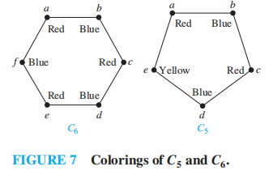
	

	>注：证明见教材$P_{765-766}$

>目前，计算着色数的最佳算法的最坏时间复杂度是指数级的，即使是找到计算着色数的近似算法也相当困难。如果能够找到最坏时间复杂度为多项式级的，计算着色数为2的幂的近似算法，那么也就存在最坏时间复杂度是多项式级的计算着色数的算法。

### Applications of Graph Colorings

应用：

+ 安排期末考试：用顶点表示课程，用边表示存在学生同时修这2门课，用颜色表示考试时间

图示：

+ 频率分配
+ (关于编译器)索引寄存器

### Supplements(from Exercises)

+ 图的**边涂色(edge coloring)**：对边上色，满足与同一顶点关联的边的颜色不同。图的**边着色数(edge chormatic number)** 为在图的边涂色时所使用的最少的颜色数量，记作$\chi'(G)$
	+ 边着色数 $\ge$ 图上顶点的最大度数
	+ 对于有n个顶点的图G，它的边涂色中不超过$\dfrac{n}{2}$条边具有相同颜色
+ 对简单图涂色的算法：
	+ 将所有顶点按度的降序排列，使得$\mathrm{deg}(v_1) \ge \mathrm{deg}v_2 \ge \dots \ge \mathrm{deg}(v_n)$
	+ 先为$v_1$，以及与它不相邻的顶点(若存在的话)赋予颜色1
	+ 然后为没有赋予颜色的第1个顶点，以及与该顶点不相邻且未赋予颜色的顶点赋予颜色2
	+ 重复上述步骤，直至所有顶点都赋上颜色
	
🌰：

>注：这种算法使用的着色数可能不是最少使用颜色的数量

+ 如果连通图G的着色数为k，但是对G上的每条边，删掉其中一条边后的着色图为k - 1，则称图G是**k色临界的(chromatically k-critical)**
	+ $C_n\ (n \ge 3)$是3色临界的
	+ $W_n\ (n \ge 3)$是4色临界的
	+ 如果G是k色临界的，则G中每个顶点的度至少为k - 1
+ 简单图的**k元涂色(k-tuple coloring)** 指将一组k种不同的颜色分配给G中的每个顶点，使得任意2个相邻顶点没有共同颜色，我们将最小的颜色数量n记作$\chi_k(G)$
	+ 🌰：$\chi_2 (C_4) = 4$
		
	

	
	
		

+ **美术馆问题(art gallery problem)**：[wiki](https://en.wikipedia.org/wiki/Art_gallery_problem)

## Supplements

??? info "补充知识(可忽略，考试不会考这种)"

	+ **完全m分图(complete m-partitie graph)**$K_{n_1, n_2, \dots, n_m}$将顶点分为m个子集，每个子集的顶点数为$n_1, n_2, \dots, n_m$，当且仅当顶点位于2个不同的子集时，两个顶点是相邻的
	+ 令无向图G = (V, E)，$A \subseteq V,\ B \subseteq V$，则：
		+ $N(A \cup B) = N(A) \cup N(B)$
		+ $N(A \cap B) \subseteq N(A) \cap N(B)$
		+ $\forall v \in V,\ |N(v)| \le \mathrm{deg}(v)$
		+ 当且仅当G为简单图时，$|N(v)| = \mathrm{deg}(v)$
	+ 假设$S_1, S_2, \dots, S_n$是S的子集，这些子集的**相异代表系(system of distinct representative, SDR)** 是指一个有序n元组$(a_1, a_2, \dots, a_n)$，满足$a_i \in S_i\ (i = 1,2, \dots, n,\ a_i \ne a_j\ (i \ne j))$
		+ 当且仅当对任意I = {1, 2, …, n}的子集，满足$|\bigcup\limits_{i \in I}| \ge |I|$时，存在SDR
	+ 简单图G的**聚类系数(clustering coefficient)** C(G)：u, v为邻居且v, w为邻居 $\rightarrow$ u, w为邻居的<u>概率</u>(u, v, w为G上不同的顶点)
	+ 简单无向图的**团(clique)**：极大完全子图
	+ 简单图的关于顶点的**支配集(dominating set)** 是一组顶点的集合，满足该组顶点外的所有顶点至少与这个集合上的一个顶点是相邻的。最小顶点数的支配集称为**最小支配集(minimum dominating set)**
	+ (补充)同构图的不变量：
		+ 连通性
		+ 哈密顿环的存在
		+ 欧拉环的存在
		+ 交叉数C
		+ n个孤立点(度 = 0)
		+ 二分图
	+ 如果一个有向图与它的逆(converse)是同构的，称该图是**自逆的(self-converse)**
	+ 无向简单图的**定向(orientation)**：一种对每条边方向的分配，使得生成的有向图是强连通的。如果存在这样的定向，称该图是**可定向的(orientable)**
	+ **竞赛图(tournament)**：一种简单有向图，满足：如果u和v是图上两个不同的点，那么边(u, v)和(v, u)有且仅有其中一条在该图上
		+ 每个竞赛图都有哈密顿环
	+ 假设连通图G的顶点为n，点连通度$\kappa (G) = k$，则G至少有$\lceil \dfrac{kn}{2} \rceil$条边
	+ 对于有n个顶点，m条边的连通图G = (V, E)，如果$\kappa (G) = \lambda(G) = \min\limits_{v \in V} \mathrm{deg} v = \dfrac{2m}{n}$，称该图有**最优连通度(optimal connectivity)**
	+ 假设G为有2k个度为奇数的顶点的连通多重图，那么存在k个子图(它们的并集为G，且任意2个子图没有公共边)，每个子图都有一个欧拉路
	+ 令G为有n个顶点的简单图，G的**带宽(bandwidth)** B(G)是指对于所有顶点的排列$a_1, a_2, \dots, a_n$的$\max\{|i - j|\ |\ a_i \text{ and } a_j \text{ are adjacent}\}$的最小数
	+ 在连通简单图中，两个不同顶点$v_1, v_2$的**距离(distance)** 为它们之间最短路的长度。图的**半径(radius)** 是所有顶点到其他顶点的最大距离的最小值。图的**直径(diameter)** 是指两个不同顶点的最大距离
		+ 如果简单图G的直径至少为4，则它的补$\overline{G}$的直径不多于2
		+ 如果简单图G的直径至少为3，则它的补$\overline{G}$的直径不多于3
	+ 假设G为有2m个度为奇数的顶点的多重图，则任意包含该图所有边的环，至少有m条边被包含不止一次
	+ 如果简单图G有至少11个顶点，那么G或$\overline{G}$是非平面的
	+ 对于一张图的某些顶点的集合，如果其中任意一对节点都不是相邻的，称这个顶点的集合是**独立的(independent)**。图的**独立数(independence number)** 是最大的独立顶点集合的顶点数
		+ 简单图的顶点个数 $\le$ 独立数 $\times$ 着色数
		+ 图的着色数 $\le$ n - i - 1，其中n为图的顶点数，i是图的独立数
	+ 当对简单图添加额外的边(不添加额外的点)后仍然保留图的某个性质时，称该性质是**单调递增的(monotone increasing)**；当对简单图去掉额外的边(不去掉原有的点)后仍然保留图的某个性质时，称该性质是**单调递减的(monotone decreasing)**
		+ 当且仅当图的性质Q是单调递减时，图的性质P是单调递增的，其中性质Q：不具备性质P
		+ 假设P是简单图的单调递增的性质，那么n顶点的随机图具备性质P的概率为关于某条边被选入该图的概率p的一个单调非递减函数