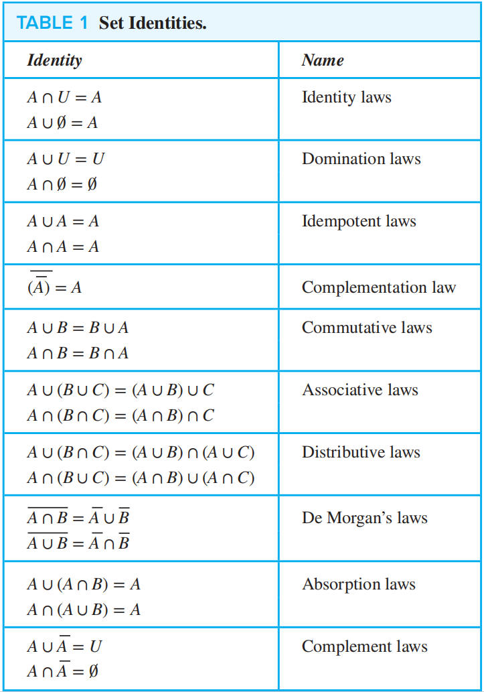
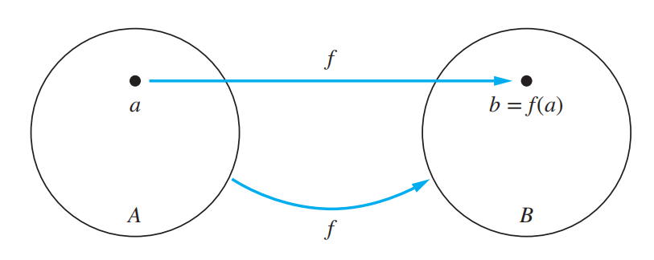
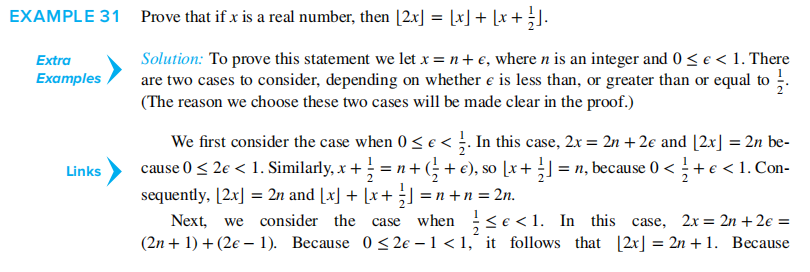
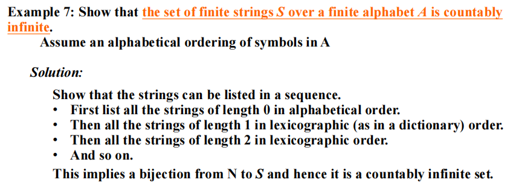
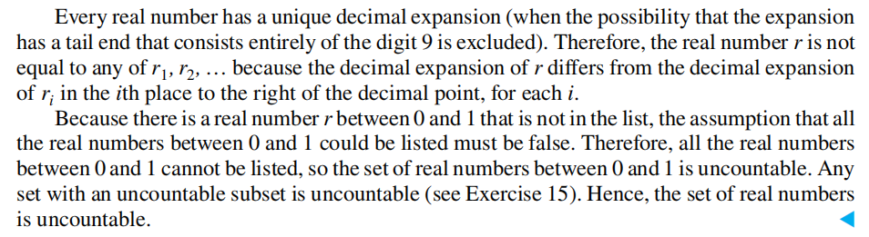

# Chap 2 Basic Structures: Sets, Functions, Sequences, Sums, and Matrices

## 2.1 Sets

### Introduction

**集合(Set)**：一组拥有不同对象（称为*元素(element)*）的无序集
$a \in A$：$a$是$A$中的一个元素，$a \notin A$：$a$不是$A$中的一个元素
???+ "注："

	1. 一般大写字母表示集合，小写字母表示元素
	2. 集合也可以作为某个集合的元素
	3. 集合*不关注*元素的 ==顺序== 和 ==重复==

#### The Description of Sets

**1. 枚举法(Roster Method)**：用花括号{ }包含所有元素，比如$S = \{a, b, c, d\}$
> 如果元素个数太多，可用<u>省略号</u>(ellipses)(...)表示

**2. Set Builder**：$\{x | x \text{ has property }P\}$，对于集合中的所有$x$元素，都具有$P$性质

数学中常用的一些集合：

+ *自然数集*$\mathbf{N} = \{0, 1, 2, 3, \dots \}$
+ *整数集*$\mathbf{Z} = \{\dots, -2, -1, 0, 1, 2 \dots \}$
+ *正整数集*$\mathbf{Z^+} = \{1, 2, 3, \dots\}$
+ *有理数集*$\mathbf{Q} = \{\dfrac{p}{q} | p \in \mathbf{Z}, q \in \mathbf{Z}, \text{and } q \ne 0\}$
+ *实数集*$\mathbf{R}$， *正实数集*$\mathbf{R^+}$
+ *复数集*$\mathbf{C}$

**3. 区间(Intervals)**：

+ *闭区间(Closed Interval)*：$[a, b] = \{ x | a \le x \le b \}$
+ *开区间(Open Interval)*：$(a, b) = \{ x | a < x < b\}$
+ 还有：$[a, b) = \{x | a \le x < b\} \quad (a, b] = \{x | a < x \le b\}$

> 注：在CS中，数据类型(datatype)也是一种集合，同时也包含了一些运算的集合

**相等**：$A = B$，当且仅当$\forall x(x \in A \leftrightarrow x \in B)$，或者$(A \subseteq B) \wedge (B \subseteq A)$

+ **空集(Empty Set/ Null Set)**：没有元素的集合，用"$\emptyset$"表示
+ **单元素集合(Singleton Set)**：只有一个元素的集合
> 注意：$\emptyset \ne \{\emptyset\}$

### Veen Diagram

细节：

+ 用*矩形*表示**全集(Universal Set)**$U$
+ 矩形中的每个*圆圈*表示集合
+ 用*点*表示元素

### Subsets

$A$是$B$的**子集(Subset)** = $B$是$A$的**超集(Superset)**，即$A$中的每个元素都是$B$的元素
记号：$A \subseteq B$或$B \supseteq A$，等价于$\forall x(x \in A \rightarrow x \in B)$

+ 说明$A \subseteq B$：说明每个属于A的元素也属于B
+ 说明$A \nsubseteq B$：找到一个元素$x$，使得$x \in A$但$x \notin B$ 

定理：对于每个集合$S$，$\text{(i)} \emptyset \subseteq S \quad \text{(ii)} S \subseteq S$

**真子集(Proper Subset)**：$A$是$B$的子集，但$A \ne B$，记作$A \subset B$。
当且仅当$\forall x(x \in A \rightarrow x \in B) \wedge \exists x(x \in B \wedge x \notin A)$

### The Size of a Set

如果$S$有$n$个不同的元素，称$S$为**有限集(Finite Set)**，且$n$是$S$的**基数(Cardinality)**，记作$|S|$。否则认为该集合是*无限的(Infinite)* 

### Power Sets

**幂集合(Power Sets)**：包含集合$S$的==所有子集==的集合，记作$P(S) = \{x | x \subseteq S\}$
如果集合有$n$个元素，则它对应的幂集合有$2^n$个元素

性质：$P(A) \subseteq P(B) \Leftrightarrow A \subseteq B$

### Cartesian Products

**有序n元组(The ordered n-tuple)** $(a_1, a_2, \dots, a_n)$

$$
(a_1, a_2, \dots, a_n) = (b_1, b_2, \dots, b_n) \Leftrightarrow a_i = b_i(i = 1, 2, \dots, n)
$$

**有序对(Ordered pairs)**：$n = 2$的有序n元组
> 注意：$(a, b) \ne (b, a)$，除非$a = b$

**笛卡尔积(Cartesian Products)**：$A \times B = \{(a, b) | a \in A \wedge b \in B\}$

对于多个集合的笛卡尔积：
$$
A_1 \times A_2 \times \dots A_n = \{(a_1, a_2, \dots, a_n) | a_i \in A_i \text{ for } i = 1, 2, \dots, n\}
$$

当$A_1 = A_2 = \dots = A_n = A$时，
$$
A_1 \times A_2 \times \dots A_n = A^n = \{(a_1, a_2, \dots, a_n) | a_i \in A \text{ for } i = 1, 2, \dots, n\}
$$

性质：

+ 如果$|A| = m, |B| = n$，那么$|A \times B| = |B \times A| = mn$
+ $A \times B \ne B \times A$，除非$(A = \emptyset) \vee  (B = \emptyset) \vee (A = B)$
+ $(A \times B) \times C \ne A \times B \times C$
+ $A \times \emptyset = \emptyset \times A = \emptyset$
+ $(x, y) \in A \times B \Rightarrow x \in A \wedge y \in B \quad \quad (x, y) \notin A \times B \Rightarrow x \notin A \vee y \notin B$

### Using Set Notation with Quantifiers
$$\forall x \in S(P(x)) \Rightarrow \forall x(x \in S \rightarrow P(x))$$
$$\exists x \in S(P(x)) \Rightarrow \exists x(x \in S \wedge P(x))$$
### Truth Sets and Quantifiers

**真值集(Truth sets)**$P$是指对于某个域$D$的所有$x$，都有$P(x)$为真，即$\{x \in D|P(x)\}$

+ 当且仅当它的真值集$P$为 ==集合$U$== 时，$\forall xP(x)$在全集域$U$为真
+ 当且仅当它的真值集$P$ ==非空== 时，$\exists xP(x)$在全集域$U$为真

### Supplements(from Exercises)

**罗素悖论(Russell's Paradox)**：$S = \{ x | x \notin x\}$

## 2.2 Set Operations

### Set Operations

+ **并集(Union)**：$A \cup B = \{x|x \in A \vee x \in B\}$
	
???+ note "有用的规则"

	+ $A \subseteq A \cup B, \quad B \subseteq A \cup B$
	+ $A \subseteq C, B \subseteq C \Rightarrow A \cup B \subseteq C$
	+ $|A \cup B| \le |A| + |B|$
	+ $A \cup B = B \Leftrightarrow A \subseteq B$

+ **交集(Intersection)**：$A \cap B = \{x|x \in A \wedge x \in B\}$
	如果$A \cap B = \emptyset$，称为*不相交(disjoint)*
	
???+ note "有用的规则"
	
	+ $A \cap B \subseteq A, \quad A \cap B \subseteq B$	
	+ $C \subseteq A, C \subseteq B \Rightarrow C \subseteq A \cap B$
	+ $|A \cap B| \le |A|, \quad |A \cap B| \le |B|$
	+ $A \cap B = A \Leftrightarrow A \subseteq B$

+ **补集(Complement)**：在全集$U$中，集合$A$的补集为$\overline{A}$，它是关于$U$的$A$的补，即$U - A$. $\overline{A} = \{x \in U | x \notin A\}$
	
+ **差集(Difference)**：$A - B = \{x | x \in A \wedge x \notin B\} = A \cap \overline{B}$
	
+ （补充）**对称差集(Symmetric difference)**：$A \oplus B = (A \cup B) - (A \cap B) = (A - B) \cup (B - A)$
	
???+ info "一些规则"

	+ $A \oplus A = \emptyset \quad A \oplus \emptyset = A \quad A \oplus U = \overline{A} \quad A \oplus \overline{A} = U$
	+ $A \oplus B = B \oplus A \quad (A \oplus B) \oplus B = A$

### More on Set Cardinality

⭐**容斥原理(The Principle of Inclusion-Exclusion)**：

$$
|A \cup B| = |A| + |B| - |A \cap B|
$$

$$
|A \cup B \cup C| = |A| + |B| + |C| - |A \cap B| - |B \cap C| - |C \cap A| + |A \cap B \cap C|
$$ 
### Set Identities

🌟**集合恒等式(Set Identities)** 表

❗证明集合恒等式的方法：

1. *子集法*：证明两个集合互为对方的子集
2. *成员表*：类似真值表，用“1”表示元素在该集合内，“0”表示不在集合内
3. *运用已知恒等式*：上表的公式

### Generalized Unions and Intersections

对于多个集合，我们对它们的并集和交集有如下定义：
$\bigcup\limits ^n _{i = 1} A_i= A_1 \cup A_2 \cup \dots \cup A_n$
$\bigcap\limits ^n _{i = 1} A_i= A_1 \cap A_2 \cap \dots \cap A_n$

对于无限集合，则有如下定义：
$\bigcup\limits ^{\infty} _{i = 1} A_i= A_1 \cup A_2 \cup \dots \cup A_n \cup \dots$
$\bigcap\limits ^{\infty} _{i = 1} A_i= A_1 \cap A_2 \cap \dots \cap A_n \cap \dots$

更一般地，如果$I$是个集合，则：
$\bigcup_{i \in I}A_i = \{x | \exists i \in I(x \in A_i)\}$
$\bigcap_{i \in I}A_i = \{x | \forall i \in I(x \in A_i)\}$

### Computer Representations of Sets

利用计算机表示集合的方法：

+ 为全集$U$中的元素确定一个（任意的）顺序（因为集合不规定顺序），比如$a_1, a_2, \dots, a_n$
+ 使用长度为$n$的 **[位串](1.md#logic-and-bit-operations)** 表示$U$的子集$A$，如果$a_i \in A$，则$a_i = 1$，否则$a_i = 0$

使用位串表示集合运算：

+ **交集**：AND
+ **并集**：OR
+ **补集**：按位取反
+ **差集**：利用$A - B = A \cap \overline{B}$，再利用上面交集和补集的方法

### Multisets

**Multisets(多重集)**：一个无序的的元素集，元素可出现一次**或多次**，记为$\{m_1 \cdot a_1, m_2 \cdot a_2, \dots, m_r \cdot a_r\}$，其中$a_i$为元素，$m_i$为其对应元素出现的次数

+ 多重集的**基数** = $\sum\limits_{i = 1}^r m_i$
考虑两个多重集$P$和$Q$

+ **并集**：保留元素出现个数 ==最多== 的那项
+ **交集**：保留元素出现个数 ==最少== 的那项
+ **差集**：元素出现个数之差（注意顺序：$P - Q$ ），如果结果小于0，则取0
+ **和**：元素出现个数之和，记作$P + Q$

### Supplements(from Exercises)

1. $A \subseteq B \Leftrightarrow \overline{B} \subseteq \overline{A}$
2. $(A - B) \cap (B - C) \cap (C - A) = \emptyset$
3. $\overline{(A \cup B)} \cap \overline{(B \cup C)} \cap \overline{(A \cup C)} = \overline{A} \cap \overline{B} \cap \overline{C}$
4.   $A \times (B \cup C) = (A \times B) \cup (A \times C)$
	$A \times (B \cap C) = (A \times B) \cap (A \times C)$
	$A \times (B - C) = (A \times B) - (A \times C)$
	$\overline{A} \times \overline{(B \cup C)} = \overline{A \times (B \cup C)}$ 
5. **Jaccard similarity**：$J(A, B) = \dfrac{|A \cap B|}{|A \cup B|}$，$J(\emptyset, \emptyset) = 1$
	
	**Jaccard distance**：$d_J(A, B) = 1 - J(A, B)$
	
	有以下性质：

	+ $J(A, A) = 1, d_J(A, A) = 0$
	+ $J(A, B) = J(B, A), d_J(A, B) = d_J(B, A)$
	+ $J(A, B) = 0, d_J(A, B) = 0$，当且仅当$A = B$
	+ $0 \le J(A, B) \le 1, 0 \le d_J(A, B) \le 1$
	+ **三角不等式(triangle inequality)**：$d_J(A, C) \le d_J(A, B) + d_J(B, C)$
6. **模糊集(Fuzzy sets)**：全集$U$中的每个元素都有一个*成员值(degree of membership)*，范围为$[0, 1]$，例如$F = \{0.6 \text{ Alice}, 0.9 \text{ Brian}, 0.1 \text{ Oscar}\}$

	+ **补集**：$\overline{F}$的成员值 = 1 - $F$的成员值
	+ **并集**：两个模糊集中*最大*的成员值
	+ **交集**：两个模糊集中*最小*的成员值

## 2.3 Functions

### Definition

**函数(Funtions**, 又叫作mappings/transformations)：对于两个非空集合$A, B$，$A$中的元素有且仅有一个对应于$B$上的元素。记作：$f(a) = b$或$f: A \rightarrow B$，可用下面的逻辑语言表示：
$$\forall x[x \in A \rightarrow \exists y[y \in B \wedge (x, y) \in f]] \quad \text{ or } \quad \forall x, y_1, y_2[[(x,y_1) \in f \wedge (x, y_2) \in f] \rightarrow y_1 =y _2]$$

表示方法：清晰的赋值语句、公式、计算机程序。函数其实是$A$到$B$之间的*关系(relation)*，也就是*笛卡尔积*$A \times B$的一个*子集*，因此$f(a) = b$也可记作$(a, b)$

+ **域(Domain)**：$A$
+ **伴域(Codomain)**：$B$
+ 如果$f(a) = b$，则$b$是$a$的**象(image)**，而$a$是$b$的**原象(preimage)**
+ $f$的**范围(Range)**，是指对于集合$A$中所有元素的象，记作$f(A)$
	+ 集合$A$的子集$S$的象，记作$f(S) = \{f(s) | s \in S\}$，注意$f(S)$代表的是一个==集合==
	+ 集合$B$的子集$S$的*逆象(inverse image)*，是集合$A$的一个子集，记为$f^{-1}(S) = \{a \in A | f(a) \in S\}$。
		它们的性质见最后的[[Chap 2 Basic Structures#^ad9a44|补充]]

如果两个函数有*相同的域*，*相同的伴域*，和*相同的映射关系*，则称这两个函数**相等**

函数的加法和乘法：
$$(f_1 + f_2)(x) = f_1(x) + f_2(x)\quad \quad (f_1f_2)(x) = f_1(x)f_2(x)$$
### One-to-one and Onto Functions

+ **单射(Injection, one-to-one)**：当$f(a) = f(b)$，得到$a = b$
	逻辑语言：
	$$\forall a \forall b (a \in A \wedge b \in A \wedge (f(a) = f(b) \rightarrow a = b))$$$$\forall a \forall b (a \in A \wedge b \in A \wedge (a \ne b \rightarrow f(a) \ne f(b)))$$
???+ note "注"

	若$x, y$在$f$的域内，则：
	+ 单调递增：$f(x) \le f(y)$，即$\forall x \forall y(x < y \rightarrow f(x) \le f(y))$
	+ 单调递减：$f(x) \ge f(y)$，即$\forall x \forall y(x < y \rightarrow f(x) \ge f(y))$
	+ **严格**单调递增：$f(x) < f(y)$，即$\forall x \forall y(x < y \rightarrow f(x) < f(y))$
	+ **严格**单调递减：$f(y) > f(y)$，即$\forall x \forall y(x < y \rightarrow f(x) > f(y))$
	其中只有==严格单增/减函数==是*单射*
	
+ **满射(Surjection, onto)**：对于每个$b \in B$，都有$a \in A$，使得$f(a) = b$
	逻辑语言：$\forall y \exists x (f(x) = y)$
+ **双射(Bijection, one-to-one correspondence)**：既是单射也是满射的函数
	>对于$A \rightarrow B$的一个双射，$|A| = |B|$，即两个集合**基数**相同
	

判断单射或满射的方法：

---
*恒等函数(Identity function)*：$\iota_A: A \rightarrow A$，即$\iota_A(x) = x$，它是一个**双射**的函数
### Inverse Functions and Compositions of Functions

**反函数(Inverse Function)**：对于一个*双射*函数$f: A \rightarrow B$，它的反函数为$f^{-1}: B \rightarrow A$，即当$f(a) = b$时，$f^{-1}(b) = a$

>记住：只有*双射*函数有反函数

**复合函数(Composition of the functions)**：$(f \circ g)(a) = f(g(a))$
???+ note "注："

	1. $f \circ g$的域为$g$的域
	2. $f \circ g$的范围为$g$关于$f$的范围
	3. 只有当$g$的范围为$f$的域的子集时，$f \circ g$才有定义

### The Graph of Functions

函数$f$的图象(graph)是一个有序对的集合$\{(a, b) | a \in A \text{ and } f(a) = b\}$

🌰
 ^fc4fa4
### Some Important Functions

+ **底函数(Floor function)**：$\lfloor x \rfloor$，取不大于$x$的最大整数 ^7289a4
+ **顶函数(Ceiling function)**：$\lceil x \rceil$，取不小于$x$的最小整数
图象：

❗重要性质：

🌰

### ~~Partial Function(偏函数)~~

### Supplements(from Exercises)

^ad9a44

1. $f(S \cup T) = f(S) \cup f(T) \quad \quad f(S \cap T) \subseteq f(S) \cap f(T)$
2. $f^{-1}(S \cup T) = f^{-1}(S) \cup f^{-1}(T) \quad \quad f^{-1}(S \cap T) = f^{-1}(S) \cap f^{-1}(T)$
3. $f^{-1}(\overline{S}) = \overline{f^{-1}(S)}$
4. **特征函数(Characteristic function)**：$f_S: U \rightarrow \{0, 1\}$，当$x$在$S$中时，$f_S(x) = 1$，否则$f_S(x) = 0$
5. 对于函数$f: A \rightarrow B$，$|A| = |B|$，$f$为*单射*函数的<u>充要条件</u>是$f$为*满射*函数
6. 集合$S$是*无限*的充要条件是$S$的子集$A$与$S$是*双射*关系

## 2.4 Sequences ~~and Summations~~

### Sequences

**序列(Sequences)**：一个从整数集合（通常是$\{0, 1, 2, \dots\}$或$\{1, 2, 3,\dots\}$）映射到某个集合$S$的函数，一般用$\{a_n\}$表示一个序列（不要和集合的记号弄混）

一些特殊序列：

+ **等比数列(Geometric progression)**：$a, ar, ar^2, \dots, ar^n, \dots$
	其中$a$被称为*首项*，$r$被称为*公比*
+ **等差数列(Arithmetric progression)**：$a, a + d, a + 2d, \dots, a + nd, \dots$
	其中$a$被称为*首项*，$d$被称为*公差*
+ **字符串(String)**：包含字符的有限序列，可用$a_1, a_2, \dots, a_n$标记
	+ 应用：[[Chap 1 The Foundations--Logic and Proofs#^755cc0|位串]]
	+ **长度(Length)**：字符串包含项的个数
	+ **空串(Empty string)**：长度为0，记作$\lambda$
### Recurrence Relations

**递推关系(Recurrence Relations)**：一个用于表示$a_n$的方程，由它前面的项$a_0, a_1, \dots, a_{n - 1}$构成 ^8b6642

如果一个序列能够满足递推关系，那这个序列被称为**solution(通解？)**

因为序列的第一项前面没有东西，因此需要**起始条件(initial conditions)** 才能使递推关系生效

**斐波那契数列(Fibonacci sequence)**：起始条件为$f_0 = 0, f_1 = 1$，且满足递推关系$f_n = f_{n - 1} + f_{n - 2}, n = 2, 3, 4, \dots$ ^67e5aa

*Closed formula*：一个能够解出递推关系及其起始条件的公式

求解方法：
>注：更多的技巧见第5章，现在仅介绍简单的方法

**迭代(Iteration)**：

+ **前代(forward substitution)**：从首项开始代入递推关系，直至$a_n$项
+ **回代(backward substitution)**：从$a_n$项开始往回代，直到首项$a_1$
>我们使用迭代大致猜出这个序列的通解，还需要通过**数学归纳法(mathematical induction)** 检验，这将在第5章讲解

### Special Integer Sequences

有时，我们只知道一个序列的前面几项，但是通过一些技巧，我们也能判断出该序列的solution：
+ 该序列是否出现过**相同的值**，如果有的话，出现了多少次？
+ 该序列的项是否通过对前面某些项的**相加**得到？
+ 该序列的项是否通过对前面某些项的**相乘**得到？
+ 该序列的项是否通过对前面某些项的**某种组合**？
+ 该序列是否有**周期性**
+ 该序列是否与我们*所熟知的一些序列*（见下表）有关

### Summations

这里没什么东西好说，可能有点用的就是下面这张表👇

### Supplements(from Exercises)

1. **telescoping(套管式？)**：$\sum\limits_{j = 1}^n(a_j - a_{j - 1}) = a_n - a_0$
2. 累积：$\prod\limits_{j = m}^n a_j$
## 2.5 Cardinality of Sets

### The Cardinality of a Finite Set

^70717b
+ 回顾（有限集中）==[[Chap 2 Basic Structures#^f1e405|cardinality(基数)]]==的概念
+ **[[Chap 2 Basic Structures#^adb26d|容斥原理]]**：
	拓展：
	$$
	|A_1 \cup A_2 \cup \dots \cup A_n| = \sum\limits^n_{i = 1}|A_i| - \sum\limits_{1 \le i < j \le n}|A_i \cap A_j| + \sum\limits_{1 \le < i < j < k \le n}|A_i \cap A_j \cap A_k| + \dots + (-1)^{n-1}|A_1 \cap A_2 \cap \dots \cap A_n|
	$$
	一共有$C^1_n + C^2_n + \dots + C^n_n = 2^n - 1$项

### Extend to Infinite Set

> 当且仅当$A$与$B$存在==双射==的关系，集合$A$与$B$基数**相等**
> （这样就不用具体比较集合的大小）

+ 如果集合$A \rightarrow B$存在==单射==的关系，则$|A| \le |B|$
+ 如果$|A| \le |B|$且$|A| \ne |B|$，则$|A| < |B|$

---
#### Countable Sets

???+ info

	如果一个集合：
 	+ 是有限集
 	+ 或者，与*正整数集*有相同的基数的无限集
	则这个集合是**可数的（countable）**，否则是**不可数的（uncountable）**

可数集合的基数$|S|$用$\aleph_0$表示

⭐判断方法：当能够列出以序列(sequence)元素为集合的所有元素（即双射关系$f: Z^+ \rightarrow {a_n}$，有$a_1 = f(1), a_2 = f(2), \dots, a_n = f(n), \dots$），一个无限集是可数的

🌰 ^fa057f
1. *Even numbers*
	

2. **Hibert's Grand Hotel**
	
???+ note "补充"

	+ 如果奇/偶数的房间不能动，也能满足要求
	+ 如果增加一个一样的*Grand Hotel*，则原来酒店里的人能占满两个酒店的所有房间
	+ 如果有可数的无限个大巴来到酒店，且每辆大巴都有可数的无限个人，则能确保所有人（大巴上的人和原来酒店的人）都在酒店房间里

3. *Integers*
	

4. *Rational numbers*
	

5. *String*
	

6. *Programs*
	

#### Uncountable Sets

**定理1**：如果集合$A$和$B$是**可数**的，则$A \cup B$也**可数**
???+ hint "拓展"

	+ *有限个*可数集合的交集也是可数的
	+ *可数数字个*可数集合的交集也是可数的😕(见Exercise 27)

**定理2**(*SCHRODER-BERNSTEIN THEOREM*)：如果$|A| \le |B|$且$|B| \le |A|$，则$|A| = |B|$。也就是说，如果$A \rightarrow B$是*单射*的，$B \rightarrow A$也是*单射*的，则$A$与$B$有**双射**的
>+ 反过来也成立
>+ 看似简单的定理，证明起来一点也不简单，但结论挺好记的😁

❗其他定理/结论：

+ $(0, 1)$之间的*实数***不可数**
+ 所有*实数*都**不可数**

	证明（用到**Cantor diagonalization argument(康托对角化论证)**）
	
	
+ 不存在这样的**无限集**，它的基数小于**可数集合**的基数
+ $A, B$为两个集合，且$A \subset B \rightarrow |A| \le |B|$
+ $A, B$为两个集合，$A$不可数且$A \subseteq B \rightarrow B$不可数
+ 可数集合的*子集也是可数的*
+ $|A| = |B| \rightarrow |P(A)| = |P(B)|$
+ $(|A| = |B|) \wedge (|C| = |D|) \rightarrow |A \times C| = |B \times D|$
+ $(|A| = |B|) \wedge (|B| = |C|) \rightarrow |A| = |C|$
+ $(|A| \le |B|) \wedge (|B| \le |C|) \rightarrow |A| \le |C|$
+ $A$是可数集合，且存在满射$f: A \rightarrow B$，则$B$也是可数集合
+ 如果$A$是无限集合，则存在一个可数的无限子集
+ 不存在这样的无限集合$A$，使得$|A| < |\boldsymbol{Z}^+| = \aleph_0$
+ 一个包含元素为从正整数映射到$\{0, 1, 2, 3, 4, 5, 6, 7, 8, 9\}$的函数的集合是不可数的

### Applications

#### Some [[Chap 2 Basic Structures#^fa057f|Examples]] Above👆

#### Uncomputable Function
>如果一个计算机程序能够找到这个函数的值，则称该函数为**可计算的(computable)**，否则称为**不可计算(uncomputable)**

#### The Continuum Hypothesis

???+ note

	+ **幂集**的基数总是==大于==它对应的**一般集合**的基数
	+ $|P(Z^+)| = |R| = c$

**Continuum Hypothesis(连续统假设)**：不存在这样的基数$a$，使得$\aleph_0 < a < \aleph_1$

## ~~2.6 Matrices~~

>虽然划掉了（考试不考），但这里还是稍微提一下基本概念~~（线代忘得差不多了）~~

**矩阵(Matrix)**：$\mathbf{A} = \begin{bmatrix}a_{11} & a_{12} & \dots & a_{1n} \\ a_{21} & a_{22} & \dots & a_{2n} \\ \vdots & \vdots & & \vdots \\ a_{m1} & a_{m2} & \dots & a_{mn} \end{bmatrix}$，可简写为$\mathbf{A} = [a_{ij}]$

**相等**：当且仅当两个矩阵的规模相同（行、列数相同）且每个位置的元素都相等时，两个矩阵相等

**加法**：当矩阵$\mathbf{A}, \mathbf{B}$均为$m \times n$的矩阵时，$\mathbf{A} + \mathbf{B} = [a_{ij} + b_{ij}]$
>矩阵加法满足交换律、结合律

**乘法**：当矩阵$\mathbf{A}$的规模为$m \times k$，矩阵$\mathbf{B}$的规模为$k \times n$时，$\mathbf{AB} = [c_{ij}]$，其中$c_{ij} = \sum\limits_{t = 1}^ka_{it}b_{tj}$

>注意：矩阵乘法有**结合律**和**分配律**，==但交换律不成立（很容易证明）==

**单位矩阵(Identity matrix)**：$\mathbf{I}_n = \begin{bmatrix}1 & 0 & \dots & 0 \\ 0 & 1 &\dots & 0 \\ \vdots & \vdots & & \vdots \\ 0 & 0 & \dots & 1\end{bmatrix} = [\delta_{ij}]$，其中$\delta_{ij}= \begin{cases}1 & \text{if } i = j, \\ 0 & \text{if } i \ne j.\end{cases}$
性质：对于规模为$m \times n$的矩阵$\mathbf{A}$，$\mathbf{AI}_n = \mathbf{I}_m\mathbf{A} = \mathbf{A}$

**幂**：$\mathbf{A}^0 = \mathbf{I}_n, \quad \quad \mathbf{A}^r = \underbrace{\mathbf{AAA} \dots \mathbf{A}}_{r \text{ times}}$

**转置(Transpose)**：规模为$m \times n$的矩阵$\mathbf{A} = [a_{ij}]$的转置矩阵为$\mathbf{A}^t = [b_{ij}]$，规模为$n \times m$，其中$b_{ij} = a_{ji}$
???+ note "性质"

	+ $(\mathbf{A}^t)^t = \mathbf{A}$
	+ $(\mathbf{A} + \mathbf{B})^t = \mathbf{A}^t + \mathbf{B}^t$
	+ $(\mathbf{AB})^t = \mathbf{B}^t\mathbf{A}^t$

**对称矩阵(Symmetric matrix)**，对于**方阵**$\mathbf{A}$，如果$\mathbf{A} = \mathbf{A}^t$，则$\mathbf{A}$为对称矩阵（$\mathbf{A}$内的元素关于*主对角线*对称）

???+ note "注"

	可以证明下列矩阵为对称矩阵——
	+ $\mathbf{AA}^t$
	+ $\mathbf{A} + \mathbf{A}^t$

>注：下面的知识点就在[[Chap 9 Relations|关系]]那章用上了

**零一矩阵(Zero-one matrix)**：元素仅为0或1的矩阵（与布尔运算紧密相关） ^0b82d1
$$
b_1 \wedge b_2 = \begin{cases}1 & \text{if }b_1 = b_2 = 1 \\ 0 & \text{otherwise},\end{cases} \quad \quad b_1 \vee b_2 = \begin{cases}1 & \text{if } b_1 = 1 \text{ or } b_2 = 1 \\ 0 & \text{otherwise}.\end{cases}
$$
对于两个规模均为$m \times n$零一矩阵$\mathbf{A} = [a_{ij}], \mathbf{B} = [b_{ij}]$
+ **并(Join)**：$\mathbf{A} \vee \mathbf{B}$，每个元素为$a_{ij} \vee b_{ij}$
+ **交(Meet)**：$\mathbf{A} \wedge \mathbf{B}$，每个元素为$a_{ij} \wedge b_{ij}$
???+ note "性质"
	+ $\mathbf{A} \vee \mathbf{A} = \mathbf{A}$
	+ $\mathbf{A} \wedge \mathbf{A} = \mathbf{A}$
	+ 相同运算符的情况下满足**交换律**和**结合律**
	+ **分配律**：$\mathbf{A} \vee (\mathbf{B} \wedge \mathbf{C}) = (\mathbf{A} \vee \mathbf{B}) \wedge (\mathbf{A} \vee \mathbf{C}) \quad \quad \mathbf{A} \wedge (\mathbf{B} \vee \mathbf{C}) = (\mathbf{A} \wedge \mathbf{B}) \vee (\mathbf{A} \wedge \mathbf{C})$

对于两个零一矩阵$\mathbf{A}$（规模为$m \times k$）和$\mathbf{B}$（规模为$k \times n$），
+ **布尔积(Boolean product)**：$\mathbf{A} \odot \mathbf{B}$（规模为$m \times n$），每个元素$c_{ij} = \bigvee\limits_{t = 1}^k (a_{it} \wedge b_{tj})$ ^23f1ca
+ **布尔幂(Boolean power)**：$\mathbf{A}^{[r]} = \underbrace{\mathbf{A} \odot\mathbf{A} \odot\mathbf{A} \odot \dots \odot\mathbf{A}}_{r \text{ times}}$，规定$\mathbf{A}^{[0]} = \mathbf{I}_n$
???+ note "性质"

	+ $\mathbf{A} \odot \mathbf{I} = \mathbf{I} \odot \mathbf{A} = \mathbf{A}$
	+ **结合律**

### Supplements(from Exercises)

**对角矩阵(Diagonal matrix)**：对于$n \times n$方阵$\mathbf{A} = [a_{ij}]$，如果当$i \ne j$时，$a_{ij} = 0$成立，则$\mathbf{A}$为对称矩阵

**逆矩阵(Inverse)**：如果$\mathbf{A}, \mathbf{B}$为$n \times n$的方阵，且$\mathbf{AB} = \mathbf{BA} = \mathbf{I}_n$，则称$\mathbf{B}$为$\mathbf{A}$的逆矩阵，记作$\mathbf{B} = \mathbf{A}^{-1}$
性质： $(\mathbf{A}^n)^{-1} = (\mathbf{A}^{-1})^n$

利用矩阵解线性方程组（略）