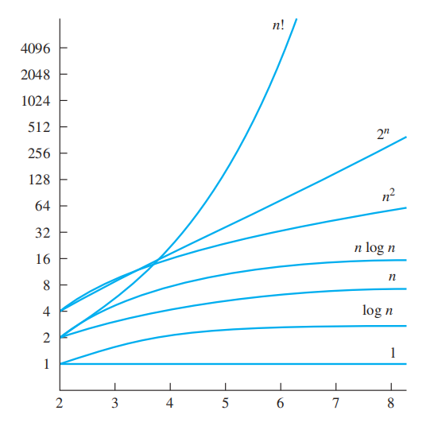
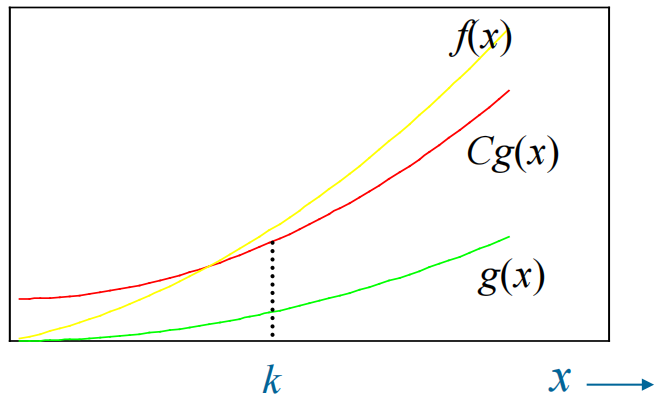

# Chap 3 Algorithms
## Algorithms

>省流：这里的内容貌似不会直接考察 ~~(所以可以选择性忽略这一小节)~~

### Algorithms

我们可以把很多的问题当作某个通用问题(general problems)的一种特殊情况来求解。而要求解这个通用问题，我们需要明确解决问题的流程，也就是**算法(algorithms)**——用来执行计算或求解问题的有限步精确指令的序列。

如何描述算法？

+ 自然语言（太繁琐❌）
+ 编程语言（难以理解❌）
+ **伪代码(pseudocode)**（:white_check_mark:）
> 伪代码具体写法见附录（后续会更新🚧）

简单验证算法的正确性：构造一个**trace**~~(我不知道翻译成什么)~~，代入自己指定的输入，按照算法一步步往下做，看能不能得到正确的输出

算法的性质：

+ *输入(input)*：一个算法应有来自指定集合的输入值
+ *输出(output)*：对于每组输入，算法能够产生来自指定集合的输出
+ *确定性(definiteness)*：算法的每一步必须被精确定义
+ *正确性(correctness)*：对于每组输入，算法应该给出正确的输出值
+ *有限性(finiteness)*：对于任何输入，算法应该在经过有限步后给出预期的输出
+ *有效性(effectiveness)*：算法的每一步必须在有限的时间里被精确地执行
+ *通用性(generality)*：算法应适用于所有预期形式的问题，而不仅仅解决某个特例

🌰

>时间复杂度：$\Theta(n)$

CS常见的重要且基本的问题：

+ 查找问题(searching problems)
+ 排序问题(sorting problems)
+ 优化问题(optimization problems)

### Searching Algorithms

#### The Linear Search

>时间复杂度：$\Theta(n)$

#### The Binary Search

>使用前提：数据必须是**有序**的（以升序为例）

时间复杂度：$\Theta(\log n)$ 

???+ note "注"

	注意这里的二分查找取左半边的部分和通常做法不太一样——这里是$j := m$而不是$j := m - 1$，因此判断条件也变了(从$i <= j$变成$i < j$)。下表来自我高中信息技术的笔记~~(用来死记硬背)~~

	|       |  i  |  j  |        m        | i的变化  | j的变化  |
	| ----- | :-: | :-: | :-------------: | :---: | :---: |
	| i <= j  |  0  | n-1 |   (i + j) / 2   |  m+1  | m -1  |
	| i < j   | -1  | n-1 | (i + j + 1) / 2 |   m   | m - 1 |
	|       |  0  |  n  |   (i + j) / 2   | m + 1 |   m   |
	| i < j+1 | -1  |  n  |   (i + j) / 2   |   m   |   m   |

	口诀(针对中间两行)：<u>左偏右扩，右偏左扩，哪里扩哪里取m</u>。

	+ 所谓“扩”指i或j的取值相对于第一种情况发生了变化
	+ 而所谓"偏"指m的取值——这里着重声明一下：

		+ (i + j) / 2指的是$\lfloor(i + j) / 2\rfloor$，这是“左偏”
		+ 而(i + j + 1) / 2指的是$\lceil(i + j) / 2\rceil$，这是“右偏”

### Sorting

>有许许多多的排序算法，比如下面这些(其中高光部分是等会儿会讲的，其它的后面也都会讲到)：

+ ==冒泡排序(Bubble Sort)==
+ ==插入排序(Insertion Sort)==
+ 选择排序(Selection Sort)
+ 二分插入排序(Binary Insertion Sort)
+ 筛动排序(Shaker Sort)
+ 归并排序(Merge Sort)
+ 快速排序(Quick Sort)
+ 联赛排序(Tournament Sort)

#### The Bubble Sort

>思路：以升序为例，比较两个相邻项，如果顺序错误，对调两者，否则不动。这样可以做到小的项往上“冒泡”，大的项往下“沉”，实现排序。

示意图

伪代码

时间复杂度：$\Theta(n^2)$

#### The Insertion Sort

>思路：对于某个列表第j项，前面j-1项已经排好序，将第j项分别于前j-1项进行比较，找到合适的位置，然后“插入”，实现前j项的排序

伪代码

时间复杂度：$\Theta(n^2)$

### String Matching

字符串匹配(String matching)是搜索和排序问题的其中一种情况：在**文本(text)**$T$中找到**模式(pattern)**$P$。这类问题出现于多个领域中。

简单的算法：**简单字符串匹配器(naive string matcher)**

>注：这里的下标$s$被称为**移位(shift)**，它是文本中模块出现位置（第一个字符）的前一个位置

配上这个示意图可以更好理解上述算法

### Greedy Algorithms

**优化问题(Optimization problems)**：对于给定参数，找到这个问题的最大或最小解

其中一种最简单的算法——**贪心算法(Greedy algorithm)**

核心思想：局部最优解 $\rightarrow$ 全局最优解

>注意：当我们用贪心算法得到可行解时，不要忘记验证它是否得到的是最优解

???+ example "典型例子"

	=== "**收银员算法(Cashier's algorithm)**"

		:dart:：找最少数目的零钱

		

		
		

		然后我们需要证明它是否得到最优解。在证明之前，我们先得到一个引理：

		>注：America有四种硬币——quarter(25 cents)，dime(10 cents)，nickel(5 cents)，penny(1 cent)

		**引理1**：如果$n$是正整数，通过使用q、d、n、p四种硬币找零钱，要找最少数目的零钱，则最多使用2个d、1个n、4个p，且不能使用2个d和1个n，而且d、n、p的硬币总和不超过24 cents

		>可用归谬法证，这个不难理解

		证明过程省略，还是采用**归谬法**（见教材$P_{211}$）

	=== "**安排讲座**"

		问题：给定一组讲座的开始和结束时间，要求你安排这些讲座的时间，确保在一间大厅里安排尽可能多的讲座。

		如何思考：

		+ 按开始时间先后顺序排❌
		+ 按持续时间长短升序排序❌
		+ 按**结束时间**先后顺序排:white_check_mark:

		

		
		

### ~~The Halting Problem~~

**停机问题(Halting problem)**：这是**不可解(unsolvable)** 的问题

示意图

>这不是重点内容，了解即可

### Supplements(from Exercises)

+ **三分查找算法(Ternary search algorithm)**：在升序列表中，通过连续划分三块(尽可能)相等规模的子列表，并限制在其中一块进行搜索要找的元素。

+ **选择排序(Selection algorithm)**：首先找到列表中最小的元素，将这个元素移动至最前面。然后在剩下的元素中寻找最小的元素，并放在第二个位置。重复该步骤，直至所有元素均排好序。

+ **二分插入排序(Binary insertion sort)**：插入排序的一种变体。通过**二分查找**而非线性查找的方式，在之前已排好序的元素中找到正确的位置。

## The Growth of Functions

### Big-O Notation

**大$O$表示法**的定义：令$f$和$g$为从整数集或实数集映射到实数集的函数，如果存在常数$C$和$k$，当$x > k$时，使得$|f(x)| \le C|g(x)|$，我们认为$f(x)$是$O(g(x))$（也就是说，$f(x)$的增长速度慢于$g(x)$）

其中$C$和$k$被称为**见证者(witnesses)**。如果要证明$f(x)$是$O(g(x))$，需要找到这么一对见证者。当然，如果能找到一对见证者，也能够找到无数对见证者（很容易证明）

+ 如果$f(x)$是$O(g(x))$且$g(x)$是$O(f(x))$，那么称$f(x)$和$g(x)$是**同阶(same order)** 的

+ 如果$f(x)$是$O(g(x))$，且$|h(x)| > |g(x)|$，那么$f(x)$也是$O(h(x))$
>根据这条性质，虽然可以取很多个增长速率快于$f(x)$的函数，但为了统一起见，我们往往选择**最小的，且增长速率快于$f(x)$** 的$g(x)$作为大O阶

>注：
>
>+ 有时我们会看到$f(x) = O(g(x))$，这是对等号的滥用——因为等号两边的东西并不相等。但我们可以使用$f(x) \in O(g(x))$
>+ 在之后的篇章中，由于我们研究的都是正数，所以就将绝对值去掉了，以简化计算

### Big-O Estimate for Some Important Functions

#### Polynomials

**定理1**：令$f(x) = a_nx^n + a_{n - 1}x^{n - 1} + \dots + a_1x +a_0 (a_0, a_1, \dots, a_{n - 1}, a_n \in \mathbf{R})$，那么$f(x)$是$O(x^n)$，即多项式的**首项**控制整个多项式的增长速率

一些重要结论：

+ $n!$是$O(n^n)$
+ $\log n!$是$O(n \log n)$
+ $n$是$O(2^n)$
+ $\log n$是$O(n)$
+ 当$d > c > 1$时，$n^c$是$O(n^d)$，反之不成立
+ 当$d > c > 1$且$b > 1$时，$(\log_bn)^c$是$O(n^d)$，反之不成立
+ 当$c > b > 1$时，$b^n$是$O(c^n)$，反之不成立
+ 当$c > 1$时，$c^n$是$O(n!)$，反之不成立

来自习题的补充：

+ $1^k + 2^k + \dots + n^k$是$O(n^{k + 1})$
+ 对于所有实数$a > 1, b > 1$，如果$f(x)$是$O(\log_b x)$，则$f(x)$是$O(\log_a x)$
+ **调和(级)数(Harmonic number)**：$H_n = 1 + \dfrac{1}{2} + \dots + \dfrac{1}{n}$，则$H_n$是$O(\log n)$
+ $n \log n$是$O(\log n!)$

❗常见函数增长率图象

### The Growth of Combinations of Functions

**定理2**：假设$f_1(x)$是$O(g_1(x))$，$f_2(x)$是$O(g_2(x))$，那么$(f_1 + f_2)(x)$是$O(g(x))$，其中$g(x)=(\max\{|g_1(x)|, |g_2(x)|\}), \forall x$

推导：由已知，假设当$x > k_1$时，有$|f_1(x)| \le C_1|g_1(x)|$；当$x > k_2$时，有$|f_2(x)| \le C_2|g_2(x)|$，则

$$
\begin{align}
|f_1(x)|+|f_2(x)| & \le C_1|g_1(x)| + C_2|g_2(x)| \notag \\
& \le C_1|g(x)| + C_2|g(x)| \notag \\ 
& = (C_1 + C_2)|g(x)| \notag \\
& = C|g(x)| \notag
\end{align}
$$

其中$C = C_1 + C_2$，$k = \max\{ k_1, k_2\}$

*推论1*：如果$f_1(x)$和$f_2(x)$都是$O(g(x))$，那么$(f_1 + f_2)(x)$是$O(g(x))$

**定理3**：假设$f_1(x)$是$O(g_1(x))$，$f_2(x)$是$O(g_2(x))$，那么$(f_1f_2)(x)$是$O(g_1(x)g_2(x))$

>推导过程类似前面，具体见教材$P_{226}$

### Big-Omega and Big-Theta Notation

大$O$表示法只能检测**上限**，如果要分析**下限**，则需要使用大$\Omega$表示法。

**大$\Omega$表示法**的定义：令$f$和$g$为从整数集或实数集映射到实数集的函数，如果存在常数$C$和$k$，当$x > k$时，使得$|f(x)| \ge C|g(x)|$，我们认为$f(x)$是$\Omega(g(x))$（也就是说，$f(x)$的增长速度快于$g(x)$）
>注：$f(x)$是$\Omega(g(x))$，当且仅当$g(x)$是$O(f(x))$

除此之外，我们用大$\Theta$表示法同时表示**上下限**。

**大$\Theta$表示法**的定义：当$f(x)$是$O(g(x))$且$f(x)$是$\Omega(g(x))$，则称$f(x)$是$\Theta(g(x))$。如果满足这一关系，则$f(x)$与$g(x)$**同阶(same order)**，即$f(x)$是$g(x)$的*阶(order)*

+ 如果$f(x)$是$\Theta(g(x))$，那么$g(x)$是$\Theta(f(x))$
+ $f(x)$是$\Theta(g(x))$的充要条件是$f(x)$是$O(g(x))$且$g(x)$是$O(f(x))$
+ 另一个充要条件：存在三个正实数$C_1, C_2, k$，当$x > k$时，满足$C_1|g(x)| \le |f(x)| \le C_2|g(x)|$

**定理4**：令$f(x) = a_nx^n + a_{n-1}x^{n-1} + \dots + a_1x + a_0$，其中$a_0, a_1, \dots, a_n$是实数且$a_n \ne 0$，则$f(x)$是$x^n$的*阶*
>注：且$f(x)$是$\Theta(x^n)$

### Supplements(from Exercises)

+ 如果函数$f(x), g(x), h(x)$，满足$f(x)$是$O(g(x))$且$g(x)$是$O(h(x))$，则$f(x)$是$O(h(x))$
+ 如果函数$f(x), g(x), h(x)$，满足$f(x)$是$\Theta(g(x))$且$g(x)$是$\Theta(h(x))$，则$f(x)$是$\Theta(h(x))$
+ 如果$f, g$是实数值函数，且$f(x)$是$O(g(x))$，那么对于任意正整数$n$，$f^n(x)$是$O(g^n(x))$
+ 如果$f, g$是*无界递增*函数，且$f(x)$是$O(g(x))$，则$|f(x)|$是$O(\log |g(x)|)$
+ 如果$f(x)$是$O(g(x))$，则$2^{f(x)}$是$O(2^{g(x)})$
+ 令$f_1(x), f_2(x)$和$g(x)$是从实数集映射到正实数集的函数，如果$f_1(x)$和$f_2(x)$都是$\Theta(g(x))$，那么$f_1(x) + f_2(x)$是$\Theta(g(x))$
+ 令$f_1(x), f_2(x)$和$g(x)$是从正整数集映射到实数集的函数，$f_1(x)$是$\Theta(g_1(x))$，$f_2(x)$是$\Theta(g_2(x))$，那么$(f_1f_2)(x)$是$\Theta((g_1g_2)(x))$
+ 对于所有正实数$x$，如果$f_1(x)$是$\Theta(g_1(x))$，$f_2(x)$是$\Theta(g_2(x))$，且$f_2(x) \ne 0,\ g_2(x) \ne 0$，则$(\dfrac{f_1}{f_2})(x) = \Theta(\dfrac{g_1}{g_2})(x)$
+ 大$O$，大$\Omega$和大$\Theta$表示法可以扩展至**多元函数**。比如，如果存在常数$C, k_1, k_2$，当$x > k_1, y > k_2$时，有$|f(x, y)| \le C|g(x, y)|$成立，则$f(x, y)$是$O(g(x, y))$
+ **小$o$表示法**：当$\lim\limits_{x \rightarrow \infty} \dfrac{f(x)}{g(x)} = 0$，则$f(x)$是$o(g(x))$
	与大$O$表示法的关系：如果$f(x)$是$o(g(x))$，则$f(x)$是$O(g(x))$，反之不一定成立
+ 令$f_1(x), f_2(x)$和$g(x)$是从实数集映射到实数集的函数，如果$\lim\limits_{x \rightarrow \infty} \dfrac{f(x)}{g(x)} = 1$，称$f$和$g$是**渐进的(asympotic)**(或者说是*同阶*的)，记作$f(x) \sim g(x)$
## Complexity of Algorithms

**计算复杂度(Computational Complexity)**：检测一个算法的*效率(efficiency)*

+ **时间复杂度(Time Complexity)**：运行时间
+ ~~**空间复杂度(Space Complexity)**：内存空间~~
>这里我们不讨论空间复杂度，可以参照数据结构相关内容

### Time Complexity

一个算法的**时间复杂度**可被有特定规模输入的算法的*运算次数*(比如四则运算)来表示，一般不会用计算机运行的真实时间来表示

如何分析：

+ **最坏情况复杂度**：找到最大的运行次数
+ **平均情况复杂度**：要找到所有可能输入对应的算法运行次数，比找最坏的更复杂

🌰

>注：它之所以能直接除以$n$，是因为每种情况是<u>等可能出现</u>的

#### Matrix Multiplication

**矩阵乘法**算法的伪代码：

该算法进行了$n^3$次乘法运算，$n^2(n-1)$次加法运算，因此时间复杂度为$O(n^3)$

**布尔积**算法的伪代码

$A \odot B$中进行了$2n^3$次位运算

**矩阵链(matrix-chain)**：一系列矩阵的乘法$\mathbf{A_1A_2 \dots A_n}$，规模分别为$m_1 \times m_2, m_2 \times m_3, \dots m_n \times m_{n+1}$

>注意：不同的运算顺序会影响到矩阵链的乘法次数

### Algorithmic Paradigms

**算法范式(Algorithmic Paradigms)**：为了用来构建算法解决某些问题，而采取的通用方法。

种类：

+ **暴力算法(Brute-force algorithm)**
+ 贪心算法(Greedy algorithm)：[最短路算法](10.md#106-shortest-path-problems)、[最小生成树算法](11.md#minimum-spanning-trees)等
+ 分治算法(Divide-and-conquer algorithm)
+ 动态规划(dynamic programming)
+ 回溯法(backtracking)：[DFS](11.md#backtracking-applications)
+ 概率算法(probablisitic algorithm)
---
**暴力算法(Brute-force algorithm)**：基于问题的描述和项的定义，而采取解决问题的最直接的方法，它没有利用任何特定结构和巧妙的思想

我们已经遇到过许多暴力算法：

+ 在序列里找最大数，或者求整个序列的和
+ 冒泡、插入、选择排序

虽然暴力算法很低效，但它在下列情况里很有用：

+ 当输入规模不大的时候
+ 作为设计新的(高效的)算法时的衡量标准

🌰

### Understanding the Complexity of Algorithms

❗常见时间复杂度

各种复杂度的大致运行时间（采用2018年性能最强的计算机）

#### Tractability

>注：这边的内容不需多作了解

当一个问题能被最差情况复杂度为*多项式复杂度*的算法*解决*，称这个问题是**易处理的(Tractable)**（我们不考虑多项式的系数和次数有多大），否则称为**难处理的(Intractable)**

有些问题可能无法在合理的时间内解决。但在实际应用中，我们可能会接受小规模的数据。有以下优化的方法：

+ 不考虑最坏情况复杂度，而考虑*平均情况复杂度*。在实际应用中，可能这些小规模的数据已经包含所有现实中可能发生的情况（尽管理论上还有更多的情况）
+ 寻找*近似(approximation)解*

如果存在一个问题，没有任何算法能够解决，那么称这个问题**不可解决(unsolvable)**
>第一个发现的不可解决的问题是[停机问题](#the-halting-problem)

#### P VS. NP

**NP类问题**(NP, nondeterministic polynomial，非确定性多项式时间)：这类问题有解，但没有最差情况复杂度为*多项式复杂度*的算法能够解决它，然而它的解能够在*多项式时间*里得到检验
>🌰：在[满足性问题](1.md/#propositional-satisfiablilty)中，我们可以很快检验一个复合命题是否为真（代一组数据就行了），但没有多项式复杂度的算法能够解决它，比如穷举算法时间复杂度为$\Omega(2^n)$

**P类问题**：即上文tractable问题

**NP完全问题**：如果任何问题能被最坏情况复杂度为*多项式复杂度*的算法解决，那么所有NP类问题也能被这个算法解决

**P vs. NP问题**：NP类问题是否等于P类问题
>虽然这个难题仍然没有被解决，但计算机科学家普遍认为$P \ne NP$

>参考：[P VS. NP problem](https://en.wikipedia.org/wiki/P_versus_NP_problem)

---
**并行处理(parallel processing)** 有助于提高程序运行效率

### Supplements(from Exercises)

+ 对于指定的运算规则，如果没有任何一个算法，解决问题的运算次数小于某个算法，则称这个算法对于该问题是**最优的(optimal)**

## Suppplements(from Exercises)

+ **The Shaker sort(bidirectional bubble sort)(双向冒泡排序)**：不同于原版的单向，这个算法先从头到尾比较相邻元素，然后从尾到头比较相邻元素，运用相似的规则排序，直至所有元素有序为止。时间复杂度：$O(n^2)$

+ **The knapsack problem(背包问题)**：和动态规划有关，这里就不讲了

+ **Approximation algorithm(近似算法)**：对于一个优化问题，得到一个接近最优解的解。假设这个问题是，找到输入$S$，使得$F(X)$最小，如果某个算法总能找到输入$T$，使得$F(T) \le cF(S)$，$c$是固定的正整数，那么这个算法被称为*c-approximation algorithm*

