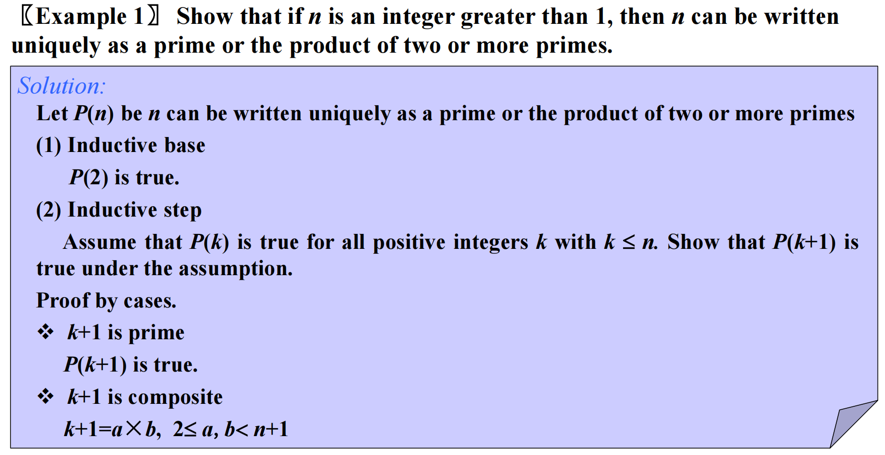
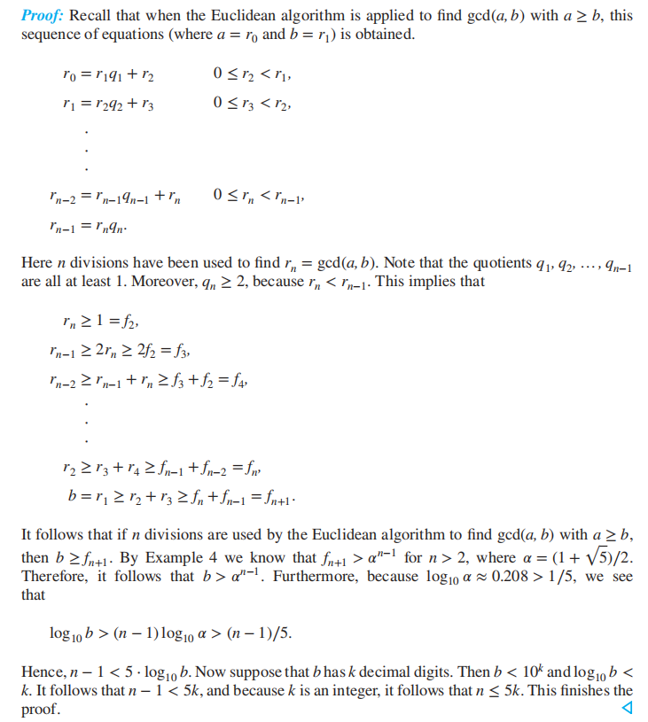
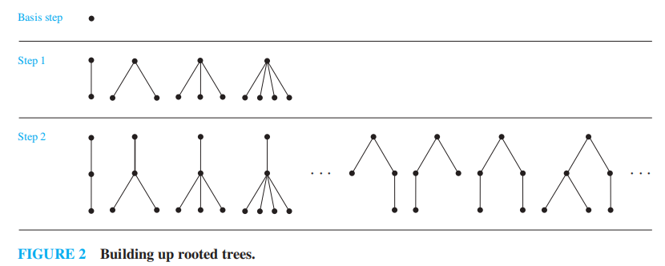
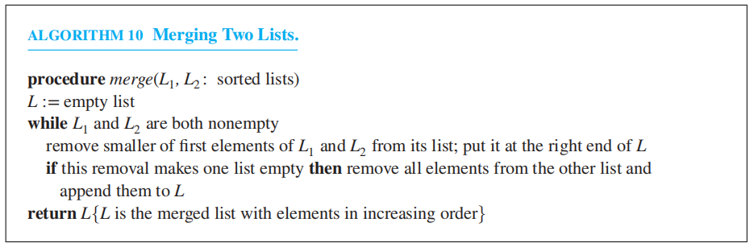
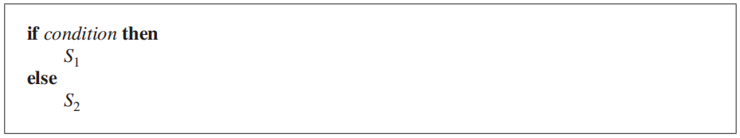
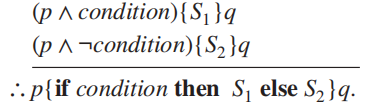

# Chap 5 Induction and Recursion

## Mathematical Induction

### Mathematical Induction

**数学归纳法(Mathematical induction)**：用来证明对于所有正整数$n$，命题函数$P(n)$均为真

**数学归纳法原理(PRINCIPLE OF MATHEMATICAL INDUCTION)**

+ **基本步骤(BASIS STEP)**：验证$P(1)$为真
+ **归纳步骤(INDUCTIVE STEP)**：证明对于所有正整数$k$，条件语句$P(k) \rightarrow P(k + 1)$为真

为了完成归纳步骤，我们需要假设$P(k)$为真(这被称为**归纳假设(inductive hypothesis)**)，然后在这一假设下，证明$P(k + 1)$为真

用推理规则(inference rules)表达上述原则：$(P(1) \wedge \forall k (P(k) \rightarrow P(k + 1))) \rightarrow \forall nP(n)$

>注意：我们假设$P(k)$为真，不是对于所有正整数$k$而言，而是想通过这个假设证明$P(k + 1)$为真，因此通过数学归纳法得到的证明不是[循环论证](1.md#mistakes-in-proofs)

??? info 形象记忆数归

	+ 无限高的梯子

	

	
	

	+ 多米诺骨牌
		
	

	
	

### Why Mathematical Induction is Valid

可以用*良序性(well-ordering property)* 证明数学归纳法的合法性
>**良序性**：对于一个包含正整数的集合，它的每个非空子集都有最小的元素

??? note "证明(反证法)"

	+ 假设至少有一个正整数$n$，$P(n)$为假，那么包含正整数$n$且满足$P(n)$为假的集合$S$非空
	+ 因此根据*良序性*，$S$中有一个最小的元素，记作$m$。因为$P(1)$为真，所以$m > 1$，因此$m - 1$也是正整数
	+ 因为$m - 1$比$m$还小，说明$m - 1$不在$S$中，所以$P(m - 1)$为真
	+ 又因为$P(m - 1) \rightarrow P(m)$为真，所以$P(m)$为真，得到矛盾。因此对于每个正整数$n$，$P(n)$为真

### Choosing the Correct Basis Step

有时，基本步骤可能不是从1开始，而是从整数$b$开始的。因此在基本步骤中，要先验证$P(b)$为真

### Guidelines for Proofs by Mathematical Induction

!!! note "🌟数学归纳法证明模版"

	1. 将问题转化为以下形式："$\forall n > b, P(n)$"，其中$b$为固定的整数。如果是对所有正整数满足$P(n)$为真，则令$b = 1$；如果是对所有非负整数满足$P(n)$为真，则令$b = 0$。对于某些情况，比如不等式，需要通过$P(n)$的真值表($n$的值较小时)来决定合适的$b$
	2. 写下“Basis Step”一词，然后证明$P(b)$为真，注意为$b$选取正确的值
	3. 写下"Inductive Step"一词，然后明确写出*归纳假设*，比如"Assume that $P(k)$ is true for an arbitrary fixed integer $k \ge b$"
	4. 写下$P(k + 1)$是什么，即在该归纳假设下要证明什么
	5. 利用假设$P(k)$证明$P(k + 1)$
	>通常，这是数学归纳法证明中最困难的部分。选定最有希望的策略，并思考如何用归纳假设构建归纳步骤的证明。同时，确保对于所有整数$k \ge b$，证明都是合法的，关注当$k$的取值较小时（包括$k = b$）证明的处理情况
	6. 为归纳步骤下好结论，比如写下"This completes the inductive step"
	7. 当完成了基本步骤和归纳步骤后，写下最后的结论，比如"By mathematical induction,  $P(n)$对于所有整数$n \ge b$均为真"

### The Good and the Bad of Mathematical Induction

+ *Good*：证明*猜想(Conjecture)* 的一大利器
+ *Bad*：不能用来发现新的定理，而且无法从证明过程中看出定理的本质所在
>因为：也许你在根本没有理解某个定理的情况下，也能通过数学归纳法证明出该定理

### Examples of Proofs by Mathematical Induction

???+ example "例题"

	=== "证明求和公式"

		见教材$P_{336-340}$

	=== "证明不等式"

		见教材$P_{340-342}$

		**调和数(harmonic numbers)**：$H_j = 1 + \dfrac{1}{2} + \dfrac{1}{3} + \dots + \dfrac{1}{j}$

		结论：$H_{2^n} \ge 1 + \dfrac{n}{2}$(证明过程见$P_{342}$)

		**调和级数(harmonic series)**：$1 + \dfrac{1}{2} + \dfrac{1}{3} + \dots + \dfrac{1}{n} + \dots$
		它是*发散的(divergent)*

	=== "证明与整除相关的结论"

		见教材$P_{342-344}$

		>这里我放了1个例题，虽然课件里没讲，但我觉得这题挺不错的，尤其是归纳步骤中的最后一步
		
		

		
		

		

		
		

	=== "证明与集合相关的结论"

		见教材$P_{344-346}$

		

		
		
	

	=== "证明与算法相关的结论"

		见教材$P_{346-347}$

		>书上的例题是证明第3章中[[Chap 3 Algorithms#^57b07d|安排讲座]]问题使用的贪心算法是否得到的是最优解，但我有点看不太懂😕

	=== "数学归纳法的创意用法"

		见教材$P_{347-349}$

		
		

		
		
	

		+ case 1: 如果有人向A或B丢馅饼，那么除了A，B之外的2k + 1个人只有2k个馅饼，显然那2k + 1个人中至少有一个人没有被馅饼砸中
		+ case 2: 如果没有人向A和B丢馅饼，则剩下2k + 1个人满足归纳假设的条件，在他们之中至少存在一个幸存者S，他不仅没被那2k个人砸中，也不会被A或B砸中(因为A和B没被原来2k + 1个人砸中，说明A和B之间的距离是他们离其他人的最近距离，因此A和B会互相扔馅饼)
		综上，至少有1位幸存者

### Mistaken Proofs by Mathmatical Induction

使用数学归纳法时，请确保**基本步骤(basis step)**和**归纳步骤(inductive step)** 都正确！！！

### Supplements(from Exercises)

+ **伯努利不等式(Bernoulli's inequality)**：如果$h > -1$，对于所有非负整数$n$，满足$1 +nh \le (1 + h)^n$
+ 假设$a, b$为实数，且$0 < b < a$，如果$n$为正整数，则$a^n - b^n \le na^{n - 1}(a - b)$成立
+ 对于正整数$n$，满足$1 + \dfrac{1}{\sqrt 2} + \dfrac{1}{\sqrt 3} + \dots + \dfrac{1}{\sqrt n} > 2(\sqrt{n + 1} - 1)$
+ 如果$n$是非负整数，则$H_{2^n} \le 1 + n$
+ $H_1 + H_2 + \dots + H_n = (n + 1)H_n - n$
+ 当$n \ge 3$且$n$为整数时，对于有$n$个元素的集合，它有$\dfrac{n(n - 1)(n - 2)}{6}$个包含3个元素的子集

## Strong Induction and Well-Ordering

>注：数学归纳法、强归纳法、良序性三者是**等价**的

### Strong Induction

**强归纳法(STRONG INDUCTIVE)**

+ *BASIS STEP*：验证$P(1)$为真（与数学归纳法一样）
+ *INDUCTIVE STEP*：证明对于所有正整数$k$，条件语句$[P(1) \wedge P(2) \wedge \dots \wedge P(k)] \rightarrow P(k+1)$为真

强归纳法的*归纳假设*是对于$j = 1, 2, \dots, k, P(j)$为真。因此它相比数学归纳法更加灵活

强归纳法也被称为*数学归纳法第二原理(second principle of mathematical induction)* 或*完全归纳法(complete induction)*。因此数学归纳法也被称为*不完全归纳法(incomplete induction)*（但这个名称不太符合它，因为数学归纳法是一个“完全”的方法）

### Examples of Proofs Using Strong Induction

选择数学归纳法 OR 强归纳？

+ 如果对于所有正整数$k$，能够直接证明$P(k) \rightarrow P(k + 1)$时，应使用**数学归纳法**
+ 如果发现：对于不超过$k$的正整数$j$满足$P(j)$为真，这个假设能够证明$P(k + 1)$为真；但无法仅仅从$P(k)$为真的条件中证明$P(k + 1)$为真。这时应当使用**强归纳法**

强归纳法的推广：

令$b$为固定的整数，$j$为固定的正整数，为了证明对于所有整数$n \ge b$，$P(n)$均为真，完成以下步骤：

+ *BASIS STEP*：验证命题$P(b), P(b + 1), \dots, P(b + j)$为真
+ *INDUCTIVE STEP*：对于所有整数$k \ge b + j$，证明$[P(b) \wedge P(b + 1) \wedge \dots \wedge P(k)] \rightarrow P(k + 1)$为真

🌰

	

将k+1分解为两个因数a和b后，因为a、b在归纳假设的范围内，因此它们满足是质数或多个质数的乘积的条件，所以k+1显然也满足该条件

### Using Strong Induction in Computational Geometry

**计算几何(computational geometry)**：离散数学的分支，研究关于几何图形的计算问题

定义：

+ **多边形(polygon)**：由一系列线段$s_1, s_2, \dots, s_n$(它们被称为*边(sides)*)构成的封闭几何图形
>如果没有两条非连续的边相交，那么称为*简单(simple)* 多边形

+ **顶点(vertex)**：多边形中每对连续的边$s_i, s_{i + 1}(i = 1, 2, \dots, n - 1)$(也包括$s_n$和$s_1$)上的公共端点
+ 每个简单多边形将平面划分成2个区域：
	+ **内部(interior)**：曲线内的所有点
	+ **外部(exterior)**：曲线外的所有点
+ **凸(convex)** 多边形：任意两个顶点间的线段位于多边形的内部或边界上。否则称为**凹(nonconvex)** 多边形
+ **对角线(diagonal)**：在简单多边形中，连接两个非连续顶点的线段
	+ **内部对角线(internal diagonal)**：如果除了端点外完全在内部的对角线

**定理1**：对于一个有$n$($n$为$\ge 3$的整数)条边的简单多边形，它能被划分为$n - 2$个三角形

??? note "证明（需要下面的引理1）"

	

	
	
	

**引理1**：每一个至少有4条边的多边形有一个内部对角线

### Proofs Using the Well-Ordering Property

[良序性的定义](#why-mathematical-induction-is-valid)

🌰

	

假设$r \ge d$，因为$a = dq_0 + r$，所以$a - d(q_0 + 1) = r - d \ge 0$，因此存在$q$和$r$，使得$0 \le r < d$成立（且$q$和$r$是唯一的）

### Supplements(from Exercises)

对于所有正整数对$n, k$，可以通过以下步骤证明$P(n, k)$为真(以下均省略"对于所有正整数$n, k$")

+ $P(1, 1)$为真，且$P(n, k) \rightarrow [P(n + 1, k) \wedge P(n, k + 1)]$为真
+ $P(1, k)$为真，且$P(n, k) \rightarrow P(n + 1, k)$为真
+ $P(n, 1)$为真，且$P(n, k) \rightarrow P(n, k + 1)$为真

+ 数学归纳法、强归纳法、良序性三者等价的证明

## Recursive Definition and Structural Induction

### Recursively Defined Functions

**递归(或归纳)定义(recursive/inductive definition)**：比如下面对函数的定义(其域为非负整数)

+ *BASIS STEP*：具体说明自变量为0时函数的值
+ *递归步骤(RECURSIVE STEP)*：给定一个规则——通过前面更小的整数下的函数值，得到在某个整数下的函数值

递归定义函数是*严格定义的(well defined)*，也就是说，

+ 对于给定的任意正整数，我们都能使用定义的两部分(即基本步骤和递归步骤)，找到对应正整数的函数值
+ 无论我们怎样使用定义的两部分，总能得到相同的值

对于某些递归定义函数，前$k$个正整数对应的函数值已经给出；并且给定了一个规则：通过一些或全部前$k$个整数下的函数值，得到在某个整数下的函数值。这种也是严格定义的函数，它遵循强归纳。比如前面讲到的[斐波那契数](2.md#recurrence-relations)便是如此。下面将运用斐波那契数得到一些性质：

	

证明欧几里得算法$\text{gcd}(a, b)$中的除法次数为$O(\log b)$

**定理1——拉梅定理(LAME'S THEOREM)**：令$a, b$为正整数且$a \ge b$，那么在欧几里得算法中，得到$\text{gcd}(a, b)$所需除法次数小于等于5倍的$b$的十进制位数

??? note "证明"

	

	
	

因为$b$的十进制位数为$\lfloor \log_{10} b \rfloor + 1 \le \log_{10}b + 1$，由定理1知除法次数小于等于$5(\log_{10} b + 1)$。又因为$5(\log_{10} b + 1)$是$O(\log b)$，因此可以得到上述结论。

### Recursively Defined Sets and Structures

**递归定义集合(recursively definition of sets)** 分为两部分：

+ *基本步骤(basis step)*：具体说明初始的一组元素
+ *递归步骤(recursive step)*：提供让已知的新元素进入该集合的规则

递归定义也可包含一个**排他规则(exclusion rule)**：递归定义的集合不包含除了在基本步骤中说明的元素，或者通过递归步骤产生的元素之外的元素。

🌰

---
递归定义在研究**字符串(strings)** 时扮演重要角色：来自字母表$\Sigma$的字符串，是一个由来自$\Sigma$的符号构成的有限序列。

定义：来自字母表$\Sigma$的字符串集合$\Sigma^*$，按照下面步骤递归定义：

+ *BASIS STEP*：$\lambda \in \Sigma^*$，$\lambda$是不包含符号的空字符串
+ *RECURSIVE STEP*：如果$w \in \Sigma^*$且$x \in \Sigma$，那么$wx \in \Sigma^*$
>在递归步骤中，通过在原有字符串的末尾添加一个符号来形成新的字符串。

🌰位串的定义：

递归定义还可以用来定义关于递归定义函数中元素的*运算*和*函数*，比如下面这两个定义：

+ 通过**拼接(concatenation)**，将两个字符串结合起来。令$\Sigma$为符号集，$\Sigma^*$为由$\Sigma$里的符号构成的字符串集。下面递归定义两个字符串的拼接运算，记作$\cdot$

	+ *BASIS STEP*：如果$w \in \Sigma^*$，那么$w \cdot \lambda = w$，其中$\lambda$为空字符串
	+ *RECURSIVE STEP*：如果$w_1 \in \Sigma^*, w_2 \in \Sigma^*, x \in \Sigma$，那么$w_1 \cdot (w_2 x) = (w_1 \cdot w_2) x$
	>$w_1 \cdot w_2$通常记作$w_1w_2$

+ **字符串长度(length)**：记作$l(w)$，$\begin{cases}l(\lambda) = 0 \\ l(wx) = l(w) + 1 \quad \text{ if } w \in \Sigma^* \text{ and } x \in \Sigma \end{cases}$

---
递归定义的另一重要应用是用来定义各种类型的**合式公式(well-formed formulae)**

+ *命题逻辑(propositional logic)* 中的合式公式：包含$\mathbf{T}, \mathbf{F}$、命题变量和来自集合$\{\neg, \wedge, \vee, \rightarrow, \leftrightarrow \}$中的运算符

	+ *BASIS STEP*：$\mathbf{T}, \mathbf{F}, s$，其中$s$为命题变量，它们是合式公式
	+ *RECURSIVE STEP*：如果$E, F$是合式公式，那么$(\neg E), (E \wedge F), (E \vee F), (E \rightarrow F), (E \leftrightarrow F)$也是合式公式

+ *运算符(operators)* 和*操作数(operands)* 中的合式公式：包含变量、数字、和来自集合$\{+, -, *, /, \uparrow\}$的运算符($\uparrow$指的是指数运算)
	+ *BASIS STEP*：如果$x$是数字或变量，则$x$是合式公式
	+ *RECURSIVE STEP*：如果$F, G$是合式公式，则$(F + G), (F - G), (F * G), (F / G), (F \uparrow G)$是合式公式

---
**树(trees)** 也可采用递归定义（具体内容见第11章）

+ *根树(rooted trees)*：是一组顶点的集合，其中包含一个唯一的根节点；以及连接这些顶点的边。递归定义如下：

	+ *BASIS STEP*：单个顶点*r*是一棵根树
	+ *RECURSIVE STEP*：假设$T_1, T_2, \dots, T_n$是不相交的根树，它们的根节点分别为$r_1, r_2, \dots, r_n$。那么新的根树起始于一个根节点$r$，该点不在$T_1, \dots, T_n$中的任何一棵树中，然后从$r$开始，向$r_1, \dots, r_n$添加边。这样就形成了一棵根树
	

>根据该递归定义，可以构造出无穷多棵根树

*二叉树(binary tree)*：根树的一种特殊情况。我们给出下面两种二叉树的递归定义：

+ *扩展二叉树(extended binary tree)*

	+ *BASIS STEP*：空树是一棵扩展二叉树
	+ *RECURSIVE STEP*：如果$T_1, T_2$是不相交的两棵（非空）扩展二叉树，那么就有一棵扩展二叉树，记作$T_1 \cdot T_2$，它由一个根节点$r$，以及一条从根节点连接左子树$T_1$的根节点的边，和一条连接右子树$T_2$的根节点的边

>我的理解：对于第i步的树，它的深度为i-1，然后列出所有深度为i-1的树

+ *满二叉树(full binary tree)*

	+ *BASIS STEP*：仅由单个顶点$x$构成一棵满二叉树
	+ *RECURSIVE STEP*：如果$T_1, T_2$是两棵不相交的满二叉树，那么就有一棵满二叉树，记作$T_1 \cdot T_2$，它由一个根节点$r$，以及从根节点连接到作为左子树的$T_1$的根节点，和作为右子树的$T_2$的根节点的边
	

>简化版：这种二叉树除了叶子节点外，其余节点要么有2个孩子，要么没有孩子

### Structural Induction

**结构归纳法(structural induction)**：

+ *BASIS STEP*：证明结果适用于所有在递归定义的基本步骤中说明的元素
+ *RECURSIVE STEP*：证明如果对于每个用于在定义的递归步骤中构建新元素的元素，语句均正确，那么结果也适用于这些新构建的元素

结构归纳法的有效性可由非负整数的数学归纳法得到。
令$P(n)$表示：对于所有由$n$次或更少次来自递归定义中递归步骤的规则应用而产生的元素，结果为真

+ *BASIS STEP*：证明$P(0)$为真
+ *RECURSIVE STEP*：假设$P(k)$为真，那么$P(k + 1)$为真

???+ example "例题"

	=== "例1"

		

		
		

	=== "例2"

		

		
		

递归定义满二叉树$T$的高度$h(T)$

+ *BASIS STEP*：只有一个根节点$r$的满二叉树$T$的高度为$h(T) = 0$
+ *RECURSIVE STEP*：如果$T_1, T_2$都是满二叉树，那么满二叉树$T = T_1 \cdot T_2$的高度$h(T) = 1 + \max(h(T_1), h(T_2))$

递归定义满二叉树的顶点个数$n(T)$

+ *BASIS STEP*：只有一个根节点$r$的满二叉树$T$的顶点个数$n(T) = 0$
+ *RECURSIVE STEP*：如果$T_1, T_2$都是满二叉树，那么满二叉树$T = T_1 \cdot T_2$的顶点个数$n(T) = 1 + n(T_1) + n(T_2)$

**定理2**：如果$T$为满二叉树，那么$n(T) \le 2^{h(T) + 1} - 1$

??? note "证明"

	

	
	

### Generalized Induction

**广义归纳法(generalized induction)** 用于证明关于*除了整数集外*，也具有*良序性*的集合的结论。

🌰定义一个有序的$\mathbf{N} \times \mathbf{N}$，即非负整数的有序对。如果$x_1 < x_2$，或者$x_1 = x_2$且$y_1 < y_2$，那么$(x_1, y_1) \le (x_2, y_2)$，这被称为**词典序(lexicographic ordering)**([Chap 9](9.md#lexicographic-order)会讲到)。它满足*良序性*，这意味着我们可以递归定义$a_{m, n}$，其中$m \in \mathbf{N}, n \in \mathbf{N}$，见下面的具体例子👇

### Supplements(from Exercises)

关于斐波那契数的一些性质(以下$n$均为正整数)：

+ $f_1^2 + f_2^2 + \dots + f_n^2 = f_nf_{n + 1}$
+ $f_1 + f_3 + \dots + f_{2n-1} = f_{2n}$
+ $f_{n+1}f_{n-1} - f_n^2 = (-1)^n$
+ $f_0f_1 + f_1f_2 + \dots + f_{2n-1}f_{2n} = f_{2n}^2$
+ $f_0 - f_1 + f_2 - \dots - f_{2n-1} + f_{2n} = f_{2n-1} - 1$
+ 令$\mathbf{A} = \begin{bmatrix}1 & 1 \\ 1 & 0\end{bmatrix}$，则$\mathbf{A}^n = \begin{bmatrix}f_{n + 1} & f_n \\ f_n & f_{n - 1}\end{bmatrix}$
---
关于最大值和最小值函数的一些性质：

+ $\max(-a_1, -a_2, \dots, -a_n) = -\min(a_1, a_2, \dots, a_n)$
+ $\max(a_1 + b_1, a_2 + b_2, \dots, a_n + b_n) \le \max(a_1, a_2, \dots, a_n) + \max(b_1, b_2, \dots, b_n)$
+ $\min(a_1 + b_1, a_2 + b_2, \dots, a_n + b_n) \ge \min(a_1, a_2, \dots, a_n) + \min(b_1, b_2, \dots, b_n)$
---
关于字符串：

+ 字符串$w$的**逆序(reversal)** 记为$w^R$
+ $w^i$：*拼接*$i$个字符串$w$后形成的新字符串

性质：

+ $(w_1w_2)^R = w_2^Rw_1^R$
+ $l(w^i) = i \cdot l(w)$
+ $(w^R)^i = (w^i)^R$
---
正整数$n$的**分拆(partition)**：将$n$表示为一些正整数的和，这些正整数的顺序并不重要。令$P_m$等于对于$m$不同分拆的个数，$P_{m, n}$表示分拆出来的正整数不超过$n$，且对于$m$不同分拆的个数

+ $P_{m, m} = P_m$
+ $P_{m, n} = \begin{cases}1 & \text{if } m = 1 \\ 1 & \text{if } n = 1 \\ P_{m, m} & \text{if } m < n \\ 1 + P_{m, m - 1} & \text{if } m = n > 1 \\ P_{m, n - 1} + P_{m - n, n} & \text{if } m > n > 1\end{cases}$
---
**阿克曼函数(Achermann's funciton)**
>它在递归函数理论，以及研究包含集合合并的特定算法的复杂度(比如[并查集](../fds/8.md#worst-case-for-union-by-rank-and-path-compression))中发挥重要作用，定义如下：

$$
A(m, n) = \begin{cases}2n & \text{if } m = 0 \\ 0 & \text{if }m \ge 1 \text{ and } n = 0 \\ 2 & \text{if } m \ge 1 \text{ and } n = 1 \\ A(m - 1, A(m, n - 1)) & \text{if } m \ge 1 \text{ and } n \ge 2\end{cases}
$$

性质(下面的字母均表示非负整数)：

+ $A(m, n + 1) > A(m, n)$
+ $A(m + 1, n) \ge A(m, n)$
+ $A(i, j) \ge j$
---
关于对数(以2为底)：

$$
\log^{(k)}n = \begin{cases}n & \text{if } k = 0 \\ \log(\log^{(k - 1)}n) & \text{if } \log^{(k - 1)} \text{is defined and positive} \\ \text{undefined} & \text{otherwise}\end{cases}
$$

**叠对数(iterated logarithm)**$\log^*n$：它的值为使$\log^{(k)}n \le 1$成立的最小的非负整数$k$

---
将上面对数的定义推广至更一般的函数$f(n)$（它是*实数域*上的*单调递增*函数）

$$
f^{(k)}n = \begin{cases}n & \text{if } k = 0 \\ f(f^{(k - 1)}(n)) & \text{if } k > 0 \end{cases}
$$

**叠函数(iterated function)**$f^*_c$：它的值为使$f^{(k)}n \le c$成立的最小的非负整数$k$

## Recursive Algorithm

如果一个算法通过将问题规模减少至拥有更小输入的相同问题，那么称这个算法是**递归的(resursive)**

???+ example "一些例子"

	=== “计算$\text{gcd}(a, b)$"

		

		
		

		
	=== "[模指数](4.md#modular-exponentiation)的求解"

		

		
		

	=== "[查找算法](3.md#searching-algorithms)的递归版本"

			+ 线性查找

		

		
		

			+ 二分查找
			
		

		
		

### Proving Recursive Algorithms Correct

通常，我们利用*数学归纳法*、*强归纳法*证明递归算法的正确性

### Recursion and Iteration

+ **递归(resursion)法**：通过连续*减少*计算规模，在更小的数字上求解函数
+ **迭代(iteration)法**：从一个或多个整数对应的函数值开始（*基本情况*），然后连续使用*递归定义*，找到连续的更大的数对应的函数值

 🌰找到第$n$个斐波那契数的算法

 + 递归版本

+ 迭代版本

通过这个例子，不难看出递归和迭代算法的特征：

+ 对于每个递归算法，总有等价的迭代算法
+ **递归算法**相比迭代算法，通常*更小、更优雅、更易于理解*
+ 然而，**迭代算法**在*空间和时间上的效率*往往高于递归算法

### ~~The Merge Sort~~

>因为课上没讲（应该不会在dm考到），这里就直接贴上算法和定理，没有具体说明

算法实现：

**引理1**：两个排好序的列表，分别有$m$和$n$个元素，将它们合并称一个有序列表所需的比较次数为$m + n - 1$次

**定理1**：通过归并排序对有$n$个元素的列表排序所需的比较次数为$O(n \log n)$

### Supplements(from Exercises)

**快速排序(quick sort)**：要对$a_1, a_2, \dots, a_n$排序，先找到$a_1$，然后形成两个子列表：第一个子列表中的所有元素小于$a_1$，第二个子列表中的所有元素大于$a_1$，并且分别对它们排好序。接着将$a_1$放入第一个子列表的末尾。递归重复上述步骤，直到所有子列表仅包含一项。最后通过有序地结合只包含一个元素的子列表，得到排好序的包含$n$个元素的列表

## ~~Program Correctness~~

### Program Verification

如果一个程序对所有可能的输入，均产生正确的输出，那么称这个程序是**正确的(correct)**

证明一个程序的正确性包含两个部分：

+ **部分正确性(partial correctness)**：程序终止时能够得到正确的答案
	+ **首断言(initial assertion)**：必须有输入
	+ **末断言(final assertion)**：必须有输出
+ 程序总是能够终止

定义：一个程序，或者程序段$S$，当对于$S$的输入值，首断言$p$正确，且$S$终止，那么对于$S$的输出值，末断言$q$正确，称$S$关于$p$和$q$**部分正确(partially correct)**，记作$p\{S\}q$（这个记号被称为霍尔三元组(Hoare triple)）

### Rules fo Inference

运用**推理规则(rule of inference)**，将程序划分为一系列的子程序，然后证明每个子程序正确，以此证明程序的正确性。

具体说明：将程序$S$拆成两个子程序$S_1,S_2$，记作$S = S_1 ; S_2$。假设$S_1$关于首断言$p$和末断言$q$的正确性，和$S_2$关于首断言$q$和末断言$r$的正确性已经建立。这表明：如果$p$为真且$S_1$得到执行并终止，那么$q$为真；如果$q$为真且$S_2$得到执行并终止，则$r$为真。这个规律被称为**复合律(composition rule)**，并记作：

### Conditional Statements

对于以下形式的程序段：

要验证该程序段关于首断言$p$和末断言$q$正确：

+ 当$p$为真且*condition*也为真时，$S$终止后，$q$为真
+ 当$p$为真且*condition*为假时，$q$为真

因此我们得到以下推理规则：

---
对于以下形式的程序段：

我们得到以下推理规则：

### Loop Invariants

对于以下形式的程序段：

**循环不变式(loop invariant)**$p$：当$S$被执行时保持真值为真的断言

我们有以下推理规则：

## Supplements(from Exercises)

+ 斐波那契数的一条性质：$f_kf_n + f_{k+1}f_{n+1} = f_{n+k+1}$
+ **卢卡斯数(Lucas numbers)** 的性质($I_0 = 2,\ I_1 = 1,\ I_n = I_{n - 1} + I_{n - 2}, n = 2,3,4,\dots$)
	+ $f_n + f_{n+2} = I_{n+1}$
	+ $I_0^2+I_1^2+\dots +I_n^2 = I_nI_{n+1}+2$
+ **麦卡锡91函数(McCarthy 91 function)**
$$
M(n) = \begin{cases}n - 10 & \text{if } n > 100 \\ M(M(n+11)) & \text{if } n \le 100\end{cases}
$$
+ 当一个集合的每个非空子集都有一个最小元素，那么称该集合是**良序的(well ordered)**
+ 包含所有**括号平衡字符串(balanced strings of parentheses)** 的递归定义：
	+ $\lambda \in B$，$\lambda$为空串
	+ $(x) \in B, xy \in B$，如果$x, y \in B$
+ **自我生成序列(self-generating sequences)**：由简单的递推关系和规则产生的序列
	+ **Golomb self-generating sequences**