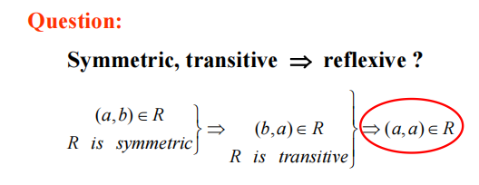
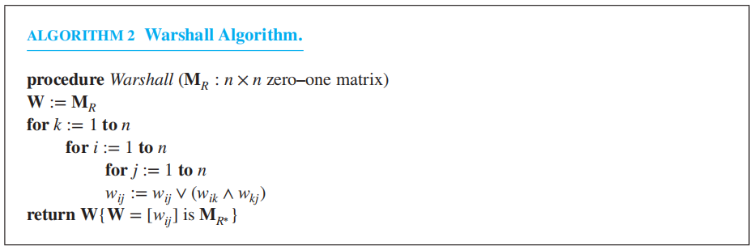
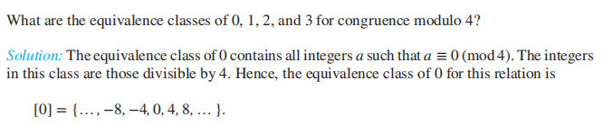
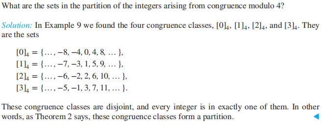
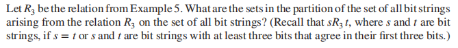

# Chap 9 Relations

??? abstract "核心知识"

	+ 关系的基本概念
		+ **性质**：自反性、对称性、反对称性、传递性
	+ 表示法：矩阵、有向图
	+ **闭包**
		+ 重点关注传递闭包——Warshall算法
		+ 包含多种性质的闭包
	+ **等价关系**
		+ 等价类
		+ 分区
	+ **偏序**
		+ 基本概念
		+ 哈斯图
		+ 极大、极小、最大、最小元素，上下界
		+ 格
		+ 拓扑排序

## Relations and Their Properties

令$A, B$为集合，从$A$到$B$的**二元关系(binary relation)** 是$A \times B$（笛卡尔积）的子集。这个二元关系是一个包含*有序对(ordered pairs)* 的集合$R$.

+ $a\ R\ b$表示$(a, b) \in R$（称为$a$关于$R$与$b$有关系）
+ $a \not{R} \ b$表示$(a, b) \notin R$

>注：$\emptyset$，$A \times B$也是关系

### Functions as Relations

从$A$到$B$的**函数**$f$为$A$中的每个元素赋予$B$中的唯一一个元素，不难看出$f$是$A \times B$的子集，所以它表示从$A$到$B$的关系。

关系是函数的一种*泛化(generalization)*，它能表示更多关于集合间的联系，比如它能表示函数所不能表示的*一对多*的联系

### Relations on a Set

定义：在集合$A$上的关系(a relation on a set $A$)$R$是从$A$到$A$的关系，也就是$A \times A$的子集

如果$A$有$n$个元素，则共有$2^{n^2}$个对于$A$的关系

### Properties of Relations

⭐在集合$A$上的关系的一些性质：

+ **自反性(reflexive)**：$\forall a \in A((a, a) \in R)$
+ **对称性(symmetric)**：$\forall a \in A \forall b \in A((a, b) \in R \rightarrow (b, a) \in R)$
+ **反对称性(antisymmetric)**：$\forall a \in A \forall b \in A((a, b) \in R \wedge (b, a) \in R) \rightarrow (a = b))$
>注：
>
>+ 对称性和反对称性不是对立的，一个关系可能同时具有对称性和反对称性
>+ 但如果一个关系存在形如$(a, b), a \ne b$的有序对，那么它就不会同时具有这两个性质

+ **传递性(transitive)**：$\forall a \in A \forall b \in A \forall c \in A(((a, b) \in R \wedge (b, c) \in R) \rightarrow (a, c) \in R)$

如果$A$有$n$个元素，那么：

+ 有$2^{n(n - 1)}$个**自反**的关系
>证：$(a, a)$必须存在于关系中，其余$n(n - 1)$可在可不在

+  有$2^{\frac{n(n+1)}{2}}$个**对称**的关系
>证：$(a, a)$可在可不在，剩下$n^2 - n$个有序对分成2半，$(i, j)$和$(j, i)$可同时在，同时不在，因此加起来有$2^n + 2^{\frac{n^2 - n}{2}}$种

+ 有$2^n \times 3^{\frac{n^2 - n}{2}}$个**反对称**的关系
>证：类似证对称关系，除了$(i, j)$和$(j, i)$不能同时在，因此对于一对有序对有3种选择

+ 没有通式来表达**传递**的关系个数$T(n)$，已知的$T(n)$为$0 \le n \le 18$

>注：这么讲有些抽象，用9.3节介绍的[零一矩阵](#representing-relations-using-matrices)来表示就很直观了

???+ question "思考"

	=== "问题"

		

		
		

	=== "答案"

		NO，但我也不清楚怎么解释，要看一下回放🤔

### Combining Relations

关系也能像一般的集合那样被结合，回忆一些[集合的运算](2.md#set-operations)：并集$\cup$、交集$\cap$、差集$-$、对称差集$\oplus$，补集$\overline{}$

---
关系也可以像函数一样被**复合(composite)**：对于一个从$A$到$B$的关系$R$，和一个从$B$到$C$的关系$S$，$R$和$S$的**复合关系**$S \circ R$由有序对$(a, c), a \in A, c \in C$构成，且存在$b \in B$，使得$(a, b) \in R, (b, c) \in S$。

计算两个关系的复合时，我们可以先找到某个元素，它既出现在第一个关系里某个有序对的第二个位置，也出现在第二个关系里某个有序对的第一个位置。

🌰

通过画一张**有向图**（后面很快会讲到），问题就迎刃而解了：我们要找的就是<u>从最左边到最右边有通路的两个顶点</u>

!!! warning "注意：$S \circ R \ne R \circ S$"

---
定义：令$R$是在集合$A$上的关系，幂$R^n, n = 1, 2, 3, \dots$ 被递归定义为：
$$
R^1 = R \quad R^{n+1} = R^n \circ R
$$
**定理1**：当且仅当$R^n \subseteq R, n = 1, 2, 3, \dots$时，在集合$A$上的关系$R$具有**传递性**

+ 如果$R$具有自反性，则$R^n$也具有自反性
+ 如果$R$具有对称性，则$R^n$也具有对称性

??? info "证明"

	使用**数学归纳法**

	

	
	

---
关系运算的性质：

>假设$R, S$是从$A$到$B$的关系，$T$是从$B$到$C$的关系，$P$是从$C$到$D$的关系，那么：

+ $(R \cup S)^{-1} = R^{-1} \cup S^{-1}$
+ $(R \cap S)^{-1} = R^{-1} \cap S^{-1}$
+ $(\overline{R})^{-1} = \overline{R^{-1}}$
+ $(R - S)^{-1} = R^{-1} - S^{-1}$
+ $(A \times B)^{-1} = B \times A$
+ $\overline{R} = A \times B - R$
+ $(S \circ T)^{-1} = T^{-1} \circ S^{-1}$
+ $(R \circ T) \circ P = R \circ (T \circ P)$
+ $(R \cup S) \circ T = R \circ T \cup S \circ T$ 

### Supplements(from Exercises)

+ **非自反性(irreflexive)**：$\forall a \in A((a, a) \notin R)$
+ **不对称性(asymmetric)**：$\forall a \in A \forall b \in A((a, b) \in R \rightarrow (b, a) \notin R)$
>注：不要跟前面提到的**反对称性(antisymmetric)**弄混淆

+ 令$R$为从$A$到$B$的关系，那么从$B$到$A$**逆关系(inverse relation)**$R^{-1}$，表示$\{(b,a)\ |\ (a, b) \in R\}$
+ **补关系(complementary relation)**$\overline{R}$表示$\{(a, b)\ |\ (a, b) \notin R\}$

## ~~n-ary Relations and Their Applications~~

### $n$-ary Relations

定义：令$A_1, A_2, \dots, A_n$为集合，这些集合的 **$n$元关系($n$-ary relation)** 是$A_1 \times A_2 \times \dots \times A_n$的子集。其中$A_1, A_2, \dots, A_n$被称作**域(domain)**，$n$被称为**阶(degree)**

### Databases and Relations

### Operations on $n$-ary Relations

### SQL

### Association Rules from Data Mining

## Representing Relations

表示关系的方法：

+ 列出所有有序对
+ 通过谓词，用集合构建规则
+ 二维表
+ ==连接矩阵/零一矩阵(connection matrix / zero-one matrix)==
+ ==有向图(directed graph / digraph)==

### Representing Relations Using Matrices

假设$R$是从$A = \{a_1, a_2, \dots, a_m\}$到$B = \{b_1, b_2, \dots, b_n\}$的关系，那么$R$可被表示为零一矩阵$M_R  = [m_{ij}]$，其中

$$
m_{ij} = \begin{cases}1 & \text{if } (a_i, b_j) \in R \\ 0 & \text{if } (a_i, b_j) \notin R\end{cases}
$$

对于在集合上的关系，它的零一矩阵是一个方阵，我们可以用方阵直观反映前面提到的那些性质：

+ **自反性**：$\begin{bmatrix}1&&&&&\\&1&&&&\\&&1&&&\\&&&\ddots&&\\&&&&1&\\&&&&&1\end{bmatrix}$
+ **对称性**和**反对称性**：

>注意到对称性分2种情况，反对称性分3种情况
	
+ **传递性**：$\overline{(m_{ij} \wedge m_{jk})} \vee m_{ik} = 1$
>注：利用$p \rightarrow q \equiv \overline{p} \vee q$

---
利用[布尔运算](2.md#matrices)中的*并(join)* 和*交(meet)*，我们可以找到两个关系的**并集**和**交集**的零一矩阵。记关系$R_1, R_2$的零一矩阵分别为$M_{R_1}, M_{R_2}$，则：
$$
M_{R_1 \cup R_2} = M_{R_1} \vee M_{R_2} \quad M_{R_1 \cap R_2} = M_{R_1} \wedge M_{R_2}
$$
$$
M_{\overline{R}} = [\overline{c_{ij}}] \quad M_{R_1 - R_2} = M_{R_1 \cap \overline{R_2}} = [c_{ij} \wedge \overline{d_{ij}}]
$$

利用[布尔积](2.md#matrices)，我们可以找到**复合**关系的零一矩阵：
$$
M_{S \circ R} = M_R \odot M_S 
$$
$$
M_{R^n} = M_R^{[n]}
$$
>注：这个式子需要自己理解一下，因为并不是很直观

### Representing Relations Using Digraphs

**有向图(directed graph/digraph)**：由包含*顶点(vertice/nodes)* 的集合$V$，以及包含$V$中元素的有序对(称为*边(edge/arc)*)的集合$E$构成。对于边$(a, b)$，顶点$a$称为这条边*起点(initial vertex)*，顶点$b$称为这条边的*终点(terminal vertex)*

边$(a, a)$称为**环(loop)**

如果用有向图表示在集合$A$上的关系$R$，$A$中的元素作为顶点，有序对$(a, b) \in R$作为边。因此，我们建立起在$A$上的关系与$A$的有向图之间的*双射关系*。
>注：有向图也可以表示从$A$到$B$的关系，但如果$A = B$，它所反映的内涵就不如表示一个集合时那样清楚

通过有向图反映的性质：

+ **自反性**：有向图的*每个*顶点都有一个**环**
+ **对称性**：两个不同的顶点间要么没有边，要么同时有2条双向的边
>注：*无向图(undirected graph)* 的表示方法也可以体现对称性

+ **反对称性**：两个不同的顶点间不能同时出现2条双向的边
+ **传递性**：当存在$x$到$y$的边，以及$y$到$z$的边，那么也存在从$x$到$z$的边（形成一个三角形）

:chestnut:

## Closures of Relations

### Different Types of Closures

>引入：如果$R$是在集合$A$上的关系，那么它可能有，也可能没有性质$P$，比如自反性、对称性或传递性。如果没有的话，我们希望找到最小的在集合$A$上的关系$S$，它满足性质$P$且包括$R$

定义：如果$R$是在集合$A$上的关系，那么$R$关于性质$P$的**闭包(closure)** (如果存在的话)，它满足性质$P$且包括$R$，而且是所有包含$R$且满足$P$的$A \times A$的子集

注：

+ 关系$R$关于性质$P$的闭包是**唯一**的，且是**最小**的满足性质$P$且包括$R$的关系
+ 对于某些性质$P$，某个关系关于$P$的闭包可能不存在

类别：

+ **自反闭包(reflexive closure)**：记作$r(R)$

???+ note "相关知识"

	集合$A$上的关系$R$的自反闭包为$R \cup \Delta$，其中$\Delta = \{(a, a)\ |\ a \in A\}$，称$A$上的**对角关系(diagonal relation)**

	+ $\Delta$中的元素应当是$R$不具备的
	+ 用有向图表示：使所有的节点都有*环*
	+ 用矩阵表示：让主对角线上的元素都为1，即$\mathbf{M}_{r(R)} = \mathbf{M}_R \vee \mathbf{I}_R$

+ **对称闭包(symmetric closure)**：记作$s(R)$

???+ note "相关知识"

	集合$A$上的关系$R$的对称闭包为$R \cup R^{-1}$，其中$R^{-1} = \{(b, a)\ |\ (a, b) \in R\}$，是$R$的**逆关系**

	用矩阵表示：$\mathbf{M}_{s(R)} = \mathbf{M}_R \vee \mathbf{M}_R^t$

+ **传递闭包(transitive closure)**：记作$t(R)$
>传递闭包的求解有些复杂，过会儿会详细阐述

### Paths in Directed Graphs

定义：有向图$G$中，从$a$到$b$的**路径(path)**，是$G$上一系列的边$(x_0, x_1), (x_1, x_2), (x_2, x_3), \dots, (x_{n-1}, x_n)$，其中$n$为非负整数，$x_0 = a, x_n = b$。这条路径记作$x_0, x_1, x_2, \dots, x_{n-1}, x_n$，*长度(length)* 为$n$。定义边的空集长度为0。长度$n \ge 1$，且始末顶点相同($x_0 = x_n$)的路径称为*环(circuit/cycle)*。

将有向图关于路径的概念引申至**关系**：在关系$R$中，从$a$到$b$的**路径**是指一系列的元素$a, x_1, x_2, \dots, x_{n-1}, b$，满足$(a, x_1) \in R, (x_1, x_2) \in R, \dots, (x_{n - 1}, b) \in R$

**定理1**：令$R$为在集合$A$上的关系，当且仅当$(a, b) \in R^n$时，存在一条长度为$n$，从$a$到$b$的路径，其中$n$为正整数

??? note "证明"

	使用**数学归纳法**：

	

	
	

### Transitive Closures

定义：令$R$为在集合$A$上的关系。**连通关系(connectivity relation)** $R^*$由$(a, b)$组成，这些对满足存在一条从$a$到$b$，长度至少为1的路径

结合上面的定理1，易得：$R^* = \bigcup\limits_{n=1}^\infty R^n$

**定理2**：$R$的传递闭包$t(R)$ = 连通关系$R^*$

!!! note "补充"

	当且仅当$R$具有传递性时，$R$ = $R$的传递闭包

???+ note "证明"

	要证该定理，即证$R^*$满足：

	+ $R^*$具有传递性
	+ $R^* \subseteq S$，其中$S$是所有包含$R$的传递关系

	

	
	

**引理1**：令$A$为有$n$个元素的集合，$R$为在$A$上的关系。

+ 如果在$R$中存在一条长度至少为1的从$a$到$b$的路径，那么路径的长度不超过$n$。
+ 如果$a \ne b$，且在$R$中存在一条长度至少为1的从$a$到$b$的路径，那么路径的长度不超过$n - 1$

??? note "证明"

	

	
	

	

	
	

由引理1，我们可以得到：
$$
t(R) = R^* = R \cup R^2 \cup R^3 \cup \dots \cup R^n
$$

**定理3**：令$\mathbf{M}_R$为$n$个元素的集合的关系$R$的零一矩阵，那么传递闭包$R^*$的零一矩阵为：
$$
\mathbf{M}_{R^*} = \mathbf{M}_R \vee \mathbf{M}_R^{[2]} \vee \mathbf{M}_R^{[3]} \dots \vee \mathbf{M}_R^{[n]}
$$

🌰：

算法实现：

分析：

+ 所有布尔积的运算次数：$(n-1) \cdot n^2(2n - 1)$
+ 所有取交($\vee$)的运算次数：$(n - 1)n^2$

$\therefore$  时间复杂度 = $O(n^4)$

### Warshall's Algorithm

显然，上述算法的实现效率较低，因此这里介绍一种更快的算法——**Warshall's algorithm**

>注：这个算法更知名的名称是**弗洛伊德算法(Floyd algorithm)**——没错，就是那个用来求*最短路径*的那个算法！因此这个算法在图那个章节中可能还会再用到，现在我们利用这个算法来求的是$R$的传递闭包。在正式介绍算法之前，先引入一些概念：

假设$R$是$n$个元素的集合的关系，令$v_1, v_2, \dots, v_n$为$n$个元素的任意排列。路径$a, x_1, x_2, \dots, x_{m-1}, b$的**内部顶点(interior vertices)** 是$x_1, x_2, \dots, x_{m-1}$

>❗注：虽然内部顶点不包含路径上始末两个顶点，然而，如果起点或终点在中间还出现过的话，则它们也算内部顶点

Warshall算法需要一系列的零一矩阵$\mathbf{W}_0, \mathbf{W}_1, \dots, \mathbf{W}_n$，其中：

+ $\mathbf{W}_0 = \mathbf{M}_R$
+ $\mathbf{W}_n = \mathbf{M}_{R^*}$
+ $\mathbf{W}_k = [w_{ij}^{(k)}]$，其中

$$
w_{ij}^{(k)} = \begin{cases}1 & \text{存在一条从}a\text{到}b\text{的路径，满足该路径所有的内部顶点均在集合}\{x_1, x_2, \dots, x_k\}\text{中} \\ 0 & \text{otherwise}\end{cases}
$$

所以，$\mathbf{W}_n$就是我们要得到的矩阵。

🌰

通过这个例子，不难发现：要计算$\mathbf{W}_k$，我们可以直接在$\mathbf{W}_{k-1}$的基础上得到，只需再讨论两种情况，如图所示：

**引理2**：令$\mathbf{W}_k = [w_{ij}^{[k]}]$（上面已描述过），那么：
$$
w_{ij}^{[k]} = w_{ij}^{[k - 1]} \vee (w_{ik}^{[k - 1]} \wedge w_{kj}^{[k - 1]})
$$
其中$i, j, k$为不超过$n$的正整数

算法实现：

分析：
从$\mathbf{W}_{k-1}$中得到$\mathbf{W}_k$需要$2n^2$次操作

$\therefore$  总的操作数：$2n^3$ $\rightarrow$ 时间复杂度：$O(n^3)$

??? question ":star2:思考：如何求满足多个性质的闭包？"

	先求**对称/反对称闭包**，再求**传递闭包**，最后求**自反闭包**

## Equivalence Relations

### Equivalence Relations

定义：

+ 集合$A$的某个关系如果同时具备*自反性*、*对称性*和*传递性*，称这种关系为**等价关系(equivalence relation)**
+ 如果两个元素$a, b$关于某个等价关系是相关的，则称它们是*等价的(equivalent)*，记作$a \sim b$

### Equivalence Classes

定义：令$R$为集合$A$上的等价关系，所有与集合中的元素$a$相关的元素构成的集合称为$a$的**等价类(equivalence class)**，记作$[a]_R$。如果只考虑一个关系，则可以简写为$[a]$。

$$
[a]_R = \{ s\ |\ (a, s) \in R \}
$$

如果$b \in [a]_R$，则称$b$为这个等价类的**代表(representative)**，因此等价类中的每个元素都可以作为这个等价类的代表。

???+ example "例题"

	=== "**同余模**$m$(congruence modulo $m$)"

		

		
		

	=== "**同余类模**$m$(congruence classes modulo $m$)"

		同余模$m$的等价类，记作$[a]_m$

		

		
		

		

		
		

	=== "位串"

		

		
		

### Equivalence Classes and Partitions

> 利用等价类，我们可以将一个集合划分为不相交的非空子集

**定理1**：令$R$为集合$A$的*等价关系*，以下关于$A$中元素$a, b$的几条语句是等价的：

$$
(i)\ a\ R\ b \quad (ii)\ [a] = [b] \quad (iii)\ [a] \cap [b] \ne \emptyset
$$

??? note "证明"

	

	
	

	

	
	
		

定义：集合$S$的**分区(partition)** 是$S$中一组不相交的非空子集，$S$是它们的并集。满足：

+ $A_i \ne \emptyset \text{ for } i \in I$
+ $A_i \cap A_j = \emptyset \text{ when } i \ne j$
+ $\bigcup\limits_{i \in I} A_i = S$

>注：$I$是*索引集(index set)*，顾名思义，它存储某个集合的元素的索引

	

**定理2**：

+ 令$R$为集合$S$的等价关系，那么$R$的**等价类**构成了$S$的**分区**
+ 反过来，给定集合$S$的**分区**$\{A_i\ |\ i \in I\}$，存在等价关系$R$，它的**等价类**包括集合$A_i, i \in I$

>:star2:简单理解：等价类 $\leftrightarrow$ 分区

??? note "证明"

	

	
	
	
	

	
	
	

???+ example "例题"

	=== "同余"

		

		
		
	

	=== "位串"

		

		
		
	
		

		
		
	
		
	=== ":star:等价关系&分区"

		

		
		
	

### The Operations of Equivalence Relations

如果$R_1, R_2$是集合$A$的等价关系，则

+ $R_1 \cap R_2$是集合$A$的等价关系
+ $R_1 \cup R_2$是集合$A$的自反、对称关系
+ $(R_1 \cup R_2)^*$是集合$A$的等价关系

### Supplements(from Exercises)

+ 当每个在分区$P_1$的集合是分区$P_2$中某个集合的子集，称$P_1$是$P_2$的**精炼(refinement)**
+ 令$p(n)$代表有$n$个元素的集合的不同*等价关系*的数量（即*分区*的数量），则：
$$
p(n) = \sum\limits_{j = 0}^{n - 1}C(n - 1, j)p(n - j - 1), \quad p(0) = 1
$$
>注：$p(n)$被称为**贝尔数(Bell numbers)**

## Partial Orderings

定义：集合$S$上的关系$R$，如果它具有*自反性*、*反对称性*和*传递性*，则它被称为**偏序(partial ordering/ partial order)**。集合$S$和它的偏序$R$统称为**偏序集(partially ordered set/ poset)**，记作$(S, R)$。$S$中的成员被称为偏序集的*元素(elements)*

🌰：

+ *大于等于关系*($\ge$)是整数集的偏序
+ *整除关系*(|)是正整数集的偏序
+ *包含关系*($\subseteq$)是集合$S$的幂集的偏序

习惯上，我们用：

+ $a \preceq b$来表示在任意偏序集$(S, R)$内的$(a, b) \in R$
+ $a \prec b$表示$a \preceq b \wedge a \ne b$
---
当$a, b$是偏序集$(S, \preceq)$中的元素时，不一定要满足$a \preceq b$或者$b \preceq a$。下面给出相关定义：

+ 偏序集$(S, \preceq)$中的元素$a, b$如果满足$a \preceq b$或者$b \preceq a$，称它们是*可比的(comparable)*
+ 如果既不满足$a \preceq b$，也不满足$b \preceq a$，称它们是*不可比的(incomparable)*

定义：如果对于某个偏序集$(S, \preceq)$，$S$中的任意两个元素是可比的，称$S$为**全序集(totally/linearly ordered  set)**，$\preceq$称为**全序(total/linear order)**。全序集又称为*链(chain)*

🌰：偏序集$(\mathbf{Z}, \le)$是全序的，而偏序集$(\mathbf{Z}^+, |)$**不是**全序的

---
定义：如果偏序集$(S, \preceq)$满足:

+ $\preceq$是*全序*
+ $S$中的每个非空子集有一个最小元素

称$(S, \preceq)$是**良序集(well-ordered set)**

🌰：正整数的有序对的集合$\mathbf{Z}^+ \times \mathbf{Z}^+$，有关系$(a_1, a_2) \preceq (b_1, b_2)$，表示：

+ $a_1 < b_1$
+ 或者$a_1 = b_1 \wedge a_2 \le b_2$

（即后面讲到的*词典序*），这个集合是良序集

**定理1——良序归纳法原则(THE PRINCIPLE OF WELL-ORDERED INDUCTION)**：假设$S$是一个良序集，如果满足：

*归纳步骤(INDUCTIVE STEP)*：对于每个$y \in S$，如果对于所有$x \in S$且$x \prec y$，$P(x)$为真，则$P(y)$为真

那么对于所有$x \in S$，$P(x)$为真

??? note "证明"

	假设不满足对于所有$x \in S$，$P(x)$为真。那么就存在元素$y \in S$，$P(y)$为假。因此集合$A = \{x \in S\ |\ P(x) \text{ is false}\}$非空。因为$S$是良序的，所以$A$有最小的元素$a$。将$a$作为$A$中的最小元素，我们知道对于所有$x \in S$且$x \prec a$，$P(x)$为真。通过归纳步骤，我们知道$P(a)$也为真，这与我们的假设矛盾。因此对于所有$x \in S$，$P(x)$为真。

>注：
>
>+ 这个证明和证明[良序性](5.md#proofs-using-the-well-ordering-property)的方法非常相似
>+ 在良序归纳法中，我们不需要*基本步骤(basis step)*，因为$x_0$是良序集内的最小元素，归纳步骤告诉我们$P(x_0)$为真，这是因为没有元素$x \in S$使得$x \prec x_0$，所以我们知道(使用[空证明](1.md#indirect-proofs))对于所有$x \in S$且$x \prec x_0$，$P(x)$为真。

### Lexicographic Order

在两个偏序集$(A_1, \preceq_1)$和$(A_2, \preceq_2)$的笛卡尔积上构造偏序：
在集合$A_1 \times A_2$上的**词典序(lexicographic ordering)** $\preceq$ 满足：若$(a_1, a_2) \prec (b_1, b_2)$，则

+ $a_1 \prec_1 b_1$
+ 或者$a_1 = b_1 \wedge a_2 \prec_2 b_2$

???+ info "补充：证明词典序是<u>两个偏序集的笛卡尔积的偏序</u>"

	

	
	
	

对于$n$个偏序集$(A_1, \prec_1), (A_2, \prec_2), \dots, (A_n, \prec_n)$的笛卡尔积$A_1 \times A_2 \times \dots \times A_n$，它的词典序$\preceq$
满足：若$(a_1, a_2, \dots, a_n) \prec (b_1, b_2, \dots, b_n)$，则

+ $a_1 \prec_1 b_1$
+ 或者存在整数$i > 0$，使得$a_1 = b_1, \dots, a_i = b_i$，且$a_{i+1} \prec_{i+1} b_{i+1}$
---
我们也可以定义*字符串*上的词典序：考虑在偏序集$S$上的两个字符串$a_1a_2\dots a_m$和$b_1b_2 \dots b_n$，假设它们不相同。令$t = \min(m, n)$，词典序为：若$a_1a_2 \dots a_m$小于$b_1b_2 \dots b_n$，充要条件为：

+ $(a_1, a_2, \dots, a_t) \prec (b_1, b_2, \dots, b_t)$
+ 或者$(a_1, a_2, \dots, a_t) = (b_1, b_2, \dots, b_t)$且$m < n$
其中$\prec$表示$S^t$的词典序。

### Hasse Diagrams

化简表示*偏序*的有向图——**哈斯图(Hasse diagram)**

化简步骤(假设某个有限的偏序集$(S, \preceq)$)：

+ 先画出偏序的有向图
+ 因为偏序是*自反的*，所以每个顶点都会有一个*环*$(a, a)$，将这些环<u>全部移除</u>
+ 由于其他边的存在和*传递性*，我们需要<u>移除所有多余的边</u>，即当存在元素$z \in S$使得$x \prec z$且$z \prec y$时，移除边$(x, y)$
+ 对所有<u>边重新排序</u>，使得*起点在终点的下面*，并且<u>移除所有箭头</u>(因为现在所有的边都是向上指的，方向已知)

令$(S, \preceq)$是一个偏序集，对于$x, y \in S$，如果$x \prec y$，且不存在$z \in S$满足$x \prec z \prec y$，称$y$**覆盖(cover)**$x$。由对$(x, y)$的集合构成的集合若满足$y$覆盖$x$，称为$(S, \preceq)$的**覆盖关系(covering relation)**。

观察发现，$(S, \preceq)$的哈斯图中向上指的边，与$(S, \preceq)$的覆盖关系相对应。因此，我们可以从覆盖关系中还原它的偏序集，因为偏序集是覆盖关系的*自反传递闭包*。这告诉我们可以从哈斯图中构造偏序。

???+ example "例题"

	=== "例1"

		

		
		
	

	=== "例2"

		

		
		
	
		

		
		
	

	=== "例3"

		

		
		
	
		

		
		

### Maximal and Minimal Elements

对于偏序集$(S, \preceq)$中的元素$a$：

+ 如果不存在$b \in S$，满足$a \prec b$，则称$a$为**极大元素(maximal)**
+ 如果不存在$b \in S$，满足$b \prec a$，则称$a$为**极小元素(minimal)**

>注：
>
>+ 在哈斯图中，它们分别是*最顶部*(上面没有顶点)和*最底部*(下面没有顶点)的元素
>+ 极大元素和极小元素可以有多个

:chestnut:

	

+ 如果对于所有$b \in S$，满足$b \preceq a$，则称$a$为**最大元素(greatest element)**
+ 如果对于所有$b \in S$，满足$a \preceq b$，则称$a$为**最小元素(least element)**

>注：若存在最大/小元素，则它是*唯一的*

🌰：

	

对于偏序集$(S, \preceq)$的子集$A$，如果$u, l \in S$，满足$\forall a \in A$：

+ $a \preceq u\ \Rightarrow$ $u$称为$A$的**上界(upper bound)**
+ $l \preceq a\ \Rightarrow$ $l$称为$A$的**下界(lower bound)**

+ 如果$x$是$A$的上界，且小于任何其他的$A$的上界，称$x$为**最小上界(least upper bound)**，记作lub(A)
+ 如果$y$是$A$的下界，且大于任何其他的$A$的下界，称$y$为**最大下界(greatest lower bound)**，记作glb(A)

>注：若存在最小上界或最大下界，则它们是*唯一的*

???+ example "例题"

	=== "例1"

		

		
		
	
		

		
		

	=== "例2"

		

		
		
	
		

		
		

	=== "例3"

		

		
		

### Lattices

**格(lattice)**：每对元素都有*最小上界*和*最大下界*的*偏序集*

!!! warning "注：由于<u>最小上界和最大下界是唯一的</u>，因此若存在多个最小上界或最大下界，那么该偏序集不是格"

???+ example "例题"

	=== "例1"

		

		
		
	
		

		
		

	=== "例2"

		

		
		
	

	=== "例3"

		

		
		
	

	=== "例4"

		

		
		
	

### Topological Sorting

对于某个全序$\preceq$和偏序$R$，如果当$a\ R\ b$时，$a \preceq b$，则称$\preceq$与$R$是*兼容的(compatible)*

**拓扑排序(topological sorting)**：从偏序中构建一个可兼容的全序

**引理1**：每个有限非空偏序集$(S, \preceq)$==至少有一个最小元素==

??? note "证明"

	选择$S$中的某个元素$a_0$，

	+ 如果$a_0$不是最小的，则存在元素$a_1$，使得$a_1 \prec a_0
	+ 如果$a_1$不是最小的，则存在元素$a_2$，使得$a_2 \prec a_1$
	+ $\dots$
	+ 如果$a_n$不是最小的，则存在元素$a_{n+1}$，使得$a_{n+1} \prec a_n$
	因为偏序集中的元素个数是有限的，因此最终总能找到最小元素$a_n$

如何进行拓扑排序(在偏序集$(A, \preceq)$中找到全序)？

+ 挑选最小元素$a_1$（由引理1，一定存在最小元素）
+ 此时$(A - \{a_1\}, \preceq)$还是偏序集，如果它是非空的，从中挑选最小的元素$a_2$
+ 此时$(A - \{a_1, a_2\}, \preceq)$还是偏序集，如果它是非空的，从中挑选最小的元素$a_3$
+ $\dots$
+ 只要元素还存在，从$A - \{a_1, a_2, \dots, a_k\}$中挑选最小元素$a_{k+1}$
+ 由于$A$是有限集，所以该过程最终一定会终止。最后我们得到序列$a_1, a_2, \dots, a_n$。全序$\preceq _t$为：$a_1 \prec_t a_2 \prec_t \dots \prec_t a_n$。该全序与原来的偏序兼容。

???+ note "更简单的理解"

	画一张偏序集的哈斯图，从下面开始，每次删除一个最小的顶点，以及与它关联的边，保证不破坏原来哈斯图的偏序，直到所有的顶点和边均被删完，最后得到的删除顶点的序列即为我们要找的全序。

算法实现：

???+ example "例题"

	=== "例1"

		

		
		

		

		
		

		

		
		

	=== "例2"

		

		
		

### Supplements(from Exercises)

+ 令$(S, R)$为偏序集，若$R^{-1}$为$R$的逆，则$(S, R^{-1})$称为$(S, R)$的**对偶(dual)**，它也是偏序集
+ 假设$(S, \preceq_1)$和$(T, \preceq_2)$为偏序集，当$(s, t) \preceq (u, v)$时$(S \times T, \preceq)$为偏序集的充要条件是：$s \preceq_1 u$且$t \preceq_2 v$
+ 如果偏序集$(S, R)$是*格*，则它的对偶偏序集$(S, R^{-1})$也是*格*
+ 集合$S$中所有分区构成的集合，它的关系$P_1 \preceq P_2$满足$P_1$是$P_2$的*精炼(refinement)*，则它们构成了一个*格*
+ 所有*全序集*是*格*
+ 如果偏序集$(R, \preceq)$中没有无限增长的元素序列(即不存在$\dots \prec x_n \prec \dots \prec x_2 \prec x_1$)，称它是*良基的(well-founded)*
+ 如果$\forall x, y \in S$且$x \prec y$，存在$x \in R$使得$x \prec z \prec y$，则称偏序集$(R, \preceq)$是*稠密的(dense)*

## Supplements(from Exercises)

+ 假设$R_1, R_2$是集合$A$上的自反关系，$R_1 \oplus R_2$是*非自反的*
+ $(a\ R\ b) \wedge (b\ R\ c) \rightarrow c\ R\ a$，称$R$是有*循环的(circular)*。当且仅当$R$为*等价关系*时，$R$即自反又有循环
+ 假设$R, S$为集合$A$上的关系，且$R \subseteq S$，使得$R, S$关于性质$P$的闭包均存在，则$R$关于$P$的闭包是$S$关于$P$的闭包的子集
+ 偏序集上的某个子集
	+ 若它的任意两个元素都是*可比*的，则该子集称为*链(chain)*。即：$(A, \preceq)$是偏序集，$B \subseteq A$，若$(B, \preceq)$为全序集，则$B$称为$(A, \preceq)$的链
	+ 链的长度：$|B|$（B为有限集）
	+ 若它的任意两个元素都是*不可比*的，则该子集称为*反链(antichain)*。即：即：$(A, \preceq)$是偏序集，$B \subseteq A$，若$\forall a, b \in B(a \ne b), (a, b) \notin R$且$(b, a) \notin R$，则$B$称为$(A, \preceq)$的反链
	+ 在有限偏序集$(S, \preceq)$中的每个*最大链*(即不是更大的链的子集的链)包含$S$中最小的元素
	+ 每个有限偏序集能够被分成$k$条链，其中$k$这个偏序集中*反链的最大个数*
+ 假设$(S, \preceq)$是良基偏序集，*良基归纳法(the principle of well-founded induction)*：
$$
P(x) \text{ is true for all } x \in S \text{ if } \forall x (\forall y(y \prec x \rightarrow P(y)) \rightarrow P(x))
$$
	其中，良基归纳法<u>不需要</u>*基本情况*的说明，即当$\forall x (\forall y(y \prec x \rightarrow P(y)) \rightarrow P(x))$时，对于所有最小元素$u$，$P(u)$为真
+ 如果集合$A$上的关系$R$具有*自反性*和*传递性*，称$R$为**拟序(quasi-ordering)**
	+ 若$R$为集合$A$的拟序，则$R \cap R^{-1}$为*等价关系*
	+ 令$R$为拟序，$S$为等价类$R \cap R^{-1}$的集合上的关系，使得$(C, D) \in S$，其中$C, D$是$R$的等价类，当且仅当$c \in C, d \in D$，使得$(c, d) \in R$。此时$S$为偏序
+ 令$L$为格，定义*交*(meet, $\wedge$)和*并*(join, $\vee$)为：$x \wedge y = \text{glb}(x, y),\ x \vee y = \text{lub}(x, y)$
	+ 交换律：$x \wedge y = y \wedge x, \quad x \vee y = y \vee x$
	+ 结合律：$(x \wedge y) \wedge z = x \wedge (y \wedge z), \quad (x \vee y) \vee z = x \vee (y \vee z)$
	+ 吸收律：$x \wedge (x \vee y) x, \quad x \vee (x \wedge y) = x$
	+ 幂等律：$x \wedge x = x, \quad x \vee x = x$
	+ $x \vee y = y \leftrightarrow x \wedge y = x$
	+ 格$L$如果有*上界*，记作1，使得$\forall x \in L, x \preceq 1$；且有*下界*，记作0，使得$\forall x \in L, 0 \preceq x$，则称$L$是**有界的(bounded)**
	+ 分配律不一定成立：$x \vee (y \wedge z) = (x \vee y) \wedge (x \vee z), \quad x \wedge (y \vee z) = (x \wedge y) \vee (x \wedge z)$
		+ 格$(P(S), \subseteq)$是可分配的，其中$P(S)$是有限集的幂集
+ 有界格$L$(上界为1，下界为0)上的元素$a$的*补(complement)* 为$b$，使得$a \vee b = 1$且$a \wedge b = 0$。如果格中的每个元素都存在补，则称格是*可补的(complemented)*
	+ 格$(P(S), \subseteq)$是可补的，其中$P(S)$是有限集的幂集
	+ 若$L$是有限可分配的格，则$L$的元素至多有一个补