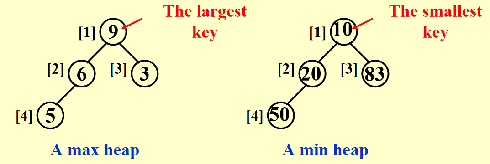

# Chap 6 Priority Queues(Heaps)

> When to use heap?
> 当我们只关心一个列表中最小（大）的元素时（频繁查找或使用），我们应优先使用**堆**
## ADT Model

**优先队列（堆）**
+ **对象(Objects)**：含有0个或多个元素的有限有序表
+ **运算(Operations)**：
	+ `PriorityQueue Initialize(int MaxElements);`
	+ `void Insert(ElementType X, PriorityQueue H);`❗
	+ `ElmentType DeleteMin(PriorityQueue H);`❗
	+ `ElementType FindMin(PriorityQueue H);`

## Simple Implementation

+ 数组
	+ 插入：在尾部添加项~$\Theta(1)$
	+ 删除：找最大/最小的键~$\Theta(n)$；删除项后移动剩余项~$O(n)$
+ **链表**：
	+ 插入：在头部添加项~$\Theta(1)$
	+ 删除：找最大/最小的键~$\Theta(n)$；删除项~$\Theta(1)$
+ 有序数组：
	+ 插入：找到正确的位置~$O(n)$；移动数组并加入该项~$O(n)$
	+ 删除：移除首项/末项~$\Theta(1)$
+ 有序链表：
	+ 插入：找到正确的位置~$O(n)$；加入项~$\Theta(1)$
	+ 删除：移除首项/末项~$\Theta(1)$

>可以看出，这些结构实现起来相对比较容易，且各有优劣。一般情况下，==插入的操作 > 删除的操作==，因此本教材的作者会在这四种方法中选择**链表**。

>What about *BST(二分搜索树)*？
>二分搜索树有以下问题：
>+ 虽然理论上它的插入和删除操作时间复杂度为$O(\log n)$，然而实际应用中**插入**操作是*随机*的，这会导致树的不平衡，从而影响时间复杂度
>+ 虽然**删除**操作并不是随机的，但我们只要找最小节点并且删除它，这会导致左子树越来越小，破坏了树的平衡，从而影响复杂度
>+ 我们可能想到构建一棵平衡的树，比如AVL树。但是AVL树中的很多操作在优先队列中用不到，且它的指针使用很危险。 

因此我们采用一种新的数据结构——**二叉堆**(binary heap, 简称**堆**(heap))

## Binary Heap

### Structure Property

**完全(Complete)二叉树**：对于一棵有$n$个节点且高为$h$的树，如果它的节点与一棵高为$h$的*完美二叉树(即满二叉树，perfect binary tree)* 的节点（从1到$n$标号）一一对应
>另一种定义：除了最后一层外，每层的节点都填满，最后一层的节点从左往右填补的树

一棵高为$h$的完全二叉树有$2^h$~$2^{h + 1} - 1$个节点 $\Leftrightarrow$ $h = \lfloor \log N \rfloor$

因为完全二叉树的规律性，我们可以使用**数组**存储二叉堆，用*索引*找到相应节点（见下面引理），十分简单，但创建堆的时候要考虑*最大容量*

🌟引理：如果一棵有$n$个节点的完全二叉树顺序表示，则对于索引为$i(1 \le i \le n)$的节点，我们有：
+ **父节点**的索引 $= \begin{cases} \lfloor \dfrac{i}{2} \rfloor & \text{if } i \ne 1 \\ \text{None} & \text{if } i = 1\end{cases}$
>很巧的是，C语言的整数除法自动帮我们向下取整，因此直接除就行了
+ **左孩子**的索引 $= \begin{cases} 2i & \text{if } 2i \le n \\ \text{None} & \text{if } 2i > n\end{cases}$
+ **右孩子**的索引 $= \begin{cases} 2i + 1 & \text{if } 2i + 1 \le n \\ \text{None} & \text{if } 2i + 1 > n\end{cases}$
>注：索引从1开始，只是为了得到上面看起来挺好看的引理。但这样做后，索引为0的位置就空出来了。我们之后会利用这个位置，作为**哨兵(sentinel)**（将其设为整个堆的最小值），方便后面的*插入*和*删除*操作

``` c
struct HeapStruct
{
	/* Maximum # that can fit in the heap */
	unsigned int max_heap_size;
	/* Current # of elements in the heap */
	unsigned int size;
	element_type *elements;
};
typedef struct HeapStruct *PriorityQueue;
```
#### Initialize
``` c
PriorityQueue Initiailize(int MaxElments)
{
	PriorityQueue H;
	if (MaxElements < MinPQSize)
		return Error("Priority queue size is too small");
	H = (PriorityQueue)malloc(sizeof(struct HeapStruct));
	if (H == NULL)
		return FatalError("Out of Space!!!");
	// Allocate the array plus one extra for sentinel
	H->Elements = (ElementType * )malloc((MaxElements + 1) * sizeof(ElementType));
	if (H->Elements == NULL)
		return FatalError("Out of Space!!!");
	H->Capacity = MaxElements;
	H->Size = 0;
	H->Elements[0] = MinData;  // set the sentinel
	return H;
}
```
### Heap Order Property

+ **最小树(min tree)**：一棵树中每个节点的键值不大于它的孩子
+ **最小堆(min heap)**：*完全二叉树* + *最小树*
> 我们也能以类似的方法定义**最大堆**，这里就不写出来了



>注：
>+ 显而易见，**根节点**是堆中最小(大)的节点
>+ 从堆的根节点出发，到任意节点的路径是*有序*的。但是堆不能表示整棵树的顺序

### Basic Heap Operations

#### Insertion
>思路：因为要保持完全二叉树的状态，因此**唯一**可插入节点的位置是**最后一个位置**。插入以后要调整节点的位置：将该节点与其父节点比较，如果比父节点小，则将父节点往下移，直至比当前比较的节点更大则停止，此时的位置即为新节点的位置。这种技巧被称为“**上滤(Percolate up)** ”。

图示：


代码实现：
``` c
// H->Elements[0] is a sentinel
void Insert(ElementType X, PriorityQueue H)
{
	int i;

	if (IsFull(H))
	{
		Error("Priority queue is full");
		return;
	}

	for (i = ++H->Size; H->Elements[i / 2] > X; i /= 2)
		H->Elements[i] = H->Elements[i / 2];

	H->Elements[i] = X;
}
```
>注：
>1. 在比较过程中，并没有直接交换两个数，因为实现一次交换就需要三条赋值语句。如果一个节点向上移动$d$层，则需要执行$3d$次运算；而上面的方法只需$d + 1$次运算，显然**更快**
>2. 正如上面所说，0位置的节点被称为**哨兵**，将它的值设为整个堆的最小值。有了它，我们就不需要用“`while`循环+根节点位置特判“这么麻烦，对待根节点也能像对待其他节点一样，因此只要用简单的`for`循环就能实现
>3. $T(N) = O(\log N)$

#### DeleteMin
>思路：要找到最小值非常简单——就是**首项**。但是删除首项后，还是要保证该树是完全二叉树+最小树。因此实际上我们应删除**最后一个节点**，然后考虑如何安置原来在最后位置上的节点：先将它放入根节点的位置（因为”删除“操作，这个位置空出来了），再让它和左右孩子比较。如果比左右孩子都大，则要将最小的孩子放入根节点，接着将它与这个孩子的左右孩子比较，……，直至比左右孩子都小为止。这种技巧被称为”**下滤(Percolate down)** “

图示：


代码实现：
``` c
ElementType DeleteMin(PriorityQueue H)
{
	int i, Child;
	ElementType MinElement, LastElment;
	
	if (isEmpty(H))
	{
		Error("Priority queue is empty");
		return H->Elements[0];
	}
	MinElement = H->Elements[1];   // save the min element
	LastElment = H->Elements[H->Size--];  // take last and reset size
	for (i = 1; i * 2 <= H->Size; i = Child)  // find smaller child
	{
		Child = i * 2;
		if (Child != H->Size && H->Elements[Child + 1] < H->Elements[Child]) // percolate one level
			Child++;
		if (LastElement > H->Elements[Child]);
		else break;  // find the proper position
	}
	H->Elements[i] = LastElement;
	
	return MinElement;
}
```
>注：
>1. `for`循环中的第一个`if`语句考虑了只有一个左孩子的节点的情况：没有这句话的话，程序会默认每个节点都有两个孩子，显然会导致错误；同时，它也选择了最小的孩子作为接下来的比较对象
>2. 可以使用另一个**哨兵**来移除这个`if`语句：对于节点总数为偶数的堆(由完全二叉树的性质知，此时存在一个只有左孩子的节点)，在最后位置的下一个位置上添加一个节点，并将其值设为整个堆的最大值，这样就可以防止某个节点下滤的时候被安置在不存在的节点上，而不需要特判
>3. $T(N) = O(\log N)$

### Other Heap Operations

>注：
>1. 如果我们想要频繁地**查找**某个列表中的**任意**元素，那么*堆*绝对==不是==合理的选择，因为在堆里找元素需要线性扫描($O(n)$)。我们应该采用二分搜索树、散列表等方法
>2. 在最小堆中找最大值也是不合理的，理由同上

$DecreaseKey(P, \Delta, H)$
>将位置为$P$的节点的键值减去$\Delta$，这样对应节点的优先级就会提高（**上滤**）

$IncreaseKey(P, \Delta, H)$
>将位置为$P$的节点的键值加上$\Delta$，这样对应节点的优先级就会下降（**下滤**）

>注：这两个操作一般由*系统管理员*，而非一般的用户使用。比如，前者可使某个程序提到最高优先级；后者可将占用CPU时间过多的进程的优先级往下调

$Delete(P, H)$
>从堆中移除位置为$P$的节点（删除由用户终止（非正常结束）的进程）。看似很复杂，实际上我们可以运用之前的`DecreaseKey()`和`DeleteMin()`函数，其中前者第二个参数令为$\infty$（减去无限大的数，成为最小的数，然后利用`DeleteMin()`）

$BuildHeap(H)$
> 题目：将某个列表中的一组数放入空的堆中
> 方法：
> + 对于每个节点使用`Insert()`函数 $\rightarrow O(N\log N)$ ？❌
> + 采用“**下滤**”思想：现将表中的元素按层序放入一棵完全二叉树中，然后从**高度为1的最后一个节点**开始（最底层高度为0），跟子树比较大小，如果比子树大，则需要下滤，直至合适的位置（具体实现可借鉴`DeleteMin()`）
>
> 	图示：
>	
>	
>	
> 	简单代码实现：
``` c
for (i = N / 2; i > 0; i--)
	PercolateDown(i);
```


定理：对于一棵高为$h$，拥有$2^{h+1}-1$个节点的完美二叉树，所有节点高度之和为$2^{h+1} - 1 - (h+1)$

由此，我们可以推出`BuildHeap(H)`的时间复杂度为$O(N)$

## Applications of Priority Queues

举例：
+ 操作系统（见[[Chap 6 Priority Queues(Heaps)#Other Heap Operations|这里]]）
+ 外部排序（第7章）
+ [[Chap 3 Algorithms#^19ef1a|贪心算法]]
+ 离散事件模拟（见下面的例子）

### The Selection Problem

>问题：给定$N$个元素，找到第$k$大的元素

算法：
在第一章中，已经给出两个算法，易于理解但效率不高：
1. 对所有元素排好序，再找第$k$大的数 $\rightarrow O(N^2)$
2. 先取前$k$个数并对这些数排好序，再将剩余$N - k$个数分别与这$k$个数比较：如果比这$k$个数中最小的数更大，将最小的数踢出去，这个数进去并放入正确的位置。时间复杂度为$O(N \cdot k)$，最坏情况$k = \lceil N/2 \rceil$时，时间复杂度为$O(N^2)$

利用我们刚学的堆，可以得到两个复杂度均为$O(N \log N)$的算法：
3. 为了方便起见，这里我们讨论找第$k$小的数（道理都是一样的）。先对这$N$个元素构建堆(使用`BuildHeap()`函数)，然后使用$k$次`DeleteMin()`函数，最后一次从堆中得到的元素便是我们想要的第$k$小的元素。时间复杂度$O(N + k \log N)$，最坏情况为$k = \lceil N/2 \rceil$，时间复杂度为$\Theta(N \log N)$
4. 借鉴算法2的思想，先对前$k$个数构建堆(使用`BuildHeap()`函数)，然后将剩下$N - k$个元素与堆中根节点(最小值)进行比较，如果比它大，则需要使用`DeleteMin()`和`Insert()`两个函数。时间复杂度为$O(k + (N - k)\log k) = O(N \log k)$，最坏情况为$\Theta(N \log N)$

### Event Simulation
>问题：在银行中，顾客排在一列队伍中，等待$k$位出纳员中的一位有空。分析每位顾客的平均等待时间、队伍的长度

分析：
该模拟中包含两个事件：*顾客到达银行*，*顾客离开银行（一位出纳员因此处于空闲状态）*

我们可以使用概率函数产生输入流，该输入流包含一组有*到达时间*和*服务时间*的有序对，按到达时间排序。我们不采用精确的时间，而是以tick作为计时单位。开始时，将tick初始化为0；当没有顾客进来且所有出纳员都处于空闲状态时，模拟结束。

如果我们通过循环每个tick来处理整个程序的话，那么运行时间跟顾客和时间的数量无关，而且运行效率很低。因此我们**根据最近时间发生的事件来增加tick**，这分为两种情况：下一位顾客的到来，有一位顾客离开。

对于正在排队的顾客，我们用**队列**来存储；对于每位顾客离开时间的存储，我们用**优先队列**存储，以便我们找到最近发生的事件。时间复杂度：$O(C \log(k + 1))$
## d-Heaps
>对于这种堆，所有节点最多有$d$个孩子


>注：$d$并不是越大越好，理由——
>1. 虽然`Insert()`速度变快($O(\log_dN))$)，但`DeleteMin()`要找到最小的孩子，需要$d - 1$次比较，因此时间复杂度将会变成$O(d \log_d N)$
>2. 在找某个节点的左右孩子或父节点时，二叉堆中的$\times 2$或 /2仅仅是个**移位**操作，但d-Heap中的$\times d$或 / d 则更加复杂
>
>优势：
>1. 就如前文所说，插入操作往往比删除操作多，因此我们从`Insert()`的提速中获得的好处比`DeleteMin()`的降速带来的弊端更多
>2. 如果优先队列太大，以至于主内存无法容纳，则d-Heap比二叉堆更有优势😕
>
>补充：对于节点$i$
>+ 父节点：$\lfloor \dfrac{i + d - 2}{d} \rfloor$
>+ 第一个孩子：$(i - 1)d + 2$
>+ 最后一个孩子：$id + 1$