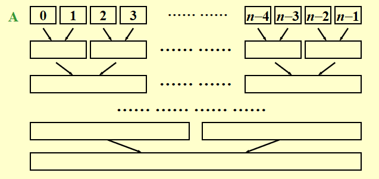
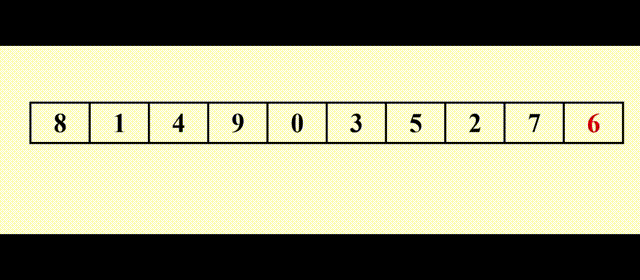
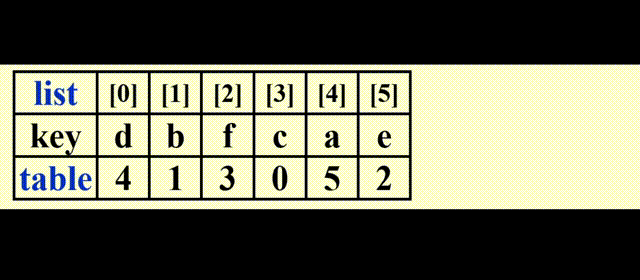
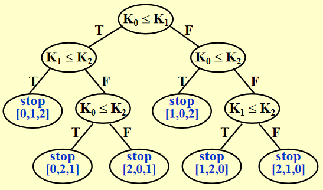
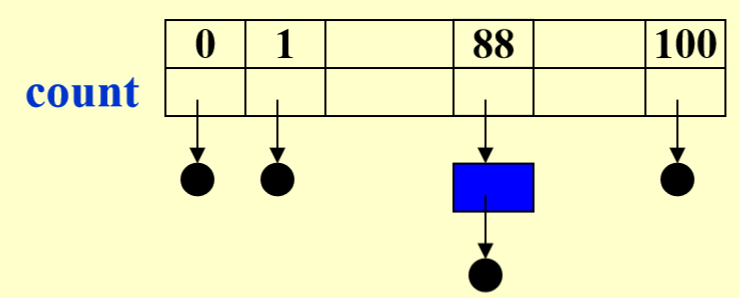
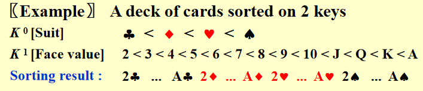
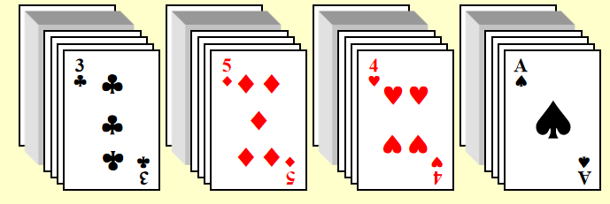
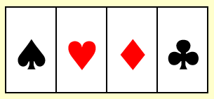
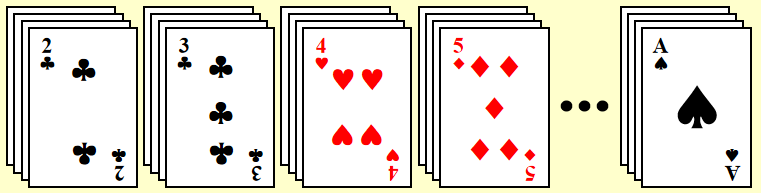

# Chap 7 Sorting

## Preliminaries

`void X_sort(ElementType A[], int N)`
+ `N`必须是合法的整数
+ 方便起见，假设数组元素都是整数
+ *基于比较的排序(comparison-based sorting)*：假定存在`<`, `>`运算符，且它们是唯一能够用于输入数据的运算符
+ 仅考虑*内部排序(internal sorting)* (即整个排序能在主内存中完成)

## Insertion Sort

**插入排序(insertion sort)** 需要重复N - 1趟排序，从P = 1到P = N - 1。每趟排序结束后确保位置在0~P上的元素是有序的，且排序前已知0~P-1位置上的元素是有序的。对于第P趟排序，我们将位置P上的元素向前P个元素移动，直到发现正确的位置。

代码实现：
``` c
void InsertionSort(ElementType A[], int N)
{
	int j, P;
	ElementType Tmp;

	for (P = 1; P < N; P++)
	{
		Tmp = A[P] // the next coming card
		for (j = P; j > 0 && A[j - 1] > Tmp; j--)
			A[j] = A[j - 1];
		// shift sorted cards to provide a position for the new coming 
		// card
		A[j] = Tmp; // place the new card at the proper position
	} // end for-P-loop
}
```

+ 最坏情况：输入的`A[]`是*逆序*的，$T(N) = O(N^2)$
+ 最好情况：输入的`A[]`是顺序的，$T(N) = O(N)$
+ 平均情况：$\Theta(N^2) = \sum\limits_{i = 2}^Ni = 2 + 3 + 4 + \dots + N$

## A Lower Bound for Simple Sorting Algorithms

定义：一个数组中数字的**逆序对(inversion)** 是一个有序对$(i, j)$，满足$i < j$且$A[i] > A[j]$


观察发现：数组中==逆序对==的个数 = 其插入排序过程中的==交换==次数

证明：交换两个相邻的元素，就可以消去数组中的一个逆序对

所以，插入排序的时间复杂度还可以表示为$T(N, I) = O(I + N)$，其中$I$是原始数组中逆序对的个数。观察发现，当列表已经排过序了，那么这次排序的速度就会很快

定理1：对于包含N个不同数字的数组，它的*平均逆序对个数*为$\dfrac{N(N-1)}{4}$

定理2：任何通过*交换相邻元素*实现的排序算法，*平均*时间复杂度为$\Omega(N^2)$

由这些定理，我们知道：可以通过在*每次交换中消除多个逆序对*的方式来提升排序效率

## Shellsort

**希尔排序(shellsort)** 的大致原理：这种算法比较相隔一定距离的元素；比较的间隔在算法运行时将不断减小，直到最后比较的是相邻元素。因此这种排序也被称为*缩小增量排序(diminishing increment sort)*。它是*不稳定*的排序

🌰：


+ **增量序列(increment sequence)**：$h_1 < h_2 < \dots < h_t(h_1 = 1)$

+ **$h_k$-sort**：阶段$k = t, t - 1, \dots, 1$的排序。$h_k$-sort后，可以确保序列A中$\forall i,\ A[i] \le A[i + h_k]$
	+ $h_k$-sorted的序列，经历了$h_{k-1}$-sort后，保持$h_k$-sorted
	+ 具体做法：对某个位置为i的元素，在位置为$i, i - h_k, i - 2h_k, \dots$的元素中进行*插入排序*，因此1个$h_k$-sort包含$h_k$次独立的插入排序
	
**希尔增量序列(Shell's increment sequence)**：
$$
h_t = \lfloor \dfrac{N}{2} \rfloor,\ h_k = \lfloor \dfrac{h_{k+1}}{2} \rfloor
$$
代码实现：
``` c
void Shellsort(ElementType A[], int N)
{
	int i, j, increment;
	ElementType Tmp;
	for (increment = N / 2; increment > 0; increment /= 2)
		// h sequence
		for (i = increment; i < N; i++)
		{ // insertion sort
			Tmp = A[i];
			for (j = i; j >= increment; j -= increment)
				if (Tmp < A[j - increment])
					A[j] = A[j - increment];
				else
					break;
				A[j] = Tmp;
		} // end for-l and for-increment loop
}
```

### Worst-Case Analysis

希尔排序的运行时间取决于增量序列的选择

定理：使用希尔增量的希尔排序的最坏运行时间为$\Theta(N^2)$
>注：证明部分见书本$P_{224}$


>注：因为这些增量不是两两互质的，因此更小的增量起到的作用不大

---
**希巴德增量序列(Hibbard's increment sequence)**：
$$
h_k = 2^k - 1
$$
>注：不难发现这些增量两两互质

定理：使用希巴德增量的希尔排序的最坏运行时间为$\Theta(N^{\frac{3}{2}})$
>注：证明部分见书本$P_{225}$

猜想：
+ $T_{\text{avg-Hibbard}}(N) = O(N^{\frac{5}{4}})$
+ 塞奇威克(Sedgewick)的最佳序列是{1, 5, 19, 41, 109, …}，这些项要么来自$9 \times 4^i - 9 \times 2^i + 1$，要么来自$4^i - 3 \times 2^i + 1$
	+ $T_{avg}(N) = O(N^{\frac{7}{6}})$
	+ $T_{worst}(N) = O(N^{\frac{4}{3}})$

虽然希尔排序非常简单，但是它的分析相当复杂。它适用于排序中等大的输入序列(成千上万)

## Heapsort

算法1：
``` c
Algorithm 1:
{
	BuildHeap(H);  // O(N)
	for (i = 0; i < N; i++)
		TmpH[i] = DeleteMin(H);  // O(log N)
	for (i = 0; i < N; i++)
		H[i] = TmpH[i];  // O(1)
}
```

>[!caution] 
>问题：使用了额外的数组，占用了更多的空间(拷贝不影响时间复杂度)

>[!hint] 
>如何改进🤔
>
>观察发现，每使用1次`DeleteMin`函数，堆的规模缩小1，而我们可以利用这个本该废弃的空间，来存放`DeleteMin`得到的最小的数。但按照这个方法，我们得到的是一个*递减*序列；如果要得到*递增*序列，需要使用`DeleteMax`函数。由此，我们得到了算法2👇

算法2：

🌰：


``` c
// 这里的PercDown函数与Chap 6 给出的稍有不同(因为索引的标注)
#define LeftChild(i) (2 * (i) + 1)

void PercDown(ElementType A[], int i, int N)
{
	int Child;
	ElementType Tmp;

	for (Tmp = A[i]; LeftChild(i) < N; i = Child)
	{
		Child = LeftChild(i);
		if (Child != N - 1 && A[Child + 1] > A[Child])
			Child++;
		if (Tmp < A[Child])
			A[i] = A[Child];
		else
			break;
	}
	A[i] = Tmp;
}

void Heapsort(ElementType A[], int N)
{
	int i;
	for (i = N / 2; i >= 0; i--)  // BuildHeap
		PercDown(A, i, N);
	for (i = N - 1; i > 0; i--)   // DeleteMax
	{
		Swap(&A[0], &A[i]);
		PercDown(A, 0, i);
	}
}
```
>注：不同于Chap 6，这里的索引从0开始标注

堆排序是一种*极其稳定*的算法

定理：对N个不同项的随机排列进行堆排序，平局比较时间为$2N \log N - O(N \log \log N)$
>注：证明见书本$P_{229-230}$

>注：尽管堆排序给出了==最佳的平均时间==$O(N \log N)$，实际上它比使用Sedgewick增量序列的希尔排序更慢

## Mergesort

**归并排序(merge sort)**：时间复杂度$O(N \log N)$，它是*递归算法*的典例，是一种*稳定*的算法

1. 合并2个已经排好序的列表
	
	时间复杂度：$T(N) = O(N)$，$N$为2个列表的元素个数总和

2. 归并排序
	代码实现：
``` c
void MSort(ElementType A[], ElementType TmpArray[], int Left, int Right)
{
	int Center;
	if (Left < Right)
	{
		Center = (Left + Right) / 2;
		MSort(A, TmpArray, Left, Center);
		MSort(A, TmpArray, Center + 1, Right);
		Merge(A, TmpArray, Left, Center + 1, Right);
	}
}

void MergeSort(ElementType A[], int N)
{
	ElementType *TmpArray;
	TmpArray = (ElementType *)malloc(N * sizeof(ElementType));
	if (TmpArray != NULL)
	{
		MSort(A, TmpArray, 0, N - 1);
		free(TmpArray);
	}
	else FatalError("No space for tmp array!!!");
}

// Lpos = start of left half, Rpos = start of right half
void Merge(ElementType A[], ElementType TmpArray[], int Lpos, int Rpos, int RightEnd)
{
	int i, LeftEnd, NumElements, TmpPos;
	LeftEnd = Rpos - 1;
	TmpPos = Lpos;
	NumElements = RightEnd - Lpos + 1;
	while (Lpos <= LeftEnd && Rpos <= RightEnd) // main loop
		if (A[Lpos] <= A[Rpos])
			TmpArray[TmpPos++] = A[Lpos++];
		else
			TmpArray[TmpPos++] = A[Rpos++];
	while (Lpos <= LeftEnd) // Copy rest of first half
		TmpArray[TmpPos++] = A[Lpos++];
	while (Rpos <= RightEnd) // Copy rest of second half
		TmpArray[TmpPos++] = A[Rpos++];
	for (i = 0; i < NumElmentsl i++, RightEnd--)
		// Copy TmpArray back
		A[RightEnd] = TmpArray[RightEnd];
}
```

>注：
>+ 归并排序体现了**分治(divide-and-conquer)** 思想：`MSort`为“分”，`Merge`为“治”
>+ 如果每次调用`Merge`，`TmpArray`会被局部声明，那么空间复杂度$S(N) = O(N \log N)$
>+ 除此之外，大量的时间被用于使用`malloc`函数建立`TmpArray`

### Analysis

时间复杂度分析(利用递推关系)：
$$
\begin{align}
T(1) &= 1\\
T(N) &= 2T(\dfrac{N}{2}) + O(N) \\
& = 2^kT(\dfrac{N}{2^k}) + k \cdot O(N) \\
& = N \cdot T(1) + \log N \cdot O(N) \\
& =O(N + N\log N)
\end{align}
$$
>注：
>+ 另一种证明法见书本$P_{233-234}$ 
>+ 归并排序需要线性大小的额外内存，且拷贝数组会降低速度，因此在*内部排序*中这种方法不太好用，但是在*外部排序(external sort)*(ads会讲) 中很合适

迭代版本(图示)：


## Quicksort

### 1. The Algorithm

**快速排序(quicksort)**(以下简称快排)是目前已知实际上*最快的*排序算法

基本模版(伪代码)：
``` c
void Quicksort(ElementType A[], int N)
{
	if (N < 2) return;
	pivot = pick any element in A[]    // ?
	Partition S = {A[] \ pivot} into two dijoint sets:    // ?
		A1 = {a in S | a <= pivot} and A2 = {a in S | a >= pivot}
	A = Quicksort(A1, N1) + {pivot} + Quicksort(A2, N2);
}
```

>注：
>+ 这里我们将`pivot`(支点)放在第二个子数列`A2`里
>+ 快排也是一种*分治递归算法*

最佳时间复杂度$T(N) = O(N \log N)$

🌰：


>[!info]
>思考🤔：
>+ 我们如何选取`pivot`，真的是“随机”挑选吗？
>+ 如何将数组(可以看作集合)“划分(`Partition`)”为2个子数组(子集)？

### 2. Picking the Pivot

+ 错误的方法：`Pivot = A[0]`
>最坏情况：
>+ 数组`A[]`已提前排好序
>+ `A[]`是逆序的
>
>则所有的元素要么全部放入`A1`，要么全部放入`A2`，因此浪费了$O(N^2)$的时间做无意义的事

+ 安全的策略：`Pivot = random select from A[]`
>然而随机数生成的“成本”较高

+ 三数中值分割法(median-of-three partitioning)：`Pivot = median(left, center, right)`
>它不仅消除了最坏情况(输入前已排好序)，而且节省了5%的运行时间

### 3. Partitioning Stategy

🌰：`Pivot = 6`
+ 初始状态：我们将`Pivot`与最后一个元素交换，即把`Pivot`放入最后；`i`从第一个元素开始，`j`从倒数第二个元素开始
+ 当`i < j`时，
	+ 若`i`所指元素比`Pivot`小，`i++`，否则停止，等待交换
	+ 若`j`所指元素比`Pivot`大，`j--`，否则停止，等待交换
	+ 当`i`和`j`都停下来了，交换`i, j`所指元素
	这样，数组中比`Pivot`小的元素在左边，比`Pivot`大的元素在右边



当`key == Pivot`时(`key`为数组中的某个值，也就是说数组中有不止一个与`Pivot`相等的元素)：
+ ⭐同时停止`i`和`j`：
	+ 较坏的情况：1, 1, 1, ……, 这时快排就会进行许多无意义的交换
	+ 然而，这确保整个序列能够被划分均匀
	+ 时间复杂度：$T(N) = O(N \log N)$
+ ❌`i`和`j`均不停止：
	+ 出现子序列划分不均的问题
	+ 如果所有元素都相等，时间复杂度$T(N) = O(N^2)$

所以，我们选择前一种方案

### 4. Small Arrays

+ 问题：当数组规模较小($N \le 20$)时，快排比插排慢
+ 解决方案：当N较小时，采用另一种更有效的算法（比如插排）

### 5. Implementation

代码实现：
``` c
void Quicksort(ElementType A[], int N)
{
	Qsort(A, 0, N - 1);
	// A: the array
	// 0: Left index
	// N - 1: Right index
	// Return median of Left, Center, and Right
	// Order these and hide the pivot
}

ElementType Median3(ElementType A[], int Left, int Right)
{
	int Center = (Left + Right) / 2;
	if (A[Left] > A[Center])
		Swap(&A[Left], &A[Center]);
	if (A[Left] > A[Right])
		Swap(&A[Left], &A[Right]);
	if (A[Center] > A[Right])
		Swap(&A[Center], &A[Right]);
	// Invariant: A[Left] <= A[Center] <= A[Right]
	Swap(&A[Center], &A[Right - 1]);
	// only need to sort A[Left + 1] .. A[Right - 2]
	return A[Right - 1]; // Return pivot
}

void Qsort(ElementType A[], int Left, int Right)
{
	int i, j;
	ElementType Pivot;

	if (Left + Cutoff <= Right) // if the sequence is not too short
	{
		Pivot = Median3(A, Left, Right);  // select pivot
		i = Left; 
		j = Right - 1;
		for (;;)
		{
			while (A[++i] < Pivot) {}  // scan from left
			while (A[--j] > Pivot) {}  // scan from right
			if (i < j)
				Swap(&A[i], &A[j]);    // adjust partition
			else break;                // partition done
		}
		Swap(&A[i], &A[Right - 1]);    // restore pivot
		Qsort(A, Left, i - 1);         // recursively sort left part
		Qsort(A, i + 1, Right);        // recursively sort right part
	}  // end if - the sequence subarray
	else
		InsertionSort(A + Left, Right - Left + 1);
}
```

>[!warning]
>为什么第34和第35行不能分别替换为：`i = Left + 1; j = Right - 2;` 呢？
>(之后有时间可以运行代码验证)

### 6. Analysis

快排时间复杂度的递推关系式：
$$
T(N) = T(i) + T(N - i - 1) + cN
$$
+ 最坏情况：每次快排挑选的*支点*都是*最小*的元素
$$T(N) = T(N - 1) + cN \quad \Rightarrow \quad T(N) = O(N^2)$$
+ 最好情况：支点为*中间*元素
$$T(N) = 2T(\dfrac{N}{2}) + cN \quad \Rightarrow \quad T(N) = O(N \log N)$$
+ 平均情况：假设$\forall i,\ T(i)$的平均时间为$\dfrac{1}{N}[\sum\limits_{j = 0}^{N - 1}T(j)]$
$$T(N) = \dfrac{2}{N}[\sum\limits_{j = 0}^{N - 1}T(j)] + cN \quad \Rightarrow \quad T(N) = O(N \log N)$$

🌰：给定具有N个元素的列表和整数k，找到第k大的元素
>[[Chap 2 Algorithm Analysis#Compare the Algorithms|前景回顾]]

代码实现：
``` c
// Places the kth smallest element in the kth position
// Because arrays start at 0. this will be index k-1
void Qselect(ElementType A[], int k, int Left, int Right)
{
	int i, j;
	ElementType Pivot;

	if (Left + Cutoff <= Right)
	{
		Pivot = Median3(A, Left, Right);
		i = Left; j = Right - 1;
		for (;;)
		{
			while (A[++i] < Pivot) {}
			while (A[--j] > Pivot) {}
			if (i < j)
				Swap(&A[i],  &A[j]);
			else
				break;
		}
		Swap(&A[i], &A[Right - 1]);

		if (k <= i)
			Qselect(A, k, Left, i - 1);
		else if (k > i + 1)
			Qselect(A, k, i + 1, Right);
	}
	else 
		InsertionSort(A + Left, Right - Left + 1);
}
```

时间复杂度：
+ 最坏情况：$O(N^2)$
+ 平均情况：$O(N)$

## Sorting Large Structures

+ 问题：交换大型结构的成本较高
+ 解决方案：添加指向结构的指针，然后交换指针——**间接排序(indirect sorting)**。如果的确有必要再真正地交换结构

🌰：表排序(table sort)

+ 我们用`table[]`数组存储指针。注意这里的指针不是C语言的指针类型，而是数组`list[]`的索引。初始化为`table[i] = i`
+ 对`list[]`的内容进行*间接排序*：我们只需移动指针即可(自己选择一种排序方法排序)
+ 如何输出排好序的列表：`list[table[0]], list[table[1]], ..., list[table[n-1]]`

>上图为初始状态，下图为间接排序后的列表

>[!hint]
>观察`Table`的值，发现这n个值的排列是由一些不相交的“环”构成(类似[[Chap 8 The Disjoint Set ADT|并查集]])，我们可以利用这一性质对`list`进行物理排序(真正地交换元素)
>
>下图打阴影的部分表示2个环
>

物理排序：


最坏情况：有$\lfloor \dfrac{N}{2} \rfloor$个环，需要$\lfloor \dfrac{3N}{2} \rfloor$次移动
时间复杂度：$T = O(mN)$，其中m为结构体的大小

## General Lower Bound for Sorting

定理：任何通过比较进行排序的算法，其最坏情况的计算时间为$\Omega(N \log N)$

证明：利用**决策树(decision tree)**
🌰：


排序N个元素会产生N!中不同的可能情况，因此决策树至少有N!个叶子节点。若树的高为k，那么$N! \le 2^{k-1}$，所以$k \ge \log(N!) + 1$

$\because N! \ge (\dfrac{N}{2})^{\frac{N}{2}}$，即 $\log_2 N! \ge \dfrac{N}{2}\log_2(\dfrac{N}{2}) = \Theta(N \log_2 N)$
$\therefore T(N) = k \ge c \cdot N \log_2 N$

## Bucket Sort and Radix Sort

### Bucket Sort

🌰：假设有N个学生，每个学生有一个在0-100(因此有M = 101可能的不同分数)之间的成绩，那么如何在线性时间内根据他们的乘积进行排序？


伪代码：
``` c
Algorithm
{
	initialize count[];
	while (read in a student's record)
		insert to list count[stdnt.grade];
	for (i = 0; i < M; i++)
	{
		if (count[i])
			output list count[i];
	}
}
```

时间复杂度：$T(N, M) = O(M + N)$

>[!info]
>当$M \gg N$时，比如N = 10, M = 1000，如果还想在线性时间内完成排序，桶排序就不太靠谱了——而下面介绍的基数排序将胜任这一问题

### Radix Sort

🌰：对完全立方数进行排序，采用*最低位优先(least significant digit first)* 的策略


时间复杂度：$T = O(P(N + B))$，其中$P$为排序的*趟数(pass)*，N为元素个数，B为桶数

---
分析：

假设记录$R_i$有r个键：
+ $K_i^j$：$R_i$的第j个键
+ $K_i^0$：$R_i$的最高位
+ $K_i^{r-1}$：$R_i$的最低位

对于包含记录$R_0, \dots, R_{n-1}$的列表，如果满足：
$$
(K_i^0, K_i^1, \dots, K_i^{r-1}) \le (K_{i + 1}^0, K_{i + 1}^r, \dots, K_{i+1}^{r - 1})
$$
也就是说：$K_i^0 = K_{i+1}^0, \dots, K_i^l, = K_{i+1}^l, K_i^{l+1} < K_{i+1}^{l+1},\ l < r - 1$
，则称该列表具有 **[[Chap 9 Relations#Lexicographic Order|词典序(lexically sorted)]]**

---
🌰：对于一副扑克牌(52张)，要求如下：


+ 法一：最高位排序
	+ 按$K^0$排序：根据花色，创建4个篮子
	
	+ 对每个篮子单独排序（采取合理的排序方法）
	
	
+ 法二：最低位排序
	+ 按$K^1$排序，根据面值，创建13个篮子
	
	+ 再将它们按上一步分出来的顺序合并成一堆
	
	+ 再创建4个桶，重新排序
