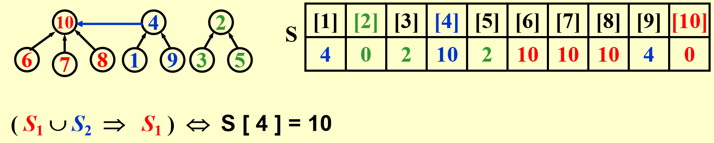
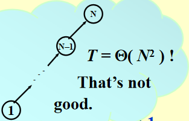

# Chap 8 The Disjoint Set ADT

## Equivalence Relations

>具体概念见dm[[Chap 9 Relations|第9章]]

定义：
+ 在某个集合$S$的一个**关系(relation)**$R$，对于每对元素$(a ,b), a, b \in S$，它们的关系$a \ R\ b$，如果其值为真，那么称$a$与$b$相关($a$ is related to $b$)
+ 对于集合$S$的一种关系$\sim$，如果它满足*自反性(reflexive)* 、*对称性(symmetric)*和 *传递性(transitive)*，那么称这种关系为**等价关系(equivalence relation)**
	>+ 自反性：$\forall a \in S, a\ R\ a$
	>+ 对称性：$a\ R\ b \leftrightarrow b\ R\ a$
	>+ 传递性：$(a\ R\ b) \wedge (b\ R\ c) \rightarrow a\ R\ c$

+ 对于元素$a \in S$的**等价类(equivalence class)**，是包含所有与$a$*相关*的元素的$S$的子集
>可以看出，等价类相当于$S$内的隔板(partition)，$S$内的每个元素仅出现在一个等价类中

## The Dynamic Equivalence Problem

>问题：给定等价关系$\sim$，对于任何的$a, b$，判断$a \sim b$是否成立

🌰

算法——**并查集(Union / Find, the disjoint set)**
``` c
Algorithm: (Union / Find)
{   
	// step 1: read the relations in
	initialize N disjoint sets;
	while  (read in a~b)
	{
		if (!(Find(a) == Find(b)))
			Union the two sets;
	} // end-while
	// step 2: decide if a~b
	while (read in a and b)
		if (Find(a) == Find(b))
			output(true) ;
		else
			output(false);
}
```
>注：这是一种*动态的(dynamic)*，*在线(on-line)* 算法
>+ 动态：在算法执行过程中，`Union()`会随时改变集合

---
并查集有以下属性：
+ 集合的 **元素(Elements)**：$1, 2, 3, \dots, N$
>初始状态：有$N$个集合，每个集合仅有1个元素
+ 对于一组集合$S_1, S_2, \dots \dots$，如果满足$S_i \cap S_j = \emptyset(i \ne j)$，称这些集合为**不相交(disjoint)**
	>如何在程序中表示这种数据结构？——**树**，并注意指针应==从孩子节点指向父节点==

+ **运算(Operations)**
	+ `Union(i, j)`： 用$S = S_i \cup S_j$取代$S_i$和$S_j$
	+ `Find(i)`：找到包含元素$i$的集合$S_k$

## Basic Data Structure

``` c
// Declaration
#ifndef _DisjSet_H

typedef int DisjSet[NumSet + 1];
typedef int SetType;
typedef int ElementType;

void Initialize(DisjSet S);
void SetUnion(DisjSet S, SetType Root1, SetType Root2);
SetType Find(ElementType X, DisjSet S);

#endif // _DisjSet_H
```

### `Union(i, j)`
>思路：令$S_i$为$S_j$的子树（反过来也行），也就是说，我们将其中一棵树的根节点指向另一棵树的根节点


如何实现？
+ 方法1——数组+指针(不推荐❌)
	
+ 方法2——利用数组的*索引*（因为集合的元素都是正整数）👍
	$$
	S[i] = \begin{cases}\text{the element's parent} &,\ \text{if the element isn't a root} \\ 0 &,\ \text{if the element is a root}\end{cases}
	$$
 	>注：索引从**1**开始

	🌰
	
	变化后
	
	
	代码实现：
``` c
void Initialize(DisjSet S)
{
	int i;

	for (i = NumSets; i > 0; i--)
		S[i] = 0;
}
```

``` c
void SetUnion(DisSet S, SetType Rt1, SetType Rt2)
{
	S[Rt2] = S[Rt1];
}
```
>时间复杂度：$O(1)$

### `Find(i)`

+ 方法1——树的节点有一个`parent`字段，利用它得到整棵树的根节点(还是不推荐❌)
	
+ 方法2
	代码实现：
``` c
SetType Find(ElementType X, DisSet S)
{
	for (; S[X] > 0; X = S[X]);
	return X;
}
```
>(最坏情况)时间复杂度：$O(N)$（与$X$的深度有关，$N$为整个并查集的节点个数）

### Analysis

因为`union()`和`find()`操作往往是成对出现的，因此要分析该算法的复杂度，需要考虑执行一系列的`union()` + `find()`运算

代码实现
``` c
// 使用上述算法实现的并查运算
{
	Initialize S[i] = {i} for i = 1,..., 12;
	for (k = 1; k <= Size; k++) // 对于每一对i~j
		if (Find(i) != Find(j))
			SetUnion(Find(i), Find(j));  // 注意：Union时最好合并的是两棵树的根节点
}
```

考虑最坏情况：`union(2, 1), find(1); union(3, 2), find(2); ...... union(N, N - 1), find(1);`，这些操作最终使一棵树退化成一个链表，时间复杂度为$\Theta(N^2)$


## Smart Union Algorithms

### Union-by-Size

>根据**规模(size)** 合并树——总是将规模小的树合并到规模大的树上，令`S[Root] = -size`，初始化为-1

*引理*：令树$T$为通过union-by-size方法构造出的，且有$N$个节点，则：
$$
height(T) \le \lfloor \log_2N \rfloor + 1
$$
>证明：利用数学归纳法

因此`Find()`的时间复杂度变为$O(\log N)$

时间复杂度：$O(N + M \log N)$（进行$N$次合并操作和$M$次查找操作后）

``` c
void SetUnion(DisjSet S, SetType Root1, SetType Root2)
{
    if (Root1 == Root2)         // 如果是同一棵树，啥都不用做
        return;
    if (S[Root2] < S[Root1])    // 如果Root2对应树的规模更大
    {
        S[Root2] += S[Root1];
        S[Root1] = Root2;
    }
    else                        // 如果Root1对应树的规模更大
    {
        S[Root1] += S[Root2];
        S[Root2] = Root1;
    }
}
```

>注：树的高度 $\le \log N + 1$

### Union-by-Height(rank)

>根据**高度(height)** 合并树——总是将矮的那棵树合并到高的那棵树上，因此每次`Union()`后树的高度最多增加1（当2棵树高度相同时）

代码实现：
``` c
void SetUnion(DisjSet S, SetType Root1, SetType Root2)
{
	if (S[Root2] < S[Root1])
		S[Root1] = Root2;
	else
	{
		if (S[Root1] == S[Root2])
			S[Root1]--;
		S[Root2] = Root1;
	}
}
```

>🌟记得在调用`Union()`函数时，==参数中的两个`root`一定要先调用`Find`==，类似`Union(S, Find(x1), Find(x2))`，因为我们要合并2个完整的并查集，而不是2个节点。

## Path Compression

>经过上述改进，`Union`算法的性能已经不能再提升了，因此我们考虑改进`Find`算法。于是我们便用到了**路径压缩(path compression)** 的方法——对于从根节点到$X$路径上的每个节点，将它的父节点设为根节点

示意图：


代码实现：
``` c
// algorithm1--recursion
SetType Find(ElementType X, DisSet S)
{
	if (S[X] <= 0)
		return X;
	else
		return S[X] = Find(S[X], S); // 让X的父节点为X原来父节点的父节点
}
```

``` c
// algorithm2--iteration
SetType Find(ElementType X, DisSet S)
{
	ElementType root, trail, lead;
	for (root = X; S[root] > 0; root = S[root]); // find the root
	for (trail = X; trail != root; trail = lead) 
	// 将路径上的所有节点的父节点都设为根节点
	{
		lead = S[trail];
		S[trail] = root;
	} // collapsing
	return rootl
}
```
>注：
>+ 虽然这种算法相较于上一种，查找单个元素的速度变慢（因为多了一次赋值）；但是对于查找整个序列的元素，这个算法的速度更快（因为多出来的赋值**压缩**了整棵树，对于频繁的合并操作显然是有利的）
>+ 该方法与*按高度合并树*的方法不兼容，因为树的高度发生改变。所以推荐使用*union-by-size*

## Worst Case for Union-by-Rank and Path Compression

>并查集的实现较为简单，但要分析它的时间复杂度相当困难。下面的内容仅供参考，考试不做要求。

**引理**：令$T(M, N)$为处理混合运算$M \ge N$ 查找运算和$N - 1$次合并运算的所需最大时间，那么对于正常数$k_1, k_2$：
$$
k_1M \alpha(M, N) \le T(M, N) \le k_2M \alpha(M, N)
$$
即并查集最坏情况的时间复杂度为：$\Theta(M\alpha (M, N))$

**阿克曼函数(Ackermann's Function)**：$\alpha (M, N)$ ^ab877c
$$
A(i, j) = 
\begin{cases}
2^j & i = 1 \text{ and } j \ge 1 \\
A(i - 1, 2) & i \ge 2 \text{ and } j = 1 \\
A(i - 1, A(i, j - 1)) & i \ge 2 \text{ and } j \ge 2
\end{cases}
$$
[详细介绍](http://mathworld.wolfram.com/AckermannFunction.html)
>注：即使$i, j$数字很小，$A(i, j)$结果可能也非常大，比如$A(2, 4) = 2^{65536}$

$\alpha (M, N) = \min\{ i\ge 1 | A(i, \lfloor M / N \rfloor )> \log N\} \le O(\log^* N) \le 4$
>注：$\log^*N$是阿克曼函数的*反函数*，代表用于$N$的对数的次数，使其最终结果$\le 1$。比如上例中$\log^* 2^{65536} = 5$，因为$\log\log\log\log\log(2^{65536}) = 1$

^e5be9e

## An Application

应用：计算机网络中的文件传输（具体内容见课本$P_{279}$，也可以看看下面的编程题）

后续章节中会有更好的应用

## Problems

>2-1. The array representation of a disjoint set containing numbers 0 to 8 is given by { 1, -4, 1, 1, -3, 4, 4, 8, -2 }. Then to union the two sets which contain 6 and 8 (with union-by-size), the index of the resulting root and the value stored at the root are:
>A. 1 and -6
>B. 4 and -5
>C. 8 and -5
>D. 8 and -6

**B**
这题很简单，只要画一下图就ok了~~（当时脑子没长）~~

---
**7-1 File Transfer**

We have a network of computers and a list of bi-directional connections. Each of these connections allows a file transfer from one computer to another. Is it possible to send a file from any computer on the network to any other?

**Input Specification:**

Each input file contains one test case. For each test case, the first line contains N (2≤N≤104), the total number of computers in a network. Each computer in the network is then represented by a positive integer between 1 and N. Then in the following lines, the input is given in the format:

```
I c1 c2  
```

where `I` stands for inputting a connection between `c1` and `c2`; or

```
C c1 c2    
```

where `C` stands for checking if it is possible to transfer files between `c1` and `c2`; or

```
S
```

where `S` stands for stopping this case.

**Output Specification:**

For each `C` case, print in one line the word "yes" or "no" if it is possible or impossible to transfer files between `c1` and `c2`, respectively. At the end of each case, print in one line "The network is connected." if there is a path between any pair of computers; or "There are `k` components." where `k` is the number of connected components in this network.

**Sample Input 1:**

```in
5
C 3 2
I 3 2
C 1 5
I 4 5
I 2 4
C 3 5
S
```

**Sample Output 1:**

```out
no
no
yes
There are 2 components.
```

**Sample Input 2:**

```in
5
C 3 2
I 3 2
C 1 5
I 4 5
I 2 4
C 3 5
I 1 3
C 1 5
S
```

**Sample Output 2:**

```out
no
no
yes
yes
The network is connected.
```

my code
``` c
#include <stdio.h>
#include <math.h>
#define SIZE 100001

int s[SIZE];

void Init(int n);
int Find(int x);
void Union(int n1, int n2);
void CheckCnt(int n1, int n2);
void JoinCnt(int n1, int n2);
void CheckAll(int n);

int main()
{
    int n, i;
    char opt;
    int num1, num2;

    scanf("%d", &n);
    getchar();
    Init(n);
    opt = getchar();
    while (opt != 'S')
    {
        scanf("%d%d", &num1, &num2);
        getchar();
        if (opt == 'C')      
            CheckCnt(num1, num2);            
        else if (opt == 'I')
            JoinCnt(num1, num2);
        opt = getchar();
    }

    CheckAll(n);
    
    return 0;
}

void Init(int n)
{
    int i;
    for (i = 1; i <= n; i++)
        s[i] = -1;
}

int Find(int x)
{
    if (s[x] <= 0)
        return x;
    else 
        return s[x] = Find(s[x]);
}

void Union(int n1, int n2)
{
    if (n1 == n2)
        return;
    if (s[n2] < s[n1])
    {
        s[n2] += s[n1];
        s[n1] = n2;
    }
    else
    {
        s[n1] += s[n2];
        s[n2] = n1;
    }
}

void CheckCnt(int n1, int n2)
{
    if (Find(n1) == Find(n2))
        printf("yes\n");
    else
        printf("no\n");
}

void JoinCnt(int n1, int n2)
{
    Union(Find(n1), Find(n2)); // Important!
}

void CheckAll(int n)
{
    int i;
    int cnt = 0;

    for (i = 1; i <= n; i++)
    {
        if (s[i] <= 0)
            cnt++;       
    }
    if (cnt == 1)
        printf("The network is connected.\n");
    else if (cnt > 1)
        printf("There are %d components.\n", cnt);
}
```