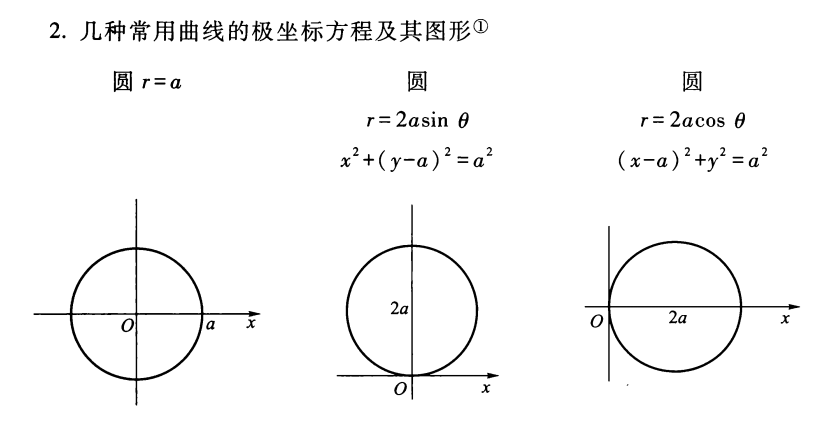

# 附录

## 常用曲线极坐标方程及其图形

## 积化和差与和差化积恒等式

| 积化和差 | 和差化积 |
| :-: | :-: |
| $\sin\alpha\cos\beta = \dfrac{\sin(\alpha + \beta) + \sin(\alpha - \beta)}{2}$ | $\sin\alpha + \sin\beta = 2\sin\dfrac{\alpha + \beta}{2}\cos\dfrac{\alpha - \beta}{2}$|
| $\cos\alpha\sin\beta = \dfrac{\sin(\alpha + \beta) - \sin(\alpha - \beta)}{2}$ | $\sin\alpha - \sin\beta = 2\cos\dfrac{\alpha + \beta}{2}\sin\dfrac{\alpha - \beta}{2}$|
| $\cos\alpha\cos\beta = \dfrac{\cos(\alpha + \beta) + \cos(\alpha - \beta)}{2}$ | $\cos\alpha + \cos\beta = 2\cos\dfrac{\alpha + \beta}{2}\cos\dfrac{\alpha - \beta}{2}$|
| $\sin\alpha\sin\beta = -\dfrac{\cos(\alpha + \beta) - \cos(\alpha - \beta)}{2}$ | $\cos\alpha - \cos\beta = -2\sin\dfrac{\alpha + \beta}{2}\sin\dfrac{\alpha - \beta}{2}$|

## 降幂公式

| 正弦 | 余弦 |
| :-: | :-: |
| $\sin^2\theta = \dfrac{1 - \cos2\theta}{2}$ | $\cos^2\theta =  \dfrac{1 + \cos2\theta}{2}$ | 
| $\sin^3\theta = \dfrac{3\sin\theta - \sin3\theta}{4}$ | $\cos^3\theta = \dfrac{3\cos\theta + \cos3\theta}{4}$ | 