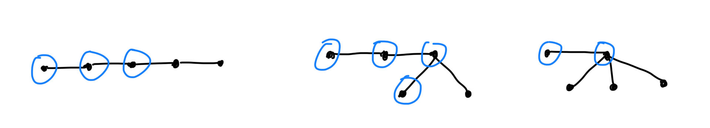
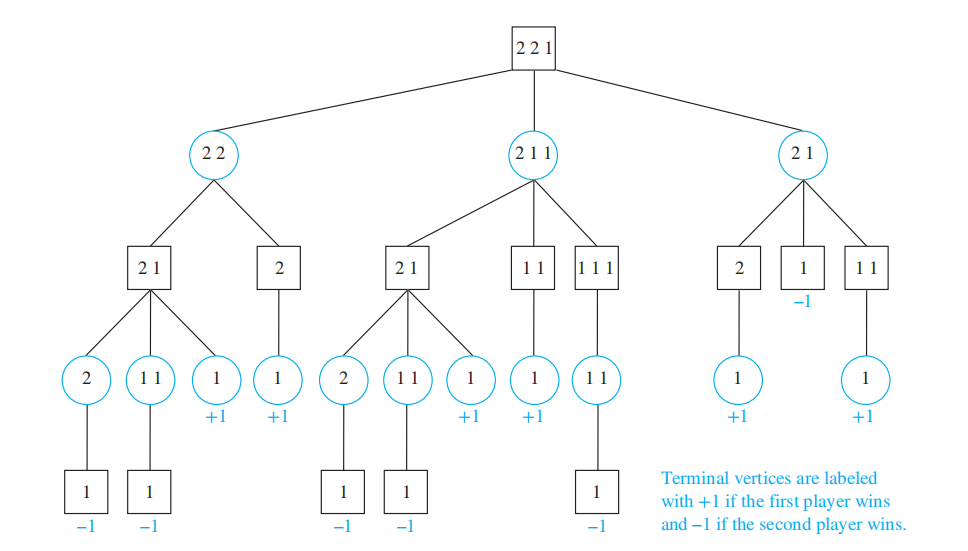
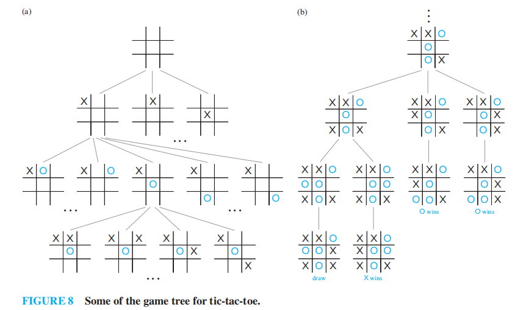
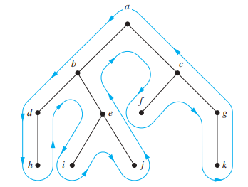
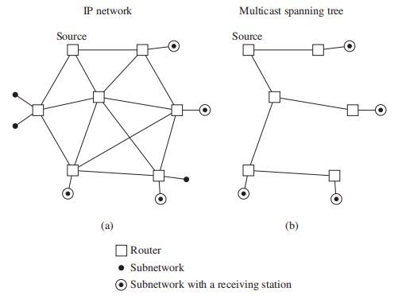
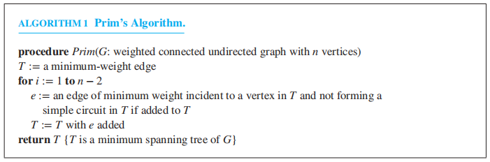

# Chap 11 Trees

??? abstract "核心知识"

	+ 基本概念
	+ 应用：二分查找树、决策树、**前缀树**
	+ 树的遍历、表达式树
	+ **生成树**
		+ DFS(回溯算法)、BFS
		+ 最小生成树：Prim算法、Kruskal算法

>注：
>
>+ [树的知识点](../fds/4.md)在fds已讲过，可以互为参照，之后考虑合并起来
>+ 在树中，我更喜欢将"vertex"翻译成“节点”，而非“顶点”，感觉前者读起来更通顺一点

## Introduction to Trees

定义：**树(trees)**是没有简单环的连通无向图
>注：因为没有简单环，因此树也就不包含重边和自环

没有简单环，但不连通的无向图称为**森林(forests)**，它的连通分量是一棵树

🌰：

**定理1**：当且仅当无向图上<u>任意两点间有唯一的一条路径</u>时，该图是一棵树

>证明难度不大（考虑充分性和必要性），故略

### Rooted Trees

定义：

+ **有根树(rooted tree)**是一棵树，它指定某一个节点作为整棵树的根，每条边被视为从根出发的“有方向”的边（实际上还是无向边）
+ **m叉树(m-ary tree)**：每个内部节点的孩子的个数不超过m的有根树
+ **满m叉树(full m-ary tree)**：每个内部节点有且有m个孩子的有根树([之前](5.md#recursively-defined-sets-and-structures)介绍过满二叉树)
+ **二叉树(binary tree)**：m = 2
+ **有序根树(ordered rooted tree)**：所有内部节点的孩子按顺序排列(从左往右)的有根树

>注：
>
>+ Chap 5中我们曾介绍过有根树的[递归定义](5.md/#recursively-defined-sets-and-structures)
>+ 选择不同的根，就会产生不同的有根树，边的“方向”也是不同的
>
>🌰：
>
>

>
>

>
>+ 有根树的其他基本概念(诸如什么是父节点、子节点……)见fds[对应部分](../fds/4.md#definitions)
>+ 二叉树的基本概念：**左孩子(left child)**、**右孩子(right child)**、**左子树(left subtree)**、**右子树(right subtree)**

!!! example ":star:例题：非同构的树"

	=== "无根树"

		

		
		

		答案：3棵

	=== "有根树"

		

		
		

		分析：在非同构的无根树的基础上判断(分类讨论)，需要考虑“方向”（根据有根树的定义，不是真正的方向）

		答案：9棵（蓝笔圈起来代表有根树的根节点）

### Trees as Models

树模型的应用：

+ **饱和烃(saturated hydrocarbons)**
>注：树模型的最早应用

+ 组织架构
+ 计算机文件系统

>注：fds介绍过[类似内容](../fds/4.md#applicationfile-system)，且更加详细

+ 树连通的并行处理器
>[前景回顾](10.md#software-design-applications)

这样的网络可以用一棵完全二叉树表示：

+ 既非叶子亦非根的节点可以双向连通：与父节点连通的1条连接，以及与孩子节点连通的2条连接
+ 根节点：与孩子节点连通的2条连接
+ 叶子节点：与父节点连通的1条连接

🌰：

### Properties of Trees

**定理2**：一棵具有n个节点的树有n - 1条边
>证明可以采用归纳法——但我认为是小题大做，因为很容易理解：除了根外，每个节点的上头都有一条不同的边，因此n个节点有n - 1条边

对于无向图G，下面3个条件中：

+ G是连通的
+ G没有简单环
+ G有n - 1条边

只要其中2个条件成立，就可以说明G是一棵树，且剩下的1条也一定成立

**定理3**：有i个内部节点的满m叉树具有n = mi + 1个节点

**定理4**：对于一棵满m叉树

+ 若有n个节点，内部节点$i = \dfrac{n - 1}{m}$，叶子$l = \dfrac{(m - 1)n + 1}{m}$
+ 若有i个内部节点，节点$n = mi + 1$，叶子$l = (m - 1)i + 1$
+ 若有l个叶子节点，节点$n = \dfrac{ml - 1}{m - 1}$，内部节点$i = \dfrac{l - 1}{m - 1}$

>注：只要记住定理4的三条中的一条即可，剩余两条可以通过这一条推出来

+ 节点的**层级(level)**：根节点到该节点间路径的长度
+ 树的**高度(height)**：节点的最大层级，即根节点到任意节点的路径中的最长者

!!! warning "注意：这里的高度 = fds所说的深度，且根的高度 = 0，千万不要搞错!!!"

如果有根m叉树的高度为h，且所有叶子的层级为h或h - 1，则这棵树是**平衡的(balanced)**

**定理5**：高度为h的m叉树至多有$m^h$个叶子

>注：证明还是用数学归纳法，具体内容略，这里放一张图，相信看了就会懂👌
>

>
>

**引理1**：

+ 如果m叉树的高度为h，叶子数为l，则$h \ge \lceil \log_m l \rceil$
+ 如果m叉树是满的，且是平衡的，则$h = \lceil \log_m l \rceil$

### Supplements(from Exercises)

+ 对于一张简单图，当且仅当它是连通的，且删除任意一条边就会使整张图不连通时，该图是一棵树
+ **完全m叉树(complete m-ary tree)**：所有叶子的层级相同的满m叉树
+ 高度为h的满m叉平衡树的叶子数多于$m^{h-1}$个
+ **标记树(labeled tree)**：每个节点被赋予一个标记的一棵树。当2棵标记树之间存在一种同构(isomorphism)，使得节点的标记得到保留，称这2棵树是同构的
+ 无根树的节点的**离心率(eccentricity)**：从该节点出发的最长简单路径的长度。如果没有任何节点的离心率小于节点v，称v为**中心(center)**

	+ 要从1棵无根树中得到1棵高度最小的有根树，我们应该选取中心作为有根树的根
	+ 一棵树要么有一个中心，要么有2个相邻的中心
+ **有根斐波那契树(rooted Fibonacci tree)**$T_n$的递归定义：

	+ $T_1, T_2$为只有单个节点的有根树
	+ 对$n = 3, 4, \dots$，将$T_{n-1}$作为左子树，$T_{n-2}$作为右子树，构建根树$T_n$
+ 具有n个节点二叉树叶子的平均深度为为$\Omega(\log n)$

## Applications of Trees

### Binary Search Trees

>具体见[fds](../fds/4.md#the-search-tree-adt----binary-search-tree)，这里就稍微提一下

算法的伪代码：

### Decision Trees

**决策树(decision trees)**：一种有根树，内部节点表示一个决策，子树表示某种决策的结果

🌰：

+ 找假币

+ 用决策树证明基于比较的排序的时间复杂度([fds](../fds/7.md#general-lower-bound-for-sorting)已讲过)

**定理1**：基于二分比较的排序算法需要至少$\lceil \log_2 n! \rceil$次比较

**引理1**：基于二分比较的排序算法的比较次数为$\Omega(n \log n)$

**定理2**：基于二分比较的排序算法的平均比较次数为$\Omega(n \log n)$

### Prefix Codes

🎯：用位串对一些字符进行编码，实现**数据压缩(data compression)**

**前缀码(prefix code)**：一种用位串编码字符的方式，保证一个位串只与其中一个字符序列相关联，而不会产生歧义。

我们可以用二叉树表示前缀码：

+ 用带标记的叶子表示字符
+ 树的边用0或1标记，0表示前往左孩子，1表示前往右孩子

利用树的性质：根节点到任意节点的路径是唯一的，我们可以为每个字符确定一个唯一对应的位串

🌰：

如果知道了前缀码的二叉树，那么我们可以<u>将一个位串“解码“为原来的字符序列</u>

🌰：根据上图的二叉树(除了1111，其他位串均以0为结尾)，11111011100 $\rightarrow$ sane

**哈夫曼编码(Huffman coding)**：将字符串中字符出现的频率作为输入，输出一种前缀码，满足频率最高的字符采用尽可能短的位串的一种算法

流程：

+ 初始状态下，我们有一片森林，其中每棵树只有一个表示不同字符的节点
+ 每一步中，我们挑选权重(频率)最小的两棵树，组成新的树：

	+ 引入一个新的根
	+ 将权重较大的树作为左子树
	+ 将权重较小的树作为右子树
	+ 新的树的权重为2棵树的权重和
	
	然后将新的树放回原来的森林中

+ 直到只剩下一棵树时为止

!!! note "注"

	+ 哈夫曼树的权重 = $\sum$ [每个节点出现的权重(一般为频率) $\times$ 表示该节点的位串长度]
	+ 平均位串长度 = 哈夫曼树的权重 / 节点数

算法伪代码：

🌰：

>注：
>
>+ 哈夫曼编码是一种*贪心算法*
>+ 该算法具有许多变种，可参看[wiki](https://en.wikipedia.org/wiki/Huffman_coding)

### ~~Game Trees~~

>注：这一小节在课上没有展开讲述

**博弈树(game tree)**：用来描述一类游戏(双方轮流行动，每个玩家可以了解对方的行动，且没有偶然因素出现)的一种树

+ 节点表示游戏进行到的某个位置
+ 边表示两个位置之间的合法行动
+ 通过同一个节点表示所有对称的位置的方法实现对博弈树的化简
+ 根表示游戏的开始位置
+ *偶*层级的节点用*方框*表示，此时是*第一位玩家*的回合
+ *奇*层级的节点用*圆圈*表示，此时是*第二位玩家*的回合
+ 这棵树可以是无穷大的，表示游戏进入了无限循环，但大多数游戏都采用一定的规则防止这种情况的发生
+ 叶子表示游戏的最终位置，我们为每个叶子赋予某个值，表示游戏的最终结果

	+ '1'表示第一位玩家获胜
	+ ‘-1’表示第二位玩家获胜
	+ ‘0’表示平局

???+ example

	=== "取物游戏(nim)"
	
		有几堆石子，两位玩家轮流行动，每次可以从1堆石子中拿走一个或多个石子，但不能拿走所有剩下的石子，最后拿完石子的玩家输掉游戏。它的博弈树如下：

		

		
		

	=== "井字棋(tic-tac-toe)"

		它的博弈树相当大，限于篇幅，这里就展示博弈树的一部分

		

		
		
 

**策略(strategy)**：采取一些规则，使玩家通过选定的行动赢得游戏

(递归)定义：决策树的节点的值

+ 叶子的值是第一位玩家的比赛结果(上面已介绍过)
+ *偶*层级的中间节点的值为它所有孩子节点的*最大值*
+ *奇*层级的中间节点的值为它所有孩子节点的*最小值*

**极小极大策略(minmax strategy)**：第一位玩家向值最大的孩子移动，第二位玩家向值最小的孩子移动的策略。我们可以通过计算根对应的值来判断哪位玩家赢得游戏，这个值称为树的值

**定理3**：如果玩家双方从某个节点开始，均采用极小极大策略，那么该节点的值为比赛的最终结果
>证明见教材$P_{803-804}$

注：极小极大策略对玩家双方来说都是最优的策略

🌰：

一些知名的游戏的博弈树的规模很大，因此我们需要采用更优的策略：

+ **$\alpha-\beta$剪枝(alpha-beta pruning)**
+ **评估函数(evaluation function)**

### Supplements(from Exercises)

+ **锦标赛排序(tournament sort)**：采取[[Chap 10 Graph#^a518cd|单淘汰赛]]的机制，先选出最大的节点，然后将该点设为无穷小，再选取第二大的节点，以此类推，直至所有节点都被选出，这样我们便实现了升序排序
	+ 时间复杂度：$\Theta(n \log n)$

	
+ 对N个字符的m元哈夫曼编码类似前面提到的二元哈夫曼编码

	+ 起始步骤：从由单个节点构成树中，挑选$((N - 1) \ \mathbf{mod}\ (m - 1)) + 1$棵权值最小的树，形成一棵有根树
	+ 后续步骤：挑选m棵权重最小的树，形成m叉树
+ 在取物游戏中

	+ 规定每人拿相同的石子(数量 $\ge$ 2)，如果双方均采取最优策略，则第二位玩家获胜
	+ 若开始于两堆不同数量的石子中，若双方均采取最优策略，则第一位玩家获胜

## Tree Traversal

### Universal Address Systems

**通用地址系统(universal address system)**——一种有序根树的排序，其规则如下(递归方法)：

+ 根节点标记为0，它的孩子从左往右依次被标记为1, 2, 3, ..., k
+ 对于每个在层级n的节点v，它的标记为A，且有$k_v$个孩子，则这些孩子从左往右依次被标记为A.1, A.2, ..., A.$k_v$

我们可以在通用地址系统中定义*词典序*：规定当满足<u>下列条件之一</u>时，$x_1.x_2. \dots .x_n < y_1.y_2. \dots .y_n$成立

+ $x_1 = y_1, x_2 = y_2, \dots, x_{i-1} = y_{i-1}, x_i < y_i$，其中$0 \le i \le n$
+ $n < m, \forall i = 1, 2, \dots, n, x_i = y_i$

🌰：

### Traversal Algorithms

+ **前序遍历(preorder traversal)**：先遍历根节点r，然后对它的子树$T_1, T_2, \dots, T_n$分别进行前序遍历

+ **中序遍历(inorder traversal)**：先对子树$T_1$进行中序遍历，然后遍历根节点r，最后依次对子树$T_2, T_3, \dots, T_n$进行中序遍历

+ **后序遍历(postorder traversal)**：先对所有子树$T_1, T_2, \dots, T_n$进行后序遍历，后遍历根节点r

>注：可以看出，我们采用了*递归定义*

??? example "例题"

	对下图分别进行三种遍历
	

	
	

	=== "前序遍历"

		

		
		

	=== "中序遍历"

		

		
		

	=== "后序遍历"

		

		
		

!!! tip "速记法：“树形描边大师”"

	如图所示：

	

	
	

	+ 前序遍历：从根节点开始，按照蓝色路线走，遇到节点就输出
	+ 中序遍历：从根节点开始，按照蓝色路线走，当遇到叶子节点时就输出，当第2次遇到内部节点时再输出
	+ 后序遍历：从根节点开始，按照蓝色路线走，当最后一次(即沿蓝色路线向上走时)遇到节点时就输出

	问：对于该图，它的前序、中序和后序遍历的结果分别是什么？

	??? success "答案"

		+ 前序遍历：a, b, d, h, e, i, j, c, f, g, k
		+ 中序遍历：h, d, b, i, e, j, a, f, c, k, g
		+ 后序遍历：h, d, i, j, e, b, f, k, g, c, a

!!! note "算法的伪代码"

	=== "前序遍历"

		

		
		
	

	=== "中序遍历"

		

		
		

	=== "后序遍历"

		

		
		

>注：<u>前序</u>和<u>后序</u>遍历可以唯一确定一棵有序根树，因此它们可以对有序满m叉树的结构进行编码

应用：

+ 前序遍历：拷贝二叉搜索树
+ 中序遍历：从二叉搜索树中得到节点值的升序排序
+ 后序遍历：删除一棵树；得到拓扑排序

### Infix, Prefix, and Postfix Notation

+ **中缀式(infix form)**：通过对表达式树的中序遍历得到的表达式，实际上就是原表达式
+ **前缀式(prefix form)**：通过对表达式树的前序遍历得到的表达式，又称为**波兰表示法(Polish notation)**
+ **后缀式(postfix form)**：通过对表达式树的前序遍历得到的表达式，又称为**逆波兰表示法(reverse Polish notation)**

>注：中缀式表达式可能会产生歧义，需要添加括号；而前缀式和后缀式表达式没有歧义，无需添加括号

🌰：计算前缀式和后缀式

>注：'$\uparrow$'表示幂运算

+ 前缀式：从右往左计算
+ 后缀式：从左往右计算

---
根树除了用来表示算术表达式，还可以表示<u>复合命题</u>，原理类似，除了需要特别考虑单目运算符'$\neg$'：它仅有一个操作数，因此在表达式树上它仅有一个孩子

🌰：

### Supplements(from Exercises)

+ 前缀式的[合式公式](5.md#recursively-defined-sets-and-structures)的递归定义：

	+ 如果x是个符号，则x是前缀式的合式公式
	+ 如果X和Y是合式公式，*是一个操作符，则\*XY是一个合式公式

+ 前缀式的合式公式中，符号的数量总是比操作符的数量多一个

## Spanning Trees

简单图G的**生成树(spanning tree)**：G中包含所有顶点的子图

**定理1**：当且仅当简单图*连通*时，该图具有生成树

??? example "IP组播(multicasting)"

	+ 单播(unicasting)：源计算机向所有接收计算机单独发送数据——效率低
	+ 组播(multicasting)：源计算机仅发送一个数据副本，数据通过路由器一步步传播，直到发送至接收计算机。从下图可以看出，组播的数据传播图是一棵生成树

	

	
	

>虽然我们可以通过对原图进行删边操作得到一棵生成树，但这样做效率太低了。相反，我们会采取添边的方式构建一棵生成树，下面介绍的DFS和BFS均采用这种方式

### Depth-First Search

**深度优先搜索(depth-first search, DFS)**的思路：

+ 先在图中任意选取一个顶点作为根节点
+ 从根节点出发，连续添加顶点和边，其中新增的边一定与最后添加的顶点相关联，且新添的顶点尚不在路径中，尽可能地往下这样做
+ 当访问完所有顶点时，我们可以得到一棵生成树
+ 否则(遇到“死胡同”)，返回到路径中倒数第二个顶点，若有可能，从该顶点出发，按照上面的步骤重新寻找新的路径(要找未被访问过的顶点)。如果找完所有可能，再返回上一个顶点，再寻找新的路径，直至所有顶点均被访问过

当我们将顶点v添加至树内，且后来又回溯到该顶点，这个过程称为从顶点v*探索(explore)*

>注：DFS体现的思想：
>
>+ 递归
>+ **回溯(backtracking)**

🌰 

在原图中标注生成树：

+ **树边(tree edges)**：图中作为生成树的边(即图中蓝色粗线)
+ **回边(back edges)**：连接顶点和它在生成树中的祖宗或后代节点的边(即图中黑色细线)

算法的伪代码：

时间复杂度：$O(e)$或$O(n^2)$，其中e和n分别是边和顶点的数量

>证明：很容易想到图中的每条边至多被访问2次

应用：

+ 寻找连通分量(若图不连通)
+ 找割点(若图连通)

### Breadth-First Search

**宽度优先搜索(breadth-first search, BFS)**的思路：

+ 先在图中任意选取一个顶点作为根节点
+ 将所有与根节点相邻的顶点添加至树内，对它们任意排序，这些顶点因而成为生成树中层级为1的节点，
+ 对于层级为1的所有节点，按顺序依次访问所有与这些顶点关联的边上的另一个顶点，且保证不会产生简单环，对得到的顶点进行任意排序
+ 这样，我们得到层级为1的节点的所有孩子，它们构成层级为2的节点
+ 如此往复，直至所有顶点被添加至树内

我们使用"*加工(process)*"一词描述添加新顶点和关联边的过程

🌰

算法的伪代码：

时间复杂度：$O(e)$或$O(n^2)$

>理由同上

应用：

+ 判断一张图是不是二分的
+ 找到图中2个顶点间边数最少的路径

!!! note "DFS vs BFS"

	要得到生成树,

	+ 在稠密图中采用DFS
	+ 在稀疏图中采用BFS

### Backtracking Applications

???+ example "回溯的应用"

	=== "图上色(graph colorings)"

		看看就行，这种方法效率不高

		

		
		

	=== "n皇后问题(the n-queens problem)"

		在$n \times n$的棋盘上摆放n个皇后，使得任意两个皇后不会相互攻击，即任意两个皇后不在同一行、同一列以及同一条对角线上(2条对角线)

		下面给出$4 \times 4$棋盘上摆放皇后的情况

		

		
		

	=== "子集求和(sums of subsets)"

		对于一个正整数集$\{x_1, x_2, \dots, x_n\}$，要求找到一个子集，满足子集中元素之和 = 常数M

		🌰

		

		
		

### Depth-First Search in Directed Graphs

我们可以用DFS和BFS找到有向图的生成树，但是有时我们可能得到的是几棵生成树——*生成森林(spanning forest)*。这时，当我们使用这两种算法时，发现整个算法流程结束后还有一些顶点不在生成树内，那么我们需要在这些顶点中挑一个作为另一棵生成树的根节点，在剩余顶点中得到生成树。

🌰

DFS在有向图中的应用：

+ 判断是否有环
+ 得到拓扑排序
+ 找到强连通分量

实际应用：[网络爬虫(web crawler)](https://en.wikipedia.org/wiki/Web_crawler)

### Supplements(from Exercises)

+ 在连通简单图中，顶点v和u之间的最短路径的长度 = 以v为根的BFS生成树中u的层级数
+ 令G为连通图，T为G的BFS生成树，那么G中不在T的一条边必须连接在相同层级或层级相差1的两个顶点
+ 令G为连通图，T为G的DFS生成树，那么G中不在T的一条边必须是回边
+ 令G为有向图，T为G的BFS生成树，那么G中的每条边的2个端点要么在相同层级，要么相差1个层级
+ 令G为有向图，T为G的DFS生成树，那么不在生成树的边是下列3种边种的一种：
	
	+ **前边(forward edge)**：祖先 $\rightarrow$ 后代
	+ **回边(back edge)**：后代 $\rightarrow$ 祖先
	+ **叉边(cross edge)**：顶点 $\rightarrow$ 在前一棵被访问的子树中的顶点

+ 令$T_1, T_2$为一张图中的生成树，它们的**距离(distance)**为它们非公共边的条数

	+ 假设$T_1, T_2, T_3$是G的生成树，则$\mathrm{dis}(T_1, T_3) \le \mathrm{dis}(T_1, T_2) + \mathrm{dis}(T_2, T_3)$
	+ 假设$T_1, T_2$为简单图G的生成树，$e_1$为在$T_1$但不在$T_2$的一条边，那么在$T_2$存在一条边$e_2$，它不在$T_1$，满足：
		
		+ 若移除$e_1$，添上$e_2$，$T_1$仍为一棵生成树
		+ 若移除$e_2$，添上$e_1$，$T_2$仍为一棵生成树
	
+ 有向图的**有根生成树(rooted spanning tree)**：包含该图的边的有根树，满足图中任意顶点是树里某一条边的端点

	+ 对于一棵连通有向图，若它的每个顶点的入度 = 出度，则它有一棵有根树
	+ 令G为有向图，T为G的DFS生成树，那么，当且仅当G包含一条与T有关的回边时，该图有一个环

## Minimum Spanning Trees

### Algorithms for Minimum Spanning Trees

**最小生成树(minimum spanning tree)**：连通带权图中的一棵生成树，满足所有边的权重和是最小的

!!! note "寻找最小生成树的算法"

	>注：
	>
	>+ 这些算法均为*贪心算法*
	>+ m, n分别表示边数和顶点数
	>+ 同一张图的最小生成树可能不止一种

	=== "**Prim's algorithm**"

		思想：在图中剩余的边里，将与树中节点有关联的权重最小的边加到树中

		

		
		

		时间复杂度：$O(m \log n)$

	=== "**Kruskal's algorithm**"

		思想：挑选当前图中剩余的边里权重最小的边，且不会产生环		

		

		
		

		时间复杂度：$O(m \log m)$

	在稀疏图中，Kruskal算法效率更高；在稠密图中，两种算法效率差不多

???+ example 

	对于下面给出的带权图，找出它的最小生成树

	

	
	

	=== "Prim's algorithm"

		

		
		

	=== "Kruskal's algorithm"

		

		
		

### Supplements(from Exercises)

+ 带权图的**最小生成森林(minimum spanning forest)**：最小权重的生成森林
+ 连通带权图的**最大生成树(maximum spanning tree)**
+ 连通带权图中权重最小的边一定出现在所有的最小生成树内
+ 如果连通带权图的所有边的权重都不相同，则它的最小生成树是唯一的
+ [Sollin's algorithm](https://en.wikipedia.org/wiki/Bor%C5%AFvka%27s_algorithm)

## Supplements

??? info "补充知识(可忽略，考试应该不会考这些)"

	+ 至少有1条边的树，一定存在至少2个度为1的节点
	+ 一棵有n个节点，n - 1个度为1的节点的数一定与$K_{1, n - 1}$同构
	+ 假设n个正整数$d_1, d_2, \dots, d_n$，它们的和为2n-2，则存在一棵有n个节点的树，这些节点的度为$d_1, d_2, \dots, d_n$
	+ 任何树都是平面图
	+ 任何树都是二分图
	+ 任何树可用2种颜色上色
	+ **度为k的B树(B-tree of degree k)**：一棵有根树，满足：
		
		+ 所有叶子在同一层级
		+ 它的根节点至少有2个孩子，至多有k个孩子(除非它是叶子)
		+ 除了根节点的内部节点至少有$\lceil \dfrac{k}{2} \rceil$个孩子，至多有k个孩子

		在计算机文件中使用B树可以提升访问效率

	+ **二项式树(binomial tree)**$B_i$(i = 0, 1, 2, ...)是一棵有序根树，它的递归定义如下：

		+ 基本步骤：$B_0$为单节点树
		+ 递归步骤：令k为非负整数，要构建$B_{k+1}$：得到2棵$B_k$，第1棵$B_k$的根节点作为第2棵$B_k$根节点最左边的孩子，得到的新树即为$B_{k+1}$

		+ $B_k$中度最大的节点为根节点

	+ **$S_k$树**：一种有根树，满足下面的递归定义：

		+ $S_0$树：只有一个节点
		+ $S_k$树：由2棵$S_{k-1}$树构成，其中一棵$S_{k-1}$树的根作为$S_k$树的根，另一棵$S_{k-1}$树的根作为第一棵$S_{k-1}$树的孩子

		+ $S_k$树有$2^k$个节点，且在层级$k$上仅有一个节点，这个节点称为**把手(handle)**
		
	+ 有根树的**层序(level order)**：从根节点开始，然后从左往右遍历第1层的节点，接着从左往右遍历第2层节点，以此类推。
	+ 图的**割集(cut set)**为一组边的集合，当移除这些边后，将会产生一个比原图具有更多连通分量的子图，但是这个集合的真子集不具备这个性质
		
		+ 割集中至少有一条边作为该图所有生成树的共有边

	+ [**仙人掌图(cactus)**](https://en.wikipedia.org/wiki/Cactus_graph)：一张连通图，满足图上没有边出现在多个(> 1)简单环上，这些简单环经过除起点外的顶点的次数不超过1次，且不在终点外的任何地方经过起点(若2个环包含相同的边，则这些边被认为是不同的)

	+ 简单图G的**度限制生成树(degree-constrained spanning tree)**是一棵生成树，满足：树中节点的度不超过指定范围。这种树常用于交通系统的建模中

		+ 对于一棵度限制生成树，若树中每个顶点的度不超过2，则它构成了简单哈密顿路

	+ 对于一棵n节点的树，节点用整数1, 2, ..., n标记，若任意两个相邻节点的标记之差的绝对值互不相同，则认为这棵树是**优雅的(graceful)**

	+ **毛虫(caterpillar)树**是一棵树，它有一条简单路，使得所有不在该路径上的节点与在这条路径上的节点相邻

	+ 假设e是带权图与顶点v关联的一条边，它的权重不超过与v关联的其他所有边，那么存在一棵包含此边的生成树
	+ 若带权图中所有边的权重都不同，则与顶点v关联的权重最小的边一定出现在任何最小生成树内
	+ 令G = (V, E)为有向图，r为G的顶点，以r为根的G的**树状(arborescence)图**是G的一个子图T = (V, F)，使得T的潜在无向图是G的潜在无向图的一棵生成树，且$\forall v \in V$，在T中存在一条从r到v的路径(考虑方向)

		+ G有树状图T的充要条件是：T包含r，没有简单环，且$\forall v \in V - {r}, \mathrm{deg}^-(v) = 1 \text{ in T}$
		+ 另一个充要条件：$\forall v \in V$，存在从r到v的有向路径