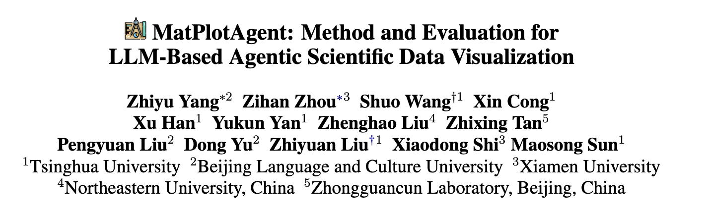
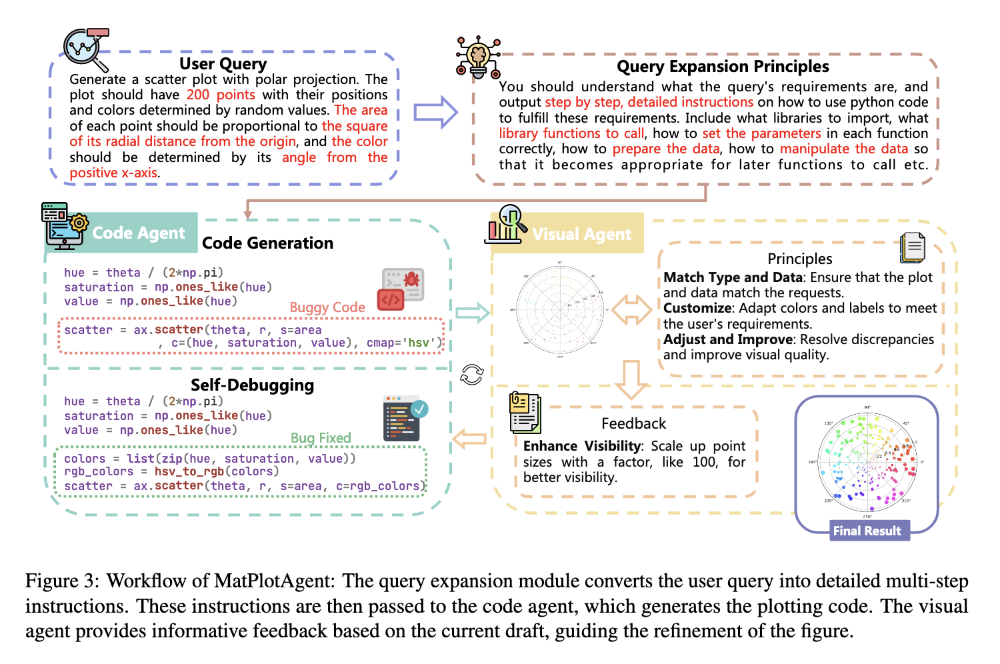
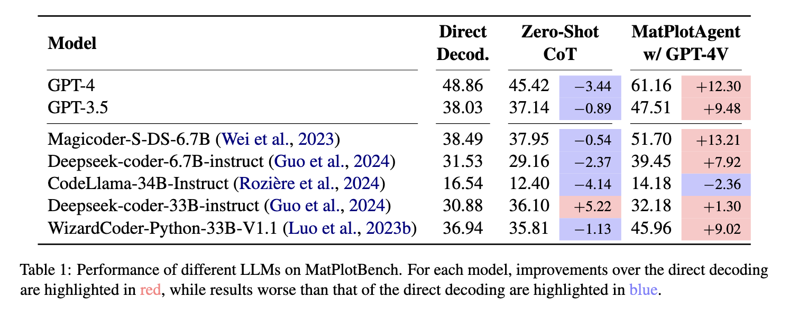
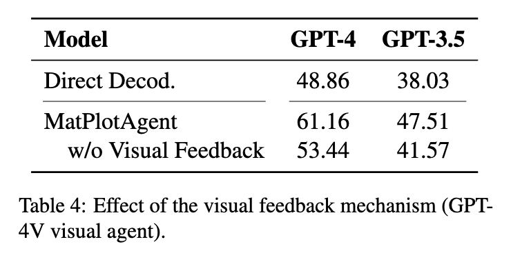
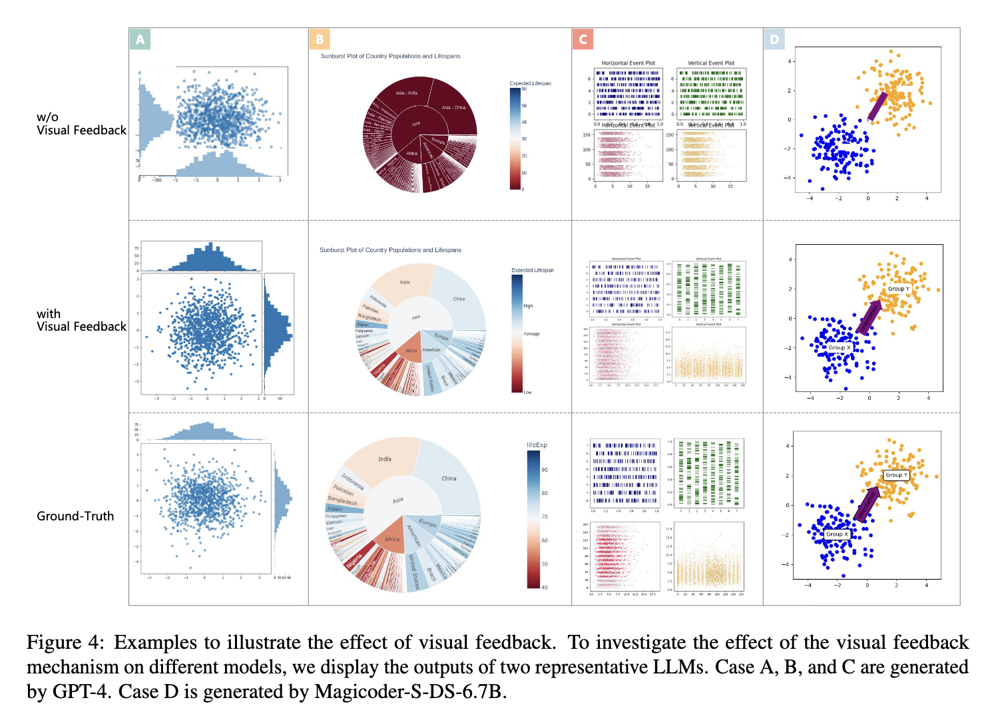
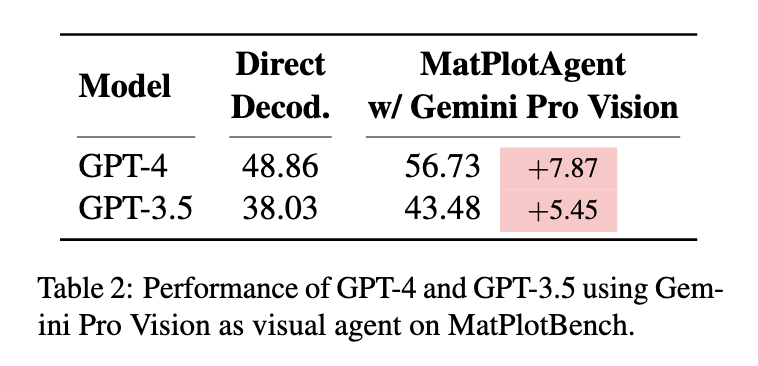
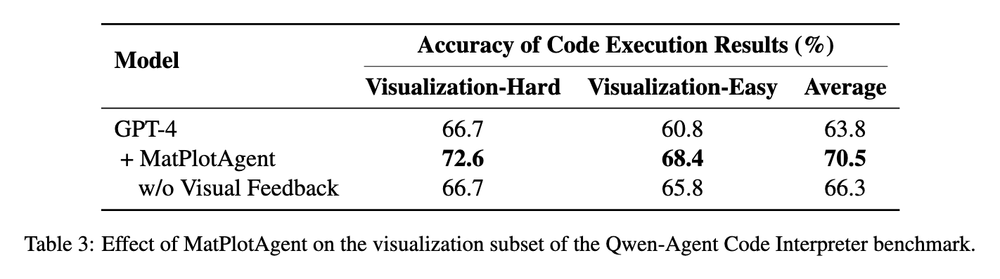
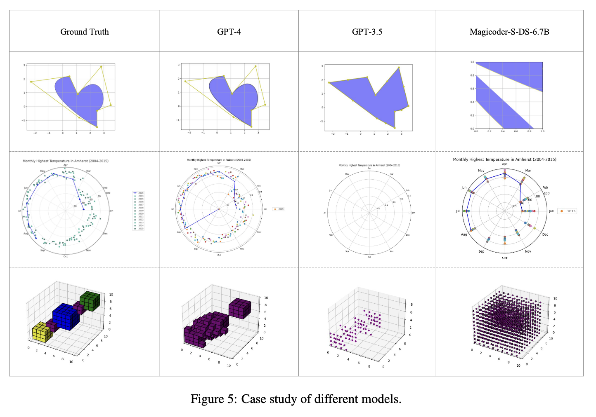

# MatPlotAgent

!!! abstract "概述"

    

        
    

    MatPlotAgent：一个面向科学数据可视化的智能体框架

    - [论文](https://arxiv.org/abs/2402.11453)
    - [GitHub 仓库](https://github.com/thunlp/MatPlotAgent#-matplotbench)

??? info "引言/背景（由 Gemini 2.5 Pro 总结）"

    科学数据可视化是研究交流的基石，它能够将复杂的信息转化为直观的图形，帮助研究人员识别隐含的模式。然而，这一过程传统上依赖于研究者手动编写代码，不仅耗时耗力，而且对技术能力有较高要求，构成了巨大的认知负荷。大型语言模型（LLM）的出现为自动化这一任务带来了曙光。尽管如此，将LLM应用于科学数据可视化领域仍处于探索初期，面临着独特的挑战。这项任务不仅需要精确的代码生成能力，还需要对数据和视觉元素的深刻理解，这使其与通用的代码生成或艺术性的图像合成任务有着本质区别。

    一篇名为《MatPlotAgent: Method and Evaluation for LLM-Based Agentic Scientific Data Visualization》的研究论文旨在系统性地解决这一领域的空白。该研究通过双管齐下的方式推进了该领域的发展：首先，构建了一个名为 MatPlotBench 的高质量基准测试集，为科学数据可视化任务的标准化评估奠定了基础；其次，提出了一个名为 MatPlotAgent 的创新性智能体框架，旨在通过模拟人类专家的工作流程来显著增强LLM在该特定领域的能力 1。本报告将对该论文的核心贡献、方法论、实验结果及其深远影响进行详尽的分析。

## MatPlotBench

### Data Collection

MatPlotBench 的构建过程遵循了三项核心原则，以确保其高质量和全面性：

- 覆盖**多样化的图表类型**，涵盖常用图表和稀有但实用的图表
- 包含**具有代表性的实例**，反映不同数据复杂度的真实场景
- 平衡**简单与困难的问题**，以全面评估模型的能力

其具体构建流程是一个多阶段、人工深度参与的流程：

- 来源选择：从权威的在线数据可视化社区精心挑选原始案例。其中，
    - 75 个案例来自 [Matplotlib Gallery](https://matplotlib.org/3.1.1/gallery/index.html)，覆盖了条形图、折线图、3D图、子图等多种**基础类型**；
    - 另外 25 个案例来自 [OriginLab GraphGallery](https://www.originlab.com/www/products/graphgallery.aspx)，侧重于桑基图、旭日图、弦图等在**美学**上更具吸引力或**结构上更复杂**的图表。

- 初步查询生成：利用 LLM 生成初步的**自然语言查询**。对于 Matplotlib 案例，使用 GPT-4 将原始代码转换为查询；对于仅有图像的 OriginLab 案例，则使用多模态模型 GPT-4V 将图像转换为查询。
- 数据替换与清洗：
    - 为防止强大的模型（如GPT-4）通过记忆来“作弊”，研究人员系统性地替换了 Matplotlib 案例中的原始数据点，同时保持图表类型等核心要求不变。
    - OriginLab 案例因其数据本身足够复杂，未观察到记忆现象，故保留原始数据。
- 人工优化与验证：
    - 由具备至少三年编程和自然语言处理经验的专家对初步查询进行优化，修正错误、消除歧义并补充缺失信息。
    - 随后，由三位独立的NLP研究人员进行最终验证，确保用户查询、原始数据和标准答案图表之间高度对齐。
    - 这一严谨的流程最终产出了 100 个高质量的测试**三元组（查询、数据、标准答案图表）**。

### Automatic Quantitative Evaluation

为了降低评估成本，论文提出了一种基于前沿（~~当然现在算不上什么前沿了，这个领域的进步太快了~~）**多模态模型 GPT-4V 的自动化评估机制**。该机制通过精心设计的提示词，引导 GPT-4V 将模型生成的图表与标准答案图表进行比较，并基于图表的正确性（相似度作为衡量指标）给出一个 0 到 100 分（基准事实默认为 100 分）的分数，越相似分数越高。

该自动化评估方法的可靠性得到了严格的统计验证。研究人员计算了自动评分与人类专家评分之间的皮尔逊相关系数。结果显示，无论是对于 GPT-4 生成的图表还是 GPT-3.5 生成的图表，<u>自动评分与人类评分都表现出极强的正相关性</u>。这证明了使用 GPT-4V 作为人类判断的可靠代理是可行的，极大地降低了后续研究的门槛，使研究者不必再依赖昂贵且耗时的人工评估。

### My Testing

TBD

## MatPlotAgent

MatPlotAgent 是一个**模型无关**(model-agnostic)[^1]的 LLM 智能体框架，由三个核心模块组成：

- 查询理解模块
- 带有迭代调试的代码生成模块
- 用于纠错的视觉反馈机制

这种模块化的设计将“从文本生成图表”这个宏大而模糊的任务，分解为三个界限清晰且易于管理的子问题：规划(planning)、执行(execution)和修正(refinement)，从而精确地模拟了人类专家在面对复杂问题时所采用的结构化解决策略。

    

### Query Expansion

查询接收模块接收用户提出的**高层次、有时甚至有些模糊的查询**，然后利用代码 LLM 将其扩展为**一系列明确详尽、按部就班的指令**，供后续的代码智能体使用。这些指令非常具体，包括<u>需要导入哪些库、调用哪些函数、如何设置函数参数以及如何进行数据预处理等步骤</u>。

该模块的作用是**极大地降低代码生成模块的认知负荷**。通过预先制定一份**详细的行动计划，它将一个复杂问题分解为多个简单的子任务**，从而显著提高了后续代码生成环节的准确性和完整性。它成功地将一个抽象的目标转换成了一个具体的、可执行的算法。

### Code Agent

“代码智能体”是 MatPlotAgent 的核心执行单元，负责根据规划模块提供的详细指令编写 Python 代码。为了提高代码的鲁棒性，该模块集成了一个“**自调试**(self-debugging)”机制。当初始生成的代码在执行时遇到错误，智能体会分析 Python 解释器返回的错误信息，并迭代地尝试修复代码中的 bug。为了防止无限循环，最大调试次数有上限。自调试循环是现代代码智能体的一个标准配置，在这里的作用主要是处理语法和运行时层面的错误，确保智能体至少能够成功生成一张图表。

### Visual Agent

这是该论文在架构上最主要的创新。被称为“视觉智能体”的模块由一个**多模态 LLM**（如 GPT-4V 或 Gemini Pro Vision）驱动。它负责检查代码智能体成功生成的图表（即视觉输出），并将其与用户的原始查询进行比对，以识别在**视觉元素、数据表达、美学风格**等方面存在的偏差。

一旦发现不一致之处，视觉智能体便会**生成自然语言形式的“视觉反馈”**，例如“为了更好的可见性，请将点的大小放大100倍”或“图中的文字重叠了，需要调整布局”。这些反馈随后被传递回代码智能体，触发新一轮的代码优化。这个过程形成了一个闭环，直到图表满足用户要求或达到最大迭代次数。

这个视觉反馈循环是 MatPlotAgent 与传统代码生成系统的根本区别。它解决的是一类完全不同的错误：不是那些导致代码无法运行的错误，而是那些代码运行正常但产生了错误视觉结果的错误。这种设计将评估范式从语法正确性（代码能否执行？）提升到了**语义和视觉正确性**（图表是否准确、清晰地传达了所要求的信息？）。

## Experiments

### Main Results

实验结果明确显示，MatPlotAgent 的性能远超传统的提示方法。

    

如表 1 所示，在一系列涵盖 7 个不同代码LLM的测试中，MatPlotAgent 框架的表现一致且显著地优于**直接解码**(direct decoding)[^2]和**零样本思维链**(zero-shot CoT)[^3]这两种基线方法。

- 对于当时最先进的 GPT-4 模型，MatPlotAgent 使其得分从 48.86 跃升至 61.16，实现了 12.30 分的巨大提升。
- 对于开源模型 Magicoder-S-DS-6.7B，性能增益更为惊人，从 38.49 提升至 51.70（+13.21分），其最终得分甚至超过了 GPT-4 在直接解码设置下的表现。

一个特别值得注意的发现是，零样本思维链方法对于大多数模型不仅没有帮助，反而导致了性能下降。这有力地表明，对于科学数据可视化这类需要精确执行和视觉对齐的复杂任务，非结构化的、单一的“思考”过程是不足够的，甚至可能引入干扰。相比之下，MatPlotAgent 提供的结构化、多步骤的智能体框架被证明是更有效的解决方案。

此外，规模较小的 Magicoder 模型在搭载了 MatPlotAgent 后能够超越规模远大于它的 GPT-4（在直接解码下），这强烈说明一个优越的框架对性能的贡献可能比单纯增大基础模型更为重要。

### Ablation Study

为了验证视觉反馈机制的核心价值，研究进行了一项消融研究(ablation study)[^4]，即在 MatPlotAgent 框架中**禁用视觉智能体模块**，并观察其性能变化。

    

这些数据定量地证明了视觉反馈循环并非一个锦上添花的功能，而是整个框架成功的核心驱动力。它证实了研究的核心假设：在该领域中，一大部分错误是视觉上或语义上的，而非代码语法上的，这类错误只有通过一个能够“看见”并理解视觉输出的模块才能被发现和纠正。论文中提供的定性案例（图 4）也直观地展示了这一点，例如，没有视觉反馈的智能体生成的图表文字混乱，而启用反馈后这一问题得到了修复。

    

### Generalizability Studies

为了证明 MatPlotAgent 框架的普适性，研究还进行了两组额外的实验。

首先，为了测试视觉智能体对具体多模态模型的依赖性，实验将视觉智能体从 GPT-4V 替换为 Google 的 Gemini Pro Vision。

    

如表 2 所示，即使更换了视觉智能体的“大脑”，MatPlotAgent 依然能为 GPT-4 和 GPT-3.5 带来显著的性能提升（分别为 +7.87 和 +5.45 分）。这证明了框架的成功并非依赖于某一个特定的专有模型，其架构原则是稳健的。

---
其次，为了验证框架在不同基准测试上的表现，研究人员在一个公开的第三方基准——Qwen-Agent Code Interpreter benchmark 的视觉化子集上进行了测试。

    

如表3所示，MatPlotAgent 同样提升了 GPT-4 在该基准上的性能，尤其是在高难度子集上，得分从 66.7 提升至 72.6。这一结果表明， MatPlotAgent 的优势可以泛化到非自建的、独立的测试环境中，有力地反驳了其设计可能对其自建基准存在“过拟合”的潜在质疑。

### Case Studies

下图所示的案例研究揭示了当前技术在实际应用中的性能上限和关键的失败模式。

    

研究展示了三个难度递增的案例，清晰地描绘了当前LLM能力的范围。

1. 简单案例：一个相对简单的图表任务，GPT-4 在 MatPlotAgent 的辅助下能够正确地生成。这表明对于基础的可视化需求，最先进的 LLM 结合智能体框架已经具备了可靠的自动化能力。
2. 挑战性案例：一个更复杂的图表，GPT-4 和 Magicoder 虽然都能生成一个“草稿”，但两者都“遗漏了一些元素”。这揭示出，随着任务组合复杂性的增加，即使有智能体框架的辅助，模型也开始难以捕捉所有细节或完全遵循用户的指令。元素的遗漏是一种典型的失败模式，暗示了 LLM 在工作记忆或注意力机制上可能存在局限。
3. 最困难案例：一个高度复杂的图表被证明是当前技术无法逾越的障碍，“三个模型中没有一个能产生正确的结果”。这是一个极其重要的发现，它表明某些可视化任务的复杂性仍然超出了当前最先进的 LLM（如GPT-4）与 MatPlotAgent 组合的能力范围。

这种失败很可能不仅仅是“编码难度”的问题，而更深层次地反映了**智能体在将抽象的语义概念（来自用户查询和视觉反馈）映射到具体的句法实现（代码）时遇到了障碍。从语义反馈到句法修正的这个翻译过程是一个主要的瓶颈。智能体可能知道哪里错了，但不知道如何用代码去修复它**。

## Conclusion and Limitations

总而言之，该研究通过其双重贡献，为自动化科学数据可视化领域迈出了坚实的一步。

- MatPlotBench 为整个研究社区提供了一个急需的、稳健的标准化评估工具。
- 而MatPlotAgent 则提供了一个有效且可泛化的智能体框架，实验证明它能显著提升各种 LLM 的可视化能力。其中，作为核心创新的视觉反馈循环，是该论文最具影响力的概念性贡献，它为解决具有非文本输出的复杂任务提供了一个新的、有效的范式。

同时，该研究也坦诚地指出了其局限性。

- MatPlotBench 虽然旨在覆盖通用的科学可视化需求，但**不同学科（如生物信息学、天体物理学）可能有其高度专业化的可视化规范，这是当前基准未能完全涵盖的**。未来的工作可以在此基础上构建特定领域的基准和评估方法。
- 此外，案例研究揭示的失败模式表明，要攻克最复杂的可视化挑战，将需要 LLM 在组合逻辑、层级规划以及从语义目标到句法代码的无缝转换等核心推理能力上取得根本性的突破。

!!! bug "个人认为论文存在的其他问题"

    - 这篇论文提出的基准测试标准太过死板——与 ground truth 越接近分数越高的 metric 可能会打压模型的“创造力”。个人认为即便是对相同的用户查询和数据集，得到的可视化结果也可以是千变万化的，而 ground truth 并不一定是最好的那个，反倒是模型有可能生成更好的可视化图表。
    - 基于 LLM 的自动化评估可能存在偏见问题，这个问题即使有人类专家亲自上阵也很难消除（甚至可能更严重）。

[^1]: 可以简单理解为：工作原理不受限于任何具体的模型。
[^2]: 解释：LLM生成每个新词时，模型只会选择当前步骤中概率最高的那个词。
[^3]: 解释：在没有提供任何示例的情况下，通过简单的提示指令引导模型生成一系列中间推理步骤，从而提高模型在复杂任务上的表现。
[^4]: 解释：通过系统性地移除或“关闭”模型或系统中的某个组成部分，来评估该部分对整体性能的贡献。

