# NL4DV

!!! abstract "概述"

    - [官网](https://nl4dv.github.io/nl4dv/)
    - [GitHub 仓库](https://github.com/nl4dv/nl4dv)

    【背景】自然语言界面(NLIs)在视觉数据分析方面有很好的应用前景，人们可以利用 NLIs 灵活地指定并进行可视化交互。但是，开发可视化 NLI 仍然是一项具有挑战性的任务，需要低级自然语言处理（NLP）技术以及视觉分析任务和可视化设计的知识。

    NL4DV 是一个 Python 包，将**表格化的数据集**和有关该数据集的**自然语言查询**作为输入；随后返回一个分析规范，该规范被模型化为**JSON 对象**，其中包含数据属性，分析任务以及与输入查询相关的 VEGA-Lite 规范列表。这样 NL4DV 能帮助可能没有 NLP 背景的可视化开发人员创建新的可视化 NLI，或在其现有系统中纳入自然语言输入。

    NL4DV 不断更新，现在已经更新到第三版，与 LLM 结合使用。

## NL4DV-LLM

!!! abstract "概述"

    

        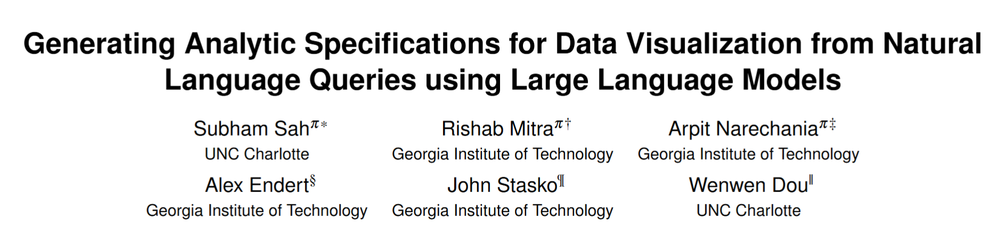
    

    - [论文](https://arxiv.org/abs/2408.13391)（2024年）
    - [补充材料](https://github.com/nl4dv/NL4DV-LLM-supplemental-material)
    - 摘要：此版本使开发人员能够利用**大语言模型**（GPT）将有关数据集的自然语言查询转换为相关的可视化，包括诸如多转向对话交互(multi-turn conversational interaction)和歧义消解(ambiguity resolution)等额外功能。作者提供了一个全面的文本**提示词**(prompts)：根据给定的标准数据集和有关数据集的 NL 查询，它将生成一个分析规范，包括（检测到的）数据属性，（推断得到的）分析任务和（推荐的）可视化。该规范捕获了查询翻译过程的关键方面，提供了**解释性和可调试性**。例如，它提供了从检测到的实体到输入查询中相应短语的映射，以及确定可视化建议的特定视觉设计原理。此外，与以前的基于LLM的方法不同，NL4DV 的提示词支持**对话互动**和**歧义检测**功能。论文中详细介绍了优化提示的迭代过程，展示了使用 GPT-4 进行的初步性能评估，并讨论了 LLMs 在查询翻译不同阶段的优势与局限性。
    - 关键词：大语言模型、自然语言界面、可视化、提示词工程

    

        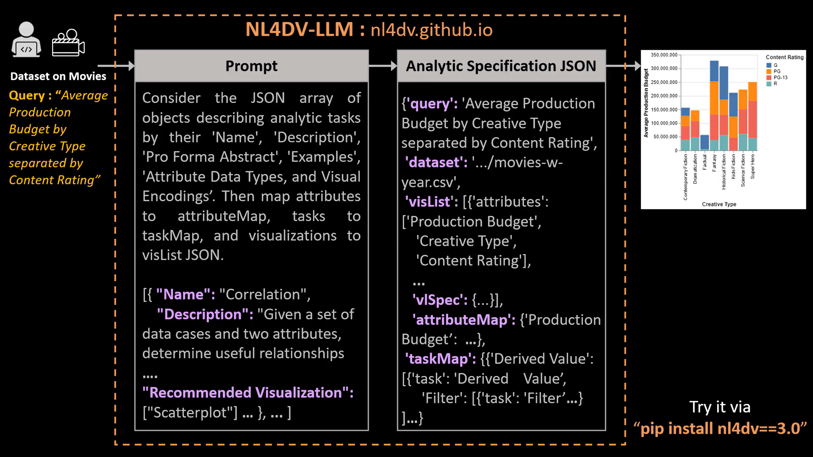
    

### 介绍和背景

- 创建数据可视化需要相关的专业知识，因而限制了创作、个性化和专家的分析能力。之前的解决方案有：
- 使用自然语言(NL)创建可视化（比如 NL2VIS，NL4DV 过去的版本）——使用基于关键字/语义分析/规则的方法，提供关于 NL 查询和数据集的分析规范，包含被检测的属性、推断得到的任务和可视化建议。但由于要创建复杂的规则，限制了 NL 查询的范围和灵活性
- 基于 LLM 的系统：能高效地从非结构化的文本数据中分析和提取有用的信息、关键概念、关系和趋势，因此表现更好。但仍然有一些不足，比如无法对生成的输出提供充足解释，生成可视化不一致等，因而影响到透明度和可信度
- NL4DV-LLM 的突破之处：见“摘要”部分，下面的结构图展示了原版的 NL4DV 和 NL4DV-LLM 之间的不同（用橙色标出后者特有的模块）

    

        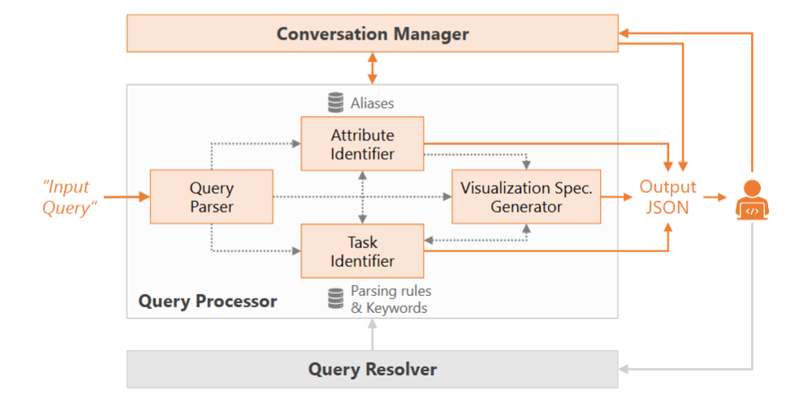
    

### 提示词

#### 成分

提示词包含了以下组成部分：

??? info "图片（有些大，所以隐藏起来了）"

    

        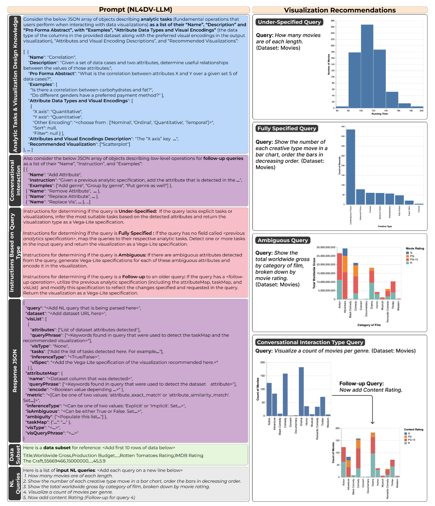
    

- **分析任务和可视化设计知识**：一个结构化的 JSON 对象（称为 Task JSON），它的好处是实现简洁明了，并消除使用 NL 时可能出现的任何潜在歧义。它包含以下七个属性：
    - 名称
    - 描述
    - 形式摘要
    - 示例
    - 属性数据类型和视觉编码：详细说明了首选视觉编码（例如，“X axis”）和可以映射到它们的数据类型（例如，“Quantitative”）
    - 属性和视觉编码描述：提供了有关如何在 VegaLite 中对这些视觉编码和数据类型进行编码的说明
    - 对于7种分析任务（相关性、分布、派生值、趋势、筛选、排序和查找极值）建议的可视化效果：根据 NL4DV 中的设计启发式指定最适合给定任务的可视化类型
- **对话互动**：通过后续查询对先前生成的可视化进行修改。后续查询分类为三种类型之一：添加、删除、替换分析规范的一个或多个组件（特别是属性、任务、可视化类型），通过一个 JSON 数组指定，包含其生成的排列（例如添加 + 分析任务）、描述执行每个操作的必要步骤的说明，以及为每个排列提供上下文的后续查询示例
- **基于查询类型的指令**：查询类型分为
    - **欠定查询**(underspecified queries)：不包含对任务或可视化的显式引用的查询，此时提示词会指示 LLM 利用 Analytic Task JSON 提出的设计准则，“推断最适合检测到的属性数据类型的任务”，以及“使用此推断的任务和检测到的属性生成可视化规范”。
    - **全定查询**(fully specified queries)：显式引用了至少一个属性、任务和可视化类型的查询。先前描述的关键指令足以确保覆盖完全指定的查询，不需要其他说明。
    - **模糊查询**(ambiguous queries)：“部分引用多个数据属性”的查询。此时提示词会指示输出多个可视化效果，关键字可能引用的每个属性对应一个可视化效果，以最大限度地覆盖用户的意图。
    - **后续查询**(follow-up queries)：会更改先前生成的分析规范的组件（任务、属性或可视化类型），而不是创建一个全新的分析规范。此时提示词需要包含另一组用于处理后续查询的指令。对于此查询类型，用户必须将以前生成的分析规范附加到提示的末尾。
- **JSON 响应**：
    - NL4DV-LLM 的输出（一个 JSON 对象）包括：
        - attributeMap：由 NL 查询推断得到的数据集
        - taskMap：推断得到的分析任务
        - visList：包含与查询相关的 Vega-Lite 规范
    - 示例 JSON 对象包括每个属性的显式指令，这尽可能地限制了输出，从而提高了提示的一致性
    - 额外的限制："Do not include any additional prose in your response. I only want to see the JSON"，确保只生成 JSON 对象。如果想要看一些解释性的信息，可从提示词中删除这句话
- **数据集**：由于 LLM 的 token 限制，所以不可能将整个数据集塞给 LLM，因此仅提供所有数据集标题（列），并为提示随机子集化十条记录（行）。
    - 缺陷：
        - 对于非常宽的数据集，大量列可能仍会超过标记限制
        - 这 10 个样本行可能无法代表整个数据集，并且可能会导致查询转换过程中出现漏报
- **NL 查询**

#### 迭代

下图展示了提示词多轮迭代优化的过程：

    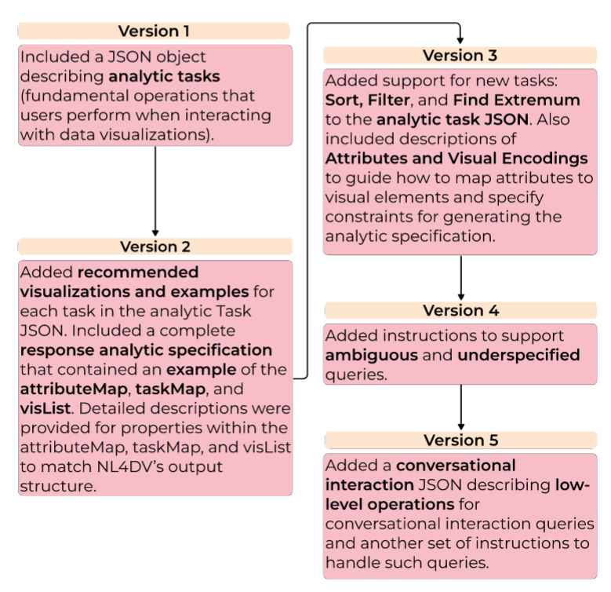

### 初步评估

- 使用 GPT-4 作为提示词引擎，NLVCorpus 作为数据集基准测试(benchmark)（查询语料库）
- 定义查询的正确性：生成的分析规范准确捕获了查询意图，并且生成的可视化包含查询中请求的所有内容
- 数据标注过程：
    - 记录每个查询的响应时间
    - 输出的准确性：表示可视化是否与查询的意图匹配，并包括查询请求的所有分析任务和属性。不准确的常见原因是可视化缺少分析任务、属性或编码的属性不正确，或者压根没有输出
        - 但由于评估数据集中的许多输入查询可能被视为未指定或不明确，因此对于这些类型的查询，多个可视化效果可以被视为“准确”
    - 由两位作者担任数据标注者，如果意见不一致，由第三位作者仲裁（~~怎么有点像高考作文改卷~~）

- 结果：
    - NL4DV-LLM 的准确度明显高于以前的 NL4DV
    - 包含更多的查询结构和形式，包括未指定和模棱两可的查询，这些是基于语义解析的方法所无法支持的
    - 但是，有一些查询导致输出不准确。不准确的常见原因是响应 JSON 对象格式不正确或格式正确的 JSON 对象以及 Vega-Lite 语法不正确
    - NL4DV-LLM 的平均响应时间（25s）明显多余 NL4DV（3s），这会影响到提示词的可用性(usability)，原因是提示词太大了，并且不同的 LLM 也会影响时间

### 局限和未来工作

- 提示词可解释性的限制： GPT-4 无法正确计算标记相似性分数或产生对用户有意义的置信度分数（用于衡量检测到的实体与它们映射到的查询短语之间的语义和句法相似性）
- 有比 GPT-4 更好的 LLM，且 GPT-4 本身可能已经进行了更新和更改，可能会影响一致性、输出准确性和响应时间。之后会比较不同的 LLM
- 使用 NLVCorpus 数据集进行了初步评估，该数据集仅包含对三个数据集的查询。为了进行更彻底的评估，计划在未来使用更多样化和全面的数据集基准

!!! warning "注意"

    后面两篇笔记主要都是由 DS 总结的，作为论文粗读的留痕。

## NL4DV 2

!!! abstract "概述"

    

        
    

    - [论文](https://arxiv.org/abs/2207.00189)（2022年）
    - 摘要：自然语言(NL)工具包使可能没有自然语言处理(NLP)背景的可视化开发人员能够为最终用户创建自然语言接口(NLI)，以便他们灵活地指定可视化并与之交互。但是，这些工具包目前仅支持一次性话语，在用户和系统之间促进**多轮对话**的能力很少。开发具有此类对话交互功能的 NLI 仍然是一项具有挑战性的任务，需要实现低级 NLP 技术来处理新查询，以跟进旧查询。我们扩展了一个现有的基于 Python 的工具包 NL4DV，该工具包处理有关表格数据集的 NL 查询，并返回包含数据属性、分析任务和相关可视化的分析规范，建模为 JSON 对象。具体来说，NL4DV 现在使开发人员能够促进有关数据集的多个同步对话并解决相关的歧义，从而将新的对话信息添加到输出 JSON 对象中。我们通过三个示例来演示这些功能：
        - 用于学习 Vega-Lite 语法各个方面的 NLI，
        - 用于创建自由对话的思维导图应用程序，以及
        - 用于回答问题和解决歧义的聊天机器人。
    - 关键词：
        - 以人为本的计算 — 可视化 — 可视化系统和工具 — 可视化工具包
        - 以人为本的计算 — 人机交互(HCI) — 交互技术 — 文本输入

- 研究背景与动机：自然语言界面（NLIs）允许用户通过自然语言查询与数据可视化系统进行交互。然而，现有的NLIs大多只支持一次性查询，缺乏多轮对话的能力。为了使用户能够通过一系列简短的查询逐步完成任务，论文扩展了NL4DV工具包，使其支持对话式交互。
- NL4DV的扩展：NL4DV原本是一个处理自然语言查询并生成分析规范的工具包，包含数据属性、分析任务和推荐的可视化。论文通过增加对话管理器和查询解析器模块，使NL4DV能够处理多轮对话，并支持用户通过后续查询修改之前的分析规范。
- 通过以下方式实现对话式交互：
    - 自动检测后续查询：系统可以自动检测用户的新查询是否是对之前查询的后续操作，并生成相应的分析规范。
    - 多轮对话管理：系统支持多个并行的对话，用户可以在不同的对话之间切换，并通过后续查询修改之前的分析规范。
    - 模糊查询解析：系统能够检测并解析查询中的模糊性（如多义词），并通过与用户协作解决这些模糊性。

- 应用示例
    - Vega-Lite语法学习工具：用户通过一系列简短的NL查询逐步构建Vega-Lite可视化规范，系统通过对话式交互帮助用户学习Vega-Lite语法。

    

        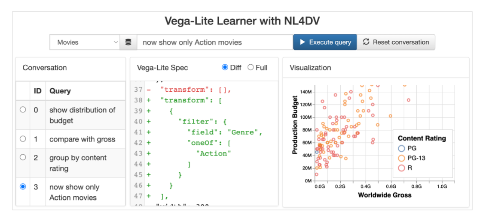
    

    - 思维导图应用：用户可以通过多轮对话自由地与数据集进行交互，系统支持多个并行的对话分支。

    

        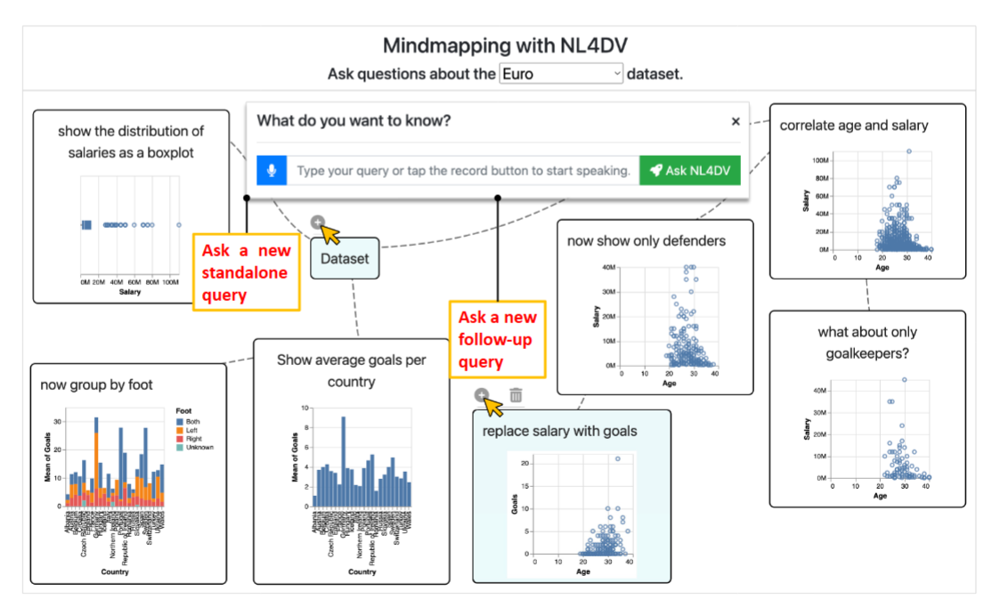
    

    - 聊天机器人：系统与用户协作解决查询中的模糊性，生成准确的可视化。

    

        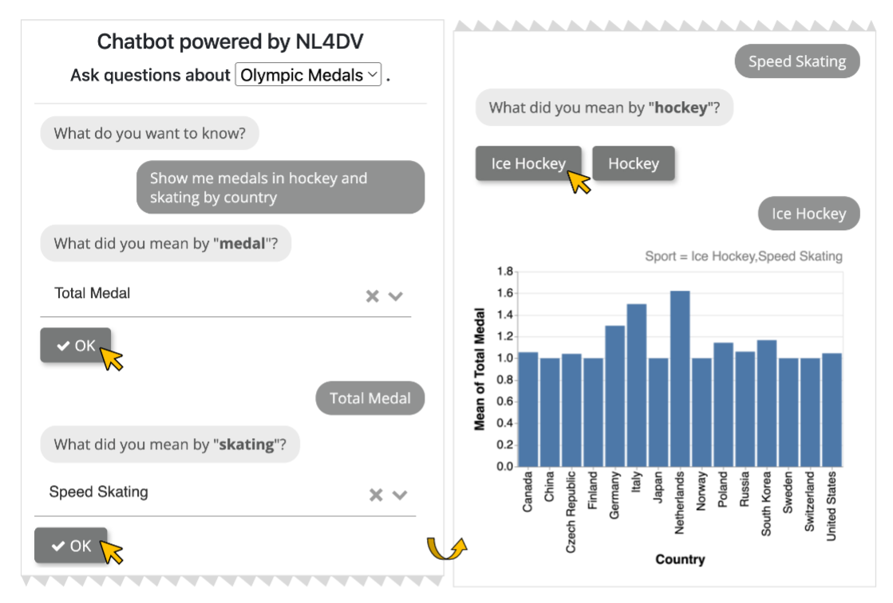
    

- 结论与未来工作：论文扩展了NL4DV工具包，使其支持对话式交互，并通过三个应用示例展示了其能力。未来的工作包括解决对话中的模糊性问题，并进行更正式的性能评估。

## NL4DV

!!! abstract "概述"

    

        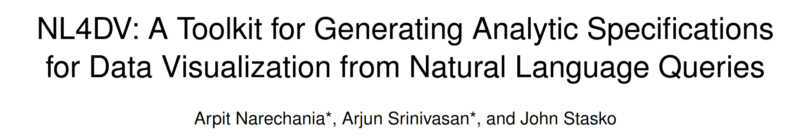
    

    - [论文](https://arxiv.org/abs/2008.10723)（2020年）
    - 摘要：自然语言界面(NLI)在可视化数据分析方面显示出巨大的前景，使人们能够灵活地指定可视化效果并与之交互。然而，开发可视化 NLI 仍然是一项具有挑战性的任务，需要自然语言处理(NLP)技术的低级实施以及可视化分析任务和可视化设计的知识。我们提出了 NL4DV，这是一个用于自然语言驱动数据可视化的工具包。NL4DV 是一个 Python 包，它采用表格数据集和有关该数据集的自然语言查询作为输入。作为响应，该工具包返回一个建模为 JSON 对象的分析规范，其中包含数据属性、分析任务以及与输入查询相关的 Vega-Lite 规范列表。在此过程中，NL4DV 可以帮助可能没有 NLP 背景的可视化开发人员，使他们能够创建新的可视化 NLI 或将自然语言输入整合到现有系统中。通过四个示例演示了 NL4DV 的用法和功能：
        - 在 Jupyter 笔记本中使用自然语言呈现可视化
        - 开发 NLI 以指定和编辑 Vega-Lite 图表
        - 从 DataTone 系统重新创建数据模糊性小部件，以及
        - 结合语音输入以创建多模态可视化系统

    - 关键词：自然语言界面、可视化工具包

    

        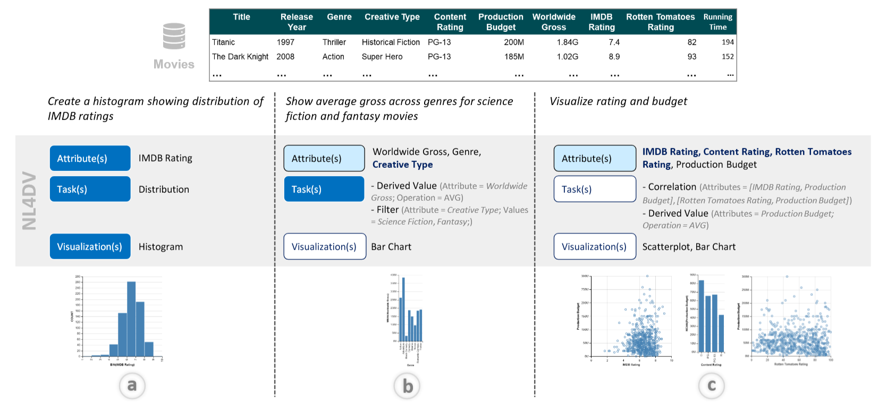
    

- 研究背景与动机：自然语言界面（NLIs）在数据可视化中越来越受欢迎，允许用户通过自然语言查询生成可视化。然而，开发NLIs需要结合自然语言处理（NLP）技术和可视化设计知识，这对没有NLP背景的开发者来说是一个挑战。NL4DV的目标是通过提供一个高层次的API，简化NLIs的开发过程，使开发者能够轻松地将自然语言查询转换为可视化。

- NL4DV的设计与功能：NL4DV的核心功能是处理自然语言查询，生成包含数据属性、分析任务和Vega-Lite可视化规范的分析规范。该工具包的设计目标包括：
    - 降低NLP学习曲线：使没有NLP背景的开发者能够轻松使用。
    - 模块化输出：支持与现有系统组件的集成。
    - 突出推理类型和模糊性：帮助开发者处理自然语言中的模糊性和不确定性。
    - 支持别名和覆盖默认设置：允许开发者根据特定数据集的需求自定义工具包的行为。

    

        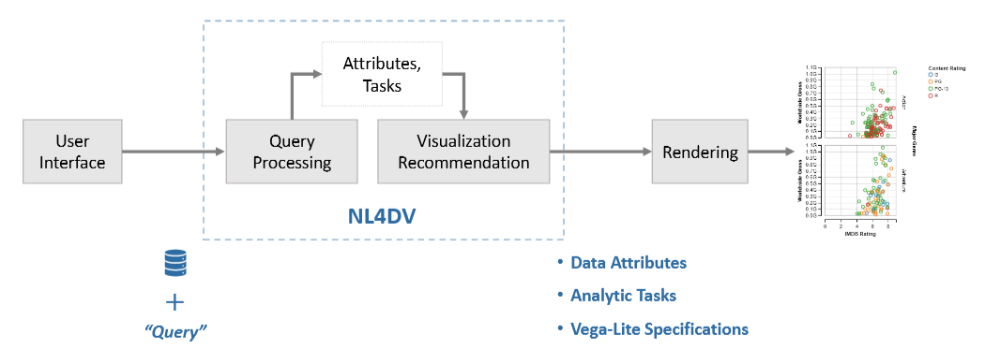
        
基于 NL 查询生成可视化的步骤概述

    

- NL4DV的工作流程
    - 数据解释：初始化时，NL4DV会解析数据集，推断属性类型和值范围。 
    - 查询解析：通过NLP技术（如词性标注、依赖解析）解析输入的自然语言查询。
    - 属性推断：从查询中推断出数据属性，支持显式和隐式引用。
    - 任务推断：根据查询中的关键词和依赖关系，推断出分析任务（如相关性、分布、过滤等）。
    - 可视化生成：根据推断出的属性和任务，生成Vega-Lite可视化规范。

    

        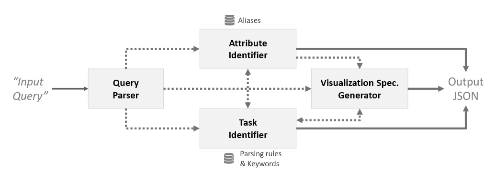
        
NL4DV 的组织架构

    

- 应用示例
    - 在Jupyter Notebook中使用NL4DV：通过自然语言查询生成可视化。

    

        
    

    - NL驱动的Vega-Lite编辑器：帮助用户通过自然语言学习Vega-Lite语法。

    

        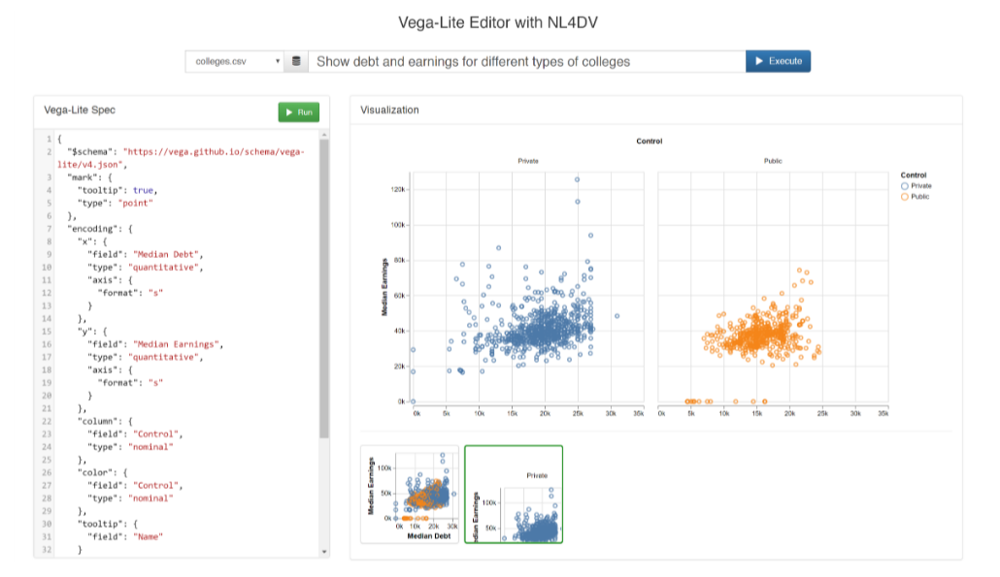
    

    - 重现DataTone的模糊性小部件：通过NL4DV检测并解决查询中的模糊性。

    

        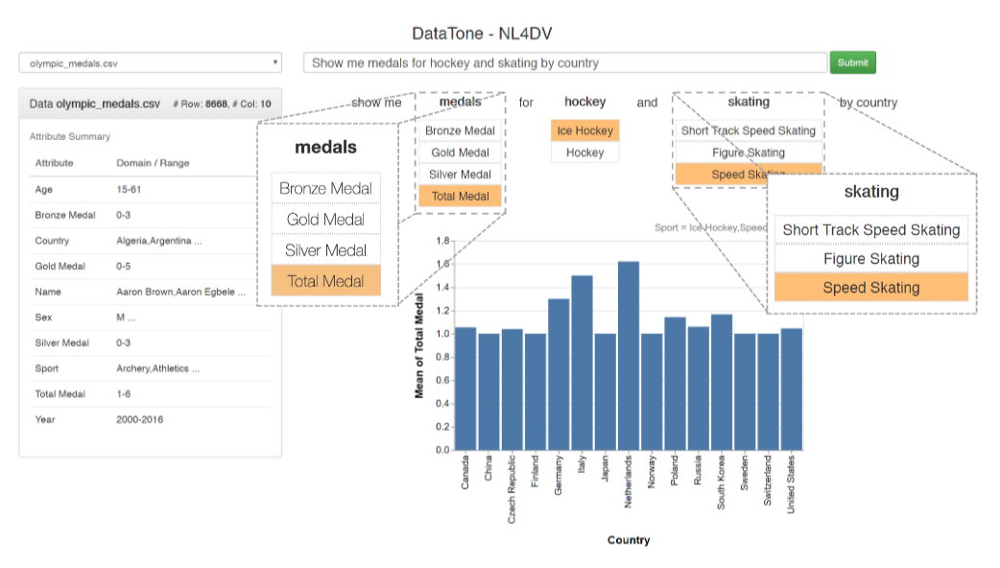
    

    - 多模态可视化系统：结合语音输入和触摸交互，增强可视化系统的用户体验。

- 结论与未来工作：NL4DV通过提供一个高层次的API，简化了自然语言查询到可视化的转换过程，帮助开发者快速构建NLIs。未来的工作包括支持后续查询、改进查询解释、支持更多查询类型，以及平衡简单性和自定义能力。