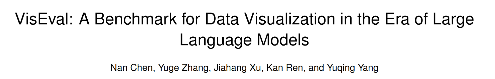
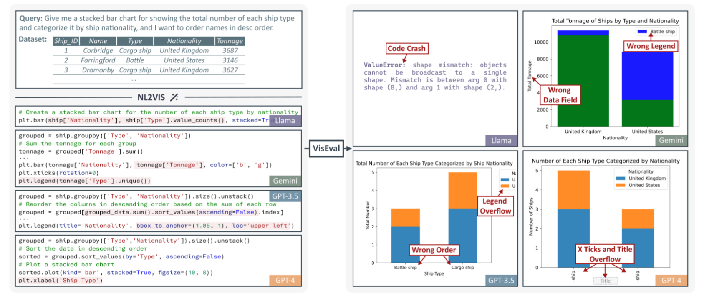
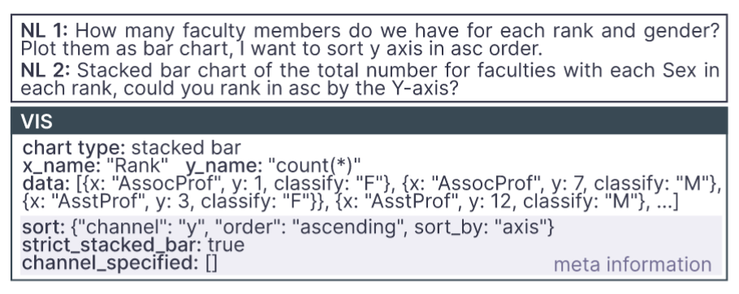
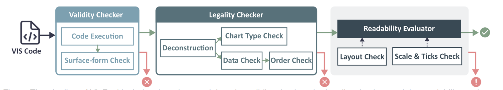
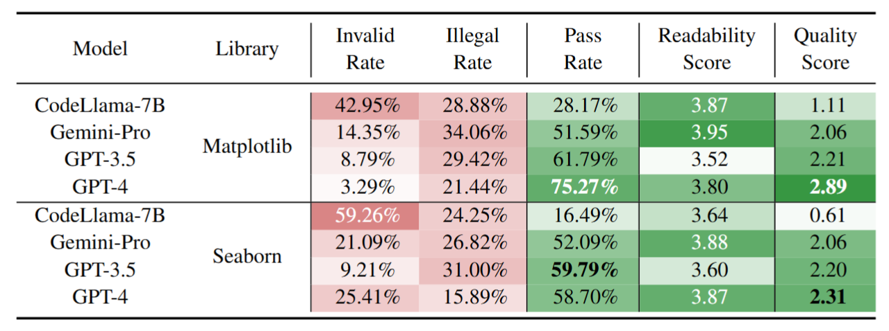
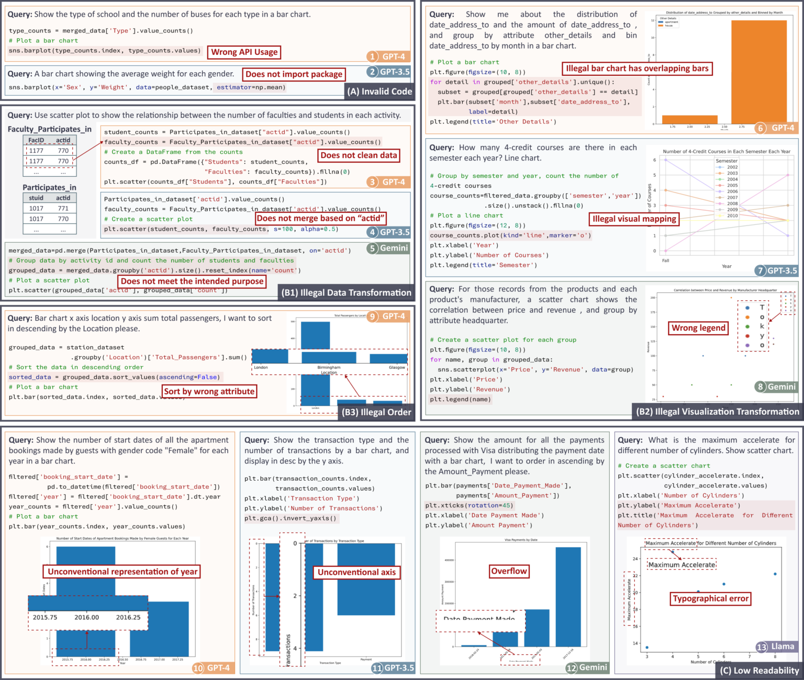
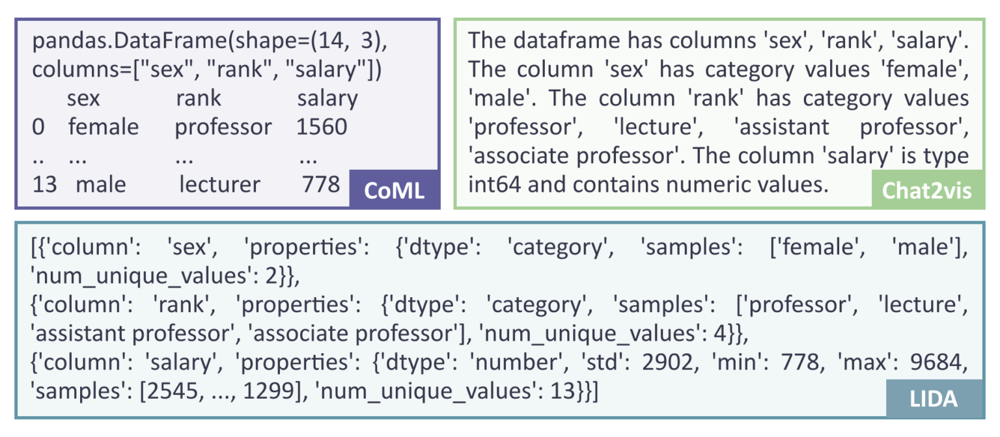
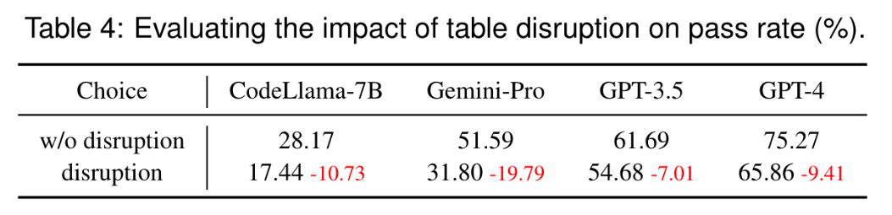

# VisEval

!!! abstract "概述"

    

        
    

    - [官方报告](https://www.microsoft.com/en-us/research/articles/viseval/)（总结的很不错，通俗易懂）
    - [论文](https://arxiv.org/abs/2407.00981)（VIS 2024 Best Paper）
    - [GitHub 仓库](https://github.com/microsoft/VisEval)
    - 摘要：将自然语言转换为可视化(**NL2VIS**)在视觉数据分析方面显示出巨大的前景，但它仍然是一项具有挑战性的任务，需要多种低级实现，例如**自然语言处理**和**可视化设计**。预训练大型语言模型(**LLM**)的最新进展为从自然语言生成可视化开辟了新的途径。然而，缺乏全面可靠的基准阻碍了我们对 LLM 在可视化生成方面能力的理解。本文通过提出一种名为 VisEval 的新 **NL2VIS 基准测试**来解决这一差距。
        - 首先，介绍一个**高质量和大规模的数据集**。该数据集包括涵盖 146 个数据库的 2524 个代表性查询，并与准确标记的基本事实(ground truths)配对。
        - 其次，提出一种全面的**自动化评估方法**，涵盖**有效性**(validity)、**契合性**(legality)和**可读性**(readability)等多个维度。通过使用许多异构检查器系统地扫描潜在问题，VisEval 提供了可靠且值得信赖的评估结果。
        - 最后，在一系列最先进的 LLM 上运行 VisEval。
        
        本项目的评估揭示了普遍的挑战，并为未来的发展提供了重要的见解。
    
    - 关键词：可视化评估、自动可视化、大语言模型、基准测试

## 引言

NL2VIS 任务旨在将自然语言查询转换为可视化图表，帮助用户更直观地理解复杂数据。尽管近年来预训练的大语言模型（LLMs）在自然语言处理任务中表现出色，但在生成可视化图表时仍面临诸多挑战，如代码执行失败、数据转换错误、排序问题等。现有的 NL2VIS 评估方法在数据集质量、评估指标的全面性和方法的可靠性方面存在不足。VisEval 的提出填补了这一空白，提供了一个可靠的基准测试工具。

    
    
大模型在生成可视化时遇到的问题

!!! info "注"

    这部分实际上是摘要的扩展版，而且这些内容也会在接下来的部分详细介绍，所以这里省去了很多重复的内容。

## 现有工作的局限

- 自然语言到可视化生成：传统方法依赖于**语义解析**(semantic/lexical parsing)和**深度学习**技术，而 LLMs 的出现为 NL2VIS 任务提供了新的方向。现有的 LLMs 方法如 Char2vis 和 LIDA 通过提示工程生成可视化代码，但仍存在代码执行失败、数据转换错误等问题。
- 生成可视化的评估：
    - **人工评估**虽然被视为“黄金标准”，但其耗时费力，难以大规模推广
    - **自动评估方法**能够评估代码和 JSON 结构的相似性，并将数据映射、标记和轴与真实数据进行比较，但应用范围有限，并对代码相似性这一衡量标准仍然存疑
    - **基于规则的评估**能够检查数据的匹配情况，但常常忽视可视化的可读性问题
    - 利用**大语言模型**评估生成代码的方式尚未经过充分验证，其可靠性存疑
    - 现有的评估方法主要关注可视化的正确性，而忽略了可读性等其他维度。VisEval 通过引入**多维度评估框架**，提供了更全面的评估方法。
- 可视化数据集：现有的 NL2VIS 数据集要么局限于特定领域，要么缺乏准确的标注。VisEval 构建了一个高质量、大规模的数据集，涵盖了广泛的领域和查询类型。

## 预备知识

- NL2VIS 任务定义：NL2VIS 任务通常包括将自然语言查询和表格数据作为输入，生成可视化代码，并在沙盒环境中执行代码以生成最终的图表。
- 初步研究：通过对 300 个查询的初步研究，作者发现：
    - 低质量的查询会导致无意义的结果
    - 生成结果的内在缺陷：存在代码无效、数据转换错误、可读性差等问题
    - 很难得到省力且可靠的评估：现有的自动化评估方法在可靠性和全面性方面存在不足
- 基于上述现实问题，为基准测试总结出以下几点要求：
    - R1：合并高质量和大规模数据集
    - R2：支持多维评估
    - R3：自动且可靠的评估

## VisEval 基准测试

- **数据集构建**：
    - 基准数据集应满足的要求：
        - **大规模覆盖**：数据集需要包含来自不同领域的大量查询和数据库，以减少偏差；此外，确保平衡的数据分布，以防止来自特定数据库的偏差
        - **高质量查询**：数据集中的查询必须明确且合理，在描述合理可视化时明确指定选定的列、聚合和图表类型
        - **准确的基本事实**：数据集中的基本事实数据应准确标记，并能够精确描述可接受的可视化效果
        - **有价值的查询选择**：排除过于简单的查询，这些查询是模型几乎总是可以回答的查询

    - 数据集的构建过程：
        - **高质量的查询选择**：
            - 基于规则：设计并实施了 8 条规则来过滤和更正查询
            - 基于 LLM：使用多个 LLM 投票决定，提高结果可信度，并减轻了人类专家的工作量
            - 基于人工：人类专家审查了查询，以确保其清晰度、合理性和不重复

        - **精确的基本事实标注**：基本事实包括图表类型、绘制的数据和元信息(meta-information)（详细说明了隐式和显式查询细节，在评估期间用作约束，以确定最合适的图表）

        - **数据集再平衡**(rebalancing)：
            - 用一个过滤器来排除过于简单的查询，最终得到了 1,150 个不同的可视化(VIS)和 2,524 个(NL, VIS)对，涵盖 146 个数据库
            - 考虑到语言固有的灵活性，保留了多个描述同一 VIS 的 NL 查询，在评估过程中将它们视为一个内聚实体
            - 此外，还可视化分为四个不同的硬度级别：简单、中等、困难和特别困难

            

                
                
(NL, VIS)对

            

- **评估框架**：VisEval 的评估框架包括以下模块

    

        
    

    - **有效性检查器**(validity checker)：代码生成后，框架会执行代码，并检查是否成功生成了可视化，以确保代码的有效性。
    - **契合性检查器**(legality checker)：一旦代码通过了有效性检查，契合性检查模块会基于 SVG 图像的解构，提取图表类型、数据、顺序等信息，并根据数据集中注释的元信息评估图表的契合性。这一步是为了确保生成的图表能够符合用户查询的要求，并且数据映射合理。
    - **可读性评估器**(readability evaluator)：可读性评估是框架中最具挑战性的部分。评估可读性需要考虑多方面因素，例如布局、比例和颜色等。为此，研究员们借助了 GPT-4V(ISION) 的强大能力，并将可读性评估任务分解为多个更可控的子问题，具体来说分为以下几步：
        - **布局检查**：模拟浏览器环境的方法能够精确确定画布的大小以及 SVG 格式的可视化元素的大小和位置，从而有助于准确评估溢出和重叠。
        - **比例尺和刻度检查**：
        - **总体可读性评分**：考虑了布局和比例以外的各种因素，例如标题、标签、颜色等，并给出了 1 到 5 分的分数。如前所述，上述检查都提供了评估，并附有对其评估的简洁理由。然后，这些评估将集成到总体可读性评级的提示词中。该提示词还包括查询，通过与可视化的特定需求保持一致，实现更精确的判断。

- **质量保证**：通过以下方法，VisEval 确保了评估框架的可靠性和准确性。
    - 数据呈现
    - 衡量标准：使用 SRCC 量化自动评分和人工评分之间的一致性
    - 结果分析

## 评估

- 实验设置：
    - **NL2VIS 提示词**：CoML4VIS（在 CoML 的基础上修订得到）
    - **可视化库**：Matplotlib、Seaborn
    - **模型**：GPT-4、GPT-3.5、Gemini-Pro、CodeLlama-7B
    - **衡量标准**：
        - *质量分数*(quality score)：对生成结果质量的整体评估
        - *通过率*(pass rate)：有效或契合结果与查询总数的比率，但不包括此计算中的可读性分数，
        - *无效率*(invalid rate)
        - *不契合率*(illegal rate)
        - *可读性分数*(readability score)

- 实验结果：
    - 实验1：测试了**不同模型**在使用 Matplotlib 和 Seaborn 库时的表现。如下表所示，VisEval 揭示了不同模型在生成可视化方面的显著差异。以 GPT-4 为例，在使用 Matplotlib 库生成可视化时，其质量得分为2.89（满分为5），虽然表现尚可，但依然有改进的空间。相对而言，在使用 Seaborn 库时，尽管其代码通常比 Matplotlib 更为简洁，但所有模型的得分均较低，这一结果令人意外。

    

        
    

    通过深入分析，研究员们发现大语言模型在可视化生成的多个阶段都容易出现错误，如下图所示。这些阶段包括**代码编写**、**数据转换**、**可视化转换**以及**排序**等方面。除了准确性之外，模型生成的图表在可读性方面也频繁出现问题，而这一点在以往的研究中常常被忽视。

    

        
    

- 实验2：**不同提示词**设计对模型性能的影响。其中特别分析了三种基于大语言模型的可视化生成方法：LIDA、Chat2VIS 和研究团队提出的 CoML4VIS。实验结果表明，提示词设计对模型的表现具有显著影响。
    - 由于注意到这三种方法采用了不同的表格格式，所以研究员们还进行了额外的实验。实验中研究员们保持 CoML4VIS 中其他条件不变，仅更改表格格式。如图5所示，不同的大语言模型展现出了**对不同表格格式的偏好**。这一发现提示研究员们，可能需要针对不同模型设计不同的提示词，以优化其表现。

    

        
    

- 实验3：**无用数据表**对生成可视化性能的影响。如下表所示，当给大模型的提示词中包含两张无用的数据表时，所有模型的性能均显著下降。这一结果表明，模型在处理复杂输入时容易受到**干扰**，强调了在选择数据时确保其相关性的重要作用。

    

        
    

## 讨论

- NL2VIS 的潜在发展：未来的改进方向包括引入代码检查工具、利用库 API 文档指导 LLMs、将 NL2VIS 任务分解为子任务、通过反馈迭代生成等。
- 局限性与未来工作：
    - VisEval 目前主要评估 Python 库生成的可视化，未来计划扩展支持其他工具（如 Vega-Lite）
    - 并增加对美学和表达性等高级指标的评估

??? question "思考：这个项目还有什么改进空间呢？"

    以下建议由 DS 生成，我筛选了其中几份现实且有价值的建议：

    - 数据集扩展与多样性提升：
        - 领域覆盖：当前数据集涵盖146个数据库，但主要集中在常见领域。可增加医疗、金融、社交媒体等领域的复杂数据，提升跨领域泛化能力。
        - 多语言支持：目前仅支持英语查询，未来可纳入多语言的自然语言输入，验证LLMs的多语言生成能力。
        - 复杂图表类型：当前数据集覆盖7种常见图表（如条形图、散点图），可扩展至热力图、桑基图、动态交互图表等更复杂的类型。

    - 模型多样性与适应性改进：
        - 开源模型覆盖：当前测试集中于闭源模型（如GPT-4、Gemini-Pro），未来可纳入更多开源模型（如LLaMA-3、Mistral），探索其潜力与优化方向。
        - 领域专用模型：针对特定领域（如科学计算、金融分析）微调的LLMs，可能生成更精准的可视化代码，需进一步验证。

    - 多模态输入与输出整合：支持结合图像（如用户手绘草图）或语音输入生成可视化，扩展NL2VIS的应用场景；并且可以附带语音解读或动态演示，提升用户理解效率。

## 结论

VisEval 是一个全面的 NL2VIS 基准测试工具，通过构建高质量数据集和自动化评估框架，揭示了当前 LLMs 在生成可视化图表时的挑战，并为未来的改进提供了重要见解。