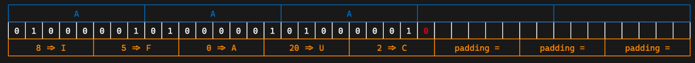

# Misc Lec 1: 编解码及 OSINT

!!! abstract "参考"

    [Gooduck的课件]()

### 概述

misc(miscellaneous)：杂项，除了其他四类大题型外的其他题目

+ 题型：
    + 签到题、签退问卷题
    + 套娃题、谜语题
    + 隐写、取证、OSINT（信息搜集）、PPC（编程类） ——传统 misc 题
    + 游戏类题目（大概也算 PPC）、工具运用类题目
    + 编解码、古典密码 ——不那么 crypto 的 crypto
    + 网络解谜、网站代码审计 ——不那么 web 的 web
    + 代码审计、沙箱逃逸 ——不那么 binary 的 binary
    + Blockchain、IoT、AI ——新兴类别题目
+ 一些例题
+ 如何学习：
    + 快速学习新知识、上手新工具
    + 思维活跃
    + 一定的编程能力
    + 多做题积累经验，尝试站在出题人的角度

### 基础编解码知识

3种常见的位串转换方式：

+ 编解码
+ 加解密
+ 哈希

---
字符编码：位串 $\Leftrightarrow$ 人类理解的字符：

+ ASCII：128项，7位位串(1B)
    + 00-1F：控制字符，20-7E：可见字符，7F：控制字符(DEL)
+ latin-1(ISO-8859-1)：ASCII扩展版，256项
    + 80-9F：控制字符，A0-FF：可见字符
    + 特点：任何位串都可以用其解码
+ [Unicode](https://note.tonycrane.cc/cs/unicode/)字符集系列编码
    + 以平面划分，17个平面，每个平面65536个码位(2B)
        + 通过码位可以表示为U+0000 ~ U+10FFFF
        + 可容纳 111w+ 个字符，现有 14w 个字符（超一半为CJK字符）
    + UCS(Universal Character Set)
        + UCS-2：用 2B 表示码位
        + UCS-4：用 4B 表示码位
    + UTF(Universal Transformation Format)
        + UTF-8：变长编码（1~4），兼容ASCII
            + 0xxxxxxx
            + 110xxxxx 10xxxxxx
            + 1110xxxx 10xxxxxx 10xxxxxx
            + 11110xxx 10xxxxxx 10xxxxxx 10xxxxxx
        + UTF-16：变长编码（2/4），不兼容ASCII
        + UTF-32
+ 中国国标字符集系列编码：GB 2312 / GBK / GB 18030-2022

字符集之间的关系：

乱码，常见类型有：

+ 用 GBK 解码 UTF-8 编码的文本
+ 用 UTF-8 解码 GBK 编码的文本
+ 用 latin-1 解码 UTF-8 编码的文本
+ 用 latin-1 解码 GBK 编码的文本
+ 先用 GBK 解码 UTF-8 编码的文本，再用 UTF-8 解码前面的结果
+ 先用 UTF-8 解码 GBK 编码的文本，再用 GBK 解码前面的结果

>lab要求自行研究这6种乱码情况，并给出分析

分析方法：CyberChef I/O 字符集设置、vscode改变编码方案、Python编解码/进制转换

---
摩尔斯电码：字符 $\Leftrightarrow$ 字符

+ 利用点划（“滴”的时间长短）表示字符
    + 点 ·：1 单位；划 -：3 单位
    + 点划之间间隔：1 单位；字符之间间隔：3 单位；单词之间间隔：7 单位
+ 字符集：A-Z、0-9、标点符号（.:,; ='/!-_"()$&@+）、一些电码专用表示
+ 表示中文：电码表（一个汉字对应四个数字），数字使用短码发送

---
Base编码：位串 $\Leftrightarrow$ 位串

本质：位串 $\rightarrow$ 整数 $\rightarrow$ n进制 $\rightarrow$ 系数查表

+ Base16：用16进制表示位串，长度翻倍
+ Base32：5b一组，按字符表（A-Z,2-7）映射，结果长度必须是5的倍数，不足用 = 补齐（最多会用6个）

+ Base64：6b一组，按字符表映射（最常用）
    + 标准字符表：A-Z, a-z, 0-9, +, /
    + 另有多种常见字符表，如URL安全字符表：A-Z, a-z, 0-9, -, _
    + 结果长度必须是4的倍数，不足的用 = 补齐（1~2个）

其他的Base编码：

+ 分组 —— Base85：4B 整数 $\rightarrow$ 85进制 $\rightarrow$ 5 个系数
    + 常用字符表：0-9, A-Z, a-z, !#\$%&()*+-;$\Leftrightarrow$>?@^_`{ }~
    + 标准字符表：!-u（ASCII编码中0x21-0x75）
+ 作为大整数转换进制：
    + Base62：0-9, A-Z, a-z
    + Base58：0-9, A-Z, a-z去掉0OIl（可能是因为这几个很容易被弄混）
    + Base56：Base58去掉1和o（原因同上）
    + Base36：0-9, A-Z

---
其他常用编码：

+ UUencode, XXencode
+ [二维码(QR Code)](https://note.tonycrane.cc/ctf/misc/qrcode)
+ 条形码
+ 盲文编码

一些其他好玩的类编码：

+ [北约音标字母](https://zh.wikipedia.org/wiki/%E5%8C%97%E7%BA%A6%E9%9F%B3%E6%A0%87%E5%AD%97%E6%AF%8D)
+ 地点三词编码[What3Words](https: /what3words.com/)

常用工具：

+ [CyberChef](https://gchq.github.io/CyberChef/)
+ [Base 系列爆破（Linux 命令）](https://github.com/mufeedvh/basecrack/)
+ [DenCode](https://dencode.com/)
+ [Cipher（Linux 命令）](https://github.com/Ciphey/Ciphey)，（这个我目前没有安装成功，不知什么原因）

### OSINT基础

OSI(Open Source INTelligence)：开源网络情报，通过完全公开的信息进行合理推理，获取情报，在misc题目中泛指信息搜集，有几种情况：

+ 构造了一个全新的虚拟身份，搜集得到出题人准备好的信息
+ 根据图片、文档等附件泄漏的信息进行推理（主要），包括根据图片内容推理找到拍摄位置、当时环境等信息

!!! warning "警告"

    后续内容仅供 CTF 范围内学习交流，实操于现实世界时请注意法律法规，不要开盒！！！

---
常用工具：

+ [一系列数字信息搜集工具](https://github.com/ffffffff0x/Digital-Privacy?tab=readme-ov-file)
+ 用户名批量查询：
    + [sherlock（Linux 命令）](https://github.com/sherlock-project/sherlock)
    + [namechk](https://namechk.com/)
+ 高级搜索方式
    + filetype: .
    + site: .
    + inurl: . intitle: . intext: .
+ [Wayback Machine](https://web.archive.org)
    + 查找网页的历史快照（以及可以创建快照）
    + 有时可以找到出题人特意保存快照后删除的内容

---
文件信息泄露

+ 各种文档的元信息（metadata）可能包括作者、修改时间等信息
    + 图片的 EXIF 信息，可通过 exiftool（Linux 命令）查看
    + 一般以 xml 形式存储，可以直接通过二进制抹除，或者通过操作系统
+ 工程文件夹泄漏信息
    + Visual Studio 的各种配置文件，.vs 文件夹中信息
    + .vscode 文件夹中的配置文件
    + .git 文件夹，泄漏全部修改历史、提交信息、提交者等
+ 文件夹路径信息泄漏
    + .DS_Store 文件，macOS 下的文件夹布局信息
    + 前面各种工程配置文件等也会泄漏（比如 vs 的 pdb 调试信息）
    + markdown 文件图片路径（本地路径 / 图床用户 / 自建图床网站）

---
照片信息分析

+ 图片搜素，常用搜索引擎：
    + 百度识图搜索：中文互联网图片搜索结果
    + Google 图片搜索：用来搜索外国范围的图片
    + Bing 图片搜索：和 Google 差不多，都可以参考
    + Yandex 图片搜索：搜索相似图片，搜索风景时更常用
    + TinEye：搜索完全相同的图片（找来源）
+ 地点线索搜集
    + 注意图片中的文字、牌匾、标志性建筑等，可用来作为关键词搜索
    + 找到大概位置后可用用百度全景地图 / 谷歌全景地图进行确认 / 查找附近线索
    + 如果图片中关键信息较少，可以优先考虑使用搜索引擎识图
    + 搜索确认得到地名后，即可进一步搜索相关信息

??? example "例题"

    

    
    

    2023 HackerGame
    

    
    

+ 环境信息分析
    + 常见题型：拍摄者高度分析（根据几何学透视），比如

    

    
    

    + 其他环境信息分析：
        + 太阳角度、阴影长度等太阳相关，时间 $\leftrightarrow$ 位置互相估计
        + 天气信息、云层信息等
        + 飞机航班信息：估计方向，位置，时间等
        + 风景信息 $\rightarrow$ Yandex 搜索
    + 工具
        + [suncalc.org](https://www.suncalc.org/)
        + [sunearthtools.com](https://www.sunearthtools.com/cn/index.php)
        + [flightaware.com](https://www.flightaware.com/)
        + [flightradar24.com](https://www.flightradar24.com/)
        + [adsbexchange.com](https://www.adsbexchange.com/)