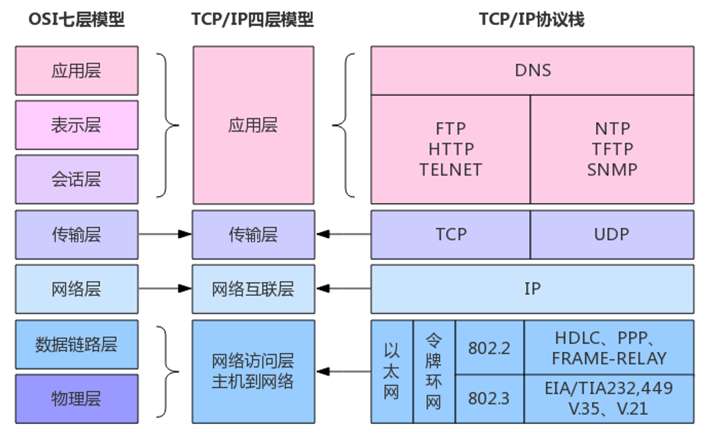

# Web Lec 1: 计算机网络基础      

!!! info "注"

    + 如果对这方面的知识感兴趣，~~且想要拿一个高绩点~~，这里强烈安利《无线网络应用》这门选修课。虽然课程安排相当的满（理论+实践，从下午上到晚上），但如果用心学的话不仅能学到很多Web相关知识，也能获得一个令人满意的成绩（~~笔者为数不多满绩的课程之一~~）。
    + 个人感觉课上讲的知识有些杂乱，没有梳理好一个较为合理的体系，因此笔者根据自己的理解重新整理了一下笔记（~~相信等之后学了CN发现现在的笔记有多愚蠢~~）
    + 推荐自学资料：[MDN Web Docs](https://developer.mozilla.org/zh-CN/)

!!! abstract "参考"

    + [“实用技能拾遗” lec6](https://slides.tonycrane.cc/PracticalSkillsTutorial/2023-fall-ckc/lec6/)
    + [yyy‘s note](https://cubicy.notion.site/2024-Web-4d50db2d026c4fffb76bfebdc1f9d553) 
    

## 网络

>从OSI模型&TCP/IP模型分析

这是OSI模型：

OSI模型与TCP/IP模型之间的转换：

这里按照TCP/IP模型展开：

+ 应用层
    + 特点：无状态、纯文本，需要用Cookie维持状态
    + 域名与DNS
        + 域名：顶级域名（.top）、二级域名（noughtq.top）、三级域名（note.noughtq.top）等
        + DNS记录：A(IPv4)、AAAA(IPv6)、CNAME(别名)、TXT(纯文本)、NS...
        + 常用命令：`nslookup`（查询DNS的命令行工具）
    + HTTP协议
        + URL：统一资源定位符（人话：网址）
        + 状态：Cookie、Session、Token
            + Cookie：存储在**客户端**的小型文本文件，通常用于存储用户的偏好设置、身份验证信息等
                + Cookie劫持
            + Session：存储在**服务端**的临时数据存储区域，通常用于存储用户的会话状态信息
        + HTTP请求：GET、POST
        + [HTTP报文](https://cyc2018.xyz/%E8%AE%A1%E7%AE%97%E6%9C%BA%E5%9F%BA%E7%A1%80/HTTP/HTTP.html#%E4%B8%80-%E3%80%81%E5%9F%BA%E7%A1%80%E6%A6%82%E5%BF%B5)
            + HTTP标头
        + HTTPS
        + 用好**开发者工具**
    + 代理(PROXY)
        + 正向代理：虚拟专用网络(VPN)，用于访问内网
        + 反向代理：隐藏真实IP，部署内容分发网络(CDN)、防火墙，内网渗透

+ 传输层
    + 特点：端到端
    + TCP：面向连接、拥塞控制、字节流服务、确认重传
    + UDP：无连接、开销低、自由度高、自己实现方便
    + 端口
+ 网络层
    + IP：IPv4、IPv6（关注它们IP地址的特征）
    + 网关、子网、NAT（网络地址转换）
    + 数据包传输和路由
    + 常用命令：`tracert`（跟踪数据包从本地到目的地间的网络路径）
        + 原理——ICMP报文

+ 物理层：~~这块归信电管，CS基本不管~~

## 网站

>其实这块也属于**应用层**，但由于内容比较多，所以单独列出来了。

+ WEB 应用架构：客户端 + 服务端
    + 客户端：浏览器
        + 可视化：HTML、CSS
        + 人机交互逻辑：JS
        + 缓存：Cookie
        + 安全
    + 服务端：一台或多台服务器
        + 认证(authentication)与授权(authorization)
        + 处理请求
        + 各种分工：前端、后端、数据库......
        + 安全
+ PHP：最早的开发语言，但是快死了（一坨bug），简单了解语法即可
+ 后端：Web应用的核心，负责处理业务逻辑、数据存储和安全
    + 后端技术栈：Node.js、PHP、Python、Ruby、Go、Rust
    + 漏洞：逻辑漏洞、一些错觉、注入漏洞
    + SQL（结构化查询语言）——与数据库交互，目前只要了解下面4种操作即可（~~但大二的时候还要学~~）
        + 常用操作   
            + 增(create)
                + `CREATE TABLE users (...);`
                + `INSERT INTO users VALUES (1, 'noughtq', false);`
            + 删(delete)
                + `DELETE FROM users WHERE id=1;`
            + 改(update)
                + `UPDATE users SET username='qqq' WHERE id=1;`
            + 查(retrieve)
                + `SELECT version();`
                + `SELECT avg(score) FROM students GROUP BY name;`
                + `SELECT * FROM students;`
+ 前端：可视化与操作逻辑，主要关注用户界面的设计和交互
    + HTML：**标记语言**，由各种标签嵌套的层级结构，搭好网页的框架
    + CSS（层叠样式表）：美化网页
    + JS(JavaScript)：处理网页的逻辑交互，还可用于后端
        + 发展：Node.js、TypeScript

    >这里就不介绍语法了，想要了解的话看MDN Web Docs

    + 用好**开发者工具**
    
+ 网络安全
    + 任意代码执行(RCE)
    + 文件包含
    + 越权、非授权访问
    + XSS（跨站脚本攻击）
    + CSRF（跨站请求伪造）
    + SSRF（服务端请求伪造）
    + 跨域
    + Dos攻击、DDos攻击（分布式拒绝服务攻击）

??? question "经典面试题：地址栏输入网址并访问后发生了什么？"

    1. **DNS解析（域名解析）**：
        - 浏览器会首先检查本地缓存中是否有该网址对应的IP地址。
        - 如果没有，它会向DNS服务器发送请求，查询该网址的IP地址。
        - DNS服务器返回该网址对应的IP地址给浏览器。
    2. **建立TCP连接**：
        - 浏览器使用前面得到的IP地址，通过TCP/IP协议与目标服务器建立连接。
        - 这包括三次握手过程：客户端发送SYN包，服务器返回SYN-ACK包，客户端再发送ACK包确认连接。
    3. **发送HTTP请求**：
        - 建立连接后，浏览器会发送一个HTTP请求到服务器。这个请求包含了请求方法（如GET或POST）、请求的资源路径以及一些头信息（如浏览器类型、可接受的文件类型等）。
    4. **服务器处理请求并返回响应**：
        - 服务器接收到请求后，会处理该请求，查找请求的资源（如HTML文件、图片、视频等）。
        - 服务器会将找到的资源以及一些头信息（如内容类型、内容长度等）打包成HTTP响应，返回给浏览器。
    5. **浏览器接收响应并渲染页面**：
        - 浏览器接收到服务器返回的HTTP响应后，会解析响应的头信息和内容。
        - 如果内容是HTML文件，浏览器会解析HTML并根据其中的指令（如加载CSS文件、执行JavaScript脚本等）进行渲染。
        - 浏览器会逐步构建DOM树和CSSOM树，并根据它们生成渲染树，最后将内容绘制到屏幕上。
    6. **加载资源**：
        - 如果HTML文件中包含了其他资源（如图片、CSS、JavaScript等），浏览器会根据需要发送额外的HTTP请求来加载这些资源。
        - 这些资源加载完成后，浏览器会继续渲染页面，更新显示内容。

    整个过程通常在短时间内完成，以确保用户能够快速看到网页内容。