# Overview

**计算机图形学**(computer graphics)是一门用计算机合成和操控视觉信息的学科。

## Why Study Computer Graphics?

### Applications

- 游戏

    

    -   只狼：影逝二度(Sekiro: Shadows Die Twice)（2019）

        

            
        

    -   无主之地 3（2019）

        

            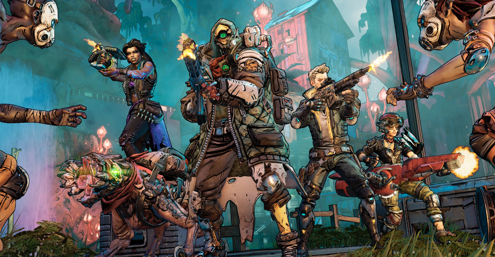
        

        卡通画风

    

    - 什么才是好画面的一个标准：看画面是否足够亮（说明全局光照做的好）

- 电影

    

    -   黑客帝国(The Matrix)（1999）

        

            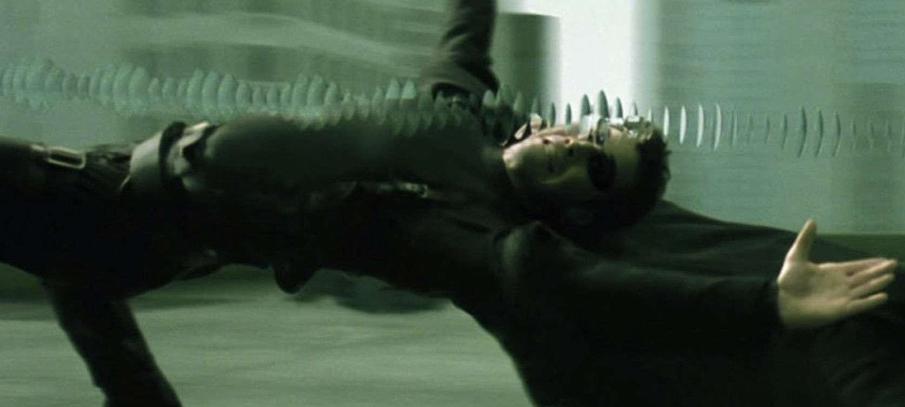
        

        子弹时间

    -   阿凡达(Avatar)（2009）

        

            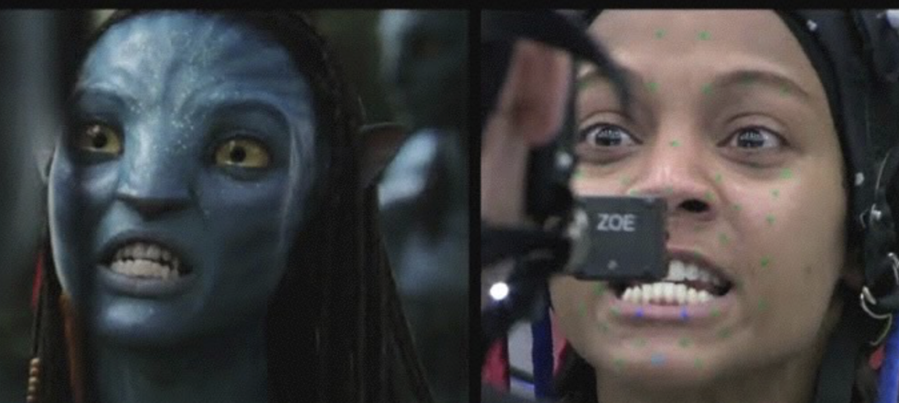
        

        面部动作捕捉做的很好

    

    - 特效(special effect)：最简单的图形学应用，因为平时见不到，做的不对也不会感到意外

- 动画

    

    -   疯狂动物城(Zootopia)（2016）

        

            
        

        动画中动物的毛发十分细腻，涉及到几何、渲染相关的知识

    -   冰雪奇缘 2(Frozen 2)（2019）

        

            
        

        特效：烟雾、发光粒子等

    

- 设计

    

    -   Autodesk Gallary

        

            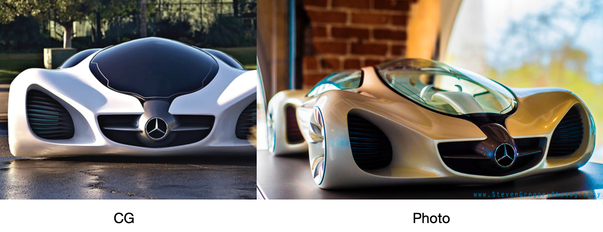
        

        - 用到了 CAD
        - 其中左图 CG 中的概念车可以移动，或切换不同的环境光

    -   宜家(IKEA)

        

            
        

        网站中 75% 的图像为计算机渲染的图像

    

- 可视化(visualization)：用于科学、工程、医学、新闻学等

    

        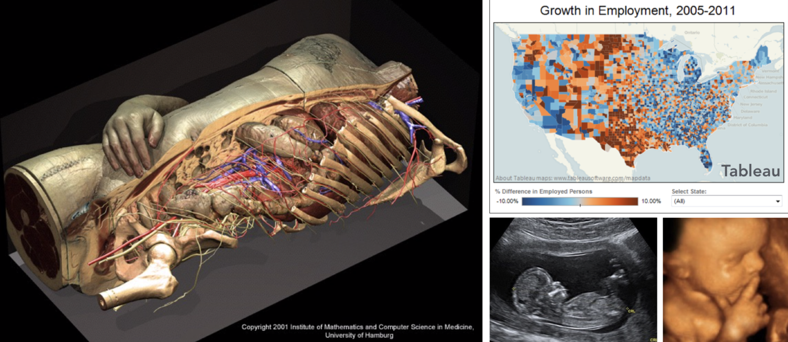
    

- 虚拟现实(virtual reality)：看不到现实，看到的东西都由计算机生成

    

        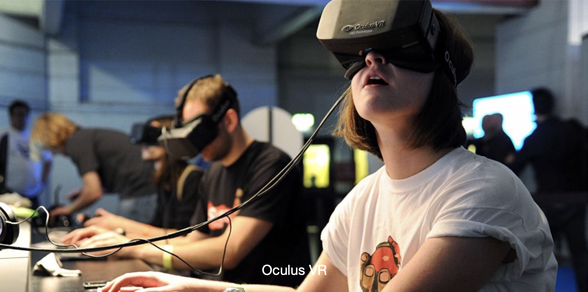
    

- 增强现实(augmented reality)：可以看到现实物体

    

        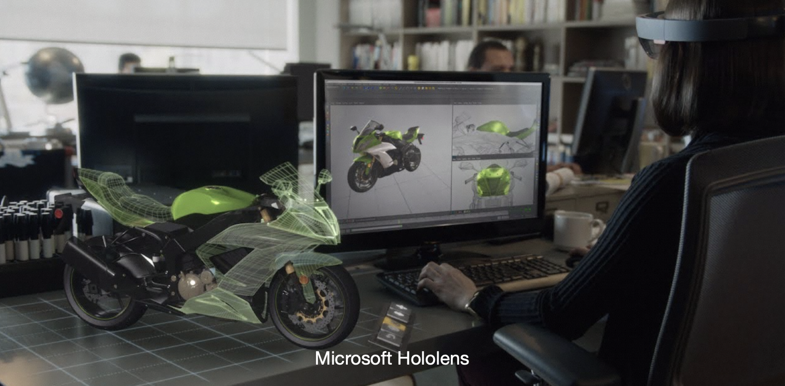
    

- 作画
    - 应用：Procreate, Adobe Photoshop
    - 例子：<https://www.youtube.com/watch?v=uEdRLlqdgA4/>

        

            
        

- 模拟(simulation)

    

        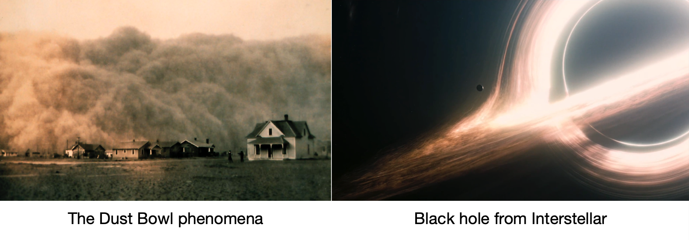
    

- 图形用户界面(graphical user interface, GUI)

    

        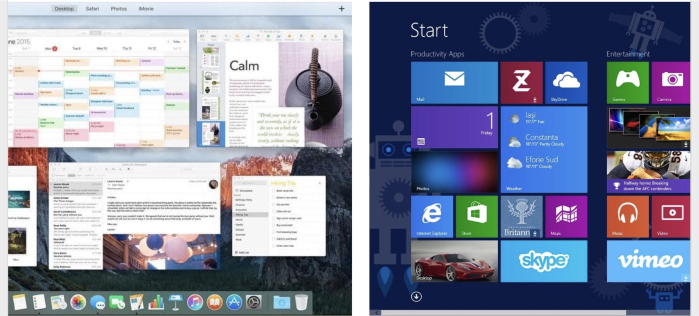
    

- 字体排版(typography)

    

        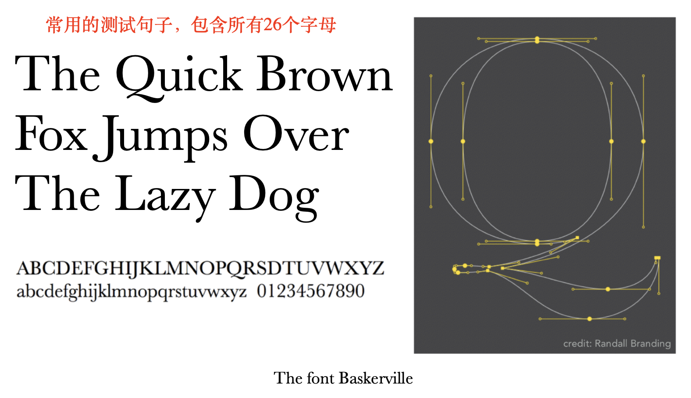
    

### Fundamental Intellectual Challenges

学习 CG 时会遇到的挑战有：

- 创建真实的虚拟世界，并与之交互
- 要求理解物理世界的方方面面
- 新的计算方法，显示技术

### Technical Challenges

我们还会面对以下技术上的挑战（不包括最后一点）：

- （透视）投影中的数学、曲线、曲面
- 光和阴影中的物理学
- 表示和操作 3D 形体
- 动画/模拟
- ~~3D 图形软件和硬件编程~~

---
为什么要学 CG？忘记前面一长串理由，总之就是：CG is AWESOME!

??? info "图形学在基础学科上的依赖"

    - 数学基础：[线性代数](../../math/linear-algebra.md)、[微积分](../../math/calculus/index.md)、[统计学](../../math/pro-sta/index.md)
    - 物理基础：[光学](../../misc/physics/2.md)、力学
    - 杂项：信号处理、[数值分析](../../math/na/index.md)
    - 还要有一点审美

## Course Topic

之后的课程分为四大主题：

- **光栅化**(rasterization)
    - 将几何图元投影到屏幕上
    - 将投影图元分割成片段（像素）
    - 游戏中的黄金标准（实时（>= 30 FPS，否则叫做离线(offline)）应用）

    

        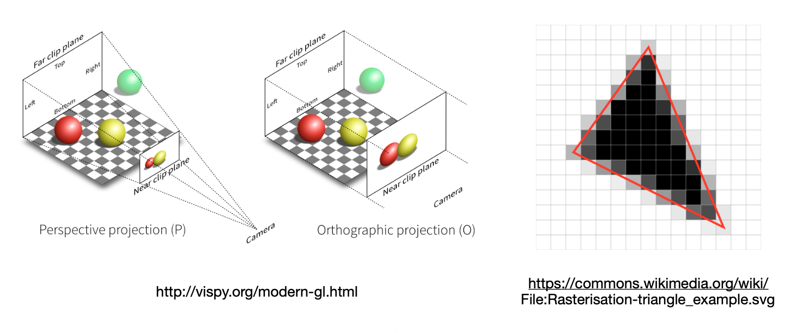
    

- **曲线和网格**(curves and meshes)
    - 如何在 CG 中表示几何

    

        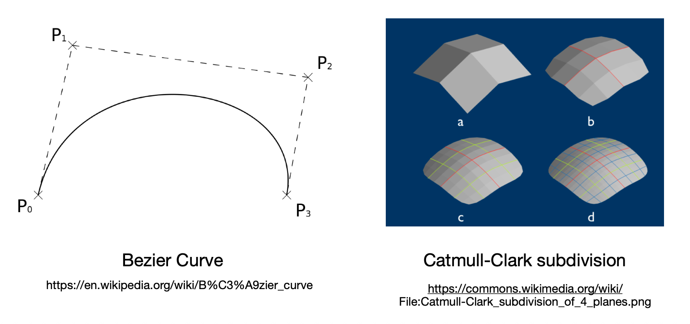
    

- **光线追踪**(ray tracing)
    - 从相机通过每个像素发射光线
        - 计算交叉和阴影
        - 在抵达光源前持续弹跳
    - 在动画/影视（离线应用）中的黄金标准
        - trade-off：光线追踪能达到好的效果，但是慢
        - “鱼和熊掌兼得”的技术——实时光线追踪

    

        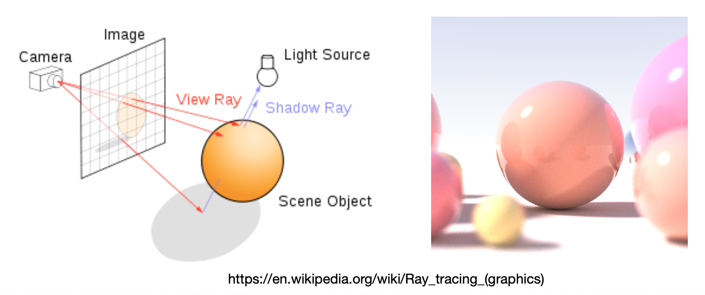
    

- **动画/模拟**(animation/simulation)
    - 关键帧动画
    - 质量-弹簧系统

    

        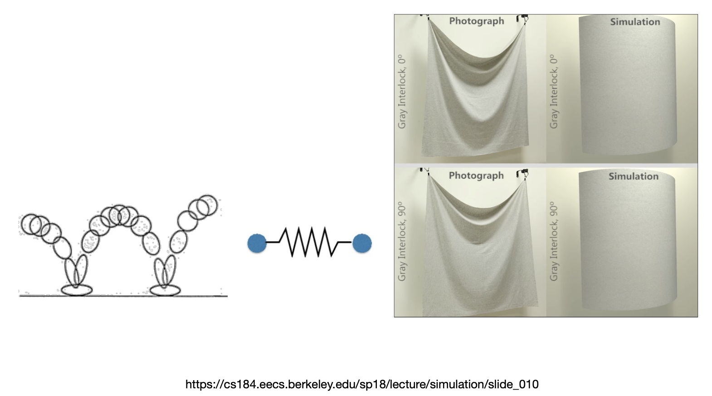
    

---
GAMES101 不教以下内容：

- OpenGL / DirectX / Vulkan 的使用
    - Shaders 的语法
    - 我们只学图形学，而不是图形学 APIs
    - 只要掌握课上所学的 CG 技术，课后学这些东西应当不成问题
- 使用 Maya / 3DS MAX / Blender 进行 3D 建模，或使用 Unity / Unreal Engine 进行 VR / 游戏的开发

    

        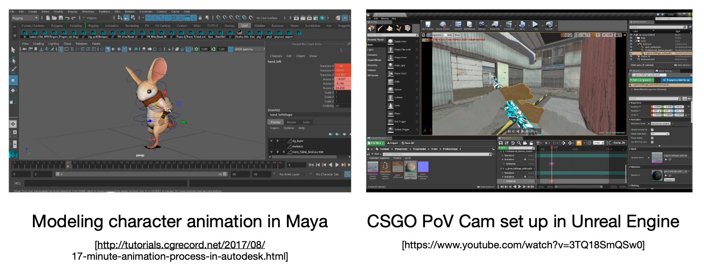
    

- 计算机视觉 / 深度学习话题，比如 XYZ-GAN

    

        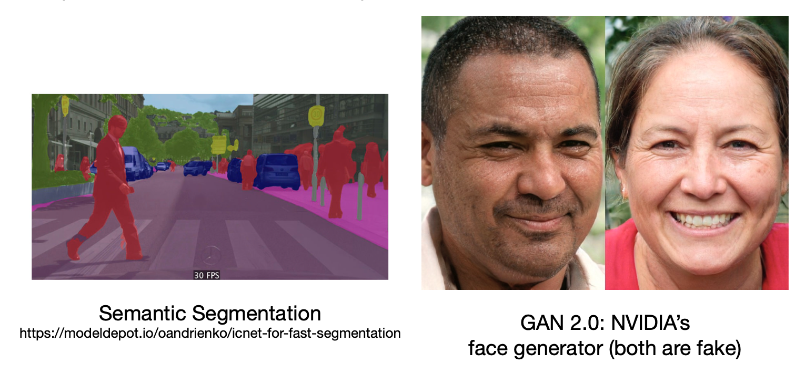
    

    - 如果分不清 CV 和 CG，简言之：一切需要猜测的内容属于 CV
    - 闫令琪老师的理解

        

            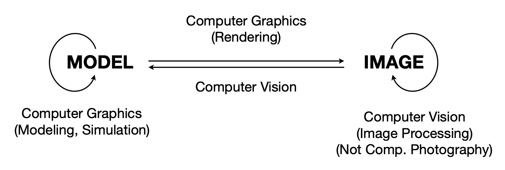
        

    - 实际上两者没有清晰的边界

