# Cameras, Lenses and Light Fields

CG 领域有两种**成像**(imaging)方式，分别是：

- **合成**(synthesis)：包括前面介绍的[光栅化](4.md)和[光线追踪](7.md)技术等
- **捕捉**(capture)：简单来说就是将真实世界的物体（通过**相机**(camera)）以照片形式呈现

因此本讲将围绕“相机”这一话题展开介绍。

- （现代）相机是一台精密仪器，其内部结构相当复杂

    

        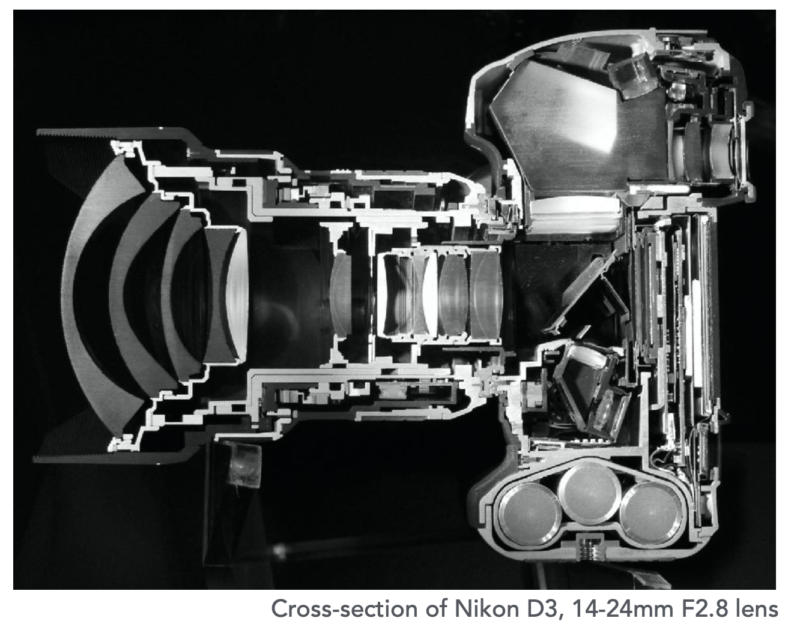
    

- 成像方式包括**针孔**(pinhole)成像和**透镜**(lens)成像

    

        
    

- **快门**(shutter)是相机的一个重要部件，用于控制光在一定时间内进入相机的量（**曝光**(exposure)）

    

        
    

- 传感器（感光元件）用于记录曝光过程中的积累的**辐照度**(irradiance)

    

        
    

- 要是传感器没有透镜的话，传感器上的每一点会接收来自物体上所有点的光，因此照片上所有的像素值将会是差不多的
    - 不过在计算成像领域中，仍有关于这一问题的研究，不过我们目前还是认为没有透镜是无法成像的

    

        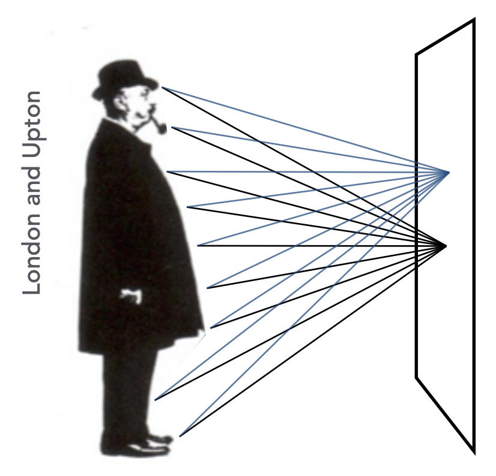
    

## Pinhole Image Formation

不过人们在发现透镜能够用于成像前先发现了可以用针孔成像，因而发明出**针孔相机**(pinhole camera)。

    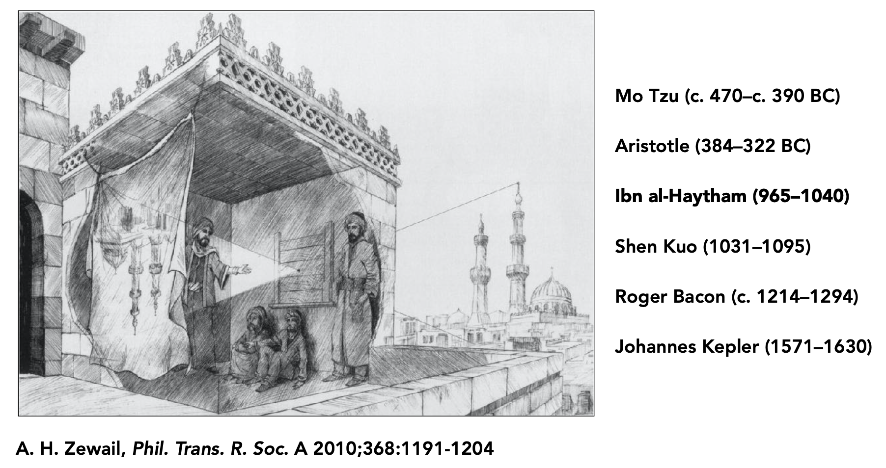

下面是用最大的针孔（左图，直径为 6mm）拍出来的照片（右图）：

    
    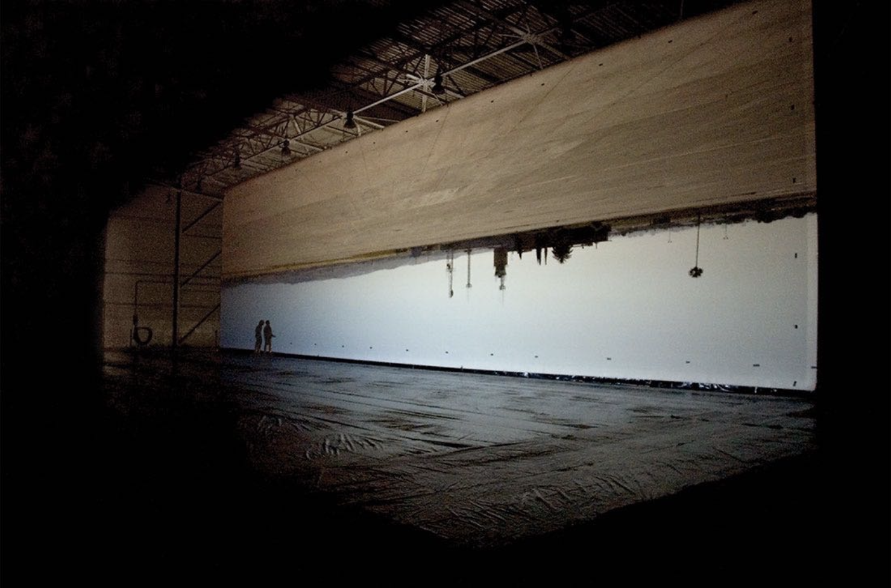

不过这样拍出的照片看不出虚化的地方，前中后都是清晰的。

## Field of View

**视场**(field of view, **FOV**)与**焦距**(focal length)和传感器大小相关，公式为：
$$
\text{FOV} = 2 \arctan \left(\dfrac{h}{2f}\right)
$$

当传感器大小固定时，减小**焦距**会增大视场。

    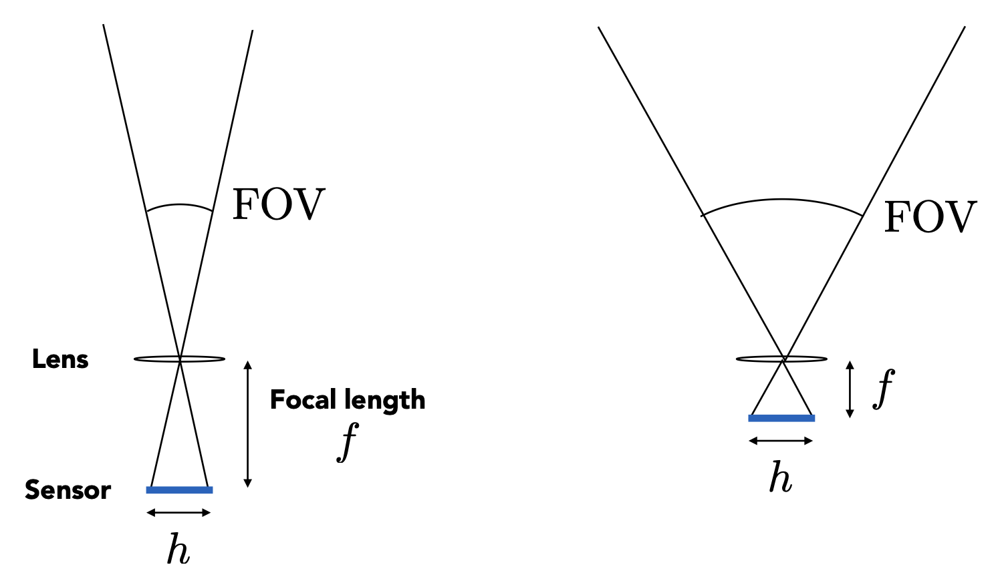

- 由于一些历史原因，我们通常以 35mm 格式的胶片（36x24mm）上使用的镜头焦距来指代视角场(angular field of view)
- 一些关于 35mm 格式下的焦距的例子：
    - 17mm：广角（104°）
    - 50mm：“常规”透镜（47°）
    - 200mm：长焦(telephoto)透镜（12°）
- 注意：当我们说当前**手机**拥有大约 28mm 的“等效”焦距时，遵循的是上述约定，而不是真的有 28mm 的焦距（远超现在的手机厚度了）

???+ example "例子"

    

        
    

而在焦距固定时，不同**传感器大小**对 FOV 的影响如下：

    

!!! warning "注意"

    目前我们可以混用“胶片”和“传感器”的概念。但在渲染器中，两者的概念并不一致。

???+ example "例子：各种设备的传感器大小"

    

        
    

要想在更小的传感器上维持相同大小的 FOV，需要按比例减小焦距。

    

## Exposure

**曝光**(exposure, H) = **时间**(T) \* **辐照度**(irradiance, E)

- 曝光时间由**快门**控制
- 辐照度：落在传感器单位面积上的光的功率，由透镜**光圈**(aperture)和**焦距**控制

因此有以下几个控制曝光的因素：

- **光圈大小**：通过开/闭光圈改变 **f 数**(f-stop)
    - 光圈是仿生学设计，仿照人的瞳孔
- **快门速度**：改变传感器像素的曝光时间
- **ISO 增益（感光度）**：改变在传感器值（硬件层面）和数码图像值（软件层面）之间的放大倍率(amplification)（就是乘上一个数）
    - 这是一种后期处理

以下是分别改变这三要素的效果：

    

- 黑点是图像上的噪声，放大信号的同时也会放大噪声，因此图像上的噪点会更明显
- 图像上噪点出现原因的一种简单解释：把光看作光子，如果快门时间短，进入到感光元件的光子数少，因而产生噪点（解释清楚很复杂）

### ISO Gain

关于 ISO 增益（感光度）

- 胶片：以**颗粒度**(grain)换取感光灵敏度
- 数码：以**噪点**(noise)换取感光灵敏度
- 在模数转换（ADC）前放大信号
- **线性**效应，比如 ISO 100 所需光线为 ISO 200 的一半

???+ example "例子"

    

        
    

### F-Number(F-Stop): Exposure Levels

f 数记作 FN 或 F/N。对 f 数非正式的理解是：圆形光圈直径的倒数。

    

### Side Effects of Shutter Speed

???+ example "例子：机械快门（曝光速度为 1/25 sec）"

    

        
    

    视频链接：<https://youtu.be/CmjeCchGRQo>

快门速度的副作用包括：

- **运动模糊**(motion blur)

    

        
    

    - 原因：手抖、对象移动
    - 运动模糊程度和快门开启时间成正比
    - 但运动模糊并不总是一件坏事
        - 从人的感知看，运动模糊能让我们感受物体运动速度的快慢
        - 从时间采样角度看，运动模糊起到类似反走样的效果

    

        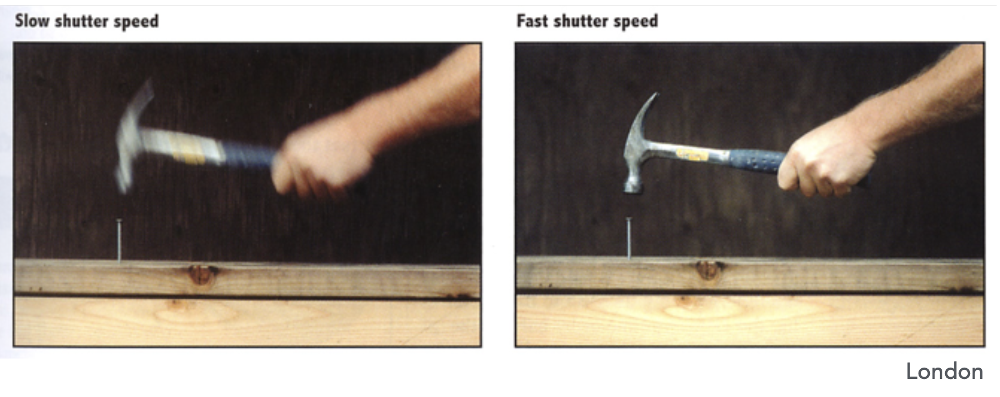
    

- **滚动快门**(rolling shutter)：由于机械快门不是一下子就全部打开的，所以如果物体运动速度比快门打开速度还要快，拍出来的照片中物体看起来是扭曲的
    - 例子：高速旋转的螺旋桨，照片上看上去是扭曲的

        

            
        

!!! abstract "保持不变的曝光"

    以下光圈-快门速度配对（列）能够产生相同的曝光：

    

        
    

    - 如果曝光结果太亮/太暗，可能需要调整 f 数和/或快门的开闭
    - 对于拍摄移动中的物体，摄像师必须权衡好**景深**(depth of field)（[最后](#depth-of-field)会介绍）和运动模糊。

## Fast and Slow Photography

- **高速摄影**(high-speed photography)
    - 常规曝光 = 极快的快门速度 \*（大光圈或大感光度）

    ???+ example "例子"

        === "例1"

            

                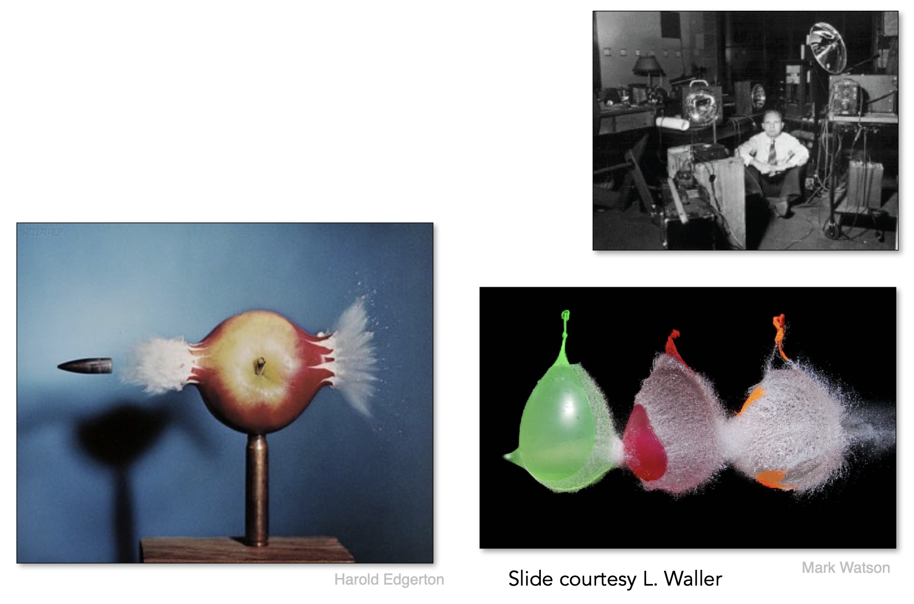
            

        === "例2"

            

                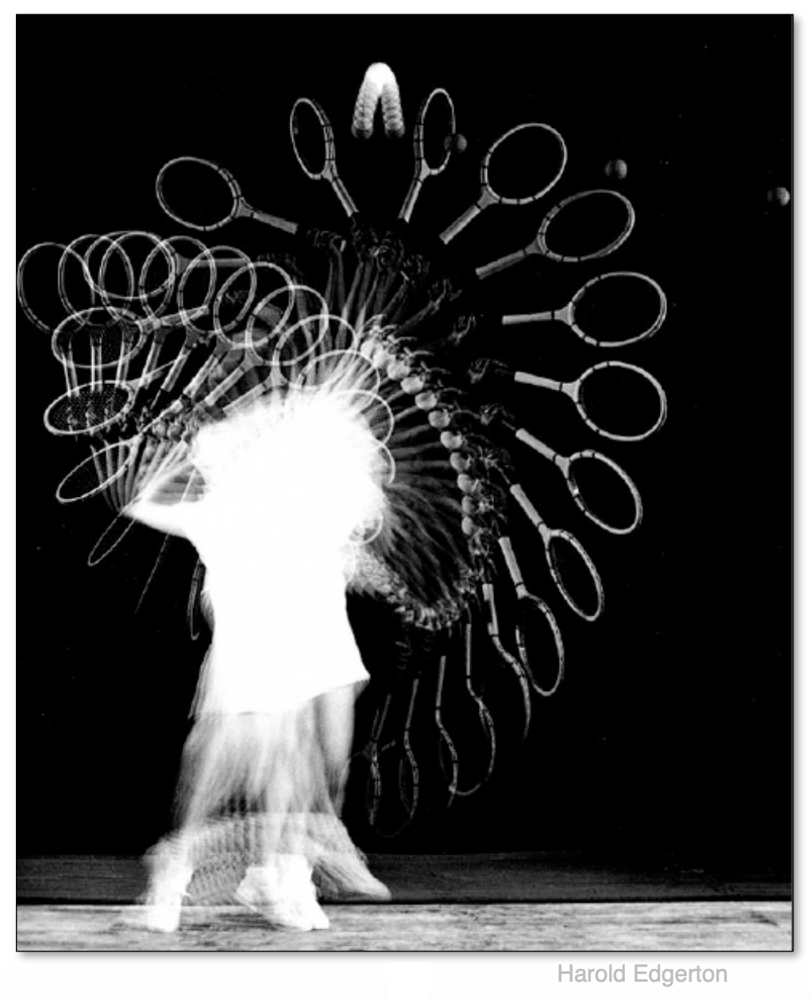
            

- **长曝光摄影**(long-exposure photography)

    ???+ example "例子"

        === "例1"

            

                
            

        === "例2"

            

                
            

        === "例3"

            

                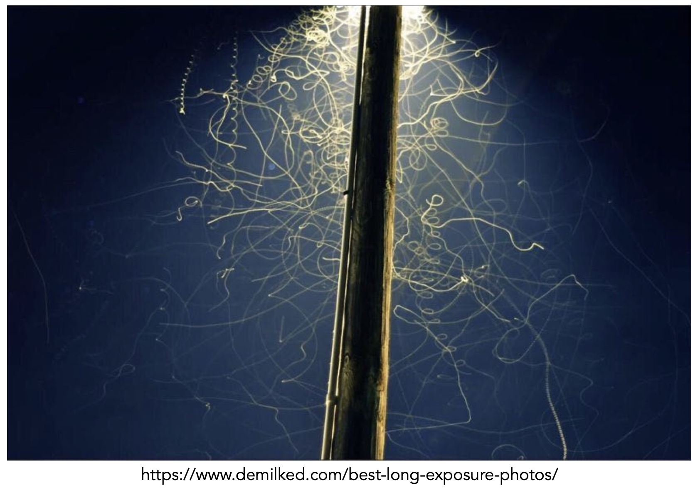
            

## Thin Lens Approximation

对于真实世界的透镜，

- 设计高度复杂（这是 iPhone 6s 的后置摄像头，现在的手机镜头还要复杂很多）

    

        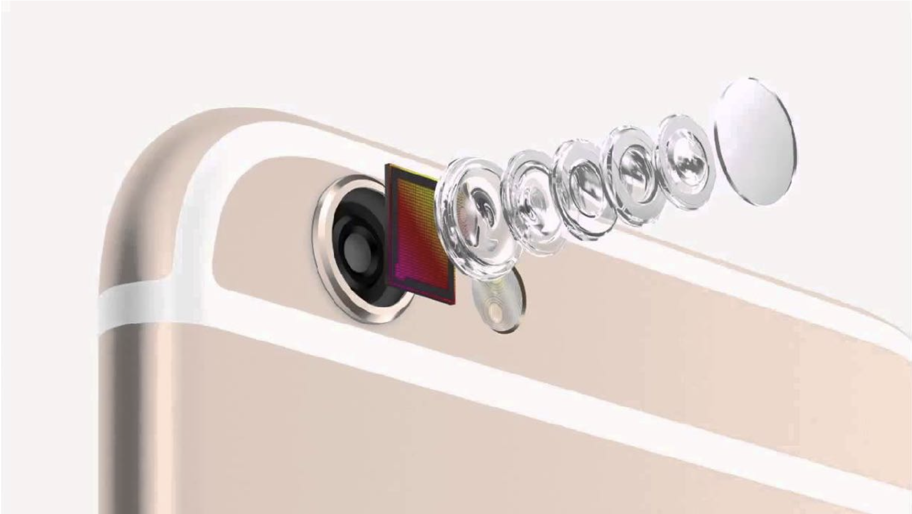
    

- 并不理想，会出现**像差**(aberration)的问题
    - 下图展示了实际平凸透镜（球面形状），发现它无法将所有光汇聚于一点

    

        
    

而在理想情况下，**薄透镜**(thin lens)能把光汇聚于一点，该点就是**焦点**(focal point)。

    

我们对这种理想透镜做以下假设：

- 所有经过透镜的平行光会穿过透镜焦点
- 所有来自焦点的光经透镜后会平行射出
- 可以任意改变焦距（实际上也确实可以）

薄透镜方程为：
$$
\dfrac{1}{f} = \dfrac{1}{z_i} + \dfrac{1}{z_o}
$$

其中 $f, z_i, z_o$ 分别是焦距、**像距**和**物距**，如下面的光路图所示：

    

图中三条光线从上往下分别是**平行光线**(parallel ray)、**主光线**(chief ray)（这是假想的光线，研究成像时不考虑）和**焦点光线**(focal ray)；而左右两侧的箭头分别表示**物体**(object)和**像**(image)。

那么 $z_i, z_o$ 之间有什么关系呢？通过上述光路图，我们可以找到两对相似三角形，从而联立方程：

    

通过计算，我们推导出了前面给出的方程：

    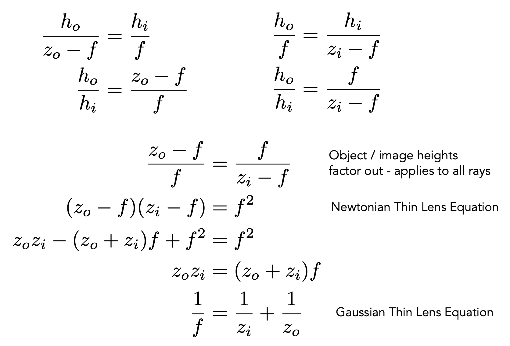

???+ example "Demo"

    

        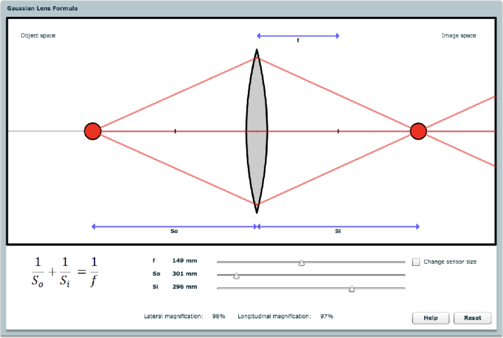
    

    链接：<http://graphics.stanford.edu/courses/cs178-10/applets/gaussian.html>

    >注：这个 demo 是使用 Flash 做的，现在没有主流浏览器支持了（2020 年停止支持的，GAMS101 开课的时候应该还是支持的）。

## Defocus Blur

如下面光路图所示，如果传感器的位置并没有和物体成像位置贴合，这个成像点在传感器上就形成一块模糊的区域，叫做**弥散圈**(circle of confusion, CoC)。

    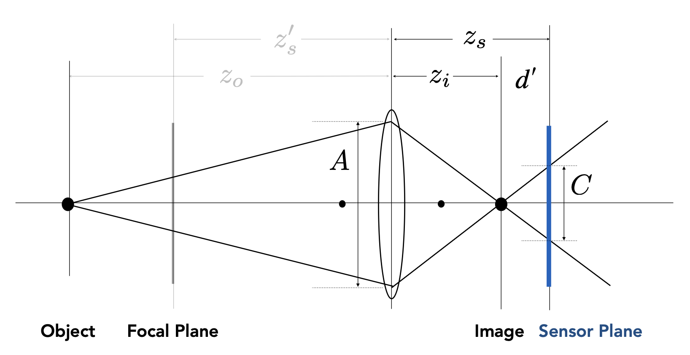

弥散圈的大小和**光圈**大小成正比。仍然利用相似三角形，可以得到：
$$
\dfrac{C}{A} = \dfrac{d'}{z_i} = \dfrac{|z_s - z_i|}{z_i}
$$

???+ example "例子"

    

        
    

---
回过头来看 f 数——前面我们只给出一个非正式的理解，而它的实际定义是“**焦距除以光圈直径**”。

- 常见的 f 数：1.4, 2, 2.8, 4.0, 5.6, 8, 11, 16, 22, 32
- 假如 f 数为 2，那么有时我们会写作 f/2，这能反映绝对光圈直径（A）能通过焦距（f）除以相对光圈（N）计算出来

???+ example "例子"

    

        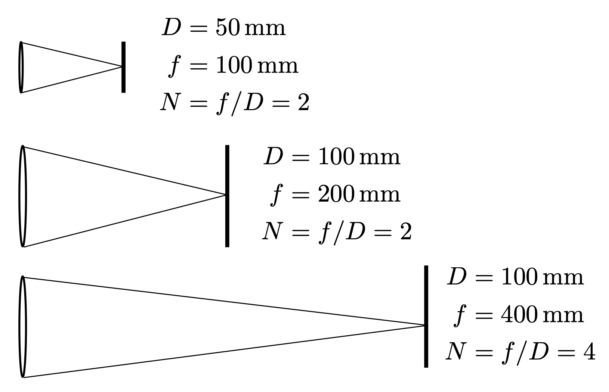
    

所以弥散圈的大小和 f 数成反比，即 $C = A \dfrac{|z_s - z_i|}{z_i} = \dfrac{f}{N} \dfrac{z_s - z_i}{z_i}$

???+ example "例子"

    

        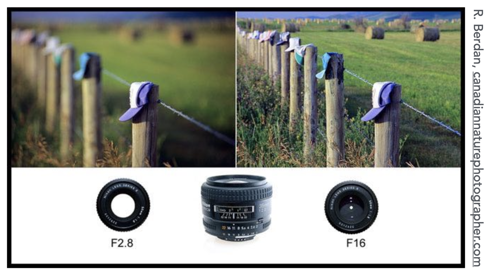
    

## Ray Tracing Ideal Thin Lenses

我们可以将透镜聚焦应用于**渲染**中。

???+ example "例子"

    

        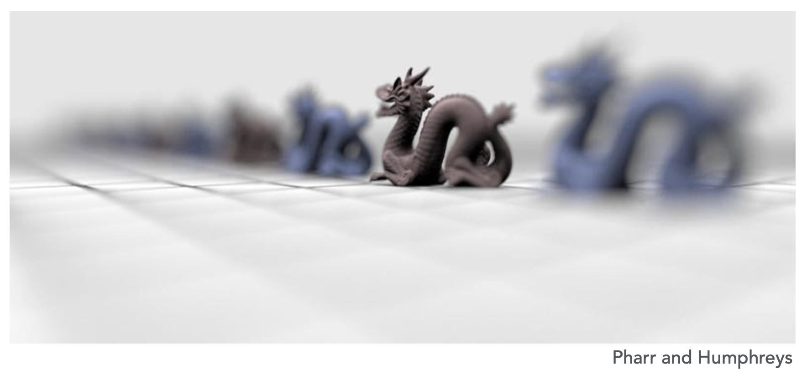
    

散焦模糊的光线追踪（薄透镜）：

    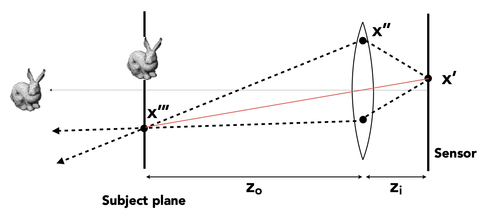

- （一种可能的）设置如下：
    - 选择传感器大小，透镜焦距和光圈大小
    - 选择感兴趣的对象深度 $z_o$
        - 通过薄透镜方程计算相应的传感器深度 $z_i$

- 渲染：
    - 对传感器（实际上是胶片）上的每个像素 x'
    - 在透镜平面上随机采样 x''
    - 穿过透镜的光线会击中 x'''，因为 x''' 在焦点上，考虑设置一条（和 x' 连接的）虚拟光线
    - 评估 x'' -> x''' 的辐射率

## Depth of Field

我们将**弥散圆**设定为图像平面上在特定观测条件下仍显示清晰(sharp)的最大允许模糊点。

    

**景深**(depth of field)的示意图如下：

    

景深的计算（依旧利用相似三角形，看起来繁琐，但算起来还是容易的）：

    

???+ example "Demo"

    

        
    

    链接：<http://graphics.stanford.edu/courses/cs178-10/applets/dof.html>

## Light Fields

>注：有时读者会看到 Lumigraph 一词，它的意思和 Light Field 是一样的。

假如有一人端坐在房间内并面对窗户，ta 可能会看到以下画面：

    

假如将一块和 ta 看到的画面几乎一模一样的屏幕放在 ta 的眼前，对 ta 来说，看到的画面几乎和原来一模一样。

    

下面将以数学形式来描述这个现象——我们可以用一个**全光函数**(plenoptic function)来描述我们所能看见的全部东西。让我们从一个静止的人开始，尝试参数化他所能看到的一切。

- 灰度快照：（某一方向上 $(\theta, \varphi)$）光强为 $P(\theta, \varphi)$

    

        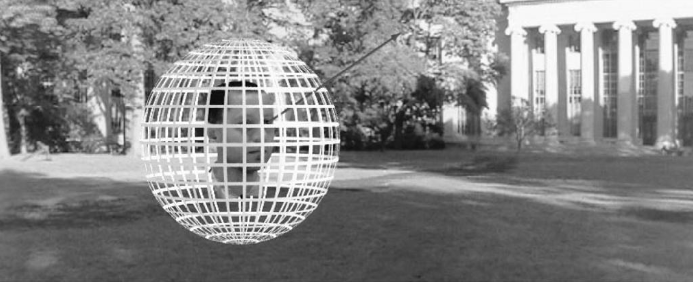
    

    - 单个视角
    - 单个时间
    - 可见光谱的波长均值（因而呈现的是灰色）
    - 也可以记作 $P(x, y)$，但实际应用中球坐标更好些
- 彩色快照：光强为 $P(\theta, \varphi, \lambda)$

    

        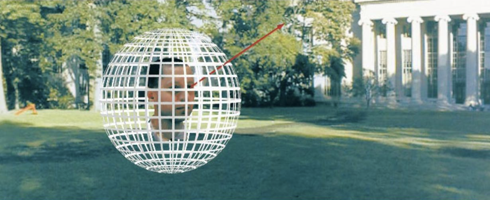
    

    - 单个视角
    - 单个时间
    - 但是关于波长的函数（于是有了颜色）
- 电影：光强为 $P(\theta, \varphi, \lambda, t)$

    

        
    

    - 单个视角
    - 考虑时间变化
    - 关于波长的函数）
- 全息电影：光强为 $P(\theta, \varphi, \lambda, t, V_x, V_y, V_z)$

    

        
    

    - **任意**视角
    - 考虑时间变化
    - 关于波长的函数

综上，完整的全光函数公式就是 $P(\theta, \varphi, \lambda, t, V_x, V_y, V_z)$。

- 它能重构任何视角、任何时刻、任何位置、任何波长看到的东西
- 并且包含了每张照片、每部影片、每个人所看到的东西——它能完全捕捉视觉下的现实！

对全息函数采样（顶层视角，以二维形式呈现）：

    

图中的一个个箭头代表的是光线，作为光场的组成部分（因此光场实际上是全光函数的一部分）。为方便讨论，我们不考虑每个箭头对应的时间和颜色，因此**光场**(light fields)就是任何一个位置上，沿任意方向上光的强度。因此表示这些箭头的方式有：

- 5D 函数（3D 位置 + 2D 方向）：$P(\theta, \varphi, V_x, V_y, V_z)$

    

        
    

- 4D 函数（2D 位置 + 2D 方向，且要求非色散介质(non-dispersive medium)）：两点确定一条直线

    

        
    

对于一个物体，我们不需要知道它具体长什么形状（可看作一个黑盒），只要知道记录在包裹它的包围盒表面上的光场信息，就能够绘制出观察到这个物体的画面了。

    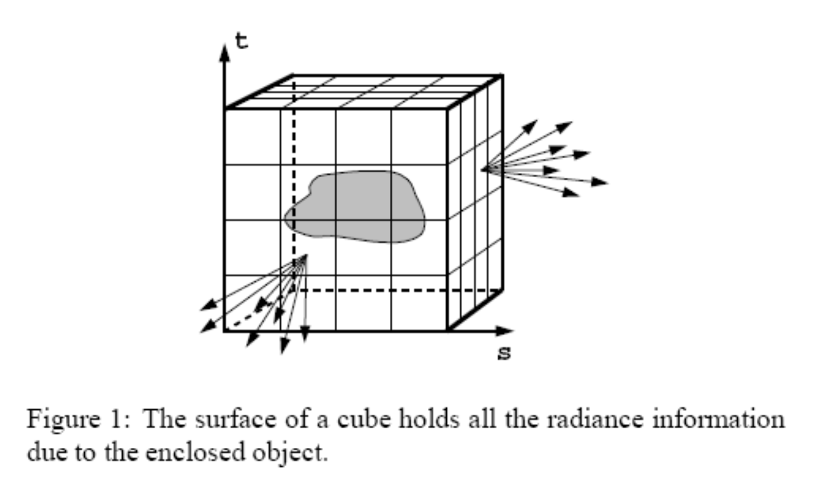

    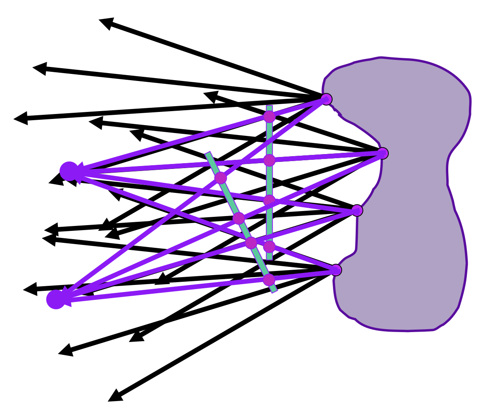
    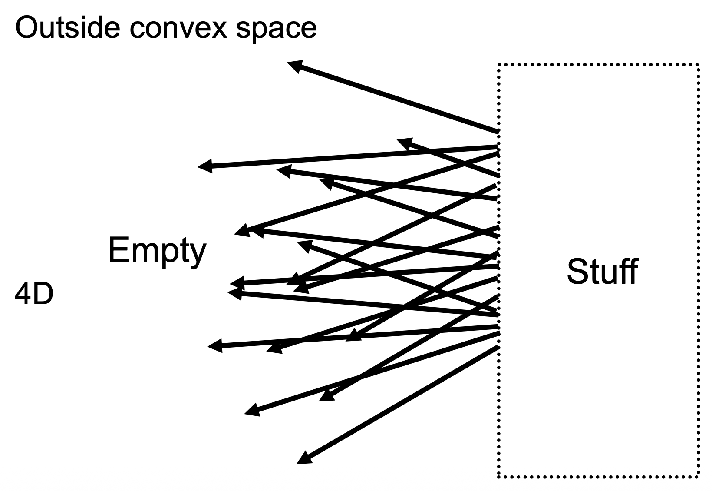

前面提到了可以用两点确定一条光线。同理，对于物体上发出的众多光线，我们可以用**两个平面参数化**(2 planes parameterization)的方式来确定这些光线。我们一般用 $(s, t)$ 和 $(u, v)$ 分别指代远离物体和靠近物体两个平面上的坐标。

    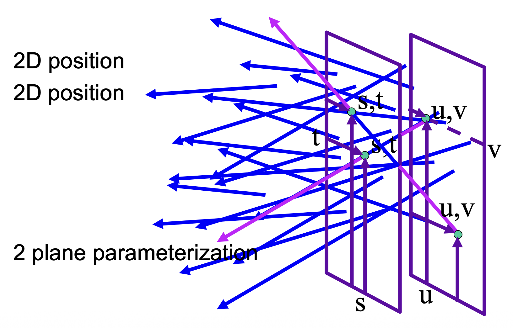

保持 $(s, t)$ 不动并移动 $(u, v)$，我们就能得到（某一视角下）关于物体的图像了。

    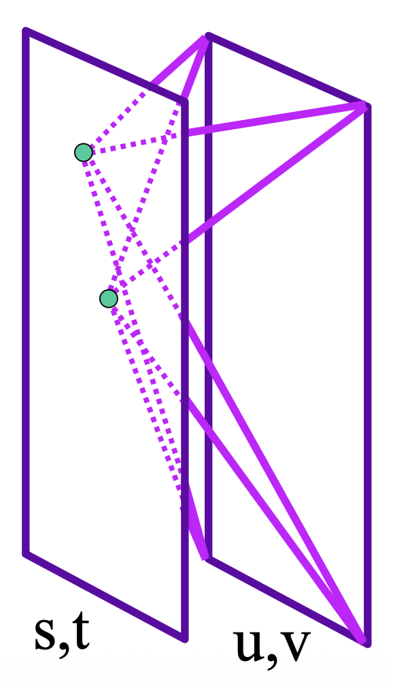

???+ example "例子"

    

        
    

    上述图像可以用以下这个相机阵列拍摄（~~经费爆炸~~）。所有相机对着同一场景拍摄，但每台相机各自对应不同的观测角度，和我们对光场的理解类似。

    

        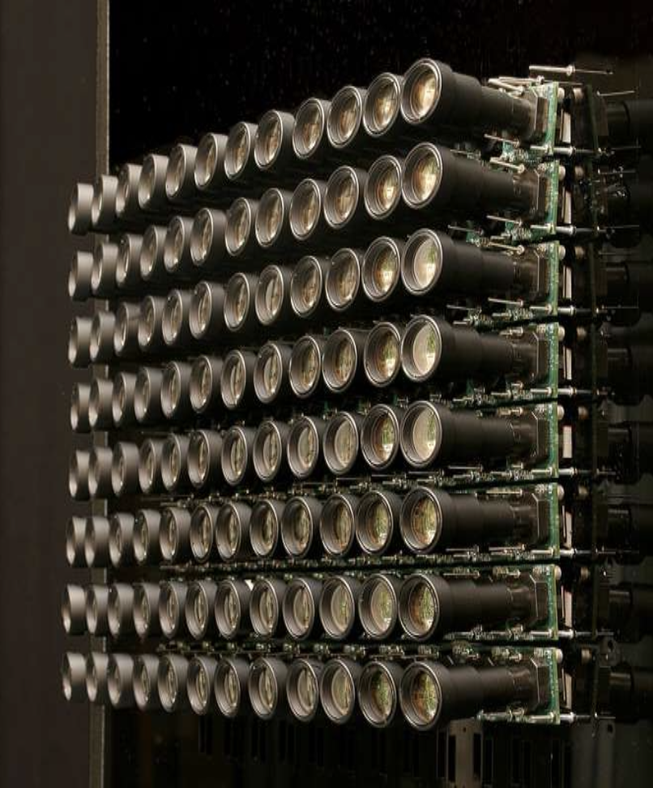
    

    这种相机阵列属于一种**透镜阵列**(lenslets)，用于捕捉空间上空间多路(spatially-multiplexed)光场。苍蝇的复眼也是一种透镜阵列。

    

        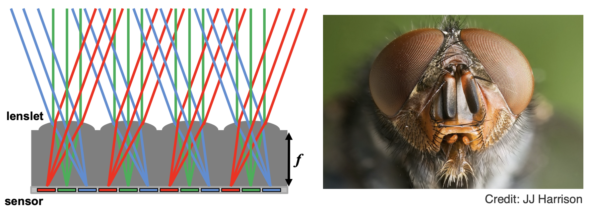
    

    需要注意的是，透镜阵列需要做好**空间分辨率**和**角分辨率**的权衡，因为两者属于此消彼长的关系：空间分辨率越高，角分辨率越低，反之亦然。

### Light Field Camera

吴义仁(Ren Ng)教授发明了**光场相机**(light field camera)，并且创办了制造光场相机的公司 Lytro。光场相机具有以下特点：

- 微透镜设计
- 最重要的功能——**计算重对焦**(computational refocus)，可以做到在拍好照片后“虚拟地”调整焦距和光圈大小，就像重新拍了一张照片一样

    

???+ example "例子"

    === "用光场相机拍的全糊照片"

        

            
        

    === "重对焦 1"

        

            
        

    === "重对焦 2"

        

            
        

    === "重对焦 3"

        

            
        

    === "重对焦 4"

        

            
        

    === "重对焦 5"

        

            
        

{ align=right width=20% }

理解光场相机：

- 从原来记录一个像素到记录一“块”像素（对应一个**微透镜**(microlens)），记录不同方向的光
    - 一块像素的平均值就是普通相机的拍摄结果
- 凑近看用光场相机拍摄的照片：

    

        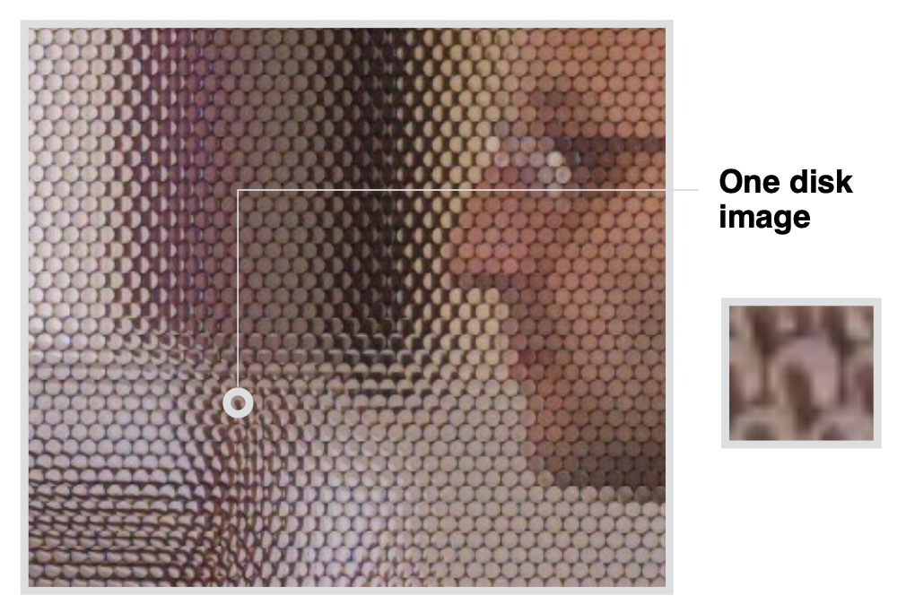
    

那么如何从光场照片中得到常规照片呢？

- 一种简单的情况：总是选择每个像素块中最底下的像素
- 或者选择中间/顶上的像素
- 本质上就是“移动相机”

计算重对焦也是类似的原理：虚拟地改变焦距，相应地选取重对焦光线的方向。

总而言之，之所以光场相机能够实现这样的功能，是因为光场能够记录所有的画面信息。

!!! bug "光场相机的问题"

    - 空间分辨率不足：由于需要同时对空间和方向采样，这意味着一个像素块想要采集更多方向信息，需要使用更大的微透镜，但总体大小有限，那么微透镜数量就会减少，空间分辨率也随之降低
    - 成本高昂：微透镜的设计很复杂
    - CG 是一门 trade-off 的学科

