# Color and Perception

## Physical Basis of Color

光的基本组成：

    

- 牛顿用棱镜将太阳光分解为各种颜色的光
- 但分解出来的光不能再通过棱镜进一步分解

---
**可见光谱**(visible spectrum of light)（涉及到电磁辐射(electromagnetic radiation)）

- 以下是不同频率（或波长）下的振荡

    

        
    

### Spectral Power Distribution

在数学上，我们用**谱功率密度**(spectral power distribution, **SPD**)来测量光。

- 它表示了各波长下的光量(amount of light)
- 单位：
    - 辐射度量单元 / 纳米（比如 watts/nm）
    - 也可以不用单位
- 在绝对单位不重要时，通常使用与最大波长成比例的“相对单位”，用于跨波长的比较

日光下，不同物体的 SPD 各不相同：

    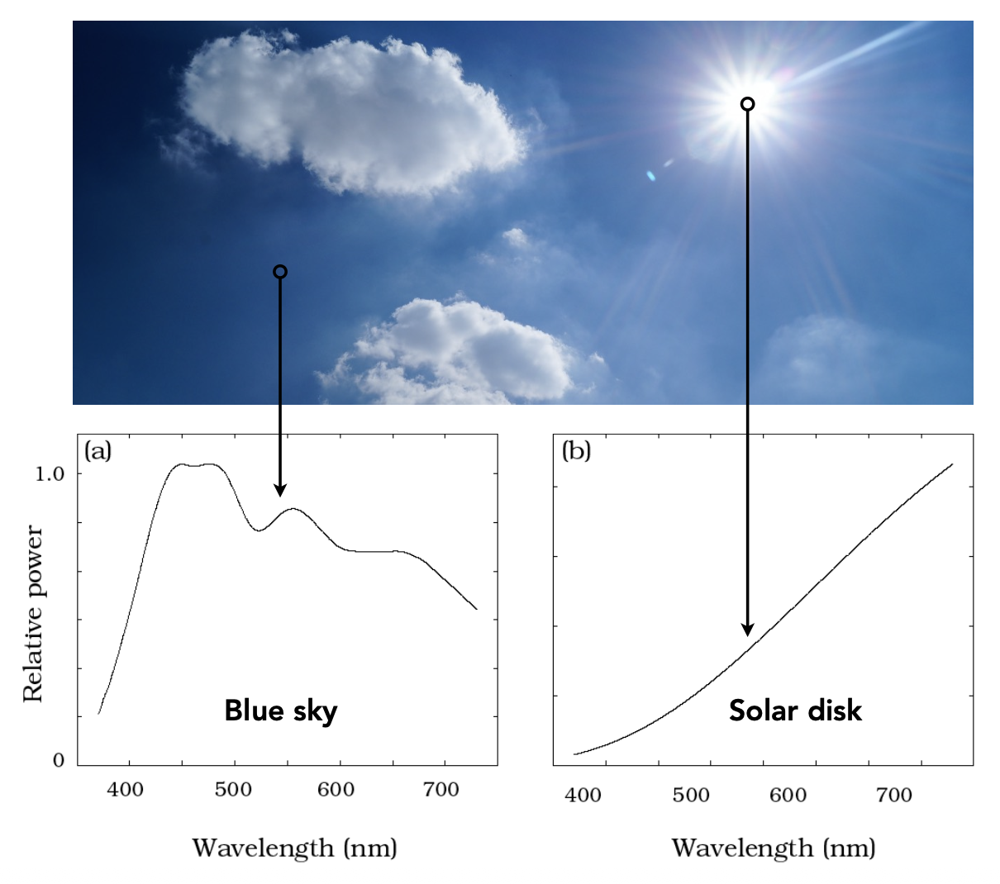

不同光源下 SPD：

    

SPD 的**线性**(linearity)性质：

    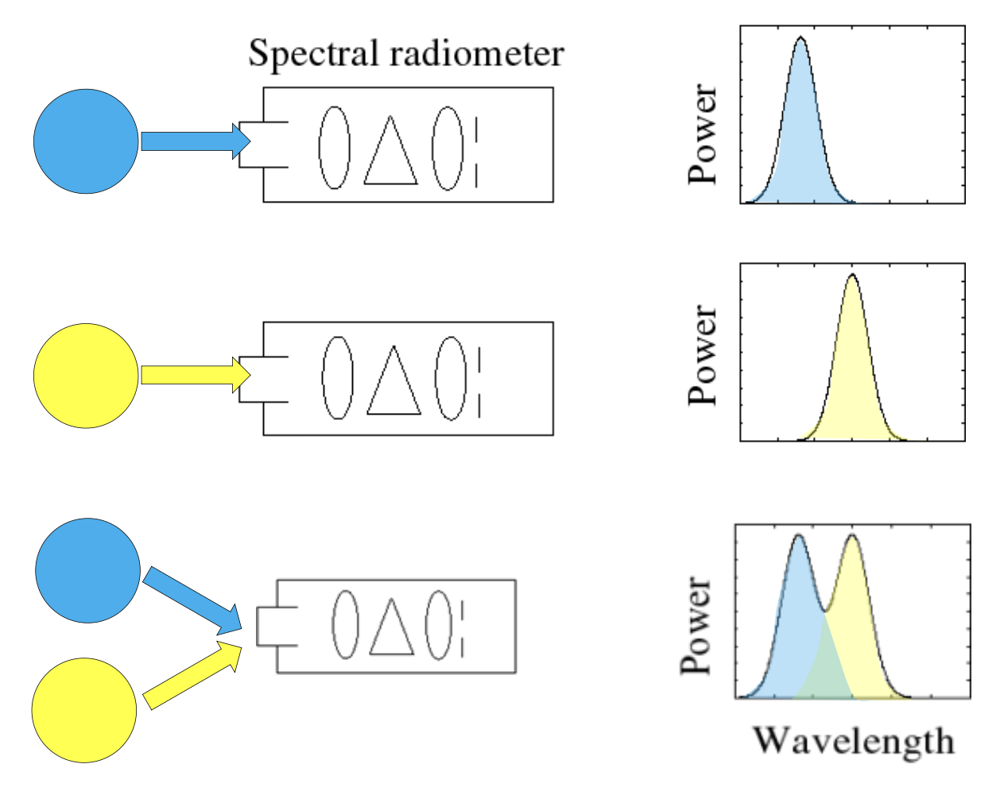

---
颜色是什么？

- 颜色是**人类感知**(human perception)的现象，不属于光的通用属性
- 光的不同波长**不是**“颜色”

## Biological Basis of Color

人眼的解剖学构造：

    

**视网膜感光细胞**(retina photoreceptor cells)

    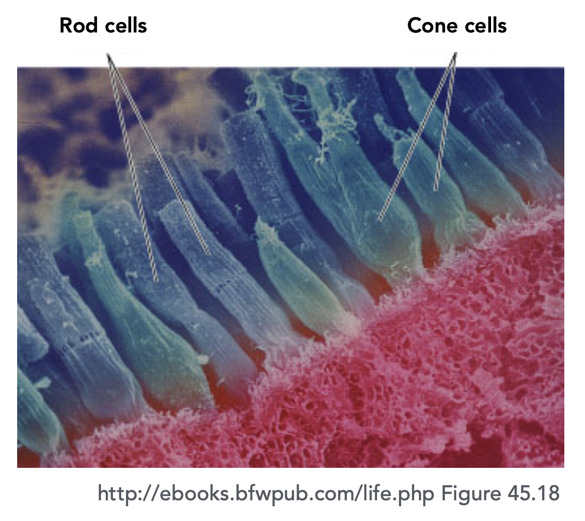

- **视杆细胞**(rods)：在极低光照条件下（如昏暗的月光下）发挥主要作用
    - 人眼有大约 120M 的视杆细胞
    - 只接收**灰度**(shade of gray)，不感知颜色

- **视锥细胞**(cones)：一般光照条件（“明视(photopic)”）下的主要感光细胞
    - 人眼有大约 6-7M 的视杆细胞
    - 有三种类型的视锥细胞，各自具有不同的光谱敏感度，分别是 **S, M 和 L**（分别观测短、中、长波长的光谱）

        

            
        

        - 对于不同的人，这三类细胞的分布差异还是很大的

            

                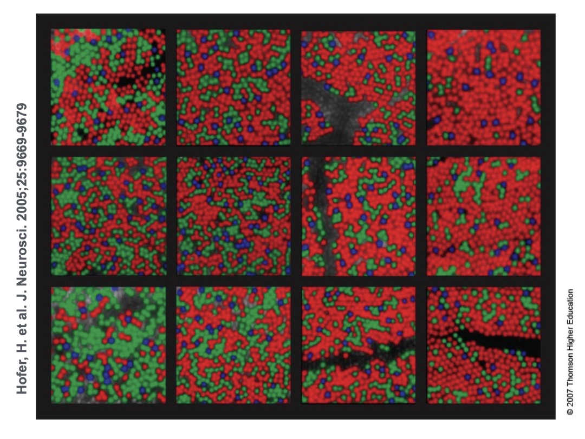
            

    - 提供对**颜色**的感知
  

## Tristimulus Theory of Color

现在我们有三种颜色检测器（S, M 和 L 视锥细胞），每个细胞对应不同的光谱响应曲线：

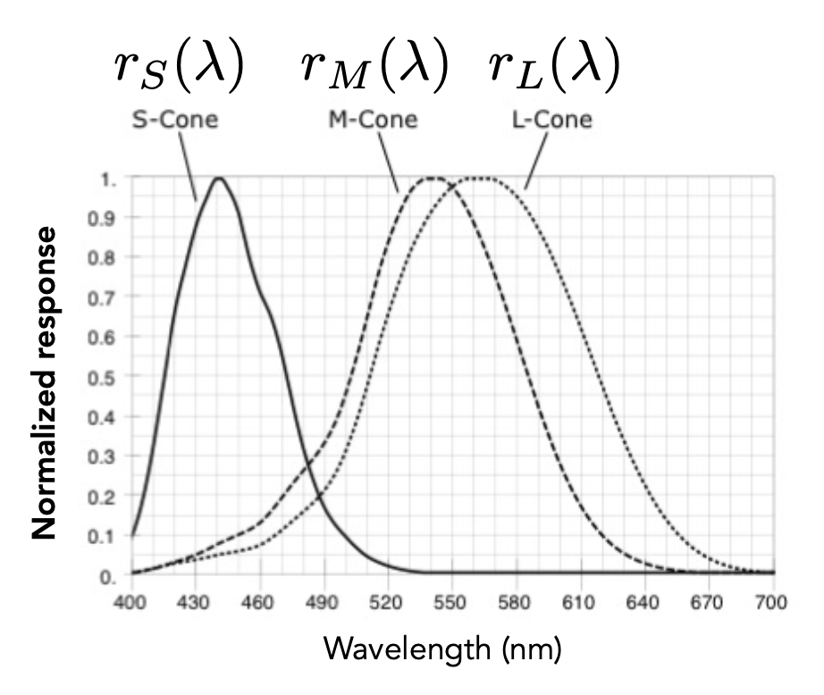{ align=right width=40% }

$$
\begin{gathered}\mathrm{S}=\int r_{S}(\lambda)s(\lambda)d\lambda\\\mathrm{M}=\int r_M(\lambda)s(\lambda)d\lambda\\\mathrm{I}=\int r_L(\lambda)s(\lambda)d\lambda\end{gathered}
$$

人类的视觉系统：

- 人眼并不测量，大脑也不接收关于每种光波长的信息。
- 相反，眼睛“看到”的仅仅是**三种反应值（S、M、L）**，而这正是大脑所能获取的全部信息

    

## Metamerism

**同色异谱**(metamer)是指两种不同的光谱（$\infty$-维）投射到相同的（S、M、L）（3维）响应上，对人类而言这两种光谱呈现的就是相同的颜色。

同色异谱的存在对颜色复现而言至关重要：

- 复现颜色时无需复现现实世界场景下的完整光谱
- 一个同色异谱可以在仅使用三种颜色像素的显示器上再现真实世界场景的感知色彩

???+ example "例子"

    以下 4 个光谱均属于一个同色异谱，对人眼而言它们看上去是同一颜色的。

    

        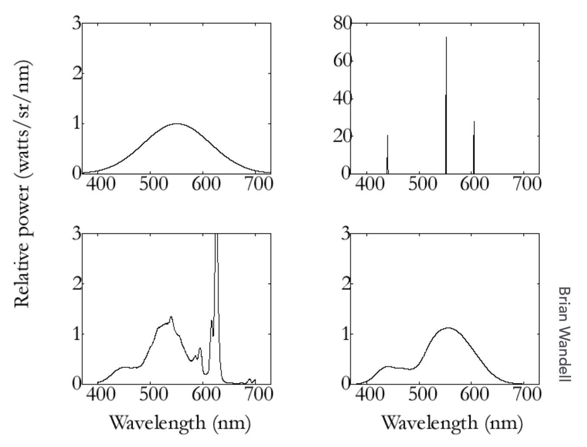
    

同色异谱也是颜色匹配背后的理论。

    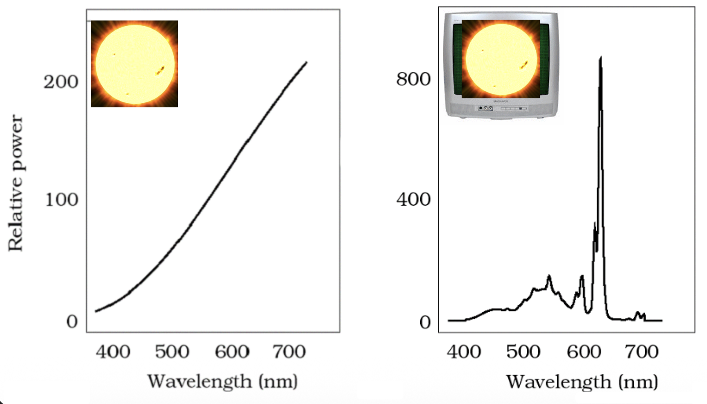

## Color Reproduction / Matching

### Additive Color

{ align=right width=20% }

- 给定一组主光源，每个光源都有其自身的光谱分布（例如 R、G、B 显示像素）：$s_R(\lambda), s_G(\lambda), s_B(\lambda)$
- 调整这些光源的亮度并相加

    $$
    R s_R(\lambda) + G s_G(\lambda) + B s_B(\lambda)
    $$

- 现在颜色可用标量值 $R, G, B$ 表示了

**加色**(additive color)匹配实验：

    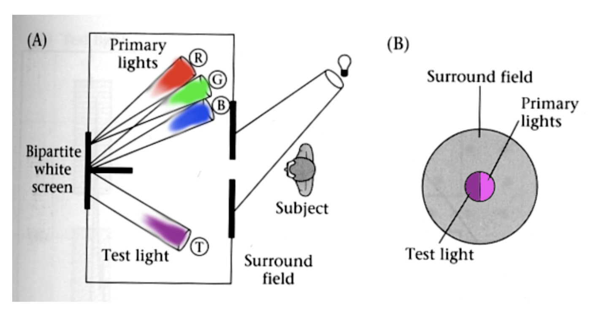

=== "实验1"

    === "初始状态"

        

            
        

    === "Stage 1"

        

            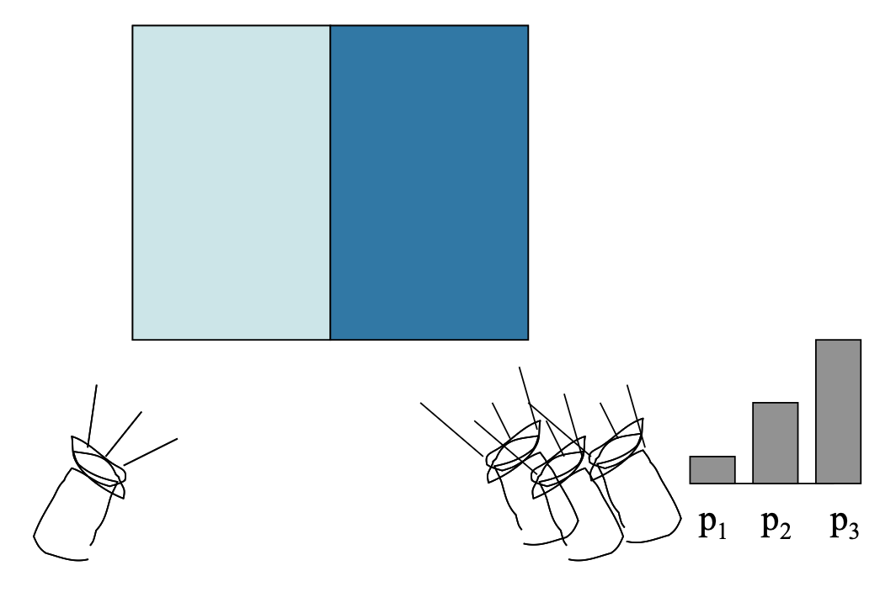
        

    === "Stage 2"

        

            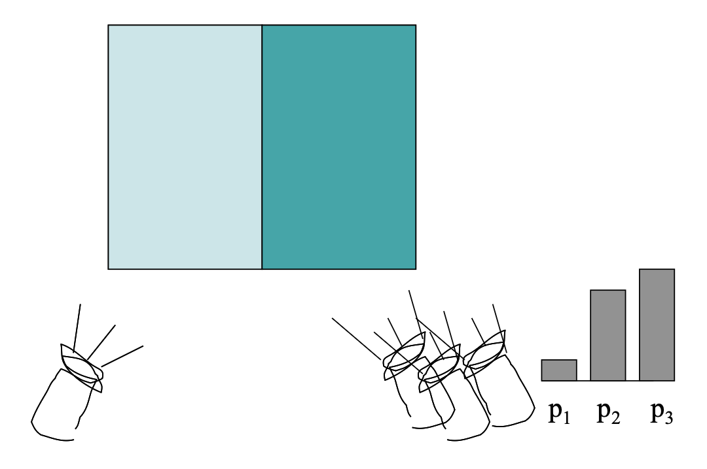
        

    === "Stage 3"

        

            
        

=== "实验2"

    === "初始状态"

        

            
        

    === "Stage 1"

        

            
        

    === "Stage 2"

        

            
        

    === "Stage 3"

        

            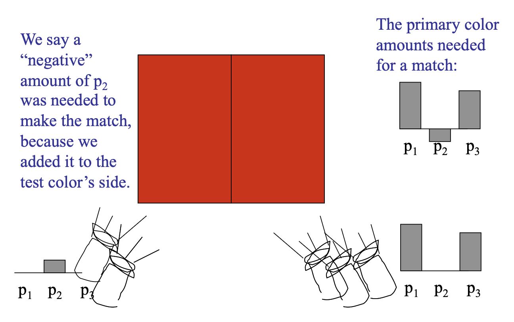
        

        有时，我们无论怎么调整主光源，都没法调到和测试光源一样的颜色。这个时候可以考虑向测试光源加色，这就相当于测试光源不变，给主光源减色。

### CIE RGB

**CIE RGB** 的颜色匹配实验和加色匹配实验的配置相同，但主光源和测试光源都是**单色光**(monochromatic light)（单波长）。

    

以下图表展示了需要混合多少 CIE RGB 原色光才能与 x 轴上给定波长的单色光相匹配。

    

对于任何光谱 $s$，感知颜色通过以下公式匹配，以缩放 CIE RGB 原色：

$$
\begin{aligned}
R_{\text{CIE RGB}} = \int_\lambda s(\lambda) \bar{r}(\lambda) d \lambda \\
G_{\text{CIE RGB}} = \int_\lambda s(\lambda) \bar{g}(\lambda) d \lambda \\
B_{\text{CIE RGB}} = \int_\lambda s(\lambda) \bar{b}(\lambda) d \lambda
\end{aligned}
$$

## Color Spaces

### Standard Color Spaces

**标准 RGB**（**sRGB**）：

- 显示器常用的 RGB 标准
- 其他色彩设备通过校准来模拟该显示器
- 目前已被广泛采用
- [**色域**](#gamut)(gamut)受限（稍后马上介绍）

### CIE XYZ

**CIE XYZ** 是一种更通用的色彩空间。

{ align=right width=30% }

- 包含了一个假想的标准颜色原色组 X, Y, Z
    - 使用这些匹配函数无法得到原色
    - Y 是**亮度**(luminance)（不考虑颜色的明暗程度）
- 设计目的
    - 匹配函数严格为正
    - 扩展到所有可见的颜色

而 CIE XYZ 的**色度**(chromaticity) 记作 $x, y, z$，定义为：

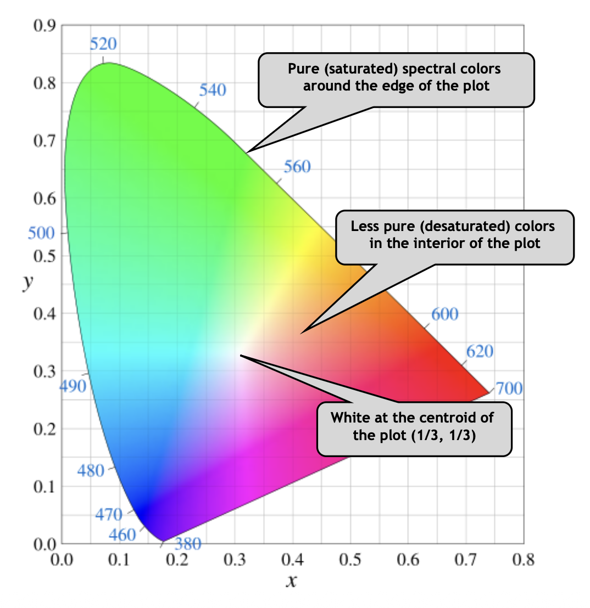{ align=right width=30% }

$$
\begin{aligned}
x = \dfrac{X}{X + Y + Z} \\
y = \dfrac{Y}{X + Y + Z} \\
z = \dfrac{Z}{X + Y + Z} \\
\end{aligned}
$$

不难发现 $x + y + z = 1$，所以只需知道其中两个值，第三个值自然就能得出。通常我们会选择 $x, y$，这样就能用坐标 $(x, y)$ 表示特定的亮度 $Y$ 了，如右图所示（该图被称为**色度图**(chromaticity diagram)）。

- 图中的曲线边界称为**光谱轨迹**(spectral locus)，对应到单色光（曲线上每个点表示单波长的纯色(pure color)）
- 而曲线内上的任何颜色都不是纯的，即混合的(mixed)
    - 白色是最不纯的颜色

### Gamut

**色域**(gamut)是由一组原色产生的色彩范围。不同的色彩空间代表不同的颜色范围，因此它们拥有不同的色域，即在色度图上覆盖了不同的区域。

    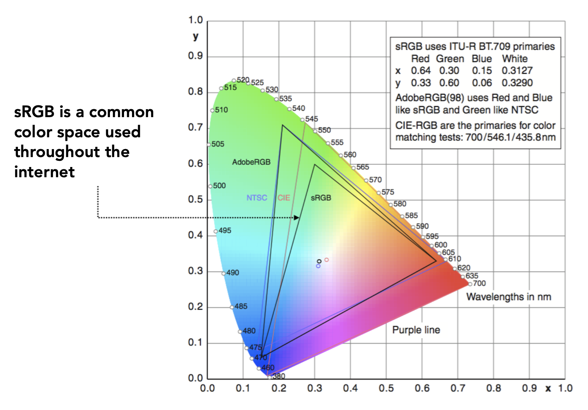

## Perceptually Organized Color Spaces

### HSV Color Space

关于 **HSV 色彩空间**：

    

- 一般用一个圆柱表示，轴对应于色彩的艺术特性
- 广泛应用于选色器(color picker)中
- 色彩感知维度：
    - **色调**(hue, H)：颜色的“种类”，不考虑属性
        - 色度学(colorimetric)相关量：主波长
        - 艺术家视角：所选颜料颜色
    - **饱和度**(saturation, S)：色彩丰富度
        - 色度学关联：纯度(purity)
        - 艺术家视角：彩色颜料管中颜料的占比
    - **亮度**(value, V)：总光量
        - 色度学相关：亮度
        - 艺术家视角：色调更浅，阴影更深

### CIELAB Space

{ align=right width=30% }

CIELAB 色彩空间（又称 L\*a\*b\*）是一种常用的色彩空间，旨在实现感知上的均匀性。

- L\*：亮度
- a\* 和 b\*：**互补色**(opponent color)对
    - a\*：红-绿
    - b\*：蓝-黄

互补色理论：CIE LAB 色彩空间的维度有良好的神经学基础。

- 大脑似乎一开始就通过三个轴来编码颜色：白-黑、红-绿、黄-蓝
- 其中白-黑轴代表亮度，其他两个轴则决定色调和饱和度
- 一项证据：你可以有浅绿色、深绿色、黄绿色或蓝绿色，但不能有偏红的绿色（这根本说不通），所以红色是绿色的互补色
- 另一项证据：**余像现象**(afterimages)（见下面例子）

???+ example "例子"

    === "例1"

        === "原图像（五星红旗的互补色，盯着中间白点看 10s 以上后再切换）"

            

                
            

        === "点击切换（眼睛短暂能看到粉红色的五星红旗）"

            

                
            

    === "例2"

        === "原图像（忍者神龟的互补色，盯着中间白点看 10s 以上后再切换）"

            

                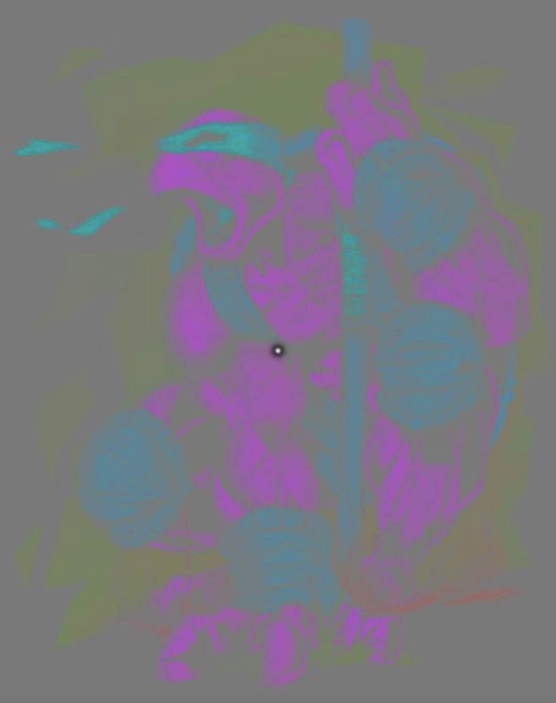
            

        === "点击切换（眼睛短暂能看到绿色的忍者神龟）"

            

                
            

### Everything is Relative

人眼对颜色的感知都是相对的，因而常常会出现一些错觉，即便对于实际上相同的颜色，常常会受周围物体颜色的影响而感知到不同的颜色。以下是一些经典的例子：

???+ example "例子"

    === "例1"

        === "原图"

            看起来 A 和 B 的颜色不同，感觉 A 的颜色更深。 

            

                
            

        === "Stage 1"

            

                
            

        === "Stage 2"

            

                
            

        === "Stage 3"

            

                
            

        === "Stage 4"

            

                
            

        === "Stage 5"

            遮住所有物体后，发现 A 和 B 的颜色是相同的。

            

                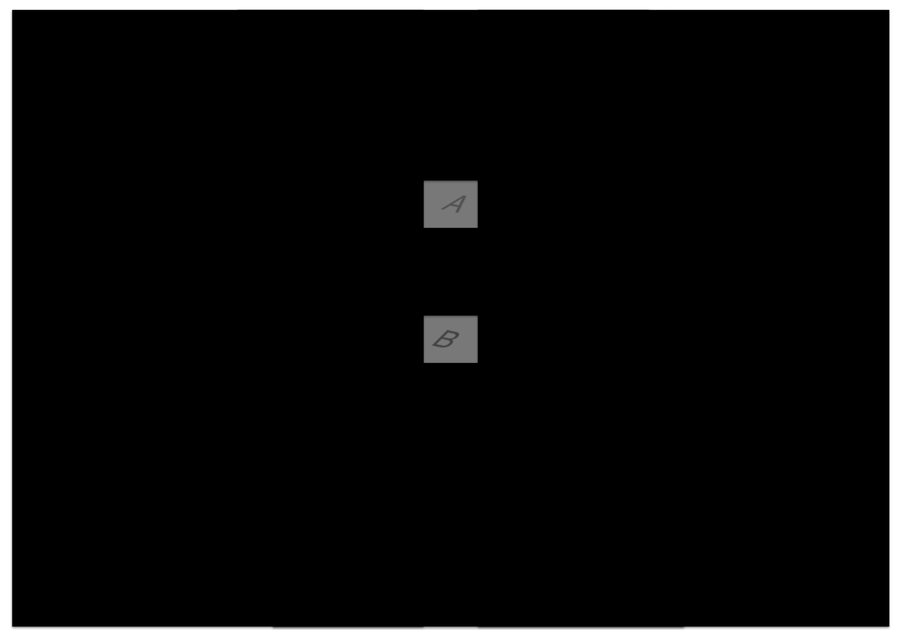
            

    === "例2"

        === "原图"

            同样，读者会认为右侧的叉颜色更深些

            

                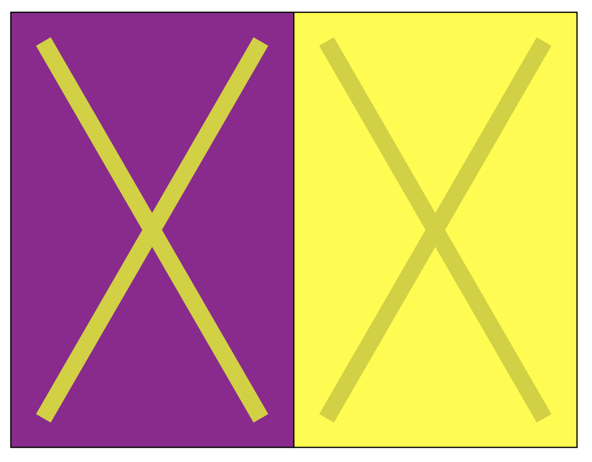
            

        === "加一条线"

            但用和这两个叉相同颜色的线连起来后，发现二者颜色相同。

            

                
            

### CMYK: A Subtractive Color Space

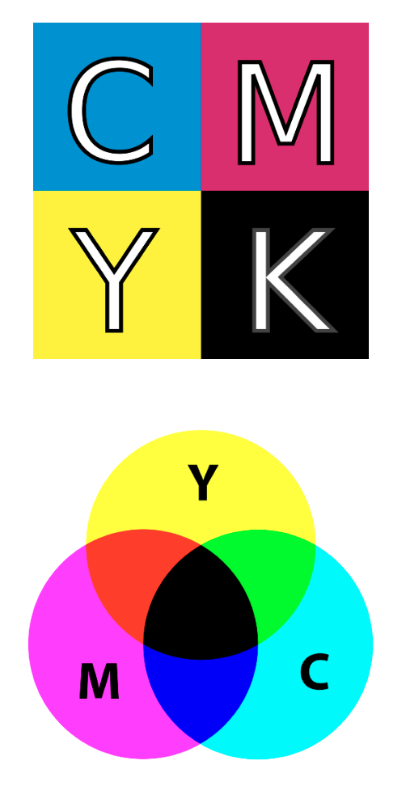{ align=right width=30% }

- CMYK 是一种**减色**(subtractive color)模型，也就是说颜色混合得越多，看起来就更暗
- CMYK 分别对应**青**(cyan)、**品红**(magenta)、**黄**(yellow)和**黑**(key)
- 广泛用于打印
    - 如右图所示，明明黑色可通过三种颜色混合得到，但还是单独设置一个黑色的原因是黑色是打印常用的颜色，为节省成本，减省颜料的使用，于是发明了黑色