# Animation

正如其字面意思，“**动画**(animation)”的意思是“让东西活起来(bring things to life)”。

- 审美(aesthetic)问题往往优先于技术问题
- 从建模(modeling)角度看，动画将场景模型表示为一个关于时间的函数
- 输出：一系列按顺序观看时能产生动态感(a sense of motion)的图像
    - 电影：24 fps
    - 视频：（一般来说）30 fps
    - 虚拟世界（电子游戏）：90 fps

## History

- 最早的动画

    

        
    

- 历史上的动画

    

        
    

- 第一部电影
    - 原本电影是作为科学研究的工具，而非用于娱乐目的
    - 电影是加速动画发展的关键技术

    

        
    

- 首部手绘长篇(feature-length)（> 40 min）动画

    

        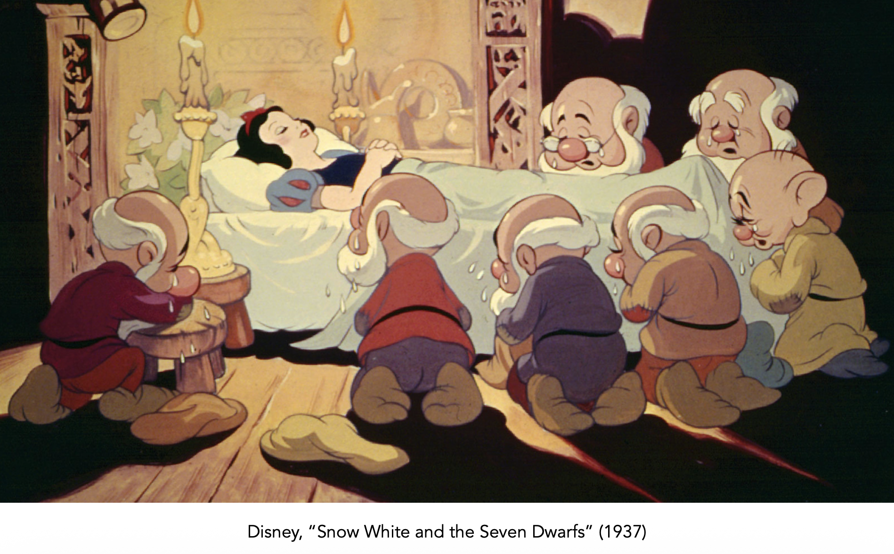
    

- 第一个由数码计算机生成的动画

    

        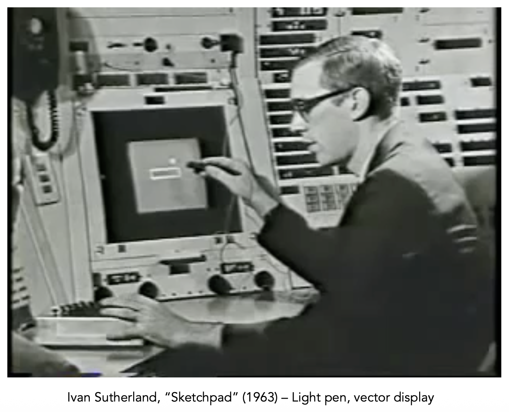
    

- 早期的计算机动画

    

        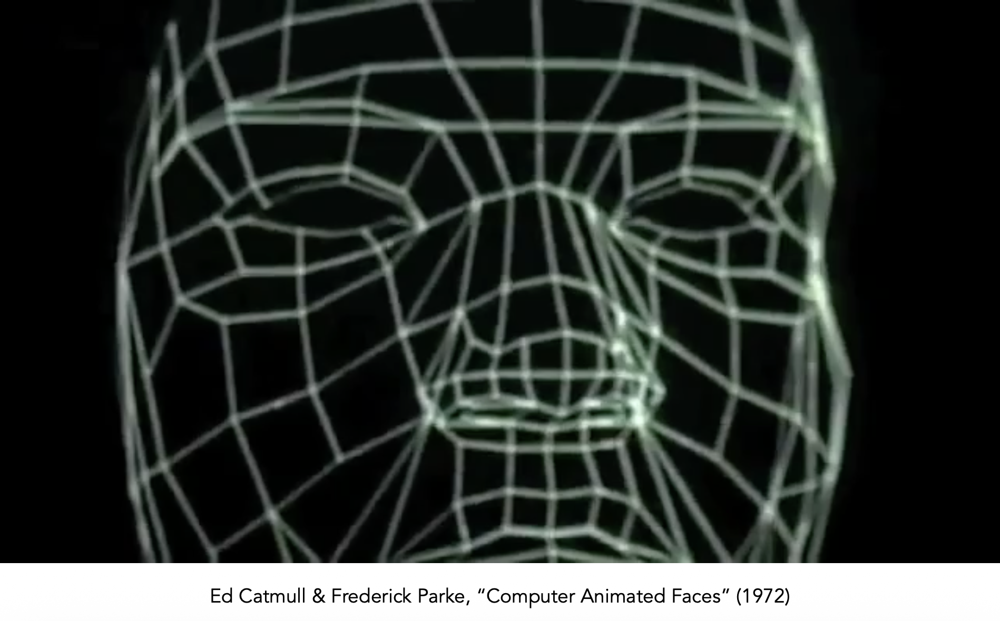
    

- 数码恐龙

    

        
    

- 第一部完全由 CG 技术制作的动画

    

        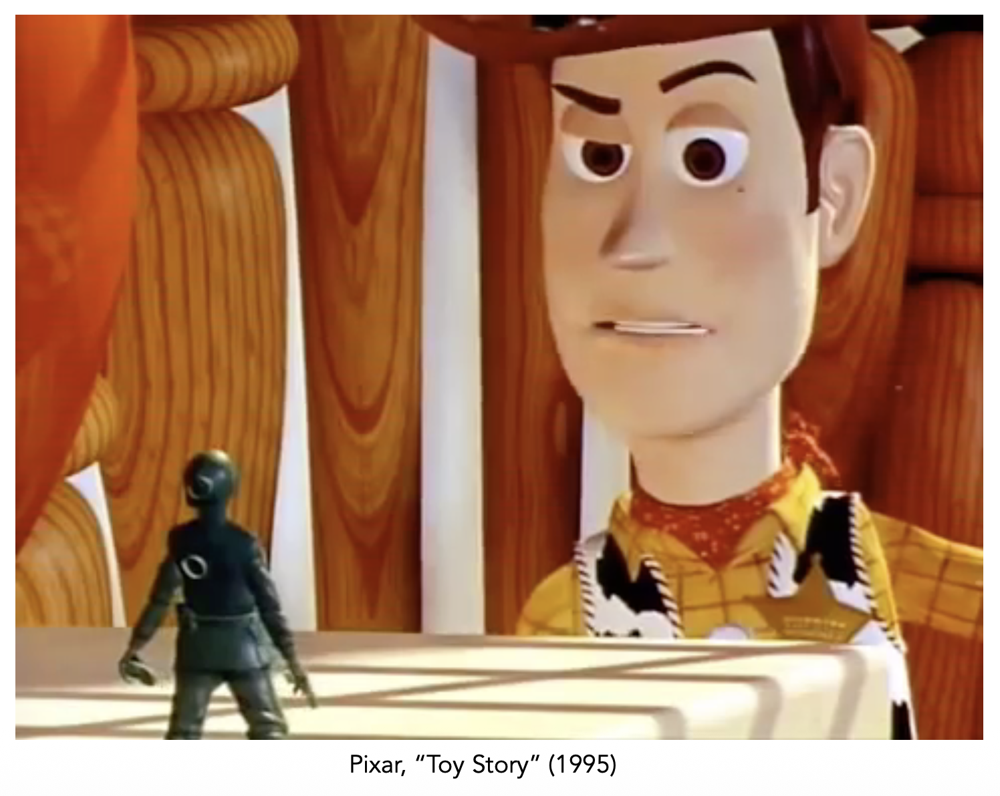
    

- 十几年前的计算机动画

    

        
    

- 几年前的计算机动画

    

        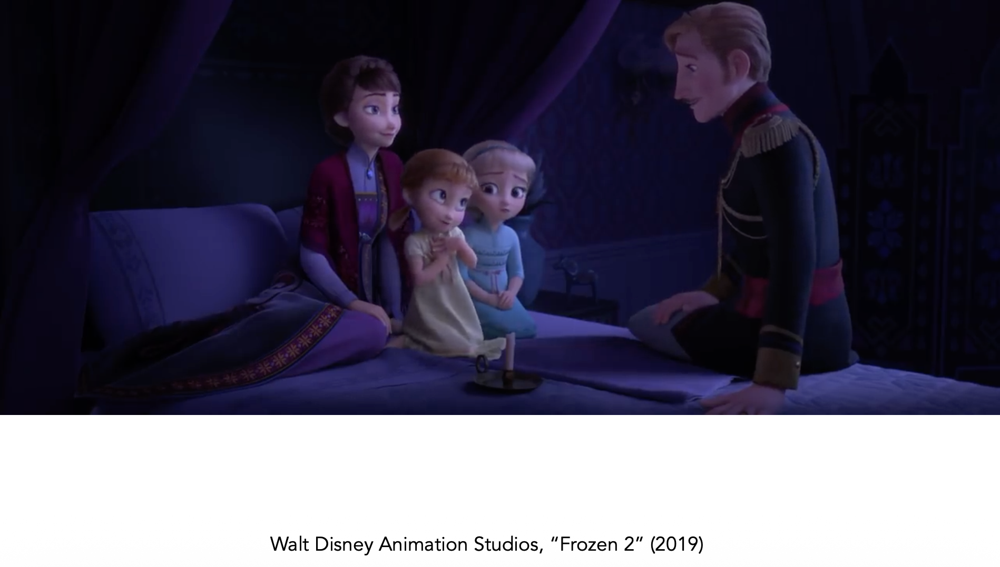
    

## Keyframe Animation

    

- 动画师绘制**关键帧**(keyframes)
- 助手（人/电脑）负责补充**中间帧**(in-between frames)（中间帧生成(tweening)）

中间帧生成的过程就是对关键帧的插值(interpolation)。我们可以把每一帧看作一个参数值向量，然后连接连续帧上相同位置的元素，在连线上进行插值。

    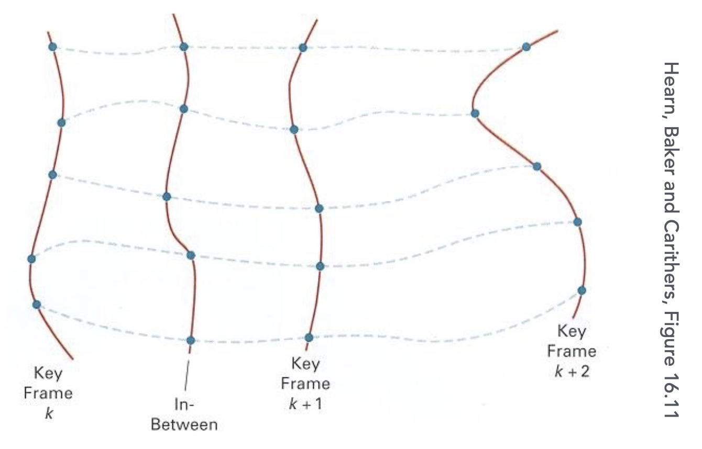

插值方法有：

- 线性插值，但通常效果不佳

    

        
    

- 更常用的是使用**样条**(spline)实现平滑/可控的插值

    

        
    

## Physical Animation

先来回忆一下牛顿第二定律：$F = ma$（力(force) = 质量(mass) * 加速度(acceleration)），这是物理动画背后最基本的原理。

物理动画通常采用数值模拟来生成物体的运动。

    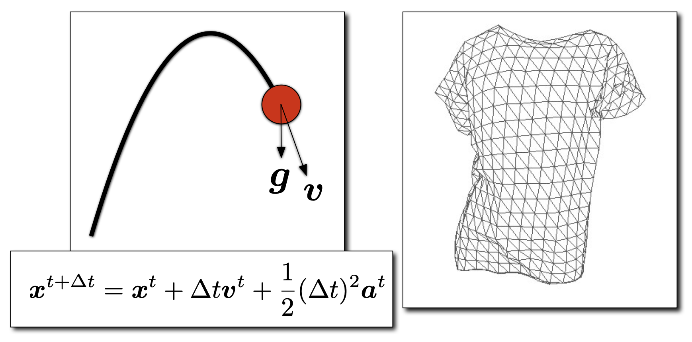

???+ example "例子"

    === "例1：布料模拟"

        

            
        

    === "例2："流体

        

            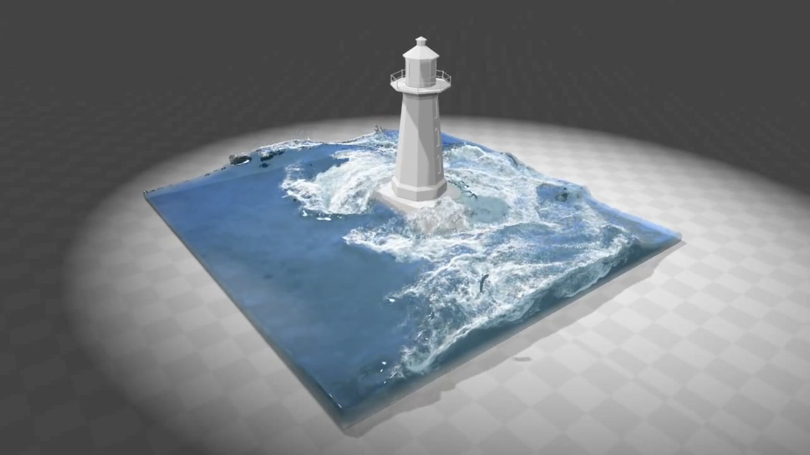
        

### Mass Spring System

首先要介绍的物理模拟方法是**质点弹簧系统**(spring mass system)。

???+ example "例子"

    === "例1：绳索"

        

            
        

        视频链接：<https://youtu.be/Co8enp8CH34>

    === "例2：头发"

        

            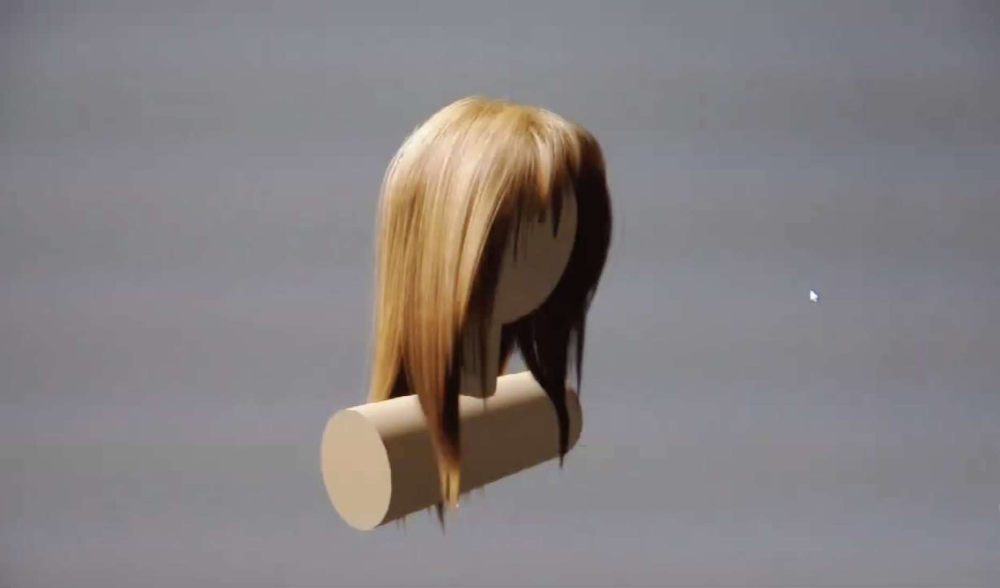
        

    === "例3：网格"

        

            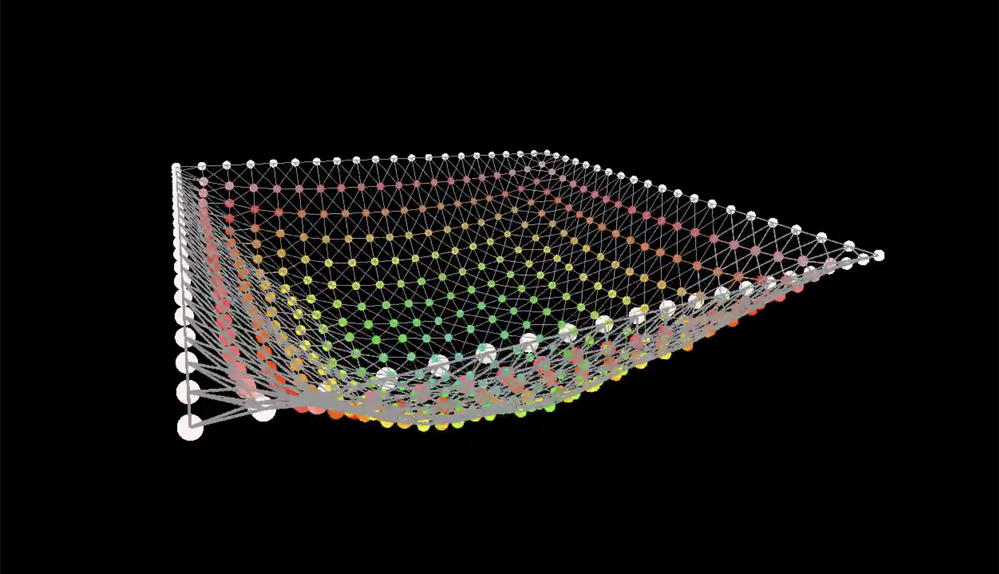
        

    === "例4：布料"

        

            
        

我们构建以下理想化的**弹簧**(spring)模型：

{ align=right width=20% }

$$
\begin{aligned}
\bm{f}_{a \rightarrow b} & = k_s (\bm{b} - \bm{a}) \\
\bm{f}_{b \rightarrow a} & = -\bm{f}_{a \rightarrow b}
\end{aligned}
$$

- 拉开弹簧，弹力会让弹簧上两点相互靠近
- 弹力和位移成正比（胡克定律(Hooke's law)）
- $k_s$ 表示**弹簧系数**（刚度(stiffness)）
- 该模型的问题：只有当弹簧长度为0时才没有弹力，这显然不符合物理规律

所以我们需要考虑非零**静止长度**(rest length)（记作 $l$）下的弹簧模型，公式变为：
$$
\bm{f}_{a \rightarrow b} = k_s \dfrac{\bm{b} - \bm{a}}{\|\bm{b} - \bm{a}\|}(\|\bm{b} - \bm{a}\| - l)
$$

但这个模型还有一个问题：一旦拉长弹簧后，弹簧会永远振荡下去，不会停止。这显然是因为没有考虑到其他力的作用。

在继续改进模型前，我们先约定以下记号：

$$
\begin{aligned}
& \bm{x} \\
& \bm{\dot{x}} = \bm{v} \\
& \bm{\ddot{x}} = \bm{a}
\end{aligned}
$$

其中 $\bm{\dot{x}}, \bm{\ddot{x}}$ 分别表示 $\bm{x}$ 的一阶和二阶导数，即速度和加速度。

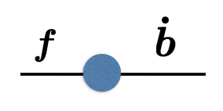{ align=right width=20% }

现在我们引入导致弹簧模型能量损失的来源——一个简单的**阻尼**(damping)：$\bm{f} = -k_d \bm{\dot{b}}$

- 这就像一股粘性阻力(viscous drag)
- 让沿着速度方向上的运动减速
- $k_d$ 为**阻尼系数**

当然还是由于定义过于简单，新的问题出现了：所有方向上的运动都会减速。原因是模型还没有考虑弹簧内部的损耗。

- 比如弹簧的两个端点同时向右运动，此时两者的相对位置保持不变，因而不存在什么弹力；但依照目前的模型，这个弹簧仍然会受到阻尼，最终停下来。
- 又比如将一个弹簧竖直放在空中，让它自由下落；依据当前的模型，它的降落速度会越来越慢，但实际上的空气阻尼不会这么大，几乎可以不用考虑。

所以最后引入在弹簧内部的阻尼，公式改为：
$$
\bm{f}_{\bm{b}} = -k_d \dfrac{\bm{b} - \bm{a}}{\|\bm{b} - \bm{a}\|}(\bm{\dot{b}} - \bm{\dot{a}}) \cdot \dfrac{\bm{b} - \bm{a}}{\|\bm{b} - \bm{a}\|}
$$

- $\bm{f}_{\bm{b}}$：作用在 $\bm{b}$ 上的阻尼力
- $\bm{\dot{b}} - \bm{\dot{a}}$：假设 $\bm{a}$ 静止时，$\bm{b}$ 的相对速度
- $\dfrac{\bm{b} - \bm{a}}{\|\bm{b} - \bm{a}\|}$：$\bm{a}$ 到 $\bm{b}$ 的方向（归一化处理）
- $\dfrac{\bm{b} - \bm{a}}{\|\bm{b} - \bm{a}\|}(\bm{\dot{b}} - \bm{\dot{a}})$：相对速度在 $\bm{a}$ 到 $\bm{b}$ 的方向上的投影（结果是标量）

对于该模型：

- 仅在弹簧长度变化时产生粘性阻力，不会减缓弹簧系统中的整体运动（比如整体的平移或旋转）
- 注：这只是其中一种特定类型的阻尼

可用弹簧模型构成的结构：

- 片(sheet)

    

        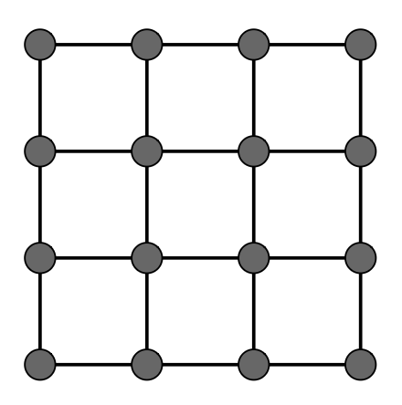
    

- 块(block)

    

        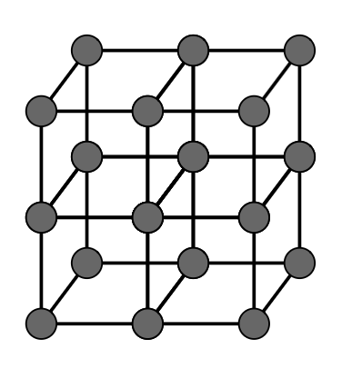
    

- 其他...

下面主要介绍（用于模拟布料的）片结构。目前的片结构存在两个问题：

- 无法抵抗**切变**(shearing)力（拉住对角线后，被拉住的两端就会被拉长，另一个对角线就会缩短，但（非弹性的）布料不是这样的）
- 无法抵抗**平面外的弯折**(out-of-plane bending)（比如对折，但布料是没法做到像纸那样完全对折的）

对于第一个问题，可以考虑向网格内加一些垂直对角线来限制：

    

但这样只考虑了一条对角线，另一条对角线也要有相应的限制，避免各向异性问题：

    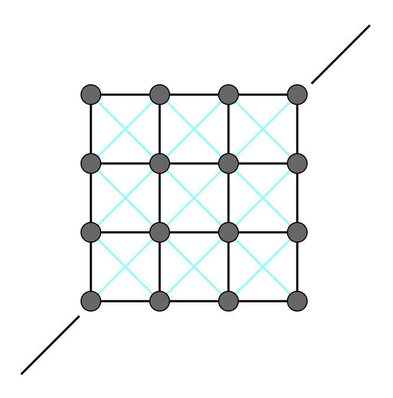

现在第一个问题解决了，那就来看第二个问题吧！这里给出的解决方案是让网格上两点（中间隔开一个点）用一个更弱的弹簧连接（下图用红线表示）。这样在对折时会受到红色弹簧的弹力阻碍而无法成功，从而达到我们的目标。

    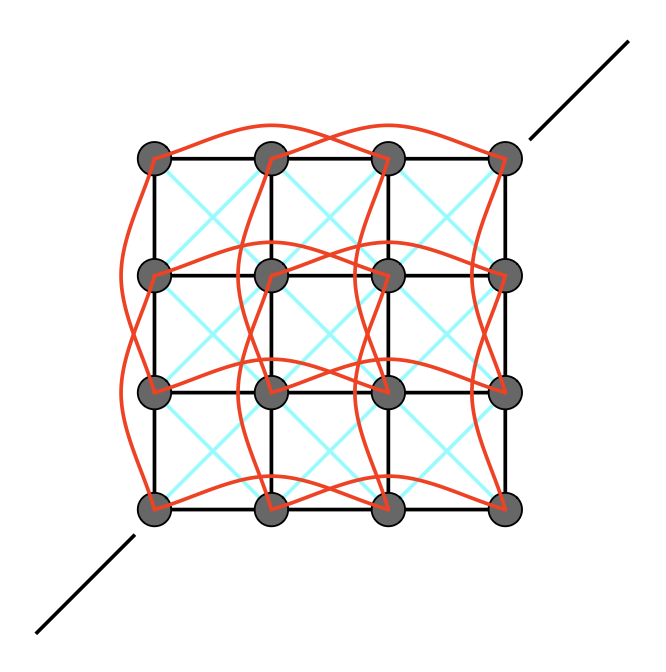

???+ example "例子"

    

        
    

    ??? info "注"

        用**有限元素法**(finite element method, **FEM**)也能达到类似质点弹簧系统的效果。

        

            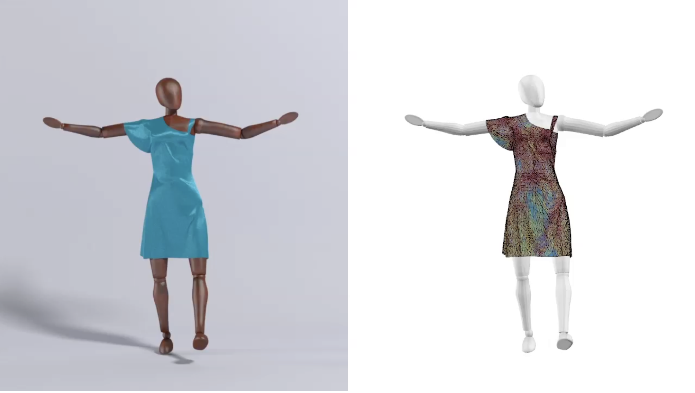
        

### Particle System

{ align=right width=20% }

第二种方法是**粒子系统**(particle system)，它将一个动态系统建模为大量的粒子，而每个粒子的运动由物理（或非物理）的作用力推动。这是一种在图形学和游戏中比较流行的技术，因为：

- 易于理解和实现
- 可扩展的(scalable)：粒子数量少则速度快，多则可模拟更高的复杂度

构建粒子系统的挑战有：

- 可能需要大量粒子（比如流体(fluid)）
- 可能需要加速结构（比如用于查找最近粒子以进行相互作用）

用粒子系统制作动画的流程为：对于动画的每一帧图像，

- （若需要）创建新的粒子
- 计算每个粒子上的力
- 更新每个粒子的位置和速度
- （若需要）移除不活跃的粒子
- 渲染粒子

上述流程的关键在于如何计算每个粒子上的力，需要考虑的要素有：

- **吸引**(attraction)与**排斥**(repulsion)力
    - 重力、电磁力...
        - 根据万有引力定律，两个粒子会互相吸引

            $$
            \begin{aligned}
            F_g & = G\dfrac{m_1 m_2}{d^2} \\
            G & = 6.67428 \times 10^{-11} \text{N} \cdot \text{m}^2 \cdot \text{kg}^{-2}
            \end{aligned}
            $$

            

                
            

    - 弹簧、推力(propulsion)...
- **阻尼**力(damping force)
    - 摩擦力、空气阻力、粘滞力
- **碰撞**(collision)
    - 墙壁、容器、固定物体...
    - 动态对象，角色身体部位...

???+ example "例子"

    === "例1：星系模拟"

        

            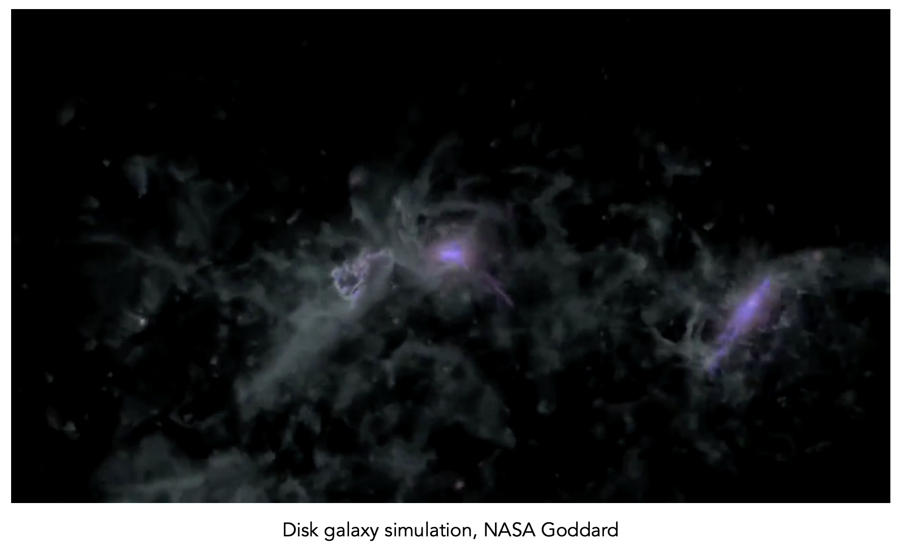
        

    === "例2：基于粒子的流体"

        

            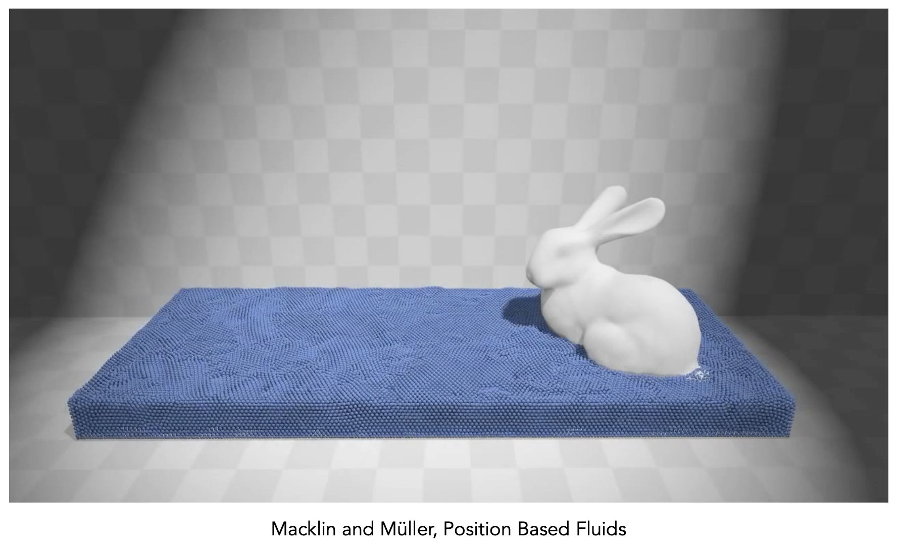
        

    === "例3：模拟动物群集"

        { align=right width=30% }

        - 将鸟群中的每只鸟建模为一个粒子
        - 这些粒子会受到以下力：
            - 吸引(attraction)到邻居们的中心
            - 对单个的邻居是排斥(repulsion)的
            - 向邻居们的平局轨迹(trajectory)对齐(alignment)

            

                
            

        - 数值模拟大粒子系统的演化
        - 涌现的复杂行为（也见于鱼类、蜜蜂等...）

    === "例4：分子动力学"

        

            
        

    === "例5"

        

            
        

## Kinematics

### Forward Kinematics

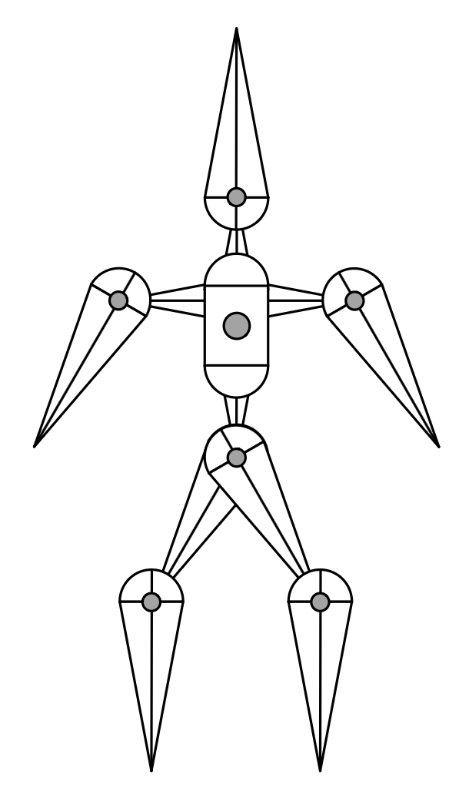{ align=right width=20% }

**正向运动学**(forward kinematics)涉及以下几部分：

- 关节骨架(articulated skeleton)
    - 拓扑学(topology)（什么连接到什么）
    - 关节间的几何关系
    - 树状结构（没有环状结构）
- 关节类型(joint types)
    - 钉子(pin)（1D）

        

            
        

    - 球(ball)（2D）
    - 棱柱关节(prismatic joint)（实现平移）

        

            
        

下面是一个简单的 2D 两段手臂：

    

- 动画师确定每一段的旋转角度
- 计算机确定末端执行器(end effector) $p$ 的位置

    $$
    \begin{aligned}p_z&=l_1\cos(\theta_1)+l_2\cos(\theta_1+\theta_2)\\p_x&=l_1\sin(\theta_1)+l_2\sin(\theta_1+\theta_2)\end{aligned}
    $$

这样形成的动画就是一个角度参数值随时间变化的函数。

???+ example "例子"

    

        
    

运动学的优缺点：

- 优点：
    - 方便直接控制
    - 实现很直接
- 缺点：
    - 动画表现可能不符物理规律
    - 艺术家创作更耗时

### Inverse Kinematics

???+ example "例子"

    

        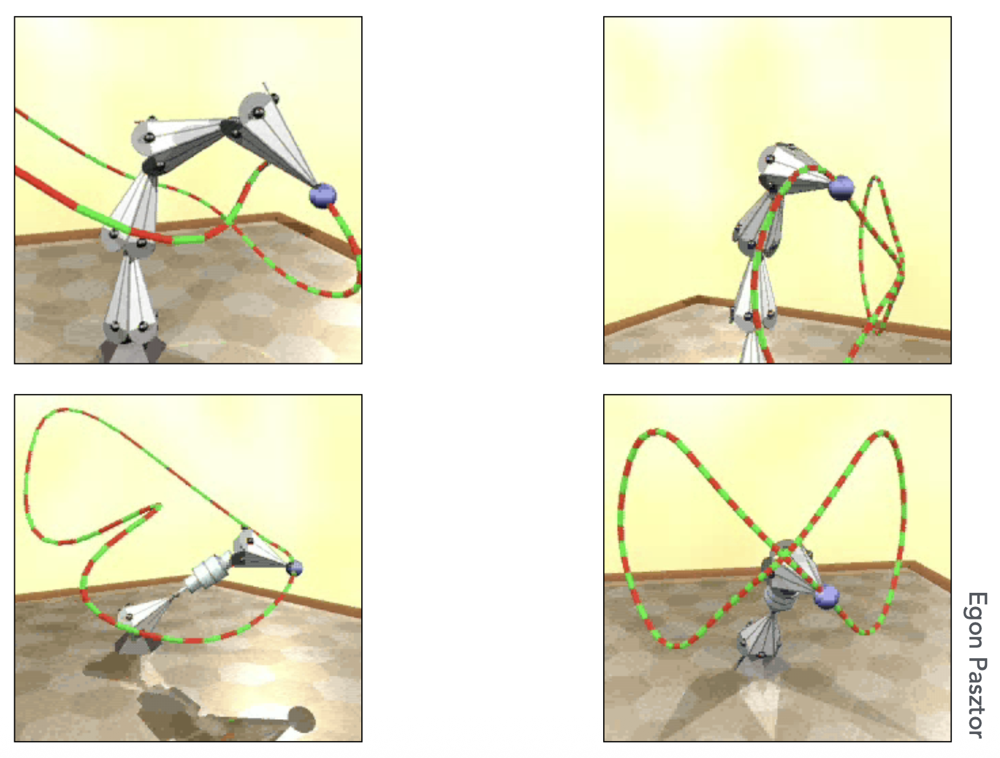
    

**逆向运动学**(inverse kinematics)中，动画师和计算机的工作正好相反：

- 动画师提供末端执行器的位置
- 而计算机必须确定关节的旋转角度，同时能满足约束

对于前面那个两段手臂的例子，可直接以分析方式求解参数（即旋转角度）：

$$
\begin{aligned}\theta_2&=\cos^{-1}\left(\frac{p_z^2+p_x^2-l_1^2-l_2^2}{2l_1l_2}\right)\\\theta_1&=\frac{-p_zl_2\sin(\theta_2)+p_x(l_1+l_2\cos(\theta_2))}{p_xl_2\sin(\theta_2)+p_z(l_1+l_2\cos(\theta_2))}\end{aligned}
$$

但逆向运动学的诸多问题却很难求解，因为：

- 对于相同的配置空间，可能存在多个解

    

        
        
    

- 有时会出现无解的情况

    

        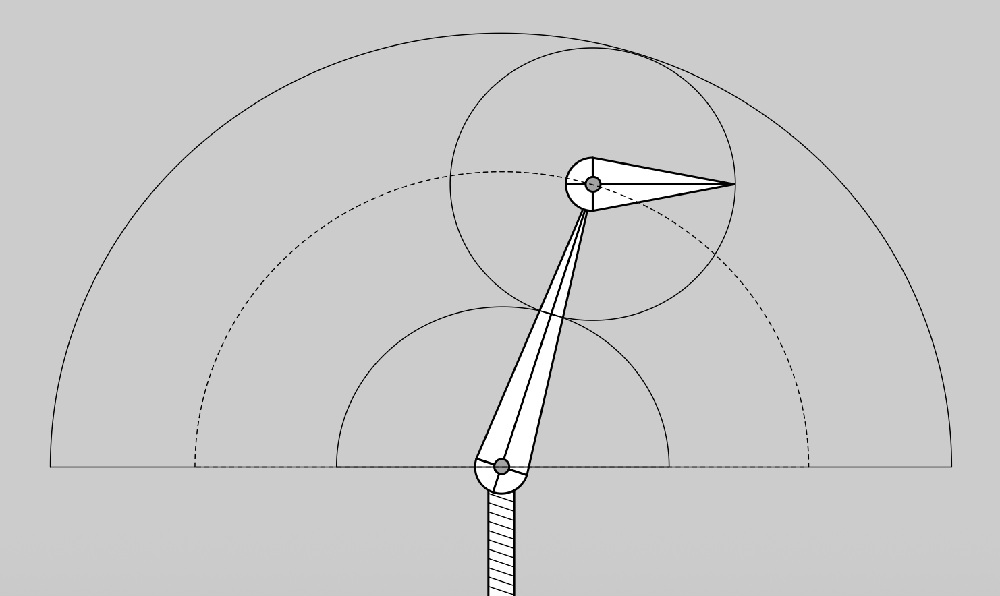
    

求 N 连接的逆向运动学问题的数值解的一般步骤：

- 选择初始配置
- 定义一个误差度量
- 计算误差关于配置的梯度
- 应用梯度下降法（或牛顿法等其他优化过程）

???+ example "例子"

    

        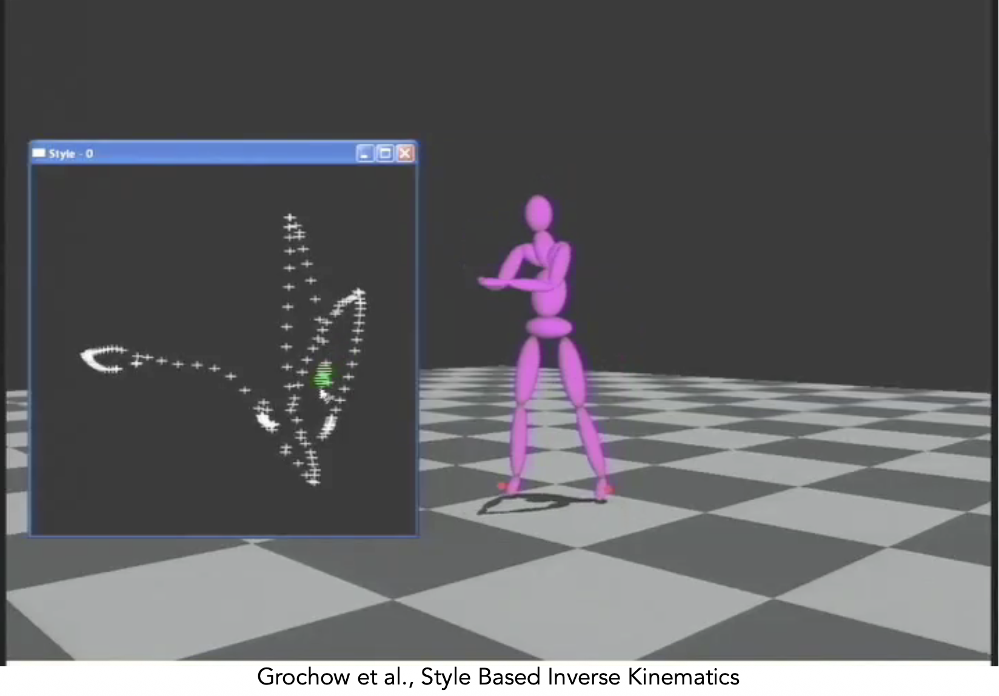
    

## Rigging

>rigging 这玩意儿好像没发现好的中文翻译...

**rigging** 是一套对角色进行更高级别控制的系统，它能够更加迅速且直观地调整姿势、形变、表情等。

- 类似于控制木偶的提线
- 捕捉所有有意义的角色变化
- 因角色而异

但这种技术的问题在于成本高昂：

- 需要人工的努力
- 同时对艺术和技术方面的训练提出要求

???+ example "例子"

    

        
    

### Blend Shapes

**混合形状**(blend shapes)的原理是：

- 不采用骨架，直接在表面之间进行插值
- 例子：模拟一系列面部表情
- 最简单的方案：对顶点位置进行线性组合
- 使用样条曲线来控制随时间变化的权重选择

???+ example "例子"

    

        
    

### Motion Capture

**动作捕捉**(motion capture)是一种用于创建动画序列的数据驱动方法。

- 记录现实世界中的表现（比如某个人在完成某个活动）
- 从收集的数据中提取姿势，作为一个关于时间的函数

该方法的优缺点为：

- 优点：
    - 能快速捕捉大量现实数据
    - 动画的真实性很高
- 缺点：
    - 复杂且设置成本高
    - 捕捉到的动画可能无法满足艺术需求，需要额外的调整

动作捕捉的装置有：

- **光学**(optical)装置
    - 在捕捉对象上添加标记物（如下图所示的白色小球）
    - 通过多台摄像机进行三角测量定位
    - 8 台以上的相机，240 Hz，遮挡困难

    

        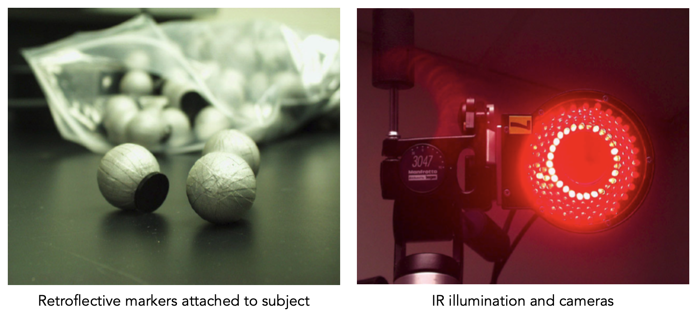
    

    ??? example "例子"

        

            
        

- **磁性**(magnetic)装置：感知磁场以推断位置/方向，并且是有线连接的
- **机械**(mechanical)装置：直接测量关节角度，但运动受限

    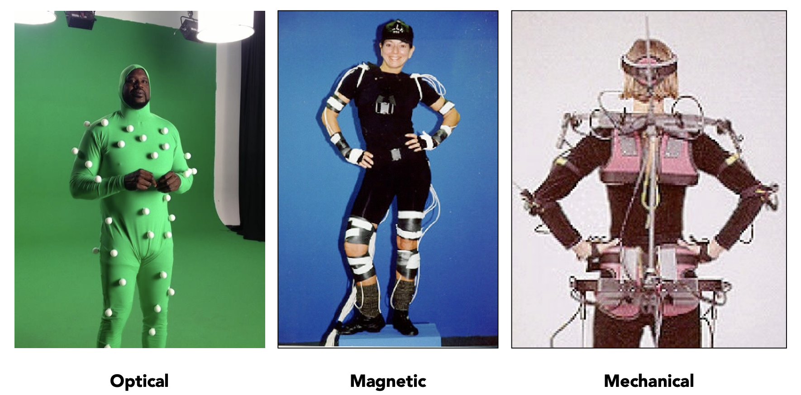

捕捉到的动作数据：

    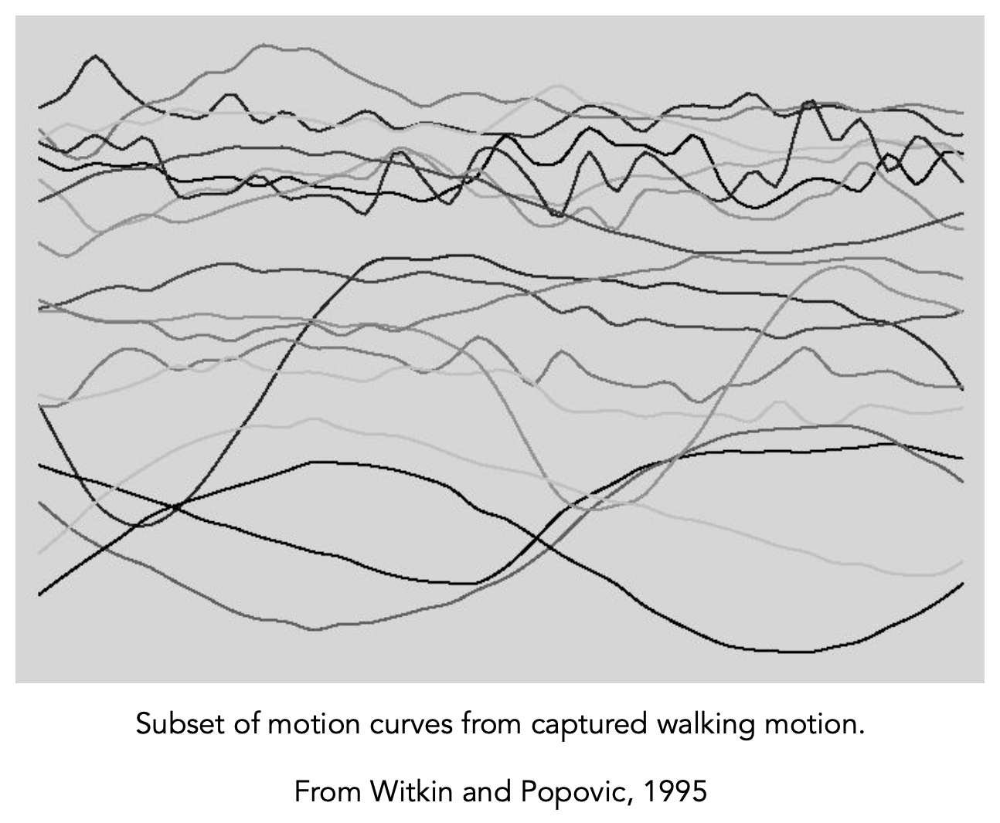

面部动画遇到的挑战——**恐怖谷效应**(uncanny valley)：在机器人技术和图形学领域中，当人造角色的外观接近人类的真实感时，我们的情感反应会转为负面，直至其表达达到足够逼真的水平。

    

???+ example "例子：面部动作捕捉"

    

        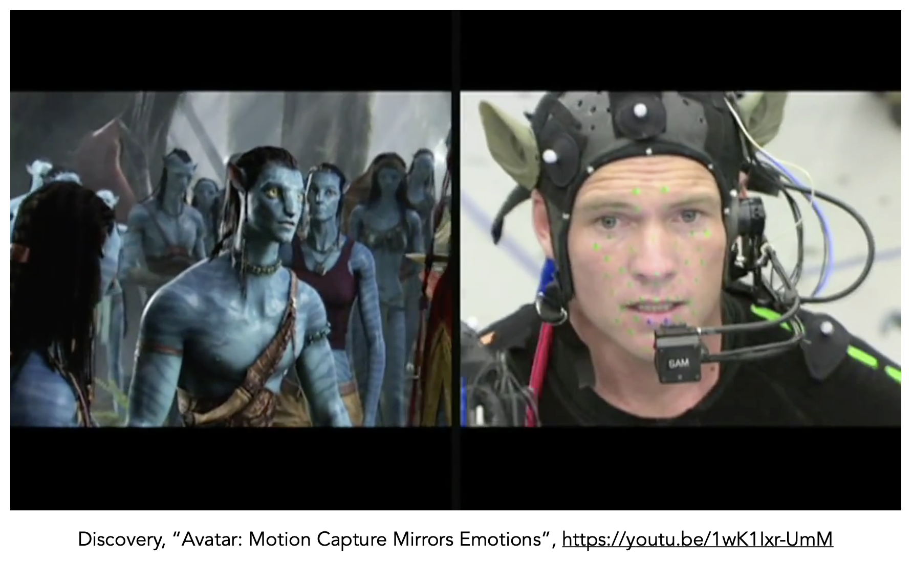
    

???+ abstract "总结：动画生产流程"

    

        
    

## Single Particle Simulation

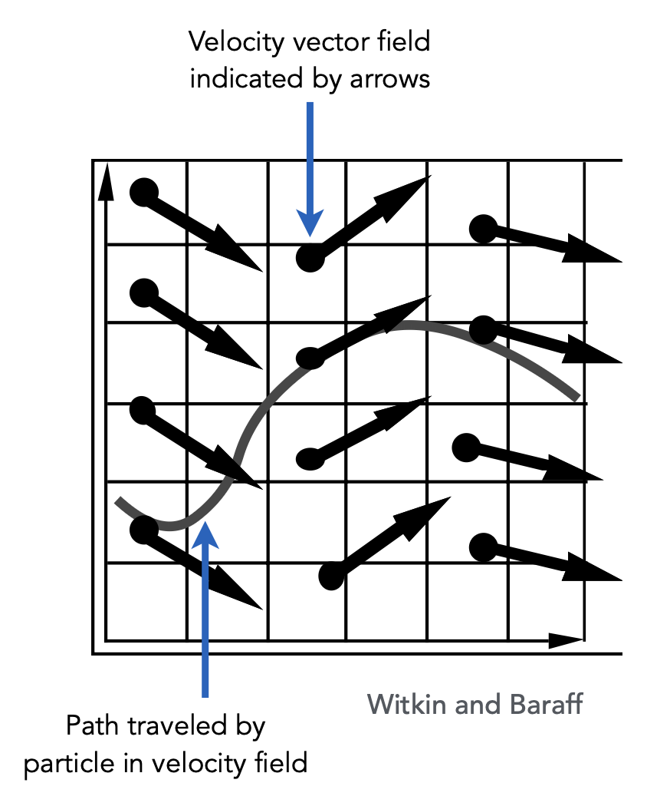{ align=right width=30% }

前面介绍过如何用粒子系统模拟物体运动，接下来就从微观角度学习具体如何让单个粒子运动。现在我们假设粒子的运动取决于一个**速度向量场**(velocity vector field)，这是一个关于位置和时间的函数，记作 $v(x, t)$。在图中，速度向量用箭头表示，而用曲线表示粒子在场中的运动。

要想计算粒子随时间变化过程中所处的位置，就是在求解一个**一阶常微分方程**(first-order ordinary differential equation, **ODE**)问题：
$$
\dfrac{dx}{dt} = \dot{x} = v(x, t)
$$

- “一阶”的意思是计算过程中要用到一阶导数
- “常”的意思是没有偏微分计算，即 $x$ 是一个仅关于 $t$ 的函数

我们可以通过正向数值积分的方法，在给定初始粒子位置 $x_0$ 的条件下求解 ODE

    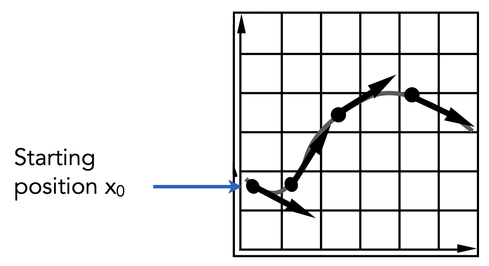

下面就来介绍一些具体解法。

### Euler Method

第一种方法是**欧拉法**(Euler method)（又称**前向**(forward)欧拉或**显式**(explicit)欧拉法）。该方法具有以下特点：

- 一种简单的迭代法
- 常用
- 但非常不准确
- 且经常出现**不稳定**(unstable)的情况

欧拉法的公式如下（在已知当前时刻位置的情况下，求解下一刻（仅相隔微小间隔）的位置）：

$$
\begin{aligned}
\bm{x}^{t + \Delta t} & = \bm{x}^t + \Delta t \bm{\dot{x}}^t \\
\bm{\dot{x}}^{t + \Delta t} & = \bm{\dot{x}}^t + \Delta t \bm{\ddot{x}}^t
\end{aligned}
$$

由于数值积分的过程会不断积累误差，因此在欧拉法基础上做积分的结果通常很糟。如下图所示，时间间隔取得太大的话，就和真实运动路径相去甚远。

    

对于稳定性，欧拉法带来的关键问题是模拟运动发散的情况，这是不稳定性导致的常见却严重的问题，比如：

- 理论上应该严格沿螺旋线移动，但按照欧拉法就会跑到螺旋线外

    

        
    

- 理论上粒子的运动会收敛到中间这条水平线，但用欧拉法粒子的振荡会越来越大（类似信号处理的正反馈）

    

        
    

### Errors and Instability

一般来说，通过有限差分进行数值积分求解会引发两个问题：

- 误差
    - 每时间步长下的误差会积累，因此随着模拟的进行，精度会逐渐降低
    - 但在图形学应用中，精度不是关键问题
- 不稳定
    - 误差可能会累积，导致模拟结果偏离实际，即便底层系统本身并未发生改变
    - 稳定性缺失是模拟中不可被忽视的基本问题

???+ example "例子"

    

        
    

    >~~来自某吃鸡游戏的例子，视频中的车撞到摩托车后触发「完全なる黄金の回転エネルギー！」~~

    视频链接：<https://www.youtube.com/watch?v=Bz8n6GBAsys>

所以人们想出很多对抗这种不稳定性的方法，下面将会一一介绍。

### Midpoint Method

{ align=right width=30% }

中点法的思路是：

- 先用欧拉法计算下一步后的位置（a）
- 然后计算当前位置和下一步位置中间位置的导数（b）
- 最后使用这个导数来更新真正的下一步位置（c）

公式如下：

$$
\begin{aligned}x_{\mathrm{mid}}&=x(t)+\Delta t/2\cdot v(x(t),t)\\x(t+\Delta t)&=x(t)+\Delta t\cdot v(x_{\mathrm{mid}},t)\end{aligned}
$$

### Modified Euler

**改进欧拉法**(modified Euler)的思路是：

- 用下一步前后位置的速度的平均值作为下一步的速度
- 能得到更好的结果

公式如下：

$$
\begin{aligned}
\boldsymbol{x}^{t+\Delta t}&=\boldsymbol{x}^t+\frac{\Delta t}{2}(\dot{\boldsymbol{x}}^t+\dot{\boldsymbol{x}}^{t+\Delta t})\\
\dot{\boldsymbol{x}}^{t+\Delta t}&=\dot{\boldsymbol{x}}^t+\Delta t\ddot{\boldsymbol{x}}^t\\
\boldsymbol{x}^{t+\Delta t}&=\boldsymbol{x}^t+\Delta t\dot{\boldsymbol{x}}^t+\frac{(\Delta t)^2}{2}\ddot{\boldsymbol{x}}^t
\end{aligned}
$$

### Adaptive Step Size

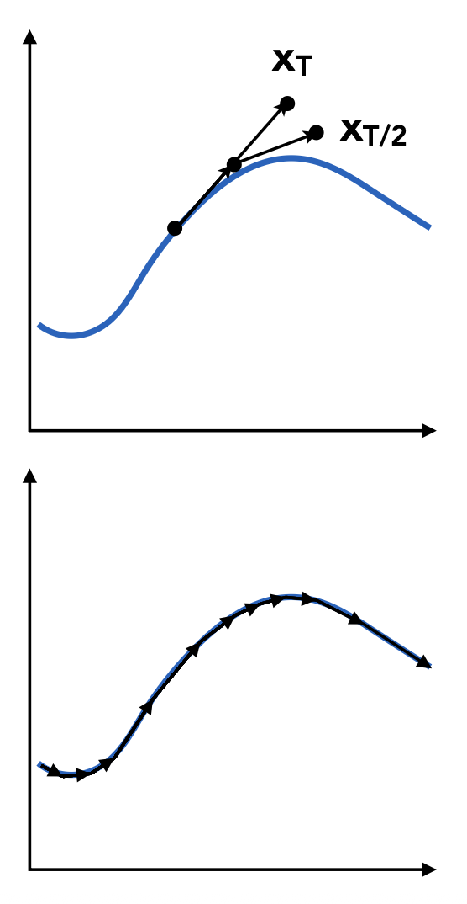{ align=right width=20% }

**自适应步长**(adaptive step size)是一种基于误差估计选择步长的非常实用的一门技术。一个小问题是有可能需要很小的步长。其基本思路如下——重复以下步骤，直到误差小于阈值：

- 使用欧拉法得到 $T$ 时刻下的位置 $x_T$
- 使用欧拉法得到 $T/2$ 时刻下的位置 $x_{T/2}$
- 计算误差 $\|x_T - x_{T/2}\|$
- 若误差仍大于阈值，则减小步长并再次尝试

### Implicit Euler Method

**隐式欧拉法**(implicit Euler method)（非正式的称呼为**反向法**(backward method)）不同于一般的欧拉法，它利用的不是当前位置下的速度，而是未来位置上的速度。对于当前步，公式如下：

$$
\begin{aligned}
\bm{x}^{t + \Delta t} & = \bm{x}^t + \Delta t \bm{\dot{x}}^{t + \Delta t} \\
\bm{\dot{x}}^{t + \Delta t} & = \bm{\dot{x}}^t + \Delta t \bm{\ddot{x}}^{t + \Delta t}
\end{aligned}
$$

问题转化为求解关于 $\bm{\dot{x}}^{t + \Delta t}, \bm{\ddot{x}}^{t + \Delta t}$ 的非线性问题。对于这类问题可以使用诸如**牛顿法**(Newton's method)等寻根(root-finding)算法求解。

隐式欧拉法通常能得到好得多的稳定性。

---
说了那么多，其实我们还没有定义过，或者量化过“稳定性”这一概念。实际上，稳定性通常用**局部截断误差**(local truncation error)（对于每一步）和**总累积误差**(total accumulated error)（总体）来量化。我们不关心误差的绝对值，关心的是误差关于步长的阶数。

- 隐式欧拉法的误差是一阶的，这意味着（$h$ 表示步长，即 $\Delta t$）
    - 局部截断误差：$O(h^2)$
    - 总累积误差：$O(h)$
- 可以这样理解 $O(h)$：如果步长减少一半，那么误差也会减少一半；所以误差阶数是越大越好

### Runge-Kutta Families

**龙格-库塔法**(Runge-Kutta families)是一组用于求解 ODE 的高级方法，尤其适用于求解非线性问题。其中它的四阶版本是最常用的，即 **RK4**。

- 初始条件：$\dfrac{dy}{dt}=f(t,y),\quad y(t_0)=y_0$
- RK4 的解：

    $$
    \begin{aligned}&y_{n+1}=y_n+\frac{1}{6}h\left(k_1+2k_2+2k_3+k_4\right),\\&t_{n+1}=t_n+h\end{aligned}
    $$

    其中：

    - $k_1 = f(t_n, y_n)$
    - $k_2=f\left(t_n+\dfrac{h}{2},y_n+h\dfrac{k_1}{2}\right)$
    - $k_3=f\left(t_n+\dfrac{h}{2},y_n+h\dfrac{k_2}{2}\right)$
    - $k_4=f\left(t_n+h,y_n+hk_3\right)$

### Position-based / Verlet Integration

最后介绍一种不是基于物理的方法——**基于位置的 / Verlet 积分**，它的思路是：

- 使用改进欧拉法计算前向步后，约束粒子位置，以阻止发散的、不稳定的行为
- 使用约束位置计算速度
- 这两个思路都会消耗运动粒子的能量，使之趋于稳定

特点：

- 快速简单
- 不基于物理实现能量损失，可能会有误差

???+ info "注"

    以上内容和《[数值分析](../../math/na/index.md)》课程内容关系紧密，要想更深入地理解这些方法，最好去学一下相关知识。

## Rigid Body Simulation

对于**刚体**(rigid body)模拟，它和模拟粒子运动类似，只是需要考虑更多刚体的性质。除了位置外，计算时还需考虑以下量：

$$
\left.\frac{d}{dt}\left(\begin{array}{c}\mathrm{X}\\\theta\\\mathrm{X}\\\omega\end{array}\right.\right)=\begin{pmatrix}\mathrm{\dot{X}}\\\omega\\\mathrm{F}/M\\\Gamma/I\end{pmatrix}
$$

- $X$：位置
- $\theta$：旋转角(rotation angle)
- $\omega$：角速度(angular velocity)
- $F$：力
- $\Gamma$：扭矩(torque)
- $I$：转动惯量(momentum of inertia)

可以用前面介绍的各种方法求出刚体在一段时间后出现的位置。

## Fluid Simulation

### A Simple Position-based Method

基于位置方法的关键思路是：

- 假设流体是由很小的刚体小球构成的
- 假设流体无法被压缩（即密度不变）
- 所以只要密度发生变化，就应该通过改变粒子位置来纠正
- 需要知道任何地方上密度关于粒子位置的梯度
- 用梯度下降法更新

    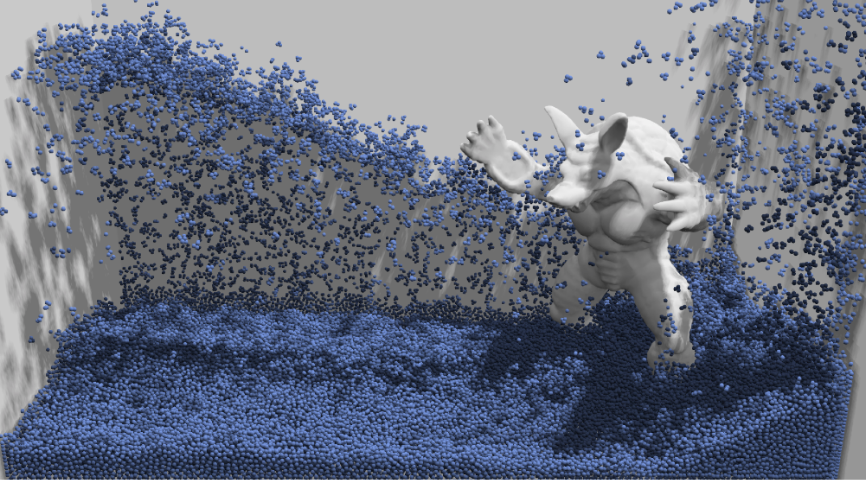

问题：流体运动可能会停不下来，需要人为增加能量损失。

### Eulerian vs. Lagrangian

下面给出模拟大量物体集合的常见的两种不同视角：

- **拉格朗日**视角（**质点法**）：盯着一个物体在不同时刻下的位置

    

        
    

- **欧拉**视角（**网格法**）：将空间划分为网格，盯着一个网格在不同时刻下出现的物体
    >和前面介绍的[欧拉法](#euler-method)没半毛钱关系...

    

        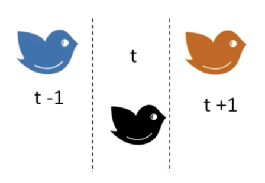
    

### Material Point Method

**物质点法**(material point method, MPM)是一种结合欧拉和拉格朗日视角的混合方法：

- 拉格朗日：考虑带有材料属性的粒子运动
- 欧拉：对某个网格做数值积分
- 交互：粒子将属性传递到网格，网格执行更新，然后插值回粒子

    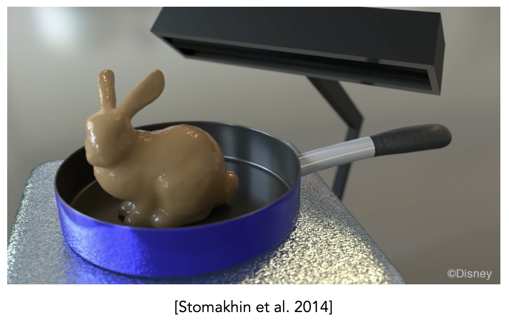

