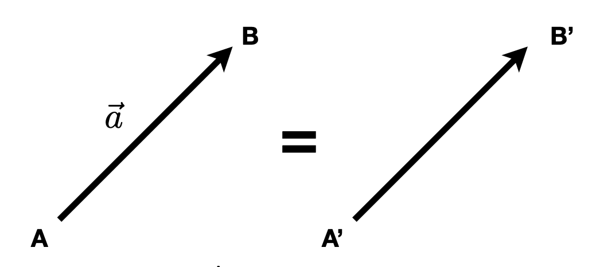
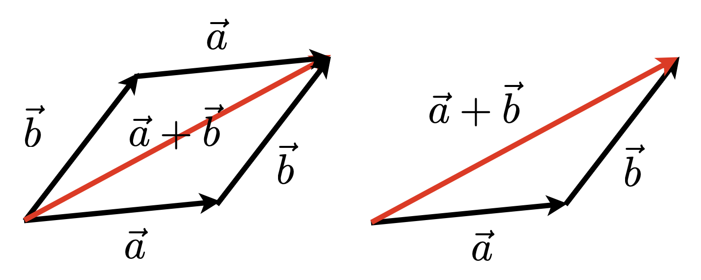
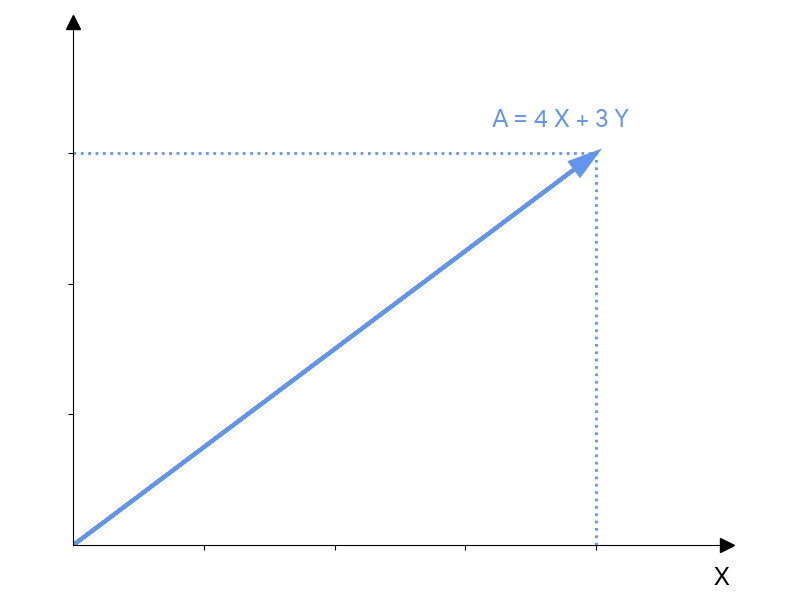
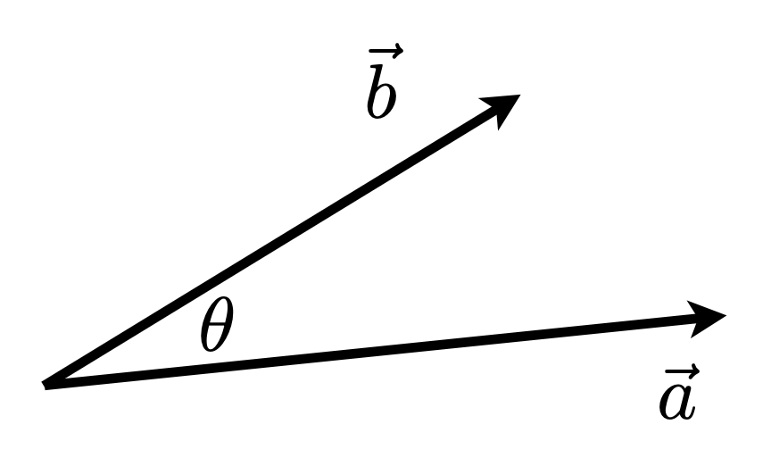
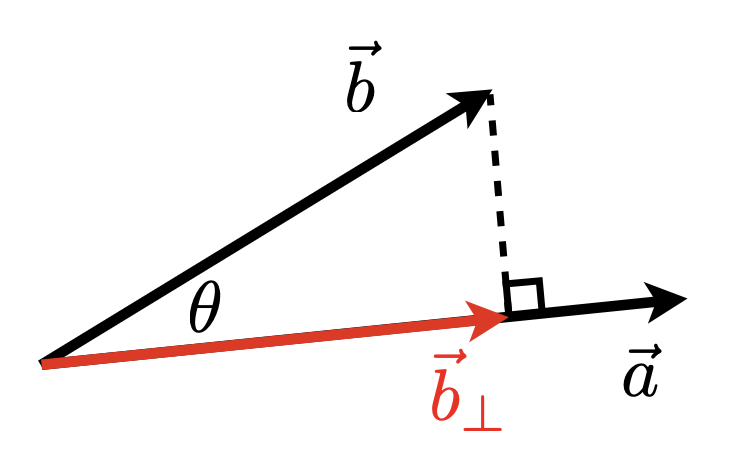
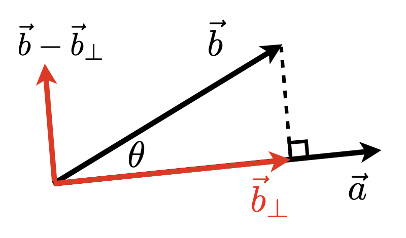
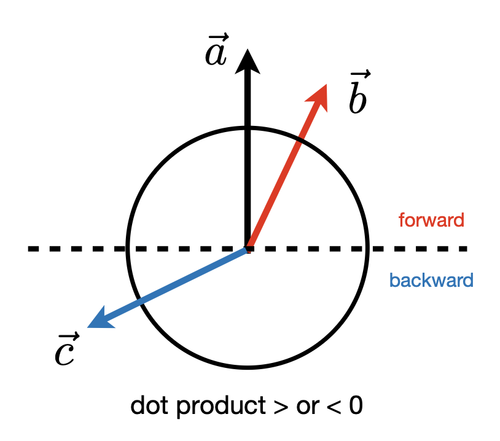
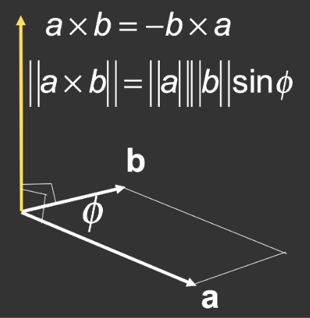
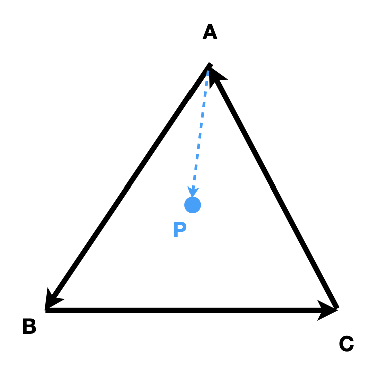

# Linear Algebra

本讲简单回顾一下在高中和大学就学过的有关线性代数的一些知识，难度不大，包括：

- 向量：点积，叉积，...
- 矩阵：矩阵-矩阵，矩阵-向量乘法，...

相关的例子有：

- 一个点可以用一个向量表示
- 对物体的平移(translation)或旋转(rotation)操作能被表示成矩阵-向量乘法

## Vectors

向量的定义：

    

- 通常写作 $\vec{a}$，粗体 $\bm{a}$，或用起始和终止断点表示 $\overrightarrow{AB} = B - A$
- 能同时表示方向和长度
- 没有绝对的起始位置

!!! warning "注意"

    不知道什么原因，Latex 的 \vec 语法无法在 mkdocs 上成功渲染（比如上面“通常写作”的那个是本来应该带箭头的，但可以看到在 mkdocs 上只有光秃秃的字母），所以原本课件中带箭头的向量写法全被我换成了粗体写法，请见谅🙏

---
向量的**归一化**(normalization)：

- 向量的大小(magnitude)（长度）写作 $\|\bm{a}\|$
- **单位向量**(unit vector)：大小为 1 的向量
    - 计算任意非零向量的单位向量：$\hat{a} = \bm{a} / \|\bm{a}\|$
    - 一般用于表示方向

---
向量加法：

- 几何上，平行四边形法则或三角形法则

    

        
    

- 代数上，就是坐标的相加

---
**笛卡尔坐标系**(Cartesian coordinates)

    

- $X, Y$ 可以是任意的（但通常是**正交的**(orthogonal)单位(unit)）向量

$$
A = \begin{pmatrix}x \\ y\end{pmatrix},\ A^T = (x, y),\ \|A\| = \sqrt{x^2 + y^2}
$$

### Vector Multiplication

#### Dot Product

    

!!! warning "注"

    GAMES101 课程考虑的都是**右手坐标系**，比如 OpenGL。但像 Unity 等 API 是左手坐标系，所以实际运用时需要留心。

- $\bm{a} \cdot \bm{b} = \|\bm{a}\|\|\bm{b}\| \cos \theta$
- $\cos \theta = \dfrac{\bm{a} \cdot \bm{b}}{\|\bm{a}\|\|\bm{b}\|}$
- 对于单位向量，$\cos \theta = \hat{a} \cdot \hat{b}$
- 性质：
    - $\bm{a} \cdot \bm{b} = \bm{b} \cdot \bm{a}$
    - $\bm{a} \cdot (\bm{b} + \bm{c}) = \bm{a} \cdot \bm{b} + \bm{a} \cdot \bm{c}$
    - $(k\bm{a}) \cdot \bm{b} = \bm{a} \cdot (k\bm{b}) = k(\bm{a} \cdot \bm{b})$

- 在笛卡尔坐标系中：逐元素相乘再相加
    - 2D：$\bm{a} \cdot \bm{b} = \begin{pmatrix}x_a \\ y_a\end{pmatrix} \cdot \begin{pmatrix}x_b \\ y_b\end{pmatrix} = x_a x_b + y_a y_b$
    - 3D：$\bm{a} \cdot \bm{b} = \begin{pmatrix}x_a \\ y_a \\ z_a\end{pmatrix} \cdot \begin{pmatrix}x_b \\ y_b \\ z_b\end{pmatrix} = x_a x_b + y_a y_b + z_a z_b$

- 在图形学中的应用
    - 计算两向量间的夹角，比如计算光源和曲面之间夹角的余弦值
    - 计算一个向量在另一个向量上的**投影**(projection)
        - $\bm{b}_\perp$：$\bm{b}$ 在 $\bm{a}$ 上的投影
            - $\bm{b}_\perp$ 必须和 $\bm{a}$（或 $\hat{a}$）在同一直线上
            - 大小 $k = \|\bm{b}_\perp\| = \|\bm{b}\| \cos \theta$

        

            
        

    - 测量两个方向的相近程度（比如余弦相似度）
    - 分解向量

        

            
        

    - 确定向量朝前还是朝后

        

            
        

#### Cross Product

    

- **叉积**(cross product)和两个初始向量正交
- 通过右手螺旋定则确定叉积向量的方向
- 有助于构建坐标系
- 性质：
    - $\bm{x} \times \bm{y} = +\bm{z}, \bm{y} \times \bm{x} = -\bm{z}$
    - $\bm{y} \times \bm{z} = +\bm{x}, \bm{z} \times \bm{y} = -\bm{x}$
    - $\bm{z} \times \bm{x} = +\bm{y}, \bm{x} \times \bm{z} = -\bm{y}$
    - $\bm{a} \times \bm{b} = -\bm{b} \times \bm{a}$（注意负号）
    - $\bm{a} \times \bm{a} = \bm{0}$
    - $\bm{a} \times (\bm{b} + \bm{c}) = \bm{a} \times \bm{b} + \bm{a} \times \bm{c}$
    - $\bm{a} \times (k\bm{b}) = k(\bm{a} \times \bm{b})$
- 笛卡尔公式：$\bm{a} \times \bm{b} = A^* \bm{b} = \begin{pmatrix}0 & -z_a & y_a \\ z_a & 0 & -x_a \\ -y_a & x_a & 0\end{pmatrix} \begin{pmatrix}x_b \\ y_b \\ z_b\end{pmatrix} = \begin{pmatrix}y_a z_b - y_b z_a \\ z_a x_b - x_a z_b \\ x_a y_b - y_a x_b\end{pmatrix}$
- 在图形学中的应用：
    - 确定向左还是向右
        - 举例：如果 $\bm{b}$ 在 $\bm{a}$ 的左侧，那么 $\bm{a} \times \bm{b}$ 的结果是正的（对于右手坐标系）
    - 确定向内还是向外
        - 举例：如何证明 $P$ 点是在三角形的内部？

            

                
            

            假定三角形三条边对应的向量按逆时针方向排列。先看 $\overrightarrow{AB}$ 和 $\overrightarrow{AP}$，$\overrightarrow{AB} \times \overrightarrow{AP}$ 的结果是垂直纸面向外的，因此 $P$ 点在 $AB$ 的左侧。同理可得 $P$ 点也在 $BC, CA$ 的左侧，因此 $P$ 点在三角形内部。

            如果向量是沿顺时针方向排列的话，那么 $P$ 点就在三条向量的右侧。所以只要 $P$ 点在三条向量的同一侧，就能说明 $P$ 在三角形内部。

#### Orthonormal Bases and Coordinate Frames

- 对表示点和位置而言很重要
- 通常有很多组坐标系
- 关键问题是在这些系统/基内转换（下一讲介绍）
- 任意一组满足以下条件的三个向量（3D）可用于定义一个坐标系

    $$
    \|\bm{u}\| = \|\bm{v}\| = \|\bm{w}\| = 1 \\
    \bm{u} \times \bm{v} = \bm{v} \times \bm{w} = \bm{u} \times \bm{w} = 0 \\
    \bm{w} = \bm{u} \times \bm{v} \quad \text{right-handed}
    $$

    在这个坐标系上的任意向量 $\bm{p} = \underbrace{(\bm{p} \times \bm{u})}_{\text{projection}} \bm{u} + (\bm{p} \times \bm{v}) \bm{v} + (\bm{p} \times \bm{w}) \bm{w}$

## Matrices

- 几乎所有 CS 的课都会涉及到矩阵（2维数组）
- 在图形学中，矩阵普遍用于表示**变换**(transformations)，包括平移、旋转、剪切、缩放等（具体细节请见下一讲）
- 矩阵是一个 $m \times n$（$m$ 行 $n$ 列）的数组
- 带标量的加法和乘法是很简单的——逐元素做
- 矩阵-矩阵乘法：$A \times B$ 中，$A$（大小为 $M \times N$）的列数必须和 $B$（大小为 $N \times P$）的行数相等（结果大小为 $M \times P$）

    $$
    \begin{pmatrix}1 & 3 \\ 5 & 2 \\ 0 & 4\end{pmatrix} \begin{pmatrix}3 & 6 & 9 & 4 \\ 2 & 7 & 8 & 3\end{pmatrix} = \begin{pmatrix}9 & 27 & 33 & 13 \\ 19 & 44 & 61 & 26 \\ 8 & 28 & 32 & 12\end{pmatrix}
    $$

    - 乘积中元素 $(i, j)$ 是 $A$ 的第 $i$ 行和 $B$ 的第 $j$ 列的点积
    - 性质：
        - 无交换律，$AB$ 和 $BA$ 一般是不同的
        - 结合律和分配律
            - $(AB)C = A(BC)$
            - $A(B+C) = AB + AC$
            - $(A+B)C = AC + BC$

- 矩阵-向量乘法
    - 将向量看作是一个只有一列的矩阵（$m \times 1$）
    - 变换点的关键（下一讲介绍），比如关于 $y$ 轴的 2D 反射

        $$
        \begin{pmatrix}-1 & 0 \\ 0 & 1\end{pmatrix} \begin{pmatrix}x \\ y\end{pmatrix} = \begin{pmatrix}-x \\ y\end{pmatrix}
        $$

- 矩阵**转置**(transpose)
    - 交换行和列（$ij \rightarrow ji$）

        $$
        \begin{pmatrix}1 & 2 \\ 3 & 4 \\ 5 & 6\end{pmatrix}^T = \begin{pmatrix}1 & 3 & 5 \\ 2 & 4 & 6\end{pmatrix}
        $$

    - 性质：$(AB)^T = B^T A^T$

- **单位矩阵**(identity matrix)：主对角线（左上 -> 右下）上的元素均为1，其他元素均为0

    $$
    I_{3 \times 3} = \begin{pmatrix}1 & 0 & 0 \\ 0 & 1 & 0 \\ 0 & 0 & 1\end{pmatrix}
    $$

- 矩阵的**逆**(inverses)
    - $AA^{-1} = A^{-1}A = I$
    - $(AB)^{-1} = B^{-1} A^{-1}$

- 向量乘法的矩阵形式
    - 点积

        $$
        \begin{align*}
        & \bm{a} \cdot \bm{b} = \bm{a}^T \bm{b} \\
        = & \begin{pmatrix}x_a & y_a & z_a\end{pmatrix} \begin{pmatrix}x_b \\ y_b \\ z_b\end{pmatrix} = (x_a x_b + y_a y_b + z_a z_b)
        \end{align*}
        $$

    - 叉积

        $$
        \bm{a} \times \bm{b} = A^* \bm{b} = \underbrace{\begin{pmatrix}0 & -z_a & y_a \\ z_a & 0 & -x_a \\ -y_a & x_a & 0\end{pmatrix}}_{\text{dual matrix of vector } \bm{a}} \begin{pmatrix}x_b \\ y_b \\ z_b\end{pmatrix}
        $$