# Transformation

## Why Study Transformation?

变换在 CG 中有着丰富的应用：

- 模型(modeling)变换
    - 平移（同一座模型建筑内，摄像机在不断移动）

        

            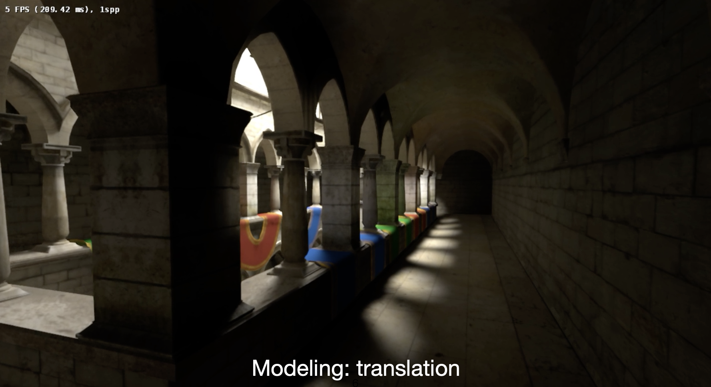
        

    - 旋转（模型机器人跳舞）

        

            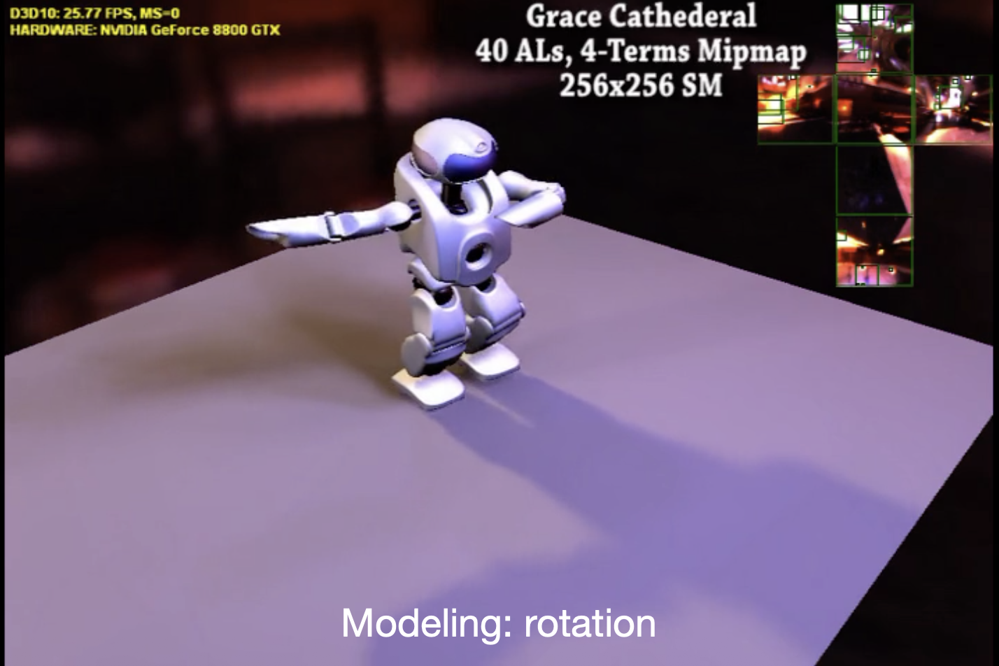
        

    - 缩放（皮克斯电影开头的小台灯会在字母 I 上面弹跳，不断压缩字母直至压扁）

        

            
        

- 视图(viewing)变换
    - 投影（3D -> 2D）

        

            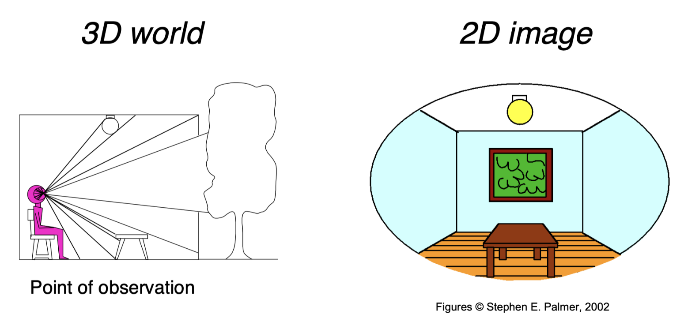
        

## 2D Transformations

### Scaling

将 2D 图形的宽高缩小至原来的一半：

    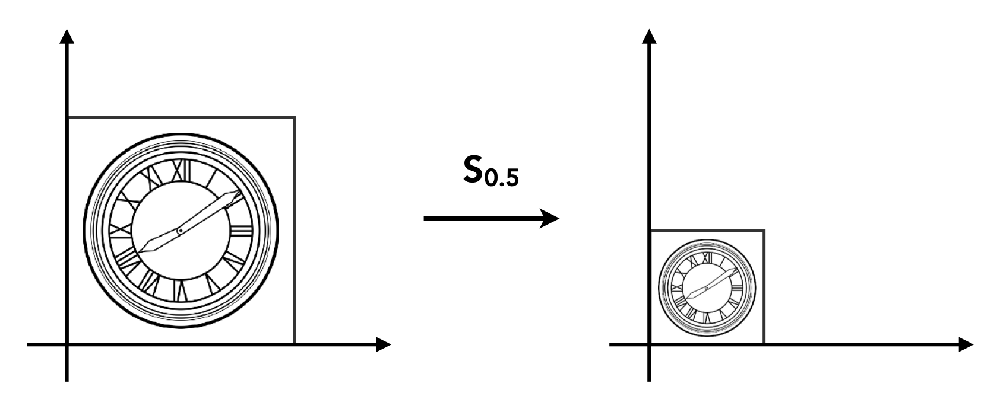

现在图形上的坐标为：$\begin{cases}x' = sx \\ y' = sy\end{cases}$。我们可将这一**缩放**(scaling)变换表示成矩阵-向量乘法：

$$
\begin{bmatrix}x' \\ y'\end{bmatrix} = \begin{bmatrix}s & 0 \\ 0 & s\end{bmatrix} \begin{bmatrix}x \\ y\end{bmatrix}
$$

宽高的缩放可以是不同的，所以更一般的形式如下：

$$
\begin{bmatrix}x' \\ y'\end{bmatrix} = \begin{bmatrix}s_x & 0 \\ 0 & s_y\end{bmatrix} \begin{bmatrix}x \\ y\end{bmatrix}
$$

    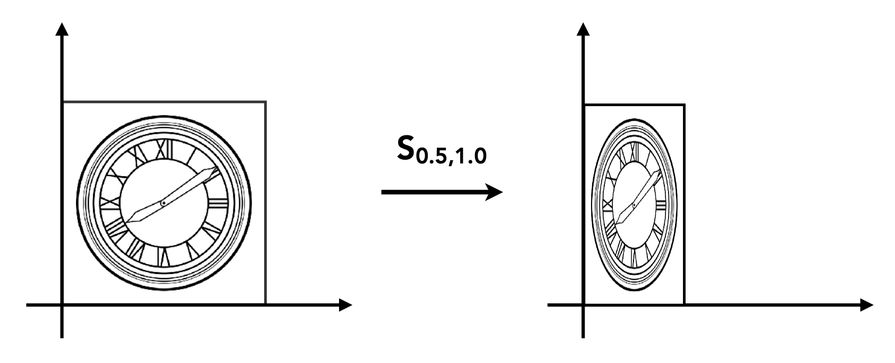

### Reflection

    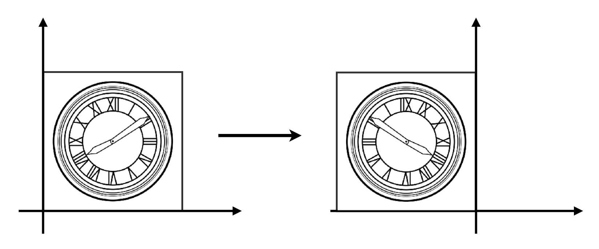

以水平反射为例，变换后的图形 $y$ 坐标不变，$x$ 坐标为原来的相反数。因此这一变换可被表示为以下矩阵-向量乘法形式：

$$
\begin{bmatrix}x' \\ y'\end{bmatrix} = \begin{bmatrix}-1 & 0 \\ 0 & 1\end{bmatrix} \begin{bmatrix}x \\ y\end{bmatrix}
$$

### Shear

    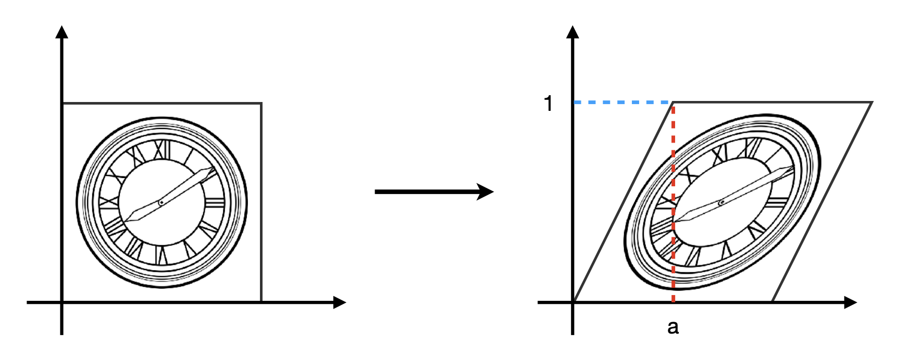

**剪切**(shear)变换仅改变其中一个坐标（这里是改变 $x$ 坐标）。对于图中所示变换，假设原图左上角的点（坐标为(0, 1)）经过变换后来到(1, a)。对于四边形左边的点，它的 $y$ 坐标不变，$x$ 坐标向右移动了 $a \cdot y$，因此 $x' = x + ay$。我们仍然可以用矩阵-向量乘法表示这一变换：

$$
\begin{bmatrix}x' \\ y'\end{bmatrix} = \begin{bmatrix}1 & a \\ 0 & 1\end{bmatrix} \begin{bmatrix}x \\ y\end{bmatrix}
$$

### Rotation

!!! warning "注意"

    - 任何图形均围绕原点(0, 0)旋转
    - 默认旋转方向为逆时针(CCW, counterclockwise)

图形旋转 45°：

    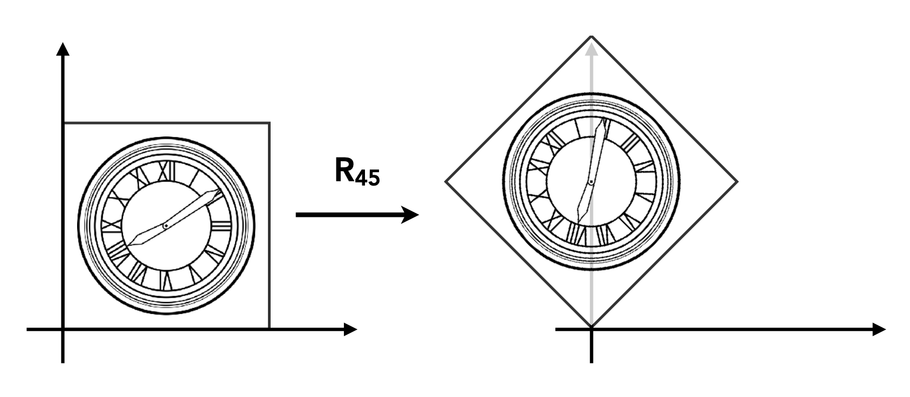

旋转矩阵 $R_\theta = \begin{bmatrix}\textcolor{cornflowerblue}{\cos \theta} & \textcolor{yellow}{- \sin \theta} \\ \textcolor{cornflowerblue}{\sin \theta} & \textcolor{yellow}{\cos \theta}\end{bmatrix}$。下面给出推导过程：

    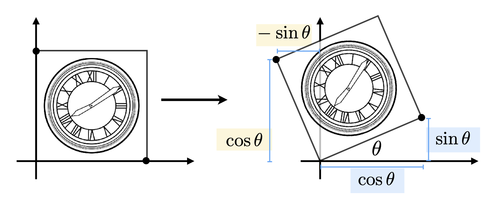

- 假设原图形（左图）边长为1，旋转矩阵 $R_\theta$ 的4个元素均为未知数，即 $R_\theta = \begin{bmatrix}A & B \\ C & D\end{bmatrix}$
- 考虑原图右下角的点 $(1, 0)$，经旋转后来到了 $(\cos \theta, \sin \theta)$，所以通过 $\begin{bmatrix}\cos \theta \\ \sin \theta\end{bmatrix} = \begin{bmatrix}A & B \\ C & D\end{bmatrix} \begin{bmatrix}1 \\ 0\end{bmatrix}$ 可列出方程：

    $$
    \begin{align*}
    A \cdot 1 + B \cdot 0 & = \cos \theta \\
    C \cdot 1 + D \cdot 0 & = \sin \theta
    \end{align*}
    $$

    解得 $A = \cos \theta, C = \sin \theta$。

- 再用左上角的点得到另外两个方程，同理解得 $B = -\sin \theta, D = \cos \theta$

当旋转角 = $-\theta$ 时，$R_{-\theta} = \begin{bmatrix}\cos \theta & \sin \theta \\ -\sin \theta & \cos \theta\end{bmatrix} = R_\theta^T$，即旋转角为 $\theta$ 时旋转矩阵的转置。事实上根据定义，$R_{-\theta} = R_\theta^{-1}$，所以旋转矩阵满足：$R_\theta^T = R_\theta^{-1}$，因此旋转矩阵是一种**正交矩阵**(orthogonal matrix)，之后会用到这个性质。

### Linear Transform

我们称以下变换为**线性变换**。满足的特征是：线性变换后的坐标均为关于原坐标的线性函数。

$$
\begin{align*}
y' & = ax + by \\
y' & = cx + dy
\end{align*}
$$

上述变换的矩阵-乘法形式为：

$$
\begin{bmatrix}x' \\ y'\end{bmatrix} = \begin{bmatrix}a & b \\ c & d\end{bmatrix} \begin{bmatrix}x \\ y\end{bmatrix}
$$

即 $\bm{x}' = M \bm{x}$。

## Homogeneous Coordinates

### Translation

    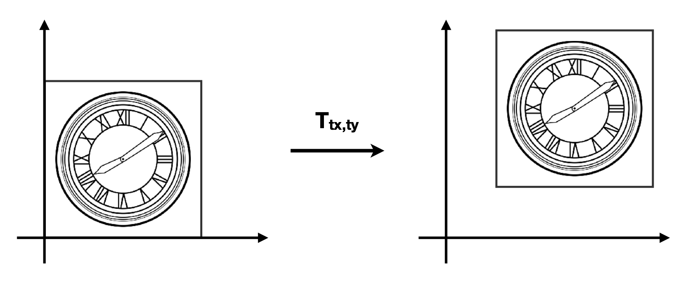

还有一种叫做**平移**(translation)的简单变换，方程为：$\begin{cases}x' = x + t_x \\ y' = y + t_y\end{cases}$

如果考虑平移变换的话，那么变换的公式不能直接写成矩阵-向量乘法，而是以下形式：

$$
\begin{bmatrix}x' \\ y'\end{bmatrix} = \begin{bmatrix}a & b \\ c & d\end{bmatrix} \begin{bmatrix}x \\ y\end{bmatrix} + \begin{bmatrix}t_x \\ t_y\end{bmatrix}
$$

因此**平移变换不属于线性变换**。但我们不希望将平移看成一种特殊情况。那么是否有一种统一的方法来表示所有的变换呢？有的，这个方法就是**齐次坐标**(homogeneous coordinates)。

### Homogeneous Coordinates

齐次坐标的做法是在原来坐标的基础上添加第三个坐标（即 w 坐标）

- 2D 点 = $\begin{pmatrix}x & y & \textcolor{yellow}{1}\end{pmatrix}^T$
- 2D 向量 = $\begin{pmatrix}x & y & \textcolor{yellow}{0}\end{pmatrix}^T$

现在平移变换可以直接用矩阵-向量乘法表示了：

$$
\begin{pmatrix}x' \\ y' \\ w'\end{pmatrix} = \begin{pmatrix}1 & 0 & t_x \\ 0 & 1 & t_y \\ 0 & 0 & 1\end{pmatrix} \cdot \begin{pmatrix}x \\ y \\ 1\end{pmatrix} = \begin{pmatrix}x + t_x \\ y + t_y \\ 1\end{pmatrix}
$$

前面规定点和向量的第三个元素分别为0和1是有道理的——该元素可以确定运算的合法性：

- 向量(0) + 向量(0) = 向量(0)
- 点(1) - 点(1) = 向量(0)
- 点(1) + 向量(0) = 点(1)
- 点(1) + 点(1) = 什么也不是！

在齐次坐标系下，任意 $w \ne 0$ 的向量 $\begin{pmatrix}x \\ y \\ w\end{pmatrix}$ 对应 2D 点 $\begin{pmatrix}x / w \\ y / w \\ 1\end{pmatrix}$。

### Affine Transformations

**仿射**(affine)变换 = 线性变换 + 平移

$$
\begin{pmatrix}x' \\ y'\end{pmatrix} = \begin{pmatrix}a & b \\ c & d\end{pmatrix} \cdot \begin{pmatrix}x \\ y\end{pmatrix} + \begin{pmatrix}t_x \\ t_y\end{pmatrix}
$$

使用齐次坐标后可表示为：

$$
\begin{pmatrix}x' \\ y' \\ 1\end{pmatrix} = \begin{pmatrix}a & b & t_x \\ c & d & t_y \\ 0 & 0 & 1\end{pmatrix} \cdot \begin{pmatrix}x \\ y \\ 1\end{pmatrix}
$$

???+ abstract "总结：2D 变换"

    - 缩放

        $$
        \mathbf{S}(s_x, s_y) = \begin{pmatrix}s_x & 0 & 0 \\ 0 & s_y & 0 \\ 0 & 0 & 1\end{pmatrix}
        $$

    - 旋转

        $$
        \mathbf{R}(\alpha) = \begin{pmatrix}\cos \alpha & - \sin \alpha & 0 \\ \sin \alpha & \cos \alpha & 0 \\ 0 & 0 & 1\end{pmatrix}
        $$

    - 平移

        $$
        \mathbf{T}(t_x, t_y) = \begin{pmatrix}1 & 0 & t_x \\ 0 & 1 & t_y \\ 0 & 0 & 1\end{pmatrix}
        $$

### Inverse Transform

矩阵 $M^{-1}$ 就是变换矩阵 $M$ 的**逆变换**(inverse transform)。

    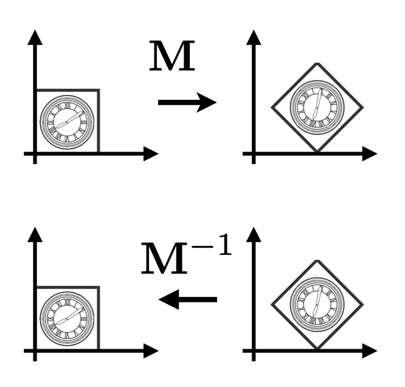

## Composing Transformations

    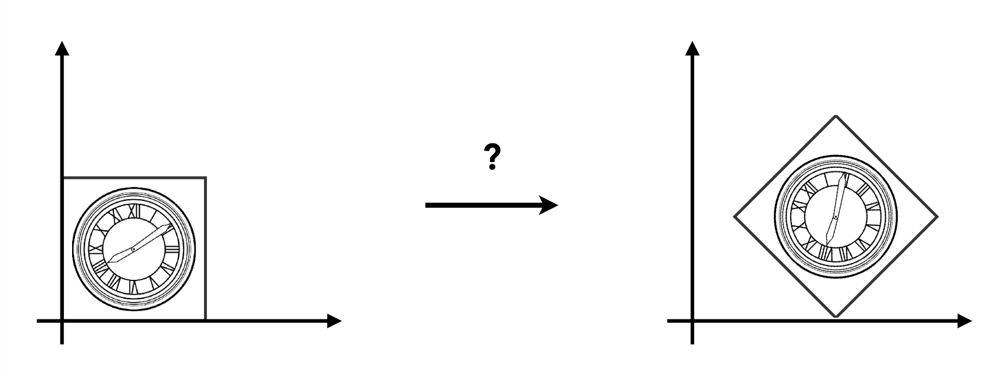

上图所示的变换可无法用前面介绍过的任何一个单独的变换表述，所以这是一种**复合变换**(composite transform)。不难发现，该变换既包括平移，也包括旋转。

- 假如先平移后旋转，无论如何都达不到图中所示的结果

    

        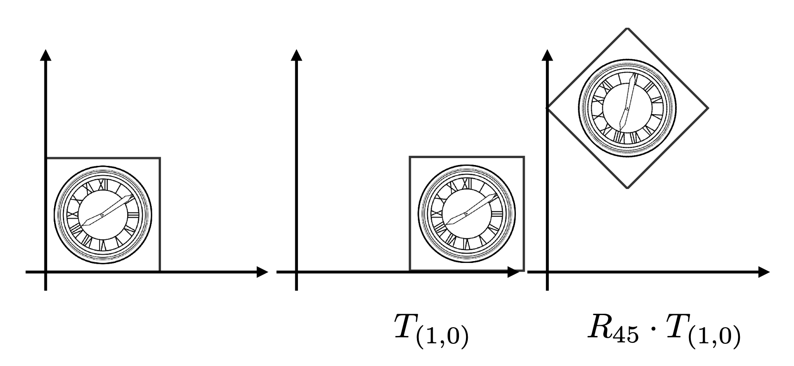
    

- 假如先旋转后平移，发现可以达到上图的结果

    

        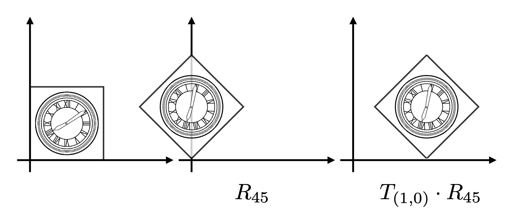
    

这给我们带来的启示是：变换的顺序很重要！从数学上来说，这是因为矩阵乘法不具备交换律，因此 $R_{45} \cdot T_{(1, 0)} \ne T_{(1, 0)} \cdot R_{45}$，因此不同的变换顺序会带来不同的结果。

另外值得一提的是，表示变换的矩阵的应用顺序为自右向左（也就是越靠近向量的矩阵越先被作用）。

$$
T_{(1, 0)} \cdot R_{45} \begin{bmatrix}x \\ y \\ 1\end{bmatrix} = \begin{bmatrix}1 & 0 & 1 \\ 0 & 1 & 0 \\ 0 & 0 & 1\end{bmatrix} \begin{bmatrix}\cos 45 \degree & - \sin 45 \degree & 0 \\ \sin 45 \degree &  \cos 45 \degree & 0 \\ 0 & 0 & 1\end{bmatrix} \begin{bmatrix}x \\ y \\ 1\end{bmatrix}
$$

---
对于一个仿射变换序列 $A_1, A_2, A_3, \dots$，可以用矩阵乘法将它们组合起来（涉及到矩阵乘法的结合律），最后再做矩阵-向量乘法，这对于计算性能的提升非常重要。

$$
A_n(\dots A_2(A_1(\bm{x}))) = A_n \dots A_2 \cdot A_1 \cdot \begin{pmatrix}x \\ y \\ 1\end{pmatrix}
$$

### Decomposing Complex Transforms

反过来看变换的组合，就是分解复杂的变换。

???+ example "例子"

    如何让图形围绕某个给定的点 $c$ 旋转？

    1. 将点 $c$ 平移到原点位置上
    2. 旋转
    3. 再将点 $c$ 平移到原来的位置上

    

        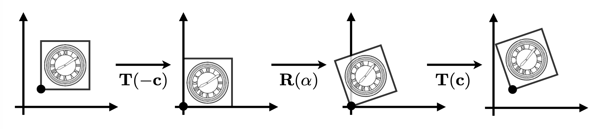
    

    用矩阵表示为：

    $$
    \mathbf{T}(\bm{c}) \cdot \mathbf{R}(\alpha) \cdot \mathbf{T}(-\bm{c})
    $$

## 3D Transformations

3D 变换和 2D 变换没有很大的区别。前面介绍的一些概念很多都适用于 3D 变换。

- 使用齐次坐标
    - 3D 点：$\begin{pmatrix}x & y & z & \textcolor{yellow}{1}\end{pmatrix}^T$
    - 3D 向量：$\begin{pmatrix}x & y & z & \textcolor{yellow}{0}\end{pmatrix}^T$
- 通常，任意 $w \ne 0$ 的向量 $\begin{pmatrix}x \\ y \\ z \\ w\end{pmatrix}$ 对应一个 3D 点 $\begin{pmatrix}x / w \\ y / w \\ z / w\end{pmatrix}^T$
- 使用 4x4 的矩阵表示仿射变换

    $$
    \begin{pmatrix}x' \\ y' \\ z' \\ 1\end{pmatrix} = \begin{pmatrix}a & b & c & t_x \\ d & e & f & t_y \\ g & h & i & t_z \\ 0 & 0 & 0 & 1\end{pmatrix} \cdot \begin{pmatrix}x \\ y \\ z \\ 1\end{pmatrix}
    $$

    变换的顺序是：线性变换在先，平移在后。

- 缩放

    $$
    \mathbf{S}(s_x, s_y, s_z) = \begin{pmatrix}s_x & 0 & 0 & 0 \\ 0 & s_y & 0 & 0 \\ 0 & 0 & s_z & 0 \\ 0 & 0 & 0 & 1\end{pmatrix}
    $$

- 平移

    $$
    \mathbf{T}(t_x, t_y, t_z) = \begin{pmatrix}1 & 0 & 0 & t_x \\ 0 & 1 & 0 & t_y \\ 0 & 0 & 1 & t_z \\ 0 & 0 & 0 & 1\end{pmatrix}
    $$

3D 旋转变换相对比较复杂，所以下面会单独介绍。

### 3D Rotations

绕轴旋转：

    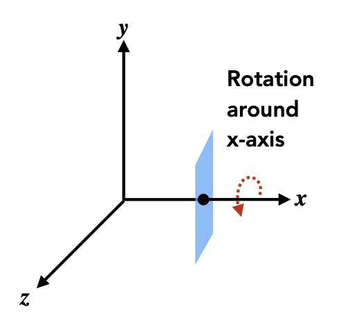

- x 轴

    $$
    \mathbf{R}_x(\alpha) = \begin{pmatrix}1 & 0 & 0 & 0 \\ 0 & \cos \alpha & - \sin \alpha & 0 \\ 0 & \sin \alpha & \cos \alpha & 0 \\ 0 & 0 & 0 & 1\end{pmatrix}
    $$

- y 轴

    $$
    \mathbf{R}_y(\alpha) = \begin{pmatrix}\cos \alpha & 0 & \sin \alpha & 0 \\ 0 & 1 & 0 & 0 \\ -\sin \alpha & 0 & \cos \alpha & 0 \\ 0 & 0 & 0 & 1\end{pmatrix}
    $$

- z 轴

    $$
    \mathbf{R}_z(\alpha) = \begin{pmatrix}\cos \alpha & -\sin \alpha & 0 & 0 \\ \sin \alpha & \cos \alpha & 0 & 0 \\ 0 & 0 & 1 & 0 \\ 0 & 0 & 0 & 1\end{pmatrix}
    $$

可以看到，矩阵 $\mathbf{R}_y(\alpha)$ 的四个三角函数的相对位置不同于另外两个矩阵，这是因为绕 y 轴逆时针旋转时和右手坐标系的方向是相反的（自己画一下图就知道了）。

我们可以将这三种旋转组合起来，构成一个更复杂的旋转：

$$
\mathbf{R}_{xyz}(\alpha, \beta, \gamma) = \mathbf{R}_x(\alpha) \mathbf{R}_y(\beta) \mathbf{R}_z(\gamma)
$$

$\alpha, \beta, \gamma$ 这三个角被称为**欧拉角**(Euler angle)。

???+ example "例子"

    我们可以用欧拉角确定飞机的旋转角度

    - 滚转(roll)：飞机绕着机身纵轴（从机头到机尾）旋转的运动
    - 俯仰(pitch)：飞机绕着机翼横轴（从一侧机翼到另一侧机翼）上下摆动的运动
    - 偏航(yaw)：飞机绕着穿过机身中心的垂直轴左右转动的运动

    

        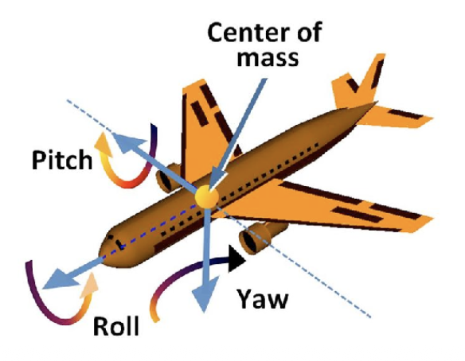
    

最后给出一个**罗德里格斯旋转公式**(Rodrigues' rotation formula)，它定义了一个表示沿任意轴 $\mathbf{n}$ 旋转 $\alpha$ 角的矩阵：

$$
\mathbf{R}(\mathbf{n}, \alpha) = \cos(\alpha) \mathbf{I} + (1 - \cos(\alpha))\mathbf{n}\mathbf{n}^T + \sin(\alpha) \underbrace{\begin{pmatrix}0 & -n_z & n_y \\ n_z & 0 & -n_x \\ -n_y & n_x & 0\end{pmatrix}}_{\mathbf{N}}
$$

>注：推导过程可参见这份[帖子](https://zhuanlan.zhihu.com/p/451579313)。

- $\mathbf{n}$ 是一个单位向量，如果不是的话需要先做归一化处理
- 轴 $\mathbf{n}$ 默认过原点，所以在沿不过原点的轴旋转的情况下，需要先将轴平移到可以穿过原点的位置，然后旋转图形，最后平移回去
- [**四元数**](https://zh.wikipedia.org/zh-cn/%E5%9B%9B%E5%85%83%E6%95%B8#%E7%BE%A4%E6%97%8B%E8%BD%89)(quanternion)：可计算旋转的差值，具体原理不展开介绍

## Viewing Transformations

### View/Camera Transformations

???+ info "引入"

    什么是**视图转换**(view transformations)（又叫**相机转换**(camera transformations)）呢？我们可以用摄影类比：

    - 寻找好地方，安排好人 -> 模型变换
    - 寻找放置相机的好角度 -> 视图变换
    - 茄子！-> 投影变换

在执行视图变换前，先要定义相机：

    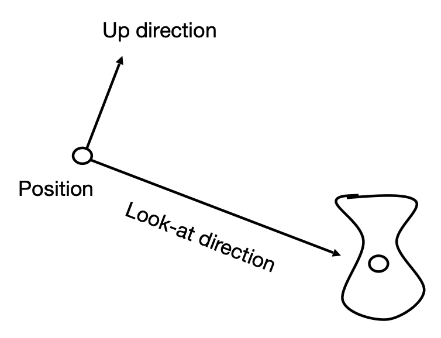

- 位置 $\vec{e}$
- 注视方向(look-at/gaze direction) $\hat{g}$
- 向上方向(up direction) $\hat{t}$（假定和注视方向垂直）

一个关键发现是，如果相机和所有物体一起运动（即相对位置保持不变），那么得到的照片会是相同的。

    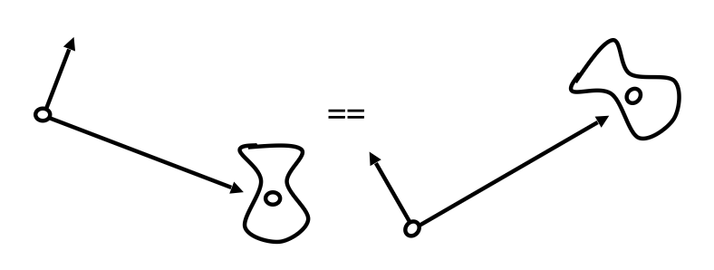

在坐标系中，我们总是将相机放在原点位置上，向上方向同 y 轴方向，而注视方向和 z 轴方向相反。之所以这么放，是因为可以简化操作，但也引入了一些问题，稍后会做分析。

    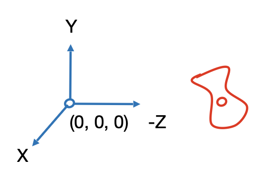

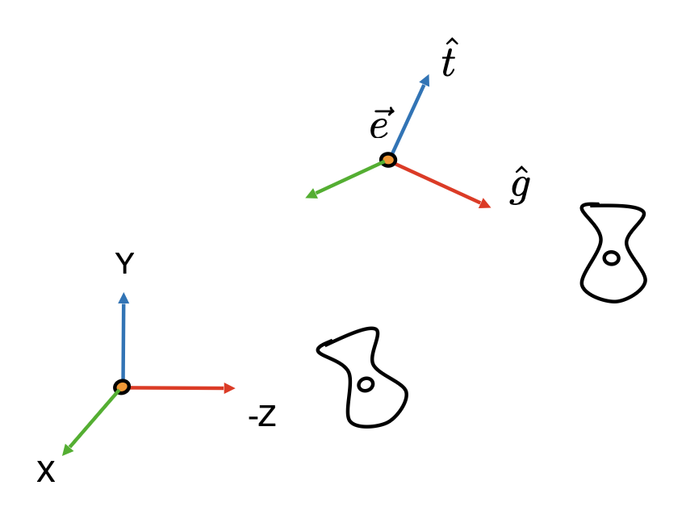{ align=right width=30% }

我们用矩阵 $M_{view}$ 表示对相机的变换。$M_{view}$ 要做的事情可分解为以下步骤：

- 将 $\vec{e}$ 移到原点
- 把 $\hat{g}$ 旋转至 -Z
- 把 $\hat{t}$ 旋转至 Y
- 把 $(\hat{g} \times \hat{t})$ 旋转至 X

步骤有些多，看起来有些复杂。不过本质上也就涉及到平移和旋转变换，所以令 $M_{view} = R_{view} T_{view}$

- 将 $\vec{e}$ 移到原点

    $$
    T_{view} = \begin{bmatrix}1 & 0 & 0 & -x_e \\ 0 & 1 & 0 & -y_e \\ 0 & 0 & 1 & -z_e \\ 0 & 0 & 0 & 1\end{bmatrix}
    $$

- 三个旋转：$\hat{g}$ -> -Z，$\hat{t}$ -> Y，$(\hat{g} \times \hat{t})$ -> X
    - 考虑逆向旋转：$(\hat{g} \times \hat{t})$ <- X，$\hat{t}$ <- Y，-$\hat{g}$ <- Z。根据前面所学，这些旋转操作可用

        $$
        R_{view}^{-1} = \begin{bmatrix}x_{\hat{g} \times \hat{t}} & x_t & x_{-g} & 0 \\ y_{\hat{g} \times \hat{t}} & y_t & y_{-g} & 0 \\ z_{\hat{g} \times \hat{t}} & z_t & z_{-g} & 0 \\ 0 & 0 & 0 & 1\end{bmatrix} \Rightarrow R_{view} = \begin{bmatrix}x_{\hat{g} \times \hat{t}} & y_{\hat{g} \times \hat{t}} & z_{\hat{g} \times \hat{t}} & 0 \\ x_t & y_t & z_t & 0 \\ x_{-g} & y_{-g} & z_{-g} & 0 \\ 0 & 0 & 0 & 1\end{bmatrix}
        $$

        这一步成立的原因是旋转矩阵是正交矩阵，而正交矩阵的逆 = 正交矩阵的转置，所以只需颠倒行列就行了。

之所以要介绍视图变换，是为后面的投影变换做准备。

### Projection Transformations

CG 中的**投影**(projection)本质上就是一个 3D 到 2D 的过程。投影变换分为以下两类：

- **正射投影**(orthographic projection)：常用于工程制图，无近大远小的现象
- **透视投影**(perspective projection)：近大远小；延伸立方体上的所有边，发现一些直线会汇聚于一点（学过素描的都知道）

    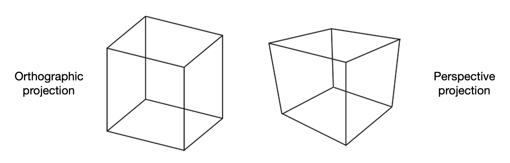

    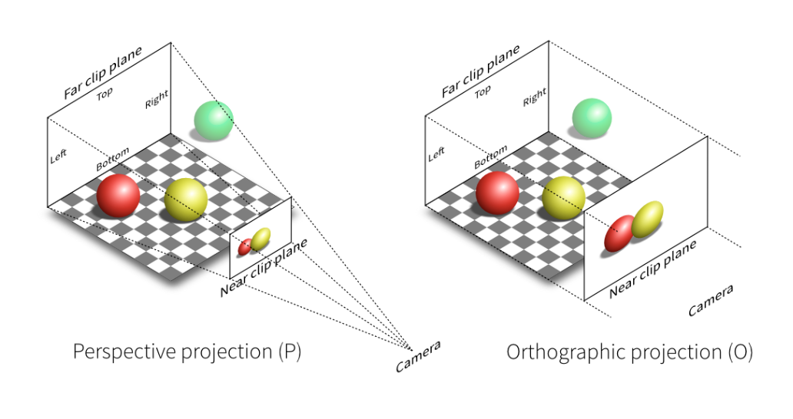

#### Orthographic Projection

可以这么理解正射投影的过程：

    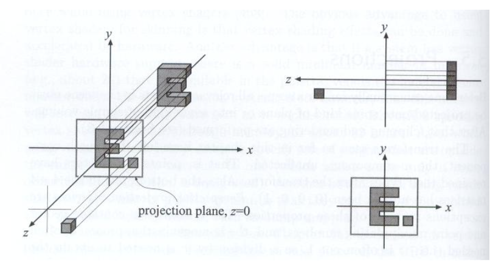

- 相机的摆放如前所述（放在原点，注视方向对着 -Z，向上方向对着 Y）
- 移除 Z 坐标
- 将结果矩形平移并缩放至 $[-1, 1]^2$ 上

通常，我们都会将坐标系中的长方体(cuboid) $[l, r] \times [b, t] \times [f, n]$ 映射到**正则立方体**(canonical cube) $[-1, 1]^3$ 上。

    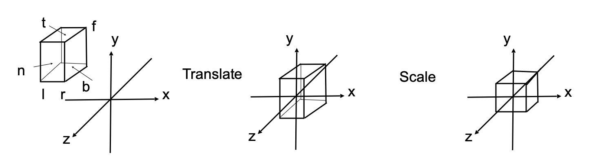

所以实际上的正则投影顺序和一开始的介绍有所区别：

- 先将长方体的中心平移到原点位置上
- 然后将其缩放至正则立方体

对应的转换矩阵如下：

$$
M_{ortho} = \begin{bmatrix}\frac{2}{r - l} & 0 & 0 & 0 \\ 0 & \frac{2}{t - b} & 0 & 0 \\ 0 & 0 & \frac{2}{n - f} & 0 \\ 0 & 0 & 0 & 1\end{bmatrix} \begin{bmatrix}1 & 0 & 0 & -\frac{r + l}{2} \\ 0 & 1 & 0 & -\frac{t + b}{2} \\ 0 & 0 & 1 & -\frac{n + f}{2} \\ 0 & 0 & 0 & 1\end{bmatrix}
$$

!!! note "注"

    - 由于规定相机朝向 -Z，因此图形的距离远近就显得不是很直观
    - 这也正是一些图形学 API 采用左手坐标系的原因

#### Perspective Projection

- 透视投影在 CG，艺术和视觉系统等领域更为常见
- 有近大远小的现象
- 几何上平行的线在透视投影中是不平行的，它们在远处会汇聚成一点

    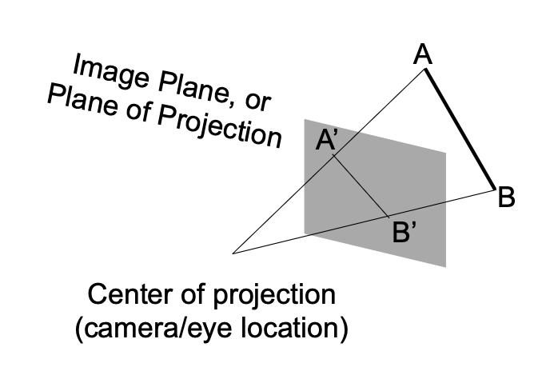

在继续介绍如何做透视投影前，先来回顾一下齐次坐标的概念。

- $(x, y, z, 1), (kx, ky, kz, k \ne 0), (zx, zy, z^2, z \ne 0)$ 都表示 3D 空间中相同的点 $(x, y, z)$，比如 $(1, 0, 0, 1), (2, 0, 0, 2)$ 表示的都是点 $(1, 0, 0)$
- 虽然简单，但有用

透视投影的过程分为：

- 先将**视锥**(frustum)“挤压(squish)”成一个长方体（n -> n, f -> f）（$M_{persp \rightarrow ortho}$）
    - 近平面不变，远平面向内挤压，但中点不动
- 然后做正射投影（$M_{ortho}$，前面已给出）

    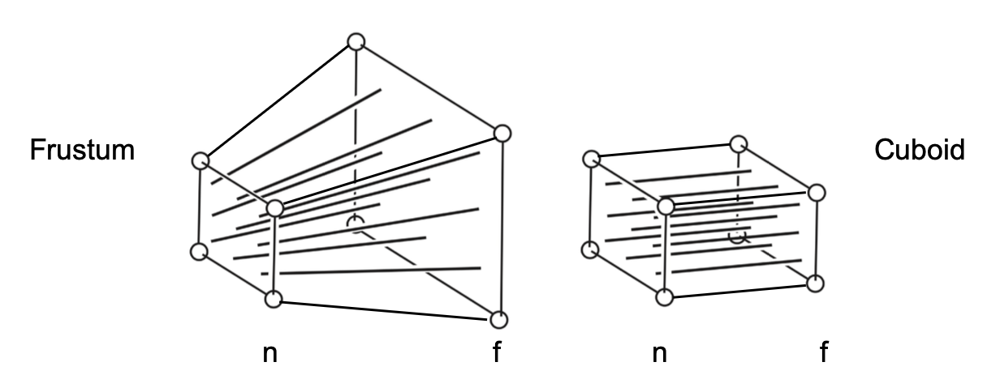

用矩阵表示为：$M_{persp} = M_{ortho} M_{persp \rightarrow ortho}$

要找出第一步的转换，关键思路在于寻找变换后的点 $(x', y', z')$ 和原来的点 $(x, y, z)$ 之间的关系

    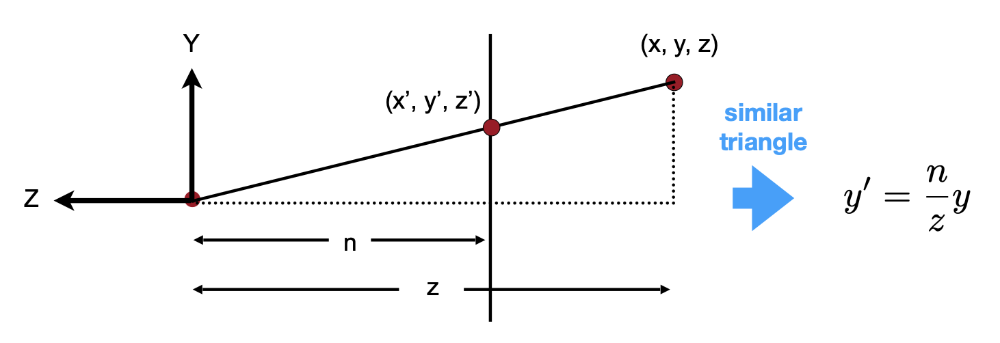

根据相似三角形的性质，$y' = \dfrac{n}{z} y, x' = \dfrac{n}{z} x$。用齐次坐标表示如下：

$$
\begin{pmatrix}x \\ y \\ z \\ 1\end{pmatrix} \Rightarrow \begin{pmatrix}nx/z \\ ny/z \\ \text{unknown} \\ 1\end{pmatrix} == \begin{pmatrix}nx \\ ny \\ \text{still unknown} \\ z\end{pmatrix}
$$

那么“挤压”（透视 -> 正交）投影所做的就是：

$$
M_{persp \rightarrow ortho}^{(4 \times 4)} \begin{pmatrix}x \\ y \\ z \\ 1\end{pmatrix} = \begin{pmatrix}nx \\ ny \\ \text{unknown} \\ z\end{pmatrix}
$$

根据现有的信息，我们其实已经能推断出矩阵 $M_{persp \rightarrow ortho}$ 内的很多元素了：

$$
M_{persp \rightarrow ortho} = \begin{pmatrix}n & 0 & 0 & 0 \\ 0 & n & 0 & 0 \\ ? & ? & ? & ? \\ 0 & 0 & 1 & 0\end{pmatrix}
$$

接下来的目标就是搞清矩阵中第三行的元素，它们和 $z'$ 相关。观察发现：投影后，

- 近平面上的任何点都不会发生变化
- 远平面上的 z 坐标不会发生变化

基于第一点发现，可以得到以下等式：

$$
M_{persp \rightarrow ortho}^{(4 \times 4)} \begin{pmatrix}x \\ y \\ z \\ 1\end{pmatrix} = \begin{pmatrix}nx \\ ny \\ \text{unknown} \\ z\end{pmatrix} \textcolor{cornflowerblue}{\xRightarrow{\substack{\text{relace } \\ z \text{ with } n}}} \begin{pmatrix}x \\ y \\ n \\ 1\end{pmatrix} \Rightarrow \begin{pmatrix}x \\ y \\ n \\ 1\end{pmatrix} == \begin{pmatrix}nx \\ ny \\ n^2 \\ n\end{pmatrix}
$$

所以第三行元素的形式一定为 $\begin{pmatrix}0 & 0 & A & B\end{pmatrix}$，即：

$$
\begin{pmatrix}0 & 0 & A & B\end{pmatrix} \begin{pmatrix}x \\ y \\ n \\ 1\end{pmatrix} = n^2
$$

其中 $n^2$ 和 $x, y$ 无任何关系。这样就可以得到：$An + B = n^2 \quad (1)$。

再根据第二点发现，又能得到：

$$
\begin{pmatrix}0 \\ 0 \\ f \\ 1\end{pmatrix} \Rightarrow \begin{pmatrix}0 \\ 0 \\ f \\ 1\end{pmatrix} == \begin{pmatrix}0 \\ 0 \\ f^2 \\ f\end{pmatrix}
$$

从而 $Af + B = f^2 \quad (2)$。将 (1)(2) 联立，解得 $\begin{cases}A = n + f \\ B = -nf\end{cases}$。

现在 $M_{persp \rightarrow ortho}$ 内的所有元素均是已知的了。接下来就可以继续做正射投影了。

---
现在回过头来看另一种常见的定义视锥的方式——除了用 $l, r, b, t, n, f$ 这六个值表示外，还有：

- 垂直**可视角度**(vertical field-of-view, fovY)
    - 摄影的广角就是 fovY 较大
- **宽高比**(aspect ratio)

    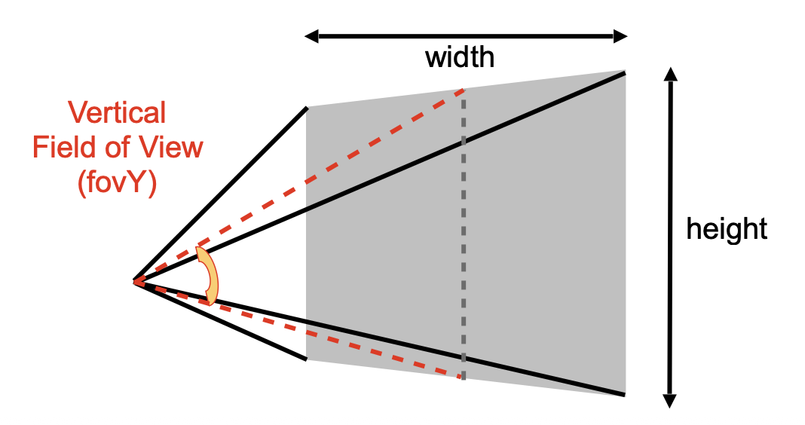

???+ info "注"

    - 这里假设是对称的，即 $l = -r, b = -t$
    - 知道这两者就可以推出水平可视角度（用于游戏）

将 fovY 和宽高比转换至 $l, r, b, t$ 是很轻松的事：

    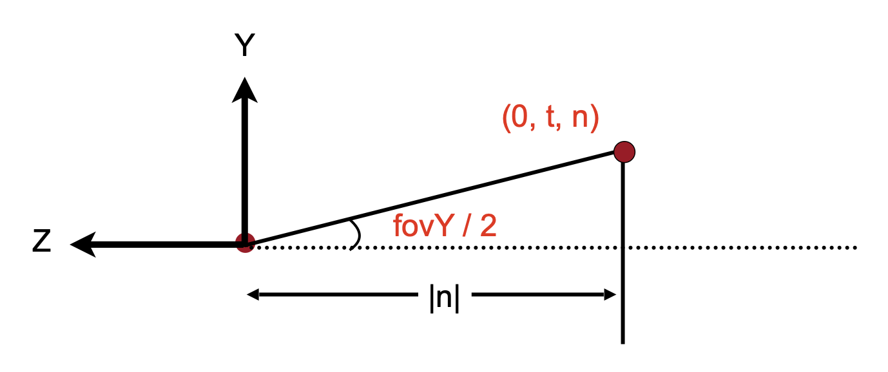

- $\tan \dfrac{\text{fovY}}{2} = \dfrac{t}{|n|}$
- $\text{aspect} = \dfrac{r}{t}$
