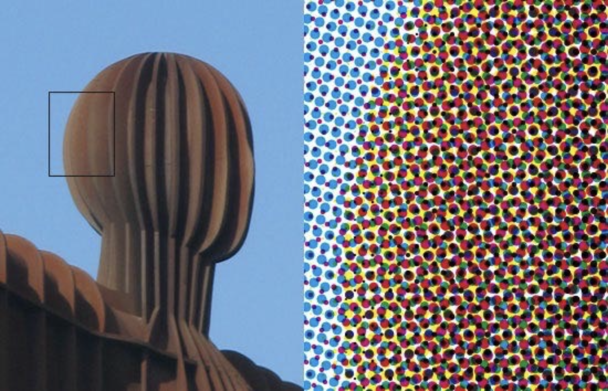

# Rasterization

## Viewport Transformation

标题中的 MVP 分别指代了上一讲的三个变换：

- 模型变换(**M**odel transformation)（放置物体）
- 视图变换(**V**iew transformation)（放置相机）
- 投影变换(**P**rojection transformatino)
    - 正则投影（长方体 -> $[-1, 1]^3$ 的正则立方体）
    - 透视投影（视锥 -> 正则立方体）

所以通过上一讲的各种变换，我们最终得到了一个正则立方体。那我们要这个正则立方体干什么呢？将它画在一块**屏幕**(screen)上。屏幕的定义是：

- 一个**像素**(pixels)数组
    - pixel 一词是由 picture（图像）和 element（元素）两个单词构成的
    - 目前假定一个像素就是一个颜色一致的小方形
    - 像素的颜色是由（<span style="color: red">红色</span>，<span style="color: green">绿色</span>，<span style="color: blue">蓝色</span>）混合而成的
- 数组的大小就是**分辨率**(resolution)
- 一种典型的光栅显示器(raster display)
    - raster 一词在德语就是 screen 的意思
    - 而它的动词形式 rasterize（光栅化）的意思就是“画在屏幕上”

由“屏幕”延伸出来的一个概念是**屏幕空间**(screen space)

>注：以下定义和虎书上的有略微的不同。

<div style="text-align: center">
    
</div>

- 像素的索引形式为 (x, y)，其中 x, y 均为整数
- 像素的索引范围为 (0, 0) 到 (width - 1, height - 1)
- 像素 (x, y) 的中心为 (x + 0.5, y + 0.5)
- 屏幕的覆盖范围为 (0, 0) 到 (width, height)

正则立方体被画在屏幕上的时候，

- 不考虑 z
- 仅在 xy 平面上变换：$[-1, 1]^2 \rightarrow [0, \text{width}] \times [0, \text{height}]$

    <div style="text-align: center">
        
    </div>

- 视口(viewport)变换矩阵：

    $$
    M_{viewport} = \begin{pmatrix}\frac{\text{width}}{2} & 0 & 0 & \frac{\text{width}}{2} \\ 0 & \frac{\text{height}}{2} & 0 & \frac{\text{height}}{2} \\ 0 & 0 & 1 & 0 \\ 0 & 0 & 0 & 1\end{pmatrix}
    $$


## Different Raster Displays

- 示波器(oscilloscope)

    <div style="text-align: center">
        
    </div>

    - [🔗视频链接：用示波器绘制蘑菇](https://www.youtube.com/watch?v=rtR63-ecUNo)

        <div style="text-align: center">
            
        </div>

- [**阴极射线管**](https://zh.wikipedia.org/zh-cn/%E9%98%B4%E6%9E%81%E5%B0%84%E7%BA%BF%E7%AE%A1)(cathode ray tube, CRT)——示波器背后的装置

    <div style="text-align: center">
        
    </div>

- 早期的电视和显示器就是基于光栅显示 CRT
    - 显示器上的内容通过 CRT 一行行扫描显示出来

        <div style="text-align: center">
            
        </div>

    - 隔行扫描：先扫完奇数行，后扫偶数行，工作量减少一半，人眼的视觉停留导致不易察觉
        - 现在的视频压缩上仍然沿用这一思想
        - 问题：严重的画面撕裂，特别是对高速运动的画面，会出现“鬼影”

- 帧缓冲区(frame buffer)：光栅显示器的内存（在现代计算机中就是显存）
    - 显示器显示的图像就是内存中保存的内容

    <div style="text-align: center">
        
    </div>

- 平板显示器(flat panel display)
    - 低分辨率液晶显示器(low-res LCD display)

        <div style="text-align: center">
            
        </div>

    - 彩色 LCD, OLED, ...

        <div style="text-align: center">
            
        </div>

        - LCD（液晶显示器(liquid crystal display)）像素
            - 原理：通过扭转偏振(polarization)来阻挡或传递光线
            - 背光照明（例如荧光灯(fluorescent)或 LED）
            - 通过部分扭转达到合适的亮度

            <div style="text-align: center">
                
            </div>

        - LED（发光二极管(light emitting diode)）阵列显示器

            <div style="text-align: center">
                
            </div>

        - 电泳(electrophoretic)（电子墨水）显示屏

            <div style="text-align: center">
                
            </div>


## Rasterizing a Triangle

**光栅化**(rasterization)的意思就是将物体绘制在光栅显示器上，

- 可以用多边形的网格(polygon meshes)

    <div style="text-align: center">
        
    </div>

    >图中的老虎并不是真的，而是通过 CG 技术绘制出来的。

- 也可以用三角形的网格(triangle meshes)

    <div style="text-align: center">
        
        
    </div>

通常我们将三角形作为基本的形状图元(fundamental shape primitives)，这是因为：

- 三角形是最基础的多边形，并且任何多边形都可以被拆分成多个三角形
- 一些独特的性质
    - 保证是一个平面(planar)
    - 三角形的内外部定义清晰
    - 在三角形顶点上的插值由明确定义的方法（重心插值(barycentric inrerpolation)），也就是说只要知道三角形三个顶点的属性，就能知道三角形内任何一点的属性

---
现在我们的目标是用像素来近似表示一个三角形。用更规范的语言表述为：找到一个函数，满足

- 输入：三角形顶点投影在屏幕上的位置
- 输出：一个用于近似表示三角形的像素集合

<div style="text-align: center">
    
</div>

一种简单的光栅化方法是**采样**(sampling)，即对于一个连续的函数上，在特定点上计算函数值，从而**离散化**(discretize)一个函数。下面用 C++ 代码表示这一过程：

```cpp
for (int x = 0; x < xmax; ++x)
    output[x] = f(x);
```

采样是图形学中的一个核心思想，我们可以采样时间（1D）、面积（2D）、方向（2D）和体积（3D）。而光栅化就是一种 2D 采样：

<div style="text-align: center">
    
</div>

如果仅考虑像素中心在三角形范围内的像素，结果如下：

<div style="text-align: center">
    
    
</div>

我们需要定义一个二元函数 `inside(tri, x, y)`，来判断一个点 `(x, y)`（`x`, `y` 不必是整数）是否在三角形内。如果是的话，函数返回1，否则返回0。所以光栅化的过程就相当于采样一个 2D 的指示器函数。

```cpp
for (x = 0; x < xmax; ++x)
    for (y = 0; y < ymax; ++y)
        image[x][y] = inside(tri, x + 0.5, y + 0.5);
```

<div style="text-align: center">
    
</div>

接下来的问题是：`inside` 函数如何实现？这时，前面介绍过的[叉积](2.md#cross-product)就派上用场了！判断一个点是否在三角形内，只要看这个点是否在构成三角形的沿同一方向（比如逆时针）的三条向量的同一侧，如果是的话就说明这个点在三角形内；只要出现异侧的情况，就说明点在三角形外。

<div style="text-align: center">
    
</div>

像下图所示的（字面意义上的）边界情况就比较复杂：这个点到底算三角形1的，还是算三角形2的？这个就由自己定义，只要合理就行。像 OpenGL，DirectX 等图形学 API 的定义会更加复杂，所以我们不会深究。

<div style="text-align: center">
    
</div>

要想更快地检查三角形所在的所有屏幕像素，我们可以根据已知的三角形三顶点的坐标来确定一个**包围盒**(bounding box)，即包围三角形的最小矩形。

<div style="text-align: center">
    
</div>

还有一种更快的遍历方法叫做**递增三角形遍历**(incremental triangle traversal)，它更适合那种旋转一定角度的瘦长的三角形（自行脑补一下）。

<div style="text-align: center">
    
</div>

---
如果显示器直接显示采样出来的信号，结果如下：

<div style="text-align: center">
    
    
</div>

虽然像素的排列遵循原来的三角形，但形状上还是差的有点多，边缘一点也不平整，出现了一种叫做**锯齿**(jaggies)的东西。图形带锯齿的现象又称为**走样**(aliasing)，之后会介绍如何处理该问题。


## Rasterization on Real Displays

下面展示了真实的 LCD 屏幕像素：

<div style="text-align: center">
    
</div>

- 注意到这两部手机的像素的几何形状有一定差异，并且和之前假设的“像素是一个小块”有着很大的不同
- 右图这种像素排列叫做 Bayer pattern，不难发现绿色的点多于红色和蓝色的点，因为人眼对绿色最为敏感

此外，在彩色打印机上，显示方法会更复杂：

<div style="text-align: center">
    
</div>

但不管如何，之后我们还是假设显示器的像素就是一个匀色的小方块。

<div style="text-align: center">
    
</div>


## Antialiasing

### Sampling Theory

#### Sampling Artifacts

采样在 CG 中是普遍存在的：

- 光栅化：在 2D 坐标上采样
- 照片(photograph)：在图像传感器平面上采样

    <div style="text-align: center">
        
    </div>

- 视频：在时间上采样

    <div style="text-align: center">
        
    </div>

正因为被广泛使用，采样在实际运用时会遇到各种问题，称为**采样瑕疵**(sampling artifact(errors/mistakes/inacurracies))，包括了：

- **锯齿**(jaggies)：空间上的采样
    - 也是走样的一个例子
- **摩尔纹**(Moiré patterns)：图像上出现的扭曲条纹，原因在于欠采样(undersampling)

    <div style="text-align: center">
        
    </div>

- **车轮错觉**(wagon wheel illusion)（假动作(false motion)）：时间上的采样

    <div style="text-align: center">
        
    </div>

- ...

这些采样瑕疵出现的原因都可以总结为：**信号变化速度太快（高频率），而采样速度太慢了**。


#### Blurring(Pre-filtering)

还是以红色三角形为例，

- 如果直接在原图像采样，光栅化后的三角形就有很多锯齿，像素要么是红色，要么是白色

    <div style="text-align: center">
        
    </div>

- 在采样前先做一步**预滤波**(pre-filter)（又称**模糊**(blur)）后，原来光栅化后三角形的锯齿颜色就是渐变色的，看起来就没那么明显了，从而实现反走样的效果

    <div style="text-align: center">
        
    </div>

???+ example "例子"

    === "例1"

        === "直接采样"

            <div style="text-align: center">
                
            </div>

        === "通过模糊实现反走样"

            <div style="text-align: center">
                
            </div>

    === "例2"

        比对模糊前后的两张图：

        <div style="text-align: center">
            
        </div>

        如果先采样后模糊（滤波），其效果如下面左图所示。所以**模糊一定要在采样之后做**！

        <div style="text-align: center">
            
        </div>

到目前为止，也许读者会有以下疑惑：

- 为什么欠采样会导致走样呢？
- 为什么先预滤波再采样能够实现反走样呢？

下面就来探究背后的原因，以及如何实现反走样的光栅化。


#### Frequency Domain

说到**频率**(frequency)，自然无法回避中学学过的三角函数：

<div style="text-align: center">
    
</div>

另外要介绍的一个重要概念是**傅里叶变换**(Fourier transform)，它可以让一个函数表示为多个正弦和余弦函数之和。

<div style="text-align: center">
    
</div>

傅里叶变换的作用就是把一个信号（**空间域**(spatial domain)）分解为一个个频率（**频域**(frequency domain)）。

<div style="text-align: center">
    
</div>

??? info "一些函数的傅里叶变换"

    === "正弦函数"

        <div style="text-align: center">
            
        </div>

    === "常数函数"

        <div style="text-align: center">
            
        </div>

    === "狄拉克(Dirac)函数"

        <div style="text-align: center">
            
        </div>

    === "盒函数"

        <div style="text-align: center">
            
        </div>

    === "高斯函数"

        <div style="text-align: center">
            
        </div>

从下图可以看出，更高的频率需要更快的采样，否则就会出现根据采样结果重构而成的信号和原信号相差过大（更像是低频信号）的问题。

<div style="text-align: center">
    
</div>

也就是说，正是**欠采样**导致了频率走样的现象。这里的「**走样**」(aliasing)就是指对于给定的采样率，无法根据采样结果区分两种频率的信号。

---
而滤波要做的就是移除某些特定频率的内容。对于下面两幅图，右图是左图在频域上的表现，越亮表示频率越低。

<div style="text-align: center">
    
</div>

=== "只移除低频内容（**高通滤波器**(high-pass filter)）"

    <div style="text-align: center">
        
    </div>

=== "只移除高频内容（**低通滤波器**(low-pass filter)）"

    <div style="text-align: center">
        
    </div>

=== "同时移除低频和高频内容"

    <div style="text-align: center">
        
    </div>

=== "同时移除低频和高频内容（但改变范围）"

    <div style="text-align: center">
        
    </div>


#### Convolution

从另一个角度看，滤波做的事就是一种**卷积**(convolution)。我们可以将卷积简单理解为“求平均数”：对于一排点，逐点地在滑动窗口(sliding window)（即**滤波器**(filter)）内求平均值。

<div style="text-align: center">
    
</div>

!!! theorem "卷积定理(convolution theorem)"

    空间域上的卷积 = 频域上的乘法，空间域上的乘法 = 频域上的卷积

    <div style="text-align: center">
        
    </div>

由此带来以下选择：

- 选择1：在空间域上用卷积滤波
- 选择2（选择1的等价操作，更麻烦，一般不会这么做）：
    - 先变换到频域上（傅里叶变换）
    - 再乘以卷积核的傅里叶变换
    - 最后转换回空间域上（逆向傅里叶变换）

???+ example "例子"

    <div style="text-align: center">
        
    </div>

    注意到滤波器上各元素之和为1——做过归一化处理，确保图像亮度不会有明显改变。

在 2D 的图像上，滤波器也是 2D 的，而且一般也是方形的，故称为**盒滤波器**(box filter)（又称均值滤波器(mean filter)）。

<div style="text-align: center">
    
</div>

这样的“盒函数”是一种**低通滤波器**：

<div style="text-align: center">
    
</div>

滤波器越大，能通过的频率就越低。可以这样想，假如滤波器和图像本身一样大，那么滤波后的图像就只有模糊的一点，而频率越低图像越平滑/模糊；又比如滤波器只有一个像素那么大，那么滤波后的图像就和原图像一致，也就是说任何大小的频率都通过了。

<div style="text-align: center">
    
</div>


#### Repeating Frequency Contents

现在再从频域的角度看采样——采样就是在重复频域上的内容。来看下面几幅图：

<div style="text-align: center">
    
</div>

- (b) 图是 (a) 图傅里叶变换后的结果
- 要将 (a) 图上的连续函数变成一系列离散的点（采样），就需要将这个函数和另一个函数（(c) 图）相乘，而这另一个函数仅在某些位置上有值，其他地方均为0。我们称这样的函数为**冲激函数**
- 冲激函数经过傅里叶变换后会变成另一种冲激函数（(d) 图）
- 空间域上的乘积 = 频域上的卷积，所以 (b) 和 (d) 卷积的结果如 (f) 图所示，发现采样做的事就是拷贝多份原函数的频谱

不同的采样率会影响这些重复频谱之间的间隔：**采样越快，这些频谱的间隔越大（频率大）**，反之就越小，频谱就有可能重叠在一起。这种混叠正是走样产生的原因。

<div style="text-align: center">
    
</div>


#### Solutions

综上，我们可以总结出以下减少走样瑕疵的路径：

- **增加采样率**
    - 从而增大重复频谱在频域上的间隔
    - 具体做法：采用分辨率更大的显示器、传感器或帧缓冲区...
    - 但这种方法成本高昂，且有可能需要很高的分辨率，受物理性质限制
- **反走样**
    - 在重复生成频谱前，让频谱变窄
    - 即**在采样前先滤去高频内容**


### Antialiasing in Practice

反走样 = 先限制，再重复

<div style="text-align: center">
    
</div>

反走样的具体实现如下：

- 通过单像素框模糊，对 f(x, y) 做**卷积**
- 然后在每个像素的中心上**采样**

在光栅化一个三角形时，一个像素面积内的 f(x, y) 的平均值 = inside(triangle, x, y)（三角形覆盖的像素面积）。

<div style="text-align: center">
    
</div>


#### MSAA

如果要对被三角形覆盖的每个像素求平均值，那么计算量太大了。所以人们想到了一种近似方法，叫做**多重采样反走样**(multisample antialiasing)，它用更多的采样点实现反走样（所以又称**超采样**(supersampling)）。具体的工作原理为：通过在像素内多个位置采样并求它们的均值来近似一个单像素框滤波器的效果（简单理解为将原本的一个像素划分成多块更小的像素，然后在这些小像素上采样）。

<div style="text-align: center">
    
</div>

???+ example "例子"

    这是在使用最基础的点采样（每个像素仅采样一次）的结果。

    <div style="text-align: center">
        
    </div>

    现在我们要使用超采样。第一步是将每个像素进行 NxN（这里是 2x2）的采样。

    <div style="text-align: center">
        
    </div>

    第二步是计算在每个像素“内”的 NxN 采样的平均值。

    <div style="text-align: center">
        
    </div>

    <div style="text-align: center">
        
    </div>

    <div style="text-align: center">
        
    </div>

    这是最终呈现在显示器上的信号。

    <div style="text-align: center">
        
    </div>


#### Antialiasing Today

使用 MSAA 的代价就是增大了计算量，比如将一个像素划分为 4x4 的小格，就会增加 16 倍的计算量。

下面介绍一些在工业界得到广泛应用的反走样算法：

- **FXAA**（快速近似反走样(fast approximate antialiasing)：找出锯齿（图像匹配），换成无锯齿的边界，和采样无关
- **TAA**（时间反走样(temporal antialiasing)）：复用上一帧的感知结果，将上一帧的像素值应用在当前帧上

还有一个经常和反走样放在一起，和反走样不太一样但概念十分相似的东西，叫做**超分辨率**(super resolution)，它要做的是将低分辨率的图变成高分辨率，这中间也存在采样率不足的问题。一种常见的解决方案是 **DLSS**（深度学习超采样(deep learning super sampling)），顾名思义就是通过深度学习的方式，让机器从低分辨率的图片中预测高分辨率图片的细节。


## Visibility / Occlusion

通过前面的学习，我们知道如何将一个三角形画在屏幕上。现在考虑多个三角形，它们相对相机的距离不同，那么怎么把它们画在屏幕上，并且做到近的三角形遮挡远的三角形。


### Painter's Algorithm

第一种算法的灵感来自绘制油画的画家。他们一般会先画远处的风景，再画近处的物体，这些物体会覆盖远景。所以这个算法叫做**画家算法**(painter's algorithm)：从后往前绘制图形，近的图形会**覆写**(overwrite)帧缓冲区原有的内容。

<div style="text-align: center">
    
</div>

不过这个简单的算法存在以下问题：

- 需要先对三角形按深度排序（若有 $n$ 个三角形，复杂度为 $O(n \log n)$）
- 存在无法通过深度排序的三角形，如下图所示的三个互相重叠的三角形

    <div style="text-align: center">
        
    </div>


### Z-Buffer

所以接下来介绍 CG 中常用的一种算法，叫做**深度缓存**(deep buffer / z-buffer)。它的思想是：

- **对于每个像素**，存储当前最小的深度（z 坐标值）
- 需要用一个额外的缓冲区存储深度值
    - 原有的帧缓存存储像素的颜色值
    - 深度缓存存储像素的深度值

!!! info "注"

    为简洁起见，我们假设 **z 值始终为正**，且 z 越小表示离相机越近，越大表示离相机越远。

???+ example "例子"

    <div style="text-align: center">
        
    </div>

    右图表示深度缓存中每个像素的深度值，可以看到越近的地方颜色越黑，表示值越小。

下面给出深度缓存算法的伪代码：

```cpp
Initialize depth buffer to infinity
// During rasterization:
for (each triangle T)
    for (each sample (x, y, z) in T)
        if (z < zbuffer[x, y])              // closest sample so far
            framebuffer[x, y] = rgb;        // update color
            zbuffer[x, y] = z;              // update depth
        else
            ;                // do nothing, this sample is occlusded
```

???+ example "例子"

    <div style="text-align: center">
        
    </div>

    - 原图（左上角）每个像素的深度值假设是无穷大的
    - 红色三角形的每个像素的深度值均为 5，都比初始图像小，因此能够完全覆盖原图（右上角）
    - 现在又引入一个蓝色三角形，它的部分像素深度值比 5 大（远），部分比 5 小（近），这些深度值小的像素点就能覆盖原来红色三角形所在的像素，剩下的会被红色三角形遮挡

深度缓存算法的复杂度：

- 若有 $n$ 个三角形，复杂度为 $O(n)$（假设每个三角形覆盖常数个像素）
- 之所以是线性时间，是因为深度缓存只记录当前像素点最小的深度值，不需要为所有的深度值做排序
- 即便三角形的绘制顺序不同，也不影响使用该算法得到的最终结果
- 因此它是 CG 中最重要的可见性(visibility)算法之一，几乎在所有的 GPU 上都得到实现
- 可结合 MSAA 使用（见作业2）
- 缺点：处理不了透明物体

??? abstract "总结前两讲学过的内容"

    <div style="text-align: center">
        
    </div>