# Shading

??? info "引入"

    通过前面所学，理论上我们能够绘制出以下立方体，但看起来还不太真实。

    <div style="text-align: center">
        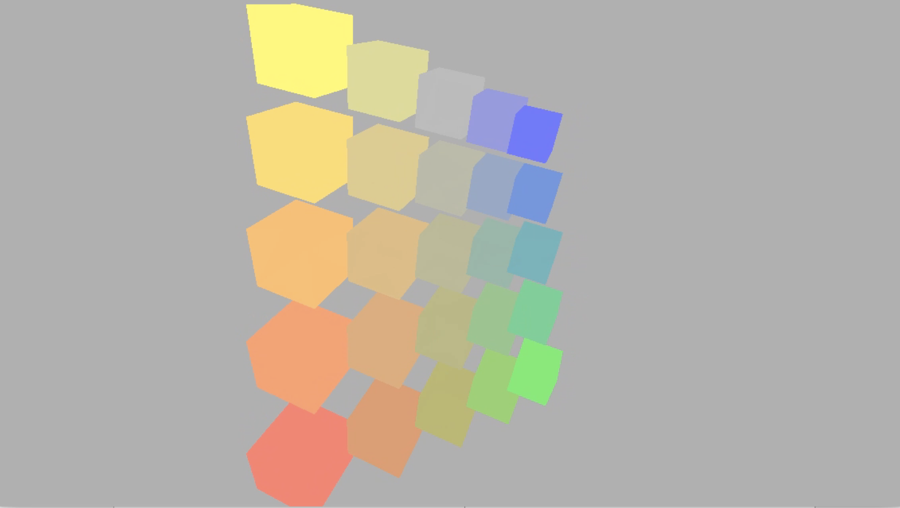
    </div>

    在学过本讲内容后，我们就能得到更加真实的立方体。

    <div style="text-align: center">
        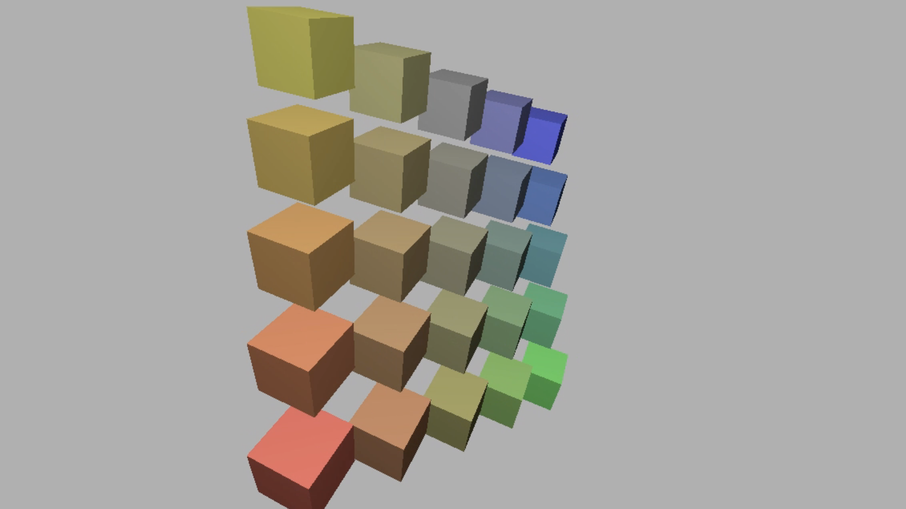
    </div>

    这中间差的是什么呢？再来看下面这幅图，它不是真实存在的物体，而是用计算机画出来的。

    <div style="text-align: center">
        
    </div>  

    之所以能形成如此逼真的效果，正是因为本讲要介绍的技术——**着色**(shading)！

**着色**(shading)的定义如下：

- 韦氏大词典：shad·ing, [ˈʃeɪdɪŋ], noun. The darkening or coloring of an illustration or diagram with parallel lines or a block of color.
- 在这节课中，我们认为着色是将不同的**材质**(material)应用到不同物体上的过程。


## Blinn-Phong Reflectance Model

首先来介绍最简单的着色模型——**Blinn–Phong 反射模型**(Blinn-Phong reflectance model)。反射模型考虑了光线和物体材质之间的作用，以及如何反射光线。来看下面这张图片：茶杯被图片右上方的光源照亮，因而在茶杯上形成多个不同区域，包括：

<div style="text-align: center">
    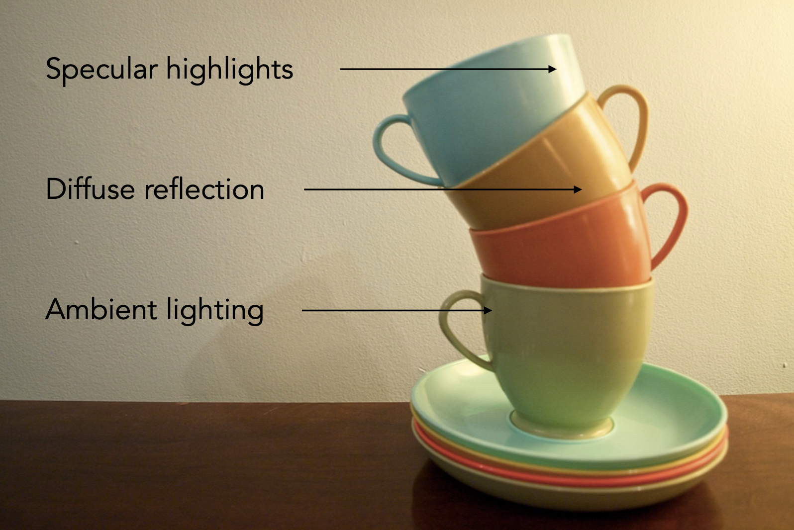
</div>

- **高光**(specular highlight)：直面光源的物体表面十分明亮的部分
- **漫反射**(diffuse reflection)：物体表面光亮变化不是很明显的部分，光线照在该部分会被反射到四面八方
- **环境光照**(ambient lighting)：没有被光源直接照射的地方，其光亮来自环境其他物体的反射光

{ align=right width=30% }

着色要做的就是计算在特定**着色点**(shading point)上反射到相机的光线。在计算前，我们需要定义一些输入量：

- **观测方向**(viewer direction)：$v$
- **表面法线**(surface normal)：$n$
- **光照方向**(light direction)：$I$
- **表面参数**(surface parameters)：包括颜色、反光度(shininess)等

>注：这些向量都是**单位向量**。

值得一提的是，着色是局部的事情，这意味着对每个像素着色时，我们仅考虑其自身（当然光照和观测者还是要考虑的），不考虑其他任何物体。所以在着色(shading)过程中，不会产生任何**阴影**(shadow)（shading != shadow）。

<div style="text-align: center">
    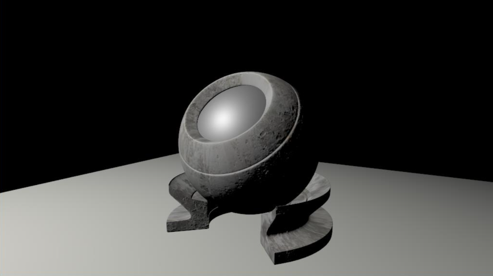
</div>


### Diffuse Reflection

漫反射就是光线照射到物体表面后，向所有方向上均匀散射的过程。因此从所有方向看这块表面的颜色均相同。

<div style="text-align: center">
    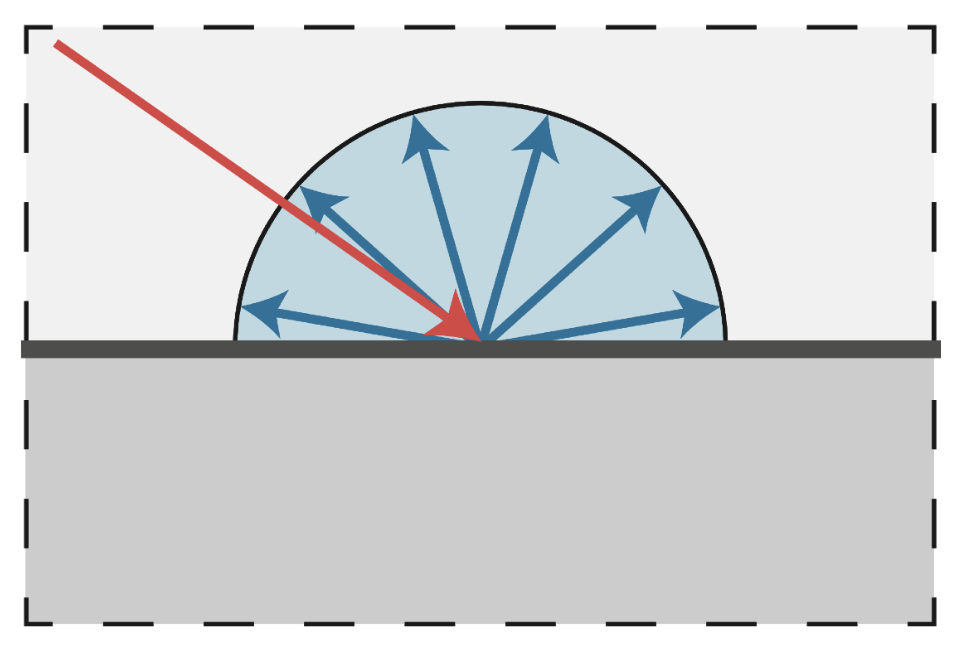
</div>

现在我们想知道物体表面能够接收多少光照（或者说能量(energy)）呢？

- **朗伯余弦定律**(Lambert's cosine law)：着色点上单位面积接收的光照和光照方向与法线夹角的余弦值（即 $\cos \theta = I \cdot n$（回忆以下这两个向量都是单位向量，因此点乘结果就是夹角的余弦值））成正比。

    <div style="text-align: center">
        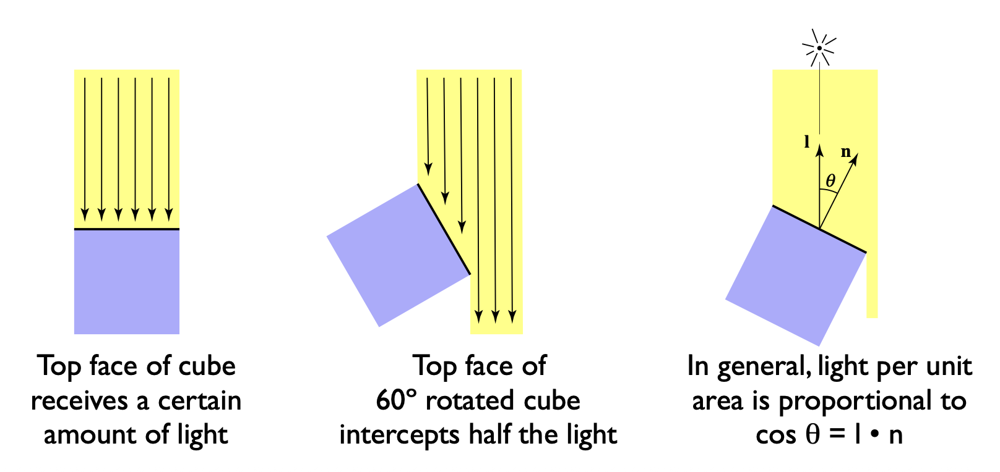
    </div>

- **光照衰减**(light falloff)：在 3D 空间中，点光源的光线沿四面八方发射，形成一个球体。在同一个球面下，光照强度是一样的。离点光源越近，光强越大。
    - 假设离点光源距离为1的光强为 $I$，那么距离点光源 $r$ 的光强就为 $I / r^2$，即和球面面积成反比

    <div style="text-align: center">
        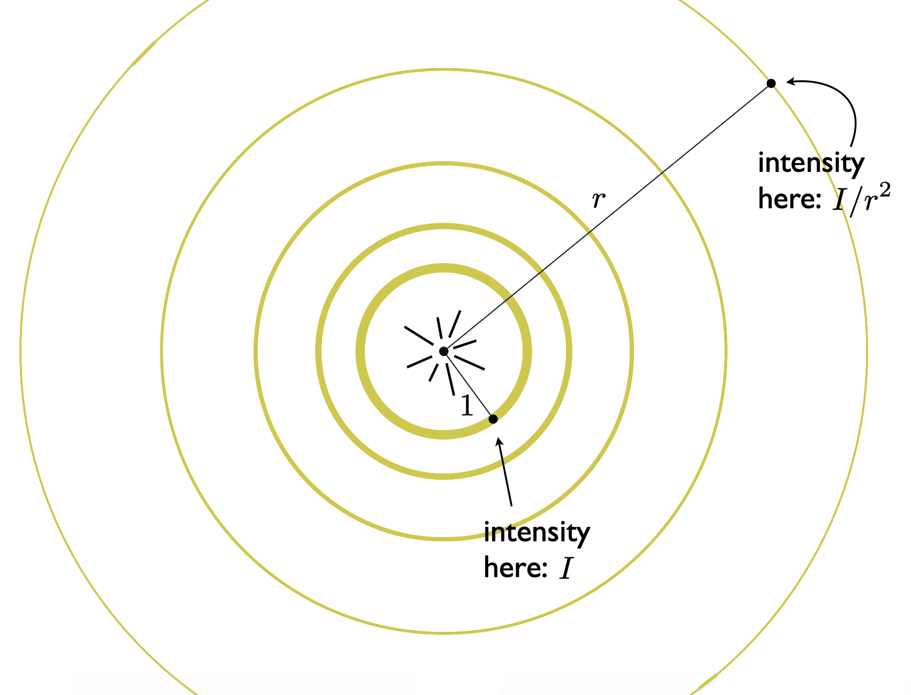
    </div>

综上，我们得到了计算漫反射光照的计算公式：

$$
L_d = k_d (I / r^2) \max(0, \bm{n} \cdot \bm{l})
$$

- $L_d$：漫反射光照
- $k_d$：漫反射系数（颜色）

    <div style="text-align: center">
        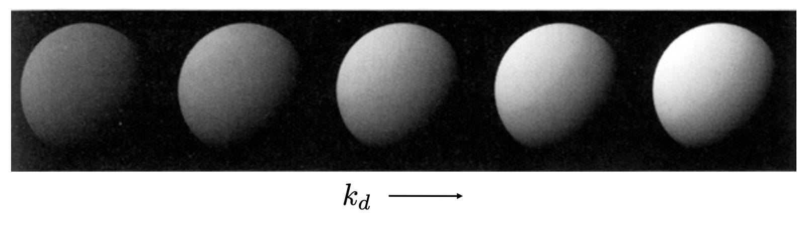
    </div>

- $I / r^2$：到达着色点的能量
- $\max(0, \bm{n} \cdot \bm{l})$：着色点吸收的能量


### Specular Term

高亮强度取决于观测方向——观测方向和镜面反射光线方向越接近，高光就越亮。

<div style="text-align: center">
    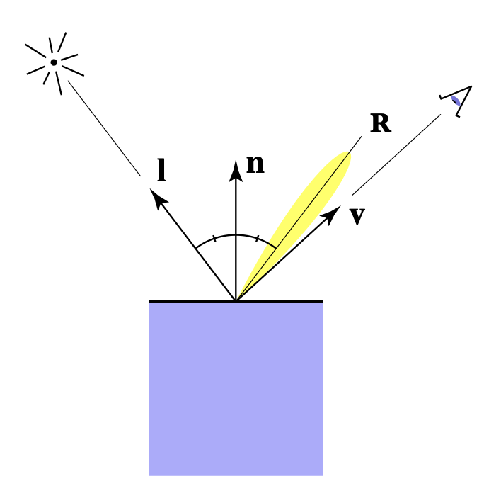
</div>

直接计算这两者的距离有些困难。但好在有人想到了一种巧妙的解决方案：将“观测方向和镜面反射光线方向之间的距离”转化到“表面法线和半程向量(half vector)（即入射光和反射光之间的角平分线）的夹角”。由于两个向量都是单位向量，所以通过点乘就能计算夹角的余弦值。半程向量的计算公式为：

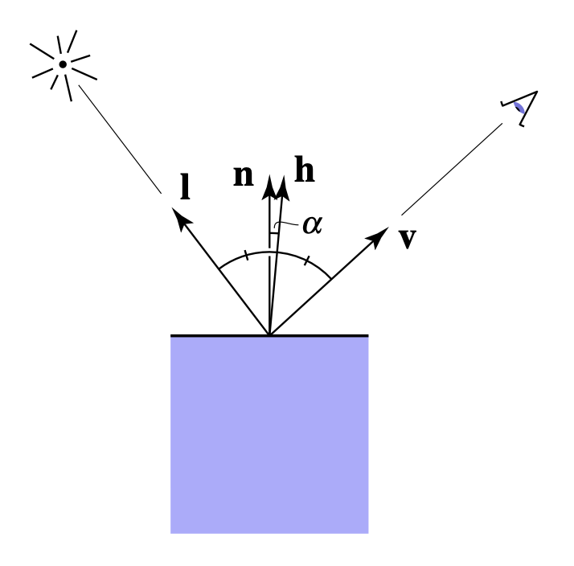{ align=right width=30% }

$$
\bm{h} = \text{bisector}(\bm{v}, \bm{l}) = \dfrac{\bm{v} + \bm{l}}{\|\bm{v} + \bm{l}\|}
$$

高光强度的计算公式和漫反射光强类似：

$$
\begin{align*}
L_s & = k_s (I / r^2) \max(0, \cos \alpha)^p \\
& = k_s (I / r^2) \max(0, \bm{n} \cdot \bm{h})^p
\end{align*}
$$

- $k_s$ 为高光系数
- 做 $p$ 次幂的原因：
    - 如果不加的话（即 $p = 1$），当夹角变大时，余弦值的下降速度并不快
    - 但我们知道对于真实世界下的高光，只要偏的度数稍多，高光就看不到了
    - 对余弦函数做 $p$ 次幂，发现只要度数比0稍大一些，余弦值就会下降很多，符合现实情况
    - 实际使用中 $p$ 的值在 100-200 左右

    <div style="text-align: center">
        
    </div>

下面来看这两个值对图形着色的影响：

<div style="text-align: center">
    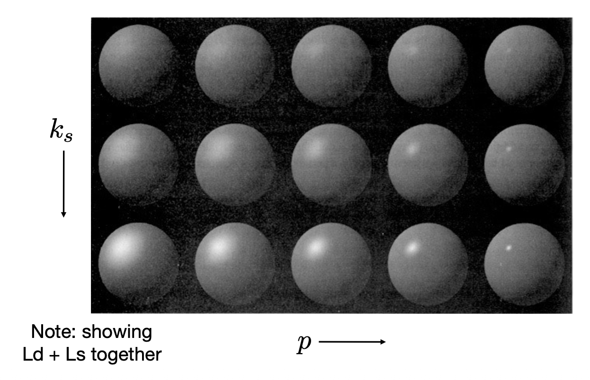
</div>


### Ambient Term

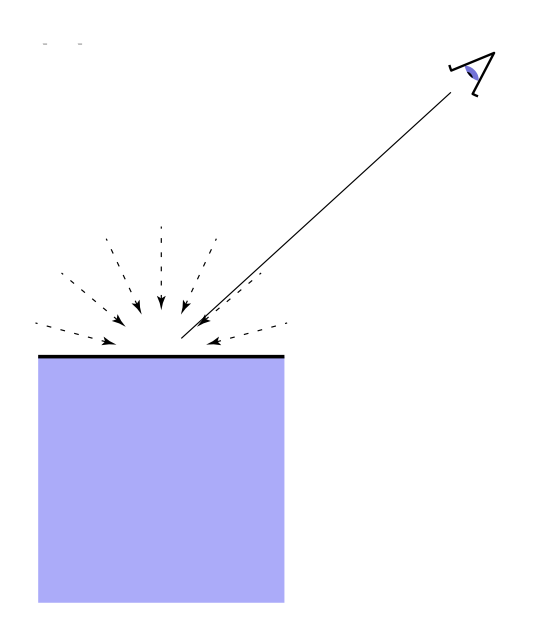{ align=right width=30% }

由于环境光的产生过于复杂，所以我们可以直接认为环境光不依赖于着色模型中的任何参数，直接用常量颜色来表示环境光。注意这是一个非常大胆的假设，精确的计算需要到后面介绍到全局光照时再说。

环境光强的公式为：$L_a = k_a I_a$，其中 $k_a$ 为环境光系数。

---
将漫反射、高光和环境光组合起来，就能得到完整的光强公式了：

$$
\begin{align*}
L & = L_a + L_d + L_s \\
& = k_a I_a + k_d (I / r^2) \max(0, \bm{n} \cdot \bm{I}) + k_s (I / r^2) \max(0, \bm{n} \cdot \bm{h})^p
\end{align*}
$$

<div style="text-align: center">
    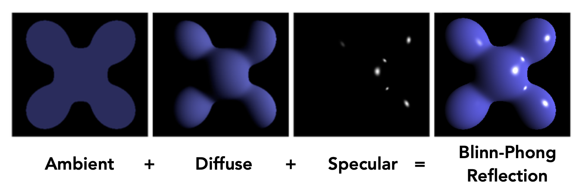
</div>


## Shading Frequencies

<div style="text-align: center">
    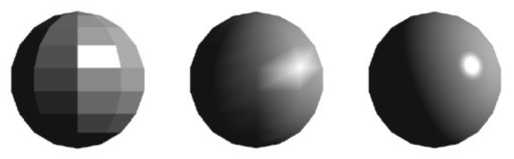
</div>

观察上图的三个球，可以看出它们的几何表示（模型）应当是完全一样的，但是着色效果却各不相同，且从左到右效果越来越好。这是因为它们的**着色频率**(shading frequency)是不同的，即着色的地方是不一样的。不难看出，这三张图的着色单位分别是面、顶点和像素。

- **平面着色**(flat shading)：在**三角形**上着色
    - 三角形就是一个平面，对应有一条法线
    - 不适用于平滑表面

    <div style="text-align: center">
        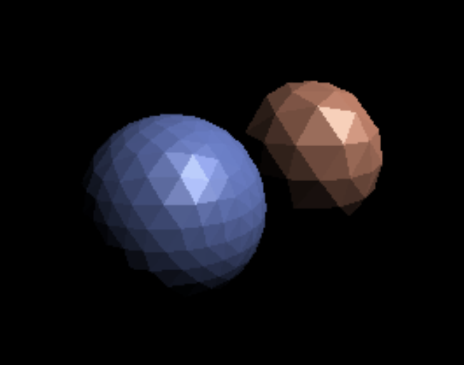
    </div>

- **Gouraud 着色**：在**顶点**上着色
    - 已知三角形三个顶点的信息，我们就可以根据这个信息，通过**插值**(interpolation)的方式为三角形内其他点着色
    - 每个顶点都有一个法线，具体怎么求等到下面再介绍

    <div style="text-align: center">
        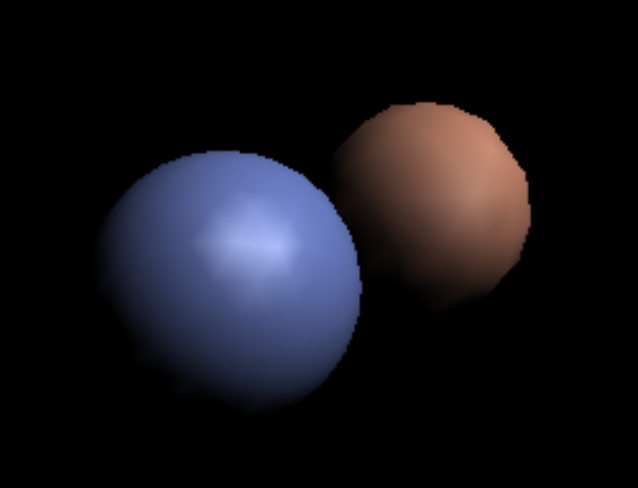
    </div>

- **Phong 着色**：在**像素**上着色
    - 对三角形内每个像素插值出一条法线，从而对每一个像素进行着色
    - 不要和前面的 Blinn-Phong 着色模型弄混淆

    <div style="text-align: center">
        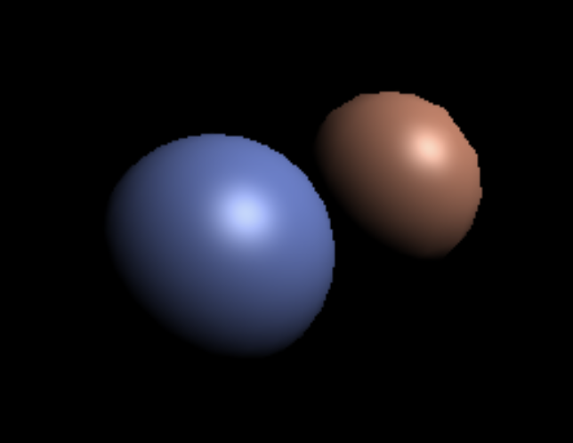
    </div>

???+ example "例子"

    <div style="text-align: center">
        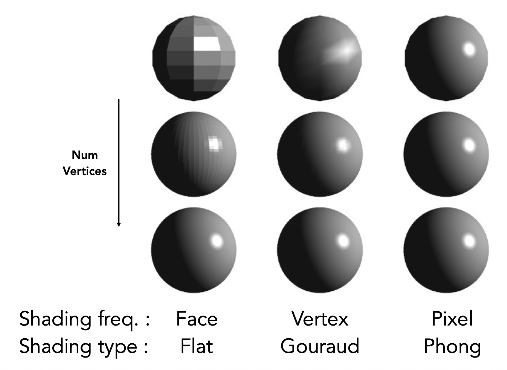
    </div>

    - 从上往下看，模型中用到的三角形越来越多（即顶点数越来越多），因此着色效果会变得更精细
    - 当三角形多到一定程度后，可以看到这三种着色频率的差异就非常小了

接下来介绍如何在顶点和像素上定义法线

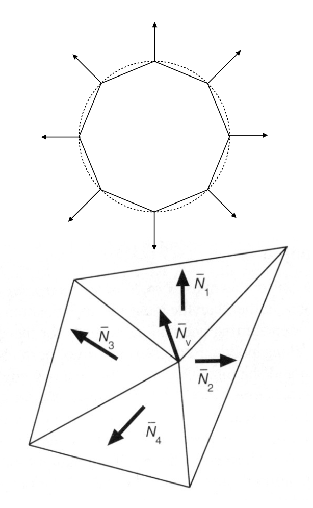{ align=right width=25% }

- 顶点
    - 最好的方式就是直接从几何形体中找出顶点法线，比如球体上每个点的法线就是穿过球心和该点的连线
    - 如果不行的话，可以考虑以顶点作为公共点的所有三角形，将这些三角形的法线的平均值（可以简单平均，也可加权平均）作为该点的法线

        $$
        N_v = \dfrac{\sum_i N_i}{\|\sum_i N_i\|}
        $$

- 像素：在顶点法线的基础上进行**重心插值**(barycentric interpolation)（之后介绍）
    - 记得插值后得到的法线要做归一化处理

    <div style="text-align: center">
        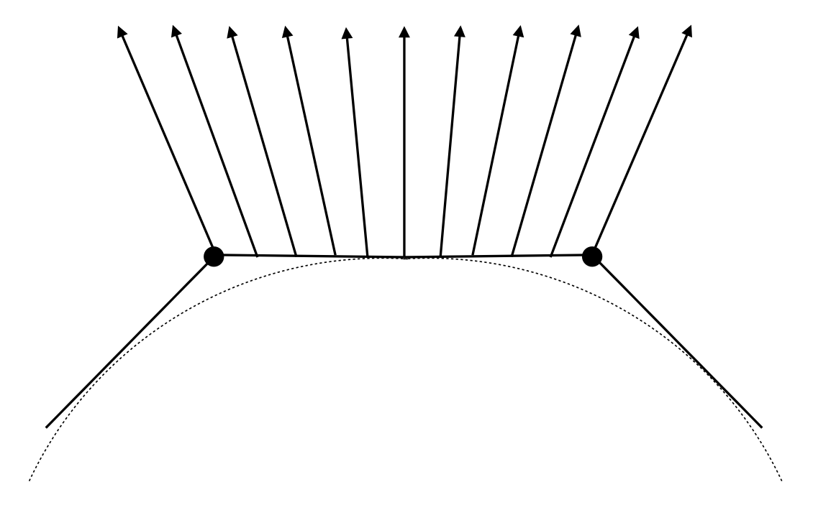
    </div>


## Graphics Pipeline

**图形管线**(graphics pipeline)是指将三维场景转换成最终呈现在二维屏幕上的图像的过程，并且这些操作已经写在硬件（GPU）中了。它包括以下步骤：

<div style="text-align: center">
    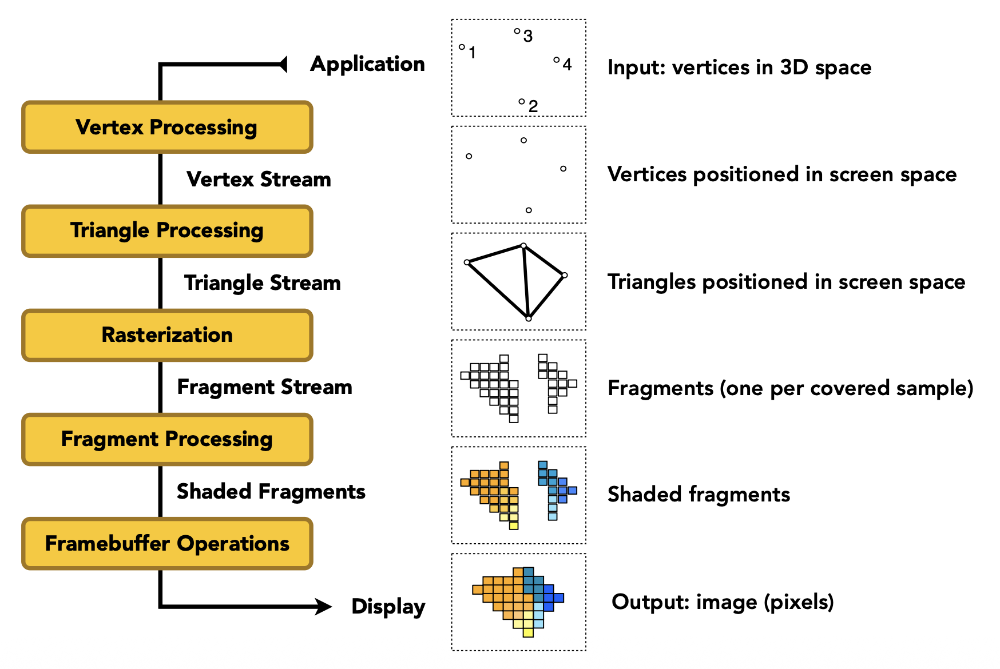
</div>

- **顶点处理**(vertex processing)：就是前面介绍的模型、视图和投影变换

    <div style="text-align: center">
        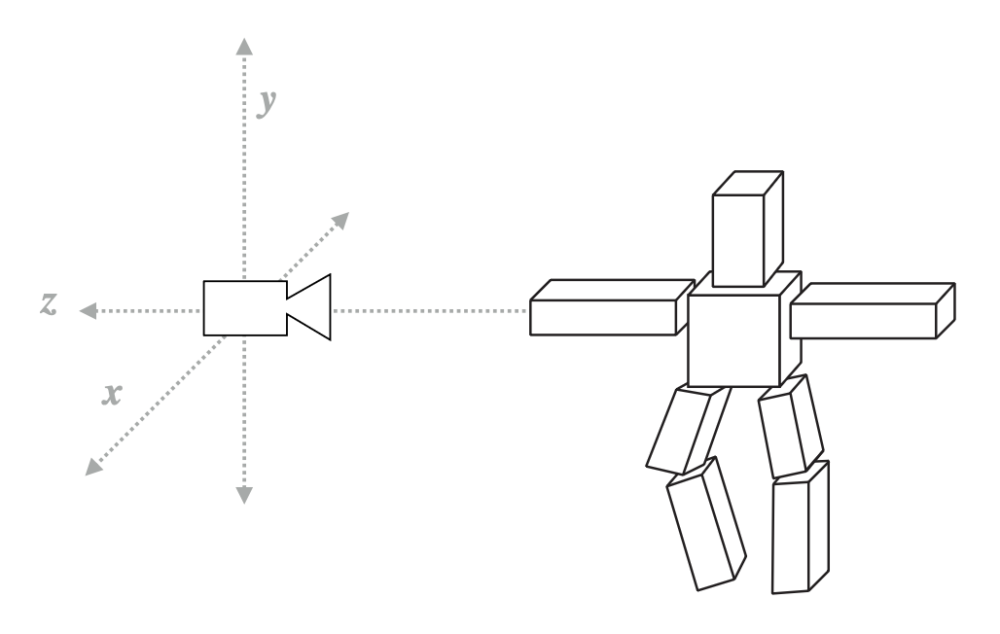
    </div>

- **三角形处理**(triangle processing)
- **光栅化**(rasterization)：在三角形覆盖的地方采样

    <div style="text-align: center">
        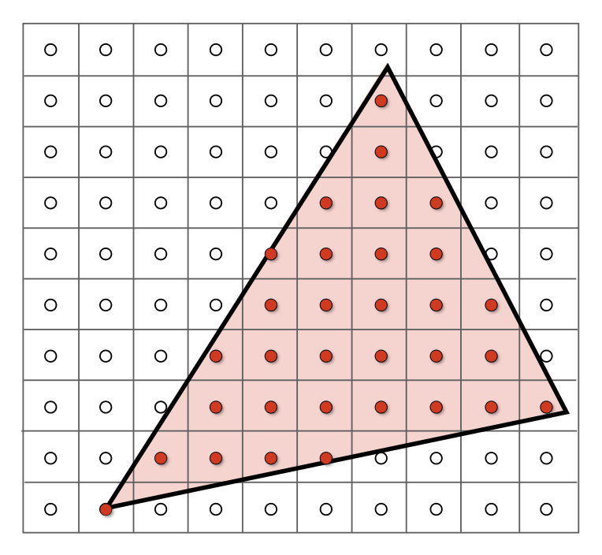
    </div>

- **片元处理**(fragment processing)
    - 可以将片元简单理解为像素（但实际比像素包含更多的信息）
    - 深度缓存技术属于这个部分

        <div style="text-align: center">
            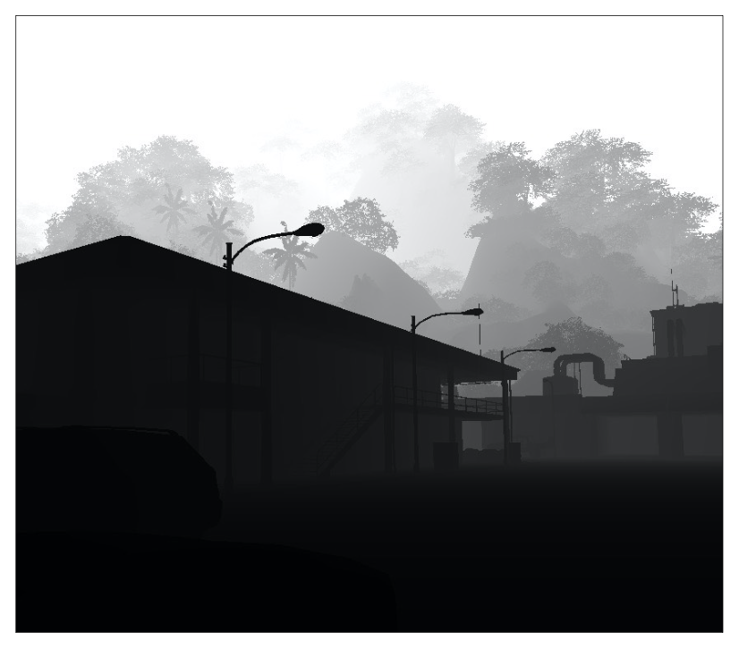
        </div>

    - 而着色不仅发生在片元处理中，前面的顶点处理也会涉及到（考虑不同的着色频率）
        - 着色是可编程的，与这块相关的程序叫做**着色器**(shader)

        <div style="text-align: center">
            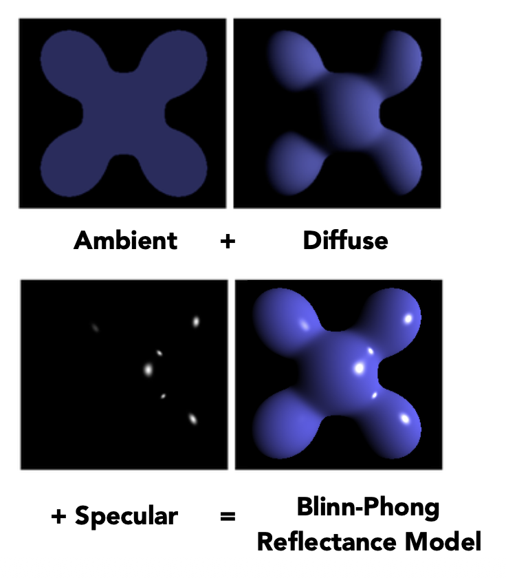
        </div>

    - 后面马上介绍的**纹理映射**(texture mapping)也同时经过顶点处理和片元处理阶段

        <div style="text-align: center">
            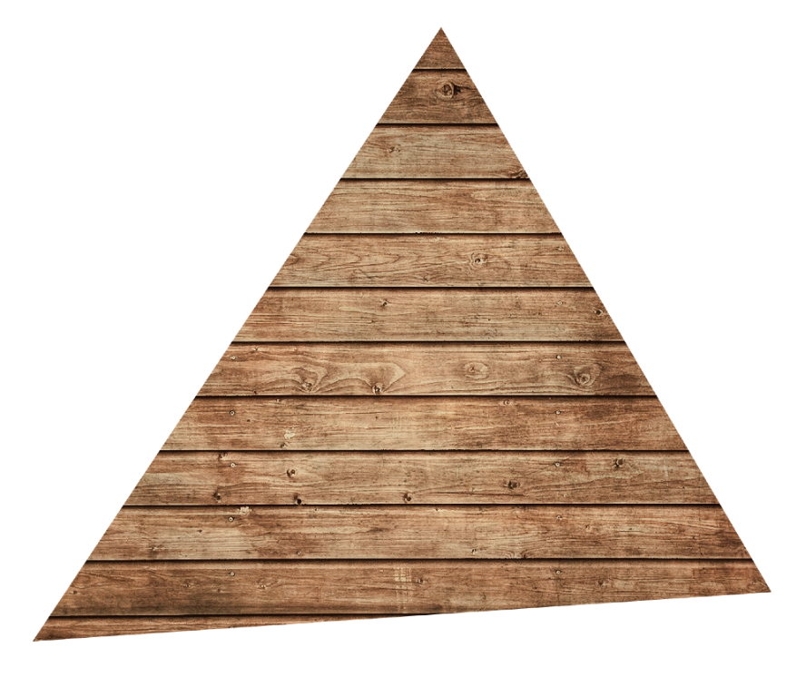
        </div>

- **帧缓存操作**(framebuffer operations)


### Shader Program

- 着色器可对顶点处理和片元处理阶段编程
- 它描述了在单个顶点或片元上的操作

???+ example "例子"

    以下是一段 OpenGL 的代码：

    ```cpp
    uniform sampler2D myTexture;     // program parameter
    uniform vec3 lightDir;           // program parameter
    varying vec2 uv;                 // per fragment value (interp. by rasterizer)
    varying vec3 norm;               // per fragment value (interp. by rasterizer)

    void diffuseShader() {
        vec3 kd;
        kd = texture2d(myTexture, uv);              // material color from texture 
        kd *= clamp(dot(–lightDir, norm), 0.0, 1.0);   // Lambertian shading model
        gl_FragColor = vec4(kd, 1.0);                     // output fragment color
    }
    ```

    >注：这里的 `vec2`，`vec3` 是虚构的，实际可用 Eigen 库提供的向量类型。

    - 着色器函数会在每个片元被调用一次
    - 输出当前片段屏幕采样位置的表面颜色
    - 该着色器执行纹理查找，以获取该点的表面材质颜色，随后进行漫反射光照计算

推荐一个网站：[Shadertoy](https://www.shadertoy.com/)。它是一个在线的着色器编辑器，同时也能直接运行，并给无需关注 OpenGL, DirectX 之类的实现细节，帮我们省去了不少力气。

???+ example "例子"

    Inigo Quilez 用八百多行写了一个关于蜗牛的着色器，技术力很高！

    <div style="text-align: center">
        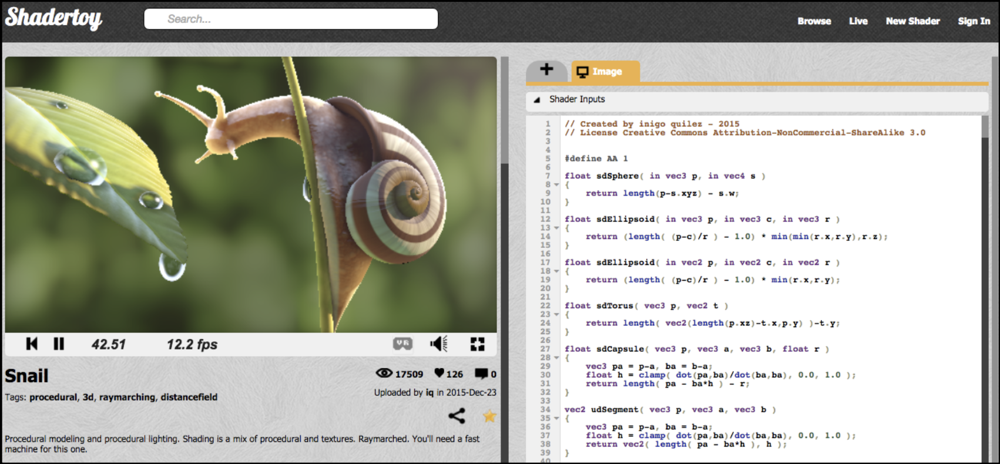
    </div>

    链接：<http://shadertoy.com/view/ld3Gz2>


### Graphics Pipeline Implementation: GPUs

现代 GPU 的目标是能做到实时渲染复杂的三维场景。

- 一个场景内可能有成百万的三角形
- 复杂的顶点和片元着色器计算
- 很高的解析度（2-4 兆像素 + 超采样）
- 每秒 30-60 帧（在 VR 中要求更高）

<div style="text-align: center">
    
</div>

GPU 是一种专门用于执行图形管线计算的处理器，分为：

- **独立(discrete)显卡**：比如 NVINDA 的显卡

    <div style="text-align: center">
        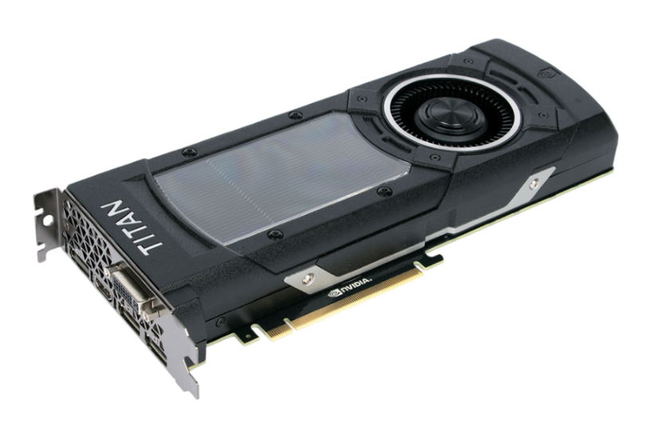
    </div>

- **集成(integrated)显卡**：比如部分的 Intel CPU

    <div style="text-align: center">
        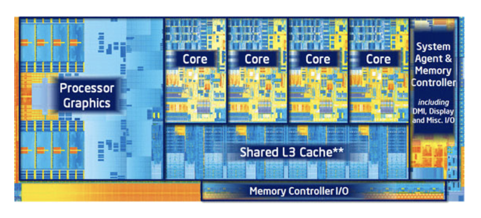
    </div>

从更底层的角度看，GPU 是一种**异构的多核处理器**(heterogeneous, multi-core procesor)

<div style="text-align: center">
    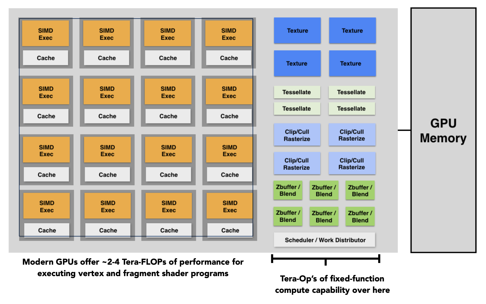
</div>


## Texture Mapping

**纹理映射**(texture mapping)是一种将一张二维图片（即纹理）贴到三维模型的表面上的技术，使得三维模型更加真实丰富。比如对下图的场景而言，球和木板有着不同但看起来很真实的纹理。

<div style="text-align: center">
    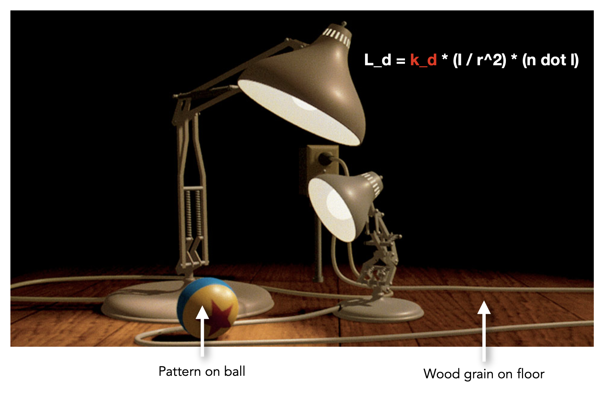
</div>

要想理解纹理映射，需要明白一点：三维物体表面的一点能够对应到二维图像（纹理）的一个点，比如地球仪（3D）上的一点能对应世界地图（2D）上的一点。

<div style="text-align: center">
    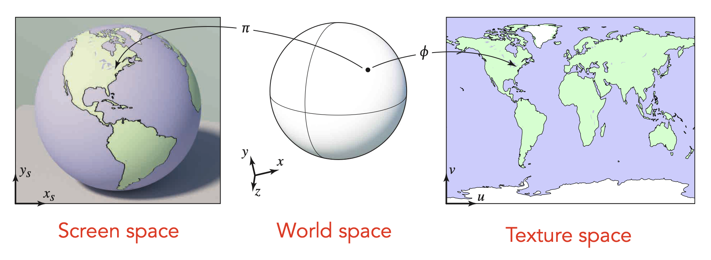
</div>

!!! note "注"

    纹理既可来自艺术家的创造，也可来自自动化的构建。

???+ example "例子"

    === "例1"

        <div style="text-align: center">
            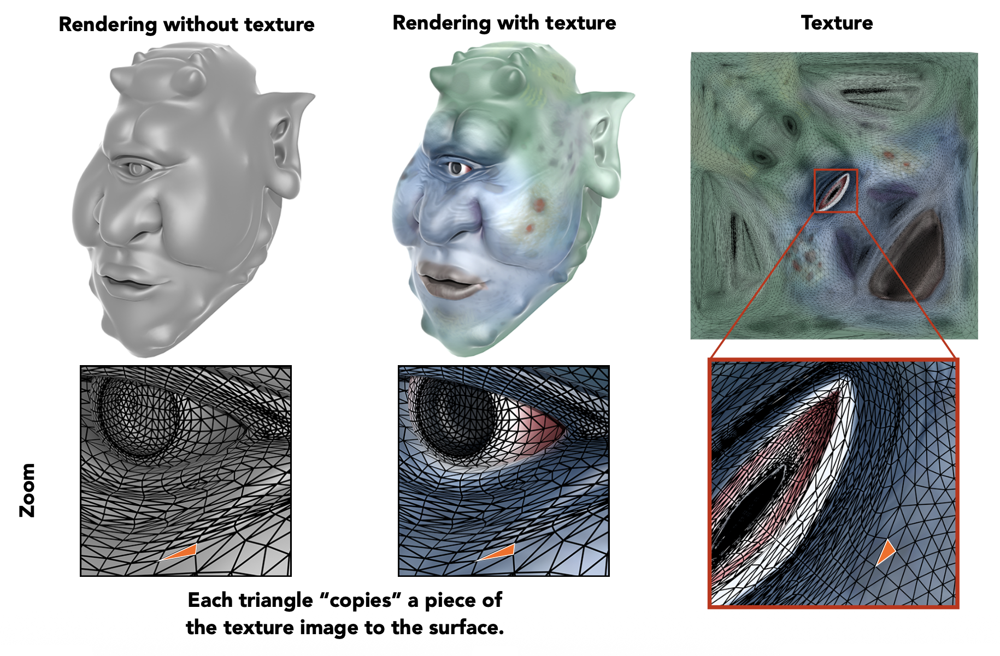
        </div>

        我们可以在纹理上构建一个坐标系，3D 模型上的任何一个顶点都能对应这个坐标系上的某个点 (x, y)。

        <div style="text-align: center">
            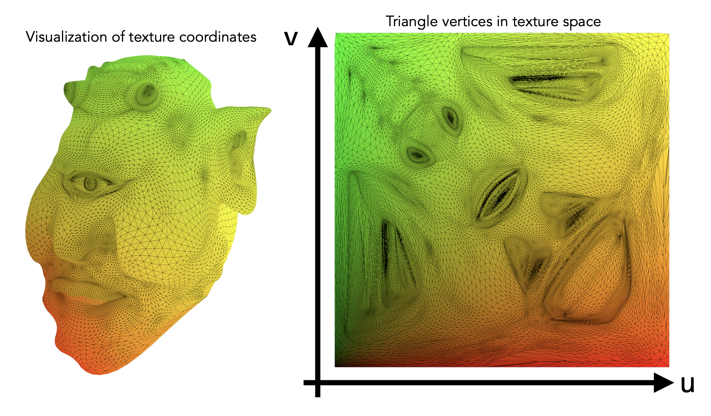
        </div>

        <div style="text-align: center">
            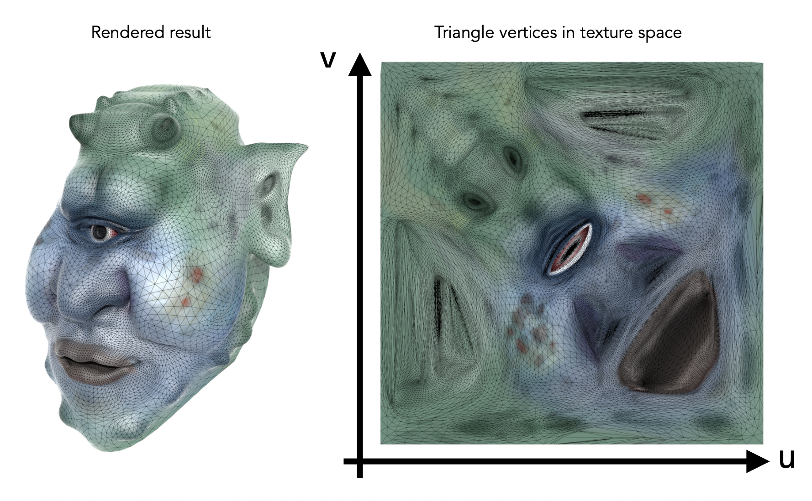
        </div>

    === "例2"

        这是纹理应用到表面上的结果：

        <div style="text-align: center">
            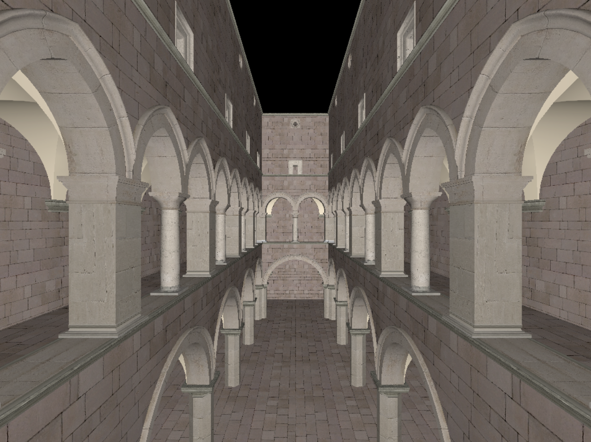
        </div>

        纹理坐标系的可视化：

        <div style="text-align: center">
            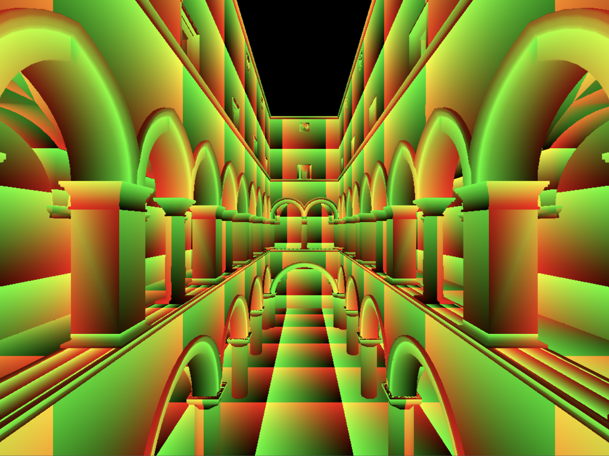
        </div>

不难想到，不可能仅靠一个纹理就能覆盖整个三维场景的表面，所以势必存在一个纹理被复用多次的情况（就像房间里同一类型的瓷砖会被贴上多次）。这个时候就要考虑纹理之间不会出现很割裂的情况。

<div style="text-align: center">
    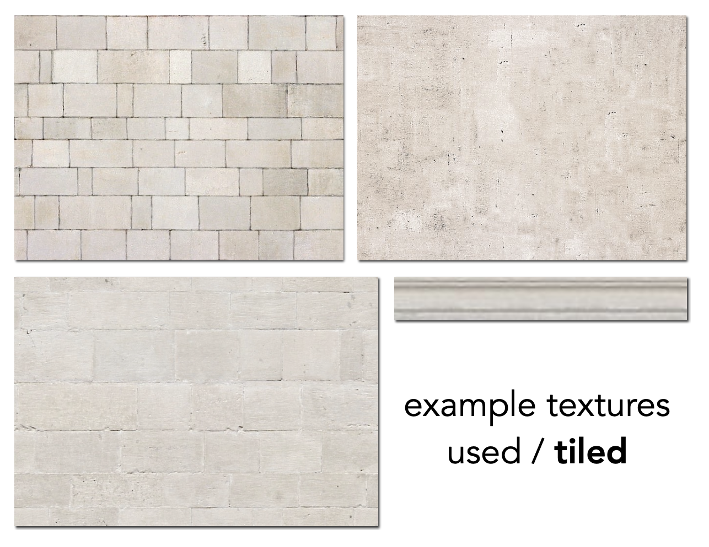
</div>


### Barycentric coordinates

在“[着色频率](#shading-frequencies)”一节中提到过在三角形内**插值**(interpolation)这件事，之所以要这样做，是因为

- 需要指定每个顶点的值
- 希望三角形内（从一个顶点到另一个顶点）有一个平滑的过渡

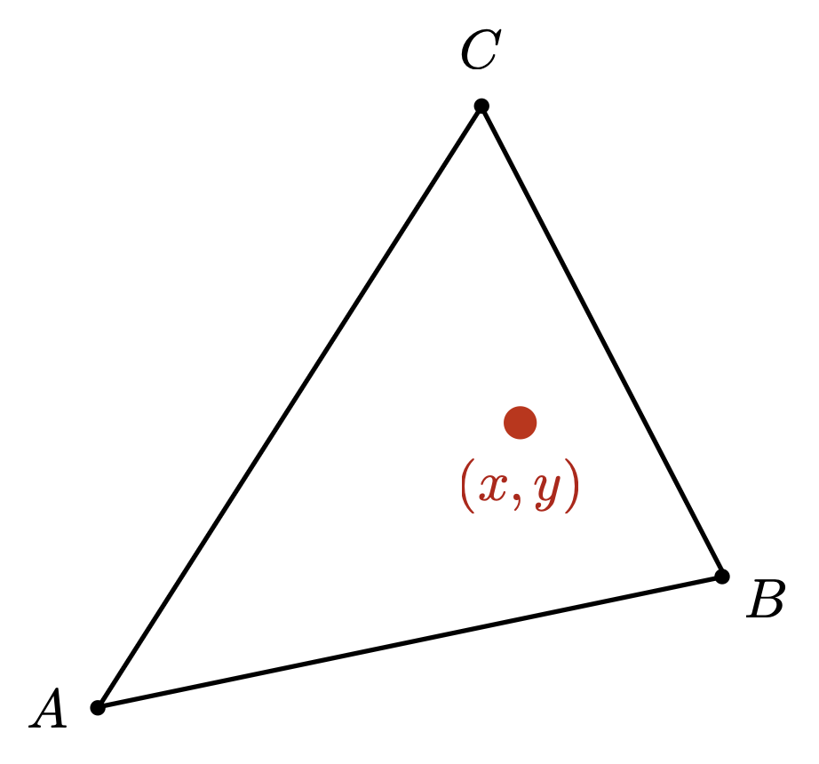{ align=left width=30% }

插值的内容可以是纹理坐标、颜色或法向量等。下面就来介绍插值的方法——**重心坐标**(barycentric coordinates)。它是一种在三角形上的坐标系，坐标被表示为 $(\alpha, \beta, \gamma)$，对应到笛卡尔坐标系为：
$$
(x, y) = \alpha A + \beta B + \gamma C
$$

并且满足：
$$
\alpha + \beta + \gamma = 1
$$

<br />

>注：有了这个条件后，只要知道其中两个坐标值，第三个值就呼之欲出了。

最后一个条件是：如果点在三角形内，那么这三个坐标值都是非负的。

不难发现，$A, B, C$ 三点的重心坐标分别为 $(1, 0, 0), (0, 1, 0), (0, 0, 1)$。

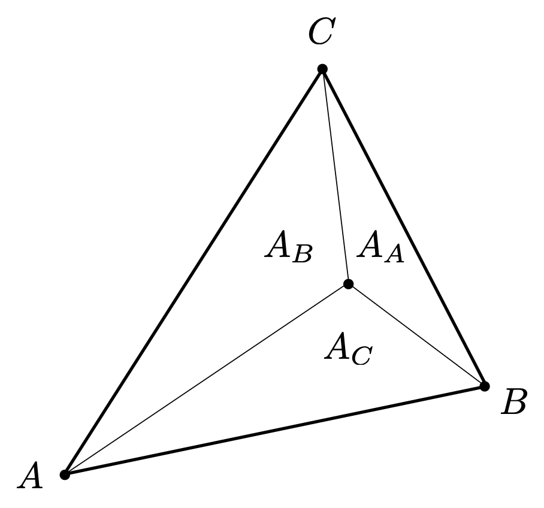{ align=right width=30% }

从几何角度看，$\alpha, \beta, \gamma$ 值实际上是以该点为公共顶点，三角形内的三个小三角形的面积占比。如下图所示，顶点 $A$ 对面的小三角形的面积记作 $A_A$，以此类推，计算公式为：

$$
\begin{align*}
\alpha & = \dfrac{A_A}{A_A + A_B + A_C} \\
\beta & = \dfrac{A_B}{A_A + A_B + A_C} \\
\gamma & = \dfrac{A_C}{A_A + A_B + A_C}
\end{align*}
$$

而三角形中心的重心坐标为：$(\alpha, \beta, \gamma) = (\frac{1}{3}, \frac{1}{3}, \frac{1}{3})$（$(x, y) = \frac{1}{3}A + \frac{1}{3}B + \frac{1}{3}C$）。

其实还可以根据三个顶点的笛卡尔坐标硬推出这三个重心坐标值：

$$
\begin{align*}
\alpha & = \dfrac{-(x - x_B)(y_C - y_B) + (y - y_B)(x_C - x_B)}{-(x_A - x_B)(y_C - y_B) + (y_A - y_B)(x_C - x_B)} \\
\beta & = \dfrac{-(x - x_C)(y_A - y_C) + (y - y_C)(x_A - x_C)}{-(x_B - x_C)(y_A - y_C) + (y_B - y_C)(x_A - x_C)} \\
\gamma & = 1 - \alpha - \beta
\end{align*}
$$

{ align=right width=30% }

有了重心坐标后，我们就可以根据已知的三角形的三个顶点进行插值。假设三个点的值分别为 $V_A, V_B, V_C$（它们可以表示位置、纹理坐标、颜色、法线、深度、材质属性等等），那么三角形内任意一点的值为 
$$
V = \alpha V_A + \beta V_B + \gamma V_C
$$

然而，经过投影变换后，重心坐标就会发生改变。这带给我们的启示是：插值在三维模型上就要做好，而不要等到投影后再去求三角形的重心坐标。

---
下面给出了一种简单的纹理映射算法：漫反射颜色(diffuse color)

```cpp
// usually (x, y) is a pixel's center
for each rasterized screen sample (x, y):
    // using barycentric coordinates
    (u, v) = evaluate texture coordinate at (x, y);
    texcolor = texture.sample(u, v);
    // usually the diffuse albedo k_d (recall Blinn-Phong reflectance model)
    set sample's color to texcolor;
```

### Texture Magnification

有时会出现纹理过小的情况，即屏幕分辨率高但纹理分辨率低，这时查看某一点的纹理时会发现非整数值，因为过小的纹理被拉大了。而不是整数值的像素点就需要通过舍入转换为整数。我们称纹理上的这种像素为**纹素**(texel)。在下面的三幅图中，左图就是前面所说的纹理过小的情况，右边两张图是通过下面介绍的方法修复后的图。

<div style="text-align: center">
    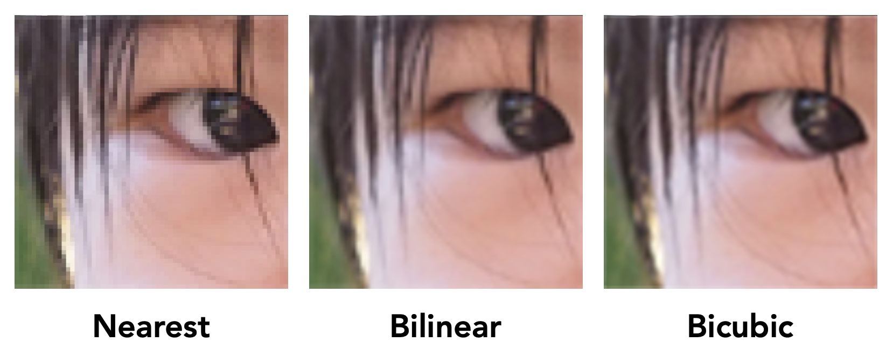
</div>


#### Bilinear Interpolation

下图所示的网格是纹理而非像素，对应的黑点就是纹理上的采样点。假设我们想采样红点对应的纹理值 $f(x, y)$，为避免因非整数造成的舍入误差，这里引入了**双线性差值**(bilinear interpolation)的方法。

<div style="text-align: center">
    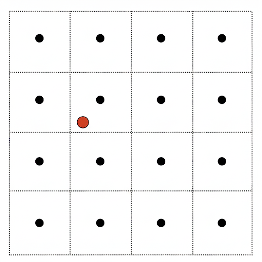
</div>

??? info "1D 线性插值公式"

    $$
    \text{lerp}(x, v_0, v_1) = v_0 + x(v_1 - v_0)
    $$

>[🔗其他插值方式](../../ai/cv/3.md#interpolation)

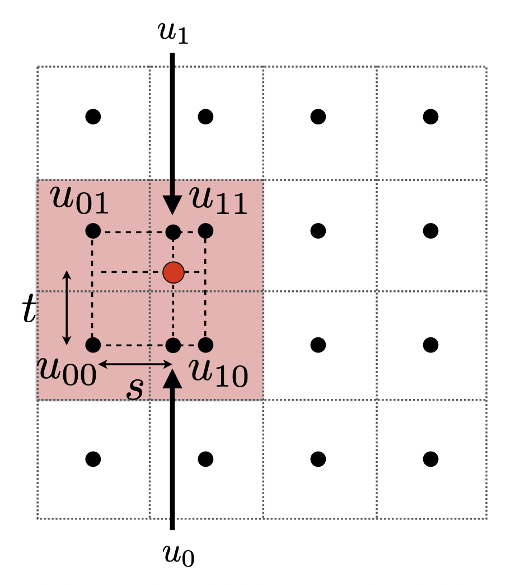{ align=right width=30% }

- 首先，取离这个点最近的四个采样点，并标注出它们各自的纹理值
- 求出这个点在这四个点构成的方框（边长为1）内的偏移量(offset)（小数）
- 先做水平线性插值
    $$
    u_0 = \text{lerp}(s, u_{00}, u_{10}) \quad u_1 = \text{lerp}(s, u_{01}, u_{11})
    $$

- 再做垂直线性插值
    $$
    f(x, y) = \text{lerp}(t, u_{0}, u_{1})
    $$

双线性插值通常能在合理的代价下取得良好的表现。

???+ example "效果比较"

    <div style="text-align: center">
        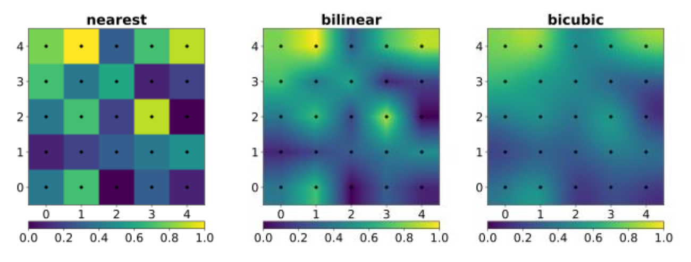
    </div>


### Texture Queries

相比纹理过小，纹理太大反而会带来更严重的问题。对于左图，纹理是一个个的格子。如果用前面介绍的方法应用纹理的话，得到的结果如右图所示——出现了锯齿、摩尔纹等因采样不足产生的问题。

<div style="text-align: center">
    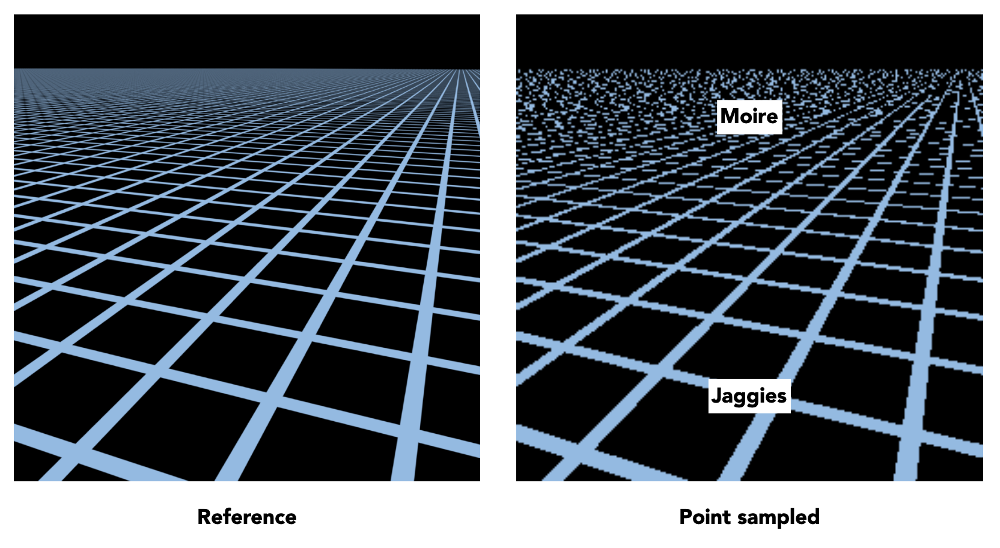
</div>

远景的纹理之所以乱成一团，是因为远景处的像素需要表示比近处更多的纹理区域，那么就很容易出现欠采样的问题。

<div style="text-align: center">
    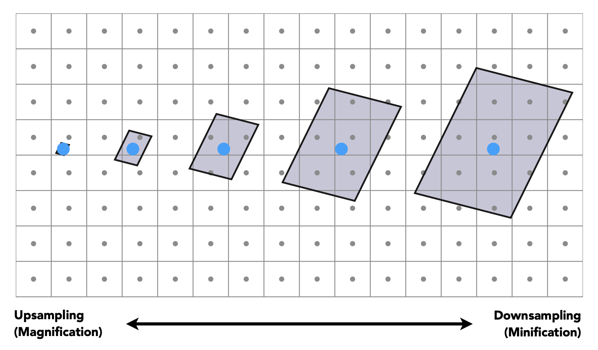
</div>

可以尝试用“[反走样](4.md#antialiasing)”一节介绍的方法——**超采样**来解决这个问题，结果如右图所示。可以看到确实能得到高质量的图像，但是算法复杂度高，耗时太多了。而且当过多纹素集中在一个像素内，一个像素承受的信号太大，可能需要更大的采样频率，因而这不是一个长久之计。

<div style="text-align: center">
    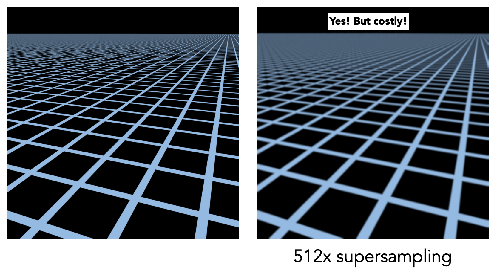
</div>

所以让我们从另一个角度理解这个问题——不要采样，只需获取像素范围内纹素的平均值即可。

???+ note "点查询 v.s.（平均）范围查询"

    - **点查询**(point query)：一个纹素点的值是多少？
    - （平均）**范围查询**(range query)：任意一个纹理区域的均值是多少？

    ??? example "关于纹理区域"

        观察下图两个用白色虚线圈出来的区域，发现这些区域的像素表示的纹理面积是不同的：近处面积小，远处面积大。

        <div style="text-align: center">
            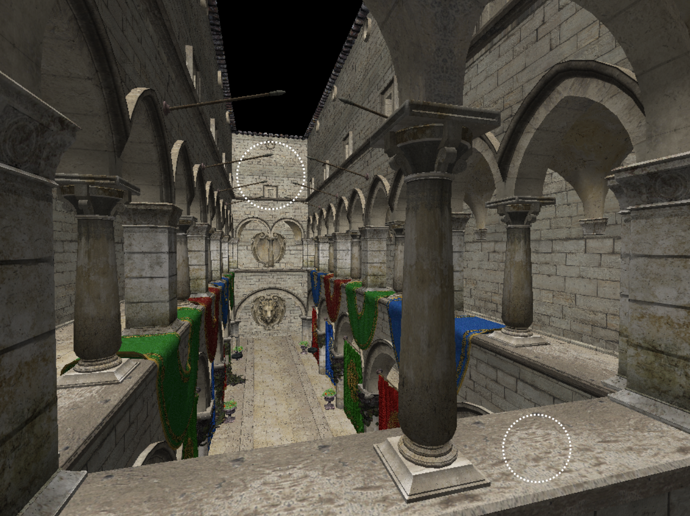
        </div>


#### Mipmap

（快速、近似、方形的）范围查询依靠 **mipmap**（L. Williams 于 1983 年发明）实现。"mip" 来自拉丁语 "multum in parvo"，意为“放置很多东西的小空间”。如下图所示，左上角是原图，我们根据这幅图构建一层层的小图，其中原图为第0层。每个层级的图的大小是上层图的 1/4（宽高各为原来的一半）。由于原图是 128*128 的，所以我们构建了8层的 mipmap。

<div style="text-align: center">
    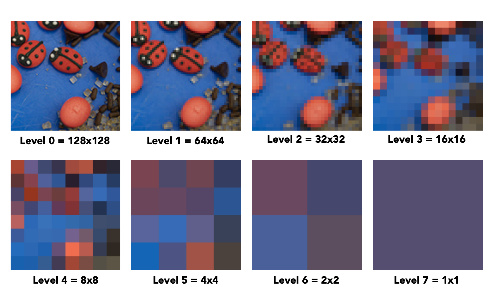
</div>

通过计算发现，用了 mipmap 后只多存了 1/3 的空间（1 + 1/4 + 1/16 + ... = 4/3）。

<div style="text-align: center">
    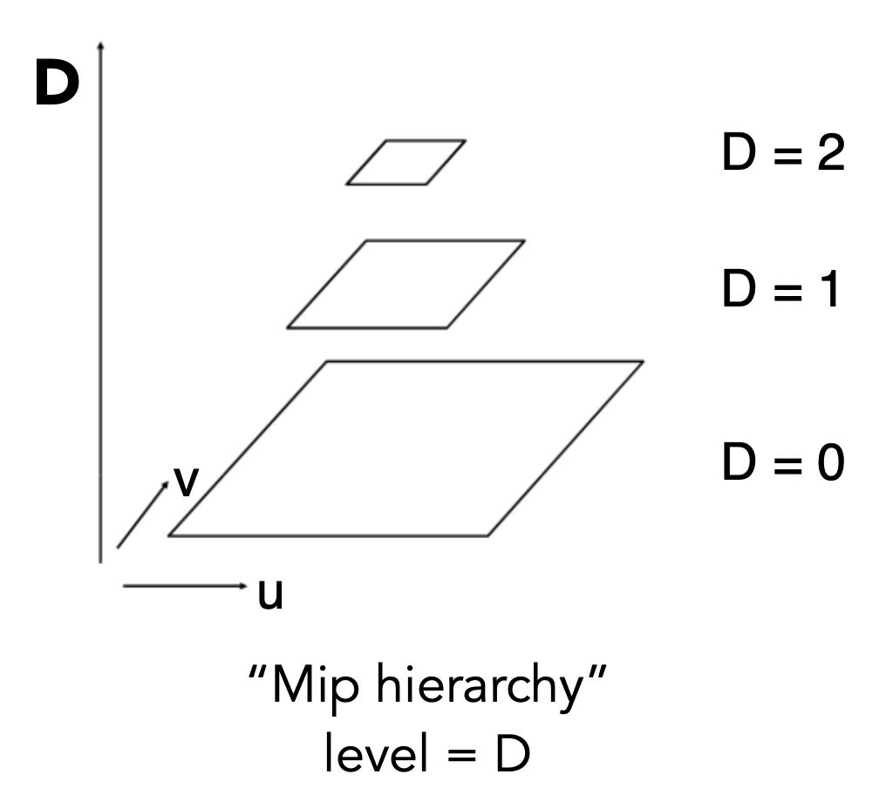
</div>

现在考虑怎么找到一个像素对应的纹理区域。一种近似的方法是：对于屏幕上的某个采样点，同时找出它的邻居投影在纹理上的位置，然后计算该点在纹理上的投影点和另外两个邻居的投影点的距离（公式列在下面），之后就能根据这两个距离近似得出该点对应的纹理区域了。
$$
D = \log_2 L \quad L = \max\left(\sqrt{\Big(\dfrac{du}{dx}\Big)^2 + \Big(\dfrac{dv}{dx}\Big)^2}, \sqrt{\Big(\dfrac{du}{dy}\Big)^2 + \Big(\dfrac{dv}{dy}\Big)^2}\right)
$$

>注：$D$ 是层数（整数，非整数的话要舍入成整数）。

<div style="text-align: center">
    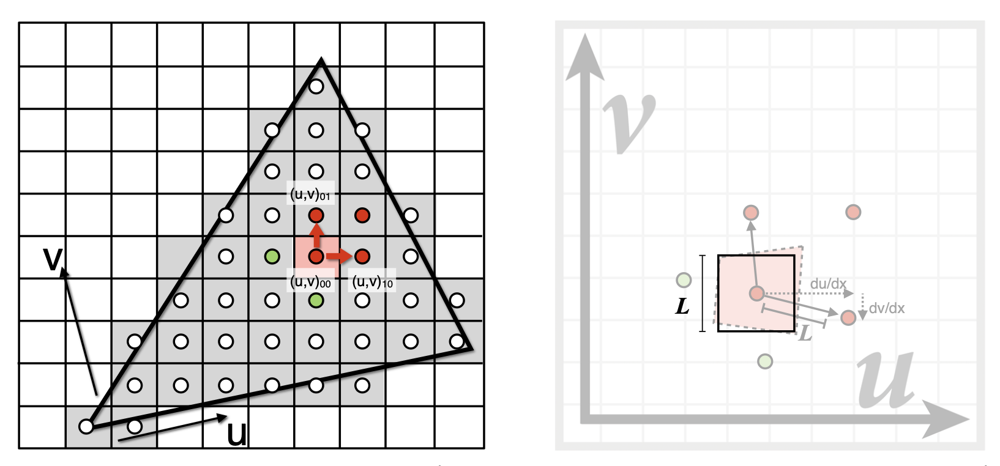
</div>

下图就是使用 mipmap 后进行纹理映射的结果，不同的颜色表示不同的层级。

<div style="text-align: center">
    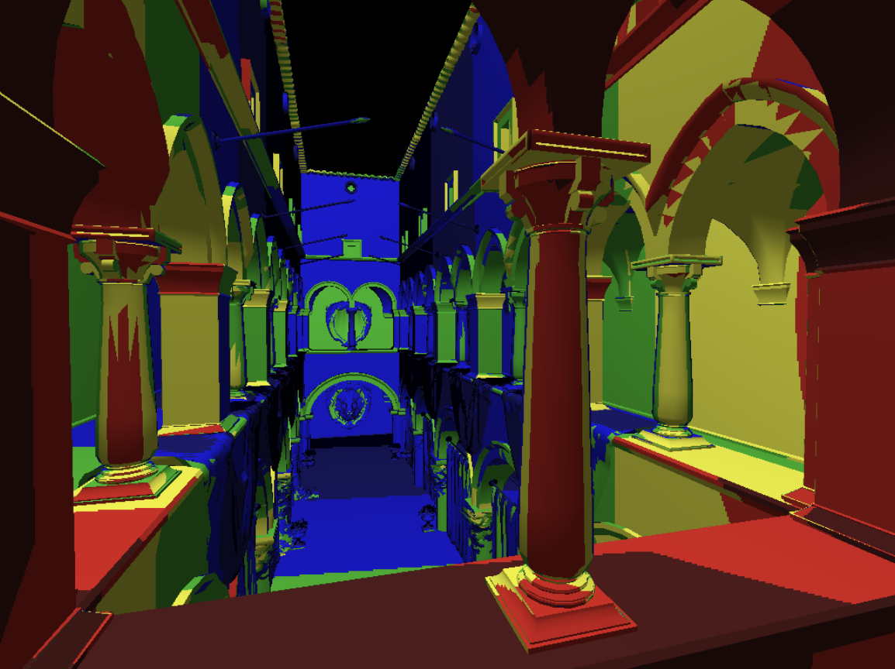
</div>

由于分层过于明显，所以会出现割裂感。为了让层与层之间平滑过渡，我们可以沿用前面插值的思想：对第 $D$ 层和 $D + 1$ 层的 mipmap 分别求二次线性插值，然后两层之间再求一次线性插值，使得 $D$ 的值“变得连续”。这种技术叫做**三次线性插值**(trilinear interpolation)。

<div style="text-align: center">
    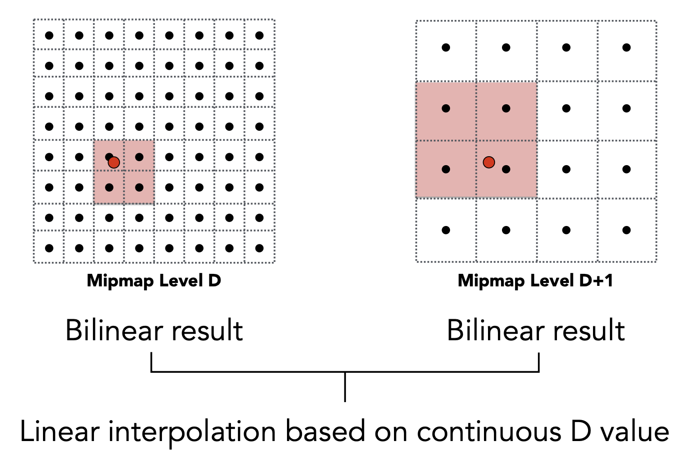
</div>

可以看到，用了三次线性插值后，mipmap 层之间的过渡更加平滑了。

<div style="text-align: center">
    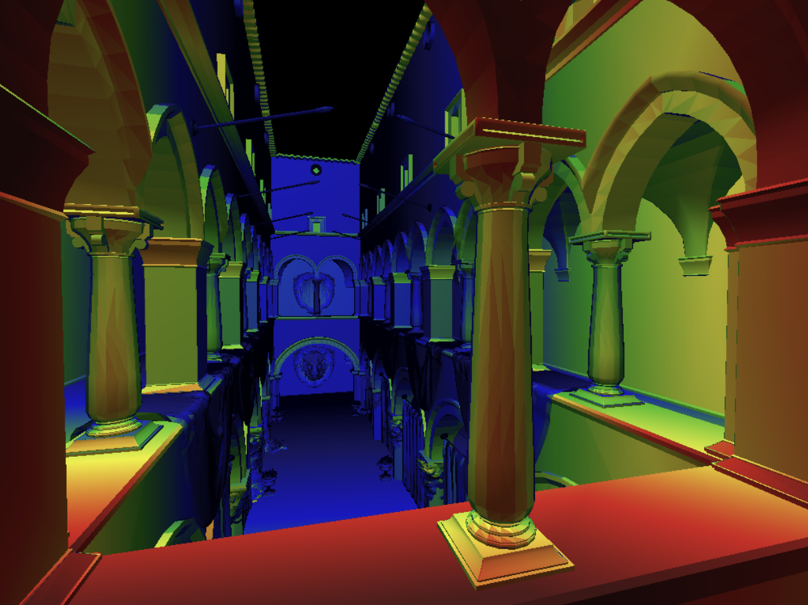
</div>

???+ bug "mipmap 的局限"

    比较下面三幅图，发现 mipmap 的问题是过度模糊(overblur)了，尤其是远景部分糊成一团了。

    <div style="text-align: center">
        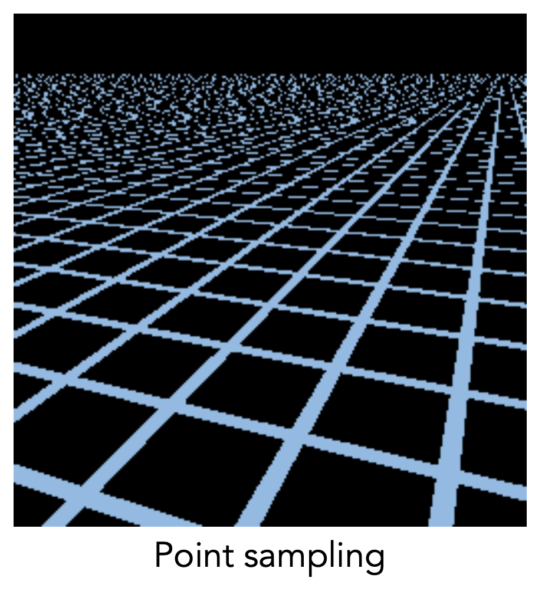
        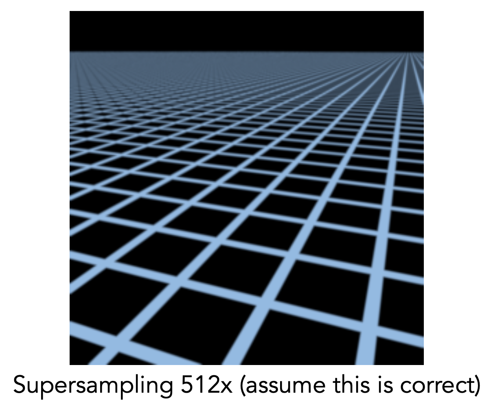
        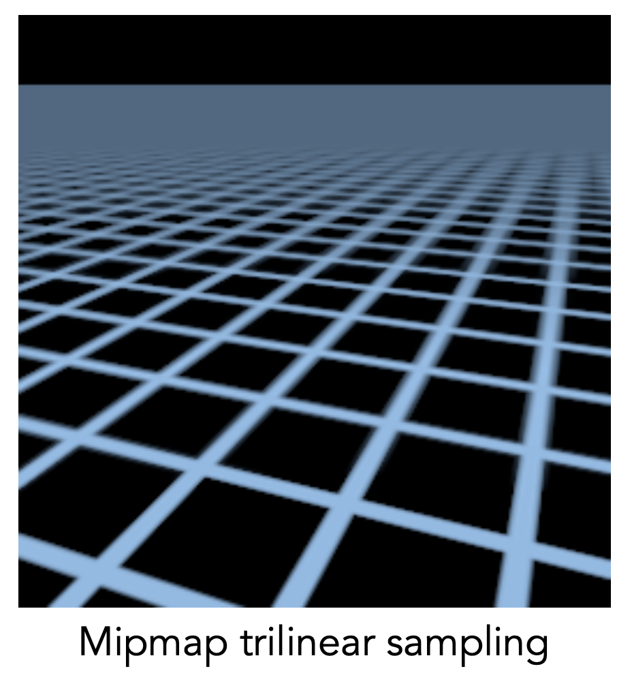
    </div>


#### Anisotropic Filtering

**各向异性过滤**(anisotropic filtering)可以取得比 mipmap 更好的效果：

<div style="text-align: center">
    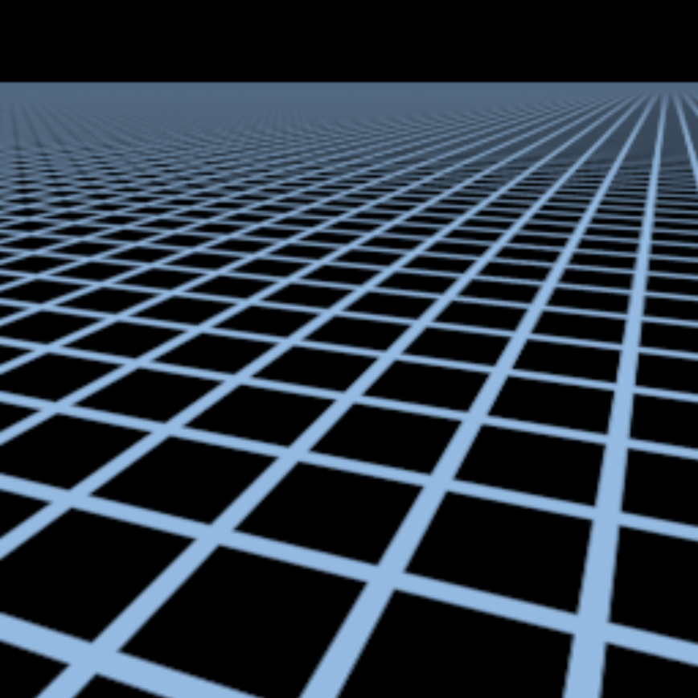
</div>

相比只能处理方形区域的 mipmap，各向异性过滤还能处理矩形区域。

<div style="text-align: center">
    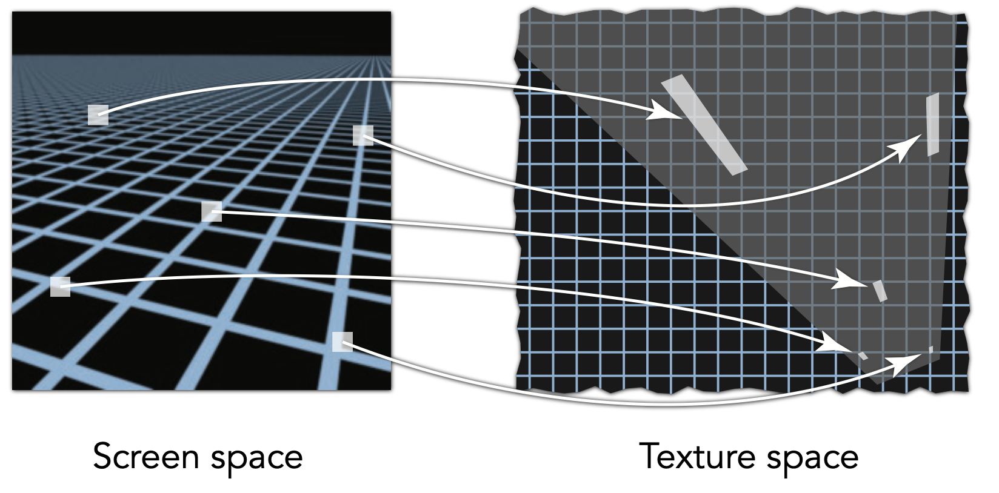
</div>
    
mipmap 是宽高同时缩小的，但各向异性过滤是可以按不同比例缩小宽和高的。因此只要是和轴对齐的矩形区域，都能被各向异性过滤处理掉。

<div style="text-align: center">
    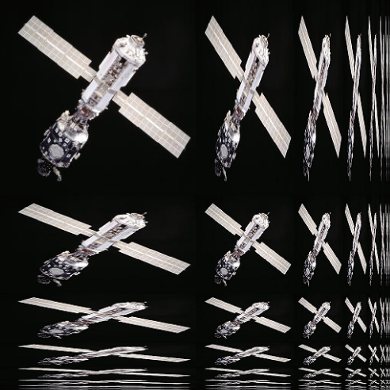
</div>

---
但各向异性过滤不能处理斜着的区域。所以有人提出另一种改进算法，叫做 EWA 过滤。如下图所示，它用不同大小的圆形，并通过多次查询来覆盖不规则的区域，因而能够处理更复杂的区域。但多次查询的代价就是耗时久。

<div style="text-align: center">
    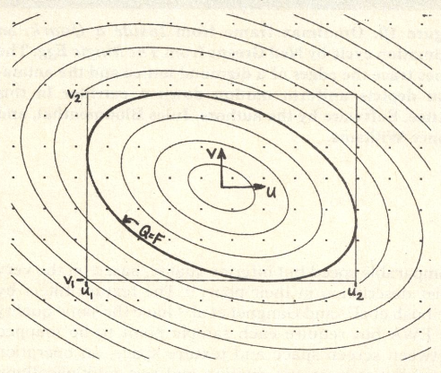
</div>


### Applications of Textures

在现代 GPU 中，我们可以将纹理理解为一块内存区域（数据），以及在这块区域上的范围查询。由于可以把纹理当做数据，因此纹理的应用非常广泛，包括：

- 环境光照(environment lighting)
- 存储微几何数据(store microgeometry)
- 程序纹理(procedural texture)
- 实体建模(solid modeling)
- 体渲染(volume rendering)
- ...


#### Environment Map

可以先将环境光以贴图（纹理）的形式呈现，贴图中只记录了环境光的方向信息（假定光源来自无穷远处）。然后用它来渲染三维模型，这样能使模型看起来暴露在环境光下，十分逼真。这样的贴图就叫**环境贴图**(environment map)。

<div style="text-align: center">
    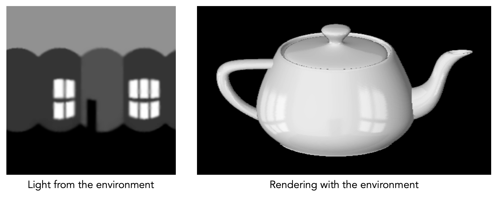
</div>

>注：右图的模型是图形学中的经典模型——[**犹他茶壶**](https://zh.wikipedia.org/zh-cn/%E7%8A%B9%E4%BB%96%E8%8C%B6%E5%A3%B6)(Utah teapot)。

像下面这种用球面记录环境光信息的贴图就叫做**球面环境贴图**(spherical environment map)

<div style="text-align: center">
    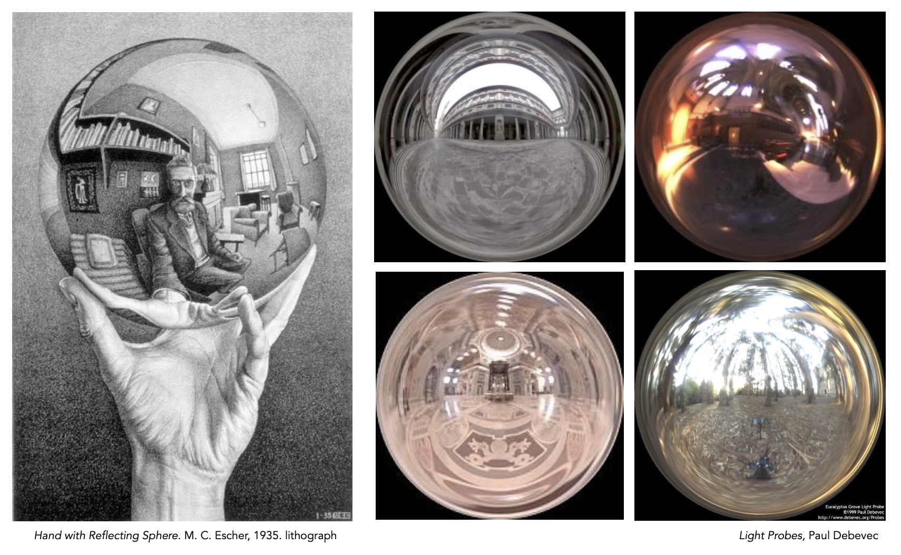
</div>

这种贴图的缺陷是：展开球面后容易出现扭曲问题，尤其是顶部和底部，如下图所示。

<div style="text-align: center">
    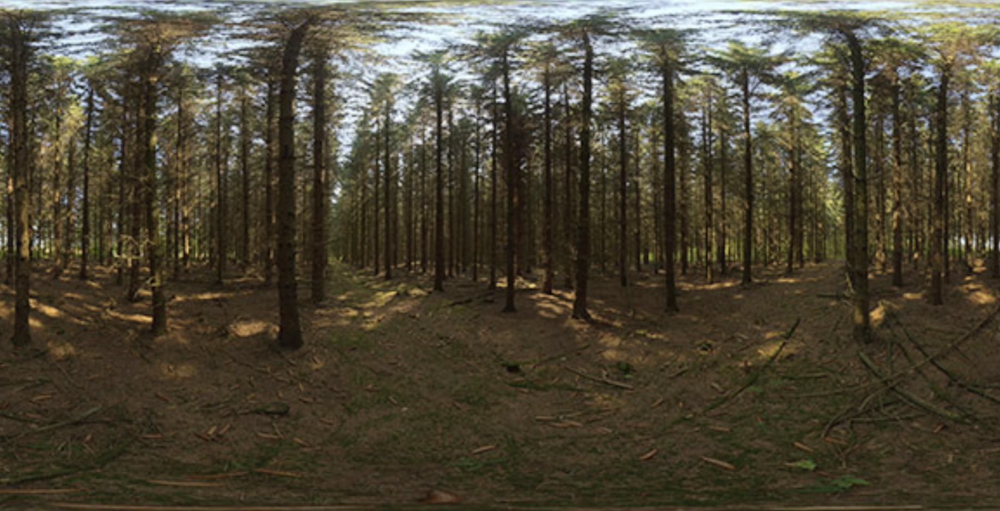
</div>

另一种环境贴图叫做**立方体贴图**(cube map)。顾名思义，就是将原来在球面上的向量沿着原方向映射到（球外接）立方体表面上一点，因此立方体的六个面都会作为纹理贴图。

<div style="text-align: center">
    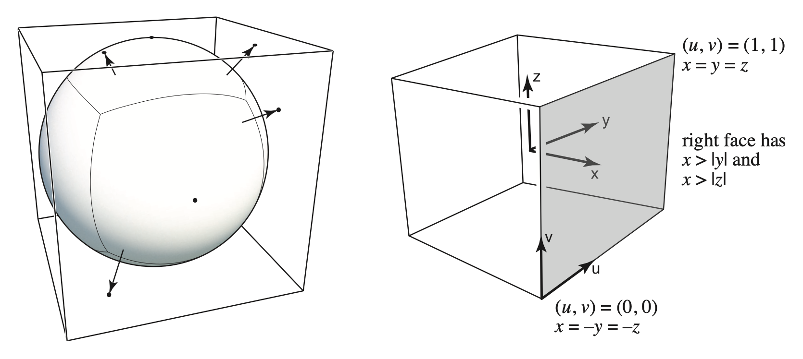
</div>

???+ example "例子"

    <div style="text-align: center">
        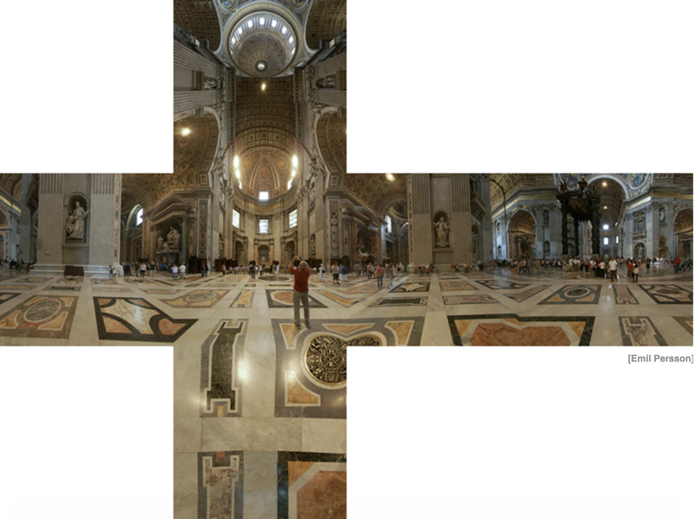
    </div>

这种贴图的优点是扭曲会少很多，但缺点是需要额外做一步球面上的向量方向到立方体表面上一点的计算，比较耗时。


#### Bump Mapping and Displacement Mapping

前面说过，纹理是数据，那么纹理就可以不局限在表示颜色，也可以表示其他东西，比如存储高度（或法线）——这便是**凹凸贴图**(bump mapping)（或法线贴图(normal mapping)），能做到在不增加额外三角形的情况下形成表面细节更逼真的几何形体。

<div style="text-align: center">
    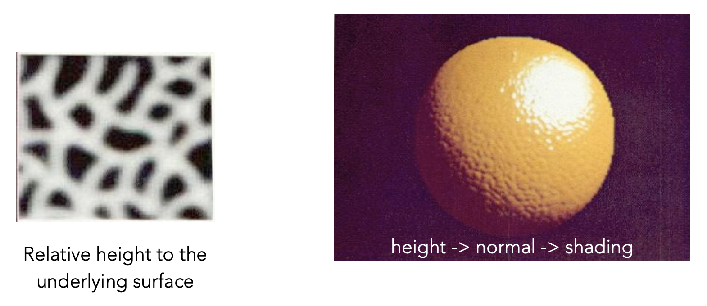
</div>

具体原理为（黑线表示原曲面，黄线表示加上凹凸贴图后的曲面）：

<div style="text-align: center">
    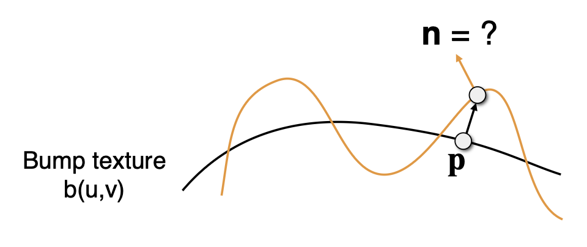
</div>

- 对每个像素上的法线做一些扰动(perturb)（仅对着色计算而言）
- 使得纹理上的每个纹素的高度发生一些偏移
- 如何改动法向量

    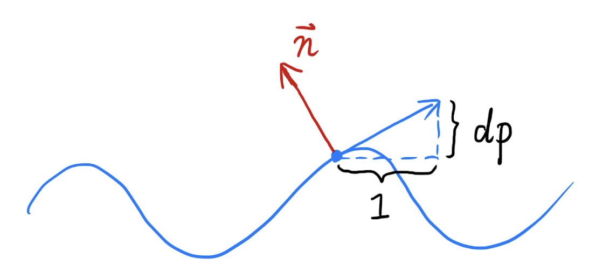{ align=right width=30% }

    - 在二维平面上
        - 假定原始曲面法向量为 $n(p) = (0, 1)$
        - 在 $p$ 处的微分 $dp = c \cdot [h(p+1) - h(p)]$
        - 扰动后的法向量就是 $n(p) = (-dp, 1).\text{normalized}()$（就是原法向量逆时针旋转90°后再做归一化）
    - 在三维空间中
        - 假定原始曲面法向量为 $n(p) = (0, 0, 1)$
        - 在 $p$ 处的微分为 
            - $dp/du = c1 \cdot [h(u+1) - h(u)]$
            - $dp/dv = c2 \cdot [h(v+1) - h(v)]$
        - 扰动后的法向量就是 $n(p) = (-dp/du, -dp/dv, 1).\text{normalized}()$（就是原法向量逆时针旋转90°后再做归一化）

    - 这里假设的是在**局部坐标系**(local coordinate)下的情况，即固定原始法向量为 $(0, 1)$ 或 $(0, 0, 1)$。如果考虑全局的话，可通过转换得到

---
一种比凹凸贴图更高级的方法是**位移贴图**(displacement mapping)。它虽然和凹凸贴图采用相同的纹理，但它是真的直接移动了曲面上的顶点。下图比较了凹凸贴图和位移贴图的效果：

<div style="text-align: center">
    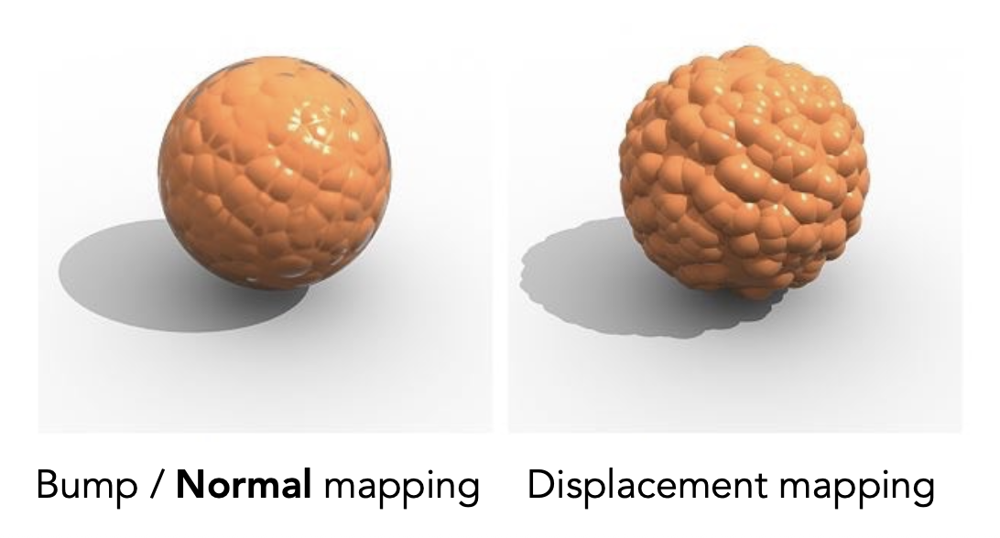
</div>

可以看到凹凸贴图存在以下弊病：

- 边缘过于光滑
- 球面上凹凸产生的阴影不真实

而位移贴图克服了上述问题，但代价是要求三角形足够精细，三角形顶点的间隔要比纹理定义的频率还要高。

一种改进做法是采用**动态曲面细分**(dynamic tessellation)——一开始用一个粗糙的模型，后面根据需要再细分。一些图形学 API 正是这样做的。但这里不会展开介绍，感兴趣的话可自行查找相关资料学习。


#### 3D Procedural Noise + Solid Modeling

纹理不仅可以是二维的，还可以是三维的。但三维的纹理不是一种模型，而是一个三维空间下的噪声函数。比如下图的纹理来自[柏林噪声](https://zh.wikipedia.org/zh-cn/Perlin%E5%99%AA%E5%A3%B0)(Perlin noise)算法：

<div style="text-align: center">
    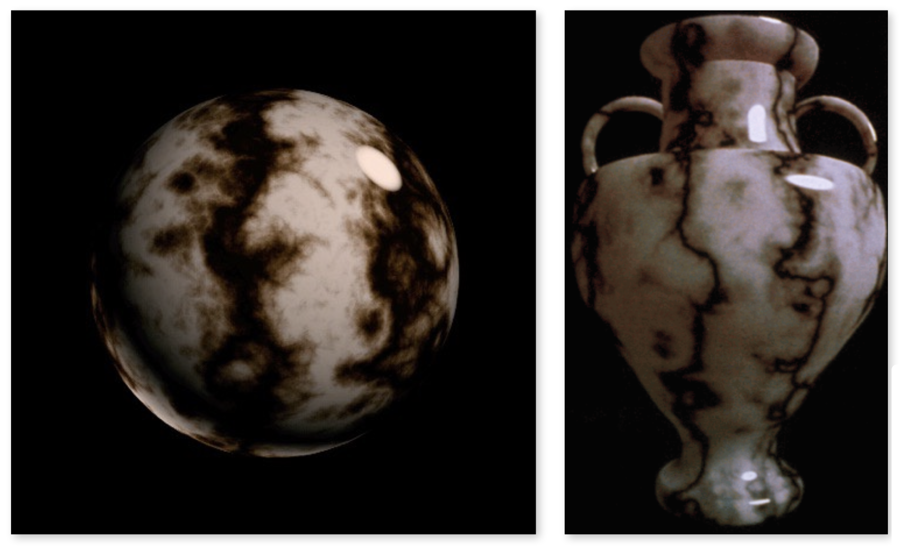
</div>


#### Precomputed Shading

可以用纹理贴图表示**环境光遮蔽**(ambient occlusion)。这样的话可以先做一个简单的着色，然后利用这个贴图实现更精细的着色。

<div style="text-align: center">
    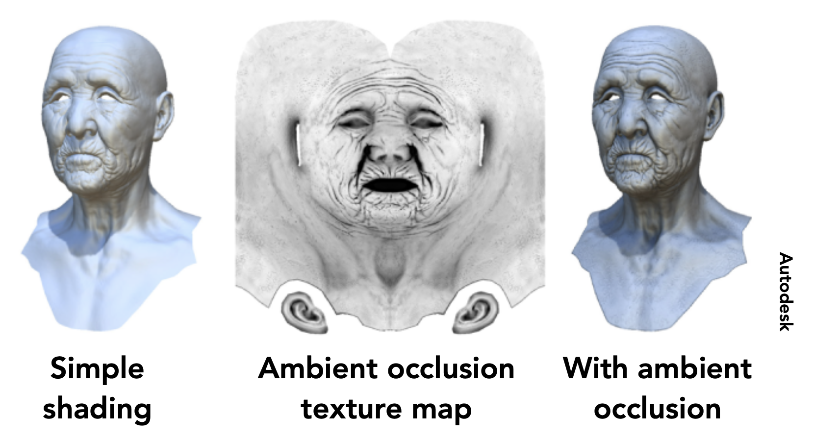
</div>


#### 3D Textures and Volume Rendering

三维纹理还可用在体渲染上，在 CT 和磁共振成像等应用上经常用到。

<div style="text-align: center">
    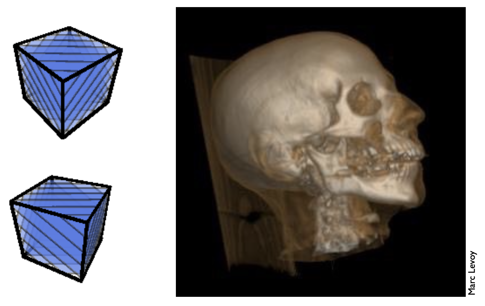
</div>


## Shadow Mapping

最后我们来认识一下**阴影**(shadow)是如何实现的。注意这里介绍的阴影是通过光栅化的方法实现的，而非光线追踪，也就是说阴影是“画”出来的。

???+ example "例子"

    以下是游戏《古墓丽影：暗影》中的一个场景，这里的阴影就是通过光栅化绘制而成的。

    <div style="text-align: center">
        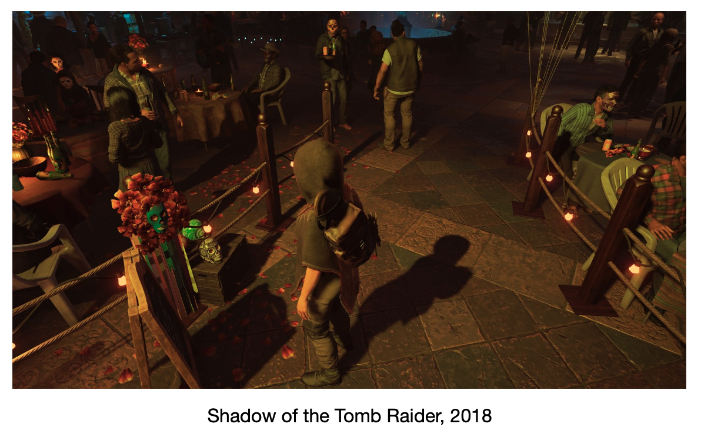
    </div>

我们称这种阴影生成方式为**阴影映射**(shadow mapping)。它是一种图像-空间算法，在计算阴影时无需知道场景的几何信息，并且必须要处理反走样的问题。该算法的关键思想是：不在阴影中的点一定会被**光源**和**相机**同时看到。下面通过一个例子来理解阴影映射的过程：

1. 来自光的渲染：从光源看向场景，记录不同点的深度

    <div style="text-align: center">
        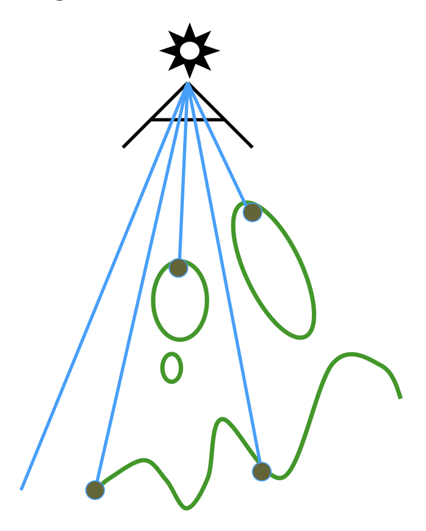
    </div>

2. 相机
    1. 来自观测者的渲染：找到眼睛能看到的地方

        <div style="text-align: center">
            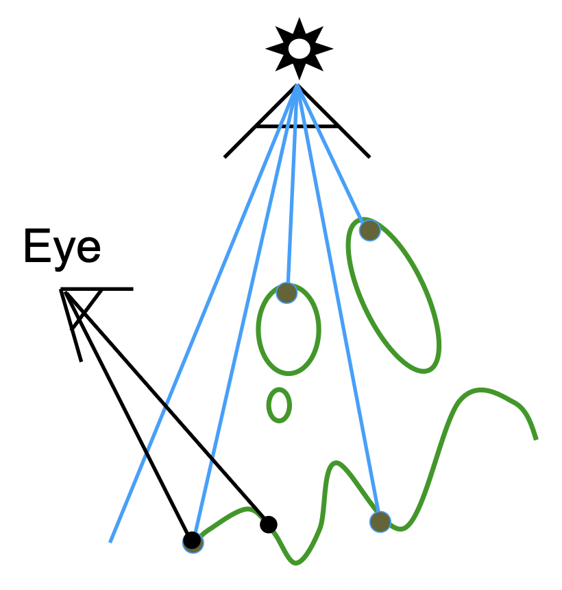
        </div>
    
    2. 投影到光源：将眼睛能看到的点返回到光源，看光源是否也能看到

        - 当从光源看到的深度和从眼睛看到的深度一致时，说明这个点能完全被光源照到

            <div style="text-align: center">
                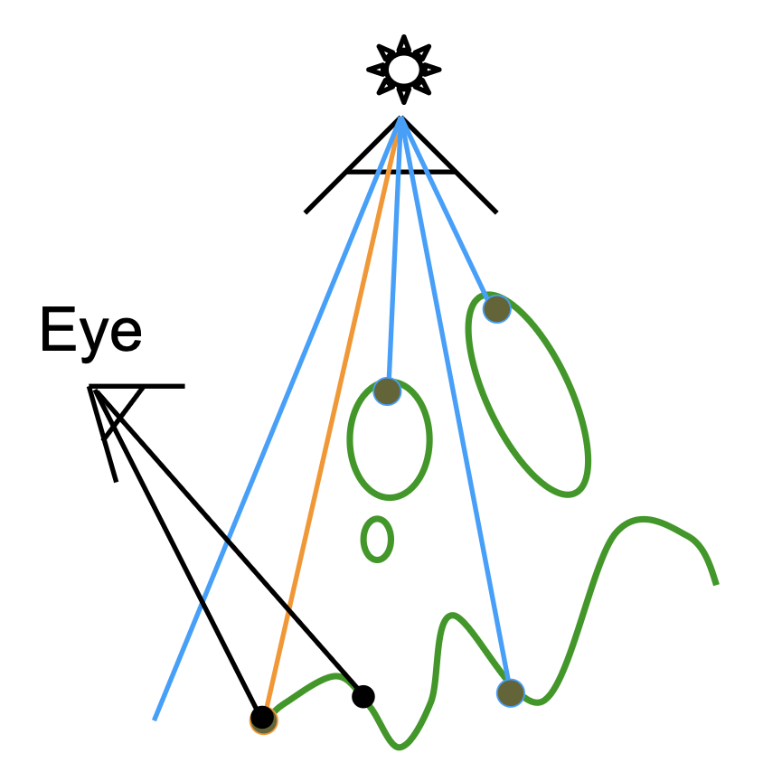
            </div>

        - 光源看不到眼睛能看到的地方，说明光线被阻挡，因而会产生阴影

            <div style="text-align: center">
                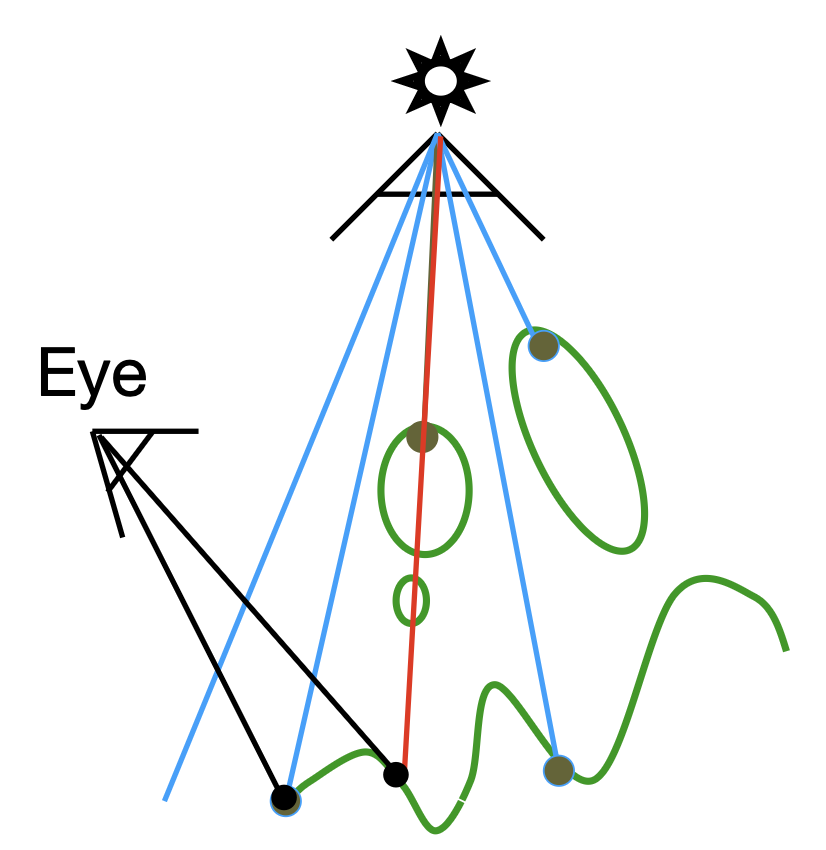
            </div>
    
接下来再通过另一个真实但更复杂的例子可视化阴影映射的过程。

<div style="text-align: center">
    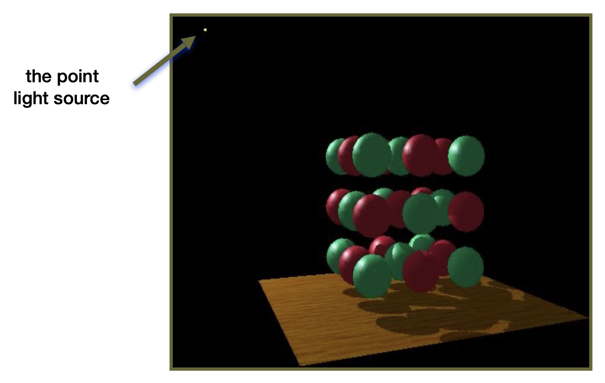
</div>

- 对比光源视角和观测者视角：


    <div style="text-align: center">
        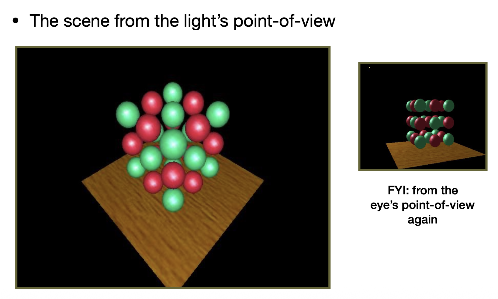
    </div>

- 光源视角下的深度图：

    <div style="text-align: center">
        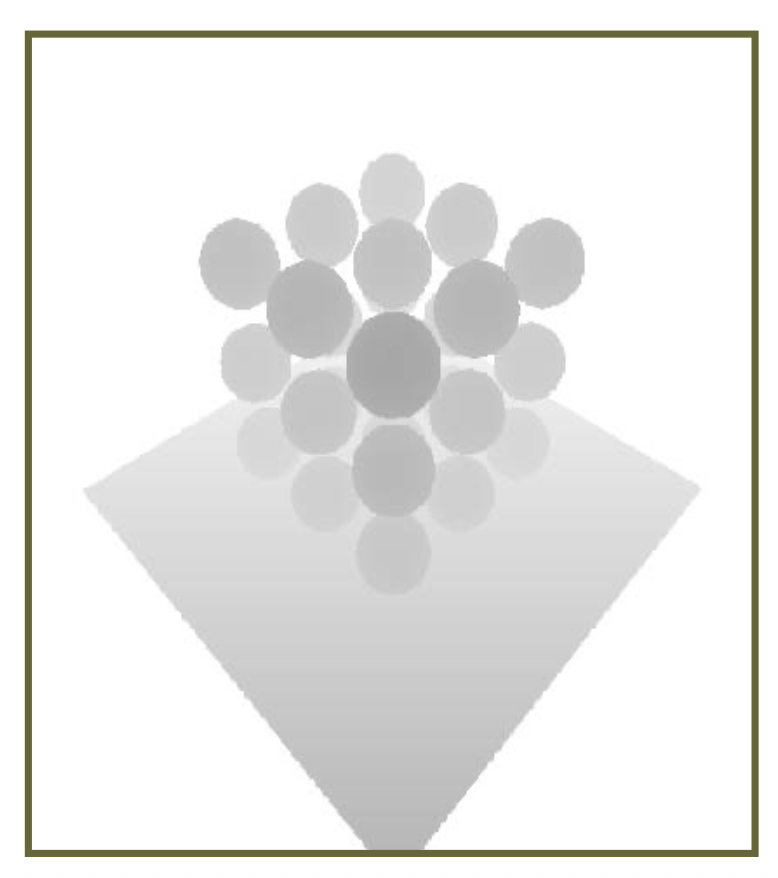
    </div>

- 比较光源到着色点的距离和阴影图

    <div style="text-align: center">
        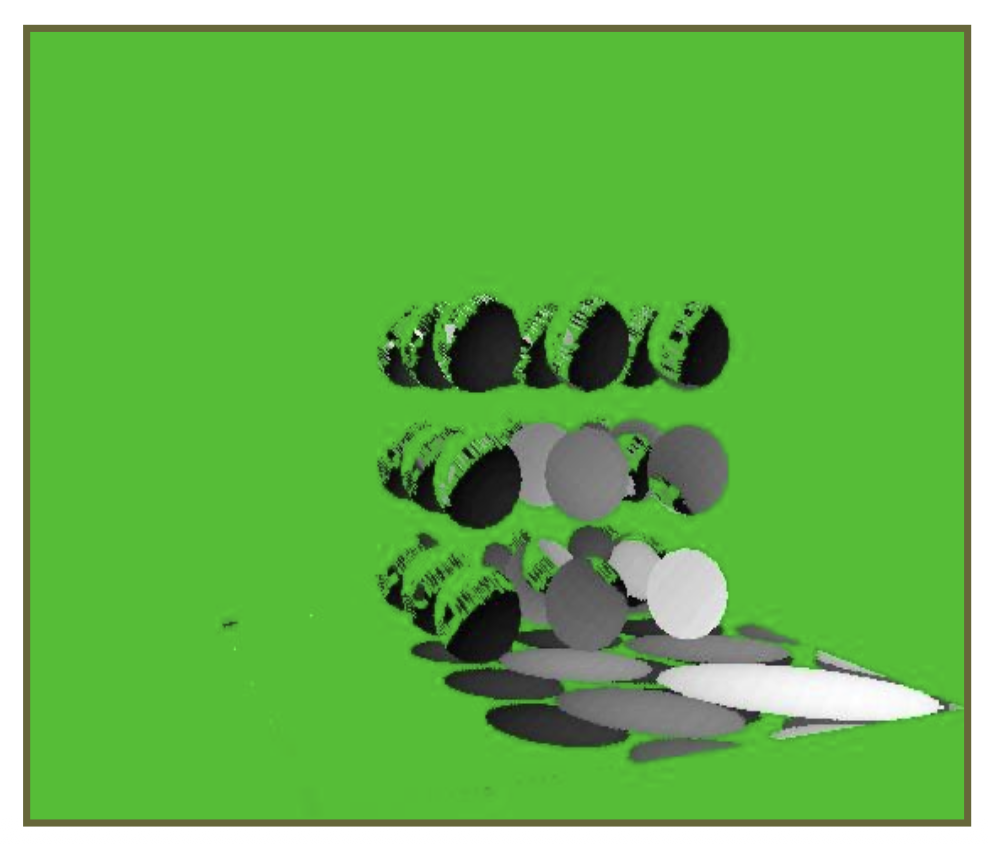
    </div>

    - 图中绿色部分表示光到着色点的距离近似等于阴影图上的深度，非绿色的部分就是阴影存在的区域

事实上，阴影映射是一种很知名的渲染技术，它在早期动画（比如《玩具总动员》）和所有 3D 游戏中是一种基础的阴影技术。

<div style="text-align: center">
    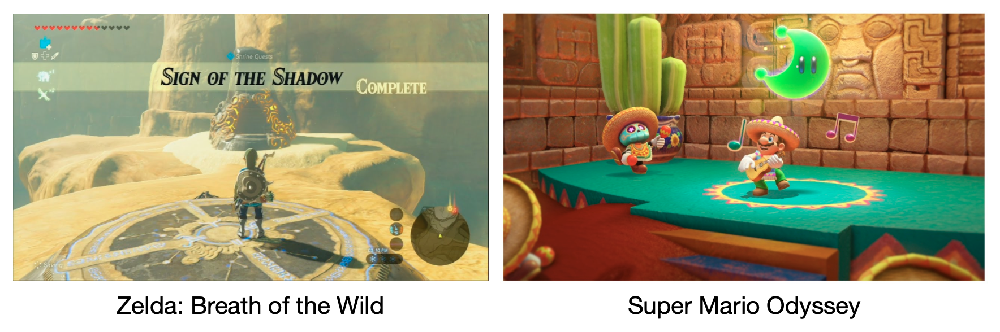
</div>

!!! bug "阴影映射的缺陷"

    - **硬阴影**(hard shadows)：在只有点光源的情况下，就会存在要么点在阴影中，要么不在阴影中的情况，所以阴影和场景中其他物体有明显的边界
        - 硬阴影 v.s. **软阴影**(soft shadow)

            <div style="text-align: center">
                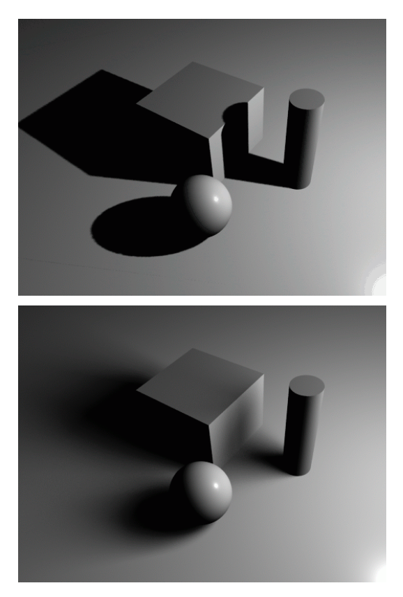
            </div>

        - 这就类比天文学中的本影(umbra)（太阳光被完全遮挡）和半影(penumbra)（太阳光被部分遮挡）

            <div style="text-align: center">
                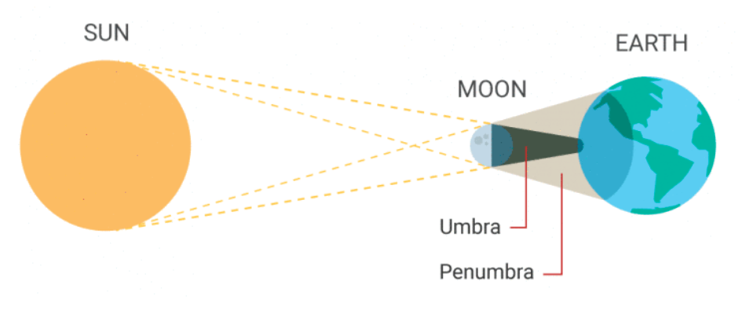
            </div>

    - 阴影质量依赖于阴影图的分辨率（基于图像的技术的常见问题）
        - 阴影图分辨率过低会导致锯齿状的阴影出现
        - 一些游戏可能存在类似“阴影质量”的选项，这就是在调整阴影图的分辨率
    - 浮点数深度值的比较意味着会存在量纲(scale)、偏差(bias)和容忍度(tolerance)的问题
