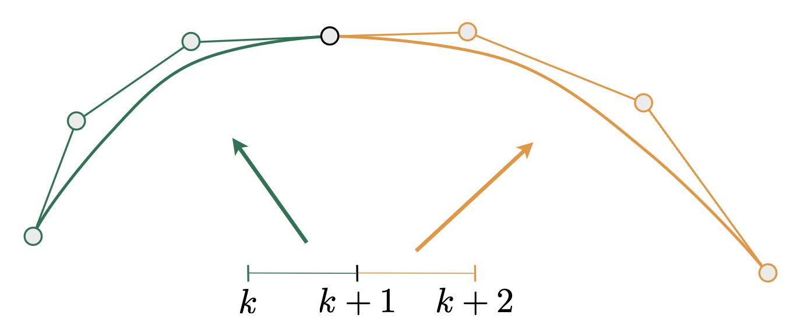
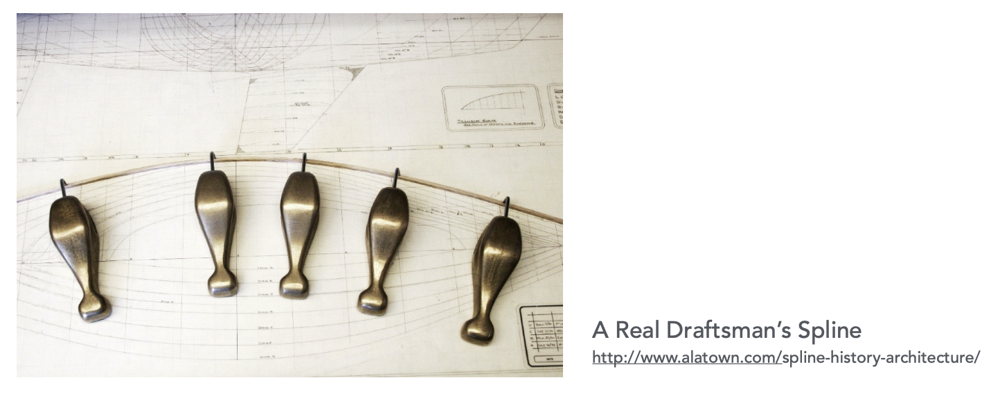

# Geometry

>"I hate meshes. <br>
>I cannot believe how hard this is. <br>
>Geometry is hard." <br>

<div markdown="1" style="text-align: right">
>— David Baraff <br>
>Senior Research Scientist <br>
>Pixar Animation Studios <br>
</div>


## Examples

=== "例1"

    <div style="text-align: center">
        
    </div>

    各种形态的玻璃杯

=== "例2"

    <div style="text-align: center">
        
    </div>

    汽车外形

=== "例3"

    <div style="text-align: center">
        
    </div>

    发动机

=== "例4"

    <div style="text-align: center">
        
    </div>

    衣服（布料）

=== "例5"

    <div style="text-align: center">
        
    </div>

    水滴飞溅

=== "例6"

    <div style="text-align: center">
        
    </div>

    城市外观

=== "例7"

    <div style="text-align: center">
        
    </div>

    拖把狗（？）

=== "例8"

    <div style="text-align: center">
        
    </div>

    新冠病毒

=== "例9"

    <div style="text-align: center">
        
    </div>


## Various Representations

{ align=right width=40% }

表示几何体的方式有：

- **隐式的**(implicit)表示
    - 代数曲面(algebraic surface)
    - 水平集(level set)
    - 距离函数(distance function)
    - ...
- **显式的**(explicit)表示
    - 点云(point cloud)
    - 多边形网格(polygon mesh)
    - 细分(subdivision)，NURBS

每种选择都有自己最适合的任务或几何类型。


### Implicit Representations

{ align=right width=20% }

隐式表示法基于对点的分类，即描述出关于点的特定关系。用更熟悉的话来说，就是能够用一个方程来表示一组点，即 $f(x, y, z) = 0$（在三维空间中）。比如所有点都在球面上，那就可以用方程 $x^2 + y^2 + z^2 = 1$ 来表示。

可以用方程表示更复杂的几何体——比如 $f(x, y, z) = (2 - \sqrt{x^2 + y^2})^2 + z^2 - 1 = 0$ 可以表示在圆环上的点。

<div style="text-align: center">
    
</div>

{ align=right width=20% }

一些任务很难用这种隐式法表示。然而，隐式法擅长的是区分一个点在几何体的内部还是外部。比如检验点 $(3/4, 1/2, 1/4)$ 是否在几何体 $f(x, y, z) = x^2 + y^2 + z^2 - 1$ 的内部时，只需将坐标值带进去计算，看函数值的正负即可。由于结果为 $-1/8 < 0$，因此该点在几何体的内部。


#### Algebraic Surfaces

对于简单的几何体，可以直接用关于 x, y, z 的多项式表示。几何体的表面就是多项式的零集合。

<div style="text-align: center">
    
</div>

而对于复杂的形体，我们可以尝试结合多个隐式表示的几何体（利用布尔运算）来构造复杂几何体，这种方法叫做**构造实体几何**(constructive solid geometry)。

<div style="text-align: center">
    
</div>

???+ example "例子"

    <div style="text-align: center">
        
    </div>


#### Distance Functions

另一种组合简单几何体的方法是使用**距离函数**(distance function)逐渐混合两个几何体的表面。距离函数能提供从任意位置到物体的最小距离（可为有**符号**距离）。

<div style="text-align: center">
    
</div>

???+ example "例子"

    将两个对象的边界混合起来（使用线性插值）

    <div style="text-align: center">
        
    </div>

可以将任意两个距离函数 d1, d2 混合起来：

<div style="text-align: center">
    
</div>

???+ example "例子"

    以下场景就是利用纯距离函数形成的：

    <div style="text-align: center">
        
    </div>

    [🔗链接](https://iquilezles.org/www/articles/raymarchingdf/raymarchingdf.htm)


#### Level Set Methods

{ align=right width=20% }

上述方法的局限性在于：一个封闭形式的函数很难描述所有复杂的形体。因此这里给出另一种解决方案：用网格存储一系列近似函数值。随后可用前面介绍过的插值法找出函数值 = 0 的地方，这些地方就是几何体的表面。这种方法能为我们提供更显式的形体控制（就像一个纹理）。

???+ example "例子"

    === "例1：医学数据（比如 CR, MRI, etc.）"

        <div style="text-align: center">
            
        </div>

    === "例2：物理模拟"

        <div style="text-align: center">
            
        </div>


#### Fractals

**分形**(fractals)的特点是自相似，即部分和整体长得非常像，类似递归函数。自然界中不少现象和分形有关。但这样的形状难以控制。

<div style="text-align: center">
    
</div>

!!! abstract "总结"

    - 优点
        - 紧凑的描述（比如一个函数）
        - 方便特定的查询
        - 适用于计算光线与表面的相交（之后介绍）
        - 对于简单形体，精确描述/无采样误差
        - 易于处理拓扑结构的变化（例如流体）
    - 缺点
        - 难以描述很复杂的形体


### Explicit Representations

不同于隐式法，显式表示法会**直接给出**，或通过**参数映射**(parameter mapping)的方式表示出每个点，即：
$$
f: \mathbb{R}^2 \rightarrow \mathbb{R}^3; (u, v) \mapsto (x, y, z)
$$

???+ example "例子"

    <div style="text-align: center">
        
    </div>

和隐式法相反，显式法在采样上相对更容易，因为每个点的坐标表示是已知的，只要代入具体数值就能算出来。比如对于前面介绍的圆环，还可以这么表示：$f(u, v) = ((2 + \cos u) \cos v, (2 + \cos u) \sin v, \sin u)$，因此只要知道 $(u, v)$ 的值就能直接得到圆环面上一点准确的坐标值了。

然而，显式法在判断点在几何体的内部/外部上就相当乏力了。比如对于以下问题：判断点 $(3/4, 1/2, 1/4)$ 是否在几何体 $f(u, v) = (\cos u \sin v, \sin u \sin v, \cos v)$ 的内部，一下子很难想到该怎么做。实际上这个问题就等同于隐式法一节给出的那个例子。

接下来介绍各类显式法的应用。

<div style="text-align: center">
    
</div>


#### Point Cloud

{ align=right width=20% }

- 最简单的表示法：用一堆点 (x, y, z) 表示（存储在列表中）
- 便于表示任何类型的几何体
- 对于很大的数据集（每个像素包含远不止一个点）而言很有用
- 经常被转换为多边形网格
- 难以在欠采样的区域绘制（如右图雕塑模型下半部分）

<div style="text-align: center">
    
</div>


#### Polygon Mesh

- 存储顶点和多边形（通常是三角形或四边形）
- 更易于进行处理/模拟，以及自适应采样
- 需要更复杂的数据结构
- 可能是图形学中最常见的表示

<div style="text-align: center">
    
</div>


#### The Wavefront Object File (.obj) Format

[Wavefront 目标文件](https://en.wikipedia.org/wiki/Wavefront_.obj_file)是一种标准几何定义文件格式，通常用于描述三维模型的几何数据。

- 在图形学的研究经常被用到
- 该文件是一种文本文件，指定顶点、法线、纹理坐标系，以及它们的**连通性**(connectivities)

???+ example "例子"

    <div style="text-align: center">
        
    </div>

    - 这个文件表示的是一个立方体的模型
    - 从左往右，分别指定了顶点（3-10行）、纹理坐标（12-25行）、法线（27-34行）、连通性（36-47行）的数据
    - 立方体有六个面，故有六条法线，所以这里部分法线数据是冗余的
    - 对于连通性那块的每一行，每个数据分别表示“顶点/纹理坐标/法线”，每行表示三个点的关系


## Curves

<!-- ???+ example "例子"

    === "相机路径(camera path)"

        

        [原视频链接](https://youtu.be/rIJMuQPwr3E)

    === "动画曲线(animation curves)"

        

        这是用 [Maya](https://www.autodesk.com/products/maya/overview) 构建的三维模型。由于视频过长，我将画质压到了 144P，所以超级糊，请见谅！（或者直接去油管看，[链接](https://youtu.be/b-o5wtZlJPc)）

    === "向量字体(vector fonts)"

        <div style="text-align: center">
            
        </div>

        这个例子在前几讲介绍过。这种字体无论怎么缩放始终保持光滑，原因在于它是用逐段三次贝塞尔曲线表示的，下面会马上介绍的！ -->


### Bézier Curves

**贝塞尔曲线**(Bézier curves)由一系列控制点定义。下面展示的是一段三次贝塞尔曲线：

<div style="text-align: center">
    
</div>

- 曲线不必经过所有控制点，但一定会经过起点和终点
- 起点和终点处的切线方向是固定的，分别是从起点到第二个点的向量（$\bm{t_0}$），以及从倒数第二个点到终点的向量方向（$\bm{t_1}$）
- 至于向量中的系数3，暂时不要深究，稍后会做解释


#### De Casteljau’s Algorithm

根据已知的控制点找出贝塞尔曲线的算法是**德卡斯特里奥算法**(De Casteljau Algorithm)。下面以二次贝塞尔曲线为例介绍如何求解：

- 考虑（三个）控制点

    <div style="text-align: center">
        
    </div>

- 创建时域 [0, 1]；对于时域上的一点 t，先在一条边上使用线性插值插入一个点

    <div style="text-align: center">
        
    </div>

- 另一条边也这么做

    <div style="text-align: center">
        
    </div>

- 递归地重复上述操作，直至只剩下一条线段，此时就确定 t 对应在曲线上的位置

    <div style="text-align: center">
        
    </div>

- 对 [0, 1] 上的每个 t，执行上述算法，得到一条完整的曲线

    <div style="text-align: center">
        
    </div>

对三次贝塞尔曲线（四个控制点）也可采用相同的递归线性插值方法：

<div style="text-align: center">
    
</div>

??? play "动画演示"

    <div style="text-align: center">
        
    </div>

    来源：<https://acko.net/files/fullfrontal/fullfrontal/wdcode/online.html>（幻灯片做得很酷炫，很难想象是 2013 年制作的）


#### Algebraic Formula

接下来从代数角度看贝塞尔曲线的求解过程。通过德卡斯特里奥算法，我们得到了一堆按金字塔形状排布的系数，其中金字塔顶端的系数就是最终要求的点。

<div style="text-align: center">
    
</div>

以二次贝塞尔曲线为例，将每个系数的表达式展开，得到：

<div style="text-align: center">
    
</div>

$$
\begin{align*}
\bm{b}_0^1(t) & = (1 - t)\bm{b}_0 + t\bm{b}_1 \\
\bm{b}_1^1(t) & = (1 - t)\bm{b}_1 + t\bm{b}_2 \\
\bm{b}_0^2(t) & = (1 - t)\bm{b}_0^1 + t\bm{b}_1^1 \\
& = (1 - t)^2\bm{b}_0 + (1 - t)t \bm{b}_1 + t^2\bm{b}_2 \\
\end{align*}
$$

一般地，我们可以用[**伯恩斯坦多项式**](https://en.wikipedia.org/wiki/Bernstein_polynomial)(Bernstein polynomial)表示 n 阶贝塞尔曲线：
$$
\bm{b}^n (t) = \bm{b}^n_0 (t) = \sum\limits_{j=0}^n \bm{b}_j B_j^n (t)
$$

- $\bm{b}^n (t)$：n 阶贝塞尔曲线（n 阶向量多项式）
- $\bm{b}_j$：贝塞尔控制点（$\mathbb{R}^N$ 范围内的向量）
- $B_j^n (t)$：伯恩斯坦多项式（n 阶标量多项式）

    $$
    B_j^n (t) = \begin{pmatrix}n \\ i\end{pmatrix} t^i (1 - t)^{n - i}
    $$

    - $n = 3$ 时，伯恩斯坦多项式的函数曲线如下，可以看到这些曲线是对称的

        <div style="text-align: center">
            
        </div>

???+ example "例子"

    假设 $n = 3$ 且在 $\mathbb{R}^3$ 范围内，即控制点位于三维空间，分别为：
    $$
    \bm{b}_0 = (0, 2, 3), \bm{b}_1 = (2, 3, 5), \bm{b}_2 = (6, 7, 9), \bm{b}_3 = (3, 4, 5)
    $$

    这些点定义了一条三次贝塞尔曲线，它是一个关于 $t$ 的三次多项式：
    $$
    \bm{b}^n (t) = \bm{b}_0 (1 - t)^3 + \bm{b}_1 3t(1 - t)^2 + \bm{b}_2 3t^2 (1 - t) + \bm{b}_3 t^3
    $$


#### Properties

- 端点插值
    - 对于三次贝塞尔曲线，$\bm{b}(0) = \bm{b}_0, \bm{b}(1) = \bm{b}_3$
- 端点的切线和两段的线段平行
    - 对于三次贝塞尔曲线，$\bm{b}'(0) = 3(\bm{b}_1 - \bm{b}_0), \bm{b}'(1) = 3(\bm{b}_3 - \bm{b}_2)$
- 关于仿射变换：可通过变换控制点来变换贝塞尔曲线
- 关于**凸包**(convex hull)：贝塞尔曲线一定位于控制点构成的凸包内
    - 可以这样理解凸包：假如木板上有一组钉好的钉子（位置随意），现在用一根橡皮筋包住这些钉子——先将橡皮筋拉大，覆盖所有的钉子，然后松手，皮筋收紧时也能包住所有的点，此时这根皮筋就是这组钉子的凸包

    <div style="text-align: center">
        
    </div>


#### Piecewise Bézier Curves

{ align=right width=30% }

贝塞尔曲线的一个缺陷是：当曲线阶数过高时，即有很多控制点时，反而很难控制曲线的弯曲。比如对于右图所示情况，曲线本应该按控制点排布弯来弯去的，但实际上没有什么弯曲。

改进措施就是不要用一段高阶贝塞尔曲线，而是将多段低阶贝塞尔曲线串起来，这种技术就叫做**逐段贝塞尔曲线**(piecewise Bézier curve)。其中的**逐段三次贝塞尔曲线**是一种很常用的方法，被广泛应用在字体、路径、Illustrator 和 Keynote 中，如下图所示。

<div style="text-align: center">
    
</div>

???+ example "Demo"

    可以到这个[网站](https://math.hws.edu/eck/cs424/notes2013/canvas/bezier.html)上操控逐段三次贝塞尔曲线。

    <div style="text-align: center">
        
    </div>

---
假设两条相邻的贝塞尔曲线为：$\mathbf{a}: [k, k+1] \rightarrow \mathbb{R}^N, \mathbf{b}: [k+1, k+2] \rightarrow \mathbb{R}^N$（整数的划分）。

<div style="text-align: center">
    
</div>

考虑它们的**连续性**(continuity)：

- $C^0$ 连续：$\mathbf{a}_n = \mathbf{b}_0$（即第一段的尾和第二段的首是同一个点）

    <div style="text-align: center">
        
    </div>

- $C^1$ 连续：$\mathbf{a}_n = \mathbf{b}_0 = \dfrac{1}{2}(\mathbf{a}_{n-1} + \mathbf{b}_1)$（在 $C^0$ 连续的基础上，还要保证该点是邻居点连线的中点）

    <div style="text-align: center">
        
    </div>

- 实际应用中可能还会用到更高阶的连续，但这里就不介绍了


### Splines

**样条**(splines)是一条通过一组给定的点，并具有一定数量的连续导数的连续曲线。简言之，就是一条可控的曲线。

<div style="text-align: center">
    
</div>

其中一种经典的样条叫做 **B 样条**(B-spline)（**基样条**(basis spline)的缩写）。它要求比贝塞尔曲线更多的信息，并满足所有贝塞尔曲线具备的性质（即 B 样条是贝塞尔曲线的超集）。不过我们不会展开解释 B 样条以及相关概念（比如 [NURBS](https://en.wikipedia.org/wiki/Non-uniform_rational_B-spline)）的原理。

另外也不会介绍曲线相关的运算，比如增减曲线阶数等。感兴趣的读者可观看胡事民教授的课程：<https://www.bilibili.com/video/av66548502?from=search&seid=65256805876131485>


## Surfaces

### Bézier Surfaces

将贝塞尔曲线扩展到曲面上

<div style="text-align: center">
    

</div>

我们可以使用两次贝塞尔曲线，以类似双线性插值的方式得到贝塞尔曲面。比如一个三维的贝塞尔曲面就可以通过两条三次贝塞尔曲线得到，此时需要 4x4 个控制点。

<div style="text-align: center">
    
</div>

??? play "动画演示"

    <div style="text-align: center">
        
    </div>

对于双三次贝塞尔曲面块(bi-cubic Bezier surface patch)

- 输入：4x4 的控制点
- 输出：由在 $[0, 1]^2$ 内被 $(u, v)$ 参数化的二维曲面

<div style="text-align: center">
    
</div>

贝塞尔曲面的求解方法是使用**可分离的一维德卡斯特里奥算法**(separable 1D De Casteljau algorithm)。

- 目标：求解关于 $(u, v)$ 的曲面位置
- 使用德卡斯特里奥算法，对4条贝塞尔曲线的每条线求解一个点 $u$。这为“移动”的贝塞尔曲线提供了 4 个控制点
- 再使用一维的德卡斯特里奥算法求解“移动"曲"线上的点 $v$

<div style="text-align: center">
    
</div>

<div style="text-align: center">
    
</div>


### Mesh Operations: Geometry Processing

网格运算包括：

- **网格细分**(mesh subdivision)（升采样(upsampling)）：提升分辨率

    <div style="text-align: center">
        
    </div>

- **网格简化**(mesh simplification)（降采样(downsampling)）：降低分辨率，但保留形状/外观
    - 牛耳、牛角都有截断，可见简化后模型质量下降

    <div style="text-align: center">
        
    </div>

- **网格正则化**(mesh regularization)：修改采样分布（几乎全部使用正三角形）以提升模型质量

    <div style="text-align: center">
        
    </div>


#### Subdivision

##### Loop Subdivision

>这里的 "Loop" 不是循环的意思，而是算法发明者的姓氏。

**Loop 细分**（~~Loop 不知道翻译成什么（悲）~~）是一种常见的用于三角形网格的细分法则。执行步骤大致如下：

1. 创建更多的三角形（顶点）
2. 调整这些三角形的位置

<div style="text-align: center">
    
</div>

先来看如何“创建更多的三角形”：

- 将一个三角形划分为四个小三角形（此时会产生新的顶点）

    <div style="text-align: center">
        
    </div>

- 根据权重赋予新的顶点位置，其中新旧顶点的更新策略有所不同

    <div style="text-align: center">
        
    </div>

    - 新顶点（两个三角形中间的白色顶点）：更新至 $\dfrac{3}{8} (A + B) + \dfrac{1}{8} (C + D)$

        <div style="text-align: center">
            
        </div>

    - 旧顶点（图中度为6的顶点）：更新至 $(1 - nu) \cdot \text{original\_position} + u \cdot \text{neighbor\_pos\_sum}$

        - 其中 $n$ 为度，$u = \begin{cases}\frac{3}{16} & \text{if } n = 3 \\ \frac{3}{8n} & \text{otherwise} \end{cases}$

        <div style="text-align: center">
            
        </div>

??? example "例子"

    <div style="text-align: center">
        
    </div>


##### Catmull-Clark Subdivision

前面介绍的细分法只能用于三角形网格。对于更一般的情况，我们要用 **Catmull-Clark 细分**来做。下面用伪代码的形式展示过程：

```
Each subdivision loop:
    Add vertex in each face
    Add midpoint on each edge
    Connect all new vertices
```

以下图为例，我们来执行一遍上述细分。

<div style="text-align: center">
    
</div>

- 三角形标注区域为**非四边形面**(non-quad face)
- 圆点标注地点为**奇异点**(extraordinary vertex)（度 != 4）

细分后的结果如下：

<div style="text-align: center">
    
</div>

可以看到，每个非四边形会引入一个奇异点，并且经过一次细分后，非四边形面就会消失。下面两张图是继续细分后的结果：

<div style="text-align: center">
    
    
</div>

对于四边形网格，Catmull-Clark 细分的更新法则如下：

- 面上的点：$f = \dfrac{v_1 + v_2 + v_3 + v_4}{4}$

    <div style="text-align: center">
        
    </div>

- 边上的点：$e = \dfrac{v_1 + v_2 + f_1 + f_2}{4}$

    <div style="text-align: center">
        
    </div>

- 顶点上的点：$v = \dfrac{f_1 + f_2 + f_3 + f_4 + 2(m_1 + m_2 + m_3 + m_4) + 4p}{16}$
    - 其中 $m$ 为边的中点，$p$ 为旧的顶点上的点

    <div style="text-align: center">
        
    </div>

<!-- ???+ example "例子"

    === "例1"

        <div style="text-align: center">
            
        </div>

    === "例2"

        皮克斯动画《棋逢敌手》(Geri's Game) 里用到了这种细分技术。

         -->


#### Mesh Simplication

网格简化的目标是减少网格元素数量，并维持整体模型形状不变。

<div style="text-align: center">
    
</div>

简化的管教操作是**边坍缩**(edge collapsing)，也就是将多个顶点汇聚成一个顶点（这样操作后就会删去一些边）。

<div style="text-align: center">
    
</div>

那我们如何保证边坍缩后模型形状没有太大的变化呢？一种简单的想法是求顶点的平均值，作为边坍缩后顶点的位置。但这样得到的结果会严重损害模型的质量，因此不可行。一种常用的做法是使用**二次误差度量**(quadric error metrics)。

- 它能够衡量因简化引入的几何误差
- 二次误差：新生成的顶点需要最小化该点到之前几个相关三角形面距离的平方和（L2 距离）

<div style="text-align: center">
    
</div>

知道如何坍缩一条边，但如何选择坍缩哪条边呢？显然我们要找坍缩后二次误差度量最小的那条边。具体可以这么做：用一个优先队列（最小堆）维护所有边的二次误差（分数），然后每轮迭代中取**分数最小的边**坍缩（贪心算法）。经验证，这样就能得到很不错的结果。

???+ example "例子"

    === "例1"

        <div style="text-align: center">
            
        </div>

    === "例2"

        闫令琪老师学生时期的作业，可通过下面的滑条调整三角形网格的个数。

        <div style="text-align: center">
            
        </div>


