# Materials and Appearances

## Material

自然界中的材质：

<div style="text-align: center">
    
</div>

CG 中的材质：

<div style="text-align: center">
    
</div>

从数学角度看，**材质**(materials)就是渲染方程中的 **BRDF**。下面列举一些常见的材质：

- **漫反射/朗伯**(diffuse/Lambertian)材质
    - 原理图：

        <div style="text-align: center">
            
        </div>

    - 渲染效果：

        <div style="text-align: center">
            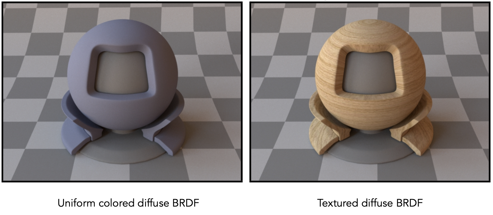
        </div>

    { align=right width=30% }

    - 假设入射光线的分布是均匀的，辐射率也是一样的；并且出射光线也是均匀分布，与入射光的辐射率一样（能量守恒），那么

        $$
        \begin{aligned}L_o(\omega_o)&=\int_{H^2}f_rL_i(\omega_i)\cos\theta_i\mathrm{d}\omega_i\\&=f_rL_i\int_{H^2}(\omega_i)\cos\theta_i\mathrm{~d}\omega_i\\&=\pi f_rL_i\end{aligned}
        $$

        >假设 $f_r, L_i$ 这两项是常数

    - 其中 $f_r = \dfrac{\rho}{\pi}$，其中 $\rho$ 叫做**反射率**(albedo)（取值范围：[0, 1]），和颜色相关

- **光泽**(glossy)材质
    - 原理图：

        <div style="text-align: center">
            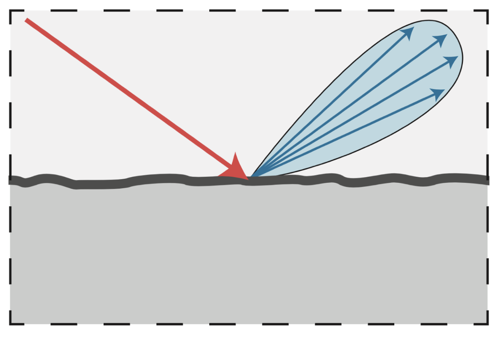
        </div>

    - 渲染效果：

        <div style="text-align: center">
            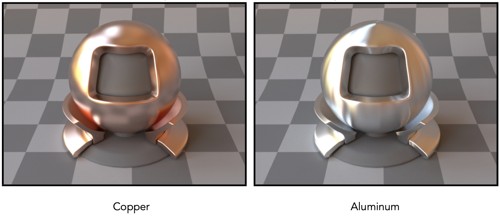
        </div>

- **理想反射/折射**(ideal reflection/refraction)材质
    - 原理图：

        <div style="text-align: center">
            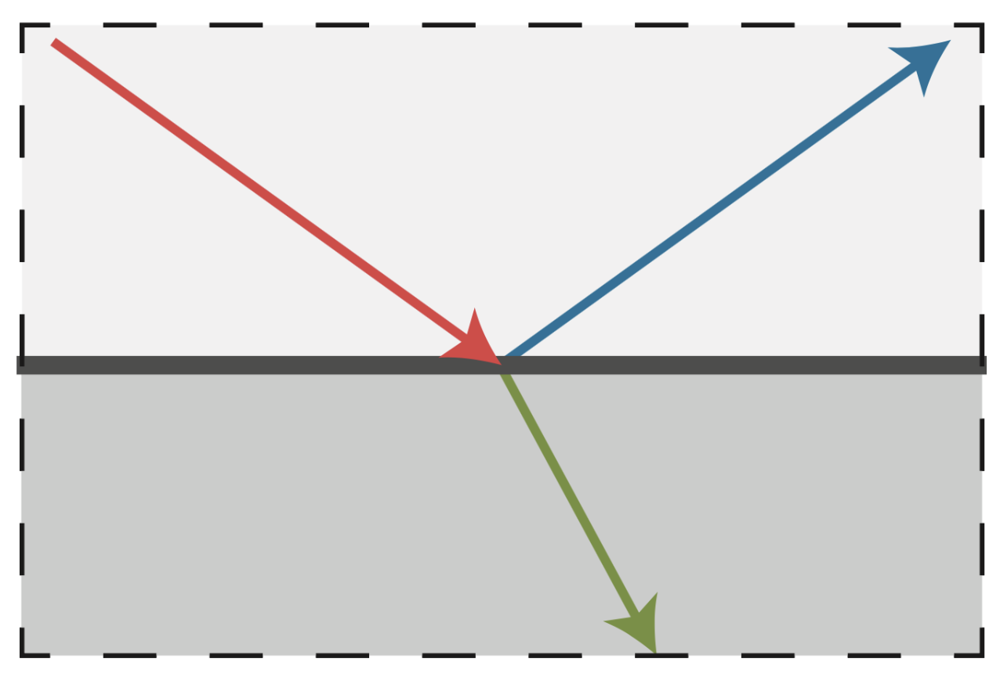
        </div>

    - 渲染效果：

        <div style="text-align: center">
            
        </div>

        - 对于右图，部分折射光被吸收，所以呈现颜色


### Reflection

完美的镜面反射(perfect specular reflection)：

<div style="text-align: center">
    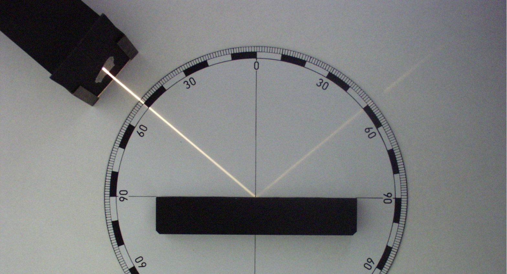
</div>

反射的两种理解：

- **极角**(polar angle)：

    <div style="text-align: center">
        
    </div>

    $$
    \begin{align*}
    \omega_o + \omega_i &= 2 \cos \theta \vec{n} = 2 (\omega_i \cdot \vec{n}) \vec{n} \\
    \omega_o &= -\omega_i + 2 (\omega_i \cdot \vec{n}) \vec{n}
    \end{align*}
    $$

- **方位角**(azimuthal angle)：

    <div style="text-align: center">
        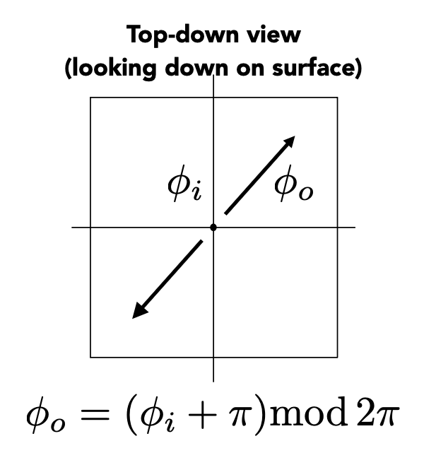
    </div>

    $$
    \varphi_o = (\varphi_i + \pi) \bmod 2\pi
    $$

渲染效果：

<div style="text-align: center">
    
</div>


### Refraction

光线除了从物体表面上反射出去，也有可能通过折射穿过表面。当进入新的介质时，光的折射发生。

<div style="text-align: center">
    
</div>

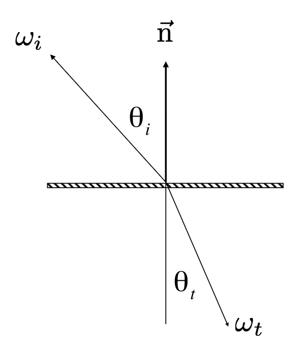{ align=right width=20% }

- 右下角关于海水的那幅图涉及到**焦散**(caustic)现象：由光线集中所形成的弯曲、明亮的图案，比如图中海水上的光纹

关于光的折射有一个著名的物理定律，即**斯涅尔定律**(Snell's Law)（又称**折射定律**(law of refraction)）。该定律指出，透射角度取决于入射光和出射光的**折射率**(IOR, index of refraction)，具体满足的关系如下：
$$
\eta_i \sin \theta_i = \eta_t \sin \theta_t
$$

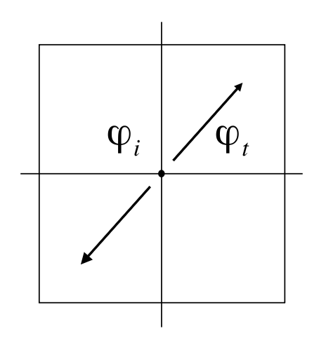{ align=right width=20% }

方向角的计算和反射类似：
$$
\varphi_t = \varphi_i \pm \pi
$$

常见材质的折射率如下：

<div style="text-align: center">
    
</div>

根据折射定律，在已知入射光和出射光的折射率，以及入射角的情况下，就能计算出射角的大小了：

$$
\begin{aligned}\cos\theta_t&=\sqrt{1-\sin^2\theta_t}\\&=\sqrt{1-\left(\frac{\eta_i}{\eta_t}\right)^2\sin^2\theta_i}\\&=\sqrt{1-\left(\frac{\eta_i}{\eta_t}\right)^2(1-\cos^2\theta_i)}\end{aligned}
$$

该式子成立的前提是算术平方根内的式子不小于0。一旦小于0，就说明出现了**全反射**(total internal reflection)的现象。此时 $\dfrac{\eta_i}{\eta_t} > 1$，即入射光的反射率大于出射光的反射率。

一种常见的光学现象背后的原理正是全反射，它就是**斯涅尔窗/圆**(Snell's window / circle)：从水底往上看时，我们只能看到一块圆形区域内的光照，区域外是一片黑暗。示意图如下：

<div style="text-align: center">
    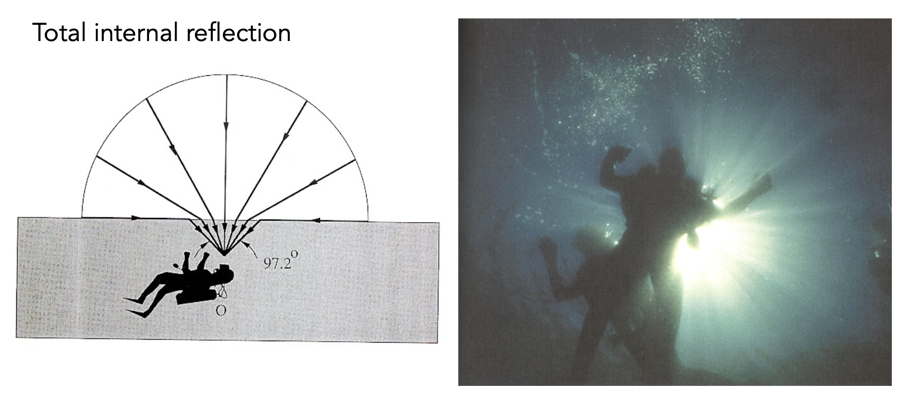
</div>

??? info "补充"

    BSDF（"S" 代表散射(scatter)）= BRDF + BTDF（"T" 代表透射(transmit)（折射））


### Fresnel Term

**菲涅尔项**(Fresnel term)：反射率(reflectance)取决于入射角度（以及光的偏振(polarization)）。

<div style="text-align: center">
    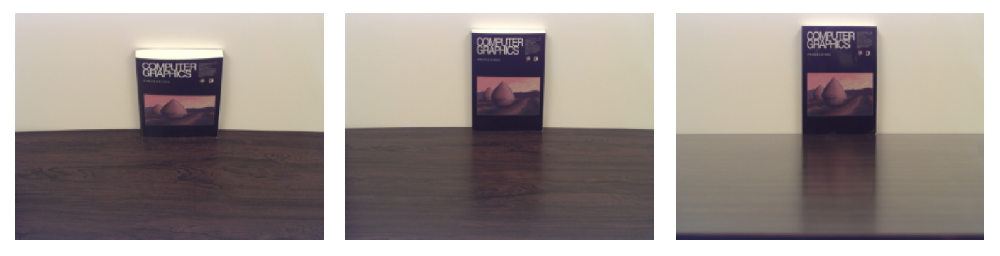
</div>

上面的例子反映了反射率随**掠射角**(grazing angle)（入射光线与法线的夹角）增大（即入射光越靠近表面）而增加（桌子上书本和墙壁的反光越明显）。

不同物体的菲涅尔项（横轴表示掠射角，纵轴表示反射率；图中的两条虚线表示考虑偏振的情况，不过一般无需考虑）

- 电介质(dielectric)（$\eta = 1.5$）

    <div style="text-align: center">
        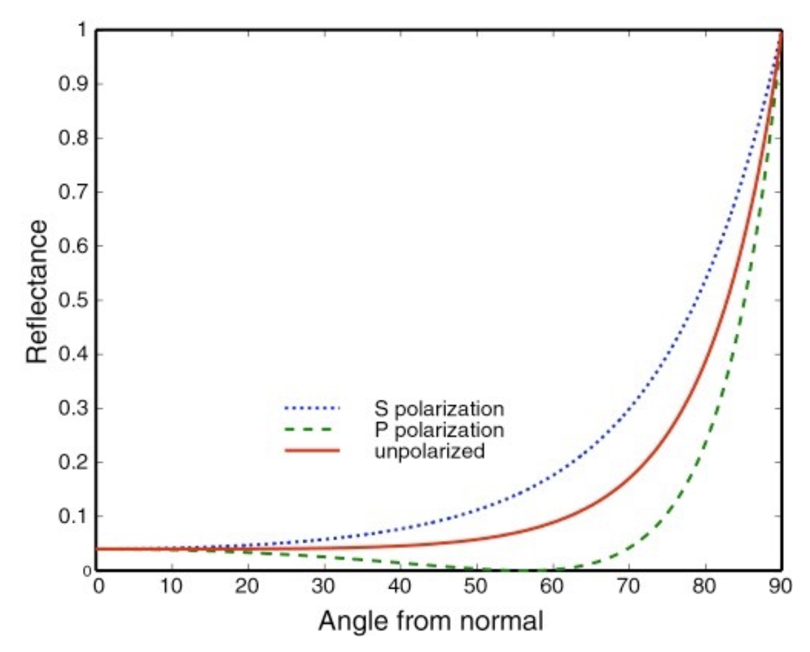
    </div>

- 导体(conductor)

    <div style="text-align: center">
        
    </div>

    ??? info "补充"

        导体的折射率是复数（~~不是负数~~）

菲涅尔项的计算公式：

- 精确版：考虑偏振

    $$
    \begin{align*}
    R_\mathrm{s}&=\left|\frac{n_1\cos\theta_\mathrm{i}-n_2\cos\theta_\mathrm{t}}{n_1\cos\theta_\mathrm{i}+n_2\cos\theta_\mathrm{t}}\right|^2=\left|\frac{n_1\cos\theta_\mathrm{i}-n_2\sqrt{1-\left(\frac{n_1}{n_2}\sin\theta_\mathrm{i}\right)^2}}{n_1\cos\theta_\mathrm{i}+n_2\sqrt{1-\left(\frac{n_1}{n_2}\sin\theta_\mathrm{i}\right)^2}}\right|^2 \\
    R_\mathrm{p}&=\left|\frac{n_1\cos\theta_\mathrm{t}-n_2\cos\theta_\mathrm{i}}{n_1\cos\theta_\mathrm{t}+n_2\cos\theta_\mathrm{i}}\right|^2=\left|\frac{n_1\sqrt{1-\left(\frac{n_1}{n_2}\sin\theta_\mathrm{i}\right)^2}-n_2\cos\theta_\mathrm{i}}{n_1\sqrt{1-\left(\frac{n_1}{n_2}\sin\theta_\mathrm{i}\right)^2}+n_2\cos\theta_\mathrm{i}}\right|^2 \\
    R_{\text{eff}} & = \dfrac{1}{2} (R_\mathrm{s} + R_\mathrm{p})
    \end{align*}
    $$

- 近似版：**施利克近似**(Schlick’s approximation)

    $$
    \begin{aligned}R(\theta)&=R_0+(1-R_0)(1-\cos\theta)^5\\R_{0}&=\left(\frac{n_1-n_2}{n_1+n_2}\right)^2\end{aligned}
    $$

精确版计算过于麻烦，所以在 CG 中如果不做很高的要求，一般就用近似版。


## Microfacet Material

???+ info "引入"

    <div style="text-align: center">
        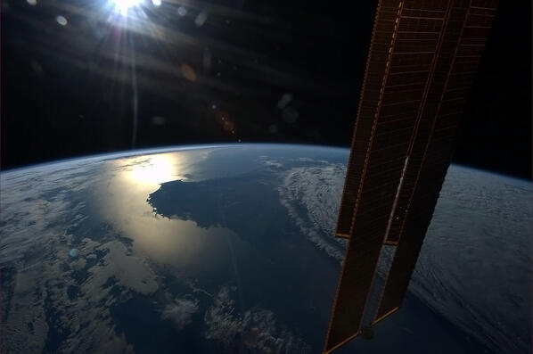
    </div>

    如图所示，这是从太空拍摄的地球图片。图中一块明亮的部分正是澳大利亚，看起来像一块平滑的表面。但实际上地球表面地形复杂，还有很多建筑，所以不可能是光滑的，但从远处看我们就难以观察这些细节了——这正是微表面材质的思路。

**微表面**(microfacet)的理论：

- 对于实际上粗糙的表面
    - 宏观角度（材质）看：平坦而粗糙
    - 微观角度（几何）看：崎岖而光滑

- 表面上的单个元素就像镜子一样
    - 称为微表面
    - 每个微表面都有自己的法线

<div style="text-align: center">
    
</div>

微表面 BRDF 的关键是微表面法线的**分布**

- 法线分布聚集 <==> 看起来像镜面反射

    <div style="text-align: center">
        
    </div>

- 法线分布发散 <==> 看起来像漫反射

    <div style="text-align: center">
        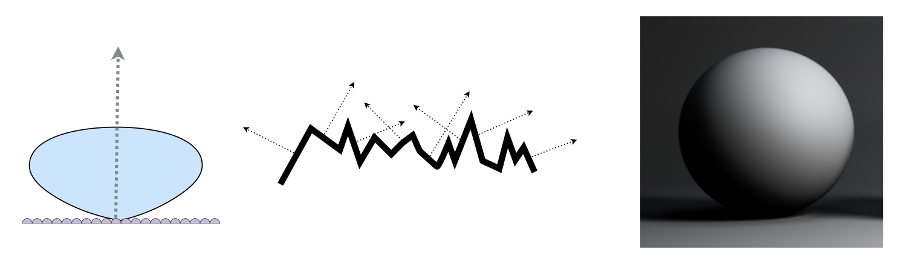
    </div>

下面来看什么样的微表面会将来自 $w_i$ 方向的光线沿 $w_o$ 方向反射：
$$
f(\mathbf{i},\mathbf{o})=\frac{\mathbf{F}(\mathbf{i},\mathbf{h})\mathbf{G}(\mathbf{i},\mathbf{o},\mathbf{h})\mathbf{D}(\mathbf{h})}{4(\mathbf{n},\mathbf{i})(\mathbf{n},\mathbf{o})}
$$

<div style="text-align: center">
    
</div>

其中（$\mathbf{h}$ 表示半向量，即 $\mathbf{i},\mathbf{o}$ 的角平分线）：

- $\mathbf{F}(\mathbf{i},\mathbf{h})$：菲涅尔项
- $\mathbf{G}(\mathbf{i},\mathbf{o},\mathbf{h})$：阴影遮罩项（几何项）
    - 有些微表面的光可能会被挡住（自遮挡），尤其是在光线从偏水平方向入射时更容易发生
- $\mathbf{D}(\mathbf{h})$：法线分布

???+ example "例子"

    <div style="text-align: center">
        
    </div>


### Isotropic / Anisotropic Materials

???+ example "例子"

    <div style="text-align: center">
        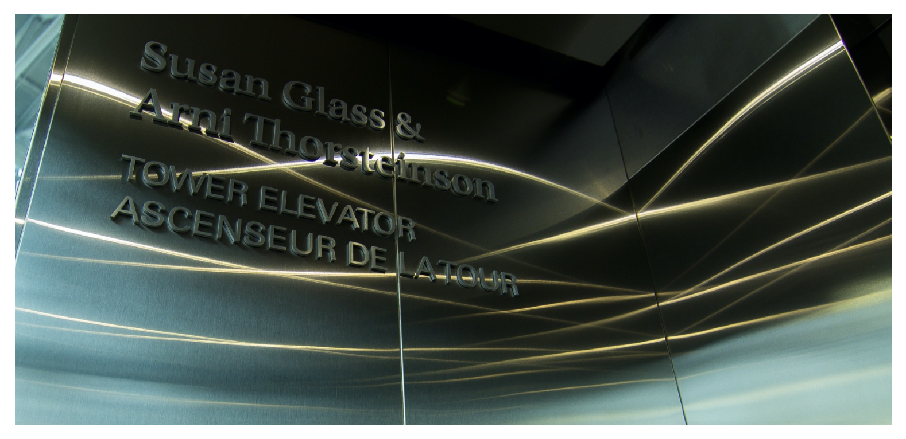
    </div>

    我们知道，电梯间内部一般都是金属。但顶上的光线打在表面上的结果和之前讲的有些不同——如上图所示，这些光在表面形成了多条亮线。这是因为这些金属是打磨过的，表面和一般的金属并不一样。这样的金属表面具有**各向异性**(anisotropy)。

各向同性和各向异性的区别来自底层表面的**方向性**(directionality)：

<div style="text-align: center">
    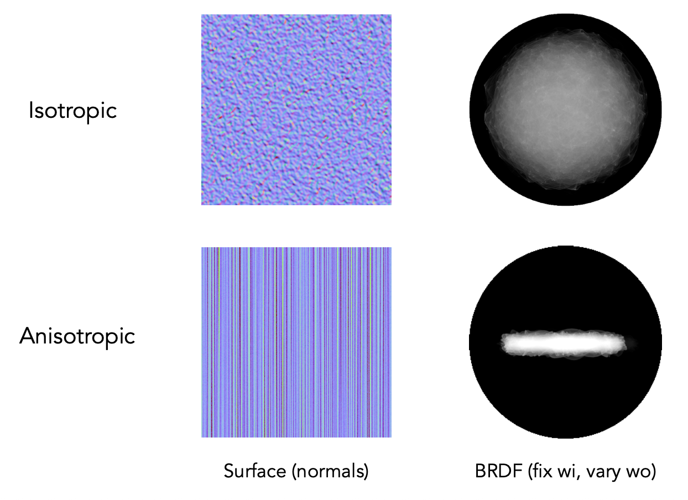
</div>

对于各向异性 BRDF，反射依赖于方位角(azimuthal angle) $\varphi$。
$$
f_r(\theta_i,\phi_i;\theta_r,\phi_r)\neq f_r(\theta_i,\theta_r,\phi_r-\phi_i)
$$

这个不等式的意思是这个不等式的意思是 BRDF 值不止和相对的方向角有关，还和绝对的方位角有关。

???+ example "例子"

    <div style="text-align: center">
        
    </div>

    === "拉丝金属(brushed metal)"

        <div style="text-align: center">
            
        </div>

    === "尼龙(nylon)"

        <div style="text-align: center">
            
        </div>

    === "天鹅绒(velvet)"

        <div style="text-align: center">
            
        </div>

        可能读者有过这样的体验：在天鹅绒上 rua 一下，表面的光泽就会发生变化。

        

        >本视频由 Sora 2 生成。


### Properties of BRDFs

- 非负性(non-negativity)

    $$
    f_r(\omega_i \rightarrow \omega_r) \ge 0
    $$

- 线性(linearity)

    $$
    L_r(\mathrm{p},\omega_r)=\int_{H^2}f_r(\mathrm{p},\omega_i\to\omega_r)L_i(\mathrm{p},\omega_i)\cos\theta_i\mathrm{d}\omega_i
    $$

    <div style="text-align: center">
        
    </div>

- 可逆原理(reciprocity principle)

    $$
    f_r(\omega_r \rightarrow \omega_i) = f_r(\omega_i \rightarrow \omega_r)
    $$

    <div style="text-align: center">
        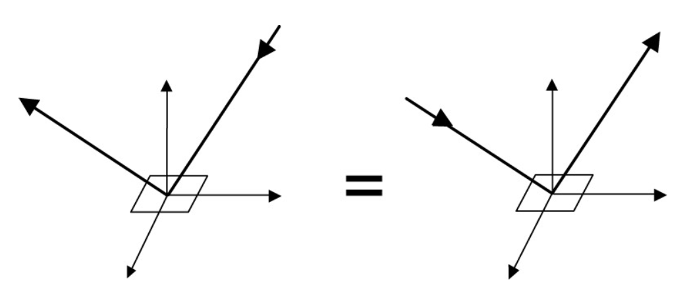
    </div>

- 能量保存(energy conservation)

    $$
    \forall\omega_r\int_{H^2}f_r(\omega_i\to\omega_r)\cos\theta_i\mathrm{d}\omega_i\leq1
    $$

- 各向同性 vs. 各向异性
    - 如果是各向同性，$f_r(\theta_i,\phi_i;\theta_r,\phi_r)= f_r(\theta_i,\theta_r,\phi_r-\phi_i)$
        - 4D -> 3D，简化计算

    - 此时根据可逆性

        $$
        f_r(\theta_i,\theta_r,\phi_r-\phi_i)=f_r(\theta_r,\theta_i,\phi_i-\phi_r)=f_r(\theta_i,\theta_r,|\phi_r-\phi_i|)
        $$

    <div style="text-align: center">
        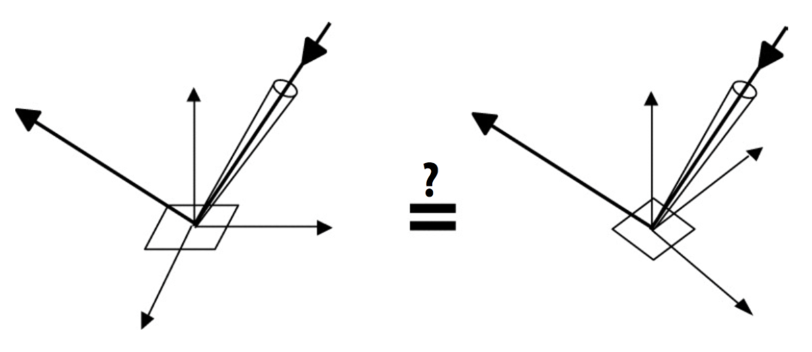
    </div>


## Measuring BRDFs

???+ info "动机"

    { align=right width=30% }

    - 避免额外开发/推导模型
        - 自动包含所有现有的散射效果

    - 希望准确渲染现实世界的材质
        - 这对产品设计、特效等很有用
  
    - 前面介绍的理论方法在实际应用上不准确

下面列举一些测量 BRDF 的方法：

- 基于图像的测量方法

    <div style="text-align: center">
        
    </div>

- 测角反射计(gonioreflectometer)
    - 球形龙门架(Spherical gantry)（@UCSD）

    <div style="text-align: center">
        
    </div>

- 通用方法：

    ```
    foreach outgoing direction wo
        move light to illuminate surface with a thin beam from wo
        for each incoming direction wi
            move sensor to be at direction wi from surface
            measure incident radiance
    ```

一些改进效率的措施：

- 通过各向同性表面，将方向性从 4D 降至 3D
- 利用可逆性可将需要测量的东西减半
- 设计更精巧的光学系统
- ...

!!! warning "测量 BRDFs 时会遇到的挑战"

    - 对掠射角的精确测量
        - 由于菲涅尔效应，这一点非常重要
    - 以足够密集的采样进行测量，以捕捉高频镜面反射
    - 逆向反射(retro-reflection)
    - 随空间变化的反射率(spatially-varying reflectance)
    - ...

要表示出测量好的 BRDF，理想的表示应该满足：

- 紧凑的表示
- 对测量数据的精确表示
- 对任意对的方向进行高效求值
- 适用于重要性采样的优良分布

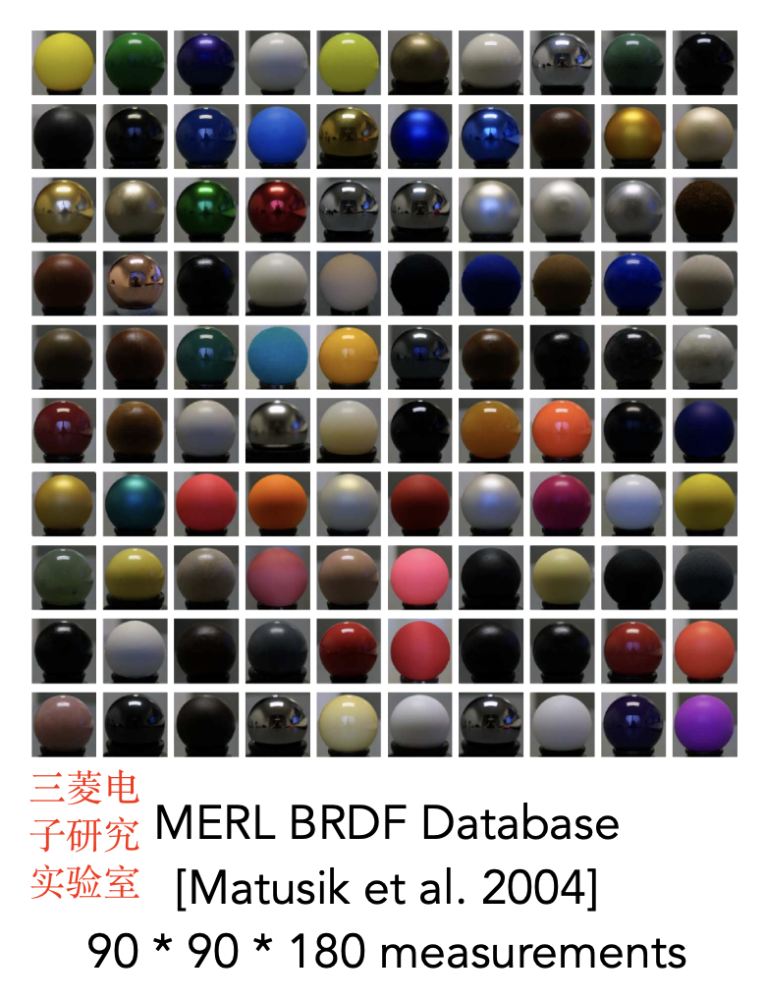{ align=right width=20% }

这里介绍其中一种表示法——表格表示(tabular representation)

- 在 $(\theta_i, \theta_o, |\varphi_i - \varphi_o|)$ 上存储等间距(regularly-spaced)的样本
    - 更好的做法：重新参数化角度，以更好地匹配高光效果
- 通常需要将测量值重新采样至表格中
- 很高的存储需求