# Advanced Topics in Rendering

## Advanced Light Transport

!!! note "比较无偏和有偏的蒙特卡洛估计器"

    - **无偏**(unbiased)蒙特卡洛法不会出现任何系统误差
        - 无偏估计器的期望值永远是正确值，无论用多少样例
    - 有系统误差的就是**有偏**(biased)蒙特卡洛法
        - 一种特殊情况是：若采样无穷多的样例后，期望值收敛到正确值的话，我们认为这就是**一致的**(consistent)

### Unbiased Light Transport Methods

#### Bidirectional Path Tracing (BDPT)

>回忆一下，这里的 "path" 是指连接相机和光源的路径。

**双向路径追踪**(bidirectional path tracing)的思路是：

- 分别追踪来自光源和相机的半路径(sub-path)
- 然后连接这两条半路径的端点

    

- 该方法适用于光源侧光线传播情况很复杂的情况
- 但该方法不仅难以实现，而且执行起来很慢

???+ example "例子"

    

        
    

    由于这个场景的光源是向上打的，因此整个房间的大多数光来自环境的反射而非光线直照，这就属于“光源侧光线传播情况很复杂的情况”。

#### Metropolis Light Transport (MLT)

Metropolis 光线传播的思路是：

- **马尔可夫链**(Markov chain) + 蒙特卡洛：
    - 简单来说，马尔可夫链是统计学中的一种采样工具，它能根据当前样本来生成下一个样本
    - 一个结论是：当被积函数和 PDF（概率密度函数）形状一致时，方差最小，因此利用马尔可夫链，直接沿着 PDF 采样，得到的结果就非常理想了
- 该方法在探索局部但复杂的光线路径时非常有用
- 关键思想：通过局部扰动(perturb)一条已有的光线来产生新的光线

    

        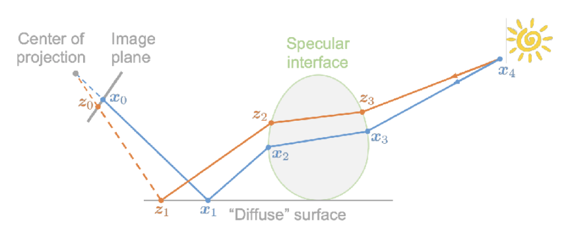
    

!!! recommend "优点"

    - 在复杂的光线路径上表现很好
    - 是一种无偏方法

    

        
    

!!! bug "缺点"

    - 难以估计其收敛速率
    - 无法保证每个像素有相等的收敛（“局部”处理的坏处）
    - 体现在渲染结果上就是看起来“脏脏的”
    - 因此该技术通常不会用在渲染动画上
        - 上一帧和下一帧各自有不同的收敛，导致看起来视频抖动非常严重

    

        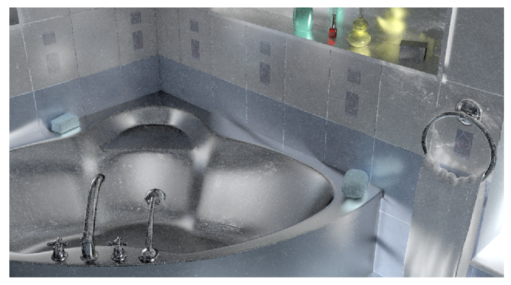
    

### Biased Light Transport Methods

#### Photon Mapping

**光子映射**(photon mapping)是一种有偏方法，非常擅长处理镜面-漫反射-镜面（SDS）路径并生成**焦散**(caustic)效果（由于光线聚焦形成的光斑）。

    

光子映射的实现分为两个阶段：

1. 光子追踪：从光源处发射光子，使其四处弹射，然后在漫反射面上记录光子（也就是说光子最终停留在漫反射面上）

    

        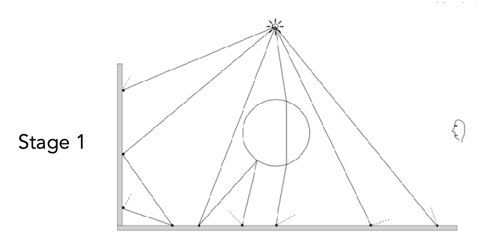
    

2. 光子汇集（最终聚集）：从相机处发射半路径，使其四处弹射，直到打到漫反射面上停止

光子映射的计算方法是**局部密度估计**(local density estimation)。

- 思路：区域内光子数越多，该区域就越明亮
- 对于每一个着色点，找到 N 个离其最近的光子，将光子所在表面区域圈起来

    

???+ question "为何该技术是有偏方法呢？"

    { align=right width=40% }

    - 如右图所示：如果 N 太小，渲染结果就会有很多噪点；但如果 N 太大，渲染结果又变得很模糊
    - 在局部密度估计中，我们用 $\Delta N / \Delta A$ 近似表示 $dN / dA$，但实际上两者是不等价的
    - 但考虑到数学上的极限(limit)：如果能发射更多的光子，那么同样 N 个光子所在的面积就能更小，因此 $\Delta A$ 会更接近 $dA$
    - 所以该方法既是有偏的，又是一致的

!!! info "一种更易于弄清“有偏”的理解"

    - 有偏 == 模糊
    - 一致 == 当有无穷个采样时就不模糊

#### Vertex Connection and Merging (VCM)

**顶点连接与合并**(vertex connection and merging, VCM)是对 BDPT 和光子映射这两个方法的结合。它的关键思路是：

- 对于在 BDPT 中那些端点不能连接，但可以合并的半路径，不要直接丢掉
- 使用光子映射来处理这些可以合并的邻近“光子”

    

>上图对应可连接的情况，下图对应不可连接，但可合并的情况。

### Instant Radiosity

**实时辐射度**(instant radiosity)（有时又称多光方法）的思路是：被照亮的表面也可看作是光源。具体来说：

- 从光源处发射光线半路径，并假设每个半路径的端点是一个**虚拟点光源**(virtual point light, VPL)
- 使用 VPLs 渲染场景，就和往常一样

    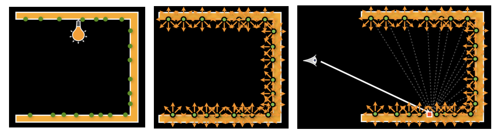

!!! recommend "优点"

    运行快，并且通常在漫反射场景下给出良好结果。

!!! bug "缺点"

    - 当 VPLs 靠近着色点时，就会出现莫名的光点（尖刺(spike)）
        - 解释：在[路径追踪的渲染方程](7.md#sampling-the-light)中，我们将对立体角的采样转化为对面积的采样，此时方程中还包含除以距离平方项。当两点间距很小时，结果值就会很大，因此会出现这些莫名的亮点
    - 无法处理光泽材质

    

        
    

## Advanced Appearance Modeling

### Non-surface Models

#### Participating Media

??? example "例子"

    === "雾"

        

            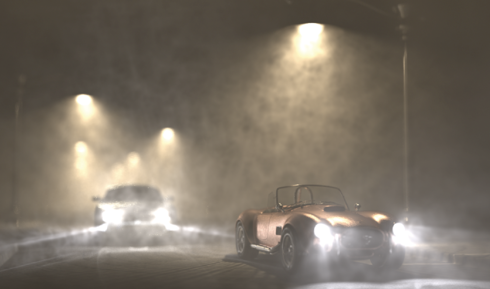
        

    === "云"

        

            
        

在光线穿过**参与介质**(participating media)的过程中，任何时刻都可能（部分）被吸收和散射。

    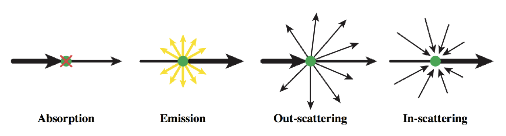

使用**相位函数**(phase function)来描述参与介质中任意点 x 处光散射的角分布。

    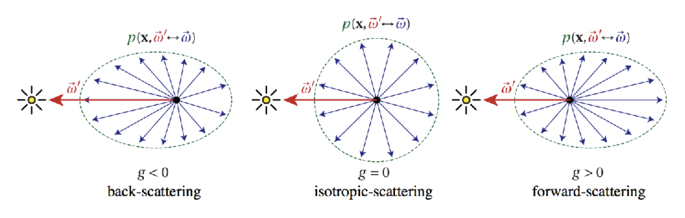

参与介质在渲染中的应用：

- 随机选择一个弹射方向
- 随机选择一个直行距离
- 在每个着色点上连接光线

    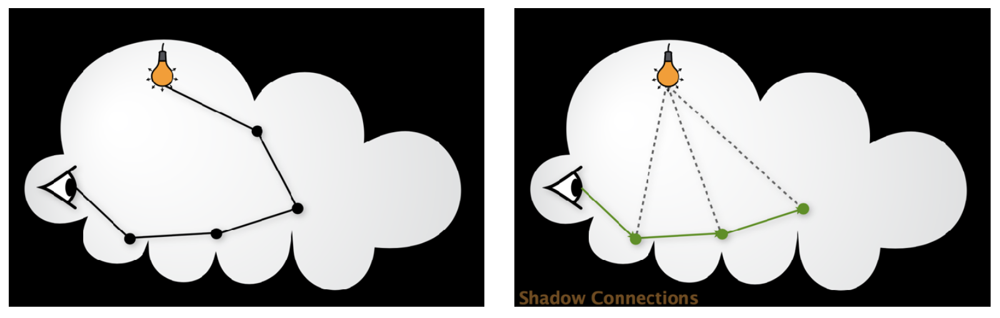

??? example "一些应用"

    === "例1"

        

            
        

        >电影《超能陆战队》

    === "例2"

        

            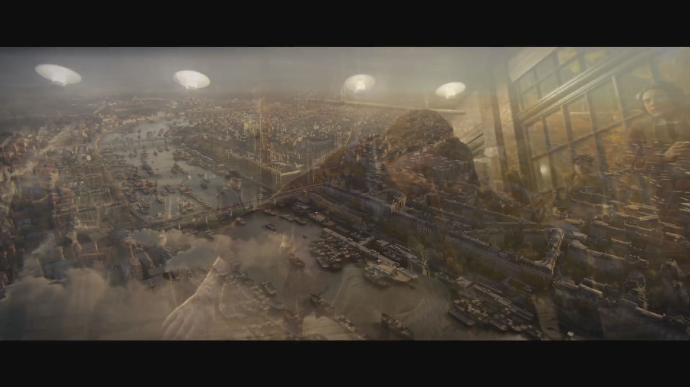
        

        >游戏《刺客信条：枭雄》

    === "例3"

        

            
        

        >论文：[*Augmented MPM for phase-change and varied materials*](https://math.ucdavis.edu/~jteran/papers/SSJCTS14.pdf)

#### Hair / Fur / Fiber (BCSDF)

像头发这样的材质在 CG 中是如何渲染的呢？

    

一种简单的模型叫做 **Kajiya-Kay 模型**。它把一根头发丝当做一根圆柱，打在圆柱上的光线会散射出去，其中大部分散射光线会形成一块圆锥区域。

    

???+ example "渲染效果"

    

        
    

    看起来一般般，一看就知道是假的。

于是有人提出了更复杂的模型，叫做 **Marschner 模型**。相比前面 Kajiya-Kay 模型，它有了以下改进点：

    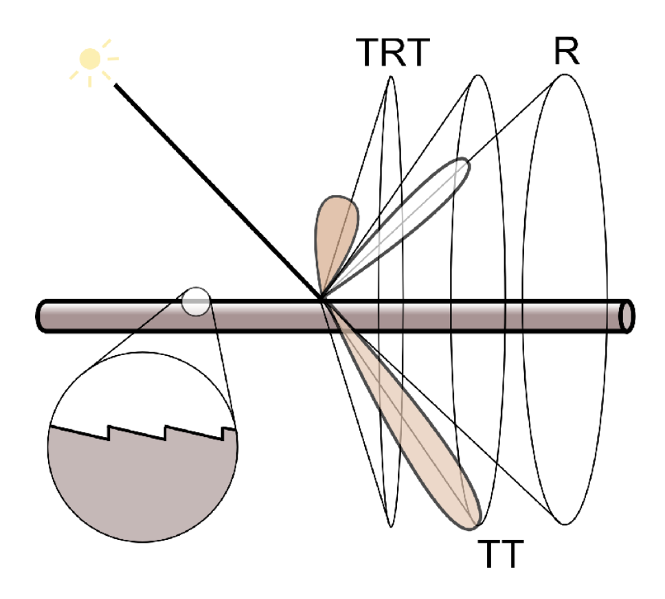

- 圆柱表面不再是平整的，而是锯齿状的
- 更具体地，把圆柱看成是一根**玻璃柱**，因此打在头发丝上的光还会穿过去

我们一般称这个圆柱的表面和内部分别为**表皮**(cuticle)和**皮质**(cortex)。

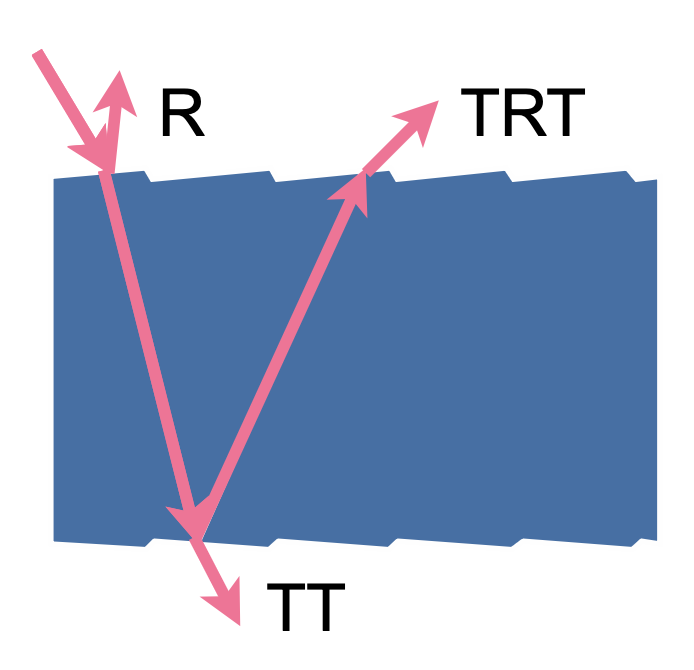{ align=right width=20% }

由于其特殊构造，所以和光线的交互要分为 3 种情况：

- **R**：直接在上表面反射
- **TT**：光线穿过上下表面
- **TRT**：光线穿过上表面后，在下表面反射，最后从上表面出去

>R：发射(reflection)，T：透射(transmission)（折射）

???+ example "渲染效果"

    

        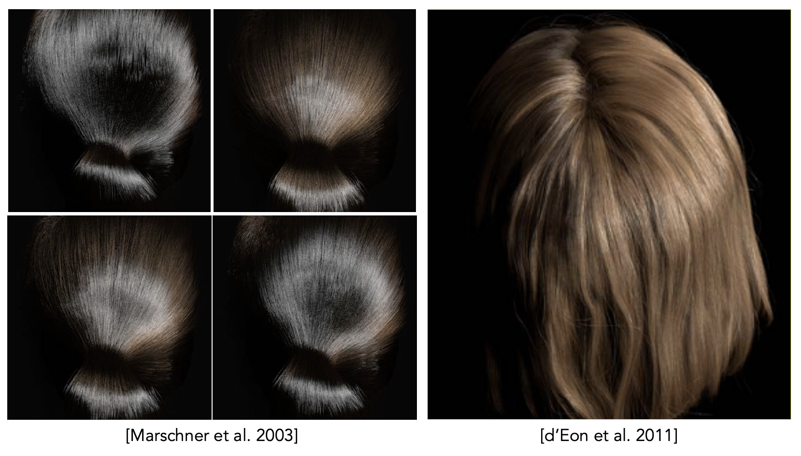
    

    比前一个模型看起来好多了。

???+ example "头发外观模型的应用"

    === "例1"

        

            
        

        ~~杀马特发型~~

        >游戏《最终幻想 15》

    === "例2"

        

            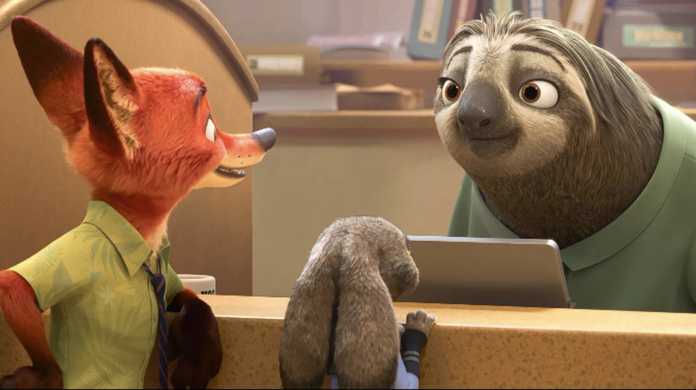
        

        >动画《疯狂动物城》

---
如果直接拿渲染头发的技术渲染动物毛发的话，得到的结果并不理想，动物毛发的那种扩散和饱和的外观就无法呈现出来。

    

在生物学中，毛发除了有表皮和皮质外，内部还有一个叫**髓质**(medulla)的东西。并且人的毛发和其他动物的毛发的髓质大小是不同的：

    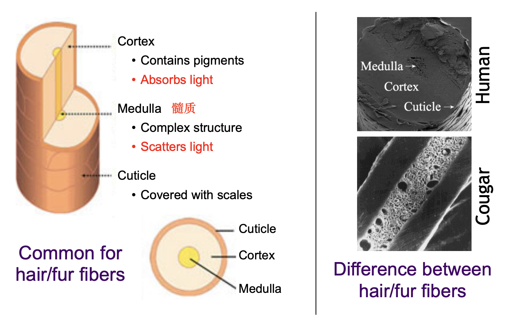

???+ example "渲染效果（从中感受到引入髓质的重要性）"

    === "例1"

        

            
        

        从左往右，髓质大小不断增加。

    === "例2"

        

            
        

由于考虑了髓质的存在，所以原来的单个的柱体模型就要进化为**双柱体模型**(double cylinder model)了。

    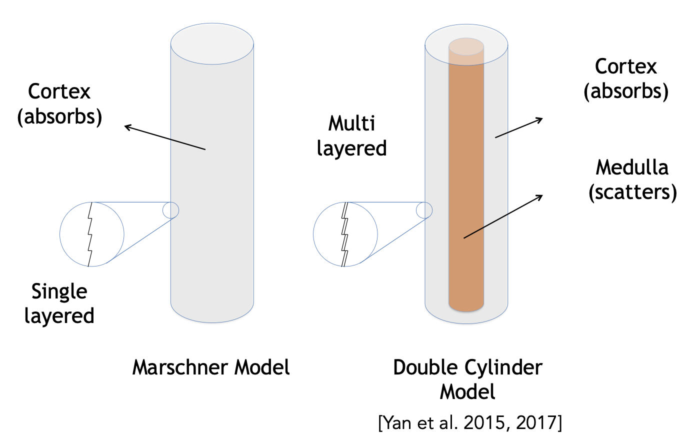

与光线的交互也变得更复杂了：

    

    

??? example "应用"

    === "例1"

        

            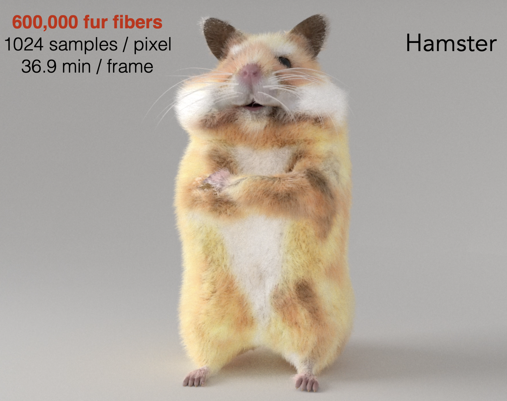
        

    === "例2"

        

            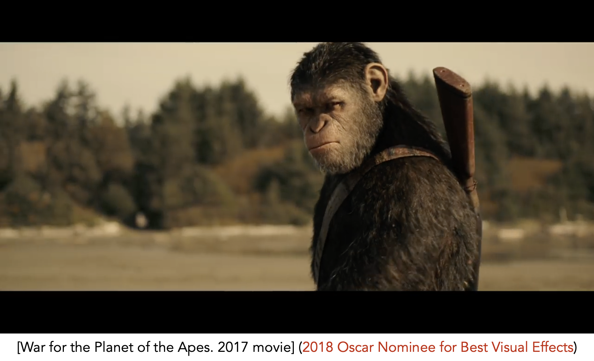
        

    === "例3"

        

            
        

#### Granular Material

下面这些都属于**颗粒材质**(granular material)：

    

显然，如果直接为每个颗粒建立单独的模型，那计算量也太大了。我们可以采用**过程**(procedure)定义的方法避免这一问题。

    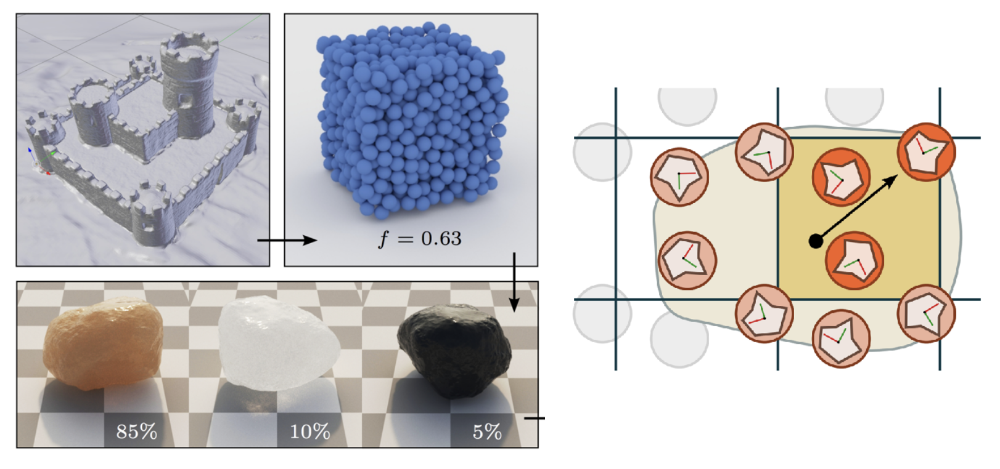

???+ example "渲染效果"

    === "例1"

        

            
        

    === "例2"

        

            
        

        >皮克斯动画《[Piper](https://www.youtube.com/watch?v=KCf56Tb0CP8)》

### Surface Models

#### Translucent Material (BSSRDF)

以下物体均属于**半透明材质**(translucent material)：

???+ example "例子"

    === "例1"

        

            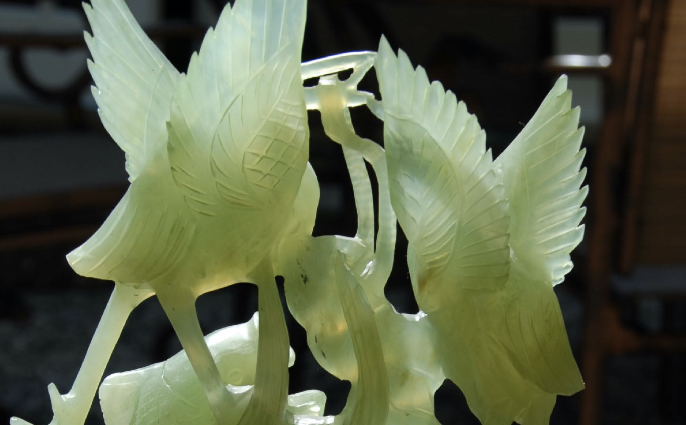
        

    === "例2"

        

            
        

    
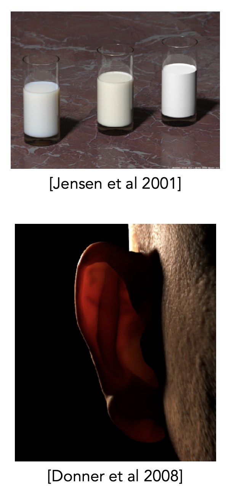{ align=right width=20% }

**次表面散射**(subsurface scattering)：许多表面的视觉特性，源于光线出射点与入射点的不同。

- 但这违反了 BRDF 的基本假设（BRDF 假设入射点和出射点是同一个点）

    

        
    

所以就有了在 BRDF 基础上泛化的散射函数 **BSSRDF** $S(x_i, \omega_i; x_o, \omega_o)$：某个点的出射辐照度源于另一点的入射微分辐照度。于是也就有了对原有渲染方程的泛化——在所有点和所有方向上做积分，得到：
$$
L(x_o,\omega_o)=\int_A\int_{H^2}S(x_i,\omega_i,x_o,\omega_o)L_i(x_i,\omega_i)\cos\theta_i\mathrm{d}\omega_i\mathrm{d}A
$$

    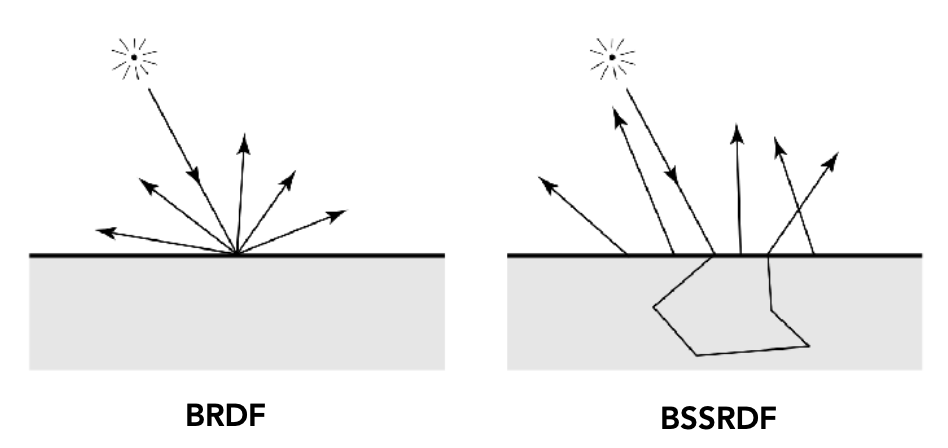

由于直接计算 BSSRDF 相当复杂，人们就想出一些近似算法来表现次表面散射。其中一种方法叫做**偶极近似**(dipole approximation)，它通过引入两个点光源来近似模拟光的扩散。

- 举一个生活中常见的例子：用手遮挡手电筒的光，你会发现光会穿透那只挡光的手，就好像光源来自手心一样

    

??? example "例子"

    === "例1"

        

            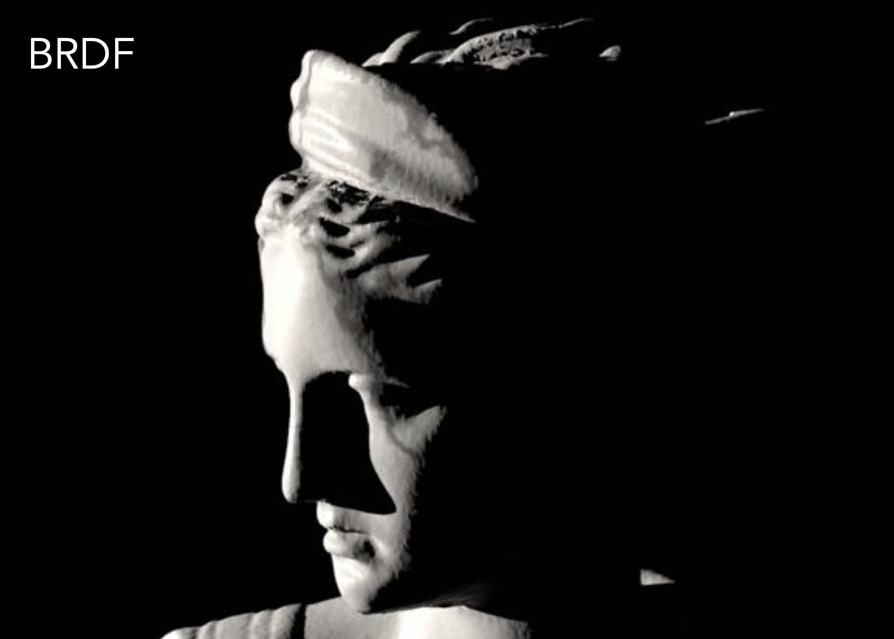
            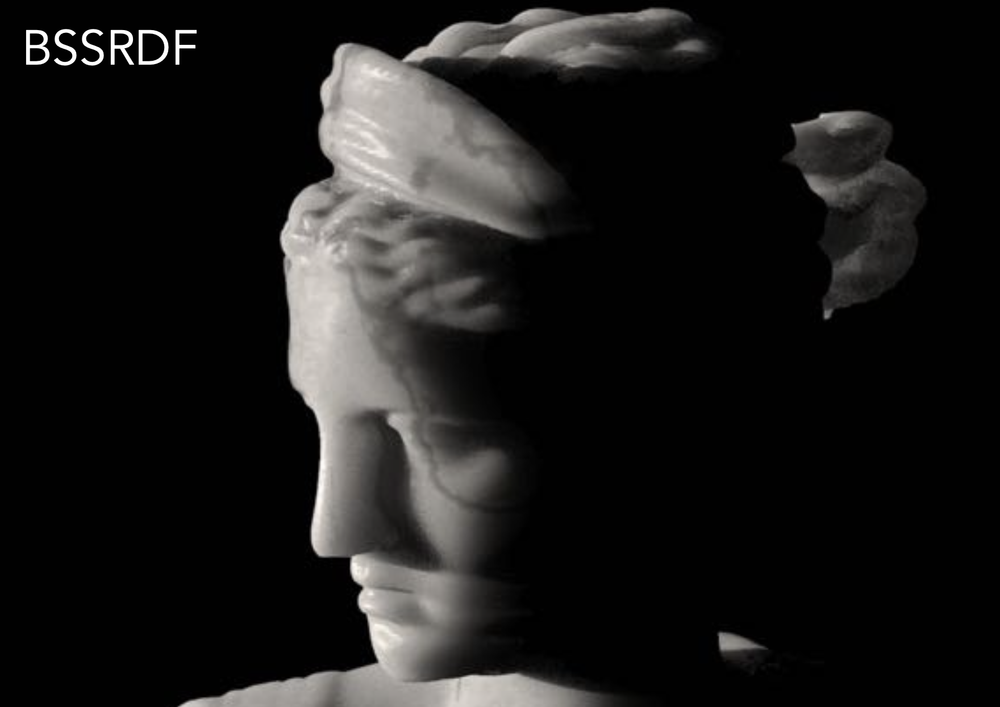
        

    === "例2"

        

            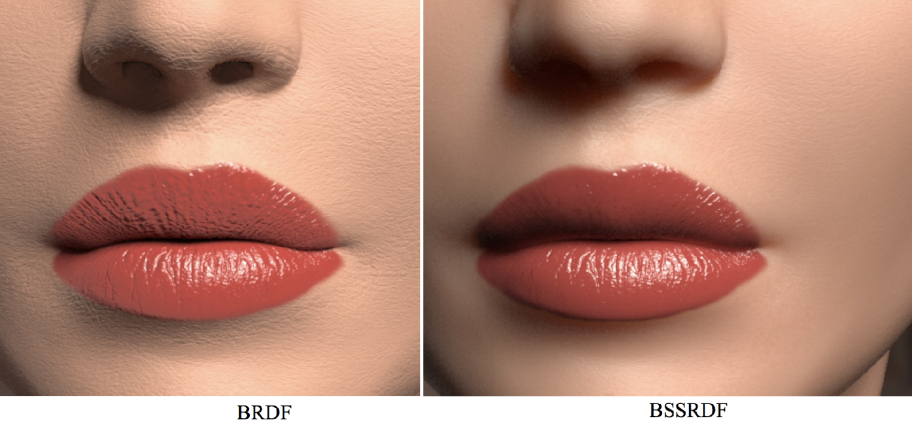
        

    === "例3"

        

            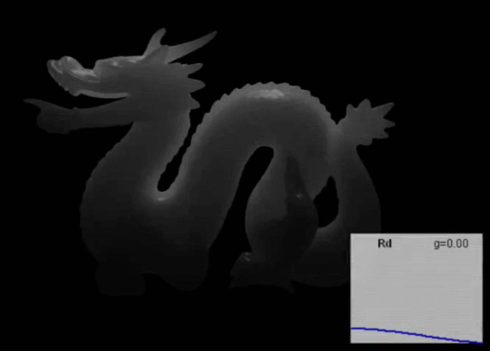
        

    === "例4"

        这些都是用电脑渲染出来的假人：

        

            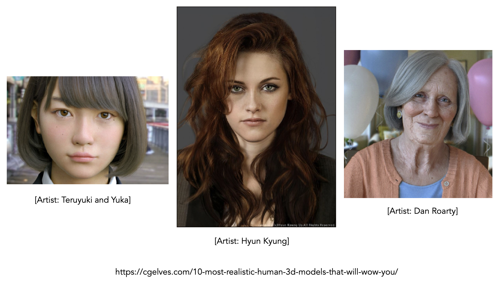
        

#### Cloth

**布料**(cloth)由缠绕在一起的纤维构成。“缠绕”分为两级：

    

下面两张图分别展示了编织(woven)和针织(knitted)的布料：

    

{ align=right width=20% }

将布料作为**表面**渲染时，需要根据给定的编织模式来计算整体的表现。这里就不展开介绍细节内容了。

???+ example "使用 BRDF 的渲染结果"

    

        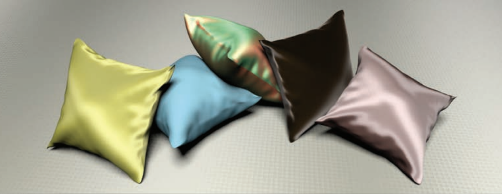
    

这种渲染方式的缺点是没法渲染像天鹅绒这样的布料，它的纤维是朝外分布的，很难用 BRDF 来表示。

    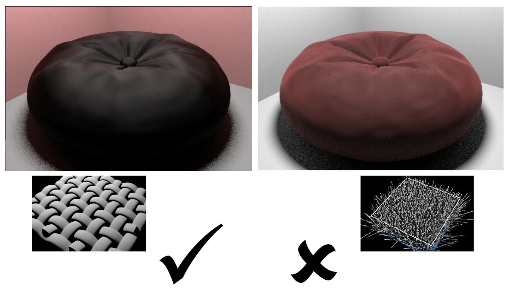

一种解决方案是将布料作为**参与介质**来渲染。

- 单根纤维的特性及其分布 -> 散射参数
- 把织物看作空间中分布的体积，可以将这块体积划分为超级细小的格子，每个格子中纤维的朝向分布是已知的，类似渲染云雾
- 但计算量很夸张...

    

另一种方案是按**真实纤维**来渲染（计算量也很夸张）：

    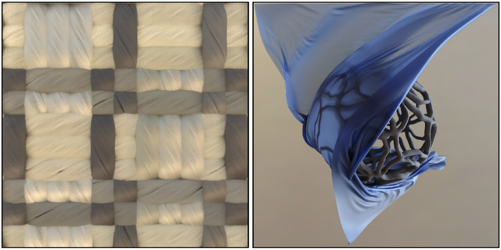

??? example "例子"

    === "例1"

        

            
        

        >没找到原论文 QAQ

    === "例2"

        

            
        

        >迪士尼动画《圆梦巨人》（2016）

#### Detailed Material (Non-Statistical BRDF)

有时用计算机渲染出来的东西可能过于完美，反而看起来不像真的。

    

现实世界的情况会更加复杂，因此反而不存在完美的物体。

    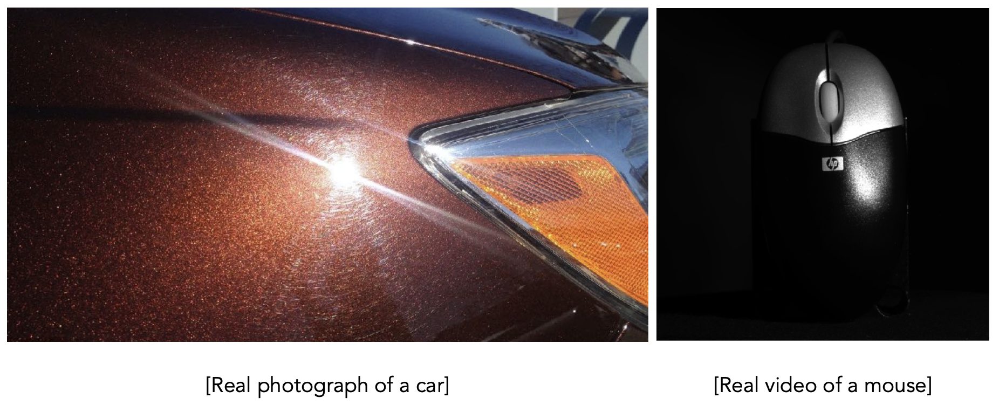

???+ example "例子"

    === "微表面模型"

        通过微表面模型渲染的物体过于完美，缺少真实感。

        

            
        

    === "更真实的细节"

        加入更真实的划痕等贴图后，水壶看起来就更像真的。

        

            
        

        

            
        

回忆一下微表面上 BRDF 的计算：

    

在微表面模型中，我们假设法线分布函数（NDF）是一个高斯函数，但实际的 NDF 并不会这么理想：

    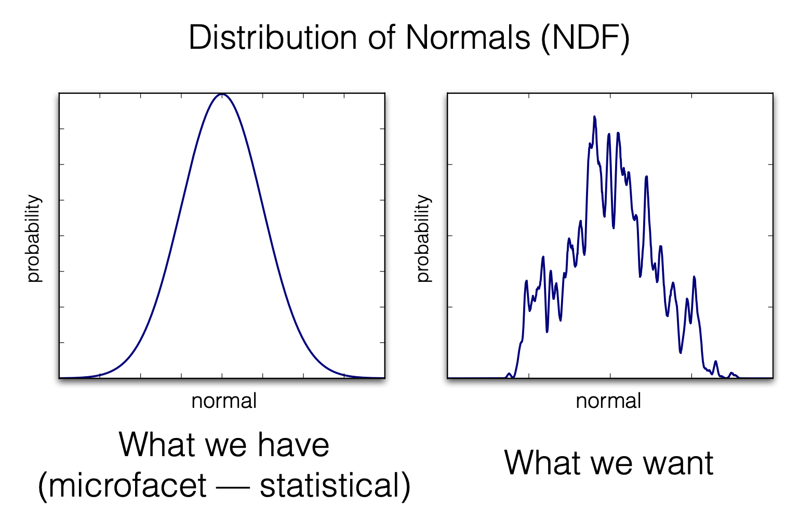

我们可通过各向同性的法线贴图来增加这些看似真实的细节。

    

加入亮片后让物体表面更好看些：

    

然而，如果直接用这种方式渲染，计算量相当大，耗时会非常久。

    

之所以计算量大，是因为加入法线贴图后，物体表面变得凹凸不平（在原先的微表面模型中，我们假设物体表面（从宏观角度看）是平整的），因此会出现光源发出的路径打不到相机，或者相机发出的路径打不到光源的情况。

    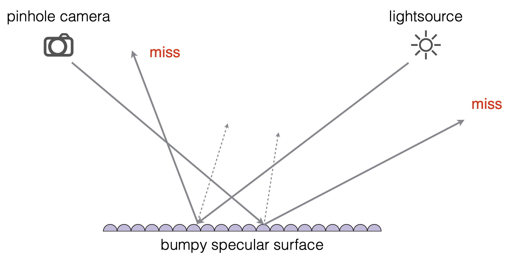

解决方案是将在一个像素范围内进行 BRDF 的计算。一个像素会覆盖多个微表面，然后把这块区域内的微表面分布拿出来，计算其法线分布，以替代原本在光滑平面上的法线分布。

    

如图所示，覆盖的微表面越多，$\mathcal{P}$-NDF 分布就越符合统计规律：

    

各种法线贴图对应的 $\mathcal{P}$-NDF 的形状：

    

??? example "例子"

    === "例1"

        

            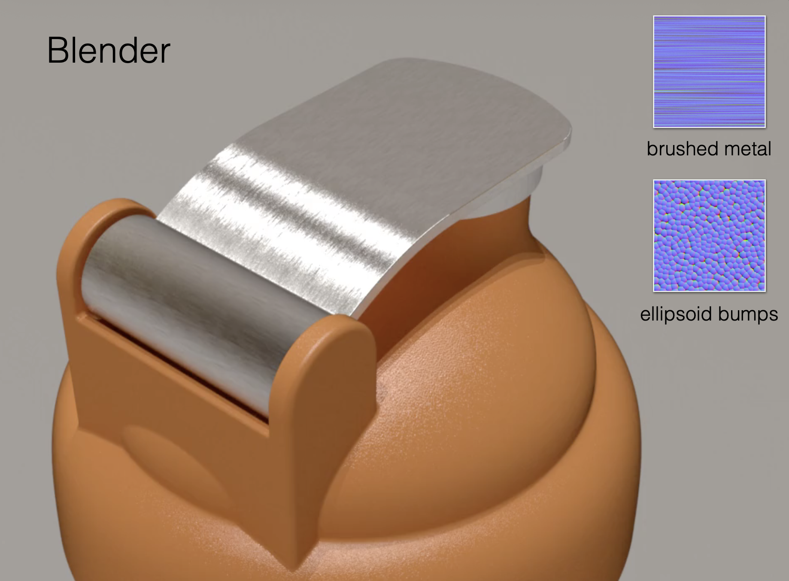
        

    === "例2"

        

            
        

    === "例3"

        

            
        

#### Wave Optics

最近的一种趋势是将**波动光学**(wave optics)应用到 CG 中。由于光是一种波，所以会有干涉、衍射之类的现象，而这些现象会影响到物体的细节表现。

    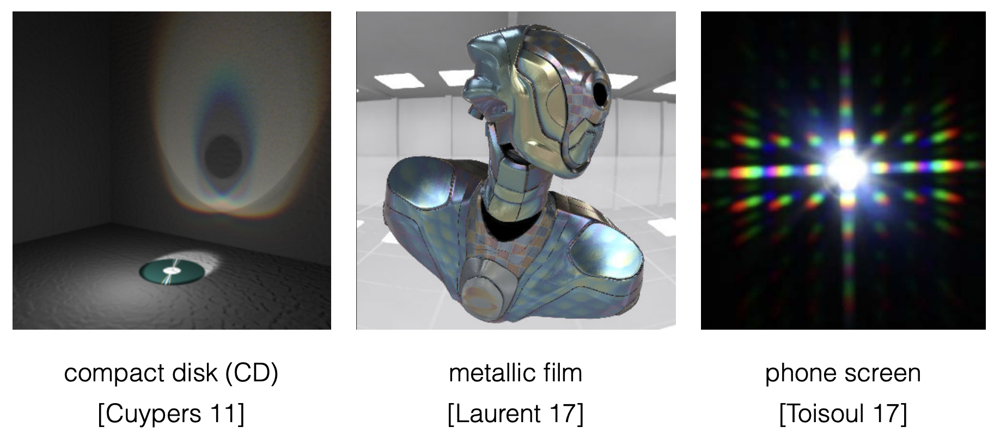

根据我们生活中的观察，一些看起来是单色的物体，凑近了看（或者拍下照片放大了看）会发现各种彩色的点。

    

    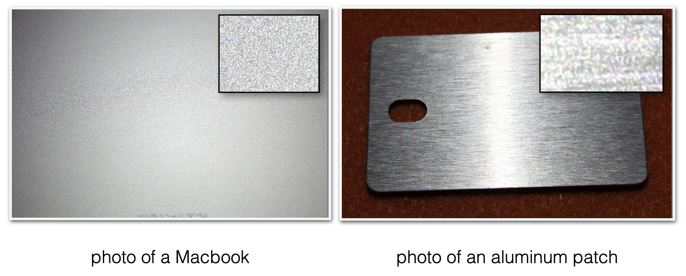

波动光学下的材质细节：

    

由于背后涉及到的物理知识过于复杂，所以这里不会展开讨论。

??? example "应用"

    === "例1"

        

            
        

        

            
        

        

            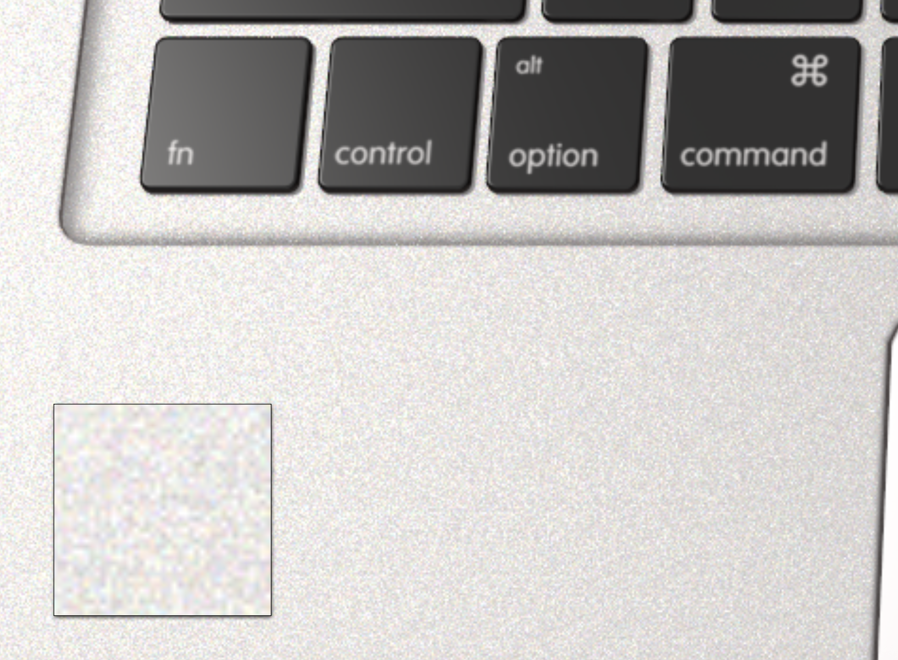
        

    === "例2"

        

            
        

### Procedural Appearance

我们可以不用纹理来表现物体细节，而是通过实时计算一个噪声函数来实现。

    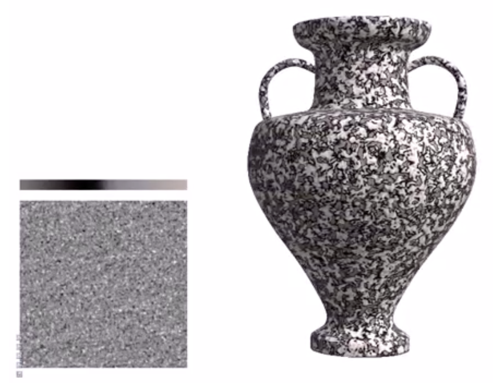

对于 3D 的噪声函数，即便将物体切开来，依然能看到表面细节。

    

我们还可以通过设置阈值的方式来构建一个二元噪声函数，比如下图汽车上的铁锈：

    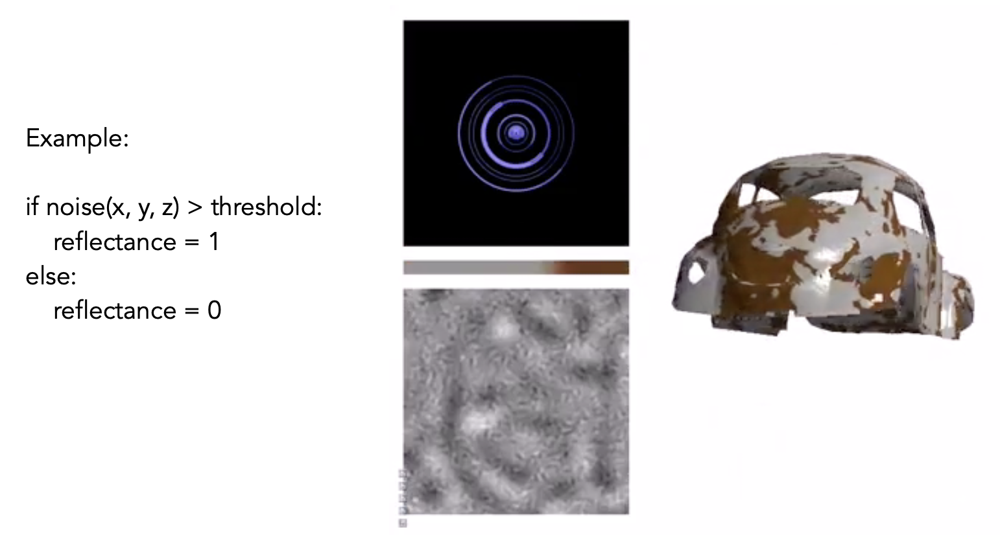

??? example "应用"

    === "例1"

        

            
        

    === "例2"

        

            
        

    === "例3"

        

            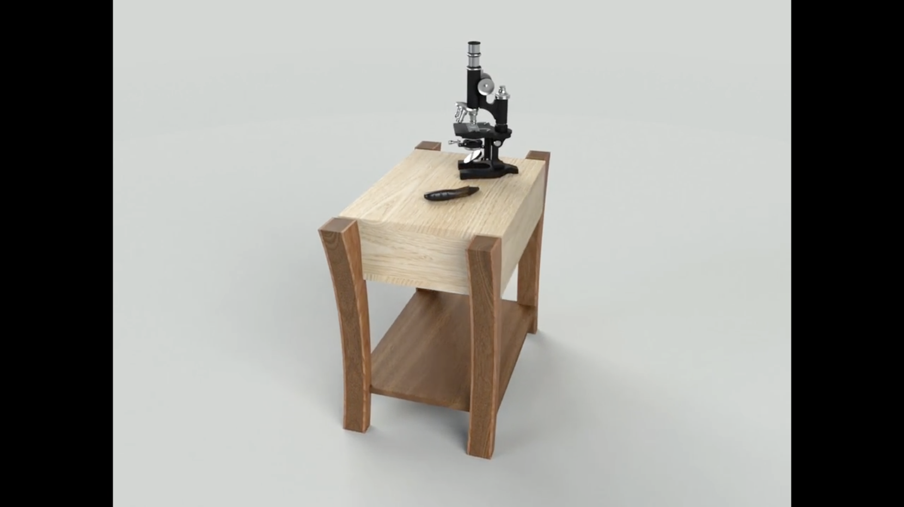
        

    === "例4"

        

            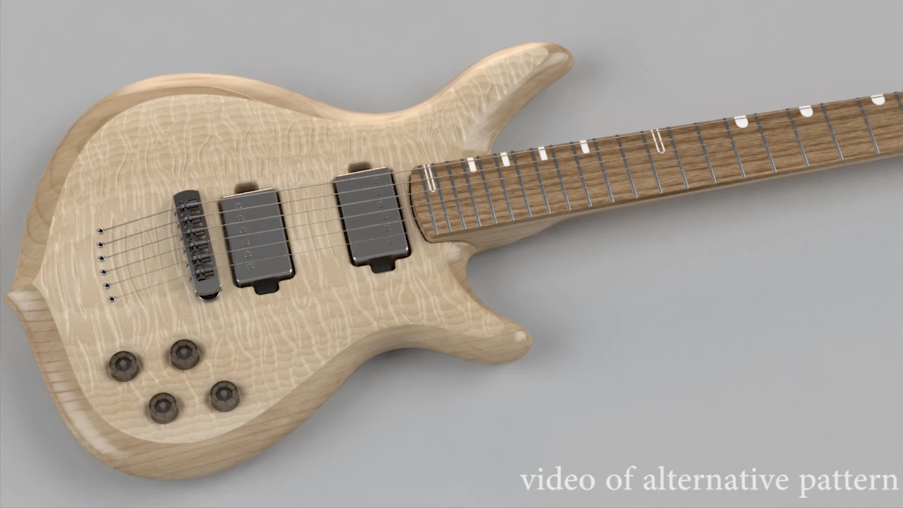
        
