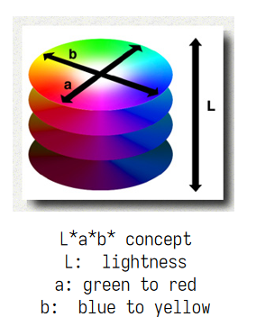

# Chap 1: Basic Concepts and Programming Introduction

??? abstract "核心知识"

    - 图像成像方式、成像原理（光圈孔径、弥散圈、景深）
    - 数字图像的处理内容、成像原理
    - 色彩
        - 彩色、消色
        - 视网膜：视杆细胞（亮度）、视锥细胞（色彩）
        - 色觉：感知的优先级（色调最优）和敏感度（对亮度最敏感）
        - 色彩空间：
            - 设备相关：RGB、CMY、HSV
            - 设备无关（CIE）：XYZ、L\*a\*b\*、YUV
    - 图像处理的数据结构：矩阵、链码（游程编码）
    - 图像格式
        - BMP：文件结构
        - JPEG：压缩策略
        - 其他仅做了解的：TIFF、GIF


<div class="card file-block" markdown="1">
<div class="file-icon"></div>
<div class="file-body">
<div class="file-title">实验报告1：bmp 文件读写及 rgb 和 yuv 色彩空间转化</div>
<div class="file-meta">49.1 MB / 16 P / 2024-10-09</div>
</div>
<a class="down-button" target="_blank" href="https://courses.noughtq.top/DIP-D2QD/report1.pdf" markdown="1">:fontawesome-solid-download: 下载</a>
</div>


**数字图像**(digital image)的重要性：

- 多媒体随处可见，且数据量爆炸
- 数字图像（或视频流）是表达信息的主流形式
    - 对人类来说，超60%的信息来自视觉，所以视觉是我们感知和理解环境的基础
    - 数字图像是计算机视觉和计算机图形学的基础
    - 应用：计算机动画、监控、医学成像、遥感图像、视觉效果和增强...
- <u>不同的成像方式</u>：可见光(visible)、X射线(X-ray)、超声波(ultrasonic-wave)、红外线(infrared)等等

<u>数字图像处理的内容</u>：

- **图像获取**(image acquisition)：自动孔径校准、色彩平衡、图像重构
- **显示和打印**(display and print)：自动尺寸调整、色彩纠正（CMYK vs. RGB）
- **存储和传输**(storage and transmission)：
    - 高效率存储：更少的时空成本
    - 便利的传输：无损、高效、安全
- **增强和恢复**(enhancement and restoration)：
    - 改善视觉效果：去模糊、超分辨率...
- **识别和理解**(recognition and understanding)：
    - 特征识别：OCR、物体检测、面部检测
    - 场景理解：图像检索、场景分类


## Digital Image Representation

数字图像可以被表示成一个二维数组或矩阵，数组或矩阵的的元素对应图像上的一个像素(pixel)，其中

- 在灰度图(grayscale image)中，每个像素占1个字节，取值范围为[0, 255]
- 在彩色图中，每个像素占3个字节，每个字节分别表示R（红）、G（绿）、B（蓝）


## Basic Principle of Imaging

???+ info "注"

    PPT介绍了一大坨关于相机的发展历史，感兴趣的同学可以上网搜索，这里就简单罗列一些相关名词：

    - 眼睛->暗箱->相机
    - 小孔成像
    - 透镜组
    - 单镜头反光(SLR, single len reflex)相机
    - 傻瓜相机(compact camera)
    - 数码相机(digital camera)

<u>成像时所用**光圈孔径**(apeture)需要保持在合适的大小，</u>

- 若过大，所成的像会很**模糊**
- 若过小，通过的光线就很少，导致光强很弱，看不清楚成像；同时当孔径小到一定程度时，会发生**衍射**现象

<div style="text-align: center">
    
</div>

<u>通过使用**透镜**(len)可以会聚更多的光线到一个成像点</u>，只是只有在特殊的位置上才能达到这个目标，即大家以前就学习过的**透镜聚焦**。位于合适距离的物体点（焦点）可以成清晰像，其他的点则会产生**弥散圆**。通过改变镜头的形状可以改变聚焦时的物体点所需要的距离。

**弥散圆**(circle of confusion)：在焦点前后，光线开始聚集和扩散，点的影像变模糊，形成一个扩大的圆。

- 如果弥散圆的直径小于人眼的鉴别能力，在一定范围内实际影像产生的模糊是不能辨认的。不能辨认的直径叫做**容许弥散圆**，焦点前后各有一个容许弥散圆
- 对于6寸照片，观察距离25－30cm，大概是底片对角线1/1000-1/1500

<div style="text-align: center">
    
</div>

焦点前后各有一个容许弥散圆，它们之间的距离叫做**景深**(DOF，depth of field)。<u>景深随镜头的焦距、光圈值、拍摄距离而变化</u>：

<div style="text-align: center">
    
</div>

- 镜头光圈：光圈越大，景深越小；**光圈越小，景深越大**
- 镜头焦距：镜头焦距越长，景深越小；**焦距越短，景深越大**
- 拍摄距离：**距离越远，景深越大**；距离越近，景深越小

对于给定的主题框架和摄像头位置，景深由光圈直径控制，该直径通常指定为f-number，number为镜头焦距与光圈直径的比率。减少光圈直径（增加f-number）会增加景深；但是，它还减少了传递的光的量并增加了衍射(diffraction)，从而产生一定程度上的限制。

<div style="text-align: center">
    
</div>

### Digital Camera

数码相机的内部结构：

<div style="text-align: center">
    
</div>

<u>数码相机的成像过程</u>：

1. 当使用数码相机拍摄景物时，景物反射的光线通过数码相机的镜头透射到**CCD**（charge-coupled device, 电荷耦合器件）上
2. 当CCD曝光后，**光电二极管**受到光线的激发而释放出电荷，生成感光元件的电信号
3. CCD控制芯片，利用感光元件中的控制信号线路对光电二极管产生的电流进行控制，由电流传输电路输出，CCD会将一次成像产生的电信号收集起来，统一输出到**放大器**
4. 经过放大和滤波后的电信号被传送到**ADC**（模数转化器），由ADC将电信号（模拟信号）转换为数字信号，数值的大小和电信号的强度与电压的高低成正比，这些数值其实也就是图像的数据
5. 此时仅凭这些图像数据还不能直接生成图像，还要到**DSP**（数字信号处理器）中进一步处理。DSP将会对这些图像数据进行色彩校正、白平衡处理，并编码为数码相机所支持的图像格式、分辨率，然后才会被存储为图像文件
6. 当完成上述步骤后，图像文件就会被保存到**存储器**上,我们就可以欣赏图像了


## Light and Color

### Basic

- **色彩场景**(colorful view)是由光与物体之间的交互过程产生的。如：反射、折射、散射、传播、吸收以及衍射等等。

    ??? info "双色反射分离(dichromatic reflection seperation)"

        <div style="text-align: center">
            
        </div>

- **色彩**：
    - **彩色**(chromatic color)：红、黄、蓝等单色以及它们的混合色。彩色物体对光谱各波长的反射具有选择性，所以它们在白光照射下呈现出不同的颜色。
    - **消色**(achromatic color)：又称非彩色，也就是我们通常所说的**灰度**，是指白色，黑色以及各种深浅不同的灰色。消色物体对光谱各波长的反射没有选择性，它们是中性色。


- **视网膜**(retina)：人眼中最重要的组成部分，就像相机里的感光底片，专门负责感光成像。视网膜上分布着两种视觉细胞，一种为杆状体，另一种为锥状体。
    - **视杆细胞**：比较多，大约有上亿个，<u>它对光极为灵敏</u>，但<u>没有区分色彩的能力</u>
    - **视锥细胞**：则只有六、七百万个，它要在<u>强光</u>下才能激发，它的存在<u>使我们能够辨别各种不同的颜色</u>

- **三原色**(three-primary colors)是目前最为代表性的色觉机制解释：
    - 在视网膜上存在着三种分别对红、绿和蓝光线的波长特别敏感的视锥细胞或相应的感光色素
    - 当不同波长的光线进入人眼时，与之相符或相近的视锥细胞发生不同程度的兴奋，于是在大脑产生相应的色觉
    - 三种视锥细胞若受到同等程度的刺激，则产生消色

### Color Vision

**色觉**(color vision)指不同波长的光线作用于视网膜而在大脑中引起的感觉。人眼可见光线的波长是390nm～780nm，一般可辨出包括紫、蓝、青、绿、黄、橙、红7种主要颜色在内的120～180种不同的颜色。

- 国际照明委员会（Commission internationale de l‘éclairage），简称CIE，在1931年根据已有的实验结果，选择700nm（R）、541.6nm（G）、435.8nm（B）作为三原色，计算出相应的光谱三刺激值 r、g 、b ，其三刺激值曲线如图所示：

<div style="text-align: center">
    
</div>

- 性质：
    - **绝对色觉**(absolute color vision)感知不准确，一般通过上下文判断，所以说有时候会出错，这种现象称为视觉错觉(vision illusion)
    - 感知能力(perceptive ability)：不同的人有不同的感知能力

    <div style="text-align: center">
        
    </div>

    - Weber's Law

    <div style="text-align: center">
        
    </div>

    - <u>感知的优先程度和敏感度</u>
        - **优先程度**(priority)：同等条件下，人们往往会注意到**色调**(Hue, H)的变化，然后是**饱和度**(Saturation, S)，然后是**亮度**(lightness, V)
        - **敏感度**(sensitivity)：人眼对于**亮度**的变化最为敏感，分辨能力最强。恰好与人眼的高动态能力相匹配

### Color Space

- **与设备有关**的颜色模型:
    - RGB（一般的显示器）
    - CMY（打印机）
    - HSV（电视机）
- **与设备无关**的颜色模型：CIE
    - CIE颜色模型包括一系列颜色模型，是基于人的眼睛对RGB的反应，被用于精确表示对色彩的接收。
    - 设备无关性：这类颜色模型能帮助人们够在任何类型的设备上产生真实的颜色，例如：扫描仪、监视器和打印机等
    - 类型：CIE XYZ, CIE L\*a\*b\*和CIE YUV等

#### RGB Color Model

RBG 颜色模型是三维直角坐标颜色系统中的一个单位正方体

- 在正方体的主对角线上，各原色的量相等，产生由暗到亮的白色，即灰度
- （0，0，0）为黑，（1，1，1）为白，正方体的其他6个角点分别为红、黄、绿、青、蓝和品红
- RGB颜色模型构成的颜色空间是CIE原色空间的一个真子集
- RGB颜色模型通常用于彩色阴极射线管和彩色光栅图形**显示**器（计算机和电视机采用）

<div style="text-align: center">
    
</div>


#### CMY Color Model

- 彩色**打印**的纸张不能发射光线，因而打印机就只能使用一些能够吸收特定光波而反射其他光波的油墨或者颜色
- 油墨或颜料的3种基色是以红、绿、蓝三色的补色(complementary color)：**青**(cyan)、**品红**(magenta)、**黄**(yellow)为基色
- 用CMY模型产生的颜色称为**相减色**(subtractive color)，是因为它减掉了为视觉系统识别颜色所需要的反射光

<div style="text-align: center">
    
</div>

??? question "<u>思考：为什么CMY颜色模型还增加了一个K通道</u>"

    如果不加K通道的话，那么需要将CMY三种颜色混在一起才能打印黑色（常见的打印颜色），于是打印黑色的成本就变得很高。因此单独设个K通道打印黑色来**节省油墨成本**，提高经济性。除此之外，额外设置K通道实现了更好的色彩控制，有助于生成更纯的黑色，增强文本和细节的清晰度，从而提高印刷质量。


???+ note "<u>RGB vs CMY</u>"

    <div style="text-align: center">
        
    </div>

    可以看到，RGB是一种**加色**(additive color)（颜色混在一起会变白），而CMY是一种**减色**(subtractive color)（颜色混在一起会变黑）

    RGB与CMY的转化公式：

    $$
    \begin{align}
    C & = 255 - R \notag \\
    M & = 255 - G \notag\\
    Y & = 255 - B \notag
    \end{align}
    $$

    <div style="text-align: center">
        
    </div>


#### HSV Color Model

<div style="text-align: center">
    
</div>

- HSV/HIS颜色空间是从人的视觉系统出发，用色调、色饱和度和亮度来描述颜色
    - **色调**(hue)：颜色的类型，如红、蓝、绿等，由光的波长决定
    - **色饱和度**(saturation)：颜色的纯度或鲜艳程度，饱和度高时颜色鲜艳，饱和度低时颜色趋于灰色
    - **亮度**(intensity，或者value)：颜色的明暗程度，亮度高表示颜色更接近白色，亮度低表示更接近黑色
- 可以用一个**圆锥**描述HSV：
    - 圆锥的顶面对应于**亮度**V=1，它包含RGB模型中的R=1，G=1，B=1三个面，故所代表的颜色较亮；<u>圆锥从高到低表示亮度越来越小</u>
    - **色调** H由绕V轴的<u>旋转角</u>给定，红色对应于角度$0\degree$，绿色对应于角度$120\degree$，蓝色对应于角度$240\degree$
    - **饱和度**S<u>沿径向方向越远越饱和</u>
- 在圆锥的顶点处，V=0，H和S无定义（`null`），代表黑色
- 在圆锥体顶面中心，V=1，S=0，H无定义（`null`），代表白色
- 优点：
    - 更接近人类的色觉
    - 当采用RGB（或者CMY）颜色模型时，改变某一颜色的属性，比如改变色调就必须同时改变R、G、B（或者C、M、Y）三个坐标；而采用HSV颜色模型时只需改变H坐标。也就是说，HSV颜色模型中的三个坐标是独立的
    
    <div style="text-align: center">
        
    </div>

    - HSV颜色模型是一个均匀的颜色空间，里面的颜色是线性分布的，颜色差异的感知与HSV颜色模型上坐标点的欧几里德距离成正比

- RGB与HSV之间的转换：
    - 查表：因为CIE定义了RGB与XYZ、HSV与XYZ之间的转换表，因此在RGB与HSV的转换过程中可以将XYZ作为中间过渡，先将一种颜色模型转换为XYZ，然后将XYZ转换为另一种模型
    - 直接计算：
        - RGB -> HSV：设$m = max(r, g, b), n = min(r, g, b)$，则：

        <div style="text-align: center">
            
        </div>
        
        - HSC -> RGB：

        <div style="text-align: center">
            
        </div>

#### CIE XYZ

- XYZ 三刺激值的概念是以色视觉的三元理论为根据的，该理论认为人眼具有接受三原色(红、绿、蓝)的感光细胞，而所有的颜色均被视作该三原色的混合色。
- 1931年CIE制定了一种假想的标准观察者：设置配色函数$\overline{x(\lambda)}, \overline{y(\lambda)}, \overline{z(\lambda)}$，XYZ三刺激值是利用这些标准观察者配色函数计算得来的
    - X：代表接近红色光的响应
    - Y：表示亮度，接近绿色光的响应
    - Z：代表接近蓝色光的响应
- 在此基础上，CIE于1931年规定了Yxy颜色空间，其中Y为亮度，而x,y是从三刺激值XYZ计算得来的色坐标，它表示人类可见的颜色范围

<div style="text-align: center">
    
</div>

- RGB与CIE XYZ的转换：

$$
\begin{bmatrix}X \\ Y \\ Z\end{bmatrix} = 
\begin{bmatrix}0.608 & 0.714 & 0.200 \\ 0.299 & 0.587 & 0.144 \\ 0.000 & 0.066 & 1.112 \end{bmatrix}
\begin{bmatrix}R \\ G \\ B\end{bmatrix}
$$


#### CIE L\*a\*b\*

- CIE L\*a\*b\*颜色空间是在1976年制定的，它是CIE XYZ颜色模型的改进型，以便克服原来的Yxy颜色空间存在的在x，y色度图上相等的距离并不等价于人们所觉察到的相等色差的问题
- 它的**L**（明亮度），**a**（绿色到红色）和**b**(蓝色到黄色)代表许多的值。与XYZ比较，CIE L\*a\*b\*颜色更适合于人眼的感觉
- 利用CIE L\*a\*b\*，颜色的亮度（L）、灰阶和饱和度（a,b）可以单独修正，这样，图像的整个颜色都可以在不改变图像或其亮度的情况下发生改变

<div style="text-align: center">
    
</div>

- CIE XYZ与CIE L\*a\*b\*之间的转换

<div style="text-align: center">
    
</div>


#### CIE YUV

- 在现代彩色电视系统中，通常采用三管彩色摄像机或彩色CCD（电荷耦合器件）摄像机，它把摄得的彩色图像信号，经分色，分别放大校正得到RGB，再经过矩阵变换电路得到亮度信号Y和两个色差信号R－Y、B－Y，最后发送端将亮度和色差三个信号分别进行编码，用同一信道发送出去。这就是我们常用的YUV颜色空间。
- 采用YUV颜色空间的重要性是它的亮度信号Y和色度信号U、V是分离的。如果只有Y信号分量而没有U、V分量，那么这样表示的图就是黑白灰度图。彩色电视采用YUV空间正是为了用亮度信号Y解决彩色电视机与黑白电视机的兼容问题，使黑白电视机也能接收彩色信号。
- 根据美国国家电视制式委员会，NTSC制式的标准，当白光的亮度用Y来表示时，它和红、绿、蓝三色光的关系可用如下式的方程描述：

    $$
    \begin{align}
    Y & = 0.3R + 0.59G + 0.11B \notag \\
    U & = 0.493(B - Y) \notag \\
    V & = 0.877(R - Y) \notag
    \end{align}
    $$

    或者用矩阵表示为：

    $$
    \begin{align}
    \begin{bmatrix}Y \\ U \\ V\end{bmatrix} & = 
    \begin{bmatrix}0.299 & 0.587 & 0.114 \\ -0.147 & -0.289 & 0.435 \\ 0.615 & -0.515 & -0.100\end{bmatrix}
    \cdot \begin{bmatrix}R \\ G \\ B\end{bmatrix} \notag \\
    \begin{bmatrix}R \\ G \\ B\end{bmatrix} & = 
    \begin{bmatrix}1 & 0 & 1.4075 \\ 1 & -0.3455 & -0.7169 \\ 1 & 1.779 & 0\end{bmatrix}
    \cdot \begin{bmatrix}Y \\ U \\ V\end{bmatrix} \notag
    \end{align}
    $$

## Image Processing Data Structures

图像处理常用到以下数据结构：

- 矩阵(matrix)
- 链式(chain)
- 拓扑数据结构(topological data structure)
- 有理数据结构/合理数据结构(rational data structure)

!!! info "注"

    - 矩阵到有理数据结构是一个由底层到高层的关系，由没有语义到有语义
    - 本课程不讨论后两种数据结构

### Matrices

- 矩阵是图像最常见的底层表示的数据结构
    - 矩阵的元素：灰度级，亮度或其他属性
    - 通过像素位置的坐标进行访问
- **二值图像**(binary images)：由只包含0和1的矩阵来表示
- **多光谱图像**(matrices of different resolution)：由多个矩阵表示，每个矩阵包含对应于一个光谱带的图像。

<div style="text-align: center">
    
</div>

### Chains

- **链码**(chain code)：用于描述对象边界
- 链码可以用静态数据结构（例如一维数组）来表示，其大小为预期的最长链码长度
- <u>[**游程编码**](https://en.wikipedia.org/wiki/Run-length_encoding)(run-length encoding, RLE)</u>：一种简单的无损数据压缩技术，主要用于压缩具有大量连续重复值的数据，通过记录连续相同值的长度（即游程）来替代原始数据，从而减少冗余信息。
    - 在**二值图像**中,游程编码只记录属于图像对象的区域，然后该区域表示为一个列表
    - 图像的每一行都由一个子列表描述,其第一个元素是**行号**
    - 后续项是**坐标对**，每对的第一个元素是游程的开始,第二个是结束
    - 一行中可以有多个这样的序列
    - 应用：除了图像压缩外，还可用于文本压缩、视频编码等场景
    - 推荐结合下面的例子理解该概念！

???+ example "例子"

    <div style="text-align: center">
        
    </div>

    游程编码为：((11144)(214)(52355))，下面给出解释：

    - 第1行的第1列(11)和第4列(44)的像素值为1
    - 第2行的第1列至第4列(14)的像素值为1
    - 第5行的第2列至第3列(23)，以及第5列(5)的像素值为1


## Image format

- 规定图像格式(format)的目的在于存储图像的信息
- 图像的特点：基于像素、矩形区域、并带有大量信息等
- 有些图像格式高度依赖于操作系统，也就是说同一张图片在不同的OS中显示的结果是不一样的
- <u>图像编码/压缩的方式</u>：无压缩（BMP）、无损压缩（PNG等）、有损压缩（JEPG等）
- <u>常见的格式</u>：BMP、JPEG、TIFF、GIF、PNG...

### BMP 

#### Format

- BMP（bitmap，位图）图像是Windows系统中的一种标准文件格式，它以无压缩的方式组织图片信息
- 但BMP支持图像的压缩，比如rle(run length encoding，游程编码)格式
- 有时.bmp文件也可以被存储为.dib文件

#### File Structure

下图是BMP的文件结构：

<div style="text-align: center">
    
</div>

- 图像**文件头**(file header)：

    ``` c
    typedef struct tagBITMAPFILEHEADER {
        WORD  bfType;          // 2 Byte
        DWORD bfSize;          // 4 Byte
        WORD  bfReversed1;     // 2 Byte
        WORD  bfReserved2;     // 2 Byte
        DWORD bfOffBits;       // 4 Byte
    } BITMAPFILEHEADER, *PBITMAPFILEHEADER;
    ```

    - `bfType`：值固定为`0x4D42`，即`BM`，表明这是一个BMP文件
    - `bfSize`：文件大小
    - `bfReversed1`：保留值，固定为0
    - `bfReserved2`：保留值，固定为0
    - `bfOffBits`：从文件开头到实际图像数据之间的偏移量(offset)。由于后面的`BITMAPINFOHEADER`和`Palette`视情况而改变，所以依靠这个偏移量能够提高访问位图的速度

- 图像**信息头**(information header)：

    ``` c
    typedef struct tagBITMAPINFOHEADER {
        DWORD biSize;           // 4 Byte
        LONG biWidth;           // 4 Byte
        LONG biHeight;          // 4 Byte
        WORD biPlanes;          // 2 Byte
        WORD biBitCount;        // 2 Byte
        DWORD biCompression;    // 4 Byte
        DWORD biSizeImage;      // 4 Byte
        LONG biXPelsPerMeter;   // 4 Byte
        LONG biYPelsPerMeter;   // 4 Byte
        DWORD biClrUsed;        // 4 Byte
        DWORD biClrImportant;   // 4 Byte
    } BITMAPINFOHEADER, *PBITMAPINFOHEADER;
    ```

    - `biSize`：`BITMAPINFOHEADER`结构体的大小
    - `biWidth`：图像的**宽度**（单位：像素）
    - `biHeight`：图像的**高度**（单位：像素）
        - 有一个比较奇怪的点：这个值是正数的时候，图像是倒立的；而这个值是负数的时候，图像才是正向的。这是因为读取位图文件时是从下往上读取像素的
        - 大多数的位图都是倒立的，即这个值是正数
        - 不过API函数会在显示位图前将倒立图像自动转过来，因此不需要我们手动调整
        <div style="text-align: center">
            
        </div>

    - `biPlanes`：位面(plane)数，值固定为1
    - `biBitCount`：每像素的比特数（又称颜色位深度）（bit / pixel），其值为1（二值）、4、8（灰度）、16（伪彩色）、24（真彩色）或32（带$\alpha$通道的真彩色），但大多数图像是24位或32位，所以后面仅讨论这两类图像
    - `biCompression`：压缩类型，这里只讨论未压缩类型，其值为`BI_RGB`
    - `biSizeImage`：图像的大小（单位：字节），若`BiCompression = BI_RGB`，其值为0
    - `biXPelsPerMeter`：图像的水平分辨率(horizontal resolution)（单位：像素/米）
    - `biYPelsPerMeter`：图像的垂直分辨率(vertical resolution)（单位：像素/米）
    - `biClrUsed`：位图用到调色盘上的颜色索引数，如果所有颜色都用到了，其值为0
    - `biClrImportant`：位图用到调色盘上的有重要影响的颜色索引数，如果所有颜色都重要，其值为0
    
- **调色盘**(palette)：
    - 大小：N*4 Bytes
    - 调色盘的每一项的大小为4字节，每个字节分别对应蓝色（`rgbBlue`）、绿色（`rgbGreen`）、红色（`rgbRed`）和固定的0值（`rgbReserved = 0`）。在C语言中，每一项可以用一个`RGBQUAD`结构体表示：
    ``` c
    typedef struct tagRGBQUAD{
        BYTE rgbBlue;       // 1 Byte
        BYTE rgbGreen;      // 1 Byte
        BYTE rgbRed;        // 1 Byte
        BYTE rgbReserved;   // 1 Byte
    } RGBQUAD;
    ```

    - 更确切的叫法应该叫做**颜色查找表**(LUT, lookup table)，因为我们会将用到的颜色存放在调色盘内，如果某个像素需要使用其中一种颜色，那么这个像素点会用这个颜色在调色盘的索引值来表示该颜色，而不是RGB值，从而节省了存储空间。

        ??? example "例子"

            对于一幅16色图，它最多只有16种颜色，我们可以用一个表：表中的每一行记录一种颜色的R、G、B值。这样当我们表示一个像素的颜色时，只需要指出该颜色是在第几行，即该颜色在表中的索引值。举个例子，如果表的第0行为255，0，0（红色），那么当某个像素为红色时，只需要标明0即可。

- **位图数据**(bitmap data)：
    - 大小取决于图像的大小和颜色的深度
    - 根据颜色深度，来决定存储的是调色盘的颜色索引，还是RGB值
    - 注意：<u>每一行的字节数必须是4的倍数</u>，若不是则需要**补齐**（最简单的做法是在末尾补0）


### JPEG

- JPEG全称为Joint Photographic Experts Group（联合图像专家小组）
- 文件扩展名有：.JPEG、.JFIF、.JPG、.JPE
- JPEG是一种静态图像的压缩格式，它是一种有损编码的方式，让用户在图像的质量和大小之间权衡
- 而这种编码是一种基于变换的编码，比如：
    - 离散余弦变换编码(discrete cosine transformation, **DCT**)：DCT将输入值的8×8块转换为这64个模式的线性组合。这些模式称为二维DCT基础函数，输出值称为变换系数。

    <div style="text-align: center">
        
    </div>

    - DPCM编码(differential pulse-code modulation)，是对模拟信号幅度抽样的差值进行量化编码的调制方式。这种方式是用已经过去的抽样值来预测当前的抽样值，对它们的差值进行编码。差值编码可以提高编码频率，这种技术已应用于模拟信号的数字通信之中。

    <div style="text-align: center">
        
    </div>

- 对图像高频区域和低频区域区别对待（想想计算机体系结构中的哈夫曼编码，低频部分放在树的底端，高频部分放在树的顶端）
    - **低频区域**：图像中变化缓慢的部分，如大块的相同颜色或平滑过渡的区域，对应的是图像的整体轮廓和主要结构；在频域中位于频谱的中心区域
    - **高频区域**：图像中变化剧烈的部分，如边缘、纹理和细节，对应的是图像的细节和噪声；在频域中位于频谱的外围区域

- **压缩策略**：<u>根据压缩比要求，从高频到低频逐步削减信息</u>。这种方法的好处在于：
    - 高频信息占用存储空间大，减少高频信息更容易获得高压缩比；
    - 低频信息可以保留物体的基本轮廓和色彩分布，最大限度维持图像质量。
    - 适合用于互联网

    <div style="text-align: center">
        
    </div>

- JEPG的缺点：不适合用于线条画、文字、图标等，因为有损压缩对高频信息的削减，会导致这类图像更加模糊

    <div style="text-align: center">
        
    </div>

#### Syntax

- JPEG文件是由一系列的段(segment)组成的，每个段从一个标记(marker)开始。
- 标记目的：用以区分和识别图像数据及其相关信息 
- 标记规范：每个标记都是由2个字节组成，其前一个字节是固定值0xFF 

下面是一些常用的标记：

<div style="text-align: center">
    
</div>

- `SOI`(Start Of Image)：标记图像的起始位置，固定值为`0xD8`
- `APP0`：应用程序保留标记0，标记码为固定值`0XE0`，有以下9个字段：
    - 长度(length)（2 Byte）：表示这9个字段的总长度
    - 标识符(identifier)（5 Byte）：固定值`0X4A6494600`，表示了字符串"JFIF0"
    - 版本(version)（2 Byte）：一般为`0X0102`，表示JFIF的版本号为1.2；但也可能为其它数值，即代表了其它版本号
    - X、Y方向上的密度单元(density unit)（1 Byte）：有3个可选值
        - 0：无单位
        - 1：points/inch
        - 2：points/cm
    - X方向上的密度（2 Byte）
    - Y方向上的密度（2 Byte）
    - 缩略图(thumbnail)水平像素数目（1 Byte）：若为0则表示没有缩略图
    - 缩略图垂直像素数目（1 Byte）：同上
    - 缩略图RGB位图（3n Byte）：n = 缩略图水平像素数目$\times$缩略图垂直像素数目，这是一个24bits/pixel的RGB位图
- `APPn`：应用程序保留标记n(n$\in [1, 15]$)，取值范围为`0XFFE1-0XFFFF`，有以下2个字段：
    - 长度(length)（2 Byte）：表示这2个字段的总长度
    - 详细信息（2 Byte）：包含图像的详细信息
        - 例如，APP1中包含了EXIF(Exchangeable Image File Format, 可交换图像文件格式)信息，即图像的拍摄参数信息，如光圈、快门速度、ISO感光度、焦距等信息

        <div style="text-align: center">
            
        </div>

- `DQT`：量化表(define quantization table)，可存在一个或多个这样的量化表，用来表示量化矩阵，固定值为`0xDB`，有以下3个字段：
    - 量化表长度(quantization table length)
    - 量化表数目(quantization table number)
    - 量化表(quantization table)

    ???+ note "量化表"

        人眼对于一个相对较大范围的区域，辨别色彩细微差异能力比较强（低频），但对于高频区域，却表现一般。受此启发，人们可以对高频部分进行量化，也就是说，把频域上的每个分量，除以针对该分量的常数，然后四舍五入取整，这样一般会把高频分量变为0。但这样操作就要求针对每一个分量设置一个常数值，所以就最终形成了量化表。

- `SOF0`(Start of Frame 0)：固定值为`0xC0`，有以下6个字段：
    - 帧开始长度
    - 精度，每个颜色通道的颜色深度（位宽）
    - 图像高度
    - 图像宽度
    - 颜色分量数
    - 对每个颜色分量(for each component)，还有以下几个字段：
        - ID
        - 垂直方向的样本因子(vertical sample factor)
        - 水平方向的样本因子(horizontal sample factor)
        - 量化表号(quantization table)\#
- `DHT`(Define Huffman Table)：可存在一个或多个DHT，固定值为`0xC4`，有以下5个字段
    - 哈夫曼表的长度
        - 哈夫曼表：用于对量化后的DCT系数进行熵编码，压缩数据体积，同时保持图像质量
    - 类型、AC或者DC（基于DCT的压缩）
    - 索引
    - 位表(bits table)：不同长度Huffman的码字数量
    - 值表(value table)：每个符号码字对应的权值

- `SOS`(Start of Scan)：扫描开始
    - 扫描开始长度(start of scan length)
    - 颜色分量数(number of color components)
    - 对于每个颜色分量还有以下几个字段
        - ID
        - 交流系数表号(AC table \#)
        - 直流系数表号(DC table \#)
    - 压缩图像数据(compressed image data)
- `EOI`(End of Image)：图像结束

#### File Structure

<div style="text-align: center">
    
</div>

??? example "JPEG图片"

    <div style="text-align: center">
        
    </div>


### TIFF

TIFF(Tagged Image File Format，标签图像文件格式)是一个广为应用的光栅图像文件格式。

- 文件扩展名：.tiff、.tif
- 通用类型标识符：public.tiff
- 这类图片的来源有：扫描仪、CAD系统、GIS(geographic information system，地理信息)等
- 特点：
    - 通用性：支持从高端到低端的设备
    - 高度扩展性：可扩展性强，支持公共和私用的标记结构
        - 可扩展至Exif, DCF, TIFF/EP, TIFF/IT, TIFF-FX, GeoTIFF等格式
    - 灵活性：支持各种压缩格式
    - 可访问性：有公共软件库支持
    - 功能强大：可用于二值图、灰度图、调色板、真彩色、其他扩展等等
- 文件结构：

``` c
struct TIFF_img {
     unsigned char **mono;
     unsigned char **cmap;
     unsigned char ***color;
     char          TIFF_type; 
     char          compress_type;
     int           height;
     int           width;
};
```

### GIF

GIF(Graphics Interchange Format，图像互换格式)

- 采用复杂的 LZW 编码方式
- 一个 GIF 文件可以存储多幅图像
- 带有色彩表（全局、局部色彩表）
- 支持图像定序显示或覆盖(播放次序，如从后往前)
- 可以错行存放
- 支持文本覆盖嵌入

??? note "GIF图像的取值"

    <div style="text-align: center">
        
    </div>


## Image Processing Programming

有以下几种关于图像处理的编程方法：

- 用于访问DIB的Windows API
- VC++编程
- MATLAB image processing toolbox
    - MATLAB 和 Image Processing Toolbox 提供了大量的用于图像处理的函数，用户可以利用这些函数分析图像数据，获取图像细节信息，并且设计相应的滤波算法。
    - 利用设计的滤波算法可以将图像数据所包含的噪声滤除，而滤波器的设计师通过 MATLAB 产品提供的交互式工具完成的，这些工具还能够完成选区图像区域，测量图像误差和获取、统计像素信息等功能。 
- Adobe Photoshop
    - 对图形进行修饰和编辑
        - 滤镜(filters)
        - 各种工具(区域选择工具、各种笔刷…)
        - 多层(layer)
    - 以及对图像的色彩处理
        - 颜色深度调节
        - 亮度、对比度等条件
        - 另外，还有绘图和输出功能等