# Chap 2: Binary Image and Morphology

??? abstract "核心知识"

    - 二值图像
        - 寻找阈值的方法——**大津算法**
        - 改进：局部自适应操作
    - 图像形态学操作
        - 膨胀
        - 腐蚀
        - 开操作
        - 闭操作

实验报告2：二值图像与形态学运算

2.77 MB / 19 P / 2024-10-22

<a class="down-button" target="_blank" href="https://courses.noughtq.top/DIP-D2QD/report2.pdf" markdown="1">:fontawesome-solid-download: 下载</a>

## Binary Images

**二值图像**(binary image)：像素值只有0和1两种值，因此每个像素仅需1 bit空间。但是在实际编程中，我们通常用0和255两个值来分别表示0和1。

    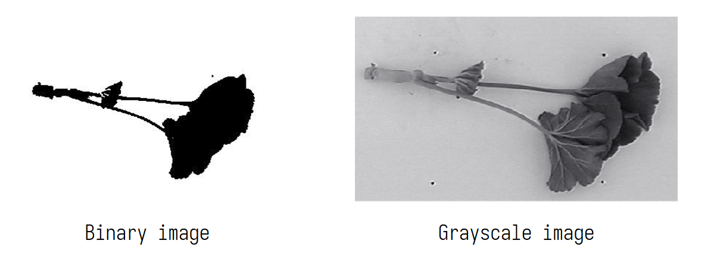

- 优点：
    - 更小的内存需求 
    - 运行速度更快 
    - 为二值图像开发的算法往往可以用于灰度级图像 
    - 更便宜 

- 缺点：
    - 应用范围有限； 
    - 无法推广到三维空间中
    - 表现力欠缺，不能表现图像内部细节
    - 无法控制对比度(contrast)

## Image Binarization

<u>二值图像的构建</u>：通过对灰度图像**阈值化**(thresholding)操作，将图像的像素值进行重置，即：

$$
\begin{cases}
l(x, y) = 0 &, \text{if}\ l(x, y) < \text{Threshold} \\
l(x, y) = 255 &, \text{if}\ l(x, y) \ge \text{Threshold} 
\end{cases}
$$

??? example "例子"

    

        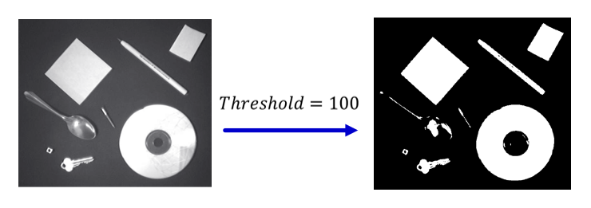
        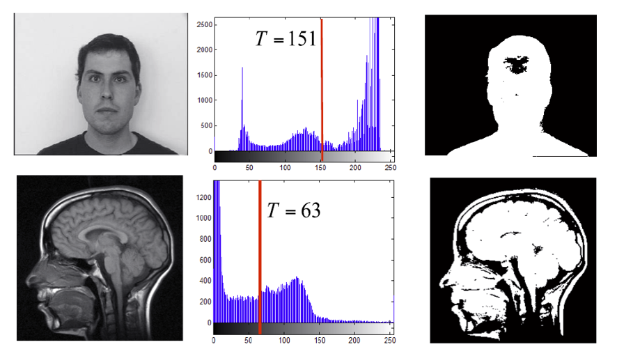
    

选取合适阈值的基本思想：

- 将二值图像视为两部分，一部分对应**前景**（foreground），另一部分对应**背景**（background）
- 尝试找到一个合适的阈值，使得前景和背景的内部方差(variance)（前景与前景，背景与背景）最小化，而让外部方差（前景与背景）最大化

<u>具体步骤为</u>：

1. 确定原始图像中像素的最大值和最小值
2. 令阈值 = 像素最小值 + 1，对原始图像进行二值化操作
3. 确定前景和背景（小于阈值视为前景，大于阈值视为背景），分别计算当前阈值下的内部[协方差](../../math/pro-sta/4.md#协方差)和外部协方差，然后阈值 + 1
4. 重复2、3两步，直到阈值达到像素最大值
5. 找到最大外部协方差和最小内部协方差对应的阈值

???+ note "<u>计算方法：[**大津算法**](https://zh.wikipedia.org/wiki/%E5%A4%A7%E6%B4%A5%E7%AE%97%E6%B3%95)(Otsu's method)</u>"

    >发明者：[大津展之](https://en.wikipedia.org/wiki/Nobuyuki_Otsu)

    $$
    \begin{align}
    \sigma_{within}^2(T) & = \dfrac{N_{Fgrd}(T)}{N}\sigma_{Fgrd}^2(T) + \dfrac{N_{Bgrd}(T)}{N}\sigma_{Bgrd}^2(T) \notag \\
    \sigma_{between}^2(T) & = \sigma^2 - \sigma_{within}^2(T) \notag \\
    & = (\dfrac{1}{N}\sum_{x, y}(f^2[x, y] - \mu^2)) - \dfrac{N_{Fgrd}}{N}(\dfrac{1}{N_{Fgrd}}\sum_{x, y \in Fgrd}(f^2[x, y] - \mu_{Fgrd}^2)) \notag \\
    & \quad \quad - \dfrac{N_{Bgrd}}{N}(\dfrac{1}{N_{Bgrd}}\sum_{x, y \in Bgrd}(f^2[x, y] - \mu_{Bgrd}^2))
    \notag \\
    & = -\mu^2 + \dfrac{N_{Fgrd}}{N}\mu_{Fgrd}^2 + \dfrac{N_{Bgrd}}{N}\mu_{Bgrd}^2 \notag \\
    & = \dfrac{N_{Fgrd}}{N}(\mu_{Fgrd} - \mu)^2 + \dfrac{N_{Bgrd}}{N}(\mu_{Bgrd} - \mu)^2 \notag \\
    & = \dfrac{N_{Fgrd}(T) \cdot N_{Bgrd}(T)}{N^2}(\mu_{Fgrd}(T) - \mu_{Bgrd}(T))^2 \notag
    \end{align}
    $$

    其中$N$为图像像素个数，$T$为阈值，$N_{Fgrd}(T)$为阈值$T$下的属于前景的像素个数，$N_{Bgrd}(T)$为阈值$T$下的属于后景的像素个数。

    计算外部协方差的公式过于复杂，因此有下面的化简方法：

    - 先令$W_f = \dfrac{N_{Fgrd}}{N}, W_b = \dfrac{N_{Bgrd}}{N}$（易知$W_f + W_b = 1$）
    - 再令$\mu = W_f \cdot \mu_{Fgrd} + W_b \cdot \mu_{Bgrd}$
    - 可得：

    $$
    \begin{align}
    \sigma_{between} & = W_f(\mu_{Fgrd} - \mu)^2 + W_b(\mu_{Bgrd} - \mu)^2 \notag \\
    & = W_f(\mu_{Fgrd} - W_f \cdot \mu_{Fgrd} - W_b \cdot \mu_{Bgrd})^2 \notag \\
    & \quad \quad + W_b(\mu_{Bgrd} - W_f \cdot \mu_{Fgrd} - W_b \cdot \mu_{Bgrd})^2 \notag \\
    & = W_bW_f(\mu_f - \mu_b)^2 \notag 
    \end{align}
    $$

我们还可以将这种灰度图像的阈值策略用于**彩色图像**上（1D -> 3D），这时需要同时考虑r，g，b三个通道，针对特定的色彩进行阈值化操作。

??? example "例子"

    

        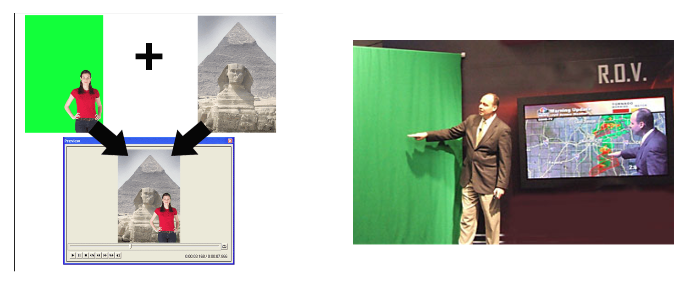
        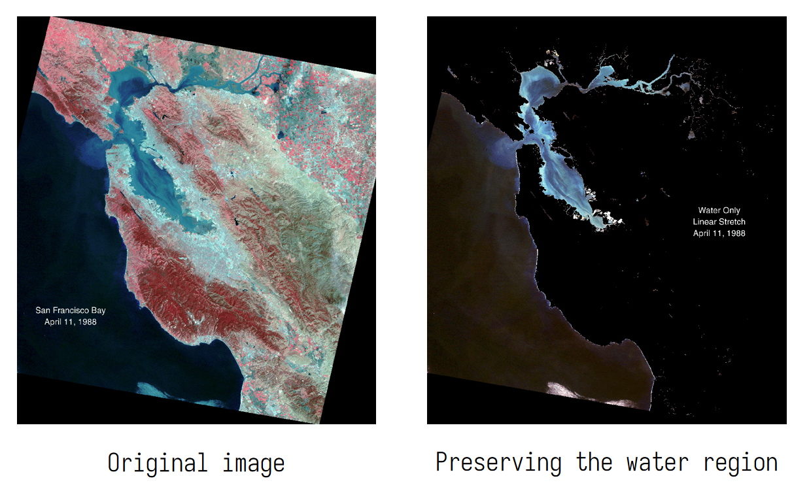
        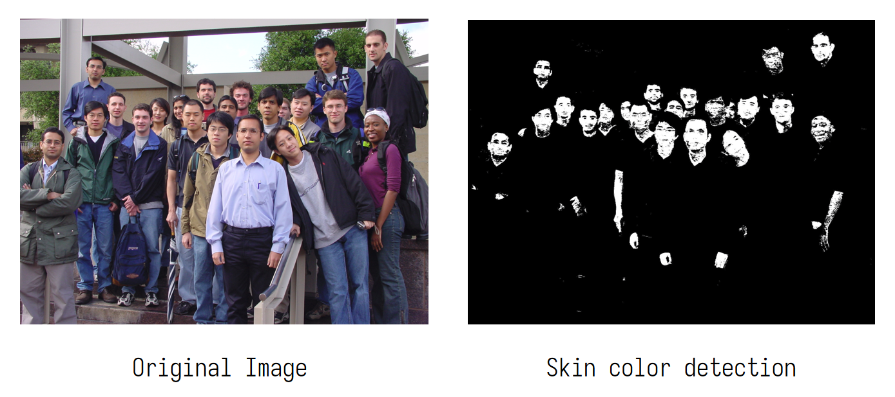
    

阈值策略的缺陷：全局二值化操作不给力

<u>解决方法——**局部自适应操作**(local adaptive operation)</u>：

- 设定一个**局部窗口**，在整个图像上滑动该窗口
- 对于每一窗口位置，确定针对该窗口的threshold

    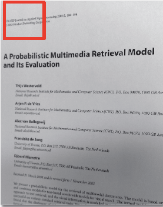

效果比对（从左到右分别为原图、全局二值化操作后的图像（有问题）、局部自适应二值化后的图像（效果较好））：

    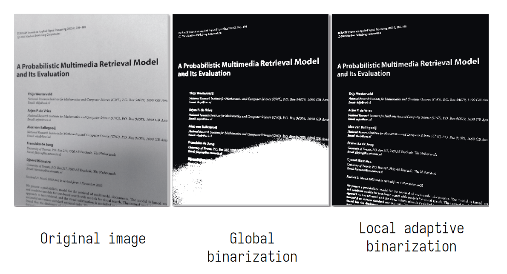

## Morphological Operation

???+ info "背景知识"

    - 形态学(morphology)：
        - 1960s后期提出，研究动植物的结构与形态
        - 形态学一般指生物学中研究动物和植物结构的一个分支

    - 数学形态学(mathematical morphology)：
        - 基础理论：**集合论**
        - 基本思想：用具有一定形态的结构元素去度量和提取图像中的对应形状以达到对图像分析和识别的目的
        - 一种简单的非线性代数算子
        - 主要用于**二值图像**，可扩展到灰度图像
        - 应用：噪声过滤、形状简化、细化、分割、物体描述等

- 形态学图像处理的数学基础和所用语言是**集合论**(set theory)
- 功能：简化图像数据，保持它们基本的形状特性，并除去不相干的结构
- 基本运算：膨胀(dilation)、腐蚀(erosion)、开操作(opening)和闭操作(closing)

### Some Concepts in Set Theory for Images

定义：

- $A$为$\mathbb{Z}^2$中的一个集合，其中$\mathbb{Z}$表示整数集 
- $a = (a_1, a_2)$ 为$A$中的一个元素，即$a \in A$
- 集合的基本运算可见[离散数学](../../math/dm/2.md#set-operations)笔记
- 图像与集合运算的对应关系（前景用黑色(1)表示，背景用白色(0)表示）：

    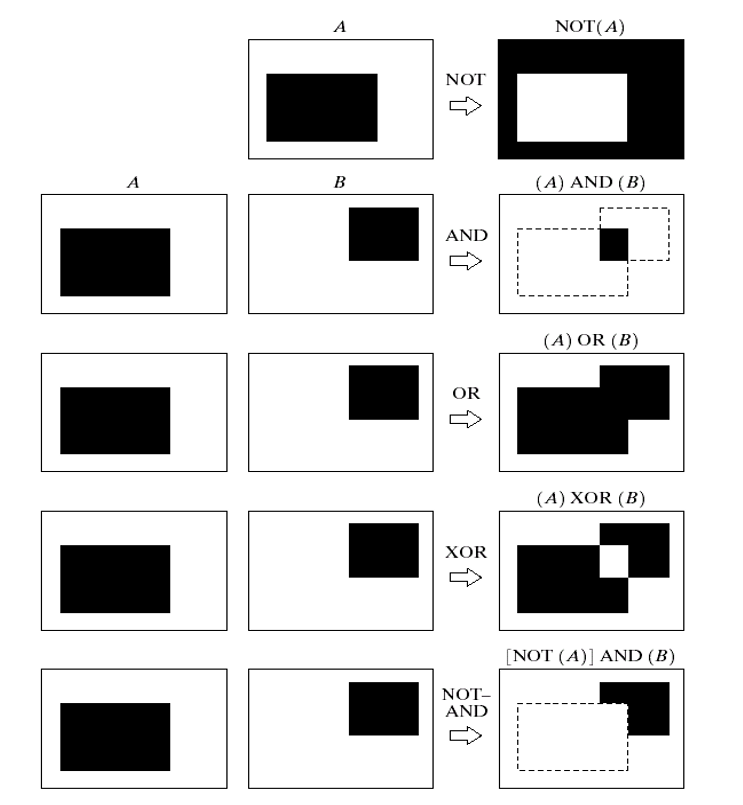

- 形态学中的一些特别的集合操作：
    - 平移(translation)集
    - 对称(symmetry)集

    

        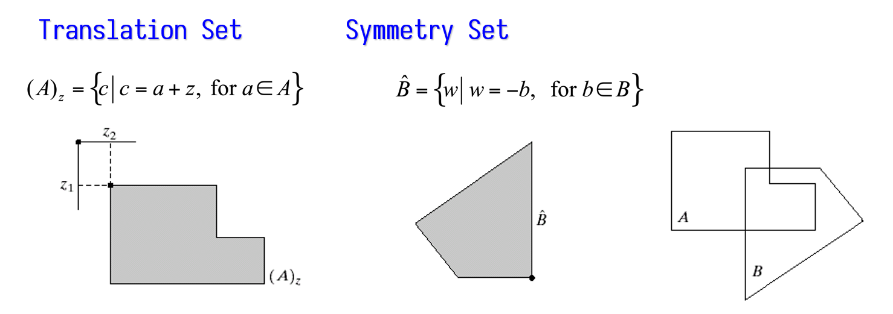
    

### Dilation

**膨胀**(dilation)的作用：通过扩大前景来填充二值图像中的空洞。

??? example "例子"

    === "例1"

        

            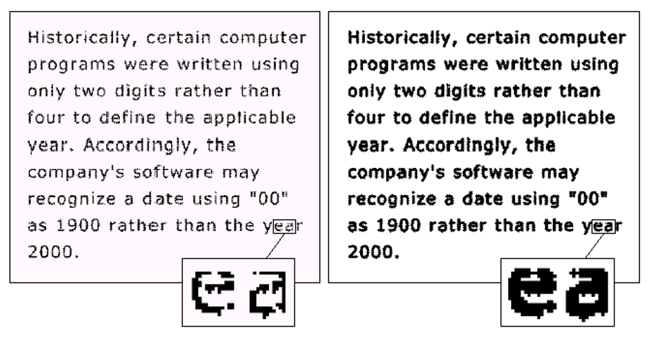
        

        - 左图和右图分别表示膨胀前和膨胀后的二值图像
        - 左图中图像中最大像素间隔为2
        - 结构元为（用矩阵表示）：

        

            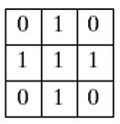
        

    === "例2"

        

            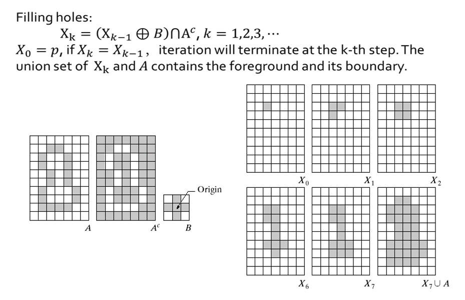
        

物理意义：膨胀是将与物体“接触”的所有背景点合并到该物体中，使边界向外部扩张的过程，可以用来填补物体中的空洞（其中“接触”的含义由结构元描述）。

令集合$A$为二值图像，$B$为二值模板（称为**结构元**(structure element)，可以类比为电路中的滤波器），计算公式为：

$$
A \oplus B = \{z | (B)_z \cap A \ne \emptyset \}
$$

上式表示平移后的$B$与$A$的交集不为空。

??? example "例子"

    === "一维情况"

        === "第一步"

            

                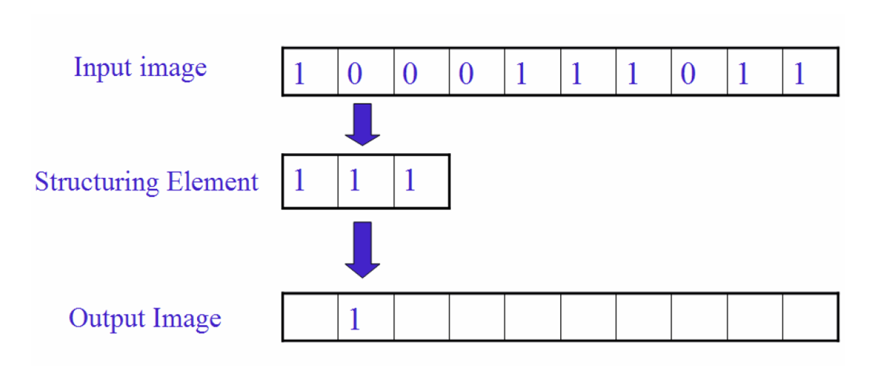
            

            $100 \wedge 111 = 100 \ne 0$，第2位为1

        === "第二步"

            

                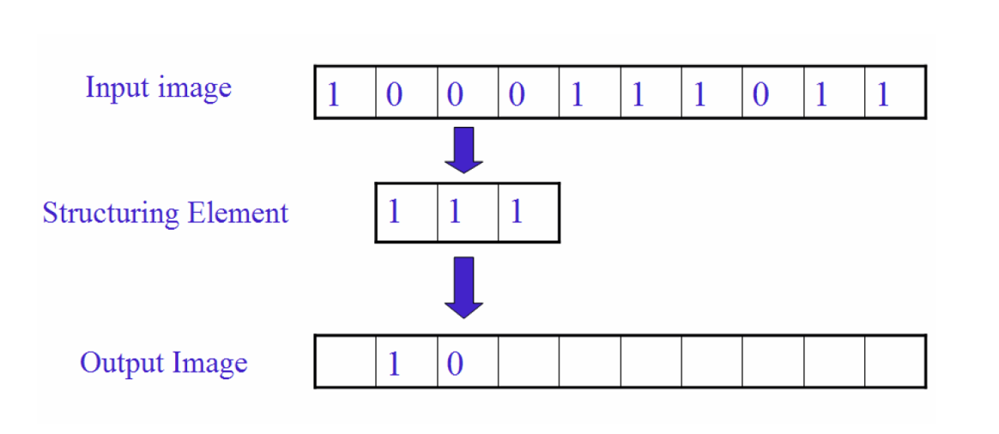
            

            $000 \wedge 111 = 0$，第3位为0

        === "第三步"

            

                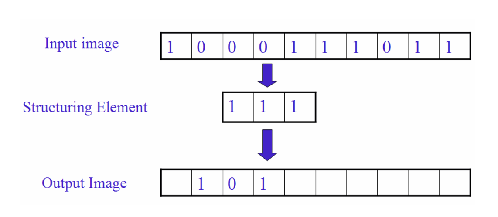
            

            $001 \wedge 111 = 001 \ne 0$，第4位为1

        === "第四步"

            

                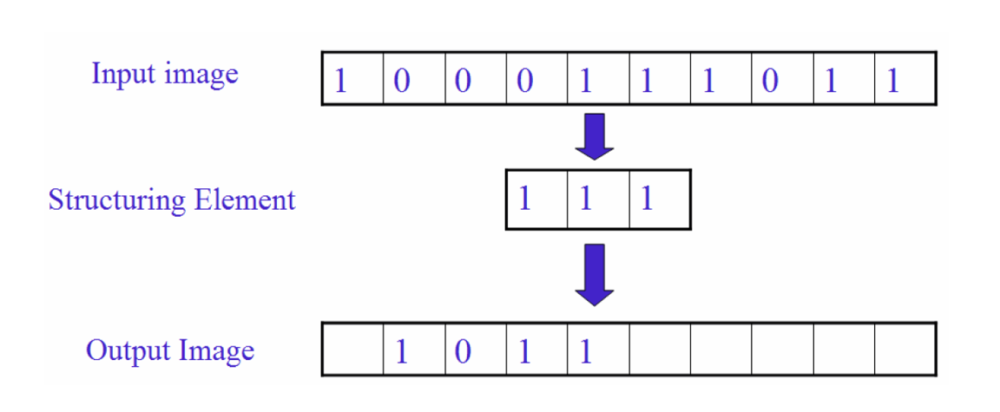
            

            $011 \wedge 111 = 011 \ne 0$，第5位为1

        ---
        - PPT漏掉了最后几步，这里就不补了，道理是一样的
        - 由于结构元的基准点是第二个像素，因此无法对原图两端的像素进行膨胀操作，因此就将这些未处理的像素直接拷贝到输出图像上即可。

    === "二维情况"

        

            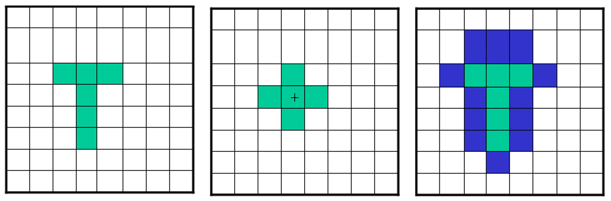
        
   

        三张图分别为集合$A, B$和$A \oplus B$，对应输入图像、结构元和输出图像。其中图1的原点$(0, 0)$在左上角，图2的原点在`+`号的中心上，那么：

        $$
        \begin{align}
        A & = \{(2,2),(2,3),(2,4),(3,3),(4,3),(5,3)\} \notag \\
        B & = \{(0,0),(-1,0),(1,0),(0,-1),(0,1)\} \notag \\
        A \oplus B & = \{(2,2),(2,3),(2,4),(3,3),(4,3),(5,3)(1,2),(1,3),(1,4),(2,3), \notag \\
        & \quad \quad (3,3),(4,3), (3,2),(3,3),(3,4),(4,3),(5,3),(6,3), \notag \\
        & \quad \quad (2,1),(2,2),(2,3),(3,2),(4,2),(5,2), \notag \\
        & \quad \quad (2,3),(2,4),(2,5),(3,4),(4,4),(5,4)\} \notag
        \end{align}
        $$

### Erosion

**腐蚀**(erosion)的作用：它是一种消除边界点，使边界向内部收缩的过程。可以用来消除小且无意义的物体。 

??? example "应用"

    === "边界提取"

        

            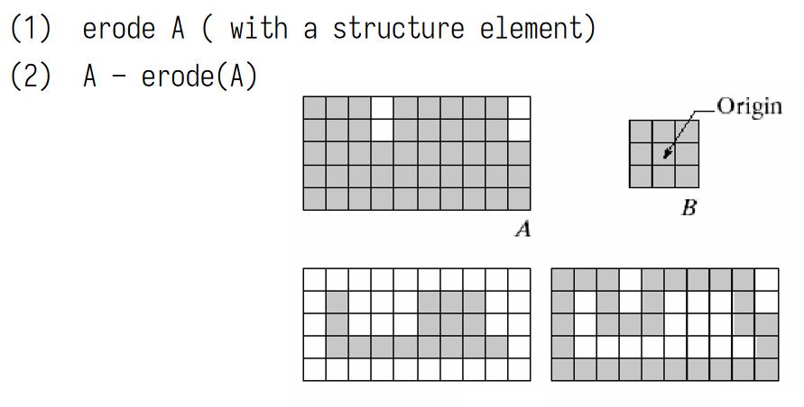
        
  

    === "结构提取"

        

            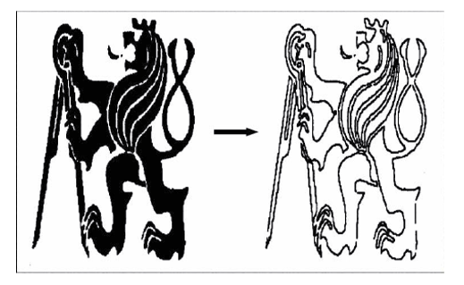
        
 

$$
A \ominus B = \{(x, y) | (B)_{xy} \subseteq A \}
$$

    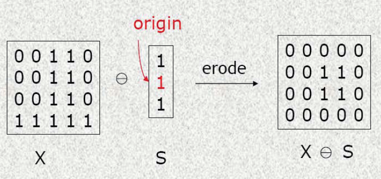

 

- 只有当扫描区域的像素情况与结构元一致时，输出图像上的对应像素值为1，否则为0
- 与膨胀一样，某些像素点无法被结构元扫到，那么这些像素点在输出图像上的值就设为0

??? example "例子"

    === "一维情况"

        === "第1步"

            

                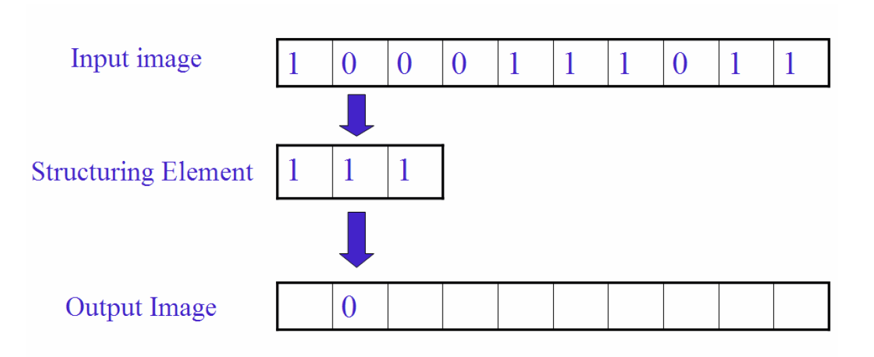
            
 

        === "第2步"

            

                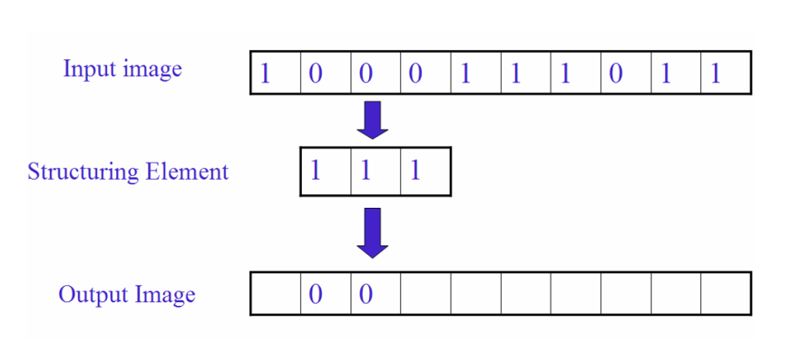
            
 

        === "第3步"

            

                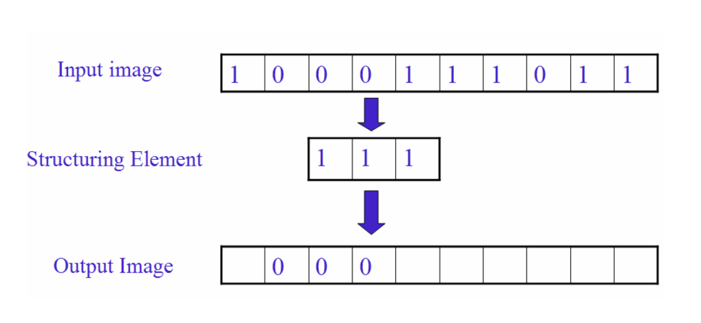
            
 

        === "第4步"

            

                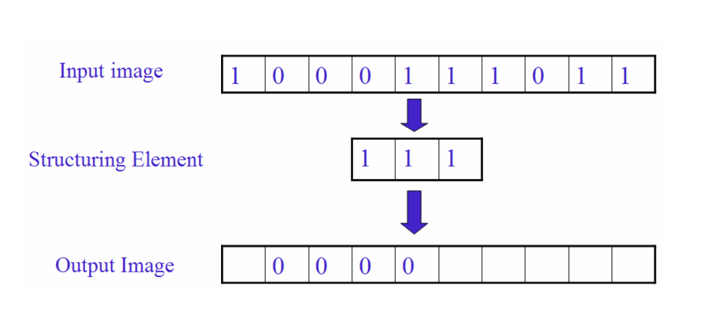
            
 

        === "第5步"

            

                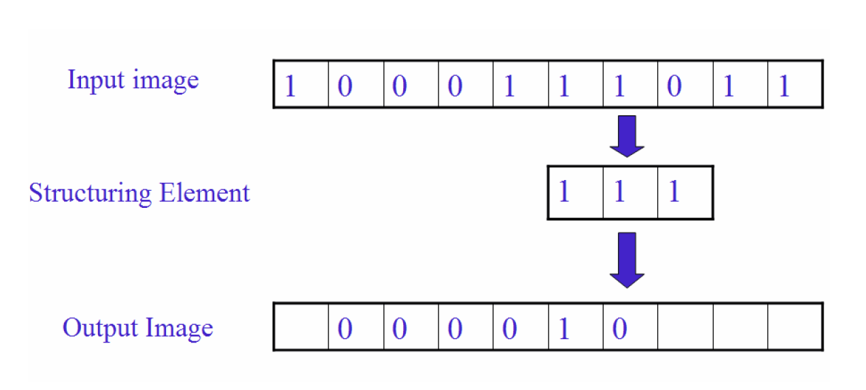
            
 

        === "第6步"

            

                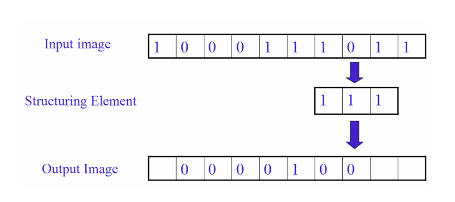
            
 

        === "第7步"

            

                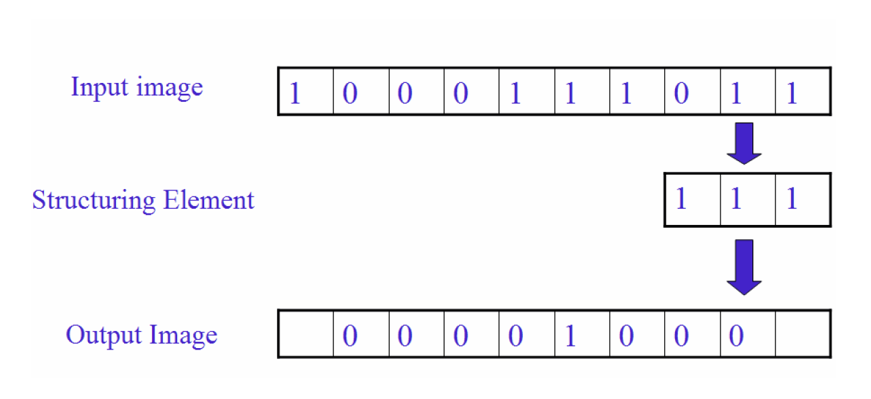
            
 

    === "二维情况"

        

            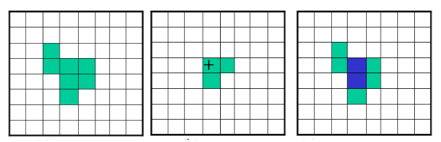
        
   

        三张图分别为集合$A, B$和$A \ominus B$，对应输入图像、结构元和输出图像。其中图1的原点$(0, 0)$在左上角，图2的原点在`+`号所示位置上，详细分析过程为：

        

            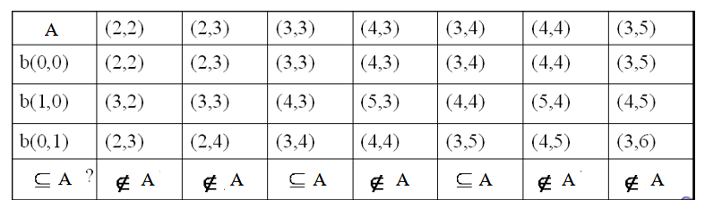
        

        结果：

        $$
        \begin{align}
        A & = \{(2,2),(2,3),(3,3),(4,3),(3,4),(4,4),(3,5)\} \notag \\
        B & = \{(0,0),(1,0),(0,1)\} \notag \\
        A \ominus B & = \{(3, 3), (3, 4)\} \notag
        \end{align}
        $$

???+ note "总结"

    先比较两者：

    - 膨胀：由$B$对$A$膨胀所产生的二值图像D是满足以下条件的点$(x,y)$的集合：如果$B$的原点平移到点$(x,y)$，那么它与$A$的交集非空
    - 腐蚀：由$B$对$A$腐蚀所产生的二值图像E是满足以下条件的点$(x,y)$的集合：如果$B$的原点平移到点$(x,y)$，那么$B$将完全包含于$A$中 

    实际上，膨胀和腐蚀是一组**对偶**(duality)操作：

    $$
    \begin{align}
    (A \ominus B)^c & = A^c \oplus B \notag \\
    (A \oplus B)^c & = A^c \ominus B \notag
    \end{align}
    $$

    其中$A^c = \overline{A}$

??? example "例子：腐蚀与膨胀的综合应用"

    

        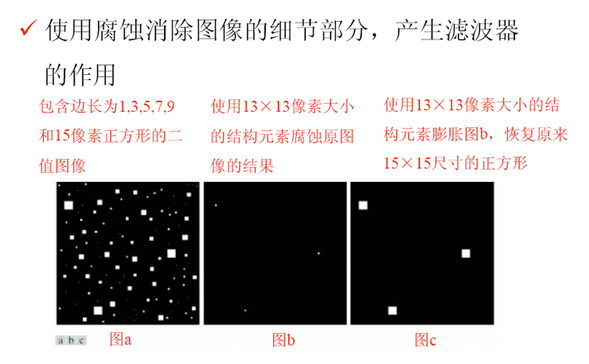
    

### Opening

**开操作**(opening)：先腐蚀，再膨胀，公式为：

$$A \circ B = (A \ominus B) \oplus B$$

作用：断开较窄的狭颈（细长的白色线条），并消除细小的突出物，使边界更加平滑，并保留了原图的特征。

??? example "例子"

    

        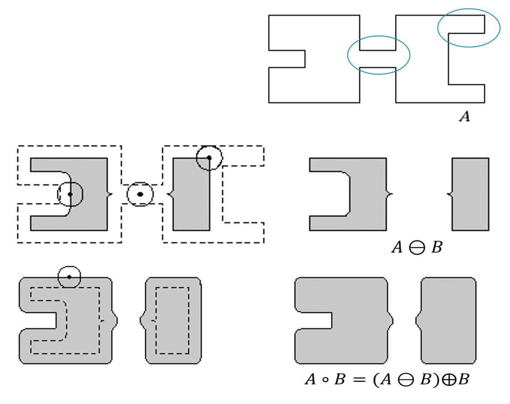
    

    

        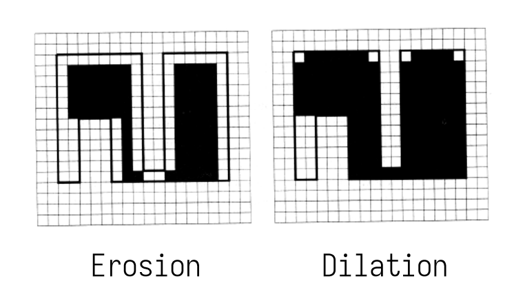
    

### Closing

**闭操作**(closing)：先膨胀，再腐蚀，公式为：

$$A \cdot B = (A \oplus B) \ominus B$$

作用：弥合较窄的间断和细长的沟壑，消除小的空洞，填补轮廓线中的断裂，在保留原图特征的同时使边界更平滑。

??? example "例子"

    

        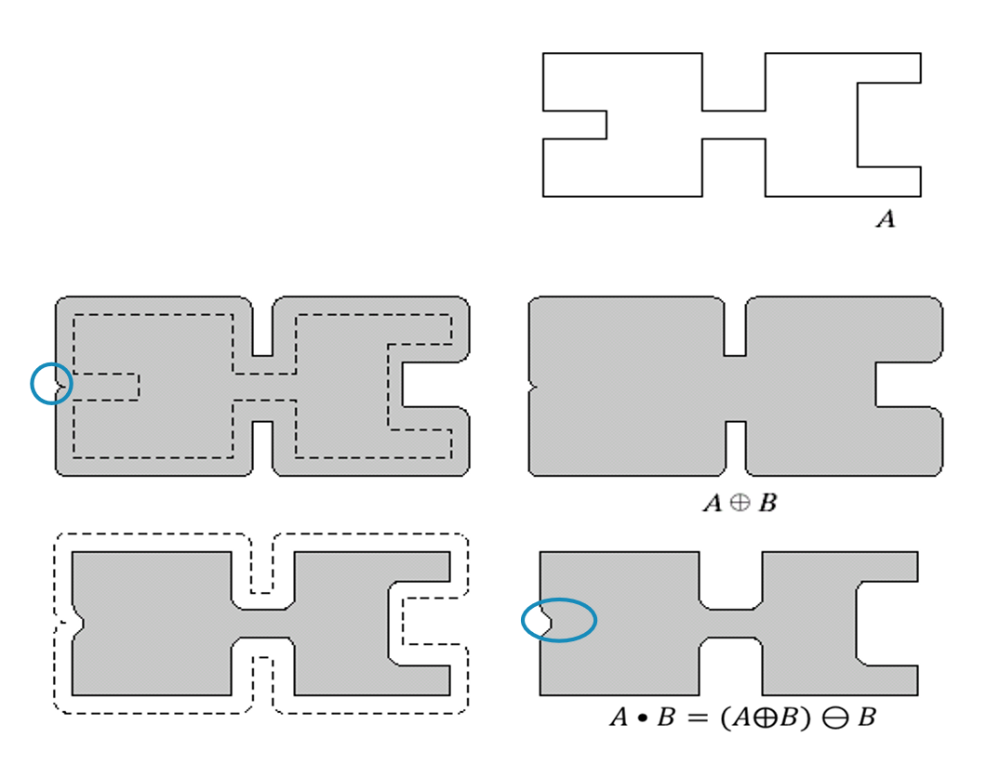
    

    

        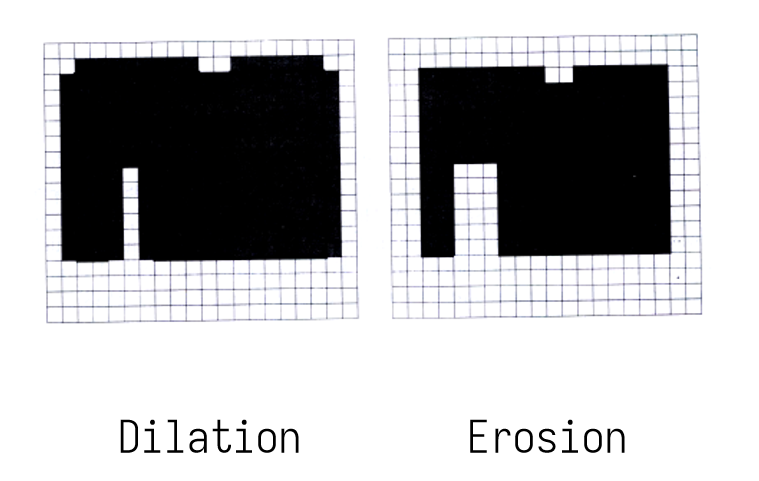
    

??? example "各种操作间的对比"

    === "开操作vs闭操作"

        

            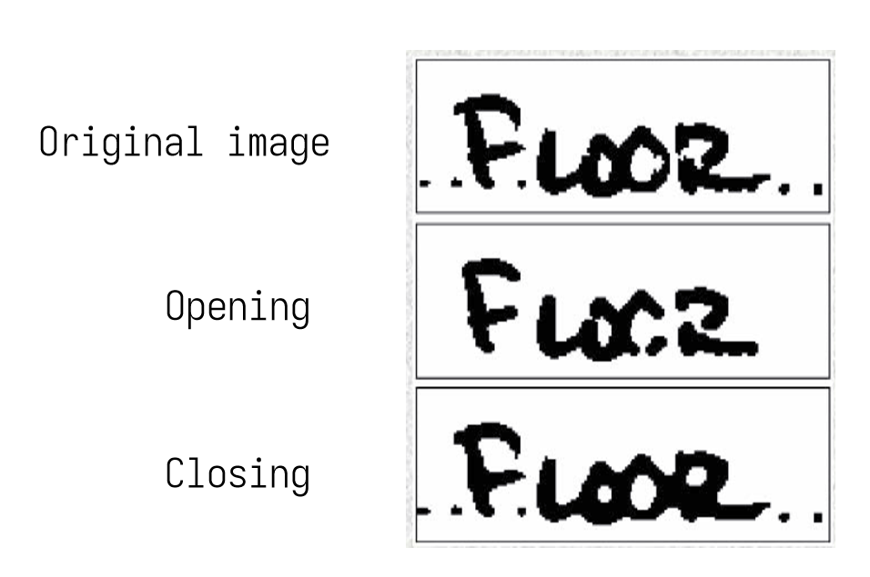
        

    === "四种操作的对比1（矩阵）"

        

            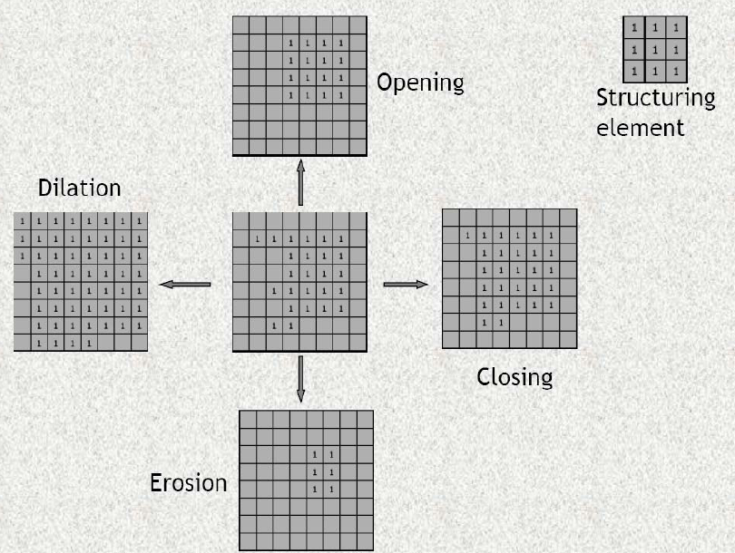
        

    === "四种操作的对比2（真实图像）"

        

            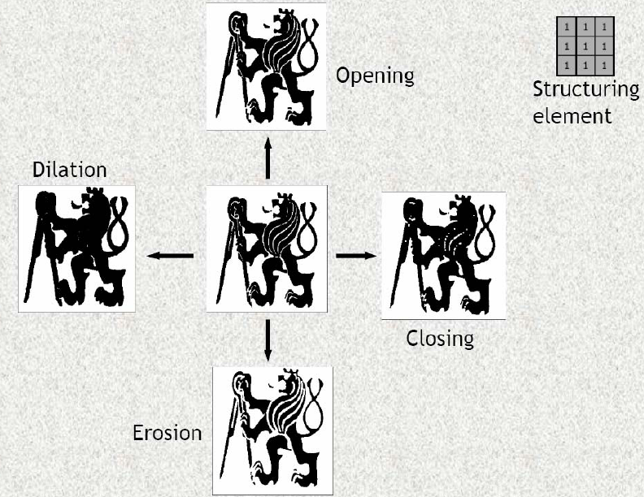
        

    === "指纹识别"

        

            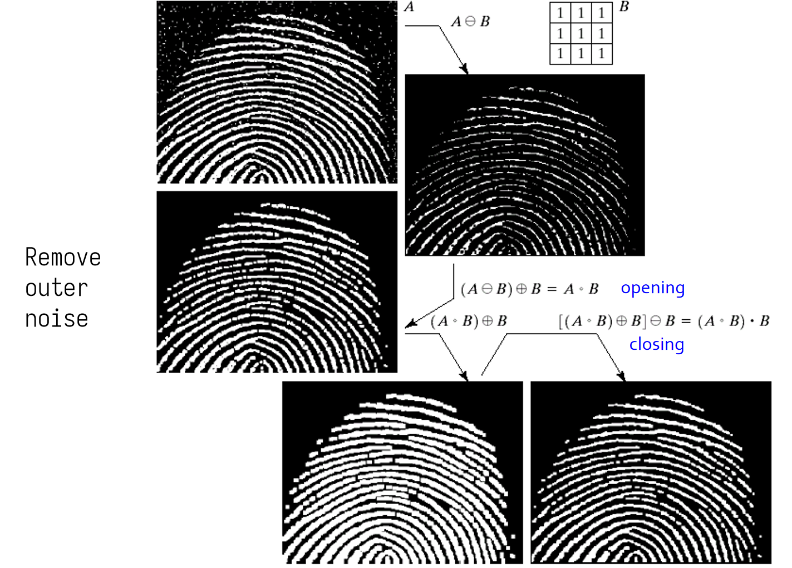
        

