# Chap 3: Image Grayscale Transform

## Visibility of Images

### Grayscale Perception

灰度级感知：有32灰度级、64灰度级、128灰度级、256灰度级。

    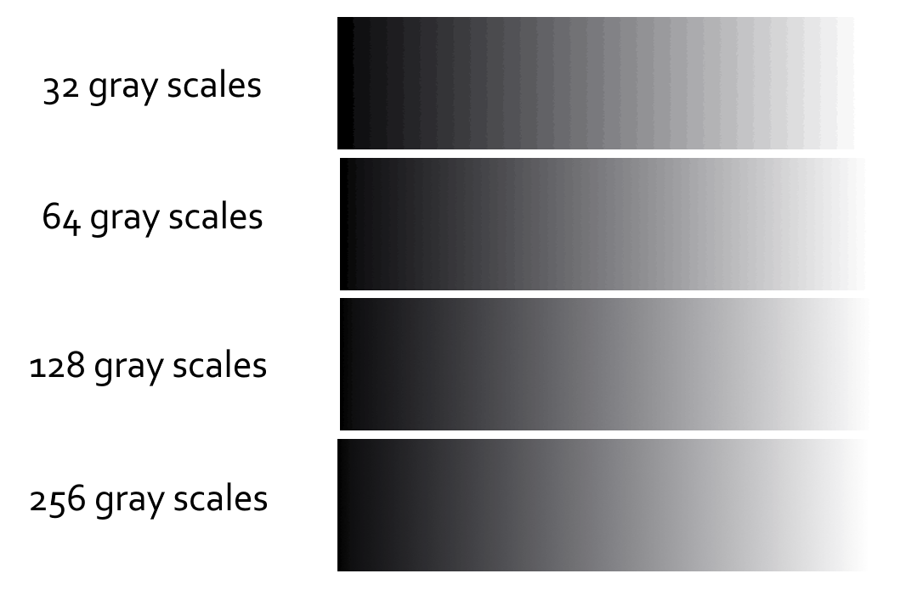

下图给出了一个灰色的矩形，里面有一个颜色略深一点的圆圈（~~如果你看得见的话~~），它们对应的亮度(lightness)分别设为$I$和$\Delta I$（单位：$cd/m^2$，$cd$（坎德拉）是发光强度单位）。

    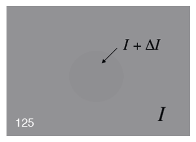

**韦伯定律**(Weber's Law)给出了可视阈值的公式：

$$
K_{\text{Weber}} = \dfrac{\Delta I}{I}
$$

假设连续两个灰度级之间的亮度差异就是韦伯定律中的可视阈值，那么

$$
\dfrac{I_{\text{max}}}{I_{\text{min}}} = (1 + K_{\text{Weber}})^{255}
$$

根据实际经验知，$K_{Weber} \in [0.01, 0.02]$，$\dfrac{I_{\text{max}}}{I_{\text{min}}} = [13, 156]$。因此，传统的显示对比度(display contrast)为：

- 阴极射线管：100:1
- 纸上打印：10:1

费希纳定律(Fechner's Law)：人的感知能力是服从$\log(I)$的。

### $\gamma$ Correction

$\gamma$校正：在阴极射线管的显示中，通过调整电压来影响其亮度和变化曲率，从而影响可视性和对细节的表现能力，即$U \sim I^{\frac{1}{\gamma}}$，对应曲线图如下（理想情况下，该公式对应的曲线接近于$\log(I)$）：

    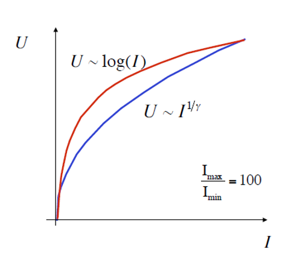

??? example "例子"

    === "例1"

        $\gamma$校正在照相技术中的应用：

        

            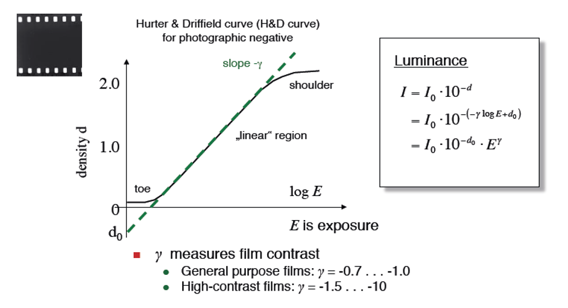
        

 
    === "例2"

        对图像进行$\gamma$校正：

        

            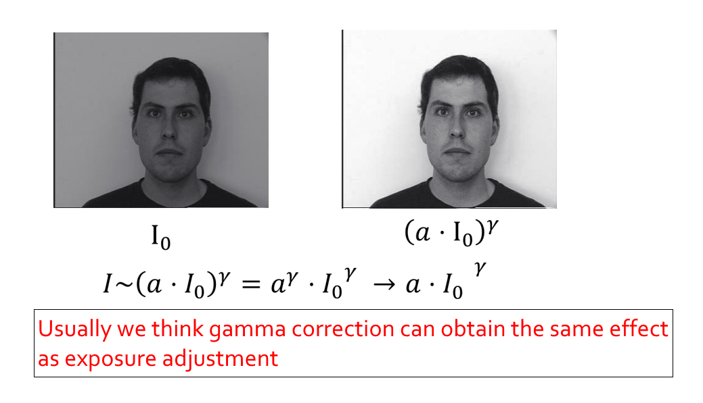
        

        

            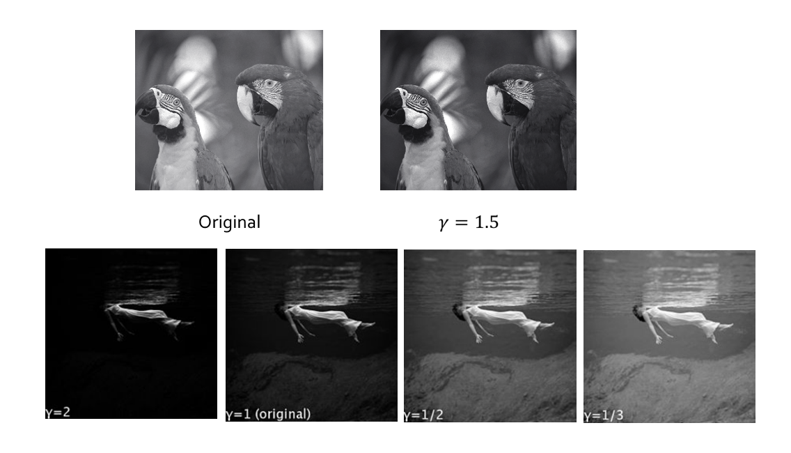
        
   

    === "例3"

        

            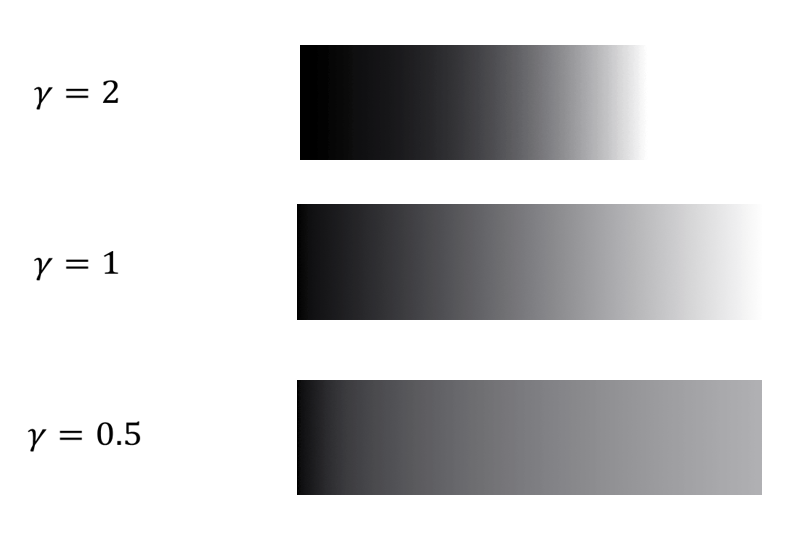
        

## Visibility Enhancement: a Logarithmic Operation

可视能力与高动态范围图像：

    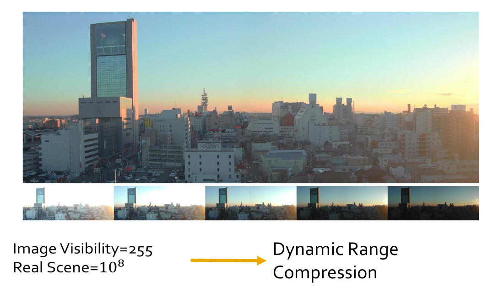

为了增强图像的可视性，我们需要对图像中的像素进行基于对数的操作：

$$
L_d = \dfrac{\log(L_w + 1)}{\log(L_{\text{max}} + 1)}
$$

其中$L_d$表示显示亮度，$L_w$表示真实世界的亮度，$L_{\text{max}}$表示场景中的最亮值。这个映射能够确保不管场景的动态范围是怎么样的，其最大值都能映射到1（白），其他的值也能够比较平滑地变化。

??? example "效果"

    

        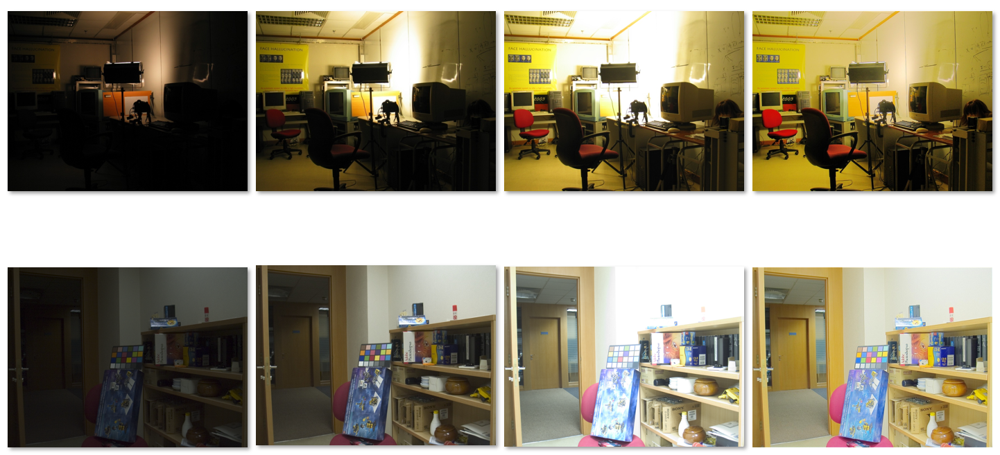
    

## Image Histogram

### Grayscale Images

灰度图的基本概念：

- 灰度图是一个由像素构成的，大小为$M \times N$的二维数组
- 每个像素用8位表示，灰度被分为$2^8 = 256$个等级，灰度强度$p \in [0, 255]$
- 灰度强度更小，像素越黑，反之亦然

    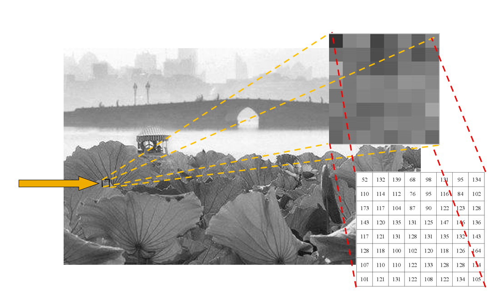

**灰度直方图**(grayscale histogram)：一类统计图形，它表示一幅图像中各个灰度等级的像素个数在像素总数中所占的比重。 

    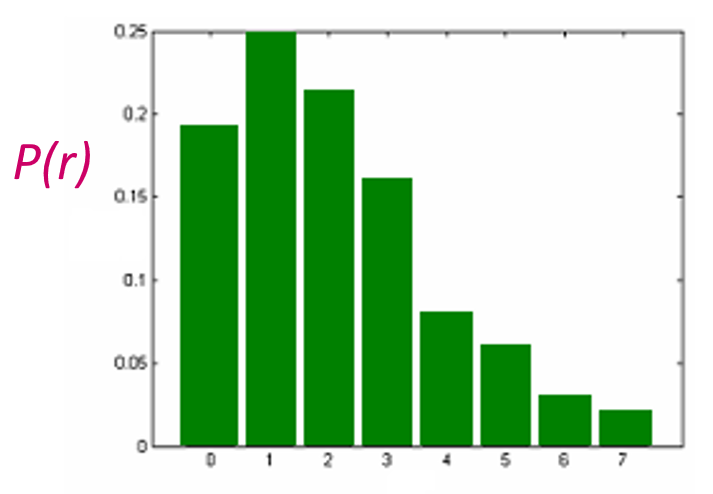

- 纵坐标表示各个灰度等级的像素个数在像素总数中所占的比重
- 横坐标表示灰度等级

设灰度等级范围为$[0, L-1]$ ，灰度直方图用下列离散函数来表示：

$$
h(r_k) = n_k
$$

其中，$r_k$为第$k$级灰度，$n_k$是图像中具有灰度级$r_k$的像素数目，$n$为图像总像素数，$0 \le k \le L - 1, 0 \le n_k \le n - 1$。

通常用概率密度函数来归一化直方图：$P(r_k) = \dfrac{n_k}{n}$
$P(r_k)$为灰度级$r_k$所发生的概率（概率密度函数），此时满足下列条件：$\sum\limits_{k = 0}^{L - 1}P(r_k) = 1$

??? example "例子"

    

        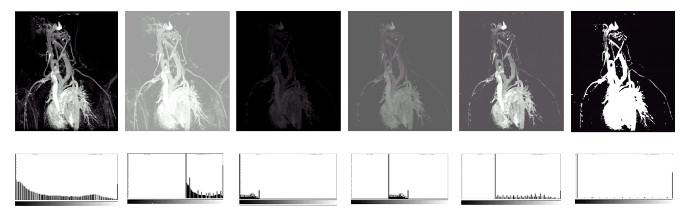
    

### Color Images

**彩色直方图**(color histogram)：一类统计图形，它表示一幅图像中r, g, b通道上各个灰度等级的像素个数在像素总数中所占的比重。 

    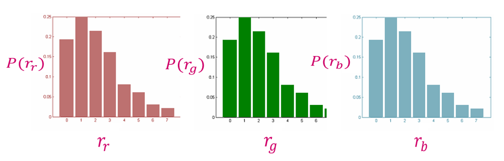

??? example "例子"

    

        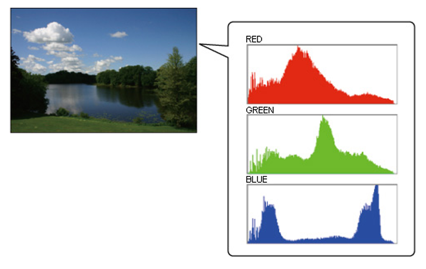
    

### Characteristics of histogram

直方图的优点：

- 是空间域处理技术的基础
- 反映图像灰度的分布规律，但不能体现图像中的细节变化情况
- 对于一幅给定的图像，其直方图是唯一的
- 不同的图像可以对应相同的直方图

    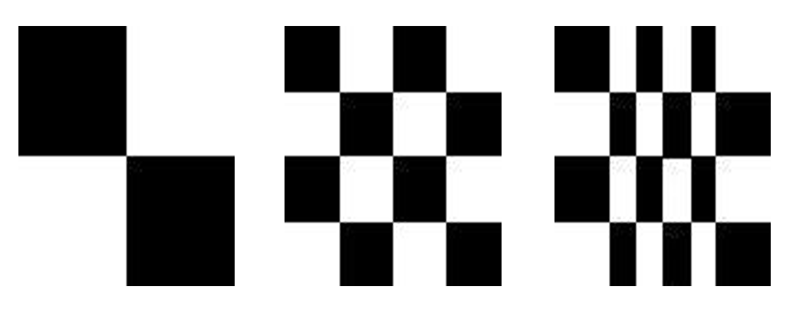

对直方图进行操作能有效地用于图像增强、压缩和分割, 是图像处理的一个实用手段。

直方图的缺点：

- 带来噪声
- 丢失结构信息：只知颜色分布，不知结构

??? example "例子"

    

        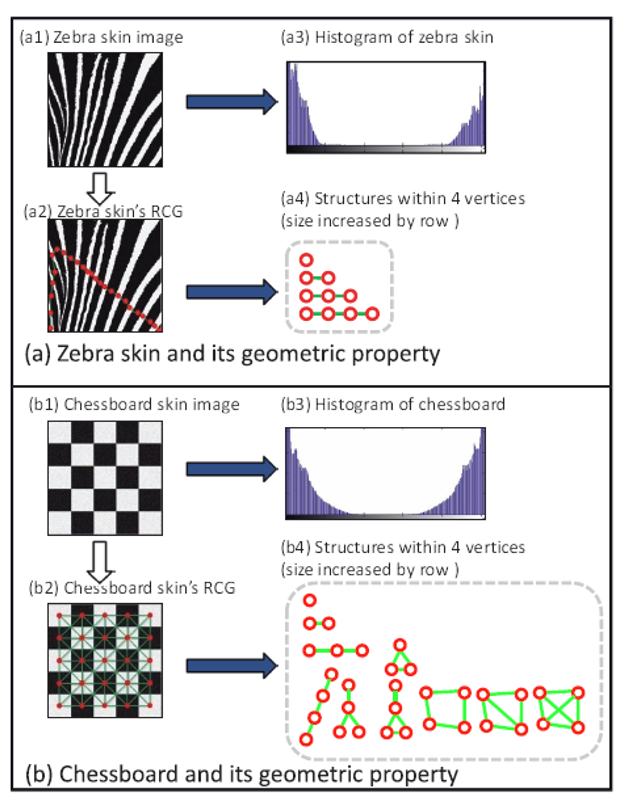
    
    

## Historam Equalization

**直方图均衡化**(historam equalization)：将原图像的非均匀分布的直方图通过变换函数$T$修正为均匀分布的直方图，然后按均衡直方图修正原图像。图像均衡化处理后，图像的直方图是平直的，即各灰度级具有相同的出现频数。

    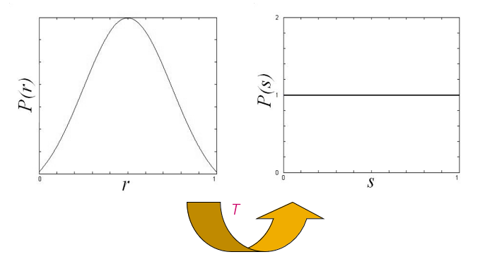

直方图均衡化的关键在于找到变换函数$T$。在计算前，我们做出以下假设和规定：

- 假设：
    - 令$r$和$s$分别代表变化前后图像的灰度级，并且 $0 \le r,s \le 1$
    - $P(r)$和$P(s)$分别为变化前后各级灰度的概率密度函数（$r$和$s$值已归一化，最大灰度值为1）
- 规定：
    - $T(r)$是单调递增函数，并且$0 \le r \le 1$，$0 \le T(r) \le 1$
    - 反变换$r = T^{-1}(s)$也为单调递增函数

### Continuous Version

考虑到灰度变换不影响像素的位置分布，也不会增减像素数目。所以有：

$$
s = T(r) = \int_0^r P(r) \text{d}r
$$

几何意义：转换函数$T$在变量$r$处的函数值$s$，是原直方图中灰度等级为$[0, r]$以内的直方图曲线所覆盖的面积。 

    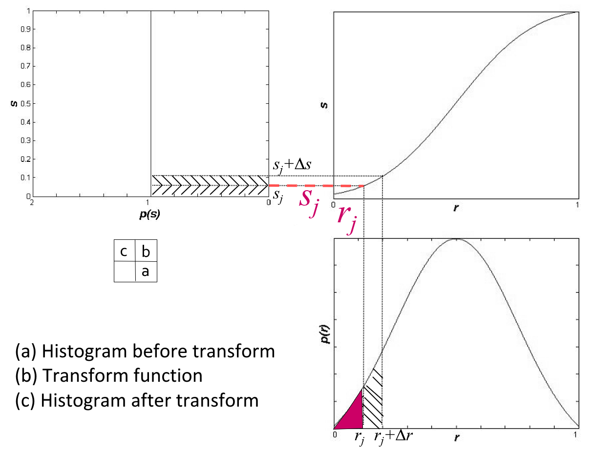
    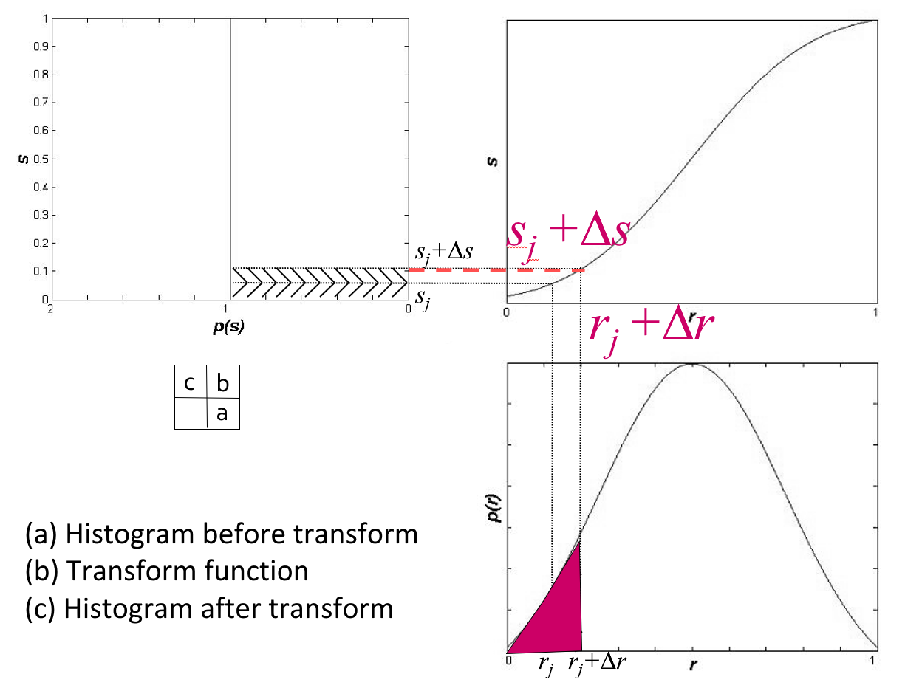

其中右下为原来的直方图，右上为变换函数，左上为均衡化后的直方图。

### Discrete Version

设一幅图像的像素总数为$n$，分$L$个灰度级，$n_k$为第$k$个灰度级出现的像素数，则第$k$个灰度级出现的概率为：

$$
P(r_k) = \dfrac{n_k}{n} (0 \le r_k \le 1, k = 0, 1, 2, \dots, L - 1)
$$

离散灰度直方图均衡化的转换公式为：

$$
s_k = T(r_k) = \dfrac{1}{n}\sum_{i = 0}^k n_i
$$

??? example "例子"

    === "例1"

        === "题目"

            这是原来直方图的数据，请对它进行均衡化操作。

            

                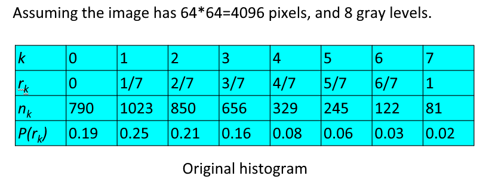
            

        === "答案"

            === "Step 1"

                

                    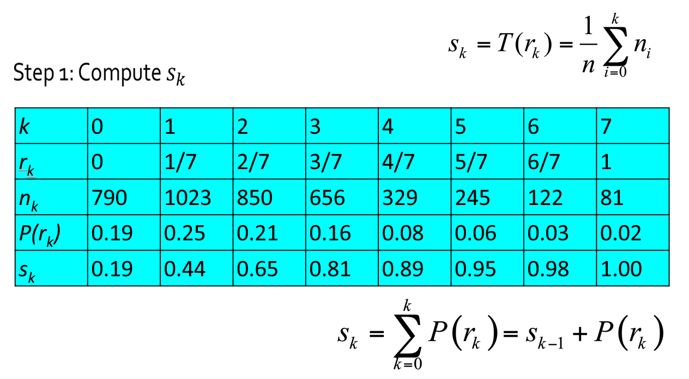
                

            === "Step 2"

                

                    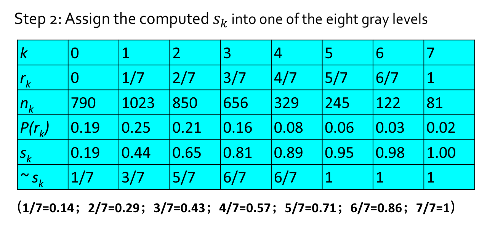
                

            === "Step 3"

                

                    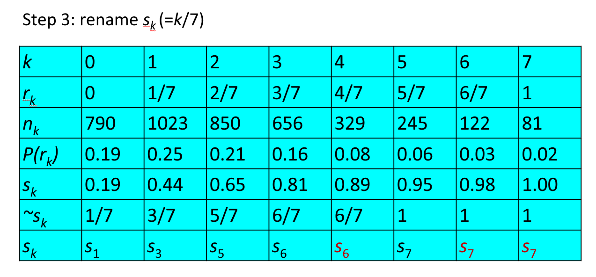
                

            === "Step 4"

                

                    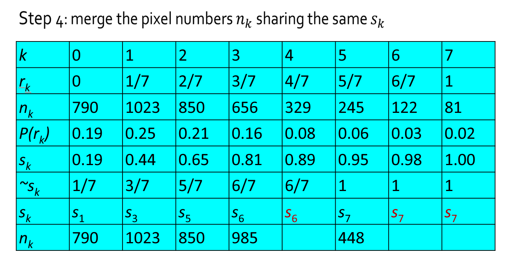
                

            === "Step 5"

                

                    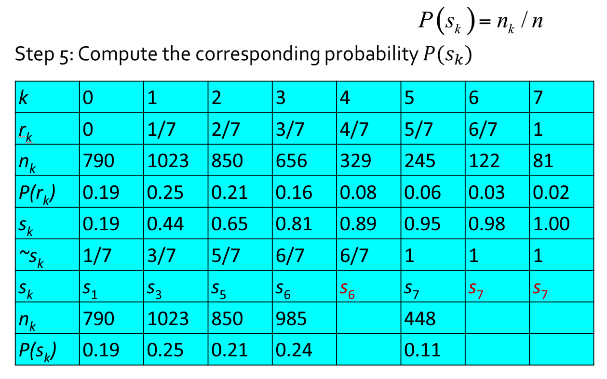
                

            === "结果"

                

                    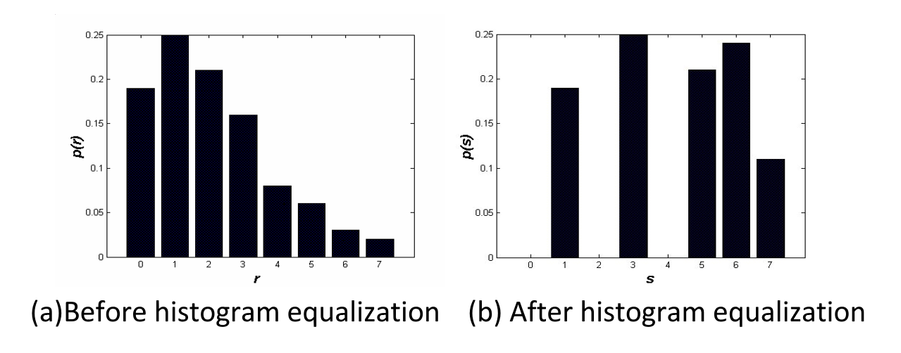
                

            ??? question "疑惑"

                按照均衡化的要求，在均衡化后的结果直方图中，各灰度级发生的概率应该是相同的，如“结果”右图所示连续灰度级均衡化结果那样。但是，右下图中离散灰度级均衡化后，各灰度级出现的概率并不完全一样，为什么？

                ??? info "答案"

                    步骤2中，所得的$s_k$不可能正好等于8级灰度值中的某一级，因此需要就近归入某一个灰度级中。这样，相邻的多个$s_k$就可能落入同一个灰度级，需要在步骤3时将处于同一个灰度级的像素个数累加。因此，离散灰度直方图均衡化操作以后，每个灰度级处的概率密度（或像素个数）并不完全一样。

    === "例2"

        

            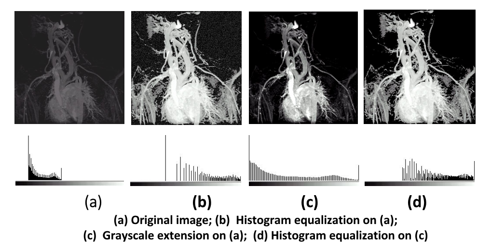
        

!!! note "总结"

    直方图均衡化实质上是减少图像的灰度级以换取对比度的加大。在均衡过程中，原来的直方图上出现概率较小的灰度级被归入很少几个甚至一个灰度级中，故得不到增强。若这些灰度级所构成的图象细节比较重要，则需采用局部区域直方图均衡化处理。 

## Histogram Fitting

**直方图匹配**(histogram fitting)：修改一幅图像的直方图，使得它与另一幅图像的直方图匹配或具有一种预先规定的函数形状。直方图匹配的目标，是突出我们感兴趣的灰度范围，使图像质量改善。利用直方图均衡化操作，可以实现直方图匹配过程。

    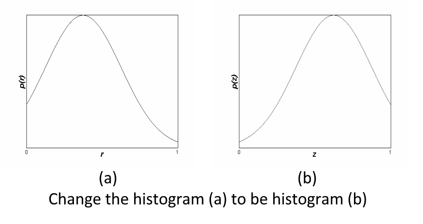

### Continuous Version

    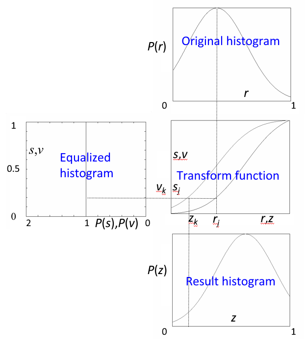

!!! note "操作步骤"

    === "Step 1"

        

            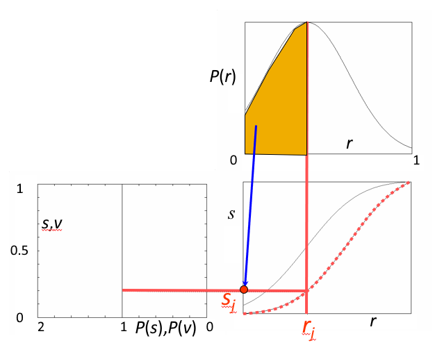
        

        根据第一个变换函数

        $$
        s = T(r) = \int_0^r P(r) \text{d}r
        $$

        将原始直方图的$r$映射到$s$上。

    === "Step 2"

        

            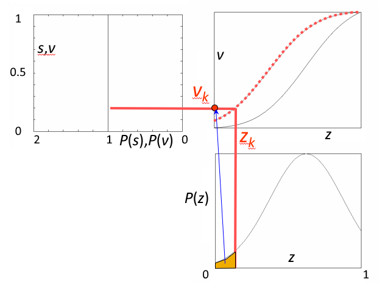
        

        根据第二个变换函数

        $$
        v = T(z) = \int_0^z P(z) \text{d}z
        $$

        将结果直方图的$z$映射到$v$上。

    === "Step 3"

        

            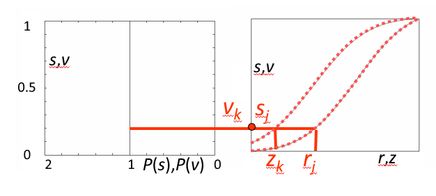
        

        由$v = G(z)$得到$z =G^{-1}(v)$。由于$s$和$v$有相同的分布，逐一取$v = s$，求出与$r$对应的$z =G^{-1}(s)$。
        

### Discrete Version

- 在步骤1和2中，分别计算获得两张表（参见直方图均衡化中的算例）
- 从中选取一对$v_k$、$s_j$，使$v_k = s_j$
- 从两张表中查出对应的$z_k$、$r_j$
- 这样，原始图像中灰度级为$r_j$的所有像素都映射成灰度级$z_k$，最终得到所期望的图像

## Histogram Transform

**直方图变换**(histogram transform)：用以确定变换前后两个直方图灰度级之间对应关系的变换函数。经过直方图变换以后，原图像中的任何一个灰度值都唯一对应一个新的灰度值，从而构成一幅新图像。前面讲过的直方图均衡化、直方图匹配都属于直方图变换操作。

??? info "应用：图像增强"

    - 采用一系列技术去改善图像的视觉效果，或将图像转换成一种更适合于人或机器进行分析处理的形式。 
    - 图像增强并不以图像保真为准则，而是有选择地突出某些对人或机器分析有意义的信息，抑制无用信息，提高图像的使用价值。 
    - 根据任务目标突出图像中感兴趣的信息，消除干扰，改善图像的视觉效果或增强便于机器识别的信息。 

??? example "例子"

    === "例1：亮度调节"

        

            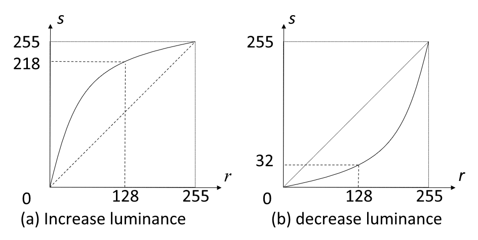
            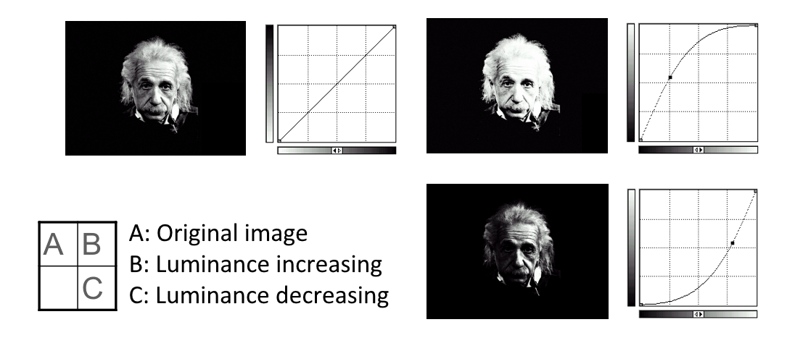
        

    === "例2：对比度调节"

        

            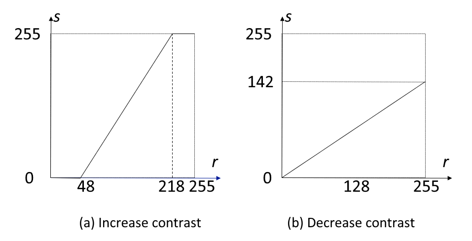
            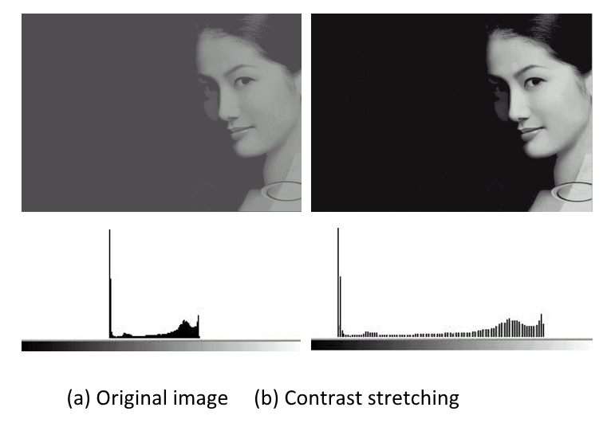
        

    === "例3：颜色量化"

        

            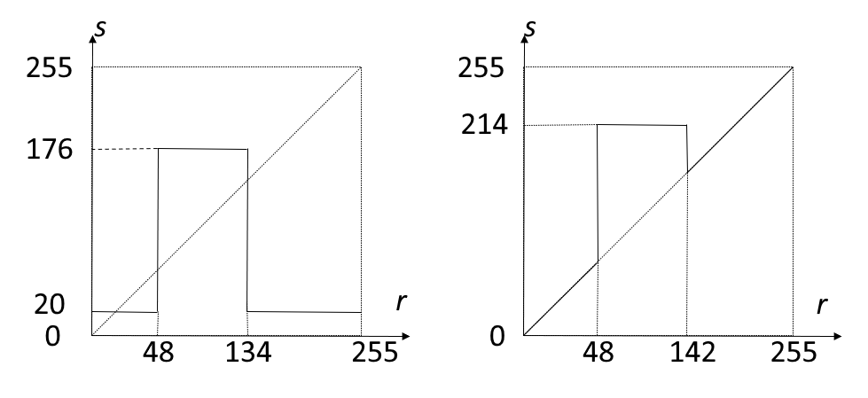
            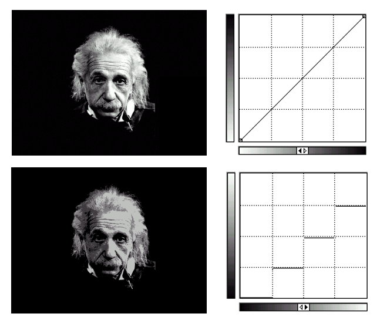
        

### Linear Transform

一般的线性变换函数及其图象如下所示：

    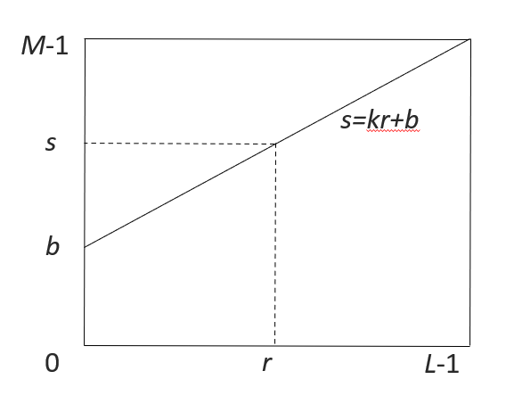

$$
s = T(r) = kr + b
$$

其中，$r$为输入点的灰度值，$s$为相应输出点的灰度值，$k$、$b$为常数。

??? example "例子"

    

        
    

???+ info "应用"

    === "对比度延伸(contrast stretching)"

        

            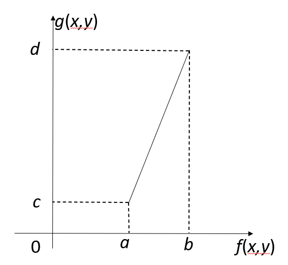
        

        $$
        g(x, y) = \begin{cases}d & f(x, y) > b \\ \dfrac{d - c}{b - a}[f(x, y) - a] + c & a \le f(x, y) \le b \\ c & f(x, y) < a\end{cases}
        $$

        其中，输入图像$f(x, y)$灰度范围为$[a, b]$，输出图像$g(x, y)$灰度范围为$[c, d]$。

        ??? example "例子"

            

                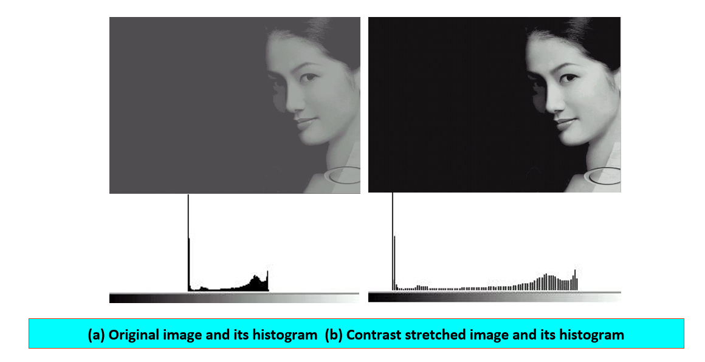
                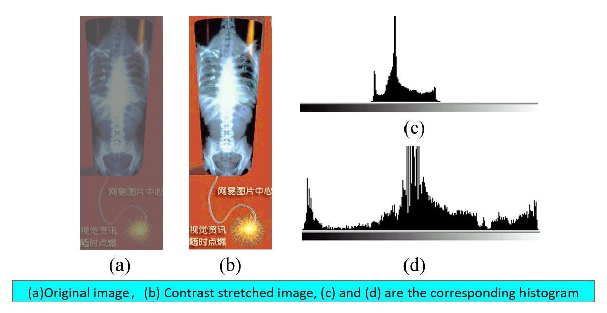
            

    === "分段直方图变换"

        利用分段直方图变换，可以将感兴趣的灰度范围线性扩展，同时相对抑制不感兴趣的灰度区域。 

        

            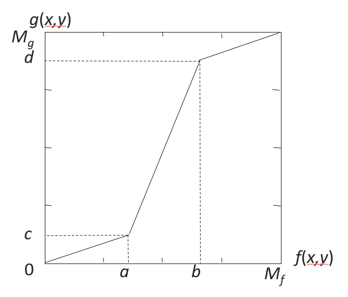
        
    

        $$
        g(x, y) = \begin{cases}\dfrac{M_g - d}{M_f - b}[f(x, y) - b] + d & b \le f(x, y) \le M_f \\ \dfrac{d - c}{b - a}[f(x, y) - a] + c & a \le f(x, y) < b \\ \dfrac{c}{a} f(x, y) & 0 \le f(x, y) < a\end{cases}
        $$

        其中$f(x, y) \in [0, M_f], g(x, y) \in [0, M_g]$。

### Nonlinear Transform

对数函数和指数函数是常见的非线性变换函数。

- 对数变换(logarithmic transform)

    

        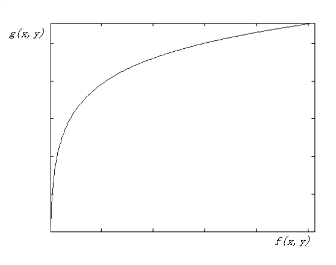
    
 

    $$
    g(x, y) = a + \dfrac{\ln[f(x, y) + 1]}{b \ln c}
    $$

    其中$a, b, c$是可调节的。

- 指数变换(exponential transform)

    

        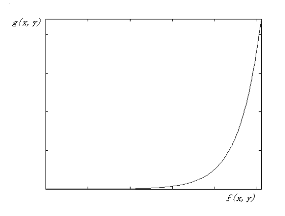
    
 

    $$
    g(x, y) = b^{c[f(x, y) - a]} - 1
    $$

    其中$a, b, c$是可调节的。

??? example "例子"

    

        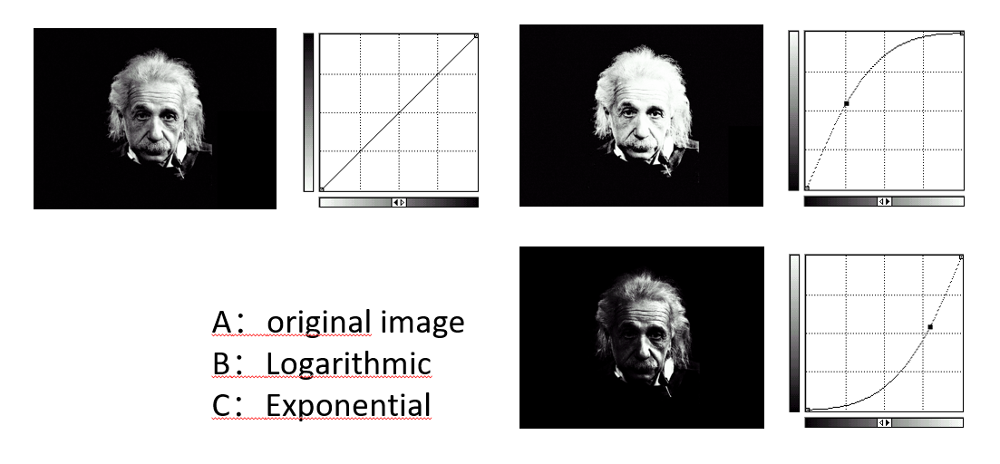
    
 