# Chap 4: Geometric Transform

**几何变换**(geometric transform)是指利用变换函数改变图像中像素的位置，从而产生新图像的过程。几何变换不改变像素值，而是改变像素所在的位置。 

??? example "例子"

    

        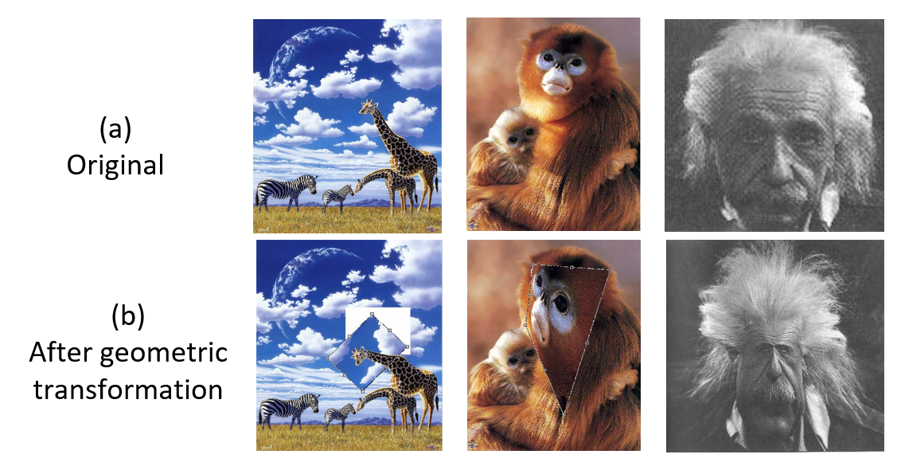
    

几何变换的一般方程为：

$$
\begin{align}
& g(x, y) = f(x', y') = f[a(x, y), b(x, y)]\notag \\
\text{or}\ & \begin{cases}x' = a(x, y) \\ y' = b(x, y) \end{cases} \notag
\end{align}
$$

其中$f(x, y)$表示输入图像，$g(x, y)$表示输出图像，函数$a(x, y), b(x, y)$唯一地描述了空间变换。

几何变换根据难易程度通常可以归结为两类：

- **简单变换**(simple transformation)：变换过程（各个像素变换前后的位置）以及变换参数可知时的变换，如图像的平移、镜像、转置、旋转、缩放、错切变换等
- **一般变换**(general transformation)：变换过程不是一目了然，变换参数难以测量时的变换。通常情况下，对图像畸变进行校正时，需要用到较为复杂的变换公式

## Simple Geometric Transform

### Translation

**平移**(translation)：将图像沿水平和竖直方向移动，从而产生新图像的过程。它的方程为：

$$
\begin{align}
& \begin{cases}x' = x + x_0 \\ y' = y + y_0\end{cases} \notag \\
\text{or}\ & \begin{bmatrix}x' \\ y' \\ 1\end{bmatrix} = \begin{bmatrix}1 & 0 & x_0 \\ 0 & 1 & y_0 \\ 0 & 0 & 1\end{bmatrix} \begin{bmatrix}x \\ y \\ 1\end{bmatrix} \notag
\end{align}
$$

可以看出，该方程使得原图像中的每个像素沿$x$方向平移$x_0$，沿$y$方向平移$y_0$。

??? example "例子"

    

        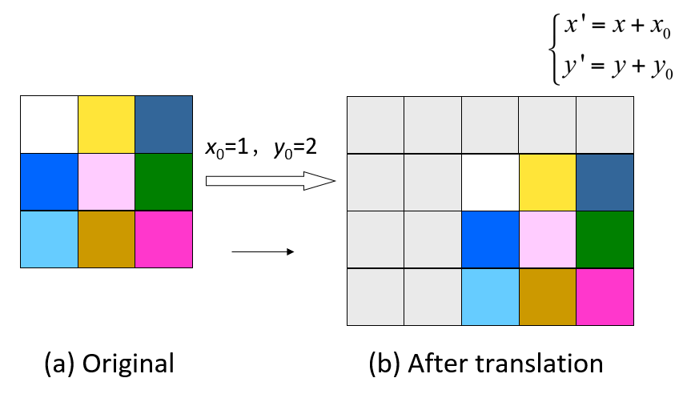
    

!!! warning "注意"
    
    虽然平移后的景物与原图像相同，但“画布(canvas)”的面积可能需要扩大，否则就会丢失信息。

### Mirror

**镜像**(mirror)：将图像绕$x$轴或$y$轴翻转，从而产生与原图像对称的新图像的过程。它的方程为：

$$
\begin{align}
\text{Flip around x axis: } \begin{cases}x' = x \\ y' = -y\end{cases} \notag \\
\text{Flip around y axis: } \begin{cases}x' = -x \\ y' = y\end{cases} \notag \\
\end{align}
$$

另一种形式为：

$$
\begin{bmatrix}x' \\ y' \\ 1\end{bmatrix} = \begin{bmatrix}S_x & 0 & 0 \\ 0 & S_y & 1 \\ 0 & 0 & 1\end{bmatrix} \begin{bmatrix}x \\ y \\ 1\end{bmatrix}
$$

- 当$S_x = 1, S_y = -1$时，实现绕$x$轴的镜像变换
- 当$S_x = -1, S_y = 1$时，实现绕$y$轴的镜像变换

??? example "例子"

    

        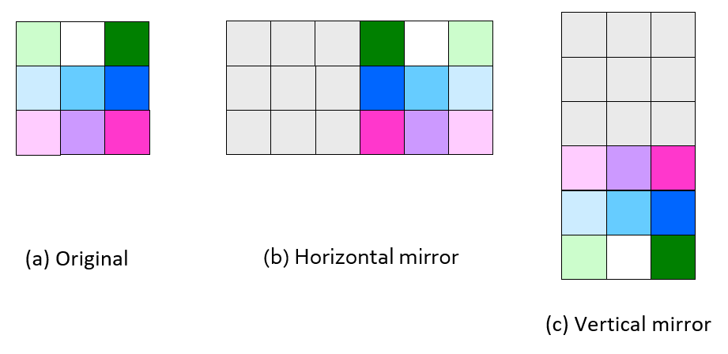
    

### Rotation

**旋转**(rotation)：绕原点旋转$\theta$角，得到新图像的过程。它的方程为：

$$
\begin{align}
& \begin{cases}x' = x \cos \theta - y \sin \theta \\ y' = x \sin \theta + y \cos \theta\end{cases} \notag \\
\text{or}\ & \begin{bmatrix}x' \\ y' \\ 1\end{bmatrix} = \begin{bmatrix}\cos \theta & - \sin \theta & 0 \\ \sin \theta & \cos \theta & 0 \\ 0 & 0 & 1\end{bmatrix} \begin{bmatrix}x \\ y \\ 1\end{bmatrix} \notag
\end{align}
$$

!!! bug "空洞问题"

    图像经过旋转变换以后，新图像中会出现许多空洞，如下图所示：

    

        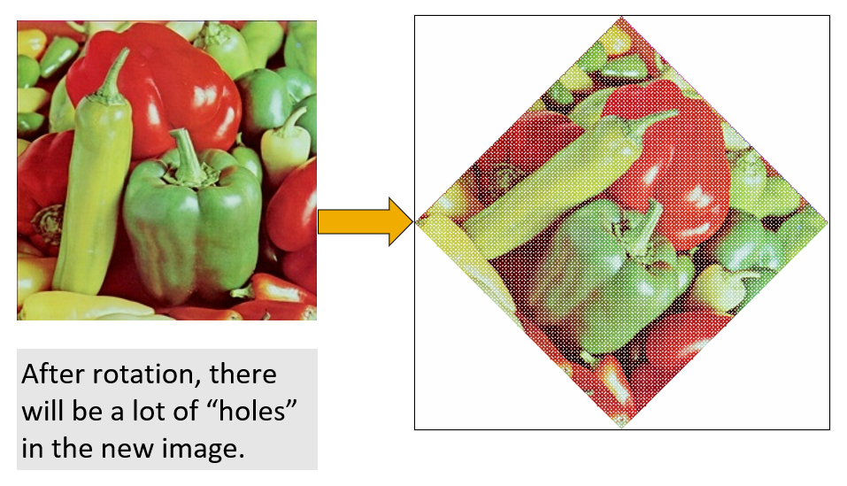
    

    !!! note "解决方法"

        用[**插值**](#Interpolation) (interpolation)方法填补：按顺序寻找每一行中的空洞像素，设置其像素值与同一行中前一个像素的像素值相同（行插值）。

        现在旋转后的图像如下所示，可以看到空洞已经被填上了。
  
        

            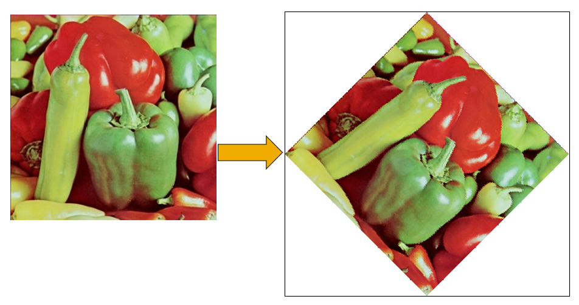
        

     
### Scale

**缩放**(scale)：将图像乘以一定系数，从而产生新图像的过程。它的方程为：

$$
\begin{align}
& \begin{cases}x' = cx \\ y' = dy\end{cases} \notag \\
\text{or}\ & \begin{bmatrix}x' \\ y' \\ 1\end{bmatrix} = \begin{bmatrix}c & 0 & 0 \\ 0 & d & 0 \\ 0 & 0 & 1\end{bmatrix} + \begin{bmatrix}x \\ y \\ 1\end{bmatrix} \notag
\end{align}
$$

- 沿x轴方向缩放$c$倍（$c>1$时为放大，$0<c<1$时为缩小）；沿y轴方向缩放$d$倍（$d>1$时为放大，$0<d<1$时为缩小）
- 当$c=d$时，图像等比缩放；否则为非等比缩放，导致图像变形

缩放的两种类型：

- **缩小**(shrink)：按一定间隔选取某些行和列的像素构成缩小后的新图像
- **放大**(enlarge)：新图像出现空行和空列，可采用插值的方法加以填补，但存在“马赛克”现象

??? example "例子"

    === "缩小"

        

            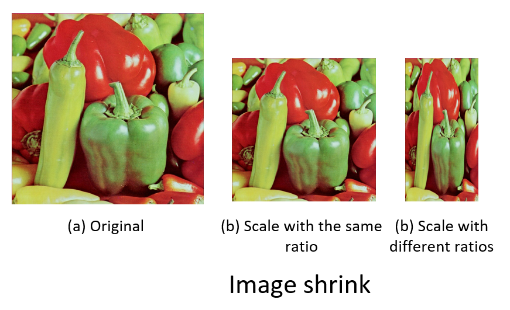
        

    === "放大"

        

            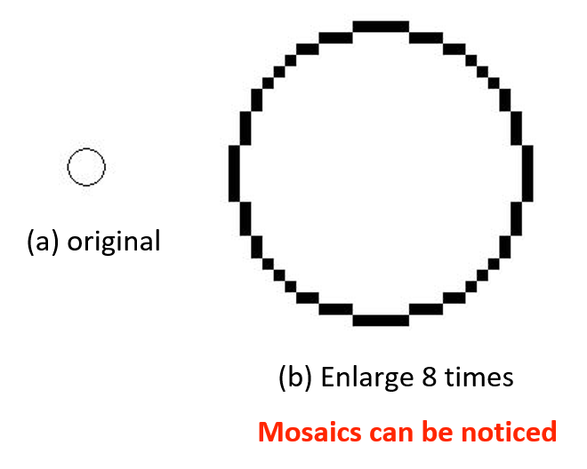
            
        

        

            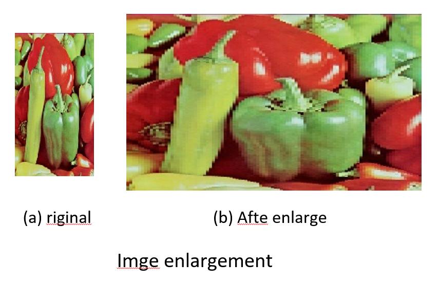
        

### Shear

**错切**(shear)：景物在平面上的非垂直投影效果。它的方程为：

$$
\begin{align}
\text{Shear on x axis: } \begin{cases}a(x, y) = x + d_xy \\ b(x, y) = y\end{cases} \notag \\
\text{Shear on y axis: } \begin{cases}a(x, y) = x \\ b(x, y) = y + d_yx\end{cases} \notag \\
\end{align}
$$

??? example "例子"

    === "例1"

        

            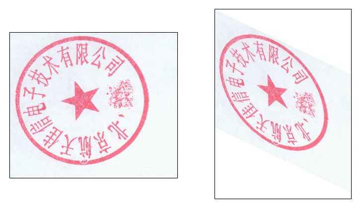
        

    === "例2"

        

            
        

### Combination

**组合**(combination)：各项简单几何变换的混合操作。它的方程为：

$$
\begin{bmatrix}x' \\ y' \\ 1\end{bmatrix} = \begin{bmatrix}a & b & c \\ d & e & f \\ g & h & 1\end{bmatrix} + \begin{bmatrix}x \\ y \\ 1\end{bmatrix} 
$$

- 变换矩阵是由构成组合变换的各种简单变换的变换矩阵按从左至右的顺序逐次相乘以后得到的结果
- 变换矩阵相乘时的顺序是不可以任意改变的

## Interpolation

**插值**(interpolation)：几何变换最常用的工具，利用已知像素值，采用不同的插值方法，可以模拟出未知像素的像素值。有以下几种插值方法：

- **最近邻插值**(nearest neighbor interpolation)
- **线性插值**(linear interpolation)
- **径向基函数插值**(RBF interpolation)

### Nearest Neighbor Interpolation

**最近邻插值**：输出像素的灰度值等于离它所映射到的位置最近的输入像素的灰度值。 

计算过程：

- 为了计算几何变换后新图像中某一点$P'$处的像素值，可以首先计算该几何变换的逆变换，计算出$P'$所对应的原图像中的位置$P$。通常情况下，$P$的位置不可能正好处在原图像的某一个像素位置上（即$P$点的坐标通常都不会正好是整数）
- 寻找与$P$点最接近的像素$Q$，把$Q$点的像素值作为新图像中$P'$点的像素值

用数学语言表示上述过程：

$$
\begin{align}
(x', y') & \xRightarrow{\text{inverse transformation}} (x, y) \xRightarrow{\text{rounding operation}} (x_{\text{int}}, y_{\text{int}}) \notag \\
& \xRightarrow{\text{assign value}} I_{\text{new}}(x', y') = I_{\text{old}}(x_{\text{int}}, y_{\text{int}}) \notag
\end{align}
$$

!!! bug "局限性"

    当图像中包含明显的几何结构时，结果将不太光滑连续，从而在图像中产生人为的痕迹。 

    

        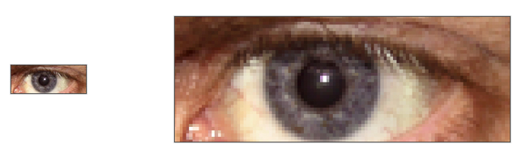
    

### Linear Interpolation

线性插值的几种情况：

- 一维：已知$x_1$和$x_2$处的灰度值分别为$g_1$和$g_2$，则$x_3$处的灰度值$g_3$为：

    $$
    g_3 = \dfrac{g_2 - g_1}{x_2 - x_1}(x_3 - x_1) + g_1
    $$

    

        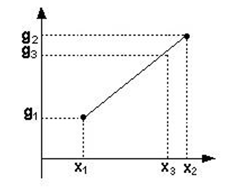
    

- 二维（**双线性插值**(bilinear interpolation)）：已知图像的正方形网格上四个点$A$、$B$、$C$、$D$的灰度，求$P$点的灰度。

    

        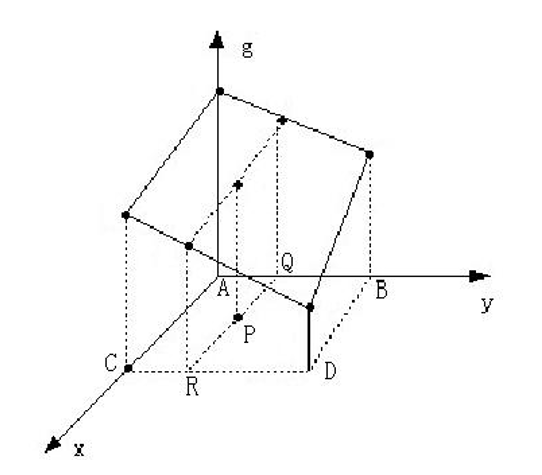
    

    步骤如下：

    - 定义双线性方程$g(x,y)=ax+by+cxy+d$
    - 分别将$A$、$B$、$C$、$D$四点的位置和灰度代入方程，得到方程组
    - 解方程组，解出$a$、$b$、$c$、$d$四个系数
    - 将$P$点的位置代入方程，得到$P$点的灰度

??? example "例子"

    === "例1"

        

            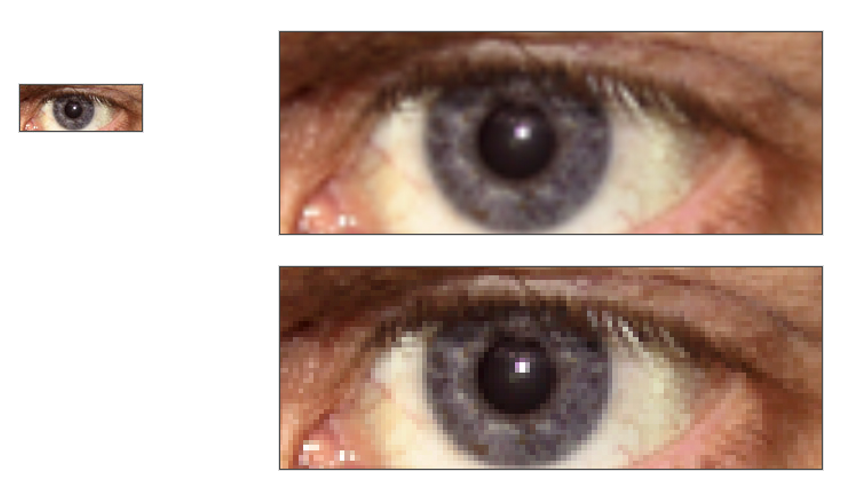
        

    === "例2"

        

            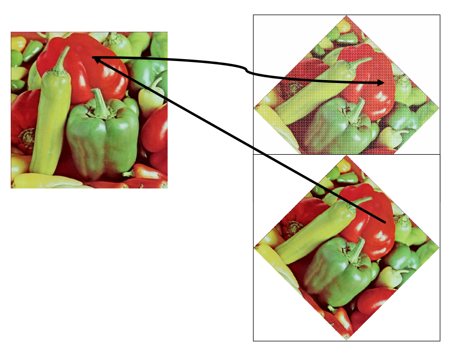
        

### RBF Interpolation

**径向基函数插值**(radial basis function based interpolation)，它的公式为：

$$
G(x) = \sum\limits_{i = 1}^n w_i G(c_i) \quad \text{where}\ w_i = \dfrac{\varphi (|x - c_i|)}{\sum\limits_{i = 1}^n \varphi (|x - c_i|)}
$$

其中$x$可以是一个标量，也可以是一个向量。因此此类插值法既可以作为一维插值，也可以作为二维、多维插值，这取决于$x$的维度。

RBF插值法的核心是关于半径$r$的核函数$\phi(r)$，常用的核函数有（前两种函数都有一个调节参数$\sigma$）：

- 高斯(Gaussian)：$\varphi(r) = \exp (-\dfrac{r^2}{2\sigma^2})$
- 多元二次(multiquadrics)：$\varphi(r) = \sqrt{1 + \dfrac{r^2}{\sigma^2}}$
- 线性：$\varphi(r) = r$
- 三次：$\varphi(r) = r^3$
- 薄板?(thinplate)：$\varphi(r) = r^2 \ln(r + 1)$

??? example "例子"

    === "例1"

        

            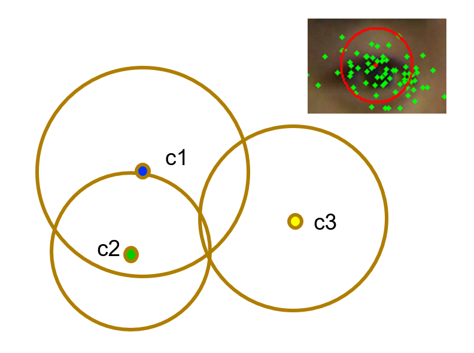
        

    === "例2"

        

            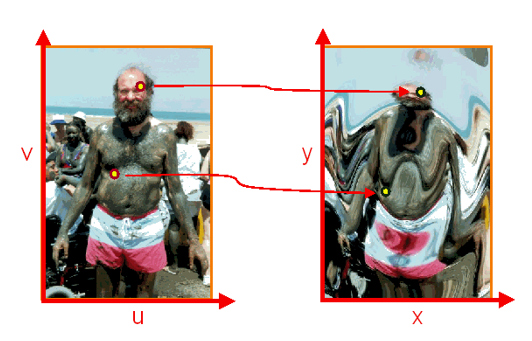
        

## Warp and Morph

### Warp

**扭曲**(warp)：只改变像素点的位置。

    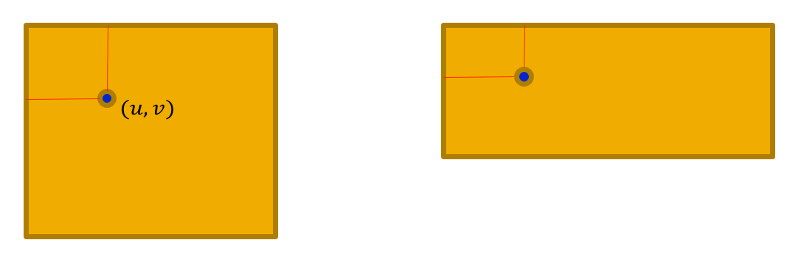

### Morph

**变形**(morph)：景物的形体变化，是使一幅图像逐步变化到另一幅图像的处理方法。

- 这是一种较复杂的二维图像处理，需要对各像素点的**颜色**、**位置**作变换
- 变形的起始图像和结束图像分别为两幅关键帧，从起始形状变化到结束形状的关键在于自动地生成中间形状，也即自动生成中间帧

- 大小相同的两幅图的转换作静态变换，从一幅图A逐渐变化成第二幅图B
    - 原理：让图A中每个像素的颜色，逐渐变成图B相同位置像素的颜色
    - 方法：根据变换的快慢，设置相应的步长，将图A每一点的RGB逐渐变成图B相同位置像素的RGB。可以选择等比或等差的方式，或其它方式让：$r^a \rightarrow r^b$
- 对于灰度图像，可以直接用等比或等差级数定义步长，使颜色从原图变到目标图，公式为：$I_i = I_{\text{begin}} + i \cdot \dfrac{I_{\text{end}} - I_{\text{begin}}}{n}$
- 对于彩色图像，RGB三色同时从原图变到目标图像。可以分别变化，也可考虑RGB的相对比例关系同时变化，公式为：

$$
\begin{align}
& r_{i, j} = r_{i, j}^a + \dfrac{r_{i, j}^b - r_{i, j}^a}{N} \cdot n \quad n = 0, \dots, N - 1 \notag \\
& g_{i, j} = g_{i, j}^a + \dfrac{g_{i, j}^b - g_{i, j}^a}{N} \cdot n \quad n = 0, \dots, N - 1 \notag \\
& b_{i, j} = b_{i, j}^a + \dfrac{b_{i, j}^b - b_{i, j}^a}{N} \cdot n \quad n = 0, \dots, N - 1 \notag \\
\end{align}
$$

??? example "例子"

    

        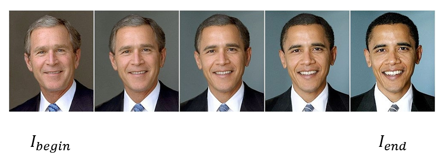
    

选取关键帧(key frame)的方法：选择两幅结构相似、大小相同的画面作为起始和结束关键帧，这样才能比较容易地实现自然、连续的中间变形过程。

#### Morph Based on Segment

- 以点为中心控制像素的移动。利用 RBF 的思路，移动线段。距离控制点越近，移动幅度越相似
- 在原图上标出一些特征点，用于勾画起始帧和结束帧的结构对应关系，并将这些点连接起来，得到了一些线段(segment)。特征点是变形运算所需的参数
- 如果想将线段A变到线段B，那么对应的每个像素的位置和颜色都需要改变
- 这时可以采用不同的插值策略计算像素中间值（空间，颜色）

    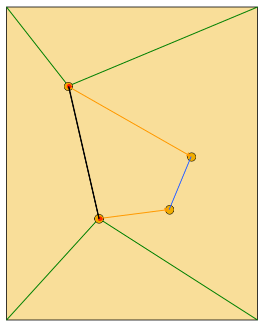
    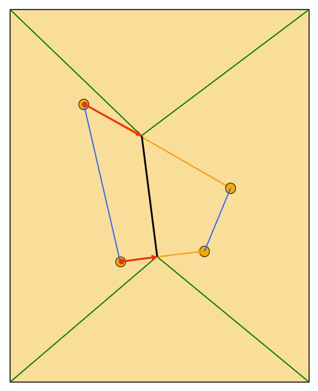
    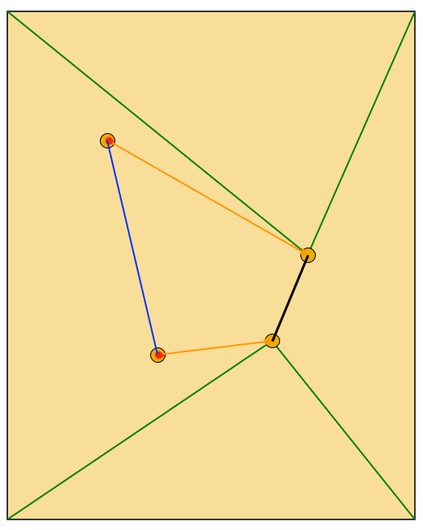

??? example "例子"

    

        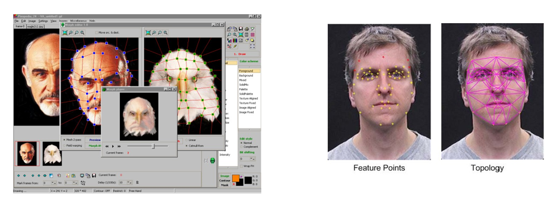
    

#### Morph Based on Grid

通过网格建立两张图片的联系，那么两张图片的中间帧可以由变换函数得到。

- **视点变换**：在视点移动后原始图像变换生成的新视图。
    - 在用相机拍摄物体时，保持物体的位置不动，而将相机移离物体，这就相当于视点变换
    - 视点变形要求对物体有三维坐标知识
- **模型变换**：如果我们保持相机固定位置，将物体移离相机，这就相当于模型转换。

    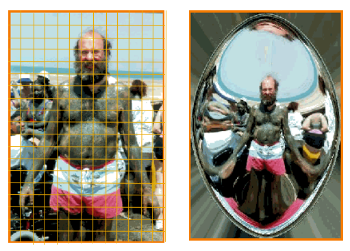

## Application

!!! question "问题描述"

    

        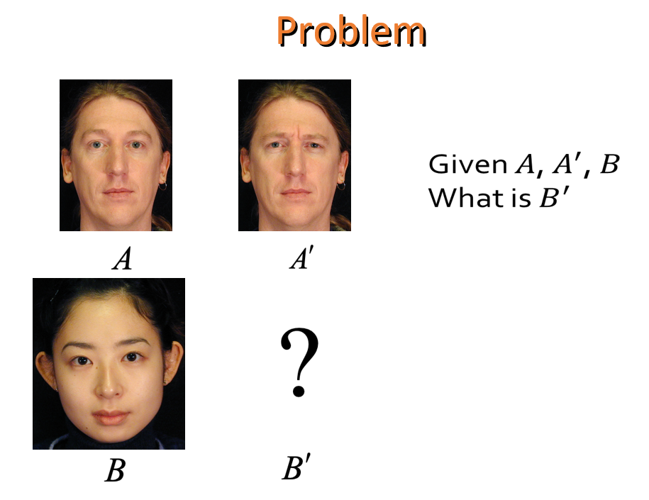
    

??? info "一种可能的解法"

    采用几何扭曲，公式为：$v_{B'} = v_B + v_{A'} - v_A$，结果如下：

    

        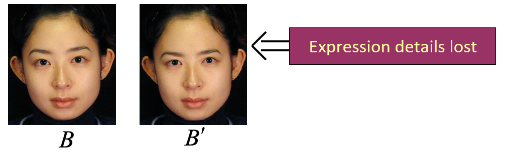
    

    可以看到，这种方法丢失了一些面部表情的细节，比如没有皱眉等。

下面我们使用Lambertian模型来解决这个问题。

### Lambertian Model

假设有$m$个点光源，那么曲面亮度$I$为：

$$
I = \rho \sum\limits_{1 \le i \le m}S_iI_in \cdot l_i = \rho E(n)
$$

其中

- $l_i$第$i$个光源照过来的角度
- $n_i$表示当前这个曲面的法向量，所以$n_i \cdot l_i$相当于余弦关系
- $I_i$表示第$i$个光源的亮度
- $S_i = \begin{cases}0 & \text{if the point cannot be seen from light i} \\ 0 & \text{otherwise}\end{cases}$表示曲面能不能被第$i$个点光源找到
- $\rho$表示曲面的材质

**表情比例图像**(expression ratio image, ERI)仅捕捉由表面形变带来的亮度变化。它满足关系：

- 变形之前：$I = \rho E(n)$，变形之后：$I' = \rho E(n')$（因此不依赖于材质）
- $\dfrac{I'}{I} = \dfrac{E(n')}{E(n)}$

将两张ERI看作两个满足下列性质的**曲面**(surface)：

- 对应点上具有相同的法向量
- 不同的材质
- 相同的变形

整理得到以下表格：

||Before deform|After deform|
|:-|:-:|:-:|
|Surface 1|$I_1 = \rho_1 E(n)$|$I_1' = \rho_1 E(n')$|
|Surface 2|$I_2 = \rho_2 E(n)$|$I_2' = \rho_2 E(n')$|

因此：$\dfrac{I_1'}{I_1} = \dfrac{I_2'}{I_2} \Rightarrow I_2' = \dfrac{I_1'}{I_1}I_2$

那么可以将原题转化为（我们假设人脸具有近似相同的法向量）：

||Before deform|After deform|
|:-|:-:|:-:|
|Person A|$I_a$|$I_a'$|
|Person B|$I_b$|$I_b' = \dfrac{I_a'}{I_a}I_b$|

算法实现：

- 已知图像：$A, A', B$
- 先标记出图像的特征点
- 对于图像$B$的每个特征点$v_b$，对其进行扭曲，即$v_{b'} = v_b + v_{a'} - v_a$，令$B_g$为扭曲后的图像
- 通过图像扭曲，将$A, A'$与$B_g$对齐
- 计算比例图像$K = \dfrac{A'}{A}$
- 图像$B' = K \cdot B_g$

??? example "例子"

    === "例1"

        

            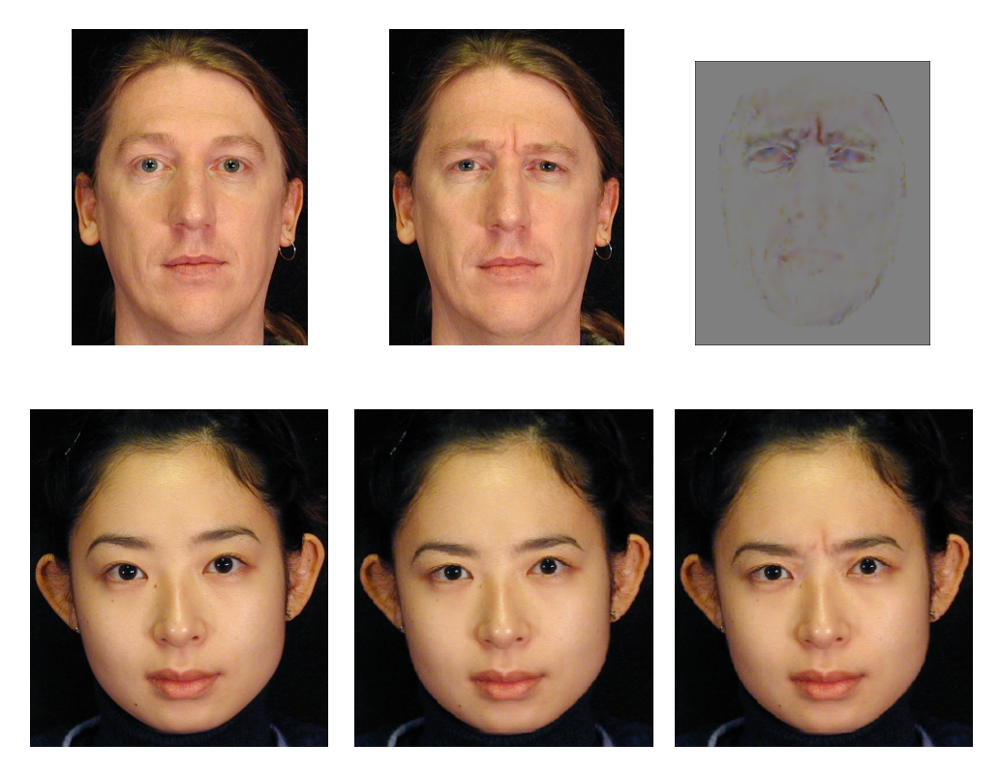
        
     

    === "例2"

        

            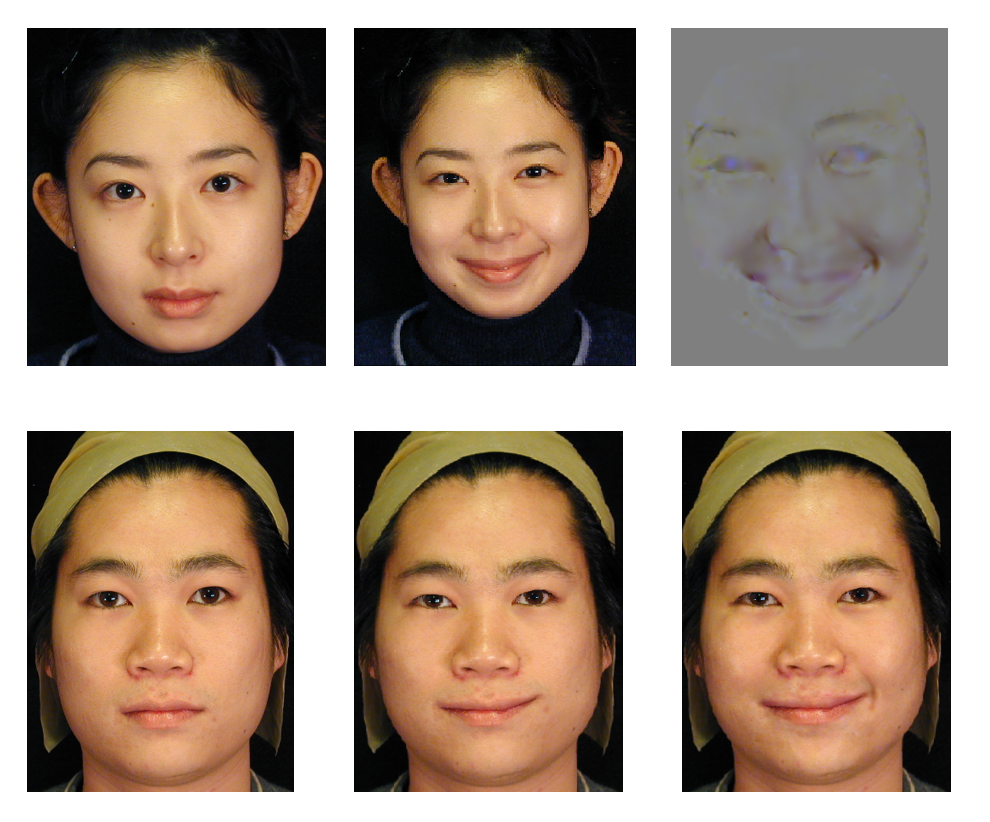
        
