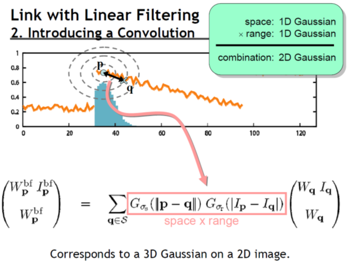

# Chap 5: Image Convolution and Filtering

## 1D Convolution

### Continuous 1D Convolution

定义：两个一元函数$f(x)$和$h(x)$的卷积(convolution)$g(x)$为：

$$
g(x) = f(x) * h(x) = \int_{-\infty}^{+\infty}f(t)h(x-t)\text{d}t
$$

它表示两个函数的卷积可以转化成乘积的积分来计算。通常将$f(x)$称为**输入函数**，将$h(x)$称为**卷积函数**。

!!! example "例子"

    已知两个函数，要求计算它们的卷积在任意点$x$处的值。

    

        
    

    具体的计算步骤如下：

    - 将卷积函数$h(t)$沿y轴翻转，得到$h(-t)$

        

            
        

    - 将翻转后的卷积函数向右移动距离$x$个单位长度，得到$h(x - t)$

        

            
        

    - 计算$f$和$h$在任意$t$的乘积，并积分

        

            
        

    - 对每一个$x$值重复上述计算过程，就得到了输出曲线$g(x)$
        - 当$x$变化时，翻转的函数平移通过静止不动的输入函数，$g(x)$值取决于这两个函数的重叠部分的积分

### Properties of Convolution

- 交换律：$f(x) * h(x) = h(x) * f(x)$
- 分配律：$f * (g + h) = f * g + f * h$
- 结合律：$f * (g * h) = (f * g) * h$

### Discrete 1D Convolution

对于离散序列，其卷积可用与连续函数相类似的方法求得。对于两个长度均为$M$的序列$f(x)$和$h(x)$，其卷积为：

$$
g(x) = f(x) * h(x) = \dfrac{1}{M} \sum\limits_{t = 0}^{M - 1}f(t)h(x - t)
$$

!!! example "例子"

    === "例1"

        已知以下输入函数和卷积函数，求它们的卷积。

        

            
        
 

        具体的计算步骤如下：

        - 将卷积函数$h(t)$沿y轴翻转，得到$h(-t)$

            

                
            

        - 将翻转后的卷积函数向右移动距离$x$个单位长度，得到$h(x - t)$

            

                
            

        - 对每一个样本点$t$($t \in [0, 399]$)，计算乘积$f(t)h(x-t)$，然后将这些乘积相加后除以常数$M$(=400)，就得到在位移$x$下的卷积

            

                
            

        - 对有效范围内的所有位移$x$均计算一个卷积，这样，所有这些值就形成了一条曲线

            

                
            

    === "例2"

        

            
        

!!! note "总结"

    卷积实质上是对图像像素的加权求和。

## Spatial Filtering

### Principle

**滤波器**(filter)是一个大小为$M \times N$的窗口，窗口中的元素与原图像的处于窗口内的像素进行某种运算，结果作为新图像的一个像素。当窗口滑过原图像并完成上述运算之后，就能够得到一幅新图像。

- 滤波器的别名：掩模(mask)、核(kernel)、模板(template)，窗口(window)
- 滤波器子图像中的值是系数值，而不是像素值，它代表了影响新像素产生的权重
- 滤波器的执行流程：在待处理图像中逐点移动**掩模**(mask)，在每一点$(x,y)$处，滤波器在该点的响应通过实现定义的关系来计算。
    - 对于线性空间滤波，其响应由滤波器系数与滤波掩模扫过区域的对应像素值的乘积之和给出

    

        
    

    响应值$R = w(-1, -1)f(x - 1, y - 1) + w(-1, 0)f(x - 1, y) + \dots + w(0, 0)f(x, y) + \dots + w(1, 0)f(x + 1, y) + w(1, 1)f(x + 1, y + 1)$

- 滤波器的响应值：通常，掩模的长宽都为奇数。假设分别为$2a+1$和$2b+1$。当窗口中心处于像素$(x,y)$处时，新的像素值为： 

    $$
    g(x, y) = \sum\limits_{s = -a}^a \sum\limits_{t = -b}^b w(s, t) f(x + s, y + t)
    $$

    对图像$f$中所有像素都与掩模进行运算之后，最终产生一幅新图像$g$

    - 简化形式为：$R = \sum\limits_{i = 1}^{mn} w_i z_i$

### Smoothing

图像在传输过程中，由于传输信道、采样系统质量较差，或受各种干扰的影响，而造成图像毛糙，此时，就需对图像进行平滑处理。平滑可以抑制高频成分，但也使图像变得模糊。

**平滑空间滤波器**(spatial smoothing filter)用于模糊处理和减少噪声。模糊处理经常用于预处理，例如，在提取大的目标之前去除图像中一些琐碎的细节，桥接直线或曲线的缝隙。 
 
#### Linear Smoothing Filter

**平滑线性空间滤波器**的输出是包含在滤波掩模邻域内像素的简单平均值。因此，这些滤波器也称为**均值滤波器**。均值滤波器的主要应用是去除图像中的不相干细节，即那些与滤波掩模尺寸相比更小的像素区域。 

???+ example "例子"

    - 简单平均，表示窗口中每一个像素对响应的贡献是一样的
    - 加权平均，表示窗口中的像素对相应的贡献有大小之分
    - 两个$3 \times 3$平滑（均值）滤波器掩模，每个掩模前边的乘数等于它的系数值的和，以计算平均值 
    

    

        
    

它的方程为：

$$
g(x, y) = \dfrac{\sum\limits_{s = -a}^a \sum\limits_{t = -b}^b w(s, t) f(x + s, y + t)}{\sum\limits_{s = -a}^a \sum\limits_{t = -b}^b w(s, t) }
$$

其中，滤波器大小为$(2a+1) \times (2b+1)$，$w$为滤波器，$f$为输入图像，$g$为输出图像。

滤波掩模的大小与图像的平滑效果有直接的关系。当掩模比较小时，可以观察到在整幅图像中有轻微的模糊，当掩模大小增加，模糊程度也随之增加。 

??? example "应用"

    为了对感兴趣物体得到一个粗略的描述而模糊一幅图像，这样，那些较小物体的强度与背景混合在一起了，较大物体变得像“斑点”而易于检测。掩模的大小由那些即将融入背景中去的物件尺寸来决定。 
    
    

        
    

#### Statistical Sorting Filter

**统计滤波器**(statistical filter)是一种非线性的空间滤波器，它的响应是基于窗口内图像区域中像素值的排序，由统计排序结果决定的值代替中心像素的值。

统计滤波器中最常见的例子就是**中值滤波器**(median filter)。

- 用像素邻域内灰度的中值代替该像素的值
- 提供了优秀的去噪能力，比小尺寸的线性平滑滤波器的模糊程度明显要低
- 对处理脉冲噪声（也称为椒盐噪声）非常有效，因为这种噪声是以黑白点叠加在图像上的
- 中值$\xi$——数值集合中，有一半数值小于或等于$\xi$，还有一半大于或等于$\xi$
- 为了对一幅图像上的某个点作中值滤波处理。必须先将掩模内欲求的像素及其邻域的像素值排序，确定出中值，并将中值赋予该像素点
- 常用$n \times n$的中值滤波器去除那些相对于其邻域像素更亮或更暗，并且其区域小于$\dfrac{n^2}{2}$（滤波器区域的一半）的孤立像素集

??? example "例子"

    

        
    

### Sharpening Filter

- **锐化滤波器**(sharpening filter)的作用：突出图像中的细节或者增强被模糊了的细节。
- **微分算子**(differential operator)是实现锐化的工具，其响应程度与图像在该点处的突变程度有关。微分算子增强了边缘和其他突变（如噪声）并削弱了灰度变化缓慢的区域。 
    - 基于二阶微分的图像增强——**拉普拉斯算子**(Laplacian operator)
    - 基于一阶微分的图像增强——**梯度法**(gradient-based method)

- 对于函数$f(x)$，我们用差分(difference)来表示微分算子：$\dfrac{\partial f}{\partial x} = f(x + 1) - f(x)$
    - 类似地，二阶差分为：$\dfrac{\partial^2 f}{\partial x^2} = f(x + 1) + f(x - 1) - 2f(x)$

??? example "例子"

    

        
    

    - (a) 一幅简单图像，包含各种实心物体、一条线及一个单一噪声点
    - (b) 沿图像中心并且包含一个噪声点的一维水平灰度剖面图
    - (c) 简化的剖面图（用虚线连接点以简化描述）

#### Gradient-based Method

对于二元函数$f(x, y)$，定义一个二维向量：

$$
\nabla \bm{f} = \begin{bmatrix}\dfrac{G_x}{G_y}\end{bmatrix} = \begin{bmatrix}\dfrac{\partial f}{\partial x} \\ \dfrac{\partial f}{\partial y}\end{bmatrix}
$$

它的模值(magnitude)为：

$$
\nabla f = [G_x^2 + G_y^2]^{\frac{1}{2}} = [(\dfrac{\partial f}{\partial x})^2 + (\dfrac{\partial f}{\partial y})^2]^{\frac{1}{2}}
$$

当对整幅图像计算梯度时，运算量会很大，因此，在实际操作中，常用绝对值代替平方与平方根运算近似求梯度的模值：$\nabla f \approx |G_x| + |G_y|$ 

---
另一种计算方法：罗伯特交叉梯度算子(Robert cross gradient operator)

    

这是一幅原始图像，$z_i$表示对应位置的像素值，$z_5$为中心像素。记$G_x = (z_9 - z_5), G_y = (z_8 - z_6)$，那么梯度算法为：

$$
\nabla f = [(z_9 - z_5)^2 + (z_8 - z_6)^2]^{\frac{1}{2}} \approx |z_9 - z_5| + |z_8 - z_6|
$$

#### Laplacian Operator

对于二元函数$f(x, y)$，拉普拉斯算子为：

$$
\nabla^2 f = \dfrac{\partial^2 f}{\partial x^2} + \dfrac{\partial^2 f}{\partial y^2}
$$

- 沿x方向的二阶偏微分为：$\dfrac{\partial^2 f}{\partial x^2} = f(x + 1, y) + f(x - 1, y) - 2f(x, y)$
- 沿y方向的二阶偏微分为：$\dfrac{\partial^2 f}{\partial y^2} = f(x, y + 1) + f(x, y - 1) - 2f(x, y)$
- 因此，离散形式的拉普拉斯算子为：

    $$
    \nabla^2 f = [f(x + 1, y) + f(x - 1, y) + f(x, y + 1) + f(x, y - 1)] - 4f(x, y)
    $$

    

        
    

    可以看到，这类拉普拉斯算子是旋转不变的，具有各向同性。

- 对角线方向上的元素也可以考虑进来，这样就扩展了掩模的设计：

    $$
    \nabla^2 f = \sum\limits_{i = -1}^1 \sum\limits_{j = -1}^1 f(x + i, y + j) - 9f(x, y)
    $$

    

        
    

    此类拉普拉斯算子也是旋转不变的，具有各向同性。
    
- 当拉普拉斯滤波后的图像与其它图像合并时（相加或相减），则必须考虑符号上的差别

??? example "应用"

    基于拉普拉斯算子的图像增强：

    $$
    g(x, y) = \begin{cases}f(x, y) - \nabla^2 f(x, y) & \text{if the center element of the mask is negative} \\ f(x, y) + \nabla^2 f(x, y) & \text{if the center element of the mask is positive}\end{cases}
    $$

    将原始图像和拉普拉斯图像叠加在一起的简单方法可以保护拉普拉斯锐化处理的效果，同时又能复原背景信息。 
    

    

        
    

    

        
    

    

        
    

## Bilateral Filter

**双边滤波**(bilateral filter)的目标是使图像更加平滑，具体来说：

- 保留大规模的特征——结构(structure)
- 去掉小规模的特征——纹路(texture)

它的大致思想是：

- 每张图像有两个主要特征：
    - 空间域$S$：在图像内所有可能位置的集合，与图像的分辨率相关（比如图像的行和列）
    - 强度域$R$：可能像素值的集合。对于不同的图像，用于表示像素值的位长可能因值的不同而变化，通常用无符号字节和浮点数来表示
- 每个样本点用它的相邻样本点的加权平均来代替
- 权重能够反映相邻样本点和中心样本点之间的接近和相似程度（因此更大的权重对应更接近、更相似的样本点）
- 所有的权重需要被归一化，以保留局部均值

下面先来看一下双边滤波的一种简单情形——高斯滤波，之后我们会在高斯滤波的基础上实现双边滤波。

### Gussian Filter

**高斯滤波/模糊**(Gaussian Filter/Blur)的公式如下所示，可以发现它是对像素的加权平均：

$$
GB[i]_p = \sum\limits_{\bm{q} \in S} \underbrace{G_{\sigma}(|\bm{p} - \bm{q}|)}_{\text{normalized Gaussian}}I_q
$$

用下括号标出的部分可以用灰度值表示：

    

高斯函数$G_{\sigma}(x)$就是概统课上学的正态函数：$G_{\sigma}(x) = \dfrac{1}{\sigma \sqrt{2 \pi}} \exp(-\dfrac{x^2}{2 \sigma^2})$。高斯函数反映了：像素的权重根据其离中心点的位置成正态分布，即越靠近中间的像素点权重越大，表示是相关的像素点；离得越远就说明是不相关的像素点。

    

高斯函数中的参数$\sigma$将会影响高斯滤波的效果，因此需要根据实际情况选择合适的$\sigma$。通常可以采用以下策略：$\sigma$的值与图像大小呈正相关，比如令$\sigma$=图像对角线长的2%，此时$\sigma$值与图像分辨率无关。

??? example "例子"

    

        
    

高斯滤波的性质：

- 能成功地平滑图像
- 但平滑过头了——它连图像内物体的边缘都给模糊掉了，因为它只考虑像素的空间距离，并没有考虑物体的边。对于不同的像素点，它可能采取相同的滤波方法，而没有考虑像素点的特征，因而把整张图都给模糊掉了。

    

### More Details on Bilateral Filter

双边滤波克服了上述高斯滤波的缺陷——它在滤波的时候考虑到边的因素，公式如下所示：

$$
BF[I]_p = \dfrac{1}{W_p} \sum\limits_{\bm{q} \in S} \underbrace{G_{\sigma_s}(|\bm{p} - \bm{q}|)}_{\text{Space weight}} \underbrace{G_{\sigma_r}(|I_p - I_q|)}_{\text{Intensity weight}}I_q
$$

该公式在高斯滤波公式的基础上新增了：

- 归一化因数$\dfrac{1}{W_p} = \sum\limits_{\bm{q} \in S} G_{\sigma_s}(|\bm{p} - \bm{q}|) G_{\sigma_r}(|I_p - I_q|)$
- 强度权重，其中$I_p$表示中心点的像素值，$I_q$表示窗口内某一点的像素值

经过这番调整后，对于图像的每个像素点，我们只根据与该像素点在**空间上接近，强度上相似**的其他像素点来调整该像素点。如下图所示，绿色范围内的像素点便是能够影响像素点P的像素点。

    

??? example "效果比较"

    === "一维图像上"

        

            
        

        

            
        
 

    === "用高度表示强度（三维坐标下）"

        

            
        
 

        最右边的图表示原图像（有很多噪点），经过双边滤波后得到最左边的图（平滑了很多），可以看到原图的边被保留下来了（在这里表示为高度差）。

    === "高斯滤波 vs 双边滤波"

        

            
        
 

双边滤波需要考虑2个参数：

- 空间参数$\sigma_s$：对应窗口大小，被考虑进来的像素点的空间范围
- 强度参数$\sigma_r$：对应边的明显程度

??? example "不同参数下图像的表现"

    

        
    
 

参数的确定还是取决于实际应用，比如：

- 空间参数：与图像大小成正比（前面已提到过）
- 强度参数：与边的明显程度成正比，比如图像梯度的平均数或中位数
- 参数应与图像的分辨率和曝光无关

---
我们可以对同一幅图像进行多次双边滤波，即迭代(iteration)，公式为：$I_{n+1} = BF[I_n]$。这样可以形成一张按块光滑(piecewise-flat)的图像，但在计算机图像上通常不需要这种迭代。

??? example "例子"

    

        
        
    
 

    

        
        
    
 

!!! bug "双边滤波的缺陷"

    由于双边滤波公式是非线性的，且窗口大小是复杂多变，不能提前确定的，因而双边滤波实际上很难计算，如果用暴力计算来实现的话相当慢。

    ??? example "例子"

        

            
        
 

### Bilateral Filter Color Images

上面的公式仅适用于灰度图，对于彩色图，只要稍微修改一下公式中的强度权重部分即可：

$$
BF[I]_p = \dfrac{1}{W_p} \sum\limits_{\bm{q} \in S} \underbrace{G_{\sigma_s}(|\bm{p} - \bm{q}|)}_{\text{Space weight}} \underbrace{G_{\sigma_r}(|\bm{C_p} - \bm{C_q}|)}_{\text{Intensity weight}}\bm{C_q}
$$

这里用$\bm{C_p}$和$\bm{C_q}$代替原来的$I_p$和$I_q$，它们是三维的向量，同时表示RGB三个通道的像素值。

### Application

- 去噪(denoising)：虽然双边滤波并不是最强大的去噪方法，但它简单好用（不需要加速），效果也还不错。下面给出了用双边滤波去噪的效果对比：

    ??? example "例子"

        

            
        
 

        

            
        
 

        

            
        
 

    - 这里我们令滤波窗口大小为7x7
    - 根据噪点层级来调整强度参数，过高过低的参数值都会影响去噪效果：过低的话去噪效果不明显，过高的话图像就有些模糊了
    
- 色调映射(tone mapping)：
    - 关于图像的一个问题——对比度缺失(contrast reduction)：真实世界中，人眼所看到景象的对比度为1:10000；受介质的限制，图像只能部分反映真实世界的可视度，即图像的对比度会更小

        

            
        
 

    - 解决方法：
        - 简单方法：减少图像的低频部分

            ??? example "例子"

                原图：

                

                    
                
 

                减少低频后的图像：

                

                    
                
 

            - 该方法的问题在于：对于较为明显的物体边缘，它的频率更高，因而在去掉原图后这些高频部分显得更为强烈，从而在物体边缘上形成光晕(halo)效果。

        - 双边滤波的效果

            ??? example "例子"

                

                    
                
 

- 调整图像光强 & 纹理的编辑

    

        
    
 

### A Fast Approximation of the Bilateral Filter using a Signal Processing Approach

>这里的内容可以理解为对[这篇论文](https://people.csail.mit.edu/sparis/publi/2006/tr/Paris_06_Fast_Bilateral_Filter_MIT_TR_low-res.pdf)的概述

之前给出的暴力算法效率太低，这里给出一种更为高效的实现方法：使用信号处理方法对双边滤波进行快速近似。该算法的关键点在于：

- 与线性滤波关联

    

        
    
 

    具体来说分为两个步骤：

    - 通过投影空间(projective space)的方法处理公式中的归一化因子的倒数（即$\dfrac{1}{W_p}$）

        

            
            
            
        
 

        上面第二个公式与投影空间中的齐次化坐标类似。通过上述变换后，除法（即倒数）延迟到最后再算
    
    - 引入卷积方法

        

            
            
            
            
            
        
 

- 快速且精确的近似方法

    

        
    
 

>[源代码链接](http://people.csail.mit.edu/sparis/bf/#code
)

## Guided Filter

**导向滤波**(guided filter)的概览：

    

 

涉及到的公式有：

$$
\begin{align}
a_k & = \dfrac{\text{cov}_k(I, p)}{\text{var}_k(I) + \varepsilon} \notag \\
b_k & = \overline{p_k} - a\overline{I_k} \notag \\
q_i & = \dfrac{1}{|\omega|} \sum\limits_{k|i \in \omega_k}(a_k I_i + b_k) \notag \\
& = \overline{a_i}I_i + \overline{b_i} \notag
\end{align}
$$

用文字表述为：

- 对于所有的局部窗口$\omega_k$，计算它的线性回归方程的系数$a_k$和$b_k$
- 求出窗口内的每个像素点$q_i$的$a_kI_i + b_k$的平均值

    

 

相关参数有：窗口半径$r$，正则化(regularization)系数$\varepsilon$。

下面来看导向滤波的效果：

- 平滑：

    

 

- 保留边缘：

    

 

??? example "双边滤波 vs 导向滤波"

    

        
    
 

导向滤波相比双边滤波的优势在于：

- 速度快（时间复杂度仅为$O(1)$）且无需近似化

    

 

- 无梯度扭曲，能够完整保留原图中的大多数梯度值

    

 

    

 

??? example "例子"

    === "细节增强"

        

            
        
 
        

            
        
 

    === "HDR压缩"

        

            
        
 

    === "闪光/无闪光降噪"

        

            
        
 

    === "保留羽毛轮廓"

        

            
            
        
    

    === "去雾"

        

            
        
 
        

            
        

局限（包括双边滤波）：很难对边缘做一个准确的判定，要根据具体情况分析。如果处理不当就会出现光晕现象。

    

## Sparse Norm Filtering

核心算法：

- 平均滤波（最简单的方法）：通过最小化$l^2$范式来平滑图像，公式为：$\min\limits_{I_i^{\text{new}}} \sum\limits_{j \in N_i} (I_i^{\text{new}} - I_j)^2$
- 稀疏范式滤波(sparse norm filter, SNF)：为了让滤波器能够保留边缘特征，我们将上式的范式改为更加稀疏的范式，得到：

    $$
    \min\limits_{I_i^{\text{new}}} \sum\limits_{j \in N_i} |I_i^{\text{new}} - I_j|^p, 0 < p \le 2
    $$

    - 这种算法的特点是简单多变

### Applications

- 去光晕滤波(halo free filtering)
    - 加权平均滤波器算法（双边滤波、导向滤波等）会产生光晕；而且基于这些算法的优化往往效率不高，并且有时会生成预期之外的结果
    - 借助$l^0$范式近似的威力，我们可以将图像的光晕去掉

    ??? example "例子"

        

            
            
        
    

        

            
            
        
    

- 异常值容忍滤波器(outlier tolerant filter)
    - 中位数滤波器是SNF的一种特殊情况（$l^1$范式滤波器）

    ??? example "例子"

        

            
        
   

        

            
            
        
       

- HDR压缩：由于SNF的图像弥散不是局部的，因此它更不太可能遭遇梯度下降的问题

    ??? example "例子"

        

            
            
        

- 非盲去卷积(non-blind deconvolution)：其实就是去模糊

    ??? example "例子"

        

            
        
   

        

            
            
        
   

- 联合滤波(joint filtering)：我们可以利用另一个引导图像来提供滤波的引导权重

    ??? example "例子"

        

            
            
        
    

- 分割(segmentation)：我们可以利用联合滤波来加速归一化切割的图像分割
    - 在特征求解器(eigensolver)中用高效的联合滤波代替矩阵乘法
    - 我们可以把这个技术扩展到归一化切割的相关算法

    ??? example "例子"

        

            
        
  

- 上色(colorization)

    ??? example "例子"

        === "Step 1"

            

                
            
 

        === "Step 2"

            

                
            
 

        === "Step 3"

            

                
            
 

        === "Step 4"

            

                
            
 

        === "Step 5"

            

                
            
 

        === "Step 6"

            

                
            
 

        === "Step 7"

            

                
            
 

- 无缝编辑(seamless editing)

    ??? example "例子"

        

            
        
 
        

            
            
        
 