# Chap 6: Fourier Transform

??? abstract "核心知识"

    - 傅里叶变换(FT)
        - 连续型(CFT)
        - 离散型(DFT)
        - 快速傅里叶变换(FFT)
        - 2D FT

## Mathematic Background

???+ info "背景知识"

    古今往来，众多数学家一直在寻找用简单函数较好地近似代替复杂函数的途径，除了理论上的需要外，它对实际应用的领域的意义更是不可估量。在微积分发明之前，这个问题一直没有本质上的突破。

    英国数学家泰勒在17世纪找到了用幂函数的无限线性组合表示一般的解析函数的方法：

    $$
    f(x) = f(a) + f'(a)(x - a) + \dfrac{f''(a)}{2!}(x - a)^2 + \dots + \dfrac{f^{(n)}(a)}{n!}(x - a)^n + \dots
    $$

    ---
    三角函数可以表示一些简单的周期现象，即简谐振动。物理学上可以将一个周期运动分成若干个简谐振动的叠加：

    $$
    y = \sum\limits_{k=1}^n y_k = \sum\limits_{k=1}^n A_k \sin (k\omega t + \varphi_k)
    $$

    >注：课件里还有一些关于复数和三角函数的背景知识介绍，由于这些内容早在高中学过了，所以就不放在笔记里了。

### Fourier Series

18世纪中叶，法国数学家傅里叶在研究热传导问题时，找到了三角函数的无限线性组合表示有限区间上的一般函数的方法，即把函数展开成三角级数：

$$
f(x) = \dfrac{1}{2}a_0 + \sum\limits_{n=1}^{\infty}a_n \cos (nx) + \sum\limits_{n=1}^{\infty}b_n \sin (nx)
$$    

其中：

- $a_0 = \dfrac{1}{\pi}\int_{-\pi}^{\pi} f(x) \text{d}x$
- $a_n = \dfrac{1}{\pi}\int_{-\pi}^{\pi} f(x) \cos (nx) \text{d}x$
- $a_n = \dfrac{1}{\pi}\int_{-\pi}^{\pi} f(x) \sin (nx) \text{d}x$

??? example "例子"

    === "例1"

        

            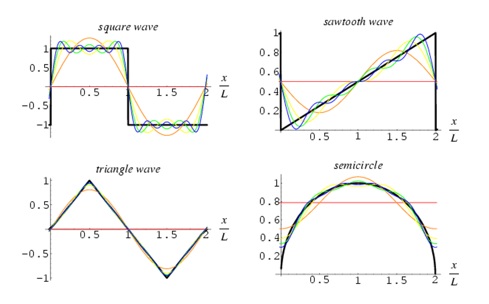
        

    === "例2"

        下面展现了不同频率正弦波分量的叠加过程：

        === "Step 1"

            

                
            

        === "Step 2"

            

                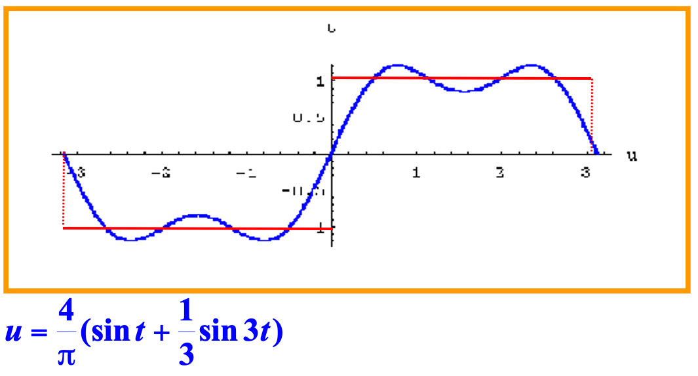
            

        === "Step 3"

            

                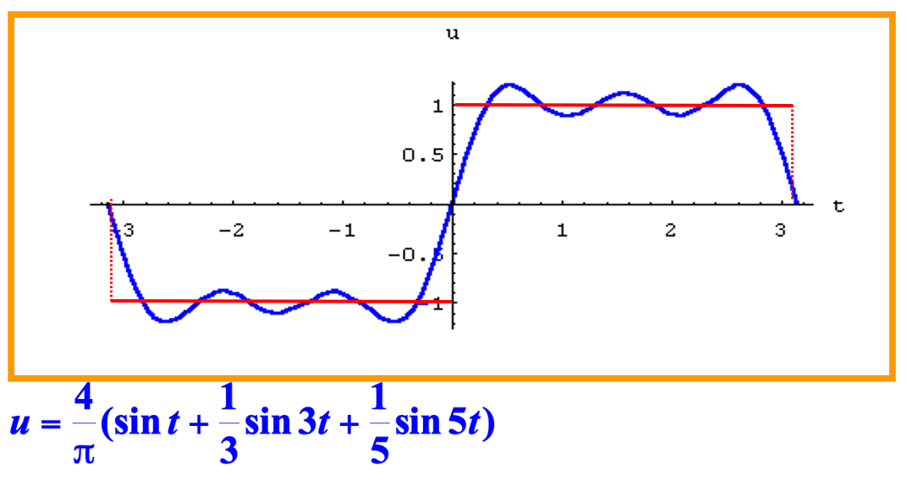
            

        === "Step 4"

            

                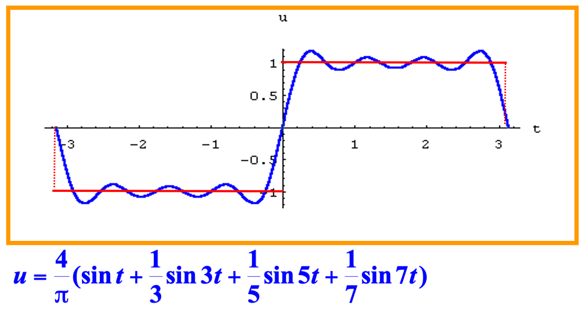
            

        === "Step 5"

            

                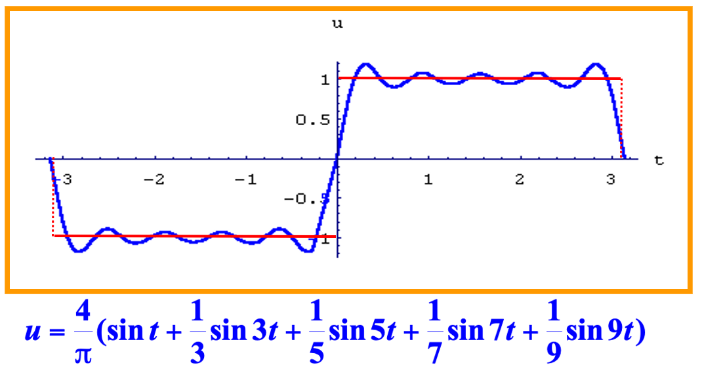
            

### Fourier Transform

**傅里叶变换**(Fourier transform)是一种对于在有限区间内的复杂傅里叶级数的泛化。

- 傅里叶分析 = **频率域**的分析，频率与$\sin (nx), \cos (nx)$中的$n$成正相关
- 傅里叶分析的一个缺点是正弦波和余弦波是无限长的，因此对于特定信号的分析，使用小波(wavelet)分析的方法更加合适
- 对于非周期函数,如果函数$f(x)$只在区间$[-\pi, \pi]$上,也可展开成傅氏级数（用到周期延拓的方法）

    ??? example "例子"

        

            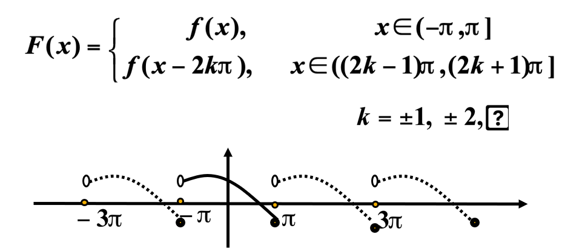
        
 

- 应用：
    - 生物统计学：假虹膜检测
    - 计算机图形学：抗锯齿

## Image Transform

很多时候，相比在一般的空间域(spatial domain)内，在**变换域**(transformed domain)内完成图像处理任务可能取得更好的效果。

图像变换的步骤为：

- 转换图像
- 在变换域内执行处理任务
- 通过逆变换(inverse transform)将图像还原到原来的空间域内

    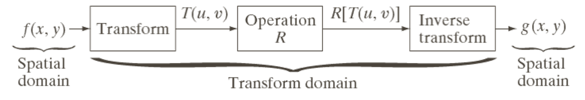

 

在变换图像的过程中会用到这些**变换核**(transformation kernels)：

- 前向变换(forwarding transform)：

$$
T(u, v) = \sum\limits_{x=0}^{M-1}\sum\limits_{y=0}^{N-1} f(x, y)r(x, y, u, v), u = 0, 1, \dots, M - 1,\ v = 0, 1, \dots, N - 1
$$

- 逆变换：

$$
f(u, v) = \sum\limits_{u=0}^{M-1}\sum\limits_{v=0}^{N-1} T(u, v)s(x, y, u, v), x = 0, 1, \dots, M - 1,\ y = 0, 1, \dots, N - 1
$$

### Continuous Fourier Transform

图像的频率：

- 低频对应变化缓慢的像素信息，比如连续的表面等
- 高频对应变化迅速的像素信息，比如物体的边缘等

??? example "例子"

    

        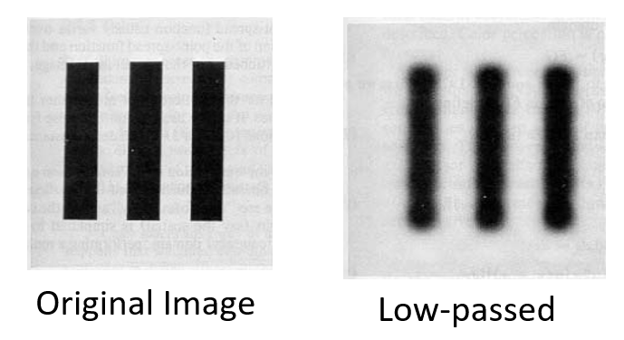
    
  

    右图是仅允许原图低频信号通过后的图像。

连续型的傅里叶变换是指将一个信号（或函数）从**空间域**变换到**频率域**上。

- 前递FT：$F(f(x)) = F(u) = \int_{-\infty}^{+\infty} f(x) e^{-\bm{j} 2\pi ux} \text{d}x$
- 逆FT(IFT)：$F^{-1}(F(u)) = f(x) = \int_{-\infty}^{+\infty} F(u) e^{\bm{j} 2\pi ux} \text{d}u$

其中$e^{\pm \bm{j} \theta} = \cos \theta \pm \bm{j} \sin \theta$

??? example "例子"

    === "<u>例1：移除不想要的频率</u>"

        要移除特定的频率，将对应的$F(u)$的系数设为0。

        

            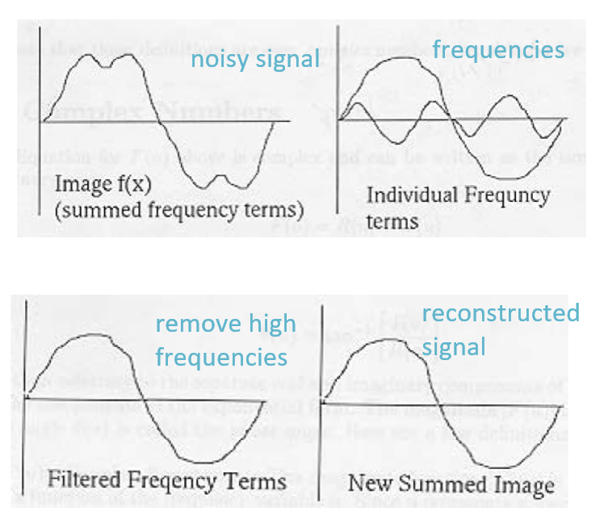
        
   

    === "例2：去除图像的噪点"

        

            
        
    

利用连续型FT实现频率滤波(frequency filtering)的步骤：

- 获得函数$f(x)$的傅里叶变换$F(f(x))$
- 去除不想要的频率：$D(F(f(x)))$
- 还原回原来的信号：$f(x) = F^{-1}(D(F(f(x))))$

### Discrete Fourier Transform

- 前向DFT：$F(u) = \sum\limits_{x=0}^{N-1} f(x) e^{-\frac{\bm{j} 2 \pi ux}{N}}, u = 0, 1, \dots, N - 1$
- 逆DFT：$f(x) = \dfrac{1}{N}\sum\limits_{u = 0}^{N - 1}F(u) e^{\frac{\bm{j} 2\pi ux}{N}}, x = 0, 1, \dots, N - 1$

### Fast Fourier Transform

由于离散傅里叶变换的计算中有很多重复的内容，如果可以避开这些冗余的计算，就可以加快傅里叶变换的速度。Cooley和tukey于1965年提出一种**快速傅里叶变换**(FFT)的方法：

- 将原始的N点序列依次分解为一系列短序列；
- 求出这些短序列的离散傅立叶变换；
- 组合出所需的变换值；
- 计算量（乘除法）：$2N^2 \rightarrow 2N \log N$

具体来说，<u>处理步骤</u>如下：

- 令$W_N^{n, k} = e^{-\frac{\bm{j}2\pi nk}{N}}$，那么原来的DFT表示为$F(k) = \sum\limits_{n=0}^{N-1}f(n) W_N^{n, k}$
- 假设$N$是2的正整数幂，令$N = 2M$，那么有：

$$
\begin{align}
F(k) & = \dfrac{1}{2M} \sum\limits_{n=0}^{2M-1} f(n) W_{2M}^{n, k} \notag \\
& = \dfrac{1}{2}\Big[\dfrac{1}{M} \sum\limits_{n=0}^{M-1}f(2n) W_{2M}^{2n, k} + \dfrac{1}{M} \sum\limits_{n=0}^{M-1}f(2n+1) W_{2M}^{2n+1, k}\Big] \notag
\end{align}
$$

- 通过化简可以得到：

$$
\begin{align}
W_{2M}^{2n, k} & = W_M^{n, k} \notag \\
W_{2M}^{2n+1, k} & = W_M^{n, k} \cdot W_{2M}^k \notag \\
\therefore F(k) & = \underbrace{\sum\limits_{n=0}^{M-1}f(2n) W_{M}^{n, k}}_{F_e(k)} + \underbrace{\sum\limits_{n=0}^{M-1}f(2n+1) W_{M}^{n, k}}_{F_o(k)}W_{2M}^k \notag \\
& = \lfloor F_e(k) + F_o(k)W_{2M}^k \rfloor, k = 0, 1, \dots, M - 1\notag
\end{align}
$$

- 若$k = M, M + 1, \dots, 2M - 1$，那么：

$$
\begin{align}
W_{M}^{n, k+M} & = W_M^{n, k} \notag \\
W_{2M}^{k+M} & = -W_{2M}^k \notag \\
\therefore F(k + M) & = \lfloor F_e(k) - F_o(k)W_{2M}^k \rfloor \notag
\end{align}
$$

文字解释：对一个长度为N的序列进行傅立叶变换，可以通过将其分成两半计算。对第一部分的计算需要通过计算两个长度为$\dfrac{N}{2}$长度序列的傅立叶变换式进行，然后利用这两个长度为$\dfrac{N}{2}$的序列可以得到第二部分的值。

### FT in 2D

- 连续型：
    - 前向FT：$F(f(x, y)) = F(u, v) = \int_{-\infty}^{\infty} \int_{-\infty}^{\infty} f(x, y) e^{-\bm{j} 2\pi (ux + vy)} \text{d}x\text{d}y$
    - 逆FT：$F^{-1}(F(u, v)) = f(x, y) = \int_{-\infty}^{\infty} \int_{-\infty}^{\infty} F(u, v) e^{\bm{j} 2\pi (ux + vy)} \text{d}u\text{d}v$

    ??? example "例子"

        

            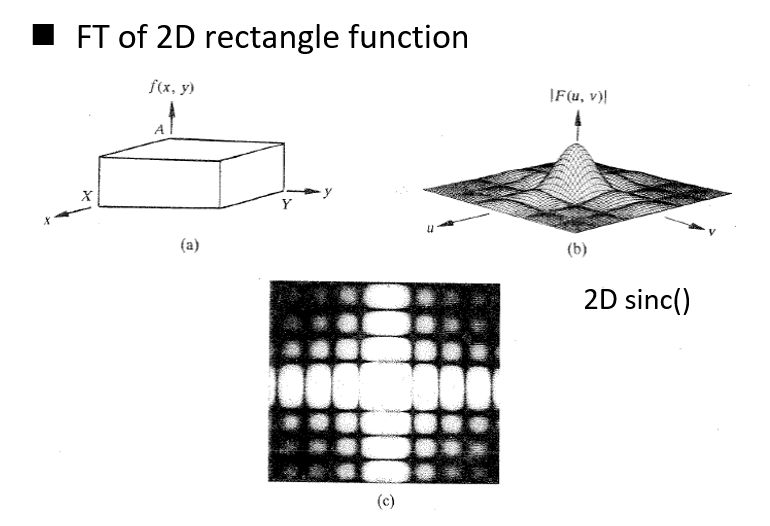
        
 

- 离散型（假设$f(x, y)$是$M \times N$的）：
    - 前向FT：$F(u, v) = \sum\limits_{x=0}^{M-1} \sum\limits_{y=0}^{N-1} f(x, y) e^{-\bm{j}2\pi (\frac{ux}{M} + \frac{vy}{N})}, u = 0, 1, \dots, M - 1, v = 0, 1, \dots, N - 1$
    - 逆FT：$f(x, y) = \dfrac{1}{MN} \sum\limits_{u=0}^{M-1} \sum\limits_{v=0}^{N-1} F(u, v) e^{\bm{j}2\pi (\frac{ux}{M} + \frac{vy}{N})}, x = 0, 1, \dots, M - 1, y = 0, 1, \dots, N - 1$
    - 可视化DFT：一般将$|F(u, v)|$的值进行可视化，但是一般情况下它的动态范围过大，因此需要进行适当的放缩（利用公式$D(u, v) = c \log(1 + |F(u, v)|)$，其中$c$为常数）：

    

        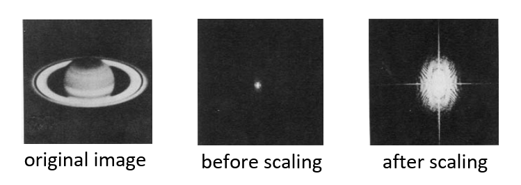
    
 

??? example "例子"

    === "<u>例1</u>"

        原图对应的振幅(magnitude)或相位(phase)如下所示：

        

            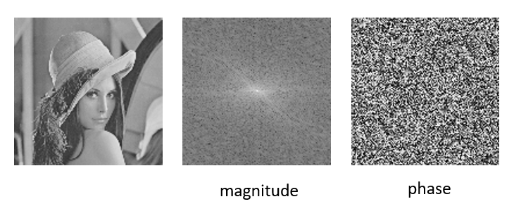
        
 

        

            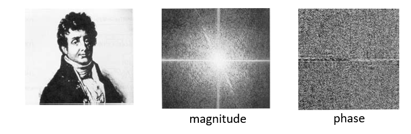
        
   

        如果只用傅里叶变换中振幅和相位的表示原图，会得到以下结果：

        - 只用振幅：振幅决定了每个分量的贡献值

        

            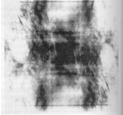
        
 

        - 只用相位：相位决定了分量是否存在

        

            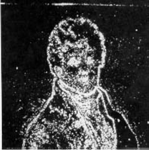
        
 

        结论：傅里叶变换中，**相位**比振幅更加重要，因为相位可以用来重建图像，但幅值不可以。

    === "例2"

        

            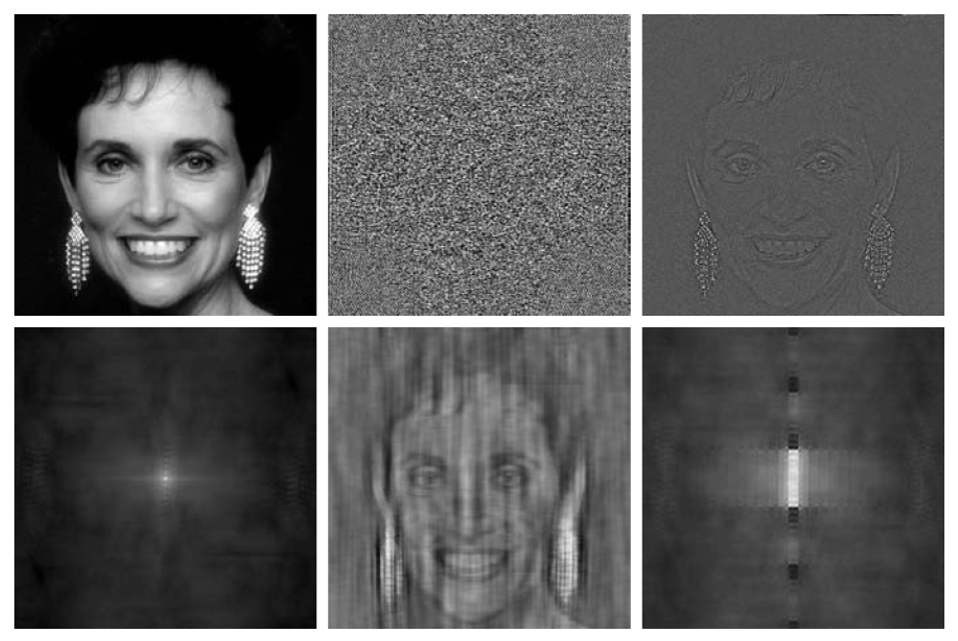
        
 

        从上到下，从左到右的图像依次为：

        - 女人
        - 相位角度
        - 只采用相位角度重建女人
        - 只采用幅值重建女人
        - 采用相位角度和右图方块提供的幅值重建女人
        - 采用方块的相位角度和女人的幅值重建结果

