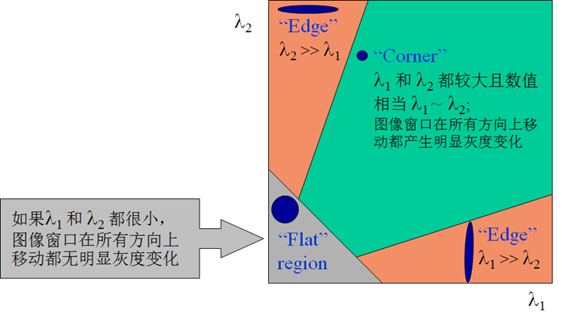
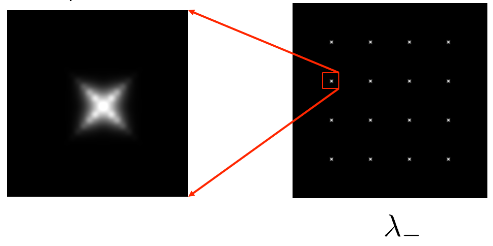

# Chap 7: Image Feature

??? abstract "核心知识"

    - 图像匹配
    - 特征点检测
        - 不变性
        - 哈里斯角点检测
        - 改进：哈里斯-拉普拉斯
    - 特征点描述
        - SIFT
        - SURF
    - 图像拼接
        - RANSAC
    - 图像混合（仅做了解）

## Image Matching

图像匹配的一般过程：

1. 在图像的兴趣点上定义一个坐标系（x, y轴）
2. 使用这个坐标系，在兴趣点附近得到一小块特征区域

    

## Feature Detection

**不变的局部特征**(invariant local features)：

- 即使在坐标系变化的情况下，算法找到的兴趣点和小块区域也应当保持大致不变
- 图像的**不变量**(invariance)有：
    - 几何不变量：平移、旋转、尺度...
    - 光学(photometric)不变量：亮度、曝光量...

    

对于图像而言，好的特征点应具备如下特点：

- 特征点是图像突出的地方
- 边缘、角点等都可以作为图像的特征点

### Harris Corner Detector

假设我们仅考虑图像中小窗口（可以在图像内移动）内的像素点，下面展示了三种可能情况（黄色区域表示窗口）：

    

- **平坦区域**(flat region)：无论向何种方向移动窗口，窗口内的像素都没有发生变化
- **边缘**(edge)：若沿着边的方向移动窗口，窗口内的像素没有发生变化
- **角点**(corner)：无论向何种方向移动窗口，窗口内的像素都会发生明显的变化

下面给出一种常见的特征点检测方法——**哈里斯角点检测器**(Harris corner detector)：

定量分析窗口内的像素变化：假定窗口$W$移动了$(u, v)$，我们通过计算窗口内每个像素变化的平方差(squared differences, SSD)之和来衡量窗口所有像素的改变量，记作误差$E(u, v)$，公式为：

$$
E(u, v) = \sum\limits_{(x, y) \in W}[I(x + u, y + v) - I(x, y)]^2
$$

强度$I$（像素值）的泰勒级数展开：

$$
I(x + u, y + v) = I(x, y) + \dfrac{\partial I}{\partial x}u + \dfrac{\partial I}{\partial y}v + \text{high order terms}
$$

如果移动量$(u, v)$很小，那么只需要一阶展开即可，后面的高阶项直接扔掉，即：

$$
\begin{align}
I(x + u, y + v) & \approx I(x, y) + \dfrac{\partial I}{\partial x}u + \dfrac{\partial I}{\partial y}v \notag \\
& \approx I(x, y) + \begin{bmatrix}I_x & I_y\end{bmatrix} \begin{bmatrix}u \\ v\end{bmatrix} \notag
\end{align}
$$

这里记$I_x = \dfrac{\partial I}{\partial x}, I_y = \dfrac{\partial I}{\partial y}$。

将其代入上面的误差公式，得到：

$$
\begin{align}
E(u, v) & = \sum\limits_{(x, y) \in W}[I(x + u, y + v) - I(x, y)]^2 \notag \\
& \approx \sum\limits_{(x, y) \in W}[\begin{bmatrix}I_x & I_y\end{bmatrix} \begin{bmatrix}u \\ v\end{bmatrix}]^2 \notag \\
& = \sum\limits_{(x, y) \in W} \begin{bmatrix}u & v\end{bmatrix} \underbrace{\begin{bmatrix}I_x^2 & I_x I_y \\ I_y I_x & I_y^2\end{bmatrix}}_{H} \begin{bmatrix}u \\ v\end{bmatrix} \notag
\end{align}
$$

最后得到的矩阵$H$相当有用：我们可以利用它的**特征值**(eigenvalue)和**特征向量**(eigenvector)来寻找某个窗口移动范围（一个圆圈）内误差的最值。

??? info "快速回顾：特征值&特征向量"

    ~~线性代数的知识忘完了~~

    满足以下公式的向量$\xi$是矩阵$A$的特征向量：

    $$
    A \xi = \lambda \xi
    $$

    特征向量$\xi$对应的特征值$\lambda$是一个标量，满足：$det(A - \lambda I) = 0$，其中$det$为行列式，$I$为单位矩阵。

    对于一个$2 \times 2$的矩阵$A = \begin{bmatrix}h_{11} & h_{12} \\ h_{21} & h_{22}\end{bmatrix}$，可以解得：

    $$
    \lambda_{\pm} = \dfrac{1}{2}[(h_{11} + h_{22}) \pm \sqrt{4h_{12}h_{21} + (h_{11} - h_{22})^2}]
    $$

    若特征向量为$\xi = \begin{bmatrix}x \\ y\end{bmatrix}$，那么可以用下面的公式算出$\xi$：

    $$
    \begin{bmatrix}h_{11} - \lambda & h_{12} \\ h_{21} & h_{22} - \lambda\end{bmatrix} \begin{bmatrix}x \\ y\end{bmatrix} = 0
    $$

规定：

- $x_+$：误差$E$增长量最大的方向（特征向量）
- $\lambda_+$：沿$x_+$方向上的增量（特征值）
- $x_-$：误差$E$增长量最小的方向（特征向量）
- $\lambda_-$：沿$x_-$方向上的增量（特征值）

    

那么可以得到：

$$
Hx_+ = \lambda_+ x_+ \quad \quad Hx_- = \lambda_- x_-
$$

因为$H$是一个对称矩阵，那么$H = R^{-1} \begin{bmatrix}\lambda_1 & 0 \\ 0 & \lambda_2\end{bmatrix} R$。

二次函数$E(u, v)$的几何意义是一个**椭圆**，椭圆的曲率和尺寸可由它的特征值$\lambda_1, \lambda_2$表示，椭圆的方向由对应的特征向量表示

    

---
用该工具寻找图像特征点（这里特指角点）的方法：

- 计算图像上每个像素点的梯度值
- 根据梯度得到矩阵$H$，并计算其特征值$\lambda_1, \lambda_2$
    - 简单的判断依据：
        - 当$\lambda_1, \lambda_2$**都很大**时，该像素点为**角点**
        - 当$\lambda_1, \lambda_2$都很小时，该像素点位于平坦区域
        - 一个大一个小时，该像素点位于边缘

        

            
        

- 寻找响应值$R_{-}$较大的像素点
    - 在判断角点时，无需具体计算矩阵$H$的响应值，而通过下列公式获取近似的响应值：

        $$
        \begin{align}
        f & = \dfrac{\lambda_1 \lambda_2}{\lambda_1 + \lambda_2} \notag \\
        & = \dfrac{\text{determinant}(H)}{\text{trace}(H)} \notag
        \end{align}
        $$

        - **迹**(trace)是矩阵主对角线元素之和，比如对于$2 \times 2$的矩阵，$\text{trace}(H) = h_{11} + h_{22}$
        - $f$称为**哈里斯算子**(Harris operator)，其值与$\lambda_-$非常接近，但是前者的计算成本更低（没有平方根）

- 将这些像素点（它们的响应值$R_{-}$是局部极大的）作为特征点

??? example "例子"

    === "例1"

        

            
        

        

            
        

    === "例2"

        原图：

        

            
        

        用颜色区分图像的f值，越红表示f值越大，越蓝表示f值越小：

        

            
        

        找到两张图共有的特征点：

        

            
        

---
哈里斯角点检测器得到的特征点具备如下性质：

- **旋转不变性**(rotation invariance)
    - 旋转椭圆时，椭圆的形状（即特征值）保持不变。因此在图像的旋转过程中，角的响应值$R$保持不变

    

        
    
   

- **加法和数乘光强**(intensity)改变具备部分的不变性
    - 光强移动：$I \rightarrow I + b$
    - 光强缩放：$I \rightarrow aI$

    

        
    
  

- 仿射不变性

- 但**不具备尺度不变性**

    

        
    
   

    - 不同尺度比率下的哈里斯检测器的效果

### Scale Invariant Detection

???+ question "思考"

    对于图像的某个像素点，考虑其周围不同大小的区域（用以该像素点为中心点的圆表示）：

    

        
    
 

    可以看到，虽然这两幅图的尺度比例不同，但是左图最大的区域在图像中的比例和右图区域在图像中的比例看起来是一样的。

    如何在图像上独立地选取不同像素点对应的区域？

    

        
    

解决方案：

- 设计一个关于区域（圆圈）的**尺度不变**(scale invariant)的函数，
- 对于图像的一个像素点，我们将其看作一个关于区域大小（即圆圈半径）的函数

    

- 共同的方法：取函数的**局部极大值**，因为它可以作为图像缩放过程中的不变量
- 需要注意的是每个图像的尺度不变量区域大小是相互独立的
- 一个好的函数应该**只有一个峰值**，一般来说好的函数与图像的**对比度**(contrast)相关

    

---
**局部极值检测**(local extrama detection)：将图像的某个像素点与它在三个尺度上的26个邻居像素点进行比较。

    

方向(orientation)：

- 梯度：$m(x, y) = \sqrt{(L(x + 1, y) - L(x - 1, y))^2 + (L(x, y + 1) - L(x, y - 1))^2}$
- 角度：$\theta (x, y) = a \tan 2(\dfrac{L(x, y + 1) - L(x, y - 1)}{L(x + 1, y) - L(x - 1, y)})$
- 方向的选择：

    

   
假设我们比较图像$I_1$和$I_2$，且$I_2$是$I_1$变换版本。无论它们之间发生何种变换，我们希望找到这两幅图相同的特征点，这称为**变换不变性**(transformational invariance)。有很多的特征方法可以处理平移、二维旋转、尺度等变换的不变性，甚至可以处理局部的三维旋转、仿射变换、亮度/对比度改变等。

---
尺度不变的图像侦测算法有：

    

- 这两种算法的思路大致相同：$f = \text{Kernel} \times \text{Image}$，且它们的核在尺度和旋转过程中保持不变
- 但是它们的核(kernel)（或窗口）的计算方法不太一样：
    - 拉普拉斯算法：$L = \sigma^2(G_{xx}(x, y, \sigma) + G_{yy}(x, y, \sigma))$
    - 高斯函数差(DoG)：$DoG = G(x, y, k \sigma) - G(x, y, \sigma)$ 
    - 其中高斯函数为$G(x, y, \sigma) = \dfrac{1}{\sqrt{2 \pi} \sigma} e^{-\frac{x^2 + y^2}{2 \sigma^2}}$

### Harris-Laplacian

操作步骤：

- 初始化：多尺度(multiscale)的哈里斯角检测
- 基于拉普拉斯算子$\nabla^2 g = \dfrac{\partial^2 g}{\partial x^2} + \dfrac{\partial^2 g}{\partial y^2}$，进行尺度的选择
    - 特征函数f：拉普拉斯-高斯 = blob 检测器

    

        
    

    - 对于图像的每个像素点，我们将能够产生拉普拉斯值峰值的尺度比例称为**特征比例**(characteristic scale)

    

        
    

??? example "例子"

    === "例1"

        

            
        

    === "例2"

        

            
        

## Feature Description

### SIFT

**尺度不变特征变换**(scale invariant feature transform, SIFT)

- 提取SIFT的过程：

    

        
    

- 重点考虑最后的**SIFT描述器**(descriptor)，它能在旋转过程中保持不变
    - 大致思想：
        - 根据像素点的主梯度方向(dominant gradient orientation)来旋转其周围区域(patch)
        - 这可以使这块旋转的区域位于规范的(canonical)方向上
    - 具体操作：
        - 选取特征点周围的$16 \times 16$大小的方形窗口
        - 对于窗口内每个像素点计算边的方向（梯度的角度 - $90 \degree$）
        - 将（小于梯度幅度的）弱边扔掉
        - 根据剩余边的方向创建一张直方图：

        

            
        
  

    - 完整版本：
        - 将$16 \times 16$的窗口分为$4 \times 4$的小块
        - 对每个小块计算方向的直方图
        - 16个小块 * 8个方向 = 128维的描述器  
        - 最后需要对图像进行归一化，以减小亮度改变对图像的影响   

??? example "例子"

    视觉单词包(bags of "visual words")：基于采集到的图像，利用高斯差分法检测感兴趣点，提取SIFT特征。然后将提取的描述符聚类，使用分层k-means聚类生成词汇树。将每个聚类中心称为视觉单词(visual word)。

    

        
    
  

    

        
    
   

???+ abstract "SIFT的优缺点"

    - 优点：
        - 在进行缩放、旋转、改变亮度等变换时保持不变性
        - 局部区域具有很强的区分性和表征能力
        - 表现刚性物体时非常有效

    - 缺点：
        - 提取特征耗时过长
            - 对应一幅大小为$400 \times 400$的图像，平均需耗时1s
        - 对于非刚性物体表现较差
            - 如人脸、动物等。
        - 在严重的仿射失真下可能无法工作
            - 局部区域是一个圆，而不是调整到仿射失真的一个椭圆

### SURF

**加速鲁棒特征**(speeded up robust features)算法：

- 兴趣点**检测器**(interest point detector)：
    - 计算**积分图像**(integral image)

        

            
        
 

        - 像素点$(x, y)$与原点间矩形区域的像素和：$S(x, y) = \sum \sum I(x, y)$
        - 对于图像上任意矩形区域（如上图的矩形ABDC），计算公式为（$(l, t)$和$(r, b)$分别为矩形左上角和右下角的像素点坐标值）（能在$O(1)$时间内完成计算！）：

        $$
        V(l, t, r, b) = S(l, t) + S(r, b) - S(l, b) - S(r, t)
        $$   

    - 应用**二阶导数滤波器**（可近似）对图像进行滤波操作

        

            
        
 

        - 改变尺度：积分图像允许我们能提高滤波器的采样率

        

            
        

    - **非极大抑制**(non-maximal suppression)
        - 在$(x, y, s)$空间中找到局部极大值

        

            
        

        - 仅保留那些大于其26个邻居像素点值的像素点

        

            
        

    - **二次插值法**(quadratic interpolation)
        - 对于每个局部极大值，需要通过插值来得到真实的位置（以克服离散化带来的影响）
        - Hessian值：$H(x, y, \sigma)$
        - 泰勒展开式：$H(x) = H + \dfrac{\partial H^T}{\partial x}x + \dfrac{1}{2}x^T \dfrac{\partial^2 H}{\partial x^2}x$
        - 使用牛顿法求解得：$\hat{x} = -\dfrac{\partial^2 H^{-1}}{\partial x^2} \dfrac{\partial H}{\partial x}$，其中

        $$
        \dfrac{\partial H}{\partial x} = \begin{bmatrix}d_x \\ d_y \\ d_s\end{bmatrix} \quad \quad \dfrac{\partial^2 H}{\partial x^2} = \begin{bmatrix}d_{xx} & d_{yx} & d_{sx} \\ d_{xy} & d_{yy} & d_{sy} \\ d_{xs} & d_{ys} & d_{ss}\end{bmatrix}
        $$

- 兴趣点**描述器**(interest point descriptor)：
    - 将窗口划分为$4 \times 4 = 16$个小窗口
    - 计算Haar小波输出
    - 对每个小窗口
        - 测量25个地方的$dx$和$dy$，累加得到4个值：$\sum dx, \sum dy, \sum |dx|, \sum |dy|$
        - 计算$v_{\text{subregion}} = [\sum dx, \sum dy, \sum |dx|, \sum |dy|]$
    - 这会产生一个有64个元素的描述器

    

        
    

???+ question "<u>为什么SURF的效果比SIFT好？</u>"

    - SURF在SIFT的基础上进行了优化，使用了加速的计算方法（Haar小波、Hessian矩阵、积分图），使得它在计算效率上优于SIFT
    - 同时SURF具备不错的鲁棒性

## Image Stitching

全景图(panorama)的拼接过程：

- 检测所有图片的特征点
- 找到图片之间共同的特征点
- 用这些点来对齐图片，形成全景图

??? example "例子"

    === "缝合前的两张图"

        

            
        

    === "缝合后的全景图"

        

            
        

具体步骤：

- 检测特征点
- 建立[SIFT描述器](#sift)
- 匹配SIFT描述器
- 拟合[几何变换](4.md)矩阵
    - 二维变换

    

        
    

    - 拟合的变换矩阵：$H = \begin{bmatrix}h_{11} & h_{12} & h_{13} \\ h_{21} & h_{22} & h_{23} \\ 0 & 0 & 1\end{bmatrix}$，一张图像上所有像素点共享这个变换矩阵
    - $y = Hx$，理论上至少有3个不共线的点就可以求出$H$，但由于实际误差，3个点求解不够精确

    - 最小二乘法(least square)

- RANSAC

### RANSAC

**随机采样一致**(RANdom SAmple Consensus)算法：

- 用于避免离群点(outlier)带来的影响，仅关心**内在点**(inlier)
    - 如果离群点被选中计算当前的匹配，那么回归出来的线肯定不足以支撑剩下点的匹配，和通过内在点得到的线有很大的差异。
- 该算法是一种循环：
    - 随机选择一组种子点，作为变换估计的基础
    - 从种子组中进行变换计算
    - 找到变换中的内在点
    - 如果内在点的数量足够大，那么就要重新计算所有的内在点的最小二乘法估计
    - 保存内在点最多的那次变换

??? example "例子"

    RANSA的线性匹配：找到最佳（包含最多内在点）的直线

    === "Step 0"

        

            
        

    === "Step 1"

        

            
        

    === "Step 2"

        

            
        

    === "Step 3"

        

            
        

    === "Step 4"

        

            
        

    === "Step n"

        

            
        

算法的伪代码如下：

    

确定采样次数：

- 假设$w$为内在点的比例（直线上的点），需要$n$个用于定义假设的点（直线需要两个点），选择$k$个样本
- 可能对$n$个点的单个采样就是正确的：$w^n$
- 可能$k$次采样都失败了：$(1 - w^n)^k$
    - 需要选择足够大的$k$值，以保持其位于预期失败率以下

    

        
    

在RANSAC之后：

- RANSAC将数据划分为内在点和离群点，并根据内在点的极小集合得到估计值
- 通过估计所有内在点来提升这个初始的估计值（使用标准最小二乘极小化）
- 但这可能会改变内在点，因此需要重新归类内在点和离群点

    

RANSAC的优缺点：

- 优点：
    - 对于模型拟合问题是一种通用的方法
    - 容易实现，容易计算失败率

- 缺点：
    - 只能解决具有适量比例的离群点的情况，否则的话计算成本较大
        - 但很多实际问题中的离群点的比例较高（但有时挑选策略可以有帮助，而非随机选取）
        - 一种投票策略，Hough变换可以应对高比例离群点的情况
    - 多参数花费高

## Image Blending

图像混合(image blending)：

- 「金字塔」(pyramid)的创建：

    

        
    

- 空间域的「八度音符」(octaves)：

    

        
    

??? example "例子"

    === "例1"

        

            
        

    === "例2"

        

            
        
