# Chap 8: Deep Learning

??? abstract "核心知识"

    - 神经网络的基本知识
    - 卷积神经网络
        - 卷积层（滤波器）
        - 池化层
            - Coda-convnet
        - 全连接层（分类）

!!! recommend "推荐资源"

    强烈安利读者观看3b1b的[“神经网络”系列视频](https://www.youtube.com/playlist?list=PLZHQObOWTQDNU6R1_67000Dx_ZCJB-3pi)，讲得相当生动和清楚，比直接啃PPT的感觉好太多了。由于时间原因，我暂时来不及根据3b1b的视频整理这部分的笔记，看之后能不能补上（大概率不会鸽的，因为下学期还得学CV，还会讲到CNN的）。

## Introduction

传统的识别方法：

    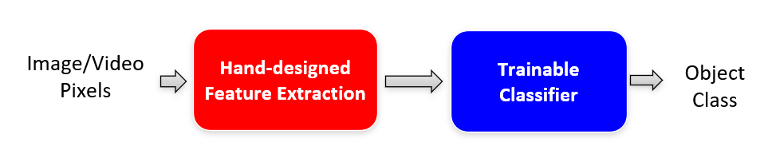

- 特征是不可学习或训练的
    - 然而特征是图像识别取得进步的关键
    - 很多对于特定任务的特征都是手工设计的，但是手工需要专家花费巨大的努力
- 分类符(classifiers)一般是可训练的，比如SVM，HMM等

学习特征的原因：

- 找到对于具体识别任务中更适合的特征，以取得更好的表现
- 对于难以通过手工设计特征的领域而言，学习特征十分有必要，比如[Kinect](https://en.wikipedia.org/wiki/Kinect)、视频、多光谱(multi-spectrum)等
- 考虑特征的计算时间：
    - 识别过程中一般需要定义和提取大量的特征点
    - 对于大型的数据集而言，花费时间过长（10s一张图）

特征学习的模型：

    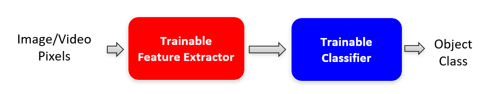

（特征学习/深度学习/表征学习）关键思想：

- 从数据中学习统计结构和数据的相关性
- 习得的表征(representation)可用作识别任务的特征
- 2006年以来，深度学习在学习特征或表征中越来越流行，原因有：
    - 理论支持：电路设计中的深度-广度权衡(depth-breadth tradeoff)，采用更深层的结构，可以更加高效地表征很多功能

        

            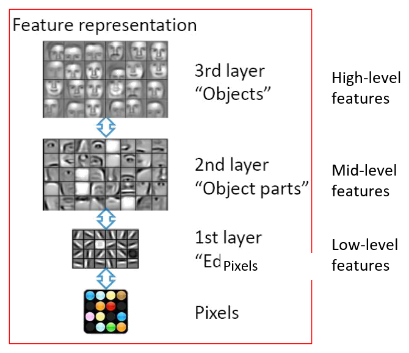
        

        - 深层的结构可被高效地表征
        - 从低层级向高层级的结构传播较为自然
        - 低级的表征可在多个任务间共享

    - 生物学支持：视觉皮层是分层的(hierarchical)
    - 数据支持：大数据集，方便的收集和存储
    - 硬件支持：GPT、集群

## Convolutional Neural Network

### Basics

**卷积神经网络**(convolutional neural network, CNN)是深度学习中一种著名的方法。

使用CNN的原因：

- 是少数能够在监督下训练的深度模型之一
- 易于理解和实现
- 应用广泛：
    - 赢得了很多比赛
    - 被部署于很多实际应用中，包括图像识别、语音识别、Google和百度的照片标记器(tagger)
    - 应用于数组数据中（邻近的数据往往是相关的）

神经元：对突触的观测值连到汇总的地方，并进行加权求和，通过激活函数（归一化后）产生输出，本质上就是一个函数。

    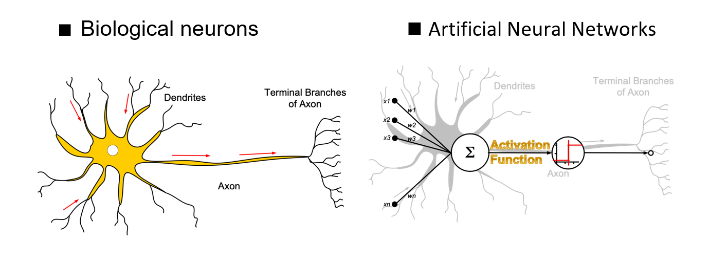

    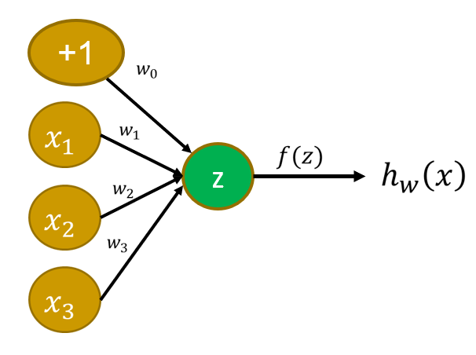

- 输入：$x_1, x_2, x_3$
- 输出：$h_w(x)$
- 令$X = [1\ x_1\ x_2\ x_3]^T, w = [w_0\ w_1\ w_2\ w_3]^T$，那么$z = w^TX = w_0 + w_1x_1 + w_2x_2 + w_3x_3$
- $h_w(x) = f(z) = f(w^TX)$

常见的**激活函数**(activation function)有：

- S形(sigmoid)（逻辑）：$f(z) = \dfrac{1}{1 + e^{-z}}$
- 双曲切线(hyperbolic tangent)：$f(z) = a \cdot \tanh (b \cdot x)$
- 平方：$f(z) = z^2$
- 线性：$f(z) = az + b$
- ReLU：$f(z) = \max(0, z)$

    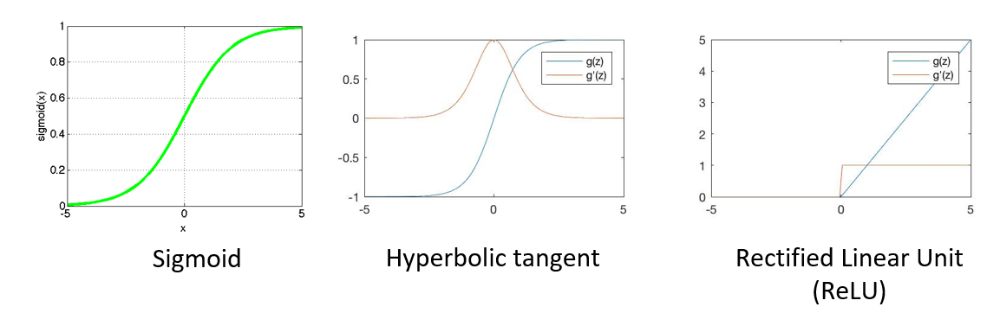

    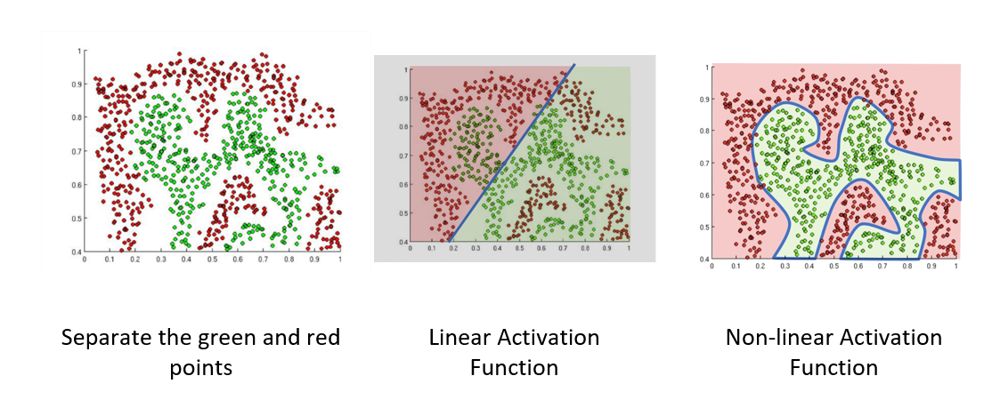

多层神经网络：

    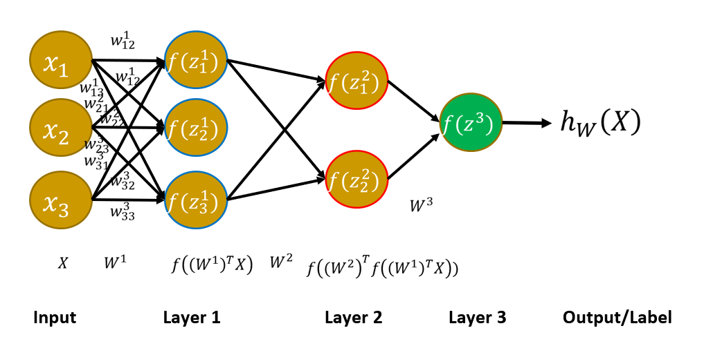

<u>求解方法：**[反向传播](https://en.wikipedia.org/wiki/Backpropagation)**(back-propagation, BP)</u>

1. 随机初始化权重，计算$h_w(X)$
2. 计算误差$E = (h_w(X) - y)^2$
3. 根据这个误差值，从最后一层开始向前修改每一层的权重值
    - 利用递推式$W_k = W_{k-1} - \varepsilon \dfrac{\partial E}{\partial w}$，具体来说，对于第$k$层的某个权重值$w_{ij}$而言，$w_{ij}^{(k)} = w_{ij}^{(k - 1)} - \varepsilon \dfrac{\partial E}{\partial w_{ij}^{(k - 1)}}$（最后一项由**梯度下降法**得到，从应试角度来说不必深究其原理）

???+ example "例子"

    下图展示信号在网络间的传播，$w_{xm}n$表示输入$x_m$和输入层的神经元$n$之间的连接的权重，$y_n$表示神经元$n$的输出信号。

    === "神经元1"

        

            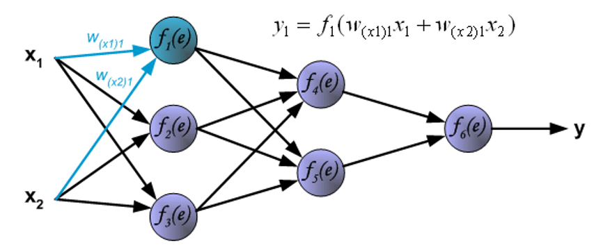
        

    === "神经元2"

        

            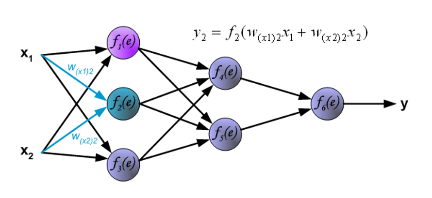
        

    === "神经元3"

        

            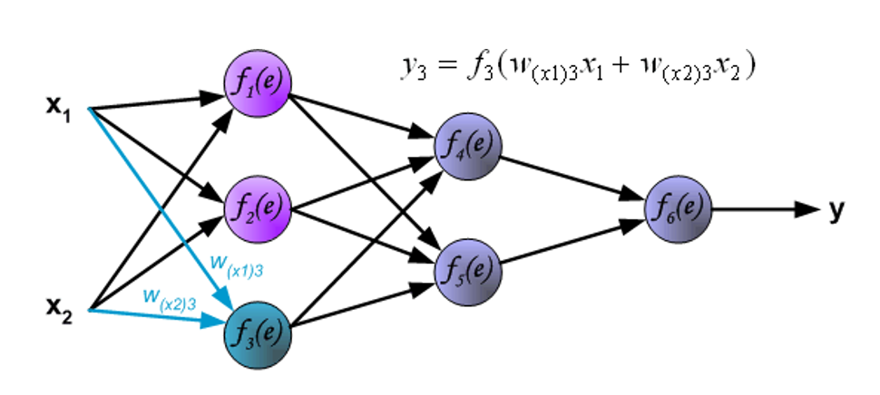
        

    现在进入内层的传播了。$w_{mn}$表示输出神经元$m$与下一层的输入神经元$n$之间的连接的权重。

    === "神经元4"

        

            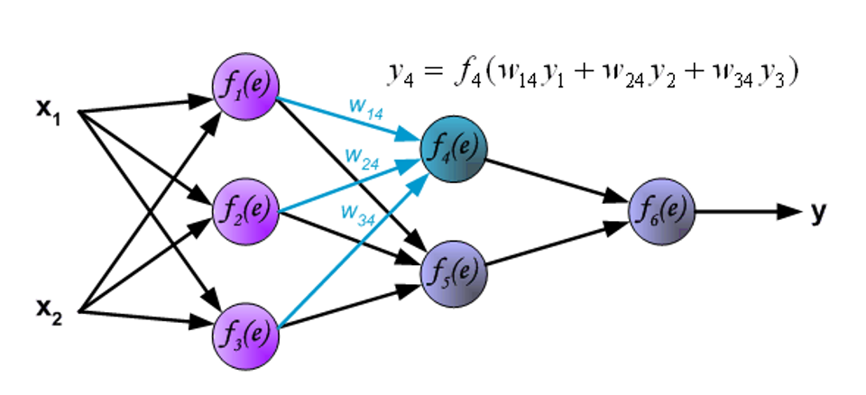
        

    === "神经元5"

        

            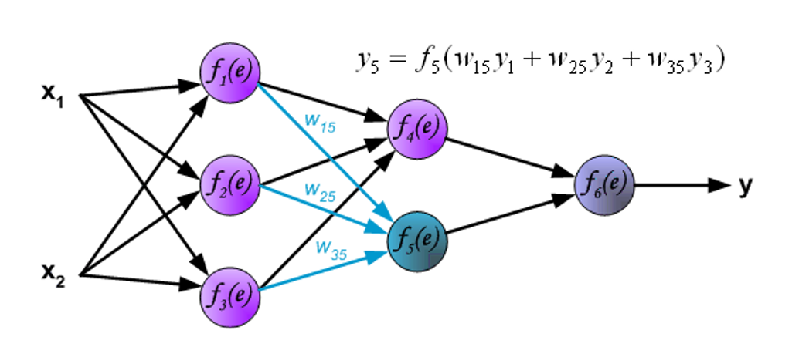
        

    信号被传送到输出层。

    

        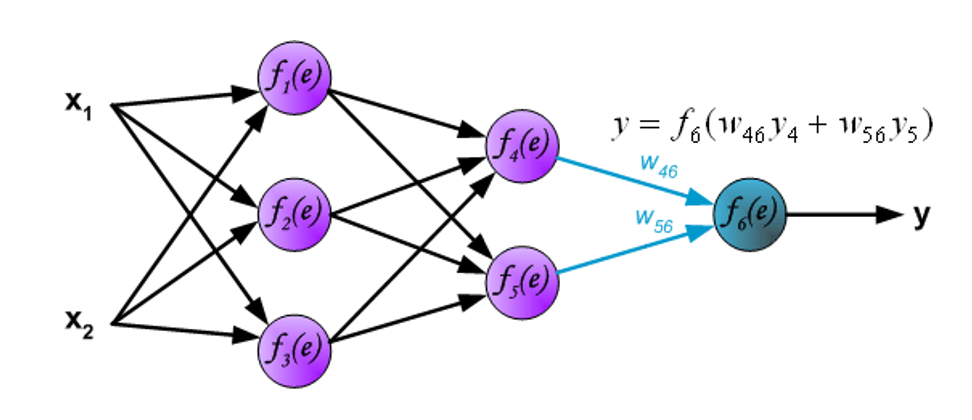
    

    现在将在网络中$y$的输出信号与预期输出值（目标，来自训练好的数据集）$z$进行比较，它们的差值称为输出层神经元的误差信号$d$。

    

        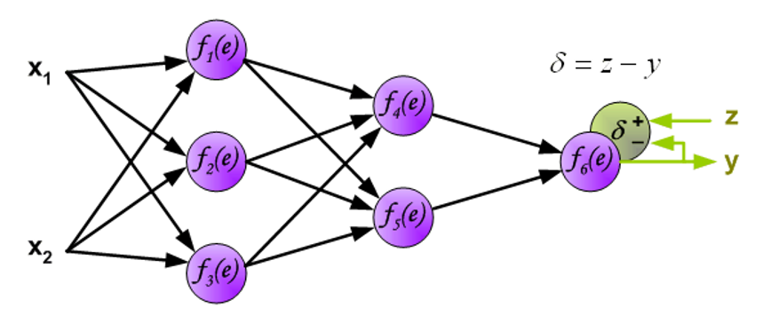
    

    然后将误差信号反向传递至所有的神经元，此时原来的输出信号将作为输入。

    === "神经元4"

        

            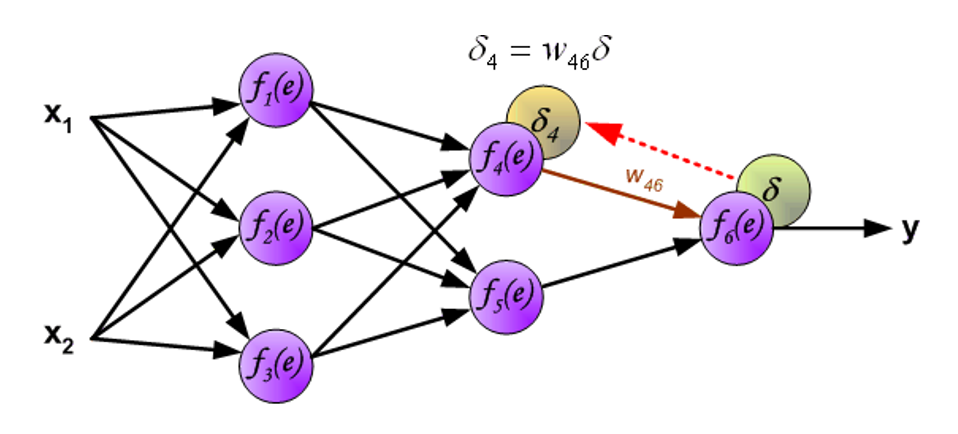
        

    === "神经元5"

        

            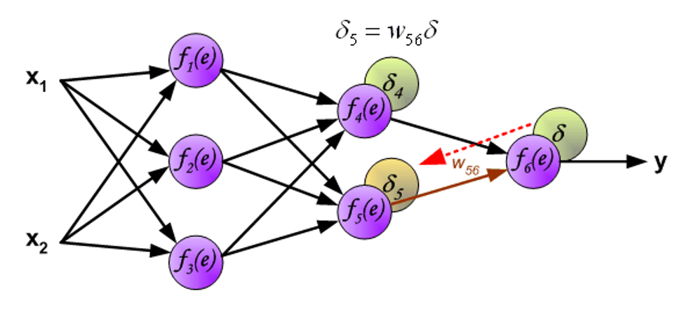
        

    用于反向传递误差的权重系数$w_{mn}$等于在计算输出值时用到的权重值，改变的只是数据流方向。这种方法可用于所有的网络层。如果被传递的误差来自多个被加入的神经元，那么处理方式如下所示：

    

        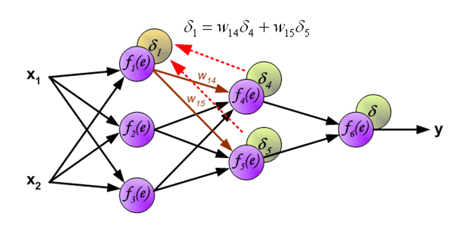
    
   

    当每个神经元的误差计算完毕时，每个神经元输入节点的权重系数可能需要被修改。在下面给出的公式中，$\dfrac{\text{d}f(e)}{\text{d}e}$表示神经元激活函数的导数。

    === "神经元1"

        

            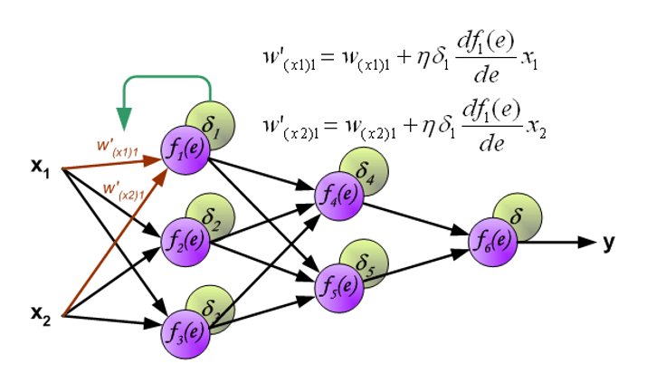
        

    === "神经元2"

        

            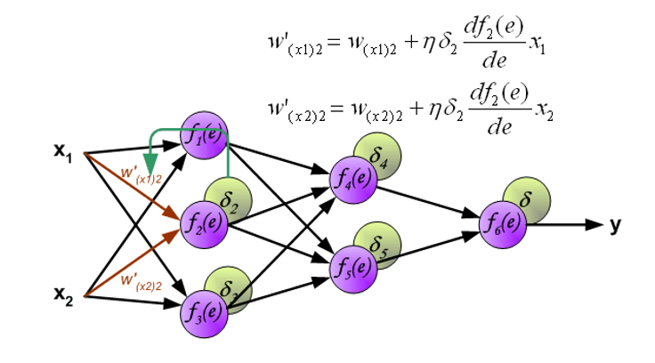
        

    === "最后"

        

            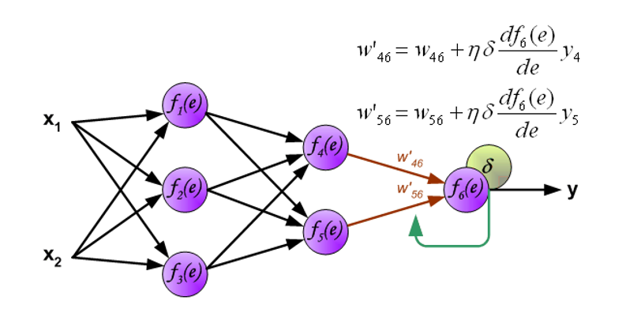
        

### Convolution

!!! bug "传统深度学习的挑战"

    以一幅$200 \times 200$的图像为例，如果采用一般的神经网络来训练（全连接层），那么需要$N \times N$，即$40000$个内部单元，从输入到第1层的参数共有$40000 \times 40000$个，因此训练效率低、成本大，不太现实。

解决方法：

- **卷积**：
    - 采用了**局部连接**，每个神经元其实没有必要对全局图像进行感知，只需要对局部进行感知，然后在更高层将局部的信息综合起来就得到了全局的信息
    - **权值共享**，把每个卷积核当作一种特征提取方式，而这种方式与图像等数据的位置无关。这就意味着，对于同一个卷积核，它在一个区域提取到的特征，由于图像的特征是稀疏的，也能适用于于其他区域
- **池化**，降采样，只提取一些重要的特征，经过池化层之后，模型参数会减少很多

- 在图像某个部分有用的特征可能在其他地方也有用（稀疏表征）

??? example "例子：$200 \times 200$的图像"

    - 10个大小为$10 \times 10$的滤波器
    - 10张大小为$200 \times 200$的特征图
    - $400000$个内部单元，有$10 \times 10$个字段 = $1000$个参数

    因此计算量得到减小！

    !!! question "为何用10个滤波器"

        - 在每个位置上检测多个图案(motifs)
        - 关注相同区域的一组单元与这块区域对应的特征向量(feature vector)是相似的
        - 结果是一个3D数组，每一个切片是一个特征图

    

        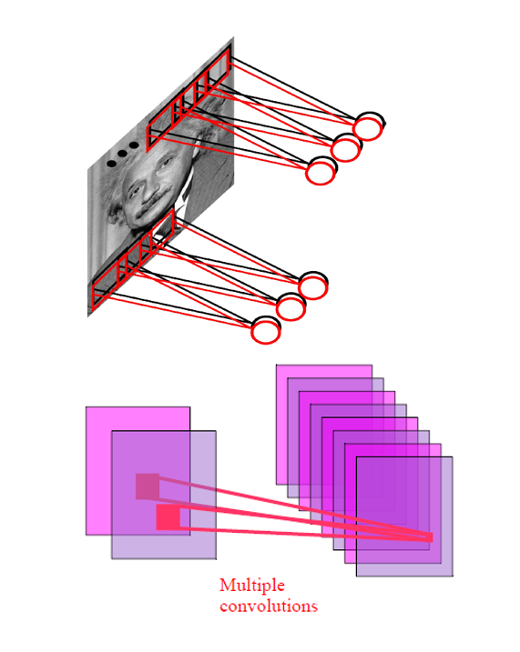
    

### Pooling

**池化**(pooling)是CNN中用于对特征图进行降维和信息提取的操作（降采样），通过减少数据量，提高了模型的计算效率，并保留主要特征，同时增强了特征的不变性（包括平移、旋转、尺度等）。

- 空间池化
    - 池化窗口的区域可以重叠，也可以不重叠
    - 分类：
        - 平均池化：在池化窗口中计算所有元素的平均值作为输出
        - 最大池化：在池化窗口中选择最大值作为输出

    

        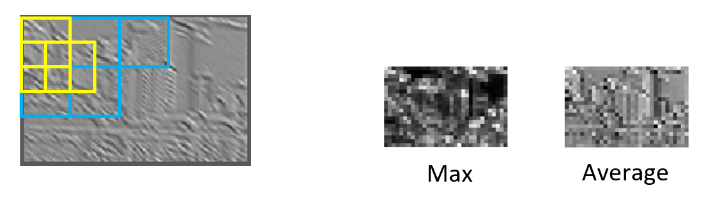
    

    - 通常结合二次抽样(subsample)

- 根据特征图池化
    - 跨特征比较的额外形式
    - 最大池化
    - 应用
        - 找到唯一特征
        - 减少变体

    

        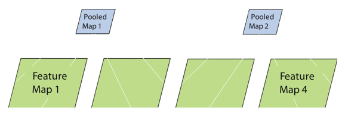
    

### Cuda-convnet

- 尽管卷积和池化/二次采样能够有效减少变体，但是训练CNN耗时太久，因此采用cuda-convnet这一改进方法
- 代码：[cuda-convnet](https://code.google.com/archive/p/cuda-convnet/)

    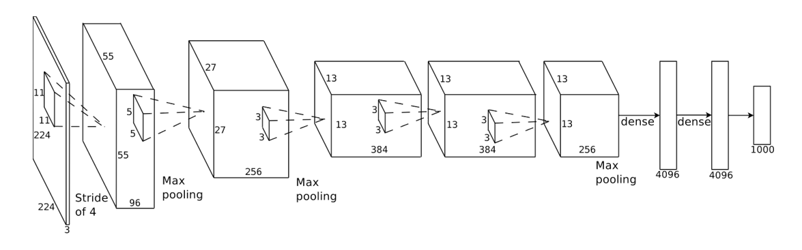

- 特征：
    - 用两个英伟达的GPU，并使用梯度下降法进行训练，需要花一周的时间（@ImageNet）
    - 650,000个神经元
    - 60,000,000个参数
    - 七个内含“权重”层
    - 最终的特征层：4096维
    - 圆圈表示卷积层：使用一组3D滤波器对输入进行卷积，然后应用S型激活函数
    - 方框表示全连接层：对输入应用线性滤波器，然后应用S型激活函数

    

        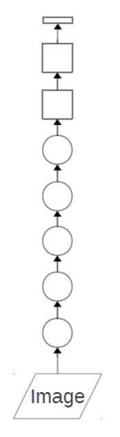
    

- 过程：

=== "Input -> C1"

    

        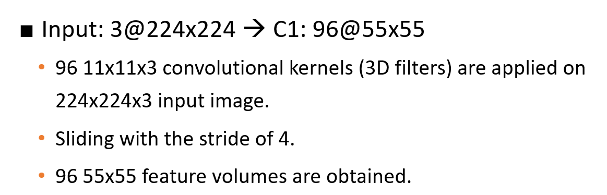
    

=== "C1 -> C2"

    

        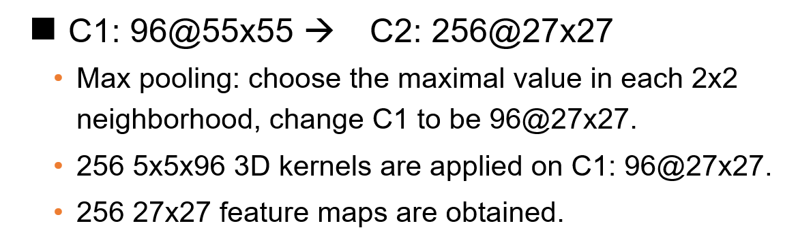
    

=== "C2 -> C3"

    

        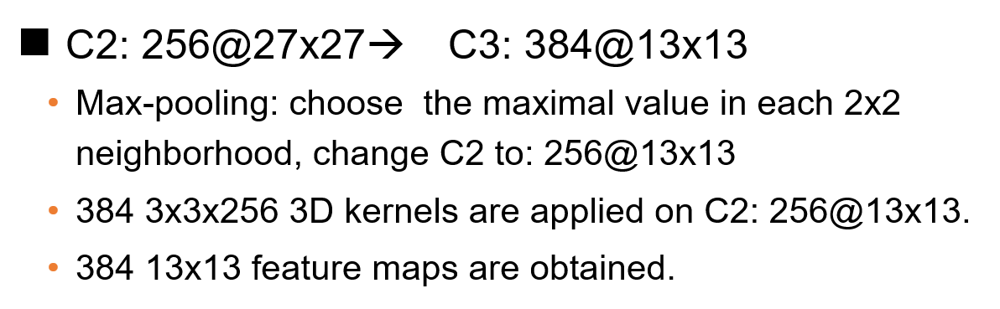
    

=== "C3 -> C4 -> C5"

    

        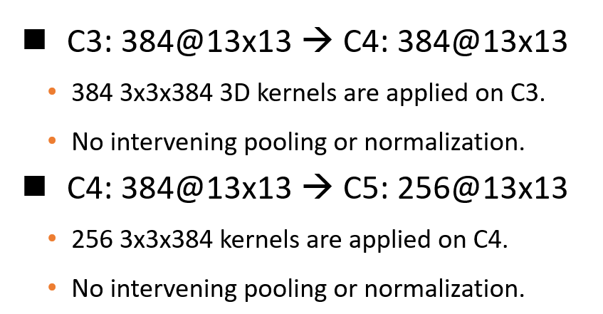
    

=== "C5 -> F6"

    

        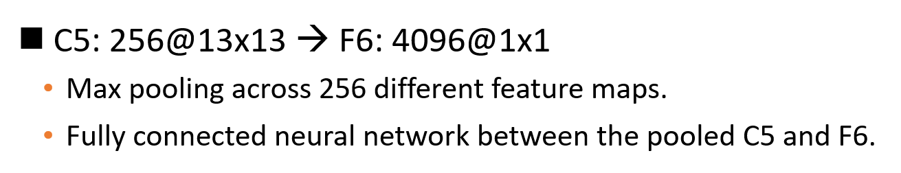
    

=== "F6 -> F7 -> Output"

    

        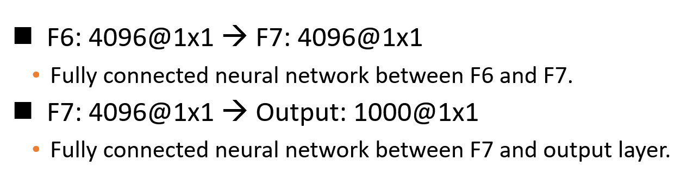
    

## Convolution-based Classification Algorithm

将卷积的特征提取功能与分类算法的图像分类相结合，我们得到了一种基于卷积的**分类**(classification)算法。

完整的工作流：

    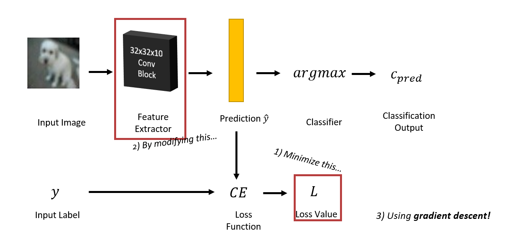

- 分类器会从特征提取器中挑选分数最高的结果作为分类依据

    

        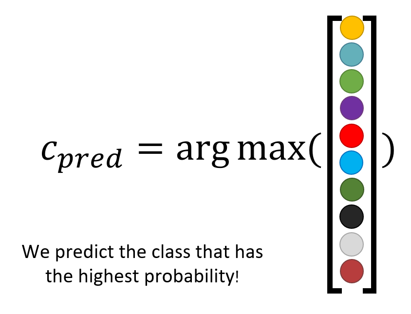
    

- 特征提取器(feature exactor)
    - 先来看特征提取器的功能：

        

            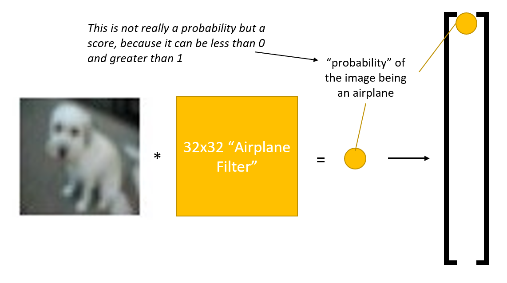
        

        - 对于一张图片，需要使用多种不同的滤波器，每个滤波器代表一类图像，图片与滤波器的运算结果是一个“概率”值，但是这个“概率”可以<0或>1，因此更确切的说法是“分数”
        - 最终结果（得到一组概率值，构成一个一维向量）：

        

            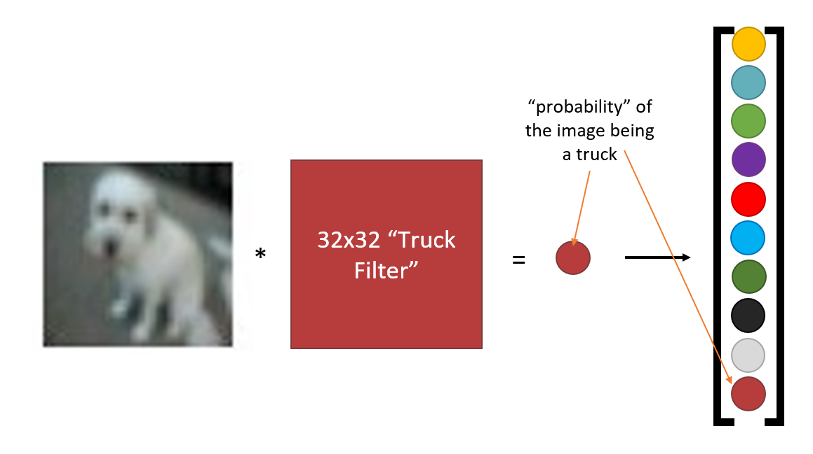
        

        - 更抽象的理解：
            - 单个滤波器的计算：向量乘法

            

                
            

            - 多个滤波器的计算：矩阵乘法

            

                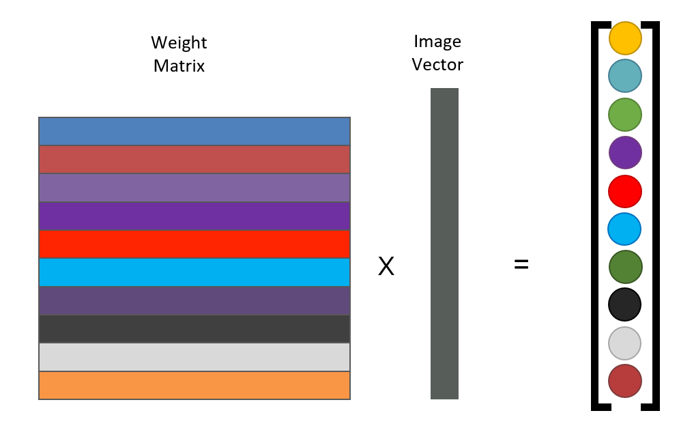
            

            - 用公式表示为：$Wx = \hat{y}$
                - $W$：由权重向量构成的矩阵
                - $x$：图像（向量）
                - $y$：由一系列“概率”值的向量
                - $Wx$的计算被称为**全连接层**(fully-connected layer)

                

                    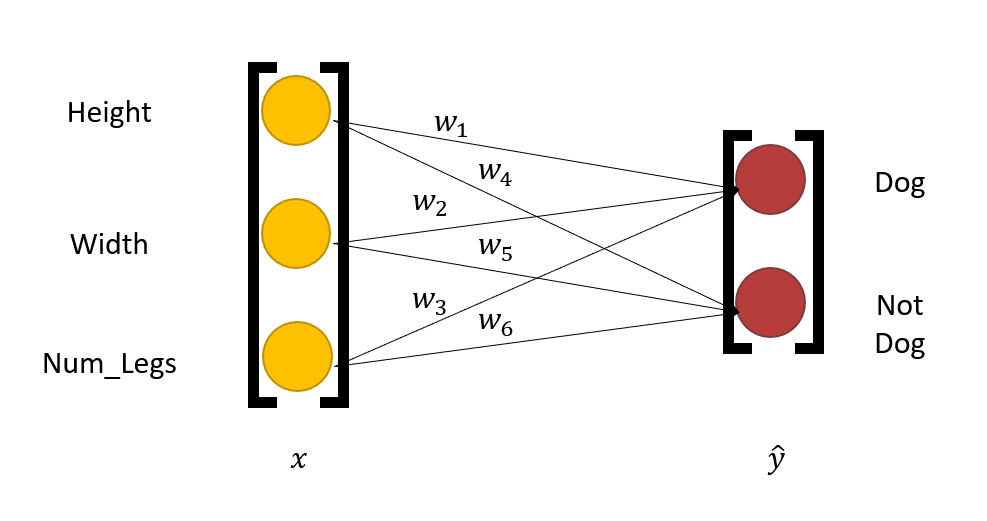
                

        - 但我们希望能够得到真正的概率（在0-1之间），且这些概率之和为1。解决方案是使用softmax函数：$a(x)_i = \dfrac{e^{x_i}}{\sum_j e^{x_j}}$，效果如下所示：

        

            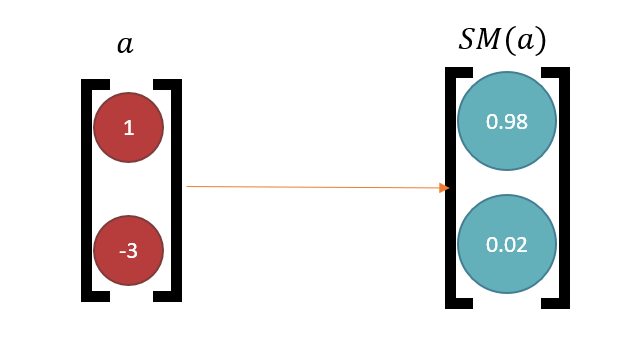
        

        原公式变为：$\hat{y} = SM(Wx)$

- 我们还希望预测值尽可能接近真实值，即$\text{arg max}(\hat{y}) = \text{arg max}(y)$
    - 解决方案：$W^* = \text{arg min}(-\sum\limits_{x, y}\log(p_c))$，其中$p_c$是$\hat{y}$是真实值的概率
    - 令损失$L = -\log(p_c)$，当$L$越大时，$p_c$值越小，即预测值更不准，所以需要尽可能地减小$L$
    - 减小$L$的方法：**梯度下降法**(gradient descent)，梯度通过上面介绍过的反向传播(back propagation)获得