# Introduction

- 游戏：现代计算机技术的奇迹（包含了最前沿的计算机技术，集成了几乎 CS 领域内的所有门类，技术含量之高可想而知）
- **游戏引擎**(game engine)：皇冠上的钻石
    - 会用游戏引擎设计游戏好比开车，会开车的人很多，但会造车（即开发游戏引擎）的人却很少
    - 有很高的技术壁垒

## Why We Need to Learn?

游戏引擎是虚拟世界的基础，相信下一个时代是用游戏引擎技术构建虚拟现实的时代。

    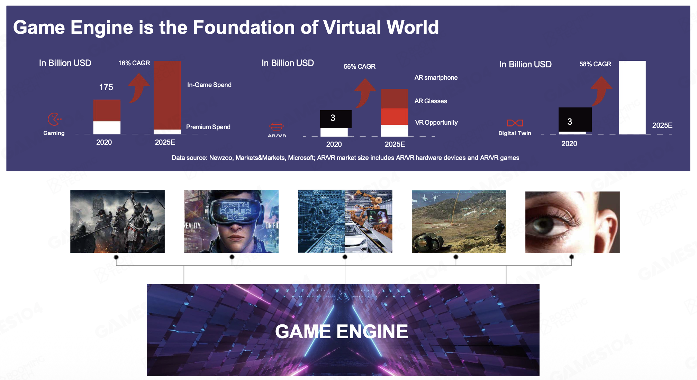

???+ example "游戏引擎的应用"

    === "虚拟人/数字人"

        

        

        >mihoyo《人工桌面》的虚拟人鹿鸣（~~很可惜只能在安卓上下载，笔者体验不了~~）

    === "影视行业"

        有些广告或电影的场景是用游戏引擎技术渲染出来的。

        

        

    === "模拟（军事演习）"

        

    === "数字孪生(digital twin)"

        数字孪生就是将现实世界的物体映射在用计算机技术构成的虚拟世界中，帮助我们更好地理解、管理和构建未来的世界。

        - 比如开发无人驾驶技术时会利用游戏引擎构建的虚拟世界来进行模拟和测试

        

## History of Game Engine

- 早期的电子游戏——红白机(Famicon, FC（~~家庭电脑~~）)（任天堂，20世纪80年代）

    

        
    

    - 当时相当于游戏史上的寒武纪，各种游戏和创意如雨后春笋般冒出，尽管这些游戏在现在看来比较简单

- 游戏引擎之父：[**约翰·卡马克**](https://en.wikipedia.org/wiki/John_Carmack)(John Carmack)
    - 他构思并实施了一种组织计算机游戏组件的新方法：把游戏引擎执行的核心功能（写游戏时可重用的代码），与创建游戏空间和内容创意分离开来
    - 发明的游戏：
        - 《[德军总部 3D](https://en.wikipedia.org/wiki/Wolfenstein_3D)》(*Wolfstein 3D*)：3D 射击游戏之父，第一次展示了游戏引擎的应用

            

                
            

        - 《[毁灭战士](https://en.wikipedia.org/wiki/Doom_(1993_video_game))》(*Doom*)：

            

                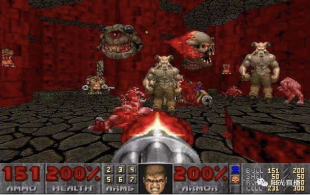
            

            - 与前作一样，该游戏定义了 FPS 类型的游戏，并启发了许多类似的游戏，通常被称为《毁灭战士》的克隆
            - 这是第一款在线发行游戏，它开创了包括 3D 图像、网络多人游戏和通过打包 WAD 文件支持自定义修改在内的技术
            - 1994 年，ID Software 将 Doom 引擎授权给 Raven 公司，后者基于该引擎开发了一款成功的游戏 [*ShadowCaster*](https://en.wikipedia.org/wiki/ShadowCaster)

                

                    
                

        - 《[雷神之锤](https://en.wikipedia.org/wiki/Quake_(video_game))》(*Quake*)：与《毁灭战士》引擎不同，《雷神之锤》的引擎提供了完整的实时 3D 渲染功能，并通过 OpenGL 支持早期的 3D 加速技术

            

                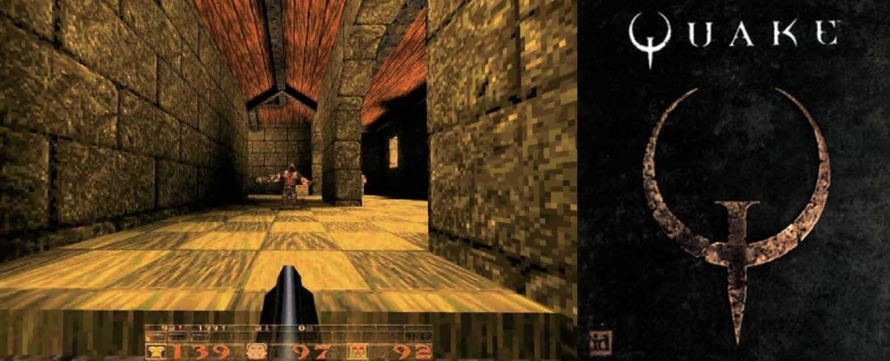
            

            - 当时 3dfx 公司的 Voodoo 显卡诞生，Quake 就是在其基础上做了第一代的 3D 游戏，当时它的画面、沉浸感震撼到了玩家

                

                    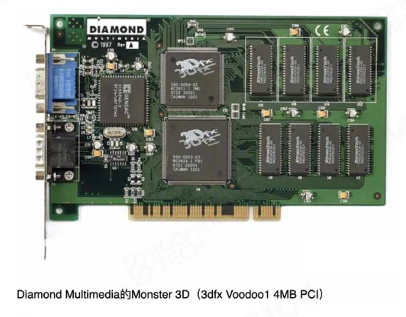
                

- 硬件的发展：以 PlayStation 为例，从第一代到第五代，26 年内算力整整近 20 万倍！

    

        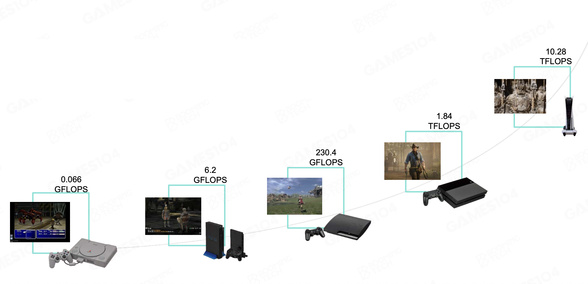
    

- 游戏引擎家族

    

        
    

    - 免费引擎主要以开发轻量级的休闲游戏为主，就复杂性而言，和那些商业引擎相比还是有差距的

- 游戏引擎的**中间件**(middleware)
    - 由于现在的游戏引擎越来越复杂，因此出现了这些专门做某个模块的中间件公司（~~虽说生命周期不长~~）

    

        
    

## What is Game Engine?

抛开 [wiki](https://en.wikipedia.org/wiki/Game_engine) 上冗长繁琐的定义，我们对游戏引擎的定义如下：

- 构建像《黑客帝国》这样的虚拟世界的技术基础
- 人类创造/想象力的生产力工具
- 一门复杂性的艺术
    - 我们希望用游戏引擎尽可能地展现更多的细节，呈现更加真实的画面

        

            
        

    - 不管系统多么复杂，虚拟世界的一切都是用 0/1 表达的
        - 计算机的理论模型——图灵机
        - 对于以下一个简单的两人联机动作游戏，也要考虑诸多的系统，比如渲染系统、动画系统、控制系统，以及网络相关的部件等

            

                
            

        - 所以，游戏引擎涉及的知识远远不止渲染；更恐怖的是，图形学在游戏引擎中仅占一小部分：

            

                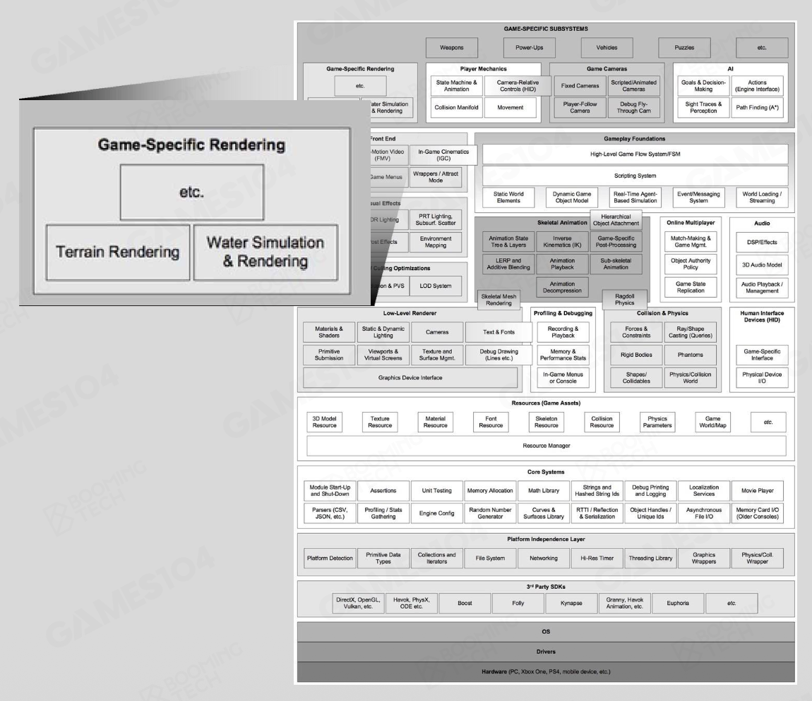
            

开发游戏引擎会面临的挑战有：

- 游戏引擎开发者是一位只有有限算力，却要求满足实时要求的上帝
    - 计算机的算力有限
    - **实时**(realtime)是游戏引擎中的一个重要概念：无论算法多么强大，凡是不能在 1/30s（≈33ms）内出结果，那么这个算法就是无效的
    - 大多数动作游戏都要求 60fps 以上（≈16ms）

- 创作者的工具链(toolchain)
    - 人们很早意识到，游戏引擎的用户不仅仅是程序员，真正最大的用户是**设计师和艺术家**；我们需要意识到这一点
    - 早期（Quake 时代）的工具链可能就只是一个编辑器
    - 而现代游戏引擎是一个庞然大物，使用者是有着不同技能的人，包括动画师、关卡设计者等

        

            
        

    - 当然程序员也是核心用户：游戏引擎中可扩展的 API 接口允许程序员在不改变核心的情况下定义多种游戏玩法
    - 游戏引擎的一个很重要的属性是**可协作**(collaborative)，能够让上百人的，有着不同技能团队能够顺利合作开发出一款游戏来

- 游戏引擎的架构设计
    - 设计好整个体系、工具后并不意味着万事大吉——之后仍然需要不断地完善和升级，实现更好的表现和功能
    - 不过需要保证在底层技术升级的同时，现有的基于游戏引擎开发的游戏还能正常跑起来，这就是所谓的 "Update the Engine in the Air"

## How to Study?

看看这个[仓库](https://github.com/miloyip/game-programmer)（~~吓哭了~~）

是的，它列出了以下所有的书：

    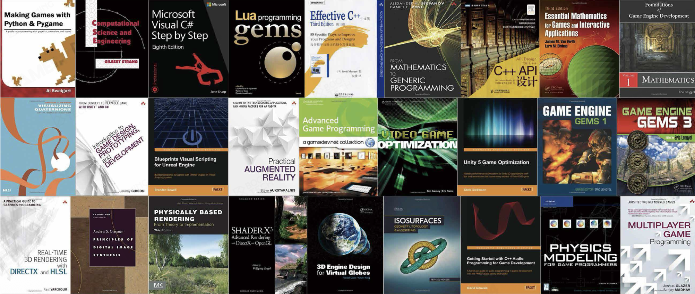

>~~笔者想除了从娃娃开始就决定致力于游戏引擎的工作的人，可能没多少人能够看完所有的书吧~~

显然要在短期内学完这些书是不现实的。所以本系列笔记将以 GAMES104 课程为参考，先走完游戏引擎学习之旅的主干道，之后等到有需要了再另寻资源深入学习某些领域。

## Course Content

- 基本要素
    - 引擎结构和层级
    - 数据组织和管理

    

        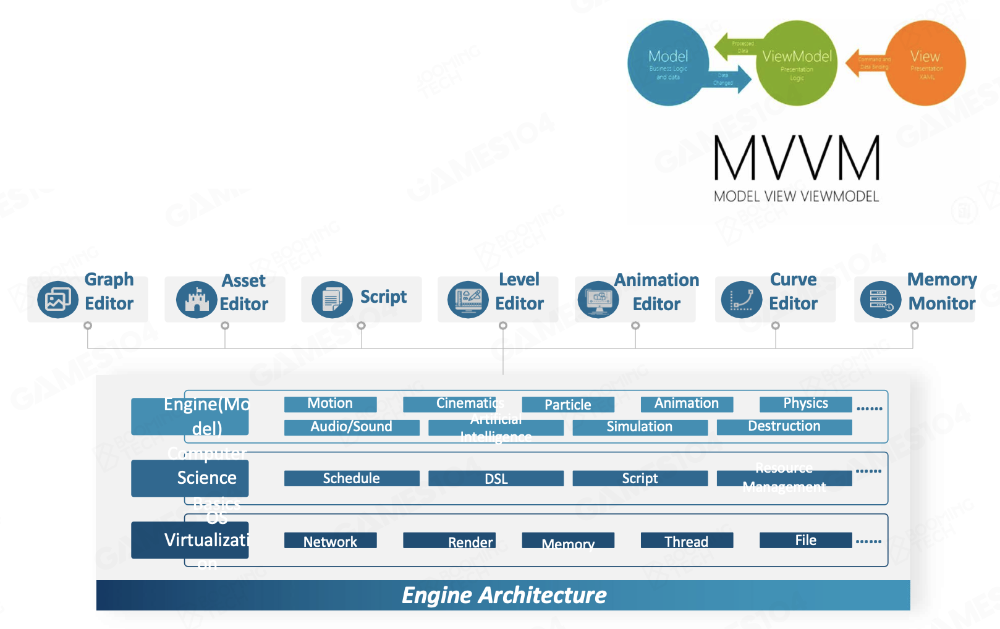
    

- 渲染
    - 模型、材质、着色器、纹理
    - 光照和阴影
    - 渲染管线
    - 天空、地形(terrain)等

    

        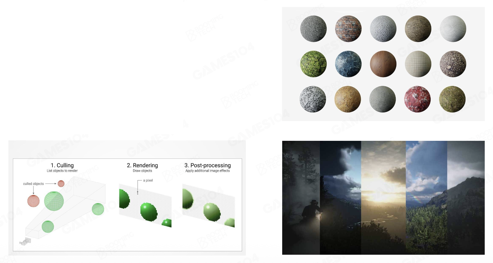
    

- 动画
    - 基本概念
    - 动画结构和管线

    

        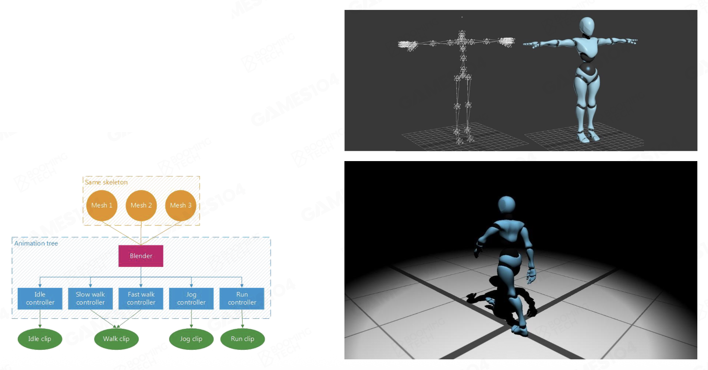
    

- 物理
    - 物理系统的基本概念
    - 游戏玩法应用
    - 性能优化

    

        
    

- 游戏玩法
    - 事件系统
    - 脚本系统
    - 图驱动

    

        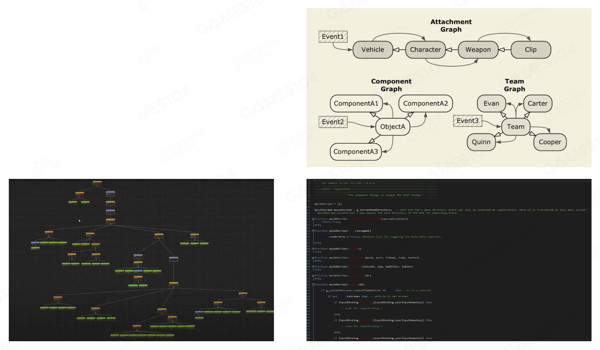
    

- 杂项
    - 特效
    - 寻路
    - 相机
    - ...

    

        
    

- 工具链
    - C++ 反射(reflection)：在编辑器中暴露使用的变量和函数，也就是说游戏创作工具会对开发者提供的代码进行某种形式的反射（或类似机制），从而能够在编辑器内向设计师展示部分代码内容。
    - 数据模式(data schema)：系统所处理结构的形式定义

    

        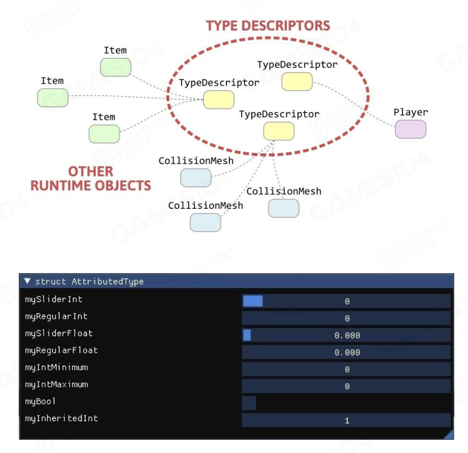
    

- 在线游戏
    - 锁步同步(lockstep synchronization)
    - 状态同步(state synchronization)
    - 一致性(consistency)

    

        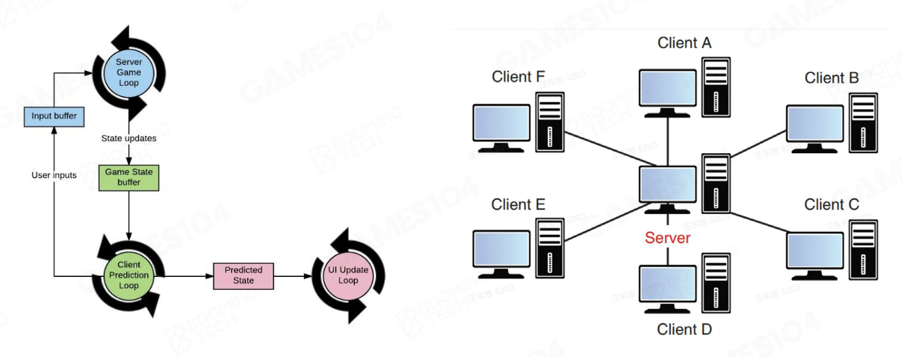
    

- 进阶技术
    - **动作匹配**：一种在游戏中为角色制作动画的简单而强大的方法。与其他方法相比，一旦有了基础设置，它几乎不需要太多手动操作：无需将片段组织成图表结构、仔细剪辑或同步它们，也无需明确地在状态之间创建新的过渡。
    - **PCG**（程序化内容生成(procedural content generation)）：是一种通过算法而非手动方式创建数据的方法，通常结合了人工生成的资源与算法，以及计算机产生的随机性和处理能力。
    - **面向数据编程**(DOP)：一种新范式，消除了将数据和代码结合到对象与类中所带来的常见复杂性。
        - 应用程序数据被保存在持久化的通用数据结构中，与程序代码相分离
        - 使用通用函数来操作这些数据而无需改变其本身
        - 这种方法让应用摆脱了状态相关的错误，并使代码更易于理解和维护

        

            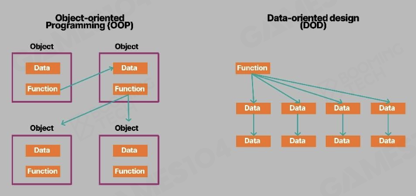
        

    - **作业系统**(job system)：通过创建作业而非线程来管理多线程代码

        

            
        

    - **Lumen**：来自虚幻引擎 5 的全新全动态全局光照和反射系统，专为次世代游戏主机设计。它能够在从毫米到公里级别的大型精细环境中，渲染出具有无限反弹的漫反射互映和间接高光反射效果。
    - **Nanite**：来自虚幻引擎 5 的新虚拟化几何系统，采用了一种新的内部网格格式和渲染技术，能够呈现像素级别的细节并支持大量物体的渲染。

        

            
        
