# Physical System Basics

??? info "游戏中的物理"

    === "物理直觉"

        

            
        

    === "动态环境"

        和游戏玩法息息相关

        

            
        

        >《彩虹六号》

    === "现实交互"

        

            
        

        >Half-Life Alyx（~~VR 游戏最严厉的父亲~~）

    === "艺术"

        粒子、烟、流体、布料等的运动和物理密切联系。

        

            
        

!!! warning "注意"

    这里介绍的物理系统和先前在渲染部分中介绍的 [PBR](5.md#physical-based-materials) 中的「物理」是两个概念。后者特指物理中的光学特征。

## Physics Actors and Shapes

如下图所示，左图是渲染后的虚拟世界；而右图是物理世界，游戏的逻辑和模拟往往在这之上运行的。

    

### Actors

物理世界中的对象通常称为**参与者**(actor)。参与者可分为：

- **静态**(static)参与者：静止不动的物体，比如挡板等，在游戏中的占比是最大的

    

        
    

- **动态**(dynamic)参与者：符合物理原理的物体，比如下图的箱子会因重力和摩擦力的作用在斜面上运动

    

        
    

- **触发器**(trigger)：

    

        
    

    - 像静态参与者那样不会移动，但不会阻塞
    - 和游戏逻辑高度相关，会触发消息（或事件），用于通知参与者进入/退出

- **运动学**(kinematic)参与者：根据游戏玩法逻辑直接控制物体运动，可以无视物理定律

    

        
    

    - 但违背物理定律会给游戏引来很多麻烦

        ??? example "例子"

            被野兽一顶直接飞天了...

            

                
            

            >让笔者想起玩《模拟山羊》的时候了hh

### Shapes

参与者的形状各异，需要根据实际情况选择合适的形状，否则会影响到游戏性能，甚至产生各种奇怪的 bug。常见的形状有：

    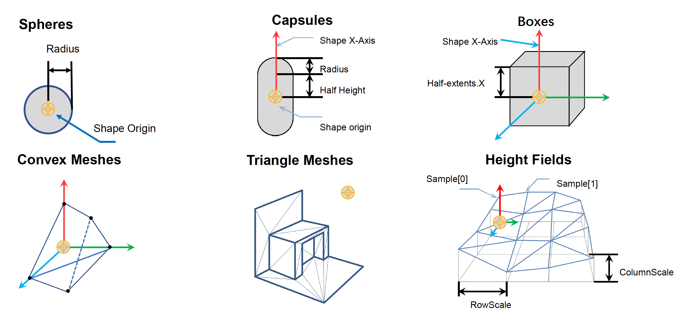

- **球形**(spheres)
    - 像球类运动天然适合用球形表示

    

        
    

- **胶囊状**(capsules)
    - 很多游戏用胶囊表示一个角色，角色恰好能被一个胶囊包裹起来
    - 但这种包裹往往是近似的

    

        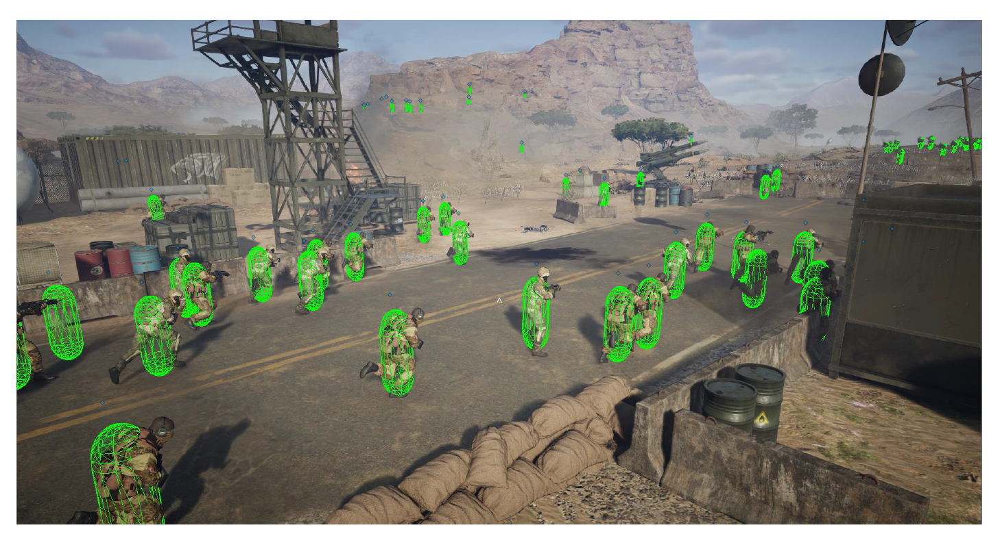
    

- **盒形**(boxes)（正方体/长方体）
    - 适合精度要求不高的情形

    

        
    

- **凸网格**(convex meshes)：
    - 封闭，不能有洞
    - 凸包：任意一个面做无限延伸都不会其他任何面相交
    - 能表达更多样更复杂的形状（比如图中的可破坏队形）

    

        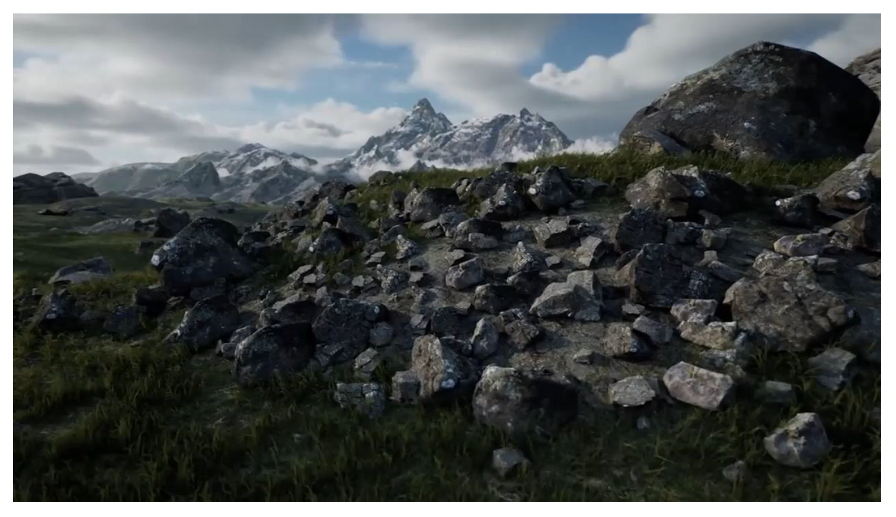
    

- **三角形网格**(triangle meshes)
    - 要求物体是密闭的，且是静态的（因为动态物体势必涉及碰撞和求交运算，事情会变得很复杂）

    

        
    

- **高度场**(height fields)
    - 更适合表达地形（用盒形或凸包表示的成本很大）

    

        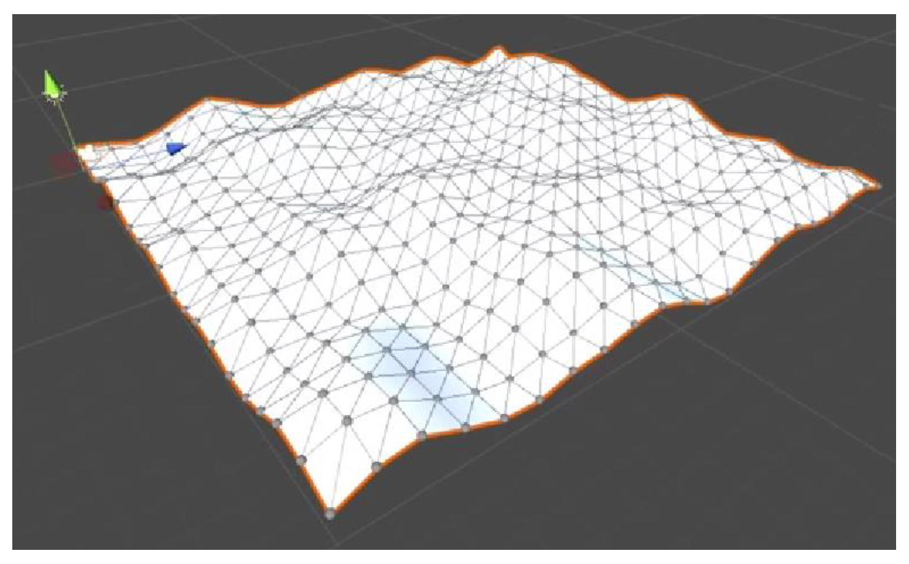
    

???+ note "使用物理形状包裹物体的原则"

    - 近似：不需要包裹得很精细
    - 简单：偏好简单形状（如有可能请避免使用三角形网格）、最少的形状

---
形状有很多属性，包括（实际上有些引擎还会给出更多属性）：

- **质量**(mass)和**密度**(density)：
    - 在物理系统中通常假设每个参与者是质量均匀的，这样的物体会有好几个平衡点；而质量不均匀的物体只有一个平衡点（比如不倒翁）

    

        
    

- **质心**(center of mass)：
    - 决定了物体的稳定性

    

        
    

- **摩擦力**(friction)和**弹性**(restitution)：
    - 这两个属性由**物理材质**(physical materials)定义
    
    

        
    

## Forces

- 只有当**力**(force)作用在（动态）物体上改变加速度时，才能影响到它们的移动
- 常见的力有重力(gravity)、拉力(drag)、摩擦力(friction)等

    

        
        
    

- 还可以通过施加**冲量**(impulse)改变参与者的加速度，比如车辆冲撞、爆炸等

    

        
        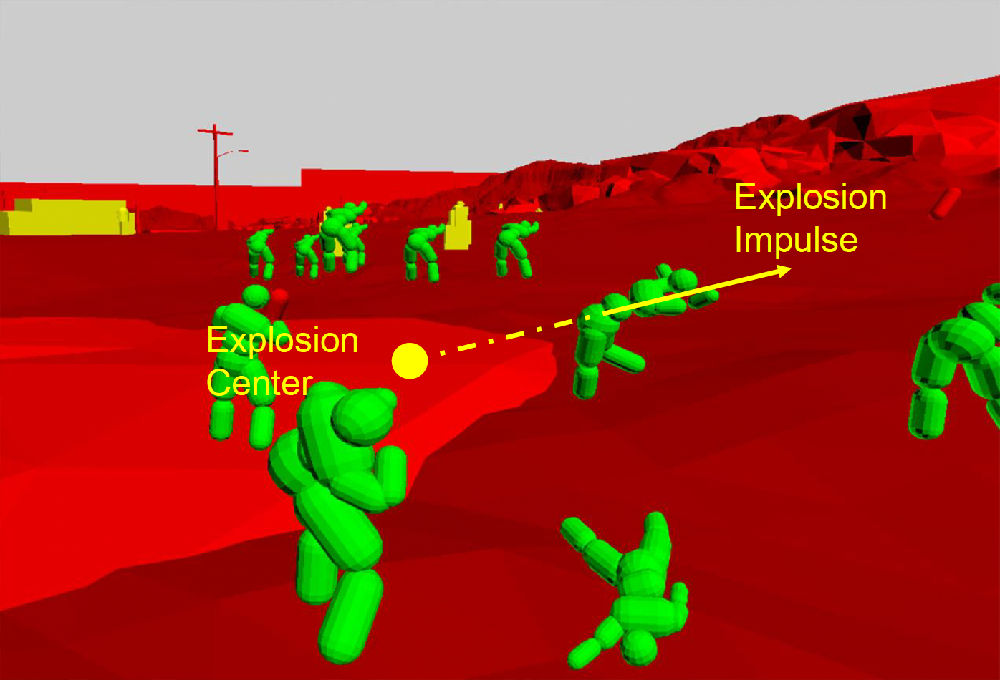
    

## Movements

??? info "物理基础：牛顿运动定律"

    - 牛顿第一定律（无外力作用）

        

            
        

    - 牛顿第二定律（有外力作用）

        

            
        

**恒力**(constant force)作用下的移动：

$$
\begin{aligned}
\vec{F} &= m \vec{a} \\
\vec{a} &= \vec{F} / m \\
\\
\vec{v}(t + \Delta t) &= \vec{v}(t) + \vec{a}(t) \Delta t \\
\vec{x}(t + \Delta t) &= \vec{x}(t) + \vec{v}(t) \Delta t + \frac{1}{2} \vec{a}(t) \Delta t^2
\end{aligned}
$$

{ align=right width=30% }

**变力**(varying force)作用下的移动：

$$
\begin{aligned}
\vec{F} &= m \vec{a} \\
\vec{a} &= \vec{F} / m \\
\\
\vec{v}(t + \Delta t) &= \vec{v}(t) + \int_{t}^{t+\Delta t} \vec{a}(t') \mathrm{d}t' \\
\vec{x}(t + \Delta t) &= \vec{x}(t) + \int_{t}^{t+\Delta t} \vec{v}(t') \mathrm{d}t'
\end{aligned}
$$

现在考虑地球绕太阳公转这样一个相对简单的运动的例子（假设是圆形轨道）。我们可以用位置、朝向、线速度和角速度这四个量来表示地球在任意时刻 $t$ 下的运动：

{ align=right width=20% }

$$
\mathbf{X}(t) = \begin{pmatrix}
\vec{x}(t) \\
R(t) \\
\vec{v}(t) \\
\vec{\omega}(t)
\end{pmatrix}
$$

而要在游戏中模拟这样一个圆周运动，可以这样做：

- 已知 $t$ 时刻下位置为 $\vec{x}(t)$，线速度为 $\vec{v}(t) = \dfrac{d\vec{x}(t)}{dt}$
- 在模拟步中，令时间步大小为 $\Delta t$，我们要计算 $\vec{x}(t + \Delta t), \vec{v}(t + \Delta t)$
- 需要沿时间做积分：$\vec{x}(t_1) = \vec{x}(t_0) + \int_{t_0}^{t_1} \vec{v}(t) dt$

    

        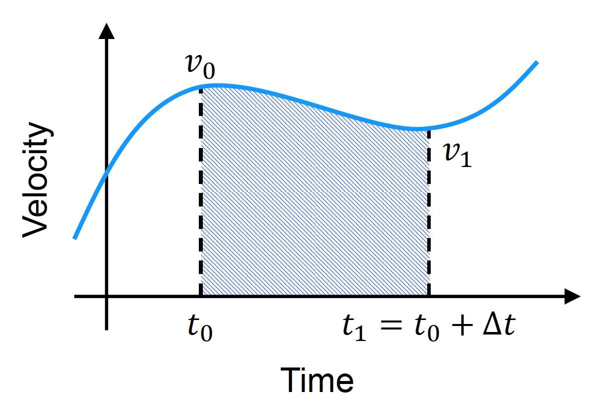
    

这个积分的求解需要用到**欧拉法**(Euler's method)：

- **显式（正向）欧拉法**：最简单的估计，假设力在时间步内是恒定的

    $$
    \begin{cases}
    \vec{v}(t_{1}) = \vec{v}(t_{0}) + M^{-1}\textcolor{cornflowerblue}{\vec{F}(t_{0})}\Delta t \\
    \vec{x}(t_{1}) = \vec{x}(t_{0}) + \textcolor{cornflowerblue}{\vec{v}(t_{0})}\Delta t
    \end{cases}
    $$

    其中标蓝的量表示**当前状态**，它们都是已知的。

    ??? example "例子：粒子的圆周运动"

        

            
        

        如果时间步大小过大，结果会「爆炸」！

        

            
        

    - 优点：计算简单高效
    - 缺点：
        - 不稳定
        - 能量随时间增长

- **隐式（反向）欧拉法**

    $$
    \begin{cases}
    \vec{v}(t_{1}) = \vec{v}(t_{0}) + M^{-1}\textcolor{red}{\vec{F}(t_{1})}\Delta t \\
    \vec{x}(t_{1}) = \vec{x}(t_{0}) + \textcolor{red}{\vec{v}(t_{1})}\Delta t
    \end{cases}
    $$

    其中标红的量是**未来状态**，它们是未知的。

    - 隐式欧拉法的结果是螺旋状的

        

            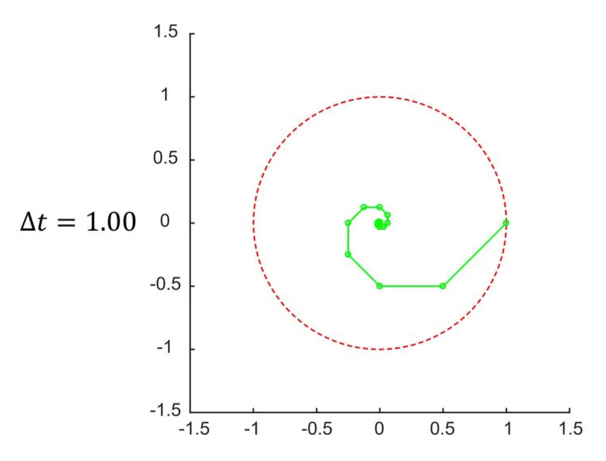
        

    - 优点：无条件稳定
    - 缺点：
        - 求解成本高
        - 难以应对非线性问题
        - 能量随时间衰减

- **半隐式**(semi-implicit)**欧拉法**

    $$
    \begin{cases}
    \vec{v}(t_{1}) = \vec{v}(t_{0}) + M^{-1}\textcolor{cornflowerblue}{\vec{F}(t_{0})}\Delta t \\
    \vec{x}(t_{1}) = \vec{x}(t_{0}) + \textcolor{red}{\vec{v}(t_{1})}\Delta t
    \end{cases}
    $$

    同样地，标蓝量为当前状态，标红量为未来状态。

    - 若时间步较小，结果近似为一个圆

        

            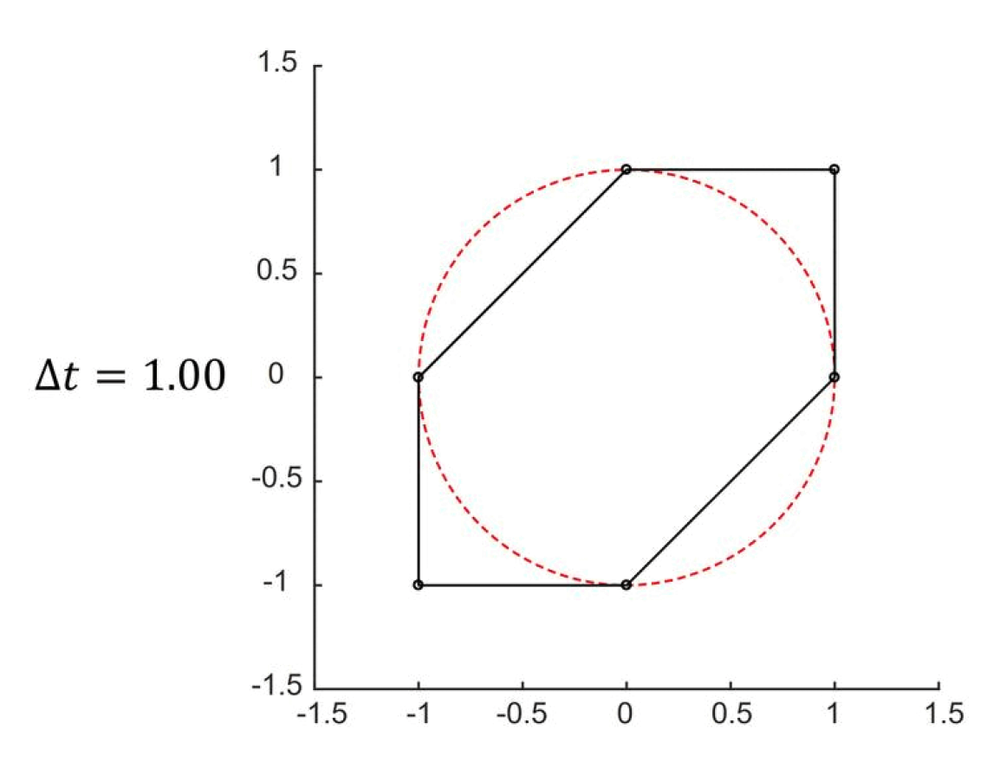
        

    - 不仅兼具前两种方法的优点，还确保能量不会随时间变化而增长或衰减，因此更适合用于游戏开发中
    - 但它还是有一点小问题的：在简谐运动、圆周运动等涉及到三角函数的运动中，通过该方法积分得到的周期会比实际周期略长一些，因而产生一个小的相位差

## Rigid Body Dynamics

在之前介绍的内容中，我们假设任何物体都可用一个质点表示，涉及的物理量包括了：

- 位置 $\vec{x}$
- 线速度(linear velocity) $\vec{v} = \dfrac{d\vec{x}}{dt}$
- 加速度(acceleration) $\vec{a} = \dfrac{d\vec{v}}{dt} = \dfrac{d^2\vec{x}}{dt^2}$
- 质量 $M$
- 动量(momentum) $\vec{p} = M\vec{v}$
- 力 $\vec{F} = \dfrac{d\vec{p}}{dt} = M \vec{a}$

但大多数物体都有自己的形状，除了上述量（线性值）外，还得考虑自身的旋转（角值(angular value)），包括：

- **朝向**(orientation) $\bm{R}$：形式可以是
    - 矩阵 $\bm{R}(t) = \begin{bmatrix}\textcolor{red}{r_{xx}} & \textcolor{green}{r_{yx}} & \textcolor{cornflowerblue}{r_{zx}} \\ \textcolor{red}{r_{xy}} & \textcolor{green}{r_{yy}} & \textcolor{cornflowerblue}{r_{zy}} \\ \textcolor{red}{r_{xz}} & \textcolor{green}{r_{yz}} & \textcolor{cornflowerblue}{r_{zz}}\end{bmatrix}$
    - 四元数 $q = \begin{bmatrix}s & \vec{v}\end{bmatrix}$

    

        
    

- **角速度**(angular velocity) $\vec{\omega}$：方向为旋转轴的方向

    $$
    \begin{aligned}
    \|\vec{\omega}\| &= \frac{d\theta}{dt} \\
    \vec{\omega} &= \frac{\vec{v} \times \vec{r}}{\|\vec{r}\|^{2}}
    \end{aligned}
    $$

    其中 $\theta$ 为用弧度表示的旋转角

    

        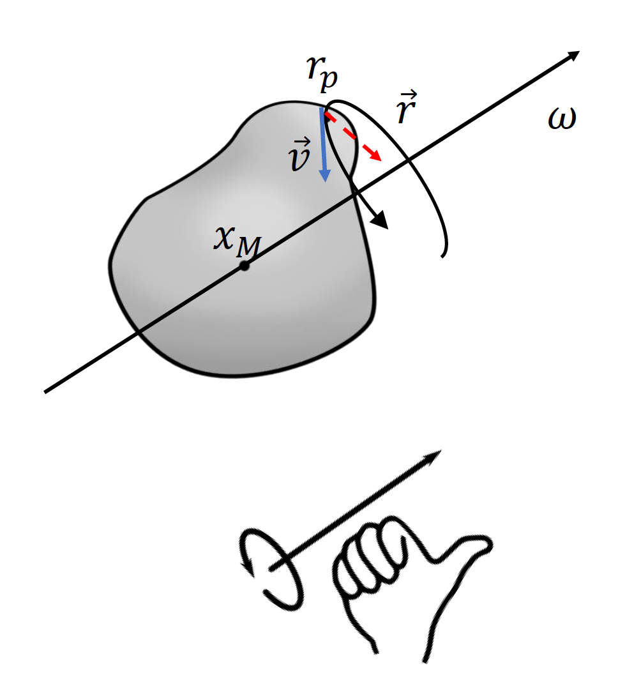
    

- **角加速度**(angular acceleration) $\vec{\alpha}$

    $$
    \vec{\alpha} = \frac{d\vec{\omega}}{dt} = \frac{\vec{a} \times \vec{r}}{\|\vec{r}\|^{2}}
    $$

- **惯性张量**(inertia tensor)/**转动惯量**(rotational inertia) $\bm{I}$：描述了刚体的质量分布

    $$
    \bm{I} = \bm{R} \cdot \bm{I}_0 \cdot \bm{R}^\top
    $$

    

        
    

    - 总质量：$M = m_1 + m_2$
    - 质心：$CoM = \dfrac{m_1}{M}(x_1, y_1, z_1) + \dfrac{m_2}{M}(x_2, y_2, z_2)$
    - 初始惯性张量：

        $$
        I_{0} = \begin{bmatrix}
        m_{1}(y_{1}^{2} + z_{1}^{2}) + m_{2}(y_{2}^{2} + z_{2}^{2}) & -m_{1}x_{1}y_{1} - m_{2}x_{2}y_{2} & -m_{1}x_{1}z_{1} - m_{2}x_{2}z_{2} \\
        -m_{1}y_{1}x_{1} - m_{2}y_{2}x_{2} & m_{1}(x_{1}^{2} + z_{1}^{2}) + m_{2}(x_{2}^{2} + z_{2}^{2}) & -m_{1}y_{1}z_{1} - m_{2}y_{2}z_{2} \\
        -m_{1}z_{1}x_{1} - m_{2}z_{2}x_{2} & -m_{1}z_{1}y_{1} - m_{2}z_{2}y_{2} & m_{1}(x_{1}^{2} + y_{1}^{2}) + m_{2}(x_{2}^{2} + y_{2}^{2})
        \end{bmatrix}
        $$

    

        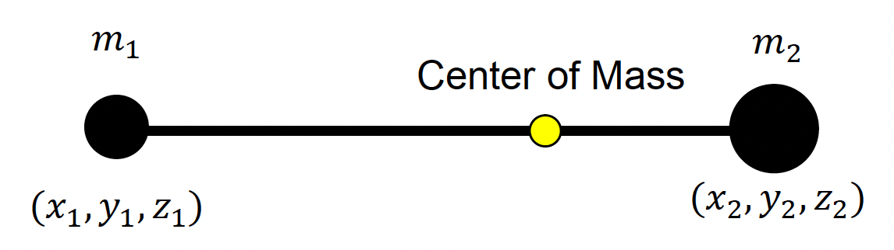
    

- **角动量**(angular momentum) $\vec{L} = \bm{I} \vec{\omega}$
    - **角动量守恒**是一个能被证明的定理

    

        
    

- **扭矩**(torque) $\vec{\tau}$

    $$
    \vec{\tau} = \vec{r} \times \vec{F} = \frac{d\vec{L}}{dt}
    $$

    其中 $\vec{F}$ 表示施加在刚体位置 $\vec{r}$ 上的外力

    

        
    

以上便是**刚体动力学**(rigid body dynamics)的内容了！

???+ example "应用：台球(billiard)动力学"

    尽管我们已经了解了刚体动力学的基本概念，但台球游戏中的物理仍然很复杂。

    

        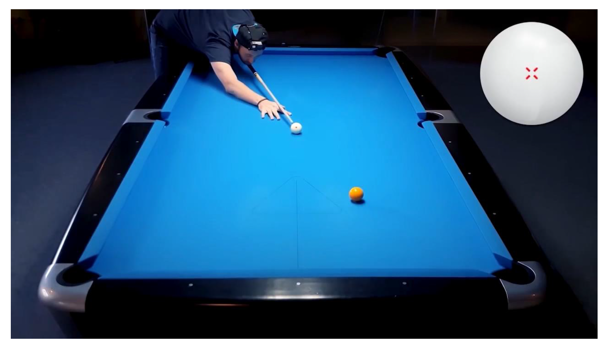
    

    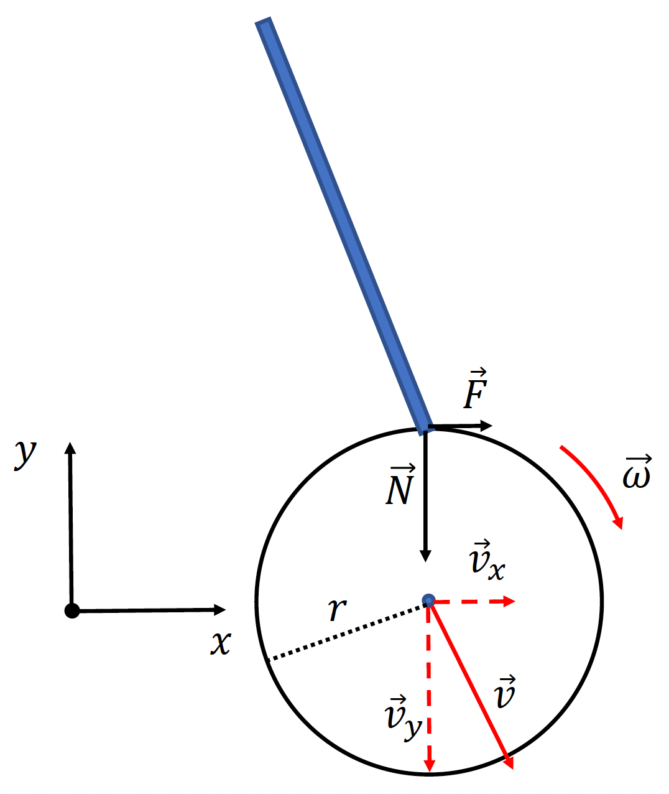{ align=right width=30% }

    这里举一个简单的例子：用球杆侧面打击球

    - 摩擦力冲量：$\vec{p}_F = \int \vec{F} dt = m \vec{v}_x$
    - 压力冲量：$\vec{p}_N = \int \vec{N} dt = m \vec{v}_y$
    - 球角动量：$\vec{L}_b = \bm{I}_b \vec{\omega} = \vec{p}_F \times \vec{r}_F$
    - 球线速度：$\vec{v} = \vec{v}_x + \vec{v}_y$

## Collision Detection

??? info "无碰撞检测"

    没有碰撞检测的时候，参与者之间看起来彼此没有任何关系，像幽灵般穿越彼此，看起来极不真实。

    

        
    

要想在物理世界中表达物体之间的相互作用，**碰撞检测**(collision detection)是必不可少的一项技术。它一般分为以下两个阶段：

    

- **广阶段**(broad phase)
- **窄阶段**(narrow phase)

### Broad Phase

广阶段的目标是找到相交的刚体 AABBs，这表明有可能的重叠刚体对，实现方法有：

- **空间划分**(space partitioning)，比如边界体积层次(boundary volume hierarchy, **BVH**)树；下面列举各种 BVH 树的构建方式

    

        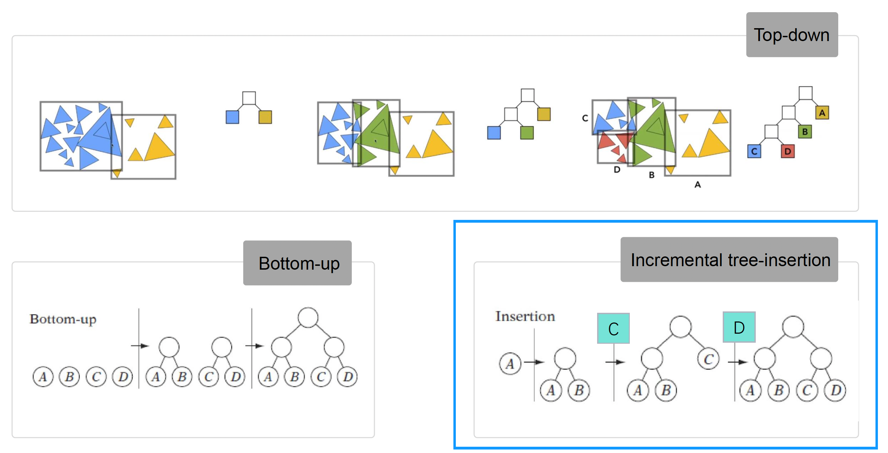
    

    - 优点：环境动态变化时，更新成本很低

    ??? example "例子"

        

            
        

- **排序和清理**
    - 排序阶段（初始化）：对于每个轴
        - 初始化场景时，沿着每个轴对 AABBs 的边界排序
        - 沿着每个轴检查 AABBs 的边界
        - $A_{\max} \ge B_{\min}$ 意味着 $A, B$ 之间可能有重叠
    
        

            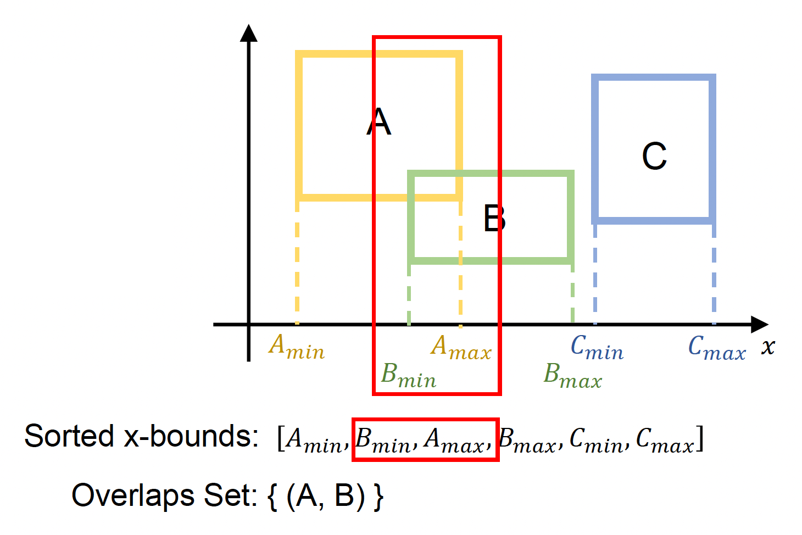
        

    
    - 清理阶段（更新）
        - 只检查边界的交换
            - 时间一致性(temporal coherence)
            - 帧与帧之间的局部步骤

        - 交换 min 和 max 意味着从重叠集合中增加/删除潜在的重叠
        - 交换 min 和 min，或者 max 和 max 则不会影响重叠集合

        

            
            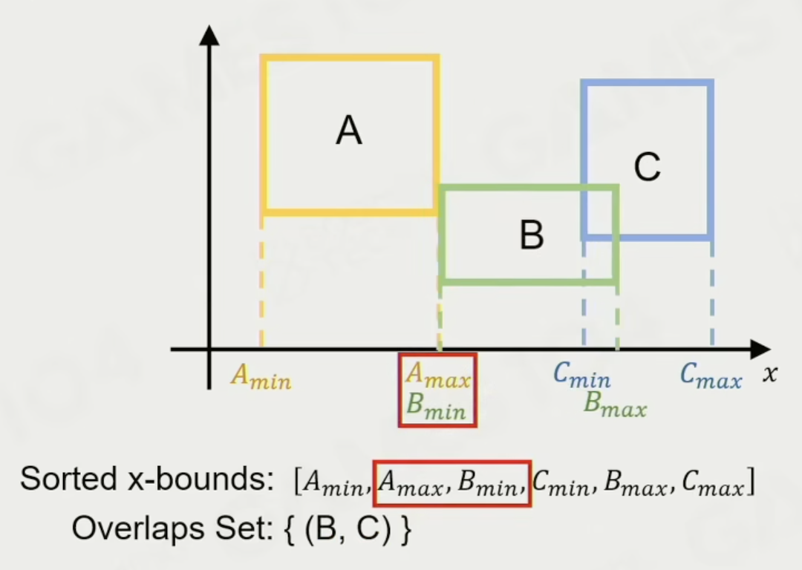
        

    - 优点：效率非常高（因为大多数物体都是静态的，排好序后也只需调整很少的数字）

### Narrow Phase

**窄阶段**的目标是精确检测重叠情况，生成接触信息。接触信息(contact information)包括：

- 接触流形(contact manifold)：用一组接触点近似
- 接触法线(contact normal)
- 穿透深度(penetration depth)

    

下面给出窄阶段常用的实现方法。

- **基本形状相交测试**(basic shape intersection test)
    - 球-球测试

        

            
        

        - 重叠条件：$|\vec{c}_2 - \vec{c}_1| - r_1 - r_2 \le 0$
        - 接触信息：
            - 接触法线：$(\vec{c}_2 - \vec{c}_1) / |\vec{c}_2 - \vec{c}_1|$
            - 穿透深度：$|\vec{c}_2 - \vec{c}_1| - r_1 - r_2$
    
    - 球-胶囊测试

        

            
        

        其中 $\vec{L}$ 为在内部胶囊段中离圆最近的点
        
        - 重叠条件：$|\vec{C} - \vec{L}| - r_S - r_C \le 0$
        - 接触信息：
            - 接触法线：$(\vec{C} - \vec{L}) / |\vec{C} - \vec{L}|$
            - 穿透深度：$|\vec{C} - \vec{L}| - r_S - r_C$
    
    - 胶囊-胶囊测试

        

            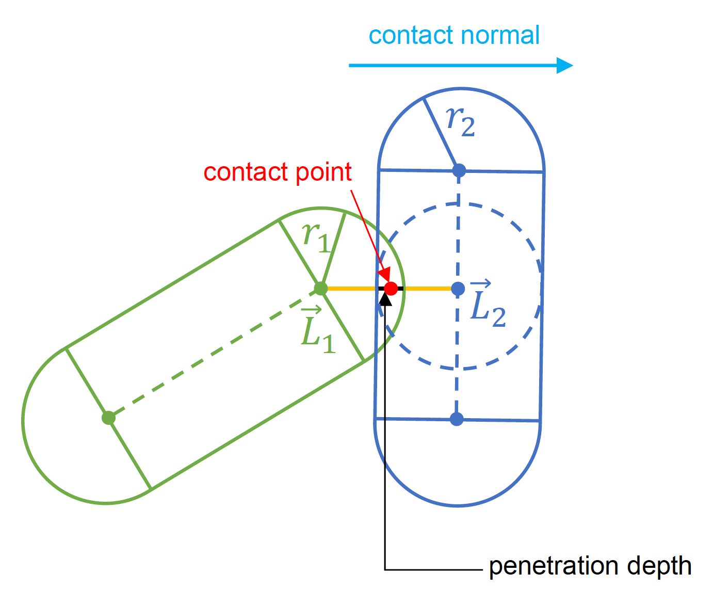
        

        其中 $\vec{L}_1, \vec{L}_2$ 为在两个段之间最近的点

        - 重叠条件：$|\vec{L}_2 - \vec{L}_1| - r_1 - r_2 \le 0$
        - 接触信息：
            - 接触法线：$(\vec{L}_2 - \vec{L}_1) / |\vec{L}_2 - \vec{L}_1|$
            - 穿透深度：$|\vec{L}_2 - \vec{L}_1| - r_1 - r_2$

- **基于[闵可夫斯基](https://en.wikipedia.org/wiki/Hermann_Minkowski)差的方法**(Minkowski difference-based methods)
    - **闵可夫斯基和**：来自 A 的点 + 来自 B 的点 = 这两个点的闵可夫斯基和

        $$
        A \oplus B = \{\vec{a} + \vec{b} : \vec{a} \in A, \vec{B} \in B\}
        $$

        ??? example "例子"

            === "例1"

                $$
                \begin{aligned}
                &A: \{ \vec{a}_1, \vec{a}_2 \} \\
                &B: \{ \vec{b}_1, \vec{b}_2, \vec{b}_3 \} \\
                &A \oplus B = \{ \vec{a}_1 + \vec{b}_1, \vec{a}_1 + \vec{b}_2, \vec{a}_1 + \vec{b}_3, \vec{a}_2 + \vec{b}_1, \vec{a}_2 + \vec{b}_2, \vec{a}_2 + \vec{b}_3 \}
                \end{aligned}
                $$

            === "例2"

                

                    
                

                

                    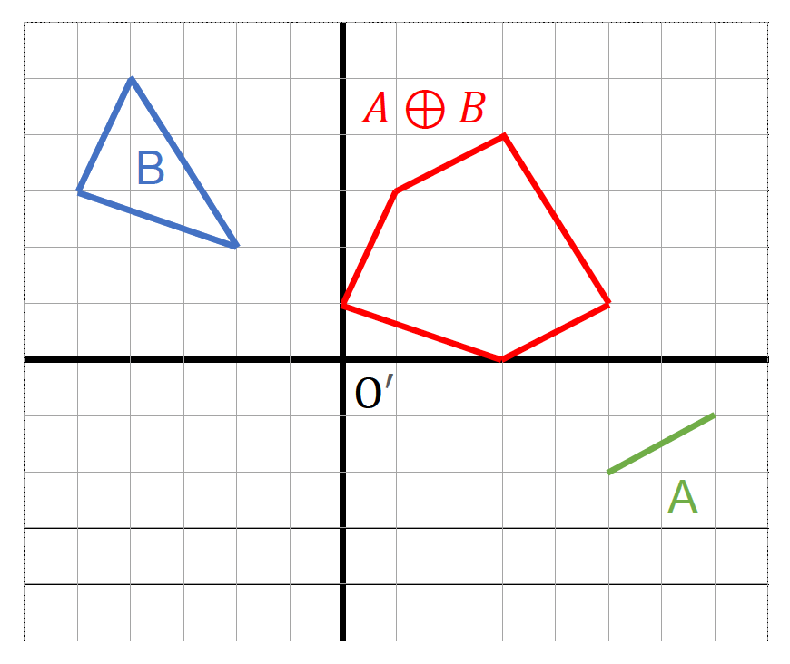
                

                

                    
                

        - 关于凸多边形(convex polygon)

            

                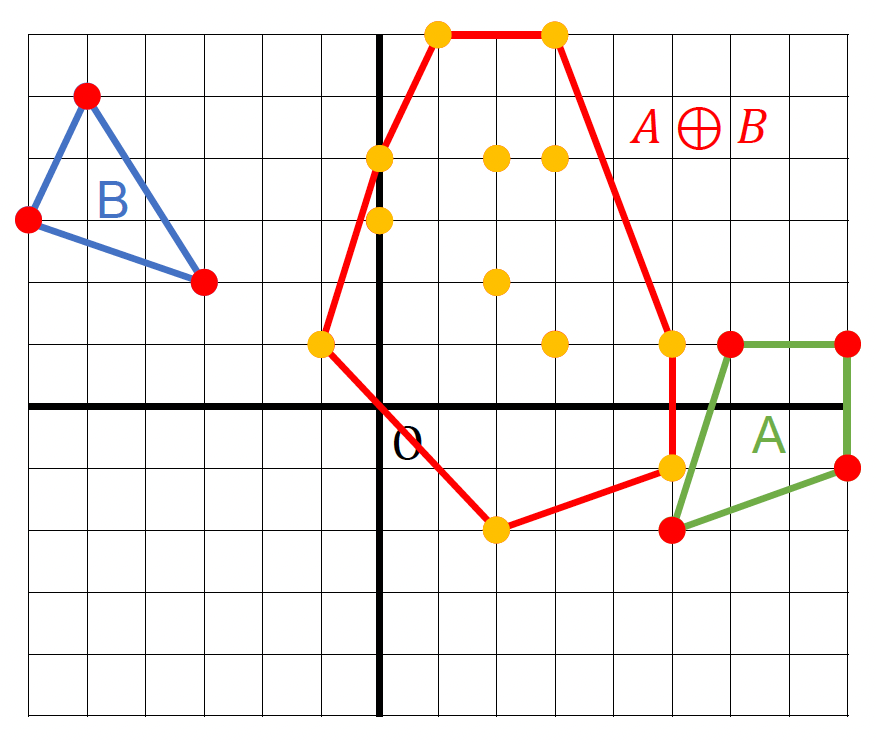
            

            - 定理：若 $A, B$ 是凸多边形，那么 $A \oplus B$ 也是凸多边形
            - $A \oplus B$ 的顶点是 $A, B$ 的顶点和

    - 闵可夫斯基差：来自 A 的点 - 来自 B 的点 = 这两个点的闵可夫斯基差

        $$
        A \ominus B = \{\vec{a} - \vec{b} : \vec{a} \in A, \vec{B} \in B\}
        $$

        - 也可以看成 $A$ 和镜像的 $B$ 的闵可夫斯基和

            $$
            A \ominus B = A \oplus (-B)
            $$

            

                
            

        - 若 $A, B$ 相交，那么原点一定在它们的闵可夫斯基差的内部

            

                
            

    - **GJK 算法**：
        - 确定迭代方向
            - 检查原点是否在**单纯形**(simplex)内
            - 在单纯形内找到离原点最近的点
            - 若最近距离还能减少，则继续迭代
        - 从单纯形中移除对新最近点没有贡献的点
        - 寻找支持点 $\vec{p}_A, \vec{p}_B$
        - 在闵可夫斯基差上向迭代单纯形添加新点 $\vec{p}_A - \vec{p}_B$

        ??? example "例子"

            === "**分离**的情况"

                === "Step 1"

                    

                        
                    

                === "Step 2"

                    

                        
                    

                === "Step 3"

                    

                        
                    

                === "Step 4"

                    

                        
                    

                === "Step 5"

                    

                        
                    

            === "**重叠**的情况"

                === "Step 1"

                    

                        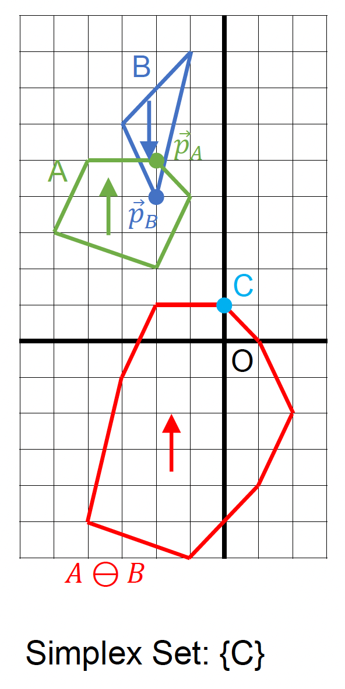
                    

                === "Step 2"

                    

                        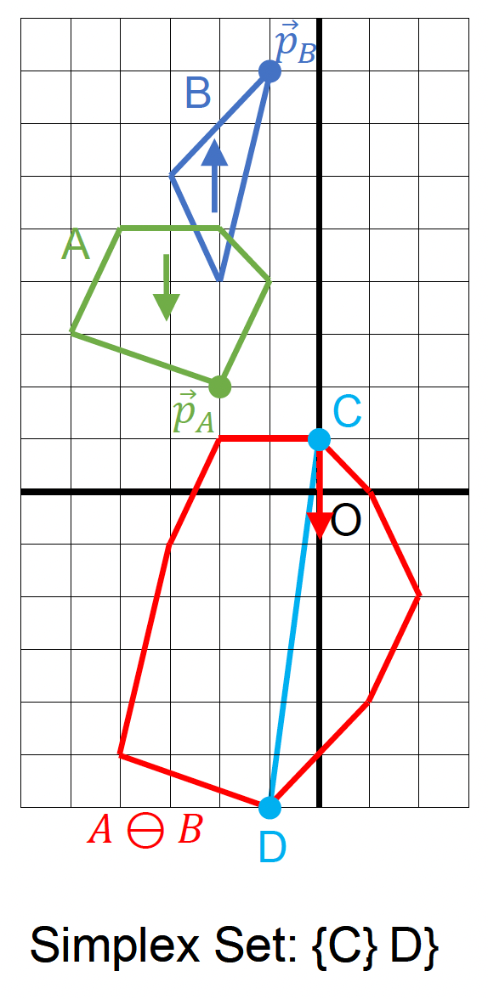
                    

                === "Step 3"

                    

                        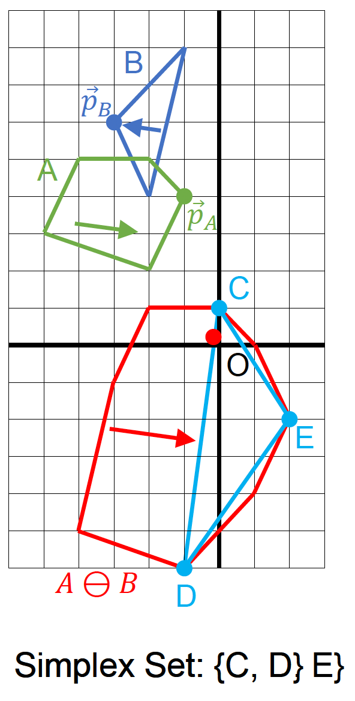
                    

- **分离轴定理**(seperating axis theorem, **SAT**)
    - 由于凸性(convexity)，任何边都可用于分离两个凸多边形
    
        

            
        

    
    - 另一种理解：在 2D 情况下，一定能找到一条轴，使得两个多边形的顶点在这条轴上的投影是分离的（两个投影顶点集合没有交集）
    - 一定要检查所有的边，直到找到一条分离轴

        

            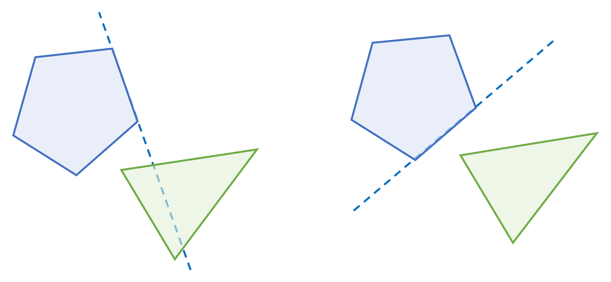
        

    - 分离标准：$\textcolor{red}{d} = \vec{n} \cdot (\textcolor{yellowgreen}{\vec{s}} - \textcolor{cornflowerblue}{\vec{p}})$，穿透深度就是 $|d|$

        

            
        

    - SAT-2D 算法
        - 对 A 的每条边检查 B 的每个顶点
        - 对 B 的每条边检查 A 的每个顶点

        

            
        

        ??? example "例子"

            

                
                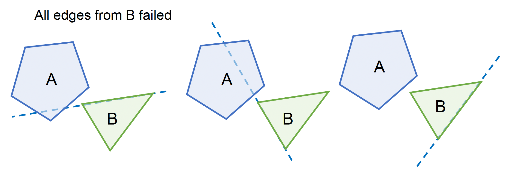
            

    - SAT-2D 算法的优化：缓存上一个分离轴

        

            
        

    - SAT-3D
        - 检查 A 的每个面和 B 的每个顶点 -> 分离轴为 A 的面法线
        - 检查 B 的每个面和 A 的每个顶点 -> 分离轴为 B 的面法线
        - 检查 A 的每条边和 B 的每条边 -> 分离轴为两条边的叉积

        

            
            
        

## Collision Resolution

有了精确检测碰撞和获取碰撞信息的方法后，下一步就要来解决碰撞问题。

    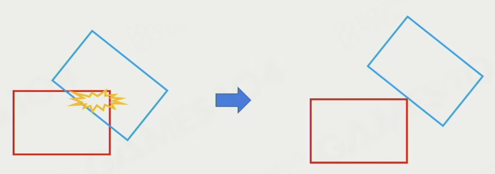

### Applying Penalty Force

第一种方法是向发生碰撞的两个物体各自施加一个**惩罚力**(penalty force)，将它们推开来。问题在于两个物体会迅速远离，看起来很假，因此现代引擎中很少会用这种方法。

    

### Solving Constraints

目前常用的方法是将这个力学问题转为数学上的约束问题，即**拉格朗日力学**(Lagrangian mechanics)。

- 碰撞约束包括非穿透(non-penetration)、弹性(restitution)和摩擦力(friction)
- 迭代求解

    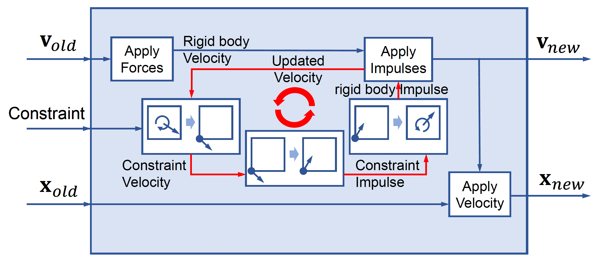

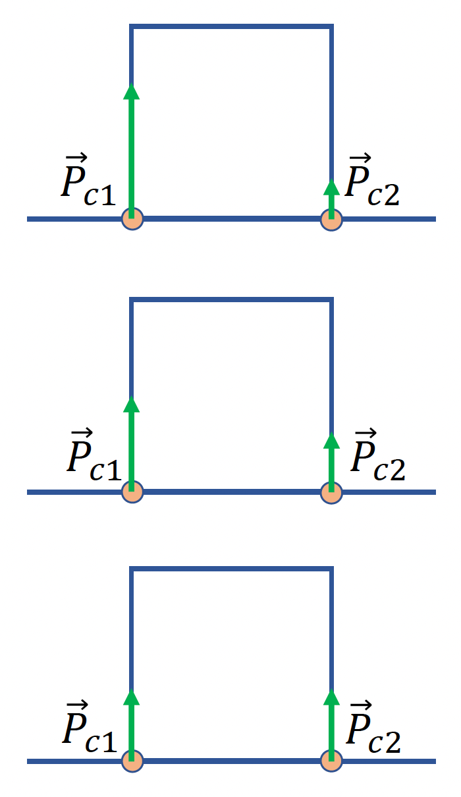{ align=right width=30% }

先只考虑求解有关速度的约束：

- 方法
    - 顺序冲量(sequential impulse)
    - 半隐式积分(semi-implicit integration)
    - 非线性高斯-赛德尔方法(non-linear Gaussian-Seidel method)
- 特点
    - 在很多情况下快速且稳定
    - 常用于多数物理引擎

## Scene Query

**场景查询**(scene query)是一种用于检测物体与场景几何体之间空间关系的机制。

### Raycast

- **射线投射**(raycast)是指将用户定义的射线与整个场景相交
- 可以定义点、方向、距离和查询模式

    

???+ example "例子"

    

        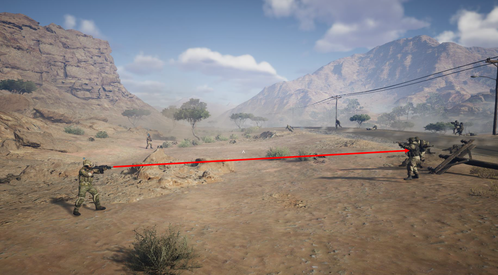
    

射线投射一般分为以下三类：

- **多命中**(multiple hits)：寻找所有阻塞命中

    

        
    

- **最近命中**(closest hit)：寻找所有阻塞命中，选择距离最小的一个

    

        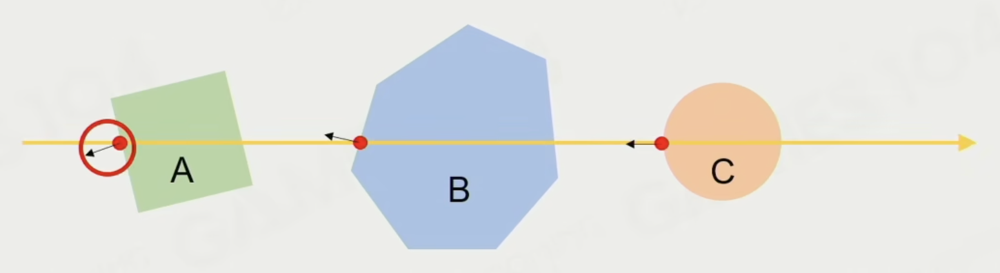
    

- **任意命中**(any hit)：任何遇到的命中都行

    

        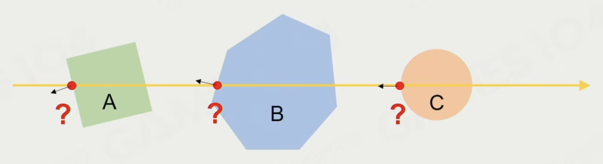
    

### Sweep

**扫掠**(sweep)在几何上类似于射线投射，但可以定义形状和姿态，包括盒子、球体、胶囊和凸形等。

    

    

???+ example "例子"

    

        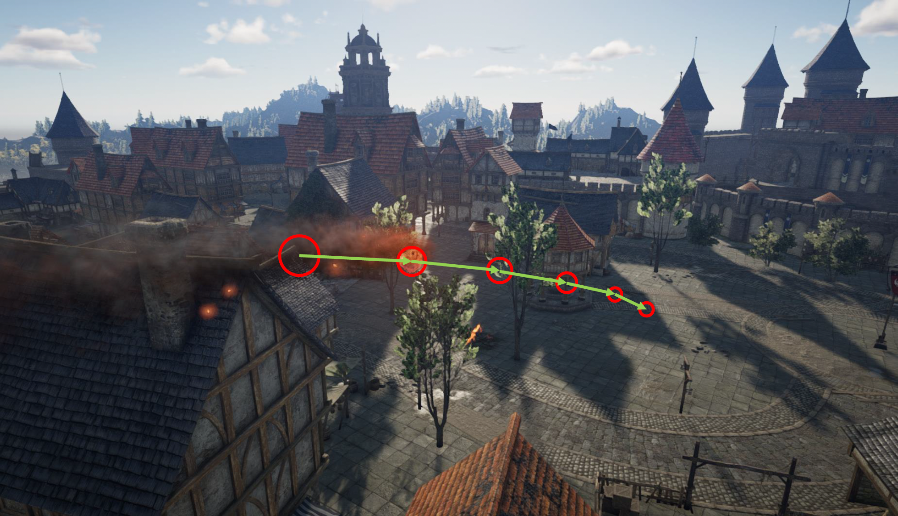
    

### Overlap

**重叠**(overlap)查询是指在指定形状包围的区域中搜索场景中的任何重叠对象。指定形状可以是矩形、球体、胶囊和凸形等。

    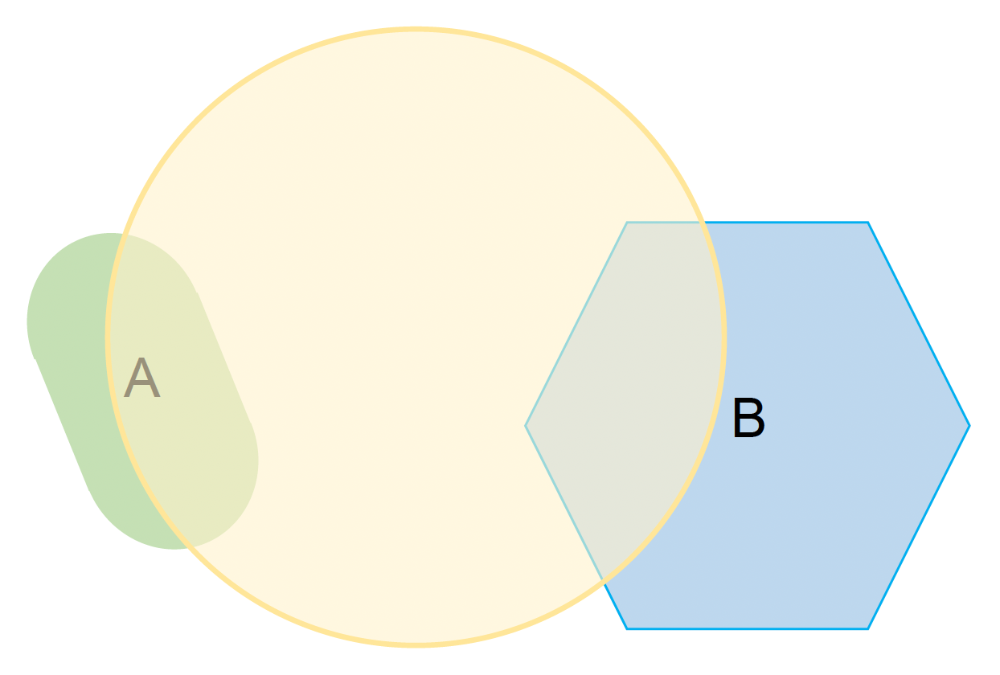

???+ example "例子"

    

        
    

### Collision Groups

{ align=right width=30% }

- 参与者具有碰撞组属性
    - 玩家：棋子(pawn)（即可操控角色）
    - 障碍物：静态
    - 可移动箱子：动态
    - 触发框：触发器

- 可以通过场景查询来过滤碰撞组
    - 玩家移动查询碰撞组：（棋子，静态，动态）
    - 触发器查询碰撞组：（棋子）

## Efficiency, Accuracy, and Determinism

### Simulation Optimization

物理世界中会把物体分为一个个的**岛屿**(island)，可简单理解成为物体分组。

    

- 之所以这么做，是因为要模拟和计算所有的刚体需花费大量资源
- 因此如果一段时间内属于某个岛屿的刚体没有移动，那该岛屿可进入休眠状态，直到再次受到外力作用

    

        
    

### Continuous Collision Detection

???+ example "反面教材"

    角色高速移动时，他的头直接卡在墙中...

    

        
    

造成这一 bug 的原因就是障碍物太薄 + 角色移动太快，碰撞检测的结果是两者之间没有任何交集，因而导致角色的穿墙。这种现象被称为**隧道效应**(tunneling)。

    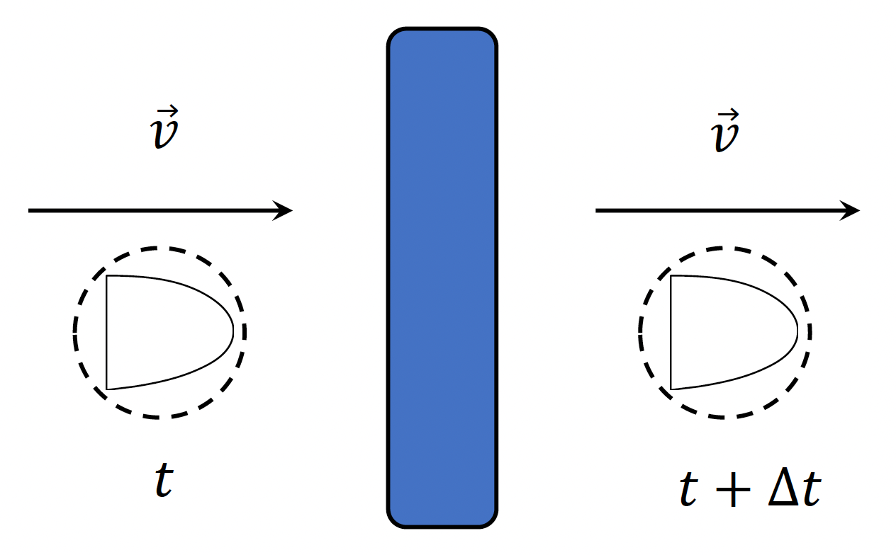

- 最简单的方法是把墙体做厚

    

        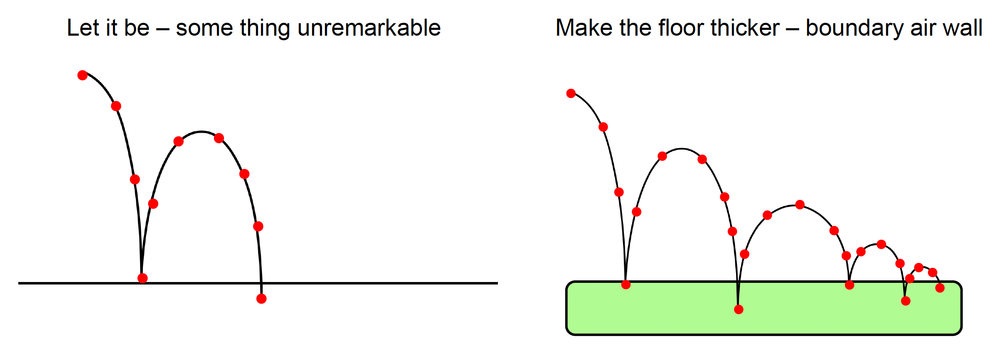
    

- **碰撞时间**（time-of-impact, **TOI**）：一种保守的推进方式
    - 估算 A 和 B 不会碰撞的“安全”时间子步
    - 将 A 和 B 向前推进这一段“安全”子步
    - 重复上述步骤，直到两者距离低于某个阈值

    

        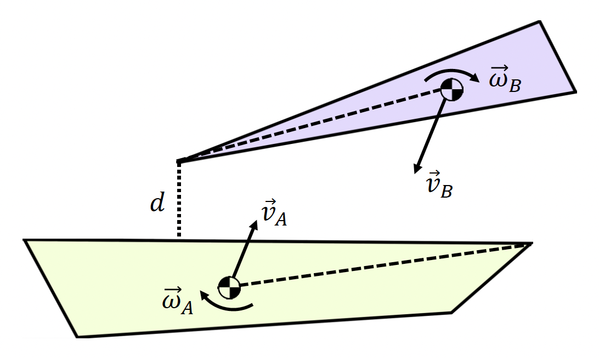
    

### Deterministic Simulation

???+ warning "多人游戏的挑战"

    - 游戏中的物理受游戏玩法影响
    - 即便是小错误也会产生蝴蝶效应
    - 同步状态需要足够的带宽
    - 同步输入需要确定性的模拟

???+ example "非确定性模拟的例子"

    

        
    

    左右两幅图是不同计算机上的相同输入，但模拟结果是不一致的

相同的旧状态 + 相同的输入 = 相同的新状态。要保证模拟的确定性，需满足以下要求：

- 物理模拟的步长是固定的
- 模拟求解的迭代顺序是一致的
- 浮点数一致性

??? example "例子"

    

        
    

    绿色链是解析解，而红色链是模拟结果，可以看到这两个解之间是非常不稳定的。

???+ example "确定性模拟的例子"

    

        
    

现代物理引擎实际上花了非常多的力气来解决确定性的问题，比如 UE 的 Chaos。之所以投入这么多，是因为一旦能保证确定性，多个客户端之间就没有必要同步很多复杂的物理状态，只需有相同的输入就能确保这些客户端能看到相同的物理世界。

到目前为止，物理对游戏而言相当重要，也是困难的一件事，不少 3A 大作会在物理方面出一些 bug。

??? example "~~Bug 合订本~~"

    

        
    
