# Physical System Application

## Character Controller

相比遵循物理规律的刚体动力学，**角色控制器**(character controller)具有以下特征：

- 可控制的刚体交互
- 几乎无限的摩擦力（不会被其他物体撞飞）/没有弹性
- 能几乎立即通过加速和刹车改变方向，并且能实现传送(transport)（从一个地方瞬间到另一个地方）

    

在早年的游戏中，角色控制是通过一些精心设置的值(tweaked values)实现的，给玩家以尽可能真实的感受。不过这种方法在现在看来早就过时了。

    

在现代游戏引擎中，要在物理系统中构建一个控制器，就要用前面提到的那种无视物理规则且能推动其他物体的**运动学参与者**(kinematics actor)。以人性角色为例，还需要用一个包围盒将其包裹，比如胶囊形、盒形、凸多边体等，其中常用的是**胶囊形**。

    

如上图所示，胶囊共有两层。其中内层是和其他物体发生碰撞的地方，而外层可看作是一种保护膜，防止和其他物体离得太近，从而避免在高速移动时陷入某些物体的困境。

我们通常为角色控制器新增沿墙壁**自动滑动**(auto slide)的功能，即角色面对着墙走的时候，实际上是沿着墙滑动而不会穿墙。大致的实现思路是先计算切线(tangent)方向，然后沿切线方向移动。

    

??? example "例子"

    

        
    

实现该功能可能会遇到以下问题：

- 把台阶或矮小障碍物看作墙壁，因此角色沿着它们滑动而非跨越
- 虚拟间距：比如游戏中的门要比正常的门稍微大一圈，防止角色卡住

??? example "例子"

    === "例1"

        

            
        

    === "例2"

        

            
        

对于斜坡，需要设置一个**最大可攀爬的斜率**(max climb slope)，使得角色在尝试攀爬超过该斜率的陡坡时会自动下滑（看起来较为符合物理规律）。如果游戏做的足够精细，那么角色下滑时脚的动作就要和攀爬和走路的动作有所区分。

??? example "例子"

    

        
    

一个值得注意的细节是角色控制器的形状和大小会随着游戏运行实时发生变化，但我们不能一下子更新整个角色控制器，否则就会产生卡在某个物体内等 bug。正确的做法是在更新前要检测是否和其他物体存在重叠，若存在就不要马上更新。

    

??? example "例子"

    

        
    

如果控制器和其他物体，尤其是和**动态参与者**(dynamic actor)发生碰撞时，应当对动态参与者施加一个碰撞的力，从而改变其运动状态，实现角色与环境的互动。

??? example "例子"

    

        
    

有时角色控制器会站在一个移动的平台上，如果不做特殊处理，角色就会从平台上掉下来。所以需要将角色的逻辑和平台的逻辑绑定在一起；若平台在某一帧前后发生移动，那么角色应当在下一帧中跟随移动。

??? example "例子"

    

        
    

综上，角色控制器并不是一种很复杂的技术，但需要考虑很多细节问题，并且它和用户的操作感直接相关。

## Ragdoll

**布娃娃**(ragdoll)系统是一种通过将角色骨骼简化为受物理规则约束的刚体组合，从而在角色死亡或失去意识时实时模拟出符合重力与碰撞效果的动力学技术（下图左三）。如果没有布娃娃系统，角色被击杀时其模型就会僵在那里，看起来会非常违和（下图左二）。

    

实现方法是将骨架的关键关节映射到刚体上。

    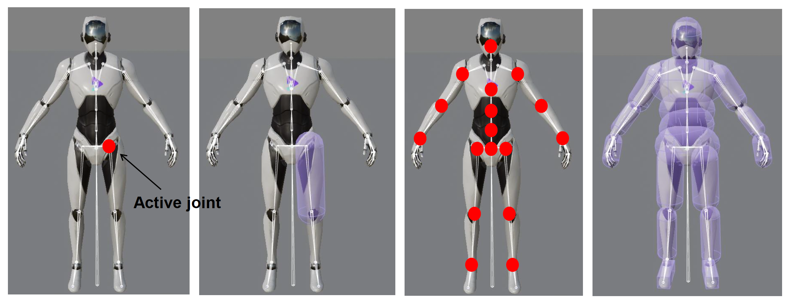

不要忘记考虑人体关节的约束，不然看起来会非常怪。

??? example "例子"

    用一个点拎着机器人角色随意移动。左图是添加正确约束的情况，可以看到角色的骨骼运动是比较自然的。

    

        
    

我们可以借助 DCC 工具自由设置每个关节的的自由度，从而实现对关节点个性化的约束。

    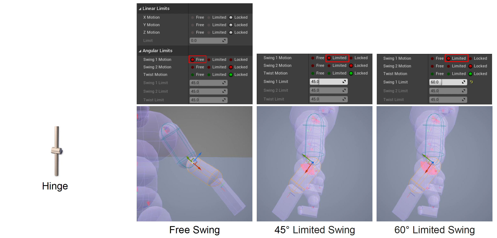

需要小心为关节调整约束，这种活一般由 TA（技术美术）负责。一个准则是刚体应尽可能贴合网格。

    

设置好关节点后，就要为骨架添加布娃娃的动画。一般将关节分为以下三类：

{ align=left width=30% }

- 中间关节(immediate joint) -> 绑定姿态(bind pose)

- 活跃关节(active joint) -> 刚体姿态(rigid body pose)

- 叶关节(leaf joint) -> 动画姿态(animation pose)

为了让普通动画和布娃娃系统之间有一个自然的过渡，通常会将两者混在一起用。布娃娃系统的状态分为：

- **运动学状态**(kinematics state)：此时刚体仍然由**动画**驱动
- **动态状态**(dynamic state)：刚体由**物理**模拟

    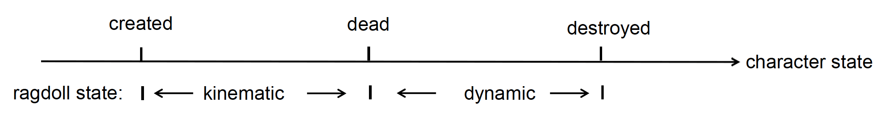

??? example "例子"

    === "例1"

        

            
        

    === "例2"

        

            
        

## Clothing

### Animation-Based Cloth Simulation

基于动画的衣料模拟在移动端游戏中常见。它的流程为：

- 动画师为骨骼制作动画
- 通过 DCC 工具生成更多的动画数据
- 游戏运行时，引擎重放这些动画

!!! recommend "优点"

    - 成本低
    - 可控制

!!! bug "缺点"

    - 不真实
    - 无法与环境交互
    - 衣料的设计是有限的

??? example "例子"

    

        
    

### Rigid Body-Based Cloth Simulation

基于刚体的衣料模拟多见于像尾巴、特殊发型和挂件等物品上。它的特点为：

- 衣料的骨骼受刚体和指定的约束限制
- 其效果受物理引擎影响

!!! recommend "优点"

    - 成本低
    - 可交互

!!! bug "缺点"

    - 质量不确定
    - 动画师的工作负担大
    - 不健壮
    - 需要高性能的物理引擎

??? example "例子"

    

        
    

### Mesh-Based Cloth Simulation

现代游戏引擎的主流趋势是用基于**网格**的衣料模拟方法。首先要注意的是，这里的网格（称为物理网格(physical mesh)）和渲染用的网格不是同一个东西。可以看到，渲染网格的数目相当大，显然物理引擎无法所有网格进行实时处理。一般来说，物理引擎用的网格数只有原来的 1/5-1/4，甚至只有 1/10。

    

然后要为每个网格设置约束，具体来说是为每个顶点添加一个最大半径约束，即移动范围。不可将幅度设置过大，否则很容易出现穿模的问题。

    

接下来艺术家们可根据需要为不同材质的衣料设置合适的属性。

    

#### Mass-Spring System

但对于游戏引擎工程师而言，衣料模拟的物理基础是**质点-弹簧系统**(mass-spring system)。

- 弹簧（形变）力（胡克定律）：$\vec{F}^S = k_{\text{spring}} \Delta \vec{x}$
- 弹簧阻尼(damping)力（空气阻力）：$\vec{F}^D = -k_{\text{damping}} \vec{v}$
    - 如果不设置这个力，可能会在多轮数值迭代过程中累积大量误差，结果会不稳定
- 把衣料看作由无数个质点-弹簧组成的，并且对于网格上的每个顶点，不仅要增加横向和纵向的弹簧，还要沿对角线添加弹簧；有时还会横跨多个质点添加弹簧，从而不让衣料随意折叠

    

        
    

- 计算一个顶点受到的力

    $$
    \vec{F}_{\text{net}}^{\text{vertex}}(t) = M\vec{g} + \vec{F}_{\text{wind}}(t) + \vec{F}_{\text{air resistance}}(t) + \sum_{\text{Springs} \in v} (k_{\text{spring}}\Delta \vec{x}(t) - k_{\text{damping}}\vec{v}(t)) = M\textcolor{red}{\vec{a}(t)}
    $$

    - 重力
    - 风力
    - 空气阻力
    - 与顶点相连的所有弹簧施加的弹力（形变力 + 阻尼力）

- 用积分计算下一时刻的位置，在衣料模拟中通常用 **Verlet 积分**
    - 这种积分基于之前介绍的**半隐式欧拉法**
    - 观察到当前速度可根据上一时刻的位置和时间间隔得到，所以 Verlet 积分无需考虑速度，因此计算更快且更稳定（计算速度可能会有误差）

    $$
    \vec{x}(t + \Delta t) = 2\vec{x}(t) - \vec{x}(t - \Delta t) + \textcolor{red}{\vec{a}(t)}(\Delta t)^2
    $$

#### Position Based Dynamics

现在布料模拟的主流方法是**基于位置的动力学**(position based dynamics, **PBD**)。前面介绍的方法需要经过“约束 -> 力 -> 速度 -> 位置”这样一个计算过程。而 PBD 的物理基础是**拉格朗日力学**，可直接根据约束解出位置，无需关心力和速度。

这种方法的优点是求解速度快且稳定。

??? example "例子"

    

        
    

### Self Collision

作为一种柔性材料，衣料可以折叠，并与自身碰撞（**自碰撞**(self collision)）。在实时游戏的物理模拟中，这是一个非常棘手的挑战。常见的解决手段有：

- 加厚衣料

    

        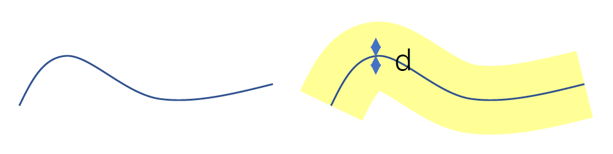
    

- 将单个物理模拟步划分为多个子步骤

    

        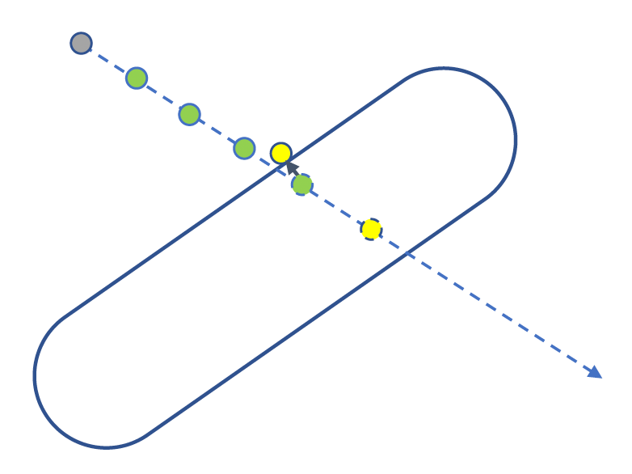
    

- 设置最大速度

    

        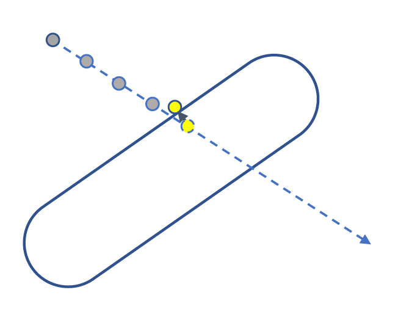
    

- 引入接触约束和摩擦约束：衣料内设置一段 **SDF**（符号距离场），当衣料之间发生碰撞时，会为衣料提供一个反向的冲量将其弹开

    

        
    

## Destruction

**破坏**(destruction)系统对现代游戏引擎而言非常重要，不仅因为它提供一种视觉效果，还让游戏变得更加生动并富有沉浸感，因此它是很多游戏中的关键机制。

??? example "例子"

    

        
    

具体实现为：

- **块层级**(chunk hierarchy)：按层级组织被打破的块(fractured chunks)，每一级代表不同程度的破坏力度

    

        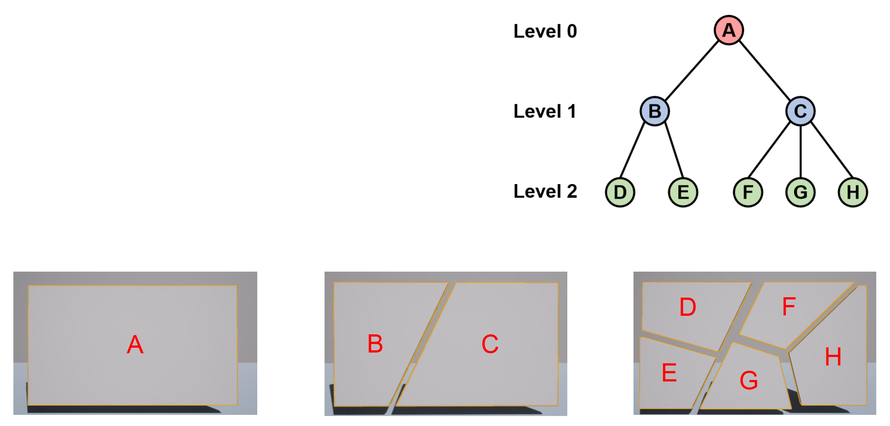
    

- **连接图**(connectivity graph)：为最深层的块构建连接图
    - 节点表示一个块
    - 边表示两个块之间的接触面
    - 运行时更新

    

        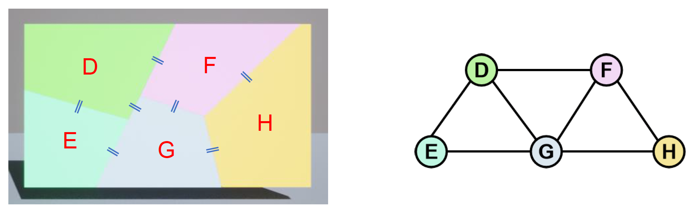
    

- **连接值**(connectivity value)：连接图的每条边都有一个阈值（硬度）
    - 表示打破这条边所需的破坏值
    - 每次造成破坏后更新
    - 当数值降到 0 时打破该边

    

        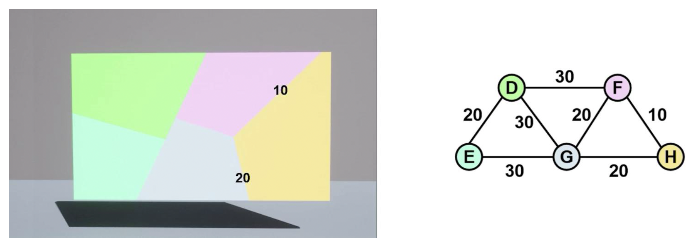
    

- 破坏计算
    - 在冲击点计算冲击造成的破坏：$D = \dfrac{I}{H}$，其中 $I$ 为施加的冲击（比如碰撞），$H$ 为刚体的材质硬度
    - 破坏分布：距离冲击点 $d$ 造成的破坏为

        { align=right width=30% }

        $$
        D_d = \begin{cases} D & d \leq R_{\min} \\ D \cdot \left( \frac{R_{\max} - d}{R_{\max} - R_{\min}} \right)^K & R_{\min} < d < R_{\max} \\ 0 & d \geq R_{\max} \end{cases}
        $$

        - $D$：在冲击点上的破坏
        - $R_{\min}$：最小破坏半径
        - $R_{\max}$：最大破坏半径
        - $k$：破坏衰减(fall off)指数

做好破坏处理后，接下来就将这个物体和世界连接起来，比如挂在墙上，这就需要用到**支撑图**(supporting graph)。这样做的好处是破坏只针对特定区域，不会把整个东西破坏掉。

    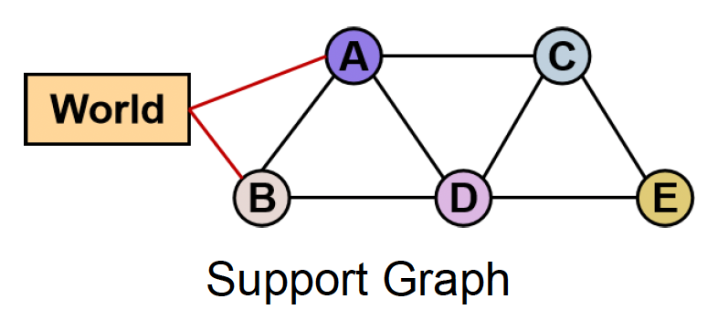

??? example "例子"

    

        
    

### Voronoi Diagram

手动分割块太费劲，所以通常采用一种名为 **Voronoi 图**(Voronoi diagram)的方法。其思路是：

- 在空间上随机播撒一些**种子**(seeds)
- 然后用一组到每个种子距离相等的边界线分割空间，这样每个区域内就有一颗种子，区域内的点离同一区域的种子比离其他种子更近
- 这很像植物细胞的划分，种子对应植物的细胞核

    

- 在 2D 网格的应用
    - 在网格的包围盒中随机挑选 N 个点，构建 Voronoi 图
    - 将每个 Voronoi 单元与网格相交，得到该网格的所有破碎块

    

        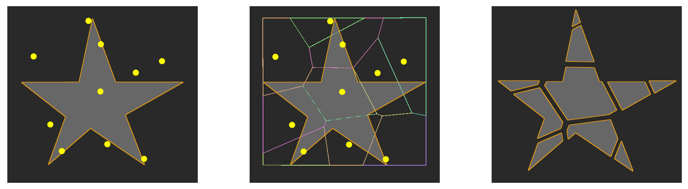
    

- 在 3D 网格的应用
    - 类似 2D 网格的情况，但并不简单，因为需要为所有的破碎面生成新的三角形

        

            
        

    - 生成方法：通常通过 **Delaunay 三角化**(triangulation)（与 Voronoi 图互为对偶），并（为断痕处）应用新的纹理和纹理坐标

        

            
        

        - 纹理生成的方法有
            - 生成 3D 纹理（太复杂）
            - 离线计算纹理坐标，一旦因破坏打碎后就应用上去

        - 如果考虑碎块之间的碰撞，计算成本太高，所以一般不会对其进行物理逻辑的计算

    - UE 可指定不同的破碎模式
        - 均匀随机模式(uniform random pattern)
        - 簇状模式(clustered pattern)
        - 径向模式(radial pattern)
        - ...

        

            
        

### Destruction in Physics System

- 破坏一般是在碰撞后再处理的
- 破坏后可能会生成新的刚体

    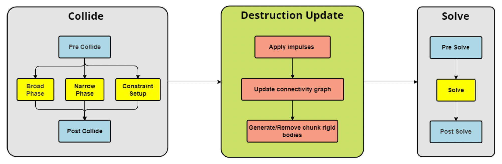

### Make it More Realistic

破坏发生时，除了物体变成碎片外，为了给玩家更真实的体验，还需要以下回调事件：

- 声音效果
- 粒子效果
- 导航更新
- ...

??? example "例子"

    === "例1"

        

            
        

    === "例2"

        

            
        

### Issues

- 谨慎添加破坏效果
    - 因为碎片太多可能会导致更大的性能开销

    ??? example "例子"

        

            
        

- 艺术家设计破坏效果时的经验之谈
    - 许多参数需要调整，例如断裂参数(fracture parameters)
    - 生成表现高度依赖于创作工具

    

        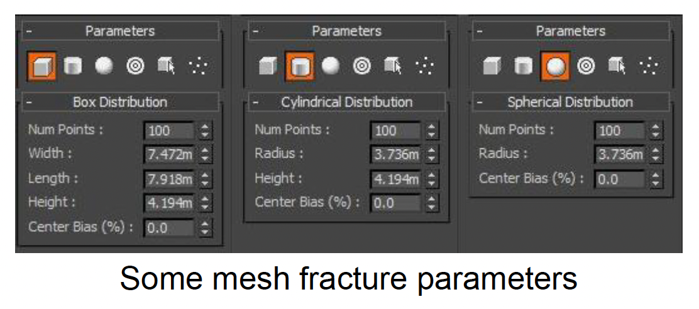
    

### Popular Destruction Implementations

- NVIDIA APEX 破坏系统
    - 广泛应用于游戏（支持 UE4）
    - 官方破坏制作工具（PhysX Lab）
    - 2017 年已弃用

- NVIDIA Blast 破坏系统
    - APEX 的继任者
    - 更好的性能、可扩展性和灵活性

    ??? example "例子"

        

            
        

- Havok 破坏系统
    - 广泛应用于游戏（在 Unity 中得到支持）
    - 性能良好，功能多样
    - ~~自从被微软收购后，许可费用很高~~

    ??? example "例子"

        

            
        

- Chaos 破坏系统（Epic Games）
    - 支持完整的工具链
    - 已正式在 UE5 中得到支持

    ??? example "例子"

        

            
        

## Vehicle

借助游戏引擎的载具系统，可以设计各种样式的载具，从风格化到写实风。

    

最简单的载具模型是一个由底盘和轮子构成的刚体参与者。轮子和底盘之间用弹簧连接，构成了**悬挂**(suspension)系统。

    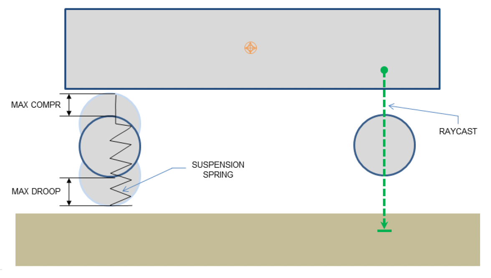

### Forces

要让载具动起来，首先得有一个来自发动机的**牵引力**(traction force)。引擎产生的扭矩会通过齿轮(gears)层层传递，最后经差速器(differential)转换后传给车轮。

    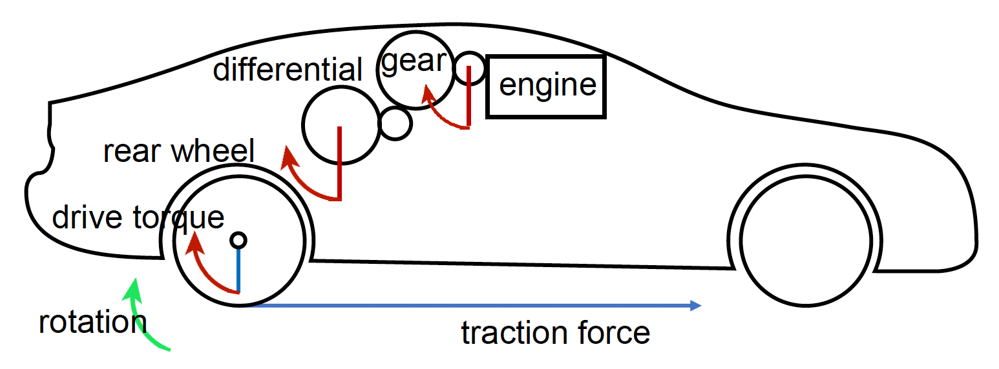

- 扭矩：$T = T_{\text{engine}} X_g X_d n$
- 牵引力：$\vec{F}_{\text{traction}} = \dfrac{T}{R_w} \vec{u}$

其中：

- $\vec{u}$：反映车辆方向的单位向量
- $T$：车轮扭矩
- $T_{\text{engine}}$：由曲线表示的发动机扭矩
- $X_g$：齿轮比率
- $X_d$：差速器比率
- $n$：传输效率
- $R_w$：车轮半径

还有一个需要考虑的力是**悬挂力**(suspension force)，应用在底盘和悬挂系统的连接点上，并且对每个轮子需要独立计算。计算公式为：
$$
|\vec{F}_{\text{suspension}}| = k (L_{\text{rest}} - (L_{\text{hit}} - R_w))
$$

- $k$：弹簧刚度
- $R_w$：车轮半径
- $L_{\text{rest}}$：弹簧的静止长度
- $L_{\text{hit}}$：射线投射命中的距离（图中红线）

    

最后需要考虑的力是**轮胎力**(tire force)，它分为：

- **纵向力**(longitudinal force)

    $$
    F_{\text{long}} = F_{\text{traction}} + F_{\text{drag}} + F_{\text{rr}} 
    $$

    - $F_{\text{rr}}$：滚动阻力

    

        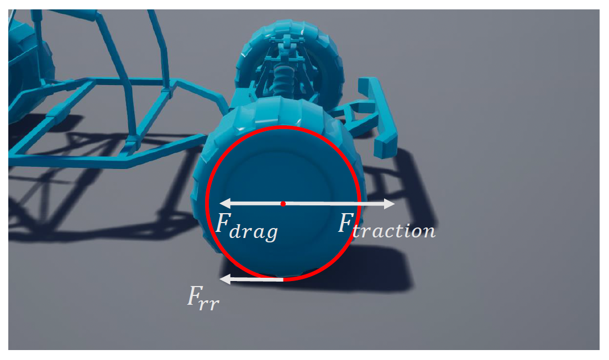
    

- **侧向力**(lateral force)

    $$
    F_{\text{lateral}} = C_c \cdot \alpha
    $$

    - $C_c$：转向刚度(cornering stiffness)
    - $\alpha$：侧滑角

    

        
    

### Center of Mass

对载具而言另一个很重要的概念是**质心**(center of mass)。它应当是一个可调整的参数。对于下图所示模型，计算公式为：

    

$$
\begin{aligned}
M &= M_1 + M_2 \\
\vec{x}_{cm} &= \frac{M_1 \vec{x}_1 + M_2 \vec{x}_2}{M}
\end{aligned}
$$

- $M_1, M_2$：弹簧质量
- $\vec{x}_1, \vec{x}_2$：在参与者空间中的弹簧质心坐标
- $M$：刚体质量
- $\vec{x}_{\text{cm}}$：刚体质心偏移量

质心对以下方面产生影响：

- 载具的操控、加速和牵引
- 载具在空气中的稳定性
    - 质心靠前 -> 不稳定（车头会往前栽）
    - 质心靠后 -> 稳定

    ??? example "例子"

        

            
        

- 载具的转向控制(steering control)
    - 质心靠前 -> 转向困难（转向力不足）
    - 质心靠后 -> 转向容易

    ??? example "例子"

        

            
        

### Weight Transfer

乘车的时候通常会有这样一种感受：加速时感觉车头稍微抬起一点点，刹车时感觉车头稍微按下去一点点。这种现象被称为**重量转移**(weight transfer)，它影响了轮胎的最大牵引力。计算公式为：

$$
\begin{aligned}
\vec{F}_f &= \frac{L_f}{L} M \vec{g} \mp \frac{H}{L} M \vec{a} \\
\vec{F}_r &= \frac{L_r}{L} M \vec{g} \pm \frac{H}{L} M \vec{a} \\
\vec{F}_{\text{traction}} &= \mu \vec{F}_{\text{suspension}}
\end{aligned}
$$

- $M$：载具重量
- $\mu$：轮胎的摩擦系数

??? example "例子"

    

        
    

### Steering Angles

如果载具的两个导向轮的方向角一样，那么外侧轮实际上是空转的，它提供的转向力是不足的。实际上内侧轮转的角度会更大点，而外侧轮转的更小些，并且它们有一个距离很远的旋转中心，以轮胎重心和旋转中心连线的垂线作为旋转角的测量依据。这被称为 **Ackermann 转向**(steering)。计算公式为：

    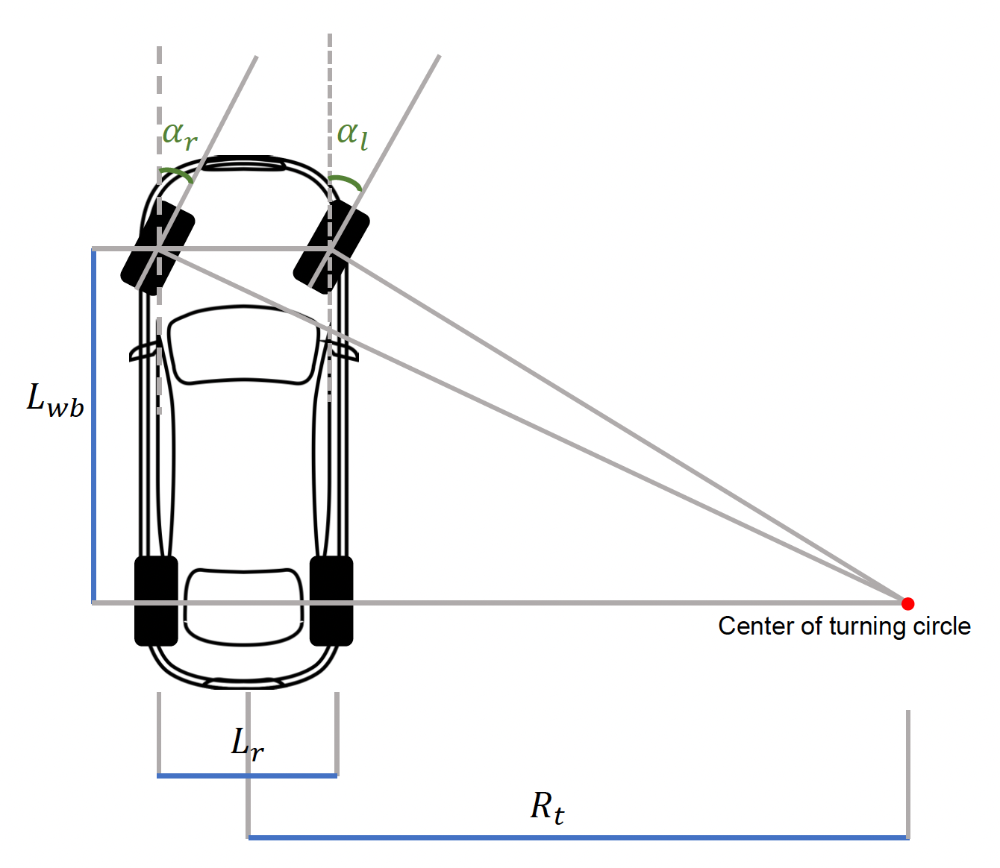

$$
\begin{aligned}
\alpha_l &= \tan^{-1} \frac{L_{wb}}{R_t + \frac{L_r}{2}} \\
\alpha_r &= \tan^{-1} \frac{L_{wb}}{R_t - \frac{L_r}{2}}
\end{aligned}
$$

- $L_{wb}$：轴距(wheel base)长度
- $L_r$：后轮距(reat track)长度
- $R_t$：转向半径(turn radius)

??? eaxmple "例子"

    

        
    

### Advanced Wheel Contact

下面列举一些计算轮胎和地面接触的技术：

    

## Advanced: PBD / XPBD

### PBD

前面在衣料模拟部分中简单提到过 [PBD](#position-based-dynamics)，下面就接着详细介绍这一技术。

=== "圆周运动"

    >$r$ 为圆周运动半径

    - 位置约束：$C(\mathbf{x}) = \|\mathbf{x} - r\| = 0$
    - 速度约束：$\dfrac{d}{dt} C(\mathbf{x}) = \underbrace{\dfrac{dC}{d\mathbf{x}}}_{\mathbf{J}} \underbrace{\dfrac{d\mathbf{x}}{dt}}_{\mathbf{v}} = 0$
        - 其中 $\mathbf{J}$ 是**雅可比矩阵**，我们可将其看作是一个行向量，显然 $\mathbf{J}^\top$ 和 $\mathbf{v}$ 垂直
        - 将速度变换至速度约束

=== "弹簧"

    $$
    C_{\text{stretch}}(\mathbf{x}_1, \mathbf{x}_2) = \|\mathbf{x}_1 - \mathbf{x}_2\| - d
    $$

    

        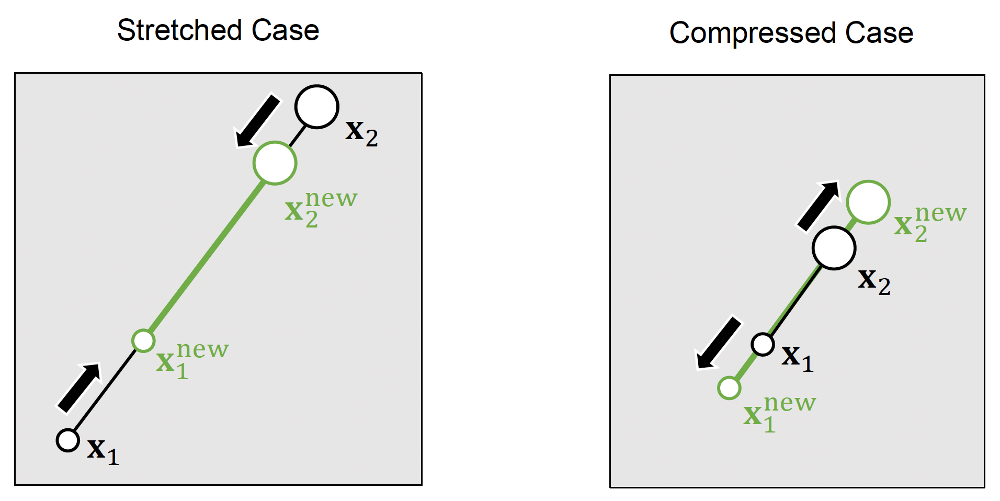
    

{ align=right width=30% }

找出约束后，接下来怎么根据这些约束计算点的位置呢？这便引入了 PBD 的思想。对于雅可比矩阵 $\mathbf{X}^{(k)'} = \begin{bmatrix}\mathbf{x}_1^{(k)'} & \dots & \mathbf{x}_n^{(k)'}\end{bmatrix}^\top$（$k = 0$ 时就是直接通过积分计算得到的位置，$k > 0$ 时表示经上轮迭代纠正后的位置），通过以下方式迭代计算（$\lambda$ 表示步长）：

$$
\begin{aligned}
& C\left(\mathbf{X}^{(k)^{\prime}}+\Delta \mathbf{X}\right) \approx C\left(\mathbf{X}^{(k)^{\prime}}\right)+\nabla_{\mathbf{X}} C\left(\mathbf{X}^{(k)^{\prime}}\right) \cdot \Delta \mathbf{X}=0 \\
& \Delta \mathbf{X}=\lambda \nabla_{\mathbf{X}} C\left(\mathbf{X}^{(k)^{\prime}}\right)
\end{aligned}
$$

将第二个方程代入第一个，得到：
$$
C\left(\mathbf{X}^{(k)^{\prime}}\right)+\nabla_{\mathbf{X}} C\left(\mathbf{X}^{(k)^{\prime}}\right) \cdot \lambda \nabla_{\mathbf{X}} C\left(\mathbf{X}^{(k)^{\prime}}\right)=0
$$

解得：
$$
\lambda=-\frac{C\left(\mathbf{X}^{(k)^{\prime}}\right)}{\left\|\nabla_{\mathbf{X}} C\left(\mathbf{X}^{(k)^{\prime}}\right)\right\|^{2}} \quad \Delta \mathbf{X}=-\frac{C\left(\mathbf{X}^{(k)^{\prime}}\right)}{\left\|\nabla_{\mathbf{X}} C\left(\mathbf{X}^{(k)^{\prime}}\right)\right\|^{2}} \nabla_{\mathbf{X}} C\left(\mathbf{X}^{(k)^{\prime}}\right)
$$

>其实就是梯度下降法吧...

下面给出标准的 PBD 算法伪代码：

    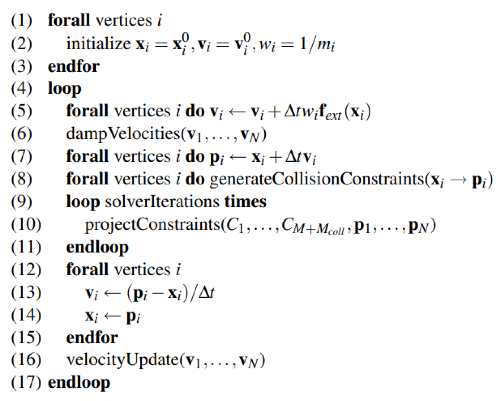

- 5-7：半隐式积分
- 8
    - 若发生碰撞，则生成相应的约束
    - 当开始模拟时，将结构化的约束进行初始化
- 9-11：求解积分
- 12-15：更新状态
- 16：碰撞顶点的速度根据摩擦系数和弹性系数进行修改

???+ note "评价"

    - 将约束转换为对位置的校正
    - 多数情况下快速、稳定
    - 难以控制约束满足，不能优先处理碰撞约束
    - 常用于游戏中的衣料模拟
    - [NVIDIA FleX](https://developer.nvidia.com/flex)

??? example "例子"

    

        
    

### XPBD

**XPBD** 全称为扩展位置动力学(extended position based dynamics)。它是一种基于 PBD 的优化，是比较前沿的一种技术，其特点为：

- 将**合规性**(compliances)作为约束刚度的逆来处理无限的刚度约束（刚体）
    - 块对角合规矩阵(block diagonal compliance matrix)：

        $$
        U(\mathbf{X})=\frac{1}{2} C(\mathbf{X})^{\mathrm{T}} \alpha^{-1} C(\mathbf{X})
        $$

- 将**刚体朝向**重新引入到 XPBD，用于刚体模拟
- UE 的 Chaos 物理引擎就用到了 XPBD 技术

??? example "例子"

    

        
    
