# Effects

??? example "游戏**特效**(effects)的例子"

    

        
    

## Particle System

??? info "历史"

    >A particle system is a collection of many many minute particles that together represent a fuzzy object. Over a period of time, particles are generated into a system, move and change from within the system, and die from the system.
    >—— William Reeves, "Particle Systems—A Technique for Modeling a Class of Fuzzy Objects," ACM Transactions on Graphics 2:2 (April 1983), 92.

    第一款引入粒子系统的游戏：Star Trek II: The Wrath of Khan（1982）

    

        
    

游戏中的**粒子**(particles)通常是[精灵](8.md#sprite-animation)或 3D 模型，具有以下属性：

- 位置
- 速度
- 大小
- 颜色
- 生命周期(lifetime/life cycle)

    

        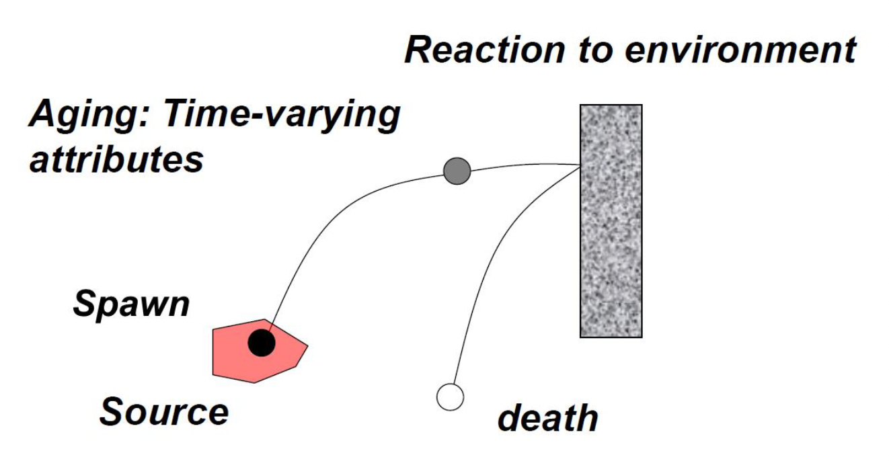
    

    - 生成(spawn)
    - 老化
    - 与环境交互
    - 死亡

- ...

**粒子发射器**(particle emitter)用来定义粒子模拟，为每个粒子赋予随机的初始值，包括：

    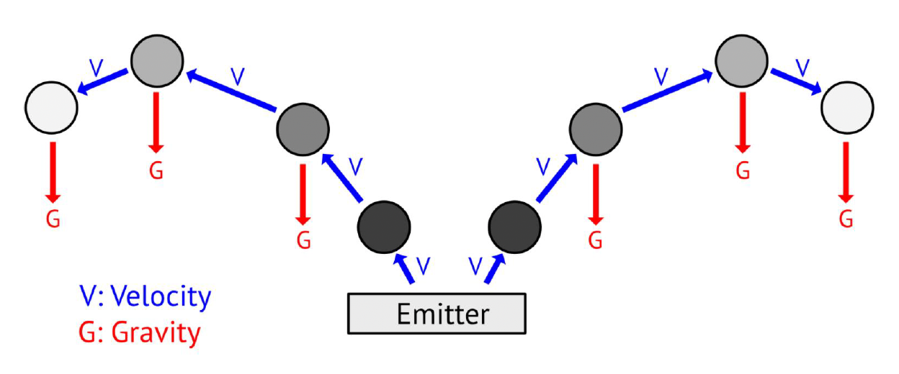

- 指定生成规则
    - 位置：

        

            
        

    - 模式：
        - 连续(continuous)
            - 每帧的生成速率可变
            - 基于时间/距离/...
        - 突发(burst)：立刻生成和模拟所有的粒子

        ??? example "粒子"

            

                
            

- 指定模拟逻辑
    - 常见的力：

        

            
        

        - 重力(gravity)：$f = mg$
        - 粘滞阻力(viscous drag)：$f = -k_d v$
        - 风场(wind field)：$f = kv_{\text{wind}}$

    - 模拟控制粒子随时间的变化：在每一帧中，加速度更新速度，速度更新位置

        

            
        

    ??? example "例子"

        === "例1：添加旋转效果"

            

                
            

        === "例2：改变颜色和大小"

            

                
            

        === "例3：考虑碰撞（粒子与环境的互动）"

            

                
            

- 描述如何渲染粒子
    - 粒子类型

        

            
        

        - **广告牌粒子**(billboard particle)
            - 最经典的粒子效果
            - 粒子是精灵，但看起来像 3D 模型
            - 始终面朝相机
            - 如果粒子较大，建议用动态纹理（外观随时间变化），~~这样不容易穿帮~~
        
            

                
            

            ??? example "例子"

                

                    
                

        
        - **网格粒子**(mesh particle)
            - 粒子是 3D 模型
            - 具有一定的随机性，使得看上去更自然真实

            ??? example "粒子"

                由爆炸产生的碎石块

                

                    
                

        - **条带粒子**(ribbon particle)
            - 通过连接粒子（下图用红点表示），并在相邻粒子之间渲染四边形(quads)来创建条带(strip)

                

                    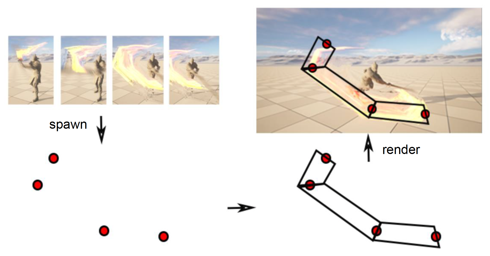
                

            - 问题：形状不够平滑，折线之间的夹角尖锐

                

                    
                

                ??? example "例子"

                    

                        
                    

            - 解决方案：使用**向心**(centripetal) **Catmull-Rom 插值**进行平滑处理
                - 在粒子间增加额外的线段(segments)
                - 可以设置线段数量
                - 需要更多的 CPU 资源

                

                    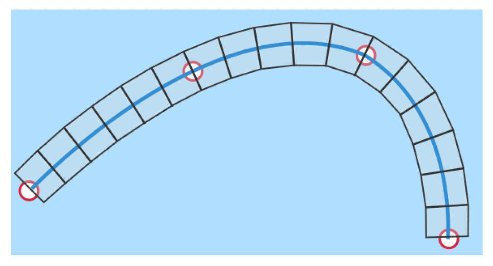
                

                ??? example "例子"

                    

                        
                    

**粒子系统**(particle system)就是独立的粒子发射器组合而成的集合。

    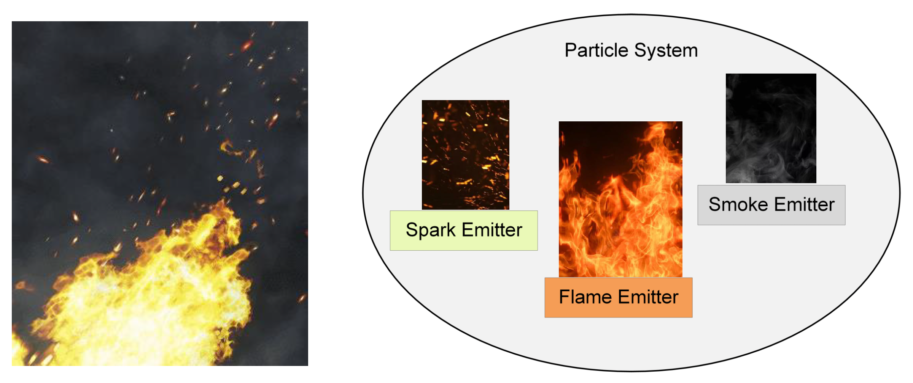

??? example "例子"

    可简单看作几个粒子发射器的组合。

    

        
    

### Particle System Rendering

渲染粒子时，首先遇到的挑战是透明物排序。如果排序没做好，效果就会一塌糊涂。排序的核心要点是一定得按由远及近的顺序绘制透明物，这样才能保证**阿尔法混合顺序**(alpha blending order)的正确性。

    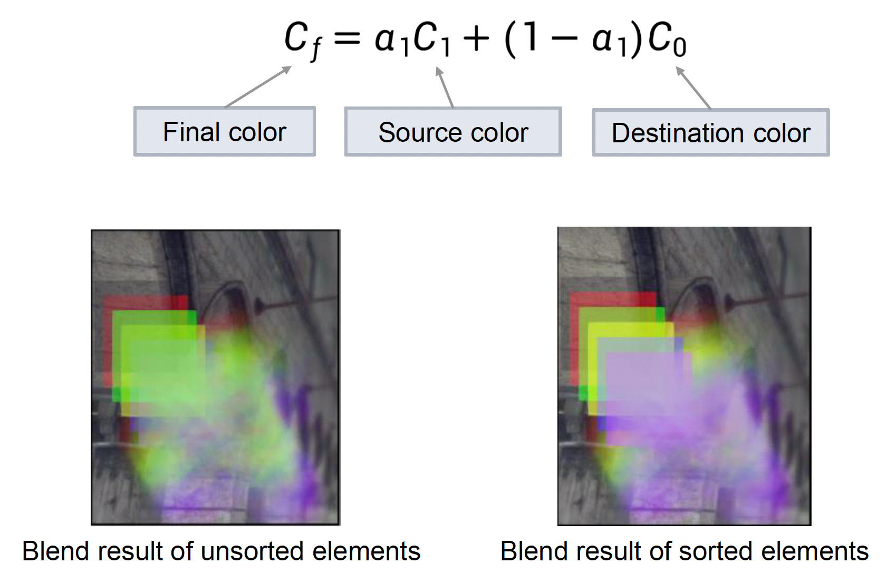

由于粒子动辄会以成百上千计地出现，那么如何对它们排序呢？通常会采取以下两种方式之一：

    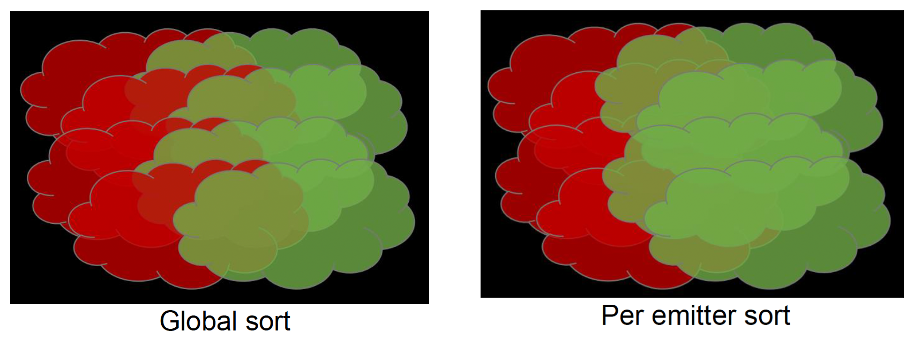

- **全局**(global)：
    - 将来自所有系统的粒子一起排序
    - 精确，但是性能开销大，不建议采用
- **层级**(hierarchy)：逐系统 -> 逐发射器 -> 发射器内部

而排序规则为：

- 粒子间：基于粒子到相机的距离
- 系统/发射器间：包围盒

??? example "例子"

    === "逐发射器排序"

        

            
        

    === "全局排序"

        

            
        

有些画面精美的游戏可能具有大量粒子（**全分辨率粒子**(full-resolution particles)），用于营造更有沉浸感的环境，使游戏世界看起来更加真实。

- 绘制顺序：先绘制不透明(opaque)的场景，再绘制透明粒子

    

        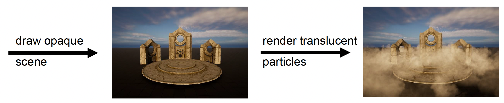
    

- 问题：
    - 计算成本高
    - 最坏情况下粒子布满整个屏幕，导致游戏性能迅速下降

因此现代游戏采取的应对措施是将屏幕分辨率减半（**半分辨率**(half resolution)），这样需要渲染的粒子数量就降至原来的 1/4（**降采样**(downsampling)）。最后要为所有粒子集体计算一个 alpha 值，然后和不透明物体进行混合，混合的结果进行**升采样**(upsampling)后就得到了最终渲染的效果。

    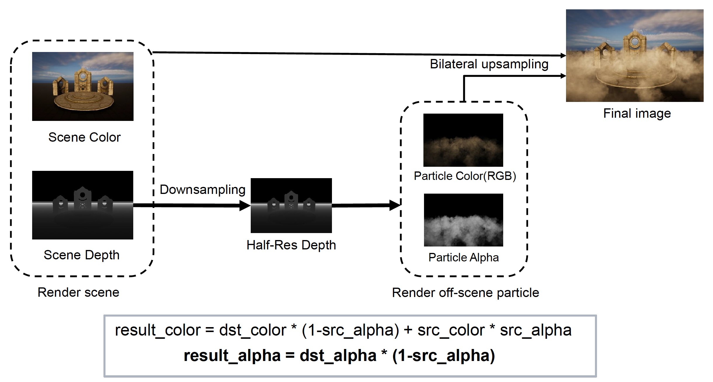

### GPU Particle

采用 GPU 处理粒子的原因：

- 其高度并行化的特征适合大量粒子的模拟
- 解放 CPU，让它专注于游戏代码的处理
- 易于访问深度缓冲区，以进行碰撞检测

**计算着色器**(compute shader)提供高速的通用计算，并利用 GPU 上大量的并行处理器。

    

具体来说，需要定义以下数据结构：

- **粒子池**(particle pool)：存储所有粒子数据的缓冲区
- **死亡表**(dead list)：
- **存活表**(alive list)：

=== "初始状态"

    

        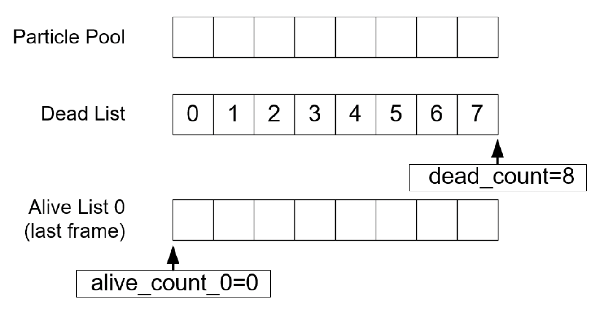
    

    - 粒子池为空，至多能包含 8 个粒子
    - 所有粒子均处于 DEAD 状态

=== "生成粒子"

    

        
    

    - 现在发射了 5 个粒子，需调度(dispatch) 5 个计算着色器线程进行生成计算
    - 对死亡表和存活表的访问需要是**原子的**(atomic)

=== "模拟"

    

        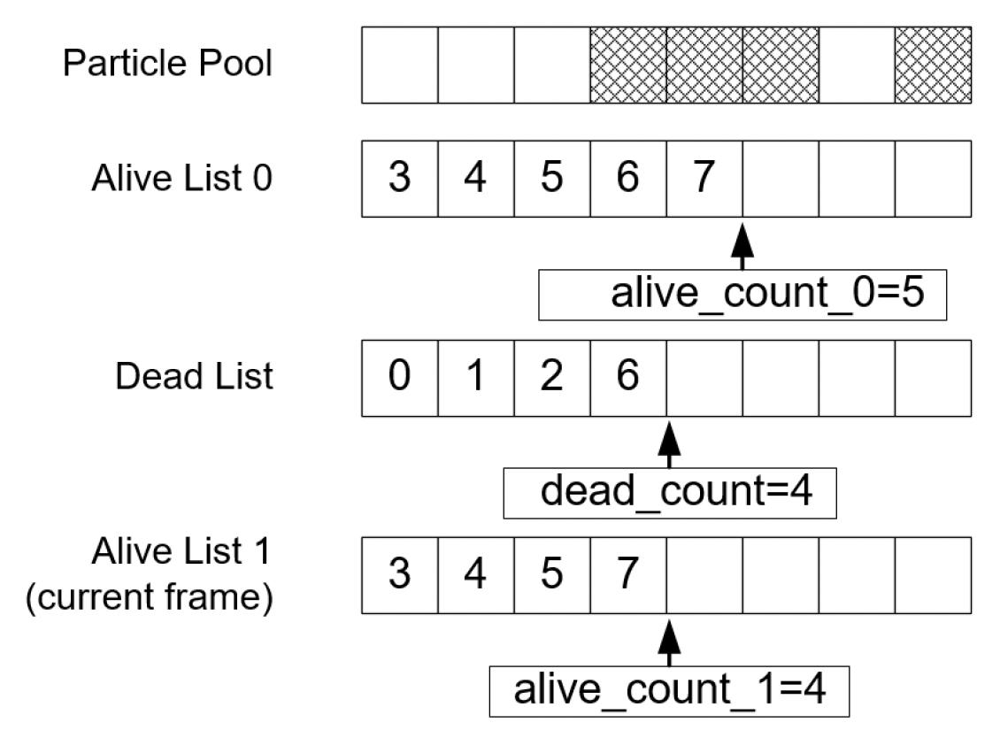
    

    - 计算位置、速度，进行深度碰撞等。并将数据写回粒子池
    - 此时粒子 6 已死亡
    - 调度 `alive_count_0` 线程
    - 仍以原子方式访问死亡表和存活表 1

    

        
    

    - 进行视锥剔除(frustum culling)，得到所有可见的粒子，并将计算出的距离写入距离缓冲区内
    - 此时粒子 5 已被剔除

=== "排序、渲染和交换存活表"

    - 根据距离缓冲区对筛选后的存活表进行排序

        

            
        

    - 在剔除后渲染已排序的存活粒子表

        

            
        

    - 交换存活表

        

            
        

其中排序是一件比较困难的事。在 GPU 上的一种经典排序算法是**并行[归并排序](../../algo/fds/7.md#mergesort)**(parallel mergesort)。

    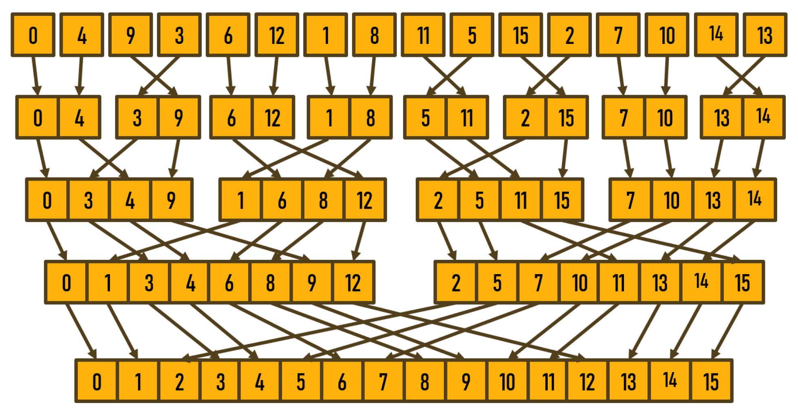

时间复杂度：$O(\log n)$。

在 GPU 中可以采取以下两种简单策略之一：

- 每个源元素对应一个线程，线程需要知道前往目标数组的哪个地方，这会导致写入数据的地址不连续，效率低下
- 【👍**推荐**，普遍被业界采用】每个目标元素对应一个线程，线程需要知道目标元素来自哪里

    

{ align=right width=30% }

用 GPU 处理粒子的另一个好处是可以进行更复杂的碰撞计算。利用深度缓冲区的碰撞计算的具体流程如下：

1. 将粒子位置重新投影到前一帧的屏幕空间纹理坐标
2. 从前一帧的深度纹理中读取深度值
3. 检查粒子是否与深度缓冲区发生碰撞，但并不完全位于其后面（在此使用厚度值）
4. 如果发生碰撞，计算表面法线并使粒子反弹

??? example "Demo"

    

        
    

### Advanced Particles

粒子系统还可以有更复杂的应用，比如可以用来表示远处的鸟群或人群。

??? example "例子"

    

        
    

这些角色实际上是用网格粒子表示的。它们是可动的，并且要为每个顶点存储控制它的骨骼，不过不需要很复杂的蒙皮技术。

    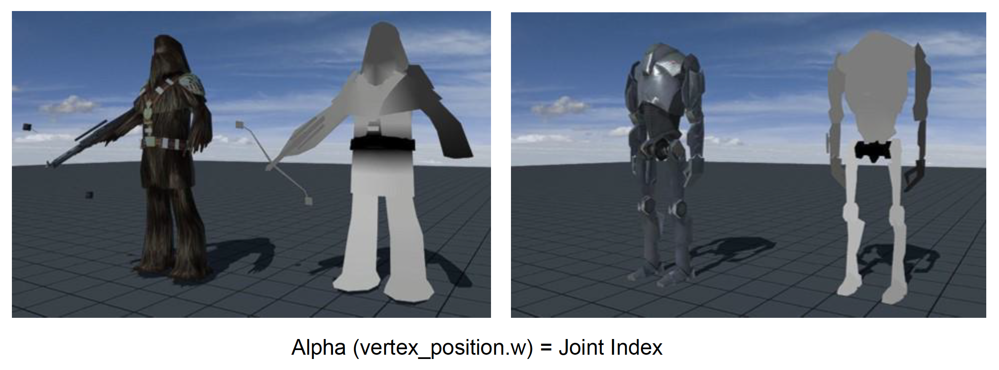

接下来我们用**粒子动画纹理**(particle animation texture)来表示角色（粒子）的所有动画、每帧动画下的速度等信息。而每个粒子的模拟则通过一个状态机表示，粒子的状态将在状态机中来回切换。

    

如果希望让世界看上去是流动的。比如场景中所有人都大致沿着一个方向走，但允许有一些随机的移动。假设我们希望人们沿着道路走，而不要走进建筑物内，这时就要用到之前多次介绍过的**符号距离场**(sign distance field, SDF)，它反映了在边界内外的信息。当 SDF 越接近 0，说明越靠近障碍物。

接下来可在 SDF 基础上引入一个**方向场**(directional field)，只需存储两个量。它能指引每个粒子的往何处去。

    

- 设计目标位置以引导人群的移动
- 朝向目标位置的期望、远离阻挡几何体的推力等都会成为影响人群移动的力量（如果足够接近，相机也会作为一种力量）

    

??? example "例子（来自 UE）"

    === "例1"

        

            
        

        - 骨架网格发射器
        - 动态程序样条
        - 对其他玩家的反应

    === "例2"

        与环境交互

        

            
        

### Utilizing Particle System in Games

游戏中的粒子系统开发策略有：

- **预设堆叠式模块**(preset stack-style modules)

    

        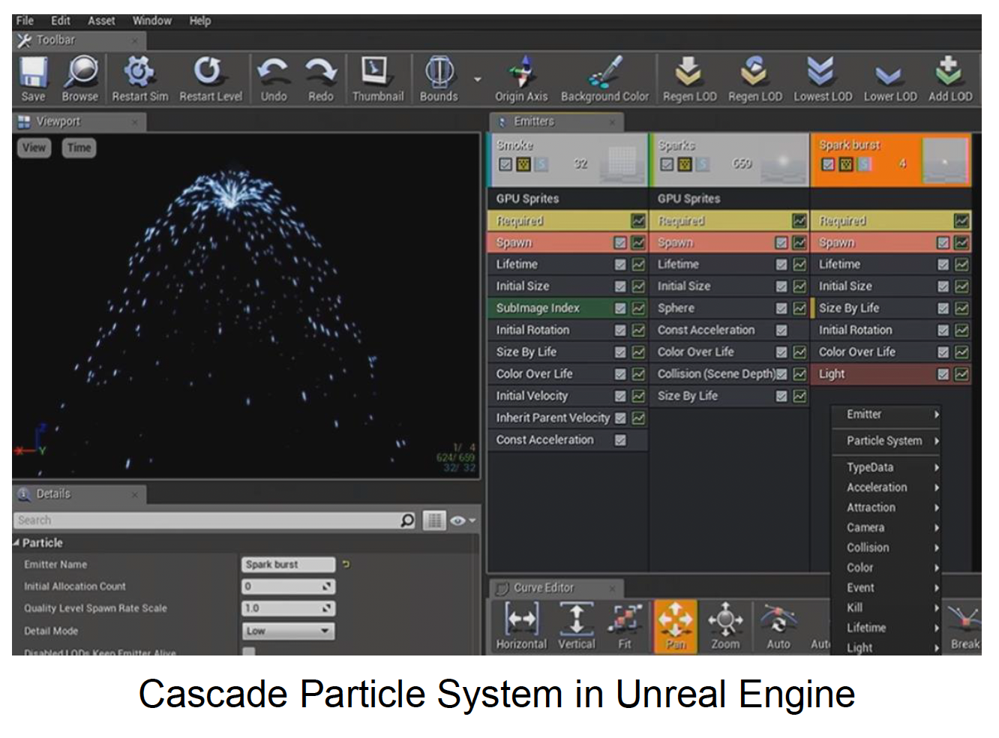
    

    - 优点
        - 能快速添加作为堆叠模块的行为
        - 非技术艺术家通过一套典型行为拥有大量控制权
        - 一目了然，易于理解
    - 缺点
        - 固定功能，但新特性需要新代码
        - 基于代码，但游戏团队的代码存在差异
        - 固定的粒子数据，所以数据共享难以实现

- **基于图的设计**(graph-based design)
    
    

        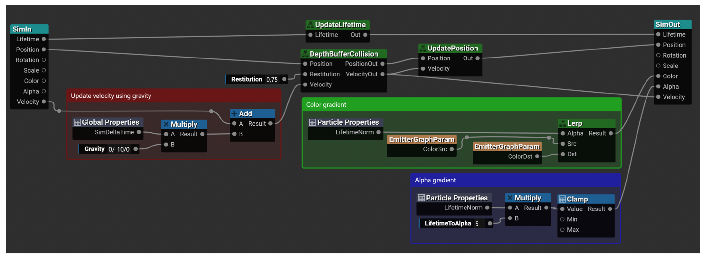
    

    
    - 可参数化以及可共享的图资产
    - 减少代码差异
    - 提供模块化的工具而非硬编码的功能

- **混合设计**(hybrid control)
    
    

        
    

    
    - **图**能提供全面控制
    - 而**栈**能提供模块化的行为和更好的可读性

## Sound System

**声音**(audio)在游戏中的作用：

- 取悦(entertains)玩家
- 增强现实感
- 建立氛围

??? example "例子"

    === "没有声音"

        

            
        

    === "有声音"

        

            <video style="width:70%" muted="" controls="" alt="type:video">
                <source src="images/lec12/53.mp4" type="video/mp4">
            </video>
        

声音的属性包括：

- **音量**(volume)：声波的振幅。相关术语有：

    

        
    

    - **声压**(sound pressure)（$p$）：由声波引起的来自环境大气压力的局部偏离，国际单位制单位：Pa
    - **粒子速度**(particle velocity)（$v$）：介质中粒子在传播波时的速度，国际单位制单位：m/s
    - **声强**(sound intensity)（$I$）：声波在每单位面积上沿垂直于该区域的方向上传递的功率，国际单位制单位：W/m²

    !!! note "这三个量之间有公式：$I = pv$"

    - **声压等级**(sound pressure level)（$L_p$）：声音有效压力相对于参考值的对数度量，国际单位制单位：dB

        $$
        L_p = 20 \log_{10} \dfrac{p}{p_0} \text{dB}
        $$

        其中 $p_0$ 为参考声压，为人类能听到的阈值，在空气中常为 $p_0 = 20\ \mu \text{Pa}$（大约为 3 米外蚊子的飞行声音））

- **音高**(pitch)：
    - 决定了声音的高低
    - 取决于声波的频率

    

        
    

- **音色**(timbre)
    - 泛音(overtones)或谐波(harmonics)的组合
    - 和频率以及相对强度有关

    

        
    

### Phase and Noise Cancelling

降噪耳机的降噪原理是通过增加一个相同频率和振幅，但是相位不同的声波来实现噪声的消除。

    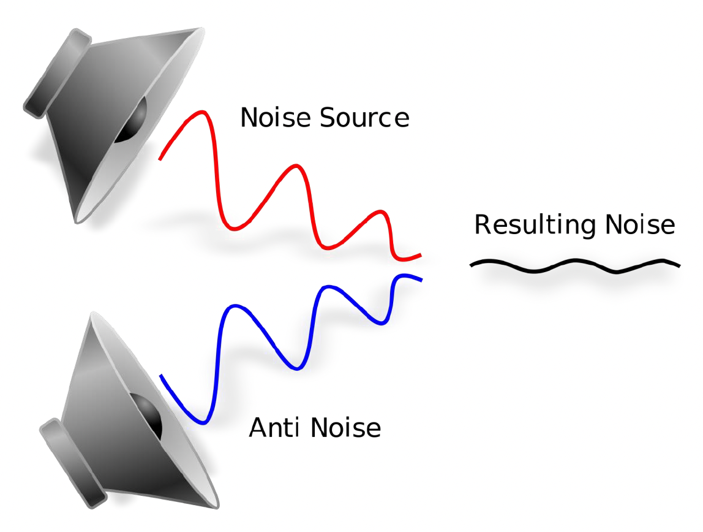

### Human Hearing Characteristic

人类的听力范围为：

- 频率范围：20-20k Hz
- 声压等级范围：0-130 db

    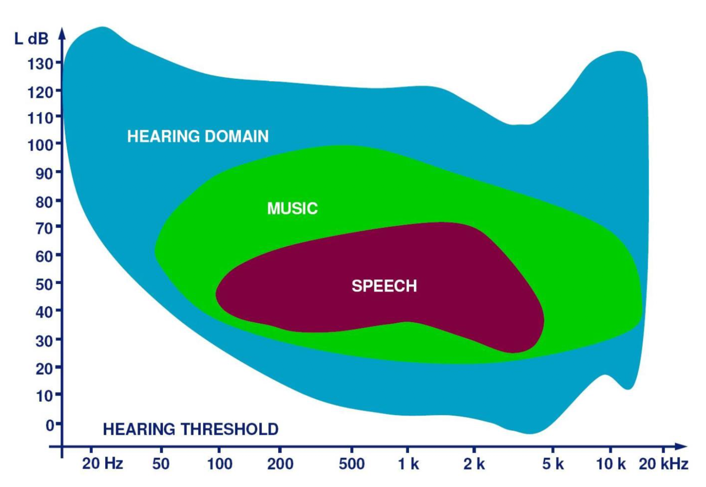

### Digital Sound

在计算机中，我们要将连续的声波转换为离散的声音信号，此时涉及到一种叫做**脉冲编码调制**(pulse-code modulation, **PCM**)的技术。它是采样模拟声音信号的标准编码方法，分为以下三步：

    

1. 采样(sampling)
    - 采样频率：每秒采样数（Hz）
    - **奈奎斯特–香农采样定理**(Nyquist–Shannon sampling theorem)：信号的**最小采样频率**应为其最高频率分量频率的两倍，以确保基本信息不失真

    

        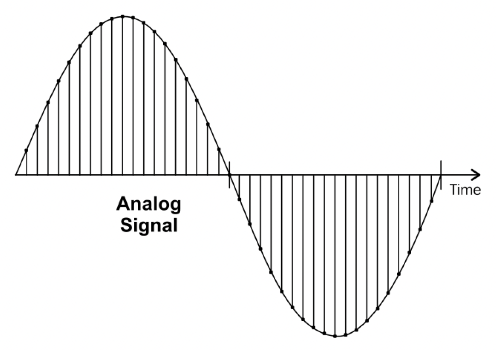
    

2. 量化(quantizing)
    - **位深度**(bit depth)：每个样本中的信息位数

    

        
    

3. 编码(encoding)
    - 音频格式：

        | 格式 | 质量 | 存储占用 | 多声道 | 专利限制 |
        | :--- | :--- | :--- | :--- | :--- |
        | WAV（无损未压缩） | ★★★ | ★ | ★★★ | ★★★ |
        | FLAC（无损压缩） | ★★★ | ★★ | ★★★ | ★★★ |
        | MP3（有损压缩） | ★ | ★★★ | ★ | ★ |
        | OGG（有损压缩） | ★ | ★★★ | ★★★ | ★★★ |

    - 游戏中一般用的是有损压缩格式
    - 但一般不用 MP3，因为它只支持立体声（左右声道均有），无法实现环绕音效；另外 MP3 的专利限制过高，引擎采用 MP3 音频需付费
    - 所以越来越多的人采用 OGG 格式

### 3D Audio Rendering

3D 场景下的声源特征：

- **单声道**(mono-phonic)音频信号
- 从特定位置发出

    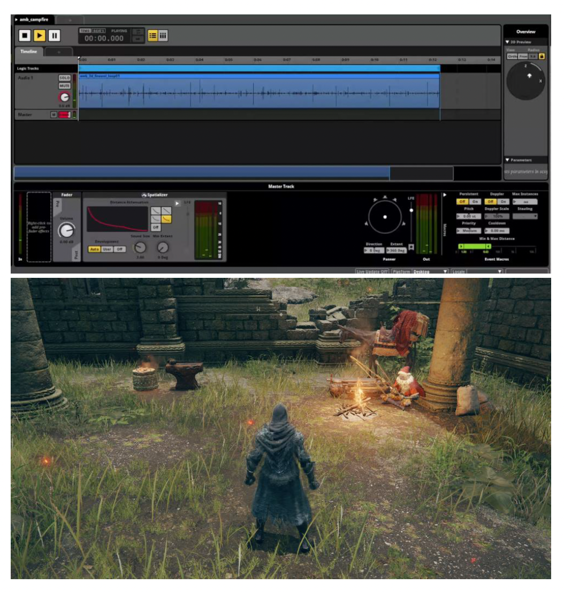

类似画面渲染中的相机，声音渲染也有一个**听者**(listener)，可以把它看成一个虚拟的麦克风，有以下属性：

    

- 位置
- 速度
- 朝向

声音的**空间感**(spatialization)是指用于定位声音相对于听者的技术。最简单的理解是靠人的左右耳区分声源的远近，比如声源在左侧，那么左耳听到的声音肯定比右耳听到的响，并且声音到达两只耳朵的时间也有微小的间距。

    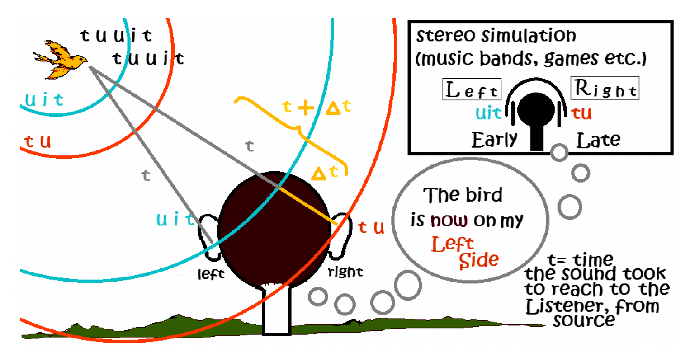

- **声像调节**(panning)
    - 将音频信号分配到新的立体声或多声道的声场中

        

            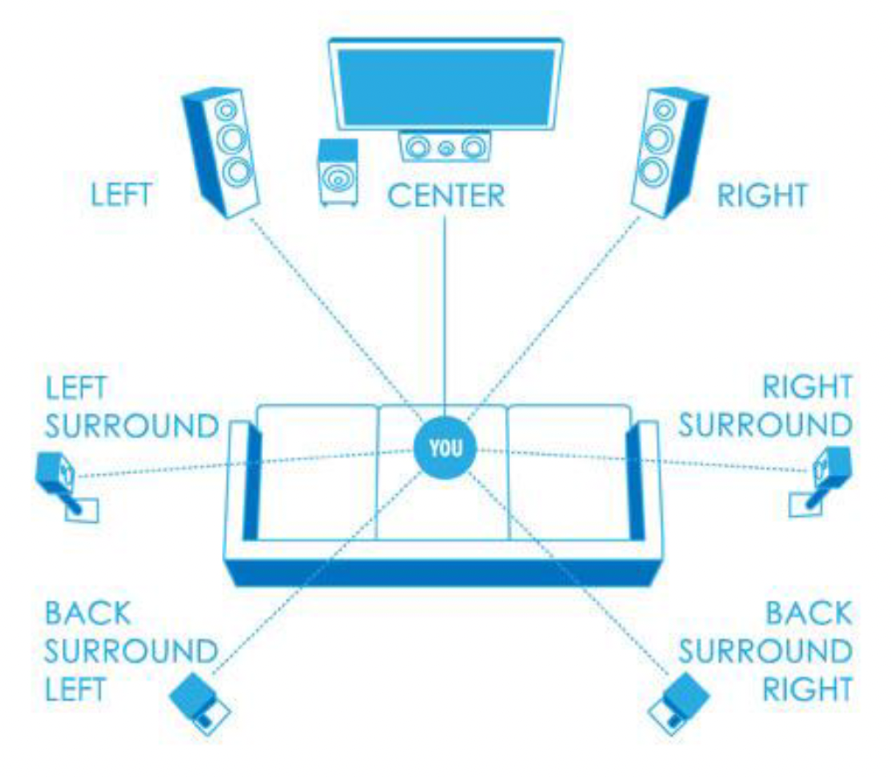
        

    - 线性声像调节(linear panning)
        - 主要思路：对于增益为 1 的立体声信号，左声道和右声道的增益之和也应为 1

            $$
            \begin{aligned}
            & \text{Gain}_{\text{left}} = x \\
            & \text{Gain}_{\text{right}} = 1 - x \\
            & \text{Gain}_{\text{left}} + \text{Gain}_{\text{right}} = 1
            \end{aligned}
            $$

            

                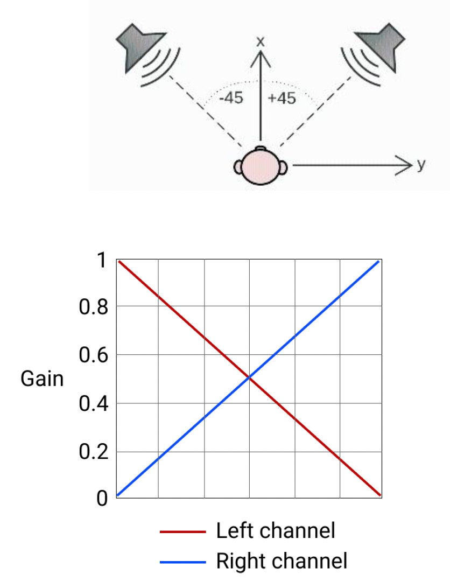
            

        - 人类对响度的感知实际上与声波的功率成正比，而功率等于信号幅度的平方

            $$
            \begin{aligned}
            \text{Power}_{\text{right}} &= \text{Gain}_{\text{right}}^2 = (1 - x)^2 \\
            \text{Power}_{\text{left}} &= \text{Gain}_{\text{left}}^2 = x^2 \\
            \text{Power}_{\text{total}} &= x^2 + (1 - x)^2
            \end{aligned}
            $$

        - 当声音在中部（$x = 0.5$）进行声像调整时，功率会降低

            $$
            \text{Power}_{\text{total}} = 0.5^2 + (1 - 0.5)^2 = 0.5
            $$

            

                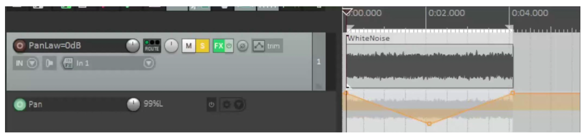
            

    - **等功率声响调节**(equal power panning)
        - 保持恒定音量，在旋转过程中保持功率限制，而不是保持振幅恒定

            $$
            \text{Power}_{\text{total}} = \text{Gain}_{\text{left}}^2 + \text{Gain}_{\text{right}}^2 = 1.0
            $$

        - 这个方程有几个可能的解，其中一个是正弦/余弦方程

            $$
            \text{Gain}_{\text{left}}^2 = \sin^2(x), \text{Gain}_{\text{right}}^2 = \cos^2(x)
            $$

    ??? example "例子"

        >强烈建议佩戴耳机后播放

        

            <video style="width:40%" muted="" controls="" alt="type:video">
                <source src="images/lec12/68.mp4" type="video/mp4">
            </video>
        

- **声场**(soundfield)
    - **全方位**(full-sphere)环绕声
    - 也称为环境声(ambisonics)
    - 用于 360 度视频和 VR

    ??? example "例子"

        >强烈建议佩戴耳机后播放

        

            <video style="width:60%" muted="" controls="" alt="type:video">
                <source src="images/lec12/82.mp4" type="video/mp4">
            </video>
        

- **双耳音频**(binaural audio)

#### Attenuation

当听者远离声源移动时，音量会随之**衰减**(attenuate)。在现实世界中，球形声波的声压（$p$）随着距离球心的远离而减小 $\dfrac{1}{r}$，即 $p(r) \propto \dfrac{1}{r}$。

??? example "例子"

    

        <video style="width:70%" muted="" controls="" alt="type:video">
            <source src="images/lec12/70.mp4" type="video/mp4">
        </video>
    

声音衰减的形状有：

- **球形**：对于大多数点声源非常有用，因为它模拟了声音在现实世界中的传播方式

    

        
    

- **胶囊形**：适用于水管等事物，此时我们不希望声音像来自空间中的一个特定点；咕噜响的水声会沿着管道传播

    

        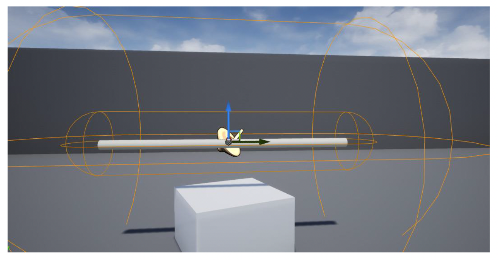
    

- **盒形**：适用于房间音调/氛围等事物，因为可以定义盒子形状以匹配房间形状

    

        
    

- **锥形**(cone)：适用于需要方向性衰减模式的情况，比如公共广播的扬声器

    

        
    

#### Obstruction and Occlusion

- **阻碍**(obstruction)：声源与听者之间存在局部障碍物，导致直达声被阻断，但声波仍能通过周围空间的反射到达听者
- **遮挡**(occlusion)：声源与听者被完整的墙体等结构完全分隔在不同空间，导致直达声和反射声的传播路径均被物理切断

    

对这两类声音的处理步骤为：

1. 从听者到声音发射几条不同角度的分散射线
2. 查询受影响表面的材质属性，以通过被阻挡射线的数量来确定它吸收了多少声音能量

    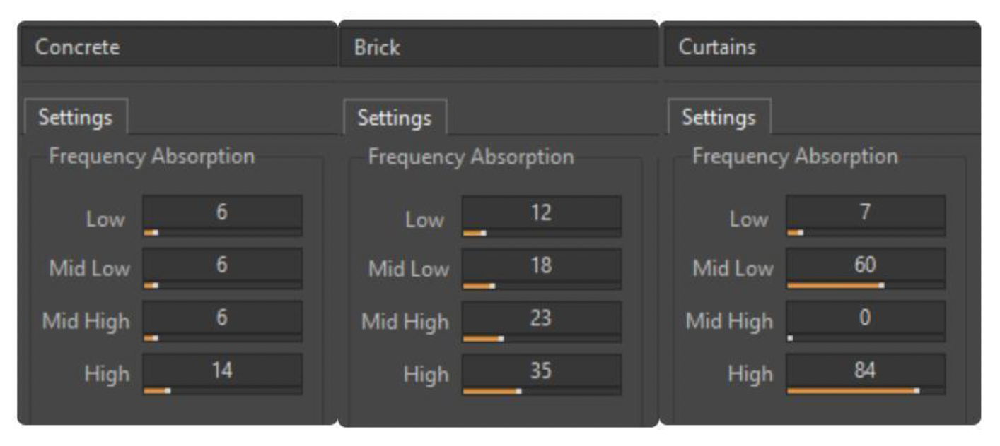

#### Reverb

在任何包含声反射表面的环境中，听着通常会从声源接收到三种类型的声波：

    

- **直接音**(direct)（**干音**(dry)）
- **早期反射**(early reflections)（**回声**(echo)）
- **晚期混响**(late reverberations)（**尾音**(tail)）

>其中回音和尾音合成为**湿音**(wet)。

相关属性：

- **混响时间**：衡量声音在特定房间内消失速度的指标；由房间的大小和材质的选择决定
- **吸收**(absorption)：由材质的吸收系数和材质数量决定

$$
A = S \times \alpha\ (m^2 \cdot \text{sab}) \quad T = 0.16 \times \frac{V}{A}\ (\text{s})
$$

- $\alpha$：吸收系数
- $S$：表面积
- $A$：等价吸收面积
- $V$：空间大小
- $T$：混响时间
- $0.16$：比例因子，对应初始声压等级降低 60 dB 所需的时间（单位：s）

下面列举了部分材质对不同频率的声音的吸收系数：

    

实际上，我们通过调整声学参数来实现混响效果的控制。这些参数包括：

- **前延迟**(pre-delay)（单位：s）：信号进入混响单元之前发生的延迟
    - 较长的前延迟时间可以用来模拟更大的房间，相应地，第一次回声需要更长时间才能被听到
- **高频比率**(HF ratio)：用于控制高频相对于低频的混响时间的衰减因子
- **湿等级**(wet level)：应用于混响声音的增益因子
- **干等级**(dry level)：应用于直接路径声音的增益因子

    

#### Sound in Motion: The Doppler Effect

**多普勒效应**(Doppler effect)：波的频率变化与相对于波源移动的观察者有关。

??? example "例子"

    

        <video style="width:60%" muted="" controls="" alt="type:video">
            <source src="images/lec12/80.mp4" type="video/mp4">
        </video>
    

公式：$f' = \left(\dfrac{v + v_0}{v + v_s}\right)f$

- $f$：原始频率
- $f'$：在听者处的多普勒偏移（观测）频率
- $v$：声音在空气中的速度
- $v_0$：听者的速度
- $v_s$：声源的速度

    

???+ info "常用的音频处理中间件"

    

        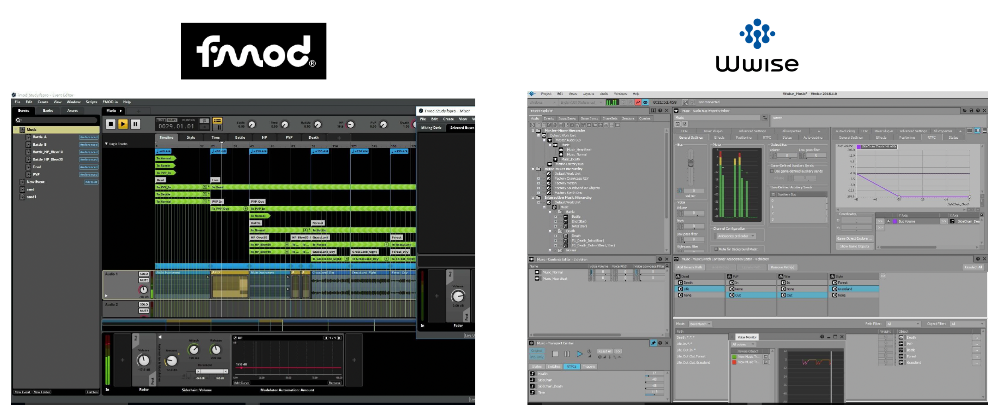
    

    ??? note "中间件是如何工作的？"

        

            <video style="width:60%" muted="" controls="" alt="type:video">
                <source src="images/lec12/84.mp4" type="video/mp4">
            </video>
        

        不能只有我被吓到（坏笑.jpg）

???+ note "音频世界建模"

    - 表面和物体的几何形状及其属性
    - 听音空间的声学特性

    

        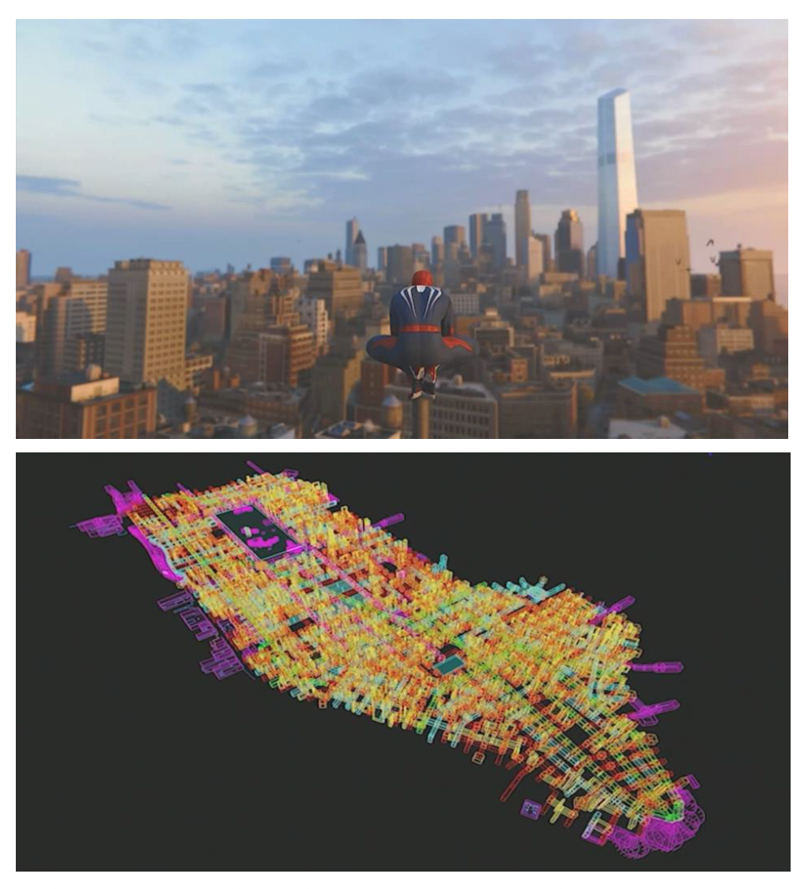
    
