# Foundation of Tool Chains

下图是一个简化后的游戏引擎架构图。

<div style="text-align: center">
    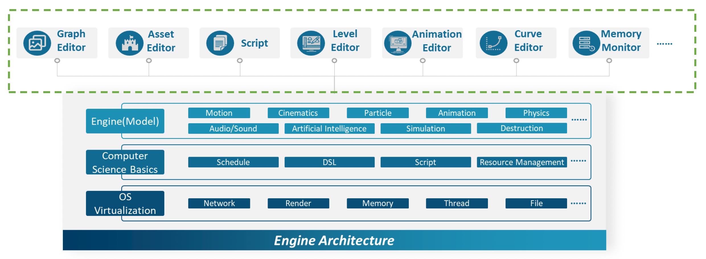
</div>

- 像渲染、物理仿真、网络通信等都是游戏引擎中的一部分，它们是游戏引擎的**运行时**(runtime)
- 而在游戏引擎之上则是一系列的工具，比如图中列出的各式编辑器、蓝图等等
- 经 DCC 生成的资产或素材需经过工具链处理后（资产处理管线(asset conditioning pipeline)）才能进入到引擎管线中

    <div style="text-align: center">
        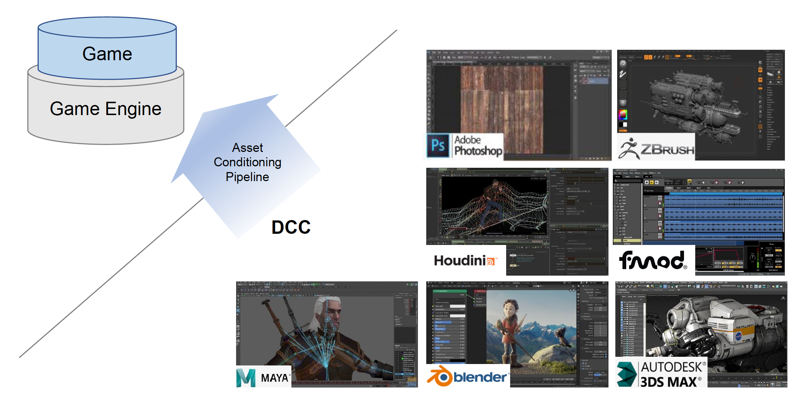
    </div>

游戏引擎的工具链能调动有着不同思维的开发者们协同工作：

<div style="text-align: center">
    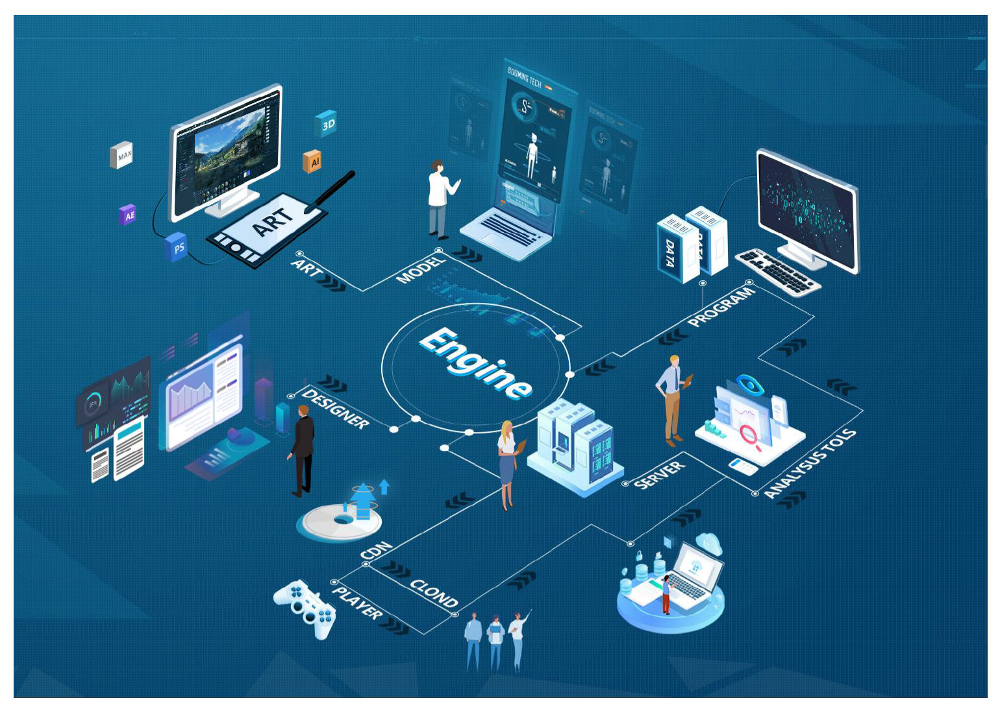
</div>

- 对设计师而言
    - 能够快速迭代游戏玩法
    - 可以在没有编程的情况下快速实现游戏逻辑原型
    - 易于编辑大量数据
- 对艺术家而言
    - 结果质量得到保障
    - 便捷的工作流
    - 所见即所得(WYSIWYG)


## Complicated Tool GUI

???+ info "图形用户界面(graphic user interface, GUI)"

    GUI 正变得越来越复杂：

    - 快速迭代
    - 设计和实现分离
    - 可重用性(reusability)
    - ...

    <div style="text-align: center">
        
    </div>

对于游戏引擎工具链而言，用到的 GUI 也是非常复杂的。有以下两种实现模式：

- **即时模式**(immediate mode)
    - 客户端调用使得图形对象渲染到屏幕上
    - 描述**渲染图元**(rendering primitives)的数据直接从客户端**逐帧**插入到**命令列表**(command list)中

    <div style="text-align: center">
        
    </div>

    - 特点：
        - 轻量级
        - 过程式编程
        - 部件(widgets)无需维护任何数据或状态

    - 优点：直接、简单、快速原型
    - 缺点：可扩展性、性能、可维护性差
    - 例子：
        - Unity UGUI

            <div style="text-align: center">
                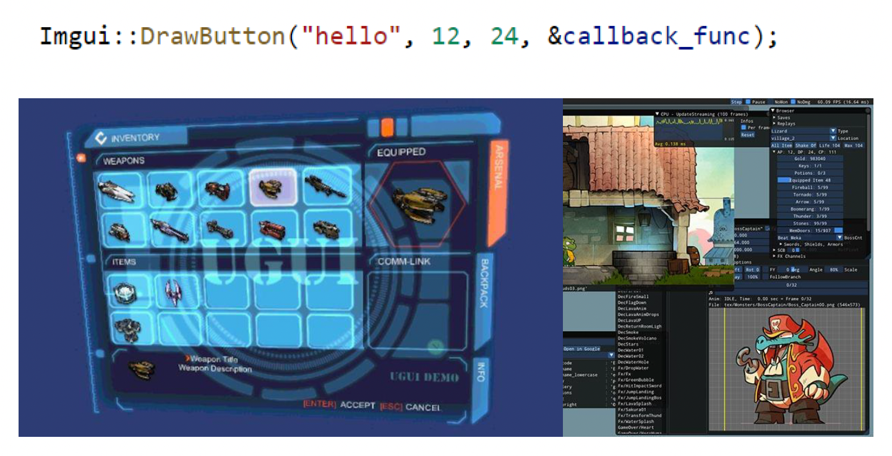
            </div>

        - Omniverse GUI
        - Piccolo GUI（GAMES104 小引擎）

- **保留模式**(retained mode)
    - 由**图形库**(graphics library)负责保留要渲染的场景
    - 客户端调用图形库并不会直接导致实际的渲染，而是利用图形库管理的资源进行间接调用

    <div style="text-align: center">
        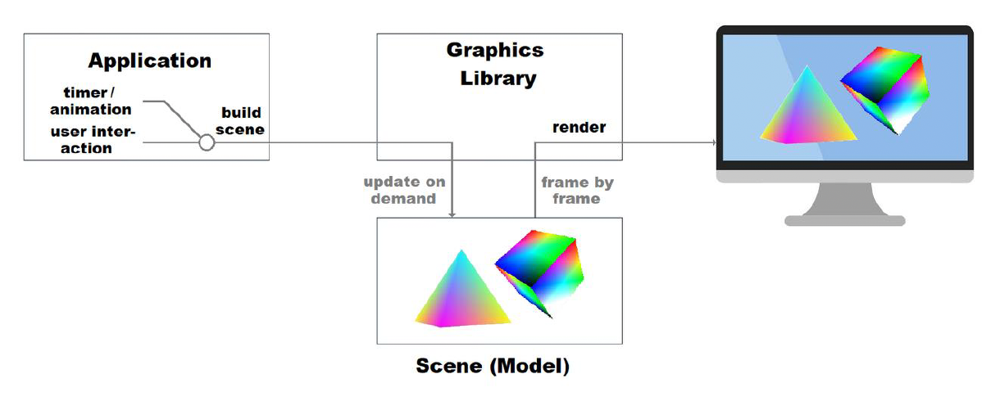
    </div>

    - 特点：
        - 面向对象编程
        - 部件包含自身状态和数据
            - 可根据需要绘制部件
            - 复杂效果（动画等）

    - 优点：可扩展性、性能和可维护性高
    - 缺点：对开发者而言太复杂
        - 消息队列 / 回调
        - GUI 和应用间的同步

    - 例子：
        - Unreal UMG
        
            <div style="text-align: center">
                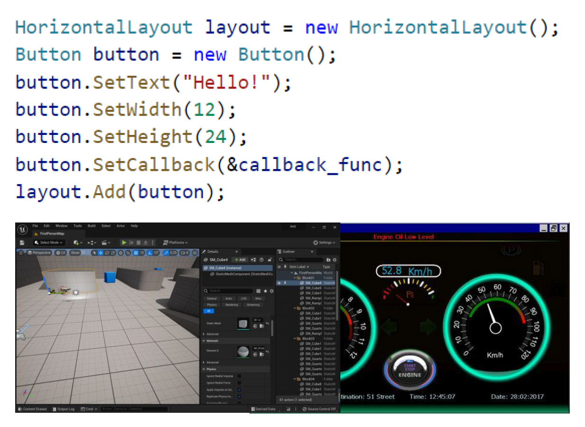
            </div>
        
        - WPF GUI
        - QT GUI

实际开发中建议采用**保留模式**。


### Design Patterns

**设计模式**(design patterns)在构建 UI 的过程非常重要。如果不好好遵循某一个设计模式，一旦工具多起来，后果将不堪设想。下面介绍一些比较著名的模式：

- **MVC**(mode-view-controller)：由 Trygve Reenskaugin 于 1978 年发明，旨在弥合人类用户的心理模型与计算机中存在的数字模型之间的差距
    - **模型**(model)：模式的核心组件，负责管理应用程序的数据
    - **视图**(view)：信息的任何表示，例如图表、图示或表格
    - **控制器**(controller)：接受输入并将其转换为模型或视图的命令

    <div style="text-align: center">
        
    </div>

- **MVP**：MVC 模式的进化版，其中控制器为**演示者**(presenter)所替代
    - **模型**：定义在用户界面中显示或被操作的数据的接口
    - **视图**：一个显示数据（模型），并将用户命令（事件）路由到演示者以操作这些数据的被动界面
    - **演示者**：对模型和视图进行操作；从存储库（模型）检索数据，并将其格式化为在视图中显示

    <div style="text-align: center">
        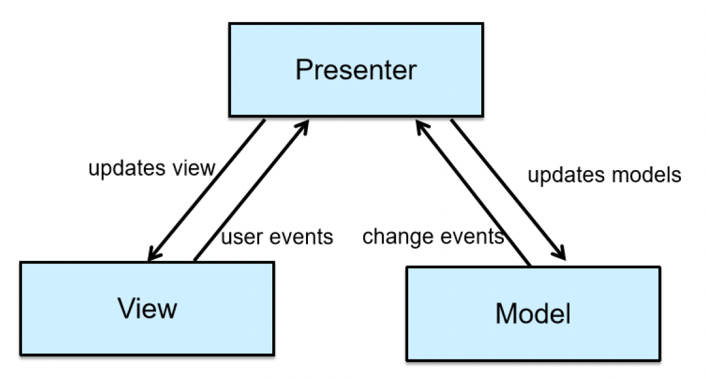
    </div>

    - 优点：将模型和视图分得更清楚，便于调试
    - 缺点：演示者需要同时理解模型和视图的语言，比较复杂；并且开发者容易将演示者写得臃肿

- **MVVM**：MVC 模式的变体

    <div style="text-align: center">
        
    </div>

    - 视图由设计师（更注重图形和艺术）而非传统开发者负责

    <div style="text-align: center">
        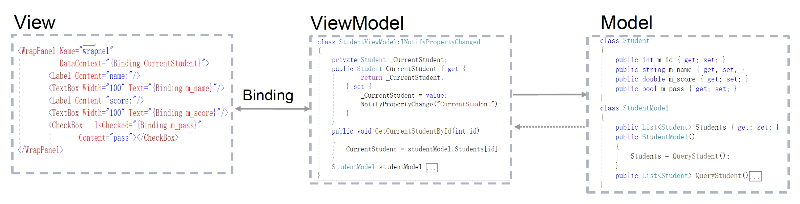
    </div>

    - **视图**：
        - 使用如 Dreamweaver、VS Blend 等 WYSIWYG 工具
        - 文件格式为 html/xaml
        - MVC 在视图类中编码的状态视图不易表示
    - **绑定**(binding)：将视图数据绑定到模型上，于是视图方面就不再需要代码了（利好设计师）
    - **视图模型**(viewModel)：包含将模型类型转换为视图类型的数据转换器（因为模型很可能有无法直接映射到控件的数据类型）
    - 优点：
        - 独立开发
        - 易于维护与测试
        - 易于复用组件
    
    - 缺点：
        - 对于简单的 UI，这一模式过于复杂(overkill)
        - 数据绑定是声明式的，因此难以调试


## Loading and Saving

数据的保存和加载分别对应序列化和反序列化操作：

- **序列化**(serialization)：将数据结构或对象状态转换为可以存储（比如在文件或内存数据缓冲区中）或传输（比如通过计算机网络）并在以后重建的格式的过程
- **反序列化**(deserialization)：从一系列字节中提取数据结构的操作，和序列化相反

<div style="text-align: center">
    
</div>


### File Types

数据通常以文件形式存储。文件通常分为以下两大类：

- **文本文件**(text file)：以文本形式存储数据
    - 文件格式：TXT, JSON, YAML, XML...
    - 能通过常用文本编辑器阅读
    - 游戏引擎中的应用：
        - Unity Editor（可选）：YAML 的子集
        - Piccolo：JSON
        - CryEngine：XML / JSON（可选）

    <div style="text-align: center">
        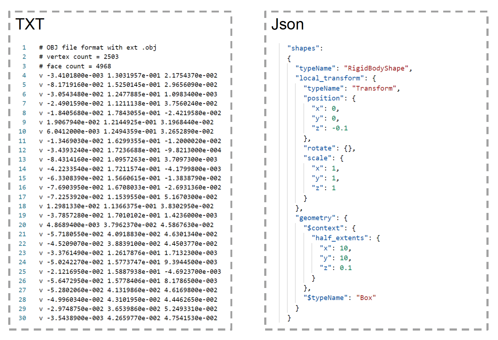
    </div>

- **二进制文件**(binary file)：以字节流形式存储数据
    - 需要额外工具进行读/写
    - 例子：UAsset, FBX 二进制文件...
    - 游戏引擎中的应用：
        - Unity Runtime, Unity Editor（可选）
        - CryEngine（可选）
        - Unreal: UAsset

    <div style="text-align: center">
        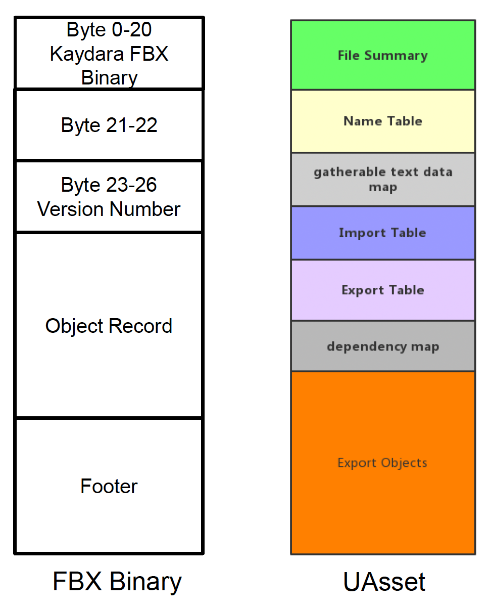
    </div>

对于相同的数据，二进制文件相比文本文件占用更小的存储空间。

<div style="text-align: center">
    
</div>


### Asserting Data Repeatance

如下图所示，红框标出的网格是重复数据。开发者该如何应对这种情况呢？

<div style="text-align: center">
    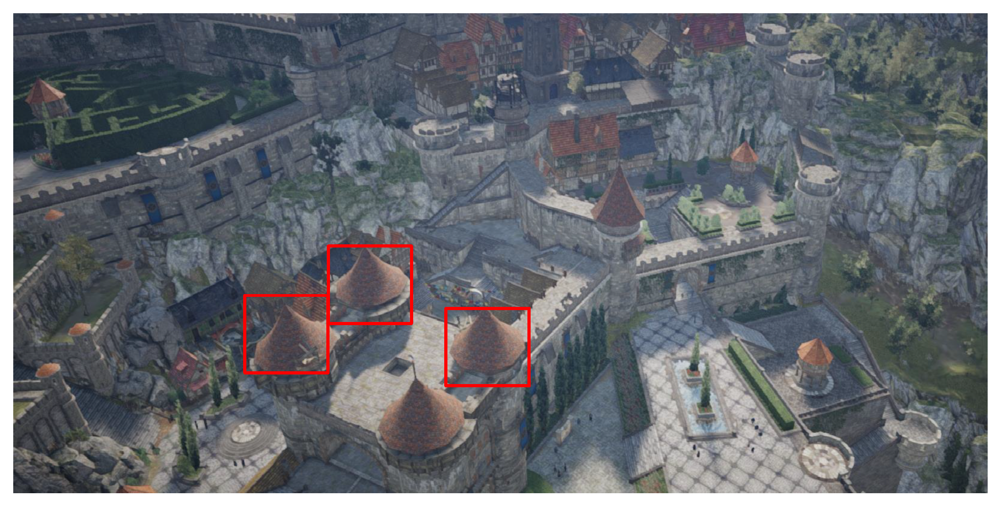
</div>

解决方法是**资产引用**(asset reference)：将冗余数据分离到资产文件中，并通过建立引用关系来实现关联。

<div style="text-align: center">
    
</div>

资产引用中的引用就是一种**数据实例**(data instance)。可把它看作一种创建父数据的方法，既可作为制作各种不同的子数据的基础，也可以直接使用。

<div style="text-align: center">
    
</div>


### Object Instance Variance

有时设计师希望将场景中某个引用的纹理换成另一个纹理。可行的做法有：

<div style="text-align: center">
    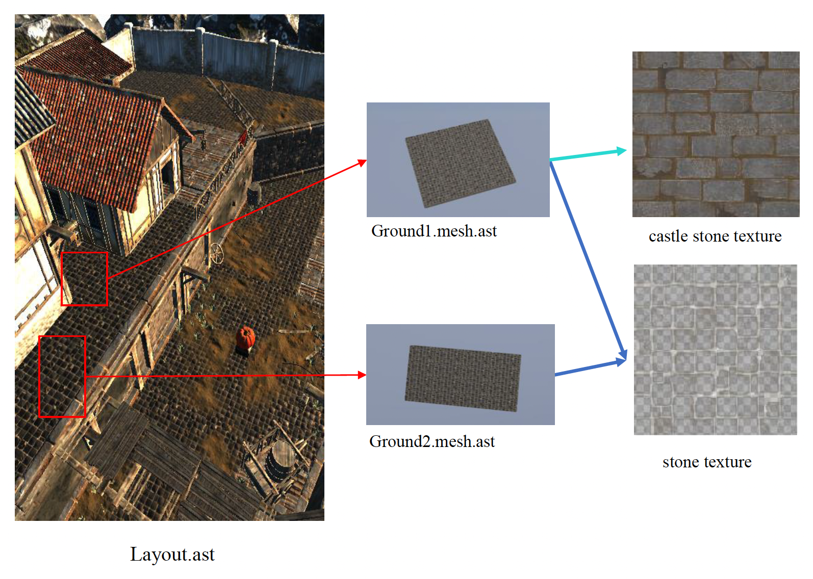
</div>

- **拷贝**(copying)
    - 这是一种符合直觉的想法：制作一份关于实例数据的拷贝并修改这份拷贝
    - 问题：加载大量冗余的数据

    <div style="text-align: center">
        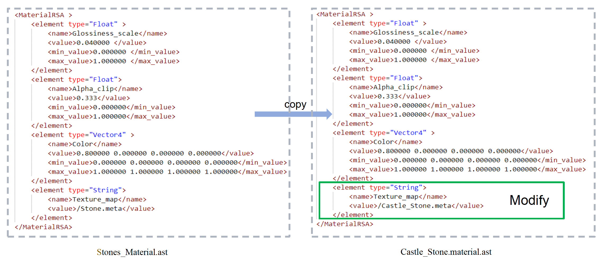
    </div>

- **数据继承**(data inheritance)：继承被继承对象的数据，并允许覆盖其数据结构中定义的数据的赋值

    <div style="text-align: center">
        
    </div>


### Deserialization

文件的加载是一个较为复杂的**解析**(parsing)过程：

<div style="text-align: center">
    
</div>

例如：一个场景文件由多个数据块，每个数据块又包含多个字段，而每个字段的类型和值各不相同。根据这一特点，我们不会一下子加载所有数据，而是将数据拆分成一个个的语义，并构建一棵由 <键-类型-值> 对组成的树状结构。

<div style="text-align: center">
    
</div>

存储对象和字段类型的地方：

- 文本文件：存储在资产中
- 二进制文件：存储在表中（一般位于文件头部）

<div style="text-align: center">
    
</div>

对二进制文件进行反序列化时，**端序**(endianess)是我们不得不考虑的一件事，它分为：

- **大端序**(big endian)：高地址字节到低地址字节
- **小端序**(little endian)：低地址字节到高地址字节

<div style="text-align: center">
    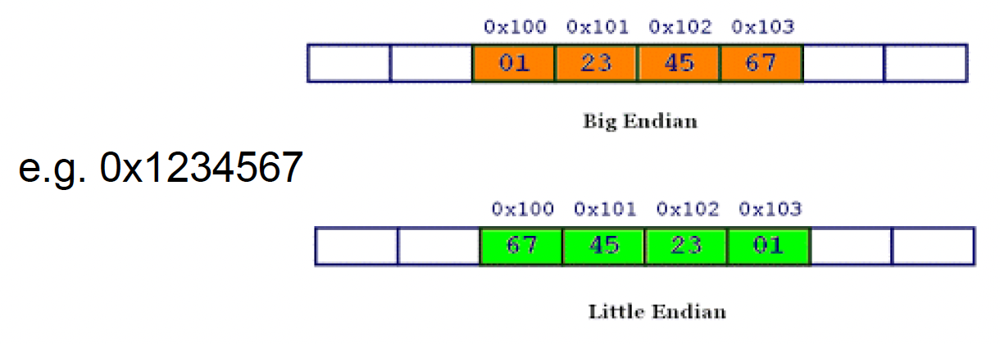
</div>

不同处理器上的端序各异：

| 处理器 | 字节序 |
| :--- | :--- |
| PowerPC (PPC) | 大端序 |
| Sun Sparc | 大端序 |
| IBM S/390 | 大端序 |
| Intel x86 (32 位) | 小端序 |
| Intel x86_64 (64 位) | 小端序 |
| ARM | 双端序（大端/小端）|

在 Unreal 中：

```cpp
/**
 * Returns true if data larger than 1 byte should
 * be swapped to deal with endian mismatches.
 */
FORCEINLINE bool IsByteSwapping()
{
#if PLATFORM_LITTLE_ENDIAN
    bool SwapBytes = ArForceByteSwapping;
#else
    bool SwapBytes = this->IsPersistent();
#endif
    return SwapBytes;
}
```


### Asset Version Compatibility

工具链中一个比较棘手的问题是有关资产版本兼容性的问题。比如开发一个游戏可能需要三年左右的时间，这期间引擎和工具会不断升级，并且数据也会有增删，因此需要确保三年前搭建的场景在三年后也能打开。

<div style="text-align: center">
    
</div>

<div style="text-align: center">
    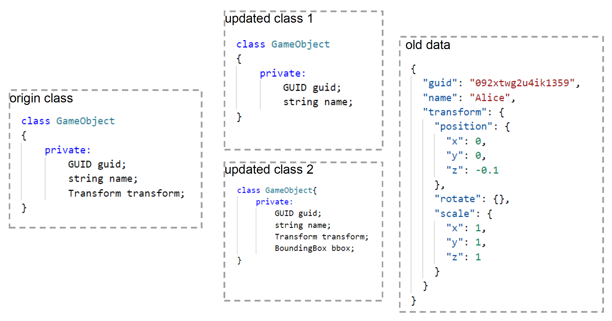
</div>

解决版本兼容性的方法有：

- **版本硬编码**（不太推荐）
    - 例子：UE 中会向资产添加版本号
    - 加载资产：检查字段是否存在于该版本，若存在再加载数据，否则跳过该字段；缺少的字段用默认值填充
    - 保存资产：将所有数据写入到资产文件中

    <div style="text-align: center">
        
    </div>

- **字段 UID**：每个字段有一个唯一编号，该编号不可改变
    - 例子：Google 协议缓冲区
    - 序列化：
        1. 对于每个字段，根据字段编号和类型生成一个（固定大小的）键
        2. 字段数据和键一起存储，其中键占用最前面的几个字节
    - 反序列化：
        1. 字段在模式中不存在但在数据中存在：键将无法识别，跳过该字段
        2. 字段在模式中存在但在数据中不存在：设置默认值

    <div style="text-align: center">
        
    </div>


## Robust Tools

如果游戏引擎的工具链出问题的话，对整个游戏开发团队的影响会非常大。一个鲁棒的工具需有以下功能：

- **撤销**(undo)和**重做**(redo)

    ??? example "例子"

        <div style="text-align: center">
            
        </div>

- **崩溃恢复**(crash recovery)

    ??? example "例子"

        <div style="text-align: center">
            
        </div>

- ...

在游戏引擎工具链中，这些操作被抽象为一系列的原子**命令**(commands)完成的，包括调用(invoke)、撤销(revoke)、序列化、反序列化等命令。

<div style="text-align: center">
    
</div>

命令的定义比较简单：

```c#
public interface ICommand<TData> {
    long UID { get; set; }
    TData Data { get; set; }
    void Invoke();
    void Revoke();
    byte[] Serialize();
    void Deserialize(byte[] data);
}
```

- `ICommand<TData>` 提供了命令的基本抽象
- 每个需要支持撤销/重做/崩溃恢复的系统都需要实现从 `ICommand<TData>` 继承的系统相关命令
- 提供 `UID` 的原因：恢复磁盘时，命令需要严格遵循顺序（随时间单调递增 + 唯一识别）
- 定义还需提供将命令实例序列化为数据和将数据反序列化为命令实例的函数，并且 `TData` 类型需要提供序列化和反序列化接口
- 三大关键命令
    - 增加
        - `Data`：数据通常是运行时实例的拷贝
        - `Invoke`：使用数据创建一份运行时实例
        - `Revoke`：删除运行时实例
    - 删除
        - `Data`：数据通常是运行时实例的拷贝
        - `Invoke`：删除运行时实例
        - `Revoke`：使用数据创建一份运行时实例
    - 更新
        - `Data`：通常数据是运行时实例修改后的属性的新旧值及其属性名称
        - `Invoke`：设置运行时实例属性为新值
        - `Revoke`：设置运行时实例属性为旧值


## Making Tool Chains

前面介绍的只是开发单个工具所需的基础知识。但我们知道，工具链包含几十甚至几百个功能，并且面向不同职业的开发者使用。而每个工具都有自己的数据结构，所以即便是相同的数据，对不同开发者而言看待它们的视角也会有所不同。这便是制作工具链会遇到的大挑战。

<div style="text-align: center">
    
</div>

最简单粗暴的开发策略是单独开发所有的工具。但这样做导致后续扩展和维护工具时会相当麻烦，所以这显然不是明智之举。

实际上，无论数据结构有多复杂，它们都是由一些常见的简单构建块搭起来的，所以只需要一种标准语言来描述这些构建块就行了。

<div style="text-align: center">
    
</div>


### Schemas

我们称这样的语言为**模式**(schema)，即对数据结构的形式描述。它的影响有：

- 统一了数据处理器
- 在不同工具之间规范化数据
- 能够自动生成标准化的用户界面

借助模式，我们可以描述这些基本构建块：

- 原子类型(atomic type)：`#!cpp int`, `#!cpp float`, `#!cpp double`...
- 类类型(class type)：使用原子类型表示复杂的数据结构
- 容器(containers)：数组、映射...

<div style="text-align: center">
    
</div>

模式还支持对**继承**关系的描述。

<div style="text-align: center">
    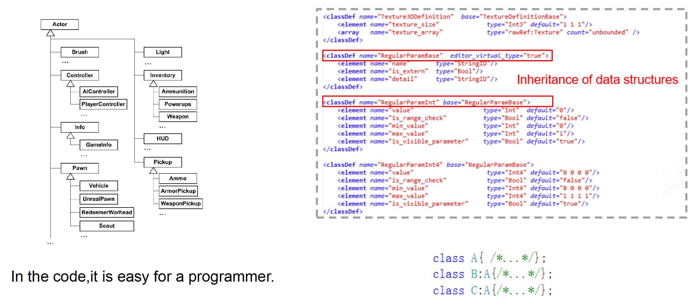
</div>

模式也支持**数据引用**。在代码中可根据文件路径读取数据，并将其实例化为对应的文件类。

<div style="text-align: center">
    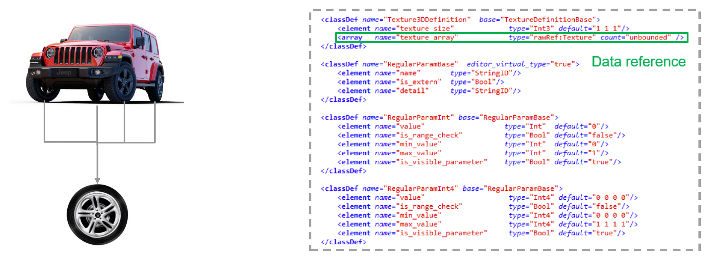
</div>

定义模式的两种方式：

- 单独的模式定义文件
    - 优点：理解容易、低耦合
    - 缺点：
        - 容易出现引擎版本与模式版本不匹配的问题
        - 难以在结构中定义函数
        - 需要实现完整的语法

    ??? example "例子"

        ```protobuf
        syntax = "proto2";

        package tutorial;

        message Person {
        optional string name = 1;
        optional int32 id = 2;
        optional string email = 3;

        enum PhoneType {
            MOBILE = 0;
            HOME = 1;
            WORK = 2;
        }

        message PhoneNumber {
            optional string number = 1;
            optional PhoneType type = 2 [default = HOME];
        }

        repeated PhoneNumber phones = 4;
        }

        message AddressBook {
        repeated Person people = 1;
        }
        ```

- 在代码中定义
    - 优点：
        - 易于实现函数反射
        - 自然支持继承关系
    - 缺点：难以理解、高耦合

    ??? example "例子"

        ```cpp
        UCLASS()
        class UMG_API USpacer : public UWidget
        {
            GENERATED_UCLASS_BODY()

        public:

            /** The size of the spacer */
            UPROPERTY(EditAnywhere, BlueprintReadOnly, Category=Appearance)
            FVector2D Size;

        public:

            /** Sets the size of the spacer */
            UFUNCTION(BlueprintCallable, Category="Widget")
            void SetSize(FVector2D InSize);

            // UWidget interface
            virtual void SynchronizeProperties() override;
            // End of UWidget interface

            // UVisual interface
            virtual void ReleaseSlateResources(bool bReleaseChildren) override;
            // End of UVisual interface

        #if WITH_EDITOR
            virtual const FText GetPaletteCategory() override;
        #endif

        protected:
            // UWidget interface
            virtual TSharedRef<SWidget> RebuildWidget() override;
            // End of UWidget interface

        protected:
            TSharedPtr<SSpacer> MySpacer;
        };
        ```


### Three Views for Engine Data

对于游戏引擎中的同一数据，我们有三种看待它们的视角：

- **运行时**视角（CPU、GPU）：要以更快的速度进行读取/计算操作

    ```cpp hl_lines="4"
    class RuntimeSpotLight {
    public:
        // Spot Light Translation Matrix
        Matrix4x4 light_trans {Matrix4x4::IDENTITY};
        // Spot Light Cone
        float inner_cone_radian = 0.0f;
        float outer_cone_radian = 0.0f;
        // Spot Light intensity and units
        float intensity = 0.0f;
        LightUnits unit = CANDELA;
        // Spot Light Color
        Vector4 light_color {Vector4::ZERO};
        // other light data like shadow...
    };
    ```

- **存储**视角（HDD、SSD）：要以更快的速度进行写入操作，并且占据更少的磁盘空间

    ```cpp hl_lines="2-11"
    // trans
    "Position:X": 1.0,
    "Position:Y": 1.0,
    "Position:Z": 1.0,
    "Rotation:X": 0.0,
    "Rotation:Y": 0.0,
    "Rotation:Z": 0.0,
    "Rotation:W": 1.0,
    "Scale:X": 1.0,
    "Scale:Y": 1.0,
    "Scale:Z": 1.0,
    // cone_degree
    "inner_cone_degree": 30,
    "outer_cone_degree": 60,
    // sds
    "intensity": 0.0,
    "unit": 1
    // other data...
    ```

- **工具**视角（用户）：更易理解的形式，并且需要多种编辑模式

    <div style="text-align: center">
        
    </div>

    - 工具数据通常不存在，在生成 UI 界面时一般会进行特殊处理
    - 设置角度时我们会用角度制而非弧度制，因为这更方便理解

        <div style="text-align: center">
            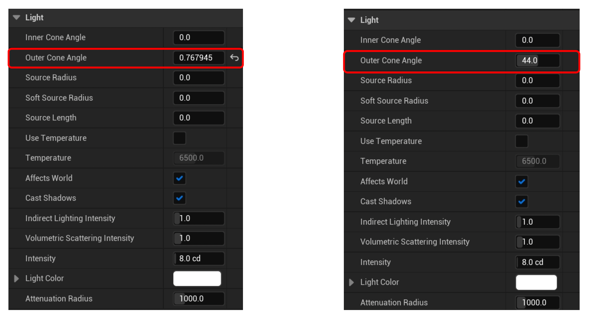
        </div>

    - 有些工具会提供不同的编辑模式，以满足不同团队的需求

        <div style="text-align: center">
            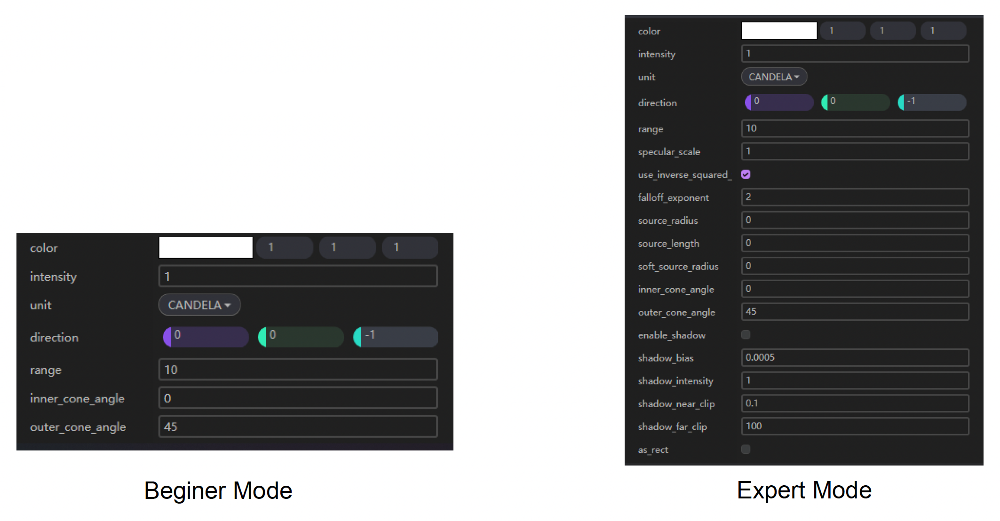
        </div>


## What You See is What You Get

??? example "例子"

    === "艺术家"

        <div style="text-align: center">
            
        </div>

    === "设计师"

        <div style="text-align: center">
            
        </div>

无论是艺术家还是设计师，都有着「**所见即所得**(what you see is what you get, **WYSIWYG**)」的诉求。

在早年，游戏开发工具是独立于引擎外运行的。这样的工具很适合作为 DCC 的工具插件，并且开发新工具也比较方便。但问题在于这样就很难满足 WYSIWYG 的目标。

<div style="text-align: center">
    
</div>

现在用的比较多的架构是将工具层置于整个游戏引擎之上（这和第一讲介绍的架构一致）。

<div style="text-align: center">
    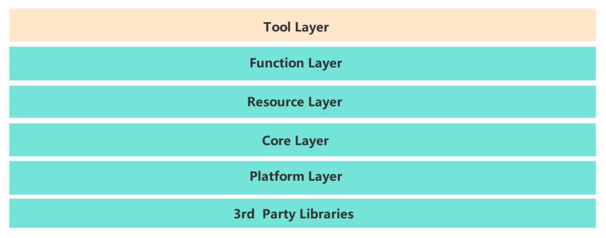
</div>

- 优点：
    - 可直接访问所有引擎数据
    - 易于在编辑器中预览游戏
    - 易于制作游戏时的实时编辑
- 缺点：
    - 复杂的引擎架构
    - 需要一套完整的引擎 UI 系统来制作编辑器 UI
    - 当引擎崩溃时，工具也无法使用

工具层需提供**编辑器模式**(editor mode)，以支持修改和预览场景数据。

- 实时预览场景数据的修改
- 逻辑系统不进行 tick，因此可利用更多的硬件资源来显示更多场景细节
- ...

<div style="text-align: center">
    
</div>

编辑器中通常会提供一个叫做「**在编辑器中游玩**」(play in editro, **PIE**)的功能。顾名思义，开发者可以直接在编辑器中玩游戏，无需关闭编辑器和开启游戏模式。它带来了以下好处：

- 节省加载时间
- 保持创作的连续性
- 快速测试修改
- ...

PIE 的两种实现方式：

- 在**编辑器世界**中游玩：在编辑器世界中启动游戏玩法系统计时并游玩

    <div style="text-align: center">
        
    </div>

    - 优点：
        - 简单的架构工具层
        - 快速的状态变化
    
    - 缺点：游戏模式会导致数据变化

    ??? example "例子：Piccolo"

        <div style="text-align: center">
            
        </div>

- 在 **PIE 世界**中游玩：复制编辑器世界以创建一个PIE世界并在其中游玩

    <div style="text-align: center">
        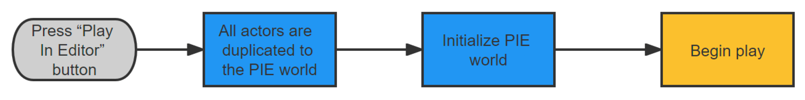
    </div>

    - 优点：
        - 数据分离
        - 易于创建多个游戏实例
    
    - 缺点：架构复杂

    ??? example "例子：Unreal"

        <div style="text-align: center">
            
        </div>


## Plugins

不同游戏需要不同定制化的引擎工具。而引擎工具采用**插件**(plugins)来满足这一需求，它是一个为现有计算机程序添加特定功能的软件组件。

<div style="text-align: center">
    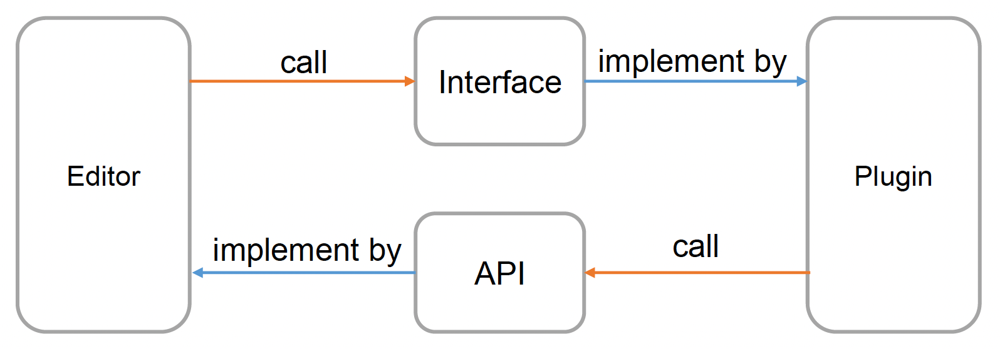
</div>

???+ example "例子"

    <div style="text-align: center">
        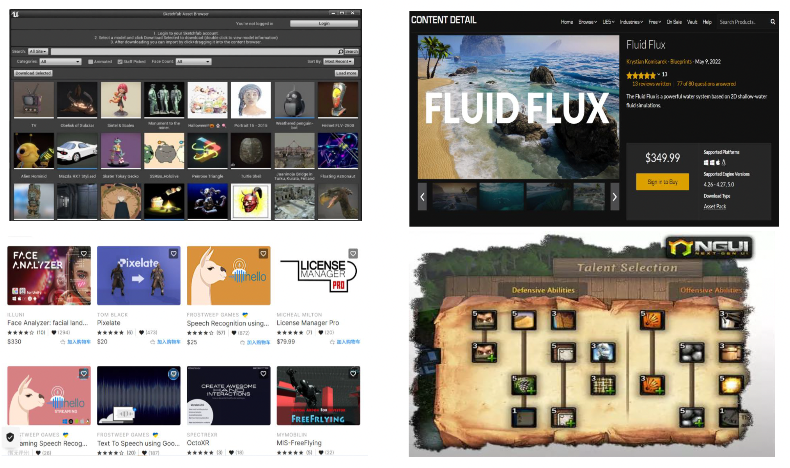
    </div>

插件机制的实现需要有：

- **插件管理器**(plugin manager)：管理插件的加载和卸载
- **接口**：一系列提供给插件的抽象类；插件可以选择实例化不同的类来实现相应功能的开发
- **API**：一系列由引擎提供的函数；插件可以使用这些函数来执行所需的逻辑

??? example "例子"

    === "添加工具栏按钮"

        <div style="text-align: center">
            
        </div>

    === "在 UE5 中添加插件菜单"

        <div style="text-align: center">
            
        </div>

???+ abstract "总结"

    - 插件框架的意义
        - 扩展编辑器的功能
        - 易于热更新，实现解耦
        - 促进引擎开发生态建设

    - 插件框架要求
        - 完整 API 支持
        - 常用接口支持

    <div style="text-align: center">
        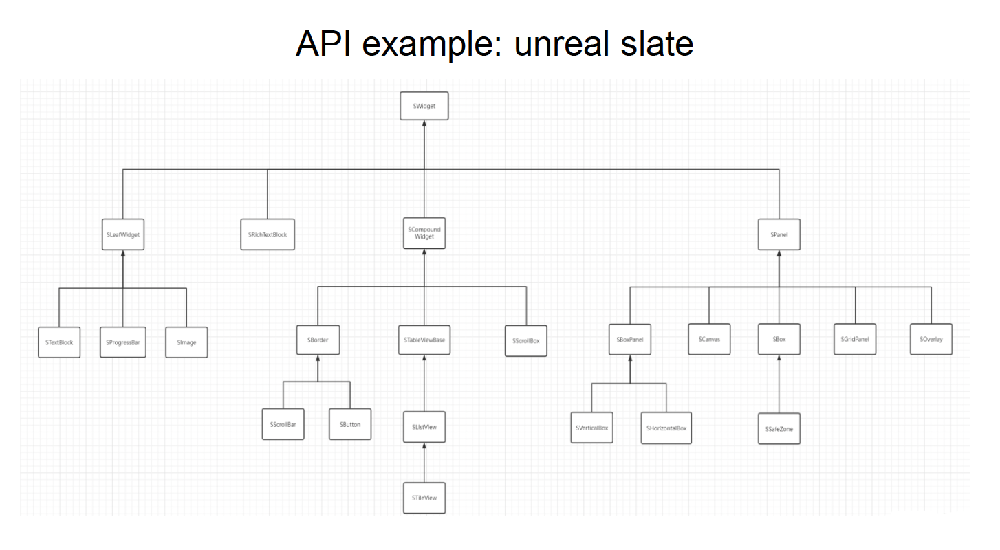
    </div>