# Applications & Advanced Topic of Tool Chains

## Glance of Game Production

??? example "育碧的游戏制作过程"

    <div style="text-align: center">
        
    </div>

游戏引擎工具链的一大挑战是需要适应不同题材(genres)（比如 RPG, FPS 等）游戏的制作，因为制作不同类型游戏所需的编辑操作、游戏玩法等等会是截然不同的。

<div style="text-align: center">
    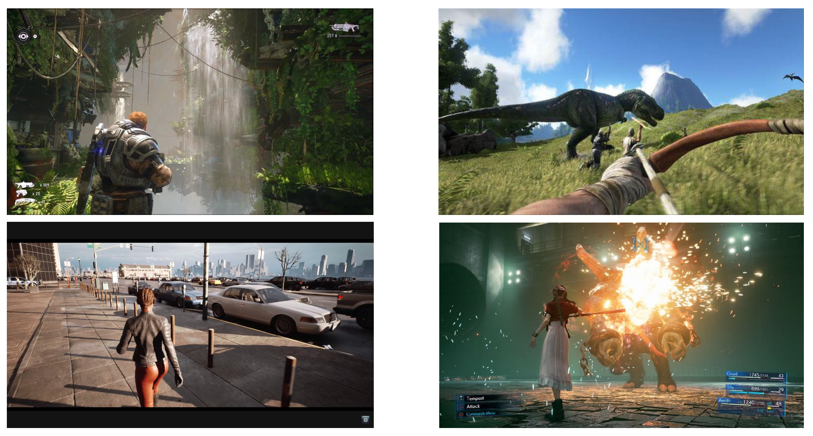
</div>

另外一些挑战在前一讲中介绍过，包括：

- 来自 DCC 和引擎工具的大量不同的数据
- 艺术家、设计师和程序员的思维方式不同
- 对于高质量制作而言，WYSIWYG 是不可或缺的

<div style="text-align: center">
    
</div>


## Architecture of World Editor

下面将详细讲解工具链中一个重要的工具——**世界编辑器**(world editor)。它的界面通常长这样（下图是旧版 UE 的关卡编辑器）：

<div style="text-align: center">
    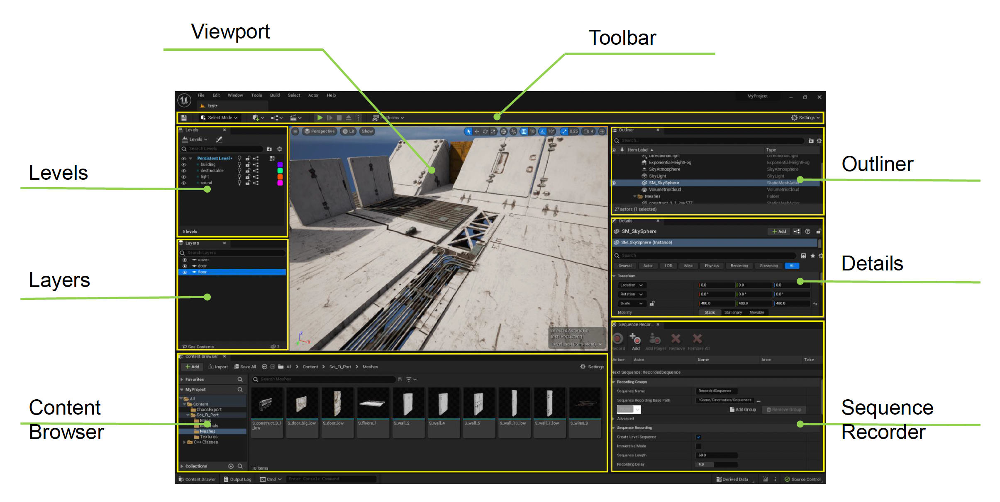
</div>


### Viewport

其中一个重要部件是编辑器**视口**(viewport)。

<div style="text-align: center">
    
</div>

- 它是设计师和游戏世界交互的主要窗口
- 由完整的游戏引擎在特殊的编辑器模式下驱动
- 提供多种用于编辑的特殊**小工具**(gadgets)和**可视化工具**(visualizers)

!!! warning "注意"

    编辑专用的代码必须从发布版游戏代码中移除！（这些代码极有可能成为编写外挂代码的入口）


### Editable Objects

正如头几讲说明的，**游戏中的所有对象都是可编辑的**。因此编辑器世界中所有对象的编辑要求大致相同，例如移动、调整参数等。

<div style="text-align: center">
    
</div>

编辑器应当能显示场景中所有对象的信息。但对于一个大型游戏而言，场景中可能有成千上万的对象，因此**以不同视图组织对象**这件事就很重要，会为开发带来更多便利，比如提供树状视图、目录和分组等等。

<div style="text-align: center">
    
</div>

有了视图列表后，接下来很自然地我们希望能看到有关选中对象的详细信息。编辑器通常会提供**模式驱动的对象属性编辑**功能（回顾上一讲介绍的[模式](13.md#schemas)）。

<div style="text-align: center">
    
</div>

除模式外，我们也可以为不同类型自定义编辑工具。


### Content Browser

编辑器中另一个重要部件是**内容浏览器**(content browser)。

- 提供所有资产的直观缩略图(thumbnails)
- 可以在不同项目间共享资产
- 其作用从静态文件文件夹演变为对内容海洋(ocean)的资产管理

<div style="text-align: center">
    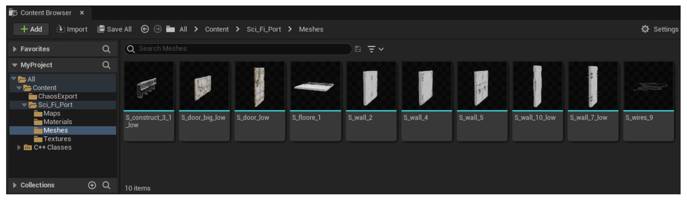
</div>


### Editing Utilities in World Editor

除了上述内容外，世界编辑器还提供了各种编辑小工具，包括：

<div style="text-align: center">
    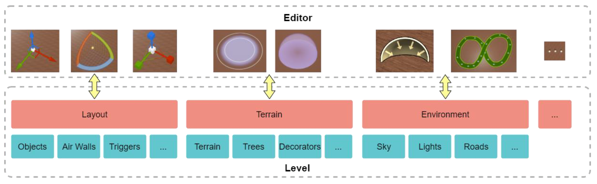
</div>

- 鼠标选取
    - **光线投射**(ray casting)
        - 优点：
            - 无需缓存
            - 可支持在选定光线上的多个对象
        - 缺点：查询效率低
    
        <div style="text-align: center">
            
        </div>

    - **RTT**
        - 优点：
            - 易于实现范围查询
            - 查询效率高
        - 缺点：
            - 需要绘制额外的图
            - 无法选中被遮挡的物体

        <div style="text-align: center">
            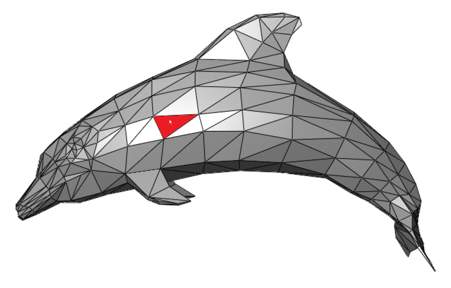
        </div>

- 对象**变换**(transform)编辑（包括平移、旋转、缩放操作）
    
    ??? example "例子"

        <div style="text-align: center">
            
        </div>

???+ note "**地形**(terrain)"

    - 地形(landform)：**高度图**
    - 外观：**纹理图**
    - 植被(vegetation)
        - 树木实例
        - **装饰物分布图**(decorator distribution map)

    <div style="text-align: center">
        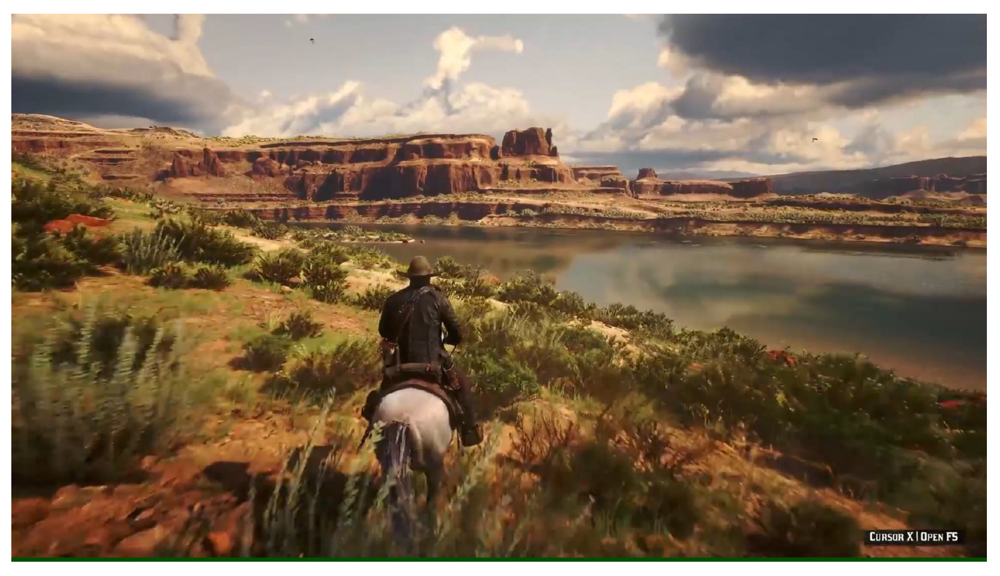
    </div>

- **高度刷**(height brush)
    - 绘制高度图以调整地形网格
    - 高度改变需要自然平滑
    - 可轻松调整至所需结果（支持自定义笔刷，扩展性）

    ??? example "例子"

        <div style="text-align: center">
            
        </div>

- **实例刷**(instance brush)
    - 优点：
        - 实例位置是固定的
        - 可进一步修改
    
    - 缺点：大量数据

    ??? example "例子"

        <div style="text-align: center">
            
        </div>

???+ note "**环境**(environment)"

    环境包括：

    - 天空
    - 光照
    - 道路
    - 河流
    - ...

    从上到下，环境为玩家呈现了一个生动的世界，因此编辑这些环境元素也很重要。

    <div style="text-align: center">
        
    </div>

- **规则系统**(rule system)：编辑环境时需遵循各种现实规则

    ???+ example "例子"

        === "例1"

            道路系统相关的一些规则：

            - 道路上没有树和装饰物
            - 道路应和地形匹配
            - 石头通常位于道路两侧
            - ...

        === "例2"

            <div style="text-align: center">
                
            </div>

        === "例3"

            <div style="text-align: center">
                
            </div>

    - 规则系统需应对数据变化
    - 与环境系统解耦合


## Editor Plugin Architecture

??? example "商业软件的插件模块"

    <div style="text-align: center">
        
    </div>

下图是一个关于系统和对象之间的交叉矩阵。实际上任何系统和对象类型都可作为编辑器的插件。

<div style="text-align: center">
    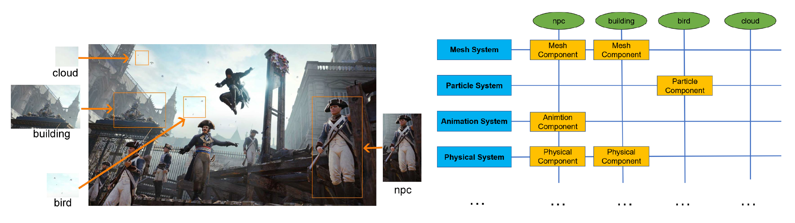
</div>

下面列举一些常见的多插件组织形式：

- **覆盖式**(covered)
    - 仅执行新注册的逻辑，跳过原来的逻辑
    - 例子：地形编辑覆写

    <div style="text-align: center">
        
    </div>

- **分布式**(distributed)
    - 每个插件都会被执行，如果有输出，那么将合并最终结果
    - 例子：大多数单独编辑的特殊系统

    <div style="text-align: center">
        
    </div>

- **流水线**(pipeline)
    - 输入和输出相互连接，一般输入和输出是相同的数据类型
    - 例子：资产预处理、物理几何

    <div style="text-align: center">
        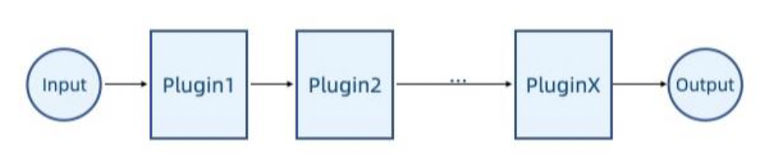
    </div>

- **洋葱圈**(onion ring)
    - 基于流水线，但系统的核心逻辑位于中间，插件同时关注进出逻辑
    - 例子：带有地形插件的道路编辑插件

    <div style="text-align: center">
        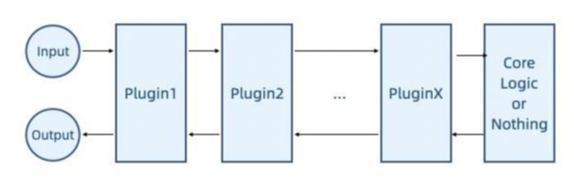
    </div>

这些形式在游戏引擎中都有可能被用到，所以不要一上来就假设按照哪个方式走。

最后还得考虑**版本控制**(version control)问题：插件与主应用程序（游戏引擎）之间需要有特定的版本关系，以确保它们能够正常协同工作。可采取以下两种方式之一：

- 插件使用与主应用程序相同的版本号
- 【推荐】插件使用插件接口的版本号（因为插件接口和软件的更新频率可能不同）


## Designing Narrative Tools

游戏中的**叙事**(storytelling)需控制时间轴上多个参数的变化。

<div style="text-align: center">
    
</div>

在 UE 中，这一任务由一个叫做**序列器**(sequencer)的工具完成。它的组件有：

- **轨道**(track)：用于引用序列中的参与者；任何角色、道具、相机、效果或其他参与者都可以在序列器中被引用和操作
- **属性轨道**(property track)：轨道中引用参与者的属性
- **时间线**(timeline)：描述离散帧中的时间的线
- **关键帧**(key frame)：可用于操控属性；当达到时间线上的关键帧时，轨道的属性会更新为在该点定义的值
- **序列**(sequence)：序列器的数据

<div style="text-align: center">
    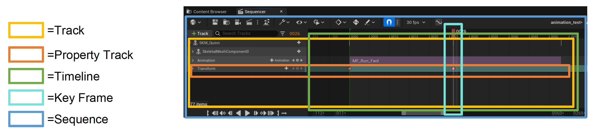
</div>

下面通过一个例子展示序列器的基本操作：

- 将对象绑定到轨道上（使得序列器能控制小鸡）

    <div style="text-align: center">
        
    </div>

- 将对象属性绑定到属性轨道上（控制小鸡的移动位置）

    <div style="text-align: center">
        
    </div>

- 设置关键帧
    - 单个（使小鸡到达指定位置）

        <div style="text-align: center">
            
        </div>

    - 多个（使小鸡按 A -> B -> C -> D 的顺序行进）

        <div style="text-align: center">
            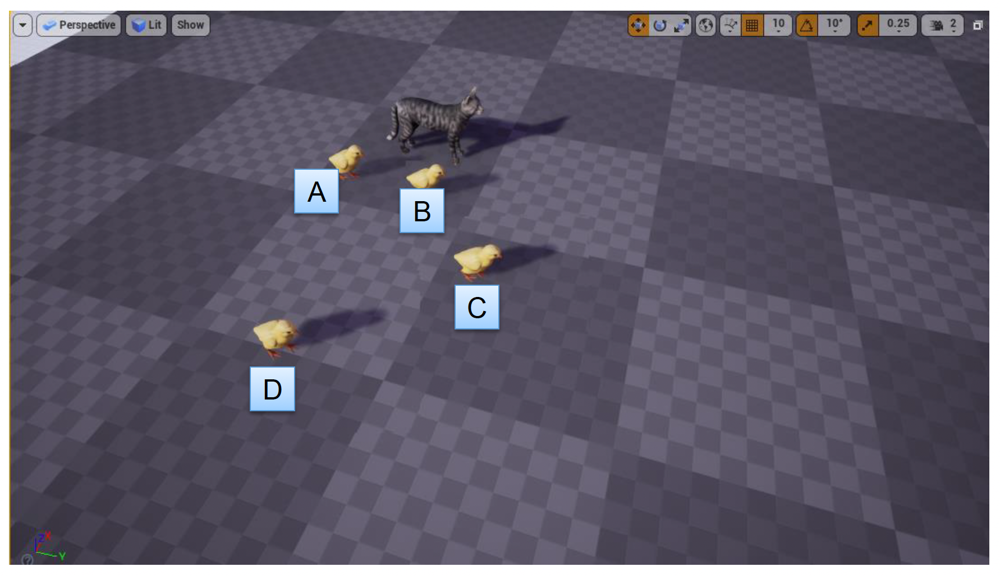
        </div>

- 沿着关键帧插值属性（类似做动画）

    <div style="text-align: center">
        
    </div>


## Reflection and Gameplay

**反射**(reflection)机制是游戏引擎中的一个重要功能。它也是序列器的实现基础，比如将数据绑定到轨道的操作就是基于反射系统实现的。

<div style="text-align: center">
    
</div>

再来看游戏玩法。一款成熟游戏的游戏玩法是相当复杂的。在游戏引擎中一般是通过**视觉脚本系统**(visual scripting system)来编写游戏玩法的，比如 UE 的蓝图功能。

??? example "例子"

    <div style="text-align: center">
        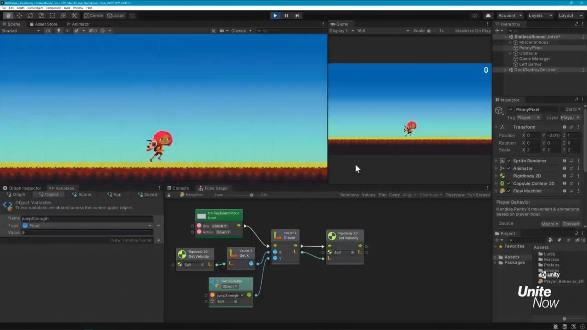
    </div>

视觉脚本系统的一个局限是可扩展性差。试想一下，假如原本角色只有「跳」这一个动作，但现在又新增一个「停止跳跃」的动作，那么工具层就得包含调用这一新动作的代码。而且也许未来还会引入更多的动作，到时候代码结构就会愈加复杂，难以管理。

<div class="grid" markdown>

```cpp hl_lines="6-8"
class Human: public Object {
    void Jump() {
        // do something ...
    }

    void StopJump() {
        // do something ...
    }
}
```

```cpp hl_lines="6-8"
void CallFunction(Object* instance, string type_name, string func_name) {
    if(type_name == "Human") {
        Human* human = (Human*) instance;
        if(func_name == "Jump") {
            human->Jump();
        } else if(func_name == "StopJump") {
            human->StopJump();
        }
    }
}
```

</div>

常用的解决方案还是采用反射机制。实际在 CS 领域中，**反射**是指一个进程检查、内省和修改自身结构和行为的能力。

??? info "Java 自带的反射"

    ```java title="Test.java"
    package Demo;
    public class Test {
        public int m_filed;
        public void print() {
            System.out.print("call print().");
        };
    }
    ```

    ```java title="Demo.java"
    package Demo;
    import java.lang.reflect.Field;
    import java.lang.reflect.Method;
    public class Demo {
        public static void main(String[] args) throws Exception {
            Class<?> cls = Class.forName("Demo.Test");
            Object obj = cls.getConstructor().newInstance();
            Field filed_accessor = cls.getField("m_filed");
            filed_accessor.set(obj, 2);

            Method method_accessor = cls.getMethod("print");
            method_accessor.invoke(obj);
        }
    }
    ```

对于上面的例子，通过反射建立起代码和工具层之间的桥梁，生成有关代码的**元信息映射**(meta information map)。具体来说是通过 `class_name`, `func_name` 和 `para_name` 来生成**访问器**(accessor)和**调用器**(invoker)。

```cpp
void CallFunction(Object* instance, string type_name, string func_name) {
    FunctionPtr function_ptr = FunctionInfoMap::getInvokeFunction(instance, type_name, func_name);
    function_ptr->invoke();
}
```


### Implementing Reflection in C++

C++ 中实现反射的做法：

- 从代码中收集类型信息
    - 下图展示了通用编程语言（GPL）的编译过程

        <div style="text-align: center">
            
        </div>

    - 我们关注其中的中间产物 **AST**（抽象语法树(abstract syntax tree)），它以树的形式表示编程语言的语法结构，树中的每个节点代表源代码中的一个构造

        <div style="text-align: center">
            
        </div>

    - GAMES104 的 Piccolo 引擎之所以采用 **Clang**，是因为 Clang 的主要目标之一是提供基于库的架构，以便编译器能够与其他与源代码交互的工具进行互操作

        <div style="text-align: center">
            
        </div>

    - 从 AST 中得到**模式**(schema)
        - 从 AST 中解析得到类型名、字段名、字段类型等等
        - 在内存中构建临时的数据模式

        <div style="text-align: center">
            
        </div>

    - 为实现对反射范围的精确控制，在实际中，我们需要用大量的**标签**(tag)信息来识别类型的意图

        ```cpp hl_lines="1"
        CLASS(Transform, Fields) {
        public:
            Vector3     m_position  { Vector3::ZERO };
            Vector3     m_scale     { Vector3::UNIT_SCALE };
            Quaternion  m_rotation  { Quaternion::IDENTITY };
        }
        ```

        ```cpp hl_lines="1 5"
        CLASS(CameraComponent : public Component, WhiteListFields) {
        public:
            CameraComponent() = default;

            META(Enable)
            CameraComponentRes m_camera_res;

            CameraMode m_camera_mode {CameraMode::invalid};

            Vector3 m_foward {Vector3::NEGATIVE_UNIT_Y};
            Vector3 m_up {Vector3::UNIT_Z};
            Vector3 m_left {Vector3::UNIT_X};
        };
        ```

        - 第一段代码中的 `Fields` 表示允许所有字段被反射出来
        - 第二段代码中的 `WhiteListFields` 表示只有用 `META(Enable)` 描述的字段才能被反射出来

    - 具体来说，反射控制是通过**宏**(macros) `__attribute__` 来实现的
        - `__attribute__` 是由 Clang 提供的源代码注解，在代码中可以使用这些宏来捕获所需的数据类型
        - 下面定义一个名为 `CLASS` 的宏来区别预编译和编译
            - 预编译时，在 `meta_parser` 中定义 `_REFOECTION_PARSER_` 宏以使属性信息生效

        <div style="text-align: center">
            
        </div>

- 生成提供字段和方法的访问器的代码：利用**模式**生成
    - **类**：生成类型信息 getters
    - **字段**：生成访问字段的 getters 和 setters
    - **函数**：生成调用函数的调用者(invokers)

    <div style="text-align: center">
        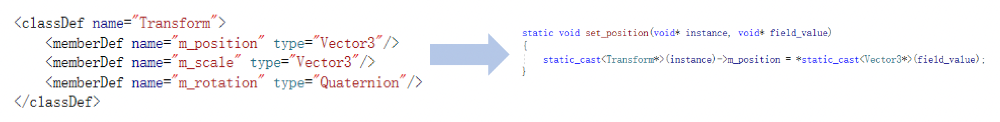
    </div>

- 使用 <字符串，访问器> 映射来管理所有的访问器


### Code Rendering

一个游戏引擎中需要反射的类会有几十个，如果还要手动写 getters, setters，那将是一件十分繁琐的事，并且不够自动化。为此引入了**代码渲染**(code rendering)机制。它是收集数据（如有）和加载相关模板（或直接发送输出）的过程。然后将收集到的数据应用于相关模板中，最终将输出发送给用户。这样做的好处是实现代码和数据的分离。

???+ info "Web 端中成熟的代码渲染机制"

    <div style="text-align: center">
        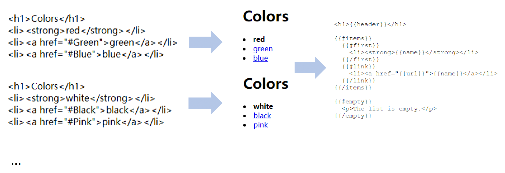
    </div>

Web 端中一个流行的模板系统便是 **Mustache**。之所以如此命名，是因为它大量使用了大括号 `{{ }}`，看起来像两侧的胡须。

<div style="text-align: center">
    
</div>

Piccolo 游戏引擎便借助 Mustache 渲染生成代码。

<div style="text-align: center">
    
</div>


## Collaborative Editing

!!! warning "开发大型项目会遇到的瓶颈"

    - 大量人围着大量数据工作
    - 资产版本管理相当困难

    其中**合并冲突**(merging conflicts)是最大的问题。如果不加处理，每个人在更新或上传资产时需要在合并冲突上花费很多时间。

    <div style="text-align: center">
        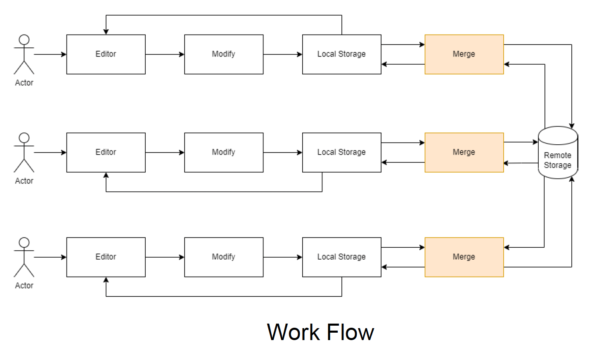
    </div>

减少冲突的方法有：

- 将资产划分为更小的部分，以减少冲突发生的可能
- 所有人在相同场景下工作，以完全消除冲突


### Splitting Assets

划分资产的几种方式：

- 将世界**分层**(layering)，每一层存储在一个资产文件中，不同人处理不同层级
    
    <div style="text-align: center">
        
    </div>
    
    - 优点：
        - 适当的分层能减少编辑冲突
        - 基于分层的逻辑可行

    - 缺点：
        - 分层逻辑可能依赖于其他层
        - 在世界非常复杂时，很难合理地划分层次

- **划分**世界：将世界划分为固定大小的块，每个块保存在单独的资产文件中；不同人在不同块上工作
    
    <div style="text-align: center">
        
    </div>

    - 优点：
        - 基于位置的划分有利于动态扩张世界
        - 空间划分更加直观
    
    - 缺点：难以处理横跨多个块的对象


- 每个参与者一个文件(one file per actor, **OFPA**)（UE5 提出）
    
    <div style="text-align: center">
        
    </div>
    
    - 通过在外部文件中保存参与者实例的数据，减少开发者工作之间的重叠，因此修改参与者时无需保存主关卡文件
    - 所有参与者在编译时都嵌入到各自的关卡文件中
    - 优点：
        - 细粒度的场景划分，更少的编辑冲突
        - 仅需保存被修改的对象
    
    - 缺点：
        - 需管理大量文件，为版本控制带来更大负担
        - 在将多个 OFPA 文件嵌入到关卡文件时，烘培速度会变慢


### Coordinating Editing in One Scene

第二类解决冲突的方法是协同编辑，即连接多个世界编辑器实例，以在共享编辑会话(sessions)中协作，与团队成员实时共同搭建虚拟世界。

<div style="text-align: center">
    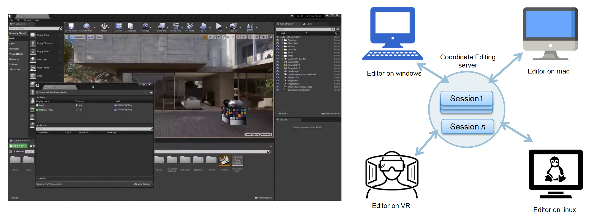
</div>

借助[**命令系统**](13.md#robust-tools)，从而将自己的操作和其他成员进行同步。

<div style="text-align: center">
    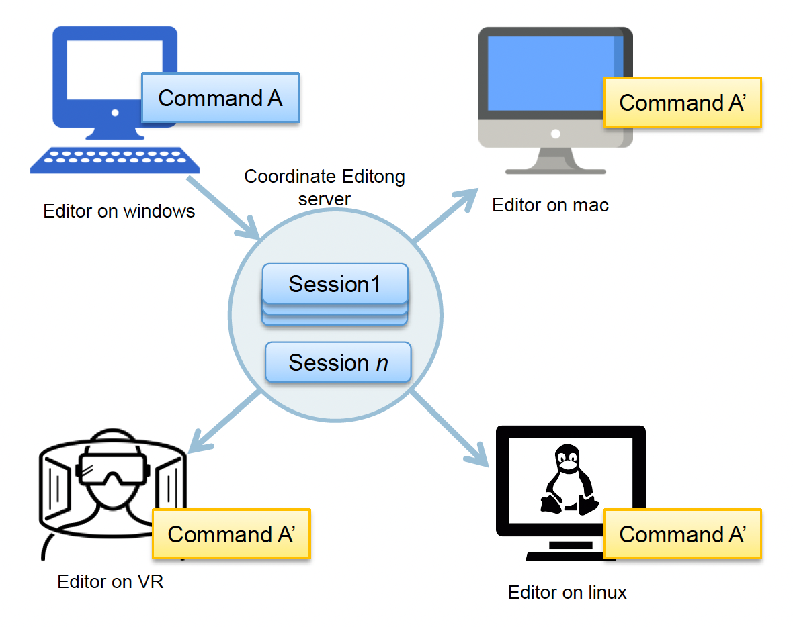
</div>

- 序列化命令，并将其发送给服务器
- 接收来自服务器的命令，并将其反序列化
- 调用命令

但实际上协同编辑的实现是很有挑战的，比如如何确保撤销/重做、合并等操作的一致性。其中一个简单做法是上**锁**，确保多位用户无法同时对相同实例或资产进行编辑。

- 实例锁

    <div style="text-align: center">
        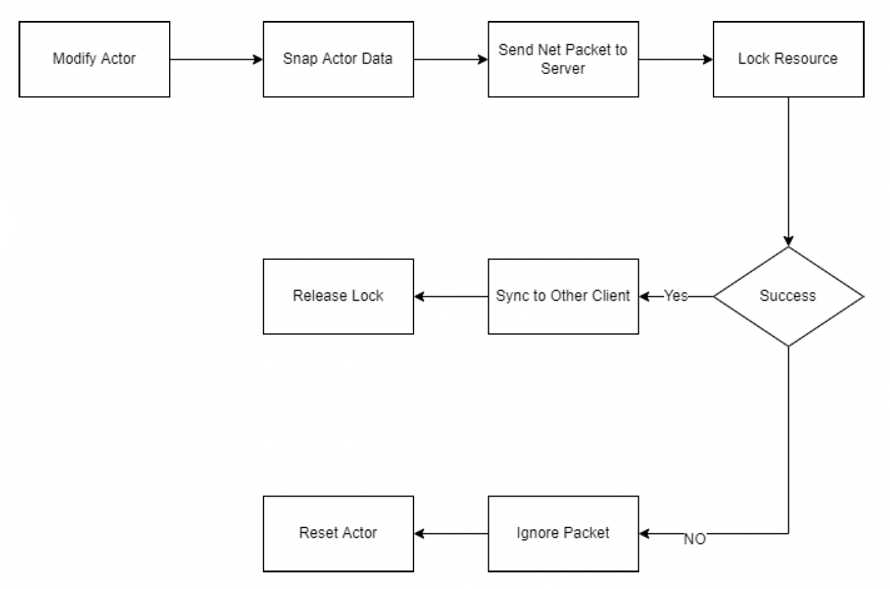
    </div>

- 资产锁

    <div style="text-align: center">
        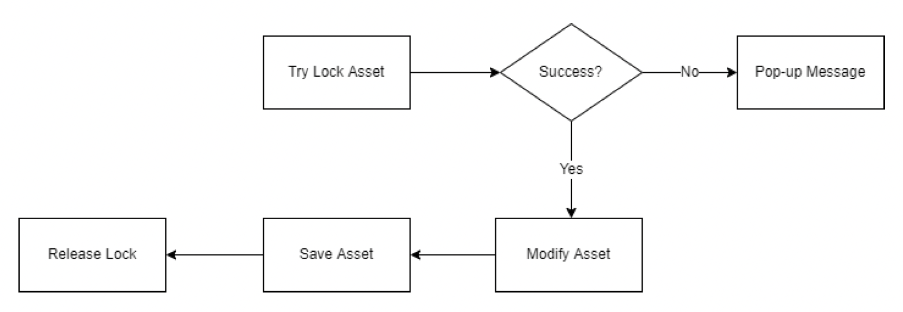
    </div>

但锁无法处理更复杂的情况。比如有三个人在同一场景下工作，某人的撤销或重做操作可能会破坏其他成员的当前操作。

<div style="text-align: center">
    
</div>

要想彻底解决上述问题，可采取以下方法之一：

- **操作变换**(operation transform, OT)：将操作抽象为一个由可枚举的 N 种原子操作类型组成的操作序列
- **无冲突复制数据类型**(conflict-free replicated data type, CRDT)：一种在网络中跨多个计算机复制的数据结构，具有以下特征：
    - 应用程序可以独立、同时更新任何副本，无需与其他副本协调
    - 一个算法（本身是数据类型的一部分）自动解决可能出现的任何不一致
    - 尽管副本在任何特定时间点可能处于不同的状态，但它们最终会收敛

另外不难发现，**服务器**(server)在其中扮演着很重要的角色。它需做到：

- 保留每个会话，直到创建该会话的用户明确删除它或服务器关闭
- 将会话记录保存到磁盘中

???+ abstract "传统工作流 vs 协作工作流"

    <div style="text-align: center">
        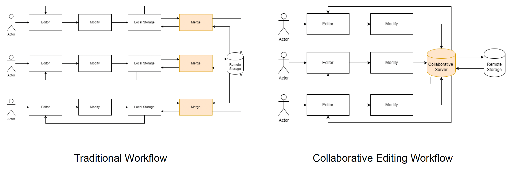
    </div>