# Gameplay Complexity and Building Blocks

???+ warning "游戏玩法的挑战"

    - 多系统之间的协作

        <div style="text-align: center">
            
        </div>

    - 即便在同一游戏中，可能也有多个游戏玩法
    
        <div style="text-align: center">
            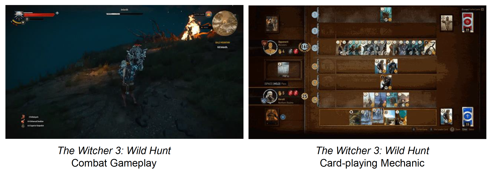
        </div>
    
    - 快速迭代
        - 例子：Epic 称他们借助《堡垒之夜》的基本框架，在大约两个月内迅速开发出一个大逃杀模式

        <div style="text-align: center">
            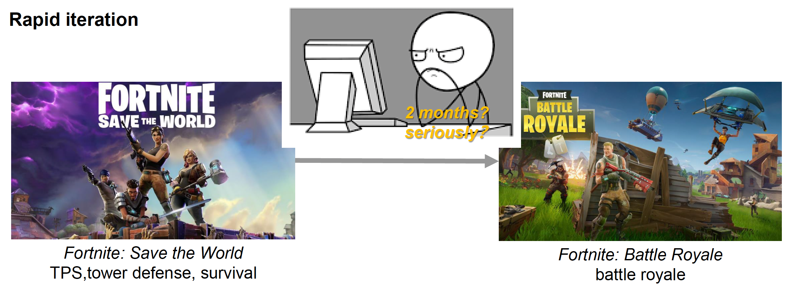
        </div>


## Event Mechanism

我们早在[第三讲](3.md#events)就已经介绍过事件的大致原理。若有遗忘，建议先点击链接回顾后再继续往下阅读，下面将不再赘述。

更进一步，在游戏引擎中常用的一种设计模式是**发布-订阅模式**(publish-subscribe pattern)。

- **发布者**(publisher)将发布的消息（事件）分类
- **订阅者**(subscriber)只接收感兴趣的消息（事件），无需知道这些消息来自哪些发布者

<div style="text-align: center">
    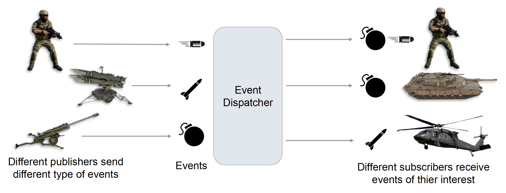
</div>

发布-订阅模式由三部分组成：

- **事件定义**(event definition)
- **回调注册**(callback registration)
- **事件分发**(event dispatching)


### Event Definition

事件的定义包括：

- **事件类型**(type)
- **事件参数**(argument)

<div style="text-align: center">
    
</div>

由于玩法是随时变化的，所以利用硬编码实现事件的定义是不太现实的。

<div style="text-align: center">
    
</div>

而在 UE 中，事件定义可通过上一讲介绍的[反射](14.md#reflection-and-gameplay)机制和代码生成器，以可视化的方式很容易地得到实现。

<div style="text-align: center">
    
</div>

但我们还得考虑一个问题：如果设计师每对某个事件做修改，那么所有代码就得重新编译一遍，这样看起来很麻烦啊。仍然以 UE 为例，它的做法是：通过上述方法定义的事件本质上还是 C++ 代码，如果对事件做了修改，那么仅需重新编译对应的代码，在引擎运行时将其看作一段 DLL 注入进去。其他引擎也有各自的解决方案，比如通过别的脚本语言定义事件，这里就不展开了。


### Callback Registration

**回调**(callback)函数是一种任何作为其他代码参数传递的可执行代码引用。

<div style="text-align: center">
    
</div>

回调函数的注册和执行的时间点是不同的。正常的时间顺序都是先注册后执行的。

<div style="text-align: center">
    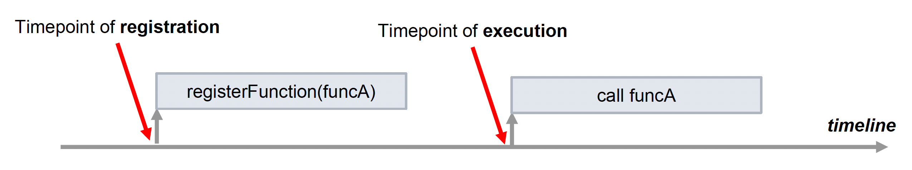
</div>

引擎中一个很容易出现的问题是对象的生命周期和回调函数安全性。比如一个对象已经被删掉了，但由于代码设计缺陷，在这之后仍然调用了一个和该对象相关的回调函数。此时原本表示该对象的变量是一个野指针，因此调用回调函数后程序就很有可能崩溃掉。

<div style="text-align: center">
    
</div>

解决方案有：

- **强引用**(strong reference)：确保在删除对象之前注销回调函数，以避免内存泄漏问题

    <div style="text-align: center">
        
    </div>

    - 问题：要求过于严格，导致留在内存中的东西越来越多，所以现在很少这么做了

- **弱引用**(weak reference)：允许直接删除对象，但每次调用回调函数前会先检查其依赖的对象是否存在
    >很像 C++ 的智能指针

    <div style="text-align: center">
        
    </div>


### Event Dispatching

**事件分发**是指向合适的目的地发送事件的功能。

<div style="text-align: center">
    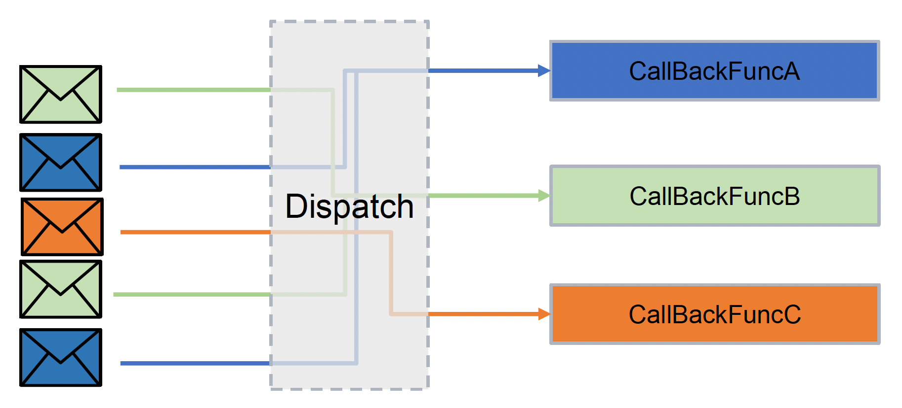
</div>

分发的实现方法有：

- **即时**(immediate)分发：父函数在回调函数返回后立即返回

    <div style="text-align: center">
        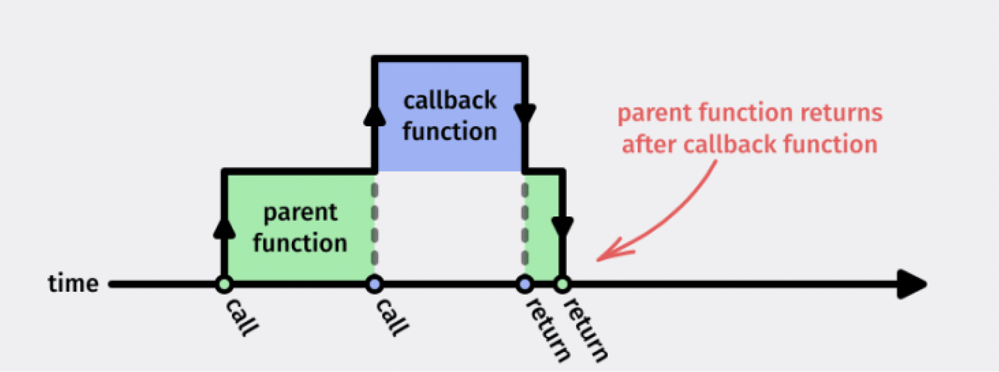
    </div>

    - 问题：
        - 假如一枚炸弹爆炸了（一个事件），那它会引爆周围所有的炸弹，以此类推，这样回调函数的调用栈会变得相当深

            <div style="text-align: center">
                
            </div>

        - 被其他函数阻塞：假如子弹击中角色，这引发的一个事件是流血效果，但这个粒子效果无法瞬间完成，因此会阻塞后续函数的进行，从而导致游戏帧率不稳定

            <div style="text-align: center">
                
            </div>

        - 难以并行化：函数调用是一层套一层的，很难将这些运算并行化

            <div style="text-align: center">
                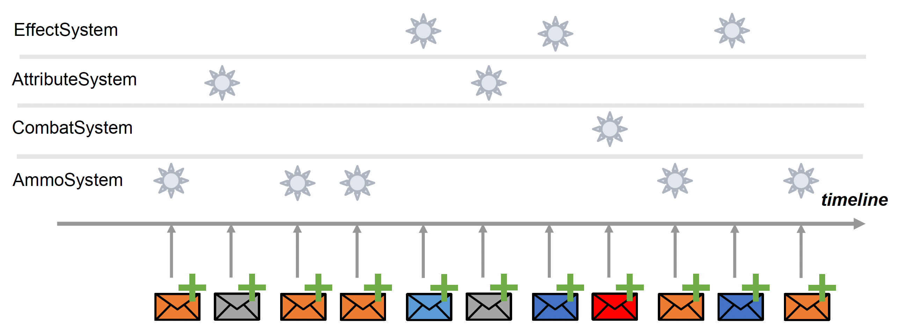
            </div>

- **事件队列**(event queue)
    - 基本实现：将事件存储在队列中，以便在未来任意时间中处理

        <div style="text-align: center">
            
        </div>

    - 通过事件**序列化**和**反序列化**（借助反射机制）来存储不同类型的事件

        <div style="text-align: center">
            
        </div>

    - 具体方式：
        - **环形**缓冲区（循环队列）
        
            <div style="text-align: center">
                
            </div>
        
        - **批处理**(batching)：对事件分类，按不同类别划分多个队列，便于调试

            <div style="text-align: center">
                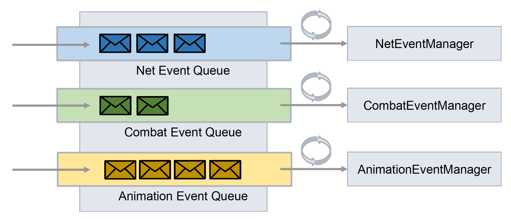
            </div>

    - 问题：
        - 时间线无法由发布者决定，也就是说无法保证事件的执行顺序
        
            <div style="text-align: center">
                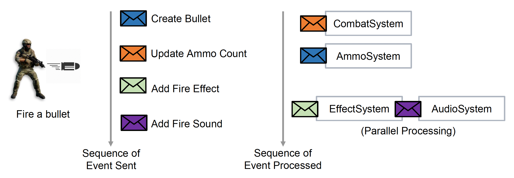
            </div>
        
        - 单帧延迟：由于事件触发的连锁反应，后面的事件可能来不及在同一帧中表现出来，得到下一帧再发生，这样的表现效果可能会怪怪的

            <div style="text-align: center">
                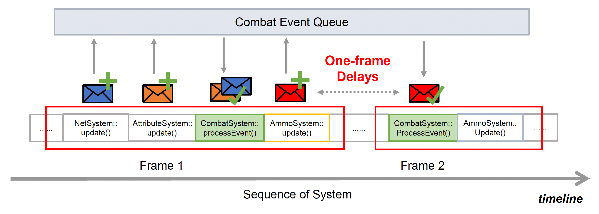
            </div>


## Script System

早期游戏中，游戏逻辑的编程通常采用的是**编译型语言**(compiled language)，且大多为 C/C++。因为这类语言不仅相比汇编语言更易使用，而且编译成机器码后执行效率也很高。

??? example "例子"

    ```cpp
    void Player::tick(Float delta) {
        updateDirection();

        if (isKeyPressed(MOUSE_LEFT)) {
            fire();
        }

        if (isKeyDown(KEY_W)) {
            moveForward(delta);
        } else if (isKeyDown(KEY_S)) {
            moveBackward(delta);
        }
        
        if (isKeyDown(KEY_A)) {
            moveLeftward(delta);
        } else if (isKeyDown(KEY_D)) {
            moveRightward(delta);
        }

        ...
    }
    ```

但随着硬件进步，游戏需求也变得愈加复杂，要求游戏逻辑能够做到快速迭代，这边暴露出编译型语言的种种弊端：

- 即便稍作修改也要重新编译整个程序
- 若代码不正确，程序很容易就崩溃
- 设计师也是游戏逻辑的开发者，虽然他们的代码基础不多，但是他们需要对游戏逻辑进行直接控制；另外艺术家也有在运行时环境下快速调整资产内容的需求

因此现代游戏开发中主要由**脚本语言**(script language)负责游戏逻辑的编写，因为这类语言具备以下特点：

- 支持快速迭代
- 易学易写
- 支持**热更新**(hot update)
- 由于在**沙箱**(sandbox)环境中运行，因此更稳定且崩溃更少

??? example "例子"

    ```lua title="Lua Script"
    function tick(delta)
        if input_system.isKeyDown(KeyCode.W) then
            self:moveForward(delta)
        elseif input_system.isKeyDown(KeyCode.S) then
            self:moveBackward(delta)
        end

        if input_system.isKeyDown(KeyCode.MouseLeft) then
            self:fire(delta)
        end
        ...
    end
    ```

脚本先通过编译器被转换为**字节码**(bytecode)，然后在**虚拟机**(virtual machine)上运行。

<div style="text-align: center">
    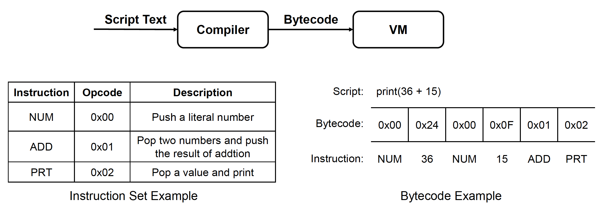
</div>

???+ note "脚本和引擎中的对象生命周期管理"

    - **原生引擎代码**(native engine code)
        - 需提供对象生命周期管理机制
        - 脚本使用原生对象时不太安全（因为可能会被析构）

        <div style="text-align: center">
            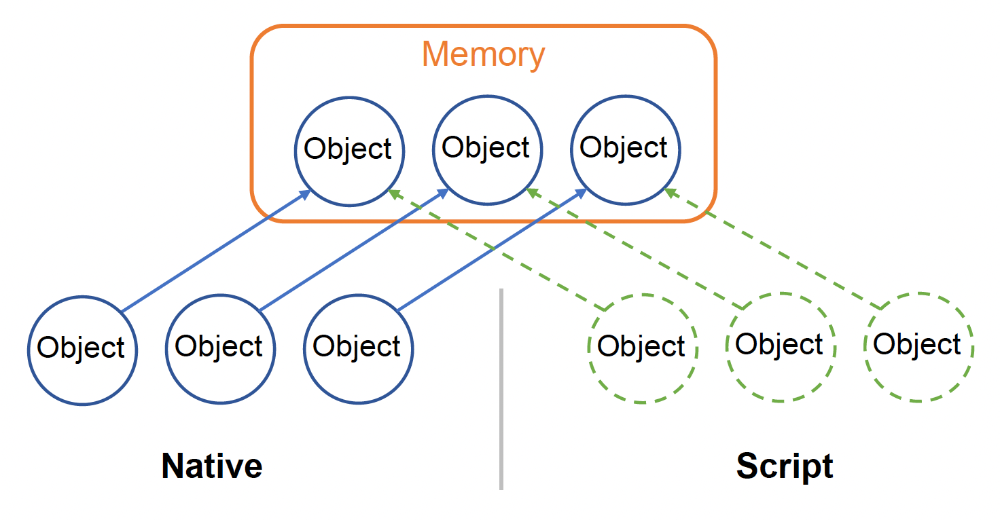
        </div>

    - **脚本**
        - 对象生命周期由脚本的 **GC**（垃圾回收）自动管理
        - 对象被释放的时间是无法控制的（因为是由 GC 控制的）
        - 如果脚本中的引用关系过于复杂，很容易会出现内存泄漏问题
        >注：由于 GC 算法效率并不是很高，所以可能会影响到性能，因此需做好权衡


        <div style="text-align: center">
            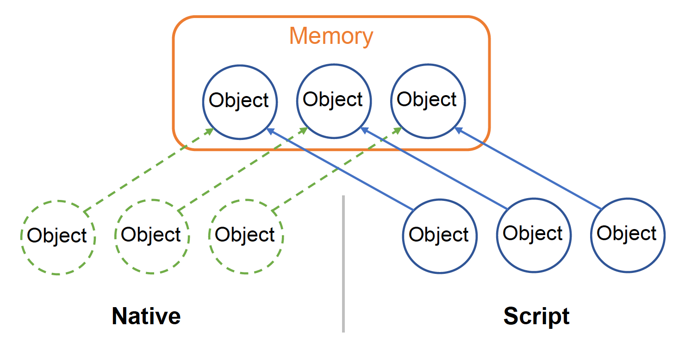
        </div>

???+ note "适用于脚本系统的架构"

    - **原生语言**主导
        - 多数游戏逻辑位于原生代码中
        - 脚本扩展原生代码的功能
        - 由编译型语言带来的高性能
    
        <div style="text-align: center">
            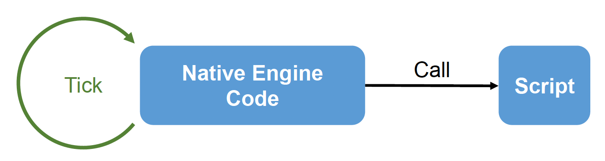
        </div>

    - **脚本语言**主导
        - 多数游戏逻辑位于脚本中
        - 原生引擎代码为脚本提供必要的功能
        - 由脚本语言带来的快速迭代能力

        <div style="text-align: center">
            
        </div>

现在关注脚本的另一个功能：**热更新**

- 允许在游戏运行时修改逻辑
    - 可对特定逻辑进行快速迭代
    - 允许在线游戏修复脚本中的错误

- 问题：所有引用旧函数的变量也要更新

<div style="text-align: center">
    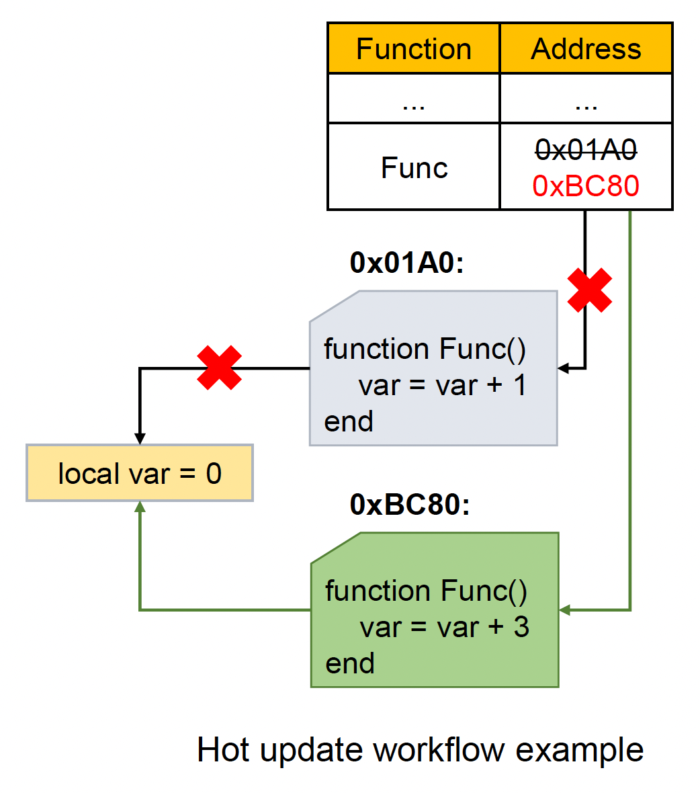
</div>

???+ bug "脚本语言的问题"

    - 性能通常比编译型语言低
        - **弱类型语言**(weakly typed language)通常难以在编译时优化
        - 需要虚拟机运行字节码
        - **JIT**（即时编译）是其中一种优化方案
    
    - 弱类型语言通常难以重构(refactor)

    <div style="text-align: center">
        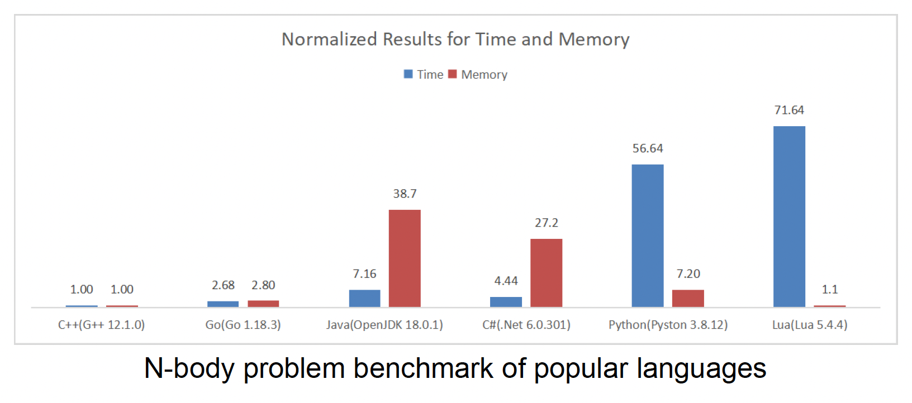
    </div>

因此，采用脚本语言时需考虑：

- 语言性能
- 内建功能（比如 OOP 支持）
- 选择合适的架构（原生引擎代码/脚本）
    - 由谁负责对象生命周期的管理
    - 由谁主导游戏逻辑的编写

???+ info "流行的脚本语言"

    - Lua（用于《魔兽世界》《文明 V》等）
        - 健壮且成熟
        - 优秀的运行时性能
        - 轻量级，高扩展性

    - Python（用于《模拟人生 4》《EVE Online》）
        - 支持反射
        - 内建 OOP 支持
        - 丰富的标准库和第三方模块
    
    - C#（用于 Unity）
        - 学习曲线低，易读易理解
        - 内建 OOP 支持
        - 有很多活跃的开发者的优秀社区
    
    <div style="text-align: center">
        
    </div>


## Visual Scripts

???+ question "为何需要视觉脚本系统"

    - 对非程序员友好，尤其是设计师和艺术家
    - 拖放操作相比写代码更不易出错

???+ example "例子"

    <div style="text-align: center">
        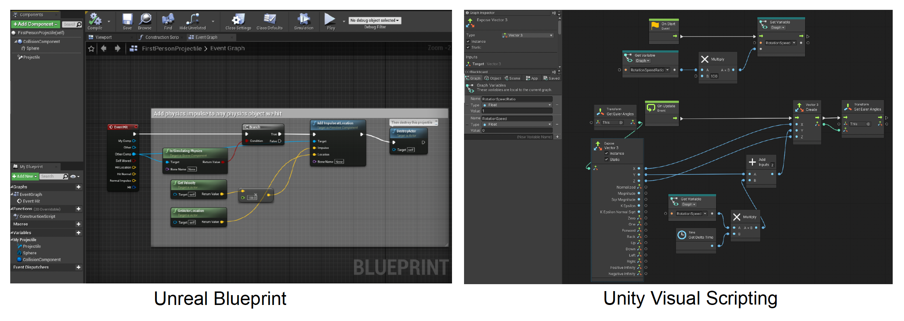
    </div>

不过视觉脚本依然是一种编程语言，因为它通常需要：

- **变量**：用于保留被处理和输出的数据
    - 类型：基本类型（整数、浮点数等）、复杂类型（结构体等）
    - 作用域：局部变量、成员变量...
    - 可视化：通过**数据引脚**(pin)和**连线**(wire)传递变量（每个数据类型对应唯一的引脚颜色）

    <div style="text-align: center">
        
    </div>

- **语句**和**表达式**:：控制数据的处理
    - 语句：表达需要执行的行动，包括赋值语句、函数语句等
    - 表达式：经求解后返回一个具体的值，包括函数表达式、数学表达式等
    - 可视化：使用**节点**(nodes)

    <div style="text-align: center">
        
    </div>

- **控制流**：控制语句执行的顺序
    - **顺序**(sequence)语句：默认顺序，一条接一条地执行语句
    - **条件**(conditional)语句：下一条要执行的语句由条件决定
    - **循环**(loop)语句：迭代执行语句，直到条件不为真
    - 可视化：通过**执行引脚**(pin)和**连线**(wire)确定语句顺序，并使用控制语句节点来构建不同的控制流

    <div style="text-align: center">
        
    </div>

- **函数**：接收并处理数据，最后返回结果的逻辑模块，由输入参数、函数体和返回值三部分构成
    - 可视化：用带有多个连接节点的**图**(graph)来表示一个函数

    <div style="text-align: center">
        
    </div>

- **类**（OOP 语言）：某类对象的原型
    - **成员变量**：其生命周期由对象实例管理
    - **成员函数**：可以直接访问成员变量，可被派生类(derived classes)重写(override)
    - 可视化：通过**蓝图**(blueprint)定义一个继承自原生类的类，包括了**事件回调函数**、成员函数和成员变量等

    <div style="text-align: center">
        
    </div>

为了对用户更加友好，视觉脚本还提供了以下功能：

- **模糊查找**(fuzzy finding)

    <div style="text-align: center">
        
    </div>

- 根据类型提供精确建议

    <div style="text-align: center">
        
    </div>

- 视觉脚本**调试器**(debugger)

    <div style="text-align: center">
        
    </div>

???+ bug "脚本语言的问题"

    - 在团队工作中，视觉脚本难以合并
        - 通常将视觉脚本存储为二进制文件
        - 手动重新排序脚本图既不高效又容易出错，即使采用合并工具也是如此
    
        <div style="text-align: center">
            
        </div>

    - 若逻辑过于复杂，那么图将会变得一团糟
        - 因此在团队工作中，需要有统一的图布局规则

        <div style="text-align: center">
            
        </div>

正如其字面意思，视觉脚本可以用等价的脚本语言描述。现在的游戏引擎通过图编译器，直接将脚本图转换为二进制的字节码。

<div style="text-align: center">
    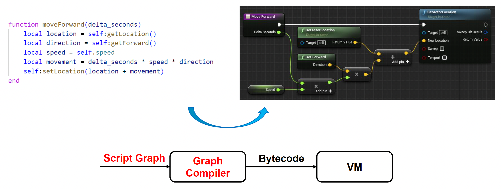
</div>


## 3C

游戏中常说的 "3C" 分别指代**角色**(character)、**控制**(control)和**相机**(camera)，它们是构成游戏玩法的三大基本要素。

???+ example "例子：《双人成行》"

    <div style="text-align: center">
        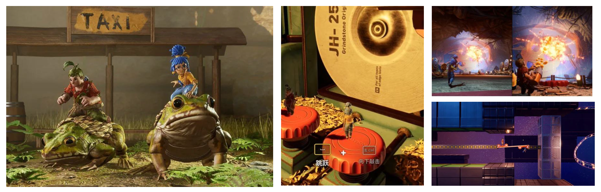
    </div>

    >从左往右的三列图片分别对应角色、控制和相机。

    >后面也会大量采用这个游戏中的例子，因为它的 3C 做得很好。


### Character

在游戏中，**玩家**(player)和 **NPC** 都属于角色，并且包括移动、战斗、生命值、魔法值(mana)、拥有的技能和天赋等都属于角色的一部分。

<div style="text-align: center">
    
</div>

下面我们重点关注其中最基本的要素之一：**移动**(movement)。移动这一操作看起来简单，但想要做好却十分困难。在 3A 游戏中，即便是一个基本的动作状态，也要被划分为多个详细的小状态。

<div style="text-align: center">
    
</div>

??? info "表示移动的状态机"

    <div style="text-align: center">
        
    </div>

    >吓哭了😭

在更一般的情况下，还得考虑角色与**环境**的互动，因而发展出更加复杂和多样的状态。

<div style="text-align: center">
    
</div>

<div style="text-align: center">
    
</div>

并且还得考虑和其他游戏子系统的互动，包括各种**特效**、**声音**等等。

要想让运动更加真实，还可以考虑各种**物理**因素，比如气流(airflow)、惯性张量(inertia tensor)、扭矩(torque)等等。

??? example "例子"

    <div style="text-align: center">
        
    </div>


### Control

简答来说，**控制**就是将来自不同输入设备的输入转换为游戏中的操作。

<div style="text-align: center">
    
</div>

???+ example "例子"

    <div style="text-align: center">
        
    </div>

对于上面的例子，在实际操作中，鼠标右键对应瞄准操作，而鼠标左键对应发射操作。无论采用什么样的鼠标，这一操作都能得到精确执行。

<div style="text-align: center">
    
</div>

此外，游戏还提供以下表现提升了游玩体验：

- 画面缩放：瞄准时相机对准准心，并且视场缩小，便于瞄准
- 辅助瞄准：提供吸附效果，提升了手感

    <div style="text-align: center">
        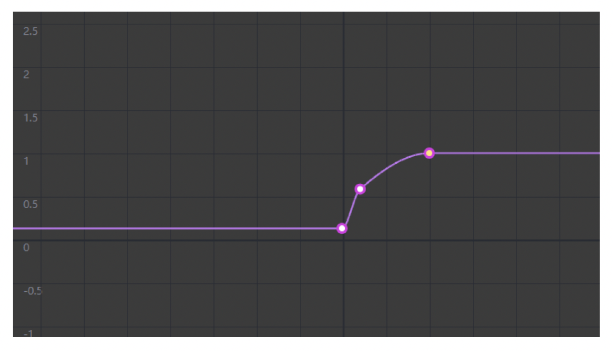
    </div>

另外，使用手柄的玩家还能感受到手柄震动带来的反馈。

<div style="text-align: center">
    
</div>

还有一个容易被大家忽视的一点是：即便按下相同的输入按钮，在不同游戏情境下也应该产生不同的效果，这就是**上下文敏感的控制**(context-sensitive control)。

???+ example "例子"

    <div style="text-align: center">
        
    </div>

最后介绍一下常见于动作游戏的控制：

- **组合技**(chord)：同时按下某些特定按键时产生的独特动作
- **按键序列**(key sequence)：通常通过记录玩家执行的 HID（人机交互设备）行动的简短历史来实现姿势检测(gesture detection)

<div style="text-align: center">
    
</div>


### Camera

??? example "例子"

    <div style="text-align: center">
        
    </div>

相机系统的基本要素：

- **视点**(point of view, **POV**)：确定玩家的观察位置
- **视场**(field of view, **FOV**)：确定玩家的视角大小

<div style="text-align: center">
    
</div>

相机往往和角色绑定在一起。但相机离角色的相对位置不是定死的——根据视角的远近，相机的距离远近也会随之改变。

另外还有以下在相机控制中经常出现的概念：

- **弹簧臂**(spring arm)：尽量保证相机不会穿墙

    <div style="text-align: center">
        
    </div>

- **聚焦**(focusing)：改变相机的 FOV

    <div style="text-align: center">
        
    </div>

相机系统中一个著名的技术叫做**相机轨道**(camera track)，即设计师根据角色状态设置相机参数，以表达游戏带给人的各种主观感受。

<div style="text-align: center">
    
</div>

相机系统还包括相机之外的一些效果，比如**滤镜**(filter)和**抖屏**(shake)等。

<div style="text-align: center">
    
</div>

有些游戏中涉及到多台相机，玩家可在这些相机间来回切换，并且需要有一个**相机管理器**(camera manager)来管理这些相机。

<div style="text-align: center">
    
</div>

正如前面所述，相机的一大重要作用是表达游戏带给人的各种**主观感受**(subjective feelings)。通常需通过多种基本的调整来达到复杂的效果。可以这样调整：

- 表现速度：
    - 沿运动方向添加线条
    - 角色后倾
    - 动态模糊
    - 放大 FOV（以体现屏幕内容变化之迅速）

    <div style="text-align: center">
        
    </div>

- 表现松弛感：舒缓的相机移动

    <div style="text-align: center">
        
    </div>

- 表现电影感：滤镜、运动、声音、叙述者、模型、动画、相机移动...

    <div style="text-align: center">
        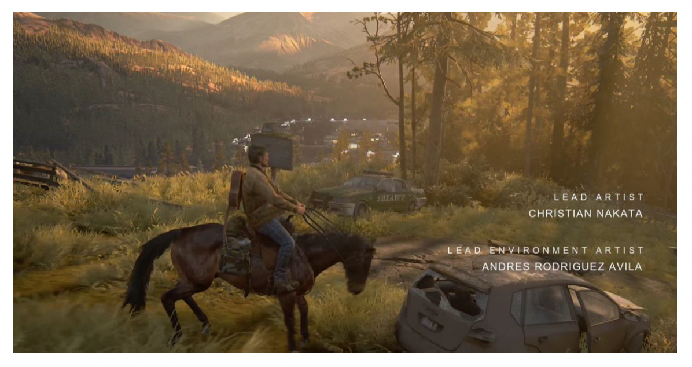
    </div>

在游戏引擎中，艺术家和设计师要想优化效果，需利用：

<div style="text-align: center">
    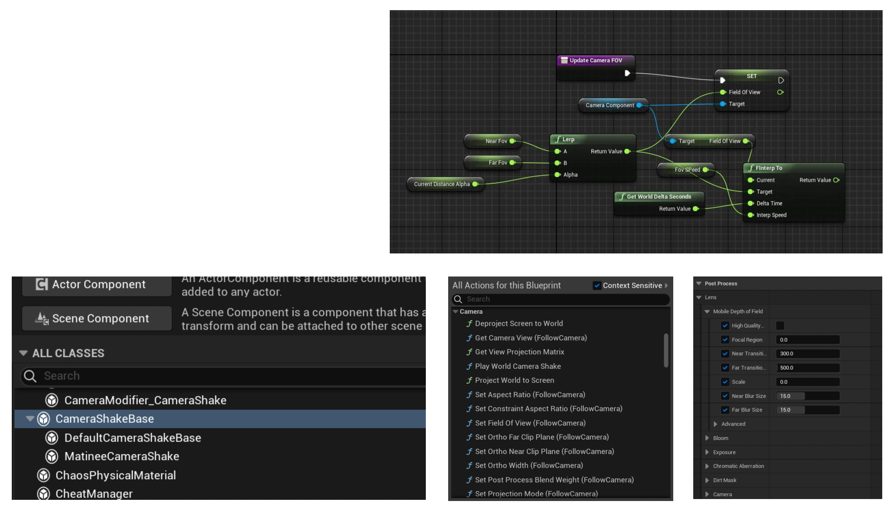
</div>

- 可继承的类
- 能被蓝图处理的函数
- 可调整的参数