# Basic Artificial Intelligence

## Navigation

游戏的**导航**(navigation)是指自动寻找两地点之间的路径的功能。

??? example "例子"

    <div style="text-align: center">
        
    </div>

    >《刺客信条：奥德赛》

导航的流程为：

1. **地图表示**(map representation)
2. **路径寻找**(path finding)
3. **路径平滑**(path smoothing)

<div style="text-align: center">
    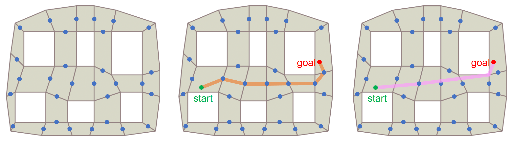
</div>

下面依次详细介绍这些步骤。


### Map Representation

第一步中，我们需要告诉 AI 智能体哪里可以走（这些区域被称为**可行走区域**(walkable area)）。

- 玩家的可行走区域由角色的运动能力决定，包括物理碰撞、攀爬斜率/高度、跳跃距离等
- 如果让智能体模仿玩家移动的话，成本就太高了；并且还希望它们有着和玩家一样的可行走区域

下一个要考虑的问题是如何表示地图。接下来就带大家认识一下常见的地图表示形式：

- **航点网络**(waypoint network)
- **网格**(grid)
- **导航网格**(navigation mesh)
- **稀疏体素八叉树**(sparse voxel octree)


#### Waypoint Network

**航点网络**是指地图中的关键点(critical points)相互连接的网络。

- **航点源**(waypoint source)包括：
    - 指定重要地点 🔴
    - 覆盖可行走区域的角点 🟢
    - 连接邻近航点的内部点 🔵（以增加导航的灵活性）

    <div style="text-align: center">
        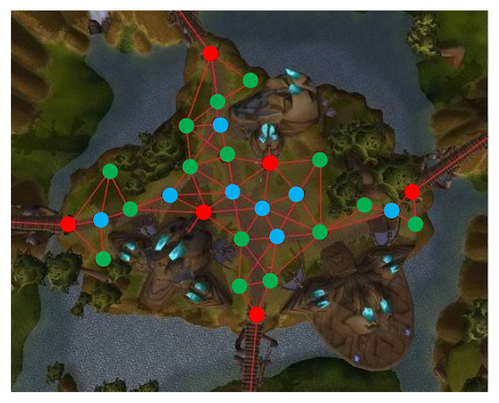
    </div>

- 航点网络的使用类似地铁系统
    - 寻找网络中最近的上/下车点（起点/终点）
    - 在网络中寻路

    <div style="text-align: center">
        
    </div>

???+ recommend "优点"

    - 易于实现
    - 即便对于大地图，寻路速度也很快

???+ bug "缺点"

    - 灵活性有限：必须在导航前在网络中找到最近点
    - 航点选择需要人工干预


#### Grid

**网格**可看作是对地图的一种直观离散化(discretization)表示，将地图均匀细分为多块小的规则网格。常见的网格形状有方形、三角形、六边形(hexagon)等。

<div style="text-align: center">
    
</div>

网格的一大特点是可以在运行时修改网格属性，以反映动态的环境变化（同时也便于调试）。

??? example "例子"

    <div style="text-align: center">
        
    </div>

???+ recommend "优点"

    - 易于实现
    - 统一的数据结构
    - 动态性

???+ bug "缺点"

    - 准确性取决于网格分辨率
    - 网格过于稠密会影响寻路性能
    - 内存消耗大
    - 难以处理三维地图（层叠(overlapping)地图，比如下图中桥面与河流都是可行走区域）

    <div style="text-align: center">
        
    </div>


#### Navigation Mesh

**导航网格**解决了网格方法无法表示层叠可行走区域的问题。它基于物理碰撞和运动能力来近似表示角色的可行走区域，并且通过更低的网络密度来提升寻路性能。

<div style="text-align: center">
    
</div>

??? example "例子"

    === "例1"

        用一组相邻的凸多边形表示可行走区域。

        <div style="text-align: center">
            
        </div>

    === "例2"

        <div style="text-align: center">
            
        </div>

导航网格通常采用**凸多边形**(convex polygon)的原因：

- 寻路算法生成一系列需经过的多边形（称为**多边形走廊**(polygon corridor)）

    <div style="text-align: center">
        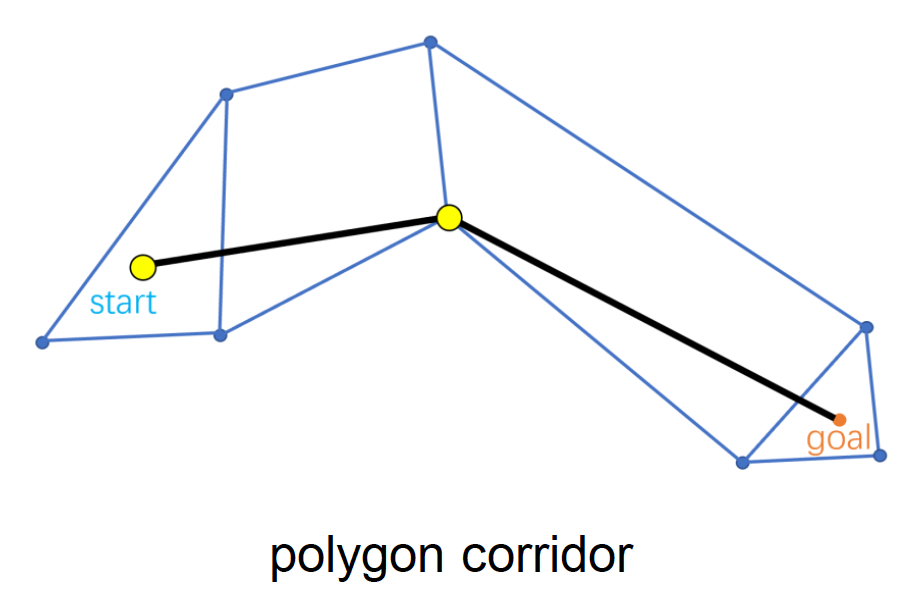
    </div>

- 凸性保证了最终路径在多边形内有限，且两个相邻多边形只有一个公共边（**门户**(portal)）

    <div style="text-align: center">
        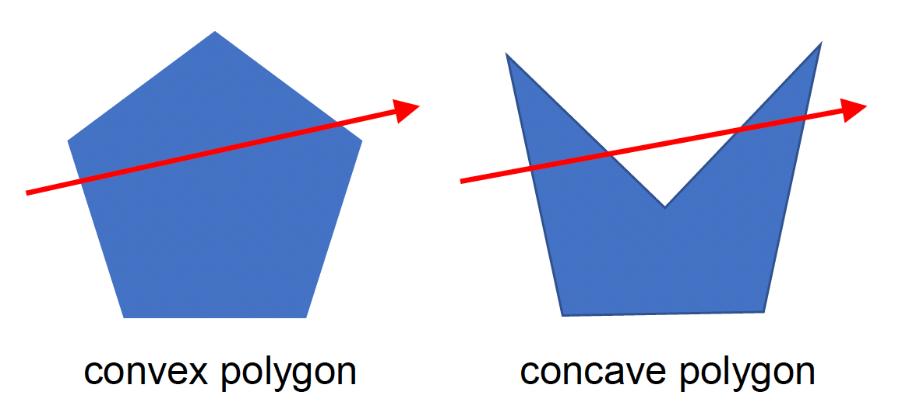
    </div>

???+ recommend "优点"

    - 支持 3D 可行走表面
    - 精确
    - 寻路快
    - 可灵活选择起点和终点
    - 动态性

???+ bug "缺点"

    - 生成算法复杂（不过有一些开源库已经实现好了）
    - 不支持 3D 空间


#### Sparse Voxel Octree

**稀疏体素八叉树**和空间划分中的八叉树方法类似，常用于表示「可飞行的」(flyable) 3D 空间。

- 粒度最细的一层的体素表示复杂的边界
- 更粗粒度的层级的体素表示均匀的区域

<div style="text-align: center">
    
</div>

该方法的问题有：存储空间大、寻路麻烦。

??? example "例子"

    <div style="text-align: center">
        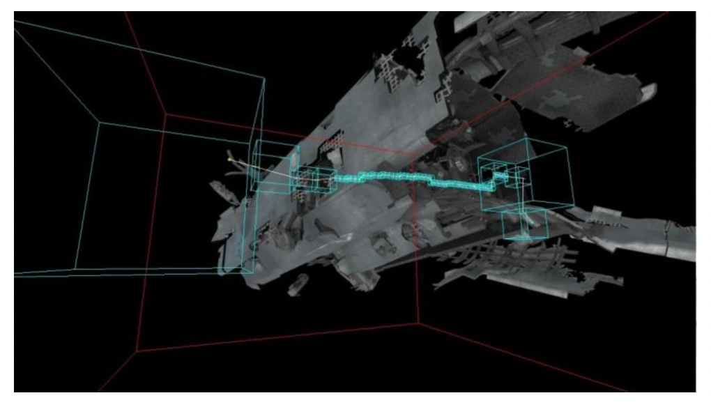
    </div>


### Path Finding

我们可以将地图表示中的距离抽象为图中的边成本。

<div style="text-align: center">
    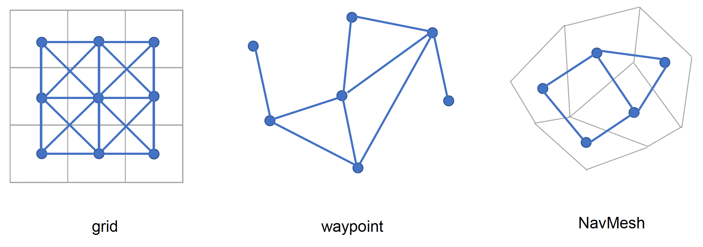
</div>

那么寻路问题就可被抽象为**无向图中的最短路问题**(shortest path problem)。下面介绍一些解决此类问题的经典算法。

<div style="text-align: center">
    
</div>

??? note "基本图论算法"

    !!! warning "它们无法用于计算加权最短路"

    - **深度优先搜索**(depth-first search, **DFS**)优先沿着每一条分支路径探测到尽可能深的节点，直到目标节点被发现或达到叶子节点后才进行回溯。

        <div style="text-align: center">
            
        </div>

    - **广度优先搜索**(breadth-first search, **DFS**)从根节点开始，按照距离起始点的层级顺序，由近及远地逐层访问所有邻接节点。

        <div style="text-align: center">
            
        </div>


#### Dijkstra Algorithm

算法伪代码如下：

```cpp hl_lines="17"
// initialization
for each vertex v:
    dist[v] = ∞
    prev[v] = none

dist[source] = 0  // start
set all vertices to unexplored

while destination not explored:
    v = least-valued unexplored vertex
    set v to explored
    
    for each edge (v, w):
        // update
        if dist[v] + len(v, w) < dist[w]:
            dist[w] = dist[v] + len(v, w)
            prev[w] = v
```

算法看着有些抽象，但如果结合下面的示例阅读，理解起来还是容易的。

??? example "例子"

    <div style="text-align: center">
        
    </div>

注意伪代码的最后一行，它的作用是记录当前节点的上一个节点，以便构建最短路经过的节点序列。

- 时间复杂度：$O(V^2)$
- 空间复杂度：$O(V + E)$

>$V, E$ 分别表示节点数和边数。


#### A*

最后要介绍的算法是 **A\*** 算法。它基于 Dijkstra 算法，但每经过一个点时，不仅要考虑过去花费的路径成本，还得考虑到达目的地还需要多少距离，也就是说每一步总是选择这两者成本之和最小的节点进行扩展（**贪心算法**）。但后半部分我们无法直接计算出来，此时需借助**启发式**(heuristic)**函数**「猜」出来。

当且节点的成本计算公式为：$f(n) = g(n) + h(n)$，其中：

- $g(n)$：从起点到节点 $n$ 的精确成本
- $h(n)$：从节点 $n$ 到终点的估计成本（启发式函数）

<div style="text-align: center">
    
</div>

根据地图表示形式的不同，所采取的启发式函数也有所区别：

- 网格
    - 由于网格只有 4 个移动方向（上下左右），因此采用**曼哈顿距离**(Manhattan distance)计算
    - $h(n) = D_1 \cdot (d_x + d_y)$
        - $D_1$：移动到邻近节点的成本
        - $d_x = |x_n - x_{goal}|$
        - $d_y = |y_n - y_{goal}|$

    <div style="text-align: center">
        
    </div>

- 导航网格
    - 有多种评估成本的选择：
        - 若采用网格中心或顶点，则通常会高估成本
        - 若采用混合方法，则会引入太多要检查的东西
        - 因此选择**边的中点**是一个不错的权衡

        <div style="text-align: center">
            
        </div>

    - 由于可以在导航网格上以任意方向移动，因此采用**直线距离**（欧拉距离）
    - 使用进入当前节点的**边的中点**作为节点成本的计算点
    - $h(n) = D \cdot \sqrt{d_x^2 + d_y^2}$
        - $D$：沿任意方向移动单位距离的成本
        - $d_x = |x_n - x_{goal}|$
        - $d_y = |y_n - y_{goal}|$

        <div style="text-align: center">
            
        </div>

    - 完整的算法伪代码如下：

        <div style="text-align: center">
            
        </div>

    ??? example "例子"

        <div style="text-align: center">
            
        </div>

启发式函数的选择对 A* 算法的影响不小：

- 如果百分百准确估计，那么可以快速得到最短路
- 值太低 -> 还是能找到最短路的，但速度会比较慢
- 值太高 -> 有可能还没找到最短路就早早退出了

??? example "例子"

    <div style="text-align: center">
        
    </div>

所以我们需要权衡好寻路算法的速度和准确度。


### Path Smoothing

导航系统的最后一步是**路径平滑**。之所以要有这一步，是因为通过寻路算法得到的路径往往是呈锯齿状的，即出现很多不必要的转折处。

其中最经典的算法是**漏斗算法**(funnel algorithm)。下面简单介绍其原理（实现起来较为复杂，这里就略过了...）：

- 漏斗（图中蓝色扇形区域）的范围是路径的可能范围
- 如有必要，请缩窄漏斗，以贴合门户（即公共边）

<div style="text-align: center">
    
</div>

- 当终点位于漏斗时结束

<div style="text-align: center">
    
</div>


### NavMesh Generation

再次回到导航网格这一地图表示形式。我们之前并没有讲它是如何生成的，因为这一块内容比较复杂，现在就来补上。生成流程大致为：

1. **体素化**(voxelization)：通过该方法对碰撞场景采样，找出可行走区域（图中蓝色区域）
    - 坡度太大的地方不会被当做可行走区域

    <div style="text-align: center">
        
    </div>

2. **区域分割**(region segmentation)
    - 计算每个体素到边界（体素）的距离（得到右图所示的距离场）
    - 用 AgentRadius 标记边界体素，以避免裁剪(clipping)

    <div style="text-align: center">
        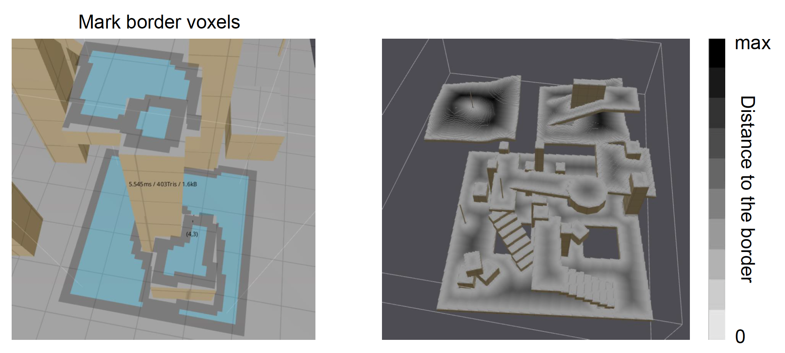
    </div>

    - **流域算法**(watershed algorithm)：类似 [Voronoi 图](11.md#voronoi-diagram)，以局部区域中离边界最远的点为种子向外扩展

        ??? example "例子"

            <div style="text-align: center">
                
            </div>

    - 将邻近体素分割成区域，为之后生成多边形网格打下基础

        <div style="text-align: center">
            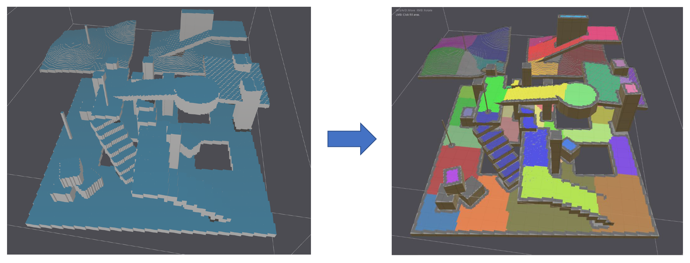
        </div>

    - 区域在二维中没有重叠的体素

        <div style="text-align: center">
            
        </div>

3. **网格生成**：根据分割好的区域生成导航网格

    <div style="text-align: center">
        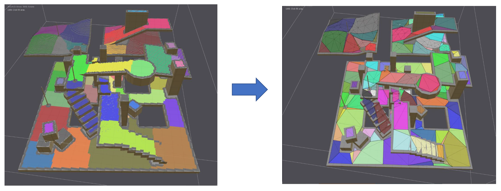
    </div>


### NavMesh Advanced Features

最后介绍有关导航网格的一些高级操作：

- **多边形标志**(polygon flag)
    - 用于标记地形类型：平原、山地、水域等
    - 通过上色来添加用户定义的区域
    - 由用户定义区域生成的多边形具有特殊标志

    <div style="text-align: center">
        
    </div>

- **块**(tile)
    - 将空间划分为块，能快速响应动态对象，并且避免了重建完整的导航网格
    - 通过块大小(TileSize)权衡寻路算法和动态重建算法的性能

    ??? example "例子"

        <div style="text-align: center">
            
        </div>

- **离开网格的链路**(off-mesh link)：手动建立一些连接点和连接线，使得智能体具备跳跃、攀爬、传送等能力

    ??? example "例子"

        <div style="text-align: center">
            
        </div>


## Steering

有了导航系统制定好的路径后，接下来就要让对象沿着路径移动了。但一般而言对象很难精确按照规划的路径行进。以车为例，它的运动受制于其自身的运动能力，包括：

- 线性加速度（油门(throttle)/刹车(brake)）
- 角加速度（转向力(steering force)）

<div style="text-align: center">
    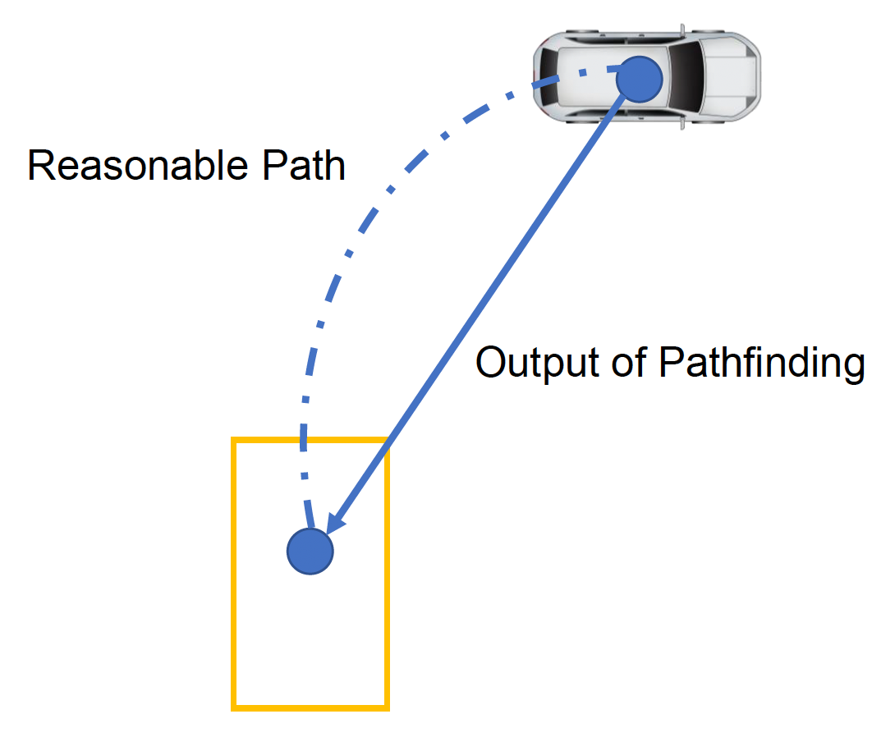
</div>

因此汽车的运动需根据这些限制进行适当调整。下面我们重点关注**转向**(steering)这一动作，它可以被分为以下几大基本行为：

- **追逐**(seek)/**逃避**(flee)：让智能体转向/远离目标
    
    <div style="text-align: center">
        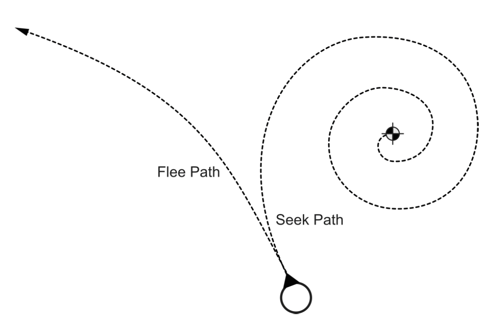
    </div>
    
    - 本质上是位置匹配问题
    - 以最大加速度加速接近/远离目标
    - 可能会在目标附近振荡
    - 输入：自身位置、目标位置
    - 输出：加速度

    ??? example "例子"

        <div style="text-align: center">
            
        </div>

    - 可通过在运行时修改目标来产生新的转向行为，比如追逐、跟随等

    ??? example "例子"

        <div style="text-align: center">
            
        </div>

- **速度匹配**(velocity matching)：和目标速度匹配
    - 根据匹配时间和速度差计算加速度
    - 智能体的加速度受最大加速度限制
    - 输入：目标速度、自身速度、匹配时间
    - 输出：加速度

    ??? example "例子"

        <div style="text-align: center">
            
        </div>

- **对齐**(alignment)：和目标朝向匹配
    
    <div style="text-align: center">
        
    </div>
    
    - 输入：目标朝向、自身朝向
    - 输出：角加速度

    ??? example "例子"

        <div style="text-align: center">
            
        </div>


## Crowd Simulation

在**群体**(crowd)中，一大群人在同一环境中单独或成群分享信息，于是有了以下行为：

- 碰撞避免
- 成群移动
- 编队运动
- ...

<div style="text-align: center">
    
</div>


### Crowd Simulation Models

Reynolds 大佬在「鸟群」(boids)系统中提出了三类群体模拟模型：

- **微观模型**(microscopic models)：
    - 自底向上，聚焦于**个体**(individuals)
    - 动物群体的群聚动态(flock dynamics)作为一种涌现(emergent)行为，通过以下简单的**预定义规则**建模每个个体的运动：
        - **分离**(seperation)：远离所有邻居
        - **凝聚**(cohesion)：驶向「质心」
        - **对齐**(alignment)：与附近的智能体对齐

        <div style="text-align: center">
            
        </div>

    - 易于实现，但不适合模拟复杂的行为规则

    ??? example "例子"

        <div style="text-align: center">
            
        </div>

- **宏观模型**(macroscopic models)：
    - 将群体看成一个统一而连续的整体
    - 通过潜在场或流体动力学控制运动
    - 不考虑个体与环境的个体层面的互动

    ??? example "例子"

        === "例1"

            <div style="text-align: center">
                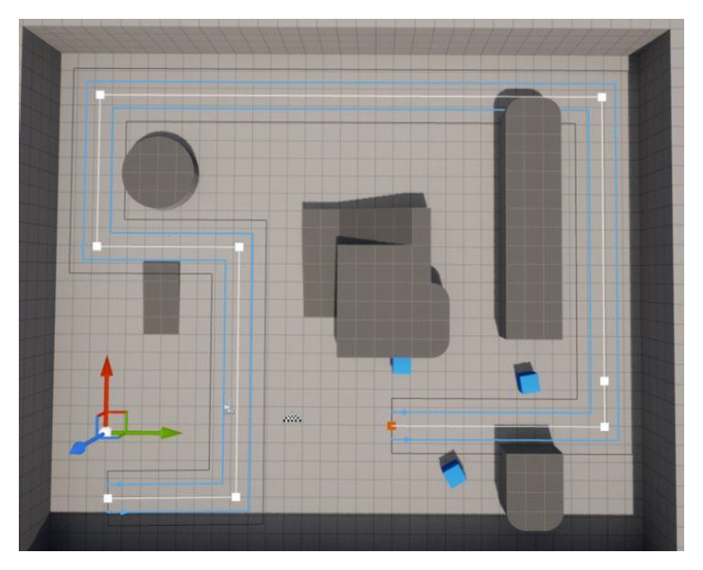
            </div>

        === "例2"

            <div style="text-align: center">
                
            </div>

- **中观模型**(mesoscopic models)：
    - 模拟群体运动时关注整体和个体
    - 将群体划分为组
    - 处理各组之间及组内个体的互动
    - 微观模型与形成规则或心理模型的组合

    ??? example "例子"

        <div style="text-align: center">
            
        </div>


### Collision Avoidance

碰撞避免是群体模拟中需重点关注的行为。下面将介绍一些碰撞避免的常见实现方法。


#### Force-Based Models

第一类方法是采用**基于力的模型**。

- 社会心理和物理力共同影响人群的行为
- 两个对象相距越近，斥力越大；相距越远，引力越大
- 为每个障碍物增加一个距离场，离障碍物越近，距离场的值越小，受到的斥力越大
- 个体的实际移动取决于期望速度及其与环境的互动
- 可用于模拟恐慌的逃生人群的动态特征

??? example "例子"

    === "例1"

        <div style="text-align: center">
            
        </div>

    === "例2"

        <div style="text-align: center">
            
        </div>

!!! recommend "优点：可以对其扩展，以模拟更多的人群涌现行为"

!!! bug "缺点：与物理模拟类似，模拟步长应足够小"


#### Velocity-Based Models

第二类方法是采用**基于速度的模型**，即根据邻居信息确定速度空间。
    
- 能在局部空间模拟
- 适用于碰撞避免

??? example "例子"

    <div style="text-align: center">
        
    </div>

相关算法：

- **速度障碍**(velocity obstacle, **VO**)

    <div style="text-align: center">
        
    </div>

    - 假设其他智能体无响应，计算自身的躲避(dodge)速度
    - 适用于静态和无响应的障碍物
    - 问题：
        - 超调(overshoot)
        - 导致两个试图躲避彼此的智能体之间产生振荡

- **相互速度障碍**(reciprocal velocity obstacle, **RVO**)（当前标准的碰撞避免算法）

    <div style="text-align: center">
        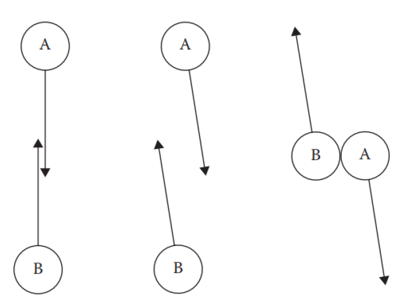
    </div>

    - 假设其他智能体使用相同的决策过程（相互合作）
    - 双方各退让一半以避免碰撞
    - 保证两个智能体无振荡和避免碰撞

- **最优相互碰撞避免**(optimal reciprocal collision avoidance, **ORCA**)

    <div style="text-align: center">
        
    </div>


## Sensing

**感知**(sensing / perception)是 AI 智能体的基础能力，而通过感知得到的信息往往作为智能体做决策的基础。这些信息可分为

- **外部**信息
    - **静态空间信息**(static spatial information)
        - 导航数据
        
            <div style="text-align: center">
                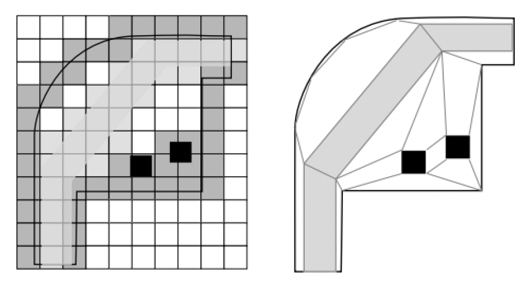
            </div>

        - 战术地图(tactical map)
        
            <div style="text-align: center">
                
            </div>
        
        - 智能对象(smart object)（可交互的东西）
        
            <div style="text-align: center">
                
            </div>

        - 覆盖点(cover point)

            <div style="text-align: center">
                
            </div>

    - **动态空间信息**(dynamic spatial information)
        - **影响力图**(influence map)：比如敌人多的地方危险系数高，智能体就会避开这些地方
        
            <div style="text-align: center">
                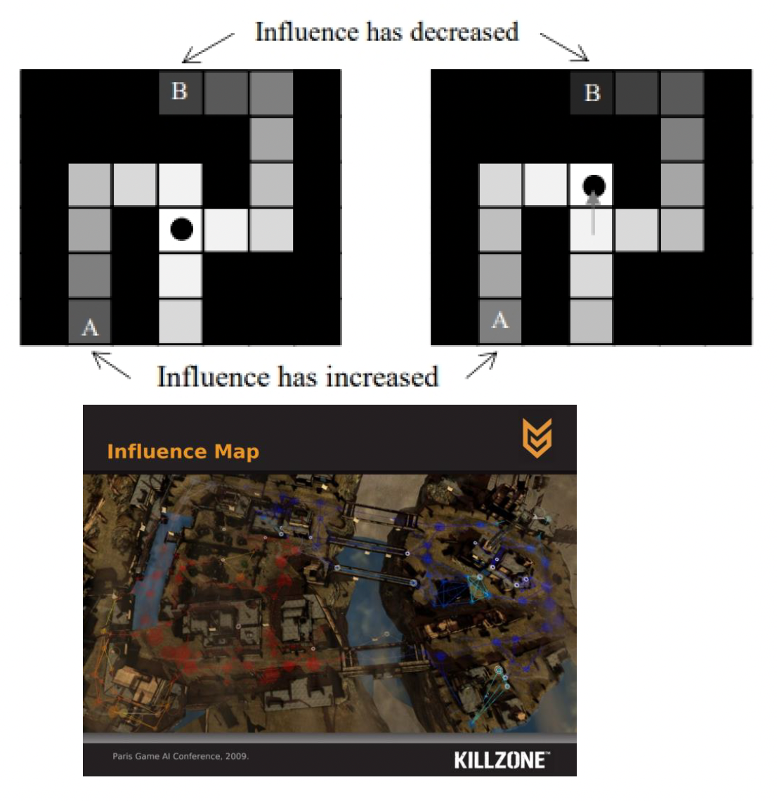
            </div>

            ??? example "例子"

                <div style="text-align: center">
                    
                </div>     
        
        - 游戏对象
            - 从角色感知到的信息
            - 单个角色可以存有多个角色信息，因为它可以被多个智能体感知
            - 通常包含：
                - 游戏对象 ID
                - 可见性
                - 上次感知方法
                - 上次感知位置

    - **角色信息**(character information)

- **内部**信息：智能体自身的信息
    - 包括位置、血量(HP)、护甲(armor)状态、增益(buff)状态等
    - 我们往往可以自由访问这些信息

最后介绍一下感知模拟的特点：

<div style="text-align: center">
    
</div>

- 光照、声音和气味在空间中传播
- 有最大的传播范围
- 感知信息以不同模式随时间和空间变化衰减
- 利用辐射场来模拟感知信号
    - 可简化为影响力图
    - 覆盖场可以感知信息


## Classic Decision Making Algorithms

本节将会介绍一些经典的决策算法：

- **有限状态机**(finite state machine)
- **行为树**(behavior tree)（类似决策树(decision tree)，但不是同一个东西）

现代游戏中还会用到以下算法，但放到[下一讲](17.md)介绍，作为进阶部分：

- **层级任务网络**(hierarchical tasks network)
- **目标导向的行为规划**(goal-oriented action planning)
- **蒙特卡洛树搜索**(Monte Carlo tree search)
- **深度学习**(deep learning)


### Finite State Machine

**有限状态机**(finite state machine, **FSM**)的一大特点是根据某些**条件**(conditions)从一个**状态**(state)转换到另一个状态，这一过程被称为**转移**(transition)。

<div style="text-align: center">
    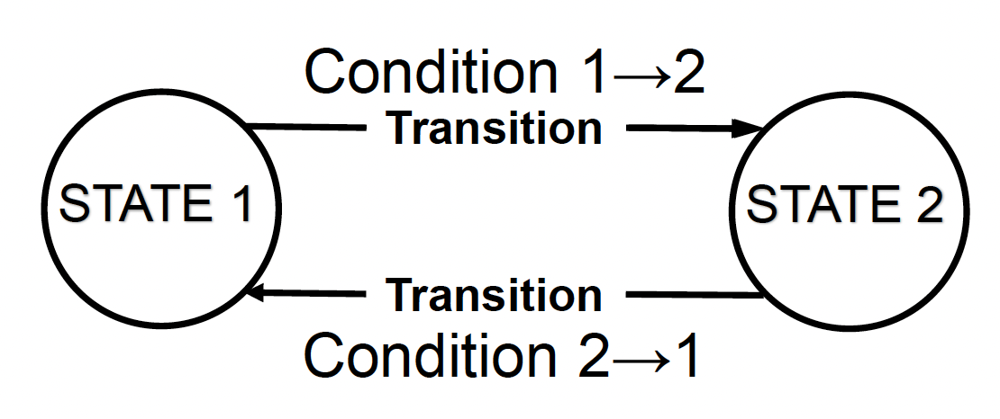
</div>

??? example "例子"

    <div style="text-align: center">
        
    </div>

???+ recommend "优点"

    - 易于实现和理解
    - 处理简单情况非常快

???+ bug "缺点"

    - 可维护性差，尤其是添加和删除状态的时候
    - 可复用性差，无法用于其他项目或角色中
    - 可扩展性差，难以对其修改，用于复杂情况

FSM 的一个变体是**层级有限状态机**(hierarchical finite state machine, **HFSM**)，它是反应性(reactivity)与模块化(modularity)之间权衡的产物。

- **反应性**：快速且高效地对变化做出反应的能力
- **模块化**：系统组件可能被分解成构建块，以及重新组合的程度

<div style="text-align: center">
    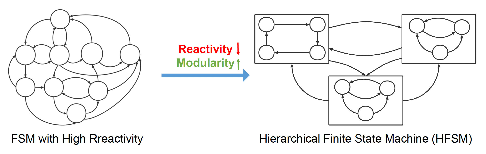
</div>

可以看到，转换为 HFSM 后，得益于模块化程度的增加，状态图的可读性得到提升。但这样做带来的一个问题是子状态机之间可能会添加很多飞线，所以整个运行过程还是比较慢的。


### Behavior Tree

相比于关注状态抽象和转换条件的状态机，**行为树**(behavior tree, BT)更贴合人类的思维方式。

??? example "例子"

    <div style="text-align: center">
        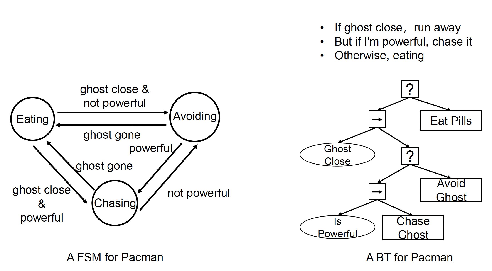
    </div>

BT 的节点分为：

- **执行节点**(execution nodes)（叶节点），可进一步分为：
    - **条件节点**(condition nodes)（黄圈）：反映自身状态或感知，返回 `true` 或 `false`
    - **行动节点**(action nodes)（绿框）返回**成功**(success)/**失败**(failure)/**运行中**(running)

    <div style="text-align: center">
        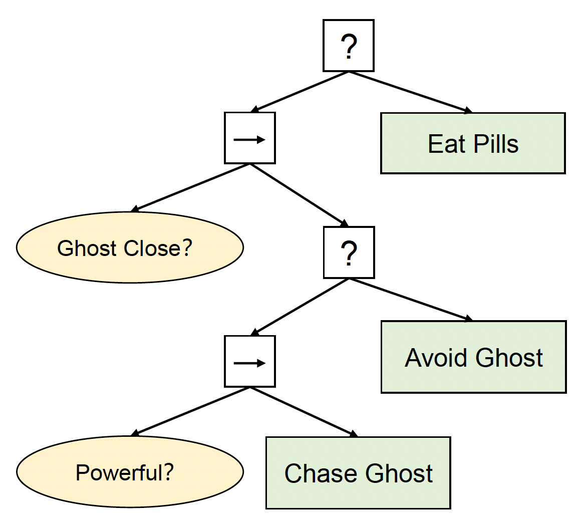
    </div>

- **控制节点**(control nodes)（内部节点）
    - 控制流由子节点返回值决定
    - 每个节点都会返回**成功**(success)/**失败**(failure)/**运行中**(running)
    - 典型的控制流节点包括：
        - **序列**(sequence) $\boxed{\rightarrow}$
            - 顺序：从左到右执行子节点
            - 停止条件和返回值
                - 若其中一个子节点返回失败或运行中，则返回相应值
                - 若所有子节点返回成功，则返回成功
            - 如果停止并返回运行中：下一次执行从运行中的动作开始
            
                <div style="text-align: center">
                    
                </div>
            
            - 用途：允许设计师制定规划
        
            ??? example "例子"

                <div style="text-align: center">
                    
                </div>
        
        - **选择符**(selector) $\boxed{?}$
            - 顺序：从左到右执行子节点
            - 停止条件和返回值
                - 若其中一个子节点返回成功或运行中，则返回相应值
                - 若所有子节点返回失败，则返回失败
            - 如果停止并返回运行中：下一次执行从运行中的动作开始
            
                <div style="text-align: center">
                    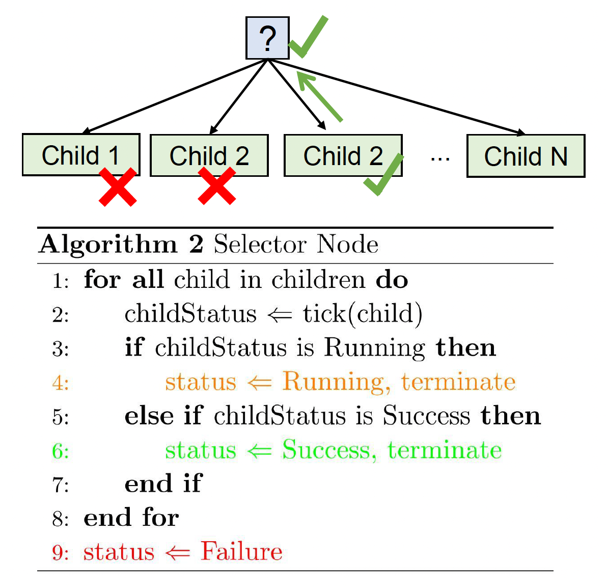
                </div>
            
            - 用途：
                - 可选择一个响应不同环境的行动
                - 可根据**优先级**做正确的事
        
            ??? example "例子"

                <div style="text-align: center">
                    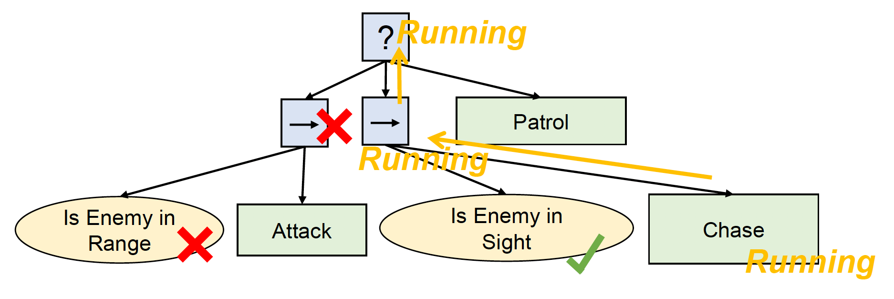
                </div>

                <div style="text-align: center">
                    
                </div>

        - **并行**(parallel) $\boxed{\rightrightarrows}$
            - 顺序：逻辑上并行执行所有子节点
            - 停止条件和返回值
                - 若至少有 M 个子节点（编号从 1 到 N）返回成功，则返回成功
                - 若至少有 N - M + 1 个节点返回失败，则返回失败
                - 否则返回运行中
            - 如果停止并返回运行中：下一次执行从运行中的动作开始
            
                <div style="text-align: center">
                    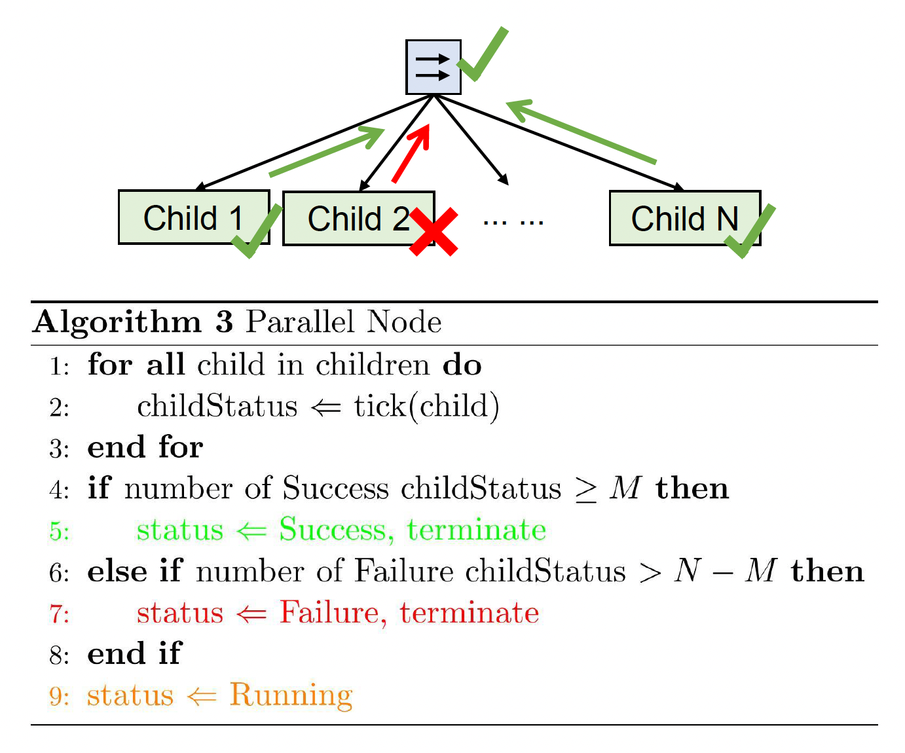
                </div>
            
            - 用途：允许同时做多件事（多线程）

            ??? example "例子"

                <div style="text-align: center">
                    
                </div>
        
        - **装饰器**(decorator) $\boxed{\delta}$（实际是菱形包裹，但是无法利用基础 $\LaTeX$ 打印出来 QAQ）
            - 一类只有单个子节点的特殊控制节点
            - 通常表示一些常用的行为，比如：
                - 循环执行(loop execution)
                - 仅执行一次(execute once)
                - 定时器(timer)
                - 时间限制器(time limiter)
                - 值修改器(value modifier)
                - ...

            <div style="text-align: center">
                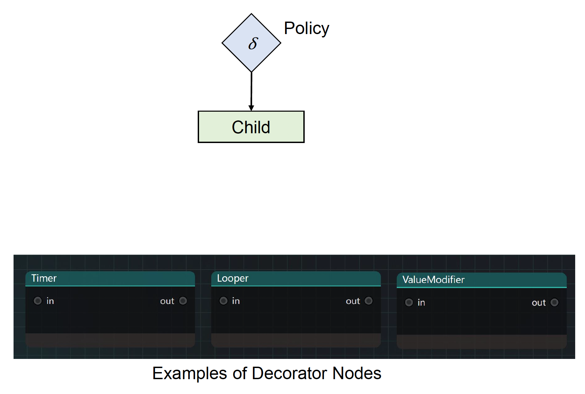
            </div>

            ??? example "例子"

                利用定时器实现「巡逻」(patrol)的行为

                    <div style="text-align: center">
                        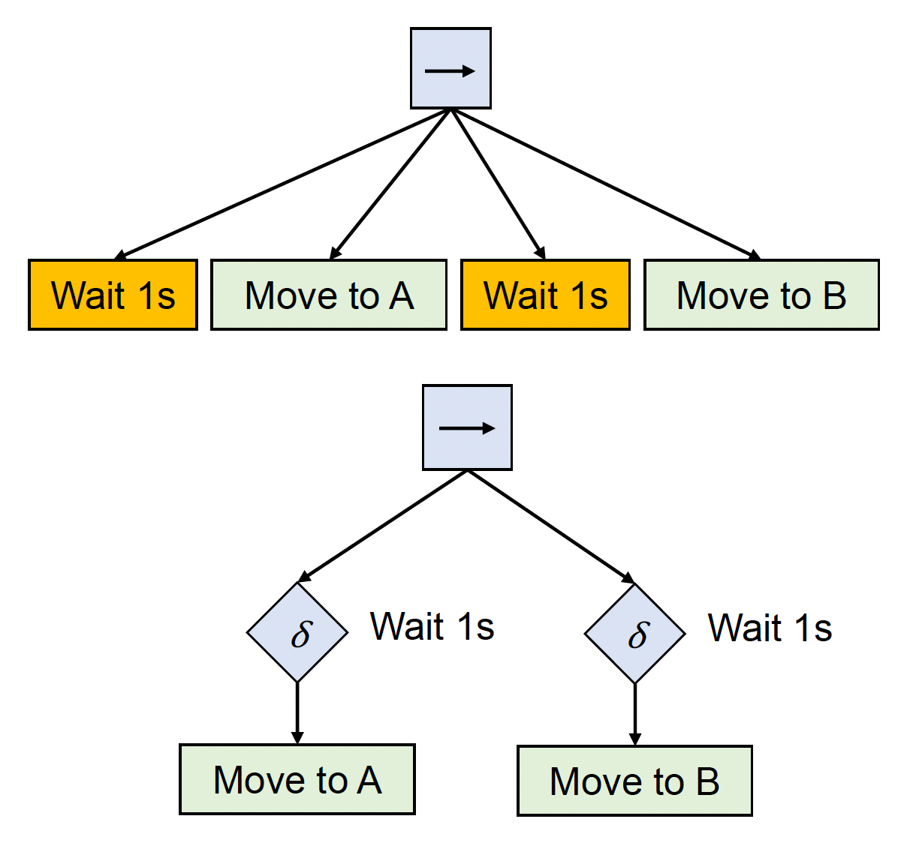
                    </div>

                    <div style="text-align: center">
                        
                    </div>

???+ abstract "总结"

    <div style="text-align: center">
        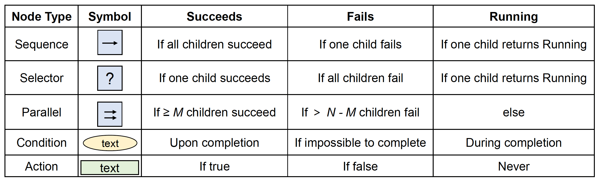
    </div>

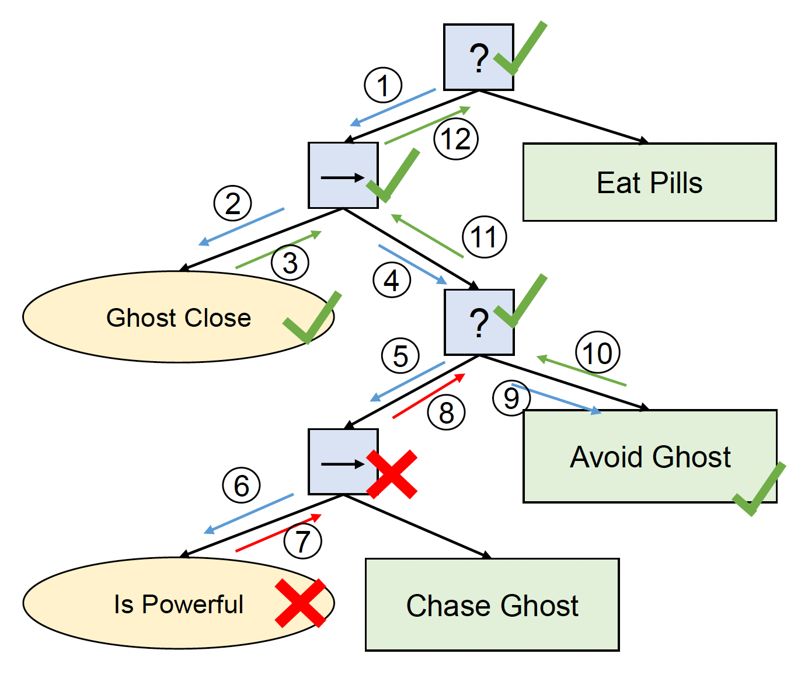{ align=right width=40% }

在 BT 上做决策时，我们往往会在节点上**打勾**(tick)。

- 打勾反映我们的思考过程
- 从根节点开始打勾
- 从上往下、从左往右地经过不同节点
- 每个节点必须返回成功/失败/运行中三种返回值之一

我们还对 BT 做了以下优化，提高其可读性：

- **预条件**(precondition)：可简化 BT 结构

    <div style="text-align: center">
        
    </div>

- **黑板**(blackboard)：作为 BT 的内存
    - 树上的不同分支可通过黑板交换信息

    <div style="text-align: center">
        
    </div>

???+ recommend "优点"

    - 模块化、层级组织：BT 的每棵**子树**可看作一个**模块**，并由**返回状态**提供标准接口
    - 人类可读
    - 易维护：修改仅影响部分树的内容
    - 反应性：每一个 tick 中进行思考，以快速根据环境改变行为
    - 易调试：每个勾表示一个完整的决策过程，所以调试容易

???+ bug "缺点"

    - 由于要从根节点开始打勾，所以成本大
    - 反应性越高，要检查的条件更多，成本就更大

---
为了使 AI 更加深思熟虑(deliberative)，游戏设计师引入了 AI 规划技术，以提高 AI 的规划能力。

- 管理一系列行动
- 规划者根据初始世界状态制定计划

<div style="text-align: center">
    
</div>

更详细的内容请见下一讲，尽请期待！