# Fundamentals of OGA

!!! warning "**多人在线游戏**(multiplayer online gaming)的挑战"

    - **一致性**(consistency)：网络同步
    
        <div style="text-align: center">
            
        </div>
    
    - **可靠性**(realibility)：
        - 网络延迟
        - 断开(drop)和重连
    
        <div style="text-align: center">
            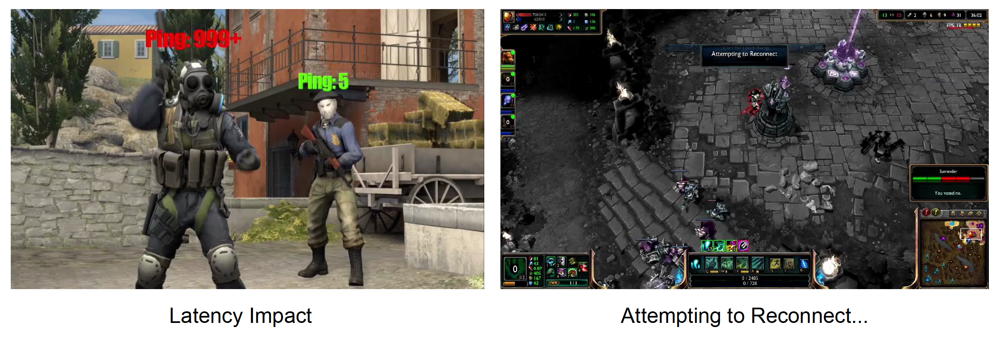
        </div>
    
    - **安全性**(security)
        - 作弊
        - 账号入侵
    
    - **多元性**(diversities)
        - 跨平台
        - 快速迭代
        - 多人游戏系统
    
        <div style="text-align: center">
            
        </div>
    
    - **复杂性**(complexities)
        - 高并发
        - 高可用性
        - 高性能

        <div style="text-align: center">
            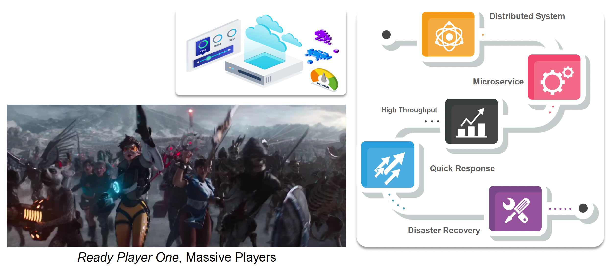
        </div>


## Network Protocols

因特网之父：[Vint Cerf](https://en.wikipedia.org/wiki/Vint_Cerf) 和 [Robert Kahn](https://en.wikipedia.org/wiki/Robert_Kahn_(computer_scientist))，他们设计了 TCP/IP 协议和互联网架构。

两台 PC（记作 A、B）要想相互通信(communicate)，A 和 B必须在多个不同层面上就发送和接收的比特的含义达成一致，包括：

- 用什么电平来表示比特 0 和比特 1？
- 接收者如何知道最后一个比特？
- 一个数字用多长比特表示？

如果直接让机器通过传输介质通信，就会遇到两个问题：

- 为每种新的底层传输介质重新实现应用程序？
- 在底层传输介质发生变化时更改应用程序？

这样做显然不现实。因特网的解决方法是通过引入一个**中间层**(intermediate layer)（一般有多层）来避免上述问题。中间层提供了一组关于应用程序和介质的抽象，这样新的应用程序或介质只需实现中间层接口即可。

一种经典的分层方法是 **OSI 模型**，它将中间层分为 7 层，自顶向下包括：

<div style="text-align: center">
    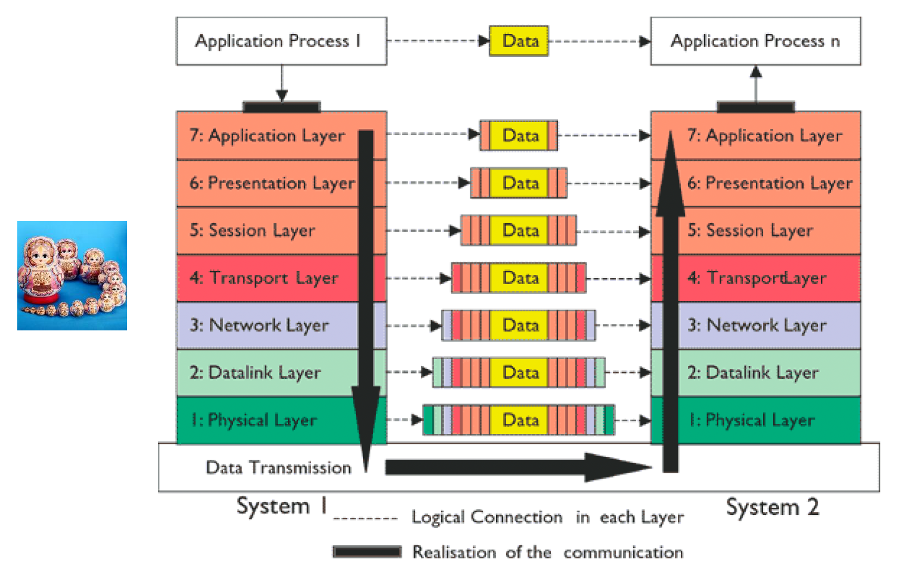
</div>

- 应用层：为用户提供功能
- 表示层：转换不同表示
- 会话层：管理任务对话
- 传输层：提供端到端的传输
- 网络层：通过多个链路发送数据包
- 数据链路层：发送信息帧
- 物理层：将比特作为信号发送


### Socket

但对大多数游戏开发者而言，不需要通过这种复杂的机制实现通信。我们往往用到一种基于网络**套接字**(socket)的方法，它是计算机网络中网络节点内的软件结构，作为网络发送和接收数据的端点。可以把它简单看作 IP 地址 + 端口号的结合。

<div style="text-align: center">
    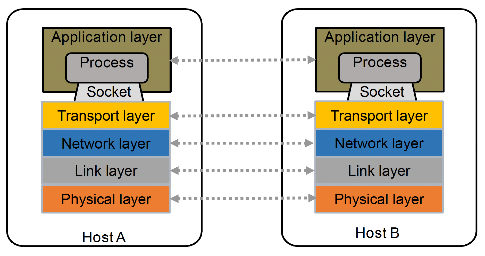
</div>

<div style="text-align: center">
    
</div>

客户端和服务端都需要设置套接字。函数签名如下：

```cpp
int socket(int domain, int type, int protocol)
```

取值分别为：

- `domain`：`AF_INET`（IPv4）或 `AF_INET6`（IPv6）
- `type`：`SOCK_STREAM`（TCP）或 `SOCK_DGRAM`（UDP）
- `protocol`：默认置 0

>例子：`#!cpp int sockfd = socket(AF_INET, SOCK_STREAM, 0)`

其中值得一提的是两个著名网络协议：TCP 和 UDP

- **TCP**（传输控制协议(transmission control protocol)）
    - 特点：
        - 面向连接的
        - 可靠且有序
        - 流量控制
        - 拥塞控制

    - TCP 段头：

        <div style="text-align: center">
            
        </div>

    - **重传机制**：重复 ACKs（确认）
        - 发送者发送数据包和序列号，比如 1, 2, 3, 4, 5, 6, 7, 8
        - 假设第 5 个数据包丢失，那么 ACK 流为 1, 2, 3, 4, 4, 4, 4, 4

        <div style="text-align: center">
            
        </div>

    - **拥塞控制**(congestion control)：
        - TCP 的拥塞窗口（**CWND**）从一个小值开始增长
        - 当发生拥塞、数据包丢失或超时时，将根据某种算法减少 CWND 值
        - 这会导致高延迟并造成延迟抖动
        - 拥塞控制是必要的，否则会导致拥塞崩溃；TCP 拥塞控制是互联网主要的拥塞控制措施，也是 TCP 性能问题的主要原因

        <div style="text-align: center">
            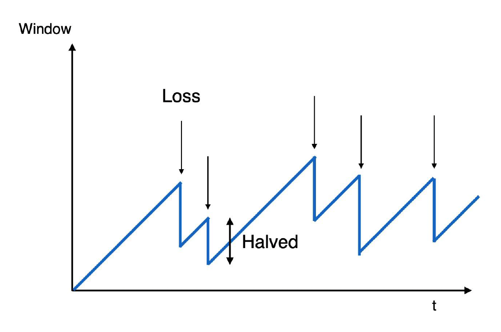
        </div>

- **UDP**（用户数据报协议(user datagram protocol)）
    - 特点：
        - 无连接
        - 不可靠且无序
        - 无流量控制
        - 无拥塞控制

    - UDP 数据包头部：

        <div style="text-align: center">
            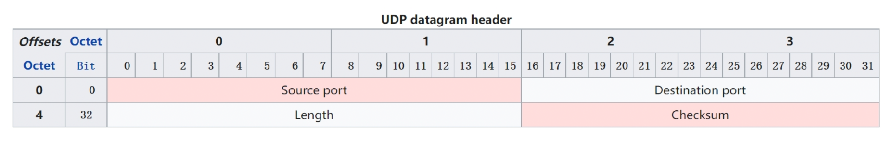
        </div>

网络协议在游戏中的使用情况：

- TCP：《炉石传说》(HearthStone)...
- UDP：《守望先锋》(Overwatch)《CSGO》...

但实际上对于一款大型 MMO 游戏，可能会用到多种协议的组合。

!!! bug "TCP 和 UDP 的问题"

    - TCP 不注重时间
        - 它是一个复杂且重量级的协议，虽然提供可靠的传输和高级功能，但开销更大
        - 它还是一个公平的、面向流量的协议，旨在提高带宽利用率，但并不是为速度而设计的
    - UDP 虽然快，但不可靠，丢包和乱序问题经常发生


### Reliable UDP

甚至在现代游戏中，我们会对已有的协议进行改造。之所以要改造，是因为：

- 游戏服务器
    - 保持活跃连接（TCP）
    - 需要保持“顺序”中的逻辑一致性（TCP）
    - 高响应和低延迟（UDP）
    - 经常用到广播(broadcast)（UDP）
- 网络服务器
    - 处理 HTTP 协议
    - 提供静态网页内容，比如 HTML 页面、文件、图像、视频等

可以看到，我们想要一种同时结合 TCP 和 UDP 优点的协议。为了能够实现这样的协议，先来认识两种网络技术—— ARQ 和 FEC。


#### Automatic Repeat Request

!!! info "确认(acknowledgement, ACK)与序列号"

    - **正 ACK**：在通信进程、计算机或设备之间传递的信号，用以表示确认或收到消息
    - **负 ACK**（NACK）：发送用于拒绝之前接收到的消息或指示某种错误的信号
    - **序列号**（SEQ）：用于跟踪主机发送字节的计数器
    - **超时**(timeouts)：在接收确认之前允许等待的指定时间段

**自动重传请求**(automatic repeat request, **ARQ**)是一种用于数据传输的错误控制方法，利用 ACK 和超时，在不可靠的通信通道上实现可靠的数据传输。如果发送者在超时前没有收到 ACK，它会重新发送数据包，直到收到确认或超过预定义的重传次数。

ARQ 有多种实现算法，它们大多属于**滑动窗口协议**(sliding window protocol)，具有以下特点：

- 一次发送多个帧，帧数取决于窗口大小
- 每个帧用序列号编号
- 当窗口前方的帧被接收时，窗口向前滑动

???+ example "例子"

    === "发送帧 0, 1, 2, 3"

        <div style="text-align: center">
            
        </div>

    === "帧 0, 1, 2 已接收，发送帧 3, 4, 5, 6"

        <div style="text-align: center">
            
        </div>

下面详细介绍其中几种常见的算法。利用这些算法中的任意一种，我们便能搭建一个可靠的 UDP。

- **停止-等待**(stop-and-wait) ARQ
    - 窗口大小 = 1
    - 发送一个帧后，发送方在传输下一个帧之前等待 ACK
    - 如果在一定时间后没有收到 ACK，发送方超时并重新发送原始帧
    - 问题：带宽利用率低，性能差

    <div style="text-align: center">
        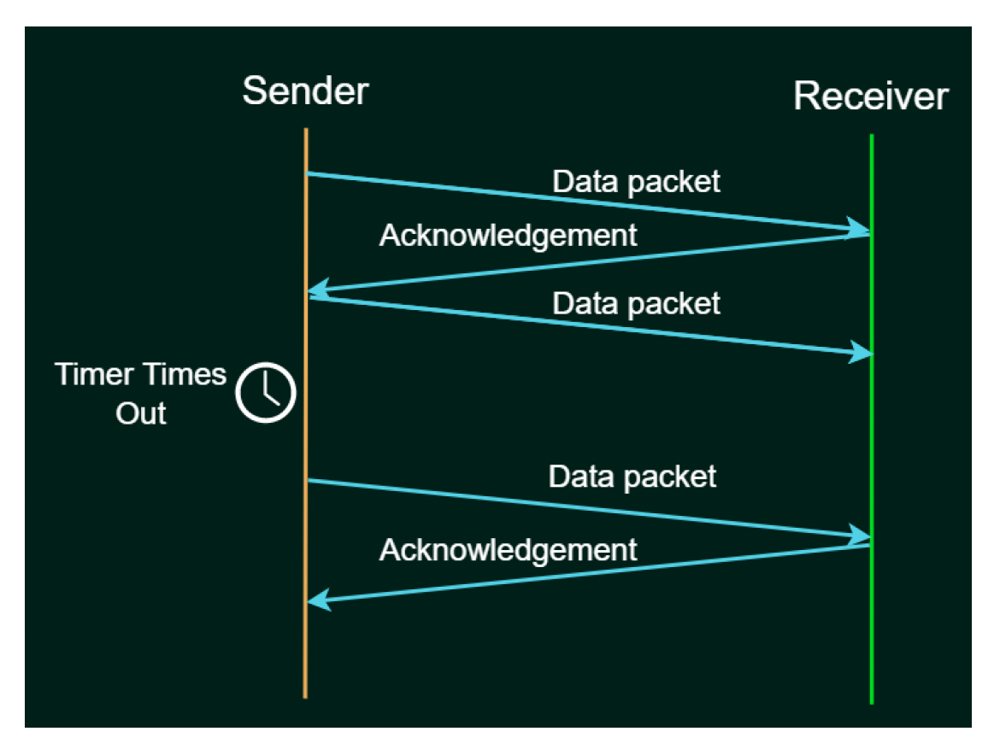
    </div>

- **回退 N 帧**(go-back-N) ARQ
    - 发送窗口大小 = N
    - 接收者仅发送累积(cumulative) ACKs
    - 如果在约定时间内未收到 ACK，当前窗口中的所有帧将被传输

    <div style="text-align: center">
        
    </div>

- **选择重传**(selective repeat) ARQ
    - 只有损坏或丢失的帧会被重传
    - 接收方发送每个帧的确认，发送方维护每个帧的超时时间
    - 当接收方收到损坏的包时，它会发送一个 NACK，发送方将发送/重传收到 NACK 的帧

    <div style="text-align: center">
        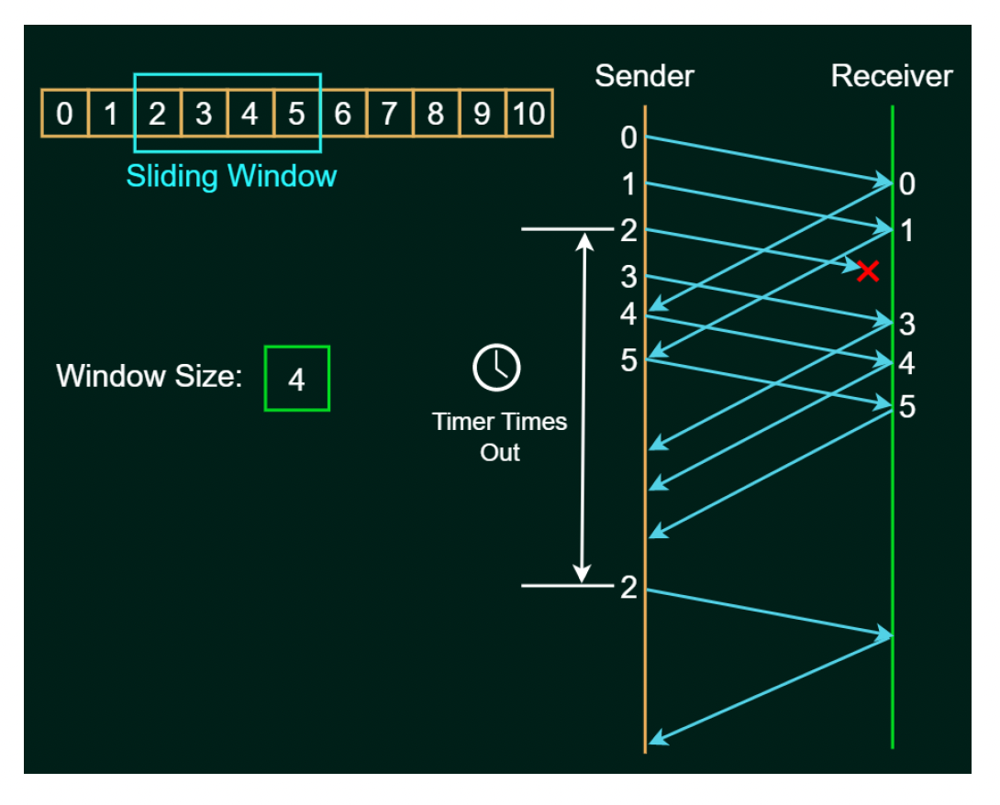
    </div>


#### Forward Error Correction

随着丢包率和延迟的增加，即便是可靠 UDP 也逐渐无法满足传输要求，比如当丢包率增加到 20% 时，使用可靠 UDP 仍然会有较高的延迟。这时我们引入第二种技术：**前向纠错**(forward error correction, **FEC**)。它通过传输足够的额外冗余信息与主数据流，在一定程度上重建丢失的 IP 数据包。

<div style="text-align: center">
    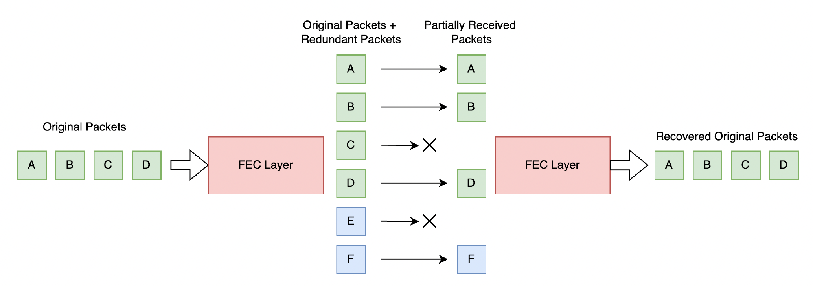
</div>

FEC 算法以额外带宽为代价降低了丢包率，并且数据包丢失率越高，数据包丢失补偿的效果更为明显。下面介绍其中两种实现。

- **XOR FEC**

    ??? info "XOR 运算"

        <div style="text-align: center">
            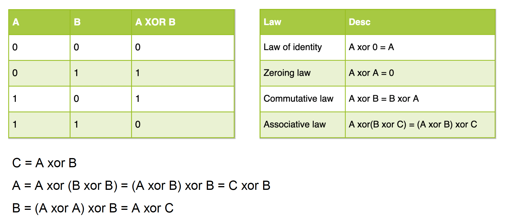
        </div>

    <div style="text-align: center">
        
    </div>

    - 假如有 4 个数据包 A, B, C, D，令：
        - E = XOR(A, B, C, D)
        - A = XOR(B, C, D, E)
        - B = XOR(A, C, D, E)
        - C = XOR(A, B, D, E)
        - D = XOR(A, B, C, E)
    - 若任意一个包丢失，都可通过其余四个包恢复
    - 若丢失多个包，该算法无能为力
    - 该算法和某个等级的 RAID 很像

- **Reed-Solomon 编码**
    - 假如有 N 份有效数据，期望产生 M 份 FEC 数据
        
        <div style="text-align: center">
            
        </div>
        
        - 将 N 份有效数据形成一个单位向量 D
        - 生成一个变换矩阵(transformation matrix) B：它由一个 N 阶单位矩阵和一个 N * M 的 Vandemode 矩阵（由矩阵 B 的任意 n 行组成的矩阵是可逆的）组成
        - 通过将矩阵 B 和向量 D 相乘得到的矩阵 G 包含 M 个冗余的 FEC 数据

    - 假设 D1, D4, C2 丢失
        - 矩阵 B 也需要删除相应的 M 行以获得变形矩阵(deformation matrix) B'
        
            <div style="text-align: center">
                
            </div>
        
        - 得到 B' 的逆矩阵 B'^-1^
        - 两边同乘以 B'^-1^ 以恢复数据

            <div style="text-align: center">
                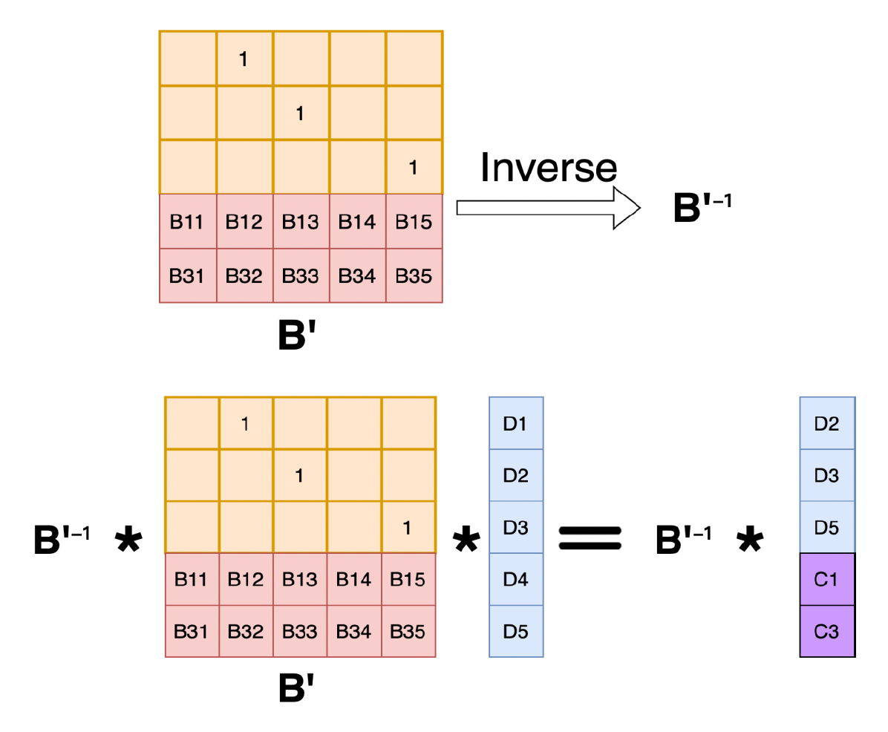
            </div>

---
现在我们用前面介绍的技术来定制自己的 UDP 协议：

- 可靠性：采用选择重传 ARQ
- 混合 ARQ 和 FEC：在采用 ARQ 前，先用 FEC 纠错
- 实时：
    - 更小的 RTO 增长
    - 无拥塞控制
    - 快速重传机制
    - 无延迟 ACK
- 灵活性：
    - 设计高速协议
    - 同时支持可靠和不可靠的传输


## Clock Synchronization

**时钟同步**(clock synchronization)是设计网络游戏时必须考虑的一件事，即确保同一场景、同一时间中的多名玩家感知到的事件是相同的。

这里涉及到一个叫做 **RTT**（往返时间(round-trip time)）的概念，它反映了：

- 发送/接收延迟
- 传播延迟
- 源服务器的响应时间

???+ note "RTT 和其他技术/概念的关系"
    
    - **PING**：通常在采用 ICMP 数据包的传输协议中进行 PING 测试，RTT 在应用层中被测量
    - **时延**(latency)：数据包从发送端点到接收端点所需的时间（1/2 * RTT）

    <div style="text-align: center">
        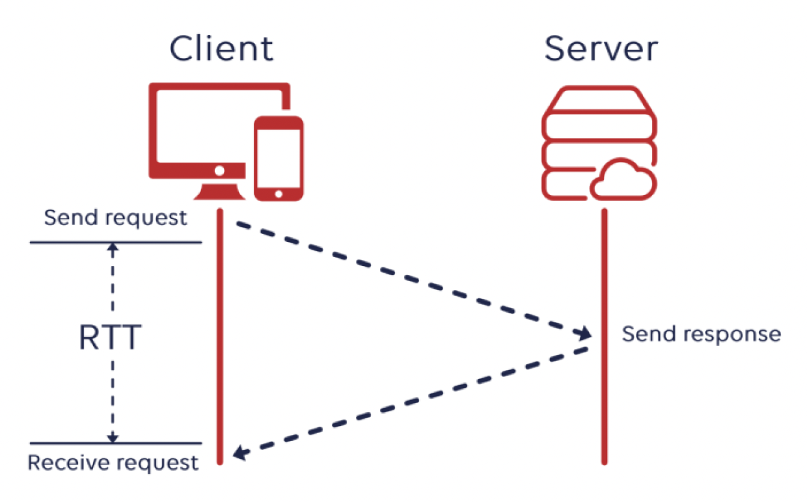
    </div>


### Network Time Protocol

实现时间同步的一个最经典的方法是**网络时间协议**(network time protocol, **NTP**)。它是一种用于与网络中计算机时钟时间源同步的互联网协议。

- **参考时钟**(reference clock)：GPS 时钟、无线电发射站或诸如原子钟等极其精确的计时设备
    - 无需连接到互联网
    - 通过无线电或光纤发送时间
- **时间服务器层**(time server stratums)：
    
    <div style="text-align: center">
        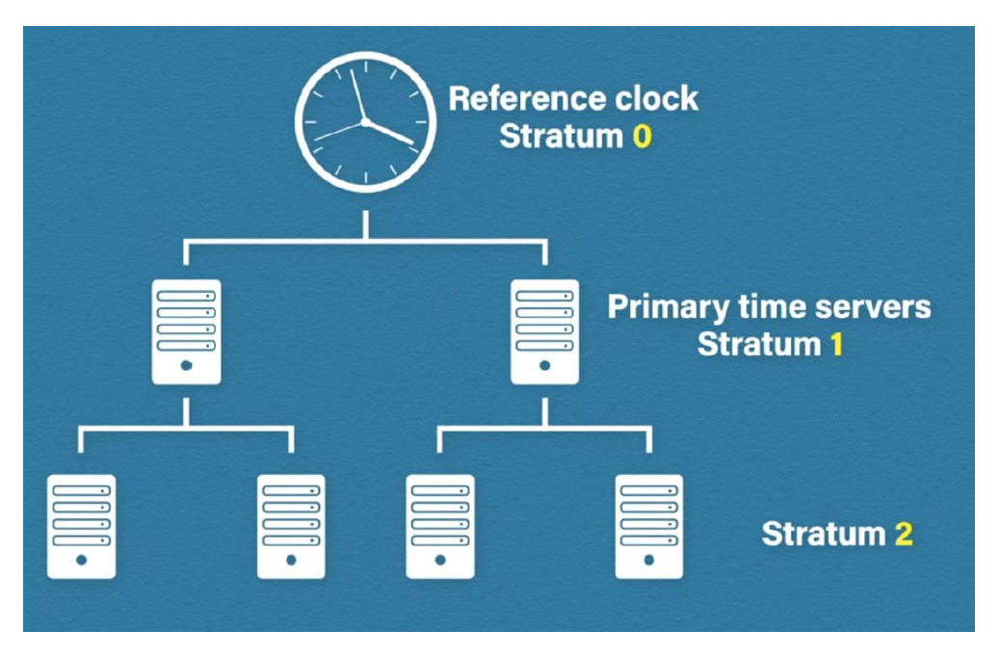
    </div>
    
    - 计算与参考时钟的分离度
    - 参考时钟的等级值(stratum value)为 0
    - 等级值为 1 的服务器称为主时间服务器(primary time server)
    - 如果一个设备的等级值超过 15，其时间不可信
    - 设备在修正时间时会自动选择等级值较低的服务器

NTP 算法的实现如下：

- 使用 NTP 很简单，只需
    - 客户端向服务器请求时间
    - 服务器接收请求并回复
    - 客户端接收回复
    - 但得考虑**延迟**问题

    <div style="text-align: center">
        
    </div>

- 记录 4 个时间戳 $t_0^c, t_1^s, t_2^s, t_3^c$，分别对应发送请求、接收请求、发送回复和接收回复的时间
    - 往返延迟 = $(t_3^c - t_0^c) - (t_2^s - t_1^s)$
    - 偏移量 = $\dfrac{t_1^s - t_0^c + t_2^s - t_3^c}{2}$
    - 隐含的假设是单向延迟是往返延迟的一半
    - 本地时钟校正是通过偏移数据计算得出的，即 $t_3^c$ + 偏移量
    - 获得的延迟和时钟偏移样本可以使用最大似然技术进行过滤

    <div style="text-align: center">
        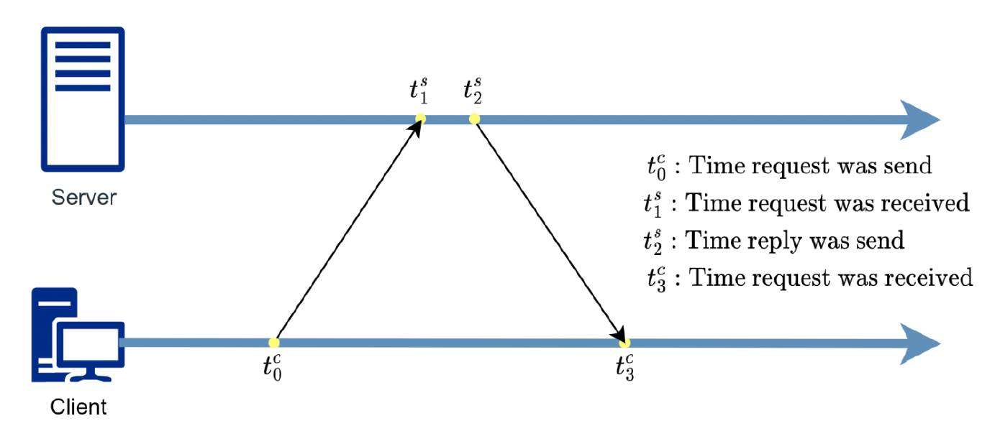
    </div>

    ??? example "例子"

        <div style="text-align: center">
            
        </div>


### Stream-Based Time Synchronization with Elimination of Higher Order Modes

一种更精密的时钟同步做法是**基于流的时间同步与高阶模式的消除**：

1. 客户端在「时间请求」包上记录当前本地时间，并发送给服务器
2. 服务器收到后，记录服务器时间并返回
3. 客户端收到后，通过 delta = (当前时间 - 发送时间) / 2 计算时间差

>到目前为止和 NTP 算法很像。

4. 第一个结果应立即用于时钟更新
5. 客户端重复步骤 1-3 五次或更多
6. 累积并按延迟**升序**排序数据包接收的结果
7. 丢弃所有超过中位数 1.5 倍的数据样本，剩余样本使用算术平均数进行平均

<div style="text-align: center">
    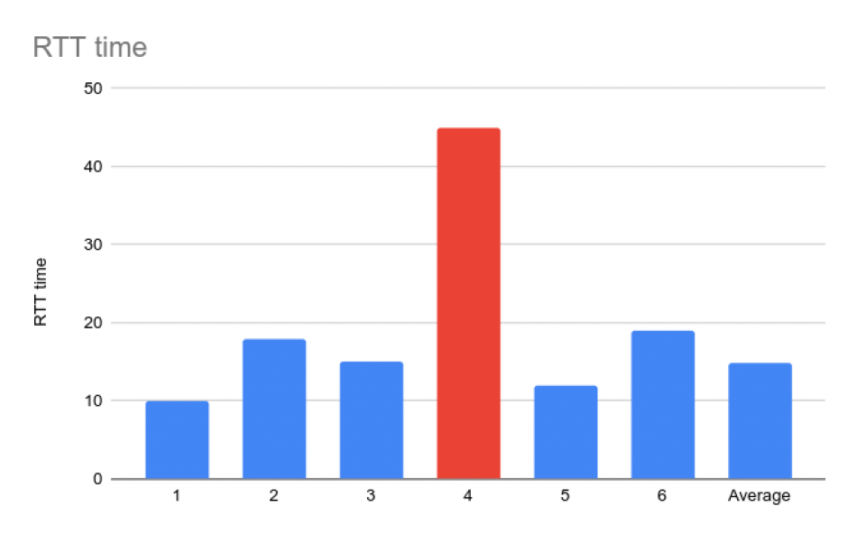
</div>


## Remote Procedure Call (RPC)

即便[套接字](#socket)编程简化了计算机间的通信处理，但在游戏开发中还是不太好用，我们还需要考虑很多东西：

- 如何在同一连接上区分不同的请求？
- 如何将字节写入网络/从网络读取字节？
- 如果主机 A 的进程是用 Go 编写的，而主机 B 的进程是用 C++ 编写的怎么办？
- 那些字节该如何处理？

另外，我们还要用套接字定义多种**消息**(message)，这是客户端和服务器常用的通信方式。

<div style="text-align: center">
    
</div>

起初，程序员通过**硬编码**的方式定义用于发送请求和响应的消息。这样的消息被看作是一个字节流，包含了操作码和操作数信息。

??? example "例子"

    ```cpp
    struct foomsg {
        uint32_t len;
    };

    void send_foo(char *contents) {
        int msglen = sizeof(struct foomsg) + strlen(contents);
        char buf = malloc(msglen);
        struct foomsg *fm = (struct foomsg *)buf;
        fm->len = htonl(strlen(contents));
        memcpy(buf + sizeof(struct foomsg),
            contents,
            strlen(contents));
        write(outsock, buf, msglen);
    }
    ```

!!! bug "问题"

    - 需要关心消息格式
    - 必须对消息中的数据进行打包和解包
    - 服务器必须解码消息并将它们分派给处理函数
    - 消息通常是异步的
    - 发送一个消息后，直到收到响应前要做什么
    - 消息不是一个自然的编程模型

!!! warning "关于逻辑通信的更多挑战"

    远程过程调用中，远程机器可能：

    - 运行用**不同语言**编写的进程
    - 使用**不同大小**的数据类型表示
    - 使用**不同的字节序**（大小端(endianess)）
    - 以**不同**的方式表示浮点数
    - 有**不同的数据对齐**要求（例如，4 字节类型仅从 4 字节内存边界开始）

**远程过程调用**(remote procedure call, **RPC**)是一种请求-响应协议。RPC 由客户端发起，客户端向已知的远程服务器发送请求消息并提供参数，以执行指定的过程。其目标是：

- 让编程更简单
- 隐藏复杂性
- 建立对程序员来说更熟悉的模型（只需调用函数）

<div style="text-align: center">
    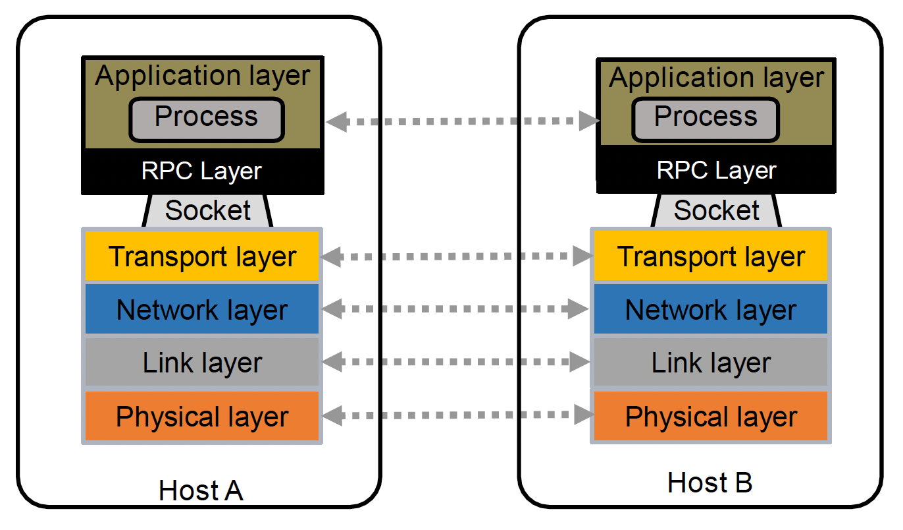
</div>

??? example "例子（Go 语言）"

    注意两段程序高亮的两行之间的关系。

    === "客户端"

        ```go title="Client" hl_lines="15 19" linenums="1"
        package main

        import (
            "fmt"
            "log"
            "net/rpc"
        )

        func main() {
            client, err := rpc.Dial("tcp", "127.0.0.1:8000")
            if err != nil {
                log.Fatal("dial", err)
            }
            var response string
            err = client.Call("HelloWorldService.SayHello", "World", &response)
            if err != nil {
                log.Fatal("caller", err)
            }
            fmt.Println(response)
        }
        ```

    === "服务端"

        ```go title="Server" hl_lines="11-12" linenums="1"
        package main

        import (
            "net"
            "net/rpc"
        )

        type HelloWorldService struct {
        }

        func (s *HelloWorldService) SayHello(request string, response *string) error {
            *response = "Hello " + request
            return nil
        }

        func main() {
            _ = rpc.RegisterName("HelloWorldService", &HelloWorldService{})
            listener, err := net.Listen("tcp", ":8000")
            if err != nil {
                panic("Monitor port failed!")
            }
            conn, err := listener.Accept()
            if err != nil {
                panic("Establish a connection failure!")
            }
            rpc.ServeConn(conn)
        }
        ```

    输出：`Hello World`

???+ question "为什么用 RPC？"

    目标：实现易于编程的网络通信，使客户端和服务器之间的通信透明。

    - 保留编写集中式(centralized)代码的「感觉」
        - 程序员无需考虑网络
        - 使通信看起来像本地的过程调用

    - 无需担心网络序列化/反序列化的问题
    - 也无需担心网络的复杂性

这里涉及到一个叫做**接口定义语言**(interface definition language, **IDL**)的概念。它指定了所有客户端可调用的服务器过程的名称、参数和类型。服务器便用它来定义服务接口。

???+ example "例子"

    - OSI 参考模型的 ASN.1
    - Google Protobuf：Google 的数据交换格式（介绍工具链的[模式](13.md#schemas)(schema)时提到过）

        ```proto title="polyline.proto"
        syntax = "proto2";

        message Point {
            required int32 x = 1;
            required int32 y = 2;
            optional string label = 3;
        }

        message Line {
            required Point start = 1;
            required Point end = 2;
            optional string label = 3;
        }

            message Polyline {
            repeated Point point = 1;
            optional string label = 2;
        }
        ```

客户端与服务器之间的通信还有一种叫做 **RPC 存根**(stubs)的中间层。

<div style="text-align: center">
    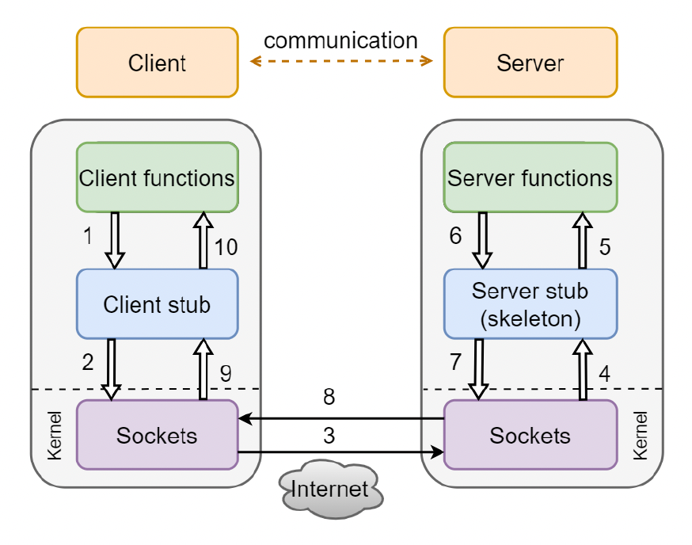
</div>

- **客户端存根**是一个看起来像可调用服务器过程的程序
    - 客户端程序认为它在调用服务器，但实际上它在调用客户端存根

- **服务器端存根**看起来像是对服务器进行调用的调用者
    - 服务器程序认为它被客户端调用，但实际上它是由服务器端存根调用的

- 存根之间通过发送消息使 RPC 透明发生

另外还会用一个「**存根编译器**」(stub compiler)读取 IDL 声明，并为每个服务器过程生成两个存根程序

- 服务器程序员实现服务的过程，并将其与**服务器端存根**链接
- 客户端程序员实现客户端程序，并将其与**客户端存根**链接
- 由存根管理客户端和服务器之间远程通信的所有细节

???+ abstract "一段真实的 RPC 包传输过程"

    <div style="text-align: center">
        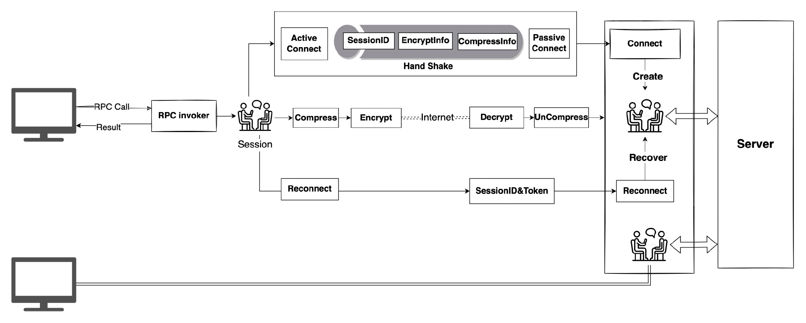
    </div>


## Network Topology

## Game Synchronization