# Layered Architecture of Game Engine

本节将介绍游戏引擎的**分层结构**(layerd architecture)，从而对游戏引擎有一个整体的认识和理解。自顶向下来看，游戏引擎可分为以下五个层级：

- **工具层**(tool layer)：各种各样的编辑器（这也是我们入门游戏引擎的第一印象）

    

        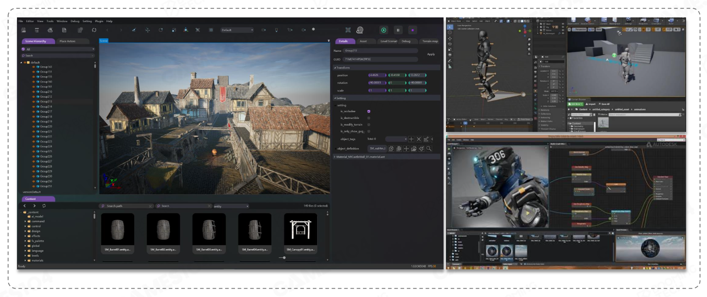
    

- **功能层**(function layer)：目标是要让游戏能看(visible)、能动(movable)、能玩(playable)，包括以下部分：
    - 物理(physics)：物体碰撞等
    - 动画(animation)
    - 渲染(rendering)：把一个虚拟的三维世界一帧一帧地绘制在二维图像上
    - 相机、HUD（抬头显示器(head-up display)，即在屏幕顶层、向玩家实时显示状态和信息的图形界面元素）和输入
    - 脚本、FSM（有限状态机）和 AI

    

        
    

- **资源层**(resource layer)：加载和管理各类数据和文件
    - 包括 photoshop 的图片、三维建模、声音等资源
    - 成千上万

    

        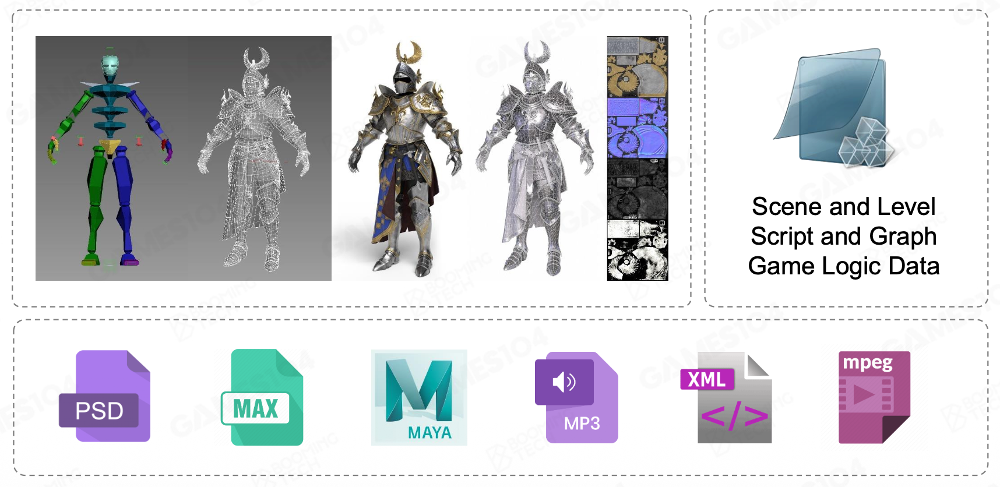
    

- **核心层**(core layer)：游戏引擎的“瑞士军刀”
    - 引擎上的动画系统、物理系统等会调用这里的底层代码
    - 包括容器创建、内存分配、线程管理、数学运算等

    

        
    

- **平台层**(platform layer)：游戏会在不同平台上启动
    - 平台的划分包括操作系统、输入设备、发布平台等

    

        
    

- **中间件和第三方库**也是很重要的存在
    - 有些以 SDK 形式集成到游戏引擎中（编译的时候就会被包含进去）
    - 有些是作为独立的工具，和游戏引擎通过文件格式交换数据

    

        
    

>注：层级的划分并没有一个统一的标准，这里采取的是一种比较简单的易于理解的划分。

???+ question "思考"

    众所周知，实践是最好的学习方式。大致了解了游戏引擎的整体架构后，也许你会想制作一个简单的动画角色，要实现的目标是：

    

        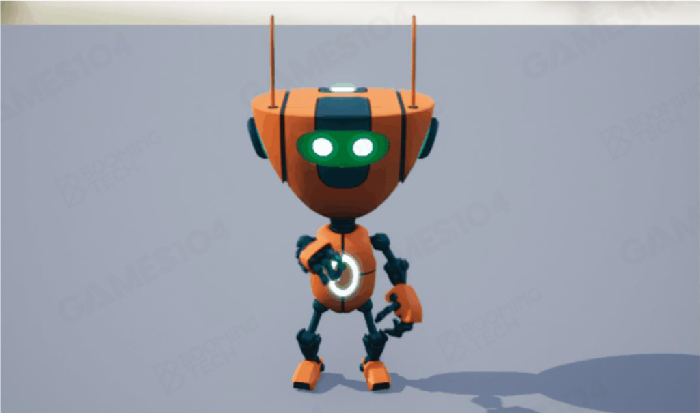
    

    - 创建、渲染角色，并让它动起来
    - 能在多个硬件平台上游玩

    这些目标看似容易，细细想来却发现实现起来并不是这么简单——我们需要对游戏引擎的各个层级有着更深入的理解！下面逐一讲解完成这一任务会面临的挑战。

## Resource Layer

- 离线资源导入(offline resource importing)（资源(resource) -> **资产**(asset)）
    - 通过定义一个**元资产文件格式**(meta asset file format)来统一文件访问（比如 .ast 文件）
        - 把复杂的数据格式转化为对游戏引擎而言更高效的数据

        

            
        

    - 通过导入预处理(importing preprocess)，可以加速对资产的访问
    - 构建一个**复合资产文件**(composite asset file)来指引用(reference)（或者说关联）所有的资源

        

            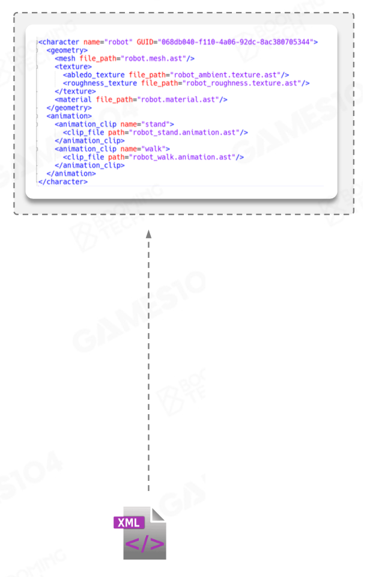
        

    - **GUID**（全局唯一标识符(global unique identifier)）是对引用的额外保护
        - 每个资产都会被设置一个 GUID

        

            
        

- **实时资源管理**(runtime resource management)
    - 通过路径引用加载或卸载资产的一个虚拟文件系统
    - 通过**句柄系统**(handle system)管理资产的生命周期和引用

    

        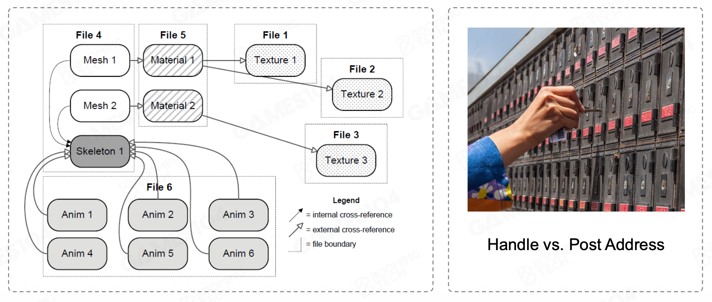
    

- 资源的内存管理：**生命周期**(life cycle)
    - 比如关卡/场景的切换就涉及到大量资源的卸载和加载
    - 不同资源有不同的生命周期
    - 由于内存空间有限，所以当有可能的时候，应当释放被加载的资源
    - 关键功能：**垃圾回收**(garbage collection, GC)和**延迟加载**(deferred loading)
        - 如果 GC 没做好，整个系统的效率就会非常低，比如说关卡的切换就变得很慢
        - 延迟加载的一个例子是离角色较远的物体贴图会很糊，越接近该物体越清晰（UE）

    

        
    

## Function Layer

- **tick**
    - 游戏世界中的 tick 类比我们现实世界中的[普朗克时间](https://en.wikipedia.org/wiki/Planck_units#Planck_time)
    - 一个 tick 后，系统就会把该做的所有事给做完——每隔 1/30 秒把整个世界的逻辑和绘制全部跑了一遍

        

            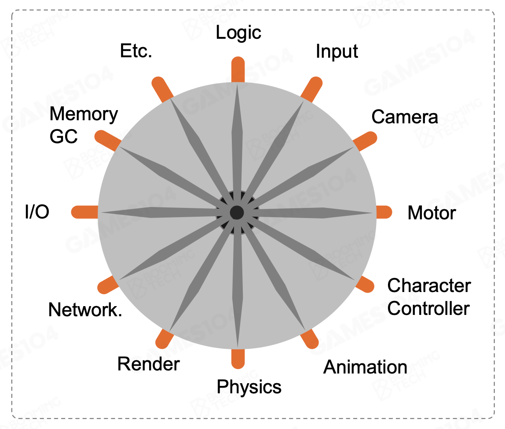
        

    - 阅读游戏引擎源码时，非常推荐先看 tick 函数（也许不是这么叫的）
    - tick 的两大组成部分：
        - **tick logic**
        - **tick render**

        

            
        

        - 一般而言先做完逻辑再做渲染
        - 逻辑和渲染一定要严格区分，不要把两者的代码混在一起

    - 对动画和渲染器而言，每一次 tick 后会完成以下任务（非常简化的版本）：
        - 获取角色的动画帧
        - 驱动角色的骨骼和皮肤
        - 渲染器在每帧的渲染周期中处理所有渲染任务

        

            
        

    - 功能层为游戏引擎提供主要的功能模块
    - 游戏循环会周期性地更新系统
    - 有时引擎和游戏的边界会比较模糊
        - 比如相机、角色和行为属于引擎的功能，还是游戏的功能
        - 为程序员设计可扩展的引擎 API

- **多线程**(multi-threading)

    

        
    

    - 近年来，**多核处理器**逐渐成为主流
    - 很多游戏引擎系统以**并行**(parallelism)方式构建
        - 把容易并行化计算的任务 fork 出来，分散到不同线程中
    - 需要考虑依赖关系(dependency)

## Core Layer

- 数学库
    - 除去复杂的物理系统外，我们只需掌握线性代数知识即可，包括：
        - 线性变换：旋转、平移、缩放
        - 矩阵样条，四元数
        - ...

        

            
        

    - 数学效率
        - 一些 hack，比如卡马克在开发 *Quake* 时使用牛顿迭代法近似计算 $\dfrac{1}{\sqrt{x}}$（本来会涉及到大量耗时的浮点运算）

            

                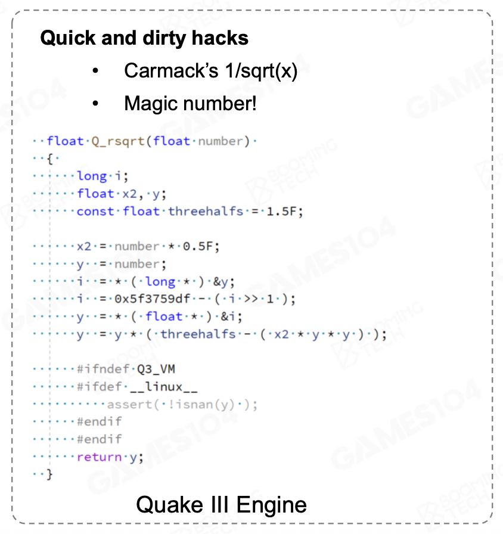
            

        - SIMD（单指令多数据）：一条指令能处理多份数据

            

                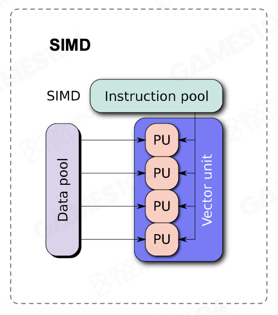
            

- 数据结构和（STL）容器
    - 数据结构包括向量、映射、树等等
    - 自定义的数据结构可能比 STL 更高效
    - 避免内存**碎片**(fragment)
    - 骨骼树和动画帧序列

    

        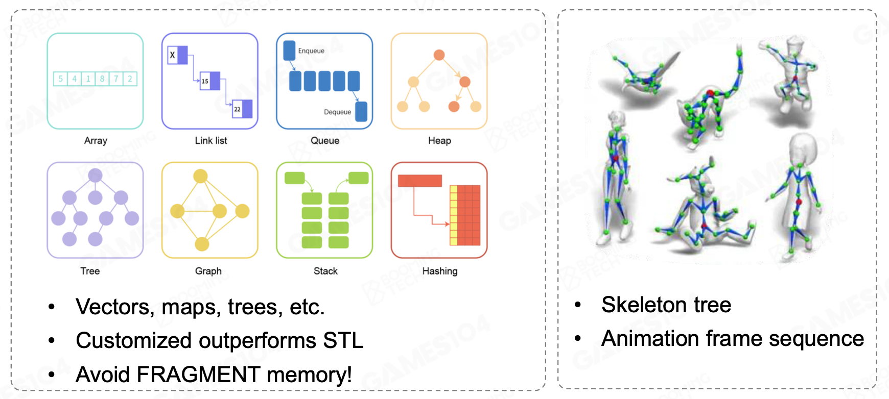
    

- 内存管理
    - 游戏引擎性能的主要瓶颈
        - 内存池/分配器(memory pool/allocator)
        - 降低高速缓存失效(cache miss)
        - 内存对齐(memory alignment)
    - 多态内存资源(polymorphic memory resource, PMR)
    - 图灵机

    

        
    

- 核心层是游戏引擎的基础
    - 核心层提供了各种功能模块所需的实用函数
    - 要求满足超高性能的设计和实现，因而对代码编写提出了很高的标准

    

        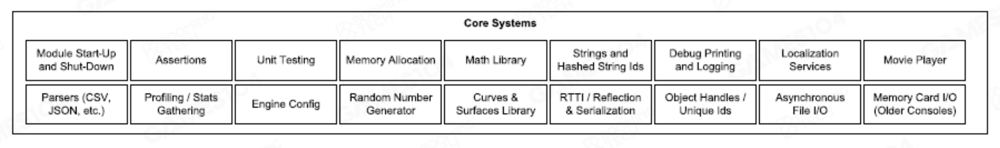
    

## Platform Layer

- 不同平台的目标
    - 不同平台的兼容性，为上层提供**平台无关**(platform-independent)的服务和信息
    - 文件系统
        - 路径（斜杠/反斜杠），环境变量

            

                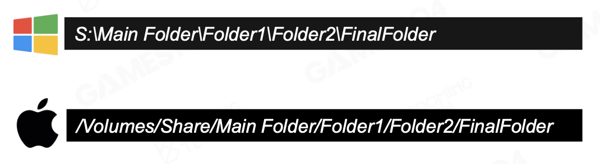
            

        - 目录遍历

- 图形学 API：**渲染硬件接口**(render hardware interface, RHI)
    - 在不同 GPU 架构和 SDK 上透明
    - 在不同的目标平台上自动优化

    

        
    

- 硬件架构

    

        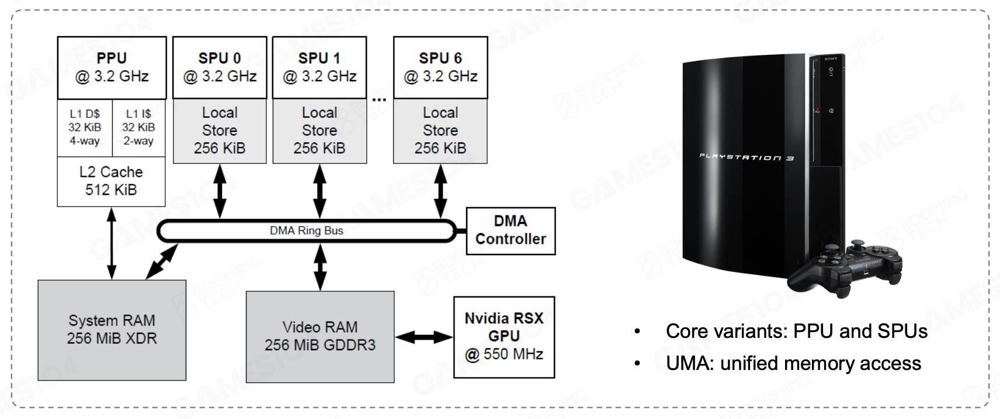
    

- 平台层是很容易被大家忽略的一层，但它是区分引擎水平高下的一个很重要的分水岭

## Tool Layer

- 让任何人都可以创建游戏，释放创造力
    - 提供了一系列的编辑器 

        

            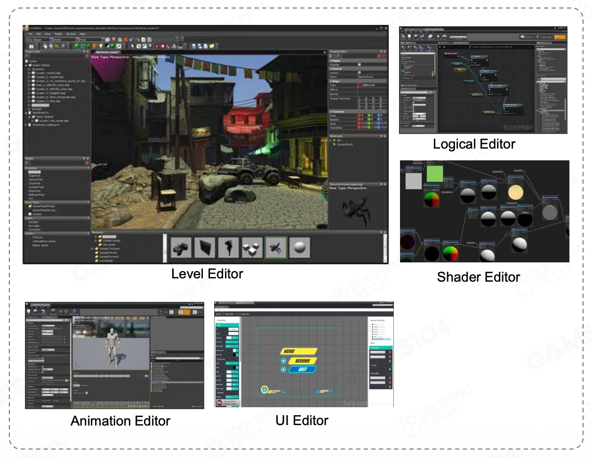
        

        - 游戏引擎的材质编辑器会保证你在预览里看到的效果和在真实游戏里看到的效果是一模一样的

    - 基于游戏引擎构建游戏
    - 创建、编辑和交换游戏玩法资产

- 编程语言的灵活性：C++、C#、HTML5...
- **数字内容创建**(digital content creation, DCC)
    - **资产调理管线**(asset conditioning pipeline)：将通过别人开发的资产生产工具生成的大量数字资产和我们自己编辑生成的数字资产通过一条管线全部变成游戏统一的资产

    

        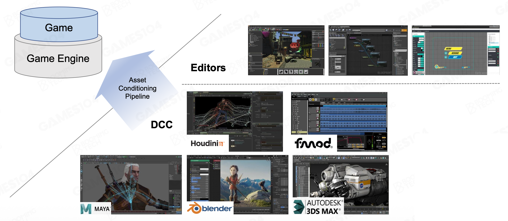
    

## Why Layered Architecture?

- 解耦，降低复杂性
    - 低层级独立于高层级
    - 高层级不知道低层级具体是如何实现的
    - 高层级调用低层级，反过来不行
- 响应不断变化的需求
    - 高层级变化快，低层级比较稳定
        - 一个基础原则：越往底层的东西越不要去动它
    - 未来在做任何一个需求的时候，首先要去想的是做的这件事情应该属于哪一层，而不是着急地把算法写出来

>~~这样的理由也适用于计算机网络的分层架构。~~

    

