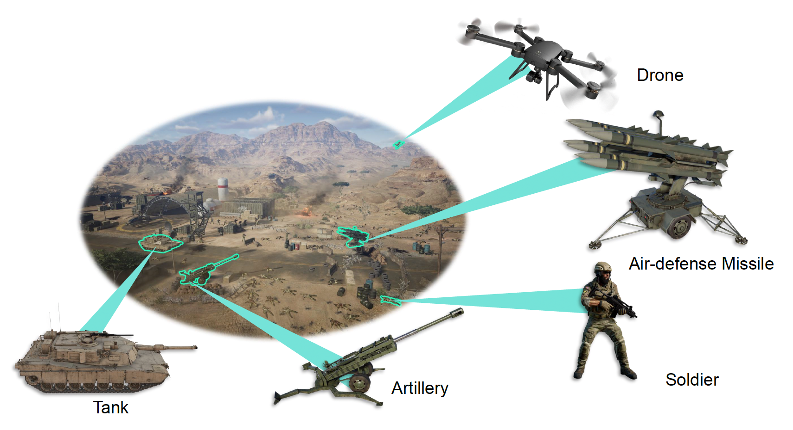
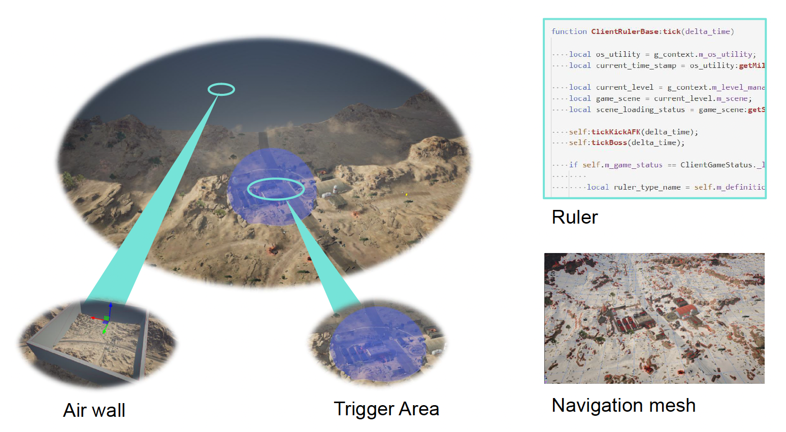
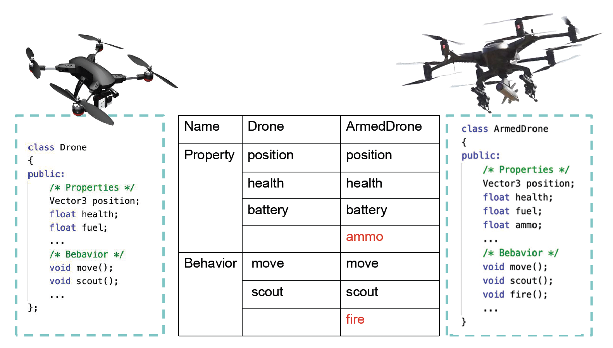
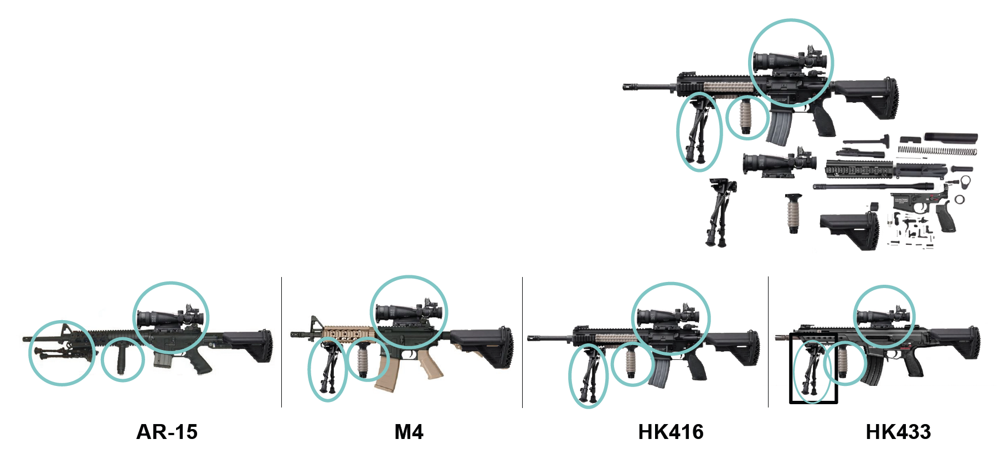
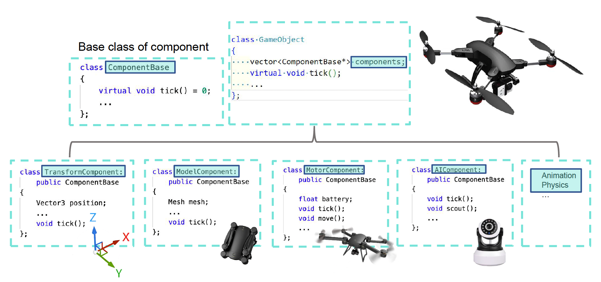
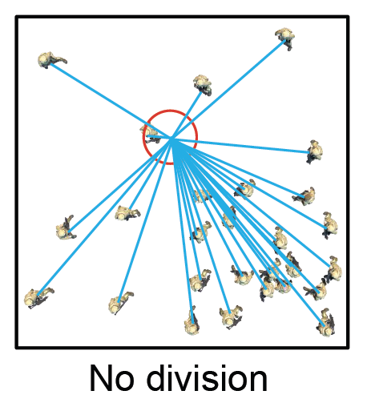
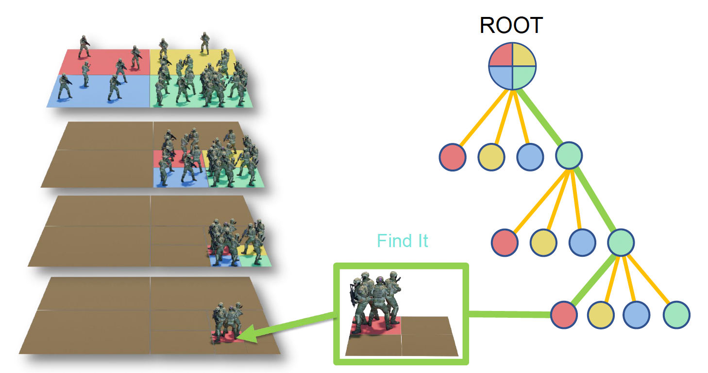

# How to Build a Game World

要想构建一个游戏世界，我们得回答以下三个问题：

- 游戏世界是由什么构成的？
- 如何描述这些构成世界的东西？
- 这些东西又是如何被组织起来的？

## Game Objects

在游戏世界中，任何东西都是一种**游戏对象**(game objects, **GO**)。游戏对象包括以下几类：

- **动态**(dynamic)游戏对象：可交互的动态物

    

        
    

- **静态**(static)游戏对象：虽然不可交互，但也是必不可少的游戏元素

    

        
    

- **环境**(environment)：
    - 地形(terrain)：无限绵延，是支撑动态物和静态物的「托盘」
    - 天空：反映日夜、天气的变换（有一个专门术语：日夜变换系统(time of the day)）
    - 植被(vegetation)：一种动静结合的系统——平时是静止的，但又会随风雨等产生交互；并且体量大

    

        
    

- 其他游戏对象：
    - 检测体(trigger area)
    - 空气墙

    

        
    

## Components

下面回答第二个问题：如何描述一个游戏对象呢？以一架无人机为例，我们可能会从以下几方面来描述它：

- 形状（属性）
- 位置（属性）
- 移动（行为）
- 电池容量（属性）
- ...

不难发现，对游戏对象的描述可分为**属性**(property)和**行为**(behavior)两大类。于是很自然地，我们可以用一种 OOP 语言（C++、C# 等）来描述游戏对象：

    

假如我们想把这架无人机改装成一架武装无人机，只需在现有基础上增加「弹药(ammo)」属性和开火(fire)行为即可，十分方便。

    

既然用到了 OOP 语言，那么不难想到我们不必从头开始编写武装无人机类的代码——可以先**继承**(inherit)一般的无人机类，然后再增加额外的属性和行为。

    

上述做法的一个缺点在于：随着游戏世界做的越来越复杂，可能某个游戏对象继承自多个其他游戏对象，而这些游戏对象也可能有各自的继承，那么很容易出现诸如**菱形继承**(diamond inheritance)之类的问题。

    

---
解决方案是将对象组件化——把一个游戏对象拆分成多个**组件**(components)。比如在射击游戏中，一把枪可以有像瞄准镜、消音器、握把、支架等组件。通过不同的**组合**(composition)，我们便可得到不同特性的武器了。

    

对于前面无人机的例子，我们可以把它拆分为诸如模型、马达(motor)、AI 等部件。

    

相应的代码实现如下：

    

现在要把无人机改装为武装无人机就相对比较容易了，只要换一换组件就行了。

    

以下是商业模型用到的组件架构：

    

- Unreal 中的 `UObject` 和 Unity 的 `Object` 不是游戏对象，它们更像是 C# 等高级语言中的 `Object`，用来管理任何对象的生命周期（内存管理、句柄等）

???+ bug "组件模式的缺点"

    - 性能开销：每次访问组件都需要查询接口，不如直接写类高效（可能需通过 ECS 等高级架构优化）
    - 通信效率：组件之间高频的查询过程（例如一个 AI 组件需要频繁查询是否有 Health 组件并获取血量）会对引擎效率造成显著影响

## Component-Based Ticks

有了游戏对象后，下一个问题便是如何让游戏世界动起来。上一讲介绍过游戏引擎中有一个核心的函数 **tick**，每隔 1/30 秒就能让世界往前走一步；那么这个 tick 是如何传递给每一个游戏对象的呢？

一种方法是**基于对象**的 tick，依次去 tick 每个对象（所以每个组件的基类一定要有一个 tick 函数）。这一思路显然符合我们的直觉。

    

但在现代游戏引擎中，我们采用的不是这种思路，而会用一种**基于组件**的 tick，依次 tick 每个组件。比如先 tick 完所有 GO 的马达系统，然后再去 tick 所有 GO 的控制器，以此类推。

    

为什么要用基于组件的 tick 而非基于对象的呢？我们以制作汉堡为例：

    

- 基于对象的 tick 对应按准备面包片、烤肉饼、洗菜叶、煎蛋的顺序一个个地制作汉堡
    - 优点：简单直观、容易调试
- 基于组件的 tick 对应每个人负责一个活，比如一个人只负责烤肉饼，另一个人只负责洗菜叶，最后可以一次制作多个汉堡
    - 这里就涉及到现代工业中的**流水线**概念
    - 优点：**并行处理**、减少缓存失效

综上，基于组件的 tick 更加高效，这就是我们采用该方法的原因。

??? question "tick 时间过长如何处理？"

    当 tick 时间超过预期时，最简单的方法是**步长补偿**，将实际耗时作为步长参数传给计算模块，对位移等进行补偿。
    
    更专业的策略是**延迟处理**(deferred processing)，将突发的大量计算任务（如爆炸事件）分散到后续的几帧中分批完成，以保证实时性，因为短时间（约 0.2 秒）的延迟在视觉上可以接受。
    
    但从根本上，我们仍然需要优化引擎和游戏设计。

## Events

现在整个游戏世界的对象都能动起来了，但还缺了点什么——那就是游戏对象之间的关联，比如坦克开了一炮，击中敌方目标后，怎么让敌方知道自己被打伤了呢？

一种简单的方法是为炮弹设置一个对象。可能在某个 tick 中，炮弹的移动轨迹可能和地面相交，那么就应该发生爆炸了。光炸还不够，还应该检测炸弹附近是否有其他对象：如果是人就得扣血，如果是飞机就会坠机（类似 `#!cpp switch-case` 语句分情况讨论）。我们把这样的思路称为**硬编码**(hardcode)。

    

但随着游戏世界越来越复杂，人们会发现这种方法不太合理，于是就有了现代游戏引擎中最重要的机制之一：**事件**(event)机制。对于前面炮弹的例子，炮弹在爆炸时无需在意周围有什么对象，它只需要**发送**一条消息，告诉其他对象说它要爆炸了；其他对象**接收**消息后会根据实际情况做相应的**处理**，比如说炮弹附近的小兵收到消息后血量就会下降，甚至可能死亡。

    

所以原本一个比较复杂的问题，通过事件机制就会变得清晰明确，这就是一种**解耦合**(decoupling)。

商业引擎中的事件机制：

    

- 在 Unity 中，我们可以简单地注册一个事件，然后发送事件，最后销毁事件
    - 如果对象的核心组件收到了这个事件后，就会激活一个回调函数，用于做相应的处理
- 而 Unreal 做得就比较复杂些——用 C++ 源码去处理比较复杂的反射机制
    - 但注册、发送、销毁事件的道理还是类似的
    - 之所以做那么复杂，是因为 Unreal 提供了能够显示各种事件消息的蓝图

???+ info "事件机制的调试"

    调试复杂的事件系统非常困难，因为一帧内事件数量巨大。常用的调试方法包括：
    
    - 在后端使用**日志**(log)机制记录和追溯事件流程
    - 在前台使用可视化的**调试**(debug)模式，让开发者或设计师锁定一个物体，将其发送和接收到的所有消息内容和流程实时显示在 3D 空间中，便于暂停和检查消息处理是否正确

## Scene Management

现在来回到最后一个问题：如何管理游戏对象？在游戏引擎中，游戏对象会在一个**场景**(scene)中被管理。在管理时，我们就需要查询每一个对象，查询的依据有：

- 唯一的游戏对象 ID
- 对象位置（经纬度等）

场景管理的方法有：

- 最直接粗暴的方法是：事件发生时，向场景内所有的对象发送消息
    - 假如有 N 个对象，那么就会有 O(N^2^) 数量级的交互，这会对计算机带来巨大负载

    

        
    

- 简单的空间分段：将场景划分为均匀的格子，事件发生时只需向邻近格子内的对象发消息即可
    - 在场景不大的情况下，这种方法是没问题的
    - 但很多场景都是不均匀的
    
    

        
    

- **层级分段**(hierarchical segmentation)
    - **四叉树**(quadtree)：将空间划分成四块，不断划分，直至空间内对象足够少

    

        
        
    

- 空间数据结构
    - **包围体层级**(bounding volume hierarchies, BVH)
        - 每一个物体都对应一个包围盒，把它从小往大慢慢的做一些计算（比如最常见的视锥裁剪）
        - 用 BVH 可以快速地把很多东西扔掉
        - 这种技术也可帮我们快速定位子弹发射的弹道

    - **二叉空间划分**(binary space partitioning, BSP)
    - **八叉树**(octree)
    - **场景图**(scene graph)

    

        
    

??? question "空间划分中的动态物体如何处理？"

    由于动态物体不断移动，如果每一帧都需要完全重建空间划分结构（如八叉树），那么显而易见效率是极低的，因此选择合适的算法至关重要：
    
    - 对于静态世界，可使用 BSP 树
    - 但对于动态或开放世界，推荐使用更新代价极低的 **BVH** 算法，因为它仅基于包围盒的层级合并，效率更高

    引擎一般会支持多种划分算法，供开发者选择。

## Timing Sequence

游戏对象之间常常存在绑定关系，例如角色与车辆之间的关系，因此 tick 时必须保证正确的先后顺序：父对象先更新，子对象再根据父对象的最新状态更新。商业引擎为了提高性能，会将 tick 分发到多个 CPU **并行**执行，使得**时序**控制变得更加复杂。如果不加限制，对象之间在同一帧互相发送事件时可能出现逻辑悖论，导致结果无法确定。

游戏要求在相同输入下始终得到一致的结果（确定性），例如「精彩回放」功能就是依靠重复相同输入重新运行游戏来实现的。因此，事件的处理不能依赖对象之间即时互相投递，而是需要类似“**邮局**”的统一调度机制：当前帧产生的事件先提交到队列，下一帧再分发处理，以确保严格一致的顺序。

    

除了基础 tick，引擎还会使用 pre tick 和 post tick 来处理组件间的持续性问题。

引擎内部组件之间常会形成**依赖链**，如移动影响速度与状态，状态影响动画，动画触发物理，物理再反过来影响位置。这些相互影响若控制不好，会出现一到两帧的延迟，而这些问题本质上都源于时序安排。

理解并正确处理这些 tick 阶段、事件时机及组件依赖，是游戏引擎中最核心、最精妙的部分。

???+ question "渲染线程和逻辑线程如何同步？"

    游戏引擎通常将 tick logic 和 tick render 分成两个独立的线程。时间顺序上，**tick logic 会略早于 tick render**。但这种分离可能导致**画面延迟**(lag)，即逻辑跑完一帧后，画面可能会延迟一帧显示。现代游戏引擎需要通过复杂设计来降低输入到视觉反馈之间的总延迟。