# Rendering on Game Engine

游戏刚诞生的时候，就已经考虑到了绘制和渲染的问题了。即便那个年代的硬件条件远不如现在，游戏开发者们仍然尽力表现游戏画面。

<div style="text-align: center">
    
</div>

随着技术发展，如今的渲染系统已经相当丰富，但也更加复杂了。

??? question "思考：有没有游戏不需要渲染系统的？"

    有的，比如 MUD 这一类的文字游戏等。

在图形学理论中，渲染的特点为：

{ align=right width=30% }

- 专注于物体的某一类型的效果
- 聚焦于表示（算法）和数学正确性
- 没有严格的性能要求
    - **实时**(realtime)（>= 30 FPS）/ **交互式**(interactive)（10 FPS）/ **离线**(offline)渲染
    - **核外渲染**(out-of-core rendering)：数据量太大，需要多台机器存储

CG 中的渲染理论正是游戏引擎渲染系统的基石！

---
在游戏引擎中，我们会遇到以下关于渲染的挑战（这也是和 CG 渲染理论不一样的地方）：

- 游戏的某个场景中可能包含成千上万的物体，而每个物体要实现的效果类型，背后的渲染算法以及后处理等可能还不一样，所以非常复杂

    <div style="text-align: center">
        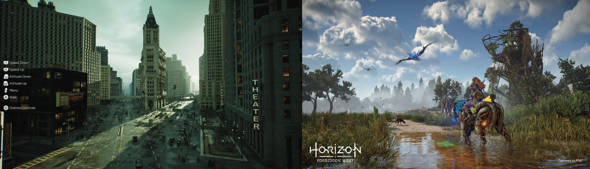
    </div>

- 理论上可能只需确保算法正确就行了，但在实际中还得考虑结合了 CPU 和 GPU 的复杂的现代计算机架构

    <div style="text-align: center">
        
    </div>

- 游戏需要保持帧率稳定（30 FPS / 60 FPS（电竞）/ 120 FPS（VR）），并且我们对游戏画质提出了更高的要求（1080P -> 2K -> 4K -> 8K）

    <div style="text-align: center">
        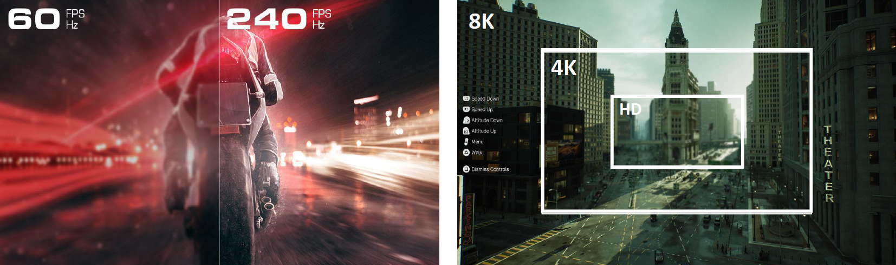
    </div>

    - 设计理念：渲染系统的计算时间必须被限定在一个固定的预算中，要确保不能够超过这个时间预算，否则帧率就会降低，从而影响玩家的游戏体验

- 每一帧的时间预算分配问题
    - CPU 带宽和内存占用的有限访问
    - 渲染系统不能占用全部的资源，不然其他子系统（gameplay 等）就跑不了了
    - 自动运行 profiling（性能分析）工具
    - 游戏逻辑、网络、动画、物理和 AI 系统是 CPU 和主存的主要消费者

    <div style="text-align: center">
        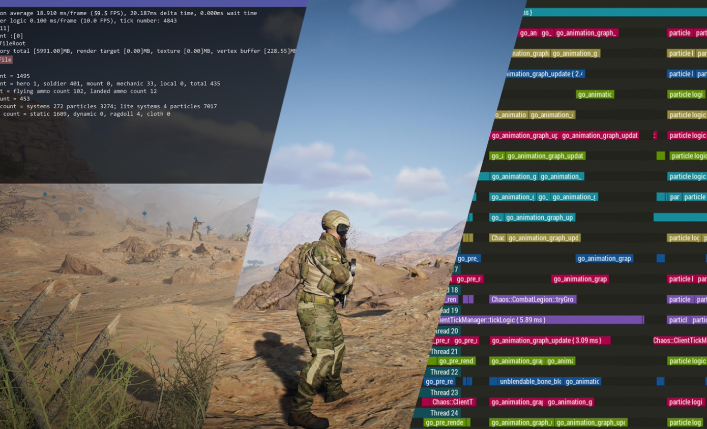
    </div>

!!! note "注意"

    以下介绍的内容都是经过工程实践过的，不只是一种理论模型。也就是说，游戏引擎中的渲染系统是一个高度优化的实用软件框架，以满足现代硬件（PC、主机和移动设备）上游戏的关键渲染需求。

???+ failure "不会介绍的内容"

    - 卡通渲染(cartoon rendering)
    - 二维渲染引擎
    - 次表面(subsurface)
    - 头发 / 毛发

    <div style="text-align: center">
        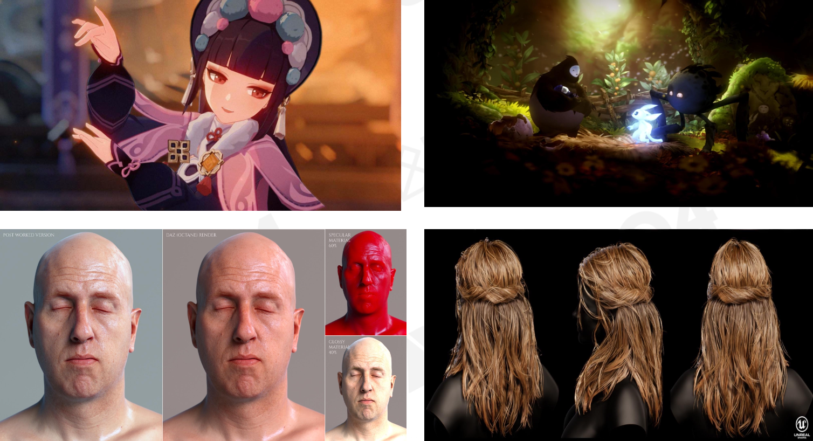
    </div>


## Basics

### Building Blocks

渲染的构成要素（下图来自 GAMES101 课件）：

<div style="text-align: center">
    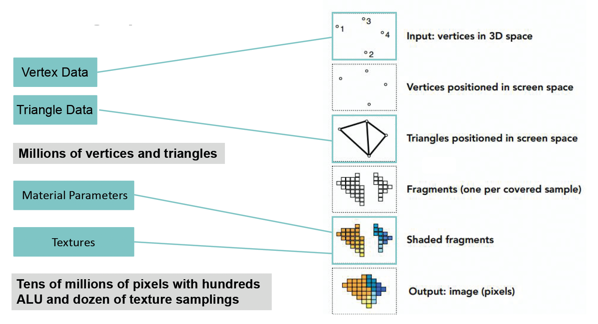
</div>

一句话总结：顶点 -> 面 -> 屏幕上的像素点（到这一步叫做光栅化(rasterization)）-> 材质(material) -> 纹理(texture) -> 成品。

渲染最核心的工作是计算，包括以下几个方面：

- **投影**(projection)和**光栅化**(rasterization)

    <div style="text-align: center">
        
    </div>

- **着色**(shading)
    - 下图是一个着色器代码的例子，里面包括了
        - 常量 / 参数
        - ALU 算法（比如计算光线的等等）
        - 纹理采样
        - 分支

    <div style="text-align: center">
        
    </div>

- **纹理采样**(texture sampling)
    - 屏幕中的一个像素对应到远处物体的多个像素
    - 如果不去做（低频）滤波 / **反走样**的话，面向某一物体由近及远或由远及近的移动可能会导致画面的抖动
    - 步骤：
        1. 使用两个最近的 **mipmap** 层级（所以一张纹理贴图可不止要存储一层）
        2. 在两个 mipmap 上同时使用**双线性插值**(bilinear interpolation)
        3. 在结果中线性插值

    - 因此，一次纹理采样需要访问 8 个数据点，做 7 次插值（原因可见我的 [CG 笔记对应章节](../cg/5.md#mipmap)）

    <div style="text-align: center">
        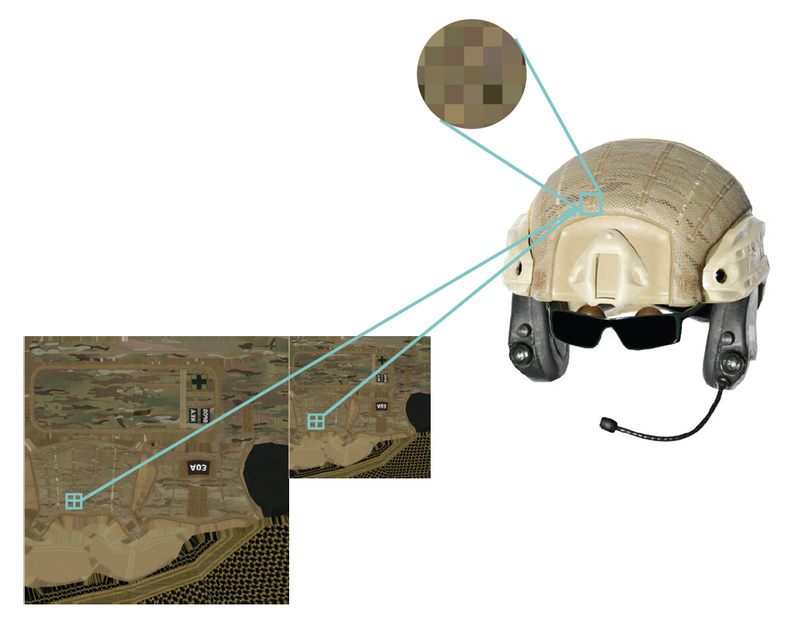
    </div>


### Hardware Architecture

!!! warning "注意"

    为了方便，之后笔者可能会混用「GPU」和「显卡」的概念，但两者还是有些差别的（后者包含前者，前者是后者的核心）。~~不过应该不影响阅读吧hh~~

GPU 是专门用于处理大规模任务的硬件。

<div style="text-align: center">
    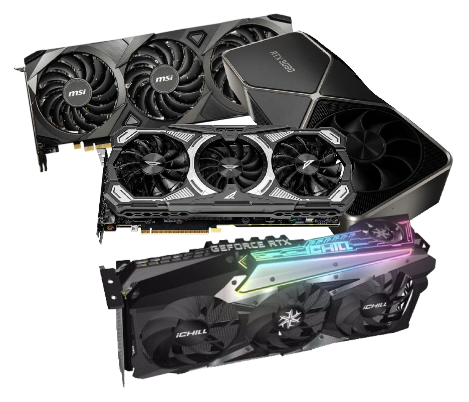
</div>

先来介绍和 GPU 密切相关的两个概念：

- **SIMD**（单指令多数据(single insturction multiple data)）：描述具有多个处理元素的计算机，这些处理元素**同时对多个数据点执行相同的操作**

    <div style="text-align: center">
        
    </div>

- **SIMT**（单指令多线程(single insturction multiple thread)）：并行计算中使用的执行模型，结合了 SIMD 与**多线程**

    <div style="text-align: center">
        
    </div>

再来了解一下典型的 GPU 架构（以 [Nvidia Fermi](https://en.wikipedia.org/wiki/Fermi_(microarchitecture)?useskin=vector) 架构为例）：

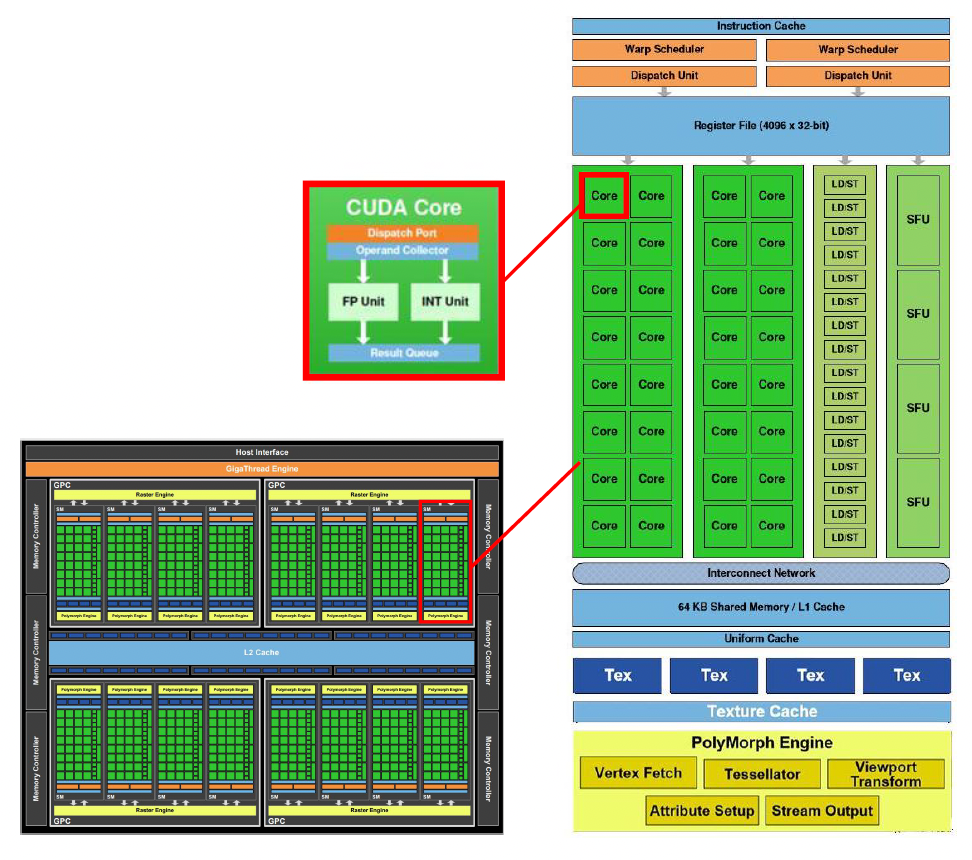{ align=right width=40% }

- **GPC**（图形处理集群(graphic processing cluster)）：用于计算、光栅化、着色和纹理的专用硬件块
- **SM**（流式多处理器(streaming multiprocessor)）运行 CUDA 核心的 GPU 部分
    - 并行，可以通过共享内存互相通信
- **纹理单元**(texture units)：能够获取和筛选纹理的纹理处理单元
- **CUDA 核心**(core)：能让数据通过不同处理器被同时处理的并行处理器
- **线程束**(warp)：线程的集合

接下来值得一提的是 CPU 和 GPU 之间的数据流，因为数据流动是有成本的，而且成本可不小。

- 之所以有「数据流」这一件事，是因为我们的计算机几乎都采用**冯·诺伊曼架构**，该架构的一个特征是**计算和数据的分离**
    - 这种架构的好处是简化硬件设计，但同时带来一个不可忽视的问题：很多计算都需要找数据，而数据的移动相对计算而言是很慢的

{ align=right width=30% }

- 数据流包括：
    - CPU 和主存之间：数据加载/卸载、数据准备
    - CPU 和 GPU 之间：高时延、有限带宽
    - GPU 和显存之间：高性能并行渲染

- 于是我们可以得出一个结论：如有可能，应尽可能最小化 CPU 和 GPU 之间的数据传输
    - 比如尽可能让数据单向传输（比如 CPU 将数据发送给显卡后尽可能不再另外读取数据）

针对上述问题，我们引入一种叫做**高速缓存**(cache)的硬件。

- 虽然访问内存数据的速度很慢，但访问高速缓存数据的速度会快很多，计算时只需要从高速缓存中读取数据即可，这样就能显著提升性能
- 但高速缓存的大小相对较小，所以有时会出现计算所需数据不在高速缓存的情况，这时就又不得不从内存中获取数据了；我们称这种情况为**高速缓存失效**(cache miss)，而相对地能够读到高速缓存数据的情况就是**高速缓存命中**(cache hit)

<div style="text-align: center">
    
</div>

综上所述，和 GPU 相关的性能限制包括：

- **内存**边界
- **ALU** 边界
- **TMU**（纹理映射单元）边界
- **BW**（带宽）边界

这些边界(bound)构成了一种「短板效应」：只要有一个地方速度太慢，就会拖垮整个系统的表现。

---
本节要讲件管线的发展趋势：

<div style="text-align: center">
    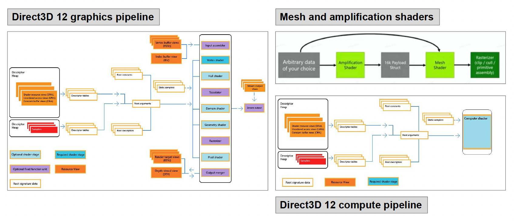
</div>

其他先进的架构：

- 主机端：
    
    <div style="text-align: center">
        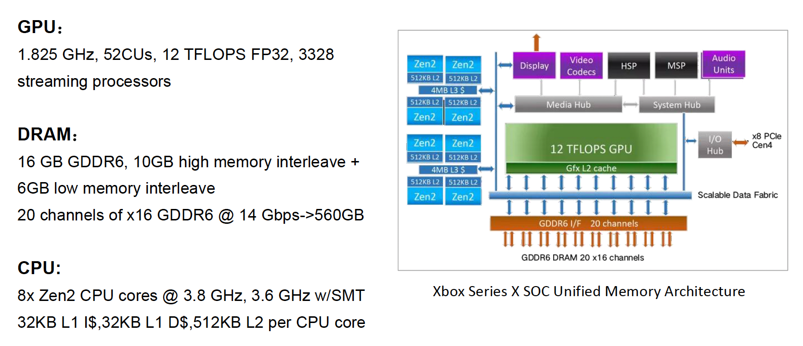
    </div>
    
    - 实现了 UMA（均匀内存访问）

- 移动端：

    <div style="text-align: center">
        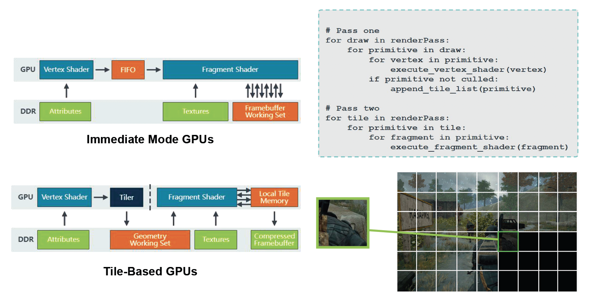
    </div>


### Renderable

上一讲中，我们介绍了如何基于组件描述一个游戏对象。其中有一个**网格渲染组件**(mesh rendering component)就是专门用来在游戏中绘制游戏对象的。尽管在不同游戏引擎中，这个名称会有所变化，但本质上都属于一种**可渲染对象**(renderable)。

一个可渲染对象由多个构建块组成。比如下面这个士兵有头盔、胡须、躯干等部位，而每个部位的渲染效果（材质、纹理等等）都是不一样的。

<div style="text-align: center">
    
</div>

在游戏引擎中，最基础的表达形式是**网格原语**(mesh primitive)，比如下面对顶点、三角形的定义：

<div style="text-align: center">
    
</div>

当然上面的存储方式比较笨。如果写过像 OpenGL, DirectX 的图形学代码的话，就会知道实际上是用**顶点数据**和**索引数据**来存储的，并且分别需要一个声明和一个缓冲区。具体来说就是把所有顶点数据放在一起，三角形只会存顶点的索引值，不会再次存储顶点数据（因为很多顶点会被多个三角形共用）。

<div style="text-align: center">
    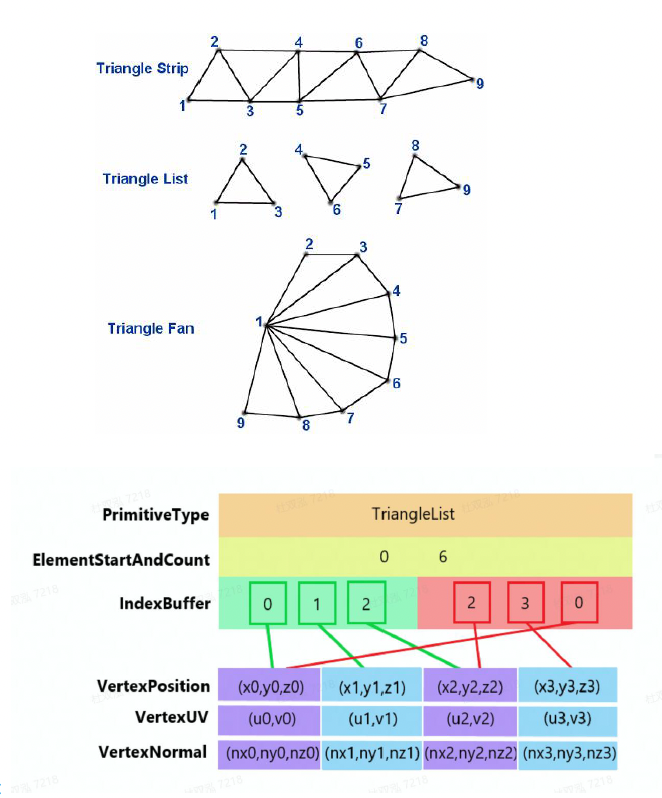
</div>

其实我们不必使用索引缓冲区，而是采用一种类似“一笔画”游戏的方式，即 **triangle strip**：按顺序访问顶点，对高速缓存友好。

另外值得注意的是，我们必须**为每个顶点存储法线信息**。尽管大多数时候可以通过计算三角形面法线的平均值来求出顶点法线，但之所以要这样做，是因为如果表面有一条折线（硬表面），两个重合的顶点却有着不同的法线方向，那么只记录三角形法线的方法就失灵了。

<div style="text-align: center">
    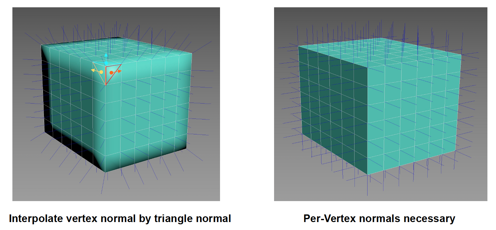
</div>

---
下一个要介绍的可渲染对象是**材质**(material)，它的作用是区分不同物体的外观和光泽。

<div style="text-align: center">
    
</div>

需要注意的是，不要将这里的「材质」和之后要介绍的**物理材质**(physical material)给弄混淆了：后者跟渲染没有关系，它负责的是摩擦力、弹力之类的东西。

材质系统经过多年的发展，已经有不少模型被提出来了。下面列举一些比较知名的模型：

- [Phong 模型](../cg/5.md#blinn-phong-reflectance-model)
- PBR 模型（一种基于物理的渲染）
- 次表面材质

<div style="text-align: center">
    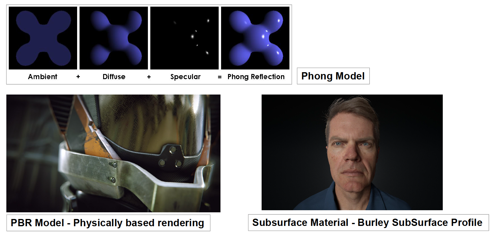
</div>

另外和材质息息相关的可渲染对象便是**纹理**(texture)。不同材质和纹理的排列组合，可以产生众多各异的渲染效果：

<div style="text-align: center">
    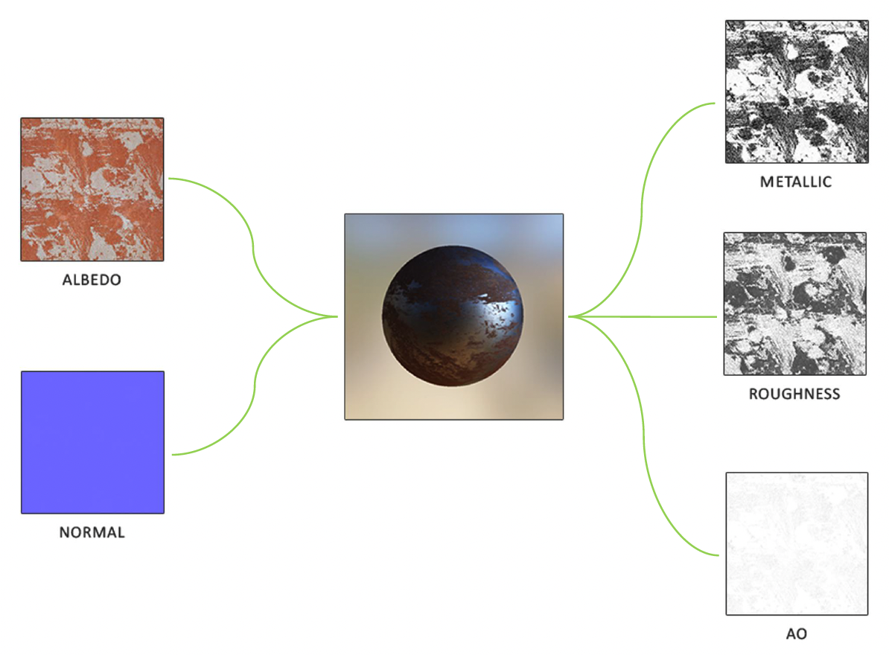
</div>

最后要来认识的，并且容易被忽视的可渲染对象是**着色器**(shader)。不同于材质和纹理，着色器的本质是一段源代码，但会被游戏引擎视为一种数据。

<div style="text-align: center">
    
</div>

除了固定的着色器函数这一传统形式外，在现代游戏引擎中有一种叫做**着色器图**(shader graph)的工具。艺术家们可以像搭积木那样自由组合各种元素，最终形成完整的 shader 代码以表达所需要的材质。


### Render Objects

有了这些可渲染对象后，我们就可以完整地渲染游戏中的任何物体了。但这些物体最终是要呈现在屏幕上的，而先前构建的模型是基于自身的局部坐标系的，所以中间还需做一些转换：

- 变换矩阵：局部坐标系 -> 世界坐标系
- 视图矩阵：投影到相机坐标系上
- 正交/透视投影：最终来到屏幕坐标系

<div style="text-align: center">
    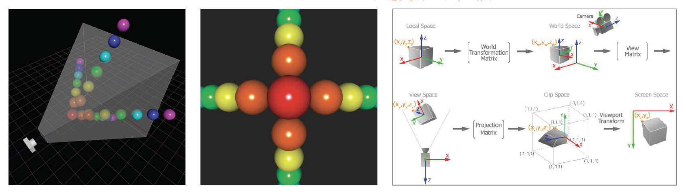
</div>

假如拿我们目前学到的技术去渲染一名士兵，我们期望得到的是左图的效果，但实际上得到的结果如右图所示，看起来特别假（~~感觉像用玉石做的~~）。

<div style="text-align: center">
    
</div>

这是怎么回事呢？答案很简单：同一角色身上不同部位的渲染效果是不一样的，而现在这个士兵从头到尾都呈现同一套渲染效果，自然看起来很假。那么对于某个模型，该如何处理和显示其身上不同的材质和纹理呢？这就涉及到**子网格**(submesh)的概念。

- 我们会根据各部分材质的不同，会把一个网格划分为多个子网格，每个子网格都有各自的材质、纹理、着色器等
- 顶点和三角形存在一个大的缓冲区里，所以每个子网格只用到缓冲区里的一小段（根据偏移量(offset)访问）

<div style="text-align: center">
    
</div>

这会涉及到一个问题：同一场景中可能存在多个游戏对象，这些游戏对象都由一套材质、纹理之类的东西需要存到内存中。如果这些对象都是一样的，那么内存中就会有大量重复的数据，这就很浪费空间了。

<div style="text-align: center">
    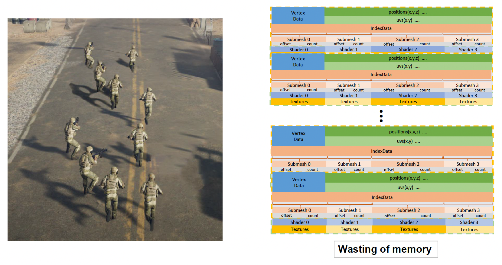
</div>

节省空间的方案是为同一类的可渲染对象设置一个**资源池**(resource pool)，比如网格资源池、着色器资源池、纹理资源池等等。这样多个游戏对象就可以共用资源池中的内容，无需重复存储数据了。

<div style="text-align: center">
    
</div>

另一个重要的概念是**实例**(instance)。如下图所示，实际上场景中只有两类士兵，因此实际上只需要存储两类数据的定义即可；某一类相同的士兵们是这类数据的多个实例。

<div style="text-align: center">
    
</div>

>注：游戏对象，音乐/音效等也是一种实例。

---
渲染的时候，我们将场景中的物体**按材质排序**，这样能加快 GPU 的计算速度。之所以能加速，是因为 GPU 很懒，每次更改参数时都要停下来；按材质排序后，可以实现设置一次材质后，就连续绘制所有使用该材质的子网格，从而减少对显卡状态参数的更改次数。

<div style="text-align: center">
    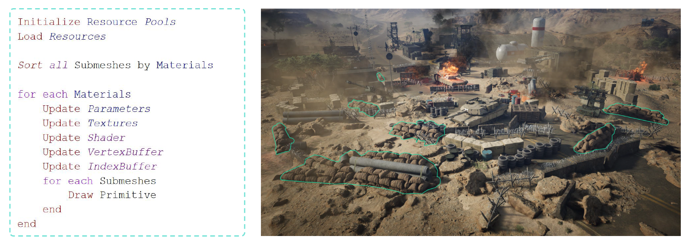
</div>

另一个利用 GPU 特性的加速技巧是 **GPU 批渲染**(batch rendering)，将场景中具有相同子网格和材质的所有实例一起渲染出来。

<div style="text-align: center">
    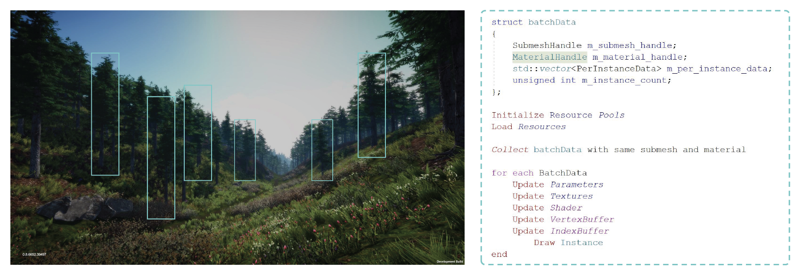
</div>


### Visibility Culling

有了前面介绍的技术后，我们可以绘制一个小的游戏场景了。然而，这样的渲染并不高效，因为对玩家而言，我们只能看到相机视线范围内的场景，视线外的地方是看不见的，而那些看不见的东西不需要绘制出来。这便是**可见性裁剪**(visibility culling)的概念。这个概念还涉及到两个要素：

- **视锥**(view frustum)：相机能看到的范围
- **包围盒**(bounding box)：用于判断物体是否在视锥范围内

<div style="text-align: center">
    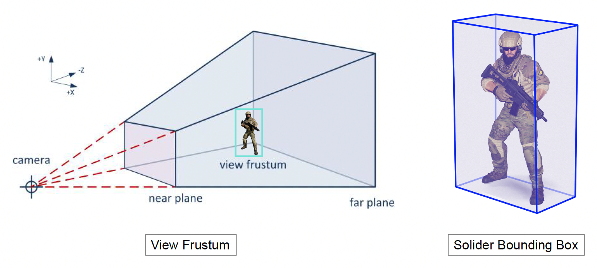
</div>

包围盒的种类很多，如下所示。其中从左往右看，包围盒的精度更高，但速度更慢且占用更多内存空间。

<div style="text-align: center">
    
</div>

- 包围球
- AABB（轴对称包围盒(axis-aligned boudning box)）：
    - 「轴」是指游戏世界的 x, y, z 轴
    - 只要存两个顶点就能构建出来，且计算效率很高，仅次于包围球

- OBB（对象包围盒(object bounding box)）
- 凸包(contex hull)

包围盒有以下特点：

- 一种低成本的相交测试
- 紧贴物体
- 计算成本低
- 容易旋转和变换
- 占用内存少


#### BVH

为了进一步提高计算效率，我们可以引入上一讲介绍的**分层结构**(hierarchy)，对空间中的各个物体进行进一步的划分。这样在做裁剪运算的时候，就可以从一个树状结构中自顶向下地快速判断一个物体是否视锥范围内。

<div style="text-align: center">
    
</div>

其中用的比较多的一种算法是 **BVH**（包围体层级(bounding volume hierarchy)）裁剪。尽管并不是最高效的算法，但是它重构速度快，适合用于场景中包含多个动态物体的情况；因为物体移动可能就要重新构建 BVH，而 BVH 能保证一旦创建好一棵树后，之后重构的成本尽可能低。

<div style="text-align: center">
    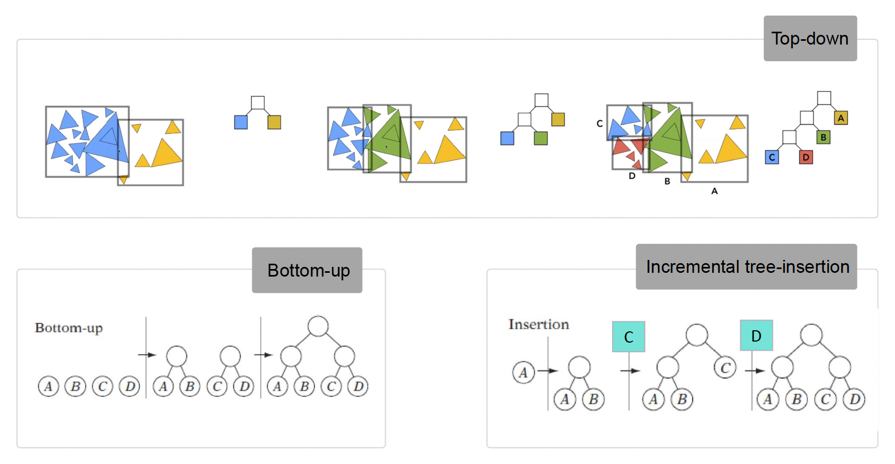
</div>


#### PVS

另一种可见性裁剪算法是 **PVS**（潜在可见集(potential visibility set)）。简单来说就是将空间划分为多个小格子（房间），格子之间通过大门(portal)相连。

<div style="text-align: center">
    
</div>

而 PVS 要做的是在当前房间中，判断能看到哪些房间。如下图所示，假如在 7 号房间，那么能看到的房间就是 6, 1, 2, 3，此时只需要渲染这些房间就行了。

<div style="text-align: center">
    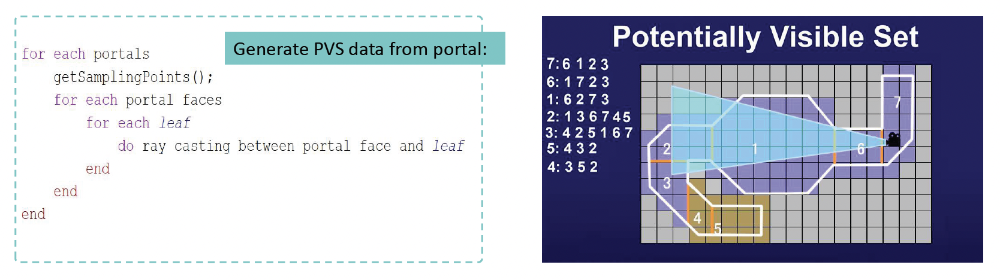
</div>

PVS 的优点可概括为：

- 比 BSP / 八叉树更快
- 更灵活，兼容性更强
- 可预加载资源

所以这个想法非常简单，也很符合直觉，并且执行效率很高。尽管现在直接使用 PVS 的游戏很少了，但这一思想依然出现在不少游戏中。比如有些单机游戏包含多个线性的关卡（尽管看起来像一个开放世界，但是角色只能在规定的地方行动）；玩家能经过的世界被划分为多个区域(zones)。当玩家从一个区域来到另一个区域时，有可能会卡一小会儿，这是因为不同的区域需要渲染的场景不一样，切换区域就要重新加载数据。

<div style="text-align: center">
    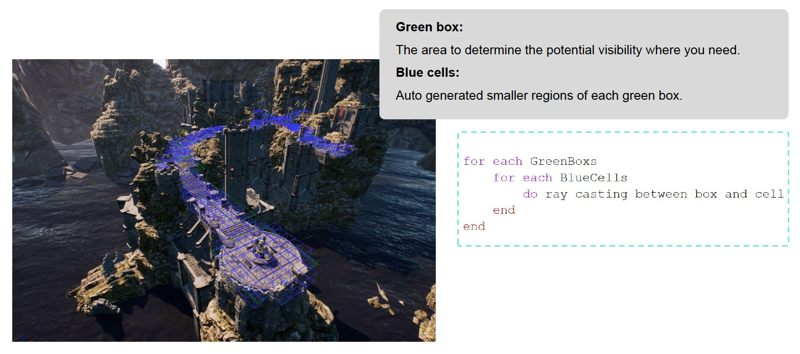
</div>


#### GPU Culling

前面介绍的算法都是比较经典的算法。现在随着技术发展，我们可以利用 **GPU** 的并行能力构建更加精密高效的裁剪算法。

<div style="text-align: center">
    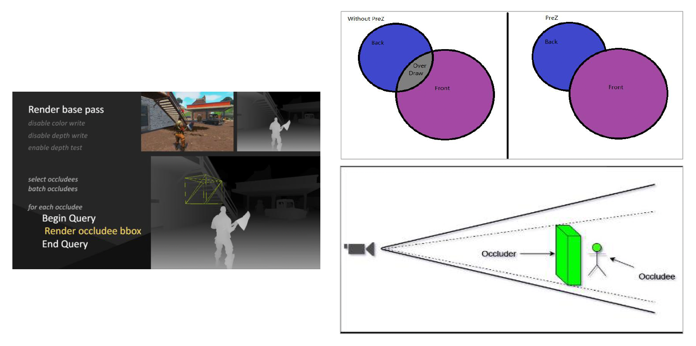
</div>

其中一种著名的技术是**遮挡查询**(occlusion query)，即 GPU 接收大量物体后，会返回一个位数组（由 0 和 1 组成），直接指示每个物体是否可见，相比传统精巧的 CPU 算法，GPU 的并行计算速度更快。

另一种重要的概念是 **early-z**，其思想是利用显卡的“聪明能力”：当一个像素被其他物体遮挡时，就跳过对它的绘制。

- 实现的基本方法是先进行一次基础的渲染，禁用颜色写入但启用深度测试，仅将场景的深度信息（**深度图**）绘制出来。
- 随后，在正式绘制任何物体时，只要物体的像素深度值比已存储的深度值靠后，整个像素乃至整个物体就可以被廉价且快速地跳过绘制（裁剪掉）。


### Texture Compression

接下来要讲的一个重要概念是**纹理压缩**(texture compression)。我们可以对比传统的图像压缩算法，比如 JPG 和 PNG，它们的共同特点是：

- 压缩率高
- 保证图像质量
- 专门用于压缩和解压缩完整的图像
- **不支持随机访问**（也就是说没法立马知道任一位置上的像素值）

    <div style="text-align: center">
        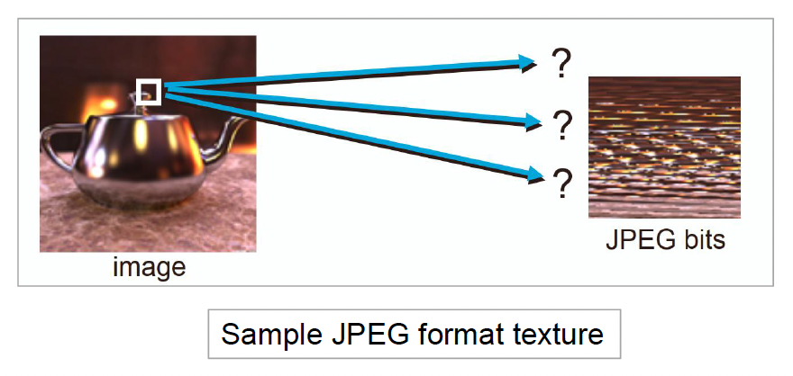
    </div>

由于加粗的这条特性，这些算法不适合用于压缩纹理，所以纹理也并不是以图像形式存储的。设计纹理压缩算法时，需要考虑：

- 解码速度
- 随机访问
- 压缩率和视觉质量
- 编码速度

常用的纹理压缩算法是**块压缩**(block compression)。最经典的方法是将纹理划分为 4x4 的小块，然后找出颜色最暗和最亮的两个点，而其他的点就是在这两点之间做插值，用于近似表示相应色块的颜色。

<div style="text-align: center">
    
</div>

常见的基于块的压缩格式有：

- PC：
    - **BC7**（更现代，可以做到 CPU 上的实时压缩）
    - DXTC（比较旧）

- 移动设备：
    - **ASTC**（更现代）
        - 分块不再是严格的 4x4，可以是任意形状
        - 压缩效果好，但不能实时压缩

    - ETC / PVRTC（比较旧）


### Authoring Tools of Modeling

知道渲染的原理后，我们得需要工具来实现。下面就来介绍一些常用的建模手段和工具。

- **多边形建模**(polymodeling)

    <div style="text-align: center">
        
    </div>

- **雕塑**(sculpting)

    <div style="text-align: center">
        
    </div>

- **扫描**(scanning)

    <div style="text-align: center">
        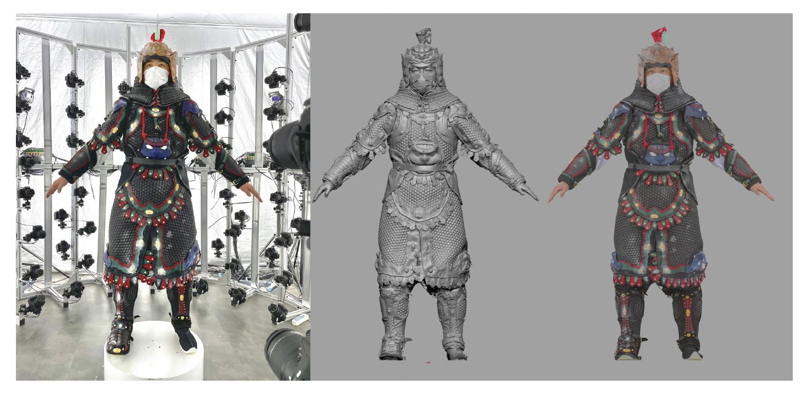
    </div>

- **过程建模**(procedural modeling)

    <div style="text-align: center">
        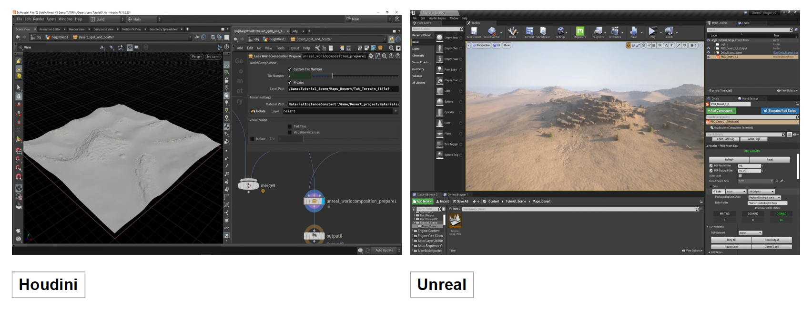
    </div>

比较各方法的优缺点：

<div style="text-align: center">
    
</div>


### Cluster-Based Mesh Pipeline

随着游戏开发技术的进步，特别是 ZBrush 雕刻和 3D 扫描技术的普及，美术资产拥有了近乎无限的细节，比如现代的开放世界游戏中，每帧需要渲染的数据量相比传统线性游戏可能增加十倍以上。这种海量的几何细节对现代引擎的基础架构产生了巨大的冲击，迫使渲染系统不断向前演进。

<div style="text-align: center">
    
</div>

为了解决上述问题，业界提出了**基于簇的网格管线**(cluster-based mesh pipeline)，比如：

- GPU 驱动的渲染管线（2015）
    - 在单次绘制调用中绘制任意数量的网格
    - 通过簇边界进行 GPU 裁剪
    - 按簇深度排序

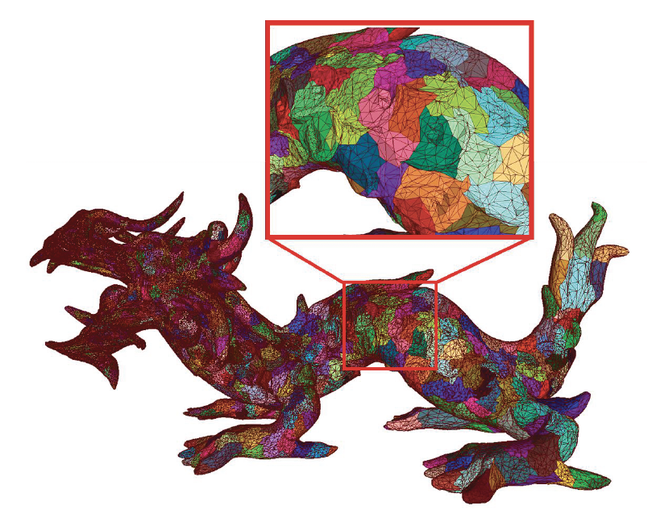{ align=right width=30% }

- 几何渲染管线架构（2021）：
    - 渲染原语被划分为
        - 批(batch)：由多个面构成的单个的绘制 API（`drawIndirect` / `drawIndexIndirect`）
        - 面(surf)：基于材质的子网格，由多个簇构成
        - 簇(cluster)：64 个三角形组成的带状结构
    
    - 由于现代 GPU 拥有大量并行的小核，处理这些大小一致的小块计算任务非常高效

另外。传统的顶点和像素着色器管线已逐渐演变为更先进的**可编程网格管线**(programmable mesh pipeline)。

<div style="text-align: center">
    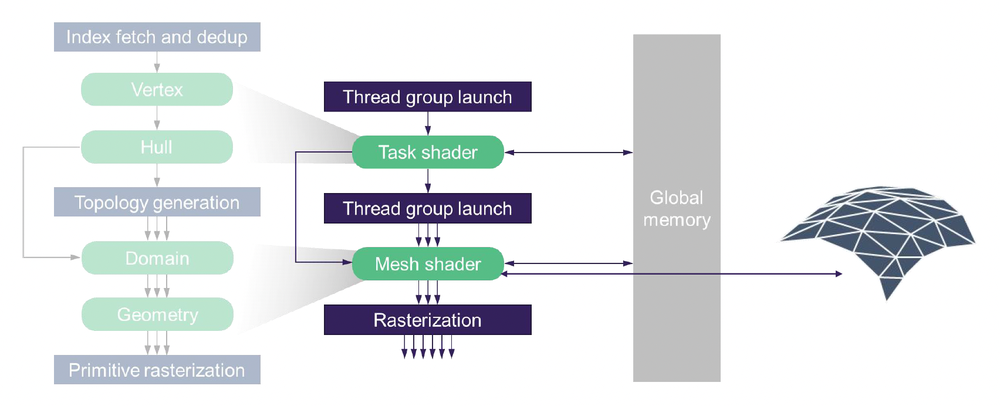
</div>

- 借助**网格着色器**（或放大/任务着色器），显卡不再依赖传统的预构建缓冲区，而是可以基于数据凭空生成几何体，并根据物体离相机的远近动态调整精度
- 这种 GPU 驱动的架构允许在单次绘制调用中处理任意数量的网格

基于簇的管线极大地提升了裁剪效率。

- 传统的裁剪只能以整个物体为单位
- 现在可以实现簇级别的精细裁剪（包括视锥体、遮挡和背面剔除），例如仅裁剪掉物体中不可见的一只手

<div style="text-align: center">
    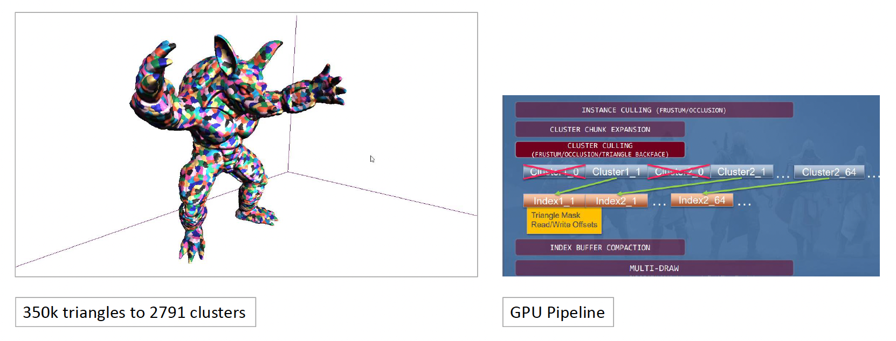
</div>

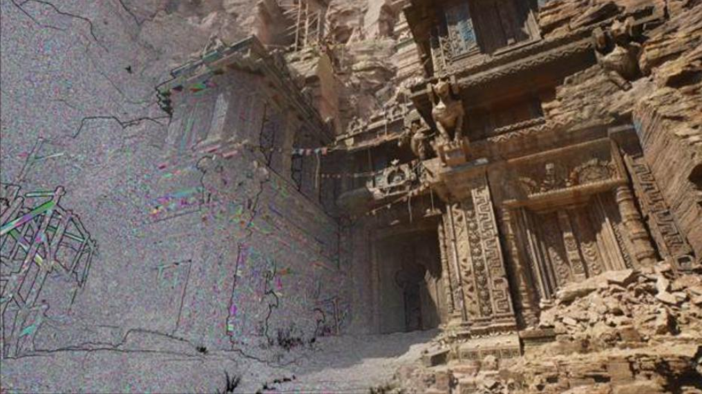{ align=right width=30% }

这一技术的代表是虚幻引擎的 **Nanite**：

- 利用无缝边界的分层 LOD 簇(hierarchical LOD clusters)
- 不需要硬件支持，而是通过 GPU 上的持久线程（CS）在预计算的 BVH 树上使用分层簇剔除，无需任务着色器
- 该技术将这种高密度的几何渲染思想推向了成熟的工业化标准


## Lighting, Materials and Shaders

!!! warning "高能预警"

    本节将涉及到不少复杂深奥的渲染技术。笔者在撰写本笔记时只学了 GAMES101，还没开始学 GAMES202，所以有些技术可能理解得不是很透彻，甚至有些可能还没搞明白。因此可能会出现更多的错误和纰漏，如有读者发现并指出，笔者将不胜感激 orz

在图形渲染中，光照、材质和着色器是最核心的三个要素：

- **光照**提供了场景中的能量来源，从微观角度看就是光子的发射、反射、吸收，最终进入人眼形成图像
- **材质**决定了物体如何与光相互作用：当光照射到物体表面时，可能被反射回来，或被部分吸收，或在物体内部散射，这些过程共同决定了我们看到的物体外观
- **着色器**(shader)指运行在图形处理器上的小程序，用于模拟光与材质作用的复杂计算，将理论模型转化为逼真的实时画面

现代光照理论以**渲染方程**(render equation)为基础，这一方程为 James Kajiya 在 1986 年的论文中首次提出。

$$
L_o(\bm{x}, \omega_o) = L_e(\bm{x}, \omega_o) + \int_{H^2} f_r(\bm{x}, \omega_o, \omega_i) L_i(\bm{x}, \omega_i) \cos \theta_i d\omega_i
$$

- 简单来说，该方程描述了从物体表面某点沿特定方向**射出的辐射度**(ongoing/observed radiance)等于两个部分之和：
    - 该点自身的发光（自发辐射项(emitted radiance)）
    - 来自所有入射(incoming)方向的光在该点经散射后朝观察方向反射的贡献

{ align=right width=30% }

- 方程形式上是一个关于方向和位置的六维积分，遍历半球空间上所有可能的入射光方向，并通过物体的材质属性函数对每一方向的入射辐射进行加权累加
- 这里涉及两个重要物理量：
    - **辐射度**(radiance)：物体表面向外辐射（反射）出的能量
    - **辐照度**(irradiance)：入射到表面上的能量

<br>

- 渲染方程中的散射函数通常用 **BRDF**（Bidirectional Reflectance Distribution Function，**双向反射分布函数**）表示，它描述了光从入射方向转化为出射方向时能量变化的比例，是材质最关键的特性函数
    - 通过 BRDF，渲染方程将入射辐照度与出射辐射度联系起来，严格地刻画了光与材质交互的物理过程

- 渲染方程在理论上完备地描述了光照成像过程，但直接求解它非常困难，尤其是**在实时渲染中几乎不可行**
    - 原因在于现实世界的光照过于复杂，方程求解涉及的计算量极其庞大

        <div style="text-align: center">
            
        </div>

下面我们总结渲染方程在实践中遇到的主要挑战，并为后续讨论游戏引擎中的近似方案做好铺垫。

- **光线可见性**与**光源复杂性**：
    - 光线的可见性(visibility to lights)：确定场景中每一点从各个光源方向是否有光照射到的问题，即**阴影**(shadow)计算
        - 别看阴影只是“光被挡住”的简单现象，要在计算机中准确、高效地生成动态阴影却非常困难，需要处理大量特殊情况和优化
        - 然而阴影又至关重要：如果场景中没有正确的阴影，人眼对空间深度和物体关系的判断就会混乱，画面显得不真实
    
        <div style="text-align: center">
            
        </div>

    - 光源的复杂性(light source complexity)：
        - 现实中光源形态多样：
            - 方向光：如太阳光，可近似为平行光线
            - 点光源：如灯泡，向四面八方均匀发光
            - 聚光灯：有特定方向锥角的光束
            - 面光源：（如发光的面板）会产生软阴影和角度相关的亮度变化，极大增加了计算复杂度
        
        - 要高效地模拟不同类型光源对场景的照明，这本身就是一项巨大挑战

        <div style="text-align: center">
            
        </div>

- **计算光照积分的高成本**：
    - 根据渲染方程，要计算物体表面上一点的明亮程度，必须将半球范围内所有入射光的贡献积分求和，这意味着对无数方向的光进行采样和累加
    - 精确的积分往往无法找到解析解，只能**通过大量采样近似**
    - 如果逐像素在渲染时用数值积分（如**蒙特卡罗随机采样**）计算光照，开销巨大，实时应用根本无法接受
    - 因此如何在不损失太多精度的前提下，以近似方法加速光照积分，是渲染中的另一个重大难题

- **全局光照的递归性**：
    - 光线在场景中往往会发生多次弹跳，也就是说一个物体反射的光线又可以照亮其他物体，这些**间接光照**(indirect illumination)对真实感有着重要贡献
    - 然而，这使渲染方程具有**递归**(recursive)性质：求解某处的光照需要考虑来自其他物体的间接光，而那些物体的光照又取决于更多物体，如此循环，因此引入**全局光照**(global illumination, GI)（直接光照 + 间接光照）后会令计算复杂度呈指数级提升
    - 直接光照和间接光照的综合才构成了我们在现实中看到的最终亮度，这也是为何简单的局部模型往往显得“不真实”的原因，但要在**实时性**下计算全局光照无疑是难上加难

    <div style="text-align: center">
        
    </div>

以上三大挑战叠加在一起，使得“实时解渲染方程”成为一项几乎不可能完成的任务。游戏引擎的渲染系统正是围绕如何高效近似解决这些难题而发展演进的。接下来，我们将介绍早期游戏引擎是如何在“舍弃精确、追求效率”的指导下，采用各种取舍与巧妙技巧来绕开渲染方程的直接求解，从而实时生成令人满意的画面的。


### Starting from Simple

面对渲染方程带来的计算挑战，早期的游戏引擎并未直接求解复杂的光照积分，而是采用了一套简化的光照模型来近似模拟视觉效果。

{ align=right width=40% }

- **主光源**(main light)：
    - 假设场景中存在一个最主要的光源
    - 例如在户外场景下通常用一个**方向光**模拟太阳光，仅考虑这一束平行光产生的直接照明和阴影
    - 在需要时再辅以少量点光源或聚光灯用于特殊效果，但全局仍以单一主光为中心
    - 通过将绝大多数光照归结为一个方向光，极大简化了光源处理的复杂度

<br>

- **环境光**(ambient light)：
    - 模拟来自各个方向的**间接光照**
    - 通常被实现为一个**常量**，它为场景所有物体提供一个均匀的基础照明
    - 可以把环境光理解为“天光”或半球漫射光的平均值，用一个固定亮度来近似来自周围环境的漫反射光照
    - 早期的**图形 API 直接支持**环境光：只需设定一个 RGB 强度，未被直接光照到的区域都会被照亮到该平均亮度
    - 尽管这么做会令阴影区域看起来不够真实，但至少保证了游戏场景不会出现完全漆黑的角落

{ align=right width=30% }

- **环境映射**(environment mapping)：
    - 增强物体表面的**反射**(reflection)质感
    - 具体而言，就是预先捕获或制作一张反映场景周围环境的全景图（**环境贴图**(environment map)），然后在渲染物体时，根据视角从这张贴图上采样颜色来模拟镜面反射
    - 对于理想的**光滑表面**，这相当于能看到周围环境的清晰倒影；而对于**粗糙表面**，则对环境贴图进行模糊处理来获得散漫的高光
    - 一种常用技巧是利用环境贴图的各级 **mipmap**（各层递减分辨率的纹理）来表示不同的粗糙度级别：粗糙度越高则取样更低分辨率（更模糊）的环境贴图，从而模拟更模糊的反射高光
    - 环境映射在上世纪末就已有探索，可视作早期的[**基于图像的光照**](#image-based-lighting-ibl)(image-based lighting, **IBL**)的雏形

通过上述组合，游戏引擎在相当长一段时间内成功绘制出了令人接受的光照效果。

此外，为了解决光线可见性问题，还引入了**阴影映射**(shadow map)技术来绘制由主光源产生的阴影，这是目前实时渲染中最常用的动态阴影方案：

<div style="text-align: center">
    
</div>

- 在渲染场景之前，先从光源视角渲染场景深度并存储成一张**深度贴图**，即**阴影贴图**(shadow map)
- 然后在实际从相机视角绘制场景时，将每个像素转换到光源坐标系下，与阴影贴图的深度进行比较，以确定该像素是否被其它物体遮挡在阴影中

凭借这些技巧，即使在硬件性能有限的年代，许多游戏已经能够呈现出相当不错的画面效果。如果美术风格得当、调教合理，这种基于经验的光照模型往往足以支撑令人愉悦的游戏体验。

当然，上述方案是一种大刀阔斧的近似，其产生的图形质量与真实物理还是存在差距。其中最突出的不足在于缺乏真实的全局光照效果——环境光只是给阴影区域加上一层均匀的亮度，无法表现光线在空间中反弹所带来的光影渐变和颜色泛光。

<div style="text-align: center">
    
</div>

为此，随着硬件的发展和算法的进步，游戏引擎开始探索在实时渲染中引入更加真实的全局光照模拟方法。


### Pre-computed Global Illumination

??? info "First Wave of AAA Quality"

    图片所示的游戏均为《刺客信条》(*Assassin's Creed*)系列，且“xx 年前”以 2022 年（GAMES104 开课时间）为锚点。

    === "15 年前"

        <div style="text-align: center">
            
        </div>

    === "10 年前"

        <div style="text-align: center">
            
        </div>

    === "5 年前"

        <div style="text-align: center">
            
        </div>

在现实世界中，**全局光照**现象对人类视觉影响深远。例如，在房间内没有灯光，且阳光透过窗户射入时，靠近窗口的地板被直射光强烈照亮，而房间深处即使没有直射光，也并非全黑，因为地板和墙壁会把部分阳光反射到阴影区域，形成柔和的漫射光照。这种间接光赋予场景更丰富的明暗层次和氛围。

<div style="text-align: center">
    
</div>

在早年，游戏会采用环境光，把阴影区域整体抬亮，但这样一刀切的做法会让房间亮度到处一样，缺乏立体感。真正的全局光照，应该能表现出地板、墙面之间的明暗渐变、物体之间的软阴影、以及颜色在物体之间“串色”的效果。也正因为如此，全局光照对 3A 游戏的真实感非常关键，很多玩家买游戏时都会看一句“是否支持 GI”。

在前面的介绍中，我们已经认识到全局光照的实现难点。为了解决“算不动”的问题，一种典型的解决思路是“**用空间换时间**”：既然实时算太贵，那就干脆预先算好，把结果存到内存或纹理里，运行时查表即可。

具体做法是：假设场景中绝大部分东西都是**静态**的，比如 90% 的场景几何不动，太阳的方向和强度在每个关卡中也固定下来，那么光线在这些静态几何之间的弹跳结果其实可以离线算一遍。我们把这个过程称为**预计算全局光照**(pre-computed GI)。

- 预计算阶段可以用慢而精的算法（比如大量光线追踪）反复迭代，把各处的间接光照分布算到比较精确
- 而在游戏运行时，只需要对每个点查一次预计算结果，再配上实时的直接光照，就能得到比较真实的光照效果


#### Spherical Harmonics

那么间接光照到底以什么形式存下来？

- 如果直接把球面上每个方向的亮度都采样成一张完整的环境贴图，那么数据量会非常大，而且之后要和材质的 BRDF 做积分，也就是在这个球面上做复杂的数值积分，非常难搞
- 所以要满足两个目标：
    - **好的压缩率**
        - 一个关卡里可能要存储成千上万个辐射度探针(radiance probe)
    
    - **容易和材质函数做积分**，也就是能方便地和 BRDF 做卷积
        - 回顾了傅里叶变换和卷积定理：
            - 在空间域里两个函数的卷积，在频域里可以转化为对应系数的逐项相乘
            - 对应到光照上，就是环境光照分布和材质 BRDF在球面上的卷积，可以尝试先把它们展开到某个“球面上的傅里叶基”下，然后在系数空间里做简单的乘加运算，而不必在球面上做复杂积分

            <div style="text-align: center">
                
            </div>

这就引出了**球谐函数**的概念(spherical harmonics, **SH**)。

- 球谐函数是一组定义在球面上的正交基函数体系，数学上类比于球面上的傅里叶基
- 一个复杂的球面积分，可以用低阶的球谐多项式来近似，这就意味着我们可以用少量的 SH 系数来逼近某个点周围的入射光分布

    <div style="text-align: center">
        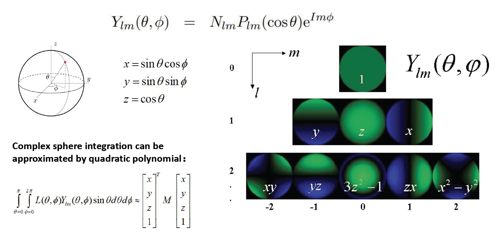
    </div>

    <div style="text-align: center">
        
    </div>

- 在实现上，如果我们只关心**低频的漫反射间接光**，一般用**一阶或二阶的 SH** 就已经足够

    <div style="text-align: center">
        
    </div>

- 比如一阶 SH 只有 4 个基函数，我们可以把这 4 个系数打包到一个 **RGBA** 向量里；考虑到有 R、G、B 三个颜色通道，一个点的间接光总共只需要 12 个浮点参数就能表示
- 这些系数还能继续通过 GPU 纹理压缩格式（课上提到例如 BC6H、BC7 等）再压一遍，使得每个点的间接光数据最终只占用非常少的位数

    <div style="text-align: center">
        
    </div>

- 用 SH 来编码间接光有两个直接好处：
    - 压缩率高：相比整张环境贴图，只存几组系数节省了大量内存
    - 便于做积分：因为材质的 BRDF 也可以在球面上展开成多项式，求光照积分时就变成系数之间的若干次乘加，大幅减少了运行时的计算量


#### Lightmap

最经典的预计算 GI 方案是基于 **lightmap** 的全局光照。整体流程可以概括为几个阶段：

1. 把场景表面参数化成 2D UV 图(2D UV altas)
    - 这一步就是把复杂的三维几何“拍扁”到一张或几张二维纹理上，类似于做展开 UV 的过程
    - 为减少成本
        - 使用低模几何来参与光照计算，而不是用最终的高精度模型
        - 尽量减少 UV 岛的数量，保证 lightmap 上的每个纹素(texel)在世界空间下覆盖的面积尽可能均匀，这样不会产生某些地方纹素极密、某些地方极稀的问题
    
    - 下图展示了把每个纹素画成小格子再反投影回场景的效果：理想情况下，这些小格子在三维空间中的分布大小大致一致，说明 lightmap 密度比较均匀

        <div style="text-align: center">
            
        </div>

2. 离线计算每个纹素的间接光照，并压缩为 SH 系数
    - 在 UV 展开的基础上，离线的 lighting farm 会对每个纹素对应的表面点做全局光照计算，求出那里的间接辐照度
    - 由于这一步是完全离线的，可以考虑多次弹跳、复杂遮挡和颜色串色等效果
    - 然后将这些间接光分布投影到 SH 基上，只保存对应的 SH 系数

    <div style="text-align: center">
        
    </div>

3. 从 proxy 几何投射回最终几何，并叠加高频细节
    - 运行时或关卡构建阶段，引擎会把 lightmap 投射到各个 LOD 的最终模型上，这样不同精度的网格都能复用同一套 GI 数据
    - 同时，还会在屏幕空间上叠加一个 HBAO（基于水平直方图的环境光遮蔽）之类的算法，为近距离区域增加高频的暗角和遮挡细节

    <div style="text-align: center">
        
    </div>

4. 与实时直射光和材质一起组合成最终画面
    - 烘焙的 lightmap 只负责间接光照部分；场景中主光源的**直接光**则还是**实时**计算的，例如方向光、点光源的直射光和阴影

        <div style="text-align: center">
            
        </div>

    - 再经过**材质**（PBR 或其他模型）着色，将 lightmap 中的间接光与材质的反射率等属性综合起来，就得到了最终的帧

        <div style="text-align: center">
            
        </div>

???+ recommend "优点"

    - **运行时极其高效**：因为所有复杂的 GI 计算都已经离线完成，游戏过程中只需要贴图采样和少量运算，对 GPU 来说非常容易
    - 可以烘出很**精细的 GI 细节**：离线阶段可以用高质量算法、密集采样，所以可以把环境中很多微妙的明暗变化都烘出来

???+ bug "缺点"

    - 预计算**非常慢、非常贵**：
        - 需要搭建 lightmap farm，进行长时间的离线计算

    - **只能处理静态**几何和静态光源：
        - 一旦场景里的物体位置或光源位置发生较大变化，之前烘出来的 lightmap 就失效了，需要重新烘焙
        - 虽然可以用一些 hack 的办法让动态角色从周围采样一点 lightmap 颜色来“猜测”光照，但这种做法常常会带来奇怪的 bug，比如角色刚好走到某个 dark 区域时全身突然变黑

    - **存储压力大**：把整个关卡参数化成大 lightmap atlas，分辨率一高，纹理总大小就可能达到几十兆甚至上百兆，对包体和显存都是不小的负担


#### Light Probes

**光照探针**(light probe)的思路很直接：

- 既然把所有表面展开成 2D atlas 太麻烦，那就干脆在 3D 空间里直接撒一堆采样点，每个点就是一个**光照探针**，每个探针记录该点周围的光场（还是用 SH 来压缩）
- 任何一个动态物体或角色，在移动时就根据自己所在位置附近的几个探针做**插值**，算出当前的间接光照
- 为了做插值，通常会把这些采样点在空间中组成一些**四面体**，对每个像素找到自己处于哪个四面体中，再按顶点的 SH 系数插值，这样间接光在空间上是连续变化的

<div style="text-align: center">
    
</div>

一个实际问题是：谁来在游戏场景中摆放这些光照探针？

- 早期比较“粗暴”的做法是：给艺术家一个工具，让他们**手动**在场景里点探针的位置
    - 刚开始艺术家可能觉得还不错，但随着关卡不断调整、路线不断修改，每次改布局都要重新挪 探针，很容易出错，而且效率极低

- 所以现在更推荐用**自动化算法**生成探针点：根据空间几何和玩家可能活动的区域，均匀撒点，再进行一些优化，让探针分布既覆盖关键路径，又不过度密集
    - 如果要做工业级应用，最好写一套自动生成探针的算法，不要把这个苦活交给艺术家。

<div style="text-align: center">
    
</div>

值得一提的是，光照探针的一个优点是可以在**运行时更新**：如果场景发生了一些变化，比如角色移动到一个新的区域，或者场景里某些动态事件改变了环境光，有些系统可以在运行时“软更新” 探针的数据。这意味着它比纯静态的 lightmap 更有弹性，**适合那些需要一定环境变化的游戏场景**。


#### Reflection Probes

从数据表达上看，光照探针主要用于漫反射 GI，也就是说它主要考虑的是**低频**信息。但游戏里还有很多像车身、玻璃、金属这样的材质，需要用更**高频**的信息表达。为此，我们引入了另一种探针，即**反射探针**(reflection probe)。它的特征是数量相对较少，但每个都存一张比较高分辨率的环境贴图（一般是立方体纹理），专门用于做镜面反射。

<div style="text-align: center">
    
</div>

通常这两类探针会分开采样、分开存储：

- 前者密度高、精度低，主要贡献漫反射 GI
- 后者密度低、精度高，负责高频的镜面反射

把这两者结合起来，就能在相对合理的成本下，让静态环境和动态物体都拥有不错的全局光照感。

???+ recommend "优点"

    - **运行时**同样非常**高效**：和 lightmap 一样，主要工作在离线完成，游戏里只是采样和插值
    - 可以同时应用到**静态和动态**物体：因为探针是分布在空间中的，动态物体只需要根据当前位置在相邻探针间进行插值，就可以获得合理的间接光照，无需为每个动态物体单独烘焙
    - 同时支持**漫反射和镜面反射**：光照探针提供漫反射 GI，反射探针提供镜面反射

???+ bug "缺点"

    - 仍然需要一些预计算：布满整个世界的一大堆 SH 光照探针，需要离线阶段去采样和编码，虽然比 lightmap 要少很多数据，但预计算和资源管理的工作仍然不轻
    - 无法表现细节丰富的 GI：因为探针数量有限、采样相对稀疏，相比于 lightmap 那种在几百万个纹素进行的密集采样，它在软阴影、物体接触处的暗部、以及非常细腻的颜色串色等方面难以达到同样的精度；采样率差了一个数量级，效果肯定也差一些


### Materials

#### Bling-Phong Materials

有了光源和光照模型，下一步就是考虑**材质**如何响应光照。材质的作用由 BRDF 决定，简单理解就是表面把入射的光以怎样的角度和强度反射出去。在前面的简化光照方案中，游戏引擎普遍采用 **Blinn-Phong 着色模型**作为材质的光照计算方法。Phong 模型是一种经验模型，它假定光照分为三部分：

- 环境光(ambient)
- 漫反射(diffuse)
- 镜面高光(specular)

<div style="text-align: center">
    
</div>

Blinn-Phong 是 Phong 模型的改进版本，其高光计算使用**半程向量**（视线与光线方向的中间向量）提高了效率，但总体思想一致。由于**实现简单且运行效率高**，Blinn-Phong 模型在很长一段时间内都是实时渲染领域的主流方案。

然而，随着玩家们对游戏画面真实感的要求的不断提高，Blinn-Phong 模型的局限性也日益凸显：

- **不遵循物理能量守恒原则**(not energy conservative)：在某些参数组合下，表面反射出的光通量甚至可能超过入射光通量，这是物理上不合理的，也会导致画面偏亮失真
- 在光线追踪等更精确的渲染中**收敛不稳定**：因为非物理性的着色函数会引入噪声和伪影，使得高级渲染算法难以得到正确结果
- 难以模拟复杂材质的**细节**特征：现实中的材质种类繁多，例如各向异性材料、金属和非金属在反光性质上的差异，以及次表面散射等高级效果，都无法靠 Phong 模型有限的参数来逼真呈现

<div style="text-align: center">
    
</div>


#### Physical-Based Materials

为了解决上述问题，**基于物理的渲染**(physical-based rendering, **PBR**)的理念应运而生。

- PBR 的核心思想是以**物理定律**为指导来建模材质的光照响应，确保渲染结果在能量和视觉上都尽可能接近真实世界
- PBR 引入了更完善的表面反射模型，其中最重要的就是**微表面理论**(microfacet theory)
    - 微表面模型认为，现实中的粗糙表面可以视作由无数微小的镜面（微凸体）组成
    - 即便肉眼看起来漫反射的**粗糙材质**，在微观尺度下也由**很多朝向各异的微观平面**构成
    - 光照到达表面后，会在这些微观平面上发生**镜面反射**，但由于每个平面的朝向不同，宏观上汇聚起来就形成了散射的反射效果
    
    <div style="text-align: center">
        
    </div>

- 模型中的 $D$ 指代**法线分布函数**(normal distribution function, **NDF**)
    - NDF 给出了表面微法线朝向的概率分布
        - **粗糙**度高的表面其微法线分布范围广，意味着从宏观上看高光范围更大但强度更低
        - **光滑**表面微法线集中在一个方向，高光集中而强烈
    
        <div style="text-align: center">
            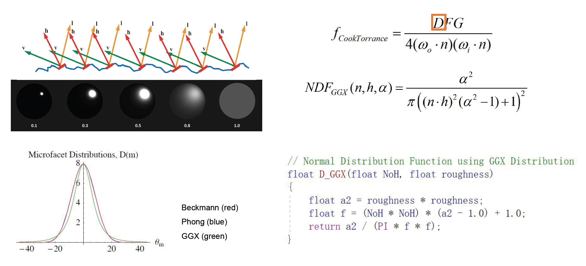
        </div>

    - 常用的 NDF 有 Blinn-Phong 分布、Beckmann 分布、GGX 分布等，其中 **GGX 分布**是近年来游戏领域偏爱的选择，它相比 Phong 分布可以更好地模拟粗糙表面高光的“拖尾”现象，让材质看起来更加真实
        - 可以类比音箱的挑选（高音脆，低音沉），GGX 的过渡相比 Phong 更加柔和

- 模型中的 $G$ 指代**几何遮蔽**(geometry attenuation)项
    - 当观察角度或入射角度发生变化时，**微表面之间会发生自我遮挡和阴影**
    - 当从一个很小的角度斜看表面时，实际上能“看到”的亮面变少了，因为许多微凸体彼此遮挡了对方的反射
    - 几何项通过对微表面遮挡效应建模，在高角度（掠射）观察时适当降低反射强度，以符合真实现象
    - 常用的几何项模型如 **Smith 算法**等，会根据粗糙度计算不同视角下可参与反射的有效微表面比例，从而修正 NDF 得到的理想反射强度

    <div style="text-align: center">
        
    </div>

- 模型中的 $F$ 指代**菲涅耳效应**(Fresnel equation)
    - 它描述了**材料对不同入射角光线的反射率的变化规律**
    - 当光线垂直入射（入射角接近 0 度）时，大部分能量会进入材质内部（非金属会将更多透射变为漫反射），只有一小部分被镜面反射
    - 但当光线以很小的掠射角划过表面时，镜面反射率会大大增加，表面看起来更亮
        - 这就是为什么远处水面、油漆等在接近平行视角观察时会闪亮如镜，而正面对视时反光却没那么强烈

    - 实际应用中常用简单的 **Schlick 近似公式**，根据材质的折射率或金属度计算出不同角度下的反射率插值曲线，实现高效的实时菲涅耳计算

综合 NDF、几何遮蔽和菲涅耳三部分，再加上一个宏观的漫反射项（如**朗伯模型**用于非金属的漫反射），就构成了现代 PBR 着色模型，如下所示。这种模型天然满足能量守恒，能稳定用于高级渲染算法，并且具有明确的物理意义。

<div style="text-align: center">
    
</div>

???+ example "例子"

    <div style="text-align: center">
        
    </div>

---
PBR 参数的设计可遵循 Brent Burley 提出的原则：

- 应该使用直观参数而不是物理参数
- 参数量应尽可能少
- 参数的合理范围为 0-1 之间
- 参数应允许在合理范围内被推至其可能的范围之外
- 所有参数的组合应尽可能鲁棒与合理

在实际使用 PBR 时，游戏引擎倾向于**提供直观且有限的参数集**来由艺术家调整材质外观。下面是 Disney 原则下的材质参数：

<div style="text-align: center">
    
</div>

在当下游戏行业最主流、最规范的实时 PBR 模型主要为两类：

- **镜面光泽度**(specular-glossiness, **SG**)
    - 它的一个特点是几乎不需要额外的标量参数，所有关键属性都用贴图来表达
    - 最迷人的地方在于它的表达力：比如艺术家可以通过镜面贴图对参数做非常细腻的控制，甚至支持彩色的金属高光，比如金色、铜色等，这些都可以通过镜面的 RGB 通道来体现
    - 不过，高度灵活也带来了问题：参数太容易被设错
        - 从工程管理的角度看，在一个几十上百人规模的美术团队里，让所有人都正确理解和使用规定的参数，实际上很难做到

    <div style="text-align: center">
        
    </div>

    <div style="text-align: center">
        
    </div>


- **金属粗糙度**(metallic-roughness, **MR**)
    - 相比 SG 更“土”，但更好用
    - 参数非常简单且直观：
        - `base_color`（RGB，sRGB）：漫反射颜色
        - `roughness`（灰度，线性）：为 0 时表示理想光滑镜面，高光集中而锐利；增大时高光变宽变暗，细节被拉平
        - `metallic`（灰度，线性）：在非金属和金属之间插值
    
    - 但底层仍然是同样强大的通用函数
    - 这种把复杂逻辑包在 MR 外壳里的设计，直接提高了系统的可控性和鲁棒性，因此在实际项目里，越来越多的工作室倾向于使用 这一工作流

    <div style="text-align: center">
        
    </div>

MR 转换到 SG：

<div style="text-align: center">
    
</div>

???+ abstract "MR vs SG"

    - MR
        - 优点
            - 可以更容易地编写，且更不容易因提供错误的介电 F0 数据而产生错误
            - 使用更少的纹理内存，因为金属和粗糙度都是灰度图

        - 缺点
            - 在地图创建过程中无法控制介电 F0。然而，大多数实现都有一个用于覆盖基本 4% 值的镜面反射控制
            - 边缘伪影更明显，尤其是在较低分辨率时

    - SG
        - 优点
            - 边缘伪影不太明显
            - 可以控制镜面反射图中的介电 F0
        
        - 缺点
            - 由于镜面反射图提供了对介电 F0 的控制，因此更容易因使用错误值而受到影响；如果在不正确的着色器中处理，可能会破坏守恒定律
            - 使用额外的 RGB 图，因此需要更多的纹理内存

    <div style="text-align: center">
        
    </div>


### Image-Based Lighting (IBL)

{ align=right width=20% }

在前面讲 PBR 的时候，我们一直假设“光源”是方向光、点光、聚光灯之类的简单模型。但现实世界中的环境光往往来自四面八方，很难用几个理想化光源描述。**基于图像的光照**(image-based lighting, IBL)的核心做法就是：

- 用一张包住场景的**图像**来表示来自各个方向的远处光照，把整个环境本身当作一个巨大的光源
- 这张图片通常以**立方体贴图**(cube map)的形式存在

如果严格按照渲染方程来做，在这种环境光下给一个表面着色，需要对半球上所有入射方向进行积分。最朴素的做法是直接用**蒙特卡罗采样**在环境上打很多随机光线做数值积分。但这么做采样量很大，非常慢，不适合实时渲染。我们希望在不牺牲太多质量的前提下，把环境光积分拆成若干可以预计算、查表解决的小问题。


#### Diffuse Irradiance Map

我们可以从**漫反射**部分入手，因为漫反射的 BRDF 相对简单，可以看成一个随方向变化很平缓、近似与 cosθ 权重相关的函数。具体做法是如下：

- 先在离线或加载时对环境贴图做一次漫反射卷积，也就是说对于环境中的每一个方向 n，都以 n 为法线，把整个环境亮度乘上 cosθ 核心权重，在半球上做一次积分，得到“从这个方向看过去，漫反射地接收了多少环境光”的结果
- 把所有方向算完，就得到了一张新的贴图，它比原始环境图模糊很多，但可以代表已卷积好的漫反射入射辐照度；这张图称作**漫反射辐照度贴图**(diffuse irradiance map)
    - 关键在于：这一整套卷积**只做一次**，之后在游戏运行时，如果某个像素的表面法线是 n，我们只需要在漫反射辐照度贴图上按 n 的方向**采样一次**，就能直接拿到该法线方向下的环境漫反射结果
    - 这也是一种「**空间换时间**」的策略：预先做完复杂的卷积运算，把结果存进一张小纹理里，实时渲染时只需要查表，而不用在每个像素上重新做积分

<div style="text-align: center">
    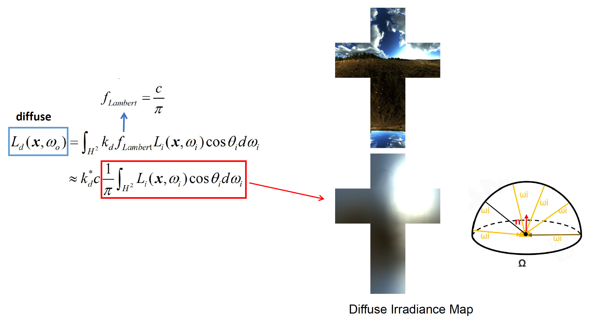
</div>


#### Specular Approximation

相比之下，**镜面**部分的 IBL 要复杂得多。对一个 PBR BRDF 来说，镜面项不仅依赖入射方向，还依赖视线方向、粗糙度、菲涅耳等多个参数，因此直接拿环境贴图做高维卷积几乎不可能实时完成。所以我们采用业界常用的一种近似：**拆分求和近似**(split-sum approximation)。

具体做法是：把这个积分粗略拆成“光照项 × BRDF 项（材质项）”两个部分，分别预计算。

- **光照项**：**预滤波环境贴图**(pre-filtered environment map)
    - 这一部分只和环境本身有关，和具体材质无关
    - 本质上是在沿着某个反射方向，对环境做一次带粗糙度的积分:粗糙度越大，积分核越模糊
    - 一个非常巧妙的工程技巧是**利用 GPU 对立方体贴图提供的多级 mipmap**：
        - 对于每一个粗糙度 $\alpha$，把环境图按对应的模糊核做一次卷积，得到粗糙度 = $\alpha$ 时的环境反射结果，然后把不同粗糙度的结果分别存进立方体贴图的不同 mip 级上
        - 粗糙度越高，结果越低频，就可以放在更低分辨率的 mip 里，这既符合直觉，也符合存储效率

    <div style="text-align: center">
        
    </div>

- **BRDF 项**：查询 BRDF 查找表(look-up table, **LUT**)
    - 依赖粗糙度和视角与法线之间的夹角等参数
    - LUT 本质上是一张二维查找表，纵轴表示粗糙度，横轴表示 cosθ（视角与法线夹角的余弦），表里存的就是 BRDF 在环境光条件下积分后的结果
    - 也就是说复杂的积分被提前算好放进 LUT 中，运行时只需要根据当前材质的粗糙度和视角方向去采样一次这张 LUT，就能得到 BRDF 项的系数

    <div style="text-align: center">
        
    </div>

最后将两者相乘，得到了近似的镜面 IBL 结果。从严格数学上说，这是“不精确的解”，但这在工程上足够好用，是目前工业界广泛采用的一种方案。

<div style="text-align: center">
    
</div>

对于同一个 PBR 材质，

<div style="text-align: center">
    
</div>

- 在关闭 IBL 时看上去只有主光源提供的高光和阴影，整体稍显单调
- 而开启 IBL 后，模型表面立刻“接上了环境”，不仅暗部被环境光填亮，金属和玻璃等高光材质还能清楚反射出周围场景的轮廓


### Classic Shadow Solution

{ align=right width=30% }

正如前文提到，**阴影**是光照中不可或缺的一环，本质上是光被物体阻挡后在其后方形成的光照缺失区域。早期的 CG 中，曾采用过一些相对简单的阴影生成方法：

- 平面阴影(planar)：将物体几何投影到一个平面上形成阴影映像
- 阴影体积(shadow volume)：将物体轮廓向光线方向拉伸形成体积，用于判断场景中哪些区域被该体积遮挡从而处于阴影中
- 投影纹理(projective texture)：将预先准备好的阴影贴图投射到场景中模拟阴影

这些方法在特定情形下能产生阴影效果，但局限性也很明显。因此随着更通用的方法出现，上述传统阴影技术已基本被**淘汰**。

目前实时图形中应用最广泛的动态阴影方案是前文简述过的[**阴影映射**](#starting-from-simple)。然而，阴影映射也有自己的问题。为改进阴影映射的质量，常用的方案包括级联和过滤两个方向。


#### Cascade Shadow

**级联阴影映射**(cascade shadow maps)解决了单张阴影贴图难以同时兼顾近景和远景的问题。

- 在广阔场景中，摄像机**视锥体**(frustum)范围可能横跨几十上百米，固定分辨率的阴影贴图要么覆盖远处大片区域导致近处精度不足，要么照顾近处细节而远方阴影模糊不清
- 级联阴影映射的做法是将视锥按距离**划分为多个子视锥体**（一般 2 到 4 级），为每个区段分别生成一张针对该范围的独立阴影贴图
    - 最近的子视锥体覆盖玩家周围小范围区域，但采用高分辨率阴影贴图，因此近景阴影非常清晰
    - 越远的子视锥体范围越大，则使用相对低分辨率的阴影贴图，以节省开销

    <div style="text-align: center">
        
    </div>

- 在渲染时，系统根据像素深度判断其属于哪一级阴影贴图区域，并使用对应的贴图进行阴影计算
- 级联阴影的实现步骤：

<div style="text-align: center">
    
</div>

- 由于不同级联贴图的分辨率不同，交界处可能出现阴影不连续的边界线(seam)，为此引擎通常在相邻两个级联区的交接处对阴影结果做**混合**(blend)；着色器随后根据像素在混合带中的位置，在两个值之间进行线性插值，从容实现平滑过渡
    
    <div style="text-align: center">
        
    </div>

???+ recommend "优点"

    - 遮挡错误最普遍的方法：透视走样
    - 生成深度图速度快，仅深度写入时提升 3 倍
    - 提供相当好的结果

???+ bug "缺点"

    - 几乎无法生成高质量的区域阴影
    - 没有彩色阴影；半透明表面投射不透明阴影


#### Soft Shadow

硬阴影 vs 现实阴影：

<div style="text-align: center">
    
</div>


**过滤**指对阴影贴图采样结果做模糊处理，以柔化阴影边缘的锯齿。实现方式有：

- **百分比接近过滤**(percentage closer filtering, **PCF**)：
    - 要解决的问题：来自阴影映射的阴影走样严重
    - 从当前像素周围的阴影图中取样，并将其深度与所有样本进行比较
    - 通过平均结果，我们得到光与影之间更平滑的线条

    <div style="text-align: center">
        
    </div>

{ align=right width=20% }

- **百分比接近软阴影**(percentage closer soft shadows, PCSS)
    - 要解决的问题：走样 + 采样不足的问题
    - 搜索阴影图并平均与光源更接近的深度
    - 使用平行平面近似

- 方差软阴影映射(variance soft shadow map)
    - 要解决的问题：实时渲染合理的软阴影
    - 基于切比雪夫不等式，利用深度的平均值和方差，我们可以直接近似深度分布的百分比，而不是将单个深度与特定区域（PCSS）进行比较
  
    <div style="text-align: center">
        
    </div>


### Moving Wave of High Quality

{ align=right width=30% }

最近这些年，GPU 的发展态势迅猛。于是我们有了

- 更灵活的新**着色器**模型
    - 计算着色器
    - 网格着色器
    - 光线追踪着色器

- **高性能的并行架构**：束(warp)或波(wave)架构

- 完全开放的图形 API：DirectX 12、Vulkan 等等

GPU 上的实时光线追踪：

<div style="text-align: center">
    
</div>

实时全局光照：

<div style="text-align: center">
    
</div>

更复杂的材质模型：

<div style="text-align: center">
    
</div>

虚拟阴影映射(virtual shadow map)：

<div style="text-align: center">
    
</div>


### Shader Management

随着游戏规模和复杂度的增长，工程中涉及的着色器数量也呈爆炸式上涨。一个大型 3D 场景可能由成千上万个物体组成，不同物体可能使用不同的材质和光照模式，于是就需要众多不同的着色器来绘制。

<div style="text-align: center">
    
</div>

着色器的来源有两个。首先是艺术家们会创造无穷多的着色器，因为他们的想象力是无穷的。

<div style="text-align: center">
    
</div>

其次是来自程序员自己。由于一款游戏的限定条件非常多，比如材质、光源的不同组合就要求用到不同的着色器。为了避免创建大量的着色器，业内采用了一种叫做**超级着色器**(uber shader)的设计模式，它是一个包含所有可能的光照类型、渲染通道和材质类型的着色器组合。

- 共享很多状态和代码
- 通过预定义宏编译为多种变化的小着色器

<div style="text-align: center">
    
</div>

现实游戏中的着色器变体数量非常庞大：

<div style="text-align: center">
    
</div>

跨平台的着色器编译：

<div style="text-align: center">
    
</div>


## Rendering the Nature

???+ example "游戏中的自然环境（来自《荒野大镖客》）"

    <div style="text-align: center">
        
    </div>

{ align=right width=30% }

现实世界的风景具有以下特征：

- 超大的地理空间尺度
- 丰富的地貌
    - 植被
    - 河流
    - 起伏的山峰
    - 雪山
    - ...

因此若仍然采用传统的网格 + 材质来渲染这样的自然景观，那将是一件相当复杂困难的任务！比如对于一个典型的开放世界游戏，里面可能包含数十甚至上百平方公里的可探索区域，因此三角形数量也将膨胀到一个相当恐怖的，是目前 GPU 无法承受的量级。

正如本笔记一开始提到过的，游戏中的环境组件可分为以下几个部分：

<div style="text-align: center">
    
</div>


### Terrain

??? example "例子"

    === "例1：微软飞行模拟器"

        <div style="text-align: center">
            
        </div>

    === "例2：《无人深空》（*No Man's Sky*）"

        <div style="text-align: center">
            
        </div>


#### Heightfield

在 CG 中，一种简单的表示地形的思路是采用**高场**(heightfield)图。从数据结构的角度来看，高度场本质上是一个二维数组或单通道纹理，记作 $H(u, v)$。

- 空间映射：地形在水平面上被划分为规则的网格
- 高度存储：数组中的每个元素（或纹素）存储该网格点对应的垂直高度值

另外，它与**等高线图**(contour map)天然对应，易于从卫星数据（如 Google Earth）中导入。

<div style="text-align: center">
    
</div>

???+ example "效果"

    <div style="text-align: center">
        
    </div>

在渲染阶段，引擎通过顶点纹理拾取或在顶点着色器中采样高场图来重建地形几何：

1. 生成一个平坦的高密度网格平面
2. 在顶点着色器中，根据顶点的 UV 坐标采样高场图
3. 沿法线方向（通常是 Y 轴）对顶点进行位移

<div style="text-align: center">
    
</div>


#### Adaptive Mesh Tessellation

然而，这种朴素的网格生成方式在面对庞大的开放世界时失效了。为了在有限的计算资源下渲染无限的细节，必须引入**多层级细节**(level of detail, LOD)技术。

<div style="text-align: center">
    
</div>

地形的 LOD 不同于离散物体的 LOD，它要求几何体在空间上是**连续的**。我们不能简单地在远处画一个低精度的网格，在近处画一个高精度的网格，因为二者接缝处会出现极其明显的裂缝。

现代引擎采用了**基于视场的自适应网格细分**(adaptive mesh tessellation)。

- **视场**(field of view, FoV)：通过眼睛能够看到的世界的范围，渲染时我们只关心视场内的东西
- 如下图所示，当 FoV 越来越窄时，三角形会切分得越细密，因为我们看到的东西在放大
    - 游戏中的瞄准镜/望远镜效果正是通过缩窄 FoV 实现的

<div style="text-align: center">
    
</div>

因此在设计任何地形 LOD 算法时，都必须遵循两个核心优化准则（基于视角的误差度量(view-dependent error bound)）：

- 相机和 FoV 的距离：距离摄像机越近，网格越密；越远则越疏
- 与真实值比较的误差（**预计算**）：简化后的网格与原始高场的几何误差，投影到屏幕上不得超过特定阈值，保证视觉上的“无损”体验

<div style="text-align: center">
    
</div>


#### Triangle-Based Subdivision

<div style="text-align: center">
    
</div>

这是一种经典的 ~~学院派~~ 算法，其核心思想是利用**二叉树**结构来**递归**管理三角形。

{ align=right width=30% }

- 算法规定，每次细分必须从等腰直角三角形的斜边（**最长边**）中点进行剖分；这一刀切下去，会产生两个新的、面积减半的等腰直角三角形
- 于是，整个地形被组织成一个二叉树森林，每个节点代表一个三角形

在不同 LOD 层级的过渡区域，会出现著名的 **T 型裂缝**(T-junction)问题：假设三角形 A 的斜边未被细分，而其相邻的三角形 B 在对应边上进行了细分，产生了一个新的顶点。由于新顶点会根据高度图发生位移，而三角形 A 的边仍然是一条直线，这就导致在新顶点处出现了几何裂缝。

我们可通过强制分裂来解决——如果一个三角形发现其邻居的细分层级比自己高（即邻居在共享边上有中点），那么该三角形被迫进行一次细分。这种依赖关系会像链式反应一样传播，直到所有相邻边的层级匹配。

<div style="text-align: center">
    
</div>

尽管算法简单，但在 GPU 架构上，这种算法并不高效，因此在游戏行业用的不是很多。

???+ example "例子"

    <div style="text-align: center">
        
    </div>


#### QuadTree-Based Subdivision

**基于四叉树的细分**(quadtree-based subdivision)是目前工业界的主流方案，即利用**四叉树**(quadtree)将地形切分为规则的矩形块(block / patch)。相比前一种方案，这种方法更符合我们的直觉（我们更倾向于把地形划分为豆腐块一样的形状而不是三角形）。

- 根节点代表整个地形
- 每个节点可以分裂为 4 个子节点
- 叶子节点对应实际渲染的最小图块(tile)，通常为 $64 \times 64$ 或 $128 \times 128$ 的网格

<div style="text-align: center">
    
</div>

???+ recommend "优点"

    - 易于构造
    - 方便的数据管理：四叉树的节点不仅管理几何，还天然对应纹理贴图的切片(tile)。这使得几何 LOD 与纹理 LOD 可以协同工作，便于流式加载(data streaming)
    - 视锥剔除(culling)：利用四叉树的包围盒（AABB）进行层次化的视锥剔除，可以快速丢弃不可见的大片区域

???+ bug "缺点"

    - 不如三角形网格灵活
    - 叶子节点的网格级别需要保持一致

???+ example "效果"

    <div style="text-align: center">
        
    </div>

四叉树方案同样面临不同层级块之间的 T-junction 问题。与三角形网格的强制分裂不同，四叉树
方案通常采用**几何缝合**(stitching)技术。

<div style="text-align: center">
    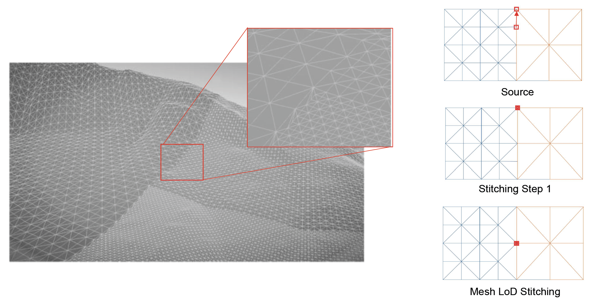
</div>

- 原理：当一个高精度的块（边缘有 N 个顶点）与一个低精度的块（边缘有 N/2 个顶点）相邻时，强制修改高精度块边缘顶点的索引缓冲区(index buffer)。
- 实现：将高精度边缘上多余的顶点，通过索引指向低精度边缘上最近的顶点。这实际上生成了一些退化（面积为零）的三角形
- 现代 GPU 的光栅化单元会高效地剔除面积为零的三角形，因此这种方法既解决了裂缝问题，又保证了网格的水密性(water-tight)，且计算开销极低

???+ example "例子"

    <div style="text-align: center">
        
    </div>


#### Triangulated Irregular Network (TIN)

另一种较为激进的方法是**不规则三角网**(triangulated irregular network, **TIN**)。其核心思想是：放弃规则网格，针对地形特征进行非均匀采样：在平坦区域使用极大的三角形，在陡峭区域使用细碎三角形。

???+ example "例子"

    === "例1"

        <div style="text-align: center">
            
        </div>

    === "例2"

        <div style="text-align: center">
            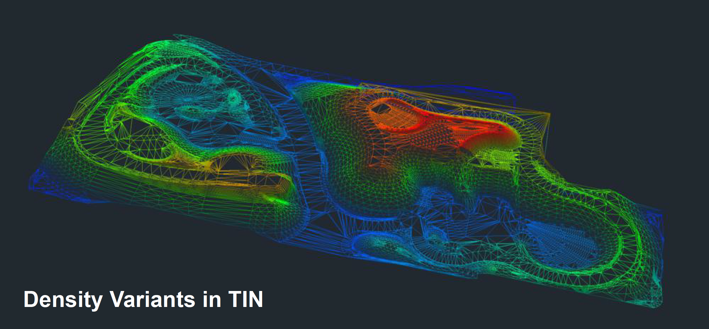
        </div>

- 优点：
    - 易于在运行时渲染
    - 可以在特定地形类型上使用更少的三角形

<div style="text-align: center">
    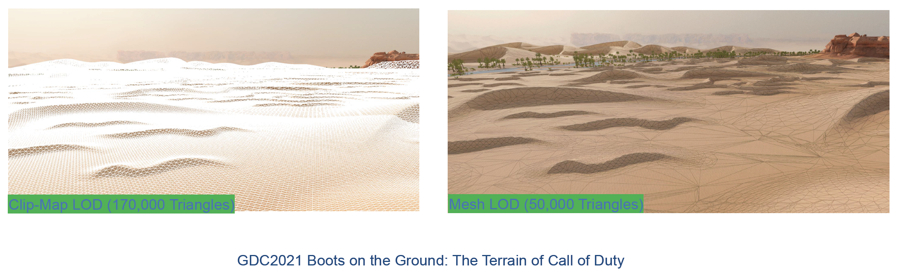
</div>

- 缺点：
    - 需要昂贵的离线预处理，难以支持实时地形变形（如爆炸弹坑）
    - 数据复用性差，不适合通用的开放世界引擎


#### GPU-Based Tessellation

我们还可以利用现代 GPU 的力量，帮助我们更高效地完成地形曲面细分的任务。其中赫赫有名的便是 DX11 的三个阶段：

<div style="text-align: center">
    
</div>

- **外壳着色器**(hull shader)阶段：将基网格的基本函数转换为表面块
- **细分**(tessellation)阶段：为每个块生成半规则化的细分图案
- **域着色器**(domain shader)阶段：一个可编程的着色阶段，计算与每个域样本相对应的顶点位置

<div style="text-align: center">
    
</div>

DX12 引入了**网格着色器**(mesh shader)，包括：

- **放大着色器**(amplification shader)阶段：决定运行多少个网格着色器组，并将数据传递给这些组
- **网格着色器**(mesh shader)阶段：为每个块生成半规则的细分图案，以及包含顶点和原语的输出

<div style="text-align: center">
    
</div>

得益于 GPU 实时细分的能力，我们可以实现**实时可变形的地形**(real-time deformable terrain)。

<div style="text-align: center">
    
</div>

实现机制：

- 将地形表面视为一个动态的模拟网格
- 当发生物理交互（如轮胎碾压）时，更新一张动态高度偏移贴图
- 域着色器在渲染时，叠加基础高度图与动态偏移贴图，实时生成凹陷的几何体

这种方法使得地形不再是静态的背景，而成为可交互的物理实体。

???+ example "例子"

    《黑神话·悟空》中的雪地：

    <div style="text-align: center">
        
    </div>


#### Non-Heightfield Terrain

高度场的最大缺陷在于无法表示函数映射之外的结构，例如悬崖倒角、山洞或拱门。

- 对于传统的山洞需求，业界通常采用「**挖洞 + 模型填充**」的混合方法
    - 在地形材质中增加一个可见性通道
    - 在着色器中，如果检测到某区域被标记为“洞”，则输出 NaN 坐标，或执行丢弃操作，从而让 GPU 剔除该区域的三角形
    - 创建一个带有内部结构的山洞模型（静态网格），精确匹配挖洞的位置，并利用岩石模型遮挡接缝

    <div style="text-align: center">
        
    </div>

- **体表示**(volumetric representation)
    - 在 3D CG 中，**体素**(voxel)代表三维空间中规则网格上的一个值；与 2D 位图中的像素一样，体素本身通常不会将它们的坐标（即位置）与它们的值明确编码在一起

        <div style="text-align: center">
            
        </div>


    - **移动立方体**(marching cubes)算法：
        - 将空间划分为三维网格，每个格点存储密度值
        - 算法遍历每个立方体，根据 8 个顶点的密度状态（在表面内或外），查找预计算的边缘表，生成穿过该立方体的三角面片（14 种）
        - 应用：CT 扫描生成的图片、可视化螺旋桨的速度场、数字人等
    
        <div style="text-align: center">
            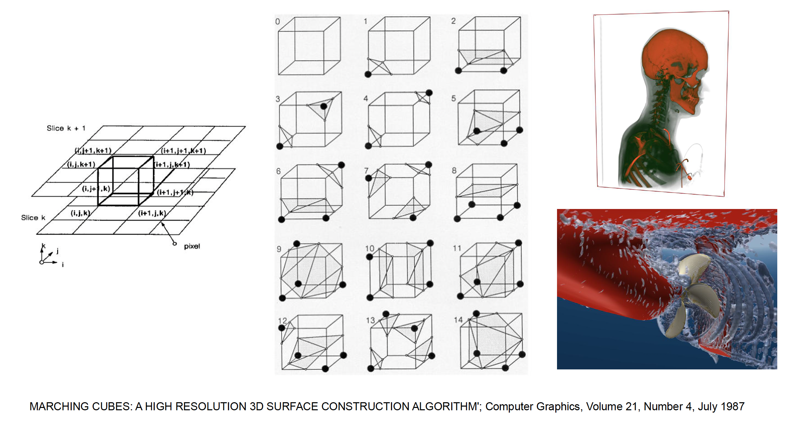
        </div>

    - **Transvoxel** 算法：
        - 它是移动立方体的改进方法，专门解决不同 LOD 体素块之间的裂缝问题
        - 它预计算了复杂的**过渡单元**(transition cells)**查找表**，保证了多分辨率体素地形的水密性
        - 挑战：体素方案的存储和带宽开销巨大，且难以利用传统的 UV 贴图技术，因此在目前在写实风格的 3A 游戏中应用受限

        <div style="text-align: center">
            
        </div>

    - 这类技术适用于像 Minecraft 或《无人深空》这样需要完全自由破坏或生成奇异地貌的游戏


#### Terrain Materials

???+ example "例子"

    在《幽灵行动：荒野》（*Ghost Recon Wildlands*）游戏中，有 11 种生物群落，以及 140 种材质。

    <div style="text-align: center">
        
    </div>

地形材质通常是多种自然材质（草、岩石、泥土、雪）的混合。

<div style="text-align: center">
    
</div>

下面介绍几种材质混合的方法：

- **纹理泼溅**(texture splatting)
    - 泼溅图：使用一张多通道纹理，每个通道存储对应材质的混合权重
    - 简单混合：

        ```cpp
        float3 blend(float4 texturel, float al, float4 texture2, float a2) {
            return texture1.rgb * al + texture2.rgb * a2;
        }
        ```

        <div style="text-align: center">
            
        </div>

        - 缺陷：线性混合会导致不自然的效果，比如上面沙子覆盖鹅卵石的图片中，线性混合会让沙子看起来像半透明的薄纱，缺乏真实感

- **基于高度的混合**(height-based biased blending)
    - 比较各材质在该像素点的高度值，高度高的材质权重更大
    - 代码实现：

        ```cpp
        float3 blend(float4 texture1, float height1, float4 texture2, float height2) {
            return height1 > height2 ? texture1.rgb : texture2.rgb;
        }
        ```

    - 效果：

        <div style="text-align: center">
            
        </div>

- 改进：为了避免非黑即白的硬切边(hard edge)，引入一个偏置参数 `depth`（偏移量）；加上这个扰动后，相比没有加的效果会看起来更自然、更稳定
    - 代码实现：

        ```cpp
        float3 blend(float4 texture1, float height1, float4 texture2, float height2) {
            float depth = 0.2;
            float ma = max(texture1.a + height1, texture2.a + height2) - depth;
            float b1 = max(texture1.a + height1 - ma, 0);
            float b2 = max(texture2.a + height2 - ma, 0);
            return (texture1.rgb * b1 + texture2.rgb * b2) / (b1 + b2);
        }
        ```

    - 效果：

        <div style="text-align: center">
            
        </div>

在真实的游戏中，动辄就会用到几十甚至上百种材质，因此借助现代 GPU 的能力，采用**纹理数组**(texture array)的方法。顾名思义，我们将所有材质纹理打包到一个数组对象中，之后着色器便可通过索引访问。而此时泼溅图存储材质索引和权重，从而在一次 绘制调用中绘制任意复杂的材质组合。

<div style="text-align: center">
    
</div>

两种绘制方法：

<div style="text-align: center">
    
</div>

- **视差贴图**(parallax mapping)
    - 原理：由于表面高低不平，眼睛能看到点 B，但看不到点 A，这产生了一种立体感

        <div style="text-align: center">
            
        </div>

    - 效果：产生更强的立体感
    - 缺点：
        - 每个像素的计算成本高
        - 只是产生了视觉上的凹凸感，但物体的几何边界依然是光滑的

- **位移贴图**(displacement mapping)
    - 利用现代 GPU 的细分(tessellation)能力，把网格变得非常细

>不过目前大部分游戏用的还是**凹凸贴图**(bump mapping)，不过有越来越多的游戏开始尝试使用视差贴图和位移贴图了。

???+ bug "纹理混合的高开销"

    - 纹理多：当多次采样多个材质时性能低
    - 巨大的泼溅图：虽然我们只看到一小部分地形，但要把表示 100 平方公里的区域的泼溅图加载到显存中

    <div style="text-align: center">
        
    </div>


#### Virtual Texture

鉴于上述问题，再加上游戏画质的日益提升，我们亟需一种解决方案——这个方案就是**虚拟纹理**(virtual texture)，它借鉴了操作系统中的虚拟内存的实现思路。

- 构建一个**虚拟索引纹理**，用来表示整个场景的所有混合地形材质
- 仅加载基于视图依赖 LOD 的块(tile)材质数据
- 预烘焙(pre-bake)材质混合成块，并将其存储为物理纹理

<div style="text-align: center">
    
</div>

基于 CPU 的缓存管理是在磁盘、主存和显存三者之间来回传输数据。如果直接用这种方式来管理虚拟纹理，那效率显然是不够高的。

<div style="text-align: center">
    
</div>

因此实际上会采用以下两种虚拟纹理的实现方式：

- **DirectStorage**：

    <div style="text-align: center">
        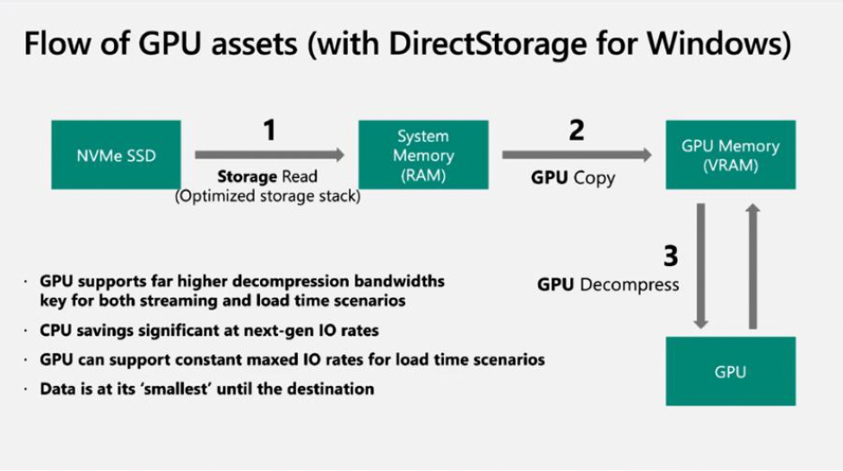
    </div>

    - 内存中不解压大量被压缩过的游戏数据，直接在显卡上解压
    - 好处：传输压缩数据的效率更高，且 GPU 的计算能力强，因此解压速度也很快

- **DMA**（直接内存访问）：

    <div style="text-align: center">
        
    </div>

    - 直接将数据从磁盘读到显存上，不经过内存


#### Floating-point Precision Error

学过计算机组成的读者们应该知道，浮点数精度有限，无法表示百分百准确的数值。如下图所示，随着相机和球之间的距离增大，球的抖动越来越厉害。实际上球并没有真的在抖动，是因为浮点数精度不够，无法准确表示顶点的位置了。

<div style="text-align: center">
    
</div>

解决方法是采用**相机相关渲染**(camera-relative rendering)

- 在任何其他几何变换影响到对象之前，通过否定的世界空间相机位置来转换对象
- 然后将世界空间摄像机位置设置为 0，并相应地修改所有相关矩阵

```cpp
// camera relative
foreach render_object in render_objects {
    render_object.m_position -= render_camera.m_position;
    updateRenderobjectTransform();
}

render_camera.m_position = Vector3(0.0, 0.0, 0.0);
updateRenderViewProjectionMatrix();
```

<div style="text-align: center">
    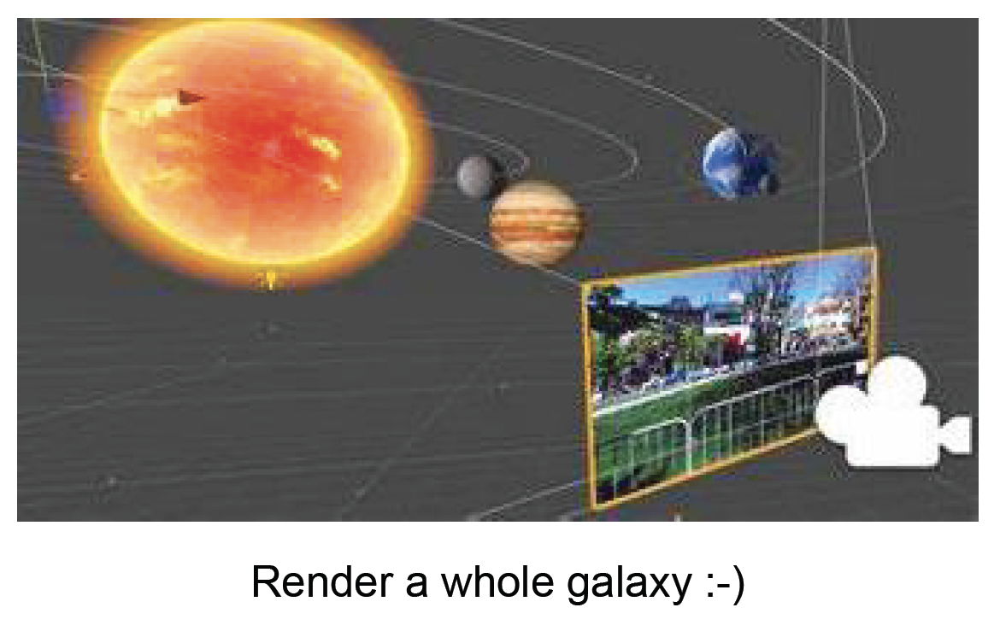
</div>


#### Integrating with Other World Elements

- **树**的渲染

<div style="text-align: center">
    
</div>

- **装饰物**(decorator)渲染

<div style="text-align: center">
    
</div>

- **道路**和**贴花**(decals)渲染

<div style="text-align: center">
    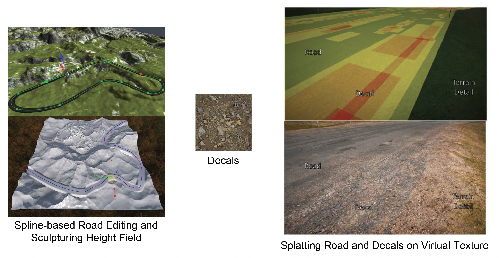
</div>

???+ info "游戏引擎中的地形编辑"

    <div style="text-align: center">
        
    </div>

???+ note "过程地形创建(procedure terrain creation)"

    <div style="text-align: center">
        
    </div>


### Sky and Atmosphere

???+ example "例子"

    === "例1"

        <div style="text-align: center">
            
        </div>

    === "例2"

        <div style="text-align: center">
            
        </div>

    === "例3"

        <div style="text-align: center">
            
        </div>

天空包括了大气和云两部分。下面先来介绍大气的渲染。

<div style="text-align: center">
    
</div>


#### Analytic Atmosphere Appearance Modeling

我们可通过对大气进行数学建模，得到一个解析解：

{ align=right width=30% }

$$
\begin{aligned}
\mathbb{F}(\theta, \gamma) &= \left(1 + Ae^{\frac{B}{\cos \theta + 0.01}}\right) \cdot \left(C + De^{E\gamma} + \right. \\
&\quad \left. {} + F \cos^2 \gamma + G \cdot \chi(H, \gamma) + I \cdot \cos^{\frac{1}{2}} \theta\right) \\
L_\lambda &= \mathbb{F}(\theta, \gamma) \cdot L_{M\lambda}
\end{aligned}
$$

- $\theta$：向上看的角度
- $\gamma$：观察方向和光线方向的夹角

???+ recommend "优点：计算简单高效"

???+ bug "缺点"

    - 限于地面视角
    - 大气参数无法自由更改

???+ example "效果"

    <div style="text-align: center">
        
    </div>


#### Participating Media

大气中存在各种介质，我们称之为**参与介质**(participating media)。

- 主要分为**气体分子**（氮气、氧气等等）和**气溶胶**两类
- 与光的相互作用取决于大气的成分

<div style="text-align: center">
    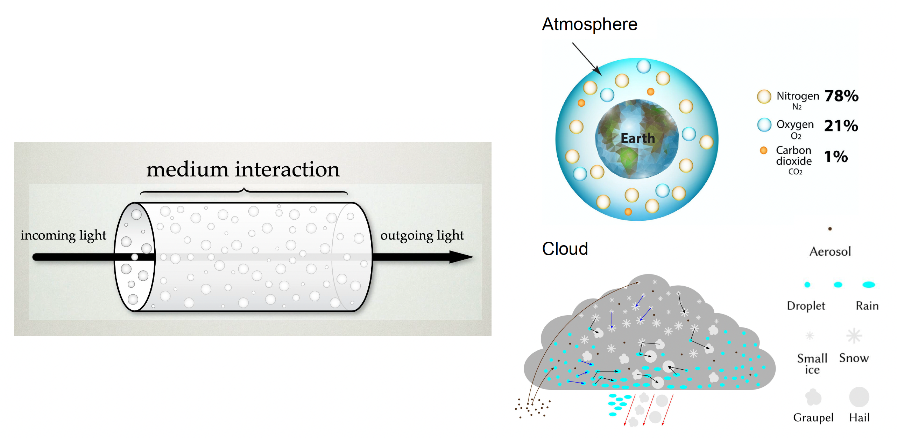
</div>

光和参与介质粒子的相互作用可分为以下几个部分：

<div style="text-align: center">
    
</div>

- **吸收**(absorption)
- **出散射**(out-scattering)
- **发射**(emission)
- **入散射**(in-scattering)（来自其他粒子的散射光）

将这几部分加起来，就可以得到**辐射传递方程**(radiative transfer equation, RTE)：

$$
\frac{dL(x,\omega)}{dx} = -\sigma_t L(x,\omega) + \sigma_a L_e(x,\omega) + \sigma_s \int_{S^2} f_p(x,\omega,\omega')\, L(x,\omega')\, d\omega'
$$

其中**消光系数**(extinction coefficient) $\sigma_t(x) = \sigma_a(x) + \sigma_s(x)$。

>注：上述方程只是简单的一维形式；三维形式涉及到梯度计算。

而它的积分形式叫做**体渲染方程**(volume rendering equation, VRE)，它描述了相机 P 看到物体上某一点 M 的光。

<div style="text-align: center">
    
</div>

其公式如下：

$$
L(P,\omega) = \int_{x=0}^{d} T(x)\bigl[\sigma_a \cdot L_e(x,\omega) + \sigma_s \cdot L_i(x,\omega)\bigr]\,dx + T(M)\,L(M,\omega)
$$

其中两个关键部分为：

- $T(x) = e^{-\int_x^P \sigma_t(s) ds}$（**通透度**(transmittance)）：来自**吸收**和**出散射**的净减少因子
- $\int_{S^2} f_p(x,\omega,\omega')\, L(x,\omega')\, d\omega'$：来自**入散射**的净增加因子


#### Real Physics in Atmosphere

而在现实的物理世界中，除了要考虑大气中的两类**介质**（气体分子和气溶胶）外，还要考虑不同波长的**太阳光**。

<div style="text-align: center">
    
</div>

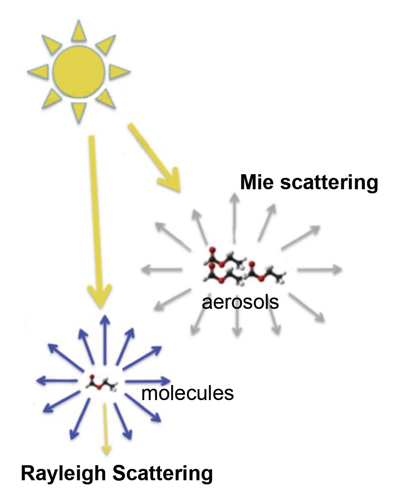{ align=right width=30% }

基于此，有以下两个经典的散射模型：

- **瑞利散射**(Rayliegh scattering)：光被直径**远小于**辐射波长的粒子（例如空气分子）散射
- **米氏散射**(Mie scattering)：光被直径与入射光波长**相似或更大**的粒子（例如气溶胶）散射

---
关于瑞利散射：

- 某些方向接收的光比其他方向更多，前后对称
- 短波长（例如蓝色）的散射强度大于长波长（例如红色）

<div style="text-align: center">
    
</div>

瑞利散射方程：
$$
S(\lambda, \theta, h) = \frac{\pi^2 (n^2 - 1)^2}{2} \underbrace{\frac{\rho(h)}{N}}_{\text{Density}} \overbrace{\frac{1}{\lambda^4}}^{\text{Wavelength}} \underbrace{(1 + \cos^2 \theta)}_{\text{Geometry}}
$$

其中：

- **相位函数**(phase function) $F_{\text{Rayleigh}}(\theta) = \dfrac{3}{16 \pi} (1 + \cos^2 \theta)$ 描述的正是形如花生的瑞利散射分布曲线
- **散射系数**(scattering coefficient) $\sigma_s^{\text{Rayleigh}} (\lambda, h) = \dfrac{8\pi^2(n^2 - 1)^2}{3} \dfrac{\rho(h)}{N} \dfrac{1}{\lambda^4}$
    - $\lambda$：入射光波长
    - $h$：海拔高度
    - $n$：空气折射率
    - $N$：标准大气的分子数密度
    - 给定海拔高度和空气密度，这个系数就是一个常数

瑞利散射能够解释天空为什么是蓝色的原因：

- 因为蓝光波长更短，更容易被大气散射
- 而当太阳接近地平线时（日落/日出），阳光需经过更长的大气路径，蓝光大部分被散射走，只剩红橙色光到达观察者眼中，因而此时天空泛红

<div style="text-align: center">
    
</div>

---
关于米氏散射：

- 几乎均匀地散射所有波长的光（对波长不敏感）
- 展现出强烈的前向指向性(forward directivity)

<div style="text-align: center">
    
</div>

米氏散射方程：
$$
S(\lambda, \theta, h) = \pi^2 (n^2 - 1)^2 \frac{\rho(h)}{N} \frac{1 - g^2}{2 + g^2} \frac{1 + \cos^2 \theta}{(1 - g^2 + 2g \cos \theta)^{\frac{3}{2}}}
$$

其中：

{ align=right width=30% }

- $g$：几何参数
    - $g = 0$：退化到瑞利散射
    - $g > 0$：向前散射更多（米氏散射）
    - $g < 0$：向后散射更多（很少出现）
- **相位函数** $F_{\text{Mie}}(\theta) = \dfrac{3}{8 \pi} \dfrac{1 - g^2}{2 + g^2} \dfrac{1 + \cos^2 \theta}{(1 - g^2 + 2g \cos \theta)^{\frac{3}{2}}}$
- **散射系数** $\sigma_s^{\text{Mie}}(\lambda, h) = \dfrac{8\pi^2(n^2 - 1)^2}{3} \dfrac{\rho(h)}{N}$

日常生活中米氏散射现象：

- 展示出强烈的前向指向性（太阳周围的**光晕**(halo)效应）
- 几乎均匀地散射所有波长的光（**雾**效应）

<div style="text-align: center">
    
</div>

---
除了散射外，我们还要考虑不同大气粒子对光的吸收，比如：

- **臭氧**(ozone)（O~3~）：吸收较长波长的光线，过滤掉红色、橙色和黄色
- **甲烷**(methane)（CH~4~）：同样知名于对红光的吸收（下图所示的海王星之所以看起来是蓝色的，正是因为其大气中的甲烷含量高）

<div style="text-align: center">
    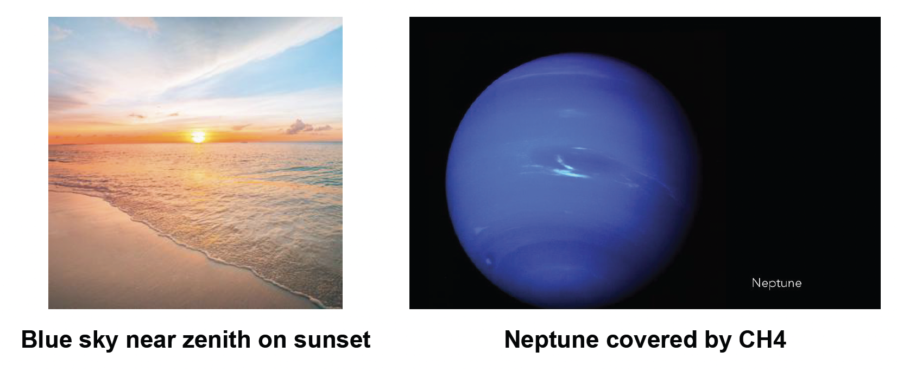
</div>


#### Single Scattering vs. Multiple Scattering

又回到散射部分——散射可分为：

<div style="text-align: center">
    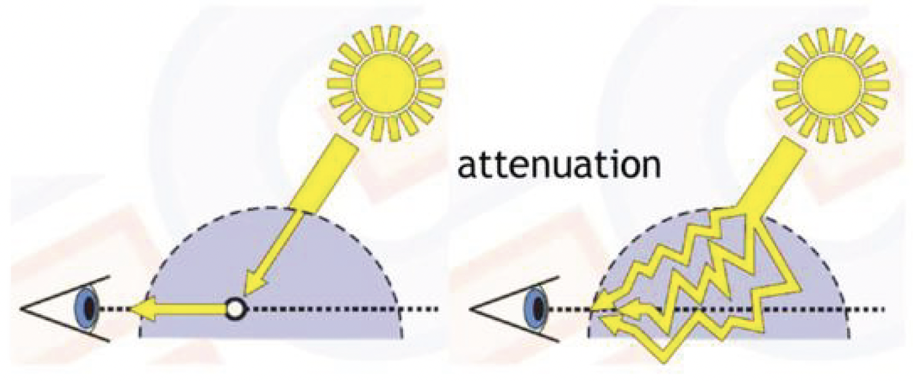
</div>

- **单散射**(single scattering)：太阳光经过一次
散射后直接进入眼睛

    $$
    L_1 = \int_A^B L_{P \rightarrow A} ds
    $$

- **多散射**(multiple scattering)：光可能在不同粒子间多次散射后才进入眼睛

    $$
    L_{n+1} = \int_A^B \int_{4 \pi} L_n(p, v') \cdot S(\lambda, \theta, h) \cdot T(p \rightarrow A) dv' ds
    $$

???+ example "对比"

    <div style="text-align: center">
        
    </div>

    可以看到，尽管单散射在大气渲染上已经取得了不错的效果，但山体完全是黑掉的，看起来就不太真实。而多散射就能将这块山体照亮一点，看起来更自然。

    >注：不要和全局光照(GI)的概念弄混淆！


#### Ray Marching

前面我们只介绍了各种用于渲染大气的方程，还没有讲过如何求解它们，所以下面就来介绍用于求解的技术。其中一种非常著名的算法是**光线步进**(ray marching)

- 顾名思义，该算法沿路上对函数一步步地进行积分；最后将这些积分结果累加起来，得到最终结果
- 通常用于计算在单散射下某一点的最终辐射度
- 积分得到的辐射度通常会被存储在**查找表**(look-up tables, **LUT**)上

<div style="text-align: center">
    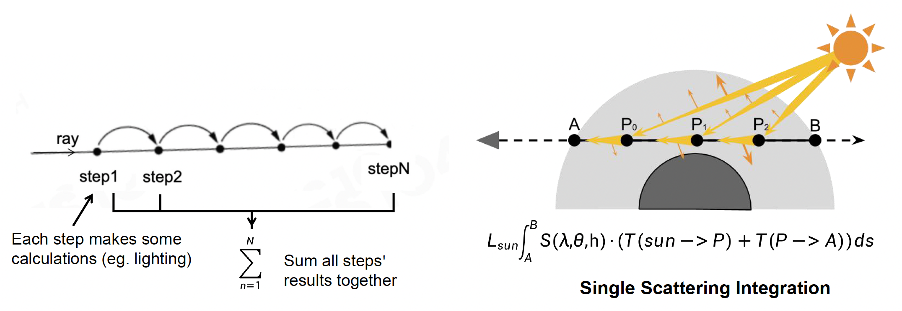
</div>


#### Precomputed Atmospheric Scattering

借助光线步进这一计算工具，我们可以通过**预计算**的方式来实现大气散射的计算。

- **通透度 LUT**：从某高度朝某方向看天空的光透过的比例
    - 通过对不同视线距离积分吸收和散射损耗，生成一个二维表格，描述了从观察点到大气层边界的通透度分布
    - 这个表考虑了高度和视线方向（如天顶角）的变化，用于后续计算光穿过大气的减弱量

    <div style="text-align: center">
        
    </div>

- **单散射 LUT**
    - 选取不同的大气参数：观测点高度、视线天顶角、太阳天顶角以及视线与太阳的相对角等组合（总共四个维度），对每种组合采用光线步进，沿视线累积一次散射光强
    - 虽然四维数据无法直接存储到 GPU 的标准纹理中，但开发者运用巧妙的**参数化**将其压缩为 3D 纹理：利用大气的球对称性质，将一些维度固定或合并
        - 例如固定观察者在地表（或若干离地高度层），并利用对称性减少太阳方位维度，从而以 3 个角度参数 + 高度来索引散射值
    
    <div style="text-align: center">
        
    </div>

- **多散射 LUT**：基于单散射的结果，再迭代计算高次散射
    - 利用单散射 LUT 中得到的大气中各点的辐射度作为“次级光源”，再通过与通透度 LUT 结合积分类似的过程得到二次散射的分布图
    - 同理，可以迭代得到三次、四次散射，甚至一直到高阶；不过在实践中，累积到 3～4 次时视觉效果已非常接近无限次散射，因为每增加一次散射贡献递减且变化微弱
    - 由此得到的多散射 LUT 结构与单散射相同，只是亮度值略有提高
    - 这个逐阶累积的思想，正是早期预计算大气散射算法的核心

    <div style="text-align: center">
        
    </div>

???+ example "效果"

    <div style="text-align: center">
        
    </div>

???+ warning "预计算大气散射面临的挑战"

    - 预计算成本
        - 多散射迭代成本高
        - 在低端设备（例如移动设备）上生成大气 LUT 很困难

    - 环境的创作和动态调整
        - 艺术家无法实时更改散射系数
        - 难以渲染天气效果，如从晴天到雨雾、在行星间的太空旅行等

    - 运行时的渲染成本：用于通透度 LUT 和多散射 LUT 的每像素多维高纹理采样的成本很高（因此往往需要降采样来提高效率）


#### Production Friendly Quick Sky and Atmosphere Rendering

近年来，业界推出了一种**可扩展且面向业界的天空与大气渲染算法** ([*A scalable and production-ready Sky and Atmosphere technique*](https://diglib.eg.org/bitstream/handle/10.1111/cgf14050/v39i4pp013-022.pdf))（UE 采样了这种技术）。该方法针对预计算方案的痛点，为多散射作出了一系列大胆又合理的近似假设，大幅减少计算复杂度的同时保留了逼真的视觉效果。其改进要点包括：

- 当散射事件的阶数 >= 2 时，使用**各向同性相位函数**(isotropic phase function)来实现散射
- 当前阴影位置邻域内的所有点**接收到相同数量的二次散射光**
- **忽略可见性**

    <div style="text-align: center">
        
    </div>

- 固定视图位置和太阳位置，以从 LUT 中移除两个维度

    <div style="text-align: center">
        
    </div>

- 生成一个 3D LUT，通过光线步进来求解空中透视的效果

    <div style="text-align: center">
        
    </div>

结果表明，该方法在性能和效果上取得了一个不错的平衡。

<div style="text-align: center">
    
</div>

???+ play "大气渲染 Demo"

    <div style="text-align: center">
        
    </div>


### Clouds

接下来介绍如何绘制云。云的类型大致有三类：层云、积云和卷云。

<div style="text-align: center">
    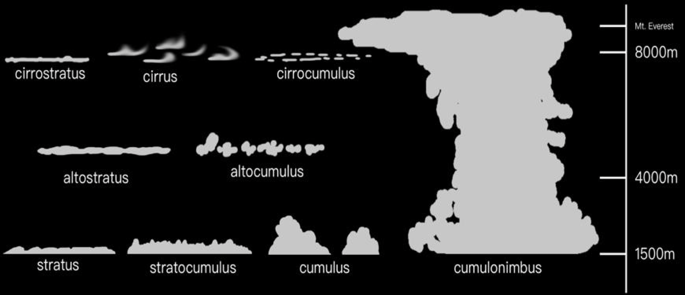
</div>

传统的云渲染方法有：

- 基于**网格**(mesh)的云建模
    - 优点：质量高
    - 缺点：成本太大，且不支持动态天气

    <div style="text-align: center">
        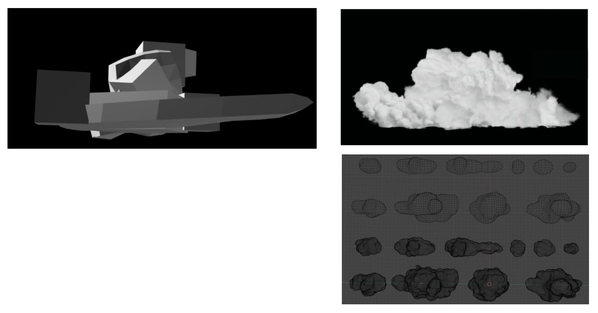
    </div>

- **广告牌云**(billboard cloud)
    - 优点：高效
    - 缺点：仅能表现有限的视觉效果和云的类型

    <div style="text-align: center">
        
    </div>

而现代游戏引擎普遍采用**体积云建模**(volumetric cloud modeling)的方法。

<div style="text-align: center">
    
</div>

- 优点：
    - 可以创造现实的云的形状
    - 可以生成更大规模的云
    - 支持动态天气
    - 动态体积光照和阴影
- 缺点：必须考虑效率

具体实现为：

- 将云当作三维体积来模拟，即在GPU内存中维护一个表示云层密度分布的三维**天气纹理**(weather texture)（体纹理）。纹理包含了两部分：

    <div style="text-align: center">
        
    </div>

    - 云类型的分布(type)（右上）
    - 云的厚度(height)（下）

- **噪声函数**(noise function)：用来模拟云的各种形态，常用的有：
    - **柏林噪声**(Perlin noise)：在多项式时间内形成了棉花丝般的效果

        <div style="text-align: center">
            
        </div>

    - **沃利噪声**(Warley noise)：
        - 很像细胞的分布
        - 产生絮状效果

        <div style="text-align: center">
            
            
        </div>

一个完整的**云密度模型**(cloud density model)会用到上面这两个部分。其中对于基础的形状，使用低频噪声构建；而对于更多的细节，采用高频噪声勾勒。

<div style="text-align: center">
    
</div>

在渲染云的时候，我们依然可以采用前面介绍的**光线步进**算法。具体步骤如下：

<div style="text-align: center">
    
</div>

1. 对屏幕的每个像素投射一条光线
2. 在未进入云时步幅较大
3. 进入云内，步幅变小
4. 收集来自太阳的散射光

??? play "例子"

    <div style="text-align: center">
        
    </div>