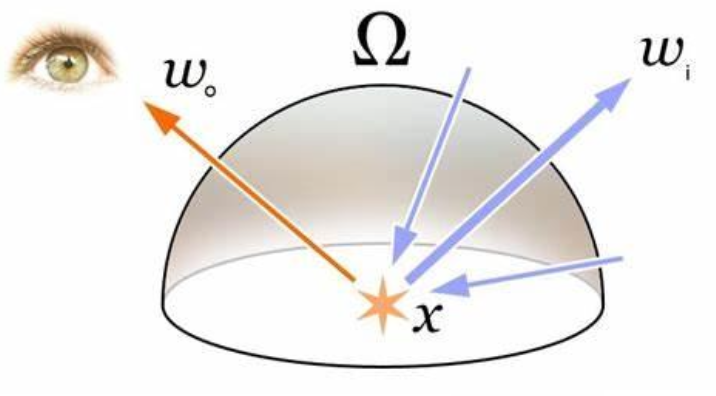
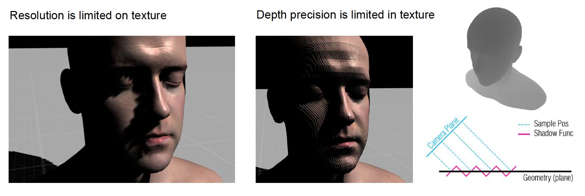
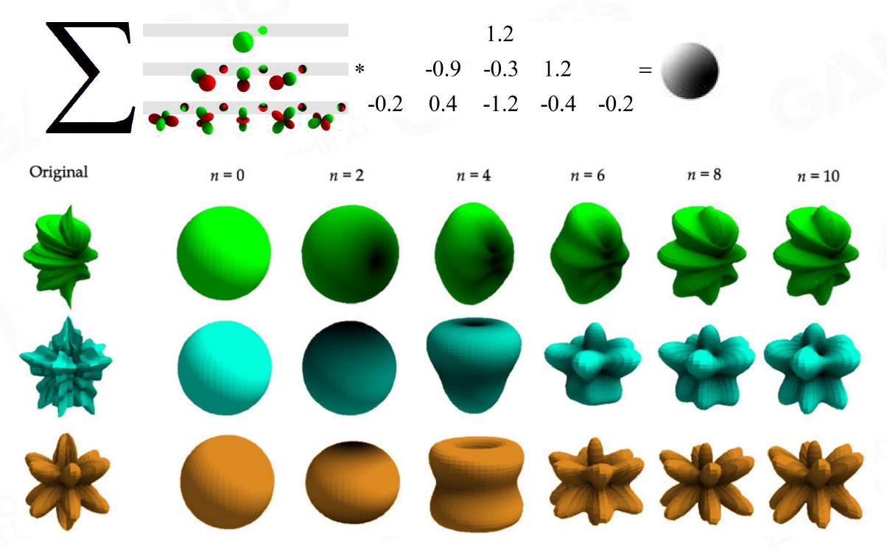
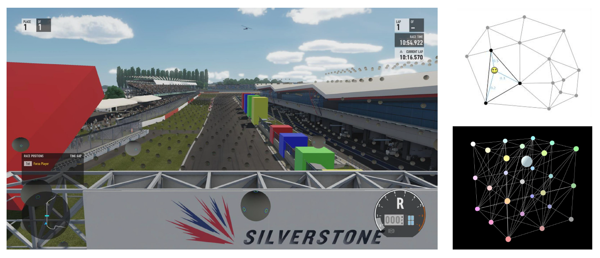
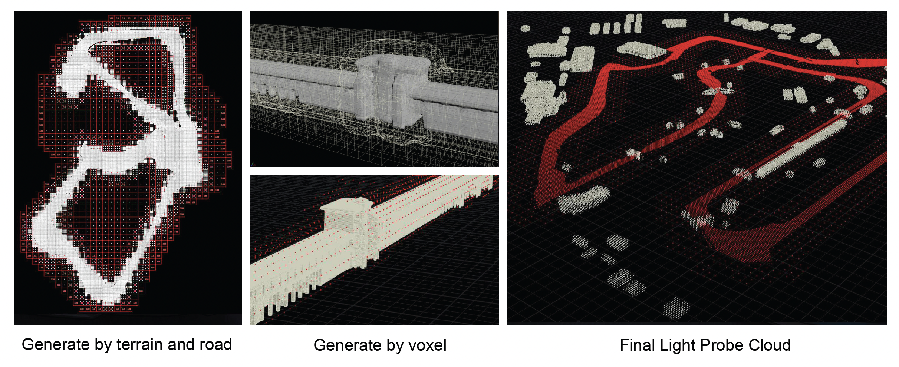
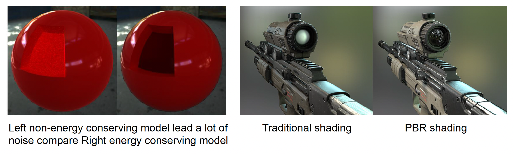
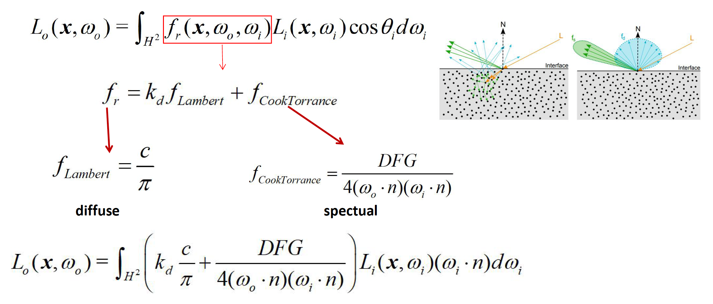
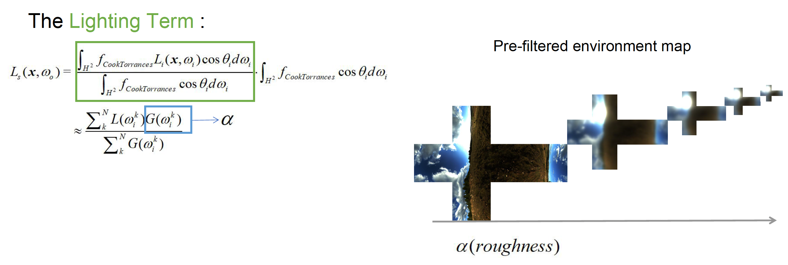
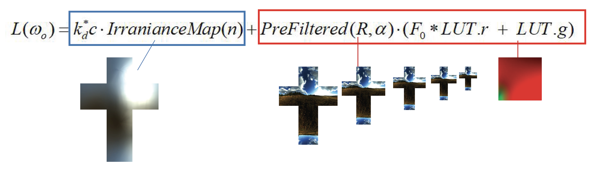
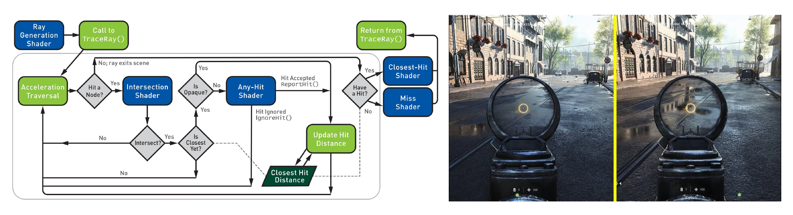

# Lighting, Materials and Shaders

!!! warning "高能预警"

    本节将涉及到不少复杂深奥的渲染技术。笔者在撰写本笔记时只学了 GAMES101，还没开始学 GAMES202，所以有些技术可能理解得不是很透彻，甚至有些可能还没搞明白。因此可能会出现更多的错误和纰漏，如有读者发现并指出，笔者将不胜感激 orz

在图形渲染中，光照、材质和着色器是最核心的三个要素：

- **光照**提供了场景中的能量来源，从微观角度看就是光子的发射、反射、吸收，最终进入人眼形成图像
- **材质**决定了物体如何与光相互作用：当光照射到物体表面时，可能被反射回来，或被部分吸收，或在物体内部散射，这些过程共同决定了我们看到的物体外观
- **着色器**(shader)指运行在图形处理器上的小程序，用于模拟光与材质作用的复杂计算，将理论模型转化为逼真的实时画面

现代光照理论以**渲染方程**(render equation)为基础，这一方程为 James Kajiya 在 1986 年的论文中首次提出。

$$
L_o(\bm{x}, \omega_o) = L_e(\bm{x}, \omega_o) + \int_{H^2} f_r(\bm{x}, \omega_o, \omega_i) L_i(\bm{x}, \omega_i) \cos \theta_i d\omega_i
$$

- 简单来说，该方程描述了从物体表面某点沿特定方向**射出的辐射度**(ongoing/observed radiance)等于两个部分之和：
    - 该点自身的发光（自发辐射项(emitted radiance)）
    - 来自所有入射(incoming)方向的光在该点经散射后朝观察方向反射的贡献

{ align=right width=30% }

- 方程形式上是一个关于方向和位置的六维积分，遍历半球空间上所有可能的入射光方向，并通过物体的材质属性函数对每一方向的入射辐射进行加权累加
- 这里涉及两个重要物理量：
    - **辐射度**(radiance)：物体表面向外辐射（反射）出的能量
    - **辐照度**(irradiance)：入射到表面上的能量

 

- 渲染方程中的散射函数通常用 **BRDF**（Bidirectional Reflectance Distribution Function，**双向反射分布函数**）表示，它描述了光从入射方向转化为出射方向时能量变化的比例，是材质最关键的特性函数
    - 通过 BRDF，渲染方程将入射辐照度与出射辐射度联系起来，严格地刻画了光与材质交互的物理过程

- 渲染方程在理论上完备地描述了光照成像过程，但直接求解它非常困难，尤其是**在实时渲染中几乎不可行**
    - 原因在于现实世界的光照过于复杂，方程求解涉及的计算量极其庞大

        

            
        

下面我们总结渲染方程在实践中遇到的主要挑战，并为后续讨论游戏引擎中的近似方案做好铺垫。

- **光线可见性**与**光源复杂性**：
    - 光线的可见性(visibility to lights)：确定场景中每一点从各个光源方向是否有光照射到的问题，即**阴影**(shadow)计算
        - 别看阴影只是“光被挡住”的简单现象，要在计算机中准确、高效地生成动态阴影却非常困难，需要处理大量特殊情况和优化
        - 然而阴影又至关重要：如果场景中没有正确的阴影，人眼对空间深度和物体关系的判断就会混乱，画面显得不真实
    
        

            
        

    - 光源的复杂性(light source complexity)：
        - 现实中光源形态多样：
            - 方向光：如太阳光，可近似为平行光线
            - 点光源：如灯泡，向四面八方均匀发光
            - 聚光灯：有特定方向锥角的光束
            - 面光源：（如发光的面板）会产生软阴影和角度相关的亮度变化，极大增加了计算复杂度
        
        - 要高效地模拟不同类型光源对场景的照明，这本身就是一项巨大挑战

        

            
        

- **计算光照积分的高成本**：
    - 根据渲染方程，要计算物体表面上一点的明亮程度，必须将半球范围内所有入射光的贡献积分求和，这意味着对无数方向的光进行采样和累加
    - 精确的积分往往无法找到解析解，只能**通过大量采样近似**
    - 如果逐像素在渲染时用数值积分（如**蒙特卡罗随机采样**）计算光照，开销巨大，实时应用根本无法接受
    - 因此如何在不损失太多精度的前提下，以近似方法加速光照积分，是渲染中的另一个重大难题

- **全局光照的递归性**：
    - 光线在场景中往往会发生多次弹跳，也就是说一个物体反射的光线又可以照亮其他物体，这些**间接光照**(indirect illumination)对真实感有着重要贡献
    - 然而，这使渲染方程具有**递归**(recursive)性质：求解某处的光照需要考虑来自其他物体的间接光，而那些物体的光照又取决于更多物体，如此循环，因此引入**全局光照**(global illumination, GI)（直接光照 + 间接光照）后会令计算复杂度呈指数级提升
    - 直接光照和间接光照的综合才构成了我们在现实中看到的最终亮度，这也是为何简单的局部模型往往显得“不真实”的原因，但要在**实时性**下计算全局光照无疑是难上加难

    

        
    

以上三大挑战叠加在一起，使得“实时解渲染方程”成为一项几乎不可能完成的任务。游戏引擎的渲染系统正是围绕如何高效近似解决这些难题而发展演进的。接下来，我们将介绍早期游戏引擎是如何在“舍弃精确、追求效率”的指导下，采用各种取舍与巧妙技巧来绕开渲染方程的直接求解，从而实时生成令人满意的画面的。

## Starting from Simple

面对渲染方程带来的计算挑战，早期的游戏引擎并未直接求解复杂的光照积分，而是采用了一套简化的光照模型来近似模拟视觉效果。

{ align=right width=40% }

- **主光源**(main light)：
    - 假设场景中存在一个最主要的光源
    - 例如在户外场景下通常用一个**方向光**模拟太阳光，仅考虑这一束平行光产生的直接照明和阴影
    - 在需要时再辅以少量点光源或聚光灯用于特殊效果，但全局仍以单一主光为中心
    - 通过将绝大多数光照归结为一个方向光，极大简化了光源处理的复杂度

 

- **环境光**(ambient light)：
    - 模拟来自各个方向的**间接光照**
    - 通常被实现为一个**常量**，它为场景所有物体提供一个均匀的基础照明
    - 可以把环境光理解为“天光”或半球漫射光的平均值，用一个固定亮度来近似来自周围环境的漫反射光照
    - 早期的**图形 API 直接支持**环境光：只需设定一个 RGB 强度，未被直接光照到的区域都会被照亮到该平均亮度
    - 尽管这么做会令阴影区域看起来不够真实，但至少保证了游戏场景不会出现完全漆黑的角落

{ align=right width=30% }

- **环境映射**(environment mapping)：
    - 增强物体表面的**反射**(reflection)质感
    - 具体而言，就是预先捕获或制作一张反映场景周围环境的全景图（**环境贴图**(environment map)），然后在渲染物体时，根据视角从这张贴图上采样颜色来模拟镜面反射
    - 对于理想的**光滑表面**，这相当于能看到周围环境的清晰倒影；而对于**粗糙表面**，则对环境贴图进行模糊处理来获得散漫的高光
    - 一种常用技巧是利用环境贴图的各级 **mipmap**（各层递减分辨率的纹理）来表示不同的粗糙度级别：粗糙度越高则取样更低分辨率（更模糊）的环境贴图，从而模拟更模糊的反射高光
    - 环境映射在上世纪末就已有探索，可视作早期的[**基于图像的光照**](#image-based-lighting-ibl)(image-based lighting, **IBL**)的雏形

通过上述组合，游戏引擎在相当长一段时间内成功绘制出了令人接受的光照效果。

此外，为了解决光线可见性问题，还引入了**阴影映射**(shadow map)技术来绘制由主光源产生的阴影，这是目前实时渲染中最常用的动态阴影方案：

    

- 在渲染场景之前，先从光源视角渲染场景深度并存储成一张**深度贴图**，即**阴影贴图**(shadow map)
- 然后在实际从相机视角绘制场景时，将每个像素转换到光源坐标系下，与阴影贴图的深度进行比较，以确定该像素是否被其它物体遮挡在阴影中

凭借这些技巧，即使在硬件性能有限的年代，许多游戏已经能够呈现出相当不错的画面效果。如果美术风格得当、调教合理，这种基于经验的光照模型往往足以支撑令人愉悦的游戏体验。

当然，上述方案是一种大刀阔斧的近似，其产生的图形质量与真实物理还是存在差距。其中最突出的不足在于缺乏真实的全局光照效果——环境光只是给阴影区域加上一层均匀的亮度，无法表现光线在空间中反弹所带来的光影渐变和颜色泛光。

    

为此，随着硬件的发展和算法的进步，游戏引擎开始探索在实时渲染中引入更加真实的全局光照模拟方法。

## Pre-computed Global Illumination

??? info "First Wave of AAA Quality"

    图片所示的游戏均为《刺客信条》(*Assassin's Creed*)系列，且“xx 年前”以 2022 年（GAMES104 开课时间）为锚点。

    === "15 年前"

        

            
        

    === "10 年前"

        

            
        

    === "5 年前"

        

            
        

在现实世界中，**全局光照**现象对人类视觉影响深远。例如，在房间内没有灯光，且阳光透过窗户射入时，靠近窗口的地板被直射光强烈照亮，而房间深处即使没有直射光，也并非全黑，因为地板和墙壁会把部分阳光反射到阴影区域，形成柔和的漫射光照。这种间接光赋予场景更丰富的明暗层次和氛围。

    

在早年，游戏会采用环境光，把阴影区域整体抬亮，但这样一刀切的做法会让房间亮度到处一样，缺乏立体感。真正的全局光照，应该能表现出地板、墙面之间的明暗渐变、物体之间的软阴影、以及颜色在物体之间“串色”的效果。也正因为如此，全局光照对 3A 游戏的真实感非常关键，很多玩家买游戏时都会看一句“是否支持 GI”。

在前面的介绍中，我们已经认识到全局光照的实现难点。为了解决“算不动”的问题，一种典型的解决思路是“**用空间换时间**”：既然实时算太贵，那就干脆预先算好，把结果存到内存或纹理里，运行时查表即可。

具体做法是：假设场景中绝大部分东西都是**静态**的，比如 90% 的场景几何不动，太阳的方向和强度在每个关卡中也固定下来，那么光线在这些静态几何之间的弹跳结果其实可以离线算一遍。我们把这个过程称为**预计算全局光照**(pre-computed GI)。

- 预计算阶段可以用慢而精的算法（比如大量光线追踪）反复迭代，把各处的间接光照分布算到比较精确
- 而在游戏运行时，只需要对每个点查一次预计算结果，再配上实时的直接光照，就能得到比较真实的光照效果

### Spherical Harmonics

那么间接光照到底以什么形式存下来？

- 如果直接把球面上每个方向的亮度都采样成一张完整的环境贴图，那么数据量会非常大，而且之后要和材质的 BRDF 做积分，也就是在这个球面上做复杂的数值积分，非常难搞
- 所以要满足两个目标：
    - **好的压缩率**
        - 一个关卡里可能要存储成千上万个辐射度探针(radiance probe)
    
    - **容易和材质函数做积分**，也就是能方便地和 BRDF 做卷积
        - 回顾了傅里叶变换和卷积定理：
            - 在空间域里两个函数的卷积，在频域里可以转化为对应系数的逐项相乘
            - 对应到光照上，就是环境光照分布和材质 BRDF在球面上的卷积，可以尝试先把它们展开到某个“球面上的傅里叶基”下，然后在系数空间里做简单的乘加运算，而不必在球面上做复杂积分

            

                
            

这就引出了**球谐函数**的概念(spherical harmonics, **SH**)。

- 球谐函数是一组定义在球面上的正交基函数体系，数学上类比于球面上的傅里叶基
- 一个复杂的球面积分，可以用低阶的球谐多项式来近似，这就意味着我们可以用少量的 SH 系数来逼近某个点周围的入射光分布

    

        
    

    

        
    

- 在实现上，如果我们只关心**低频的漫反射间接光**，一般用**一阶或二阶的 SH** 就已经足够

    

        
    

- 比如一阶 SH 只有 4 个基函数，我们可以把这 4 个系数打包到一个 **RGBA** 向量里；考虑到有 R、G、B 三个颜色通道，一个点的间接光总共只需要 12 个浮点参数就能表示
- 这些系数还能继续通过 GPU 纹理压缩格式（课上提到例如 BC6H、BC7 等）再压一遍，使得每个点的间接光数据最终只占用非常少的位数

    

        
    

- 用 SH 来编码间接光有两个直接好处：
    - 压缩率高：相比整张环境贴图，只存几组系数节省了大量内存
    - 便于做积分：因为材质的 BRDF 也可以在球面上展开成多项式，求光照积分时就变成系数之间的若干次乘加，大幅减少了运行时的计算量

### Lightmap

最经典的预计算 GI 方案是基于 **lightmap** 的全局光照。整体流程可以概括为几个阶段：

1. 把场景表面参数化成 2D UV 图(2D UV altas)
    - 这一步就是把复杂的三维几何“拍扁”到一张或几张二维纹理上，类似于做展开 UV 的过程
    - 为减少成本
        - 使用低模几何来参与光照计算，而不是用最终的高精度模型
        - 尽量减少 UV 岛的数量，保证 lightmap 上的每个纹素(texel)在世界空间下覆盖的面积尽可能均匀，这样不会产生某些地方纹素极密、某些地方极稀的问题
    
    - 下图展示了把每个纹素画成小格子再反投影回场景的效果：理想情况下，这些小格子在三维空间中的分布大小大致一致，说明 lightmap 密度比较均匀

        

            
        

2. 离线计算每个纹素的间接光照，并压缩为 SH 系数
    - 在 UV 展开的基础上，离线的 lighting farm 会对每个纹素对应的表面点做全局光照计算，求出那里的间接辐照度
    - 由于这一步是完全离线的，可以考虑多次弹跳、复杂遮挡和颜色串色等效果
    - 然后将这些间接光分布投影到 SH 基上，只保存对应的 SH 系数

    

        
    

3. 从 proxy 几何投射回最终几何，并叠加高频细节
    - 运行时或关卡构建阶段，引擎会把 lightmap 投射到各个 LOD 的最终模型上，这样不同精度的网格都能复用同一套 GI 数据
    - 同时，还会在屏幕空间上叠加一个 HBAO（基于水平直方图的环境光遮蔽）之类的算法，为近距离区域增加高频的暗角和遮挡细节

    

        
    

4. 与实时直射光和材质一起组合成最终画面
    - 烘焙的 lightmap 只负责间接光照部分；场景中主光源的**直接光**则还是**实时**计算的，例如方向光、点光源的直射光和阴影

        

            
        

    - 再经过**材质**（PBR 或其他模型）着色，将 lightmap 中的间接光与材质的反射率等属性综合起来，就得到了最终的帧

        

            
        

???+ recommend "优点"

    - **运行时极其高效**：因为所有复杂的 GI 计算都已经离线完成，游戏过程中只需要贴图采样和少量运算，对 GPU 来说非常容易
    - 可以烘出很**精细的 GI 细节**：离线阶段可以用高质量算法、密集采样，所以可以把环境中很多微妙的明暗变化都烘出来

???+ bug "缺点"

    - 预计算**非常慢、非常贵**：
        - 需要搭建 lightmap farm，进行长时间的离线计算

    - **只能处理静态**几何和静态光源：
        - 一旦场景里的物体位置或光源位置发生较大变化，之前烘出来的 lightmap 就失效了，需要重新烘焙
        - 虽然可以用一些 hack 的办法让动态角色从周围采样一点 lightmap 颜色来“猜测”光照，但这种做法常常会带来奇怪的 bug，比如角色刚好走到某个 dark 区域时全身突然变黑

    - **存储压力大**：把整个关卡参数化成大 lightmap atlas，分辨率一高，纹理总大小就可能达到几十兆甚至上百兆，对包体和显存都是不小的负担

### Light Probes

**光照探针**(light probe)的思路很直接：

- 既然把所有表面展开成 2D atlas 太麻烦，那就干脆在 3D 空间里直接撒一堆采样点，每个点就是一个**光照探针**，每个探针记录该点周围的光场（还是用 SH 来压缩）
- 任何一个动态物体或角色，在移动时就根据自己所在位置附近的几个探针做**插值**，算出当前的间接光照
- 为了做插值，通常会把这些采样点在空间中组成一些**四面体**，对每个像素找到自己处于哪个四面体中，再按顶点的 SH 系数插值，这样间接光在空间上是连续变化的

    

一个实际问题是：谁来在游戏场景中摆放这些光照探针？

- 早期比较“粗暴”的做法是：给艺术家一个工具，让他们**手动**在场景里点探针的位置
    - 刚开始艺术家可能觉得还不错，但随着关卡不断调整、路线不断修改，每次改布局都要重新挪 探针，很容易出错，而且效率极低

- 所以现在更推荐用**自动化算法**生成探针点：根据空间几何和玩家可能活动的区域，均匀撒点，再进行一些优化，让探针分布既覆盖关键路径，又不过度密集
    - 如果要做工业级应用，最好写一套自动生成探针的算法，不要把这个苦活交给艺术家。

    

值得一提的是，光照探针的一个优点是可以在**运行时更新**：如果场景发生了一些变化，比如角色移动到一个新的区域，或者场景里某些动态事件改变了环境光，有些系统可以在运行时“软更新” 探针的数据。这意味着它比纯静态的 lightmap 更有弹性，**适合那些需要一定环境变化的游戏场景**。

### Reflection Probes

从数据表达上看，光照探针主要用于漫反射 GI，也就是说它主要考虑的是**低频**信息。但游戏里还有很多像车身、玻璃、金属这样的材质，需要用更**高频**的信息表达。为此，我们引入了另一种探针，即**反射探针**(reflection probe)。它的特征是数量相对较少，但每个都存一张比较高分辨率的环境贴图（一般是立方体纹理），专门用于做镜面反射。

    

通常这两类探针会分开采样、分开存储：

- 前者密度高、精度低，主要贡献漫反射 GI
- 后者密度低、精度高，负责高频的镜面反射

把这两者结合起来，就能在相对合理的成本下，让静态环境和动态物体都拥有不错的全局光照感。

???+ recommend "优点"

    - **运行时**同样非常**高效**：和 lightmap 一样，主要工作在离线完成，游戏里只是采样和插值
    - 可以同时应用到**静态和动态**物体：因为探针是分布在空间中的，动态物体只需要根据当前位置在相邻探针间进行插值，就可以获得合理的间接光照，无需为每个动态物体单独烘焙
    - 同时支持**漫反射和镜面反射**：光照探针提供漫反射 GI，反射探针提供镜面反射

???+ bug "缺点"

    - 仍然需要一些预计算：布满整个世界的一大堆 SH 光照探针，需要离线阶段去采样和编码，虽然比 lightmap 要少很多数据，但预计算和资源管理的工作仍然不轻
    - 无法表现细节丰富的 GI：因为探针数量有限、采样相对稀疏，相比于 lightmap 那种在几百万个纹素进行的密集采样，它在软阴影、物体接触处的暗部、以及非常细腻的颜色串色等方面难以达到同样的精度；采样率差了一个数量级，效果肯定也差一些

## Materials

### Bling-Phong Materials

有了光源和光照模型，下一步就是考虑**材质**如何响应光照。材质的作用由 BRDF 决定，简单理解就是表面把入射的光以怎样的角度和强度反射出去。在前面的简化光照方案中，游戏引擎普遍采用 **Blinn-Phong 着色模型**作为材质的光照计算方法。Phong 模型是一种经验模型，它假定光照分为三部分：

- 环境光(ambient)
- 漫反射(diffuse)
- 镜面高光(specular)

    

Blinn-Phong 是 Phong 模型的改进版本，其高光计算使用**半程向量**（视线与光线方向的中间向量）提高了效率，但总体思想一致。由于**实现简单且运行效率高**，Blinn-Phong 模型在很长一段时间内都是实时渲染领域的主流方案。

然而，随着玩家们对游戏画面真实感的要求的不断提高，Blinn-Phong 模型的局限性也日益凸显：

- **不遵循物理能量守恒原则**(not energy conservative)：在某些参数组合下，表面反射出的光通量甚至可能超过入射光通量，这是物理上不合理的，也会导致画面偏亮失真
- 在光线追踪等更精确的渲染中**收敛不稳定**：因为非物理性的着色函数会引入噪声和伪影，使得高级渲染算法难以得到正确结果
- 难以模拟复杂材质的**细节**特征：现实中的材质种类繁多，例如各向异性材料、金属和非金属在反光性质上的差异，以及次表面散射等高级效果，都无法靠 Phong 模型有限的参数来逼真呈现

    

### Physical-Based Materials

为了解决上述问题，**基于物理的渲染**(physical-based rendering, **PBR**)的理念应运而生。

- PBR 的核心思想是以**物理定律**为指导来建模材质的光照响应，确保渲染结果在能量和视觉上都尽可能接近真实世界
- PBR 引入了更完善的表面反射模型，其中最重要的就是**微表面理论**(microfacet theory)
    - 微表面模型认为，现实中的粗糙表面可以视作由无数微小的镜面（微凸体）组成
    - 即便肉眼看起来漫反射的**粗糙材质**，在微观尺度下也由**很多朝向各异的微观平面**构成
    - 光照到达表面后，会在这些微观平面上发生**镜面反射**，但由于每个平面的朝向不同，宏观上汇聚起来就形成了散射的反射效果
    
    

        
    

- 模型中的 $D$ 指代**法线分布函数**(normal distribution function, **NDF**)
    - NDF 给出了表面微法线朝向的概率分布
        - **粗糙**度高的表面其微法线分布范围广，意味着从宏观上看高光范围更大但强度更低
        - **光滑**表面微法线集中在一个方向，高光集中而强烈
    
        

            
        

    - 常用的 NDF 有 Blinn-Phong 分布、Beckmann 分布、GGX 分布等，其中 **GGX 分布**是近年来游戏领域偏爱的选择，它相比 Phong 分布可以更好地模拟粗糙表面高光的“拖尾”现象，让材质看起来更加真实
        - 可以类比音箱的挑选（高音脆，低音沉），GGX 的过渡相比 Phong 更加柔和

- 模型中的 $G$ 指代**几何遮蔽**(geometry attenuation)项
    - 当观察角度或入射角度发生变化时，**微表面之间会发生自我遮挡和阴影**
    - 当从一个很小的角度斜看表面时，实际上能“看到”的亮面变少了，因为许多微凸体彼此遮挡了对方的反射
    - 几何项通过对微表面遮挡效应建模，在高角度（掠射）观察时适当降低反射强度，以符合真实现象
    - 常用的几何项模型如 **Smith 算法**等，会根据粗糙度计算不同视角下可参与反射的有效微表面比例，从而修正 NDF 得到的理想反射强度

    

        
    

- 模型中的 $F$ 指代**菲涅耳效应**(Fresnel equation)
    - 它描述了**材料对不同入射角光线的反射率的变化规律**
    - 当光线垂直入射（入射角接近 0 度）时，大部分能量会进入材质内部（非金属会将更多透射变为漫反射），只有一小部分被镜面反射
    - 但当光线以很小的掠射角划过表面时，镜面反射率会大大增加，表面看起来更亮
        - 这就是为什么远处水面、油漆等在接近平行视角观察时会闪亮如镜，而正面对视时反光却没那么强烈

    - 实际应用中常用简单的 **Schlick 近似公式**，根据材质的折射率或金属度计算出不同角度下的反射率插值曲线，实现高效的实时菲涅耳计算

综合 NDF、几何遮蔽和菲涅耳三部分，再加上一个宏观的漫反射项（如**朗伯模型**用于非金属的漫反射），就构成了现代 PBR 着色模型，如下所示。这种模型天然满足能量守恒，能稳定用于高级渲染算法，并且具有明确的物理意义。

    

???+ example "例子"

    

        
    

---
PBR 参数的设计可遵循 Brent Burley 提出的原则：

- 应该使用直观参数而不是物理参数
- 参数量应尽可能少
- 参数的合理范围为 0-1 之间
- 参数应允许在合理范围内被推至其可能的范围之外
- 所有参数的组合应尽可能鲁棒与合理

在实际使用 PBR 时，游戏引擎倾向于**提供直观且有限的参数集**来由艺术家调整材质外观。下面是 Disney 原则下的材质参数：

    

在当下游戏行业最主流、最规范的实时 PBR 模型主要为两类：

- **镜面光泽度**(specular-glossiness, **SG**)
    - 它的一个特点是几乎不需要额外的标量参数，所有关键属性都用贴图来表达
    - 最迷人的地方在于它的表达力：比如艺术家可以通过镜面贴图对参数做非常细腻的控制，甚至支持彩色的金属高光，比如金色、铜色等，这些都可以通过镜面的 RGB 通道来体现
    - 不过，高度灵活也带来了问题：参数太容易被设错
        - 从工程管理的角度看，在一个几十上百人规模的美术团队里，让所有人都正确理解和使用规定的参数，实际上很难做到

    

        
    

    

        
    

- **金属粗糙度**(metallic-roughness, **MR**)
    - 相比 SG 更“土”，但更好用
    - 参数非常简单且直观：
        - `base_color`（RGB，sRGB）：漫反射颜色
        - `roughness`（灰度，线性）：为 0 时表示理想光滑镜面，高光集中而锐利；增大时高光变宽变暗，细节被拉平
        - `metallic`（灰度，线性）：在非金属和金属之间插值
    
    - 但底层仍然是同样强大的通用函数
    - 这种把复杂逻辑包在 MR 外壳里的设计，直接提高了系统的可控性和鲁棒性，因此在实际项目里，越来越多的工作室倾向于使用 这一工作流

    

        
    

MR 转换到 SG：

    

???+ abstract "MR vs SG"

    - MR
        - 优点
            - 可以更容易地编写，且更不容易因提供错误的介电 F0 数据而产生错误
            - 使用更少的纹理内存，因为金属和粗糙度都是灰度图

        - 缺点
            - 在地图创建过程中无法控制介电 F0。然而，大多数实现都有一个用于覆盖基本 4% 值的镜面反射控制
            - 边缘伪影更明显，尤其是在较低分辨率时

    - SG
        - 优点
            - 边缘伪影不太明显
            - 可以控制镜面反射图中的介电 F0
        
        - 缺点
            - 由于镜面反射图提供了对介电 F0 的控制，因此更容易因使用错误值而受到影响；如果在不正确的着色器中处理，可能会破坏守恒定律
            - 使用额外的 RGB 图，因此需要更多的纹理内存

    

        
    

## Image-Based Lighting (IBL)

{ align=right width=20% }

在前面讲 PBR 的时候，我们一直假设“光源”是方向光、点光、聚光灯之类的简单模型。但现实世界中的环境光往往来自四面八方，很难用几个理想化光源描述。**基于图像的光照**(image-based lighting, IBL)的核心做法就是：

- 用一张包住场景的**图像**来表示来自各个方向的远处光照，把整个环境本身当作一个巨大的光源
- 这张图片通常以**立方体贴图**(cube map)的形式存在

如果严格按照渲染方程来做，在这种环境光下给一个表面着色，需要对半球上所有入射方向进行积分。最朴素的做法是直接用**蒙特卡罗采样**在环境上打很多随机光线做数值积分。但这么做采样量很大，非常慢，不适合实时渲染。我们希望在不牺牲太多质量的前提下，把环境光积分拆成若干可以预计算、查表解决的小问题。

### Diffuse Irradiance Map

我们可以从**漫反射**部分入手，因为漫反射的 BRDF 相对简单，可以看成一个随方向变化很平缓、近似与 cosθ 权重相关的函数。具体做法是如下：

- 先在离线或加载时对环境贴图做一次漫反射卷积，也就是说对于环境中的每一个方向 n，都以 n 为法线，把整个环境亮度乘上 cosθ 核心权重，在半球上做一次积分，得到“从这个方向看过去，漫反射地接收了多少环境光”的结果
- 把所有方向算完，就得到了一张新的贴图，它比原始环境图模糊很多，但可以代表已卷积好的漫反射入射辐照度；这张图称作**漫反射辐照度贴图**(diffuse irradiance map)
    - 关键在于：这一整套卷积**只做一次**，之后在游戏运行时，如果某个像素的表面法线是 n，我们只需要在漫反射辐照度贴图上按 n 的方向**采样一次**，就能直接拿到该法线方向下的环境漫反射结果
    - 这也是一种「**空间换时间**」的策略：预先做完复杂的卷积运算，把结果存进一张小纹理里，实时渲染时只需要查表，而不用在每个像素上重新做积分

    

### Specular Approximation

相比之下，**镜面**部分的 IBL 要复杂得多。对一个 PBR BRDF 来说，镜面项不仅依赖入射方向，还依赖视线方向、粗糙度、菲涅耳等多个参数，因此直接拿环境贴图做高维卷积几乎不可能实时完成。所以我们采用业界常用的一种近似：**拆分求和近似**(split-sum approximation)。

具体做法是：把这个积分粗略拆成“光照项 × BRDF 项（材质项）”两个部分，分别预计算。

- **光照项**：**预滤波环境贴图**(pre-filtered environment map)
    - 这一部分只和环境本身有关，和具体材质无关
    - 本质上是在沿着某个反射方向，对环境做一次带粗糙度的积分:粗糙度越大，积分核越模糊
    - 一个非常巧妙的工程技巧是**利用 GPU 对立方体贴图提供的多级 mipmap**：
        - 对于每一个粗糙度 $\alpha$，把环境图按对应的模糊核做一次卷积，得到粗糙度 = $\alpha$ 时的环境反射结果，然后把不同粗糙度的结果分别存进立方体贴图的不同 mip 级上
        - 粗糙度越高，结果越低频，就可以放在更低分辨率的 mip 里，这既符合直觉，也符合存储效率

    

        
    

- **BRDF 项**：查询 BRDF 查找表(look-up table, **LUT**)
    - 依赖粗糙度和视角与法线之间的夹角等参数
    - LUT 本质上是一张二维查找表，纵轴表示粗糙度，横轴表示 cosθ（视角与法线夹角的余弦），表里存的就是 BRDF 在环境光条件下积分后的结果
    - 也就是说复杂的积分被提前算好放进 LUT 中，运行时只需要根据当前材质的粗糙度和视角方向去采样一次这张 LUT，就能得到 BRDF 项的系数

    

        
    

最后将两者相乘，得到了近似的镜面 IBL 结果。从严格数学上说，这是“不精确的解”，但这在工程上足够好用，是目前工业界广泛采用的一种方案。

    

对于同一个 PBR 材质，

    

- 在关闭 IBL 时看上去只有主光源提供的高光和阴影，整体稍显单调
- 而开启 IBL 后，模型表面立刻“接上了环境”，不仅暗部被环境光填亮，金属和玻璃等高光材质还能清楚反射出周围场景的轮廓

## Classic Shadow Solution

{ align=right width=30% }

正如前文提到，**阴影**是光照中不可或缺的一环，本质上是光被物体阻挡后在其后方形成的光照缺失区域。早期的 CG 中，曾采用过一些相对简单的阴影生成方法：

- 平面阴影(planar)：将物体几何投影到一个平面上形成阴影映像
- 阴影体积(shadow volume)：将物体轮廓向光线方向拉伸形成体积，用于判断场景中哪些区域被该体积遮挡从而处于阴影中
- 投影纹理(projective texture)：将预先准备好的阴影贴图投射到场景中模拟阴影

这些方法在特定情形下能产生阴影效果，但局限性也很明显。因此随着更通用的方法出现，上述传统阴影技术已基本被**淘汰**。

目前实时图形中应用最广泛的动态阴影方案是前文简述过的[**阴影映射**](#starting-from-simple)。然而，阴影映射也有自己的问题。为改进阴影映射的质量，常用的方案包括级联和过滤两个方向。

### Cascade Shadow

**级联阴影映射**(cascade shadow maps)解决了单张阴影贴图难以同时兼顾近景和远景的问题。

- 在广阔场景中，摄像机**视锥体**(frustum)范围可能横跨几十上百米，固定分辨率的阴影贴图要么覆盖远处大片区域导致近处精度不足，要么照顾近处细节而远方阴影模糊不清
- 级联阴影映射的做法是将视锥按距离**划分为多个子视锥体**（一般 2 到 4 级），为每个区段分别生成一张针对该范围的独立阴影贴图
    - 最近的子视锥体覆盖玩家周围小范围区域，但采用高分辨率阴影贴图，因此近景阴影非常清晰
    - 越远的子视锥体范围越大，则使用相对低分辨率的阴影贴图，以节省开销

    

        
    

- 在渲染时，系统根据像素深度判断其属于哪一级阴影贴图区域，并使用对应的贴图进行阴影计算
- 级联阴影的实现步骤：

    

- 由于不同级联贴图的分辨率不同，交界处可能出现阴影不连续的边界线(seam)，为此引擎通常在相邻两个级联区的交接处对阴影结果做**混合**(blend)；着色器随后根据像素在混合带中的位置，在两个值之间进行线性插值，从容实现平滑过渡
    
    

        
    

???+ recommend "优点"

    - 遮挡错误最普遍的方法：透视走样
    - 生成深度图速度快，仅深度写入时提升 3 倍
    - 提供相当好的结果

???+ bug "缺点"

    - 几乎无法生成高质量的区域阴影
    - 没有彩色阴影；半透明表面投射不透明阴影

### Soft Shadow

硬阴影 vs 现实阴影：

    

**过滤**指对阴影贴图采样结果做模糊处理，以柔化阴影边缘的锯齿。实现方式有：

- **百分比接近过滤**(percentage closer filtering, **PCF**)：
    - 要解决的问题：来自阴影映射的阴影走样严重
    - 从当前像素周围的阴影图中取样，并将其深度与所有样本进行比较
    - 通过平均结果，我们得到光与影之间更平滑的线条

    

        
    

{ align=right width=20% }

- **百分比接近软阴影**(percentage closer soft shadows, PCSS)
    - 要解决的问题：走样 + 采样不足的问题
    - 搜索阴影图并平均与光源更接近的深度
    - 使用平行平面近似

- 方差软阴影映射(variance soft shadow map)
    - 要解决的问题：实时渲染合理的软阴影
    - 基于切比雪夫不等式，利用深度的平均值和方差，我们可以直接近似深度分布的百分比，而不是将单个深度与特定区域（PCSS）进行比较
  
    

        
    

## Moving Wave of High Quality

{ align=right width=30% }

最近这些年，GPU 的发展态势迅猛。于是我们有了

- 更灵活的新**着色器**模型
    - 计算着色器
    - 网格着色器
    - 光线追踪着色器

- **高性能的并行架构**：束(warp)或波(wave)架构

- 完全开放的图形 API：DirectX 12、Vulkan 等等

GPU 上的实时光线追踪：

    

实时全局光照：

    

更复杂的材质模型：

    

虚拟阴影映射(virtual shadow map)：

    

## Shader Management

随着游戏规模和复杂度的增长，工程中涉及的着色器数量也呈爆炸式上涨。一个大型 3D 场景可能由成千上万个物体组成，不同物体可能使用不同的材质和光照模式，于是就需要众多不同的着色器来绘制。

    

着色器的来源有两个。首先是艺术家们会创造无穷多的着色器，因为他们的想象力是无穷的。

    

其次是来自程序员自己。由于一款游戏的限定条件非常多，比如材质、光源的不同组合就要求用到不同的着色器。为了避免创建大量的着色器，业内采用了一种叫做**超级着色器**(uber shader)的设计模式，它是一个包含所有可能的光照类型、渲染通道和材质类型的着色器组合。

- 共享很多状态和代码
- 通过预定义宏编译为多种变化的小着色器

    

现实游戏中的着色器变体数量非常庞大：

    

跨平台的着色器编译：

    

